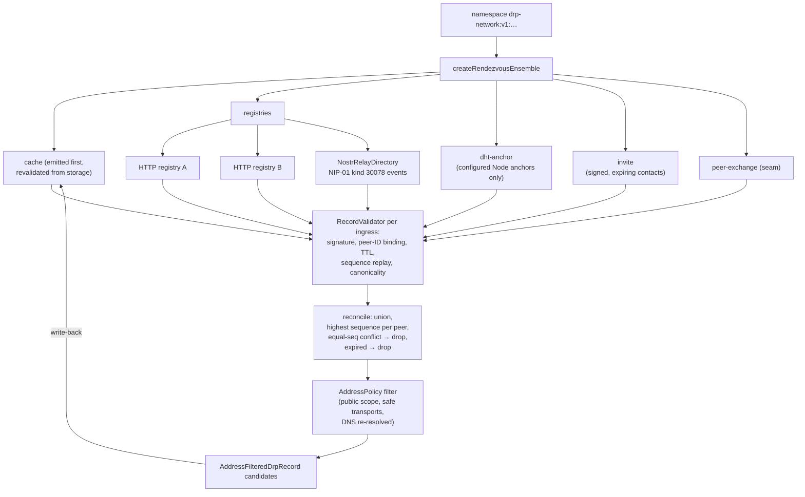
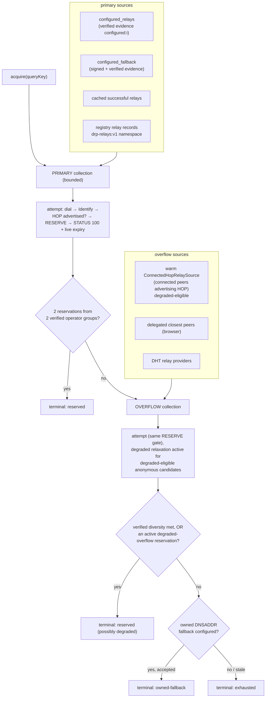
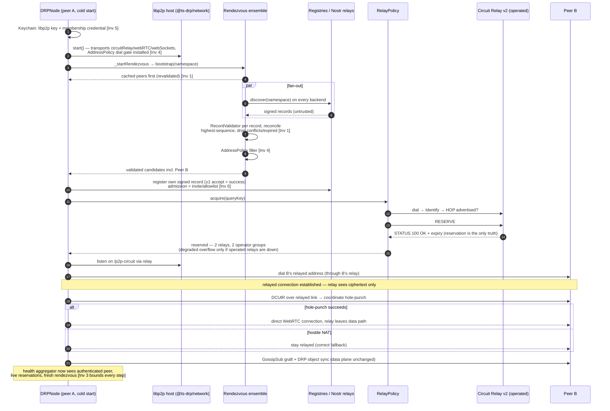

# DRP Modular Network Architecture

This is the steady-state "how it works" reference for DRP's modular network
control plane: **discovery** (rendezvous), **membership** (authorization),
**connectivity** (relay policy), and **health-based recovery**. It replaces the
old design in which two fixed seed multiaddrs were compiled into the network
package and one `bootstrap: true` flag simultaneously meant "seed", "relay
server", and "permanently trusted GossipSub peer".

Audience: contributors changing the network packages, and operators deploying
the stack. For the operator-facing deployment tiers (one-command demo → real
deployment → production posture) see [docs/DEPLOYING.md](./DEPLOYING.md); this
document explains the machinery underneath it. The governing spec is
[PRD/001-modular-architecture.md](../PRD/001-modular-architecture.md); frozen
schema decisions and remaining operator-gated items are in
[PRD/002-phase-0-policy.md](../PRD/002-phase-0-policy.md).

The DRP **data plane** (objects, hash graph, GossipSub message flow) is out of
scope here — it is reused as-is and must keep working through every control-
plane change (PRD 001 §"Out of scope").

---

## 1. Before → after

Before, "the network" was two hard-coded seed multiaddrs (still present as the
legacy path: `BOOTSTRAP_NODES`, `packages/network/src/node.ts:87`). The
reconnect loop asked "am I still connected to one of the configured bootstrap
Peer IDs?" and redialed those exact addresses; bootstrap peers carried a
permanent GossipSub application score of 1000; and `bootstrap: true` both
marked a seed *and* turned on the Circuit Relay v2 server. One operator, one
DNS name, one trust anchor — a single point of failure for discovery,
connectivity, *and* mesh scoring at once.

After PRD 001, no component is privileged. Discovery fans out over independent
rendezvous backends; connectivity is a policy over interchangeable relay
candidate sources; membership is a separate verifier; recovery is driven by a
typed health model instead of a seed-connectivity check. Losing any one
registry, relay, router, region, DNS provider, or operator is a degraded state
with a typed recovery, not an outage.

```mermaid
flowchart TB
    subgraph OLD["Before: coupled fixed-seed design"]
        A1[App peer] -->|dial fixed multiaddrs| S1["Seed 1 + Seed 2<br/>(hardcoded in @ts-drp/network)"]
        S1 -->|"bootstrap:true =<br/>seed + relay server + app-score 1000"| A1
        R1["Reconnect loop:<br/>'connected to seed Peer ID X?'"] --> S1
    end

    subgraph NEW["After: modular control plane"]
        NS[Known namespace] --> RZ["Rendezvous ensemble<br/>registries / Nostr / DHT anchors / cache / invite"]
        RZ --> MV["Membership verifier<br/>(invite / allowlist)"]
        MV --> CC["Validated peer candidates"]
        CC --> DIRECT[Direct dial]
        CC --> RP["Relay policy<br/>reserve on 2 operator-diverse relays"]
        DIRECT --> AUTH[Authenticated peers]
        RP --> AUTH
        AUTH --> GS[GossipSub + DRP objects]
        GS --> UP["DCUtR upgrade to direct WebRTC"]
        HB["Control plane:<br/>typed health + bounded recovery"] -. observes and repairs .-> RZ
        HB -.-> RP
        HB -.-> GS
    end
```

The single point of failure that was removed: **the fixed seed pair as the sole
discovery path, sole relay, sole reconnect target, and permanently trusted mesh
member.** The legacy seed+relay mode still exists as an explicit, de-privileged
policy (`seed: true` + `relay_service.enabled`, no scoring privilege — see
`getGossipSubPeerScoreParams`, `packages/network/src/node.ts:1246`), but nothing
defaults to it.

---

## 2. The six invariants

From PRD 001 §3; each holds in every phase and is enforced by specific code:

| # | Invariant | Enforced by |
|---|---|---|
| 1 | **Routing results never decide authorization.** Every discovery result is an untrusted candidate until DRP membership and the libp2p connection are authenticated. | `RecordValidator.validate` re-verifies every record at every ingress (`packages/rendezvous/src/record.ts:199`); the ensemble revalidates even already-"validated" source output (`packages/rendezvous/src/ensemble.ts:301`); the Nostr envelope is explicitly treated as untrusted transport metadata (`packages/rendezvous/src/nostr.ts:448`); invite issuers are authenticated but *not* authorized (`packages/rendezvous/src/invite.ts:126`); relay candidates are only trusted after a live RESERVE succeeds (`packages/relay-policy/src/index.ts:803`). |
| 2 | **Relay-server mode is not controlled by the bootstrap flag.** | `relay_service.enabled` is its own config key (`packages/types/src/network.ts:342`); `circuitRelayServer` is installed only when it is set (`packages/network/src/node.ts:450`), independent of `seed` and of relay-client policy. |
| 3 | **Every network operation has a deadline, retry cap, cancellation, terminal result, and cleanup.** | `operationDeadline` in the ensemble (`packages/rendezvous/src/ensemble.ts:486`); `withAttemptDeadline` per registry endpoint (`packages/rendezvous/src/registry.ts:1090`); `withDeadline` in relay policy (`packages/relay-policy/src/index.ts:1646`) and Nostr transport (`packages/rendezvous/src/nostr.ts:537`); the recovery coordinator's parent deadline + attempt cap + cleanup evidence (`packages/control-plane/src/index.ts:408`). Terminals are typed (`RelayPolicyResult.terminal`, `RecoveryTerminal`, `RegistryExhaustedError`, `RendezvousExhaustedError`). |
| 4 | **One address-policy owner.** | `AddressPolicy` (`packages/rendezvous/src/address-policy.ts:58`) is the single classifier used by record validation (`record.ts:343`), ensemble result filtering (`ensemble.ts:411`), the libp2p outbound dial gate `denyDialMultiaddr` (`packages/network/src/node.ts:470`), dial-time re-check (`record.ts:311` `recheckAddressesAtDial`), Node routing (`packages/routing-node/src/index.ts:200`), and browser routing (`packages/routing-browser/src/index.ts`). DNS names are resolved and re-classified (rebinding rejection) at evaluation time. |
| 5 | **Two identities per installation.** | Keychain holds a secp256k1 libp2p key and a BLS key (`packages/keychain/src/keychain.ts:23`); the membership credential is a separate config owner (`control_plane.membership`, `packages/types/src/network.ts:142`). See §3. |
| 6 | **Registry acceptance ≠ DRP authorization.** | `AdmissionPolicy` (invite / allowlist / PoW / explicit-opt-in open) is admission mechanics of one backend only (`packages/rendezvous/src/registry.ts:126`); Nostr relays are open-admission and the code says so — the DRP signature embedded in the event, not relay acceptance, is the authority (`packages/rendezvous/src/nostr.ts:169`). |

---

## 3. Two identities

Every installation has **two related but separate identities** (Invariant 5):

1. **The libp2p transport key** — a secp256k1 key from the keychain
   (`packages/keychain/src/keychain.ts:23`). It *is* the Peer ID, secures the
   Noise handshake, and signs the short-TTL rendezvous record (`RecordSigner`,
   `packages/rendezvous/src/record.ts:135`). It proves **freshness and address
   ownership**: "the holder of this Peer ID claims these addresses right now,
   at this sequence number." `RecordValidator` checks that the record's public
   key derives exactly the claimed Peer ID (`record.ts:260`) and that every
   address's terminal `/p2p` component matches it (`record.ts:359`).
2. **The DRP membership credential** — currently an invite token or a peer-ID
   allowlist (`control_plane.membership`, `packages/types/src/network.ts:142`),
   verified by `InviteVerifier` / `AllowlistVerifier`
   (`packages/membership/src/index.ts:35,66`). It proves **authorization**:
   "this peer is allowed in this network." (The keychain's BLS key is a third,
   data-plane key used for DRP object signing — unchanged by this
   architecture.)

Neither substitutes for the other: knowing a valid Peer ID does not admit you,
and holding an invite does not let you impersonate a peer's addresses. The
verifier is constructed by `DRPNetworkNode` from config
(`packages/network/src/node.ts:241`) and exposed as `membershipVerifier`.
**Honesty note:** connection-path enforcement of the membership verifier is a
constructed seam, not yet wired into libp2p connection authentication — the
code says so explicitly (`packages/network/src/node.ts:387`,
`packages/types/src/network.ts:371`). Today membership is enforced at registry
admission (registries reject unadmitted records,
`packages/rendezvous/src/registry.ts:458`) and by the deployment's shared
invite; per-connection enforcement arrives with the remaining rendezvous
integration work.

A third, deliberately *unprivileged* key exists on the Nostr path: the Nostr
transport key (BIP-340). It is derived from the identity key or configured
explicitly, and it is **transport-only** — see §5.

---

## 4. The packages

| Package | Problem it solves | Key exports | Consumed by |
|---|---|---|---|
| `@ts-drp/rendezvous` | Signed, expiring, replay-proof peer records; multi-backend discovery; reconciliation; address policy | `SignedDrpRecordV1`, `RecordSigner`, `RecordValidator`, `RegistryClient`, `RegistryServer`, `RendezvousDirectory`, `createRendezvousEnsemble`, `NostrRelayDirectory`, `createPeerCache`, `encodeInvite`/`decodeInvite`/`InviteDirectory`, `AddressPolicy`, `namespaceCid`/`relayNamespaceCid` | `@ts-drp/node` builds the ensemble (`packages/node/src/index.ts:377`); `@ts-drp/network` uses `AddressPolicy` for the dial gate; the deployable registry service is `service.ts` (`createRegistryHttpService`) |
| `@ts-drp/routing-node` | Amino DHT adapter for Node/Electron: bounded provider lookup, namespace-CID publication, closest-peers walks | `createNodeRouting`, `attachNodeRouting`, `createAminoHostExtensions`, `NodeRouting` (`getClosestPeers`, `provide`, `findPeer`, `waitForRoutingTable`), `OFFICIAL_AMINO_BOOTSTRAPPERS`, `PUBLIC_NETWORK_ACKNOWLEDGEMENT` | `createNodeRuntime` attaches it to the production host when `control_plane.routing.node.enabled` (`packages/node/src/runtime.ts:139`) |
| `@ts-drp/routing-browser` | Delegated Routing V1 for browsers (which cannot run a DHT): bounded HTTP lookups, endpoint failover, address-policy filtering | `createBrowserRouting`, `DelegatedBrowserRouting`, `BrowserRouting`, `PUBLIC_DELEGATED_ROUTING_ACKNOWLEDGEMENT` | `DRPNode` constructs it from `control_plane.routing.browser` (`packages/node/src/index.ts:1272`); requires ≥2 distinct endpoint origins unless the single-endpoint fixture flag is set |
| `@ts-drp/relay-policy` | Circuit Relay v2 client policy: candidate sourcing, HOP verification, reservation lifecycle, operator diversity, transport profiles | `RelayPolicy`, `RelayCandidateSource` + the concrete sources (§6), `CompositeRelayCandidateSource`, `Libp2pRelayClient`, `RELAY_TRANSPORT_PROFILES`, `EvidenceDerivedOperatorGroupClassifier`, `CIRCUIT_RELAY_V2_HOP_PROTOCOL` | `DRPNetworkNode._startRelayPolicy` composes and drives it (`packages/network/src/node.ts:662`) |
| `@ts-drp/membership` | Who is allowed in: invite / allowlist verification (threshold certificates are a typed stub) | `InviteVerifier` (≥16-char token, constant-time compare), `AllowlistVerifier`, `MembershipVerifier`, `constantTimeEqual`, `ThresholdCertificateVerifier` (interface only) | `DRPNetworkNode` builds the verifier from config (`packages/network/src/node.ts:241`); registry admission consumes it (`packages/rendezvous/src/registry.ts:126`) |
| `@ts-drp/control-plane` | Typed health model + one bounded recovery coordinator, replacing "am I connected to seed X?" | `ControlPlaneHealthAggregator`, `ControlPlaneCoordinator`, `RecoveryFault`, `RecoveryTerminal`, `ControlPlaneMechanismPorts`, `SystemControlPlaneScheduler` | `DRPNode._startControlPlaneRecovery` wires it when `control_plane.recovery` is configured (`packages/node/src/index.ts:617`) |

Two integration points tie them together:

- **`@ts-drp/network`** (`DRPNetworkNode`) owns the libp2p host, GossipSub, and
  DRP messaging, and composes relay candidate sources into a `RelayPolicy`
  gated by `control_plane.relay_policy.sources`
  (`packages/network/src/node.ts:662`). Host extension is additive-only:
  control-plane packages add DHT/TCP/routers through `DRPNetworkHostFactory`,
  but reserved core services (pubsub, identify, dcutr, …) cannot be replaced
  (`packages/network/src/node.ts:230,562`).
- **`@ts-drp/node`** (`DRPNode` / `createNodeRuntime`) owns lifecycle: it builds
  the rendezvous ensemble, the peer cache, the invite directory, the record
  publisher, browser routing, the Node routing attachment, and the recovery
  coordinator (`packages/node/src/index.ts:304`,
  `packages/node/src/runtime.ts:99`).

---

## 5. Discovery half — the rendezvous ensemble

How a peer **finds** others, given only an opaque namespace
(`drp-network:v1:<networkId>`, frozen in PRD 002 and enforced at
`packages/rendezvous/src/namespace.ts:7` and `record.ts:12`).

### The record

`SignedDrpRecordV1` (`packages/rendezvous/src/record.ts:31`) is a canonical
JSON payload — namespace, Peer ID, public key, sorted addresses, sorted
capabilities (`drp-gossipsub` required; `webrtc`, `relay-client`,
`relay-hop-v2-service`), monotonic sequence, issue/expiry times — signed by the
libp2p identity key. TTL is bounded to 10 s..5 min by default
(`DEFAULT_RECORD_LIMITS`, `record.ts:109`); expiry is **client-enforced**
everywhere. `RecordValidator` owns shape, size, canonicality, signature,
peer-ID binding, TTL, clock skew, per-peer sequence replay, and address safety
(`record.ts:175`). Publishers advance sequences through a rollback-refusing
`SequenceStore` (`packages/rendezvous/src/record-producer.ts`).

### The directory contract and the ensemble

Every backend implements one seam, `RendezvousDirectory`
(`packages/rendezvous/src/registry.ts:634`): `discover(namespace, signal,
selection?)` and `register(record, signal, credential?)`.
`createRendezvousEnsemble` (`packages/rendezvous/src/ensemble.ts:108`) composes
up to five source categories behind that contract (source IDs at
`ensemble.ts:84`):

- **`registries`** — HTTP registries and/or the Nostr directory. `DRPNode`
  builds this via `createConfiguredRendezvousRegistries`
  (`packages/node/src/index.ts:125`): a `RegistryClient` when ≥2 HTTP endpoints
  are configured, a `NostrRelayDirectory` when ≥1 Nostr relay is configured,
  fanned together by `createCompositeRendezvousDirectory`
  (`packages/rendezvous/src/composite-directory.ts:81`) when both exist.
- **`dht-anchor`** — Node/Electron peers publish the deterministic namespace
  CID to the Amino DHT (`DhtAnchorPublisher`, `registry.ts:932`); browsers
  resolve providers via delegated routing, and only explicitly configured
  anchor Peer IDs are accepted as anchors (`DhtAnchorResolver`,
  `registry.ts:979`). Anchor-resolved records are still untrusted input and are
  revalidated (`ensemble.ts:353`).
- **`cache`** — the bounded authenticated-peer cache (`createPeerCache`,
  `packages/rendezvous/src/peer-cache.ts:74`). Persistent state is treated as
  untrusted on every read: records are re-validated and reconciled before use.
  On restart, cached peers are emitted **first**, before any network source
  responds (`ensemble.ts:165`), giving the restart ordering: cached peers →
  registries/anchors/invite in parallel → peer exchange.
- **`invite`** — a signed out-of-band bootstrap: `encodeInvite`/`decodeInvite`
  (`packages/rendezvous/src/invite.ts:104,134`) carry a namespace, a membership
  capability, up to 8 short-lived signed contact records (public addresses
  only), and a registry endpoint catalog. The issuer signature is
  authenticated; contacts are still validated independently and expire.
- **`peer-exchange`** — a seam for authenticated GossipSub peer exchange
  (`ensemble.ts:51`).

Client behavior on `register`: publish to every reachable backend; success = ≥1
accepts (`registry.ts:709`, `nostr.ts:241`, `composite-directory.ts:53`). On
`discover`/`bootstrap`: query all, validate **every** ingress record with a
fresh validator, then reconcile: union, keep the highest valid signed sequence
per Peer ID, **drop both sides of an equal-sequence conflict**, drop expired
(`reconcileValidatedRecords`, `packages/rendezvous/src/reconciliation.ts:24`).
Surviving records then pass the address policy; accepted results are written
back to the peer cache (`ensemble.ts:199`). Every operation runs under one
bounded deadline and produces a sanitized trace (`RendezvousEnsembleTrace`,
`ensemble.ts:61`) that later feeds health.

### The Nostr backend (the §7 infra-independent path)

`NostrRelayDirectory` (`packages/rendezvous/src/nostr.ts:172`) implements the
same `RendezvousDirectory` contract over public Nostr relays — the
infra-independent, open-admission discovery path from PRD 001 §7. Records are
embedded in NIP-01 **addressable events** (kind `30078`, NIP-78,
`nostr.ts:24`): the `d` tag is a hash of `(namespace, peerId)` so each peer has
one replaceable record per namespace (`nostr.ts:463`), an `n` tag carries the
namespace for query filtering, and a NIP-40 `expiration` tag is advisory —
**clients enforce expiry themselves** through the embedded record's
`expiresAtMs`. The WebSocket transport lives in
`packages/rendezvous/src/nostr-transport.ts` (`createNostrWebSocketRelayFactory`);
production relays must be `wss:` (`nostr.ts:503`).

Key security property: **the Nostr key is transport-only** (`NostrSigner`,
`nostr.ts:76` — "It is never consulted for DRP authorization"). It only makes
the relay accept the event. Authorization and authenticity come from the
embedded DRP record signature, which every reader re-validates
(`nostr.ts:382`). By default the transport key is derived from the identity key
with a domain separator, or set via `control_plane.rendezvous.nostr.secret_key`
(`packages/node/src/index.ts:168`). Because relays are open-admission, one
relay can be spammed into its response byte/record caps — the code documents
that independent relays are the fallback for that (`nostr.ts:393`).

Configuration: `control_plane.rendezvous`
(`packages/types/src/network.ts:191`) — endpoints, nostr relays, namespace,
publish/TTL/refresh cadence, peer cache, invite. Activation logic is in
`DRPNode._startRendezvous` (`packages/node/src/index.ts:377`): public backends
additionally require `rollout.public_components.public_rendezvous.enabled`.

---

## 6. Connectivity half — the relay policy

How a peer **connects** when it cannot dial directly. Browsers have no public
listening socket, so browser↔browser always needs a broker for first contact:
**Circuit Relay v2** for the initial relayed connection, then **DCUtR** over
that relayed link to coordinate a hole-punch and upgrade to **direct WebRTC**.
The relay is a *matchmaker and fallback, not a downgrade* — after the upgrade
it leaves the data path; where NAT is hostile, staying relayed beats
disconnection (see DEPLOYING.md "How browser-to-browser WebRTC actually
works").

### Candidate sources

Everything implements `RelayCandidateSource`
(`packages/relay-policy/src/index.ts:35`) and yields `RelayCandidate`s with
typed provenance (`packages/relay-policy/src/types.ts:43`). The sources:

| Source | Provenance | Tier | Notes |
|---|---|---|---|
| `ConfiguredPublicRelaySource` (`index.ts:328`) | `configured-relay`/`configured` | primary | Parses `control_plane.relay_policy.sources.configured_relays` multiaddrs; stamps **verified** operator evidence `configured:<i>` per distinct peer — operator-configured, so the operator vouches for it |
| `ConfiguredFallbackRelaySource` (`index.ts:674`) | `configured-fallback`/`configured` | primary | Signed owned-relay records + `VerifiedRelayOperatorEvidence` — the "owned relay floor"; injected via `DRPNetworkNodeDependencies` |
| `CachedSuccessfulRelaySource` (`index.ts:632`) | `cached-relay`/`peer-cache` | primary | Fresh `drp-relays:v1:` records from the authenticated cache |
| `RegistryRelayRecordSource` (`index.ts:595`) | `registry-relay-record`/`registry` | primary | Relays publish themselves to the rendezvous backends under the separate relay namespace; only unexpired records with the `relay-hop-v2-service` capability qualify |
| `ConnectedHopRelaySource` (`index.ts:254`) | `node-connected-hop`/`connected-peers` | overflow, **degraded-eligible** | **Warm discovery**: harvests already-connected peers whose Identify shows `/libp2p/circuit/relay/0.2.0/hop` — no DHT walk at all (§8 finding) |
| `BrowserRoutingClosestPeersSource` (`index.ts:383`) | `browser-closest-peers`/`delegated-routing` | overflow | Delegated Routing V1 closest-peers for browsers |
| `DhtRelayProviderSource` (`index.ts:720`) | `dht-relay-provider` | overflow | Providers of the deterministic relay-namespace CID |
| `NodeRoutingClosestPeersSource` (`index.ts:212`) | `node-closest-peers`/`public-dht` | — | **Exported but not wired into any production relay policy.** The cold `getClosestPeers` DHT walk it performs was measured at ~0 results under DRP's conservative Amino tuning (phase-06); production replaced it with the warm source above |

All discovery-derived sources stamp `operatorGroup: "unknown"`. **Only
operator-configured sources ever carry verified evidence** — that is what makes
the diversity requirement Sybil-resistant: an attacker can spin up a thousand
relays, but they all land in the single unverified bucket
(`verifiedOperatorGroup`, `index.ts:1850`). `EvidenceDerivedOperatorGroupClassifier`
(`index.ts:774`) can upgrade a candidate only through a deployment-owned
verifier; the default production wiring injects a verifier that always returns
`{verified: false}` (`packages/network/src/node.ts:1082`), so advertisements
can never mint diversity.

### Composition and acquisition

`DRPNetworkNode._startRelayPolicy` (`packages/network/src/node.ts:662`) builds
a `CompositeRelayCandidateSource` (`packages/relay-policy/src/index.ts:438`)
from the config-gated entries (`node.ts:686`): primary = configured public
relays, configured fallback, cached, registry records; overflow = delegated
closest peers, the warm node-overflow source (the only entry flagged
`degradedOverflowEligible: true`, `node.ts:728`), DHT relay providers. Each
entry is enabled only if its config toggle is on **and** an implementation was
injected — enabling a source without injecting it fails closed at start
(`node.ts:857`). Public overflow tiers additionally require
`rollout.public_components.public_relay_overflow.enabled` (delegated/DHT) or
the node-overflow gate (`_nodeClosestPeersEnabled`, `node.ts:847`:
`node_closest_peers.enabled` + node routing enabled + `network:"public"` +
delegated-routing rollout flag).

`RelayPolicy` (`index.ts:840`) is the single owner of acquisition, refresh,
replacement, diversity, fallback, and terminal cleanup. Defaults
(`DEFAULT_RELAY_POLICY_LIMITS`, `index.ts:193`): hold **2 reservations** from
**2 distinct operator groups**, max 1 per group, 5 s total deadline (raised to
55 s when the node overflow tier is enabled, `node.ts:231`), 1 s per candidate,
refresh 30 s before expiry.

Acquisition (`#collectAndAcquire`, `index.ts:1044`) is two-phase when a
degraded-eligible overflow tier exists: collect **primary** candidates (bounded
by a 5 s primary-phase deadline, `index.ts:107`), attempt reservations; if the
verified requirement is met, stop. Only then collect **overflow** candidates
and attempt again with the degraded relaxation active. For each candidate
(`#attemptCandidate`, `index.ts:1236`): pick an address matching the transport
profile → dial → Identify → require the HOP protocol
(`/libp2p/circuit/relay/0.2.0/hop`, `packages/relay-policy/src/protocol.ts:1`)
→ send RESERVE → require `STATUS = 100 (OK)` with a live expiry
(`decodeRelayReservationResponse`, `index.ts:803` — "protocol support is not
acceptance"). Advertising HOP is never counted as success. The wire mechanics
(circuit listener bookkeeping, HopMessage decode) live in `Libp2pRelayClient`
(`packages/relay-policy/src/libp2p-client.ts:49`); `refresh` re-issues RESERVE
(`libp2p-client.ts:165`), `release` closes listeners and hangs up.

Lifecycle around the policy (`packages/network/src/node.ts`): the initial
acquire runs at start (`node.ts:786`); a refresh timer fires before the
earliest expiry (`node.ts:1009`); a `peer:disconnect` of a reserved relay
triggers `replace(...)` with the lost relay's operator group excludable
(`node.ts:774`); reservation lifecycle events are emitted as sanitized
telemetry (hashed relay IDs, `node.ts:752`).

Transport profiles (`RELAY_TRANSPORT_PROFILES`, `index.ts:92`):
`broadBrowser` (wss, webtransport, webrtc-direct — the default), `node` (adds
tcp and quic-v1; selected when the node overflow tier or non-browser
`configured_relays` are active, `node.ts:674,764`), and `wssOnly`.

An optional owned **DNSADDR fallback** (`DnsaddrFallback`, injected as
`relayFallback`) is tried only after public candidates are exhausted, within
its own budget (`index.ts:1452`) — public relays are tried *before* the owned
fallback, never instead of it.

### The node overflow tier (§7) and the degraded-diversity relaxation

The connectivity half of "boot on public infrastructure" was investigated in
`specs/public-only-bootstrap/reviews/phase-04.md` … `phase-08.md`:

- **Phase 04:** the canonical `*.bootstrap.libp2p.io` nodes are browser-
  reachable with valid certs and advertise HOP, but return
  `RESERVATION_REFUSED` (status 200) to strangers — they are **discovery seeds,
  not relays**.
- **Phase 05:** the *dynamic* tier is real: DHT-discoverable AutoTLS
  `*.libp2p.direct` relays **do** grant reservations to DRP's pinned libp2p
  stack, with browser-usable `/tls/ws`, `/webrtc-direct`, `/webtransport`
  circuit addresses.
- **Phase 06:** DRP's own cold `getClosestPeers` walk found **0** candidates —
  root-caused to the deliberately conservative public Amino tuning
  (`alpha:1, disjointPaths:1`) starving iterative queries below the operation
  guard, not to a broken mechanism.
- **Phase 08:** the throttle is an **artifact of the cold-walk approach**:
  harvesting HOP-advertising peers from the *already-connected* peer set is
  alpha-independent, and native libp2p discovery obtained a live public
  reservation in **~3.6 s** at DRP's exact DHT tuning. Recommendation (b) —
  keep DRP's policy engine authoritative but source candidates from the warm
  set — is what shipped.

Production wiring today (`packages/node/src/runtime.ts:117`): when
`node_closest_peers.enabled` is set on a public Node runtime, the runtime
injects a **`ConnectedHopRelaySource`** over the live host connections as the
`nodeClosestPeers` source — the warm harvest, not a DHT walk. A warm re-arm
listener (`_armWarmRelayAcquisition`, `packages/network/src/node.ts:808`)
watches `peer:identify` events and, when a HOP-advertising peer connects while
the policy is unreserved, retries acquisition with exponential backoff (≤8
attempts) — so relays discovered *after* startup are picked up. The Amino DHT
(attached with a raised 45 s closest-peers timeout and an isolated windowed
request budget for public walks, `runtime.ts:26`,
`packages/routing-node/src/index.ts:296`) supplies the *population* of
connected public peers for the harvest to find. The libp2p-native
`circuitRelayTransport` is installed with zero options and the default listen
set includes `/p2p-circuit` (`packages/network/src/node.ts:532,510`), so native
discovery machinery is technically armed — but DRP's own policy is the
authoritative reservation path; the native transport is not how DRP acquires
relays.

**The degraded-diversity relaxation (phase-07 decision).** Public
DHT/warm-discovered relays are anonymous — the classifier returns `"unknown"`
for all of them, and `#requirementsMet` counts only verified groups
(`index.ts:1475`). Without a relaxation, the overflow tier could reserve one
working relay yet be reported "failed" forever, and every disconnect would
trigger another expensive re-walk chasing a structurally unreachable target.
The recorded decision: **accept anonymous relays as a degraded best-effort
fallback, overflow-only, only when operated relays are unavailable.**
Mechanics:

- Only composite entries flagged `degradedOverflowEligible` can produce
  degraded candidates; in production that is exactly the warm node-overflow
  entry (`packages/network/src/node.ts:728`). Browser delegated routing and DHT
  provider sources are **not** flagged.
- Eligibility is tracked per candidate during overflow collection only
  (`index.ts:1081`), and only candidates that are anonymous — `operatorGroup
  === "unknown"` **and** no operator evidence at all — qualify
  (`isAnonymousOverflowCandidate`, `index.ts:1865`). A candidate that *claims*
  evidence does not get the relaxed per-operator cap.
- With the relaxation active, the tier may hold more than one `"unknown"`
  relay, and `#requirementsMet(allowDegradedOverflow=true)` treats an active
  degraded-overflow reservation as a (degraded) success (`index.ts:1483`) —
  stopping the re-walk churn.
- The primary phase always runs first with the relaxation **off**
  (`index.ts:1070`), so verified operated relays always win when reachable, and
  the degraded state cannot leak into the verified/primary/browser paths.

The security tradeoff, stated plainly (phase-07): an attacker running many
anonymous relays could occupy both slots in the degraded state and observe
connection **metadata**, censor, or eclipse the peer's connectivity. That is
accepted because (1) it engages only when the alternative is no connectivity at
all, (2) DRP data remains authenticated end-to-end — a relay cannot read or
forge objects, so the cost is metadata privacy and censorship-resistance in the
fallback, not data integrity or membership, and (3) it is opt-in and off by
default. Operators who need the stronger property run ≥1 (ideally ≥2) operated
relays as the verified floor.

---

## 7. End-to-end boot & connect flow

A cold browser (or Node) start through the modular stack. Invariant numbers in
brackets.

Steps 3–8 are `DRPNode.start` → `_startRendezvous` → `_warmRendezvous`
(`packages/node/src/index.ts:304,377,546`); 10 is the registration
`IntervalRunner` refreshing the signed record each `refresh_interval_ms`
(`index.ts:484`); 11–14 are `_startRelayPolicy` + `RelayPolicy.acquire`; DCUtR
is the `dcutr` core service (`packages/network/src/node.ts:433`).

---

## 8. Health-based recovery

The old loop asked "am I connected to bootstrap Peer X?" — which proves nothing
about rendezvous freshness, reservations, or data-plane health. The replacement
has two parts, wired in `DRPNode._startControlPlaneRecovery`
(`packages/node/src/index.ts:617`) when `control_plane.recovery` is set (the
legacy interval-reconnect runner is suppressed in that case,
`index.ts:902`):

1. **Typed health.** `ControlPlaneHealthAggregator`
   (`packages/control-plane/src/index.ts:78`) folds authenticated-DRP-peer
   presence, object synchronization, rendezvous freshness/replica counts and
   per-backend states (from the ensemble trace), healthy-backend count, live
   reservation count, direct-vs-relayed traffic, mesh diversity, failed
   recovery attempts, and router failures into an immutable snapshot with a
   `healthy | degraded | recovering` state and stable reason codes
   (`index.ts:18`). A healthy authenticated mesh stays healthy even if a seed
   disconnects.
2. **One bounded coordinator.** `ControlPlaneCoordinator` (`index.ts:367`)
   observes snapshots, classifies a typed `RecoveryFault`
   (`classifyObservedFault`, `index.ts:970`), and runs exactly the PRD 001 §6
   recovery table (`#planFor`, `index.ts:647`): registry A fails → continue
   B/C and cool A down; all registries fail → DHT anchors + cache + signed
   invite (registries are still re-attempted — they recover); router fails →
   alternate router or registry records; relay disconnects → replace with a
   different operator group; direct connection fails → continue relayed; DHT
   unavailable → registries remain primary; peer disappears → sync from another
   authenticated peer; everything unavailable → preserve local state + bounded
   retry.

Every recovery runs under **one parent deadline** with a max-attempt cap,
bounded retry delays, typed terminals (`RecoveryTerminal`: succeeded / failed /
exhausted / deadline / aborted), and **cleanup evidence** — the coordinator
samples its scheduler's pending-timer count and reports `cleanup: failed` if
timers leaked (`cleanupEvidence`, `index.ts:901`). That is Invariant 3 applied
to recovery itself. Mechanisms are injected as `ControlPlaneMechanismPorts`
(`index.ts:281`) so the coordinator owns policy, never transport.

---

## 9. Infra-independence (§7) summary

Can a DRP network boot with **zero DRP-operated servers**? The honest answer,
grounded in the phase-04…08 evidence:

- **Discovery: yes.** Public Nostr relays are open-admission signed-record
  stores that fit the rendezvous contract; the `grid-public-infra` E2E has two
  real browsers discover each other over `relay.damus.io` / `nos.lol` and
  converge grid state across Chromium/Firefox/WebKit (DEPLOYING.md, "Infra-
  independent discovery via Nostr"). Security holds because the Nostr envelope
  is untrusted transport and only the embedded DRP signature authorizes a
  record.
- **Connectivity: best-effort only.** Browser-usable public Circuit Relay v2
  relays that grant reservations to strangers exist (phase-05), and the shipped
  warm connected-HOP overflow tier can reserve on them quickly (the warm-set
  harvest mechanism was measured at ~3.6 s to a live public reservation in
  phase-08). But public relays are **ephemeral and untrusted**: they churn,
  fill reservation pools, impose data/duration limits, and are anonymous — so
  they live behind the degraded-diversity relaxation, overflow-only. The
  canonical IPFS bootstrappers are discovery seeds, not relays (phase-04); the
  `OFFICIAL_AMINO_BOOTSTRAPPERS` set
  (`packages/routing-node/src/constants.ts:12`) exists to give the DHT a
  population to work with, not to relay traffic.

Operational bottom line (unchanged from DEPLOYING.md): run **≥1 — ideally ≥2
operator-diverse — relays you or a partner operate** as the dependable
connectivity floor; treat public relays as the "floor is gone" fallback. Full
production resilience (≥3 independent registry operators, ≥2 delegated routing
endpoints, campaign sign-off) is the operator-gated OPEN half of PRD 002.

---

## 10. Configuration reference — `control_plane.*`

The typed surface an operator sets (`ControlPlaneConfig`,
`packages/types/src/network.ts:298`). Everything is off unless configured;
public components additionally need their rollout flag.

| Key | What it does | Ground truth |
|---|---|---|
| `rendezvous.namespace` | Opaque `drp-network:v1:<id>` namespace this peer publishes/discovers under (required when rendezvous is active) | `types/src/network.ts:197`, `node/src/index.ts:392` |
| `rendezvous.endpoints` | HTTP registry URLs; **≥2 required** for the HTTP directory to activate | `node/src/index.ts:132` |
| `rendezvous.nostr.{relays,publish,secret_key}` | Nostr relay catalog, publish toggle, optional explicit 32-byte transport key (hex) | `types/src/network.ts:198`, `node/src/index.ts:149` |
| `rendezvous.publish`, `record_ttl_ms`, `refresh_interval_ms` | Signed-record publication and its cadence (TTL default 60 s, refresh default TTL/2, refresh must be < TTL) | `node/src/index.ts:459` |
| `rendezvous.cache` | Authenticated-peer cache: `{enabled, max, persistence: memory \| browser-local(key) \| node-fs(path)}` | `types/src/network.ts:178`, `node/src/index.ts:512` |
| `rendezvous.invite` | Encoded signed invite (out-of-band bootstrap; also contributes registry endpoints) | `node/src/index.ts:408` |
| `routing.node.{enabled,network,bootstrappers,public_network_acknowledgement}` | Amino DHT attachment for Node/Electron; `network:"public"` requires the explicit acknowledgement string and the delegated-routing rollout flag | `runtime.ts:63`, `routing-node/src/index.ts:29` |
| `routing.browser.{endpoints,limits,allow_single_endpoint_fixture}` | Delegated Routing V1 endpoints; ≥2 distinct origins unless the fixture flag is set | `node/src/index.ts:1272` |
| `relay_policy.target_reservations` | Required reservation count and operator-group count (1..8; default 2) | `network/src/node.ts:681` |
| `relay_policy.sources.configured_relays` | Public relay multiaddrs used directly as primary candidates (verified `configured:<i>` groups) | `types/src/network.ts:217`, `relay-policy index.ts:328` |
| `relay_policy.sources.configured_fallback` | Toggle for the injected signed owned-relay source | `network/src/node.ts:694` |
| `relay_policy.sources.{cached_successful_relays, registry_relay_records}` | Primary-tier toggles (implementations injected via `DRPNetworkNodeDependencies.relayCandidateSources`) | `network/src/node.ts:703,711` |
| `relay_policy.sources.{delegated_closest_peers, dht_relay_providers}` | Public overflow toggles; also require `rollout.public_components.public_relay_overflow` | `network/src/node.ts:719,735` |
| `relay_policy.sources.node_closest_peers` | The node overflow tier (warm connected-HOP source; raises policy deadline to 55 s and closest-peers timeout to 45 s); requires public node routing + delegated-routing rollout flag | `network/src/node.ts:847`, `runtime.ts:117` |
| `address_policy.{target, allowPrivate, allowLoopback, allowInsecureWebSocket, resolver}` | The single address-policy owner for validation and outbound dials; loopback/plaintext allowances are fixture-only | `types/src/network.ts:134`, `network/src/node.ts:459` |
| `membership` | `{mode:"invite", invite:{inviteToken}}` or `{mode:"allowlist", allowlist:{allowedPeerIds}}` | `types/src/network.ts:142`, `network/src/node.ts:241` |
| `recovery.{max_attempts, parent_deadline_ms, backend_cooldown_ms, retry_delays_ms, health_poll_interval_ms, recovery_backoff_ms, startup_grace_ms}` | Enables the health coordinator and bounds every recovery | `types/src/network.ts:275`, `control-plane/src/index.ts:808` |
| `rollout.public_components.{public_rendezvous, public_relay_overflow, delegated_routing, pubsub_behavior_rewards}` | Kill switches for each public component, independently | `types/src/network.ts:267` |
| `rollout.owned_fallback.*` | May only be `enabled: true` — **owned fallback cannot be disabled by config** (the kill switches cannot take the floor down) | `network/src/node.ts:950` |
| `pubsub_scoring.{ip_colocation, observed_behavior_reward}` | Re-enable IP-colocation penalties; optional bounded authenticated-behavior app score (capped below the accept-PX threshold; fails closed) | `types/src/network.ts:244`, `network/src/node.ts:920` |
| `observability.sink` | Receives the sanitized typed `ControlPlaneEvent` stream (hashed IDs, no raw addresses) | `types/src/network.ts:84,301` |

---

## 11. Security model

- **Untrusted routing (Invariant 1).** No registry, relay, router, DHT node,
  cache file, or invite can inject an authorized peer. Discovery output is
  candidates; authenticity is the record signature checked at every ingress;
  authorization is membership; addresses are policy-checked at validation *and*
  re-checked at dial time. Compromising a rendezvous backend lets an attacker
  censor or omit records on that backend (mitigated by fan-out and
  reconciliation) — not forge them (signatures), not roll them back
  (highest-sequence wins; equal-sequence forks drop both sides), not keep them
  alive (client-enforced expiry).
- **Two identities (Invariant 5).** Transport key ≠ membership credential; the
  Nostr transport key is a third, authorization-free key. Enforcement caveat:
  connection-path membership verification is a built-but-not-yet-wired seam
  (§3) — today it binds at registry admission and deployment configuration.
- **Operator diversity is evidence-derived.** Diversity counts only
  cryptographically attributable operator groups, and only operator-configured
  sources stamp verified evidence — advertisement can never manufacture
  diversity (anti-Sybil, PRD 001 §6 risk table).
- **The degraded-diversity tradeoff is explicit and bounded.** Anonymous public
  relays are accepted overflow-only, opt-in, only when operated relays are
  down. What is conceded in that state is connection **metadata** privacy and
  censorship-resistance; what is *not* conceded is data integrity, data
  confidentiality against the relay, or membership — the data plane's
  end-to-end authentication is unchanged (phase-07).
- **Data plane unchanged.** DRP objects, hash-graph verification, and GossipSub
  message signing work exactly as before this architecture; existing
  authenticated meshes keep operating through total control-plane outage
  (PRD 001 §2 objective), with local state preserved and bounded retries
  (`control-plane/src/index.ts:704`).
- **Telemetry is sanitized by type.** `ControlPlaneEvent` carries outcomes,
  scopes, transports, and hashed identifiers only
  (`packages/types/src/network.ts:83`); raw addresses and namespaces are kept
  out of durable telemetry by construction.

## Pointers

- [PRD/001-modular-architecture.md](../PRD/001-modular-architecture.md) — the
  spec, phases, release gates, §7 optional tracks.
- [PRD/002-phase-0-policy.md](../PRD/002-phase-0-policy.md) — frozen
  record/namespace schema; OPEN operator decisions.
- [specs/public-only-bootstrap/reviews/](../specs/public-only-bootstrap/reviews/)
  — phase-04 (canonical bootstrappers refuse reservations), phase-05 (dynamic
  AutoTLS relays grant them), phase-06 (cold-walk root cause), phase-07
  (degraded-diversity decision & tradeoff), phase-08 (warm connected-set
  discovery).
- [docs/DEPLOYING.md](./DEPLOYING.md) — operator tiers: local demo, real
  deployment, production posture, Nostr profile, FAQ.
