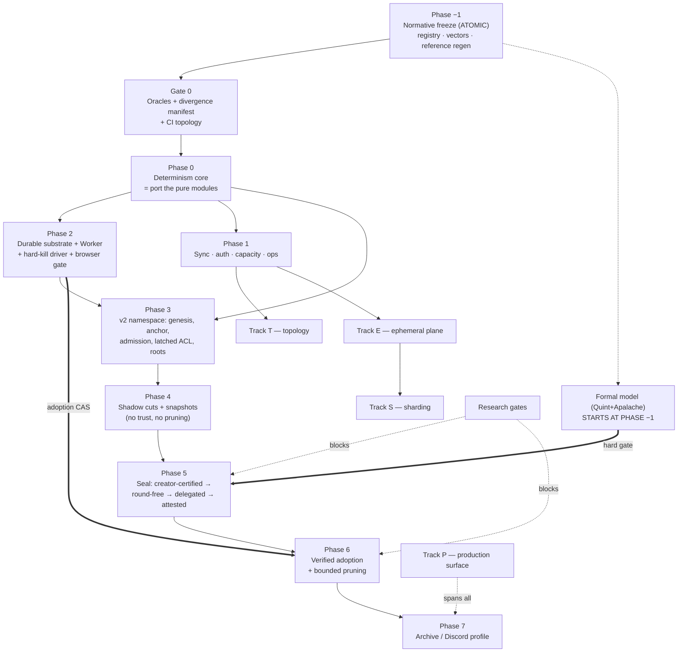

# ts-drp-1 Production Hardening — Final Phased TDD Implementation Plan

**Status:** build plan — supersedes `production-hardening-tdd-plan.md` (round 1)
**Baseline:** `bf7d3516f6ed4be97a755698b4fb3a404e04dc0f` (`main`) — exactly the AHE v4 review baseline, zero drift
**Goal:** take `ts-drp-1` from a research-grade signed operation-DAG to a production library capable of running an **MMORPG** or a **Discord-like chat at scale** — browser-first, hostile participants, churny NAT'd swarms.

**Compaction decision (changed this round): implement Attested Hard Epochs v4 directly.** AHE v4 is the
specification, its reference implementation is the starting code, its wire formats are the wire formats, and
its §23 acceptance checklist is our checklist. Where the spec and its reference disagree, or where either is
incomplete, we **amend AHE v4 in-repo and regenerate the reference from the amendment** — we do not defer.

This plan synthesizes round 1, the six source documents, and a **twelve-agent adversarial review**
(4× Opus-xhigh, 3× GPT-5.6-Sol-max, 2× Grok-4.5, 3× Kimi-K3), plus first-hand verification runs on this
machine. Where reviewers contradicted the source documents or each other, the code was re-read directly and
the correction is folded in with its evidence.

---

## 0. What changed, and what is now established fact

### 0.1 Evidence produced on this machine (not inherited)

Round 1 declined direct adoption largely because the reference was "untyped JS outside the workspace with
browser gates self-reported blocked." Both halves were tested here:

| Check | Command | Result |
|---|---|---|
| Reference test suite | `node --test test/core.test.mjs` in `reference-implementation/` | **22/22 pass, 287 ms** |
| Reference size | `wc -l src/*.js` | **2,379 LOC across 13 modules** (round 1's "~3,400" counted tests + browser harness) |
| Browser gate, Chromium | AHE `browser/harness.html` under this repo's Playwright 1.51.1 | **PASS** — 3/3 checks, `elapsedMs 170.3` |
| Browser gate, Firefox 135 | same | **NO VERDICT — silent hang** |
| Browser gate, WebKit 605 | same | **NO VERDICT — silent hang** |
| Repo persistence infra | `grep -rl "indexedDB" packages` | **zero matches** |
| Repo Worker infra | `grep -rl "new Worker(" packages` | **zero matches** |
| CI shape | `.github/workflows/` | 17 workflows, **all `runs-on: ubuntu-latest`**, most `timeout-minutes: 10`; `network-spike-public.yml` is 360 min (precedent for long jobs) |

The bundle's own `evidence/chromium-browser-validation.json` records `net::ERR_BLOCKED_BY_ADMINISTRATOR`,
`verdict: "blocked"`, with the note *"the managed Chromium policy in this execution environment blocks all
navigation."* That was environmental — but running it properly produces a **worse and more useful** result
than "untested":

**Two of the three engines in AHE §21.5's own required release matrix produce no verdict at all — and the
harness is structurally incapable of telling you so.**

The root cause is a **race in the harness, not a defect in the engines.** On both Firefox and WebKit
`isSecureContext`, `crypto.subtle`, `indexedDB` and `navigator.locks` are all present, and `import()` of
`canonical.js` (7 exports) and `indexeddb-store.js` (4 exports) both succeed on the main thread.
`browser-tests.js:29-33` posts `{run:true}` **immediately** after `new Worker("./worker.js",{type:"module"})`,
but the worker's module graph — five imports plus a **top-level `await` in `ct-merkle.js:3`** — has not yet
installed `self.onmessage` (`worker.js:33`). Chromium happens to queue the message; Firefox and WebKit drop
it, and the worker waits forever. **Delaying the post by 3 s makes both browsers pass the full compute
payload** (Firefox: encode 41 ms, merkle 87 ms; WebKit: encode 44 ms, merkle 80 ms). The standalone IDB
vote-CAS also passes on both.

The damage is done by the missing timeout: `workerResponsiveness()` awaits a promise whose only settle paths
are `onmessage` and `onerror`. With neither firing, `run()` never completes, `document.body` is never
written, and the page sits at `running…` forever. **The harness can report PASS; it cannot report FAIL for
this class.** A hang is indistinguishable from "still running."

Two things follow. The directive's premise is confirmed — the matrix is executable here and Chromium is green
end-to-end including the IDB stage/commit path. And the reference's browser story was **never actually
validated cross-browser**: its static `browser_surface_audit.py` "pass" coexisted with a fatal cross-browser
runtime bug. Static audits are not browser gates.

This yields the rule that governs every gate below:

> **An inherited gate is not a gate until it has been observed going red for the right reason, in this
> repo's CI, on every engine in the matrix.**

### 0.2 The inherited-evidence problem is larger than the browser gate

The AHE §22 headline numbers — 5,231 exhaustive DAGs, 10,000 randomized epochs, 20,000 delivery
permutations, 11,612 quorum-pair checks — come from **standalone Python scripts that never execute the JS
reference** (`model/validate_epoch_model.py`, `model/validate_seal.py`; stdlib-only imports, their own
`kahn_order`, their own `fold_epoch`, their own digest). They validate a Python model against itself.
`reference-implementation/package.json` runs `"model"` (Python) and `"test"` (JS) as separate scripts with
no shared vectors — and **there are no golden vectors anywhere in the bundle**; all 22 JS tests compute
their expectations at runtime.

The only executable evidence against the reference *code* is those 22 tests, and
`evidence/node-coverage.log` lists **11 of 13 modules** — `indexeddb-store.js` and `runtime.js` have **zero
executed coverage**. Those are precisely the crash-critical modules.

Consequently: **no AHE number is a gate in this plan.** Every §21/§22 claim is re-derived by TS-driven
enumerators that drive both engines over shared, checked-in vectors.

### 0.3 Corrections to round 1 (verified against source at `bf7d351`)

Round 1's evidence table is otherwise accurate — every `file:line` spot-checked by three independent
reviewers resolved correctly. These are the exceptions, and they change what gets built:

1. **"`FETCH_STATE` snapshots cross the wire unauthenticated" is stale.** `fetchStateResponseHandler`
   (`packages/node/src/handlers.ts:196-209`) **never adopts** network state — the code says so explicitly:
   *"Network-provided ACL/DRP state snapshots are never adopted… Either way the state is dropped."*
   `DRPObject.setACLState` and `merge(_, rootACLState)` both throw on root-ACL adoption. Genesis authority
   is derived locally from the creator-bound object id, so there is **no authority-takeover to fix**.
   What remains is the *responder* (`handlers.ts:153-168`), which still calls `getStates()`, serializes the
   full snapshot and ships it to a peer that discards it — a free **amplification-DoS**, cheap to request,
   `O(state-bytes)` of CPU and egress on the victim. Different fix, different phase, much smaller.
2. **Hash-framing endianness is not in conflict.** Spec §4.2 and `hash.js` are *both* big-endian for the
   framing integers. The real divergence is the **canonical typed-array profile**: spec §4.1 mandates
   little-endian, `canonical.js:76-79,117-136` encodes big-endian.
3. **`blueprintDigest` is already in the reference's cut descriptor** (`protocol.js:142,165`). It is missing
   from the reference's **anchor** (`protocol.js:176-201`) and **snapshot payload** (`snapshot.js:102-104`).
   Round 1 listed it as simply "omitted."
4. **The invalid-hash FIFO is memory-bounded.** `MAX_KNOWN_INVALID_VERTEX_HASHES = 10_000` with
   evict-oldest (`drp-applier.ts:34,282-289`). Rotation does not exhaust memory; it flips evicted invalid
   *parents* back to `missing`, driving `recoverMissingSync` re-request churn. The gate must assert
   **re-request rate**, not megabytes — as written it passes trivially.
5. **Wall-clock invalidity is not "permanent poisoning."** A rejected vertex is not in the graph
   (`drp-applier.ts:198`), so redelivery re-runs validation with a fresh clock. The real bug is worse in a
   different way: timestamp failures are classed `invalid`, never `missing`, so they are **dropped, not
   re-requested** — two honest replicas at different clock offsets converge to different graphs and
   **never repair**. Live silent divergence, independent of compaction.
6. **`perf-contracts.test.ts` is green today**, not RED (8/8 pass, ~167 ms; budgets 4.3/4.8/3.0/52.8 ms vs
   limits 200/200/200/1000 ms). The `describe(... RED until optimized)` label is stale. Round 1's Phase 1a
   says "extend the RED perf-contracts pattern" — there is no sync-compare perf test to extend; it is net-new.
7. **`benchmark.yml:88` and `benchmark-memory.yml:64` both set `fail-on-alert: false`**, and the PR
   benchmark job is `continue-on-error`. Round 1 wires the Phase-6 memory-slope gate — the single most
   important economic proof in the program — into workflows engineered never to block anything.
8. **The global coverage gate cannot catch the failure it exists to catch.** `scripts/coverage.ts:4`
   enforces one summed 70% line threshold; a module at zero coverage passes if everything else covers.
   That is exactly how the bundle shipped "91.71%" while excluding its two crash-critical modules.
9. **`runtime.js` is imported by nothing** — `browser/worker.js:1-5` imports five *other* modules. The
   bundle's "Worker responsiveness" evidence executes different code than the module it appears to validate.
10. Round 1's own doc-corrections stand and are confirmed: the "insertion-sensitive DFS" claim is stale
    (`hashgraph/index.ts:318` `.sort()`s forward edges — target **origin**-sensitivity); the AEC contraction
    counterexample uses non-antichain deps; `@chainsafe/bls ^8.1.0` is already a production dependency of
    `object` and `keychain` (via `@chainsafe/bls/herumi`, the WASM backend — so AHE §2.2's
    "avoid a BLS/WASM dependency" rationale is *doubly* stale).

### 0.4 The verdict, restated

Implementing AHE v4 directly is the right call, and the reference is a genuine asset — but "directly" means
**freeze first, then port**, never "transliterate the reference." Three of its modules are safe to port
nearly as-is; two must be *rewritten* rather than ported; and the protocol has four genuine gaps that must
be closed as normative amendments before any consensus byte is written:

| # | Gap | Resolution (Phase −1) |
|---|---|---|
| G1 | No single frozen encoding. Spec recommends CBOR + LE typed arrays; the reference is a proprietary tag codec + BE. Several consensus objects have **no normative preimage at all**. | One frozen registry (§4). Reference regenerated from it. |
| G2 | `round` lives inside the signed cut descriptor, so a locked value cannot be re-proposed. **This is a real, constructible n=4 permanent stall.** | Split round-free `CutValue` from round-bearing `SealProposal`; QCs bind `valueDigest`. |
| G3 | The pacemaker is six bullets; the reference **rejects the `round-change` phase its own vote schema defines** (`seal.js:21-35`) and omits `highestPrepareQC`. | Normative pacemaker (§Phase 5), model-checked before attested mode. |
| G4 | Admission fails open — ancestry is optional (`admission.js:74-83`), and no signature, ACL, schema or invariant check runs before `accept` (`admission.js:41-91`; `fold.js:38` defaults authorization to `true`). | One mandatory fail-closed pipeline + exact ancestor bitsets. |

And two structural facts constrain the whole program:

- **Compaction is a divergence amplifier.** The instant any peer adopts a snapshot instead of replaying,
  *any* nondeterminism becomes a permanent silent fork. The determinism foundation is a hard prerequisite,
  no exceptions.
- **AHE bounds the history age of *one object*. It is not a multiplayer fabric.** Shipping AHE and calling
  the stack MMORPG-ready is marketing. The ephemeral, sharding and topology planes (Tracks E/S/T) are
  load-bearing for the stated goal and sit entirely outside AHE.

### 0.5 Two release trains — do not merge the claims

| Train | Contents | Claim it earns |
|---|---|---|
| **Train C — Correctness & Compaction** | Phases −1…7. Single-object AHE v4: determinism, durability, v2 envelope, seal, bounded pruning, archive. | *"Production-hardened signed-command rooms with bounded history."* Serverless is honest here for small rooms. |
| **Train S — Fabric** | Tracks E, S, T + the Profile gates. Ephemeral simulation plane, sharding/cross-object conservation, mesh topology and connection budgets. | *"MMORPG or Discord at scale."* **Only when Train S gates are green.** Requires operator-run relays. |

**Train C preserves the zero-deploy profile.** Today the grid and chat examples run end-to-end over
*public* infrastructure — Nostr relays for discovery, public delegated routing for relay candidates, no
self-deployed fixtures (`examples/grid/playwright.fully-public.config.ts`, `pnpm e2e-test:fully-public`).
Nothing in Train C changes that: creator-trusted sealing needs one signer (the creator's client),
`local-only` pruning needs no mirror, and durable storage is the peer's own. This is a **stated invariant
with a regression gate**: the fully-public e2e stays in the weekly tier (reports-only — it depends on live
third-party infra and is flaky by its own comments), and a pre-release run at the release SHA must be
triaged (regression vs infra outage) before Train C ships. The operator node buys things that are
*currently impossible* (attested quorum liveness, relay-spine fanout, rooms that outlive their members) —
it must never become a requirement for things that already work with none.

Train S is not a backlog. Several of its slices (connection budgets, the O(1) applied-set index, the crypto
Worker queue, permissioned defaults) are **prerequisites of Train C's own scale gates** and land in Phase 1.

### 0.6 The honest scope statement

Three things are out of reach for a pure browser mesh regardless of plan quality, and all three resolve with
the same component — an **operator-run node**, untrusted for state (bytes verified, cuts QC-checked, referee
ops signed and disputable):

1. **Ephemeral fanout above ~16 players/zone.** A browser cannot originate 30 Hz × 63-peer upload fanout.
   Interest management reduces *relevance*, not the sender's fanout. An SFU-style relay is required.
2. **Compaction liveness under tab churn.** AHE §2.3's fallback — *"the active epoch simply grows until a
   configured hard safety limit"* — reintroduces unbounded history exactly when quorum churns. At the
   default `maxEpochVertices = 8192` and a modest 5 durable ops/s that is ~27 minutes to the hard limit.
   Browser tabs also have a *negative* incentive to sign (burn battery for closes benefiting latecomers)
   and get OS-suspended.
3. **Contested-outcome validity.** Attributability without a referee is not anti-cheat.

Add to this the finding that **no local-only algorithm can distinguish first signer installation from
complete origin-storage eviction** (§Phase 5) — so browser tabs cannot be **seal voters** by default.
Signing is unaffected (every vertex, ACL op and trade is signed in-browser today); the constraint is the
never-vote-twice slot obligation, and two routes let a browser hold it anyway: at `q = 1`, a recoverable
seed-derived key plus a mandatory re-learn-from-peers rule (§Phase 5, slice 5e — safe because every vote at
`q = 1` *is* a QC and lives on in the network); at `k ≥ 2`, a **fate-shared non-extractable key** co-evicted
with the vote log (§Phase 5, profile 3), which converts eviction from a safety hole into a liveness event.
That liveness cost is why an always-on signer remains in the picture as a **liveness backstop, not a trust
requirement**.

**Optional desktop clients are the P2P route to a durable tier.** If the product ships an **Electron
build alongside the web app** — optional, opt-in, never required — any participant running it is
durable-class by construction: no ITP, no 7-day clock, storage in the app's own data directory rather than
a browser profile competing with a thousand origins. One such participant collapses **two of the three
operator roles onto a peer**: signer (durable vote log) and mirror (it has a disk). Only **relay** does not
follow, since a home machine behind NAT is usually not reachable. Two consequences: the fate-shared-key
problem largely dissolves (key and vote log share an app-data directory, or the OS keychain), and
tray-resident / launch-on-login — normal for a desktop app, impossible for a tab — is what converts
*durable* into *durable and usually online*. Treat that as a deliberate product decision, not a side
effect. It does **not** auto-enroll anyone: the signer set is still pinned in the anchor and changed only
by handoff (§Phase 5, 5e2), so a desktop user is a *good* delegate, not automatically *a* delegate.

**What the operator node concretely is:** not a new service — the same `DRPNode`, long-lived, in Node.js
(`pnpm cli` → `packages/node/src/run.ts`). The relay role already exists as config
(`configs/bootstrap.json`: `"relay_service": { "enabled": true }`); mirror and signer land as two more
role flags on that same process. Train C requires none of them beyond the signaling broker every
browser-to-browser system needs — which may be public infrastructure (§0.5, zero-deploy) or self-run.

**P2P-first is a design rule, not a preference.** "Durable-class" (§Phase 5) is a storage property, not an
ownership property — a friend's always-on desktop running `pnpm cli` qualifies exactly as a company-run
mirror does. Every trust profile has a working zero-infrastructure configuration (§1, principle 11); an
operator-run mirror/relay MAY additionally enroll as an attestor later, but operator participation is
opt-in and additive — never load-bearing for correctness, and never a precondition for any profile to
exist.

**Therefore:** reachable target is zone-instanced multiplayer (≤ 64 durable writers/zone, 20–30 Hz
ephemeral, operator relay spine) and Discord-scale guilds (per-channel objects, ≤ 1k–5k online/channel,
archive profile). **Seamless single-shard worlds and serverless competitive anti-cheat are non-goals.**
Product decision already recorded: build without mirrors now, design assuming operator-owned mirrors later.

---

## 1. Principles

1. **Freeze before you port.** No consensus byte is written before the Phase −1 registry is merged. Golden
   vectors are generated **exactly once**, from the frozen schema. A vector diff is a protocol change and
   must be impossible to land silently.
2. **Compaction amplifies divergence.** The determinism foundation gates every snapshot-trusting feature.
3. **Classify every change.** *replica-local-safe* (ship now, legacy plane) / *coordinated-upgrade*
   (observable post-merge state or wire format; test cross-version explicitly) / *consensus-affecting*
   (**v2 namespace only, never patched in place, never dual-preimage under one `objectId`**).
   A misclassification is a silent permanent fork — and round 1 misclassified three of its own slices (§Phase 0).
4. **Every gate names an executable evidence artifact** — a test file, a model output, a crash-injection
   log, a browser-matrix JSON, a golden-vector file. No inherited number is a gate.
5. **Every gate must be provably able to fail.** Each differential/oracle gate ships a **mutation probe**:
   a seeded defect the gate must catch. The repo already has this pattern
   (`packages/object/tests/proptest/mutation-check.test.ts`); it is the only known defense against an oracle
   drifting green.
6. **Every zero/never assertion ships a positive control** in the same test. *"Zero durable vertices"*
   passes trivially if nothing is wired; assert in the same run that a durable command **does** create
   exactly one vertex.
7. **Atomic vs sliceable is explicit and argued.** Atomic: the registry freeze itself; vertex preimage;
   canonical-order switch; staged state-adoption semantics; **the vote slot + signer state + outbox as one
   transaction** (a half-durable vote slot is *worse* than none — it enables double-signing); the adoption
   pointer swap; latched-ACL genesis semantics.
8. **Shadow before destructive**, and **observation before acting**. Snapshots are produced, verified and
   digest-compared across independent replicas plus archival replay before anything is pruned; seal computes
   and compares cuts before it certifies them.
9. **Extend the existing test muscle.** `packages/test-utils/src/property-harness.ts` (seeded mulberry32,
   fake-timer virtual clock), the `linearize-reference.test.ts` independent-oracle pattern, the proptest
   convergence/partition suites, `perf-contracts.test.ts`'s instrumented-probe-counter pattern, the
   `failure-campaign` harness. A gate that does not run in CI will rot.
10. **Scale is stated as per-object ceilings, in a profile table, bound to a named harness.** Anything not
    in a profile table is not a supported scale claim.
11. **P2P-first: every trust profile has a working zero-infrastructure configuration.** Operator-run nodes
    (relay / mirror / signer, and optionally attestor later) are opt-in and additive — one way to obtain
    durability or fanout, never the definition of either and never a requirement. A slice that makes any
    profile depend on operator infrastructure to *exist* is a regression against this principle (the
    zero-deploy invariant, §0.5, is the Train-C instance of the same rule).

---

## 2. Package topology and the AHE port map

### 2.1 Packages

Respecting the verified dependency direction (`object` depends only on `logger`/`tracer`/`types`/`utils`/
`validation`; `node` is the composition root; `object` never depends on `network`):

```text
packages/protocol-v2/     frozen codec, domain-separated hashing, field registry, v2 envelopes,
                          admission, signature suite            (no deps beyond types/utils)
packages/compaction/      Kahn order, fold, snapshots, close manifest, RFC 9162 history +
                          archive-index roots                   (below node, no network dep)
packages/storage/         runtime-neutral durable-store contract, state machine, error taxonomy,
                          shared fault scenarios, in-memory model (durability: "ephemeral")
packages/storage-browser/ IndexedDB backend: schema, migrations, immutable exact-byte CAS,
                          staged generations, vote slots, kill-point injection subpath
packages/storage-node/    SQLite backend: composite keys, WAL, full synchronous durability,
                          also the backend for optional Electron clients (main process) — never storage-browser,
                          SIGKILL crash tests
packages/seal/            round-free CutValue, proposals, votes, QCs, locks, pacemaker,
                          authority handoff                     (separate from FinalityStore)
packages/sync-v2/         object-head exchange, resumable content-addressed chunk fetch,
                          bounded active-tail reconciliation
packages/worker-host/     bounded streaming Worker execution, cancellation, capped telemetry
packages/ephemeral/       Track E: non-durable simulation plane (cannot create vertices, by construction)
```

`packages/storage/` is not optional bookkeeping. Without a runtime-neutral contract, IDB and Node semantics
diverge and green Node CI becomes poor evidence for browser correctness. The **same** exported
`runStoreContract(factory)` runs in Vitest against Node/SQLite and in Playwright against real IndexedDB.

The legacy plane (`object` applier/pipeline, legacy hash/topic) keeps running unchanged; v2 rooms live on a
separate namespace and topic. This converts a risky migration into an **additive parallel build** with one
signed migration step at the end.

### 2.2 Port map — what happens to each of the 13 reference modules

| Reference module | LOC | Disposition | Target |
|---|---|---|---|
| `canonical.js` | 390 | **Port + amend** (typed-array `-0`, endianness decision, locale-free sorting) | `protocol-v2` |
| `hash.js` | 82 | **Port as-is** — its framing becomes normative | `protocol-v2` |
| `protocol.js` | ~200 | **Port + amend** (add omitted preimage fields; delete `round` from the cut; add trust profile) | `protocol-v2` |
| `admission.js` | ~120 | **Port + amend** — the fail-open pipeline is replaced wholesale (G4) | `protocol-v2` |
| `linearize.js` | 230 | **Port as-is** | `compaction` |
| `fold.js` | 74 | **Port + amend** (`fold.js:38` defaults authorization to `true` — must fail closed) | `compaction` |
| `state.js` | 90 | **Port as-is** | `compaction` |
| `snapshot.js` | 106 | **Port + amend** (payload omits `blueprintDigest`, `archiveIndexRoot`) | `compaction` |
| `archive.js` | 196 | **Port as-is** | `compaction` |
| `ct-merkle.js` | 201 | **Port as-is** | `compaction` |
| `seal.js` | ~280 | **Port + major amend** (round-free CutValue, `round-change` phase, `highestPrepareQC`, durable state) | `seal` |
| `indexeddb-store.js` | 255 | **REWRITE — do not port.** Zero coverage; audit below. Kept as a *negative* regression source. | `storage-browser` |
| `runtime.js` | ~90 | **REPLACE — do not port.** Unbounded, imported by nothing, not a Worker host. | `worker-host` |

**Why the last two are rewrites, not ports.** `indexeddb-store.js` has similarly-named methods but does not
implement AHE §14.3/§16 semantics. Verified defects: a rejected `"strict"` transaction is **silently retried
with default durability** (`:27-33`); chunk and manifest writes use `put`, so different bytes can overwrite
an allegedly immutable digest (`:102-121`); `commitEpoch` receives **no QC and performs no authority
verification** (`:123-128`) and does **no current-anchor CAS**, so two adopters are last-writer-wins
(`:160-175`); it performs **unbounded destructive deletion of the entire old tail inside the pointer
transaction** (`:148-159`), making cleanup part of commit — directly contrary to AHE §16.2; recovery reads
head and journal in **two concurrent transactions** and can observe a combination that never existed
atomically (`:206-213`); `getVotes` is an unbounded `getAll()` scan across every room (`:91-96`); the vote
slot stores a structured-cloned object rather than exact signed bytes (`:73-89`). Transliterating this
would make a typed port *look* durable while permitting lost votes, conflicting anchors, immutable-content
corruption and rollback deletion.

`runtime.js`: `batchSize` unvalidated (0 loops forever), cancellation checked once per batch, every output
retained (`O(total output)` memory rather than streaming), unbounded counter cardinality, every timing
sample retained forever, and `Math.max(0, ...values)` eventually exceeds engine argument limits.

### 2.3 The oracle architecture

Four oracles, each proving something different. The critical subtlety: **a reference regenerated from our own
amended schema is a second transcription of our own decisions** — conformance against it proves transcription
fidelity, not spec fidelity. So both versions are kept, with different jobs.

| Oracle | Proves | Cannot prove | Kept honest by |
|---|---|---|---|
| **(a) Legacy engine differential** | v2 diverges from legacy *exactly* where the manifest says; zero accidental drift on the legacy plane | That either engine is correct (legacy is the buggy one) | Approved-divergence manifest with **exercised-entry enforcement** + mutation probe; legacy pinned at `bf7d351` |
| **(b) Pinned original JS reference** | Wire/digest conformance with an *independent* reading of AHE v4, on the **un-amended** subset | Anything about amended areas; storage behavior (zero coverage) | Commit-pinned and **edit-forbidden**. Amended areas covered by hand-reviewed vectors instead |
| **(c) Regenerated JS reference** | The amended schema is implementable twice and the vectors are reproducible | Spec fidelity (it is our own decisions, restated) | **Different author** from the TS port; both pinned to the registry |
| **(d) Archival replay** | Snapshot induction `S_(e+1) = Fold(S_e, KahnOrder(C_e))` ≡ from-scratch replay | Availability; blueprint semantic correctness (a buggy reducer replays identically wrong) | Must go through the public vertex-ingest path and share **no code** with the fold/adoption pipeline except the frozen codec and the reducers |

Plus **(e) an independent linearization re-implementation** in the existing `linearize-reference.test.ts`
style, written from the spec text by a different author, importing nothing from `packages/compaction`.

**Where the reference lives.** `git mv docs/production-hardening/ts-drp-ahe-review-bundle/reference-implementation
→ packages/protocol-v2/conformance/ahe-reference/`. It stays untyped ESM, excluded from `tsconfig.build.json`
and the package `files` array; root `tsconfig.json` already sets `allowJs: true` and Node ≥20 provides
`globalThis.crypto.subtle`, so vitest imports it directly. Left under `docs/` it sits outside every ownership
and CI mechanism — which is exactly how it stayed broken.

**The anti-"fixing" mechanism** (without this the oracle is worthless): commit
`packages/protocol-v2/conformance/reference.lock.json` — SHA-256 of every file under `ahe-reference/src/`
(the bundle already ships `SHA256SUMS.txt` as the basis). A per-PR check recomputes and **fails on any drift**
unless the same PR bumps `registryVersion`. CODEOWNERS routes the lockfile, the registry and the vectors to
protocol owners. Golden vectors are **append-only**: a test asserts every vector present at the previous
registry version is byte-identical. Exactly **one** amendment pass is planned (→ `registryVersion 2`); after
that the original reference freezes permanently and becomes oracle (b).

### 2.4 Three live defects in the reference, confirmed by execution here

These would be inherited by a faithful port. All three were found by review and re-verified by me directly.

**D1 — `localeCompare` in three consensus-critical sorts is a fork vector.**
`protocol.js:63` sorts the signer set (feeding `signerSetDigest`, which is in the anchor preimage at
`protocol.js:199`); `seal.js:77` sorts QC votes before the QC digest; `archive.js:163` sorts archive-index
entries before the Merkle root. `localeCompare` with no locale argument uses the host's ICU data. Measured:

```
ids            = ['peer-B','peer-a','Peer-a','peer_a','peerä']
localeCompare  → peer_a, peer-a, Peer-a, peer-B, peerä
codepoint      → Peer-a, peer-B, peer-a, peer_a, peerä
```

Two replicas with different default locales compute different `signerSetDigest` → different anchor hash →
**permanent fork**, or two disjoint quorums certifying different anchors for the same cut.
*Resolution:* all protocol sorts are byte order of UTF-8 (equivalently code-unit order), fixed per field in
the registry as `sortRule: "codepoint"`. The registry also constrains the `signerId` charset (no control
characters), which additionally closes the `` key-smuggling in the NUL-delimited vote key
(`seal.js:264`, `indexeddb-store.js:37`) — replaced by native IDB array keys.

**D2 — `Float32Array` `-0` encodes to bytes the reference's own decoder rejects.** Measured:

```
encodeCanonical(Float32Array.of(-0))  → 0b0180000000        (succeeds)
decodeCanonical(0b0180000000)         → throws "typed array contains non-canonical negative zero"
encode(f32 -0) === encode(f32 +0)     → false
```

The encoder normalizes `-0` for `number` (`canonical.js:104`) and `Float64Array` (`:127`) but **not**
`Float32Array` (`:121`); the decoder rejects `-0` in any typed array (`:357`). `Float32Array` is the tag
aimed squarely at game state. A physics field that ever produces `-0` (trivially: `0 * -1`) exports a
snapshot **no conforming peer can decode** — a room-wide unrecoverable close failure.
*Resolution:* registry amendment — the encoder MUST normalize `-0 → 0` in `Float32Array`.

**D3 — admission verifies the digest before the cheap identity checks.** `admission.js:44-50` canonically
encodes and SHA-256s the vertex *before* comparing `objectId`/`protocolMajor`/`epoch`, so a flood of
wrong-room garbage costs full crypto per message — violating spec §18.3's "reject oversize input before deep
decode." *Resolution:* reorder to syntactic/limit checks → identity equality → digest → dependencies.

### 2.5 The typing rules for a semantics-preserving JS→TS port

Adding types changes behaviour in specific, enumerable places. Each rule below is derived from actual
reference code and carries the test that catches a violation. This table lands as
`packages/protocol-v2/docs/porting-rules.md`, cross-referenced from the registry.

| # | Hazard | Reference evidence | Port rule | Violation-catching test |
|---|---|---|---|---|
| 1 | number vs bigint | integers are zigzag-varuint of **safe `number`s**; `bigint` throws (`canonical.js:106,111-113`); decode rejects beyond ±(2⁵³−1) (`:271`) | protocol integers are `number` + runtime `Number.isSafeInteger`; never widen to `bigint` | vector: `2^53−1` round-trips; `encode(2^53)` and `encode(1n)` throw |
| 2 | `-0` / NaN | D2 above | all float paths normalize `-0`, reject non-finite | D2 round-trip property |
| 3 | `undefined` vs absent key | `{a: undefined}` **throws** (`canonical.js:111-112`); absence is the only omission | new packages compile with `exactOptionalPropertyTypes: true`; builders omit, never assign `undefined` | `@ts-expect-error` on `{field: undefined}`; builder output for an absent optional field digests equal to the reference |
| 4 | prototypes / `Object.create(null)` | decoder returns null-proto objects (`canonical.js:309`); encoder accepts only null-proto and `Object.prototype` (`:71-74`), rejects class instances (`:178`) | decoded values typed `Record<string, CanonicalValue>`; use `Object.hasOwn`, never `.hasOwnProperty` | assert `Object.getPrototypeOf(decoded) === null`; a ts-proto message instance and a class instance both throw |
| 5 | Map/Set iteration order | encoder sorts by encoded-key bytes (`canonical.js:157,172`) | no consumer may depend on pre-encode insertion order | seeded insertion shuffles in the differential fuzz |
| 6 | `structuredClone` vs canonical clone | reference clones only via `deepCloneCanonical` (`canonical.js:377-379`) | consensus state cloning is `deepCloneCanonical` **only**; ESLint `no-restricted-globals: structuredClone` in consensus packages | state containing `-0`: canonical clone digests as `0`, `structuredClone` preserves `-0` — assert the lint rule exists and document the behavioural diff |
| 7 | async WebCrypto vs sync noble | `hash.js:55-58` is async-only | sync `@noble/hashes` on all protocol paths (§2.6); WebCrypto only as a bulk Worker backend, vector-equal | noble-vs-WebCrypto differential on framed inputs; type assertion that protocol functions are not `async` |
| 8 | DataView endianness vs Buffer | every DataView call passes explicit `false` (BE); no `Buffer` anywhere | only DataView with an explicit endian argument; `Buffer` banned by lint; registry pins BE | golden typed-array vectors + lint gate |
| 9 | locale-dependent sorts | D1 above | `sortRule: "codepoint"` per registry field | D1's property test vs `Buffer.compare(utf8(a), utf8(b))` |
| 10 | string length = UTF-16 units | `assertString(value, …, maxLength)` counts UTF-16 units, not bytes (`protocol.js:17-20`) | keep unit counting; registry documents the unit per limit | astral-plane chars at the 1024/1025-unit boundary |

### 2.6 Crypto profile: sync `@noble/hashes`, and why §19's benchmark narrative is an artifact

The reference is async-poisoned end to end because `subtle.digest` is Promise-only (`hash.js:55-58`):
admission, vertex creation, Merkle append and QC building are all `async` **purely for hashing**, which also
forces a top-level `await` into `ct-merkle.js:3`. The repo already ships sync SHA-256 everywhere
(`packages/utils/src/hash/index.ts:1`; `@noble/hashes` is a production dependency of `object`, `utils`,
`keychain`).

AHE §19's slowest number — compact-accumulator Merkle at **739.8 ms median / 8192 leaves** — is dominated by
~16k awaited WebCrypto round-trips over 64-byte inputs, not by hashing. In-browser runs here completed 2048
appends in **50–87 ms** even under WebCrypto. So §19's "pure-JS Merkle is the slowest path, consider WASM"
guidance is an artifact of the reference's crypto binding, not a property of the algorithm — and it must not
be used as a sizing input.

*Decision:* all protocol digests are **sync**, over `@noble/hashes/sha2`, behind one
`hashDomain(domain, ...parts): Uint8Array` in `@ts-drp/canonical`, preserving the reference's exact framing
bytes. `worker-host` MAY provide a bulk async backend for large snapshot/archive payloads only,
conformance-tested equal to the sync backend on shared vectors. Re-benchmark in-repo before deciding on WASM, if WASM is more optimal then look if there's a similar implementation already existing, if not implement with WASM.

### 2.7 Wire format: the existing proto shape cannot carry v2

`packages/types/src/proto/drp/v1/object.proto:7-19` carries operations as `google.protobuf.Value`, which
cannot represent the canonical domain (bytes, `Map`, `Set`, typed arrays; every number becomes a double).
A v2 vertex serialized through it loses byte fidelity, so hash verification either fails or — far worse —
"verifies" over re-encoded bytes.

*Rule:* v2 proto messages carry `bytes canonical_preimage` + `bytes signature` (+ routing metadata only).
Receivers decode via `@ts-drp/canonical` and **MUST verify the digest over the received bytes — never
re-encode.**

---

## 3. The phase graph

Round 1 landed AHE at Phase 3 (shadow snapshots) *before* the v2 envelope at Phase 4. That ordering cannot
implement AHE directly: **a normative AHE snapshot payload commits to `objectId`, `epoch`, `sourceAnchor`,
`schemaVersion` and `blueprintDigest` — none of which exist until the v2 genesis/anchor namespace does.**
Shadow-folding legacy state and calling it an AHE shadow validates the wrong pipeline. Likewise the history
root and archive-index root are **mandatory fields of every cut and anchor**, so they cannot arrive in
Phase 7 while Phase 6 already validates history continuity.

The corrected order is: **freeze → oracles → determinism → substrate → v2 namespace → shadow → seal →
adopt/prune → archive**, with four parallel tracks.



**Why the formal model starts at Phase −1, not Phase 4.** The model validates the *design* — spec plus the
round-free `CutValue` amendment — and needs no implementation code. Round 1 started it at Phase 4, *after*
the atomic envelope freeze it is supposed to validate. If the model then discovers the pacemaker needs an
additional signed field, the only remedy is `protocolMajor = 3` — precisely the outcome the atomic freeze
exists to prevent. So the model starts with the registry, and **a mechanical variable-set sign-off gates the
freeze**: every signed envelope field must appear in the model's variable set.

---

## Phase −1 — Normative freeze (ATOMIC — nothing else starts)

**Goal:** one interoperable protocol. Today there is not one: codec, hashes, cut identity, round change,
profile activation and adoption all disagree or are undefined. **No consensus byte is written until this
lands.** Round 1 placed this as a Phase-4 "precondition freeze" in prose; a registry mentioned only in prose
is not an executable slice, and freezing at Phase 4 forces either a double vector-freeze or months of
unpinned porting.

| Slice | Change | Class | Atomic? | RED test → GREEN |
|---|---|---|---|---|
| **−1a** | `packages/protocol-v2/registry/field-registry.json` — machine-readable: `domains{}`, `kinds{fields[{name,type,constraints,required,sortRule}]}`, `framing{}`, `endianness`, `quorum{}`, `actions[]`. Every hashed structure, its domain string, exact field order and encoding. | consensus-v2 | **atomic** | `registry.test.ts`: preimage builders are constructed *from* the registry field list; `expect(cutValuePreimage({...unknownField}))` throws; every registry entry is referenced by ≥1 vector (`expect(uncoveredFields).toEqual([])`) |
| **−1b** | Codec + framing decisions (D1–D3, §2.4 and the table below) | consensus-v2 | atomic with −1a | `canonical-adversarial.test.ts`: `ENC(Float32Array[-0]) === ENC(Float32Array[+0])` and both decode; changing the process locale cannot alter signer-set or QC bytes |
| **−1c** | **Round-free `CutValue` / round-bearing `SealProposal` split.** This is a *preimage* decision, not a Phase-5 implementation detail. | consensus-v2 | atomic | `round-repropose.test.ts`: the same semantic value proposed in round `r` and `r+1` has an **identical `valueDigest`** and different `proposalHash` |
| **−1d** | **Signature suite — two keys, two curves, both named in `cryptoSuiteId`.** (a) **Identity/vertex signatures: Ed25519** over the raw 32-byte registered digest. Deterministic by construction, so RFC 6979 is not needed; non-malleable, so low-S normalisation is not needed — both of those requirements existed *only* because of secp256k1. Batch verification is ~2× faster per signature, which lands directly on the 2f Worker crypto queue. libp2p Ed25519 PeerIDs embed the public key, so giving up secp256k1's pubkey-recovery costs nothing: the key is already in the `peerId` the vertex carries. (b) **Seal-voter keys: Ed25519 as well.** WebCrypto Ed25519 shipped in Chrome 137 (May 2025), Firefox 129 and Safari 17, so it is universal in the field; `p256-sha256-v1` is retained in `cryptoSuiteId` **only** as a fallback for pre-2025 browsers, and a room that does not need them never negotiates it. **secp256k1 is not an option for seal keys at all** — WebCrypto does not implement it on any engine, so a registry pinning secp256k1 for all v2 signatures would make profile 3 unimplementable. Legacy plane keeps secp256k1 untouched; v2 is a new namespace, so `keychain.ts:21-22`'s bootstrap-PeerID migration warning does not bind here. | consensus-v2 | atomic | `signature-vectors.test.ts`: fixed key+digest yields one deterministic 64-byte Ed25519 signature; wrong-domain, wrong-anchor and re-hashed-digest signatures all reject; a P-256 seal signature verifies under the seal suite and is rejected under the identity suite (and vice versa) — the suites must not be interchangeable. **v2 MUST NOT reuse** `keychain.ts:69-86`'s `SHA256(UTF8(hexDigest))` |
| **−1e** | **`cryptoSuiteId` permitted values enumerated and negotiated at genesis only** (never downgradeable — Phase 3b). Initial set: `ed25519-sha256-v1` (identity), `p256-sha256-v1` (seal), reserving `ed25519-seal-v1` for when WebCrypto Ed25519 is universal. | consensus-v2 | atomic with −1d | `crypto-suite.test.ts`: an anchor naming an unenumerated suite **rejects**; a peer lacking a named suite rejects with `UNSUPPORTED_PROFILE` rather than silently falling back |
| **−1e** | Golden vectors minted **once** from the frozen schema; `reference.lock.json`; CODEOWNERS; silent-landing check | consensus-v2 | sliceable | `golden-vectors.test.ts`: per vector `expect(hex(encodeCanonical(v.value))).toBe(v.canonicalHex)` and digest equality, asserted **in TS and in the reference**; a PR touching `/registry/**` without bumping `registryVersion` fails CI |
| **−1f** | Single regeneration pass of the JS reference from the amended schema, by a **different author** than the TS port. Then it freezes forever. | coordinated | atomic | Regenerated reference reproduces every vector byte-for-byte |
| **−1g** | Spec amendments written into `docs/protocol/` with a versioned amendment log | — | sliceable | Amendment log entry exists for every registry decision below |

### The frozen decisions

| # | Divergence | Decision | Rationale |
|---|---|---|---|
| 1 | Hash framing: spec §4.2 `H(domain ‖ U32BE(len(part)) ‖ part…)` vs `hash.js:60-68` `"DRP\0" ‖ U32BE(\|domain\|) ‖ domain ‖ (U64BE(\|part\|) ‖ part)*` | **Reference wins.** Amend §4.2. | Length-prefixing the domain removes a domain/part boundary ambiguity the spec text has; the magic gives suite separation; U64BE removes a 4 GiB part cap; every existing digest and all bundle evidence already use it. |
| 2 | Typed-array endianness: spec §4.1 little-endian vs `canonical.js` big-endian everywhere | **Big-endian.** Amend §4.1. | Consistent with the framing integers; all evidence bytes are BE. (Note: the framing integers were never in conflict — both sides are BE. Round 1 mis-stated this.) |
| 3 | Codec identity: spec "recommends CBOR" vs the reference's proprietary tag codec | **The tag codec.** Amend §4.1. | Already implemented and browser-audited; zero new dependencies; CBOR would require rewriting the reference *and* re-auditing a library's canonical-mode strictness for no protocol gain. Note this deletes "indefinite lengths" from the negative corpus — a CBOR-only concept. |
| 4 | `-0` | **Reject on decode, normalize on encode — consistently, including `Float32Array`** | Removes the D2 asymmetry. |
| 5 | Omitted preimage fields | cut += `archiveIndexRoot`, `availabilityPolicyDigest`; anchor += `archiveIndexRoot`, `blueprintDigest`; snapshot payload += `blueprintDigest`, `archiveIndexRoot` | `archiveIndexRoot` is the Discord profile's entire audit chain; `availabilityPolicyDigest` is what makes §17's pruning gate objective; `blueprintDigest` is what turns a reducer-version mismatch from a silent fork into a loud rejection. |
| 6 | `highestPrepareQC` | **Does NOT enter the prepare/commit vote preimage.** It moves to the **round-change** message body, whose preimage the registry defines alongside phase `"round-change"`. | It is per-signer justification, not value binding. Binding it would make otherwise-identical votes digest-unequal and break QC aggregation. |
| 7 | Quorum | Registry pins `q(n) = ⌈2n/3⌉`, `f = ⌊(n−1)/3⌋`; **no caller-supplied `maxByzantine` on the consensus path** | `seal.js:13-19`'s `⌊(n+f)/2⌋+1` is *identical* to `⌈2n/3⌉` for `f = ⌊(n−1)/3⌋` across n=4..100,000 (verified by execution), but the reference lets a caller pass `maxByzantine` and break the equivalence. |
| 8 | Sort rule | All protocol sorts are UTF-8 byte order (`sortRule: "codepoint"`); `signerId` charset excludes control characters | D1. Also closes NUL key-smuggling in the vote key. |
| 9 | Conflict action set | Freeze **five** actions (repo `ActionType` incl. `Drop`), not the reference's four (`linearize.js:157-162`); amend spec §7.2 | Existing blueprints use drop-both. |
| 10 | Trust profile | `profileDigest` + `cryptoSuiteId` are **explicit signed fields** in genesis and every anchor; profiles are exactly `creator-trusted-v1`, `delegated-trusted-v1` (n delegates, explicit quorum `k ≥ 2` — not BFT, honestly labelled "k of these n must agree") and `attested-bft-v1`. **Key custody differs by quorum and must not be unified** (§Phase 5): `q = 1` uses a recoverable seed-derived key plus the network re-learn rule; `k ≥ 2` uses fate-shared non-extractable keys (profile 3) | Today the creator-trusted profile is inferred from an empty signer array (`protocol.js:143-145`) — a verifier cannot distinguish "creator-trusted by policy" from "signer set omitted by mistake". |
| 11 | Naming | `protocolMajor: 2`, domains `ts-drp/*/v2`, package `protocol-v2` are the only identifiers in code. "AHE v4" survives solely as the spec document title. | Round 1 correctly flagged the v2/v4 naming mess. |

### Exit gate (Phase −1)
Registry merged; vectors minted once and pinned; reference regenerated once and lockfile-frozen; spec
amendments merged with an amendment log; **formal-model variable-set sign-off recorded**; a PR that changes
a vector without bumping `registryVersion` demonstrably fails CI.

---

## Gate 0 — Oracles, divergence manifest, CI topology

**Why first:** under direct adoption the oracle is not merely a safety net for a future rewrite — it is the
port's conformance harness from day one, and the reference already runs green here, so the second engine
exists immediately rather than at Phase 3.

**The identity-vs-divergence correction.** Round 1's G-b asserts *byte-identical* digests between the legacy
engine and the candidate. That is the **wrong relation**: 0b (replacement adoption), 0c (classifier) and 0d
(Kahn order) are *deliberate* behaviour changes. After the first one merges the oracle is permanently red,
and a permanently-red gate gets deleted or muscled green — the exact theater failure the plan warns about.

| Slice | Change | RED test → GREEN |
|---|---|---|
| **G-a** | History recorder: capture real vertex DAGs from the existing proptest/e2e suites into replayable fixtures. On load, **recompute every vertex hash and assert equality** so fixture rot is loud. | Fixtures committed; integrity check fails on a mutated fixture |
| **G-b** | **Divergence-manifest oracle** (replaces byte-identity). Fixtures replay through legacy + candidate; the oracle emits the *pair* plus the order diff. Gate asserts: every differing pair matches an entry in `fixtures/divergence-manifest.json` (`{fixtureId, legacyDigest, candidateDigest, reason, specSection}`), **and** every manifest entry is exercised by ≥1 fixture. | `differential-replay.test.ts`: unknown pair → fail; **stale entry → fail** (`expect(unexercisedEntries).toEqual([])`). CODEOWNERS-gated; adding an entry requires the spec section that justifies it |
| **G-c** | Golden counterexample against the **real** `dfsTopologicalSortIterative` (`hashgraph/index.ts:274-333`), not a model of it: deps `0←root, 1←0, 2←1, 3←1, 4←{0,2}` → full-tail `(2,4,3)` vs contracted `(2,3,4)`. Note `{0,2}` is non-antichain, so under the v2 rule vertex 4 is rejected at admission — assert divergence on the **tail set**, not a spurious mismatch. | Runnable RED on HEAD today |
| **G-d** | **Mutation probes.** Every oracle/differential gate ships a seeded defect it must catch. Extends `packages/object/tests/proptest/mutation-check.test.ts`. | Per gate: `expect(runGate(withSeededDefect)).rejects.toThrow()` |
| **G-e** | **CI topology.** `conformance.yml` (PR-blocking), `formal-model.yml`, `nightly.yml`, `weekly.yml`, `shadow-soak` (long-running deployment, not a CI job), `playwright.protocol-v2.config.ts`. Every gate in this plan annotated `blocks-merge` or `reports-only`. | A canary PR injecting a digest mismatch fails the blocking check |
| **G-f** | **Coverage contract.** Per-package thresholds (`protocol-v2` ≥95/90, `seal` ≥95/90, `storage-browser` ≥90/85, `compaction` ≥90/85, others ≥80/70) **plus a zero-coverage allowlist**: any file below 5% must be listed with a justification; CI diffs the allowlist against reality and fails on unlisted zeros. | Probe test with a temp zero-coverage file must fail the gate |
| **G-g** | **Event-script shrinking.** `runSim` records its event script (op/enqueue/deliver/dup) as serializable JSON; on failure, delta-debug by **event removal** and emit a minimal replayable fixture. | `script-shrink.test.ts`: a failing 50-op script shrinks to ≤N events reproducing the same divergence digest |

> **Why G-g matters.** The existing `shrink()` (`property-harness.ts:477-504`) only shrinks `ops` and
> `replicaCount` — it **cannot remove individual events**. "Minimal" today means minimal dimensions at the
> same seed, which for a 50-op 5-replica divergence is nearly useless as a debugging artifact. This fixes the
> harness's real limitation at a fraction of a fast-check rewrite. *fast-check verdict:* adopt for **new**
> gates only (integrated shrinking, counterexample persistence, `fc.scheduler()` for deterministic async
> interleavings); do not rewrite the existing suites — their determinism is welded to `vi.useFakeTimers` +
> mulberry32.

### Test tiering (every gate is assigned a tier — an unassigned gate does not exist)

The CI test job is capped at **10 minutes** and the existing proptests already consume most of it.
"Standing CI for a multi-week soak" is a category error: CI jobs end.

| Tier | Contents | Gates |
|---|---|---|
| **Per-PR** (≤10 min vitest + ≤10 min Playwright) | golden vectors + negative corpus; reference lockfile check; conformance differential (10⁴ values); exhaustive DAG corpus ≤6 vertices; divergence-manifest replay; quorum-intersection suite; property suites at PR seeds (20×50); fake-indexeddb kill matrix; chromium storage matrix; shadow smoke (10² epochs) | blocks-merge |
| **Nightly** (`nightly.yml`) | 10³-seed property expansion; 10⁴-epoch / 2×10⁴-permutation three-way differential; 7-vertex corpus (5,231 DAGs); real-browser kill matrix chromium+firefox+webkit; ported AHE browser harness; Quint randomized simulation + trace replay | red → auto-file issue, promote the failing seed into the per-PR corpus, freeze merges **on the implicated path filter only** |
| **Weekly** | 10⁵-epoch soak; exhaustive delivery permutations ≤6 vertices; Stryker mutation pass on `seal` + canonical decode; mobile-emulation matrix; the unmodified Python validators as genuine cross-language redundancy (stdlib-only, no pip); **the fully-public e2e (`pnpm e2e-test:fully-public`) as the zero-deploy regression canary** | reports-only |
| **Pre-release** (`workflow_dispatch`, blocks `release.yml`) | the multi-week **standing soak** as a long-running deployment of N replicas + archival replay emitting daily fold-digest-agreement metrics (hang it on the existing `@ts-drp/tracer` + `docker/prometheus-metrics/`); real-device iOS/Android sign-off; formal model re-run pinned to the release SHA | release gate = ≥14 consecutive green days, 0 mismatches |

**Flake policy:** `retries: 0` on every crash/consensus/safety gate; `trace: retain-on-failure`. Quarantine
requires a linked issue, an owner and an expiry, and a quarantined *safety* test blocks release, not PRs.
Environmental failures (browser crash/OOM) get one job-level retry, counted as a metric — any retry event on
a consensus assertion pages a human.

---

## Phase 0 — Determinism core (= the pure-module port) + live-bug fixes

**Goal:** make replay deterministic, admission fail-closed, and state adoption replacement-correct.
**Hard prerequisite for every snapshot-trusting feature.**

**The structural change from round 1:** round 1's 0a ("write a frozen canonical codec as a new package") and
0d ("implement min-hash Kahn") are **re-implementations of code that already exists and passes**
(`canonical.js` 390, `hash.js` 82, `linearize.js` 230, `fold.js` 74, `state.js` 90, `snapshot.js` 106,
`ct-merkle.js` 201 ≈ 1,170 LOC). Writing them green-field now and porting the reference at Phase 3 guarantees
either rework or two canonical orders. **They are the same slice: port, then amend.**

The ordering argument matters and is worth stating precisely. If we port and freeze vectors *first* and fix
determinism later, the golden vectors are minted over a state that still resurrects deleted keys (0b) and
leaks `context` — and those wrong digests get **enshrined in conformance tests**. The reverse inversion costs
only rework. Hence: freeze (Phase −1) → port the pure modules → land 0b/0c semantics against the ported
codec → vectors already frozen and now provably correct.

| Slice | Change | Class | Atomic? | RED test → GREEN |
|---|---|---|---|---|
| **0a** | Port `canonical.js` + `hash.js` → `@ts-drp/canonical`, sync noble backend, D2 fix, locale-free sorts, no top-level await | new package | codec+hash atomic | `vectors.test.ts`: `hex(encodeCanonical(v.value)) === v.canonicalHex` for every vector; 10⁴-value seeded differential vs the pinned reference byte-identical; **negative corpus**: `-0`, NaN/±∞, integral-valued float64, unpaired surrogates, duplicate + out-of-order map keys, non-minimal varuint, trailing bytes, unknown tags, depth/item/byte limits, and a `__proto__` pollution probe (`expect(decoded.polluted).toBeUndefined()`) each **reject** with the registered reason |
| **0b** | Port `linearize.js` (`topologicalOrder` + `CausalityIndex`) + `ct-merkle.js` + `state.js` digest | consensus-v2 | order switch atomic | `order-exhaustive.test.ts`: all direct-antichain DAGs ≤6 (PR) / ≤7 — **5,231 graphs, corpus hash-pinned** (nightly) × ≥8 real `Map`-insertion permutations → `expect(new Set(orders).size).toBe(1)`; divergence vs legacy matches the Gate-0 manifest exactly. Target **origin**-sensitivity |
| **0c** | Replace all four `Object.assign` live-adoption sites (`drp-applier.ts:271,274,579,582`) with **delete-then-restore replacement**; exclude replica-local `context` from `stateFromDRP` (`state.ts:184-193`) via an explicit field contract | coordinated | **split**: 0c1 context exclusion (one-day live-bug fix), 0c2 replacement adoption (riskier, needs cross-version tests) | `state-contract.test.ts`: op deletes a Map key on A, merged into B → must **not** resurrect on B's live instance; `expect(drpState.state.map(e=>e.key)).not.toContain("context")`; wire-bytes test on `FetchStateResponse`; **positive control** in the same test: `expect(keys).toContain("values")`. Note: `drpobject.test.ts:460-521` currently **pins the leak as expected behaviour** — those tests must be inverted |
| **0d** | Port `admission.js` with the **mandatory fail-closed pipeline** (G4): canonical schema → registered hash → author signature → exact protocol/object/epoch/anchor → sorted-unique deps → all deps known and previously accepted → exact `logicalTime = 1+max(dep)` → **exact direct-antichain proof** → latched-ACL authorization → operation schema and deterministic invariant. Reorder per D3. `isAncestor` is a **required** field of `AdmissionContext`. `fold.js:38`'s `authorization ?? true` becomes fail-closed. | consensus-v2 | atomic | `admission-antichain.test.ts`: with `context.isAncestor` **absent**, `expect(classify(v, ctx))` throws `ANTICHAIN_ORACLE_UNAVAILABLE` — never `accept`. `admission-dos.test.ts`: digest-computation counter is **0** for a wrong-`objectId` batch. `@ts-expect-error` on a context without `isAncestor` |
| **0e** | Exact ancestor bitsets: `Anc(v) = ⋃_{d∈deps}(Anc(d) ∪ {d})`, append-only, vertex+bitset visible atomically | consensus-v2 | atomic with 0d | Bounds test: for `V≤8193`, `D≤16`, 32-bit words — insertion `O(D·⌈V/32⌉)`, antichain test ≤ `D(D−1)/2 = 120` bit probes, storage `O(V²/8) ≈ 8.1 MiB` at the default ceiling |
| **0f** | Single fail-closed classifier (`accept`/`pending`/`terminal`/`quarantine`); **wall-clock leaves the validity path**. Legacy-safe half: timestamp failures become **re-requestable `pending`**, never terminal `invalid` — this closes the live drop-not-repair divergence (§0.3.5). | consensus-v2 + partial legacy fix | sliceable | `clock-skew-divergence.test.ts` (fake timers): the same future-dated vertex delivered to A@`t` and B@`t+Δ` → **identical final vertex sets**. Fails today: `[parent, child]` vs `[]`. Classification corpus is **exhaustive over the field cross-product** (epoch/anchor/protocol × {<,=,>,malformed}), not 10⁴ random samples of a deterministic total function |
| **0g** | Per-object local mutation queue + authenticated author sequence | local-safe | sliceable | Two un-awaited concurrent DRP calls yield a **chained** pair: assert the second vertex's `deps` **contain the first vertex's hash** (dep linkage, not completion order) **and** per-`(objectId,author)` signed sequence numbers are gapless across a randomized-interleaving run. *A global mutex passes the naive version without any author-sequence authentication.* |
| **0h** | Blueprint/resolver exceptions: **legacy** → bounded-retry quarantine (non-semantic, never in a shared invalid set); **v2** → terminal per §7.2's fail-the-close rule. Isolate per-vertex application so one poison vertex cannot discard unrelated vertices in a batch. | **split** legacy/v2 | sliceable | A validly-signed op whose method always throws is dropped after bounded handling and cannot wedge other vertices in the same `applyVertices` call or across redeliveries |
| **0i** | Remote-op ABI allowlist. **Legacy half is narrower than round 1 stated:** `callDRP` dispatches `drp[method](...)` (`drp-applier.ts:652-658`) with no `equal` stop-step in the pipeline (`:132-140`), so `opType: "hasOwnProperty"` **executes without throwing and is admitted to the graph today**. Making it terminal on the legacy plane means patched peers permanently exclude a vertex unpatched peers include → **fork within the legacy plane**. So: legacy keeps currently-succeeding own-prototype junk **admitted as a no-op**, pinned by a parity test; only currently-throwing opTypes become terminal (equal exclusion both sides). Full allowlist is **v2-only**. | **split** legacy/v2 | sliceable | Adversarial `opType ∈ {constructor, hasOwnProperty, __proto__, query_isAdmin, resolveConflicts, nonexistent}` → v2 terminal without aborting the batch; legacy parity pinned |
| **0j** | **Blueprint determinism contract** — moved from round 1's Phase 8. Sync reducers, no ambient APIs (time/random/IO/DOM/Promise/module globals), `blueprintDigest` fail-fast at admission. `eslint-plugin-ts-drp` rule `drp/no-ambient-in-reducer`; cross-engine differential replay (Node/Chromium/Firefox/WebKit **and any shipped Electron build — it pins its own V8, so a stale desktop client and a current browser are genuinely different engines**). **Plus numeric determinism (below)** — ambient-API bans are necessary but not sufficient. | consensus-v2 (digest) + local-safe (lint) | sliceable | A fixture blueprint calling `Date.now()` inside a reducer **fails lint AND fails the cross-engine digest test**; a mismatched-blueprint peer is rejected at admission |
| **0n** | **Numeric determinism.** ECMAScript leaves `Math.sin/cos/tan/asin/acos/atan/atan2/pow/exp/log/log2/log10/cbrt/sinh/…` **implementation-defined** — V8, SpiderMonkey and JavaScriptCore legitimately return different last-bit results for the same input. IEEE-754 `+ − × ÷ √` and `Math.fround` are exact and safe. A reducer doing physics or distance checks with transcendentals is a **silent cross-engine fork**, and `blueprintDigest` will not catch it because both peers run the *same* blueprint. Ban transcendentals in reducers by lint; supply a deterministic `@ts-drp/math` (fixed-point or a pinned software implementation) for blueprints that need them. Also ban `toLocaleString`/`Intl`/locale-sensitive `sort` comparators in reducers (the same class of bug that D1 found in the reference itself). | consensus-v2 | sliceable | `numeric-determinism.test.ts`: a fixture reducer calling `Math.sin` **fails lint**; the cross-engine differential over a seeded corpus of 10⁶ transcendental inputs demonstrates the divergence exists (proving the rule is load-bearing, not cargo-cult), and the `@ts-drp/math` replacement is byte-identical across Node/Chromium/Firefox/WebKit **and every shipped Electron version still in the wild** — the version-skew case is the realistic one: two friends, same blueprint, different pinned V8, different last-bit results, silent fork |
| **0o** | **Same-author equivocation policy** (remote). 0g serializes *local* writes; this defines what a replica does when it observes two vertices by the same author from the same causal state — the "same-author branching" shape the source analysis flags as the BFT-literature equivocation problem. **Decision: admit both, resolve deterministically, record evidence, rate-limit — never reject.** Rejection would make admission depend on the *arrival order of the competing fork*, violating the envelope-purity invariant Phase 3 proves. Deliver: per-`(objectId, author)` authenticated sequence numbers; a detector that flags two distinct vertices with the same `(author, seq)`; a persisted, gossipable **equivocation proof** (the two signed envelopes); an explicit **descendant rule** — descendants of an equivocating vertex remain valid (they are causally well-formed and their authors are not at fault); and a per-author rate limit + ACL-visible reputation signal so the room can revoke a proven equivocator through the normal ACL path. | consensus-v2 | atomic (the seq-number scheme) | `equivocation.test.ts`: two vertices with identical `(author, seq)` and different content → **both admitted**, an equivocation proof is emitted exactly once, it verifies standalone, and every honest replica reaches the **same** final state regardless of which fork it saw first. Descendants of both forks still apply. A replica that *rejects* one fork must fail the envelope-purity property |
| **0p** | **Per-operation work budget.** Admission classifies *validity*, not *cost*: a validly-signed op whose reducer is `O(state²)` but terminating is a CPU DoS no classifier catches. Without a deterministic runtime we cannot meter instructions, so bound the inputs instead: max argument bytes per op, max collection size a single op may touch, and a wall-clock **execution ceiling per vertex with a deterministic outcome** — exceeding it classifies the vertex **terminal by a replicated rule** (the budget is in `parametersDigest`, so every replica agrees), never "slow on my machine." Real metering waits for the deferred VM; state this as the residual risk. | consensus-v2 (budget is anchored) | sliceable | `work-budget.test.ts`: a reducer exceeding the anchored budget is terminal **identically on a fast and a 20×-throttled replica** (fake-timer / instrumented step counter, not raw wall clock); the same op under the budget applies on both |
| **0k** | Bound legacy `FinalityStore.states` | local-safe | sliceable | After 10⁴ vertices, `expect(finalityStore.states.size).toBeLessThanOrEqual(bound)` |
| **0l** | Public error-code taxonomy module (codes + classes + docs) | local-safe | sliceable | Typecheck test: every public throw site uses a catalogued code |
| **0m** | `XVER` cross-version bisimulation harness: patched engine vs HEAD-pinned legacy engine (git-worktree build) over the Gate-0 fixture corpus | gate infra | sliceable | `expect(patched.vertexHashes).toEqual(pinned.vertexHashes)` + state equality per fixture × schedule. **Required check on any PR touching the legacy applier or validation classification** |

> **Why 0j moves to Phase 0.** Phase 4's shadow gate asserts byte-identical snapshot digests across replicas
> and browsers. That assertion is *unattributable* unless blueprint execution is already deterministic
> cross-engine — a nondeterministic reducer makes every mismatch ambiguous between engine bug and app bug,
> and under schedule pressure those get "explained away". Round 1 put this in Phase 8 with no edge into
> Phase 4 at all.

> **Why 0k exists.** `finality/index.ts:159` `states: Map<string, FinalityState>` has **no** prune/delete/clear
> anywhere; `initializeState` adds one `FinalityState` (signer credentials + indices + a BitSet) per vertex
> forever, and neither `advanceCheckpointIfNeeded` nor `pruneSnapshots` touches it. Round 1 resolves
> FinalityStore by *deprecating it for v2* — but §2 also says the legacy plane "keeps running unchanged", so
> every legacy room leaks one FinalityState per vertex for the life of the process. Deprecation is not
> mitigation for the plane that ships first.

### Exit gate (Phase 0)
Conformance differential green in `pnpm test`; exhaustive order corpus green; the Gate-0 divergence manifest
exact with zero unexercised entries; `context` provably absent from wire bytes with a positive control;
clock-skew divergence closed; XVER green.

**Two round-1 exit-gate items are removed as unpassable:**
- *"cross-room replay surface via 0a"* — 0a is an initially-unused package and principle 3 forbids patching
  the legacy preimage, so **nothing at Phase 0 can add `objectId` to `computeHash()`**. That fix lands at
  Phase 3 on v2 rooms. Legacy rooms stay replay-vulnerable **forever**; ship a signed risk-acceptance
  document stating so, with migration as the only remediation. Do not imply Phase 0 fixes it.
- *"replay-from-snapshot equivalence"* — the snapshot pipeline does not exist until Phase 4.

---

## Phase 1 — Sync, auth, capacity, and operational infrastructure

**Goal:** kill the `O(V²)` sync cost, close the unauthenticated-ingest surface, and land the capacity fixes
that the scale gates of *both* trains depend on. No protocol change. Parallel-safe with Phase 2.

The hot path for one durable remote op, walked end to end, shows the first walls arrive **an order of
magnitude below round 1's own §8d target of 100 durable ops/s** — and the largest of them had no slice in
round 1 at all.

| Slice | Change | Class | RED test → GREEN |
|---|---|---|---|
| **1a** | Responder builds a `Set`/`Map` of local hashes once instead of the getter-re-materialized linear `find()` (`handlers.ts:336-345` × `object/src/index.ts:161-163`). Wire format unchanged. | local-safe | `sync-perf-contract.test.ts` (**net-new**, not an extension): drive `syncHandler` at 10k/50k/100k; **exact instrumented probe-count assertion** via the `vi.mock` counter pattern (`perf-contracts.test.ts:15-28`): `expect(probesPerIncomingHash).toBe(1)`. Wall-clock is a soft signal only — a fast machine hides an O(V²) regression |
| **1b** | **O(1) applied-vertex index.** `updateHandler` rebuilds `presentHashes` from `object.vertices` on **every message** (`handlers.ts:261`), and `syncAcceptHandler` rescans the whole vertex set per message (`:415-416`). `merge` returns applied vertices; add `hasVertex(hash)` to `IDRPObject`; remove the getter from all hot paths. | local-safe | `expect(getAllVerticesCallCount).toBe(0)` on the update path; per-update time ratio(100k/10k) < 1.5 |
| **1c** | **Attestation off-switch.** Every applied vertex triggers a local BLS sign (`handlers.ts:584`) + `ATTESTATION_UPDATE` broadcast (`:276-292`); every receiving signer runs `bls.verify` per attestation (`finality/index.ts:83`) — all main-thread, O(signers × rate), for an `isFinalized` with **zero production callers**. Config kills it for legacy rooms. | local-safe | `attestation-budget.test.ts`: 8-signer room, 100 vertices, flag off → `expect(blsVerifyCalls).toBe(0)` and 0 broadcasts; **convergence digests unchanged vs flag on** |
| **1d** | **Incremental state snapshots.** The remote-apply pipeline does ≈3–4 × O(stateSize) deep clones **per vertex**: `fromStates` clone (`drp-applier.ts:383-384` → `state.ts:171-176`) + two `stateFromDRP` clones stored as per-vertex snapshots (`drp-applier.ts:595-601`). At 1 MB state and 30 vertices/s that is ~120 MB/s of cloning. Clone only keys reported mutated by `trackMutations`; share unchanged entries by reference under an immutability contract. | local-safe (**assert wire bytes unchanged**) | **atomic** — torn sharing is an aliasing bug. `expect(clonedBytes).toBeLessThan(20 * mutatedBytes)` over 1k vertices into a 1 MB state; serialized `FetchStateResponse` bytes **identical** to the deep-clone baseline |
| **1e** | Unify signature authentication into `object`/`validation` so **all** ingest paths are authenticated — `applyVertices` (`object/src/index.ts:205-212`) performs no signature check today. | local-safe | **Negative-space test**: delete/bypass the node-handler auth entirely; the suite must *still* reject forged merges through `object.merge()` — proving auth moved. Plus **reflective completeness**: iterate the `messageHandlers` registry (`handlers.ts:133`) and assert every vertex-carrying `MessageType` routes through the single authenticated ingest function; an un-tabled message type fails the test. Deeper fix: `applyVertices` accepts a branded `AuthenticatedVertex[]` produced only by the verifier, making a bypass a **compile error** |
| **1f** | Bound `Channel.sends`. At capacity (default 1000) `send` pushes into an **unbounded** `this.sends` array (`message-queue/src/channel.ts:73-76`), and the network producers do not await — `node.ts:1762,1774` both `.catch()` fire-and-forget. Every message beyond capacity appends an un-GC'able pending send. | local-safe | **atomic** (a half-bounded queue is still a leak). `channel-backpressure.test.ts`: 10⁵ fire-and-forget sends with no receiver → `expect(sends.length).toBeLessThanOrEqual(cap)`, excess rejected with a typed error |
| **1g** | Pre-decode frame cap + `Update` batch cap. `stream.ts:41` uses `lpStream`'s default `maxDataLength`; `handlers.ts:251` decodes then runs a **synchronous secp256k1 recover per vertex** (`:626-651`) with a `console.error` per failure — one UPDATE with N forged vertices freezes the tab. | local-safe | `update-batch-cap.test.ts`: oversize batch rejected **before any signature recover** — `expect(verifyACLIncomingVerticesSpy).not.toHaveBeenCalled()` |
| **1h** | Queue isolation: per-object enqueue never blocks the single network fanout loop (`node.ts:384`; `message-queue.ts:79-108` awaits each handler serially). One slow room stalls **every** room today. | local-safe | Fill object-A's queue to capacity → `expect(objectBDeliveryMs).toBeLessThan(50)` |
| **1i** | **Observer mode.** Discord's defining ratio is 10–100 readers per writer, but every replica pays the full writer pipeline. Observers still fully verify signatures (no security relaxation) but skip attestation generation/verification, skip per-vertex `assignState` snapshots (checkpoints only), and defer finality-store init. | local-safe | Observer of a 100k-vertex room uses **< 25% of writer-replica heap**; convergence identical |
| **1j** | Remove or cost-gate the dead `FETCH_STATE` response (§0.3.1) | local-safe | `fetch-state-amplification.test.ts`: `FETCH_STATE(nonRootHash)` → **zero** serialized snapshot bytes leave the responder |
| **1k** | Per-peer invalid-vertex budget + disconnect | local-safe | After an attacker rotates 10k distinct invalid hashes, the honest peer's **re-request count** for evicted-parent descendants stays bounded (assert against `DRP_SYNC_REJECTED`/retry counters). *Not* a memory assertion — §0.3.4 |
| **1l** | Default **permissioned** ACL for the product path. `createObject` defaults to `createPermissionlessACL` (`node/src/index.ts:1229`; `acl/index.ts:33-34`), so `query_isWriter` returns `true` for anyone. Scale tests against a permissionless default measure attacker bandwidth, not product. | coordinated (genesis behaviour) | 100 Sybil keys cannot write without a grant; growth stays inside budget |
| **1m** | **Kill-switch + version-skew infrastructure.** Round 1 required this "deployed" at the Phase-6 exit gate but no slice built it, and §12 explicitly says research gates are *not* implementation slices — so it was nobody's deliverable. Signed kill-switch control message with a tested propagation path; v(next)↔legacy coexistence suite on one topic. Natural sibling of 1b's per-connection negotiation. | local-safe (switch is coordinated) | Multi-node harness: disable flag propagates and halts compaction within N s; drill log artifact |
| **1o** | **Complete resource governance table** (per peer **and** per object), anchored where consensus-relevant: vertex rate, branch/antichain width, dependency fan-out, argument bytes, pending bytes, sync-response bytes, decode work, replay-work budget, per-object storage quota, and admission control. Cryptographic validity must never imply unlimited resource entitlement. Consensus-affecting caps (dep fan-out, argument bytes, epoch capacity) live in `parametersDigest`; purely local caps (pending bytes, decode work, sync-response size) are replica policy. | **split**: consensus caps → Phase 3; local caps local-safe here | Branch-spam at antichain width 128, oversized args, dependency bombs, slow-drip peers and 100 Sybils each stay within fixed CPU/RAM/queue budgets without quadratic blowup, and cannot starve an honest room. **NOP/dropped vertices count toward their author's epoch capacity** so dropped spam still costs the spammer |
| **1n** | Heads-exchange sync with recursive missing-dep retrieval, per-peer shared-head tracking, chunking, backpressure, max-response caps. Feature-flagged, per-connection negotiable. (PRIBLT stays a later optimization with a mandatory hash-list fallback.) | local-safe | Convergence under adversarial partition/rejoin with old-branch injection; byte cost proportional to the delta, not history size |

### Measured wall order (fix in this order; numbers are per-object)

| Wall | Complexity | Approx. failure point | Slice |
|---|---|---|---|
| Sync compare `vertices.find` | **O(V_local·V_remote)** | painful by 5–10k vertices; multi-second by 50k | 1a |
| `presentHashes` rebuild per UPDATE | **O(V)** per message | jank by ~10k vertices at multi-Hz | 1b |
| BLS attestation plane | O(signers × rate), main thread | ~40 vtx/s at 8 signers; **~10/s at 32** | 1c |
| State deep-clone per vertex | **3–4 × O(stateSize)** | unreachable p99<50 ms for any state > ~100 KB | 1d |
| secp recover + hash recompute | ~1.3 ms/vertex measured | mobile p99 > 50 ms at ~50–150 vertices/batch | 1g + Worker (Phase 2) |
| Full inventory wire | **O(V)** bytes | 100k vertices ≈ 6 MB of hashes per sync probe | 1n |
| Browser mesh | — | 50–200 connections | Track T |

### Exit gate (Phase 1)
Probe counters flat 10k→1M; zero unauthenticated ingest paths proven **reflectively**, not by a hand list;
backpressure and frame caps hold under flood; observer heap ratio met; kill-switch drill log exists.

---

## Phase 2 — Durable substrate, Worker host, hard-kill driver, browser gate

**Goal:** the infrastructure AHE §16 assumes and the repo has **zero** of. Seal safety is *defined* by durable
one-vote CAS and staged-adoption pointer swaps — build the substrate before the protocol that depends on it.

> Build the **hard-kill driver first, on a trivial two-record generation**, before any snapshot code exists.
> The driver is the hard part and gates Phases 4/5/6. Do not let the storage slice absorb the snapshot slice.

| Slice | Change | Class | Atomic? | RED test → GREEN |
|---|---|---|---|---|
| **2a** | `packages/storage/`: runtime-neutral branded types, generation state machine, error taxonomy, exact-byte codecs, `AheDurableStore` interface, shared contract + fault scenarios, in-memory model reporting `durability: "ephemeral"` (and therefore **never** eligible for signing) | local-safe | state machine atomic | `state-machine.test.ts`: `Complete` without every strict-durable ref, or `PointerSwap` without expected-head equality, is **rejected** |
| **2b** | **Hard-kill driver** on a trivial payload. Every raw IDB call — **including `cursor.continue()`** — passes through an adapter requiring a literal `KillPointId`; an AST test rejects direct IDB requests elsewhere; a reviewed `killpoints.json` is compared by **set equality** with observed points. The operation runs in a dedicated Worker that posts the point ID and blocks on `Atomics.wait` (COOP/COEP for `SharedArrayBuffer`); the Playwright parent then `SIGKILL`s a detached child process group containing a `launchPersistentContext` browser and all descendants. **`page.close()`, `context.close()` and `browser.close()` are forbidden — they are graceful.** | local-safe | infra sliceable | `crash-driver.spec.ts`: `expect(declaredKillPoints).toEqual(observedKillPoints)`; both edges per point; hard-killed PID/process-group exit recorded; `closureDigest ∈ {old,new}` with `mixed === false`. Missing, timed-out, skipped or `blocked` points **fail the job** |
| **2c** | `packages/storage-node/`: SQLite backend — composite primary keys, WAL, full synchronous durability, explicit transactions, child-process `SIGKILL` at each statement/commit | local-safe | sliceable | Same shared traces as the model; every SIGKILL returns exactly one complete closure |
| **2-spike** | **OPFS-vs-IDB substrate decision, before the 2d schema freezes.** Measure OPFS `createSyncAccessHandle` + `flush()` against IDB `durability:"strict"` (the mode the reference silently falls back from) on the vote-slot and pointer-swap workloads; **test, don't assume, eviction equivalence** — the "same origin bucket, same ITP eviction" claim is currently `[unverified]`. `AheDurableStore` (2a) is substrate-neutral by construction, so the loser costs nothing. Decision recorded in `docs/protocol/` as a decision record consumed by 2d. | local-safe | sliceable | `opfs-idb-spike/`: durability microbench + `eviction-equivalence.spec.ts` (trigger real origin eviction; assert OPFS and IDB data vanish together or the difference is documented); the 2d PR links the decision record or fails review |
| **2d** | `packages/storage-browser/`: **rewrite** per §2.2. IDB schema + migration lifecycle (`onblocked`, `db.onversionchange`), **native compound array keys** (not NUL-delimited strings), immutable exact-byte CAS via `add` (never `put`), the five-state journal keyed `(objectId, stageId)`, an `(objectId, epoch)`-indexed vote store (not `getAll()`), bounded staging. **Strict-durability rejection is a fatal capability error, never a silent fallback.** | coordinated | sliceable until enabled | `indexeddb-staging.spec.ts`: same digest + different bytes **rejects**; `chunkBatchSize: 0` rejects; a missing/corrupt chunk cannot reach `Complete`; a blocked upgrade closes the old tab |
| **2e** | **Full request matrix + recovery closure.** Recovery hashes the **entire active generation closure**, not two scalar metadata fields — a correct pointer can still reference a missing or mixed manifest, chunk set, QC or tail. Relaxed chunk writes are **cache only**; a generation becomes `Complete` only after every referenced chunk is hash-verified and promoted through strict transactions. Cleanup is **never** part of commit. | coordinated | pointer-swap atomic | `adoption-crash-matrix.spec.ts`: every request kill yields `closure(G_old)` **XOR** `closure(G_new)`; competing same/future/rollback candidates yield one monotone head; `HeadConflict` on a stale expected revision, never last-writer-wins |
| **2f** | `packages/worker-host/`: **replace** `runtime.js`. Bounded streaming batches (validated batch size, per-item abort checks), cancellation, capped telemetry histograms, termination recovery, and a **ready-handshake worker protocol** — the worker posts `{ready}` after evaluation and the host queues work until then (this is the §0.1 bug). Ban top-level `await` in worker import graphs. | local-safe | sliceable | `worker-handshake.pw.ts` on **firefox + webkit**: a message posted immediately after construction is answered ≤ 5 s (fails against a no-handshake worker). `runtime.test.ts`: invalid batch sizes reject; result buffer stays under cap; abort prevents the next item; metric cardinality bounded. Frame budget: Playwright long-task observer `expect(maxLongTask).toBeLessThan(50)` during a **real 4,096-vertex fold**, plus a worker-side execution counter proving it ran off-main-thread |
| **2g** | Quota, persistence, private mode, rollback pins | coordinated | unpin rule atomic | `quota-rollback.spec.ts`: `QuotaExceededError` injected at **every** mutating request never moves the head; estimate below margin refuses a new stage **before** destructive cleanup; a forged mirror receipt can **never** unpin the last usable signer rollback (`RollbackPinned`, not success) |
| **2h** | **`playwright.protocol-v2.config.ts`** — dedicated, local, no public-Nostr dependency (storage correctness must not be hostage to relay flakiness). Fixed chromium/firefox/webkit projects, COOP/COEP, one worker per project, `retries: 0`, retained traces. Port the AHE harness's three checks into it — with real thresholds, since the bundle's `worker.ok` asserts no bound at all and **zero heartbeat samples still reports a zero max gap and passes**. | local-safe | sliceable | Every run emits `ahe-storage-validation.json`: schema version, git SHA, engine + branded version, OS/device, scenario, kill-point ID + edge, Web Locks mode, persistence mode, hard-kill PID evidence, recovered head, **full closure digest**, verdict. Aggregate passes only when every required tuple appears once, all verdicts are `pass`, and `missingKillPoints === []` |
| **2i** | **Primary-tab election** (Web Locks, advisory): one tab per origin owns network sync, cleanup and vote attempts; the others queue locally. Correctness MUST hold with the election off or the Locks API absent — the CAS (2d/5c) remains the boundary; the election removes same-origin `VoteConflictError` churn and duplicate sync work. | local-safe | sliceable | `primary-tab.spec.ts`: two tabs, election on → exactly one performs sync/cleanup (spy counters on the secondary are 0); kill the primary → the secondary acquires the lock and takes over ≤ T; the full 5c multitab suite passes **unchanged** with election disabled |
| **2j** | **WebCrypto capability matrix as a standing test.** Which curves support non-extractable key generation is a moving target and the plan must not encode a memory of it. Assert per engine, per run, what `crypto.subtle.generateKey` actually accepts. | local-safe | sliceable | `crypto-capability.spec.ts` on chromium/firefox/webkit: asserts the **currently expected** matrix and fails on **any** change — improvement or regression — so a suite decision is revisited deliberately rather than by someone remembering. Emits the observed matrix **with each engine's build number** into `ahe-storage-validation.json` |
| **2k** | **Browser-matrix currency.** `@playwright/test` is pinned `^1.49.1`, resolving to 1.51.1 with **Chromium 134.0.6998.35** — roughly 16 months behind the field, and it already produced a false negative that nearly mis-set the seal suite. Every browser gate in this plan (kill-point matrix, storage validation, golden path 1 step 17) currently runs against a browser essentially nobody uses. Add a scheduled bump and make staleness visible. | local-safe | sliceable | CI job asserts each bundled engine build is within N months of current stable and **warns** past that (reports-only — a browser release must never break the merge queue); the release matrix records exact build numbers, and a release is blocked if any engine is more than one major behind the stable channel it claims to cover |

### Exit gate (Phase 2)
Kill-point matrix green on chromium + firefox + webkit with declared-equals-observed coverage; multi-tab,
quota, corrupt-chunk and Worker-termination suites green; the browser matrix the bundle recorded as *blocked*
is now executable, **and demonstrably able to fail**. `storage-browser` coverage above its per-package
threshold with an empty zero-coverage allowlist.

---

## Phase 3 — The v2 namespace (genesis, anchor, admission, latched ACL, roots)

**Goal:** the vertex-identity change and the authenticated epoch structure. **This must precede shadow
snapshots** — a normative AHE snapshot payload commits to `objectId/epoch/sourceAnchor/schemaVersion/
blueprintDigest`, none of which exist until now. Irreducibly **atomic** at the preimage level (dual preimages
under one `objectId` are forbidden), but the **rollout** is sliced: new rooms only, legacy untouched.

| Slice | Change | Class | Atomic? | RED test → GREEN |
|---|---|---|---|---|
| **3a** | v2 vertex + anchor envelopes over the frozen registry; new object namespace + pubsub topic; `bytes canonical_preimage` wire rule (§2.7) | consensus-v2 | atomic per preimage | Cross-room, cross-epoch, cross-anchor, cross-protocol replay all **terminal**. **Active cross-injection** legacy-interop test: publish v2 envelopes onto the legacy topic *and* legacy vertices onto the v2 topic, assert terminal rejection **in both directions** — "v2 traffic is invisible to legacy" passes trivially if the v2 topic is simply unused |
| **3b** | **Trust profile + genesis certificate.** `profileDigest`/`cryptoSuiteId` in genesis and every anchor. A new room defaults to `creator-trusted-v1`, quorum 1, and the UI/API status **must** read "Creator-trusted; not Byzantine-fault-tolerant." A **delegated** genesis (`delegated-trusted-v1`) names n delegate signers and an explicit quorum `k ≥ 2`, with PoP/acceptance from every delegate — **1-of-n is rejected at genesis** (two delegates closing the same epoch from different sync states would mint two valid QCs for different values: a fork with everyone honest). An attested genesis requires n≥4, unique accepted seal keys, PoP/acceptance from every signer, and a `q=⌈2n/3⌉` genesis certificate — **a lone creator cannot advertise attested mode.** Capability negotiation happens only at create/join; an existing anchor selects exactly one tuple; **negotiation MUST NOT downgrade an existing object.** | consensus-v2 | atomic | `genesis-profile.test.ts`: one-signer `attested-bft-v1` **rejects**; a `delegated-trusted-v1` genesis with `k=1` **rejects**; one-signer creator profile succeeds and **cannot be network-downgraded or upgraded**. UI state is a **pure projection of the verified profile chain** — a copy test alone is theater, since copy can say "creator-trusted" while wire negotiation silently accepts attested evidence |
| **3c** | **Latched epoch ACL** — anchor ACL authorizes the whole epoch; ACL ops stage to the next anchor; moderation triggers an early close. **The ACL fixes land here**: admin becomes **revocable** (`acl/index.ts:129-132` is a documented no-op today) and resolver keys move to `(peer, group)` (`:219-221` discriminates only on the target peer, so `grant(P,Writer)` vs `revoke(P,Finality)` collide and one is silently dropped). Under latched authority a permanent un-revocable admin is an **epoch-poisoning primitive**. | consensus-v2 | atomic | Authorization-vs-arrival-order property tests; concurrent `grant(P,Writer)` and `revoke(P,Finality)` **both** apply; compromised admin removable via handoff |
| **3d** | Exact latched-ACL semantics as **pure functions**, defined *before* 3c implements them (round 1 sequenced 4d after 4b — implementation against undefined semantics): envelope-admission authority, application-writer authority, ACL-operation authority + method preconditions, staged mutation order, `SignerSet_(e+1)` derivation | consensus-v2 | sliceable | Exhaustive grant/revoke/admin/key-rotation **epoch-straddle** tests; independent replay produces identical ACL bytes and signer sets |
| **3e** | **RFC 9162 history root + archive-index root (empty is valid) + mandatory close manifest** — moved from round 1's Phase 7. `historyRoot` and `archiveIndexRoot` are **mandatory fields of every cut and anchor**; Phase 6 validates history continuity, so they cannot arrive after it. §13's `closeManifestDigest` becomes **mandatory, not optional** — otherwise two signers can agree on a nominal close root while using different leaf inputs. | consensus-v2 | root profile atomic | `close-manifest-root.test.ts`: permuted arrival maps produce identical manifest and root; a changed frontier, order, hash or byte length changes or rejects the root. Exhaustive small-N consistency/inclusion + published RFC 9162 test vectors |
| **3f** | **Frontier aggregation / tip-set**, landing **before** `maxDependencies = 16` is enforced. Today deps default to the **full frontier** (`hashgraph/index.ts:226`) and no cap exists anywhere in the repo; enabling the cap first would terminal-reject normal writes under concurrency — a silent write-failure storm. | consensus-v2 | sliceable | W=64 concurrent writers: dependency fan-out always ≤ `maxDependencies`, **no user-visible drop storms**; op-batching coalesces multiple mutations into one signed change |
| **3g** | **Rebase outbox**: original-author-only re-signing, idempotence by stable `clientOperationId`, per-operation policy (idempotent-rebase / transform / expire / manual-review), rate-limited so post-cut rebase storms cannot amplify | consensus-v2 | sliceable | Non-author replacement **fails verification**; duplicate rebase delivery applies once; per-blueprint metamorphic test: uninterrupted execution ≡ every cut/rebase placement |
| **3h** | Migration record + **rehearsal gate**. The signed migration record is the only irreversible act in the whole plan and round 1 gave it no dry-run. Authorization is **creator-only or an externally pinned/threshold authority** — never "current authority", which is replay-influenceable until 3a lands. | coordinated | sliceable | Rehearsal E2E: after the dry run the room is **provably still on the legacy plane** (rollback intact); activation is a separate signed act |

### Exit gate (Phase 3)
Exhaustive small-graph model + adversarial schedule suite green **in repository code**; **envelope purity**
proven (below); cross-implementation conformance vs the pinned reference on the un-amended subset.

> **Envelope purity replaces round 1's "≥10⁴ stale-envelope classifications."** Counting events proves
> nothing — a classifier that consults replica-local history passes it. The actual §1.1.4 invariant is that
> classification is a *pure function of (envelope, currentAnchor)*. Three executable properties:
> (i) two replicas with **different delivery histories** but the same current anchor classify every envelope
> in a randomized adversarial stream **identically** (assert equal classification vectors);
> (ii) restart-invariance — serialize only `(anchor, epoch)`, restart, re-classify, assert identical;
> (iii) a **compile-level seam**: `classify(envelope, anchorCtx)` takes no graph or history argument.
> The 10⁴ count then falls out of the property run rather than being the gate.

---

## Phase 4 — Shadow cuts and snapshots (zero trust, zero pruning)

**Goal:** the full canonical AHE pipeline producing real `CutValue`s and snapshots over real v2 anchors,
continuously digest-compared, with **full history retained**. This is where determinism bugs surface while
rollback is still free.

| Slice | Change | Class | RED test → GREEN |
|---|---|---|---|
| **4a** | **Blueprint state-machine adapter** — the real work, and round 1 had no slice for it. The reference folds `DeterministicStateMachine` instances with `fork()/apply()/snapshot()/adopt()` over plain-data reducers (`fold.js:12-74`, `state.js:27-90`); the repo's blueprints are **classes with method dispatch** (`callDRP`, `drp-applier.ts:664`), proxied pipelines, and `stateFromDRP` deep-cloning every own key. Deliver: `IStagedStateMachine` in `types`; `DeterministicStateMachine` → `test-utils` (oracle side only); `BlueprintStateMachine` in `compaction` over `IDRP` + the **versioned blueprint export API** (`schemaVersion` + `blueprintDigest` — today export is a generic deep-clone with neither). Cloning is `deepCloneCanonical`, **never** `structuredClone`. | coordinated | **atomic** (adapter semantics). Three-way fold differential over **blueprint** states (`MapDRP`/`SetDRP`/`AddMul`), not plain objects; a state containing `-0`, a `Date` or a class instance **fails loudly** with a canonical error rather than diverging silently |
| **4b** | Canonical snapshot export/import, schema-versioned, `blueprintDigest`-committed. Import is **replacement** into isolated instances. | consensus-v2 | Snapshot induction `S_(e+1) = Fold(S_e, KahnOrder(C_e))` byte-identical vs archival replay |
| **4c** | **Streaming** content-addressed 128 KiB chunking, bounded manifest, resumable any-order fetch. The reference's `verifyAndAssembleSnapshot` concatenates the **whole payload in memory** (`snapshot.js:93`) — at `maxSnapshotBytes = 256 MiB` that is 2× peak, violating spec §10.3 and round 1's own 3b requirement. Ship `verifySnapshotStream(manifest, chunkSource): AsyncIterable<Uint8Array>` verifying per-chunk digests and a running payload hash. | consensus-v2 | Memory ceiling: heap delta **< 2× chunk size** while verifying a 64 MiB payload. Corrupt/withheld/substituted/reordered/oversized chunk injection → bad bytes never reach the active pointer; resume from arbitrary missing sets; **slow-drip and byte-budget** exhaustion by a malicious source is bounded and switches peer |
| **4d** | **Shadow mode** — three-way continuous comparison as a standing gate | — | See below |

> **The self-agreement trap.** Round 1's 3c compares replica A, replica B and archival replay — but all three
> execute the **same TS fold and codec**, so two copies of the same bug agree forever. The comparison must be
> **four-way on a sampled subset**: TS engine A vs TS engine B vs archival replay **vs the pinned JS
> reference's fold** on exported epoch fixtures. Plus **liveness counters** (folds executed > 0, non-trivial
> state sizes) so an empty pipeline cannot be green.

### Exit gate (Phase 4) — the soak, made executable

Round 1's *"≥10⁴ randomized epochs, runs for weeks, standing CI"* names no comparator, no artifact and no
mechanism that accumulates weeks. Replaced by:

- **Comparator:** at every close assert `digest(A) === digest(B) === digest(archivalReplay)`, and on a
  sampled subset `=== refFoldDigest(exportedEpochFixture)`. Throw with `seed=… epoch=…`.
- **Ledger:** a nightly job runs the seeded soak with a fresh date-derived seed and **appends
  `{date, seed, epochs, mismatches, browsers, sha}` to a committed `soak-ledger.json`**.
- **Gate:** the Phase-6 enablement PR carries a required check that parses the ledger and asserts
  `mismatches === 0 && totalEpochs ≥ 1e5 && consecutiveGreenDays ≥ 30`.
- **Standing soak:** a long-running deployment (not a CI job) of N replicas + archival replay emitting daily
  fold-digest-agreement metrics through `@ts-drp/tracer` into the existing `docker/prometheus-metrics/` stack.

---

## Phase 5 — Seal: creator-certified → round-free consensus → delegated → attested

**Goal:** the certification layer, as a **sidecar** (control-plane records, not DAG vertices — avoiding the
recursion of putting the evidence that finalizes a cut inside the cut). Runs in **observation mode** until
the formal model is green. **Creator-certified ships before attested.**

> **Cross-cutting decision:** **deprecate** the per-vertex BLS `FinalityStore` / `ATTESTATION_UPDATE` gossip
> for v2 rooms — seal QCs subsume it. Do not run two attestation systems concurrently. (Phase 1c already
> makes it switchable on the legacy plane, because it is a live throughput ceiling, not merely hygiene.)

| Slice | Change | Class | Atomic? | RED test → GREEN |
|---|---|---|---|---|
| **5a** | Implement the round-free `CutValue` / `SealProposal` split frozen at Phase −1. `valueDigest = HASH(CutValue)`; each round mints a distinct `SealProposal` and `proposalHash`, but every prepare/commit QC separately binds **both** `valueDigest` and that round's `proposalHash`. **Locks compare `valueDigest`, never `proposalHash`.** | consensus-v2 | atomic with 5b/5c | `round-carryover-n4.test.ts` — execute the schedule below and assert round 1 commits the **same `valueDigest`**, and that **no conflicting commit QC is reachable** |
| **5b** | Seal safety core over the Phase-2 CAS: value-bound prepare/commit votes, monotone `enteredRound`, lock + change-justification, QC validation against the anchor signer set, **durable-before-gossip**, verbatim re-broadcast of the durable outbox after restart | consensus-v2 | **atomic with 5a and the vote transaction** | Crash-at-every-boundary double-vote tests over the **real** IDB vote CAS; forged/mixed QCs, duplicate signers, round rollback, lock amnesia all rejected |
| **5c** | **The vote transaction** (§below) — the only API that can release bytes for gossip | consensus-v2 | **atomic** | `multitab-vote.spec.ts`, chromium/firefox/webkit, Web Locks **on and off** |
| **5d** | **Pacemaker**, fully specified (§below) | consensus-v2 | atomic | Model-first: the Quint model + its trace regressions are the RED; the implementation is the GREEN |
| **5e** | **Creator-certified profile** — ships first, with honest UI trust labelling. Exercises the whole snapshot/anchor/admission/storage stack with one signer. **Key custody at `q = 1` is the opposite of profile 3, deliberately:** a **recoverable seed-derived key** (the repo's existing `private_key_seed`), and fate-sharing is **forbidden at n = 1** — a fate-shared creator deadlocks the room on a *single* eviction, because the returning new identity cannot authorize its own handoff (that needs a QC from the destroyed key). Recoverability is safe here *because* `q = 1` collapses the rounds: every vote the signer casts **is** a QC, gossiped and held by peers, so the signer's sealing history is recoverable from the network — anti-equivocation state need not be local-only. **Mandatory rule:** on detected storage loss (incarnation mismatch), a `q = 1` signer MUST re-sync and query peers for the highest QC bearing its own signature **before sealing anything**. Residual risk, stated honestly: a QC gossiped to *some* peers but unreachable during re-learn — the exposure is the partial-delivery window only (a QC that reached nobody died with the storage and re-sealing is harmless; one that reached anyone reachable is re-learned). | consensus-v2 | sliceable | Not a copy test: **tamper test** — flip one vertex in the close set post-signing → verification fails; assert `valueDigest` recomputed from the raw close set equals the signed digest; the n=1 cut certificate passes the **same QC validator** as attested mode; vote durably slotted **before** gossip; mid-cut crash recovery resumes correctly. **Storage-loss re-learn test:** kill the creator's storage, restart with the seed-derived key, assert the signer **refuses to seal** until it has queried peers and re-learned its own highest QC, then assert it never emits a second, different value for an already-sealed epoch |
| **5e2** | **Delegated-trusted profile** (`delegated-trusted-v1`): n delegate signers, explicit quorum `k ≥ 2` — the creator's answer to "who closes epochs when I'm away," installed by authority handoff **at any time while the creator can still sign** (insurance, not rescue — a handoff needs a QC from the current authority, so it cannot be arranged after the creator disappears; but it need not happen at genesis, where a room has no members to delegate to yet). Delegates may be added **or removed** by later handoffs, and an enrolled signer may be any identity that supplies an acceptance signature — including a durable-class **operator/mirror node**, opt-in and additive per principle 11. With `k ≥ 2` such a node can never seal alone: it needs a peer delegate to agree, making a third-party attestor a **liveness helper with no unilateral power** — one more reason 1-of-n is excluded. Each handoff lengthens the authority chain a joiner verifies, but that chain is proportional to *governance changes*, not messages. **No new protocol:** the same 5a–5d prepare/commit/QC machinery with smaller numbers; two delegates that disagree simply fail to reach quorum. **Not BFT** (at n=3, `n ≥ 3f+1` ⇒ f=0); the honest label is "k of these n must agree," never "BFT." **1-of-n is excluded**: two delegates closing epoch N from different sync states would mint two valid commit QCs with different `valueDigest` — a fork with everyone honest, converting a recoverable stall into an unrecoverable halt. (A deterministic per-epoch leader — `signers[epoch mod n]` with bounded fallthrough, the pacemaker's rotation applied to a trusted set — would rescue 1-of-n for staggered solo play; **deferred, not specified**.) Delegated rooms SHOULD include ≥1 durable-class delegate — the optional Electron build (§0.6) is the easiest route — SHOULD, not MUST: principle 11 governs, and a pure-browser delegate set is permitted with the stall-acceptance trust label. Ships after 5e, before 5f. | consensus-v2 | sliceable | `delegated-profile.test.ts`: `k=1` genesis **rejects**; two delegates concurrently proposing **different** close sets for the same epoch → neither reaches quorum, **zero commit QCs, no fork** — the room retries rather than halting on conflicting QCs; a 2-of-3 E2E closes an epoch with the creator offline; UI label reads "k of n must agree" and is a pure projection of the verified profile chain |
| **5f** | **Attested profile** `q=⌈2n/3⌉, n≥4`, individual QCs under the seal suite of −1d (no BLS aggregation). Swaps the certificate producer without touching state semantics. | consensus-v2 | sliceable | Quorum-pair intersection suite **demoted to a cheap regression** (spec §21.3 itself disclaims arithmetic as sufficiency evidence); the real gate is the model + trace conformance |
| **5g** | **Authority handoff & weak subjectivity**: handoff intent + all new-signer acceptances + old-authority QC; data-cut vs authority-cut separation (joiner cost ∝ governance changes, not messages); invite pinning (genesis + recent cut); conflicting-branch warning UX | consensus-v2 | sliceable | Profile changes only at the named next epoch; a missing new-signer acceptance or old-authority QC **rejects**. **Equivocation:** two valid-looking handoff certificates for different new sets → **loud halt + UI, never an automatic pick** |
| **5h** | **Close barrier** (AHE §8.4, currently unsliced anywhere): before proposing, the proposer announces intent, gathers signer frontiers, reconciles missing vertices, then proposes; new local writes during the barrier go to the next-epoch outbox. An optimization that makes **first-round agreement likely** — explicitly **not a validity oracle**, and never load-bearing for safety. Without it, k-of-n delegates proposing from different sync states burn pacemaker rounds before converging: correct but wasteful, and for a 2-of-3 friend room it would look like "compaction is broken." | local-safe | sliceable | `close-barrier.test.ts`: delegates with deliberately divergent frontiers converge in **one** round with the barrier on; **disable the barrier → correctness unchanged** (same final `valueDigest`, zero conflicting QCs), only the round count rises — proving the barrier is not load-bearing for safety |

### The n=4 permanent stall this fixes (G2), as an executable schedule

1. `n=4`, `q=3`; `A,B,C` honest, `Z` Byzantine.
2. Round 0: `A,B,C` prepare semantic value `X` → `PrepareQC(X,0)`.
3. Deliver the QC only to `A,B`; each emits a commit vote and **locks `X`**. No third commit vote arrives, so
   no commit QC exists.
4. All honest signers enter round 1. Correct leader `C` gathers three round-change messages including
   `PrepareQC(X,0)`.
5. **Under AHE as written:** `X` re-encodes with `round=1`, yielding `D1 ≠ D0`. `A,B` cannot recognise `D1` as
   their locked `D0`, and the round-0 QC does not certify `D1`. Only `C,Z` remain available: `2 < q`,
   **permanently**.
6. **Under the amendment:** the round-1 proposal hash changes but `valueDigest(X)` does not. `A,B,C` prepare
   and commit the carried value.

The regression must assert **eventual commit of `X`** and **zero commit votes for a conflicting value**. The
tempting "fixes" are both wrong: discarding locks, or allowing retroactive lower-round voting, each restore
the already-demonstrated retroactive-commit fork.

### The normative pacemaker (G3)

Let `f = ⌈n/3⌉−1`, `q = ⌈2n/3⌉`. Sort the anchor signer set by raw UTF-8 signer ID. Leader `L(r) = signers[r mod n]`.

- Round 0 needs no new-round certificate. Every round `r > 0` proposal **MUST** include a verified new-round
  certificate containing exactly `q` round-change votes for `(objectId, epoch, anchor, r)`.
- A signer entering round `r` **atomically persists** `enteredRound = r` and its one round-change vote. That
  vote carries its highest verified prepare-QC summary; the complete QC travels as a content-addressed
  attachment.
- Local timeout from `r` enters `r+1`. A peer may catch up to `r` only after either a verified prepare/commit
  QC from round `r`, or `f+1 = ⌈n/3⌉` distinct valid round-change votes for `r`. **One higher-round signature
  is insufficient.**
- The leader selects the prepare QC of greatest round among the certificate's votes. Same-round valid QCs
  cannot name different values; ties for the same value choose the lowest QC digest. The leader **MUST**
  re-propose that exact `valueDigest`. If none exists it may propose any locally valid `CutValue`.
- A signer prepares only in its exact `enteredRound`, after checking leader identity, new-round evidence, the
  selection rule, complete cut validity and artifact availability. It may prepare a value different from its
  lock **only** when the proposal carries a valid prepare QC with `validRound ≥ lockedRound`. Equality with
  the lock is **by `valueDigest`, never proposal hash**.
- A prepare QC is exactly `q` prepare votes for one tuple. A signer emits a commit vote only for a prepare QC
  **in its current round**, and atomically persists commit vote + lock + highest QC + round **before gossip**.
  A commit QC finalizes the `valueDigest`.
- **Already-signed old votes may arrive late and form a delayed QC.** "No retroactive vote" forbids *creating*
  a new lower-round signature after advancement; it does not invalidate previously valid evidence.
- `T(r) = min(roundTimeoutMaxMs, roundTimeoutBaseMs · 2^r)`. One `T(r)` deadline while awaiting
  proposal/new-round evidence, one after preparing, one after committing. Only valid phase progress resets the
  phase deadline. Liveness is claimed **only** when the capped timeout exceeds post-GST message time plus
  bounded artifact-validation time.
- Buffer at most `maxFutureRoundGap` unproven rounds; evidence satisfying the catch-up rule may bypass the
  gap. Invalid or far-future messages allocate **no** per-round state.

### The vote transaction (5c) — the atomic unit

Round 1 treated the vote slot (2b) and the seal state (5b) as separate slices. They are one transaction: the
reference mutates rounds and locks **in a JavaScript object** (`seal.js:117-170,177-189`) and merely offers
`exportDurableState()` later (`:246-254`), while the IDB schema has no signer-state or outbox store at all. A
crash after changing the lock but before exporting restarts an apparently-correct signer at an **earlier
round**.

1. **Outside IDB:** parse canonical bytes, verify identity and phase — **including `round-change`** — verify
   proposal/QC evidence, and construct a `VerifiedVoteIntent` bound to the signer-state revision observed
   during validation. No unverified remote object enters the transaction.
2. Open **one** `"strict"` `readwrite` transaction over `storageMeta`, `voteSlots`, `signerState`,
   `voteOutbox`. Unsupported strict durability is a **fatal signer-capability error**.
3. `storageMeta.get(incarnation)` must match the externally enrolled storage incarnation, else abort
   `StorageLoss`.
4. `signerState.get([objectId,epoch,signerId])` must match the validated revision and satisfy
   `round ≥ enteredRound` and the lock transition. A revision mismatch aborts and restarts validation.
5. `voteSlots.get(slotKey)` — key path `["objectId","epoch","round","phase","signerId"]`:
   - **same canonical preimage** → commit no mutation, return a copy of the **exact stored signed bytes**,
     even if the caller constructed different signature bytes;
   - **different preimage, same key** → abort `VoteConflictError`, including the exact existing bytes for
     diagnosis/rebroadcast, but **never** treat the requested vote as successful;
   - **absent** → `voteSlots.add(exactBytes)` + `signerState.put(next monotone state)` +
     `voteOutbox.add(exactBytes)` in this transaction. Native key uniqueness is the final race boundary.
6. Bytes reach the network dispatcher **only after `transaction.oncomplete`**. After restart the dispatcher
   retransmits the exact durable outbox bytes; callers can never gossip their provisional input.

### RESEARCH GATE, promoted to a design constraint: browser tabs cannot be *seal voters* by default

**First, the distinction this rests on — it is easy to state it wrong.** A browser can *sign* perfectly well.
This repo already does: `packages/keychain/src/keychain.ts:38-44` derives a stable secp256k1 libp2p identity
(optionally from a seed), and every DRP vertex, ACL op and trade is signed in-browser today. Nothing here
changes that, and nothing here restricts it.

The constraint is narrower and different in kind. A **seal vote** is not "produce a signature" — it is
"**never** produce a *second, different* signature for the same `(objectId, epoch, round, phase, signerId)`
slot, across crashes, restarts and storage loss, forever." AHE §14.3 is explicit that the correctness
boundary is **IndexedDB uniqueness/CAS** — storage, not cryptography. It is an anti-equivocation obligation,
and it is the premise BFT quorum intersection depends on.

**No local-only algorithm can distinguish a first signer installation from complete origin-storage
eviction.**

**A durable, independently-recoverable key makes this worse, not better.** If the signing key were lost
together with the vote log, eviction would be self-healing: the tab returns as a *new* identity, not in the
signer set, and cannot equivocate. But a seed-derived or wallet-held key — exactly what
`private_key_seed` gives us — returns with the **same signer identity and no memory of having voted**.
Same key plus amnesia is equivocation by an *honest* participant. Two valid commit QCs for conflicting
values then become reachable with **zero Byzantine actors**: a fork produced entirely by honest peers and a
browser storage policy. Persistence requests, local sentinels, monotone QCs and "latest round" checks all fail: after
eviction the IDB uniqueness boundary that AHE §14.3 names as *the* correctness boundary **no longer exists**.
A returning correct signer can sign `X`, lose IDB, recover the same signer key, and sign conflicting `Y` for
the same `(objectId, epoch, round, phase)` — quorum intersection no longer protects safety, because the
implementation has made an *honest* signer equivocate.

`navigator.storage.persist()` does not solve this; it is discretionary and cannot prevent user or ITP
eviction. Round 1 filed this as a research gate blocking 5d/6/7. It is not a research question — it is a
design constraint, and it **also applies to creator-certified acting mode**, because a single creator
double-signing across an eviction is still a fork — resolved at `q = 1` by the **network re-learn rule**
(slice 5e), not by fate-sharing, which at n = 1 would deadlock the room on a single eviction.

Choose one of three profiles; **profile 1 is the recommendation**:

1. **Separate signer role.** Browser tabs are replicas and vote relays only. Designated Node/operator signers
   are the initial production profile. *(Consistent with §0.6 and the recorded operator-relay decision.)*
2. **External exact-slot witness.** Before releasing a signature a browser signer reserves the exact slot
   *and vote bytes* in an independently durable witness implementing the same insert-or-return-existing CAS
   plus monotone signer state. Witness unavailable → **stop signing**. An external epoch/round high-water
   mark is **insufficient** — it cannot distinguish two values in the same round/phase.
3. **Fate-shared non-exportable signer key** — the profile that lets a browser vote **in `k ≥ 2` sets
   (delegated and attested); forbidden at n = 1**, where a single eviction would permanently deadlock the
   room (the handoff needed to re-enroll requires a QC from the destroyed identity — `q = 1` uses the
   recoverable-key + re-learn profile in 5e instead). Use a
   **non-extractable WebCrypto `CryptoKey`** stored in the same origin/bucket as the vote log, so eviction
   destroys the key and the log together and the old signer identity is unreconstructible. **The curve is
   forced by WebCrypto, not chosen:** measured here, `crypto.subtle.generateKey` rejects **secp256k1
   (`K-256`) with `NotSupportedError` on Chromium, Firefox and WebKit alike**, so the seal key can never be
   secp256k1 — a registry pinning secp256k1 for *all* v2 signatures would make this profile
   unimplementable. **Ed25519 generates non-extractably** and is the seal curve; P-256 is a fallback for
   pre-2025 browsers only.

   *Cautionary note, because it nearly drove this decision the wrong way:* the same measurement showed
   Ed25519 failing on Chromium — but that was **Playwright 1.51.1's bundled Chromium 134**, which predates
   Chrome 137 (May 2025) where Ed25519 shipped. The platform was never the constraint; **our test tooling
   was ~16 months stale**, and it produced a false negative on a protocol decision. Hence 2j and 2k. Permitted only
   with browser-specific evidence that the co-eviction really is atomic (an untested assumption today, which
   is why it is third rather than first). Loss creates a **new** signer identity requiring an authority
   handoff — which is safe, because a new identity cannot equivocate with the old one. Note this is the
   **opposite** of the repo's current seed-derived key design: at `k ≥ 2`, reconstructibility is the
   hazard, because prepare votes that never reached quorum form no QC, are held by nobody, and are
   genuinely unrecoverable — exactly the lock-safety state that matters. At `q = 1` that state does not
   exist (every vote is a QC), which is why the two custody rules are different and must never be
   "simplified" into one.

**The correlated-eviction handoff deadlock.** Profile 3 converts eviction from a safety event into a
liveness event — and creates a new failure mode the other profiles do not have. Recovery from storage loss
is an authority handoff, and a handoff requires a QC from the **old** signer set. Fate-shared browser
voters evict in correlated batches (same browser fleet, same ITP window, same 7 days): lose more than
`n − q` of them at once and the room can no longer authorize the handoff that would restore its quorum.
**Making eviction safe made it a liveness bomb.** Rules:

1. **No stall-triggered quorum reduction, ever.** A partition is indistinguishable from mass eviction; a
   handoff authorizable by fewer than `q` old signers after a timeout is an authority-hijack primitive,
   not a mitigation.
2. **Set-composition rule (anchored in `signerSetDigest`):** an attested set containing fate-shared
   browser voters MUST either include ≥1 durable-class signer **or** explicitly accept the
   correlated-eviction stall, with that acceptance surfaced in the room's trust label — a pure-browser
   signer set is an informed choice with a stated consequence (stall, never fork, reset path), not a
   footgun; and SHOULD keep evictable voters ≤ `n − q` per correlated failure domain (browser × origin),
   so no single eviction wave can cross the quorum line alone. *Worked example — the delegated instance of
   the same rule (quorum `k`): at n = 3, k = 2, `n − k = 1`, so only **one** evictable voter is within the
   SHOULD. Three browser delegates is two over — and two of them evicting in the same ITP window leaves one
   surviving old identity against a handoff needing two.* **Durable-class is a storage property,
   not an ownership property:** any signer whose vote log does not evict qualifies — a friend's
   always-on desktop running `pnpm cli`, **a participant running an optional Electron build of the app**,
   a self-hosted box, a Raspberry Pi, as well as a company-run
   mirror. Third-party infrastructure is *one way* to obtain durability, never the definition of it,
   and never required.
3. **Proactive rotation:** signer liveness is a monitored health metric (heartbeats through the seal
   plane); when live signers decay toward `q + 1`, the room proposes an early handoff **while it still
   has quorum**. Rotation before decay, not recovery after.
4. **The honest floor:** if quorum is irrecoverably lost anyway, the attested room **stalls permanently —
   it never forks**. The only exit is an explicit trust reset (new room + migration record), exactly as
   for creator-offline migration (research gate 3), and it MUST be presented as a reset, not a recovery.

*Test (`correlated-eviction.spec.ts`):* enroll `n = 5` with 4 fate-shared browser voters + 1 durable
signer; evict all 4 in one schedule → epoch stalls at the hard limit with **zero** conflicting QCs and the
health telemetry shows the early-handoff proposal fired before the threshold; repeat with the
set as a pure-browser one (5 evictable, stall-acceptance declared in the trust label) → the room wedges
and the test asserts the wedge is the *specified* outcome — stall, never fork, reset path offered.

**Stall taxonomy, and what a trust reset concretely is.** "Stalls, never forks" covers two situations that
must not be conflated, and the exit from the second has a precise shape:

- **Recoverable stall** — no quorum online *right now*. Wait. Signers return, the epoch closes, nothing is
  lost. The cost is deferred, not absent: the active epoch grows, joiners re-sync a longer tail, and at
  `maxEpochVertices` durable writes stop until a close happens.
- **Permanent stall** — the pinned signer set can never produce a QC again, and no handoff is possible
  because a handoff needs that same QC. The room's **authority** is dead. **Its data is not:** every
  vertex, the full history and the last certified snapshot remain present, signed and verifiable by
  anyone. What died is the ability to seal *new* epochs.
- **Trust reset =** a **new object**: new genesis anchor, a new signer set of the people actually present,
  initial state taken from the old room's last certified state, and every participant explicitly
  re-joining from a fresh invite. It is a **reset, not a recovery**, because nobody can authorize the
  successor in the old room's terms — anyone could stand up a room claiming to continue yours, so
  participants decide *out of band* which one they are continuing in. History survives as **content**; the
  cryptographic chain restarts.
- **UI requirement, as a gate:** the interface MUST NOT present this as continuity recovered. The failure
  mode to test against is a UI announcing "room recovered!" when what happened is "someone made a new room
  and asserted it is the same one." (Cross-referenced from research gate 3, which is the creator-offline
  instance of the same exit.)

**The browser-voter profile (profile 3, assembled — `k ≥ 2` sets only).** In a delegated or attested set,
a browser tab may hold the seal-voter role only when
**all** of the following hold — each independently testable, none a substitute for another:
(1) a **non-extractable WebCrypto `CryptoKey`** in the same origin bucket as the vote log (fate-sharing);
(2) `navigator.storage.persist()` **granted** — denied → the tab refuses the signer role rather than
enrolling optimistically (persistence is no guarantee, but its *denial* is a known-hostile signal);
(3) primary-tab election (2i) so the vote CAS is uncontended in the common case — correctness never
depends on it; (4) every vote through the 5c transaction, bytes released only after `oncomplete`;
(5) storage loss → **new identity + authority handoff**, never re-enrollment as the old signer;
(6) the signer set satisfies the correlated-eviction composition rule above. 5e2/5f gate on this list, not
on "profile 3" as prose. **The `q = 1` exception:** a creator-certified browser signer uses the
recoverable-key + network re-learn profile (5e) instead of items (1) and (5) — items (2)–(4) still apply.

Signer enrollment binds `signerId` to a **storage incarnation** recorded by the external witness/authority.
An active signer identity with no matching local continuity proof is **storage loss and must refuse** — it is
never silently treated as empty storage. (At `q = 1`, the refusal ends once the 5e re-learn rule is
satisfied; at `k ≥ 2` it is permanent for that identity — re-entry is by handoff as a new signer.)

**Test (`eviction-double-sign.spec.ts`):** enroll signer + witness, emit `X`, retain the identity *outside*
the origin (modelling wallet recovery); delete the entire database, and separately inject selective deletion
of `votes`/`signerState`; reopen and request conflicting `Y`; assert **either** `StorageLoss` before signing
**or** an external `VoteConflict` returning exact `X`, with the network log at one value. Repeat with the
witness unavailable — signing must fail closed. Re-request `X` — the witness may rehydrate exact `X`, but the
browser must not create new signature bytes.

### HARD GATE — the formal model (starts at Phase −1)

**Tooling: Quint + Apalache.** TypeScript-adjacent syntax lowers the authoring bar, and native ITF/NDJSON
trace export is what makes the conformance loop cheap. (Plain TLA+/TLC only if a hired modeller insists.)

- **In scope:** two-phase voting (value-bound votes, locks + change-justification, monotone `enteredRound`);
  the full pacemaker above; authority handoff (certificate chain, data-cut vs authority-cut); crash-recovery
  abstraction (durable vote state survives crash, volatile state lost, vote CAS as one atomic step).
- **Deliberately out:** gossip internals; DAG linearization (covered exhaustively by the 5,231-DAG corpus —
  a different proof tool); crypto (unforgeability assumed); snapshot/availability data plane; blueprint
  semantics.
- **Invariants to discharge:** (1) **agreement** — two finalized commit QCs for one `(objectId,epoch,anchor)`
  have equal `valueDigest`; (2) **integrity** — an honest signer signs at most one vote per
  `(objectId,epoch,anchor,round,phase)`, finalizes once, and retains that across crash/restart;
  (3) **validity** — every finalized value passes `ValidateCutValue` and every QC has `q` unique
  current-anchor signers; (4) **lock safety** — value changes only via a prepare QC at least as high as the
  durable lock; (5) **no retroactive vote** — every honest signing transition has `vote.round == enteredRound`
  and `enteredRound` never decreases; (6) **authority isolation** — evidence from another anchor, authority
  epoch, object or protocol cannot enable a transition; (7) **eventual commit after GST** under a fair honest
  leader with `q` responsive correct signers.
- **Sizes:** safety at n=4..7 with Byzantine equivocation, reorder/dup/loss, crash/restart (Apalache
  symbolic). n=4 must include the late-prepare-QC schedule above. Liveness is discharged by
  **bounded-liveness + simulation witnesses** (nightly Quint `run`, 10⁴-step randomized traces) — full
  temporal checking will not terminate, and pretending otherwise is how models get quietly descoped.

**The conformance loop — without this, the model is theater with extra steps.** Counterexample export is
one-directional: it only replays traces the *model* found, never checking that the code matches the model.

1. The implementation emits a structured seal event log (`round_entered`, `vote_cast{phase,valueDigest,round}`,
   `qc_formed`, `lock_acquired`, `crash`, `restart`) — one tap on the existing `@ts-drp/tracer`.
2. `model/trace-runner` takes Quint ITF traces, compiles them to deterministic driver scripts (message
   schedule + crash points) and executes them against the **real `packages/seal`** over fake-indexeddb —
   every counterexample **and a nightly sample of *valid* model traces**.
3. **Reverse direction:** implementation event logs from the property suites are replayed against the model as
   refinement checks — every implementation transition must be model-reachable.
4. `model/traces/` is checked in and CODEOWNERS-gated.

**Gate = model green AND bidirectional trace conformance green.** A mechanical variable-set check
(every signed envelope field appears in the model) already gated the Phase −1 freeze.

### Exit gate (Phase 5)
Observation-mode exit metric: `observation-report.json` with a **divergent-cut counter of 0** across ≥10⁴
adversarial-schedule epochs. Model green + trace conformance green. Signer-profile decision implemented and
its eviction matrix green. Only then may any profile leave observation mode.

---

## Phase 6 — Verified adoption and bounded pruning

**Goal:** finally bound memory. Capability-wise a thin slice; it carries the heaviest gate.

> **Adoption moves ahead of pruning.** Round 1 filed verified monotonic adoption CAS as slice 6c, a pruning
> optimization. It is the **acceptance boundary** — the moment untrusted bytes become authoritative — and it
> is already built and crash-tested in Phase 2e. Phase 6 *enables* it, it does not invent it.

| Slice | Change | Class | RED test → GREEN |
|---|---|---|---|
| **6a** | Enable verified adoption: full external verification (authority chain, `CutValue`, commit QC, proposal/value binding, close + history extension, snapshot payload/manifest, blueprint, archive root, next anchor) **outside** the transaction; then one strict transaction with exact CAS on `(expectedEpoch, expectedAnchor, expectedCutValueDigest)` | coordinated | Unsigned cut, stale expected anchor, same-epoch different value, and every crash point leave the old anchor unchanged; a valid cut yields exactly one new complete closure |
| **6b** | Enumerated-structure cleanup: closed-epoch `vertices`, `forwardEdges`, `frontier`, `vertexDistances`, causality caches, snapshots, checkpoints, finality state, pending indexes, sync inventories, rollback artifacts — **only after** verified commit QC + durable adoption + ≥2 rollback generations + availability policy satisfied + outbox fully categorized | consensus-v2 | Archival-vs-compacted differential over ≥100 epochs; raw-dependency audit instrumentation |
| **6c** | **Memory gate, made able to fail.** Round 1 routed this through `benchmark-memory.yml`, which sets `fail-on-alert: false`. Two artifacts instead: (i) **structure-census assertions in vitest** — deterministic, non-flaky, exact integers: after E epochs with pruning enabled, `hashGraph.vertices.size ≤ maxEpochVertices + activeTail`, closed-epoch `FinalityState` count `=== 0`, `states` map ≤ checkpoint bound, `forwardEdges`/`vertexDistances` census ≤ bound; (ii) heap slope under `node --expose-gc`, post-GC `heapUsed` per epoch, least-squares slope over the last E/2 epochs ≤ ε bytes/epoch **and** absolute ≤ budget. Flip `fail-on-alert: true` on the memory bench as a trend backstop. | local-safe | **Paired assertion** (a heap bound alone passes if writes were silently dropped): `expect(admittedAndAppliedOps).toBe(1_000_000)` **and** final state digest correct **and** heap bounded |

### Exit gate (Phase 6)
Kill-before/after-every-IDB-request on chromium/firefox/webkit **as a standing PR gate** (already true from
Phase 2) plus real Safari/macOS, Safari/iOS and Chrome/Android **from the release matrix at the exact release
SHA**; cold-join convergence from untrusted sources; rollback integrity after forced mid-adoption failures;
kill-switch drill re-run; soak ledger thresholds met; formal model + trace conformance green; signer-profile
eviction matrix green.

> **On mobile gates.** Every workflow in this repo is `runs-on: ubuntu-latest`, and
> `docs/cross-browser-testing.md:13-18` says explicitly that Playwright WebKit **is not** installed Safari.
> So every mobile gate is split: (a) a CI-executable proxy (WebKit desktop + Playwright mobile emulation) as
> a **required check**, and (b) a named **release blocker** requiring a real-device run with the log as the
> artifact and an owner assigned. (a) must never silently satisfy (b). Contract the device lab at Phase-2
> kickoff so the eviction spike is not blocked on procurement at Phase-5 time.

---

## Phase 7 — Archive / Discord profile

**Goal:** for chat the messages *are* the state; a snapshot alone cannot remove them. Two-tier hot/cold.
The root **codecs** already landed in Phase 3e — this phase is segmentation, paging and retention.

| Slice | Change | RED test → GREEN |
|---|---|---|
| **7a** | Immutable content-addressed **archive segments** under the Merkle archive index; hot snapshot = recent window + edit/tombstone overlay + archive root; demand paging with inclusion proofs; attachment manifests | Corrupt/missing/withheld/tampered segment → verification fails; cold-join of a 1M-message room downloads O(hot + window), verified by **network-byte accounting** in the chat e2e |
| **7b** | Availability policy as a **committed** value. `availabilityPolicyDigest` is installed in the anchor from Phase 3 onward; the initial no-mirror profile is a valid **explicit** policy: `mode:"local-only", minRollbackGenerations:2, minLocalCopies:1, minMirrorReceipts:0`. Receipts are signed artifact-bound local pruning evidence — **not consensus, and not a permanence claim**. | `availability-policy.test.ts`: a no-mirror room prunes only with a local snapshot and two rollback generations; a receipt for the wrong artifact/object/epoch never satisfies policy |
| **7c** | Privacy/retention: per-segment encryption, certified key-erasure, honest deletion UX | Certified key-erasure renders retained ciphertext unreadable to conforming clients; documented residual-risk statement |

> Round 1's *"randomized deletion/churn retains ≥1 valid copy at target probability"* is a property of the
> **availability model**, verifiable by the model alone — as a code gate it is vacuous, and an unspecified
> churn distribution can produce any desired number. Keep the probability claim as a committed design
> artifact (model run + parameters + seeds + owner). The **code** gate is a repair-loop integration test:
> kill mirrors on a churn schedule, assert the challenge/repair path fires, every certified segment stays
> fetchable, and **deletion is refused while the policy is unsatisfied**.

**Rule:** enable chat-history deletion **only after** availability + archive verification are green — a valid
QC proves agreement on digests, not retrievability.

**Deletion is a product decision that is needed long before Phase 7.** The honest answer — deletion is
provably impossible from untrusted holders; key-erasure only blinds *conforming* clients; prior recipients
keep plaintext — must be written as a decision record in **Phase 1**, before any chat-profile deployment,
and consumed by 7c. Otherwise it gets invented under pressure after the first user request, and the UX copy
promises something the system cannot honor.

---

## Train S — the fabric tracks (E, S, T)

Round 1 compressed the entire non-AHE half of the product goal into one eight-row table scheduled last, while
its own text said these must stand up early as regression gates. That self-contradiction is resolved here:
**Phase 8 ceases to exist**; its rows are redistributed into Phase 0/1/2 (where they are prerequisites) and
three first-class tracks with real protocols.

| Round-1 row | Disposition |
|---|---|
| 8a ephemeral | → **Track E**, starting with Phase 1 |
| 8b sharding | → **Track S**, design before Phase 6 |
| 8c resource governance | **split**: frame caps, invalid-vertex budget, permissioned default → Phase 1 (1g/1k/1l); NOP + epoch-capacity accounting → Phase 3 |
| 8d benchmarks | → **Profile gates**, standing from Gate 0 |
| 8e browser matrix | → Phase 2h, standing from Phase 2 |
| 8f blueprint determinism | → **Phase 0j** (it is a Phase-4 soak prerequisite) |
| 8g topology | → **Track T**, starting with Phase 1 |
| 8h crypto pipeline | → **merged into Phase 2f** `worker-host` (same boundary; two slices invite two half-boundaries) |

### Profile gates — the scale goal as acceptance criteria

Round 1's only numbers — *"32 writers, 100 durable ops/s, 1h session cold-join < 30 s and < 50 MB, p99 apply
< 50 ms, heap < 512 MB"* — describe a 32-writer co-op room, not either stated product. Two specific defects:
the cold-join budget is stated **per "1h session"**, which quietly re-admits `O(history-age)` joins — the exact
failure AHE exists to remove; and "p99 apply < 50 ms" is three dropped frames, fine for chat and
disqualifying for a game client, where the budget must be a **max main-thread task** bound.

Replaced by two profile tables. **Anything not in a profile table is not a supported scale claim.**

| Metric | **Profile D** — Discord channel (1 channel = 1 object) | **Profile M** — MMORPG zone (1 zone instance = 1 object) |
|---|---|---|
| Active writers | ≤ 128 per 5-min window | ≤ 64 durable |
| Durable ops/s | ≤ 25 sustained, 100 peak (10 s) | ≤ 32 sustained, 128 peak |
| Ephemeral rate | typing/presence 1–10 Hz | **20–30 Hz, zero durable vertices** |
| Online replicas / object | ≥ 1,000 browser-only; 5,000 with relay spine | — |
| Epoch | ≤ 8,192 vertices (AHE default) | ≤ 8,192 |
| Hot snapshot | ≤ 64 MiB | ≤ 8 MiB |
| **Cold join** | **< 10 MB and < 10 s p95 — independent of room age** | **< 20 MB, < 5 s to playable** |
| Channel switch / zone enter | < 1 s warm | < 5 s |
| Per-peer connections | ≤ 8 mesh/room, ≤ 48 total | ≤ 8 mesh, ≤ 48 total |
| Main thread | no task > 50 ms | **≤ 2 ms/frame p99** on a CPU-throttled mid-tier Android profile |
| Heap | ≤ 512 MB at 20 open rooms | game budget ≤ 150–250 MB |
| Idle bandwidth | ≤ 5 KB/s/room | — |
| Fabric | N channel objects/process; guild roster a separate object | N zone objects; cross-shard conservation |

Every number names its harness. **Cold join is measured on a fixture with ≥100 *compacted* epochs of
synthetic age**, not a 1 h session — otherwise the gate proves nothing about a six-month-old room, which is
the actual product case.

**Comparative honesty gate (CMP).** Against Yjs/Automerge on the same semantic chat workload, DRP wins only
on *signed application commands with ACL-gated custom concurrency*. Sync efficiency, durability, snapshots,
archive paging, ephemeral separation and mesh budgets are all **table stakes** those ecosystems already ship.
Run the comparison **before** Phase 7 feature sprawl, and encode a kill criterion: if DRP cannot reach ≤2×
Yjs latency at 50 msg/s with signatures on, the honest label is *"signed, moderated rooms ≤ N writers"* —
not "Discord-like at scale."

### Track E — the ephemeral simulation plane

The repo has **no** ephemeral capability today: transports are `circuitRelayTransport(), webRTC(),
webSockets()` (`network/src/node.ts:534`); js-libp2p WebRTC multiplexes **reliable, ordered** streams;
`DRPNetworkNode` exposes only protobuf `Message` broadcast/send. Meanwhile the flagship example writes **a
signed durable vertex per keystroke** (`examples/grid/src/index.ts:28-33`) — the repo's own demo violates the
rule this track exists to enforce.

**Class boundary** (the design round 1 left as one line):

| Class | Examples | Plane | Durability | Arbiter |
|---|---|---|---|---|
| E0 pure ephemeral | aim, input frames, local prediction, voice | datagram / unreliable-unordered | none, TTL ≤ 2–5 s | owner peer |
| E1 session ephemeral | presence, typing, cursor, anim state | reliable low-priority, **not** in the hashgraph | session only | membership ACL |
| D1 durable command | place-block, grant ACL, edit message, commit-trade | DRP vertex | epoch/archive | blueprint + ACL + AHE |
| D2 contested transition | loot claim, hit→damage, trade escrow, zone transfer | **two-phase**: E detect → D commit | only the D vertex | authority domain or referee role |

| Slice | Change | RED test → GREEN |
|---|---|---|
| **E1** | `packages/ephemeral`: `node.openEphemeral(objectId, opts) → EphemeralChannel { publish(bytes,{class,key?}), subscribe, stats }`. Delivery classes `unreliable-unordered`, `unreliable-sequenced` (latest-wins per entity key), `reliable-unordered`. **The channel holds no reference to `DRPObject` — nothing published can create a vertex, by construction.** Transport tier T1: a second gossipsub topic (works today, zero new transport code). | `zero-durable-vertices.test.ts`: 30 Hz × 32 peers × 60 s → `expect(object.vertices.length).toBe(durableCommandCount)` **exactly**, **plus the positive control** that one durable command in the same run creates exactly one vertex. Flagship gate: port grid movement to the channel and assert the vertex count in Playwright |
| **E2** | Session auth: key derived from the room's current ACL epoch (v2: anchor digest), per-message MAC — cheap, no per-packet secp. Per-peer rate budgets. | Forged/foreign-session publish rejected; flood stays in budget |
| **E3** | **Unreliable tier** (hard gate before any Profile-M claim): raw `RTCDataChannel(ordered:false, maxRetransmits:0)` bootstrapped by exchanging SDP over an ordinary libp2p stream on the existing WebRTC connection. Library work in `network`, since `@libp2p/webrtc` does not expose channel options. | Failure-campaign loss/jitter injection: p95 latency under 30% loss beats the reliable tier; no head-of-line stall |
| **E4** | Interest management / AOI filter + entity delta codec | 32 visible entities ≤ 256 kbps down |
| **E5** | **Commit-point helper**: `commitOutcome` producing one durable op **co-signed by all counterparties** (trade = both signatures inside one op the blueprint verifies) or signed by a **referee role** — a per-object ACL role for n-party contention (hit registration, loot rolls) | Both-signature op applies once; single-signature rejected; replay idempotent by `clientOperationId` |

**Anti-cheat posture, stated honestly:** serverless, the library guarantees **attributability** — every
durable claim is signed, ACL-gated, replayable and disputable — not physics validity. Speed-hacks in the
ephemeral plane affect only what peers render; they cannot mint durable state without a commit point.
Competitive economies require referee peers. The library ships the role plumbing; the application ships the
validation logic.

### Track S — sharding and cross-object conservation

Independent DRP objects have independent `objectId`, epoch clocks, signer sets and compaction schedules.
Uniqueness cannot be conserved by aspiration. The object store is a flat `Map` of independent objects
(`node/src/store/object.ts:7-26`) and vertex identity has no cross-object link.

**Trust root:** the *referencing* object pins the *referenced* `objectId` at creation; verification walks the
referenced object's genesis (derivable from its creator-bound id) plus its authority-handoff chain — cost
proportional to **governance changes**, which is exactly AHE's data-cut/authority-cut separation.

| Slice | Change | RED test → GREEN |
|---|---|---|
| **S1** | **Guild→channel delegation** (needs only Phase 3): channel blueprint pins `guildObjectId`; channel role checks accept a `GuildStateCert` = the guild's latest sealed ACL digest + QC (creator signature in creator-certified profile) | Role revocation in the guild propagates to channel admission within one guild epoch |
| **S2** | **`TransferCert` format + verify-only path**: sealed-epoch inclusion proof against the cut digest + QC, verifiable against **archived** cuts via the archive index root | Golden certs verify; tampered epoch/proof/QC reject; verification against an *archived* cut succeeds post-compaction |
| **S3** | **Saga ops** `reserve / redeem / finalize / abort` + conservation property suite | Invariants I1–I4 below over ≥10⁴ schedules of {crash, duplicate delivery, partition, one-side compaction, authority handoff}; shrunk counterexamples committed |
| **S4** | **Player-inventory-object pattern** + zone-crossing e2e | Crossing mid-trade: asset conserved; trade completes or aborts cleanly |

```text
reserve(assetId, dstObjectId, nonce, ttl)   → source escrows the asset (unspendable)
  when the containing epoch seals → mint TransferCert{srcObjectId, epoch, opRef,
                                    inclusion-proof vs sealed cut digest, QC}
redeem(cert)                                → destination verifies against the pinned source authority chain
finalize | abort                            → source-side only; abort requires the requester's signed abort
                                              OR a destination non-redemption attestation
```

**Invariants:** (I1) an asset is spendable in exactly one of {src-active, src-escrow, dst} at **every prefix
of every schedule**; (I2) redeem is idempotent under duplicate delivery (nonce); (I3) no interleaving of
{crash, retry, partition, compaction of either side, authority handoff} yields two spendable instances;
(I4) `expire∘redeem` and `redeem∘expire` never both take effect.

**The hard cases, resolved.** *Independent epoch clocks* — the cert binds a sealed source epoch; the
destination verifies a QC, never a clock. *One shard compacting, the other not* — certs verify against
archived cut digests via `archiveIndexRoot`; **this is precisely why that field had to go back into the
preimage** (§Phase −1 decision 5). *Authority offline* — no seal ⇒ no cert ⇒ transfers stall but never
duplicate; **conservation beats liveness**: a stuck asset is a support ticket, a duplicated asset is an
economy collapse. *Player crossing a zone mid-transaction* — dissolve it structurally: conserved player
assets live in a **per-player inventory object**; zone objects hold world state only, so zone crossing moves
no assets.

**Compaction hazard, normative:** reservations are **snapshot-critical state until terminal**. A source shard
MUST NOT prune an epoch containing an unreconciled `reserve`.

### Track T — connection topology and mesh budgets

Verified: `connectionManager` sets only `dialTimeout` and `addressSorter` (`network/src/node.ts:515-518`) —
no `maxConnections`, no `maxParallelDials`. The actual topology is per-room gossipsub at library-default
degree **plus** direct `/drp/message` streams that dial *outside* the mesh:
`sendGroupMessageRandomPeer` dials a uniformly random topic subscriber (`node.ts:1722-1735`), and
interval-sync rotates through the **entire sorted subscriber list** every 10 s (`interval-sync.ts:163-172`).
In a 1,000-member room every peer eventually attempts WebRTC dials to ~all members, against a browser ceiling
of ~50–200 `RTCPeerConnection`s. Discovery is separately quadratic: every node publishes on and subscribes to
one app-wide topic every 5 s (`node.ts:416-421,654`). `ARCHITECTURE.md:767-773` records the data plane as
deliberately out of scope for the rendezvous work — **so nobody owns this today.**

| Knob | Browser client | Operator relay |
|---|---|---|
| `maxConnections` | **32–48** total | 500–2,000 |
| `maxParallelDials` | **3–6** | 32 |
| Gossip mesh D/Dlo/Dhi per topic | **4/3/6** | 6/4/12 |
| Data-plane peers per hot object | **8–12** + 1–2 relays | — |
| Discovery advertise set | **≤ mesh budget + relays** | full |

| Slice | Change | RED test → GREEN |
|---|---|---|
| **T1** | `maxConnections` + `maxParallelDials` + prioritized eviction (protect relay reservations, active mesh peers, in-flight transfers) | Flood 200 discovered peers → `expect(connections.length).toBeLessThanOrEqual(C)`; reservations and mesh peers never evicted |
| **T2** | Sync/fetch partner selection restricted to **currently connected mesh members** (intersect `getGroupPeers` with `getControlPlaneConnections()`), never the raw subscriber list | 100 subscribers, 6 connected → all probe targets ∈ connected set; dial-failure rate ~0 in churn sim |
| **T3** | **PeerSelector**: one admission point from discovery (rendezvous room-presence, PX, pubsub discovery) into the connection budget; deployment-size-gate the global discovery topic | **Invariant: surfaced-and-dialed ≤ budget**, asserted from the connection census. 1k peers/room in the `network-spike` failure-campaign simulation + a **50-real-browser** Playwright ceiling check — a 1k-real-browser lab does not exist, and pretending it does is how 8g became unfalsifiable |
| **T4** | Designated-relay mesh preference via gossipsub scoring (the operator-spine hook) | Relay-tagged peers retained in mesh under churn; spine-assisted 5k-replica sim |

---

## Track P — the production surface (spans every phase)

A plan that takes a library to production is not only protocol work. Round 1 had slices for every byte on the
wire and almost none for anything around them.

| Slice | Phase | Change | Gate |
|---|---|---|---|
| **P1 API & release** | 3 | Semver + deprecation policy declaring `protocolMajor` **independent of npm version**; per-package vs fixed-version decision **before** the nine new packages exist (`npm-publish.yml` currently forces lockstep); CHANGELOG via release-it; consumer migration guide | CI migrates `examples/chat` to the v2 namespace **using only the guide** — failure is a guide bug |
| **P2 blueprint DX** | 0/1 | `eslint-plugin-ts-drp` (`drp/no-ambient-in-reducer`), blueprint conformance harness (replay an op log in Node + Chromium + WebKit, assert byte-identical state digest), authoring guide | A fixture blueprint calling `Date.now()` in a reducer fails **lint and** the cross-engine digest test |
| **P3 observability** | 4→6 | Fork-detection event over `@ts-drp/tracer` (OTLP exporter already exists, unused by round 1); signed kill-switch (built in 1m) wired to it; version-skew coexistence suite; **named operator** | Injected divergent fold digest in the multi-node harness emits the fork event; rollback counter increments on forced mid-adoption failure |
| **P4 security** | 3 | Threat-model doc (seed from §0.3 + the seal/authority model); **key rotation + compromise runbook** — `keychain.ts:38-44` derives both secp256k1 and BLS keys from a single seed with **no rotation API and no compromise procedure**, yet object identity keys are exactly what cross-room replay and authority handoff abuse; `pnpm audit`/SBOM in CI; **external security review booked at Phase 3** (months of lead time), report gates Phase-6 default-on | Rotation epoch-straddle test: a rotated-out key's post-rotation signature is terminal-rejected |
| **P5 reference app** | 4→7 | AHE §23 requires availability/pruning policy visible **in room configuration and UI** and conflicting-branch warning UX — round 1 builds no app in which any UI could exist. Evolve `examples/chat` into the Discord-profile proving ground (epochs visible, trust badge, pruning-policy config, archive paging, rebase status, tombstone op; **the app prompts "who else can close epochs if you are away?" as soon as there is anyone to delegate to — a room has no members at genesis, so this fires on membership growth (e.g. ≥3 members, or ≥N closed epochs) rather than at create time, and is never a buried setting; a room left at n=1 with delegable members present is surfaced as a standing risk, because delegation is only arrangeable while the creator can still sign**); grid/canvas over the ephemeral plane as the MMORPG proving ground | Every UI-bearing gate (3b, 5g, 7c, §23) points its e2e at this app |
| **P6 docs** | all | Promote the amended spec to `docs/protocol/` with a **versioned amendment log** (it *is* the spec under this directive); blueprint authoring guide; operator guide; trust-profile explainer; migration guide | Amendment log entry exists for every registry decision; guides gate their respective phases |
| **P7 privacy DR** | 1 | Deletion-semantics + retention decision record (consumed by 7c and P5) | Merged before any chat-profile deployment |
| **P8 distribution** | Track S era | `sideEffects` audit, conditional exports, per-package size budgets in CI, **BLS-WASM extraction to an optional dep** once FinalityStore is deprecated — a browser-first library should not ship WASM it no longer uses | Size check fails over budget; BLS WASM absent from the default browser graph |

---

## Research gates — what remains genuinely unknown

Round 1 listed six. Three are **resolved into design constraints** by this plan and are no longer research:

| Round-1 gate | Status |
|---|---|
| **Safari/iOS eviction → double-sign** | **RESOLVED into a constraint.** No local-only algorithm can distinguish first install from full eviction; browser-local-only **seal voting** is forbidden **by default** — the fate-shared-key profile (§Phase 5, profile 3) is the tested exception, and it trades the safety hole for a liveness event (see the correlated-eviction deadlock, §Phase 5). Now a slice with an eviction matrix, not a spike. |
| **Mirror availability & incentives** | **REMOVED as a blocker.** Product decision: ship without mirrors. `mode:"local-only"` is an explicit committed policy (7b) and the wire keeps receipt-compatible fields. Mirror-required deletion stays gated. |
| **Live-fleet operations** | **CONVERTED to slices** 1m + P3. It was never a research unknown — it was unbuilt software with no owner. |

Genuinely open, each blocking the phase named:

1. **Signer liveness in a churny swarm** — blocks the attested profile (5f). AHE's degradation story is
   circular: quorum loss stalls compaction and the active epoch grows unbounded. **Gate:** a swarm simulation
   with realistic tab-churn/session-length distributions showing bounded active-epoch size and joiner cost
   under quorum loss, **or** a signer set whose composition guarantees liveness: either designated
   durable signers only (§0.6), or fate-shared browser voters (§Phase 5, profile 3) **plus ≥1
   durable-class backstop signer** — in which case the simulation must also cover the
   correlated-eviction schedule below. (A pure fate-shared set with declared stall-acceptance is
   permitted by the composition rule but does **not** discharge this gate — it accepts the failure
   rather than preventing it.)
2. **Mobile throughput ceiling** — blocks Profile-M claims. Fold + digest + Merkle per close on a real phone.
   Note §2.6: the reference's numbers are async-WebCrypto artifacts and must be **re-measured against the
   sync port** before any WASM decision.
3. **Creator-offline migration** — blocks 3h for the dominant room type. Migration needs an authority
   signature; creator-offline is a proven repo scenario. **Gate:** migration is creator-only **or** a
   pre-pinned delegation/threshold authority — which the `delegated-trusted-v1` profile (Phase −1
   decision 10, slice 5e2) now expresses. **The deadline is authority-reachability, not room age:**
   installing delegates is an authority handoff needing a QC from the current authority, so it can be
   done at any time *while the creator can still sign* — which matters, because at genesis a room has
   no members yet and therefore nobody to delegate *to*. The risk is not a missed moment at creation
   but a room that runs at n=1 indefinitely and then loses its creator (P5 prompts on membership
   growth). Without a delegation pinned *before* the creator
   disappeared there is no cryptographically honest migration — a new room may be created as an
   **explicit trust reset**, and it MUST NOT be presented as an authenticated migration (what a reset
   concretely is — and the recoverable-vs-permanent stall distinction — is specified in §Phase 5, "Stall
   taxonomy").
4. **Real-device lab ownership** — blocks the Phase-6 release matrix. Decide at Phase-2 kickoff.

---

## Definition of done

Profile-scoped. Every item names an executable artifact.

**Both profiles**
- [ ] Registry frozen; vectors minted once and pinned; reference lockfile enforced in CI.
- [ ] Conformance differential (TS vs pinned reference) green per-PR, with a mutation probe proving it can fail.
- [ ] Gate-0 divergence manifest exact, **zero unexercised entries**.
- [ ] Exhaustive order corpus: ≤6 vertices per-PR, 5,231 graphs (≤7) nightly, driving the **real** implementation.
- [ ] Every §0.3 live defect closed with a merged regression test — **plus** a signed risk-acceptance document
      for legacy-plane cross-room replay, which is never fixed.
- [ ] `soak-ledger.json`: `mismatches === 0`, `totalEpochs ≥ 1e5`, `consecutiveGreenDays ≥ 30`, four-way comparison.
- [ ] Quint model green at n=4..7 + **bidirectional** trace conformance; counterexamples replayed as vitest.
- [ ] `ahe-storage-validation.json` complete for chromium/firefox/webkit with `missingKillPoints === []`; real
      Safari/macOS, Safari/iOS, Chrome/Android rows at the **exact release SHA**.
- [ ] Signer-profile decision implemented; `eviction-double-sign.spec.ts` green.
- [ ] Per-package coverage thresholds met; zero-coverage allowlist **empty** for safety packages.
- [ ] Profile-table numbers met in `benchmark.yml`, cold join measured on a **≥100-compacted-epoch** fixture.
- [ ] Kill-switch drill log; version-skew coexistence test; fork-detection telemetry emitting in the harness.
- [ ] Trust-profile UI state proven to be a **pure projection of the verified profile chain**.
- [ ] External security review complete (booked at Phase 3).
- [ ] Amended spec in `docs/protocol/` with a complete amendment log.
- [ ] **Golden path 1 (chat) green — zero `pending`, zero `fail`, one SHA, full matrix** (Appendix C).

**Train S additionally**
- [ ] **Golden path 2 (game) green** — including step 2.1, all of golden path 1 re-run on a zone object with
      no game-specific carve-outs in the durable plane (Appendix C).

**Profile M additionally**
- [ ] Ephemeral e2e: 20–30 Hz with frame counters > 0 **and** durable-vertex inventory flat, with positive control.
- [ ] Unreliable datagram tier (E3) shipped and beating the reliable tier under 30% loss.
- [ ] Sharding conservation suite: I1–I4 over ≥10⁴ schedules including one-side compaction.
- [ ] ≤ 2 ms/frame p99 on a CPU-throttled mid-tier Android profile.

**Profile D additionally**
- [ ] Archive cold-join: 1M-message room downloads O(hot + window), verified by network-byte accounting.
- [ ] Availability policy committed and enforced; deletion enabled **only** after the repair-loop gate.
- [ ] Deletion/retention decision record merged; honesty copy tested in the reference app.
- [ ] Comparative benchmark vs Yjs/Automerge run, with the kill criterion applied to the product claim.
- [ ] Fully-public smoke run recorded at the release SHA with a triage note (zero-deploy invariant, §0.5).

---

## Sequencing at a glance

1. **Phase −1** — normative freeze. Atomic. Nothing else starts. Formal model starts here.
2. **Gate 0** — oracles, divergence manifest, CI topology, coverage contract, shrinking.
3. **Phase 0** — determinism core = the pure-module port + live-bug fixes + blueprint determinism.
4. **Phase 1** — sync, auth, capacity, ops infra. Parallel-safe with Phase 2. Tracks E/T start here.
5. **Phase 2** — durable substrate; **hard-kill driver first, on a trivial payload**; browser gate standing.
6. **Phase 3** — v2 namespace: genesis, anchor, admission, latched ACL, history + archive roots, tip-set.
7. **Phase 4** — shadow cuts and snapshots; four-way comparison; soak ledger accumulating.
8. **Phase 5** — seal: creator-certified → round-free → delegated → attested. **Formal model + trace conformance is a hard gate.**
9. **Phase 6** — enable verified adoption; bounded pruning; heaviest browser/device matrix.
10. **Phase 7** — archive / Discord profile.
11. **Tracks E/S/T/P** — throughout; Train S gates decide whether the scale claim may be made at all.

Each of Phase −1, Gate 0 and Phases 0–2 is independently valuable even if the compaction design later
changes. Nothing prunes until the order corpus, the crash matrix, the formal model, the soak ledger and the
signer-profile eviction matrix are all green.

---

## Appendix A — traceability against `deep-analysis-migration.md`

Its §11 roadmap (15 items) and §12 blockers (10 items), each mapped to a slice. This is the coverage
argument for "can an MMORPG-ready or chat-ready app be built on this."

| Source item | Status | Where |
|---|---|---|
| §11.1 commit object identity to blueprint/ABI/schema/runtime/genesis | **Covered, differently** | The genesis **anchor** commits `blueprintDigest`, `parametersDigest`, `signerSetDigest`, `profileDigest`, `availabilityPolicyDigest`, `archiveIndexRoot`; every vertex commits its `anchor`, so the chain binds the program. `objectId` itself stays `creator:salt` — deliberately, so the blueprint can be **rotated by authority handoff** rather than being frozen into an immutable id. The invite pins the genesis anchor (Phase 3b + §15.3 weak subjectivity), which is what actually makes it verifiable |
| §11.2 replace `JSON.stringify` content addressing | **Covered** | Phase −1 registry + Phase 0a codec port; sorted-unique deps; domain separation; `encodingVersion` |
| §11.3 deterministic execution environment | **Partial by design** | Phase 0j (ambient-API ban + `blueprintDigest` fail-fast + cross-engine differential) and **0n** (numeric determinism). **Deterministic WASM VM and true instruction metering remain deferred** — documented residual risk, not a silent one |
| §11.4 enforce operation ABI | **Covered**, gas excepted | Phase 0i (allowlist, v2 full / legacy narrow), 0d (operation schema terminal at admission), **0p** (input-bounded work budget in place of gas) |
| §11.5 serialize local mutations + author sequence | **Covered** | Phase 0g (local queue + authenticated sequence), **0o** (the remote same-author policy 0g does not decide) |
| §11.6 publish resolver laws | **Covered** | Frozen five-action set (Phase −1 decision 9); AHE §7.2 resolver contract ported with the port of `linearize.js`: resolver invoked only for concurrent vertices, returned action validated, deterministic pair iteration order, **swap-cycle detection**, fail-the-close on malformed/throwing resolver, staged state. Property tests over permutations/partitions are the Phase 0b exhaustive corpus |
| §11.7 replace complete-inventory sync | **Covered** | Phase 1a (O(1) lookup), 1b (applied-set index), 1n (heads exchange, chunking, backpressure, caps), `sync-v2`. RIBLT deferred with a mandatory hash-list fallback |
| §11.8 certified checkpoints and epochs | **Covered — this is the AHE spine** | Phases 3–6. Checkpoint finality is defined independently of per-vertex attestation, which is exactly why the BLS `FinalityStore` is deprecated rather than upgraded |
| §11.9 replace dense causality structures | **Covered by capping, not replacing** | Phase 0e exact ancestor bitsets, bounded by the hard epoch: `O(V²/8) ≈ 8.1 MiB` at `maxEpochVertices = 8192`. Sparse indexes/interval labels stay deferred. **Mobile profiles must lower `maxEpochVertices`** — 8.1 MiB per linearization is a real budget line on a phone |
| §11.10 batch operations | **Covered** | Phase 3f (op-batching into one signed change, alongside tip-set aggregation) |
| §11.11 specify finality semantics | **Covered** | Phase 5 + the registry: a commit QC finalizes a `valueDigest`, authorizes adoption and gates pruning; `q=⌈2n/3⌉` pinned with `f=⌊(n−1)/3⌋`; formal model discharges the meaning |
| §11.12 equivocation and old-branch policy | **Now covered** | Old branches are solved **objectively** by hard epochs (stale by envelope — no timeout, no replica-local memory). Same-author equivocation is **0o** |
| §11.13 resource governance | **Now covered** | **1o** (complete table), plus 1f/1g/1k/1l, 2g, 3f, Track T |
| §11.14 durable adapters | **Covered** | Phase 2: `storage/` contract, `storage-browser/`, `storage-node/`; vertex log, generations, QCs, manifests, recovery, `exportGeneration` for backup |
| §11.15 comparative benchmarks | **Covered, narrower** | Profile gates + the CMP kill criterion. Deliberately per-object ceilings rather than their global matrix — but their 128-peer / 24-hour / 10M-op cases belong in the weekly tier |
| §12.1 no blueprint commitment | Covered (§11.1) | |
| §12.2 arbitrary JS determinism | Partial by design (§11.3) | |
| §12.3 complete-history sync | Covered (§11.7) | |
| §12.4 no certified snapshot / compaction | Covered (§11.8) | |
| §12.5 in-memory storage | Covered (§11.14) | |
| §12.6 expensive replay / cloning / conflict processing | **Covered, and this is where v2 is strongest** | Phase 1d incremental snapshots kills the 3–4×`O(stateSize)` clone per vertex (~120 MB/s at 1 MB state and 30 vertices/s) that round 1 never addressed; 1b removes the per-message `O(V)` rebuild; 0e caps causality |
| §12.7 equivocation / old dependencies | Covered (§11.12) | |
| §12.8 finality ≠ BFT ordering | Covered (§11.11) | |
| §12.9 ABI + resource controls | Covered (§11.4, §11.13) | |
| §12.10 benchmark evidence | Covered (§11.15) | |

### The five-plane architecture (§10) maps to the tracks

| Source plane | Here |
|---|---|
| §10.1 ephemeral simulation | **Track E** (E1–E4) |
| §10.2 simulation authority | **Track E5** commit points + referee ACL role; §0.6 operator node. *The library ships the role plumbing; the application ships the validation logic* |
| §10.3 durable replicated state | Phases 3–7 (the AHE spine) |
| §10.4 persistence | Phase 2 + §7b `local-only` availability policy; operator mirrors later |
| §10.5 sharding | **Track S** (S1–S4) with the saga protocol and conservation invariants |

### The honest bottom line

The source document's own verdict is *"for a competitive real-time game, choose none of them as the complete
solution"* — and this plan agrees rather than contradicting it. What plan-v2 delivers is the durable
low-frequency signed-command plane the analysis recommends **plus** the two planes it says must exist
alongside it (ephemeral, sharding), with an operator relay spine. It does **not** deliver an authoritative
simulation or anti-cheat; §10.2's authority plane is a role the library exposes and the application fills.

So: a **chat-ready** app is fully in scope for Train C + Phase 7 (this is the profile the plan can take
furthest on pure P2P). An **MMORPG-ready** app is in scope in the sense the source document endorses — zone-
instanced, ephemeral transforms off the DAG, durable commands only, operator relays for fanout and
compaction liveness. A seamless single-shard world with serverless competitive anti-cheat is a non-goal
(§0.6), and no amount of compaction work changes that.

---

## Appendix B — doc-hygiene corrections to fold back into the source documents

Reviewers judge rigor by exactly these.

- **AHE §4.1** "little-endian typed arrays" → **big-endian** (matches the reference and the framing integers).
- **AHE §4.2** framing formula → the reference's `"DRP\0" ‖ U32BE(|domain|) ‖ domain ‖ (U64BE(|part|) ‖ part)*`.
- **AHE §4.1** "deterministically encoded CBOR is recommended" → the frozen tag codec. Deletes "indefinite
  lengths" from the negative corpus (a CBOR-only concept).
- **AHE §2.2** "avoid adding a BLS/WASM dependency" → **stale**. `@chainsafe/bls ^8.1.0` is already a
  production dependency of `object` and `keychain`, via the `herumi` WASM backend. Keep the simplicity
  argument for individual (non-aggregated) QCs; drop the dependency-avoidance one. Note the v2 suites are Ed25519 (identity) and P-256 (seal) per −1d, not secp256k1 — WebCrypto supports neither secp256k1 nor, on all engines yet, Ed25519 non-extractably.
- **AHE §14.2** vote schema → `highestPrepareQC` moves to the round-change body; `round-change` gains a
  normative preimage.
- **AHE §13** → `round` deleted from the cut; `closeManifestDigest` becomes **mandatory**;
  `availabilityPolicyDigest` and `archiveIndexRoot` added.
- **AHE §5 / §10.1** → anchor and snapshot payload gain `blueprintDigest` and `archiveIndexRoot`.
- **AHE §19** benchmark narrative → **do not use as a sizing input**. The 739.8 ms/8192 Merkle figure is
  dominated by ~16k awaited WebCrypto round-trips; re-measure against the sync port.
- **AHE §22** "91.71% coverage" → excludes `indexeddb-store.js` and `runtime.js` entirely; the crash-critical
  module has **zero** executed coverage. And the headline determinism counters are **Python self-comparison**
  (§0.2) — `validate_epoch_model.py:296-301` folds both states through the same function; `:273-278` deletes
  the storage-order variable then calls the same pure function twice.
- **AHE §22** browser evidence → recorded `blocked`; when actually run, Chromium passes and Firefox/WebKit
  hang on a harness race (§0.1). The static `browser_surface_audit.py` "pass" coexisted with that bug.
- **AHE header** reference path `implementation/src/` ≠ actual
  `ts-drp-ahe-review-bundle/reference-implementation/src/`.
- **`deep-analysis` / `compaction-hardening-plan` / AHE §6.4, §7.1** "insertion-order-sensitive DFS" →
  **partially stale**; `hashgraph/index.ts:318` `.sort()`s forward-edge neighbours. Origin-sensitivity, the
  contraction counterexample and shared-descendant double-scheduling remain real. A RED test must target
  **origin** sensitivity or it will not reproduce.
- **`compaction-hardening-plan`** AEC "contraction counterexample" → uses **non-antichain** deps (`{0,2}` with
  `0≺2`), which AEC v3.1's own admission rule rejects. It shows the origin lemma is *unproven*, not that AEC
  is *unsound*. Presenting it as a refutation is a credibility risk.
- **Chat E2E** → `chat.pw.ts` proves a two-peer room over *local* fixtures, not public Nostr; no
  creator-offline chat test exists. Do not inherit "already proven."
- **`docs/cross-browser-testing.md:16`** points at a root `playwright.config.ts` that no longer exists.
- **Naming** → `protocolMajor: 2`, `ts-drp/*/v2`, `packages/protocol-v2` everywhere; "AHE v4" is the spec
  document title only.
- **Round-1 integration-plan migration authorization** ("legacy creator OR current authority") → unsafe while
  current authority is replay-influenceable. Creator-only or an externally pinned quorum.
- **`perf-contracts.test.ts:221`** `describe(... RED until optimized)` → mislabelled; the suite is green.
  Relabel as green regression pins.

---

## Appendix C — Golden-path verification

Every gate in this plan proves one invariant **in isolation**. None of them proves the stack **composes**.
A room can pass the codec vectors, the order corpus, the crash matrix, the seal model and the soak ledger,
and still be unusable because the pieces do not fit together at the seams.

The golden paths are the composition proof: two end-to-end scenarios, run against the reference app (Track P
slice **P5**), where every step has an observable assertion. They are **not** a big-bang test at the end of
the program — each phase lights up more steps, and the path is only complete when the program is. But they
sit at the end of this document because passing them is what "done" actually looks like.

### Why chat is the first golden path

1. **The durable record *is* the product.** In chat, messages are the state. So the path exercises the record
   itself rather than a sidecar attached to it — there is nowhere for a broken layer to hide.
2. **Every layer is load-bearing.** Identity, permissions, ordering, determinism, durability, compaction,
   archive, cold join and moderation are all on the critical path of "send a message and have it still be
   there next year."
3. **A failure is unambiguous.** Chat needs *zero* simulation logic. So when golden path 1 fails, it is a
   library bug — always. There is no game code to blame it on. That property is worth more than it sounds:
   it is why the game path must come second.
4. **The work is not throwaway.** It is a shippable product on its own, and golden path 2 reuses all of it.

### Golden path 1 — Chat (Train C)

Run on a real room in the reference app, on the browser matrix, with network-byte and vertex-count accounting
instrumented throughout. "Lights up" = the earliest phase at which the step becomes assertable.

| # | Step | What is asserted | Lights up |
|---|---|---|---|
| 1 | Create a room | Genesis anchor derives locally from the creator-bound id; profile reads `creator-trusted-v1`; the UI trust label is a **pure projection of the verified profile chain**, not a string | 3 |
| 2 | Invite; a second peer joins | The invite pins genesis + a recent cut; the joiner verifies the authority chain before accepting any state | 3, 5 |
| 3 | 8 peers send messages concurrently, under a partition that heals | All 8 converge to a byte-identical state digest; delivery order does not matter; the divergence manifest stays empty | 0, 1 |
| 4 | A moderator grants Writer to one peer and revokes Finality from another, **concurrently** | Both apply. (This is the resolver bug that silently drops one today — `acl/index.ts:219-221`) | 3 |
| 5 | A compromised admin is removed | Admin is revocable, and the removal is effective from the next anchor. (No-op today — `acl/index.ts:129-132`) | 3 |
| 6 | Reload the tab | State recovers from durable storage, not from the network; no replay of full history | 2 |
| 7 | **Hard-kill the browser process mid-write**, restart | Recovery lands on old-complete **XOR** new-complete; the full closure digest matches one of two goldens; never mixed | 2 |
| 8 | The room closes an epoch in shadow mode | Two replicas + archival replay + the pinned JS reference all agree on the cut and snapshot digests | 4 |
| 9 | Enable pruning | Closed-epoch structures are gone by **census** (exact integers), the op-count is intact, and the state digest still matches archival replay | 6 |
| 10 | Old messages age into archive segments | A compact peer holds the archive root and recent descriptors only; segments verify by inclusion proof | 7 |
| 11 | **Cold-join a room with 1M messages** | Downloads O(hot + window), **independent of room age**, verified by network-byte accounting. *This is the payoff — the single number that says compaction worked* | 6, 7 |
| 12 | Replay a creator-signed ACL chain from room A into room B | Terminal at admission, both directions | 3 |
| 13 | Inject a forged vertex through every ingest path **including direct `object.merge()`** | Rejected everywhere; proven reflectively over the handler registry, not by a hand-maintained list | 1 |
| 14 | A hostile peer floods: oversized batches, dependency bombs, rotated invalid hashes, 100 Sybil keys | Honest peers stay inside fixed CPU/RAM/queue budgets; re-request rate stays bounded; no honest room is starved | 1 |
| 15 | A user asks to delete their messages | The product does exactly what the decision record says, and the UI copy does not promise more than key-erasure can deliver | 1 (record), 7 (crypto) |
| 16 | Operator trips the kill-switch | Compaction halts fleet-wide within N seconds; drill log emitted; rollback telemetry increments | 1, 6 |
| 17 | Steps 1–16 on Chromium, Firefox and WebKit — **plus any shipped Electron build, at each version still supported** | Per-engine `ahe-storage-validation.json`, `missingKillPoints === []`, and real Safari/iOS + Chrome/Android rows at the release SHA | 2, 6 |

**Exit:** golden path 1 green on the full matrix at one SHA = the chat product is shippable, and Train C's
claim ("production-hardened signed-command rooms with bounded history") is earned rather than asserted.

### Golden path 2 — Game (Train S)

Golden path 2 **starts by re-running golden path 1 against a zone object.** That is the point: if the durable
plane needs special-casing for the game, the abstraction failed. Only then does it add the two things chat
does not need.

| # | Step | What is asserted | Lights up |
|---|---|---|---|
| 1 | **All of golden path 1, on a zone object** | Identical results. No game-specific carve-outs in the durable plane | — |
| 2 | 32 players move at 30 Hz for 10 minutes | **Durable vertex count is unchanged**, exactly — plus the positive control that one `placeBlock` in the same run creates exactly one vertex | E1 |
| 3 | Same, under 30% packet loss | The unreliable tier beats the reliable tier on p95 latency; no head-of-line stall | E3 |
| 4 | 40 players visible, interest management on | Bandwidth per client stays inside the Profile-M budget | E4 |
| 5 | Two players place a block on the same tile concurrently | The blueprint resolver picks a winner; every replica picks the **same** winner. *This is the capability Yjs and Automerge do not have* | 0, 3 |
| 6 | Two players click the same loot drop simultaneously | Your rule or referee decides; the verdict becomes **exactly one** signed durable vertex; the losing client's self-serving claim is **rejected by the ACL/blueprint**, not by convention | E5 |
| 7 | A trade between two players | One durable op carrying **both** signatures; a single-signature version fails verification; duplicate delivery applies once | E5 |
| 8 | A player carries an item from zone A to zone B | Reserve → sealed epoch → cert → redeem. The item is spendable in exactly one place at **every prefix of every schedule** | S2, S3 |
| 9 | Step 8, with zone A compacting mid-transfer | The cert still verifies against the **archived** cut; the reservation was never pruned. *This is the case that justifies keeping `archiveIndexRoot` in the preimage* | S3, 6 |
| 10 | Step 8, with a crash, a partition and a retry injected | I1–I4 hold across ≥10⁴ schedules; no duplication, no loss | S3 |
| 11 | The referee goes offline mid-fight | The degraded mode is the one that was specified — contested actions stall, uncontested play continues. **Not** an undefined state | E5 |
| 12 | A hacked client sends impossible positions and a false loot claim | **Negative assertion, and it must be written down as one:** the movement is *carried* by the ephemeral plane and *not prevented*; the false durable claim **is** rejected; both are attributable to that peer's key | E1, E5 |
| 13 | 1,000 members online in one channel / zone | Each browser stays inside its connection budget; discovery never surfaces more mesh peers than the budget; writes still converge via the relay spine | T1–T4 |

**Exit:** golden path 2 green = Train S's claim is earned, and only then may the words "MMORPG or Discord at
scale" appear in anything user-facing.

### What the golden paths deliberately do **not** prove

Stating this is part of the gate — an acceptance test that quietly implies more than it checked is the same
failure mode as an inherited number.

- **Not anti-cheat.** Step 2.12 asserts the *opposite*: a hacked client's ephemeral traffic is carried, not
  blocked. Signatures prove authorship, never truth.
- **Not that your simulation is correct or fun.** The library records verdicts; it does not produce them.
- **Not availability.** Every peer can still delete everything. `local-only` is an honest policy, not durability.
- **Not one object at global scale.** Both paths are per-object. Player scale comes from sharding × ceilings.

### How this runs

- **Grows per phase.** Each phase adds its steps to the path; a step whose phase has not landed is `pending`,
  never `skipped`. The count of `pending` steps is the program's real progress metric — more honest than a
  phase checklist, because it is measured on a running product.
- **Lives in the reference app** (P5), so the §23 checklist's UI and configuration items become demonstrable
  rather than sign-off-able by assertion.
- **Pre-release tier**, at one SHA, on the full matrix. A green nightly from a different commit does not count.
- **One artifact:** `golden-path-report.json` — per step, per engine: status, assertion, measured value,
  budget, and the trace. The Definition of Done above is satisfied when both paths report zero `pending` and
  zero `fail`.
