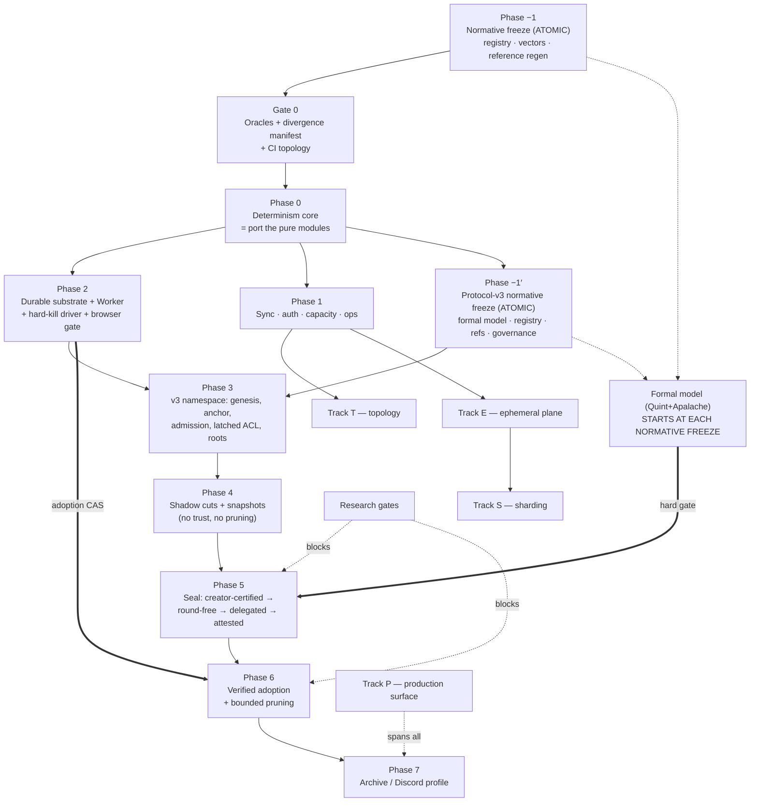

# ts-drp-1 Production Hardening — Final Phased TDD Implementation Plan

**Status:** build plan — supersedes `production-hardening-tdd-plan.md` (round 1)
**Baseline:** `bf7d3516f6ed4be97a755698b4fb3a404e04dc0f` (`main`) — exactly the AHE v4 review baseline, zero drift
**Goal:** take `ts-drp-1` from a research-grade signed operation-DAG to a production library capable of running an **MMORPG** or a **Discord-like chat at scale** — browser-first, hostile participants, churny NAT'd swarms.

**Compaction decision (changed this round): implement Attested Hard Epochs v4 directly.** AHE v4 is the
specification, its reference implementation is the starting code, its wire formats are the wire formats, and
its §23 acceptance checklist is our checklist. Where the spec and its reference disagree, or where either is
incomplete, we **amend AHE v4 in-repo and regenerate the reference from the amendment** — we do not defer.

This plan synthesizes round 1, the six source documents, and a **twelve-agent adversarial review**
(4× Opus-xhigh, 3× GPT-5.6-Sol-max, 2× Grok-4.5, 3× Kimi-K3), plus first-hand verification runs on this
machine. Where reviewers contradicted the source documents or each other, the code was re-read directly and
the correction is folded in with its evidence.

---

## 0. What changed, and what is now established fact

### 0.1 Evidence produced on this machine (not inherited)

Round 1 declined direct adoption largely because the reference was "untyped JS outside the workspace with
browser gates self-reported blocked." Both halves were tested here:

| Check                     | Command                                                         | Result                                                                                                                                      |
| ------------------------- | --------------------------------------------------------------- | ------------------------------------------------------------------------------------------------------------------------------------------- |
| Reference test suite      | `node --test test/core.test.mjs` in `reference-implementation/` | **22/22 pass, 287 ms**                                                                                                                      |
| Reference size            | `wc -l src/*.js`                                                | **2,379 LOC across 13 modules** (round 1's "~3,400" counted tests + browser harness)                                                        |
| Browser gate, Chromium    | AHE `browser/harness.html` under this repo's Playwright 1.51.1  | **PASS** — 3/3 checks, `elapsedMs 170.3`                                                                                                    |
| Browser gate, Firefox 135 | same                                                            | **NO VERDICT — silent hang**                                                                                                                |
| Browser gate, WebKit 605  | same                                                            | **NO VERDICT — silent hang**                                                                                                                |
| Repo persistence infra    | `grep -rl "indexedDB" packages`                                 | **zero matches**                                                                                                                            |
| Repo Worker infra         | `grep -rl "new Worker(" packages`                               | **zero matches**                                                                                                                            |
| CI shape                  | `.github/workflows/`                                            | 17 workflows, **all `runs-on: ubuntu-latest`**, most `timeout-minutes: 10`; `network-spike-public.yml` is 360 min (precedent for long jobs) |

The bundle's own `evidence/chromium-browser-validation.json` records `net::ERR_BLOCKED_BY_ADMINISTRATOR`,
`verdict: "blocked"`, with the note _"the managed Chromium policy in this execution environment blocks all
navigation."_ That was environmental — but running it properly produces a **worse and more useful** result
than "untested":

**Two of the three engines in AHE §21.5's own required release matrix produce no verdict at all — and the
harness is structurally incapable of telling you so.**

The root cause is a **race in the harness, not a defect in the engines.** On both Firefox and WebKit
`isSecureContext`, `crypto.subtle`, `indexedDB` and `navigator.locks` are all present, and `import()` of
`canonical.js` (7 exports) and `indexeddb-store.js` (4 exports) both succeed on the main thread.
`browser-tests.js:29-33` posts `{run:true}` **immediately** after `new Worker("./worker.js",{type:"module"})`,
but the worker's module graph — five imports plus a **top-level `await` in `ct-merkle.js:3`** — has not yet
installed `self.onmessage` (`worker.js:33`). Chromium happens to queue the message; Firefox and WebKit drop
it, and the worker waits forever. **Delaying the post by 3 s makes both browsers pass the full compute
payload** (Firefox: encode 41 ms, merkle 87 ms; WebKit: encode 44 ms, merkle 80 ms). The standalone IDB
vote-CAS also passes on both.

The damage is done by the missing timeout: `workerResponsiveness()` awaits a promise whose only settle paths
are `onmessage` and `onerror`. With neither firing, `run()` never completes, `document.body` is never
written, and the page sits at `running…` forever. **The harness can report PASS; it cannot report FAIL for
this class.** A hang is indistinguishable from "still running."

Two things follow. The directive's premise is confirmed — the matrix is executable here and Chromium is green
end-to-end including the IDB stage/commit path. And the reference's browser story was **never actually
validated cross-browser**: its static `browser_surface_audit.py` "pass" coexisted with a fatal cross-browser
runtime bug. Static audits are not browser gates.

This yields the rule that governs every gate below:

> **An inherited gate is not a gate until it has been observed going red for the right reason, in this
> repo's CI, on every engine in the matrix.**

### 0.2 The inherited-evidence problem is larger than the browser gate

The AHE §22 headline numbers — 5,231 exhaustive DAGs, 10,000 randomized epochs, 20,000 delivery
permutations, 11,612 quorum-pair checks — come from **standalone Python scripts that never execute the JS
reference** (`model/validate_epoch_model.py`, `model/validate_seal.py`; stdlib-only imports, their own
`kahn_order`, their own `fold_epoch`, their own digest). They validate a Python model against itself.
`reference-implementation/package.json` runs `"model"` (Python) and `"test"` (JS) as separate scripts with
no shared vectors — and **there are no golden vectors anywhere in the bundle**; all 22 JS tests compute
their expectations at runtime.

The only executable evidence against the reference _code_ is those 22 tests, and
`evidence/node-coverage.log` lists **11 of 13 modules** — `indexeddb-store.js` and `runtime.js` have **zero
executed coverage**. Those are precisely the crash-critical modules.

Consequently: **no AHE number is a gate in this plan.** Every §21/§22 claim is re-derived by TS-driven
enumerators that drive both engines over shared, checked-in vectors.

### 0.3 Corrections to round 1 (verified against source at `bf7d351`)

Round 1's evidence table is otherwise accurate — every `file:line` spot-checked by three independent
reviewers resolved correctly. These are the exceptions, and they change what gets built:

1. **"`FETCH_STATE` snapshots cross the wire unauthenticated" is stale.** `fetchStateResponseHandler`
   (`packages/node/src/handlers.ts:196-209`) **never adopts** network state — the code says so explicitly:
   _"Network-provided ACL/DRP state snapshots are never adopted… Either way the state is dropped."_
   `DRPObject.setACLState` and `merge(_, rootACLState)` both throw on root-ACL adoption. Genesis authority
   is derived locally from the creator-bound object id, so there is **no authority-takeover to fix**.
   What remains is the _responder_ (`handlers.ts:153-168`), which still calls `getStates()`, serializes the
   full snapshot and ships it to a peer that discards it — a free **amplification-DoS**, cheap to request,
   `O(state-bytes)` of CPU and egress on the victim. Different fix, different phase, much smaller.
2. **Hash-framing endianness is not in conflict.** Spec §4.2 and `hash.js` are _both_ big-endian for the
   framing integers. The real divergence is the **canonical typed-array profile**: spec §4.1 mandates
   little-endian, `canonical.js:76-79,117-136` encodes big-endian.
3. **`blueprintDigest` is already in the reference's cut descriptor** (`protocol.js:142,165`). It is missing
   from the reference's **anchor** (`protocol.js:176-201`) and **snapshot payload** (`snapshot.js:102-104`).
   Round 1 listed it as simply "omitted."
4. **The invalid-hash FIFO is memory-bounded.** `MAX_KNOWN_INVALID_VERTEX_HASHES = 10_000` with
   evict-oldest (`drp-applier.ts:34,282-289`). Rotation does not exhaust memory; it flips evicted invalid
   _parents_ back to `missing`, driving `recoverMissingSync` re-request churn. The gate must assert
   **re-request rate**, not megabytes — as written it passes trivially.
5. **Wall-clock invalidity is not "permanent poisoning."** A rejected vertex is not in the graph, so
   redelivery re-runs validation with a fresh clock. The repairable case is narrower than the original
   wording implied: only a finite submitted timestamp strictly beyond a finite receiver clock is
   receiver-clock-dependent and therefore re-requestable. Dependency-relative temporal violations,
   submitted infinities and downstream throws of the public timestamp-error class are deterministic
   terminal failures. Phase 0f makes the narrow receiver-future case `pending` instead of dropping it as
   `invalid`; otherwise two honest replicas at different clock offsets can converge to different graphs
   and never repair. Live silent divergence, independent of compaction.
6. **`perf-contracts.test.ts` was green when this audit was written, but is no longer green.** Its authenticated
   pre-regression figures were 8/8 at ~167 ms total, with the MapDRP case at 52.8 ms against a 1,000 ms
   limit; a later 197.4 ms run was also green. Phase 1d(i) then introduced the comparison-cost regression
   owned by D.92.3-P1 below. Current exact-parent/current medians are ~6.87/~6.64 seconds at the unchanged
   threshold. The `describe(... RED until optimized)` label is therefore factually RED again, but for the
   recorded regression rather than the original optimization backlog. The Phase 1a sync-compare test remains
   net-new rather than an extension of this MapDRP case.
7. **`benchmark.yml:88` and `benchmark-memory.yml:64` both set `fail-on-alert: false`**, and the PR
   benchmark job is `continue-on-error`. Round 1 wires the Phase-6 memory-slope gate — the single most
   important economic proof in the program — into workflows engineered never to block anything.
8. **The global coverage gate cannot catch the failure it exists to catch.** `scripts/coverage.ts:4`
   enforces one summed 70% line threshold; a module at zero coverage passes if everything else covers.
   That is exactly how the bundle shipped "91.71%" while excluding its two crash-critical modules.
9. **`runtime.js` is imported by nothing** — `browser/worker.js:1-5` imports five _other_ modules. The
   bundle's "Worker responsiveness" evidence executes different code than the module it appears to validate.
10. Round 1's own doc-corrections stand and are confirmed: the "insertion-sensitive DFS" claim is stale
    (`hashgraph/index.ts:318` `.sort()`s forward edges — target **origin**-sensitivity); the AEC contraction
    counterexample uses non-antichain deps; `@chainsafe/bls ^8.1.0` is already a production dependency of
    `object` and `keychain` (via `@chainsafe/bls/herumi`, the WASM backend — so AHE §2.2's
    "avoid a BLS/WASM dependency" rationale is _doubly_ stale).

### 0.4 The verdict, restated

Implementing AHE v4 directly is the right call, and the reference is a genuine asset — but "directly" means
**freeze first, then port**, never "transliterate the reference." Three of its modules are safe to port
nearly as-is; two must be _rewritten_ rather than ported; and the protocol has four genuine gaps that must
be closed as normative amendments before any consensus byte is written:

| #   | Gap                                                                                                                                                                                                              | Resolution (Phase −1)                                                                                                                                                                                                                                                                                                                                                                                                                                                                                       |
| --- | ---------------------------------------------------------------------------------------------------------------------------------------------------------------------------------------------------------------- | ----------------------------------------------------------------------------------------------------------------------------------------------------------------------------------------------------------------------------------------------------------------------------------------------------------------------------------------------------------------------------------------------------------------------------------------------------------------------------------------------------------- |
| G1  | No single frozen encoding. Spec recommends CBOR + LE typed arrays; the reference is a proprietary tag codec + BE. Several consensus objects have **no normative preimage at all**.                               | One frozen registry (§4). Reference regenerated from it.                                                                                                                                                                                                                                                                                                                                                                                                                                                    |
| G2  | `round` lives inside the signed cut descriptor, so a locked value cannot be re-proposed. **This is a real, constructible n=4 permanent stall.**                                                                  | Split round-free `CutValue` from round-bearing `SealProposal`; QCs bind `valueDigest`.                                                                                                                                                                                                                                                                                                                                                                                                                      |
| G3  | The pacemaker is six bullets; the reference **rejects the `round-change` phase its own vote schema defines** (`seal.js:21-35`) and omits `highestPrepareQC`.                                                     | Normative pacemaker (§Phase 5), model-checked before attested mode.                                                                                                                                                                                                                                                                                                                                                                                                                                         |
| G4  | Admission fails open — ancestry is optional (`admission.js:74-83`), and no signature, ACL, schema or invariant check runs before `accept` (`admission.js:41-91`; `fold.js:38` defaults authorization to `true`). | Phase 0d owns the mandatory fail-closed admission pipeline, Phase 0e owns the exact package-level ancestor index and strict boolean result contract, Phase 3a owns the first live v3 binder, and Phase 4a owns removal of the fold's default-`true` authorization. The accepted atomic 0d/0e v2 library boundary is a preservation baseline, not production integration: G4 remains open until the Phase-3a v3 binder lands on Phase 0q's commit discipline and Phase 4a removes the legacy fail-open fold. |

And two structural facts constrain the whole program:

- **Compaction is a divergence amplifier.** The instant any peer adopts a snapshot instead of replaying,
  _any_ nondeterminism becomes a permanent silent fork. The determinism foundation is a hard prerequisite,
  no exceptions.
- **AHE bounds the history age of _one object_. It is not a multiplayer fabric.** Shipping AHE and calling
  the stack MMORPG-ready is marketing. The ephemeral, sharding and topology planes (Tracks E/S/T) are
  load-bearing for the stated goal and sit entirely outside AHE.

### 0.5 Two release trains — do not merge the claims

| Train                                  | Contents                                                                                                                                  | Claim it earns                                                                                                |
| -------------------------------------- | ----------------------------------------------------------------------------------------------------------------------------------------- | ------------------------------------------------------------------------------------------------------------- |
| **Train C — Correctness & Compaction** | Phases −1…7. Single-object AHE v4: determinism, durability, v2 envelope, seal, bounded pruning, archive.                                  | _"Production-hardened signed-command rooms with bounded history."_ Serverless is honest here for small rooms. |
| **Train S — Fabric**                   | Tracks E, S, T + the Profile gates. Ephemeral simulation plane, sharding/cross-object conservation, mesh topology and connection budgets. | _"MMORPG or Discord at scale."_ **Only when Train S gates are green.** Requires operator-run relays.          |

**Train C preserves the zero-deploy profile.** Today the grid and chat examples run end-to-end over
_public_ infrastructure — Nostr relays for discovery, public delegated routing for relay candidates, no
self-deployed fixtures (`examples/grid/playwright.fully-public.config.ts`, `pnpm e2e-test:fully-public`).
Nothing in Train C changes that: creator-trusted sealing needs one signer (the creator's client),
`local-only` pruning needs no mirror, and durable storage is the peer's own. This is a **stated invariant
with a regression gate**: the fully-public e2e stays in the weekly tier (reports-only — it depends on live
third-party infra and is flaky by its own comments), and a pre-release run at the release SHA must be
triaged (regression vs infra outage) before Train C ships. The operator node buys things that are
_currently impossible_ (attested quorum liveness, relay-spine fanout, rooms that outlive their members) —
it must never become a requirement for things that already work with none.

Train S is not a backlog. Several of its slices (connection budgets, the O(1) applied-set index, the crypto
Worker queue, permissioned defaults) are **prerequisites of Train C's own scale gates** and land in Phase 1.

### 0.6 The honest scope statement

Three things are out of reach for a pure browser mesh regardless of plan quality, and all three resolve with
the same component — an **operator-run node**, untrusted for state (bytes verified, cuts QC-checked, referee
ops signed and disputable):

1. **Ephemeral fanout above ~16 players/zone.** A browser cannot originate 30 Hz × 63-peer upload fanout.
   Interest management reduces _relevance_, not the sender's fanout. An SFU-style relay is required.
2. **Compaction liveness under tab churn.** AHE §2.3's fallback — _"the active epoch simply grows until a
   configured hard safety limit"_ — reintroduces unbounded history exactly when quorum churns. At the
   default `maxEpochVertices = 8192` and a modest 5 durable ops/s that is ~27 minutes to the hard limit.
   Browser tabs also have a _negative_ incentive to sign (burn battery for closes benefiting latecomers)
   and get OS-suspended.
3. **Contested-outcome validity.** Attributability without a referee is not anti-cheat.

Add to this the finding that **no local-only algorithm can distinguish first signer installation from
complete origin-storage eviction** (§Phase 5) — so browser tabs cannot be **seal voters** by default.
Signing is unaffected (every vertex, ACL op and trade is signed in-browser today); the constraint is the
never-vote-twice slot obligation, and two routes let a browser hold it anyway: at `q = 1`, a recoverable
seed-derived key plus a mandatory re-learn-from-peers rule (§Phase 5, slice 5e — safe because every vote at
`q = 1` _is_ a QC and lives on in the network); at quorum `≥ 2`, every voter preserves exact-slot
anti-equivocation continuity through either detectable-loss durable storage, an external exact-slot
witness, or — for a browser-local eviction-prone voter without such a witness — a **fate-shared
non-extractable key** co-evicted with the vote log (§Phase 5, custody options 1–3). Trust profile determines
authority and quorum; storage class determines custody. Both delegated and attested sets admit durable and
browser-local voters. The liveness cost of fate-sharing is why an always-on durable-class signer remains
in the picture as a **liveness backstop, not a trust requirement**.

**Optional desktop clients are the P2P route to a durable tier.** If the product ships an **Electron
build alongside the web app** — optional, opt-in, never required — any participant running it is
durable-class by construction: no ITP, no 7-day clock, storage in the app's own data directory rather than
a browser profile competing with a thousand origins. One such participant collapses **two of the three
operator roles onto a peer**: signer (durable vote log) and mirror (it has a disk). Only **relay** does not
follow, since a home machine behind NAT is usually not reachable. Two consequences: the fate-shared-key
problem largely dissolves (key and vote log share an app-data directory, or the OS keychain), and
tray-resident / launch-on-login — normal for a desktop app, impossible for a tab — is what converts
_durable_ into _durable and usually online_. Treat that as a deliberate product decision, not a side
effect. It does **not** auto-enroll anyone: the signer set is still pinned in the anchor and changed only
by handoff (§Phase 5, 5e2), so a desktop user is a _good_ delegate, not automatically _a_ delegate.

**What the operator node concretely is:** not a new service — the same `DRPNode`, long-lived, in Node.js
(`pnpm cli` → `packages/node/src/run.ts`). The relay role already exists as config
(`configs/bootstrap.json`: `"relay_service": { "enabled": true }`); mirror and signer land as two more
role flags on that same process. Train C requires none of them beyond the signaling broker every
browser-to-browser system needs — which may be public infrastructure (§0.5, zero-deploy) or self-run.

**P2P-first is a design rule, not a preference.** "Durable-class" (§Phase 5) is a storage property, not an
ownership property — a friend's always-on desktop running `pnpm cli` qualifies exactly as a company-run
mirror does. Every trust profile has a working zero-infrastructure configuration (§1, principle 11); an
operator-run mirror/relay MAY additionally enroll as an attestor later, but operator participation is
opt-in and additive — never load-bearing for correctness, and never a precondition for any profile to
exist.

**Therefore:** reachable target is zone-instanced multiplayer (≤ 64 durable writers/zone, 20–30 Hz
ephemeral, operator relay spine) and Discord-scale guilds (per-channel objects, ≤ 1k–5k online/channel,
archive profile). **Seamless single-shard worlds and serverless competitive anti-cheat are non-goals.**
Product decision already recorded: build without mirrors now, design assuming operator-owned mirrors later.

---

## 1. Principles

1. **Freeze before you port.** No consensus byte is written before the Phase −1 registry is merged. One
   immutable golden-vector document is minted per registry version. Before reference regeneration, the only
   lawful extension is an exact `registryVersion + 1` transition with exactly one new vector document that
   carries every prior vector record byte-identically. Regeneration closes that window; any later consensus
   change requires `protocolMajor: 3`. A vector diff must be impossible to land silently.
2. **Compaction amplifies divergence.** The determinism foundation gates every snapshot-trusting feature.
3. **Classify every change.** _replica-local-safe_ (ship now, legacy plane) / _coordinated-upgrade_
   (observable post-merge state or wire format; test cross-version explicitly) / _consensus-affecting_
   (**exactly one frozen protocol-major namespace, never patched in place, never dual-preimage under one
   `objectId`; v2 remains immutable and v3 is its successor**).
   A misclassification is a silent permanent fork — and round 1 misclassified three of its own slices (§Phase 0).
4. **Every gate names an executable evidence artifact** — a test file, a model output, a crash-injection
   log, a browser-matrix JSON, a golden-vector file. No inherited number is a gate.
5. **Every gate must be provably able to fail — and a RED spec is evidence only as a pair _(baseline, current)_.** Before its GREEN half begins, every new RED spec file is executed against the baseline SHA in a throwaway git worktree (**never** `git stash` — reviewers share one tree), and the pair is recorded with the text of the failing assertion; a bare count is satisfiable by a broken harness. `FAIL/FAIL` is a genuine RED contract; `PASS/FAIL` is a **regression pin**; `PASS/PASS` is **not a gate** and must be strengthened or deleted; `FAIL/PASS` is already green. _Scope qualifier:_ the baseline leg binds only where the subject code exists at baseline — for `protocol-v2`, `seal`, `storage-browser` and the other new packages a baseline run fails on module resolution, and **an import error is not a RED**; there, run the spec before the implementation exists and record that it fails on the asserted contract. A regression pin must assert the **invariant**, never the baseline's behaviour: pinning the old semantics as a "positive control" makes the pin unsatisfiable alongside the slice that changes them (D.5(i)). Each differential/oracle gate additionally ships a **mutation probe**:
   a seeded defect the gate must catch. The repo already has this pattern
   (`packages/object/tests/proptest/mutation-check.test.ts`); it is the only known defense against an oracle
   drifting green.
6. **Every zero/never assertion ships a positive control** in the same test. _"Zero durable vertices"_
   passes trivially if nothing is wired; assert in the same run that a durable command **does** create
   exactly one vertex.
7. **Atomic vs sliceable is explicit and argued — and every "atomic" names its observable boundary.**
   For the legacy applier that boundary is _one vertex_ across **all** of: hashgraph (vertices, forward and
   backward edges, frontier membership **and frontier order**, which feeds default dependency order and
   therefore signed bytes), per-hash state snapshots, the finality store, the live `drp`/`acl` proxies,
   `checkpoints`, `knownInvalidVertexHashes`, and subscriber notification. Two invariants come with it: the
   owner stores are never rebound (identity is stable), and nothing is published before it is committed.
   Atomic: the registry freeze itself; vertex preimage;
   canonical-order switch; staged state-adoption semantics; **the vote slot + signer state + outbox as one
   transaction** (a half-durable vote slot is _worse_ than none — it enables double-signing); the adoption
   pointer swap; latched-ACL genesis semantics.
8. **Shadow before destructive**, and **observation before acting**. Snapshots are produced, verified and
   digest-compared across independent replicas plus archival replay before anything is pruned; seal computes
   and compares cuts before it certifies them.
9. **Extend the existing test muscle.** `packages/test-utils/src/property-harness.ts` (seeded mulberry32,
   fake-timer virtual clock), the `linearize-reference.test.ts` independent-oracle pattern, the proptest
   convergence/partition suites, `perf-contracts.test.ts`'s instrumented-probe-counter pattern, the
   `failure-campaign` harness. A gate that does not run in CI will rot.
10. **Scale is stated as per-object ceilings, in a profile table, bound to a named harness.** Anything not
    in a profile table is not a supported scale claim.
11. **P2P-first: every trust profile has a working zero-infrastructure configuration.** Operator-run nodes
    (relay / mirror / signer, and optionally attestor later) are opt-in and additive — one way to obtain
    durability or fanout, never the definition of either and never a requirement. A slice that makes any
    profile depend on operator infrastructure to _exist_ is a regression against this principle (the
    zero-deploy invariant, §0.5, is the Train-C instance of the same rule).

---

## 2. Package topology and the AHE port map

### 2.1 Packages

Respecting the verified dependency direction (`object` depends only on `logger`/`tracer`/`types`/`utils`/
`validation`; `node` is the composition root; `object` never depends on `network`):

```text
packages/protocol-v2/     frozen codec, domain-separated hashing, field registry, v2 envelopes,
                          admission, signature suite            (no deps beyond types/utils)
packages/compaction/      Kahn order, fold, snapshots, close manifest, RFC 9162 history +
                          archive-index roots                   (below node, no network dep)
packages/storage/         runtime-neutral durable-store contract, state machine, error taxonomy,
                          shared fault scenarios, in-memory model (durability: "ephemeral")
packages/storage-browser/ IndexedDB backend: schema, migrations, immutable exact-byte CAS,
                          staged generations, vote slots, kill-point injection subpath
packages/storage-node/    SQLite backend: composite keys, WAL, full synchronous durability,
                          also the backend for optional Electron clients (main process) — never storage-browser,
                          SIGKILL crash tests
packages/seal/            round-free CutValue, proposals, votes, QCs, locks, pacemaker,
                          authority handoff                     (separate from FinalityStore)
packages/sync-v2/         object-head exchange, resumable content-addressed chunk fetch,
                          bounded active-tail reconciliation
packages/worker-host/     bounded streaming Worker execution, cancellation, capped telemetry
packages/ephemeral/       Track E: non-durable simulation plane (cannot create vertices, by construction)
```

`packages/storage/` is not optional bookkeeping. Without a runtime-neutral contract, IDB and Node semantics
diverge and green Node CI becomes poor evidence for browser correctness. The **same** exported
`runStoreContract(factory)` runs in Vitest against Node/SQLite and in Playwright against real IndexedDB.

The legacy plane (`object` applier/pipeline, legacy hash/topic) keeps running unchanged; v2 rooms live on a
separate namespace and topic. This converts a risky migration into an **additive parallel build** with one
signed migration step at the end.

### 2.2 Port map — what happens to each of the 13 reference modules

| Reference module     | LOC  | Disposition                                                                                                                                     | Target            |
| -------------------- | ---- | ----------------------------------------------------------------------------------------------------------------------------------------------- | ----------------- |
| `canonical.js`       | 390  | **Port + amend** (typed-array `-0`, endianness decision, locale-free sorting)                                                                   | `protocol-v2`     |
| `hash.js`            | 82   | **Port as-is** — its framing becomes normative                                                                                                  | `protocol-v2`     |
| `protocol.js`        | ~200 | **Port + amend** (add omitted preimage fields; delete `round` from the cut; add trust profile)                                                  | `protocol-v2`     |
| `admission.js`       | ~120 | **Port + amend** — the fail-open pipeline is replaced wholesale (G4)                                                                            | `protocol-v2`     |
| `linearize.js`       | 230  | **Port + harden/amend** (min-hash order; deterministic validation; five-action, isolated, fail-closed resolver contract; bounded swap cycles)   | `compaction`      |
| `fold.js`            | 74   | **Port + amend** (`fold.js:38` defaults authorization to `true` — must fail closed)                                                             | `compaction`      |
| `state.js`           | 90   | **Partial port + amend** (`stateDigest` only, synchronous canonical hashing; replacement is 0c and the reference DSM is not ported)             | `compaction`      |
| `snapshot.js`        | 106  | **Port + amend** (payload omits `blueprintDigest`, `archiveIndexRoot`)                                                                          | `compaction`      |
| `archive.js`         | 196  | **Port as-is**                                                                                                                                  | `compaction`      |
| `ct-merkle.js`       | 201  | **Port + harden/amend** (synchronous RFC 9162 primitives; copy-safe inputs/snapshots, proof validation, batching and safe accumulator counting) | `compaction`      |
| `seal.js`            | ~280 | **Port + major amend** (round-free CutValue, `round-change` phase, `highestPrepareQC`, durable state)                                           | `seal`            |
| `indexeddb-store.js` | 255  | **REWRITE — do not port.** Zero coverage; audit below. Kept as a _negative_ regression source.                                                  | `storage-browser` |
| `runtime.js`         | ~90  | **REPLACE — do not port.** Unbounded, imported by nothing, not a Worker host.                                                                   | `worker-host`     |

**Why the last two are rewrites, not ports.** `indexeddb-store.js` has similarly-named methods but does not
implement AHE §14.3/§16 semantics. Verified defects: a rejected `"strict"` transaction is **silently retried
with default durability** (`:27-33`); chunk and manifest writes use `put`, so different bytes can overwrite
an allegedly immutable digest (`:102-121`); `commitEpoch` receives **no QC and performs no authority
verification** (`:123-128`) and does **no current-anchor CAS**, so two adopters are last-writer-wins
(`:160-175`); it performs **unbounded destructive deletion of the entire old tail inside the pointer
transaction** (`:148-159`), making cleanup part of commit — directly contrary to AHE §16.2; recovery reads
head and journal in **two concurrent transactions** and can observe a combination that never existed
atomically (`:206-213`); `getVotes` is an unbounded `getAll()` scan across every room (`:91-96`); the vote
slot stores a structured-cloned object rather than exact signed bytes (`:73-89`). Transliterating this
would make a typed port _look_ durable while permitting lost votes, conflicting anchors, immutable-content
corruption and rollback deletion.

`runtime.js`: `batchSize` unvalidated (0 loops forever), cancellation checked once per batch, every output
retained (`O(total output)` memory rather than streaming), unbounded counter cardinality, every timing
sample retained forever, and `Math.max(0, ...values)` eventually exceeds engine argument limits.

### 2.3 The oracle architecture

Four oracles, each proving something different. The critical subtlety: **a reference regenerated from our own
amended schema is a second transcription of our own decisions** — conformance against it proves transcription
fidelity, not spec fidelity. So both versions are kept, with different jobs.

| Oracle                               | Proves                                                                                               | Cannot prove                                                                             | Kept honest by                                                                                                                               |
| ------------------------------------ | ---------------------------------------------------------------------------------------------------- | ---------------------------------------------------------------------------------------- | -------------------------------------------------------------------------------------------------------------------------------------------- |
| **(a) Legacy engine differential**   | v2 diverges from legacy _exactly_ where the manifest says; zero accidental drift on the legacy plane | That either engine is correct (legacy is the buggy one)                                  | Approved-divergence manifest with **exercised-entry enforcement** + mutation probe; legacy pinned at `bf7d351`                               |
| **(b) Pinned original JS reference** | Wire/digest conformance with an _independent_ reading of AHE v4, on the **un-amended** subset        | Anything about amended areas; storage behavior (zero coverage)                           | Commit-pinned and **edit-forbidden**. Amended areas covered by hand-reviewed vectors instead                                                 |
| **(c) Regenerated JS reference**     | The amended schema is implementable twice and the vectors are reproducible                           | Spec fidelity (it is our own decisions, restated)                                        | **Different author** from the TS port; both pinned to the registry                                                                           |
| **(d) Archival replay**              | Snapshot induction `S_(e+1) = Fold(S_e, KahnOrder(C_e))` ≡ from-scratch replay                       | Availability; blueprint semantic correctness (a buggy reducer replays identically wrong) | Must go through the public vertex-ingest path and share **no code** with the fold/adoption pipeline except the frozen codec and the reducers |

Plus **(e) an independent linearization re-implementation** in the existing `linearize-reference.test.ts`
style, written from the spec text by a different author, importing nothing from `packages/compaction`.

**Where the references live.** The byte-identical original is
`packages/protocol-v2/conformance/ahe-reference/`; it was moved from the review bundle without editing its
thirteen source files. The independently regenerated implementation lands separately at
`packages/protocol-v2/conformance/ahe-reference-regen/`. Both stay untyped ESM, excluded from
`tsconfig.build.json` and the package `files` array; root `tsconfig.json` already sets `allowJs: true` and
Node ≥20 provides `globalThis.crypto.subtle`, so vitest imports them directly. The original and regenerated
trees are never overlaid: they are different oracles with different provenance.

**The anti-"fixing" mechanism** (without this the oracle is worthless): commit
`packages/protocol-v2/conformance/reference.lock.json` — SHA-256 of every file under `ahe-reference/src/`,
bijectively checked against the review bundle's `SHA256SUMS.txt`. The original tree and lock are immutable:
**no registry bump authorizes changing either one**. A pure-Node, every-PR checker is executed from the
merge-base after bootstrap, so a PR cannot grade changes with its own replacement checker. The one head-checker
run is permitted only on a stacked base that already contains registry v5 and the original reference but no
freeze policy. CODEOWNERS routes the original and regenerated trees, both locks, the registry, vectors,
policy, checker and workflow to the same protocol-owner cohort. The base checker validates the effective
protocol CODEOWNERS tail block and workflow security shape semantically, allowing unrelated ownership and
action-version maintenance without weakening the gate. Golden-vector documents are immutable; while Phase −1 remains open, an exact
`+1` registry transition may add one byte-identical superset document. Slice −1f then adds
`reference-regen.lock.json`, whose provenance pins registry v5, the v5 vectors and the original-reference
lock; once that pair exists, the registry and both oracle ratchets freeze permanently.

### 2.4 Three live defects in the reference, confirmed by execution here

These would be inherited by a faithful port. All three were found by review and re-verified by me directly.

**D1 — `localeCompare` in three consensus-critical sorts is a fork vector.**
`protocol.js:63` sorts the signer set (feeding `signerSetDigest`, which is in the anchor preimage at
`protocol.js:199`); `seal.js:77` sorts QC votes before the QC digest; `archive.js:163` sorts archive-index
entries before the Merkle root. `localeCompare` with no locale argument uses the host's ICU data. Measured:

```
ids            = ['peer-B','peer-a','Peer-a','peer_a','peerä']
localeCompare  → peer_a, peer-a, Peer-a, peer-B, peerä
codepoint      → Peer-a, peer-B, peer-a, peer_a, peerä
```

Two replicas with different default locales compute different `signerSetDigest` → different anchor hash →
**permanent fork**, or two disjoint quorums certifying different anchors for the same cut.
_Resolution:_ UTF-8 byte order equals codepoint order, not UTF-16 code-unit order. All protocol sorts use
that order, fixed per field in the registry as `sortRule: "codepoint"`. The registry also constrains the `signerId` charset (no control
characters), which additionally closes the `\0` key-smuggling in the NUL-delimited vote key
(`seal.js:264`, `indexeddb-store.js:37`) — replaced by native IDB array keys.

**D2 — `Float32Array` `-0` encodes to bytes the reference's own decoder rejects.** Measured:

```
encodeCanonical(Float32Array.of(-0))  → 0b0180000000        (succeeds)
decodeCanonical(0b0180000000)         → throws "typed array contains non-canonical negative zero"
encode(f32 -0) === encode(f32 +0)     → false
```

The encoder normalizes `-0` for `number` (`canonical.js:104`) and `Float64Array` (`:127`) but **not**
`Float32Array` (`:121`); the decoder rejects `-0` in any typed array (`:357`). `Float32Array` is the tag
aimed squarely at game state. A physics field that ever produces `-0` (trivially: `0 * -1`) exports a
snapshot **no conforming peer can decode** — a room-wide unrecoverable close failure.
_Resolution:_ registry amendment — the encoder MUST normalize `-0 → 0` in `Float32Array`.

**D3 — admission verifies the digest before the cheap identity checks.** `admission.js:44-50` canonically
encodes and SHA-256s the vertex _before_ comparing `objectId`/`protocolMajor`/`epoch`, so a flood of
wrong-room garbage costs full crypto per message — violating spec §18.3's "reject oversize input before deep
decode." _Resolution:_ reorder to syntactic/limit checks → identity equality → digest → dependencies.

### 2.5 The typing rules for a semantics-preserving JS→TS port

Adding types changes behaviour in specific, enumerable places. Each rule below is derived from actual
reference code and carries the test that catches a violation. This table lands as
`packages/protocol-v2/docs/porting-rules.md`, cross-referenced from the registry.

| #   | Hazard                               | Reference evidence                                                                                                                                           | Port rule                                                                                                                                                                                        | Violation-catching test                                                                                                                                 |
| --- | ------------------------------------ | ------------------------------------------------------------------------------------------------------------------------------------------------------------ | ------------------------------------------------------------------------------------------------------------------------------------------------------------------------------------------------ | ------------------------------------------------------------------------------------------------------------------------------------------------------- |
| 1   | number vs bigint                     | integers are zigzag-varuint of **safe `number`s**; `bigint` throws (`canonical.js:106,111-113`); decode rejects beyond ±(2⁵³−1) (`:271`)                     | protocol integers are `number` + runtime `Number.isSafeInteger`; never widen to `bigint`                                                                                                         | vector: `2^53−1` round-trips; `encode(2^53)` and `encode(1n)` throw                                                                                     |
| 2   | `-0` / NaN                           | D2 above                                                                                                                                                     | all float paths normalize `-0`, reject non-finite                                                                                                                                                | D2 round-trip property                                                                                                                                  |
| 3   | `undefined` vs absent key            | `{a: undefined}` **throws** (`canonical.js:111-112`); absence is the only omission                                                                           | new packages compile with `exactOptionalPropertyTypes: true`; builders omit, never assign `undefined`                                                                                            | `@ts-expect-error` on `{field: undefined}`; builder output for an absent optional field digests equal to the reference                                  |
| 4   | prototypes / `Object.create(null)`   | decoder returns null-proto objects (`canonical.js:309`); encoder accepts only null-proto and `Object.prototype` (`:71-74`), rejects class instances (`:178`) | decoded values typed `Record<string, CanonicalValue>`; use `Object.hasOwn`, never `.hasOwnProperty`                                                                                              | assert `Object.getPrototypeOf(decoded) === null`; a ts-proto message instance and a class instance both throw                                           |
| 5   | Map/Set iteration order              | encoder sorts by encoded-key bytes (`canonical.js:157,172`)                                                                                                  | no consumer may depend on pre-encode insertion order                                                                                                                                             | seeded insertion shuffles in the differential fuzz                                                                                                      |
| 6   | `structuredClone` vs canonical clone | reference clones only via `deepCloneCanonical` (`canonical.js:377-379`)                                                                                      | consensus state cloning is `deepCloneCanonical` **only**; ESLint `no-restricted-globals: structuredClone` in consensus packages                                                                  | state containing `-0`: canonical clone digests as `0`, `structuredClone` preserves `-0` — assert the lint rule exists and document the behavioural diff |
| 7   | async WebCrypto vs sync noble        | `hash.js:55-58` is async-only                                                                                                                                | sync `@noble/hashes` on all digest paths and sync `@noble/curves/ed25519.js` on identity/signature paths (§2.6); WebCrypto only as a bulk Worker backend or for non-extractable seal-key custody | noble-vs-WebCrypto differential on framed inputs; type assertions that hashing and signing return `Uint8Array`, never `Promise`                         |
| 8   | DataView endianness vs Buffer        | every DataView call passes explicit `false` (BE); no `Buffer` anywhere                                                                                       | only DataView with an explicit endian argument; `Buffer` banned by lint; registry pins BE                                                                                                        | golden typed-array vectors + lint gate                                                                                                                  |
| 9   | locale-dependent sorts               | D1 above                                                                                                                                                     | `sortRule: "codepoint"` per registry field                                                                                                                                                       | D1's property test vs `Buffer.compare(utf8(a), utf8(b))`                                                                                                |
| 10  | string length = UTF-16 units         | `assertString(value, …, maxLength)` counts UTF-16 units, not bytes (`protocol.js:17-20`)                                                                     | keep unit counting; registry documents the unit per limit                                                                                                                                        | astral-plane chars at the 1024/1025-unit boundary                                                                                                       |

### 2.6 Crypto profile: sync `@noble/hashes`, and why §19's benchmark narrative is an artifact

The reference is async-poisoned end to end because `subtle.digest` is Promise-only (`hash.js:55-58`):
admission, vertex creation, Merkle append and QC building are all `async` **purely for hashing**, which also
forces a top-level `await` into `ct-merkle.js:3`. The repo already ships sync SHA-256 everywhere
(`packages/utils/src/hash/index.ts:1`; `@noble/hashes` is a production dependency of `object`, `utils`,
`keychain`).

AHE §19's slowest number — compact-accumulator Merkle at **739.8 ms median / 8192 leaves** — is dominated by
~16k awaited WebCrypto round-trips over 64-byte inputs, not by hashing. In-browser runs here completed 2048
appends in **50–87 ms** even under WebCrypto. So §19's "pure-JS Merkle is the slowest path, consider WASM"
guidance is an artifact of the reference's crypto binding, not a property of the algorithm — and it must not
be used as a sizing input.

_Decision:_ all protocol digests are **sync**, over `@noble/hashes/sha2`, behind one
`hashDomain(domain, ...parts): Uint8Array` in `@ts-drp/canonical`, preserving the reference's exact framing
bytes. Ed25519 identity and seal signatures are likewise sync over `@noble/curves/ed25519.js`; their
protocol functions return `Uint8Array`/`boolean` with no Promise surface. WebCrypto remains the custody
backend for non-extractable browser seal keys, not the protocol verification backend. `worker-host` MAY
provide a bulk async backend for large snapshot/archive payloads only,
conformance-tested equal to the sync backend on shared vectors. Re-benchmark in-repo before deciding on WASM, if WASM is more optimal then look if there's a similar implementation already existing, if not implement with WASM.

### 2.7 Wire format: the existing proto shape cannot carry v2

`packages/types/src/proto/drp/v1/object.proto:7-19` carries operations as `google.protobuf.Value`, which
cannot represent the canonical domain (bytes, `Map`, `Set`, typed arrays; every number becomes a double).
A v2 vertex serialized through it loses byte fidelity, so hash verification either fails or — far worse —
"verifies" over re-encoded bytes.

_Rule:_ v2 proto messages carry `bytes canonical_preimage` + `bytes signature` (+ routing metadata only).
Receivers decode via `@ts-drp/canonical` and **MUST verify the digest over the received bytes — never
re-encode.**

---

## 3. The phase graph

Round 1 landed AHE at Phase 3 (shadow snapshots) _before_ its then-proposed envelope at Phase 4. That
ordering cannot implement AHE directly: **a normative AHE snapshot payload commits to `objectId`, `epoch`,
`sourceAnchor`, `schemaVersion` and `blueprintDigest` — none of which exist until the successor
genesis/anchor namespace does.**
Shadow-folding legacy state and calling it an AHE shadow validates the wrong pipeline. Likewise the history
root and archive-index root are **mandatory fields of every cut and anchor**, so they cannot arrive in
Phase 7 while Phase 6 already validates history continuity.

The corrected order is: **frozen-v2 baseline → oracles → determinism → substrate → v3 normative freeze →
v3 namespace → shadow → seal → adopt/prune → archive**, with four parallel tracks.



**Why the formal model starts at Phase −1, not Phase 4.** The model validates the _design_ — spec plus the
round-free `CutValue` amendment — and needs no implementation code. Round 1 started it at Phase 4, _after_
the atomic envelope freeze it is supposed to validate. If the model then discovers the pacemaker needs an
additional signed field, the only remedy is `protocolMajor = 3` — precisely the outcome the atomic freeze
exists to prevent. So the model starts with the registry, and **a mechanical variable-set sign-off gates the
freeze**: every signed envelope field must appear in the model's variable set.

---

## Phase −1 — Normative freeze (ATOMIC — nothing else starts)

**Goal:** one interoperable protocol. Today there is not one: codec, hashes, cut identity, round change,
profile activation and adoption all disagree or are undefined. **No consensus byte is written until this
lands.** Round 1 placed this as a Phase-4 "precondition freeze" in prose; a registry mentioned only in prose
is not an executable slice, and freezing at Phase 4 forces either a double vector-freeze or months of
unpinned porting.

| Slice       | Change                                                                                                                                                                                                                                                                                                                                                                                                                                                                                                                                                                                                           | Class        | Atomic?                              | RED test → GREEN                                                                                                                                                                                                                                                                                                                                                                                                                                                       |
| ----------- | ---------------------------------------------------------------------------------------------------------------------------------------------------------------------------------------------------------------------------------------------------------------------------------------------------------------------------------------------------------------------------------------------------------------------------------------------------------------------------------------------------------------------------------------------------------------------------------------------------------------- | ------------ | ------------------------------------ | ---------------------------------------------------------------------------------------------------------------------------------------------------------------------------------------------------------------------------------------------------------------------------------------------------------------------------------------------------------------------------------------------------------------------------------------------------------------------- |
| **−1a**     | `packages/protocol-v2/registry/field-registry.json` — machine-readable: `domains{}`, `kinds{fields[{name,type,constraints,required,sortRule}]}`, `framing{}`, `endianness`, `quorum{}`, `actions[]`. Every hashed structure, its domain string, exact field order and encoding.                                                                                                                                                                                                                                                                                                                                  | consensus-v2 | **atomic**                           | `registry.test.ts`: preimage builders are constructed _from_ the registry field list; `expect(cutValuePreimage({...unknownField}))` throws; every registry entry is referenced by ≥1 vector (`expect(uncoveredFields).toEqual([])`)                                                                                                                                                                                                                                    |
| **−1b**     | Codec + framing decisions (D1–D3, §2.4 and the table below)                                                                                                                                                                                                                                                                                                                                                                                                                                                                                                                                                      | consensus-v2 | atomic with −1a                      | `canonical-adversarial.test.ts`: `ENC(Float32Array[-0]) === ENC(Float32Array[+0])` and both decode; changing the process locale cannot alter signer-set or QC bytes                                                                                                                                                                                                                                                                                                    |
| **−1c**     | **Round-free `CutValue` / round-bearing `SealProposal` split.** This is a _preimage_ decision, not a Phase-5 implementation detail.                                                                                                                                                                                                                                                                                                                                                                                                                                                                              | consensus-v2 | atomic                               | `round-repropose.test.ts`: the same semantic value proposed in round `r` and `r+1` has an **identical `valueDigest`** and different `proposalHash`                                                                                                                                                                                                                                                                                                                     |
| **−1d**     | **Signature suite — two keys, one primitive, distinct suite identifiers.** (a) **Identity/vertex:** `ed25519-sha256-v1`, Ed25519 over the raw 32-byte registered digest. (b) **Seal voter:** `ed25519-seal-v1`, also Ed25519 over its raw registered digest. Distinct identifiers keep identity and seal independently rotatable; because the primitive is shared, the registry domains and exact `hashDomain` framing are load-bearing. Strict RFC 8032 verification (`zip215: false`) is consensus-critical. `p256-sha256-v1` is recognized but **reserved, not active**. Legacy-plane secp256k1 is untouched. | consensus-v2 | atomic                               | `signature-vectors.test.ts`: deterministic 64-byte Ed25519 vector; raw-digest rule; malformed length, ZIP-215-only and thrown-verifier inputs fail closed; identity-domain signatures do not verify as seal signatures or vice versa; reserved/unknown suites return exactly `false`. Scope labels are metadata: callers must recompute the registered digest from the canonical preimage under the declared registry domain.                                          |
| **−1e(i)**  | **`cryptoSuiteId` permitted values enumerated and negotiated at genesis only** (never downgradeable — Phase 3b). Active: `ed25519-sha256-v1` (identity) and `ed25519-seal-v1` (seal). Reserved: `p256-sha256-v1`. There is no runtime fallback or downgrade.                                                                                                                                                                                                                                                                                                                                                     | consensus-v2 | atomic with −1d                      | `crypto-suite.test.ts`: unenumerated and reserved suites reject with `UNSUPPORTED_PROFILE`; a peer lacking the genesis-named active suite rejects rather than substituting; epoch-anchor/profile enumerations must match and active/reserved sets must be disjoint                                                                                                                                                                                                     |
| **−1e(ii)** | Mint `registry-v5.json` from real registry-built preimages, including ordered `partsHex` for the actual domain-hash parts; preserve the original reference byte-for-byte; add `reference.lock.json`, semantic CODEOWNERS/workflow governance, and the base-governed silent-landing check                                                                                                                                                                                                                                                                                                                         | consensus-v2 | sliceable; **stacked on −1a…−1e(i)** | `golden-vectors.test.ts`: all registered kinds and active enum values covered; normalized-record `canonicalHex`, ordered `partsHex`, and digests agree in TS and the original reference; lock ↔ source ↔ vendored SHA-256 bijection; bootstrap registry bytes pinned; real temp-git CLI probes reject an invalid base, same-version registry drift, prior-vector drift, noncanonical vector path, bad regen provenance, policy weakening or protected-artifact drift |
| **−1f**     | Regenerate the JS reference from the amended schema into the **separate** `ahe-reference-regen/` tree, by a **different author** than the TS port. Add `reference-regen.lock.json` with registry-v5, vector-v5 and original-lock provenance. Do not bump the registry. Then both references and the registry freeze forever.                                                                                                                                                                                                                                                                                     | coordinated  | atomic                               | Both references reproduce every applicable vector byte-for-byte; regenerated tree/lock atomicity and provenance pass the base-governed checker; a post-regeneration registry bump fails                                                                                                                                                                                                                                                                                |
| **−1g**     | Spec amendments written into `docs/protocol/` with a versioned amendment log                                                                                                                                                                                                                                                                                                                                                                                                                                                                                                                                     | —            | sliceable                            | Amendment log entry exists for every registry decision below                                                                                                                                                                                                                                                                                                                                                                                                           |

### The frozen decisions

| #   | Divergence                                                                                                                                           | Decision                                                                                                                                                                                                                                                                                                                                                                                                                                                                                                                                                                                                                                                                                                                                                                                                                                                                                                                                                                                                                      | Rationale                                                                                                                                                                                                                                                                                                 |
| --- | ---------------------------------------------------------------------------------------------------------------------------------------------------- | ----------------------------------------------------------------------------------------------------------------------------------------------------------------------------------------------------------------------------------------------------------------------------------------------------------------------------------------------------------------------------------------------------------------------------------------------------------------------------------------------------------------------------------------------------------------------------------------------------------------------------------------------------------------------------------------------------------------------------------------------------------------------------------------------------------------------------------------------------------------------------------------------------------------------------------------------------------------------------------------------------------------------------- | --------------------------------------------------------------------------------------------------------------------------------------------------------------------------------------------------------------------------------------------------------------------------------------------------------- |
| 1   | Hash framing: spec §4.2 `H(domain ‖ U32BE(len(part)) ‖ part…)` vs `hash.js:60-68` `"DRP\0" ‖ U32BE(\|domain\|) ‖ domain ‖ (U64BE(\|part\|) ‖ part)*` | **Reference wins.** Amend §4.2.                                                                                                                                                                                                                                                                                                                                                                                                                                                                                                                                                                                                                                                                                                                                                                                                                                                                                                                                                                                               | Length-prefixing the domain removes a domain/part boundary ambiguity the spec text has; the magic gives suite separation; U64BE removes a 4 GiB part cap; every existing digest and all bundle evidence already use it.                                                                                   |
| 2   | Typed-array endianness: spec §4.1 little-endian vs `canonical.js` big-endian everywhere                                                              | **Big-endian.** Amend §4.1.                                                                                                                                                                                                                                                                                                                                                                                                                                                                                                                                                                                                                                                                                                                                                                                                                                                                                                                                                                                                   | Consistent with the framing integers; all evidence bytes are BE. (Note: the framing integers were never in conflict — both sides are BE. Round 1 mis-stated this.)                                                                                                                                        |
| 3   | Codec identity: spec "recommends CBOR" vs the reference's proprietary tag codec                                                                      | **The tag codec.** Amend §4.1.                                                                                                                                                                                                                                                                                                                                                                                                                                                                                                                                                                                                                                                                                                                                                                                                                                                                                                                                                                                                | Already implemented and browser-audited; zero new dependencies; CBOR would require rewriting the reference _and_ re-auditing a library's canonical-mode strictness for no protocol gain. Note this deletes "indefinite lengths" from the negative corpus — a CBOR-only concept.                           |
| 4   | `-0`                                                                                                                                                 | **Reject on decode, normalize on encode — consistently, including `Float32Array`**                                                                                                                                                                                                                                                                                                                                                                                                                                                                                                                                                                                                                                                                                                                                                                                                                                                                                                                                            | Removes the D2 asymmetry.                                                                                                                                                                                                                                                                                 |
| 5   | Omitted preimage fields                                                                                                                              | cut += `archiveIndexRoot`, `availabilityPolicyDigest`; anchor += `archiveIndexRoot`, `blueprintDigest`; snapshot payload += `blueprintDigest`, `archiveIndexRoot`                                                                                                                                                                                                                                                                                                                                                                                                                                                                                                                                                                                                                                                                                                                                                                                                                                                             | `archiveIndexRoot` is the Discord profile's entire audit chain; `availabilityPolicyDigest` is what makes §17's pruning gate objective; `blueprintDigest` is what turns a reducer-version mismatch from a silent fork into a loud rejection.                                                               |
| 6   | `highestPrepareQC`                                                                                                                                   | **Does NOT enter the prepare/commit vote preimage.** It moves to the **round-change** message body, whose preimage the registry defines alongside phase `"round-change"`.                                                                                                                                                                                                                                                                                                                                                                                                                                                                                                                                                                                                                                                                                                                                                                                                                                                     | It is per-signer justification, not value binding. Binding it would make otherwise-identical votes digest-unequal and break QC aggregation.                                                                                                                                                               |
| 7   | Quorum                                                                                                                                               | Registry pins `q(n) = ⌈2n/3⌉`, `f = ⌊(n−1)/3⌋`; **no caller-supplied `maxByzantine` on the consensus path**                                                                                                                                                                                                                                                                                                                                                                                                                                                                                                                                                                                                                                                                                                                                                                                                                                                                                                                   | `seal.js:13-19`'s `⌊(n+f)/2⌋+1` is _identical_ to `⌈2n/3⌉` for `f = ⌊(n−1)/3⌋` across n=4..100,000 (verified by execution), but the reference lets a caller pass `maxByzantine` and break the equivalence.                                                                                                |
| 8   | Sort rule                                                                                                                                            | All protocol sorts are UTF-8 byte order (`sortRule: "codepoint"`); `signerId` charset excludes control characters                                                                                                                                                                                                                                                                                                                                                                                                                                                                                                                                                                                                                                                                                                                                                                                                                                                                                                             | D1. Also closes NUL key-smuggling in the vote key.                                                                                                                                                                                                                                                        |
| 9   | Conflict action set                                                                                                                                  | Freeze **five** actions (repo `ActionType` incl. `Drop`), not the reference's four (`linearize.js:157-162`); amend spec §7.2                                                                                                                                                                                                                                                                                                                                                                                                                                                                                                                                                                                                                                                                                                                                                                                                                                                                                                  | Existing blueprints use drop-both.                                                                                                                                                                                                                                                                        |
| 10  | Trust profile and voter storage policy                                                                                                               | `profileDigest` + `cryptoSuiteId` are **explicit signed fields** in genesis and every anchor; profiles are exactly `creator-trusted-v1`, `delegated-trusted-v1` (n delegates, explicit quorum `k ≥ 2` — not BFT, honestly labelled "k of these n must agree") and `attested-bft-v1`. **Trust profile determines authority/quorum; storage class determines custody** (§Phase 5). `q = 1, n = 1` uses a recoverable seed-derived key plus network re-learn and MUST NOT fate-share. Every quorum-`≥ 2` voter preserves exact-slot anti-equivocation continuity: a detectable-loss durable-class voter uses durable CAS/outbox, incarnation binding and permanent refusal on mismatch; an external exact-slot witness is valid; a browser-local eviction-prone voter without that witness uses fate-shared non-extractable custody. Both delegated and attested sets admit both storage classes. Every set with eviction-prone voters includes a durable-class voter or declares stall acceptance; a stall never lowers quorum. | Separating authority semantics from storage/custody prevents the third trust-profile name from being confused with custody option 3, while keeping storage loss fail-closed.                                                                                                                              |
| 11  | Naming                                                                                                                                               | `protocolMajor: 2`, domains `ts-drp/*/v2`, package `protocol-v2` are the only identifiers in code. "AHE v4" survives solely as the spec document title.                                                                                                                                                                                                                                                                                                                                                                                                                                                                                                                                                                                                                                                                                                                                                                                                                                                                       | Round 1 correctly flagged the v2/v4 naming mess.                                                                                                                                                                                                                                                          |
| 12  | Signature suites                                                                                                                                     | Activate `ed25519-sha256-v1` for identity/vertex and `ed25519-seal-v1` for seal votes; reserve `p256-sha256-v1`.                                                                                                                                                                                                                                                                                                                                                                                                                                                                                                                                                                                                                                                                                                                                                                                                                                                                                                              | One primitive with distinct suite identifiers preserves independent rotation. Keeping P-256 active would admit an ECDSA malleability/digest-identity fork for obsolete browser-local eviction-prone voters whose fate-shared custody option still lacks real-device co-eviction evidence (Appendix D.23). |

### −1g amendment log — signature-suite reservation

Registry version 5 records `p256-sha256-v1` as reserved and activates `ed25519-seal-v1`. A future edit that
reactivates `p256-sha256-v1` **MUST, in that same edit**, pin low-S normalization and pin whether the
32-byte registered digest is passed as the raw ECDSA message or prehashed again. Reactivation without both
rules is an incomplete consensus change and must fail review.

### Exit gate (Phase −1)

Registry v5 merged; `registry-v5.json` immutable and pinned; original and separately regenerated references
locked under distinct manifests; regenerated provenance binds the registry, vectors and original lock;
spec amendments merged with an amendment log. **Exit remains blocked until formal-model variable-set
sign-off is recorded; Phase −1g documents the variables but does not produce that sign-off.** Mutation
probes demonstrate that same-version registry drift, any old-vector mutation, either reference/lock drift,
checker or policy weakening, and every post-regeneration registry change fail the always-run CI check.
Repository branch protection must require the preserved `Require protocol-v2 registryVersion bump` status
and CODEOWNERS review; those GitHub settings are an external release prerequisite and cannot be proven by
an in-repo test.

**Real-device mobile evidence is NOT a Phase −1 exit-gate item — it binds at the Pre-release release
gate, after the whole feature set is green end-to-end.** An
earlier draft of this section made archived real iOS/Android `Ed25519: non-extractable` runs a blocker on the
freeze. That was the wrong milestone, and it is corrected here. What that evidence gates is **non-extractable
seal custody** for browser-local eviction-prone voters using custody option 3, in either a delegated or an
attested signer set. It is not a property of the third trust profile and not part of the freeze. Three facts
make the deferral safe:

- **Identity and vertex signing need no WebCrypto at all.** `signature.ts` uses synchronous
  `@noble/curves` per §2.6. Every mobile engine — including pre-18.4 iOS and pre-137 Android WebViews —
  participates fully in a v2 room as a non-voter regardless of what `crypto.subtle` supports.
- **The interop gates that actually carry the freeze are green.** Browser↔browser convergence
  (`examples/grid/playwright.modular.config.ts`, multi-browser cold start, rendezvous discovery, state sync,
  relay-loss recovery) and node↔browser (`playwright.canvas-chat.config.ts`) both pass, and
  `packages/node` is 202/202. Those are the paths a byte-level freeze can be wrong about; a mobile
  key-custody capability is not one of them.
- **Custody option 3 is independently gated anyway.** A browser-local eviction-prone voter without an
  external exact-slot witness may enroll only with browser-specific evidence that key/log co-eviction is
  atomic. A run that cannot produce that evidence cannot enable this storage mode in either delegated or
  attested authority, so the capability measurement is subsumed by an existing gate.

The requirement therefore **moves, it is not dropped**, and it moves to the end of the plan rather than to
Phase 5: real-device iOS and Android runs reporting `Ed25519: non-extractable`, with device, OS and
engine/build recorded, are part of the **Pre-release tier's existing real-device sign-off** — the release
gate that runs after the full feature set is complete end-to-end. Desktop Playwright mobile emulation does
not satisfy it at any milestone.

**Why the end of the plan and not custody-option-3 enablement.** Mobile is a _deployment-target_ question, not a
design input. Nothing upstream of the release gate needs the answer:

- If a mobile engine supports non-extractable Ed25519, custody option 3 works there for either eligible
  trust profile and nothing changes.
- If it does not, that engine cannot enroll as a browser-local eviction-prone voter without an external
  exact-slot witness. It may still use the durable class or witness mode where available and participates
  fully as a non-voter because identity and vertex signing never touch `crypto.subtle`. Desktop and Node
  seal voters are unaffected.

So the measurement can only ever change _which devices may hold seal keys_ — never the frozen bytes, the
registry, or any interface built between here and there. Deferring it costs no rework: by the time the
golden paths are green, confirming mobile is either trivial or the suite decision gets revisited
deliberately, which is exactly what the reserved identifier exists to permit.

**What the deferral costs, stated plainly:** if a release-matrix mobile engine turns out to lack
non-extractable Ed25519, custody option 3 is unavailable there — the same failure mode −1d cites against
secp256k1 — and we discover it at the release gate rather than now. **Reserving rather than deleting
`p256-sha256-v1` is what makes that recoverable**: the identifier is still claimed, and reactivation is a
documented, rule-bound edit (−1g) rather than a new protocol negotiation. That is an acceptable trade
because the
alternative was keeping `p256-sha256-v1` active, which was a _measured_ consensus-byte defect (D.23) rather
than a hypothetical one. Note also that this desktop matrix was wrong once for ~16 months, so the standing
test's fail-on-any-change discipline (2j) is what protects the assumption in the meantime.

### Phase −1a–c runtime hardening boundary

The registry runtime strips undeclared keys from typed nested structures, matching the pinned reference's
normalization rule. Untyped canonical values remain open by design. The checked-in registry is deeply
immutable at runtime, every registered kind has a unique domain, and semantic constraints used by the
current slices must affect validation rather than merely being recognized.

Vertex admission owns the registered `ts-drp/vertex/v2` digest verifier. Dependency resolution is an
ordered envelope contract: every resolved parent is hash-, object-, protocol-, epoch-, anchor- and
logical-time-checked before antichain and grounding checks. A resolver result is never advisory.

QC byte construction rejects empty or header-mixed vote sets. Signer membership, signature verification,
and the `SUBQUORUM` decision remain Phase 5 responsibilities because they require the active signer set and
the signature suites frozen in −1d. Genesis-only continuity enforcement for `cryptoSuiteId` remains −1e;
the −1a runtime validates the declaration but does not simulate a prior anchor. These are explicit API
boundaries, not permissive success paths.

Protocol-v2 mutation runs use whole-suite mode (`coverageAnalysis: "off"`, Vitest related-test selection
disabled). Module-initializer mutants that the runner cannot activate are reported separately from the
mutation score rather than counted as behavioral survivors.

---

## Gate 0 — Oracles, divergence manifest, CI topology

**Why first:** under direct adoption the oracle is not merely a safety net for a future rewrite — it is the
port's conformance harness from day one, and the reference already runs green here, so the second engine
exists immediately rather than at Phase 3.

**The identity-vs-divergence correction.** Round 1's G-b asserts _byte-identical_ digests between the legacy
engine and the candidate. That is the **wrong relation**: 0b (replacement adoption), 0c (classifier) and 0d
(Kahn order) are _deliberate_ behaviour changes. After the first one merges the oracle is permanently red,
and a permanently-red gate gets deleted or muscled green — the exact theater failure the plan warns about.

| Slice   | Change                                                                                                                                                                                                                                                                                                                                                                         | RED test → GREEN                                                                                                                                                                                     |
| ------- | ------------------------------------------------------------------------------------------------------------------------------------------------------------------------------------------------------------------------------------------------------------------------------------------------------------------------------------------------------------------------------ | ---------------------------------------------------------------------------------------------------------------------------------------------------------------------------------------------------- |
| **G-a** | History recorder: capture real vertex DAGs from the existing proptest/e2e suites into replayable fixtures. On load, **recompute every vertex hash and assert equality** so fixture rot is loud.                                                                                                                                                                                | Fixtures committed; integrity check fails on a mutated fixture                                                                                                                                       |
| **G-b** | **Divergence-manifest oracle** (replaces byte-identity). Fixtures replay through legacy + candidate; the oracle emits the _pair_ plus the order diff. Gate asserts: every differing pair matches an entry in `fixtures/divergence-manifest.json` (`{fixtureId, legacyDigest, candidateDigest, reason, specSection}`), **and** every manifest entry is exercised by ≥1 fixture. | `differential-replay.test.ts`: unknown pair → fail; **stale entry → fail** (`expect(unexercisedEntries).toEqual([])`). CODEOWNERS-gated; adding an entry requires the spec section that justifies it |
| **G-c** | Golden counterexample against the **real** `dfsTopologicalSortIterative` (`hashgraph/index.ts:274-333`), not a model of it: deps `0←root, 1←0, 2←1, 3←1, 4←{0,2}` → full-tail `(2,4,3)` vs contracted `(2,3,4)`. Note `{0,2}` is non-antichain, so under the v2 rule vertex 4 is rejected at admission — assert divergence on the **tail set**, not a spurious mismatch.       | Runnable RED on HEAD today                                                                                                                                                                           |
| **G-d** | **Mutation probes.** Every oracle/differential gate ships a seeded defect it must catch. Extends `packages/object/tests/proptest/mutation-check.test.ts`.                                                                                                                                                                                                                      | Per gate: `expect(runGate(withSeededDefect)).rejects.toThrow()`                                                                                                                                      |
| **G-e** | **CI topology.** `conformance.yml` (PR-blocking), `formal-model.yml`, `nightly.yml`, `weekly.yml`, `shadow-soak` (long-running deployment, not a CI job), `playwright.protocol-v2.config.ts`. Every gate in this plan annotated `blocks-merge` or `reports-only`.                                                                                                              | A canary PR injecting a digest mismatch fails the blocking check                                                                                                                                     |
| **G-f** | **Coverage contract.** Per-package thresholds (`protocol-v2` ≥95/90, `seal` ≥95/90, `storage-browser` ≥90/85, `compaction` ≥90/85, others ≥80/70) **plus a zero-coverage allowlist**: any file below 5% must be listed with a justification; CI diffs the allowlist against reality and fails on unlisted zeros.                                                               | Probe test with a temp zero-coverage file must fail the gate                                                                                                                                         |
| **G-g** | **Event-script shrinking.** `runSim` records its event script (op/enqueue/deliver/dup) as serializable JSON; on failure, delta-debug by **event removal** and emit a minimal replayable fixture.                                                                                                                                                                               | `script-shrink.test.ts`: a failing 50-op script shrinks to ≤N events reproducing the same divergence digest                                                                                          |

> **Why G-g matters.** The existing `shrink()` (`property-harness.ts:477-504`) only shrinks `ops` and
> `replicaCount` — it **cannot remove individual events**. "Minimal" today means minimal dimensions at the
> same seed, which for a 50-op 5-replica divergence is nearly useless as a debugging artifact. This fixes the
> harness's real limitation at a fraction of a fast-check rewrite. _fast-check verdict:_ adopt for **new**
> gates only (integrated shrinking, counterexample persistence, `fc.scheduler()` for deterministic async
> interleavings); do not rewrite the existing suites — their determinism is welded to `vi.useFakeTimers` +
> mulberry32.

### Test tiering (every gate is assigned a tier — an unassigned gate does not exist)

The CI test job is capped at **10 minutes** and the existing proptests already consume most of it.
"Standing CI for a multi-week soak" is a category error: CI jobs end.

| Tier                                                        | Contents                                                                                                                                                                                                                                                                                                                                     | Gates                                                                                                                        |
| ----------------------------------------------------------- | -------------------------------------------------------------------------------------------------------------------------------------------------------------------------------------------------------------------------------------------------------------------------------------------------------------------------------------------- | ---------------------------------------------------------------------------------------------------------------------------- |
| **Per-PR** (≤10 min vitest + ≤10 min Playwright)            | golden vectors + negative corpus; reference lockfile check; bounded seed-pinned conformance differential; exhaustive DAG corpus ≤6 vertices; divergence-manifest replay; quorum-intersection suite; property suites at PR seeds (20×50); fake-indexeddb kill matrix; chromium storage matrix; shadow smoke (10² epochs)                      | blocks-merge                                                                                                                 |
| **Nightly** (`nightly.yml`, created by G-e)                 | 10³-seed property expansion; 10⁴-epoch / 2×10⁴-permutation three-way differential; **a separate 10⁴-value boundary-biased codec differential against the pinned original reference**; 7-vertex corpus (5,231 DAGs); real-browser kill matrix chromium+firefox+webkit; ported AHE browser harness; Quint randomized simulation + trace replay | red → auto-file issue, promote the failing seed into the per-PR corpus, freeze merges **on the implicated path filter only** |
| **Weekly**                                                  | 10⁵-epoch soak; exhaustive delivery permutations ≤6 vertices; Stryker mutation pass on `seal` + canonical decode; mobile-emulation matrix; the unmodified Python validators as genuine cross-language redundancy (stdlib-only, no pip); **the fully-public e2e (`pnpm e2e-test:fully-public`) as the zero-deploy regression canary**         | reports-only                                                                                                                 |
| **Pre-release** (`workflow_dispatch`, blocks `release.yml`) | the multi-week **standing soak** as a long-running deployment of N replicas + archival replay emitting daily fold-digest-agreement metrics (hang it on the existing `@ts-drp/tracer` + `docker/prometheus-metrics/`); real-device iOS/Android sign-off; formal model re-run pinned to the release SHA                                        | release gate = ≥14 consecutive green days, 0 mismatches                                                                      |

**Flake policy:** `retries: 0` on every crash/consensus/safety gate; `trace: retain-on-failure`. Quarantine
requires a linked issue, an owner and an expiry, and a quarantined _safety_ test blocks release, not PRs.
Environmental failures (browser crash/OOM) get one job-level retry, counted as a metric — any retry event on
a consensus assertion pages a human.

---

## Phase −1′ — Protocol-v3 normative freeze (ATOMIC successor line)

Phase −1 closed protocol v2 permanently. The later discovery that a signed `authorSequence` is required
cannot reopen registry v5 or reinterpret any `/v2` domain. The successor therefore starts in the parallel
`packages/protocol-v3/` namespace as `(protocolMajor = 3, registryVersion = 1)` with `registry-v1.json`;
v2 records are preservation and cross-major negative controls, not records carried into the v3 lineage.
Every existing v2 protected artifact, checker and required status remains byte-identical and independently
required.

Phase −1 Decision 11 and the later Phase −1 naming summary are scoped to the v2 lineage. Principle 1
already contemplates this successor, so `packages/protocol-v3/`, `protocolMajor = 3` and `ts-drp/*/v3`
extend those decisions rather than amend them. Neither frozen v2 row is edited.

The v3 freeze is one consensus-visible checkpoint, but its internal TDD/review slices remain separate:

| Slice      | Decision owned                                                                                                                                                                                                                                                                                                                                                                                                                                                                                                                                         | RED → GREEN gate                                                                                                                                                                                                                                                                                                                                                                                                |
| ---------- | ------------------------------------------------------------------------------------------------------------------------------------------------------------------------------------------------------------------------------------------------------------------------------------------------------------------------------------------------------------------------------------------------------------------------------------------------------------------------------------------------------------------------------------------------------ | --------------------------------------------------------------------------------------------------------------------------------------------------------------------------------------------------------------------------------------------------------------------------------------------------------------------------------------------------------------------------------------------------------------- |
| **−1′a**   | Formal action/invariant model first. Model local issuance, admission, equivocation observation and detection; derive the required signed-field set from those actions and invariants rather than checking a registry-chosen set afterward.                                                                                                                                                                                                                                                                                                             | Fresh artifact-level RED fails on the missing v3 actions/invariants and signed-field derivation, not on a missing import. Pinned Quint checks cover signature authentication of the sequence, contiguous successful local issuance for one durable author lineage, and the separation between local issuance safety and arrival-order-independent remote policy.                                                |
| **−1′b**   | V3 registry/schema and specification: all registered domains use `/v3`; vertex review order inserts required `authorSequence` immediately after `author`, with type `safe-integer`, minimum and initial value `0`, no epoch/anchor reset and no wrap. Preserve the `wireFormat` rule: canonical-preimage bytes plus signature bytes, digest the received bytes without re-encoding. Select a distinct v3 identity-suite identifier and audit every v2-domain-bound suite; exact new identifiers are freeze decisions, not this correction's invention. | Registry/model/spec bijection; malformed and boundary sequence values; v2↔v3 domain/suite rejection in both directions; exact received-byte rule recorded as a numbered amendment. Canonical object key bytes, not registry declaration order, still determine encoded map order.                                                                                                                              |
| **−1′b2a** | Canonical codec grammar extraction. Before either v3 reference is authored, freeze a language-neutral Markdown grammar plus a machine-readable tag/layout table for `drp-canonical-profile-1`. Only this slice's RED and grammar authors may inspect the frozen predecessor implementations, solely to transcribe and falsify the existing wire contract; neither may author either v3 reference or the later TS port.                                                                                                                                 | A fresh from-grammar implementation, not an implementation import, reproduces the frozen v2 golden corpus and binding worked examples byte-for-byte and kills tag, length, varuint/zig-zag, float/negative-zero, typed-array, ordering, duplicate, non-minimal and limit mutants. The RED fails on non-reproduction, not merely file absence.                                                                   |
| **−1′b2b** | Bind that grammar as numbered decision `PH-N1P-D07` across the v3 specification, amendments, registry decision bindings and model sign-off. The grammar is authoritative; worked examples are binding conformance examples but never override its production rules.                                                                                                                                                                                                                                                                                    | A separate RED/GREEN cycle proves the D07 spec/amendment/registry bijection, exact `registryPaths`, annex hashes and outward sign-off hashes. Re-execute the unchanged −1′b test over the edited tuple; its RED/fixture, schema, signed-variable Quint, −1′a tuple and frozen v2 artifacts remain byte-identical.                                                                                               |
| **−1′c**   | A genuinely independent original v3 reference, authored only from the accepted normative tuple—including the frozen codec grammar—by someone who inspected neither predecessor implementation nor vector output and who will author neither the vector mint nor later TS port. Fix its source before a different agent mints real registry-built v3 vectors; never edit it to follow vectors.                                                                                                                                                          | A separately authored from-grammar RED oracle and the independent reference reproduce every v3 vector byte-for-byte; the frozen v2 codec is an executed preservation differential, not the normative byte owner. The semantic anti-copy discriminator fails for a mechanical v2 registry/validator transliteration; vectors cover every v3 kind/active enum plus sequence boundaries and cross-major negatives. |
| **−1′d**   | A separately authored regenerated v3 reference. Its author differs from the original reference and TS-port authors.                                                                                                                                                                                                                                                                                                                                                                                                                                    | Original and regenerated references agree on the full governed corpus and metadata-parity probes without importing either TS implementation.                                                                                                                                                                                                                                                                    |
| **−1′e**   | Locks, additive governance and permanent closure. The v3 checker/policy/workflow are separate from v2; the v3 CODEOWNERS block is inserted before the checker-protected terminal v2 block. The v3 bootstrap is fail-closed and single-use.                                                                                                                                                                                                                                                                                                             | Lock ↔ source ↔ vector provenance; mutations to registry, prior vectors, either reference, locks, policy, checker or bootstrap rules fail. Both unchanged v2 governance and new v3 governance pass. No partial combination of −1′a…−1′e may be treated as authoritative or merged as the freeze checkpoint.                                                                                                   |

Internal review snapshots may support iteration, but they are not checkpoints: they remain local,
unpublished, unmerged and unusable as a governed checker base, and the final freeze is squashed/landed as
one atomic consensus-visible checkpoint. No registry, vector, reference, lock or activated governance
artifact may reach the base until −1′a…−1′e are complete together. After that checkpoint, the TS
registered-byte port and local issuer are separate RED/GREEN items. Existing unimplemented rows labelled
`consensus-v2` describe the frozen predecessor design; whenever such a row would produce the first live
implementation, its RED must target the v3 successor or explicitly prove it is preservation-only.
Historical v2 evidence and completed v2 ports are not renamed.

---

## Phase 0 — Determinism core (= the pure-module port) + live-bug fixes

**Goal:** make replay deterministic, admission fail-closed, and state adoption replacement-correct, and make
each vertex transition **atomic across graph, snapshots, finality, live state, checkpoints and
notification** (0q). 0h is a hard prerequisite of shipping any staged apply; 0g's serialization half is
required only where rollback or an unvalidated transaction spans a suspension point (D.5(f)).
**Hard prerequisite for every snapshot-trusting feature.**

**The structural change from round 1:** round 1's 0a ("write a frozen canonical codec as a new package") and
0d ("implement min-hash Kahn") are **re-implementations of code that already exists and passes**
(`canonical.js` 390, `hash.js` 82, `linearize.js` 230, `fold.js` 74, `state.js` 90, `snapshot.js` 106,
`ct-merkle.js` 201 ≈ 1,170 LOC). Writing them green-field now and porting the reference at Phase 3 guarantees
either rework or two canonical orders. **They are the same slice: port, then amend.**

The ordering argument matters and is worth stating precisely. If we port and freeze vectors _first_ and fix
determinism later, the golden vectors are minted over a state that still resurrects deleted keys (0b) and
leaks `context` — and those wrong digests get **enshrined in conformance tests**. The reverse inversion costs
only rework. Hence: freeze (Phase −1) → port the pure modules → land 0b/0c semantics against the ported
codec → vectors already frozen and now provably correct.

| Slice        | Change                                                                                                                                                                                                                                                                                                                                                                                                                                                                                                                                                                                                                                                                                                                                                                                                                                                                                                                                                                                                                                                                                                                                                                                                                                                                                                                                                                                                                                                                                                                                                                                                                                                                                                                                                                                                                                                                                                                                                                                                                                                                                                                                                                                                                                                                                                                                                                                                                                                                                                                                                                                                                                                                                                                                                                                                                                                                                                                                                                                                                                                                                                                                                                                                                                                                                                                                                                                                                                                                                                                                                       | Class                                                                                                                                                                                      | Atomic?                                                                                                        | RED test → GREEN                                                                                                                                                                                                                                                                                                                                                                                                                                                                                                                                                                                                                                                                                                                                                                                                                                                                                                                                                                                                                                                                                                                                                                                                                                                                                                                                                                                                                                                                                                                                                                                                                                                                                                                                                                                                                                                                                                                                                                                                                                                                                                                                                                                                                   |
| ------------ | ------------------------------------------------------------------------------------------------------------------------------------------------------------------------------------------------------------------------------------------------------------------------------------------------------------------------------------------------------------------------------------------------------------------------------------------------------------------------------------------------------------------------------------------------------------------------------------------------------------------------------------------------------------------------------------------------------------------------------------------------------------------------------------------------------------------------------------------------------------------------------------------------------------------------------------------------------------------------------------------------------------------------------------------------------------------------------------------------------------------------------------------------------------------------------------------------------------------------------------------------------------------------------------------------------------------------------------------------------------------------------------------------------------------------------------------------------------------------------------------------------------------------------------------------------------------------------------------------------------------------------------------------------------------------------------------------------------------------------------------------------------------------------------------------------------------------------------------------------------------------------------------------------------------------------------------------------------------------------------------------------------------------------------------------------------------------------------------------------------------------------------------------------------------------------------------------------------------------------------------------------------------------------------------------------------------------------------------------------------------------------------------------------------------------------------------------------------------------------------------------------------------------------------------------------------------------------------------------------------------------------------------------------------------------------------------------------------------------------------------------------------------------------------------------------------------------------------------------------------------------------------------------------------------------------------------------------------------------------------------------------------------------------------------------------------------------------------------------------------------------------------------------------------------------------------------------------------------------------------------------------------------------------------------------------------------------------------------------------------------------------------------------------------------------------------------------------------------------------------------------------------------------------------------------------------ | ------------------------------------------------------------------------------------------------------------------------------------------------------------------------------------------ | -------------------------------------------------------------------------------------------------------------- | ---------------------------------------------------------------------------------------------------------------------------------------------------------------------------------------------------------------------------------------------------------------------------------------------------------------------------------------------------------------------------------------------------------------------------------------------------------------------------------------------------------------------------------------------------------------------------------------------------------------------------------------------------------------------------------------------------------------------------------------------------------------------------------------------------------------------------------------------------------------------------------------------------------------------------------------------------------------------------------------------------------------------------------------------------------------------------------------------------------------------------------------------------------------------------------------------------------------------------------------------------------------------------------------------------------------------------------------------------------------------------------------------------------------------------------------------------------------------------------------------------------------------------------------------------------------------------------------------------------------------------------------------------------------------------------------------------------------------------------------------------------------------------------------------------------------------------------------------------------------------------------------------------------------------------------------------------------------------------------------------------------------------------------------------------------------------------------------------------------------------------------------------------------------------------------------------------------------------------------- |
| **0a**       | Port `canonical.js` + `hash.js` → `@ts-drp/canonical`, sync noble backend, D2 fix, locale-free sorts, no top-level await                                                                                                                                                                                                                                                                                                                                                                                                                                                                                                                                                                                                                                                                                                                                                                                                                                                                                                                                                                                                                                                                                                                                                                                                                                                                                                                                                                                                                                                                                                                                                                                                                                                                                                                                                                                                                                                                                                                                                                                                                                                                                                                                                                                                                                                                                                                                                                                                                                                                                                                                                                                                                                                                                                                                                                                                                                                                                                                                                                                                                                                                                                                                                                                                                                                                                                                                                                                                                                     | new package                                                                                                                                                                                | codec+hash atomic                                                                                              | `phase-0a-contract.test.ts`: `hex(encodeCanonical(v.value)) === v.canonicalHex` for every registry-v5 vector; a **bounded, seed-pinned deterministic Per-PR differential** against the pinned original reference is byte-identical, with the materially larger corpus assigned to the nightly tier; **negative corpus**: `-0`, NaN/±∞, **safe-integral scalar Float64 wire forms**, unpaired surrogates, duplicate + out-of-order map keys, non-minimal varuint, trailing bytes, unknown tags and depth/item/byte limits each **reject** with the immutable original's reason; a `__proto__` probe decodes as inert own data on a null-prototype object. **Unsafe-integral scalar Float64 remains unresolved per D.25/D.26**; this slice ratifies neither acceptance nor rejection.                                                                                                                                                                                                                                                                                                                                                                                                                                                                                                                                                                                                                                                                                                                                                                                                                                                                                                                                                                                                                                                                                                                                                                                                                                                                                                                                                                                                                                                |
| **0b**       | Port + harden `linearize.js` (`topologicalOrder`, `CausalityIndex` and frozen resolver laws) + `ct-merkle.js`; partially port the synchronous `state.js` digest                                                                                                                                                                                                                                                                                                                                                                                                                                                                                                                                                                                                                                                                                                                                                                                                                                                                                                                                                                                                                                                                                                                                                                                                                                                                                                                                                                                                                                                                                                                                                                                                                                                                                                                                                                                                                                                                                                                                                                                                                                                                                                                                                                                                                                                                                                                                                                                                                                                                                                                                                                                                                                                                                                                                                                                                                                                                                                                                                                                                                                                                                                                                                                                                                                                                                                                                                                                              | consensus-v2                                                                                                                                                                               | order switch atomic                                                                                            | `order-exhaustive.test.ts`: all direct-antichain DAGs ≤6 — **407 graphs, corpus hash-pinned** (PR) / ≤7 — **5,231 graphs, separately hash-pinned** (nightly) × exactly `min(8, V!)` pairwise-distinct real `Map`-insertion executions, with beginning/interior/end anchor-position coverage where eight executions exist, → one order. G-c's two-real-graph **origin**-sensitivity regression ships here. Exact divergence-manifest replay remains G-b and must preserve/reuse the pre-existing 304-graph `packages/object` reference harness rather than pretending that manifest already exists. `resolver-laws-property.test.ts` drives all 407 PR graphs through three conflict partitions and the same insertion-order schedule, alongside the focused five-action/fail-close suite.                                                                                                                                                                                                                                                                                                                                                                                                                                                                                                                                                                                                                                                                                                                                                                                                                                                                                                                                                                                                                                                                                                                                                                                                                                                                                                                                                                                                                                          |
| **0c1**      | Exclude replica-local `context` from `stateFromDRP` via the explicit `REPLICA_LOCAL_STATE_KEYS` contract (`state.ts:14,270`). Production shipped in ancestor `2259f29`; this slice completes the missing acceptance coverage without manufacturing a replacement implementation                                                                                                                                                                                                                                                                                                                                                                                                                                                                                                                                                                                                                                                                                                                                                                                                                                                                                                                                                                                                                                                                                                                                                                                                                                                                                                                                                                                                                                                                                                                                                                                                                                                                                                                                                                                                                                                                                                                                                                                                                                                                                                                                                                                                                                                                                                                                                                                                                                                                                                                                                                                                                                                                                                                                                                                                                                                                                                                                                                                                                                                                                                                                                                                                                                                                              | coordinated; inherited implementation                                                                                                                                                      | context exclusion atomic                                                                                       | `state-contract.test.ts`: literal expected keys exclude `context` and retain `values`; raw `FetchStateResponse` bytes exclude the `context` key and caller marker while retaining the replicated value marker; decode/deserialization roundtrip preserves the same contract. `drpobject.test.ts:72,81` were inverted by `2259f29` to exclude snapshot context. The desired live replica-local caller assertions at `drpobject.test.ts:455-522` must **not** be inverted.                                                                                                                                                                                                                                                                                                                                                                                                                                                                                                                                                                                                                                                                                                                                                                                                                                                                                                                                                                                                                                                                                                                                                                                                                                                                                                                                                                                                                                                                                                                                                                                                                                                                                                                                                           |
| **0c2**      | Independently audit and accept delete-then-restore live adoption. `replaceEnumerableState` (`drp-applier.ts:184-201`) and six call sites (`:778,779,1140,1143,1277,1278`) were inherited from `2259f29`; the fresh acceptance suite and per-site mutation kills now independently approve that implementation. The proxy sites `:1140,1143` pass no journal and remain explicitly distinguished from the four journaled sites                                                                                                                                                                                                                                                                                                                                                                                                                                                                                                                                                                                                                                                                                                                                                                                                                                                                                                                                                                                                                                                                                                                                                                                                                                                                                                                                                                                                                                                                                                                                                                                                                                                                                                                                                                                                                                                                                                                                                                                                                                                                                                                                                                                                                                                                                                                                                                                                                                                                                                                                                                                                                                                                                                                                                                                                                                                                                                                                                                                                                                                                                                                                | coordinated; inherited implementation + acceptance completion                                                                                                                              | replacement adoption atomic                                                                                    | `state-adoption-replacement-0c2.test.ts`: a real **Map key** is first replicated from A to B, then A's delete operation is adopted without resurrection; literal cross-version expectations delete stale enumerable ACL/DRP fields and retain current fields; all six sites execute and each independently killed a transient no-op; local journal-less, remote journaled, deferred-reconciliation and forced rollback paths are distinct. Existing `state-adoption-replacement.test.ts` deletes an object property, not a Map entry, so it remains complementary rather than the acceptance owner.                                                                                                                                                                                                                                                                                                                                                                                                                                                                                                                                                                                                                                                                                                                                                                                                                                                                                                                                                                                                                                                                                                                                                                                                                                                                                                                                                                                                                                                                                                                                                                                                                                |
| **0d**       | Port and harden `admission.js` with the **mandatory fail-closed D3 pipeline** (G4): representation/fan-out limits → exact protocol/object/epoch/anchor identity → registered digest and author signature → dependency resolution/authentication/previous acceptance → exact `logicalTime = 1+max(dep)` and direct-antichain proof → hard-epoch authorization → operation schema → deterministic invariant. `isAncestor` is required on the raw context; preparation rejects its absence as `ADMISSION_CONTEXT_INVALID`, and admission rejects raw/forged contexts as `ADMISSION_CONTEXT_UNPREPARED` before per-message work. Context preparation is cold-path work; wire-byte limits remain transport-local; the digest binds normalized dependency-set order while received sorting remains a cheap pre-auth representation gate. This slice does **not** modify frozen `fold.js` or wire itself into the live node path; G4 stays open for the Phase-3a binder and Phase-4a fold owner.                                                                                                                                                                                                                                                                                                                                                                                                                                                                                                                                                                                                                                                                                                                                                                                                                                                                                                                                                                                                                                                                                                                                                                                                                                                                                                                                                                                                                                                                                                                                                                                                                                                                                                                                                                                                                                                                                                                                                                                                                                                                                                                                                                                                                                                                                                                                                                                                                                                                                                                                                                    | consensus-v2                                                                                                                                                                               | **atomic with 0e; unshipped alone**                                                                            | `admission-preparation-0d.test.ts`, `admission-pipeline-0d.test.ts` and `admission-dos-0d.test.ts`: required-context/type and cold-path preparation contracts; exact fail-closed pipeline/latches, candidate and dependency-envelope detachment, anchor/vertex exact logical time and mutation-sensitive controls; zero digest/signature work for wrong identity, dense/sorted-unique bounded deps and exact call-count instrumentation.                                                                                                                                                                                                                                                                                                                                                                                                                                                                                                                                                                                                                                                                                                                                                                                                                                                                                                                                                                                                                                                                                                                                                                                                                                                                                                                                                                                                                                                                                                                                                                                                                                                                                                                                                                                           |
| **0e**       | Exact append-only `CausalityIndex` bitsets: `Anc(v) = ⋃_{d∈deps}(Anc(d) ∪ {d})`, with package-owned vertex/bitset publication and the epoch anchor in the oracle domain. `admitVertex` accepts only exact boolean ancestry answers; every non-boolean/non-definitive answer fails closed. This delivers the exact oracle implementation and strict result contract, not its live production composition: Phase 3a owns binding one per-object/epoch index into the node path.                                                                                                                                                                                                                                                                                                                                                                                                                                                                                                                                                                                                                                                                                                                                                                                                                                                                                                                                                                                                                                                                                                                                                                                                                                                                                                                                                                                                                                                                                                                                                                                                                                                                                                                                                                                                                                                                                                                                                                                                                                                                                                                                                                                                                                                                                                                                                                                                                                                                                                                                                                                                                                                                                                                                                                                                                                                                                                                                                                                                                                                                                | consensus-v2                                                                                                                                                                               | atomic with 0d                                                                                                 | Bounds test: for total `V≤8192`, 32-bit words — insertion `O(D·⌈V/32⌉)`; at default `D=16`, 120 unordered pairs and up to 240 directional probes; at registry ceiling `D=256`, 32,640 pairs and up to 65,280 directional probes. Raw static full-width backing storage at total `V=8192` is 8.0 MiB (`8,388,608` bytes); append-built triangular rows consume `4,210,688` bytes (~4.016 MiB), before typed-array object and `Map` overhead. RED also covers mixed `[epoch anchor, vertex]` deps, exact boolean answers, publication rollback and supported caller re-entrancy. Phase 0p pins `maxEpochVertices` **anchor-inclusive**: total `V ≤ maxEpochVertices` including the anchor, hence at most `maxEpochVertices − 1` ordinary vertices; at the default profile total `V = 8192` and the anchor-exclusive `V = 8193` branch is closed.                                                                                                                                                                                                                                                                                                                                                                                                                                                                                                                                                                                                                                                                                                                                                                                                                                                                                                                                                                                                                                                                                                                                                                                                                                                                                                                                                                                     |
| **0f**       | Single fail-closed classifier (`accept`/`pending`/`terminal`/`quarantine`). Legacy-safe half: only **finite receiver-clock future eligibility** becomes re-requestable `pending`; dependency-relative temporal violations, submitted infinities and downstream public-class throws remain terminal. Public validation uses one top-level observation with immediate mutable-field copies; object admission uses a detached stable candidate. Pending provenance is result-bound, converted to a private marker carrying the exact validated hash and consumed before caller-field rereads. Batch admission snapshots a dense worklist, shares one detached operation/error record per submitted object identity, derives reconciliation eligibility from those records and returns unique truthful rejection buckets that exclude same-call graph members. Legacy object validation still passes `Date.now()` to `validateVertex`: Phase 0f changes classification of the finite receiver-clock mismatch but does not remove or canonically bind that wall-clock observation. Wall clock remains an eligibility input on the legacy path, although the finite-future case no longer creates terminal shared invalidity.                                                                                                                                                                                                                                                                                                                                                                                                                                                                                                                                                                                                                                                                                                                                                                                                                                                                                                                                                                                                                                                                                                                                                                                                                                                                                                                                                                                                                                                                                                                                                                                                                                                                                                                                                                                                                                                                                                                                                                                                                                                                                                                                                                                                                                                                                                                                      | consensus-v2 + partial legacy fix                                                                                                                                                          | sliceable                                                                                                      | `clock-skew-divergence-0f.test.ts`: the same finite future-dated ancestry delivered to A@`t` and B@`t+Δ` converges after re-offer. `timestamp-*-0f.test.ts` pins dependency/nonfinite/public-error terminality, result/error replay resistance, one stable timestamp/hash observation and exact recovery-key provenance. `batch-*-0f.test.ts` pins dense worklist isolation, one operation observation, sibling containment, immediate mutable copies and truthful unique buckets. The v2 corpus exhaustively covers epoch/anchor/protocol × `{<,=,>,malformed}` (64 cells), not random samples of a deterministic total function.                                                                                                                                                                                                                                                                                                                                                                                                                                                                                                                                                                                                                                                                                                                                                                                                                                                                                                                                                                                                                                                                                                                                                                                                                                                                                                                                                                                                                                                                                                                                                                                                 |
| **0g(i)**    | Per-object mutation discipline with a FIFO local-authoring lane. One `LocalMutationLane` is shared by the ACL and DRP proxies and gates the complete local `callFn` pipeline before `createVertex`. `applyVertices` intentionally remains outside that lane: it uses isolated preparation plus frontier CAS/retry, and every shared write or rollback remains in `tryCommitPreparedVertex`'s synchronous section after the final suspension per D.5(f). No lock is held across a merge `await`.                                                                                                                                                                                                                                                                                                                                                                                                                                                                                                                                                                                                                                                                                                                                                                                                                                                                                                                                                                                                                                                                                                                                                                                                                                                                                                                                                                                                                                                                                                                                                                                                                                                                                                                                                                                                                                                                                                                                                                                                                                                                                                                                                                                                                                                                                                                                                                                                                                                                                                                                                                                                                                                                                                                                                                                                                                                                                                                                                                                                                                                              | local-safe                                                                                                                                                                                 | local authoring order atomic                                                                                   | Parked merge commit/reject preserves synchronous local return, graph-before-publication and owner-store identity. Two un-awaited asynchronous local calls chain by dependency, not completion order. ACL and DRP share FIFO order; rejection releases the lane; subscriber reentrancy is queued; separate objects progress independently. Idle synchronous methods remain synchronous, while a synchronous method invoked behind active asynchronous local authoring conditionally returns a `Promise` and executes after that operation settles. This local-authoring half is a hard prerequisite for any design that leaves unvalidated transaction or rollback state live across suspension; 0q retains per-vertex apply/publication atomicity and L6.                                                                                                                                                                                                                                                                                                                                                                                                                                                                                                                                                                                                                                                                                                                                                                                                                                                                                                                                                                                                                                                                                                                                                                                                                                                                                                                                                                                                                                                                          |
| **0g(ii-T)** | After the atomic Phase −1′ freeze, port the pure v3 registered-byte surface: registry-derived vertex preimage, `/v3` domain and suite separation, exact received-canonical-preimage digest/signature verification, and admission parity. This is not a live protobuf/topic codec.                                                                                                                                                                                                                                                                                                                                                                                                                                                                                                                                                                                                                                                                                                                                                                                                                                                                                                                                                                                                                                                                                                                                                                                                                                                                                                                                                                                                                                                                                                                                                                                                                                                                                                                                                                                                                                                                                                                                                                                                                                                                                                                                                                                                                                                                                                                                                                                                                                                                                                                                                                                                                                                                                                                                                                                                                                                                                                                                                                                                                                                                                                                                                                                                                                                                            | consensus-v3                                                                                                                                                                               | preimage + registered-byte atomic                                                                              | Fresh v3 RED proves the sequence is required at the declared review position, changes canonical preimage bytes/digest, is authenticated by the v3 signature, rejects malformed values before key resolution, and rejects v2↔v3 domain/suite substitution. The verifier hashes the original received byte array and never a decoded/re-encoded surrogate. Frozen v2 preservation remains green.                                                                                                                                                                                                                                                                                                                                                                                                                                                                                                                                                                                                                                                                                                                                                                                                                                                                                                                                                                                                                                                                                                                                                                                                                                                                                                                                                                                                                                                                                                                                                                                                                                                                                                                                                                                                                                    |
| **0g(ii-I)** | After 0g(ii-T), implement author-bound local issuance over one injected `transactIssue(scope, buildAndSign)` boundary. The coordinator chooses the next sequence internally; the trusted closure cannot expose bytes; next counter + exact signed envelope + issued record/outbox commit only on success. An in-memory implementation is a labelled test double, never the production default. Phase 2 owns the durable transaction/crash matrix; Phase 3a owns live binding and publication of committed outbox records.                                                                                                                                                                                                                                                                                                                                                                                                                                                                                                                                                                                                                                                                                                                                                                                                                                                                                                                                                                                                                                                                                                                                                                                                                                                                                                                                                                                                                                                                                                                                                                                                                                                                                                                                                                                                                                                                                                                                                                                                                                                                                                                                                                                                                                                                                                                                                                                                                                                                                                                                                                                                                                                                                                                                                                                                                                                                                                                                                                                                                                    | coordinated; consensus-v3 primitive                                                                                                                                                        | successful issuance transaction                                                                                | For one durable `(objectId, author)` lineage, successful local issuance is exactly `0…n−1` under genuine seed-pinned async overlap; same-scope issuers sharing a store are linearizable and different scopes progress independently. Sync throw, async rejection or commit failure returns/exposes no envelope and does not advance; retry reuses the never-consumed ordinal; maximum-safe exhaustion fails without wrap or mutation. A global mutex or unsigned completion counter passes the naive control but fails signed-byte authentication. No crash-gaplessness, remote gap rejection or remote equivocation resistance is claimed here.                                                                                                                                                                                                                                                                                                                                                                                                                                                                                                                                                                                                                                                                                                                                                                                                                                                                                                                                                                                                                                                                                                                                                                                                                                                                                                                                                                                                                                                                                                                                                                                   |
| **0g(ii-S)** | Before Phase 3a, close the post-freeze Ed25519 acceptance-profile gap without editing any Phase −1′ frozen artifact. A new normative addendum and machine-readable amendment record outside the protected tuple hash-bind that tuple and pin the raw 32-byte registered-digest message, canonical public-key and signature-point encodings, `0 ≤ S < L`, small-order public-key rejection and the exact verification equation matching the accepted noble `{ zip215: false }` behavior. New additive governance freezes only the supplement and its adversarial vectors. The frozen OpenSSL references remain byte/digest oracles, not strict-admission oracles for divergent signatures.                                                                                                                                                                                                                                                                                                                                                                                                                                                                                                                                                                                                                                                                                                                                                                                                                                                                                                                                                                                                                                                                                                                                                                                                                                                                                                                                                                                                                                                                                                                                                                                                                                                                                                                                                                                                                                                                                                                                                                                                                                                                                                                                                                                                                                                                                                                                                                                                                                                                                                                                                                                                                                                                                                                                                                                                                                                                    | consensus-v3 supplement                                                                                                                                                                    | addendum + vectors + governance atomic                                                                         | Separate RED/GREEN/review owners prove the frozen tuple is untouched; small-order, `S + L`, noncanonical point and independently validated mixed-order cases distinguish strict noble from Node/OpenSSL or any wider verifier. A strict adapter around a frozen reference may satisfy the supplement; changing the reference, registry, existing specification/amendment files, locks, checker base or freeze policy is forbidden. Phase 3a live binding is blocked until this slice lands and executes the same vectors through the live verifier.                                                                                                                                                                                                                                                                                                                                                                                                                                                                                                                                                                                                                                                                                                                                                                                                                                                                                                                                                                                                                                                                                                                                                                                                                                                                                                                                                                                                                                                                                                                                                                                                                                                                                |
| **0h**       | Blueprint/resolver exceptions: **legacy** → bounded-retry quarantine (non-semantic, never in a shared invalid set). Frozen **v2** is preservation/reference-only: Phase 0b already pins AHE §7.2 resolver fail-close at the `@ts-drp/compaction` library boundary, not production integration, and no new v2 fold/binder is built. The first production reducer/fold seam belongs to the forward v3 Phase 4a adapter. Isolate per-vertex application so one poison vertex cannot discard unrelated vertices in a batch.                                                                                                                                                                                                                                                                                                                                                                                                                                                                                                                                                                                                                                                                                                                                                                                                                                                                                                                                                                                                                                                                                                                                                                                                                                                                                                                                                                                                                                                                                                                                                                                                                                                                                                                                                                                                                                                                                                                                                                                                                                                                                                                                                                                                                                                                                                                                                                                                                                                                                                                                                                                                                                                                                                                                                                                                                                                                                                                                                                                                                                      | **split** legacy/v2; preserve v2                                                                                                                                                           | sliceable                                                                                                      | A validly-signed op whose method always throws is dropped after bounded handling and cannot wedge other vertices in the same `applyVertices` call or across redeliveries                                                                                                                                                                                                                                                                                                                                                                                                                                                                                                                                                                                                                                                                                                                                                                                                                                                                                                                                                                                                                                                                                                                                                                                                                                                                                                                                                                                                                                                                                                                                                                                                                                                                                                                                                                                                                                                                                                                                                                                                                                                           |
| **0i**       | **Remote-operation ABI boundary, split by plane and API layer.** Legacy is pre-satisfied by inherited `2259f29`: currently-throwing `constructor` is terminal per delivery without suppressing siblings, while currently-succeeding `toString`/`hasOwnProperty` remain admitted graph-present no-ops so patched peers do not fork from the legacy plane; the qualified baseline/current ledger is D.51. Frozen v2 is preservation-only. On protocol v3, `verifyReceivedVertex` and `createTransactionalVertexIssuer` retain their pre-0i registered-byte, strict-Ed25519 and transactional-signing conformance contracts. They are internal conformance primitives: the hash-pinned `tests/fixtures/phase-0g2s/ed25519-acceptance-profile-contract.json` fixes `packages/protocol-v3/src/index.ts` as the conformance module those suites load by path, so that module permanently retains both primitive exports and can never itself become the package-root entry. They are not exported from the package root and are not lawful Phase-3a/4a application composition surfaces. The forward application layer owns a versioned canonical blueprint-admission package, an application-declared discriminator and per-operation argument schemas, and a runtime-proven `PreparedBlueprintAdmission`. Preparation requires `expectedBlueprintDigest` and independently proves that the domain-separated digest of the exact canonical package bytes equals it; 0i does not authenticate anchor provenance. The package-root application APIs are separately named `admitReceivedVertex` and `createAdmissionBoundTransactionalVertexIssuer`. Both require genuine module-private prepared provenance. The remote API returns a distinct `{ admitted, digest? }` decision so a primitive `{ accepted, digest? }` result is not substitutable. Missing, forged, copied, cross-package or digest-mismatched capability fails closed. With a genuine capability, remote processing preserves registered validation and exact-received-byte digest/signature verification before checking the already-decoded operation against the ABI; it never re-encodes the operation. Local construction rejects missing/forged capability, and each issue checks both the raw operation and its canonical detached copy before `transactIssue`, signing, record or outbox work. No caller predicate, optional capability, fail-open overload, universal legacy-name denylist, prototype reflection or `drp[property]` lookup is permitted. Phase 3a later proves the expected digest came from the signed anchor and may import only the package-root application APIs; Phase 4a later executes reducers; Phase 0j retains implementation determinism.                                                                                                                                                                                                                                                                                                                                                                                                                                                                                                                                                                                                                                                                                                                                                                                                                     | **split** legacy/v3; preserve v2 and the frozen v3 primitive tuple                                                                                                                         | correction of frozen primitives, application APIs and public export boundary is one atomic TDD/checkpoint item | Restore the protected 0g(ii-S) test exactly to its pinned hash; restore 0g(ii-T) registered-byte and 0g(ii-I) transactional-issuance suites to their original primitive responsibilities; move all ABI behavior to the non-protected Phase-0i suite under the new application names. RED proves the restored checker is green while primitive success fails against the fused implementation, the new application exports are absent, invalid/forged/cross-package cases fail, local rejection performs zero side effects, the package root/import audit exposes no primitive admission names, and one declared operation admits and issues. GREEN uses shared private cores, restores primitive behavior, implements both required-capability application surfaces, repoints the package-root export to a new explicit public entry while leaving `packages/protocol-v3/src/index.ts` as the conformance module, and marks primitive declarations internal. The public entry may expose preparation, the application APIs and pure codec/digest/crypto helpers, but not the two primitives or their primitive-only option/input types. Missing/malformed/noncanonical/unbound/digest-mismatched package, unknown/forbidden discriminator and malformed declared-operation arguments remain terminal before admission, acceptance or signing. `constructor`, `hasOwnProperty`, `__proto__`, `query_isAdmin`, `resolveConflicts` and `nonexistent` remain inert application data, admissible only when that exact value is explicitly and safely declared in the digest-bound prepared ABI; admission never indexes a DRP/prototype/platform/hook surface. Invalid operations never enter accepted state or the causality index and optional forensic retention is explicitly non-admitted. Independent package bytes/digest stay pinned. Kill package, digest-binding, discriminator, argument-schema, fail-open-callback, runtime-provenance/brand-forgery, prototype-reflection, admission-removal, admission-after-transaction, copied-capability, primitive-re-export and `{ accepted }`/`{ admitted }` substitution mutants. Every gate directly executes both active protocol-v3 freeze CLIs; an abort is red, never waived. |
| **0j-a**     | **Conservative blueprint authoring gate.** Create reusable `eslint-plugin-ts-drp` rule `drp/no-ambient-in-reducer` over explicitly designated whole consensus-blueprint source modules and exact emitted self-contained ESM artifact text. The closed pure allowlist and conservative syntactic rule reject async/Promise, ambient time/random/timers/performance, IO/network/storage, DOM/worker/process/module surfaces, eval/Function/imports, unresolved/global aliases and module-global mutation; they do not claim sound-and-complete JavaScript purity. Phase 0n later adds transcendental and locale-sensitive bans to the same profile. See D.53.                                                                                                                                                                                                                                                                                                                                                                                                                                                                                                                                                                                                                                                                                                                                                                                                                                                                                                                                                                                                                                                                                                                                                                                                                                                                                                                                                                                                                                                                                                                                                                                                                                                                                                                                                                                                                                                                                                                                                                                                                                                                                                                                                                                                                                                                                                                                                                                                                                                                                                                                                                                                                                                                                                                                                                                                                                                                                                  | local-safe tooling; v3 authoring                                                                                                                                                           | independent                                                                                                    | Pure source/artifact fixtures pass. Stable Date/random/async/timer/IO/DOM/import/global-alias/module-state fixtures fail with stable rule IDs, including computed/destructured aliases, helper-mediated mutation and mutable captures. No live Phase-4a fold occurs before 0n closes its separately owned bans.                                                                                                                                                                                                                                                                                                                                                                                                                                                                                                                                                                                                                                                                                                                                                                                                                                                                                                                                                                                                                                                                                                                                                                                                                                                                                                                                                                                                                                                                                                                                                                                                                                                                                                                                                                                                                                                                                                                    |
| **0j-b**     | **Exact v3 artifact identity and loader provenance.** Define `artifactDigest = hashDomain("ts-drp/blueprint-artifact/v3", exactArtifactBytes)` in a governed additive protocol-v3 supplement without editing the frozen tuple. A protocol-v3 preparer re-binds a genuine 0i capability, exact canonical package bytes, caller `expectedBlueprintDigest` and exact copied valid-UTF-8 self-contained ESM bytes; verifies digest/profile before evaluation; package-loads or accepts only a nominal loader-issued exact-byte handle; rejects caller namespaces and cross-pairs; and returns a distinct private-provenance runtime capability. The artifact omits `blueprintDigest` and exports the closed `exportSchemaVersion=1` envelope and reducer table defined in D.53.                                                                                                                                                                                                                                                                                                                                                                                                                                                                                                                                                                                                                                                                                                                                                                                                                                                                                                                                                                                                                                                                                                                                                                                                                                                                                                                                                                                                                                                                                                                                                                                                                                                                                                                                                                                                                                                                                                                                                                                                                                                                                                                                                                                                                                                                                                                                                                                                                                                                                                                                                                                                                                                                                                                                                                                  | consensus-v3 identity + local runtime                                                                                                                                                      | atomic artifact/package/export binding                                                                         | Package-A/capability-B, clean-bytes/wrong-export, digest/profile/metadata mismatch, malformed UTF-8/BOM, import, accessor/symbol/inherited/extra key, operation/reducer set mismatch, async/generator and forged/copy/brand mutants fail before activation. The real 0j fixture has a realizable digest; the synthetic 0i `a0…a0` fixture remains structurally valid but live-inadmissible. The corrected 0i lineage is independently green; the protected 0g(ii-S) test remains byte-identical at `26c24d2f…`, and both active freeze checkers pass.                                                                                                                                                                                                                                                                                                                                                                                                                                                                                                                                                                                                                                                                                                                                                                                                                                                                                                                                                                                                                                                                                                                                                                                                                                                                                                                                                                                                                                                                                                                                                                                                                                                                              |
| **0j-c**     | **Bounded exact-byte conformance oracle.** Invoke only the 0j-owned minimal `reducer({state, operation}) -> {state, output}` ABI over the same exact verified bytes in Node, Chromium, Firefox and WebKit. Pin canonical version, seed, order, corpus and `ts-drp/blueprint-conformance/v1` digest; replay twice in one instance and in fresh instances; poison ambient sources with proven engine-specific sentinels; bind machine-readable lint/conformance evidence to `artifactDigest`. Snapshot pinned intrinsic descriptors before evaluation, after evaluation and after every replay. This is oracle execution, not Phase-4a production dispatch/fold.                                                                                                                                                                                                                                                                                                                                                                                                                                                                                                                                                                                                                                                                                                                                                                                                                                                                                                                                                                                                                                                                                                                                                                                                                                                                                                                                                                                                                                                                                                                                                                                                                                                                                                                                                                                                                                                                                                                                                                                                                                                                                                                                                                                                                                                                                                                                                                                                                                                                                                                                                                                                                                                                                                                                                                                                                                                                                               | local/release conformance over v3 artifact                                                                                                                                                 | independent; depends on 0j-b                                                                                   | Small PR corpus covers safe integers, canonical `-0` argument normalization, non-BMP/boundary strings and canonical objects. Every engine agrees for the good artifact; the bad ambient fixture produces a real digest mismatch and separately fails closed under throwing poison. Missing poison, intrinsic mutation, Promise/thenable, silent truncation or fresh-instance drift fails. A larger bounded strict superset runs nightly/release, logs selected/dropped/total counts and blocks release on failure.                                                                                                                                                                                                                                                                                                                                                                                                                                                                                                                                                                                                                                                                                                                                                                                                                                                                                                                                                                                                                                                                                                                                                                                                                                                                                                                                                                                                                                                                                                                                                                                                                                                                                                                 |
| **0j-d**     | **Non-vacuous shipped-Electron gate.** Discover shipped Electron only from one authoritative shipping-target manifest, never dependency presence. Record and assert the exact non-empty manifest path set. Current explicit no-Electron state is inactive; a declared target requires its exact runnable version and the same conformance matrix. The manifest declares shipping targets only.                                                                                                                                                                                                                                                                                                                                                                                                                                                                                                                                                                                                                                                                                                                                                                                                                                                                                                                                                                                                                                                                                                                                                                                                                                                                                                                                                                                                                                                                                                                                                                                                                                                                                                                                                                                                                                                                                                                                                                                                                                                                                                                                                                                                                                                                                                                                                                                                                                                                                                                                                                                                                                                                                                                                                                                                                                                                                                                                                                                                                                                                                                                                                               | local/release gate                                                                                                                                                                         | independent; depends on 0j-c                                                                                   | Read/parse/path/glob errors fail closed; a synthetic declared Electron target activates the gate and fails when its exact runner/version/result is unavailable. Direct/transitive `electron-to-chromium`, `is-electron` or other dependency presence never activates it. Mutation tests prevent false `not shipped`. Phase 0n still owns its later numeric/locale Electron matrix.                                                                                                                                                                                                                                                                                                                                                                                                                                                                                                                                                                                                                                                                                                                                                                                                                                                                                                                                                                                                                                                                                                                                                                                                                                                                                                                                                                                                                                                                                                                                                                                                                                                                                                                                                                                                                                                 |
| **0n**       | **Numeric determinism.** ECMAScript leaves `Math.sin/cos/tan/asin/acos/atan/atan2/pow/exp/log/log2/log10/cbrt/sinh/…` **implementation-defined** — V8, SpiderMonkey and JavaScriptCore legitimately return different last-bit results for the same input. IEEE-754 `+ − × ÷ √` and `Math.fround` are exact and safe. A reducer doing physics or distance checks with transcendentals is a **silent cross-engine fork**, and `blueprintDigest` will not catch it because both peers run the _same_ blueprint. Ban transcendentals in reducers by lint; supply a deterministic `@ts-drp/math` (fixed-point or a pinned software implementation) for blueprints that need them. Also ban `toLocaleString`/`Intl`/locale-sensitive `sort` comparators in reducers (the same class of bug that D1 found in the reference itself).                                                                                                                                                                                                                                                                                                                                                                                                                                                                                                                                                                                                                                                                                                                                                                                                                                                                                                                                                                                                                                                                                                                                                                                                                                                                                                                                                                                                                                                                                                                                                                                                                                                                                                                                                                                                                                                                                                                                                                                                                                                                                                                                                                                                                                                                                                                                                                                                                                                                                                                                                                                                                                                                                                                                 | consensus-v2                                                                                                                                                                               | sliceable                                                                                                      | `numeric-determinism.test.ts`: a fixture reducer calling `Math.sin` **fails lint**; the cross-engine differential over a seeded corpus of 10⁶ transcendental inputs demonstrates the divergence exists (proving the rule is load-bearing, not cargo-cult), and the `@ts-drp/math` replacement is byte-identical across Node/Chromium/Firefox/WebKit **and every shipped Electron version still in the wild** — the version-skew case is the realistic one: two friends, same blueprint, different pinned V8, different last-bit results, silent fork                                                                                                                                                                                                                                                                                                                                                                                                                                                                                                                                                                                                                                                                                                                                                                                                                                                                                                                                                                                                                                                                                                                                                                                                                                                                                                                                                                                                                                                                                                                                                                                                                                                                               |
| **0o-a**     | **Same-author equivocation slot policy** (remote). 0g(i) serializes _local_ writes; 0o-a consumes the frozen v3 sequence primitive from 0g(ii-T/I) without duplicating preimage, issuance or durability ownership. For one `(objectId, author, authorSequence)` slot: admit every valid vertex, resolve metadata deterministically, persist one canonical standalone proof per unordered authenticated digest pair, and expose only a bounded deterministic per-slot advisory signal. Exact redelivery or an accepted same-digest signature re-carrier is a duplicate, never evidence. Observed gaps, descendants, proof state and advisory accounting never change admission. The injected transaction store owns slot durability; there is no default store. 0o-a does **not** own cross-slot per-author aggregation, retention/compaction policy, gossip budgets or ACL-visible reputation composition.                                                                                                                                                                                                                                                                                                                                                                                                                                                                                                                                                                                                                                                                                                                                                                                                                                                                                                                                                                                                                                                                                                                                                                                                                                                                                                                                                                                                                                                                                                                                                                                                                                                                                                                                                                                                                                                                                                                                                                                                                                                                                                                                                                                                                                                                                                                                                                                                                                                                                                                                                                                                                                                   | consensus-v3                                                                                                                                                                               | separate; depends on 0g(ii-T/I)                                                                                | `protocol-v3-equivocation-0o.test.ts`: same-operation dependency/logical-time forks are admitted and produce one canonical proof per digest pair; same-digest carriers deduplicate; standalone verification uses the authoritative resolver; all three-fork permutations converge; transaction throw/reject is old-state/no-output; gaps and descendants remain valid.                                                                                                                                                                                                                                                                                                                                                                                                                                                                                                                                                                                                                                                                                                                                                                                                                                                                                                                                                                                                                                                                                                                                                                                                                                                                                                                                                                                                                                                                                                                                                                                                                                                                                                                                                                                                                                                             |
| **0o-b**     | **Cross-slot per-author evidence budget and composition.** Compose completed 0o-a slot policy across at least two `authorSequence` slots for one author. Own deterministic cross-slot per-author gossip/rate aggregation, proof retention and compaction bounds, ACL-visible pure reputation composition, and durable-store concurrency. Limiting never feeds back into admission, invalidates a canonical proof or discards evidence required by the governed retention rule. No wall clock, token bucket or default in-memory production store. Schedule before live gossip or ACL composition.                                                                                                                                                                                                                                                                                                                                                                                                                                                                                                                                                                                                                                                                                                                                                                                                                                                                                                                                                                                                                                                                                                                                                                                                                                                                                                                                                                                                                                                                                                                                                                                                                                                                                                                                                                                                                                                                                                                                                                                                                                                                                                                                                                                                                                                                                                                                                                                                                                                                                                                                                                                                                                                                                                                                                                                                                                                                                                                                                            | local policy/storage over authenticated consensus-v3 evidence                                                                                                                              | separate; depends on 0o-a; required before live gossip/ACL composition                                         | Causal RED: one author equivocates across at least two distinct sequence slots under concurrent and permuted observations; both slots share one deterministic author budget and replicas converge. Transaction conflicts/retries cannot double-count or lose required retained evidence. Limiting changes only bounded aggregation/composition output, never admission or proof verification.                                                                                                                                                                                                                                                                                                                                                                                                                                                                                                                                                                                                                                                                                                                                                                                                                                                                                                                                                                                                                                                                                                                                                                                                                                                                                                                                                                                                                                                                                                                                                                                                                                                                                                                                                                                                                                      |
| **0p**       | **Anchored structural bounds and the epoch ceiling — no consensus wall clock.** The current v3 runtime executes ordinary synchronous host-realm JavaScript and has no deterministic instruction meter or preemption API, so 0p defines no wall-clock, elapsed-time, step or instruction result in consensus. It owns two anchored bounds. **0p-0/0p-2:** an additive `blueprint-work-budget-v1` supplement lets each manifest operation declare `maxCanonicalOperationBytes`, carried by the anchor-proven `blueprintDigest`; measure `byteLength(encodeCanonical(operation))` over the whole closed operation record, including its discriminator. Remote enforcement follows exact-byte authentication and ABI match; local enforcement uses the canonical-detached operation before transaction, signing, issued record or outbox. The frozen seven-field `parameters` kind is not edited or version-bumped. **0p-1:** `maxEpochVertices` is anchor-inclusive, so ceiling `N` permits total indexed `V≤N` and at most `N−1` ordinary vertices; `maxEpochBytes` is its byte-side twin. An opt-in prepublication `CausalityIndex` capacity returns typed non-terminal, non-latched `EPOCH_FULL`, charges duplicates/redelivery nothing, publishes nothing, creates no invalid tombstone and remains re-evaluable until close. 0p invents no final-slot selector: Phase 5's certified close owns deterministic final membership, while Phase 3a repeats the live capacity boundary. Supported scale is a profile-table promise, not the registry grammar maximum: the evidenced default/desktop ceiling is 8,192 and mobile is lower; an anchor above local support refuses live binding before subscription/append without classifying a vertex. Collection-touch limits defer to Phase 4a or a later constrained-state owner. Deterministic fuel, allocation, stack and preemption defer to a governed isolated VM. A local watchdog may exist only around interruptible isolation and may never alter protocol validity or replicated artifacts. Within-budget reducers may still loop, allocate without bound or perform superlinear state work.                                                                                                                                                                                                                                                                                                                                                                                                                                                                                                                                                                                                                                                                                                                                                                                                                                                                                                                                                                                                                                                                                                                                                                                                                                                                                                                                                                                                         | consensus-v3 (epoch ceiling via `parametersDigest`; operation bytes via additive `blueprintDigest` supplement)                                                                             | split — 0p-1 capacity primitive atomic; 0p-0 supplement governance atomic; 0p-2 byte enforcement sliceable     | `work-budget.test.ts` is deleted, not resliced: fake timers, throttled clocks and cooperative counters are not production metering. `epoch-capacity-0p.test.ts` lands first: anchor at position 0; exactly `N−1` ordinary vertices publish with exact ancestry; the next distinct vertex returns non-terminal `EPOCH_FULL` before publication with the complete relation snapshot unchanged; no latch/tombstone; redelivery is re-evaluated; duplicates consume nothing; absent capacity preserves current behavior; opposing final-slot delivery orders name no winner and defer membership to certified close; unsupported-profile anchors refuse binding before index creation. Seeded after-publication, off-by-one, anchor-exclusion, latch, duplicate-charge and invalidity mutants must die. `blueprint-work-budget-0p.test.ts` follows the additive supplement: package-root remote/local paths enforce exact `limit−1`/`limit`/`limit+1` whole-operation canonical bytes, including nested records and non-BMP strings; remote authenticates first, local rejects before transaction/signing/outbox, and neither path publishes or invokes a reducer/fold. `JSON.stringify`, UTF-16 length, raw-frame length, discriminator-excluding and injected-counter mutants die. A pre-decode frame cap remains transport-owned. Phase 3a repeats live capacity; Phase 5 proves close-set membership is bounded by `maxEpochVertices−1` ordinary vertices.                                                                                                                                                                                                                                                                                                                                                                                                                                                                                                                                                                                                                                                                                                                                                                         |
| **0k-a**     | **Characterize legacy finality retention honestly; do not evict.** Pin causal growth and every load-bearing consumer semantic, expose an exact concrete-store resident-record census, fix `addSignatures` so its return contains only attestations that changed a known record, and pin the single authoritative store/rollback owner. This slice deliberately achieves no finite bound: the enabled legacy plane has no expiry, epoch close, durable summary or lossless reinitialization rule. Any GREEN that deletes a finality record is invalid. The later Phase-1c off-switch is the only honest bound-zero mode and does not prove enabled legacy finality is bounded.                                                                                                                                                                                                                                                                                                                                                                                                                                                                                                                                                                                                                                                                                                                                                                                                                                                                                                                                                                                                                                                                                                                                                                                                                                                                                                                                                                                                                                                                                                                                                                                                                                                                                                                                                                                                                                                                                                                                                                                                                                                                                                                                                                                                                                                                                                                                                                                                                                                                                                                                                                                                                                                                                                                                                                                                                                                                                | local-safe characterization/contract repair                                                                                                                                                | separate; predecessor to 0l and 0q                                                                             | Fast RED uses small-N exact equality through real consumers: every accepted distinct vertex adds exactly one resident record; rejected/rolled-back vertices add none; ancient late attestations and sync responses remain complete; rollback restores the exact pre-batch census; separate objects/stores stay isolated. Direct unit REDs require unknown-hash and already-signed duplicate attestations to be absent from `addSignatures`' return. Keep the ≥10⁴ growth run as an isolated characterization sweep, never a `≤ bound` acceptance. The census lives on concrete `FinalityStore` or a diagnostic surface, not `IFinalityStore` and not metrics alone; no compact-summary field exists in Phase 0.                                                                                                                                                                                                                                                                                                                                                                                                                                                                                                                                                                                                                                                                                                                                                                                                                                                                                                                                                                                                                                                                                                                                                                                                                                                                                                                                                                                                                                                                                                                    |
| **0l**       | **Closed public error taxonomy for governed deterministic package-root API failures.** Add the new published package **`@ts-drp/errors`** (`exports["."]` maps import to `./dist/src/index.js` and types to `./dist/src/index.d.ts`, zero workspace dependencies) exporting the runtime code registry, the closed `DRPErrorCode` union, a `Symbol.for`-branded coded public error base, and a cross-copy recognizer. It becomes the **eighth enumerated root** alongside `@ts-drp/canonical`, `@ts-drp/compaction`, `@ts-drp/protocol-v2`, `@ts-drp/validation` (`.`, `./vertex`, `./message`, `./errors`), `@ts-drp/object`, `@ts-drp/blueprints` and `@ts-drp/types`; `packages/*` publishes to npm, so catalogued codes are permanent public commitments. `@ts-drp/canonical` is freeze-preserved: its exact seven exports and `TypeError` prototypes remain pinned, it gains no dependency or export, and it duplicates only the shared `Symbol.for` key and its own literal codes inline. `@ts-drp/compaction` narrows both `LinearizationError.code` and its constructor parameter to the catalog union; its pair/multiple `CONFLICT_RESOLVER_FAILED` wrappers and `INVALID_VERTEX` codec wrapper preserve the caught throwable as `cause` and stop embedding private cause messages. Caller-thrown `LinearizationError` passthrough retains exact identity; the brand proves taxonomy membership, never provenance. Existing `EpochFullOutcome` is unchanged. `@ts-drp/protocol-v2` narrows `AdmissionResult["code"]` and `PrepareAdmissionContextResult["code"]` over literals emitted by the TypeScript port, registers `UNSUPPORTED_PROFILE`, and replaces `EMPTY_QC`/`MIXED_QC` message-prefix pseudo-codes with real catalogued classes. `@ts-drp/validation` gives its four classes codes and wraps both unknown `Error` and non-`Error` throwables from caller-supplied graph access in a coded public wrapper with exact `cause`; known `InvalidHashError`/`InvalidDependenciesError`/`InvalidTimestampError` instances retain exact identity and classifier behavior. This deliberately hardens the returned identity/class of `ValidationResult.error` for unknown throwables without resolving D.34.6's operation-detachment boundary. `@ts-drp/object` catalogues `merge`/`setACLState` root-ACL refusals and root-exports coded `ApplyInvariantError`, `AdoptionCommitExhaustedError` and `isObjectACLDeterministicError`; exporting a class/code promises no `partialResult` stability. `@ts-drp/blueprints` and `@ts-drp/types` expose no intentional taxonomy. **Every result shape remains unchanged**: no field is added to `ApplyResult`, `MergeResult`, `AdmissionResult`, `PrepareAdmissionContextResult`, `ValidationResult` or `EpochFullOutcome`; Phase 0h's hash-only quarantine and every classifier outcome remain unchanged. `cause` is required only when package code wraps a caught throwable. Excluded: programmer-contract `TypeError`/`RangeError`; defensive corruption/invariant throws; generated protobuf guards; dependency-native/ambient failures; errors behind non-root entry points; uncaught caller callbacks; and cause-less returned channels owned by another phase. Returned-failure attribution for `ApplyResult`/`ValidationResult` remains **0q-b**; protocol-v2 trusted-hook fail-stop/totalization and status/latch/retry semantics remain **Phase 3a**. This row retires “every public throw site” as unsatisfiable and unsound because governed canonical errors are themselves `TypeError`s. | local-safe; not purely additive — one published package, two public code-type narrowings including `LinearizationError` construction, and one validation returned-error identity hardening | sliceable per root; `@ts-drp/errors` lands first                                                               | Behavioral REDs through all eight roots. The three compaction wrapper paths preserve exact `cause`; validation wraps both sentinel kinds while preserving known `Invalid*` identities; object guards and escaping apply errors are root-importable/coded; a genuinely separately evaluated duplicate module instance is recognized while a code-only impostor is not. Never use `structuredClone`, which drops the brand/prototype. Exclusions split by authorship: package-created misuse/corruption failures are unbranded; propagated caller/dependency failures retain exact identity with no wrapper/reclassification. Compile-time closure uses a load-bearing value assertion or `expectTypeOf`, never an unused `never` alias. Preserve canonical's exact exports/prototypes, `EpochFullOutcome`, exact result keysets, the 0d exact admission result, Phase 0k-a, and deterministic/retry classification. Full Phase 0m XVER is mandatory because this scope touches object/validation identity and classification.                                                                                                                                                                                                                                                                                                                                                                                                                                                                                                                                                                                                                                                                                                                                                                                                                                                                                                                                                                                                                                                                                                                                                                                                       |
| **0m**       | `XVER` cross-version bisimulation harness: patched engine vs HEAD-pinned legacy engine (git-worktree build) over the Gate-0 fixture corpus                                                                                                                                                                                                                                                                                                                                                                                                                                                                                                                                                                                                                                                                                                                                                                                                                                                                                                                                                                                                                                                                                                                                                                                                                                                                                                                                                                                                                                                                                                                                                                                                                                                                                                                                                                                                                                                                                                                                                                                                                                                                                                                                                                                                                                                                                                                                                                                                                                                                                                                                                                                                                                                                                                                                                                                                                                                                                                                                                                                                                                                                                                                                                                                                                                                                                                                                                                                                                   | gate infra                                                                                                                                                                                 | sliceable                                                                                                      | `expect(patched.vertexHashes).toEqual(pinned.vertexHashes)` + state equality per fixture × schedule. **Required check on any PR touching the legacy applier or validation classification**                                                                                                                                                                                                                                                                                                                                                                                                                                                                                                                                                                                                                                                                                                                                                                                                                                                                                                                                                                                                                                                                                                                                                                                                                                                                                                                                                                                                                                                                                                                                                                                                                                                                                                                                                                                                                                                                                                                                                                                                                                         |
| **0q**       | **Per-vertex atomic apply and publication (owns L3 and L6 — added by D.3(d), specified by D.5).** One vertex transitions atomically across hashgraph, state snapshots, finality, live proxies, checkpoints and notification: fully applied, or no trace. **A committed vertex is never removed** — any dependency-closed subset of a causal DAG is a valid replica state, so no failure can require removing one. Every shared-store write sits inside **one synchronous commit section after that vertex's last suspension point**, which is what makes the design exempt from 0g's serialization mandate (D.5(f)) — it MUST NOT take the `callFn` lock, whose only effect would be to make synchronous `drp.method()` calls async. Vertex-presence is **re-checked inside the commit section** (the loop-top check is TOCTOU-separated from the insert by the blueprint `await`, and `HashGraph.addVertex` blind-inserts, duplicating frontier entries and hence the `dependencies` of the next locally signed vertex). **Live-proxy adoption is the one surface that breaks with no rollback involved**: its base is captured _before_ the `await`, so a plain replace-at-commit erases concurrently committed operations. Transplanting the local path's `assign` step **relocates that erase rather than removing it** — `assign` writes branch state, correct locally only because a local vertex depends on the whole frontier. Choose and record either commit-time recompute against a consistent base (await-free replay only) or frontier CAS/retry. `pruneSnapshots` must never observe uncommitted staging. `ApplyResult` gains `quarantined: Hash[]`; a transient failure is retriable and **never** enters `knownInvalidVertexHashes`. Hard prerequisite: 0h.                                                                                                                                                                                                                                                                                                                                                                                                                                                                                                                                                                                                                                                                                                                                                                                                                                                                                                                                                                                                                                                                                                                                                                                                                                                                                                                                                                                                                                                                                                                                                                                                                                                                                                                                                                                 | local-safe                                                                                                                                                                                 | **atomic per vertex**                                                                                          | Inverted `merge-atomicity.test.ts` per D.3(b); the four D.4.2 regression schedules; **L6 contract**: two replicas receiving the same DAG — one with a local call interleaved into a 256-append merge at the default suffix, one serial — end with equal live state, byte-equal `getStates` at every shared head, and a truthful `applied` report; **structural gate**: no shared-store mutation or journal entry is live across any `await`. All verified against baseline per D.5(h)                                                                                                                                                                                                                                                                                                                                                                                                                                                                                                                                                                                                                                                                                                                                                                                                                                                                                                                                                                                                                                                                                                                                                                                                                                                                                                                                                                                                                                                                                                                                                                                                                                                                                                                                              |

> **Normative Phase-0 residual correction (D.74 and D.76; supersedes the unsplit 0m/0q scheduling
> above).** Phase 0m is a separate strict predecessor. After it is accepted, complete 0k-a's
> characterization/contract repair, then 0l, 0q-a and 0q-b. Phase 0k-a performs no eviction and
> therefore does not claim to solve memory growth. The actual coordinated deletion mechanism is
> deferred to Phase 6d, where verified close/adoption, durability and rollback policy exist. Phase 0l
> remains independent only while 0q introduces no public error class, code or required result field.
>
> **0m — non-vacuous HEAD-pinned XVER.** Extend the existing differential harness rather than building a
> second one, but do not call the extension cheap or complete until it closes all current vacuity holes.
> The pinned oracle is exact shipped HEAD `1d40885ffb2ab666ffb2817a99fe69a42af83e77` and must resolve that
> worktree's own runtime dependency closure. XVER fails rather than skips when the oracle, exact SHA or
> dependency closure is absent/mismatched; it asserts the exact non-zero fixture × schedule × surface
> comparison count; and it includes a checked deliberately divergent-engine control. Add an
> engine-authored local leg so each engine emits its own vertex hashes, and compare raw-hash membership and
> order plus live/canonical DRP and ACL state and admission/result outcomes. The approved-delta manifest is
> initially empty and keyed only by exact `(fixtureId, scheduleName, surface)` tuples. It is structurally
> unable to consult Gate-0's category-scoped `7f9e66a` allowances or known-failure census. Wildcards,
> predicates, seed ranges, percentage budgets, auto-update and silent rebaseline are forbidden; stale and
> unexercised entries fail. If a later causal RED proves a compatibility delta unavoidable, stop before
> GREEN and obtain the correction quorum for the exact before/after values, fixture, schedule, surface,
> expiry condition and coordinated-upgrade rollout.
>
> **0q-a — authoritative-state atomicity.** The already-green merge presence/CAS/journal machinery remains
> preservation evidence, not a manufactured RED. 0q-a owns both residual failures: the journal-less,
> CAS-less local `callFn` publication across an async blueprint suspension, and the deferred-merge tear
> where graph/snapshots/finality/notification can commit without authoritative live ACL/DRP and checkpoint
> state. Post-commit canonical reconciliation must become unreachable. Either adopt each vertex's canonical
> live state before its own synchronous frontier-CAS commit, or prepare one dependency-closed accepted set
> with canonical replay before any candidate is visible and commit the prepared set synchronously under one
> frontier CAS. A replay throw or CAS exhaustion leaves no trace for uncommitted candidates; no resolved or
> rejected `applyVertices` boundary may retain `hasUnreconciledLiveState === true`. The latch may remain only
> as private zero-asserted instrumentation. Every rejection carries the exact `partialResult`, including
> `AdoptionCommitExhaustedError` and reconciliation invariant paths. Snapshots are derived caches: they may
> be absent, but may never be present-and-wrong.
>
> **0q-b — post-commit publication and consumer truthfulness.** Keep notification delivery outside the
> authoritative commit, preserve commit order and re-entrancy containment, report observer failure without
> rolling back committed state, consume exact `partialResult` in node handlers so recovery/persistence still
> run, and preserve the primary error through `cause`. Do not add a public
> `liveStateUnreconciled` success field: that would reward-hack a torn authoritative state into a passing
> outcome. Phase 0q is legacy in-process discipline only; crash/durable transactions remain Phase 2,
> actual v3 append/binding remains Phase 3a and production reducer/fold atomicity remains Phase 4a.
>
> **0q-c — detached async-observer rejection containment.** This is a new sibling charter, not a fourth
> 0q-b owner. Keep the published object/node subscriber signatures returning `void` and keep publication
> synchronous. When either DRP-owned leaf loop receives a thenable return, detach it immediately and report
> an eventual exact rejection once through that surface's existing logger; never await observers, add
> backpressure or keep publication/reentrancy ownership across suspension. This closes only the observable
> thenable-returning callback vector: a synchronous callback that starts a floating Promise and returns
> `undefined` remains outside runtime containment and is forbidden in-repo by `no-floating-promises`.
> Public `TypedEventEmitter`/`EventTarget` remains host-owned, and message-queue subscribers already have
> an explicit `void | Promise<void>` awaited contract. 0q-c is mandatory after 0q-b3 and before the first
> live Phase-3a binder or before inviting any third-party consumer onto the published subscribe APIs,
> whichever comes first. It is not a prerequisite for the current chat/canvas/grid golden paths, whose
> subscribers are synchronous and whose tracked code is already guarded by `no-misused-promises`.

> **Phase 0o digest-identity correction.** The unanimous D.60 quorum closes the gap between the
> frozen D.37 bounded witness and the live policy. The equivocation slot key is
> `(objectId, author, authorSequence)` and its value is the digest of the exact authenticated received
> canonical ten-field preimage bytes. Equal digests are one vertex and a duplicate/redelivery even if
> accepted signature carrier bytes differ; signature bytes are never identity. Unequal digests at one
> slot are equivocation even when `operation` is identical and only `logicalTime`, `dependencies` or
> another authenticated field differs. Both vertices remain admitted. The 0o-a RED must prove one
> standalone-valid proof per unordered digest pair, no proof for same-digest redelivery/re-carrier,
> arrival-independent resolution, descendant validity and gap tolerance. The frozen D.37 tuple remains
> byte-identical as historical bounded evidence; 0o-a must add a separately governed supplement under
> `packages/protocol-v3/supplements/equivocation-digest-identity-v1/`, never a new entry in the frozen
> exact-tree `packages/protocol-v3/formal/`.

> **Phase 0o-a/0o-b ownership boundary.** The 0o-a transaction, proof state and advisory signal are
> deliberately scoped to one `(objectId, author, authorSequence)` slot. They do not establish a
> cross-slot per-author budget, retention rule, gossip policy or ACL-visible reputation. D.63
> supersedes the original unsplit 0o-b row: 0o-b retains ownership of the retention rule, but the
> governed rule deliberately performs no proof-body or witness compaction and claims no global bound.
> Pairwise slot proof persistence remains the frozen `O(forks²)` contract and is not bounded by the
> 0o-a advisory count. The executable split is:
>
> | Item       | Ownership                                                                                                                                                                                                                              | Dependency |
> | ---------- | -------------------------------------------------------------------------------------------------------------------------------------------------------------------------------------------------------------------------------------- | ---------- |
> | **0o-b1a** | Hash-bound additive projection/reconstruction supplement, deep-only proof-ID/materialization helpers and public-entry audits. It binds but never weakens the frozen 0o-a witness, `state.proofs` or `newlyPersistedProofIds` contract. | 0o-a       |
> | **0o-b1b** | Durable author digest/pair projection, pending-row lifecycle, same-digest collapse, concurrency, spanning/non-spanning recovery and honest zero-body/total-byte census.                                                                | 0o-b1a     |
> | **0o-b2**  | Pure author-wide gossip-budget composition over a detached digest-set/pair projection only.                                                                                                                                            | 0o-b1b     |
> | **0o-b3**  | Pure ACL-visible reputation composition over the same detached projection only.                                                                                                                                                        | 0o-b1b     |
>
> Every item is independently TDD-frozen and reviewed. 0o-b must ship before live gossip or ACL
> mutation. A deterministic anchored replica-uniform evidence horizon is separate future governance,
> not an implicit 0o-b optimization.

> **Phase 0p ownership boundary.** Phase 0p owns only anchored input/epoch work budgets and the
> `maxEpochVertices`/`maxEpochBytes` ceilings. It owns no execution-time, wall-clock, step, instruction or collection-touch
> rule, and no equivocation-proof retention, gossip/rate aggregation, reputation composition or
> evidence-storage policy.

> **Phase 0p-3 epoch-byte correction.** This normative supplement replaces the under-specified
> “`maxEpochBytes` is its byte-side twin” shorthand in the 0p row. 0p-3 lands after accepted
> 0p-1/0p-2 and before live Phase 3a. Epoch bytes count exactly the registered canonical-preimage
> byte carrier of every published hash, including the anchor: the exact received preimage bytes that
> authentication verified for a remote vertex, the anchor's exact authenticated signed-preimage
> bytes, and the exact canonical-preimage bytes inside a durably committed local signed
> envelope/outbox entry. A decoded vertex or anchor is never re-encoded to meter it. This differs
> deliberately from 0p-0/0p-2: an operation is a sub-object with no independently authenticated byte
> carrier, whereas a vertex/anchor preimage has one and re-encoding would create a second byte
> authority. Signature bytes, digest bytes, signed-envelope wrapper fields, referenced
> blueprint/parameters/artifact bodies, raw pubsub/transport framing and retry delivery overhead are
> excluded. The operation-record meter does not define epoch bytes.
>
> The invariant is `sum(published exact-preimage charges) <= maxEpochBytes`; exact equality is
> accepted. Every ceiling and charge is a positive safe integer, the running total remains in
> `[0, maxEpochBytes]`, and the normative exact comparison is
> `charge <= maxEpochBytes - total`. Internal `bigint` is unnecessary; truncating or wrapping
> accumulation, including 32-bit coercion, is forbidden. An exact duplicate/redelivery charges
> nothing. A refused candidate charges nothing, publishes no hash or ancestor row and is freshly
> re-evaluated on retry. Byte saturation returns the existing frozen, field-closed, non-terminal and
> non-latched `{ status: "pending", code: "EPOCH_FULL", latchByHash: false }`; no new outcome or
> widened return type is allowed. Append preserves duplicate-before-capacity and count-first
> saturation. A count-full index returns `EPOCH_FULL` before candidate observation or charge
> validation. When count has room, append captures and validates the inert charge and performs the
> byte precheck before candidate observation; after candidate/dependency capture it rechecks both
> ceilings before allocation or publication.
>
> The `@ts-drp/compaction` primitive is provenance-neutral. It receives charges only as inert,
> once-captured positive safe integers and never imports protocol-v3, encodes/decodes a carrier,
> authenticates a signature, digest or `parametersDigest`, selects a support profile or invokes a
> lazy charge callback. Primitive acceptance proves only that the supplied charges fit, never that
> they are authentic. Absent byte capacity preserves legacy/0p-1 behavior. Governance is additive in
> a separate `packages/compaction/conformance/epoch-byte-capacity-v1/` family. The frozen
> `epoch-capacity-v1` directory remains exactly four files, its `claims.maxEpochBytes: false` remains
> byte-identical and its hash-pinned public/built type audits must continue to typecheck; therefore
> `maxEpochBytes`, the initial charge input and the append-time charge are optional, while `append`
> retains its existing return union.
>
> The 0p-3 RED is `compaction-epoch-byte-capacity-0p3.test.ts`. It freezes: ceiling-domain and absent
> behavior; an exact, once-read snapshot whose charge keyset equals the initial graph keyset,
> including the anchor without anchor discovery; positive-safe-integer charges; initial equality and
> oversize; stable `INVALID_BYTE_CHARGES` and `EPOCH_CAPACITY_EXCEEDED` domains; precedence
> ceiling-domain → invalid charge shape/keyset → count oversize → byte oversize before vertex
> observation, traversal or bitset allocation; `B-1`/`B`/`B+1`; a reachable 32-bit-truncation
> boundary; zero duplicate/refusal charge; intentional count-first append saturation before
> candidate observation or charge validation; the identical shared outcome when both caps refuse;
> post-capture dual-cap recheck under nested append; atomic rollback of ancestor row, index row and
> byte total; and no arrival-order winner. Mutants that must die are
> `anchor-charge-omitted`, `lt-vs-le`, `wrapping-accumulation`, `duplicate-charge`,
> `charge-on-refusal`, `latched-byte-full`, `terminal-byte-full`, `initial-keyset-lax`,
> `mutable-initial-charges`, `mutable-initial-keyset`, `stale-initial-graph-snapshot`,
> `late-initial-byte-check`, `initial-precedence-swap`, `count-only`, `byte-only`,
> `stale-pre-reentrancy`, `partial-rollback`, `arrival-winner` and `live-charge-authority`.
> Behavioral rows carry the proof; any exposed total is corroboration only.
> Exact-carrier substitution mutants belong to Phase 3a because the generic primitive never meters.

> **0g(ii-I) maximum boundary.** The frozen registry, references, c2 contract and replacement mint issue
> `authorSequence = Number.MAX_SAFE_INTEGER` exactly once, atomically mark the lineage exhausted, and
> reject every later attempt before build, digest, sign or publication work. A backend may represent this
> with `lastIssued + exhausted` or an equivalent explicit discriminator; it must never compute
> `MAX_SAFE_INTEGER + 1` or reserve the final registered ordinal as an unissuable `next` sentinel.

> **0g(ii-S) additive path boundary.** The frozen v3 checker governs
> `packages/protocol-v3/conformance/vectors` as the exact singleton tree `registry-v1.json`; tracked,
> untracked and nested additions all fail. The separately governed supplement vector therefore lives at
> `packages/protocol-v3/supplements/ed25519-acceptance-profile-v1/vectors.json`. Neither the old governed
> tree nor any frozen checker/policy byte may be edited or restamped.

> **Why 0j moves to Phase 0.** Phase 4's shadow gate asserts byte-identical snapshot digests across replicas
> and browsers. That assertion is _unattributable_ unless blueprint execution is already deterministic
> cross-engine — a nondeterministic reducer makes every mismatch ambiguous between engine bug and app bug,
> and under schedule pressure those get "explained away". Round 1 put this in Phase 8 with no edge into
> Phase 4 at all.

> **Why 0k exists.** `finality/index.ts:159` `states: Map<string, FinalityState>` has **no** prune/delete/clear
> anywhere; `initializeState` adds one `FinalityState` (signer credentials + indices + a BitSet) per vertex
> forever, and neither `advanceCheckpointIfNeeded` nor `pruneSnapshots` touches it. Round 1 resolves
> FinalityStore by _deprecating it for v2_ — but §2 also says the legacy plane "keeps running unchanged", so
> every legacy room leaks one FinalityState per vertex for the life of the process. Deprecation is not
> mitigation for the plane that ships first.

### Exit gate (Phase 0)

Conformance differential green in `pnpm test`; exhaustive order corpus green; the Gate-0 divergence manifest
exact with zero unexercised entries; `context` provably absent from wire bytes with a positive control;
clock-skew divergence closed; XVER green.

**Two round-1 exit-gate items are removed as unpassable:**

- _"cross-room replay surface via 0a"_ — 0a is an initially-unused package and principle 3 forbids patching
  the legacy preimage, so **nothing at Phase 0 can add `objectId` to `computeHash()`**. That fix lands at
  Phase 3 on v3 rooms. Legacy rooms stay replay-vulnerable **forever**; ship a signed risk-acceptance
  document stating so, with migration as the only remediation. Do not imply Phase 0 fixes it.
- _"replay-from-snapshot equivalence"_ — the snapshot pipeline does not exist until Phase 4.

---

## Phase 1 — Sync, auth, capacity, and operational infrastructure

**Goal:** kill the `O(V²)` sync cost, close the unauthenticated-ingest surface, and land the capacity fixes
that the scale gates of _both_ trains depend on. No protocol change. Parallel-safe with Phase 2.

The hot path for one durable remote op, walked end to end, shows the first walls arrive **an order of
magnitude below round 1's own §8d target of 100 durable ops/s** — and the largest of them had no slice in
round 1 at all.

| Slice       | Change                                                                                                                                                                                                                                                                                                                                                                                                                                                                                                                                                                                                                                                                                                                                                                                                                                                                                                                                                                                      | Class                                                                                      | RED test → GREEN                                                                                                                                                                                                                                                                                                                                                                                                                                                                                                                                                                                                                                                                                                                                                                           |
| ----------- | ------------------------------------------------------------------------------------------------------------------------------------------------------------------------------------------------------------------------------------------------------------------------------------------------------------------------------------------------------------------------------------------------------------------------------------------------------------------------------------------------------------------------------------------------------------------------------------------------------------------------------------------------------------------------------------------------------------------------------------------------------------------------------------------------------------------------------------------------------------------------------------------------------------------------------------------------------------------------------------------- | ------------------------------------------------------------------------------------------ | ------------------------------------------------------------------------------------------------------------------------------------------------------------------------------------------------------------------------------------------------------------------------------------------------------------------------------------------------------------------------------------------------------------------------------------------------------------------------------------------------------------------------------------------------------------------------------------------------------------------------------------------------------------------------------------------------------------------------------------------------------------------------------------------ |
| **1a**      | Responder builds a `Set`/`Map` of local hashes once instead of the getter-re-materialized linear `find()` (`handlers.ts:336-345` × `object/src/index.ts:161-163`). Wire format unchanged.                                                                                                                                                                                                                                                                                                                                                                                                                                                                                                                                                                                                                                                                                                                                                                                                   | local-safe                                                                                 | `sync-perf-contract.test.ts` (**net-new**, not an extension): drive `syncHandler` at 10k/50k/100k; **exact instrumented probe-count assertion** via the `vi.mock` counter pattern (`perf-contracts.test.ts:15-28`): `expect(probesPerIncomingHash).toBe(1)`. Wall-clock is a soft signal only — a fast machine hides an O(V²) regression                                                                                                                                                                                                                                                                                                                                                                                                                                                   |
| **1b**      | **O(1) applied-vertex lookup.** Required `IDRPObject.getVertex(hash): Vertex \| undefined`, backed by the existing HashGraph index, replaces update's post-merge `presentHashes` rebuild (`handlers.ts:299-300`) and accept's per-hash `vertices.find` (`:484-490`). Merge/apply result shapes stay unchanged. Getter removal covers those two decisions; accept signing/finality sweeps remain O(V), so total accept work is O(V+H). No optional fallback; record the additive public-interface caveat. See D.87.                                                                                                                                                                                                                                                                                                                                                                                                                                                                          | local-safe (**additive API**)                                                              | `applied-vertex-lookup.test.ts` (**net-new**), real `handleMessage`: update decision makes zero inventory materializations; accept retains a fixed signing-sweep count independent of H and performs O(H) response lookup. Pin exact bytes, order/duplicates, stored identity, post-signing signatures, finality/recovery/events and no-response behavior. Causal counters only; no Map-shaped gate or snapshot fallback.                                                                                                                                                                                                                                                                                                                                                                  |
| **1c**      | **Attestation off-switch.** Every applied vertex triggers a local BLS sign (`handlers.ts:584`) + `ATTESTATION_UPDATE` broadcast (`:276-292`); every receiving signer runs `bls.verify` per attestation (`finality/index.ts:83`) — all main-thread, O(signers × rate), for an `isFinalized` with **zero production callers**. Config kills it for legacy rooms.                                                                                                                                                                                                                                                                                                                                                                                                                                                                                                                                                                                                                              | local-safe                                                                                 | `attestation-budget.test.ts`: 8-signer room, 100 vertices, flag off → `expect(blsVerifyCalls).toBe(0)` and 0 broadcasts; **convergence digests unchanged vs flag on**                                                                                                                                                                                                                                                                                                                                                                                                                                                                                                                                                                                                                      |
| **1d(i)**   | **Incremental stored-snapshot publication.** Remove full-state payload cloning from stored per-vertex and checkpoint publication only when an already-published owned snapshot is provably the exact pre-image. Public state setters/getters become detached copy-in/copy-out; unchanged entries may share references only among ownership-immutable internal snapshots. Non-empty replay suffixes, conflict/tail replay, multi-head local cuts and merged-frontier checkpoints remain explicit fallbacks unless exact-cut equality is proved. A fallback preserves the complete logical state but, after 1d(ii), may identity-retain unchanged already-owned entries; copy events always report physical detach/copy work rather than the fallback label. Mutable execution reconstruction remains a measured `O(stateSize)` residual and is not claimed fixed here. See D.90.                                                                                                             | local-safe (**behavioral/API compatibility note; assert wire bytes unchanged**)            | **atomic and causal** — per eligible mutation case and in aggregate, test-owned `clonedBytes < 20 * mutatedBytes` over the focused matrix and the separate 1k-vertex/1 MB characterization; ineligible fallbacks retain their exact mode/reason and complete state while every actual copy is counted and no copy event is fabricated for an unchanged identity-retained owned entry. Stored semantics and exact `FetchStateResponse` bytes remain identical to the deep-clone baseline.                                                                                                                                                                                                                                                                                                   |
| **1d(ii)**  | **Residual mutable reconstruction/COW and prototype-safe materialization.** After 1d(i), remove the remaining full-state `fromStates`/`applyState` reconstruction and local live-capture round trip with an ownership-safe copy-on-write or equivalent execution overlay. Every equivalent ordinary-`[[Set]]` materialization sink in `state-materialize.ts`, `state-payload.ts` and `drp-applier.ts` must materialize validated keys as own data without inherited-setter dispatch or prototype mutation. Public `fromHash`/`fromStates` reconstruction has no accessor exception. Only live `replaceEnumerableState` may invoke an intentional ordinary non-`__proto__` application accessor, with the qualified tracked-proxy receiver and complete journal rollback. This is a distinct TDD/review item because reconstruction detachment becomes the load-bearing barrier protecting every structurally shared snapshot and the design must preserve Phase 0q-a synchronous atomicity. | local-safe (**separate post-1d(i) item**)                                                  | A fresh causal RED must keep snapshot/public/live aliases isolated across local, remote, suffix, conflict, tail, checkpoint, quarantine and rollback paths while pinning exact semantics/wire bytes; cover `state-materialize.ts:134`, `state-payload.ts:90`, and `drp-applier.ts:267,279-281` under one own-data/prototype-safety contract; preserve only the qualified live application accessor plus mutation journaling; prove deterministic reconstruction-copy work scales with effective changed payload and copy events remain exact physical-work truth while the 1d(i) publication counters retain their meaning.                                                                                                                                                                |
| **1d(iii)** | **Checkpoint-pruning history independence.** Remove or prove a bound for `pruneSnapshots` whole-graph key materialization without expanding closed 0q or diluting 1d(ii). Preserve root/checkpoint-frontier/tail retention, missing-snapshot behavior, journal rollback and owner-store identity.                                                                                                                                                                                                                                                                                                                                                                                                                                                                                                                                                                                                                                                                                           | local-safe (**separate post-1d(ii) item; hard before Phase 1 exit**)                       | A fresh causal RED pins the current O(V) full-vertex-key materialization and proves the GREEN's work is proportional to the checkpoint/prune write set. Atomic apply cannot be called history-independent, and Phase 1 scale plus Phase 4b/6a snapshot-adoption claims stay blocked, until this slice closes.                                                                                                                                                                                                                                                                                                                                                                                                                                                                              |
| **1e**      | Unify signature authentication into `object`/`validation` so **all** ingest paths are authenticated — public `applyVertices(Vertex[])` and legacy `merge(Vertex[])` remain source-compatible but must runtime-authenticate every novel raw offer. A single verifier stabilizes each submitted vertex and issues genuine runtime provenance plus the internal `AuthenticatedVertex` brand; only the module-private remote-ingest applier accepts that provenance. Local pre-sign creation/replay and root/already-known skips remain separately named trusted lanes, never signature exceptions on raw remote input. Node handlers may preverify only through the same verifier-issued snapshots; no duplicate crypto and no public/configurable bypass.                                                                                                                                                                                                                                     | local-safe (**source-compatible public API; stricter forged-input result classification**) | **Negative-space and provenance tests**: bypass/delete node prefiltering and direct object ingest must still reject unsigned, malformed and claimed-author-mismatch offers; a cast brand cannot enter the private sink; verifier and applier consume the same detached snapshot; rejected hashes do not poison a later correctly signed same-hash offer. Reflectively cover every vertex-carrying handler and assert one verification through node flow, input-ordered invalid results, mixed-batch `applied:false` even when valid siblings commit, signed quarantine preservation, root/known skips and zero new attestation for forged known duplicates. Runtime provenance makes a production bypass fail closed; the internal brand makes an accidental typed bypass a compile error. |
| **1f**      | Bound `Channel.sends`. At capacity (default 1000) `send` pushes into an **unbounded** `this.sends` array (`message-queue/src/channel.ts:73-76`), and the network producers do not await — `node.ts:1762,1774` both `.catch()` fire-and-forget. Every message beyond capacity appends an un-GC'able pending send.                                                                                                                                                                                                                                                                                                                                                                                                                                                                                                                                                                                                                                                                            | local-safe                                                                                 | **atomic** (a half-bounded queue is still a leak). `channel-backpressure.test.ts`: 10⁵ fire-and-forget sends with no receiver → `expect(sends.length).toBeLessThanOrEqual(cap)`, excess rejected with a typed error                                                                                                                                                                                                                                                                                                                                                                                                                                                                                                                                                                        |
| **1g**      | Pre-decode frame cap + `Update` batch cap. `stream.ts:41` uses `lpStream`'s default `maxDataLength`; `handlers.ts:251` decodes then runs a **synchronous secp256k1 recover per vertex** (`:626-651`) with a `console.error` per failure — one UPDATE with N forged vertices freezes the tab.                                                                                                                                                                                                                                                                                                                                                                                                                                                                                                                                                                                                                                                                                                | local-safe                                                                                 | `update-batch-cap.test.ts`: oversize batch rejected **before any signature recover** — `expect(verifyACLIncomingVerticesSpy).not.toHaveBeenCalled()`                                                                                                                                                                                                                                                                                                                                                                                                                                                                                                                                                                                                                                       |
| **1h**      | Queue isolation: per-object enqueue never blocks the single network fanout loop (`node.ts:384`; `message-queue.ts:79-108` awaits each handler serially). One slow room stalls **every** room today.                                                                                                                                                                                                                                                                                                                                                                                                                                                                                                                                                                                                                                                                                                                                                                                         | local-safe                                                                                 | Fill object-A's queue to capacity → `expect(objectBDeliveryMs).toBeLessThan(50)`                                                                                                                                                                                                                                                                                                                                                                                                                                                                                                                                                                                                                                                                                                           |
| **1i-a**    | **Full-history functional observer mode.** Discord's defining ratio is 10–100 readers per writer, but every replica pays the full writer pipeline. Observers fully authenticate complete signed history, skip legacy BLS/finality and retain serialized state only at root/checkpoint boundaries while remaining honest sync sources and ACL-authorized authors.                                                                                                                                                                                                                                                                                                                                                                                                                                                                                                                                                                                                                            | local-safe                                                                                 | Freshly built observer and writer each retain exactly 100k non-root vertices with identical convergence digest; observer retained heap **<60%** of writer; complete signed history remains syncable                                                                                                                                                                                                                                                                                                                                                                                                                                                                                                                                                                                        |
| **1i-b**    | **Compact-history observer capability.** Separate from `replica_mode: "observer"`: prune payload history only behind an explicit authenticated inventory/history-availability capability. Never fabricate partial `Vertex` values; pruned observers cannot serve missing history, author, or promote without complete authenticated rehydration.                                                                                                                                                                                                                                                                                                                                                                                                                                                                                                                                                                                                                                            | local-safe (**distinct capability/API**)                                                   | Explicit inventory and history-unavailable behavior remain truthful; rehydration reverifies payloads/hashes/ancestry/convergence; freshly built 100k compact observer uses **<25%** of writer heap without synthetic history                                                                                                                                                                                                                                                                                                                                                                                                                                                                                                                                                               |
| **1j**      | Remove or cost-gate the dead `FETCH_STATE` response (§0.3.1)                                                                                                                                                                                                                                                                                                                                                                                                                                                                                                                                                                                                                                                                                                                                                                                                                                                                                                                                | local-safe                                                                                 | `fetch-state-amplification.test.ts`: `FETCH_STATE(nonRootHash)` → **zero** serialized snapshot bytes leave the responder                                                                                                                                                                                                                                                                                                                                                                                                                                                                                                                                                                                                                                                                   |
| **1k**      | Per-peer invalid-vertex budget + disconnect                                                                                                                                                                                                                                                                                                                                                                                                                                                                                                                                                                                                                                                                                                                                                                                                                                                                                                                                                 | local-safe                                                                                 | After an attacker rotates 10k distinct invalid hashes, the honest peer's **re-request count** for evicted-parent descendants stays bounded (assert against `DRP_SYNC_REJECTED`/retry counters). _Not_ a memory assertion — §0.3.4                                                                                                                                                                                                                                                                                                                                                                                                                                                                                                                                                          |
| **1l**      | Default **permissioned** ACL for the product path. `createObject` defaults to `createPermissionlessACL` (`node/src/index.ts:1229`; `acl/index.ts:33-34`), so `query_isWriter` returns `true` for anyone. Scale tests against a permissionless default measure attacker bandwidth, not product.                                                                                                                                                                                                                                                                                                                                                                                                                                                                                                                                                                                                                                                                                              | coordinated (genesis behaviour)                                                            | 100 Sybil keys cannot write without a grant; growth stays inside budget                                                                                                                                                                                                                                                                                                                                                                                                                                                                                                                                                                                                                                                                                                                    |
| **1m**      | **Kill-switch + version-skew infrastructure.** Round 1 required this "deployed" at the Phase-6 exit gate but no slice built it, and §12 explicitly says research gates are _not_ implementation slices — so it was nobody's deliverable. Signed kill-switch control message with a tested propagation path; v(next)↔legacy coexistence suite on one topic. Natural sibling of 1b's per-connection negotiation.                                                                                                                                                                                                                                                                                                                                                                                                                                                                                                                                                                             | local-safe (switch is coordinated)                                                         | Multi-node harness: disable flag propagates and halts compaction within N s; drill log artifact                                                                                                                                                                                                                                                                                                                                                                                                                                                                                                                                                                                                                                                                                            |
| **1o**      | **Complete resource governance table** (per peer **and** per object), anchored where consensus-relevant: vertex rate, branch/antichain width, dependency fan-out, argument bytes, pending bytes, sync-response bytes, decode work, replay-work budget, per-object storage quota, and admission control. Cryptographic validity must never imply unlimited resource entitlement. Consensus-affecting caps (dep fan-out, argument bytes, epoch capacity) live in `parametersDigest`; purely local caps (pending bytes, decode work, sync-response size) are replica policy.                                                                                                                                                                                                                                                                                                                                                                                                                   | **split**: consensus caps → Phase 3; local caps local-safe here                            | Branch-spam at antichain width 128, oversized args, dependency bombs, slow-drip peers and 100 Sybils each stay within fixed CPU/RAM/queue budgets without quadratic blowup, and cannot starve an honest room. **NOP/dropped vertices count toward their author's epoch capacity** so dropped spam still costs the spammer                                                                                                                                                                                                                                                                                                                                                                                                                                                                  |
| **1n**      | Heads-exchange sync with recursive missing-dep retrieval, per-peer shared-head tracking, chunking, backpressure, max-response caps. Feature-flagged, per-connection negotiable. This slice also owns the inherited sync-livelock correction; Phase 1k remains only the complementary invalid-peer abuse budget. (PRIBLT stays a later optimization with a mandatory hash-list fallback.)                                                                                                                                                                                                                                                                                                                                                                                                                                                                                                                                                                                                    | local-safe                                                                                 | Convergence under adversarial partition/rejoin with old-branch injection; byte cost proportional to the delta, not history size; a causal RED/GREEN turns the frozen exact 3F/3P sync-livelock sentinel into 6/6 without weakening assertions. Hard by Phase 1 exit and before production-ready mixed-peer sync or either untrusted-peer golden path.                                                                                                                                                                                                                                                                                                                                                                                                                                      |

### Measured wall order (fix in this order; numbers are per-object)

| Wall                                                                                                              | Complexity                                                                                                                     | Approx. failure point                                                                                                                                | Slice                                     |
| ----------------------------------------------------------------------------------------------------------------- | ------------------------------------------------------------------------------------------------------------------------------ | ---------------------------------------------------------------------------------------------------------------------------------------------------- | ----------------------------------------- |
| Sync compare `vertices.find`                                                                                      | **O(V_local·V_remote)**                                                                                                        | painful by 5–10k vertices; multi-second by 50k                                                                                                       | 1a                                        |
| `presentHashes` rebuild per UPDATE                                                                                | **O(V)** per message                                                                                                           | jank by ~10k vertices at multi-Hz                                                                                                                    | 1b                                        |
| BLS attestation plane                                                                                             | O(signers × rate), main thread                                                                                                 | ~40 vtx/s at 8 signers; **~10/s at 32**                                                                                                              | 1c                                        |
| Stored per-vertex/checkpoint publication payload cloning                                                          | up to **2 × O(stateSize)** on eligible paths; explicit fallback on inexact cuts, with copy counters tied to actual detach work | remains a material wall until eligible-path publication is incremental                                                                               | 1d(i)                                     |
| Mutable reconstruction + local live-capture round trip                                                            | remaining **O(stateSize)** per applicable vertex                                                                               | the original >~100 KB/p99 wall is not closed until this residual is removed                                                                          | 1d(ii)                                    |
| secp recover + hash recompute                                                                                     | ~1.3 ms/vertex measured                                                                                                        | mobile p99 > 50 ms at ~50–150 vertices/batch                                                                                                         | 1g + Worker (Phase 2)                     |
| Full inventory wire                                                                                               | **O(V)** bytes                                                                                                                 | 100k vertices ≈ 6 MB of hashes per sync probe                                                                                                        | 1n                                        |
| Browser mesh                                                                                                      | —                                                                                                                              | 50–200 connections                                                                                                                                   | Track T                                   |
| **Whole-container clone per merge** (staging-by-copy — introduced by the first L3 fix, **not** baseline; removed) | O(retained graph + snapshot bytes + finality entries) per `applyVertices`                                                      | 112 ms measured for a 1-vertex merge at V=3000; ~3.7 s at V=100k at the measured slope; 50 ms crossing near V≈1400 by interpolation, p99 not sampled | 0q — **forbidden mechanism**, see Phase 0 |
| **`pruneSnapshots` key materialization** (baseline `Array.from(hashGraph.vertices.keys())`; removed by `a0ff979`) | closed: zero publisher graph traversal at the guarded current-checkpoint boundary                                              | RED 13/13 versus 193/193 yields; GREEN 0/0, with root/checkpoint retention and rollback preserved                                                    | **1d(iii) — accepted and closed**         |

### Exit gate (Phase 1)

Probe counters flat 10k→1M; zero unauthenticated ingest paths proven **reflectively**, not by a hand list;
backpressure and frame caps hold under flood; observer heap ratio met; kill-switch drill log exists;
1d(iii) has removed or bounded whole-graph checkpoint-prune key materialization; and 1n has converted the
exact inherited sync-livelock 3F/3P sentinel to 6/6 without weakening its assertions. Phase 1 exit evidence
cleanup has also executed and dispositioned the four known stale legacy expectations at its own exact HEAD,
preserving their still-valid coverage without fake compatibility or coupling the inner loop to the 5k case.

---

## Phase 2 — Durable substrate, Worker host, hard-kill driver, browser gate

**Goal:** the infrastructure AHE §16 assumes and the repo has **zero** of. Seal safety is _defined_ by durable
one-vote CAS and staged-adoption pointer swaps — build the substrate before the protocol that depends on it.

> Build the **hard-kill driver first, on a trivial two-record generation**, before any snapshot code exists.
> The driver is the hard part and gates Phases 4/5/6. Do not let the storage slice absorb the snapshot slice.

| Slice       | Change                                                                                                                                                                                                                                                                                                                                                                                                                                                                                                                                                                                                                                                                            | Class       | Atomic?                 | RED test → GREEN                                                                                                                                                                                                                                                                                                                                                                                                                                                                                                                                                                                                                                                                                                                     |
| ----------- | --------------------------------------------------------------------------------------------------------------------------------------------------------------------------------------------------------------------------------------------------------------------------------------------------------------------------------------------------------------------------------------------------------------------------------------------------------------------------------------------------------------------------------------------------------------------------------------------------------------------------------------------------------------------------------- | ----------- | ----------------------- | ------------------------------------------------------------------------------------------------------------------------------------------------------------------------------------------------------------------------------------------------------------------------------------------------------------------------------------------------------------------------------------------------------------------------------------------------------------------------------------------------------------------------------------------------------------------------------------------------------------------------------------------------------------------------------------------------------------------------------------ |
| **2a**      | `packages/storage/`: runtime-neutral branded types, generation state machine, error taxonomy, exact-byte codecs, `AheDurableStore` interface, shared contract + fault scenarios, in-memory model reporting `durability: "ephemeral"` (and therefore **never** eligible for signing)                                                                                                                                                                                                                                                                                                                                                                                               | local-safe  | state machine atomic    | `state-machine.test.ts`: `Complete` without every strict-durable ref, or `PointerSwap` without expected-head equality, is **rejected**                                                                                                                                                                                                                                                                                                                                                                                                                                                                                                                                                                                               |
| **2b**      | **Hard-kill driver** on a trivial payload. Every raw IDB call — **including `cursor.continue()`** — passes through an adapter requiring a literal `KillPointId`; an AST test rejects direct IDB requests elsewhere; a reviewed `killpoints.json` is compared by **set equality** with observed points. The operation runs in a dedicated Worker that posts the point ID and blocks on `Atomics.wait` (COOP/COEP for `SharedArrayBuffer`); the Playwright parent then `SIGKILL`s a detached child process group containing a `launchPersistentContext` browser and all descendants. **`page.close()`, `context.close()` and `browser.close()` are forbidden — they are graceful.** | local-safe  | infra sliceable         | `crash-driver.spec.ts`: `expect(declaredKillPoints).toEqual(observedKillPoints)`; both edges per point; hard-killed PID/process-group exit recorded; `closureDigest ∈ {old,new}` with `mixed === false`. Missing, timed-out, skipped or `blocked` points **fail the job**                                                                                                                                                                                                                                                                                                                                                                                                                                                            |
| **2c**      | `packages/storage-node/`: SQLite backend — composite primary keys, WAL, full synchronous durability, explicit transactions, child-process `SIGKILL` at each statement/commit                                                                                                                                                                                                                                                                                                                                                                                                                                                                                                      | local-safe  | sliceable               | Same shared traces as the model; every SIGKILL returns exactly one complete closure                                                                                                                                                                                                                                                                                                                                                                                                                                                                                                                                                                                                                                                  |
| **2-spike** | **OPFS-vs-IDB substrate decision, before the 2d schema freezes.** Measure OPFS `createSyncAccessHandle` + `flush()` against IDB `durability:"strict"` (the mode the reference silently falls back from) on the vote-slot and pointer-swap workloads; **test, don't assume, eviction equivalence** — the "same origin bucket, same ITP eviction" claim is currently `[unverified]`. `AheDurableStore` (2a) is substrate-neutral by construction, so the loser costs nothing. Decision recorded in `docs/protocol/` as a decision record consumed by 2d.                                                                                                                            | local-safe  | sliceable               | `opfs-idb-spike/`: durability microbench + `eviction-equivalence.spec.ts` (trigger real origin eviction; assert OPFS and IDB data vanish together or the difference is documented); the 2d PR links the decision record or fails review                                                                                                                                                                                                                                                                                                                                                                                                                                                                                              |
| **2d**      | `packages/storage-browser/`: **rewrite** per §2.2. IDB schema + migration lifecycle (`onblocked`, `db.onversionchange`), **native compound array keys** (not NUL-delimited strings), immutable exact-byte CAS via `add` (never `put`), the five-state journal keyed `(objectId, stageId)`, an `(objectId, epoch)`-indexed vote store (not `getAll()`), bounded staging. **Strict-durability rejection is a fatal capability error, never a silent fallback.**                                                                                                                                                                                                                     | coordinated | sliceable until enabled | `indexeddb-staging.spec.ts`: same digest + different bytes **rejects**; `chunkBatchSize: 0` rejects; a missing/corrupt chunk cannot reach `Complete`; a blocked upgrade closes the old tab                                                                                                                                                                                                                                                                                                                                                                                                                                                                                                                                           |
| **2e**      | **Full request matrix + recovery closure.** Recovery hashes the **entire active generation closure**, not two scalar metadata fields — a correct pointer can still reference a missing or mixed manifest, chunk set, QC or tail. Relaxed chunk writes are **cache only**; a generation becomes `Complete` only after every referenced chunk is hash-verified and promoted through strict transactions. Cleanup is **never** part of commit.                                                                                                                                                                                                                                       | coordinated | pointer-swap atomic     | `adoption-crash-matrix.spec.ts`: every request kill yields `closure(G_old)` **XOR** `closure(G_new)`; competing same/future/rollback candidates yield one monotone head; `HeadConflict` on a stale expected revision, never last-writer-wins                                                                                                                                                                                                                                                                                                                                                                                                                                                                                         |
| **2f**      | `packages/worker-host/`: **replace** `runtime.js`. Bounded streaming batches (validated batch size, per-item abort checks), cancellation, capped telemetry histograms, termination recovery, and a **ready-handshake worker protocol** — the worker posts `{ready}` after evaluation and the host queues work until then (this is the §0.1 bug). Ban top-level `await` in worker import graphs.                                                                                                                                                                                                                                                                                   | local-safe  | sliceable               | `worker-handshake.pw.ts` on **firefox + webkit**: a message posted immediately after construction is answered ≤ 5 s (fails against a no-handshake worker). `runtime.test.ts`: invalid batch sizes reject; result buffer stays under cap; abort prevents the next item; metric cardinality bounded. Frame budget: Playwright long-task observer `expect(maxLongTask).toBeLessThan(50)` during a **real 4,096-vertex fold**, plus a worker-side execution counter proving it ran off-main-thread                                                                                                                                                                                                                                       |
| **2g**      | Quota, persistence, private mode, rollback pins                                                                                                                                                                                                                                                                                                                                                                                                                                                                                                                                                                                                                                   | coordinated | unpin rule atomic       | `quota-rollback.spec.ts`: `QuotaExceededError` injected at **every** mutating request never moves the head; estimate below margin refuses a new stage **before** destructive cleanup; a forged mirror receipt can **never** unpin the last usable signer rollback (`RollbackPinned`, not success)                                                                                                                                                                                                                                                                                                                                                                                                                                    |
| **2h**      | **`playwright.protocol-v2.config.ts`** — dedicated, local, no public-Nostr dependency (storage correctness must not be hostage to relay flakiness). Fixed chromium/firefox/webkit projects, COOP/COEP, one worker per project, `retries: 0`, retained traces. Port the AHE harness's three checks into it — with real thresholds, since the bundle's `worker.ok` asserts no bound at all and **zero heartbeat samples still reports a zero max gap and passes**.                                                                                                                                                                                                                  | local-safe  | sliceable               | Every run emits `ahe-storage-validation.json`: schema version, git SHA, engine + branded version, OS/device, scenario, kill-point ID + edge, Web Locks mode, persistence mode, hard-kill PID evidence, recovered head, **full closure digest**, verdict. Aggregate passes only when every required tuple appears once, all verdicts are `pass`, and `missingKillPoints === []`                                                                                                                                                                                                                                                                                                                                                       |
| **2i**      | **Primary-tab election** (Web Locks, advisory): one tab per origin owns network sync, cleanup and vote attempts; the others queue locally. Correctness MUST hold with the election off or the Locks API absent — the CAS (2d/5c) remains the boundary; the election removes same-origin `VoteConflictError` churn and duplicate sync work.                                                                                                                                                                                                                                                                                                                                        | local-safe  | sliceable               | `primary-tab.spec.ts`: two tabs, election on → exactly one performs sync/cleanup (spy counters on the secondary are 0); kill the primary → the secondary acquires the lock and takes over ≤ T; the full 5c multitab suite passes **unchanged** with election disabled                                                                                                                                                                                                                                                                                                                                                                                                                                                                |
| **2j**      | **WebCrypto capability matrix as a standing test.** Which curves support non-extractable key generation is a moving target and the plan must not encode a memory of it. Assert per engine, per run, what `crypto.subtle.generateKey` actually accepts. P-256 remains in the measured matrix as a **reserved** capability, not an active suite.                                                                                                                                                                                                                                                                                                                                    | local-safe  | sliceable               | `crypto-capability.spec.ts` on desktop chromium/firefox/webkit plus iPhone/Pixel Playwright emulation: asserts the **currently expected** matrix and fails on **any** change — improvement or regression. The emulation projects are desktop engines with mobile viewport/user-agent and prove engine-regression coverage only; they do **not** measure real iOS Safari or Android WebView crypto. Real-device `Ed25519: non-extractable` artifacts are required at the **Pre-release release gate**, after the full feature set is green end-to-end — not as a Phase −1 exit gate — see the Phase −1 Exit gate section and D.23.4. Emits the observed matrix **with each engine's build number** into `ahe-storage-validation.json` |
| **2k**      | **Browser-matrix currency.** `@playwright/test` is pinned `^1.49.1`, resolving to 1.51.1 with **Chromium 134.0.6998.35** — roughly 16 months behind the field, and it already produced a false negative that nearly mis-set the seal suite. Every browser gate in this plan (kill-point matrix, storage validation, golden path 1 step 17) currently runs against a browser essentially nobody uses. Add a scheduled bump and make staleness visible.                                                                                                                                                                                                                             | local-safe  | sliceable               | CI job asserts each bundled engine build is within N months of current stable and **warns** past that (reports-only — a browser release must never break the merge queue); the release matrix records exact build numbers, and a release is blocked if any engine is more than one major behind the stable channel it claims to cover                                                                                                                                                                                                                                                                                                                                                                                                |
| **2l**      | **Durable author-sequence issuance transaction.** Implement the production adapter for the post-freeze 0g(ii-I) `transactIssue` contract. For one structural `(objectId, author)` scope, next counter, exact canonical-preimage bytes, signature, digest, issued record and outbox entry share one strict transaction; the internal build/sign closure cannot expose bytes outside that transaction. Browser and node backends implement the same contract.                                                                                                                                                                                                                       | coordinated | issuance-record atomic  | Shared contract plus real IDB/SQLite hard-kill matrix: every request/statement/commit edge recovers either the old state or the exact new counter+envelope+outbox closure, never a counter-only or envelope-only state. Same-scope callers across tabs/processes are linearizable; different scopes progress independently; throw/rejection/commit failure advances nothing; retry reselects the unconsumed ordinal; restart never signs different content for an already committed ordinal. The in-memory implementation remains an explicitly ephemeral test double and cannot satisfy this gate.                                                                                                                                  |

### Exit gate (Phase 2)

Kill-point matrix green on chromium + firefox + webkit with declared-equals-observed coverage; multi-tab,
quota, corrupt-chunk and Worker-termination suites green; the browser matrix the bundle recorded as _blocked_
is now executable, **and demonstrably able to fail**. The 2l durable issuance closure is old-or-exact-new
under every browser and node kill edge. `storage-browser` coverage is above its per-package threshold with
an empty zero-coverage allowlist.

---

## Phase 3 — The live v3 namespace (genesis, anchor, admission, latched ACL, roots)

Phase 3 is the first live successor integration. Its consensus-visible rows target the Phase −1′ v3
registry and domains; the completed v2 library work remains a frozen preservation/cross-major oracle, not
a live namespace option.

**Goal:** the vertex-identity change and the authenticated epoch structure. **This must precede shadow
snapshots** — a normative AHE snapshot payload commits to `objectId/epoch/sourceAnchor/schemaVersion/
blueprintDigest`, none of which exist until now. Irreducibly **atomic** at the preimage level (dual preimages
under one `objectId` are forbidden), but the **rollout** is sliced: new rooms only, legacy untouched.

**New hard prerequisite:** Phase 3a MUST NOT begin until 0g(ii-S) has frozen the strict Ed25519
acceptance supplement and the live-binder RED can execute its adversarial vectors. The Phase −1′ tuple
remains immutable; the supplement is a separately governed post-freeze addendum.

| Slice  | Change                                                                                                                                                                                                                                                                                                                                                                                                                                                                                                                                                                                                                                                                                                                                                                                                                                                                                                                                                                                                                                                                                                                                                                                                                                                                                                                                                                                                                                                                                                                                                                                                                                                                                                                                                                                                                                                                                                                                                                                                                                                                                                                                 | Class        | Atomic?                                       | RED test → GREEN                                                                                                                                                                                                                                                                                                                                                                                                                                                                                                                                                                                                                                                                                                                                                                                                                                                                                                                                                                                                                                                                                                                                                                                                                                                                                                                                                                                                                                                              |
| ------ | -------------------------------------------------------------------------------------------------------------------------------------------------------------------------------------------------------------------------------------------------------------------------------------------------------------------------------------------------------------------------------------------------------------------------------------------------------------------------------------------------------------------------------------------------------------------------------------------------------------------------------------------------------------------------------------------------------------------------------------------------------------------------------------------------------------------------------------------------------------------------------------------------------------------------------------------------------------------------------------------------------------------------------------------------------------------------------------------------------------------------------------------------------------------------------------------------------------------------------------------------------------------------------------------------------------------------------------------------------------------------------------------------------------------------------------------------------------------------------------------------------------------------------------------------------------------------------------------------------------------------------------------------------------------------------------------------------------------------------------------------------------------------------------------------------------------------------------------------------------------------------------------------------------------------------------------------------------------------------------------------------------------------------------------------------------------------------------------------------------------------------------- | ------------ | --------------------------------------------- | ----------------------------------------------------------------------------------------------------------------------------------------------------------------------------------------------------------------------------------------------------------------------------------------------------------------------------------------------------------------------------------------------------------------------------------------------------------------------------------------------------------------------------------------------------------------------------------------------------------------------------------------------------------------------------------------------------------------------------------------------------------------------------------------------------------------------------------------------------------------------------------------------------------------------------------------------------------------------------------------------------------------------------------------------------------------------------------------------------------------------------------------------------------------------------------------------------------------------------------------------------------------------------------------------------------------------------------------------------------------------------------------------------------------------------------------------------------------------------- |
| **3a** | First live v3 vertex + anchor binder over the Phase −1′ registry; new object namespace + pubsub topic; `bytes canonical_preimage` plus `bytes signature` wire rule. The transport measures and verifies the exact received canonical-preimage bytes without re-encoding. Phase 3a exclusively signature-verifies the current epoch anchor, extracts its signed `blueprintDigest`, and passes that proven value as `expectedBlueprintDigest` into Phase 0i-v3 admission preparation and Phase-0j-b runtime preparation. At the `packages/node` composition root, construct one `CausalityIndex` per live object/epoch, bind `index.isAncestor.bind(index)` into the prepared admission context, and require both the genuine 0i admission capability and genuine 0j runtime capability bound to that same anchor-proven digest before subscription or the first live append. The composition root imports only `admitReceivedVertex` and `createAdmissionBoundTransactionalVertexIssuer` from the package root and structurally rejects either conformance-primitive name. A 0i capability alone proves package/ABI structure and never authorizes live activation; the synthetic unrealizable Phase-0i artifact digest remains live-inadmissible. Phase 3a resolves exact bytes only from the trusted application catalog emitted by Track P2 and composes Phase 2's durable `transactIssue` adapter so counter, exact signed envelope, issued record and outbox commit atomically before publication. Arbitrary third-party/network executable artifacts remain unsupported until the deferred isolated-VM work is resliced as an explicit pre-3a owner and passes the correction quorum. Admitted signed operations may be stored/forwarded, but 3a executes no blueprint, reducer or fold. Phase 0q owns the synchronous append discipline; 3a owns actual v3 anchor/ancestry wiring, received-byte consumption and publication of committed outbox records. Assert Phase 0p's epoch ceiling before the first live append; an anchor above the locally supported profile refuses to bind before subscription or index construction. | consensus-v3 | atomic per preimage + durable issuance record | Cross-room, cross-epoch, cross-anchor and cross-protocol replay are terminal. **Active three-plane cross-injection:** publish v3 envelopes onto legacy and v2 topics, legacy/v2 envelopes onto the v3 topic, and v2↔legacy traffic in both directions; every wrong-plane injection rejects. Live-binder REDs prove unknown hashes cannot create false antichain acceptance, accepted vertices append exactly once, rejected/pending/quarantined vertices never append, unbound/lying ancestry fails closed, the index resets only at a verified epoch transition, and the cap is enforced prepublication with a typed non-terminal, non-latched capacity outcome. Opposing final-slot schedules name no arrival-order winner; Phase 5 owns certified final membership. Received-byte mutation fails without re-encoding, and crashes expose either the old durable issuance state or the exact committed envelope/outbox—not a counter-only or envelope-only state. Missing/mismatched 0i or 0j capability, catalog/artifact mismatch, unsupported local profile or untrusted-source attempt fails before subscription/append. Author authentication remains before operation-schema terminal latching. An authenticated ABI-invalid operation causes zero accepted append/index publication and an instrumented zero blueprint/reducer/fold calls; raw invalid-envelope retention, if any, is explicitly non-admitted and cannot affect causality, acceptance or execution. |
| **3b** | **Trust profile + genesis certificate.** `profileDigest`/`cryptoSuiteId` in genesis and every anchor. A new room defaults to `creator-trusted-v1`, quorum 1, and the UI/API status **must** read "Creator-trusted; not Byzantine-fault-tolerant." A **delegated** genesis (`delegated-trusted-v1`) names n delegate signers and an explicit quorum `k ≥ 2`, with PoP/acceptance from every delegate — **1-of-n is rejected at genesis** (two delegates closing the same epoch from different sync states would mint two valid QCs for different values: a fork with everyone honest). An attested genesis requires n≥4, unique accepted seal keys, PoP/acceptance from every signer, and a `q=⌈2n/3⌉` genesis certificate — **a lone creator cannot advertise attested mode.** Capability negotiation happens only at create/join; an existing anchor selects exactly one tuple; **negotiation MUST NOT downgrade an existing object.**                                                                                                                                                                                                                                                                                                                                                                                                                                                                                                                                                                                                                                                                                                                                                                                                                                                                                                                                                                                                                                                                                                                                                                                                | consensus-v3 | atomic                                        | `genesis-profile.test.ts`: one-signer `attested-bft-v1` **rejects**; a `delegated-trusted-v1` genesis with `k=1` **rejects**; one-signer creator profile succeeds and **cannot be network-downgraded or upgraded**. UI state is a **pure projection of the verified profile chain** — a copy test alone is theater, since copy can say "creator-trusted" while wire negotiation silently accepts attested evidence                                                                                                                                                                                                                                                                                                                                                                                                                                                                                                                                                                                                                                                                                                                                                                                                                                                                                                                                                                                                                                                            |
| **3c** | **Latched epoch ACL** — anchor ACL authorizes the whole epoch; ACL ops stage to the next anchor; moderation triggers an early close. **The ACL fixes land here**: admin becomes **revocable** (`acl/index.ts:129-132` is a documented no-op today) and resolver keys move to `(peer, group)` (`:219-221` discriminates only on the target peer, so `grant(P,Writer)` vs `revoke(P,Finality)` collide and one is silently dropped). Under latched authority a permanent un-revocable admin is an **epoch-poisoning primitive**.                                                                                                                                                                                                                                                                                                                                                                                                                                                                                                                                                                                                                                                                                                                                                                                                                                                                                                                                                                                                                                                                                                                                                                                                                                                                                                                                                                                                                                                                                                                                                                                                         | consensus-v3 | atomic                                        | Authorization-vs-arrival-order property tests; concurrent `grant(P,Writer)` and `revoke(P,Finality)` **both** apply; compromised admin removable via handoff                                                                                                                                                                                                                                                                                                                                                                                                                                                                                                                                                                                                                                                                                                                                                                                                                                                                                                                                                                                                                                                                                                                                                                                                                                                                                                                  |
| **3d** | Exact latched-ACL semantics as **pure functions**, defined _before_ 3c implements them (round 1 sequenced 4d after 4b — implementation against undefined semantics): envelope-admission authority, application-writer authority, ACL-operation authority + method preconditions, staged mutation order, `SignerSet_(e+1)` derivation                                                                                                                                                                                                                                                                                                                                                                                                                                                                                                                                                                                                                                                                                                                                                                                                                                                                                                                                                                                                                                                                                                                                                                                                                                                                                                                                                                                                                                                                                                                                                                                                                                                                                                                                                                                                   | consensus-v3 | sliceable                                     | Exhaustive grant/revoke/admin/key-rotation **epoch-straddle** tests; independent replay produces identical ACL bytes and signer sets                                                                                                                                                                                                                                                                                                                                                                                                                                                                                                                                                                                                                                                                                                                                                                                                                                                                                                                                                                                                                                                                                                                                                                                                                                                                                                                                          |
| **3e** | **RFC 9162 history root + archive-index root (empty is valid) + mandatory close manifest** — moved from round 1's Phase 7. `historyRoot` and `archiveIndexRoot` are **mandatory fields of every cut and anchor**; Phase 6 validates history continuity, so they cannot arrive after it. §13's `closeManifestDigest` becomes **mandatory, not optional** — otherwise two signers can agree on a nominal close root while using different leaf inputs.                                                                                                                                                                                                                                                                                                                                                                                                                                                                                                                                                                                                                                                                                                                                                                                                                                                                                                                                                                                                                                                                                                                                                                                                                                                                                                                                                                                                                                                                                                                                                                                                                                                                                   | consensus-v3 | root profile atomic                           | `close-manifest-root.test.ts`: permuted arrival maps produce identical manifest and root; a changed frontier, order, hash or byte length changes or rejects the root. Exhaustive small-N consistency/inclusion + published RFC 9162 test vectors                                                                                                                                                                                                                                                                                                                                                                                                                                                                                                                                                                                                                                                                                                                                                                                                                                                                                                                                                                                                                                                                                                                                                                                                                              |
| **3f** | **Frontier aggregation / tip-set**, landing **before** `maxDependencies = 16` is enforced. Today deps default to the **full frontier** (`hashgraph/index.ts:226`) and no cap exists anywhere in the repo; enabling the cap first would terminal-reject normal writes under concurrency — a silent write-failure storm.                                                                                                                                                                                                                                                                                                                                                                                                                                                                                                                                                                                                                                                                                                                                                                                                                                                                                                                                                                                                                                                                                                                                                                                                                                                                                                                                                                                                                                                                                                                                                                                                                                                                                                                                                                                                                 | consensus-v3 | sliceable                                     | W=64 concurrent writers: dependency fan-out always ≤ `maxDependencies`, **no user-visible drop storms**; op-batching coalesces multiple mutations into one signed change                                                                                                                                                                                                                                                                                                                                                                                                                                                                                                                                                                                                                                                                                                                                                                                                                                                                                                                                                                                                                                                                                                                                                                                                                                                                                                      |
| **3g** | **Rebase outbox**: original-author-only re-signing, idempotence by stable `clientOperationId`, per-operation policy (idempotent-rebase / transform / expire / manual-review), rate-limited so post-cut rebase storms cannot amplify                                                                                                                                                                                                                                                                                                                                                                                                                                                                                                                                                                                                                                                                                                                                                                                                                                                                                                                                                                                                                                                                                                                                                                                                                                                                                                                                                                                                                                                                                                                                                                                                                                                                                                                                                                                                                                                                                                    | consensus-v3 | sliceable                                     | Non-author replacement **fails verification**; duplicate rebase delivery applies once; per-blueprint metamorphic test: uninterrupted execution ≡ every cut/rebase placement                                                                                                                                                                                                                                                                                                                                                                                                                                                                                                                                                                                                                                                                                                                                                                                                                                                                                                                                                                                                                                                                                                                                                                                                                                                                                                   |
| **3h** | Migration record + **rehearsal gate**. The signed migration record is the only irreversible act in the whole plan and round 1 gave it no dry-run. Authorization is **creator-only or an externally pinned/threshold authority** — never "current authority", which is replay-influenceable until 3a lands.                                                                                                                                                                                                                                                                                                                                                                                                                                                                                                                                                                                                                                                                                                                                                                                                                                                                                                                                                                                                                                                                                                                                                                                                                                                                                                                                                                                                                                                                                                                                                                                                                                                                                                                                                                                                                             | coordinated  | sliceable                                     | Rehearsal E2E: after the dry run the room is **provably still on the legacy plane** (rollback intact); activation is a separate signed act                                                                                                                                                                                                                                                                                                                                                                                                                                                                                                                                                                                                                                                                                                                                                                                                                                                                                                                                                                                                                                                                                                                                                                                                                                                                                                                                    |

> **Phase 3a epoch-byte provenance and local-publication supplement.** Phase 3a is the exclusive
> owner of parameters provenance and every live epoch-byte charge. Because registered `parameters`
> is unsigned, its only authenticity channel is the anchor-signed `parametersDigest`: after verifying
> the anchor signature, 3a resolves the exact canonical parameters carrier named by that digest,
> recomputes and verifies the digest over those exact bytes, and selects locally supported
> `maxEpochVertices` and `maxEpochBytes` before subscription or index construction. It supplies only
> authenticated exact-preimage charges: the anchor and exact initial-graph keyset at construction,
> exact received preimage bytes already authenticated on a remote append, and the exact committed
> envelope preimage bytes on a local append. Live-binder REDs kill raw-frame, signature-inclusive,
> envelope-inclusive, decoded-re-encode, discriminator-only and operation-only meters; unauthenticated
> or caller-supplied limits; and any claim that generic primitive acceptance is authenticated
> evidence.
>
> `authorSequence` is selected inside durable `transactIssue`, so the exact local preimage charge is
> not known until commit. A maximal-sequence upper-bound precheck is permitted only as an explicitly
> non-authoritative waste-avoidance heuristic and is not required: it can falsely refuse an exactly
> fitting issuance and cannot prevent a remote append from consuming capacity before publication.
> Any genuine reservation/serialization belongs only to an owner that proves atomicity between local
> publication and remote append. The normative rule is postcommit: `EPOCH_FULL` never rolls back,
> overwrites, hides or pretends away the committed author sequence, exact envelope, issued record or
> outbox entry. The entry remains durable, unpublished and non-admitted—therefore not accepted—plus
> idempotently retryable and re-evaluable until a certified epoch transition determines staleness.
> This preserves `accepted iff appended` without violating sequence linearizability or durable crash
> atomicity.
>
> The live binder also closes the accepted D.73 graph-container limitation before first use. At
> binder-module evaluation it captures the built-in `Map` constructor and the exact graph
> `keys`/`entries` operations it needs. From the authenticated initial graph it materializes one
> composition-root-owned built-in Map and derives the supplied order, owned keyset and
> `initialByteCharges` from that same captured keyset. Before `CausalityIndex` construction it proves
> that every supplied-order hash has exactly one authenticated charge and that no charged or owned
> hash is absent from the order. It never forwards a caller-/network-supplied `ReadonlyMap`,
> subclass or proxy, never relies on `instanceof`, and never treats generic primitive acceptance as
> proof that every indexed vertex was charged. The live-binder RED includes a positive owned
> ordinary-Map case plus genuine Map-subclass, transparent-Proxy and post-import
> `Map.prototype.keys` poisoning cases; no hostile graph container may reach the primitive and zero
> indexed hashes may lack a charge. Any non-3a byte-cap caller, acceptance of a foreign graph Map or
> Phase-5 reliance without this chain of custody first requires a successor governed compaction
> slice that intrinsically cross-checks the charge snapshot against the actual indexed order with a
> causal row and mapped mutant.

### Exit gate (Phase 3)

Exhaustive small-graph model + adversarial schedule suite green **in repository code**; **envelope purity**
proven (below); cross-implementation conformance vs the pinned reference on the un-amended subset.

> **Envelope purity replaces round 1's "≥10⁴ stale-envelope classifications."** Counting events proves
> nothing — a classifier that consults replica-local history passes it. The actual §1.1.4 invariant is that
> classification is a _pure function of (envelope, currentAnchor)_. Three executable properties:
> (i) two replicas with **different delivery histories** but the same current anchor classify every envelope
> in a randomized adversarial stream **identically** (assert equal classification vectors);
> (ii) restart-invariance — serialize only `(anchor, epoch)`, restart, re-classify, assert identical;
> (iii) a **compile-level seam**: `classify(envelope, anchorCtx)` takes no graph or history argument.
> The 10⁴ count then falls out of the property run rather than being the gate.

---

## Phase 4 — Shadow cuts and snapshots (zero trust, zero pruning)

**Goal:** the full canonical AHE pipeline producing real `CutValue`s and snapshots over real v3 anchors,
continuously digest-compared, with **full history retained**. This is where determinism bugs surface while
rollback is still free.

| Slice  | Change                                                                                                                                                                                                                                                                                                                                                                                                                                                                                                                                                                                                                                                                                                                                                                                                                                                                                                                                                                                                                                                                                                                                                                                                                                                                                                                                                                                                                                                                                                                                                                                                                                                                                                                                                                                                                                                                                                                                                | Class        | RED test → GREEN                                                                                                                                                                                                                                                                                                                                                                                                                                                                                                                                                                                                                                                                                                     |
| ------ | ----------------------------------------------------------------------------------------------------------------------------------------------------------------------------------------------------------------------------------------------------------------------------------------------------------------------------------------------------------------------------------------------------------------------------------------------------------------------------------------------------------------------------------------------------------------------------------------------------------------------------------------------------------------------------------------------------------------------------------------------------------------------------------------------------------------------------------------------------------------------------------------------------------------------------------------------------------------------------------------------------------------------------------------------------------------------------------------------------------------------------------------------------------------------------------------------------------------------------------------------------------------------------------------------------------------------------------------------------------------------------------------------------------------------------------------------------------------------------------------------------------------------------------------------------------------------------------------------------------------------------------------------------------------------------------------------------------------------------------------------------------------------------------------------------------------------------------------------------------------------------------------------------------------------------------------------------- | ------------ | -------------------------------------------------------------------------------------------------------------------------------------------------------------------------------------------------------------------------------------------------------------------------------------------------------------------------------------------------------------------------------------------------------------------------------------------------------------------------------------------------------------------------------------------------------------------------------------------------------------------------------------------------------------------------------------------------------------------- |
| **4a** | **Blueprint state-machine adapter and fail-closed fold owner** — the real work, and round 1 had no slice for it. The reference folds `DeterministicStateMachine` instances with `fork()/apply()/snapshot()/adopt()` over plain-data reducers (`fold.js:12-74`, `state.js:27-90`), but `fold.js:38` defaults missing authorization to `true`; the port must require explicit authorization and fail closed. The repo's blueprints are **classes with method dispatch** (`callDRP`, `drp-applier.ts:664`), proxied pipelines, and `stateFromDRP` deep-cloning every own key. Deliver: `IStagedStateMachine` in `types`; `DeterministicStateMachine` → `test-utils` (oracle side only); `BlueprintStateMachine` in `compaction` over `IDRP`, consuming and never redefining the Phase-0j-b `exportSchemaVersion` envelope, prepared reducer table and private runtime capability. `blueprintDigest` is attached by the 0j preparer and never embedded in artifact bytes, which would be circular because it commits `artifactDigest` and that digest commits those bytes; no second blueprint identity is minted. Phase 4a exclusively owns application-table selection/production dispatch, explicit authorization, synchronous-throw/Promise protocol-error handling, staged state, fold, snapshot, adoption, causal continuation and fail-close. `drp[property]`, prototype traversal and permissive callback dispatch are forbidden. Cloning is `deepCloneCanonical`, **never** `structuredClone`. **New hard prerequisite:** Phase 4a MUST NOT begin its live fold until Phase 0n has added transcendental and locale-sensitive bans to the same `eslint-plugin-ts-drp` profile and those bans run over the exact emitted artifact text. Phase 0n is itself gated by D.52.4's forward-plane correction quorum because its current `consensus-v2` label cannot request new v2 implementation; Phase 4a is transitively blocked on that unrun quorum. | coordinated  | **atomic** (adapter semantics and fail-closed authorization). Three-way fold differential over **blueprint** states (`MapDRP`/`SetDRP`/`AddMul`), not plain objects; omitting authorization never defaults to accept; a state containing `-0`, a `Date` or a class instance **fails loudly** with a canonical error rather than diverging silently. The first production-reachable v3 reducer RED/GREEN must also pin a synchronous throw, a Promise result as a §7.3 protocol error, explicit authorization fail-close, positive declared operations and sibling/causality continuation, no reducer invocation or partial state/adoption on any admission/dispatch failure, and repeated-close/redelivery behavior. |
| **4b** | Canonical snapshot export/import, schema-versioned, `blueprintDigest`-committed. Import is **replacement** into isolated instances.                                                                                                                                                                                                                                                                                                                                                                                                                                                                                                                                                                                                                                                                                                                                                                                                                                                                                                                                                                                                                                                                                                                                                                                                                                                                                                                                                                                                                                                                                                                                                                                                                                                                                                                                                                                                                   | consensus-v3 | Snapshot induction `S_(e+1) = Fold(S_e, KahnOrder(C_e))` byte-identical vs archival replay                                                                                                                                                                                                                                                                                                                                                                                                                                                                                                                                                                                                                           |
| **4c** | **Streaming** content-addressed 128 KiB chunking, bounded manifest, resumable any-order fetch. The reference's `verifyAndAssembleSnapshot` concatenates the **whole payload in memory** (`snapshot.js:93`) — at `maxSnapshotBytes = 256 MiB` that is 2× peak, violating spec §10.3 and round 1's own 3b requirement. Ship `verifySnapshotStream(manifest, chunkSource): AsyncIterable<Uint8Array>` verifying per-chunk digests and a running payload hash.                                                                                                                                                                                                                                                                                                                                                                                                                                                                                                                                                                                                                                                                                                                                                                                                                                                                                                                                                                                                                                                                                                                                                                                                                                                                                                                                                                                                                                                                                            | consensus-v3 | Memory ceiling: heap delta **< 2× chunk size** while verifying a 64 MiB payload. Corrupt/withheld/substituted/reordered/oversized chunk injection → bad bytes never reach the active pointer; resume from arbitrary missing sets; **slow-drip and byte-budget** exhaustion by a malicious source is bounded and switches peer                                                                                                                                                                                                                                                                                                                                                                                        |
| **4d** | **Shadow mode** — three-way continuous comparison as a standing gate                                                                                                                                                                                                                                                                                                                                                                                                                                                                                                                                                                                                                                                                                                                                                                                                                                                                                                                                                                                                                                                                                                                                                                                                                                                                                                                                                                                                                                                                                                                                                                                                                                                                                                                                                                                                                                                                                  | —            | See below                                                                                                                                                                                                                                                                                                                                                                                                                                                                                                                                                                                                                                                                                                            |

> **The self-agreement trap.** Round 1's 3c compares replica A, replica B and archival replay — but all three
> execute the **same TS fold and codec**, so two copies of the same bug agree forever. The comparison must be
> **four-way on a sampled subset**: TS engine A vs TS engine B vs archival replay **vs the pinned JS
> reference's fold** on exported epoch fixtures. Plus **liveness counters** (folds executed > 0, non-trivial
> state sizes) so an empty pipeline cannot be green.

### Exit gate (Phase 4) — the soak, made executable

Round 1's _"≥10⁴ randomized epochs, runs for weeks, standing CI"_ names no comparator, no artifact and no
mechanism that accumulates weeks. Replaced by:

- **Comparator:** at every close assert `digest(A) === digest(B) === digest(archivalReplay)`, and on a
  sampled subset `=== refFoldDigest(exportedEpochFixture)`. Throw with `seed=… epoch=…`.
- **Ledger:** a nightly job runs the seeded soak with a fresh date-derived seed and **appends
  `{date, seed, epochs, mismatches, browsers, sha}` to a committed `soak-ledger.json`**.
- **Gate:** the Phase-6 enablement PR carries a required check that parses the ledger and asserts
  `mismatches === 0 && totalEpochs ≥ 1e5 && consecutiveGreenDays ≥ 30`.
- **Standing soak:** a long-running deployment (not a CI job) of N replicas + archival replay emitting daily
  fold-digest-agreement metrics through `@ts-drp/tracer` into the existing `docker/prometheus-metrics/` stack.

---

## Phase 5 — Seal: creator-certified → round-free consensus → delegated → attested

**Goal:** the certification layer, as a **sidecar** (control-plane records, not DAG vertices — avoiding the
recursion of putting the evidence that finalizes a cut inside the cut). Runs in **observation mode** until
the formal model is green. **Creator-certified ships before attested.**

> **Cross-cutting decision:** **deprecate** the per-vertex BLS `FinalityStore` / `ATTESTATION_UPDATE` gossip
> on the live v3 line — seal QCs subsume it. Frozen v2 remains preservation-only and is not silently
> upgraded. Do not run two attestation systems concurrently. (Phase 1c already makes the old plane
> switchable because it is a live throughput ceiling, not merely hygiene.)

| Slice   | Change                                                                                                                                                                                                                                                                                                                                                                                                                                                                                                                                                                                                                                                                                                                                                                                                                                                                                                                                                                                                                                                                                                                                                                                                                                                                                                                                                                                                                                                                                                                                                                                                                                                                                                                                                                                                                                                                                                                                                                                                                                          | Class        | Atomic?                                     | RED test → GREEN                                                                                                                                                                                                                                                                                                                                                                                                                                                                                                                                                                                                                         |
| ------- | ----------------------------------------------------------------------------------------------------------------------------------------------------------------------------------------------------------------------------------------------------------------------------------------------------------------------------------------------------------------------------------------------------------------------------------------------------------------------------------------------------------------------------------------------------------------------------------------------------------------------------------------------------------------------------------------------------------------------------------------------------------------------------------------------------------------------------------------------------------------------------------------------------------------------------------------------------------------------------------------------------------------------------------------------------------------------------------------------------------------------------------------------------------------------------------------------------------------------------------------------------------------------------------------------------------------------------------------------------------------------------------------------------------------------------------------------------------------------------------------------------------------------------------------------------------------------------------------------------------------------------------------------------------------------------------------------------------------------------------------------------------------------------------------------------------------------------------------------------------------------------------------------------------------------------------------------------------------------------------------------------------------------------------------------- | ------------ | ------------------------------------------- | ---------------------------------------------------------------------------------------------------------------------------------------------------------------------------------------------------------------------------------------------------------------------------------------------------------------------------------------------------------------------------------------------------------------------------------------------------------------------------------------------------------------------------------------------------------------------------------------------------------------------------------------- |
| **5a**  | Implement the round-free `CutValue` / `SealProposal` split frozen at Phase −1. `valueDigest = HASH(CutValue)`; each round mints a distinct `SealProposal` and `proposalHash`, but every prepare/commit QC separately binds **both** `valueDigest` and that round's `proposalHash`. **Locks compare `valueDigest`, never `proposalHash`.**                                                                                                                                                                                                                                                                                                                                                                                                                                                                                                                                                                                                                                                                                                                                                                                                                                                                                                                                                                                                                                                                                                                                                                                                                                                                                                                                                                                                                                                                                                                                                                                                                                                                                                       | consensus-v3 | atomic with 5b/5c                           | `round-carryover-n4.test.ts` — execute the schedule below and assert round 1 commits the **same `valueDigest`**, and that **no conflicting commit QC is reachable**                                                                                                                                                                                                                                                                                                                                                                                                                                                                      |
| **5b**  | Seal safety core over the Phase-2 CAS: value-bound prepare/commit votes, monotone `enteredRound`, lock + change-justification, QC validation against the anchor signer set, **durable-before-gossip**, verbatim re-broadcast of the durable outbox after restart                                                                                                                                                                                                                                                                                                                                                                                                                                                                                                                                                                                                                                                                                                                                                                                                                                                                                                                                                                                                                                                                                                                                                                                                                                                                                                                                                                                                                                                                                                                                                                                                                                                                                                                                                                                | consensus-v3 | **atomic with 5a and the vote transaction** | Crash-at-every-boundary double-vote tests over the **real** IDB vote CAS; forged/mixed QCs, duplicate signers, round rollback, lock amnesia all rejected                                                                                                                                                                                                                                                                                                                                                                                                                                                                                 |
| **5c**  | **The vote transaction** (§below) — the only API that can release bytes for gossip                                                                                                                                                                                                                                                                                                                                                                                                                                                                                                                                                                                                                                                                                                                                                                                                                                                                                                                                                                                                                                                                                                                                                                                                                                                                                                                                                                                                                                                                                                                                                                                                                                                                                                                                                                                                                                                                                                                                                              | consensus-v3 | **atomic**                                  | `multitab-vote.spec.ts`, chromium/firefox/webkit, Web Locks **on and off**                                                                                                                                                                                                                                                                                                                                                                                                                                                                                                                                                               |
| **5d**  | **Pacemaker**, fully specified (§below)                                                                                                                                                                                                                                                                                                                                                                                                                                                                                                                                                                                                                                                                                                                                                                                                                                                                                                                                                                                                                                                                                                                                                                                                                                                                                                                                                                                                                                                                                                                                                                                                                                                                                                                                                                                                                                                                                                                                                                                                         | consensus-v3 | atomic                                      | Model-first: the Quint model + its trace regressions are the RED; the implementation is the GREEN                                                                                                                                                                                                                                                                                                                                                                                                                                                                                                                                        |
| **5e**  | **Creator-certified profile** — ships first, with honest UI trust labelling. Exercises the whole snapshot/anchor/admission/storage stack with one signer. **Key custody at `q = 1, n = 1` is deliberately distinct from quorum-`≥ 2` custody options:** a **recoverable seed-derived key** (the repo's existing `private_key_seed`), and fate-sharing is **forbidden at n = 1** — a fate-shared creator deadlocks the room on a _single_ eviction, because the returning new identity cannot authorize its own handoff (that needs a QC from the destroyed key). Recoverability is safe here _because_ `q = 1` collapses the rounds: every vote the signer casts **is** a QC, gossiped and held by peers, so the signer's sealing history is recoverable from the network — anti-equivocation state need not be local-only. **Mandatory rule:** on detected storage loss (incarnation mismatch), a `q = 1` signer MUST re-sync and query peers for the highest QC bearing its own signature **before sealing anything**. Residual risk, stated honestly: a QC gossiped to _some_ peers but unreachable during re-learn — the exposure is the partial-delivery window only (a QC that reached nobody died with the storage and re-sealing is harmless; one that reached anyone reachable is re-learned).                                                                                                                                                                                                                                                                                                                                                                                                                                                                                                                                                                                                                                                                                                                                         | consensus-v3 | sliceable                                   | Not a copy test: **tamper test** — flip one vertex in the close set post-signing → verification fails; assert `valueDigest` recomputed from the raw close set equals the signed digest; the n=1 cut certificate passes the **same QC validator** as attested mode; vote durably slotted **before** gossip; mid-cut crash recovery resumes correctly. **Storage-loss re-learn test:** kill the creator's storage, restart with the seed-derived key, assert the signer **refuses to seal** until it has queried peers and re-learned its own highest QC, then assert it never emits a second, different value for an already-sealed epoch |
| **5e2** | **Delegated-trusted profile** (`delegated-trusted-v1`): n delegate signers, explicit quorum `k ≥ 2` — the creator's answer to "who closes epochs when I'm away," installed by authority handoff **at any time while the creator can still sign** (insurance, not rescue — a handoff needs a QC from the current authority, so it cannot be arranged after the creator disappears; but it need not happen at genesis, where a room has no members to delegate to yet). Delegates may be added **or removed** by later handoffs, and an enrolled signer may be any identity that supplies an acceptance signature — including a durable-class **operator/mirror node**, opt-in and additive per principle 11. With `k ≥ 2` such a node can never seal alone: it needs a peer delegate to agree, making a third-party attestor a **liveness helper with no unilateral power** — one more reason 1-of-n is excluded. Each handoff lengthens the authority chain a joiner verifies, but that chain is proportional to _governance changes_, not messages. **No new protocol:** the same 5a–5d prepare/commit/QC machinery with smaller numbers; two delegates that disagree simply fail to reach quorum. **Not BFT** (at n=3, `n ≥ 3f+1` ⇒ f=0); the honest label is "k of these n must agree," never "BFT." **1-of-n is excluded**: two delegates closing epoch N from different sync states would mint two valid commit QCs with different `valueDigest` — a fork with everyone honest, converting a recoverable stall into an unrecoverable halt. (A deterministic per-epoch leader — `signers[epoch mod n]` with bounded fallthrough, the pacemaker's rotation applied to a trusted set — would rescue 1-of-n for staggered solo play; **deferred, not specified**.) Delegated rooms SHOULD include ≥1 durable-class delegate — the optional Electron build (§0.6) is the easiest route — SHOULD, not MUST: principle 11 governs, and a pure-browser delegate set is permitted with the stall-acceptance trust label. Ships after 5e, before 5f. | consensus-v3 | sliceable                                   | `delegated-profile.test.ts`: `k=1` genesis **rejects**; two delegates concurrently proposing **different** close sets for the same epoch → neither reaches quorum, **zero commit QCs, no fork** — the room retries rather than halting on conflicting QCs; a 2-of-3 E2E closes an epoch with the creator offline; UI label reads "k of n must agree" and is a pure projection of the verified profile chain                                                                                                                                                                                                                              |
| **5f**  | **Attested profile** `q=⌈2n/3⌉, n≥4`, individual QCs under the v3 seal-suite decision audited and frozen by Phase −1′ (no BLS aggregation). Swaps the certificate producer without touching state semantics.                                                                                                                                                                                                                                                                                                                                                                                                                                                                                                                                                                                                                                                                                                                                                                                                                                                                                                                                                                                                                                                                                                                                                                                                                                                                                                                                                                                                                                                                                                                                                                                                                                                                                                                                                                                                                                    | consensus-v3 | sliceable                                   | Quorum-pair intersection suite **demoted to a cheap regression** (spec §21.3 itself disclaims arithmetic as sufficiency evidence); the real gate is the model + trace conformance                                                                                                                                                                                                                                                                                                                                                                                                                                                        |
| **5g**  | **Authority handoff & weak subjectivity**: handoff intent + all new-signer acceptances + old-authority QC; data-cut vs authority-cut separation (joiner cost ∝ governance changes, not messages); invite pinning (genesis + recent cut); conflicting-branch warning UX                                                                                                                                                                                                                                                                                                                                                                                                                                                                                                                                                                                                                                                                                                                                                                                                                                                                                                                                                                                                                                                                                                                                                                                                                                                                                                                                                                                                                                                                                                                                                                                                                                                                                                                                                                          | consensus-v3 | sliceable                                   | Profile changes only at the named next epoch; a missing new-signer acceptance or old-authority QC **rejects**. **Equivocation:** two valid-looking handoff certificates for different new sets → **loud halt + UI, never an automatic pick**                                                                                                                                                                                                                                                                                                                                                                                             |
| **5h**  | **Close barrier** (AHE §8.4, currently unsliced anywhere): before proposing, the proposer announces intent, gathers signer frontiers, reconciles missing vertices, then proposes; new local writes during the barrier go to the next-epoch outbox. An optimization that makes **first-round agreement likely** — explicitly **not a validity oracle**, and never load-bearing for safety. Without it, k-of-n delegates proposing from different sync states burn pacemaker rounds before converging: correct but wasteful, and for a 2-of-3 friend room it would look like "compaction is broken."                                                                                                                                                                                                                                                                                                                                                                                                                                                                                                                                                                                                                                                                                                                                                                                                                                                                                                                                                                                                                                                                                                                                                                                                                                                                                                                                                                                                                                              | local-safe   | sliceable                                   | `close-barrier.test.ts`: delegates with deliberately divergent frontiers converge in **one** round with the barrier on; **disable the barrier → correctness unchanged** (same final `valueDigest`, zero conflicting QCs), only the round count rises — proving the barrier is not load-bearing for safety                                                                                                                                                                                                                                                                                                                                |

**Saturated-epoch ownership.** Under Phase 0p's anchor-inclusive capacity rules the certified close set
is bounded on both axes. It contains at most `maxEpochVertices − 1` ordinary vertices because the index
counts the anchor while the close set does not. Its exact authenticated canonical-preimage byte sum is
at most `maxEpochBytes − anchorBytes` because the epoch byte total charges the anchor while the close
set does not. Proving the byte ceiling requires strictly more evidence than proving the count ceiling:
Phase 5 retains each close-set member's exact authenticated preimage length or bytes so every signer
recomputes the same bound from authenticated artifacts, never a re-encoded surrogate. Phase 5 owns
exact deterministic final membership at saturation on both axes; every excluded current-epoch
operation becomes stale by the certified next anchor and may be rebased. No earlier phase may turn a
local arrival-order winner into semantic final membership, and neither 0p-3 nor Phase 3a names an
arrival-order winner on either axis.

### The n=4 permanent stall this fixes (G2), as an executable schedule

1. `n=4`, `q=3`; `A,B,C` honest, `Z` Byzantine.
2. Round 0: `A,B,C` prepare semantic value `X` → `PrepareQC(X,0)`.
3. Deliver the QC only to `A,B`; each emits a commit vote and **locks `X`**. No third commit vote arrives, so
   no commit QC exists.
4. All honest signers enter round 1. Correct leader `C` gathers three round-change messages including
   `PrepareQC(X,0)`.
5. **Under AHE as written:** `X` re-encodes with `round=1`, yielding `D1 ≠ D0`. `A,B` cannot recognise `D1` as
   their locked `D0`, and the round-0 QC does not certify `D1`. Only `C,Z` remain available: `2 < q`,
   **permanently**.
6. **Under the amendment:** the round-1 proposal hash changes but `valueDigest(X)` does not. `A,B,C` prepare
   and commit the carried value.

The regression must assert **eventual commit of `X`** and **zero commit votes for a conflicting value**. The
tempting "fixes" are both wrong: discarding locks, or allowing retroactive lower-round voting, each restore
the already-demonstrated retroactive-commit fork.

### The normative pacemaker (G3)

Let `f = ⌈n/3⌉−1`, `q = ⌈2n/3⌉`. Sort the anchor signer set by raw UTF-8 signer ID. Leader `L(r) = signers[r mod n]`.

- Round 0 needs no new-round certificate. Every round `r > 0` proposal **MUST** include a verified new-round
  certificate containing exactly `q` round-change votes for `(objectId, epoch, anchor, r)`.
- A signer entering round `r` **atomically persists** `enteredRound = r` and its one round-change vote. That
  vote carries its highest verified prepare-QC summary; the complete QC travels as a content-addressed
  attachment.
- Local timeout from `r` enters `r+1`. A peer may catch up to `r` only after either a verified prepare/commit
  QC from round `r`, or `f+1 = ⌈n/3⌉` distinct valid round-change votes for `r`. **One higher-round signature
  is insufficient.**
- The leader selects the prepare QC of greatest round among the certificate's votes. Same-round valid QCs
  cannot name different values; ties for the same value choose the lowest QC digest. The leader **MUST**
  re-propose that exact `valueDigest`. If none exists it may propose any locally valid `CutValue`.
- A signer prepares only in its exact `enteredRound`, after checking leader identity, new-round evidence, the
  selection rule, complete cut validity and artifact availability. It may prepare a value different from its
  lock **only** when the proposal carries a valid prepare QC with `validRound ≥ lockedRound`. Equality with
  the lock is **by `valueDigest`, never proposal hash**.
- A prepare QC is exactly `q` prepare votes for one tuple. A signer emits a commit vote only for a prepare QC
  **in its current round**, and atomically persists commit vote + lock + highest QC + round **before gossip**.
  A commit QC finalizes the `valueDigest`.
- **Already-signed old votes may arrive late and form a delayed QC.** "No retroactive vote" forbids _creating_
  a new lower-round signature after advancement; it does not invalidate previously valid evidence.
- `T(r) = min(roundTimeoutMaxMs, roundTimeoutBaseMs · 2^r)`. One `T(r)` deadline while awaiting
  proposal/new-round evidence, one after preparing, one after committing. Only valid phase progress resets the
  phase deadline. Liveness is claimed **only** when the capped timeout exceeds post-GST message time plus
  bounded artifact-validation time.
- Buffer at most `maxFutureRoundGap` unproven rounds; evidence satisfying the catch-up rule may bypass the
  gap. Invalid or far-future messages allocate **no** per-round state.

### The vote transaction (5c) — the atomic unit

Round 1 treated the vote slot (2b) and the seal state (5b) as separate slices. They are one transaction: the
reference mutates rounds and locks **in a JavaScript object** (`seal.js:117-170,177-189`) and merely offers
`exportDurableState()` later (`:246-254`), while the IDB schema has no signer-state or outbox store at all. A
crash after changing the lock but before exporting restarts an apparently-correct signer at an **earlier
round**.

1. **Outside IDB:** parse canonical bytes, verify identity and phase — **including `round-change`** — verify
   proposal/QC evidence, and construct a `VerifiedVoteIntent` bound to the signer-state revision observed
   during validation. No unverified remote object enters the transaction.
2. Open **one** `"strict"` `readwrite` transaction over `storageMeta`, `voteSlots`, `signerState`,
   `voteOutbox`. Unsupported strict durability is a **fatal signer-capability error**.
3. `storageMeta.get(incarnation)` must match the externally enrolled storage incarnation, else abort
   `StorageLoss`.
4. `signerState.get([objectId,epoch,signerId])` must match the validated revision and satisfy
   `round ≥ enteredRound` and the lock transition. A revision mismatch aborts and restarts validation.
5. `voteSlots.get(slotKey)` — key path `["objectId","epoch","round","phase","signerId"]`:
   - **same canonical preimage** → commit no mutation, return a copy of the **exact stored signed bytes**,
     even if the caller constructed different signature bytes;
   - **different preimage, same key** → abort `VoteConflictError`, including the exact existing bytes for
     diagnosis/rebroadcast, but **never** treat the requested vote as successful;
   - **absent** → `voteSlots.add(exactBytes)` + `signerState.put(next monotone state)` +
     `voteOutbox.add(exactBytes)` in this transaction. Native key uniqueness is the final race boundary.
6. Bytes reach the network dispatcher **only after `transaction.oncomplete`**. After restart the dispatcher
   retransmits the exact durable outbox bytes; callers can never gossip their provisional input.

### RESEARCH GATE, promoted to a design constraint: browser tabs cannot be _seal voters_ by default

**First, the distinction this rests on — it is easy to state it wrong.** A browser can _sign_ perfectly well.
This repo already does: `packages/keychain/src/keychain.ts:38-44` derives a stable secp256k1 libp2p identity
(optionally from a seed), and every DRP vertex, ACL op and trade is signed in-browser today. Nothing here
changes that, and nothing here restricts it.

The constraint is narrower and different in kind. A **seal vote** is not "produce a signature" — it is
"**never** produce a _second, different_ signature for the same `(objectId, epoch, round, phase, signerId)`
slot, across crashes, restarts and storage loss, forever." AHE §14.3 is explicit that the correctness
boundary is **IndexedDB uniqueness/CAS** — storage, not cryptography. It is an anti-equivocation obligation,
and it is the premise BFT quorum intersection depends on.

**No local-only algorithm can distinguish a first signer installation from complete origin-storage
eviction.**

**A durable, independently-recoverable key makes this worse, not better.** If the signing key were lost
together with the vote log, eviction would be self-healing: the tab returns as a _new_ identity, not in the
signer set, and cannot equivocate. But a seed-derived or wallet-held key — exactly what
`private_key_seed` gives us — returns with the **same signer identity and no memory of having voted**.
Same key plus amnesia is equivocation by an _honest_ participant. Two valid commit QCs for conflicting
values then become reachable with **zero Byzantine actors**: a fork produced entirely by honest peers and a
browser storage policy. Persistence requests, local sentinels, monotone QCs and "latest round" checks all fail: after
eviction the IDB uniqueness boundary that AHE §14.3 names as _the_ correctness boundary **no longer exists**.
A returning correct signer can sign `X`, lose IDB, recover the same signer key, and sign conflicting `Y` for
the same `(objectId, epoch, round, phase)` — quorum intersection no longer protects safety, because the
implementation has made an _honest_ signer equivocate.

`navigator.storage.persist()` does not solve this; it is discretionary and cannot prevent user or ITP
eviction. Round 1 filed this as a research gate blocking 5d/6/7. It is not a research question — it is a
design constraint, and it **also applies to creator-certified acting mode**, because a single creator
double-signing across an eviction is still a fork — resolved at `q = 1` by the **network re-learn rule**
(slice 5e), not by fate-sharing, which at n = 1 would deadlock the room on a single eviction.

For every quorum-`≥ 2` voter, choose one of three custody/continuity options; **option 1 is the
recommendation**. These are storage modes, not trust profiles: both `delegated-trusted-v1` and
`attested-bft-v1` admit the detectable-loss durable class (option 1) and browser-local eviction-prone class
(options 2 or 3).

1. **Detectable-loss durable-class signer.** Browser tabs may remain replicas and vote relays while a
   designated Node/operator, optional desktop client or other durable peer signs. The signer MUST use the
   exact-slot durable CAS and outbox, bind its signer identity to a storage incarnation, and refuse
   permanently on incarnation mismatch; re-entry is an authority handoff to a new signer identity.
   _(Consistent with §0.6 and the recorded operator-relay decision.)_
2. **External exact-slot witness.** Before releasing a signature a browser-local eviction-prone signer
   reserves the exact slot
   _and vote bytes_ in an independently durable witness implementing the same insert-or-return-existing CAS
   plus monotone signer state. Witness unavailable → **stop signing**. An external epoch/round high-water
   mark is **insufficient** — it cannot distinguish two values in the same round/phase.
3. **Fate-shared non-extractable signer key** — the custody option that lets a browser-local
   eviction-prone voter without an external exact-slot witness vote **in quorum-`≥ 2` sets (delegated and
   attested); forbidden at n = 1**, where a single eviction would permanently deadlock the
   room (the handoff needed to re-enroll requires a QC from the destroyed identity — `q = 1` uses the
   recoverable-key + re-learn rule in 5e instead). Use a
   **non-extractable WebCrypto `CryptoKey`** stored in the same origin/bucket as the vote log, so eviction
   destroys the key and the log together and the old signer identity is unreconstructible. **The curve is
   forced by WebCrypto, not chosen:** measured here, `crypto.subtle.generateKey` rejects **secp256k1
   (`K-256`) with `NotSupportedError` on Chromium, Firefox and WebKit alike**, so the seal key can never be
   secp256k1 — a registry pinning secp256k1 for _all_ v2 signatures would make this custody option
   unimplementable. **Ed25519 generates non-extractably** in the measured desktop engines and is the seal
   curve. `p256-sha256-v1` is reserved, not a fallback: the only clients it would serve are obsolete
   iOS/Android WebViews acting as browser-local eviction-prone seal voters, while custody option 3 itself
   is forbidden without browser-specific evidence that key/log co-eviction is atomic. No such evidence
   exists for that population.

   _Cautionary note, because it nearly drove this decision the wrong way:_ the same measurement showed
   Ed25519 failing on Chromium — but that was **Playwright 1.51.1's bundled Chromium 134**, which predates
   Chrome 137 (May 2025) where Ed25519 shipped. The platform was never the constraint; **our test tooling
   was ~16 months stale**, and it produced a false negative on a protocol decision. The current desktop
   result still does not answer the real-device iOS/Android question; that measurement remains a
   Pre-release release gate, not a Phase −1 freeze precondition. Hence 2j and 2k. Permitted only
   with browser-specific evidence that the co-eviction really is atomic (an untested assumption today, which
   is why this is option 3 rather than option 1). Loss creates a **new** signer identity requiring an authority
   handoff — which is safe, because a new identity cannot equivocate with the old one. Note this is the
   **opposite** of the repo's current seed-derived key design: at `k ≥ 2`, reconstructibility is the
   hazard, because prepare votes that never reached quorum form no QC, are held by nobody, and are
   genuinely unrecoverable — exactly the lock-safety state that matters. At `q = 1` that state does not
   exist (every vote is a QC), which is why the two custody rules are different and must never be
   "simplified" into one.

**The correlated-eviction handoff deadlock.** Custody option 3 converts eviction from a safety event into a
liveness event — and creates a new failure mode the other custody options do not have. Recovery from storage loss
is an authority handoff, and a handoff requires a QC from the **old** signer set. Fate-shared browser
voters evict in correlated batches (same browser fleet, same ITP window, same 7 days): lose more than
`n − q` of them at once and the room can no longer authorize the handoff that would restore its quorum.
**Making eviction safe made it a liveness bomb.** Rules:

1. **No stall-triggered quorum reduction, ever.** A partition is indistinguishable from mass eviction; a
   handoff authorizable by fewer than `q` old signers after a timeout is an authority-hijack primitive,
   not a mitigation.
2. **Set-composition rule (anchored in `signerSetDigest`):** every quorum-`≥ 2` delegated or attested set
   containing browser-local eviction-prone voters MUST either include ≥1 durable-class signer **or**
   explicitly accept the
   correlated-eviction stall, with that acceptance surfaced in the room's trust label — a pure-browser
   signer set is an informed choice with a stated consequence (stall, never fork, reset path), not a
   footgun; and SHOULD keep evictable voters ≤ `n − q` per correlated failure domain (browser × origin),
   so no single eviction wave can cross the quorum line alone. _Worked example — the delegated instance of
   the same rule (quorum `k`): at n = 3, k = 2, `n − k = 1`, so only **one** evictable voter is within the
   SHOULD. Three browser delegates is two over — and two of them evicting in the same ITP window leaves one
   surviving old identity against a handoff needing two._ **Durable-class is a storage property,
   not an ownership property:** any signer whose vote log does not evict qualifies — a friend's
   always-on desktop running `pnpm cli`, **a participant running an optional Electron build of the app**,
   a self-hosted box, a Raspberry Pi, as well as a company-run
   mirror. Third-party infrastructure is _one way_ to obtain durability, never the definition of it,
   and never required.
3. **Proactive rotation:** signer liveness is a monitored health metric (heartbeats through the seal
   plane); when live signers decay toward `q + 1`, the room proposes an early handoff **while it still
   has quorum**. Rotation before decay, not recovery after.
4. **The honest floor:** if quorum is irrecoverably lost anyway, the quorum-`≥ 2` room **stalls permanently —
   it never forks**. The only exit is an explicit trust reset (new room + migration record), exactly as
   for creator-offline migration (research gate 3), and it MUST be presented as a reset, not a recovery.

_Test (`correlated-eviction.spec.ts`):_ enroll `n = 5` with 4 fate-shared browser voters + 1 durable
signer; evict all 4 in one schedule → epoch stalls at the hard limit with **zero** conflicting QCs and the
health telemetry shows the early-handoff proposal fired before the threshold; repeat with the
set as a pure-browser one (5 evictable, stall-acceptance declared in the trust label) → the room wedges
and the test asserts the wedge is the _specified_ outcome — stall, never fork, reset path offered.

**Stall taxonomy, and what a trust reset concretely is.** "Stalls, never forks" covers two situations that
must not be conflated, and the exit from the second has a precise shape:

- **Recoverable stall** — no quorum online _right now_. Wait. Signers return, the epoch closes, nothing is
  lost. The cost is deferred, not absent: the active epoch grows, joiners re-sync a longer tail, and at
  `maxEpochVertices` durable writes stop until a close happens — a non-terminal capacity stall that
  classifies no vertex, latches nothing and creates no tombstone.
- **Permanent stall** — the pinned signer set can never produce a QC again, and no handoff is possible
  because a handoff needs that same QC. The room's **authority** is dead. **Its data is not:** every
  vertex, the full history and the last certified snapshot remain present, signed and verifiable by
  anyone. What died is the ability to seal _new_ epochs.
- **Trust reset =** a **new object**: new genesis anchor, a new signer set of the people actually present,
  initial state taken from the old room's last certified state, and every participant explicitly
  re-joining from a fresh invite. It is a **reset, not a recovery**, because nobody can authorize the
  successor in the old room's terms — anyone could stand up a room claiming to continue yours, so
  participants decide _out of band_ which one they are continuing in. History survives as **content**; the
  cryptographic chain restarts.
- **UI requirement, as a gate:** the interface MUST NOT present this as continuity recovered. The failure
  mode to test against is a UI announcing "room recovered!" when what happened is "someone made a new room
  and asserted it is the same one." (Cross-referenced from research gate 3, which is the creator-offline
  instance of the same exit.)

**Browser-local eviction-prone custody option 3, assembled — quorum-`≥ 2` sets only.** In a delegated or
attested set, a browser tab without an external exact-slot witness may hold the seal-voter role only when
**all** of the following hold — each independently testable, none a substitute for another:
(1) a **non-extractable WebCrypto `CryptoKey`** in the same origin bucket as the vote log (fate-sharing);
(2) `navigator.storage.persist()` **granted** — denied → the tab refuses the signer role rather than
enrolling optimistically (persistence is no guarantee, but its _denial_ is a known-hostile signal);
(3) primary-tab election (2i) so the vote CAS is uncontended in the common case — correctness never
depends on it; (4) every vote through the 5c transaction, bytes released only after `oncomplete`;
(5) storage loss → **new identity + authority handoff**, never re-enrollment as the old signer;
(6) the signer set satisfies the correlated-eviction composition rule above. 5e2/5f gate on this list, not
on a trust-profile number. **The `q = 1` exception:** a creator-certified browser signer uses the
recoverable-key + network re-learn rule (5e) instead of items (1) and (5) — items (2)–(4) still apply.

Signer enrollment binds `signerId` to a **storage incarnation** recorded by the external witness/authority.
An active signer identity with no matching local continuity proof is **storage loss and must refuse** — it is
never silently treated as empty storage. (At `q = 1`, the refusal ends once the 5e re-learn rule is
satisfied; at `k ≥ 2` it is permanent for that identity — re-entry is by handoff as a new signer.)

**Test (`eviction-double-sign.spec.ts`):** enroll signer + witness, emit `X`, retain the identity _outside_
the origin (modelling wallet recovery); delete the entire database, and separately inject selective deletion
of `votes`/`signerState`; reopen and request conflicting `Y`; assert **either** `StorageLoss` before signing
**or** an external `VoteConflict` returning exact `X`, with the network log at one value. Repeat with the
witness unavailable — signing must fail closed. Re-request `X` — the witness may rehydrate exact `X`, but the
browser must not create new signature bytes.

### HARD GATE — the formal model (starts at Phase −1)

**Tooling: Quint + Apalache.** TypeScript-adjacent syntax lowers the authoring bar, and native ITF/NDJSON
trace export is what makes the conformance loop cheap. (Plain TLA+/TLC only if a hired modeller insists.)

- **In scope:** two-phase voting (value-bound votes, locks + change-justification, monotone `enteredRound`);
  the full pacemaker above; authority handoff (certificate chain, data-cut vs authority-cut); crash-recovery
  abstraction (durable vote state survives crash, volatile state lost, vote CAS as one atomic step).
- **Deliberately out:** gossip internals; DAG linearization (covered exhaustively by the 5,231-DAG corpus —
  a different proof tool); crypto (unforgeability assumed); snapshot/availability data plane; blueprint
  semantics.
- **Invariants to discharge:** (1) **agreement** — two finalized commit QCs for one `(objectId,epoch,anchor)`
  have equal `valueDigest`; (2) **integrity** — an honest signer signs at most one vote per
  `(objectId,epoch,anchor,round,phase)`, finalizes once, and retains that across crash/restart;
  (3) **validity** — every finalized value passes `ValidateCutValue` and every QC has `q` unique
  current-anchor signers; (4) **lock safety** — value changes only via a prepare QC at least as high as the
  durable lock; (5) **no retroactive vote** — every honest signing transition has `vote.round == enteredRound`
  and `enteredRound` never decreases; (6) **authority isolation** — evidence from another anchor, authority
  epoch, object or protocol cannot enable a transition; (7) **eventual commit after GST** under a fair honest
  leader with `q` responsive correct signers.
- **Sizes:** safety at n=4..7 with Byzantine equivocation, reorder/dup/loss, crash/restart (Apalache
  symbolic). n=4 must include the late-prepare-QC schedule above. Liveness is discharged by
  **bounded-liveness + simulation witnesses** (nightly Quint `run`, 10⁴-step randomized traces) — full
  temporal checking will not terminate, and pretending otherwise is how models get quietly descoped.

**The conformance loop — without this, the model is theater with extra steps.** Counterexample export is
one-directional: it only replays traces the _model_ found, never checking that the code matches the model.

1. The implementation emits a structured seal event log (`round_entered`, `vote_cast{phase,valueDigest,round}`,
   `qc_formed`, `lock_acquired`, `crash`, `restart`) — one tap on the existing `@ts-drp/tracer`.
2. `model/trace-runner` takes Quint ITF traces, compiles them to deterministic driver scripts (message
   schedule + crash points) and executes them against the **real `packages/seal`** over fake-indexeddb —
   every counterexample **and a nightly sample of _valid_ model traces**.
3. **Reverse direction:** implementation event logs from the property suites are replayed against the model as
   refinement checks — every implementation transition must be model-reachable.
4. `model/traces/` is checked in and CODEOWNERS-gated.

**Gate = model green AND bidirectional trace conformance green.** **Outstanding Phase −1 prerequisite:**
a mechanical variable-set check (every signed envelope field appears in the model) must still be produced
and recorded before the Phase −1 exit. It has not yet gated the freeze.

### Exit gate (Phase 5)

Observation-mode exit metric: `observation-report.json` with a **divergent-cut counter of 0** across ≥10⁴
adversarial-schedule epochs. Model green + trace conformance green. Signer-profile decision implemented and
its eviction matrix green. Only then may any profile leave observation mode.

---

## Phase 6 — Verified adoption and bounded pruning

**Goal:** finally bound memory. Capability-wise a thin slice; it carries the heaviest gate.

> **Adoption moves ahead of pruning.** Round 1 filed verified monotonic adoption CAS as slice 6c, a pruning
> optimization. It is the **acceptance boundary** — the moment untrusted bytes become authoritative — and it
> is already built and crash-tested in Phase 2e. Phase 6 _enables_ it, it does not invent it.

| Slice  | Change                                                                                                                                                                                                                                                                                                                                                                                                                                                                                                                                                                                                                                                                                                                                           | Class        | RED test → GREEN                                                                                                                                                                                                                                                                                                                                                      |
| ------ | ------------------------------------------------------------------------------------------------------------------------------------------------------------------------------------------------------------------------------------------------------------------------------------------------------------------------------------------------------------------------------------------------------------------------------------------------------------------------------------------------------------------------------------------------------------------------------------------------------------------------------------------------------------------------------------------------------------------------------------------------ | ------------ | --------------------------------------------------------------------------------------------------------------------------------------------------------------------------------------------------------------------------------------------------------------------------------------------------------------------------------------------------------------------- |
| **6a** | Enable verified adoption: full external verification (authority chain, `CutValue`, commit QC, proposal/value binding, close + history extension, snapshot payload/manifest, blueprint, archive root, next anchor) **outside** the transaction; then one strict transaction with exact CAS on `(expectedEpoch, expectedAnchor, expectedCutValueDigest)`                                                                                                                                                                                                                                                                                                                                                                                           | coordinated  | Unsigned cut, stale expected anchor, same-epoch different value, and every crash point leave the old anchor unchanged; a valid cut yields exactly one new complete closure                                                                                                                                                                                            |
| **6b** | Enumerated-structure cleanup: closed-epoch `vertices`, `forwardEdges`, `frontier`, `vertexDistances`, causality caches, snapshots, checkpoints, finality state, pending indexes, sync inventories, rollback artifacts — **only after** verified commit QC + durable adoption + ≥2 rollback generations + availability policy satisfied + outbox fully categorized                                                                                                                                                                                                                                                                                                                                                                                | consensus-v3 | Archival-vs-compacted differential over ≥100 epochs; raw-dependency audit instrumentation                                                                                                                                                                                                                                                                             |
| **6c** | **Memory gate, made able to fail.** Round 1 routed this through `benchmark-memory.yml`, which sets `fail-on-alert: false`. Two artifacts instead: (i) **structure-census assertions in vitest** — deterministic, non-flaky, exact integers: after E epochs with pruning enabled, `hashGraph.vertices.size ≤ maxEpochVertices + activeTail`, closed-epoch `FinalityState` count `=== 0`, `states` map ≤ checkpoint bound, `forwardEdges`/`vertexDistances` census ≤ bound; (ii) heap slope under `node --expose-gc`, post-GC `heapUsed` per epoch, least-squares slope over the last E/2 epochs ≤ ε bytes/epoch **and** absolute ≤ budget. Flip `fail-on-alert: true` on the memory bench as a trend backstop.                                    | local-safe   | **Paired assertion** (a heap bound alone passes if writes were silently dropped): `expect(admittedAndAppliedOps).toBe(1_000_000)` **and** final state digest correct **and** heap bounded                                                                                                                                                                             |
| **6d** | **Deferred legacy-finality retention resolution (former 0k bound).** Enabled legacy finality may delete or compact a record only after the adopted close/cut policy deterministically grants deletion permission and the required durable evidence or certified replacement exists. This is a coordinated compatibility operation, not a Phase-0 `Map.size` trick: define post-expiry query, late-attestation, sync and restart behavior; plumb configuration; integrate journal/commit discipline; and run mandatory XVER. Phase-4/5/6 artifacts establish policy consistency and deletion permission — frozen legacy rooms do not literally inherit v3 QC machinery. The Phase-1c off-switch remains the only bound-zero mode before this row. | coordinated  | Same history under permuted delivery/access orders expires the same records only after verified adoption; ancient late attestations, old queries, sync and restart follow the specified post-expiry result; rollback restores the exact pre-prune census; no sibling map merely relocates Θ(V) state; paired admitted-operation/digest/census/heap gates remain green |

### Exit gate (Phase 6)

Kill-before/after-every-IDB-request on chromium/firefox/webkit **as a standing PR gate** (already true from
Phase 2) plus real Safari/macOS, Safari/iOS and Chrome/Android **from the release matrix at the exact release
SHA**; cold-join convergence from untrusted sources; rollback integrity after forced mid-adoption failures;
kill-switch drill re-run; soak ledger thresholds met; formal model + trace conformance green; signer-profile
eviction matrix green.

> **On mobile gates.** Every workflow in this repo is `runs-on: ubuntu-latest`, and
> `docs/cross-browser-testing.md:13-18` says explicitly that Playwright WebKit **is not** installed Safari.
> So every mobile gate is split: (a) a CI-executable proxy (WebKit desktop + Playwright mobile emulation) as
> a **required check**, and (b) a named **release blocker** requiring a real-device run with the log as the
> artifact and an owner assigned. (a) must never silently satisfy (b). Contract the device lab at Phase-2
> kickoff so the eviction spike is not blocked on procurement at Phase-5 time.

---

## Phase 7 — Archive / Discord profile

**Goal:** for chat the messages _are_ the state; a snapshot alone cannot remove them. Two-tier hot/cold.
The root **codecs** already landed in Phase 3e — this phase is segmentation, paging and retention.

| Slice  | Change                                                                                                                                                                                                                                                                                                                                                                                  | RED test → GREEN                                                                                                                                                                     |
| ------ | --------------------------------------------------------------------------------------------------------------------------------------------------------------------------------------------------------------------------------------------------------------------------------------------------------------------------------------------------------------------------------------- | ------------------------------------------------------------------------------------------------------------------------------------------------------------------------------------ |
| **7a** | Immutable content-addressed **archive segments** under the Merkle archive index; hot snapshot = recent window + edit/tombstone overlay + archive root; demand paging with inclusion proofs; attachment manifests                                                                                                                                                                        | Corrupt/missing/withheld/tampered segment → verification fails; cold-join of a 1M-message room downloads O(hot + window), verified by **network-byte accounting** in the chat e2e    |
| **7b** | Availability policy as a **committed** value. `availabilityPolicyDigest` is installed in the anchor from Phase 3 onward; the initial no-mirror profile is a valid **explicit** policy: `mode:"local-only", minRollbackGenerations:2, minLocalCopies:1, minMirrorReceipts:0`. Receipts are signed artifact-bound local pruning evidence — **not consensus, and not a permanence claim**. | `availability-policy.test.ts`: a no-mirror room prunes only with a local snapshot and two rollback generations; a receipt for the wrong artifact/object/epoch never satisfies policy |
| **7c** | Privacy/retention: per-segment encryption, certified key-erasure, honest deletion UX                                                                                                                                                                                                                                                                                                    | Certified key-erasure renders retained ciphertext unreadable to conforming clients; documented residual-risk statement                                                               |

> Round 1's _"randomized deletion/churn retains ≥1 valid copy at target probability"_ is a property of the
> **availability model**, verifiable by the model alone — as a code gate it is vacuous, and an unspecified
> churn distribution can produce any desired number. Keep the probability claim as a committed design
> artifact (model run + parameters + seeds + owner). The **code** gate is a repair-loop integration test:
> kill mirrors on a churn schedule, assert the challenge/repair path fires, every certified segment stays
> fetchable, and **deletion is refused while the policy is unsatisfied**.

**Rule:** enable chat-history deletion **only after** availability + archive verification are green — a valid
QC proves agreement on digests, not retrievability.

**Deletion is a product decision that is needed long before Phase 7.** The honest answer — deletion is
provably impossible from untrusted holders; key-erasure only blinds _conforming_ clients; prior recipients
keep plaintext — must be written as a decision record in **Phase 1**, before any chat-profile deployment,
and consumed by 7c. Otherwise it gets invented under pressure after the first user request, and the UX copy
promises something the system cannot honor.

---

## Train S — the fabric tracks (E, S, T)

Round 1 compressed the entire non-AHE half of the product goal into one eight-row table scheduled last, while
its own text said these must stand up early as regression gates. That self-contradiction is resolved here:
**Phase 8 ceases to exist**; its rows are redistributed into Phase 0/1/2 (where they are prerequisites) and
three first-class tracks with real protocols.

| Round-1 row              | Disposition                                                                                                                        |
| ------------------------ | ---------------------------------------------------------------------------------------------------------------------------------- |
| 8a ephemeral             | → **Track E**, starting with Phase 1                                                                                               |
| 8b sharding              | → **Track S**, design before Phase 6                                                                                               |
| 8c resource governance   | **split**: frame caps, invalid-vertex budget, permissioned default → Phase 1 (1g/1k/1l); NOP + epoch-capacity accounting → Phase 3 |
| 8d benchmarks            | → **Profile gates**, standing from Gate 0                                                                                          |
| 8e browser matrix        | → Phase 2h, standing from Phase 2                                                                                                  |
| 8f blueprint determinism | → **Phase 0j** (it is a Phase-4 soak prerequisite)                                                                                 |
| 8g topology              | → **Track T**, starting with Phase 1                                                                                               |
| 8h crypto pipeline       | → **merged into Phase 2f** `worker-host` (same boundary; two slices invite two half-boundaries)                                    |

### Profile gates — the scale goal as acceptance criteria

Round 1's only numbers — _"32 writers, 100 durable ops/s, 1h session cold-join < 30 s and < 50 MB, p99 apply
< 50 ms, heap < 512 MB"_ — describe a 32-writer co-op room, not either stated product. Two specific defects:
the cold-join budget is stated **per "1h session"**, which quietly re-admits `O(history-age)` joins — the exact
failure AHE exists to remove; and "p99 apply < 50 ms" is three dropped frames, fine for chat and
disqualifying for a game client, where the budget must be a **max main-thread task** bound.

Replaced by two profile tables. **Anything not in a profile table is not a supported scale claim.**

| Metric                      | **Profile D** — Discord channel (1 channel = 1 object)    | **Profile M** — MMORPG zone (1 zone instance = 1 object)         |
| --------------------------- | --------------------------------------------------------- | ---------------------------------------------------------------- |
| Active writers              | ≤ 128 per 5-min window                                    | ≤ 64 durable                                                     |
| Durable ops/s               | ≤ 25 sustained, 100 peak (10 s)                           | ≤ 32 sustained, 128 peak                                         |
| Ephemeral rate              | typing/presence 1–10 Hz                                   | **20–30 Hz, zero durable vertices**                              |
| Online replicas / object    | ≥ 1,000 browser-only; 5,000 with relay spine              | —                                                                |
| Epoch                       | ≤ 8,192 vertices (AHE default)                            | ≤ 8,192                                                          |
| Hot snapshot                | ≤ 64 MiB                                                  | ≤ 8 MiB                                                          |
| **Cold join**               | **< 10 MB and < 10 s p95 — independent of room age**      | **< 20 MB, < 5 s to playable**                                   |
| Channel switch / zone enter | < 1 s warm                                                | < 5 s                                                            |
| Per-peer connections        | ≤ 8 mesh/room, ≤ 48 total                                 | ≤ 8 mesh, ≤ 48 total                                             |
| Main thread                 | no task > 50 ms                                           | **≤ 2 ms/frame p99** on a CPU-throttled mid-tier Android profile |
| Heap                        | ≤ 512 MB at 20 open rooms                                 | game budget ≤ 150–250 MB                                         |
| Idle bandwidth              | ≤ 5 KB/s/room                                             | —                                                                |
| Fabric                      | N channel objects/process; guild roster a separate object | N zone objects; cross-shard conservation                         |

Every number names its harness. **Cold join is measured on a fixture with ≥100 _compacted_ epochs of
synthetic age**, not a 1 h session — otherwise the gate proves nothing about a six-month-old room, which is
the actual product case.

**Comparative honesty gate (CMP).** Against Yjs/Automerge on the same semantic chat workload, DRP wins only
on _signed application commands with ACL-gated custom concurrency_. Sync efficiency, durability, snapshots,
archive paging, ephemeral separation and mesh budgets are all **table stakes** those ecosystems already ship.
Run the comparison **before** Phase 7 feature sprawl, and encode a kill criterion: if DRP cannot reach ≤2×
Yjs latency at 50 msg/s with signatures on, the honest label is _"signed, moderated rooms ≤ N writers"_ —
not "Discord-like at scale."

### Track E — the ephemeral simulation plane

The repo has **no** ephemeral capability today: transports are `circuitRelayTransport(), webRTC(),
webSockets()` (`network/src/node.ts:534`); js-libp2p WebRTC multiplexes **reliable, ordered** streams;
`DRPNetworkNode` exposes only protobuf `Message` broadcast/send. Meanwhile the flagship example writes **a
signed durable vertex per keystroke** (`examples/grid/src/index.ts:28-33`) — the repo's own demo violates the
rule this track exists to enforce.

**Class boundary** (the design round 1 left as one line):

| Class                   | Examples                                            | Plane                                           | Durability        | Arbiter                          |
| ----------------------- | --------------------------------------------------- | ----------------------------------------------- | ----------------- | -------------------------------- |
| E0 pure ephemeral       | aim, input frames, local prediction, voice          | datagram / unreliable-unordered                 | none, TTL ≤ 2–5 s | owner peer                       |
| E1 session ephemeral    | presence, typing, cursor, anim state                | reliable low-priority, **not** in the hashgraph | session only      | membership ACL                   |
| D1 durable command      | place-block, grant ACL, edit message, commit-trade  | DRP vertex                                      | epoch/archive     | blueprint + ACL + AHE            |
| D2 contested transition | loot claim, hit→damage, trade escrow, zone transfer | **two-phase**: E detect → D commit              | only the D vertex | authority domain or referee role |

| Slice  | Change                                                                                                                                                                                                                                                                                                                                                                                                                                               | RED test → GREEN                                                                                                                                                                                                                                                                                                                 |
| ------ | ---------------------------------------------------------------------------------------------------------------------------------------------------------------------------------------------------------------------------------------------------------------------------------------------------------------------------------------------------------------------------------------------------------------------------------------------------- | -------------------------------------------------------------------------------------------------------------------------------------------------------------------------------------------------------------------------------------------------------------------------------------------------------------------------------- |
| **E1** | `packages/ephemeral`: `node.openEphemeral(objectId, opts) → EphemeralChannel { publish(bytes,{class,key?}), subscribe, stats }`. Delivery classes `unreliable-unordered`, `unreliable-sequenced` (latest-wins per entity key), `reliable-unordered`. **The channel holds no reference to `DRPObject` — nothing published can create a vertex, by construction.** Transport tier T1: a second gossipsub topic (works today, zero new transport code). | `zero-durable-vertices.test.ts`: 30 Hz × 32 peers × 60 s → `expect(object.vertices.length).toBe(durableCommandCount)` **exactly**, **plus the positive control** that one durable command in the same run creates exactly one vertex. Flagship gate: port grid movement to the channel and assert the vertex count in Playwright |
| **E2** | Session auth: key derived from the room's current ACL epoch (v2: anchor digest), per-message MAC — cheap, no per-packet secp. Per-peer rate budgets.                                                                                                                                                                                                                                                                                                 | Forged/foreign-session publish rejected; flood stays in budget                                                                                                                                                                                                                                                                   |
| **E3** | **Unreliable tier** (hard gate before any Profile-M claim): raw `RTCDataChannel(ordered:false, maxRetransmits:0)` bootstrapped by exchanging SDP over an ordinary libp2p stream on the existing WebRTC connection. Library work in `network`, since `@libp2p/webrtc` does not expose channel options.                                                                                                                                                | Failure-campaign loss/jitter injection: p95 latency under 30% loss beats the reliable tier; no head-of-line stall                                                                                                                                                                                                                |
| **E4** | Interest management / AOI filter + entity delta codec                                                                                                                                                                                                                                                                                                                                                                                                | 32 visible entities ≤ 256 kbps down                                                                                                                                                                                                                                                                                              |
| **E5** | **Commit-point helper**: `commitOutcome` producing one durable op **co-signed by all counterparties** (trade = both signatures inside one op the blueprint verifies) or signed by a **referee role** — a per-object ACL role for n-party contention (hit registration, loot rolls)                                                                                                                                                                   | Both-signature op applies once; single-signature rejected; replay idempotent by `clientOperationId`                                                                                                                                                                                                                              |

**Anti-cheat posture, stated honestly:** serverless, the library guarantees **attributability** — every
durable claim is signed, ACL-gated, replayable and disputable — not physics validity. Speed-hacks in the
ephemeral plane affect only what peers render; they cannot mint durable state without a commit point.
Competitive economies require referee peers. The library ships the role plumbing; the application ships the
validation logic.

### Track S — sharding and cross-object conservation

Independent DRP objects have independent `objectId`, epoch clocks, signer sets and compaction schedules.
Uniqueness cannot be conserved by aspiration. The object store is a flat `Map` of independent objects
(`node/src/store/object.ts:7-26`) and vertex identity has no cross-object link.

**Trust root:** the _referencing_ object pins the _referenced_ `objectId` at creation; verification walks the
referenced object's genesis (derivable from its creator-bound id) plus its authority-handoff chain — cost
proportional to **governance changes**, which is exactly AHE's data-cut/authority-cut separation.

| Slice  | Change                                                                                                                                                                                                                                | RED test → GREEN                                                                                                                                               |
| ------ | ------------------------------------------------------------------------------------------------------------------------------------------------------------------------------------------------------------------------------------- | -------------------------------------------------------------------------------------------------------------------------------------------------------------- |
| **S1** | **Guild→channel delegation** (needs only Phase 3): channel blueprint pins `guildObjectId`; channel role checks accept a `GuildStateCert` = the guild's latest sealed ACL digest + QC (creator signature in creator-certified profile) | Role revocation in the guild propagates to channel admission within one guild epoch                                                                            |
| **S2** | **`TransferCert` format + verify-only path**: sealed-epoch inclusion proof against the cut digest + QC, verifiable against **archived** cuts via the archive index root                                                               | Golden certs verify; tampered epoch/proof/QC reject; verification against an _archived_ cut succeeds post-compaction                                           |
| **S3** | **Saga ops** `reserve / redeem / finalize / abort` + conservation property suite                                                                                                                                                      | Invariants I1–I4 below over ≥10⁴ schedules of {crash, duplicate delivery, partition, one-side compaction, authority handoff}; shrunk counterexamples committed |
| **S4** | **Player-inventory-object pattern** + zone-crossing e2e                                                                                                                                                                               | Crossing mid-trade: asset conserved; trade completes or aborts cleanly                                                                                         |

```text
reserve(assetId, dstObjectId, nonce, ttl)   → source escrows the asset (unspendable)
  when the containing epoch seals → mint TransferCert{srcObjectId, epoch, opRef,
                                    inclusion-proof vs sealed cut digest, QC}
redeem(cert)                                → destination verifies against the pinned source authority chain
finalize | abort                            → source-side only; abort requires the requester's signed abort
                                              OR a destination non-redemption attestation
```

**Invariants:** (I1) an asset is spendable in exactly one of {src-active, src-escrow, dst} at **every prefix
of every schedule**; (I2) redeem is idempotent under duplicate delivery (nonce); (I3) no interleaving of
{crash, retry, partition, compaction of either side, authority handoff} yields two spendable instances;
(I4) `expire∘redeem` and `redeem∘expire` never both take effect.

**The hard cases, resolved.** _Independent epoch clocks_ — the cert binds a sealed source epoch; the
destination verifies a QC, never a clock. _One shard compacting, the other not_ — certs verify against
archived cut digests via `archiveIndexRoot`; **this is precisely why that field had to go back into the
preimage** (§Phase −1 decision 5). _Authority offline_ — no seal ⇒ no cert ⇒ transfers stall but never
duplicate; **conservation beats liveness**: a stuck asset is a support ticket, a duplicated asset is an
economy collapse. _Player crossing a zone mid-transaction_ — dissolve it structurally: conserved player
assets live in a **per-player inventory object**; zone objects hold world state only, so zone crossing moves
no assets.

**Compaction hazard, normative:** reservations are **snapshot-critical state until terminal**. A source shard
MUST NOT prune an epoch containing an unreconciled `reserve`.

### Track T — connection topology and mesh budgets

Verified: `connectionManager` sets only `dialTimeout` and `addressSorter` (`network/src/node.ts:515-518`) —
no `maxConnections`, no `maxParallelDials`. The actual topology is per-room gossipsub at library-default
degree **plus** direct `/drp/message` streams that dial _outside_ the mesh:
`sendGroupMessageRandomPeer` dials a uniformly random topic subscriber (`node.ts:1722-1735`), and
interval-sync rotates through the **entire sorted subscriber list** every 10 s (`interval-sync.ts:163-172`).
In a 1,000-member room every peer eventually attempts WebRTC dials to ~all members, against a browser ceiling
of ~50–200 `RTCPeerConnection`s. Discovery is separately quadratic: every node publishes on and subscribes to
one app-wide topic every 5 s (`node.ts:416-421,654`). `ARCHITECTURE.md:767-773` records the data plane as
deliberately out of scope for the rendezvous work — **so nobody owns this today.**

| Knob                            | Browser client             | Operator relay |
| ------------------------------- | -------------------------- | -------------- |
| `maxConnections`                | **32–48** total            | 500–2,000      |
| `maxParallelDials`              | **3–6**                    | 32             |
| Gossip mesh D/Dlo/Dhi per topic | **4/3/6**                  | 6/4/12         |
| Data-plane peers per hot object | **8–12** + 1–2 relays      | —              |
| Discovery advertise set         | **≤ mesh budget + relays** | full           |

| Slice  | Change                                                                                                                                                                            | RED test → GREEN                                                                                                                                                                                                                                                                                  |
| ------ | --------------------------------------------------------------------------------------------------------------------------------------------------------------------------------- | ------------------------------------------------------------------------------------------------------------------------------------------------------------------------------------------------------------------------------------------------------------------------------------------------- |
| **T1** | `maxConnections` + `maxParallelDials` + prioritized eviction (protect relay reservations, active mesh peers, in-flight transfers)                                                 | Flood 200 discovered peers → `expect(connections.length).toBeLessThanOrEqual(C)`; reservations and mesh peers never evicted                                                                                                                                                                       |
| **T2** | Sync/fetch partner selection restricted to **currently connected mesh members** (intersect `getGroupPeers` with `getControlPlaneConnections()`), never the raw subscriber list    | 100 subscribers, 6 connected → all probe targets ∈ connected set; dial-failure rate ~0 in churn sim                                                                                                                                                                                               |
| **T3** | **PeerSelector**: one admission point from discovery (rendezvous room-presence, PX, pubsub discovery) into the connection budget; deployment-size-gate the global discovery topic | **Invariant: surfaced-and-dialed ≤ budget**, asserted from the connection census. 1k peers/room in the `network-spike` failure-campaign simulation + a **50-real-browser** Playwright ceiling check — a 1k-real-browser lab does not exist, and pretending it does is how 8g became unfalsifiable |
| **T4** | Designated-relay mesh preference via gossipsub scoring (the operator-spine hook)                                                                                                  | Relay-tagged peers retained in mesh under churn; spine-assisted 5k-replica sim                                                                                                                                                                                                                    |

---

## Track P — the production surface (spans every phase)

A plan that takes a library to production is not only protocol work. Round 1 had slices for every byte on the
wire and almost none for anything around them.

| Slice                | Phase       | Change                                                                                                                                                                                                                                                                                                                                                                                                                                                                                                                                                                                                                                                                                                                                                                                                                                                          | Gate                                                                                                                                                                                              |
| -------------------- | ----------- | --------------------------------------------------------------------------------------------------------------------------------------------------------------------------------------------------------------------------------------------------------------------------------------------------------------------------------------------------------------------------------------------------------------------------------------------------------------------------------------------------------------------------------------------------------------------------------------------------------------------------------------------------------------------------------------------------------------------------------------------------------------------------------------------------------------------------------------------------------------- | ------------------------------------------------------------------------------------------------------------------------------------------------------------------------------------------------- |
| **P1 API & release** | 3           | Semver + deprecation policy declaring `protocolMajor` **independent of npm version**; per-package vs fixed-version decision **before** the nine new packages exist (`npm-publish.yml` currently forces lockstep); CHANGELOG via release-it; consumer migration/deprecation guide that distinguishes package-root application admission from internal conformance primitives and never re-exports those primitives                                                                                                                                                                                                                                                                                                                                                                                                                                               | CI migrates `examples/chat` to the v3 namespace **using only the guide**, while legacy/v2 preservation checks remain green — failure is a guide bug                                               |
| **P2 blueprint DX**  | 0/1         | Own the trusted blueprint authoring/package pipeline: `eslint-plugin-ts-drp` (`drp/no-ambient-in-reducer`), exact self-contained ESM artifact emission, `artifactDigest`, exact-artifact lint evidence, Node/Chromium/Firefox/WebKit conformance receipt/catalog entry bound to that digest, and the authoring guide. Phase 3a resolves only from this application-supplied catalog. Network fetching/distribution/availability and arbitrary third-party executable ESM remain unsupported until separately owned; the shipping-target manifest remains limited to shipping declarations.                                                                                                                                                                                                                                                                      | A fixture blueprint calling `Date.now()` in a reducer fails **lint and** the cross-engine digest test; catalog bytes/digest/receipt recompute exactly, and any cross-pair fails before activation |
| **P3 observability** | 4→6         | Fork-detection event over `@ts-drp/tracer` (OTLP exporter already exists, unused by round 1); signed kill-switch (built in 1m) wired to it; version-skew coexistence suite; **named operator**                                                                                                                                                                                                                                                                                                                                                                                                                                                                                                                                                                                                                                                                  | Injected divergent fold digest in the multi-node harness emits the fork event; rollback counter increments on forced mid-adoption failure                                                         |
| **P4 security**      | 3           | Threat-model doc (seed from §0.3 + the seal/authority model); **key rotation + compromise runbook** — `keychain.ts:38-44` derives both secp256k1 and BLS keys from a single seed with **no rotation API and no compromise procedure**, yet object identity keys are exactly what cross-room replay and authority handoff abuse; `pnpm audit`/SBOM in CI; **external security review booked at Phase 3** (months of lead time), report gates Phase-6 default-on                                                                                                                                                                                                                                                                                                                                                                                                  | Rotation epoch-straddle test: a rotated-out key's post-rotation signature is terminal-rejected                                                                                                    |
| **P5 reference app** | 4→7         | AHE §23 requires availability/pruning policy visible **in room configuration and UI** and conflicting-branch warning UX — round 1 builds no app in which any UI could exist. Evolve `examples/chat` into the Discord-profile proving ground (epochs visible, trust badge, pruning-policy config, archive paging, rebase status, tombstone op; **the app prompts "who else can close epochs if you are away?" as soon as there is anyone to delegate to — a room has no members at genesis, so this fires on membership growth (e.g. ≥3 members, or ≥N closed epochs) rather than at create time, and is never a buried setting; a room left at n=1 with delegable members present is surfaced as a standing risk, because delegation is only arrangeable while the creator can still sign**); grid/canvas over the ephemeral plane as the MMORPG proving ground | Every UI-bearing gate (3b, 5g, 7c, §23) points its e2e at this app                                                                                                                                |
| **P6 docs**          | all         | Promote the amended spec to `docs/protocol/` with a **versioned amendment log** (it _is_ the spec under this directive); blueprint authoring guide; operator guide; trust-profile explainer; migration guide                                                                                                                                                                                                                                                                                                                                                                                                                                                                                                                                                                                                                                                    | Amendment log entry exists for every registry decision; guides gate their respective phases                                                                                                       |
| **P7 privacy DR**    | 1           | Deletion-semantics + retention decision record (consumed by 7c and P5)                                                                                                                                                                                                                                                                                                                                                                                                                                                                                                                                                                                                                                                                                                                                                                                          | Merged before any chat-profile deployment                                                                                                                                                         |
| **P8 distribution**  | Track S era | `sideEffects` audit, conditional exports, per-package size budgets in CI, **BLS-WASM extraction to an optional dep** once FinalityStore is deprecated — a browser-first library should not ship WASM it no longer uses                                                                                                                                                                                                                                                                                                                                                                                                                                                                                                                                                                                                                                          | Size check fails over budget; BLS WASM absent from the default browser graph                                                                                                                      |

---

## Research gates — what remains genuinely unknown

Round 1 listed six. Three are **resolved into design constraints** by this plan and are no longer research:

| Round-1 gate                          | Status                                                                                                                                                                                                                                                                                                                                                                                                                                                                                                      |
| ------------------------------------- | ----------------------------------------------------------------------------------------------------------------------------------------------------------------------------------------------------------------------------------------------------------------------------------------------------------------------------------------------------------------------------------------------------------------------------------------------------------------------------------------------------------- |
| **Safari/iOS eviction → double-sign** | **RESOLVED into a constraint.** No local-only algorithm can distinguish first install from full eviction. Every quorum-`≥ 2` voter needs exact-slot continuity; a browser-local eviction-prone voter may use an external exact-slot witness or custody option 3's fate-shared key (§Phase 5). Fate-sharing trades the safety hole for a liveness event (see the correlated-eviction deadlock). This applies under delegated and attested authority and is now a slice with an eviction matrix, not a spike. |
| **Mirror availability & incentives**  | **REMOVED as a blocker.** Product decision: ship without mirrors. `mode:"local-only"` is an explicit committed policy (7b) and the wire keeps receipt-compatible fields. Mirror-required deletion stays gated.                                                                                                                                                                                                                                                                                              |
| **Live-fleet operations**             | **CONVERTED to slices** 1m + P3. It was never a research unknown — it was unbuilt software with no owner.                                                                                                                                                                                                                                                                                                                                                                                                   |

Genuinely open, each blocking the phase named:

1. **Signer liveness in a churny swarm** — blocks the attested profile (5f). AHE's degradation story is
   circular: quorum loss stalls compaction and the active epoch grows unbounded. **Gate:** a swarm simulation
   with realistic tab-churn/session-length distributions showing bounded active-epoch size and joiner cost
   under quorum loss, **or** a signer set whose composition guarantees liveness: either designated
   durable signers only (§0.6), or fate-shared browser voters (§Phase 5, custody option 3) **plus ≥1
   durable-class backstop signer** — in which case the simulation must also cover the
   correlated-eviction schedule below. (A pure fate-shared set with declared stall-acceptance is
   permitted by the composition rule but does **not** discharge this gate — it accepts the failure
   rather than preventing it.)
2. **Mobile throughput ceiling** — blocks Profile-M claims. Fold + digest + Merkle per close on a real phone.
   Note §2.6: the reference's numbers are async-WebCrypto artifacts and must be **re-measured against the
   sync port** before any WASM decision.
3. **Creator-offline migration** — blocks 3h for the dominant room type. Migration needs an authority
   signature; creator-offline is a proven repo scenario. **Gate:** migration is creator-only **or** a
   pre-pinned delegation/threshold authority — which the `delegated-trusted-v1` profile (Phase −1
   decision 10, slice 5e2) now expresses. **The deadline is authority-reachability, not room age:**
   installing delegates is an authority handoff needing a QC from the current authority, so it can be
   done at any time _while the creator can still sign_ — which matters, because at genesis a room has
   no members yet and therefore nobody to delegate _to_. The risk is not a missed moment at creation
   but a room that runs at n=1 indefinitely and then loses its creator (P5 prompts on membership
   growth). Without a delegation pinned _before_ the creator
   disappeared there is no cryptographically honest migration — a new room may be created as an
   **explicit trust reset**, and it MUST NOT be presented as an authenticated migration (what a reset
   concretely is — and the recoverable-vs-permanent stall distinction — is specified in §Phase 5, "Stall
   taxonomy").
4. **Real-device lab ownership** — blocks the Phase-6 release matrix. Decide at Phase-2 kickoff.

---

## Definition of done

Profile-scoped. Every item names an executable artifact.

**Both profiles**

- [ ] Frozen v2 remains byte-identical; the independent v3 registry is frozen; every per-lineage vector
      document is immutable; original and regenerated reference locks are enforced in CI.
- [ ] Conformance differential (TS vs pinned reference) green per-PR, with a mutation probe proving it can fail.
- [ ] Gate-0 divergence manifest exact, **zero unexercised entries**.
- [ ] Exhaustive order corpus: ≤6 vertices per-PR, 5,231 graphs (≤7) nightly, driving the **real** implementation.
- [ ] Every §0.3 live defect closed with a merged regression test — **plus** a signed risk-acceptance document
      for legacy-plane cross-room replay, which is never fixed.
- [ ] `soak-ledger.json`: `mismatches === 0`, `totalEpochs ≥ 1e5`, `consecutiveGreenDays ≥ 30`, four-way comparison.
- [ ] Quint model green at n=4..7 + **bidirectional** trace conformance; counterexamples replayed as vitest.
- [ ] `ahe-storage-validation.json` complete for chromium/firefox/webkit with `missingKillPoints === []`; real
      Safari/macOS, Safari/iOS, Chrome/Android rows at the **exact release SHA**.
- [ ] Signer-profile decision implemented; `eviction-double-sign.spec.ts` green.
- [ ] Per-package coverage thresholds met; zero-coverage allowlist **empty** for safety packages.
- [ ] Profile-table numbers met in `benchmark.yml`, cold join measured on a **≥100-compacted-epoch** fixture.
- [ ] Kill-switch drill log; version-skew coexistence test; fork-detection telemetry emitting in the harness.
- [ ] Trust-profile UI state proven to be a **pure projection of the verified profile chain**.
- [ ] External security review complete (booked at Phase 3).
- [ ] Amended spec in `docs/protocol/` with a complete amendment log.
- [ ] **Golden path 1 (chat) green — zero `pending`, zero `fail`, one SHA, full matrix** (Appendix C).

**Train S additionally**

- [ ] **Golden path 2 (game) green** — including step 2.1, all of golden path 1 re-run on a zone object with
      no game-specific carve-outs in the durable plane (Appendix C).

**Profile M additionally**

- [ ] Ephemeral e2e: 20–30 Hz with frame counters > 0 **and** durable-vertex inventory flat, with positive control.
- [ ] Unreliable datagram tier (E3) shipped and beating the reliable tier under 30% loss.
- [ ] Sharding conservation suite: I1–I4 over ≥10⁴ schedules including one-side compaction.
- [ ] ≤ 2 ms/frame p99 on a CPU-throttled mid-tier Android profile.

**Profile D additionally**

- [ ] Archive cold-join: 1M-message room downloads O(hot + window), verified by network-byte accounting.
- [ ] Availability policy committed and enforced; deletion enabled **only** after the repair-loop gate.
- [ ] Deletion/retention decision record merged; honesty copy tested in the reference app.
- [ ] Comparative benchmark vs Yjs/Automerge run, with the kill criterion applied to the product claim.
- [ ] Fully-public smoke run recorded at the release SHA with a triage note (zero-deploy invariant, §0.5).

---

## Sequencing at a glance

1. **Phase −1** — normative freeze. Atomic. Nothing else starts. Formal model starts here.
2. **Gate 0** — oracles, divergence manifest, CI topology, coverage contract, shrinking.
3. **Phase 0** — determinism core = the pure-module port + live-bug fixes + blueprint determinism.
4. **Phase 1** — sync, auth, capacity, ops infra. Parallel-safe with Phase 2. Tracks E/T start here.
5. **Phase 2** — durable substrate and issuance transaction; **hard-kill driver first, on a trivial
   payload**; browser gate standing.
6. **Phase −1′** — atomic protocol-v3 normative freeze: action/invariant model first, then registry,
   suites, references, vectors, locks and additive governance. No v3 consensus byte precedes it.
7. **Phase 3** — v3 namespace: genesis, anchor, admission, latched ACL, history + archive roots, tip-set.
8. **Phase 4** — shadow cuts and snapshots; four-way comparison; soak ledger accumulating.
9. **Phase 5** — seal: creator-certified → round-free → delegated → attested. **Formal model + trace conformance is a hard gate.**
10. **Phase 6** — enable verified adoption; bounded pruning; heaviest browser/device matrix.
11. **Phase 7** — archive / Discord profile.
12. **Tracks E/S/T/P** — throughout; Train S gates decide whether the scale claim may be made at all.

Each of Phase −1, Gate 0 and Phases 0–2 is independently valuable even if the compaction design later
changes. Nothing prunes until the order corpus, the crash matrix, the formal model, the soak ledger and the
signer-profile eviction matrix are all green.

---

## Appendix A — traceability against `deep-analysis-migration.md`

Its §11 roadmap (15 items) and §12 blockers (10 items), each mapped to a slice. This is the coverage
argument for "can an MMORPG-ready or chat-ready app be built on this."

| Source item                                                          | Status                                                                                                                                           | Where                                                                                                                                                                                                                                                                                                                                                                                                                                                                                                                                                                                                                                                                                                                                                                                                                                                                                                |
| -------------------------------------------------------------------- | ------------------------------------------------------------------------------------------------------------------------------------------------ | ---------------------------------------------------------------------------------------------------------------------------------------------------------------------------------------------------------------------------------------------------------------------------------------------------------------------------------------------------------------------------------------------------------------------------------------------------------------------------------------------------------------------------------------------------------------------------------------------------------------------------------------------------------------------------------------------------------------------------------------------------------------------------------------------------------------------------------------------------------------------------------------------------- |
| §11.1 commit object identity to blueprint/ABI/schema/runtime/genesis | **Covered, differently**                                                                                                                         | The genesis **anchor** commits `blueprintDigest`, `parametersDigest`, `signerSetDigest`, `profileDigest`, `availabilityPolicyDigest`, `archiveIndexRoot`; every vertex commits its `anchor`, so the chain binds the program. Phase 0i-v3 defines the canonical admission manifest/package whose domain-separated digest is that single `blueprintDigest`, including ABI/schema plus structurally bound implementation/runtime identity; Phase 0j still owns proving the implementation deterministic, and Phase 4a reuses rather than redefines the identity. `objectId` itself stays `creator:salt` — deliberately, so the blueprint can be **rotated by authority handoff** rather than being frozen into an immutable id. The invite pins the genesis anchor (Phase 3b + §15.3 weak subjectivity), which is what actually makes it verifiable                                                     |
| §11.2 replace `JSON.stringify` content addressing                    | **Covered**                                                                                                                                      | Phase −1 registry + Phase 0a codec port; sorted-unique deps; domain separation; `encodingVersion`                                                                                                                                                                                                                                                                                                                                                                                                                                                                                                                                                                                                                                                                                                                                                                                                    |
| §11.3 deterministic execution environment                            | **Partial by design**                                                                                                                            | Phase 0j owns implementation/runtime-profile matching, ambient-API bans and cross-engine differential; Phase 0i-v3 owns only structural manifest/ABI identity. **0n** owns numeric determinism. **Deterministic WASM VM and true instruction metering remain deferred** — documented residual risk, not a silent one. Phase 0p owns anchored input/epoch bounds only, introduces no wall-clock, step or instruction budget into consensus, and defers collection-touch limits to Phase 4a                                                                                                                                                                                                                                                                                                                                                                                                            |
| §11.4 enforce operation ABI                                          | **Open on the v3 plane; legacy parity pinned; v2 preserved**                                                                                     | Phase 0i-v3 owns digest-bound canonical manifest/ABI preparation and package-level remote/local admission; 0d establishes operation-schema terminality before acceptance; Phase 3a owns signed-anchor provenance plus live `accepted iff appended` composition; Phase 4a owns non-reflective dispatch/fold; **0p** owns anchored whole-operation canonical bytes and the epoch-capacity ceiling in place of gas, while collection-touch limits remain Phase 4a work. Do not call the full v3 property complete before Phase 4a                                                                                                                                                                                                                                                                                                                                                                       |
| §11.5 serialize local mutations + author sequence                    | **Covered, successor freeze required**                                                                                                           | Phase 0g(i) local queue; Phase −1′ + 0g(ii-T/I) authenticated v3 sequence; **0o** remote same-author policy                                                                                                                                                                                                                                                                                                                                                                                                                                                                                                                                                                                                                                                                                                                                                                                          |
| §11.6 publish resolver laws                                          | **Covered**                                                                                                                                      | Frozen five-action set (Phase −1 decision 9); AHE §7.2 resolver contract ported and hardened with `linearize.js`: resolver invoked only for concurrent vertices, isolated canonical clones, returned action validated, deterministic pair iteration order, **swap-cycle detection**, topological retained-order postcondition, fail-the-close on malformed/throwing resolver in both modes, staged state. `resolver-laws-property.test.ts` exercises the hash-pinned 407-graph PR corpus across three conflict partitions and exactly `min(8, \|V\|!)` pairwise-distinct insertion orders with beginning/interior/end anchor-position coverage where eight executions exist; focused tests separately pin all five actions, malformed results, throws, mutation isolation and both pair/multiple retained-causality regressions, including ancestry propagated solely through a dropped intermediate |
| §11.7 replace complete-inventory sync                                | **Covered**                                                                                                                                      | Phase 1a (O(1) lookup), 1b (applied-set index), 1n (heads exchange, chunking, backpressure, caps), `sync-v2`. RIBLT deferred with a mandatory hash-list fallback                                                                                                                                                                                                                                                                                                                                                                                                                                                                                                                                                                                                                                                                                                                                     |
| §11.8 certified checkpoints and epochs                               | **Covered — this is the AHE spine**                                                                                                              | Phases 3–6. Checkpoint finality is defined independently of per-vertex attestation, which is exactly why the BLS `FinalityStore` is deprecated rather than upgraded                                                                                                                                                                                                                                                                                                                                                                                                                                                                                                                                                                                                                                                                                                                                  |
| §11.9 replace dense causality structures                             | **Covered by capping, not replacing**                                                                                                            | Phase 0e exact ancestor bitsets are bounded by the hard epoch. Phase 0p pins `maxEpochVertices` anchor-inclusive: at the supported default total `V≤8192`, including one anchor and at most 8,191 ordinary vertices. Static full-width backing storage stays `8,388,608` bytes and append-built triangular rows `4,210,688` bytes (~4.016 MiB), before typed-array object and `Map` overhead; the anchor-exclusive `V=8193` branch is deleted. The registry grammar maximum of 1,000,000 is not a supported-scale promise: it implies `62,502,000,000` bytes triangular or `125,000,000,000` bytes static. Phase 3a refuses anchors above the local profile before binding. Sparse indexes/interval labels stay deferred. **Mobile profiles must lower `maxEpochVertices`**                                                                                                                          |
| §11.10 batch operations                                              | **Covered**                                                                                                                                      | Phase 3f (op-batching into one signed change, alongside tip-set aggregation)                                                                                                                                                                                                                                                                                                                                                                                                                                                                                                                                                                                                                                                                                                                                                                                                                         |
| §11.11 specify finality semantics                                    | **Covered**                                                                                                                                      | Phase 5 + the registry: a commit QC finalizes a `valueDigest`, authorizes adoption and gates pruning; `q=⌈2n/3⌉` pinned with `f=⌊(n−1)/3⌋`; formal model discharges the meaning                                                                                                                                                                                                                                                                                                                                                                                                                                                                                                                                                                                                                                                                                                                      |
| §11.12 equivocation and old-branch policy                            | **Now covered**                                                                                                                                  | Old branches are solved **objectively** by hard epochs (stale by envelope — no timeout, no replica-local memory). Same-author equivocation is **0o**                                                                                                                                                                                                                                                                                                                                                                                                                                                                                                                                                                                                                                                                                                                                                 |
| §11.13 resource governance                                           | **Now covered**                                                                                                                                  | **1o** (complete table), plus 1f/1g/1k/1l, 2g, 3f, Track T                                                                                                                                                                                                                                                                                                                                                                                                                                                                                                                                                                                                                                                                                                                                                                                                                                           |
| §11.14 durable adapters                                              | **Covered**                                                                                                                                      | Phase 2: `storage/` contract, `storage-browser/`, `storage-node/`; vertex log, generations, QCs, manifests, 2l author-sequence counter/envelope/outbox transaction, recovery, `exportGeneration` for backup                                                                                                                                                                                                                                                                                                                                                                                                                                                                                                                                                                                                                                                                                          |
| §11.15 comparative benchmarks                                        | **Covered, narrower**                                                                                                                            | Profile gates + the CMP kill criterion. Deliberately per-object ceilings rather than their global matrix — but their 128-peer / 24-hour / 10M-op cases belong in the weekly tier                                                                                                                                                                                                                                                                                                                                                                                                                                                                                                                                                                                                                                                                                                                     |
| §12.1 no blueprint commitment                                        | Covered (§11.1)                                                                                                                                  |                                                                                                                                                                                                                                                                                                                                                                                                                                                                                                                                                                                                                                                                                                                                                                                                                                                                                                      |
| §12.2 arbitrary JS determinism                                       | Partial by design (§11.3)                                                                                                                        |                                                                                                                                                                                                                                                                                                                                                                                                                                                                                                                                                                                                                                                                                                                                                                                                                                                                                                      |
| §12.3 complete-history sync                                          | Covered (§11.7)                                                                                                                                  |                                                                                                                                                                                                                                                                                                                                                                                                                                                                                                                                                                                                                                                                                                                                                                                                                                                                                                      |
| §12.4 no certified snapshot / compaction                             | Covered (§11.8)                                                                                                                                  |                                                                                                                                                                                                                                                                                                                                                                                                                                                                                                                                                                                                                                                                                                                                                                                                                                                                                                      |
| §12.5 in-memory storage                                              | Covered (§11.14)                                                                                                                                 |                                                                                                                                                                                                                                                                                                                                                                                                                                                                                                                                                                                                                                                                                                                                                                                                                                                                                                      |
| §12.6 expensive replay / cloning / conflict processing               | **Open until atomic-apply staging is history-independent** (D.5(j): `pruneSnapshots` still materializes every vertex key per checkpoint advance) | Phase 1d(i) removes full-state payload cloning from eligible stored per-vertex/checkpoint publication; the remaining `O(stateSize)` mutable reconstruction and local round trip stay open under Phase 1d(ii), while Phase 1d(iii) owns removal or a proved bound for checkpoint-prune whole-graph key materialization. The former ~120 MB/s figure is a baseline motivation estimate, not a post-1d(i) claim. Phase 1b removes the per-message `O(V)` rebuild; 0e caps causality.                                                                                                                                                                                                                                                                                                                                                                                                                    |
| §12.7 equivocation / old dependencies                                | Covered (§11.12)                                                                                                                                 |                                                                                                                                                                                                                                                                                                                                                                                                                                                                                                                                                                                                                                                                                                                                                                                                                                                                                                      |
| §12.8 finality ≠ BFT ordering                                        | Covered (§11.11)                                                                                                                                 |                                                                                                                                                                                                                                                                                                                                                                                                                                                                                                                                                                                                                                                                                                                                                                                                                                                                                                      |
| §12.9 ABI + resource controls                                        | Covered (§11.4, §11.13)                                                                                                                          |                                                                                                                                                                                                                                                                                                                                                                                                                                                                                                                                                                                                                                                                                                                                                                                                                                                                                                      |
| §12.10 benchmark evidence                                            | Covered (§11.15)                                                                                                                                 |                                                                                                                                                                                                                                                                                                                                                                                                                                                                                                                                                                                                                                                                                                                                                                                                                                                                                                      |

### The five-plane architecture (§10) maps to the tracks

| Source plane                   | Here                                                                                                                                                 |
| ------------------------------ | ---------------------------------------------------------------------------------------------------------------------------------------------------- |
| §10.1 ephemeral simulation     | **Track E** (E1–E4)                                                                                                                                  |
| §10.2 simulation authority     | **Track E5** commit points + referee ACL role; §0.6 operator node. _The library ships the role plumbing; the application ships the validation logic_ |
| §10.3 durable replicated state | Phases 3–7 (the AHE spine)                                                                                                                           |
| §10.4 persistence              | Phase 2 + §7b `local-only` availability policy; operator mirrors later                                                                               |
| §10.5 sharding                 | **Track S** (S1–S4) with the saga protocol and conservation invariants                                                                               |

### The honest bottom line

The source document's own verdict is _"for a competitive real-time game, choose none of them as the complete
solution"_ — and this plan agrees rather than contradicting it. What plan-v2 delivers is the durable
low-frequency signed-command plane the analysis recommends **plus** the two planes it says must exist
alongside it (ephemeral, sharding), with an operator relay spine. It does **not** deliver an authoritative
simulation or anti-cheat; §10.2's authority plane is a role the library exposes and the application fills.

So: a **chat-ready** app is fully in scope for Train C + Phase 7 (this is the profile the plan can take
furthest on pure P2P). An **MMORPG-ready** app is in scope in the sense the source document endorses — zone-
instanced, ephemeral transforms off the DAG, durable commands only, operator relays for fanout and
compaction liveness. A seamless single-shard world with serverless competitive anti-cheat is a non-goal
(§0.6), and no amount of compaction work changes that.

---

## Appendix B — doc-hygiene corrections to fold back into the source documents

Reviewers judge rigor by exactly these.

- **AHE §4.1** "little-endian typed arrays" → **big-endian** (matches the reference and the framing integers).
- **AHE §4.2** framing formula → the reference's `"DRP\0" ‖ U32BE(|domain|) ‖ domain ‖ (U64BE(|part|) ‖ part)*`.
- **AHE §4.1** "deterministically encoded CBOR is recommended" → the frozen tag codec. Deletes "indefinite
  lengths" from the negative corpus (a CBOR-only concept).
- **AHE §2.2** "avoid adding a BLS/WASM dependency" → **stale**. `@chainsafe/bls ^8.1.0` is already a
  production dependency of `object` and `keychain`, via the `herumi` WASM backend. Keep the simplicity
  argument for individual (non-aggregated) QCs; drop the dependency-avoidance one. Note the active v2
  suites are Ed25519 with distinct identity/seal identifiers per −1d; P-256 is reserved. WebCrypto
  supports neither secp256k1 nor, until the Pre-release real-device sign-off is recorded, proven non-extractable
  Ed25519 on every required mobile engine.
- **AHE §14.2** vote schema → `highestPrepareQC` moves to the round-change body; `round-change` gains a
  normative preimage.
- **AHE §13** → `round` deleted from the cut; `closeManifestDigest` becomes **mandatory**;
  `availabilityPolicyDigest` and `archiveIndexRoot` added.
- **AHE §5 / §10.1** → anchor and snapshot payload gain `blueprintDigest` and `archiveIndexRoot`.
- **AHE §19** benchmark narrative → **do not use as a sizing input**. The 739.8 ms/8192 Merkle figure is
  dominated by ~16k awaited WebCrypto round-trips; re-measure against the sync port.
- **AHE §22** "91.71% coverage" → excludes `indexeddb-store.js` and `runtime.js` entirely; the crash-critical
  module has **zero** executed coverage. And the headline determinism counters are **Python self-comparison**
  (§0.2) — `validate_epoch_model.py:296-301` folds both states through the same function; `:273-278` deletes
  the storage-order variable then calls the same pure function twice.
- **AHE §22** browser evidence → recorded `blocked`; when actually run, Chromium passes and Firefox/WebKit
  hang on a harness race (§0.1). The static `browser_surface_audit.py` "pass" coexisted with that bug.
- **AHE header** reference path `implementation/src/` ≠ actual
  `ts-drp-ahe-review-bundle/reference-implementation/src/`.
- **`deep-analysis` / `compaction-hardening-plan` / AHE §6.4, §7.1** "insertion-order-sensitive DFS" →
  **partially stale**; `hashgraph/index.ts:318` `.sort()`s forward-edge neighbours. Origin-sensitivity, the
  contraction counterexample and shared-descendant double-scheduling remain real. A RED test must target
  **origin** sensitivity or it will not reproduce.
- **`compaction-hardening-plan`** AEC "contraction counterexample" → uses **non-antichain** deps (`{0,2}` with
  `0≺2`), which AEC v3.1's own admission rule rejects. It shows the origin lemma is _unproven_, not that AEC
  is _unsound_. Presenting it as a refutation is a credibility risk.
- **Chat E2E** → `chat.pw.ts` proves a two-peer room over _local_ fixtures, not public Nostr; no
  creator-offline chat test exists. Do not inherit "already proven."
- **`docs/cross-browser-testing.md:16`** points at a root `playwright.config.ts` that no longer exists.
- **Naming** → `protocolMajor: 2`, `ts-drp/*/v2`, `packages/protocol-v2` everywhere; "AHE v4" is the spec
  document title only.
- **Round-1 integration-plan migration authorization** ("legacy creator OR current authority") → unsafe while
  current authority is replay-influenceable. Creator-only or an externally pinned quorum.
- **`perf-contracts.test.ts:221`** `describe(... RED until optimized)` → it was a misleading label while the
  suite was green, but Phase 1d(i) made the MapDRP contract RED again. D.92.3-P1 owns restoration to 8/8 at
  the unchanged threshold; do not relabel or weaken it while that corrective is open.

---

## Appendix C — Golden-path verification

Every gate in this plan proves one invariant **in isolation**. None of them proves the stack **composes**.
A room can pass the codec vectors, the order corpus, the crash matrix, the seal model and the soak ledger,
and still be unusable because the pieces do not fit together at the seams.

The golden paths are the composition proof: two end-to-end scenarios, run against the reference app (Track P
slice **P5**), where every step has an observable assertion. They are **not** a big-bang test at the end of
the program — each phase lights up more steps, and the path is only complete when the program is. But they
sit at the end of this document because passing them is what "done" actually looks like.

### Why chat is the first golden path

1. **The durable record _is_ the product.** In chat, messages are the state. So the path exercises the record
   itself rather than a sidecar attached to it — there is nowhere for a broken layer to hide.
2. **Every layer is load-bearing.** Identity, permissions, ordering, determinism, durability, compaction,
   archive, cold join and moderation are all on the critical path of "send a message and have it still be
   there next year."
3. **A failure is unambiguous.** Chat needs _zero_ simulation logic. So when golden path 1 fails, it is a
   library bug — always. There is no game code to blame it on. That property is worth more than it sounds:
   it is why the game path must come second.
4. **The work is not throwaway.** It is a shippable product on its own, and golden path 2 reuses all of it.

### Golden path 1 — Chat (Train C)

Run on a real room in the reference app, on the browser matrix, with network-byte and vertex-count accounting
instrumented throughout. "Lights up" = the earliest phase at which the step becomes assertable.

| #   | Step                                                                                                              | What is asserted                                                                                                                                                                      | Lights up              |
| --- | ----------------------------------------------------------------------------------------------------------------- | ------------------------------------------------------------------------------------------------------------------------------------------------------------------------------------- | ---------------------- |
| 1   | Create a room                                                                                                     | Genesis anchor derives locally from the creator-bound id; profile reads `creator-trusted-v1`; the UI trust label is a **pure projection of the verified profile chain**, not a string | 3                      |
| 2   | Invite; a second peer joins                                                                                       | The invite pins genesis + a recent cut; the joiner verifies the authority chain before accepting any state                                                                            | 3, 5                   |
| 3   | 8 peers send messages concurrently, under a partition that heals                                                  | All 8 converge to a byte-identical state digest; delivery order does not matter; the divergence manifest stays empty                                                                  | 0, 1                   |
| 4   | A moderator grants Writer to one peer and revokes Finality from another, **concurrently**                         | Both apply. (This is the resolver bug that silently drops one today — `acl/index.ts:219-221`)                                                                                         | 3                      |
| 5   | A compromised admin is removed                                                                                    | Admin is revocable, and the removal is effective from the next anchor. (No-op today — `acl/index.ts:129-132`)                                                                         | 3                      |
| 6   | Reload the tab                                                                                                    | State recovers from durable storage, not from the network; no replay of full history                                                                                                  | 2                      |
| 7   | **Hard-kill the browser process mid-write**, restart                                                              | Recovery lands on old-complete **XOR** new-complete; the full closure digest matches one of two goldens; never mixed                                                                  | 2                      |
| 8   | The room closes an epoch in shadow mode                                                                           | Two replicas + archival replay + the pinned JS reference all agree on the cut and snapshot digests                                                                                    | 4                      |
| 9   | Enable pruning                                                                                                    | Closed-epoch structures are gone by **census** (exact integers), the op-count is intact, and the state digest still matches archival replay                                           | 6                      |
| 10  | Old messages age into archive segments                                                                            | A compact peer holds the archive root and recent descriptors only; segments verify by inclusion proof                                                                                 | 7                      |
| 11  | **Cold-join a room with 1M messages**                                                                             | Downloads O(hot + window), **independent of room age**, verified by network-byte accounting. _This is the payoff — the single number that says compaction worked_                     | 6, 7                   |
| 12  | Replay a creator-signed ACL chain from room A into room B                                                         | Terminal at admission, both directions                                                                                                                                                | 3                      |
| 13  | Inject a forged vertex through every ingest path **including direct `object.merge()`**                            | Rejected everywhere; proven reflectively over the handler registry, not by a hand-maintained list                                                                                     | 1                      |
| 14  | A hostile peer floods: oversized batches, dependency bombs, rotated invalid hashes, 100 Sybil keys                | Honest peers stay inside fixed CPU/RAM/queue budgets; re-request rate stays bounded; no honest room is starved                                                                        | 1                      |
| 15  | A user asks to delete their messages                                                                              | The product does exactly what the decision record says, and the UI copy does not promise more than key-erasure can deliver                                                            | 1 (record), 7 (crypto) |
| 16  | Operator trips the kill-switch                                                                                    | Compaction halts fleet-wide within N seconds; drill log emitted; rollback telemetry increments                                                                                        | 1, 6                   |
| 17  | Steps 1–16 on Chromium, Firefox and WebKit — **plus any shipped Electron build, at each version still supported** | Per-engine `ahe-storage-validation.json`, `missingKillPoints === []`, and real Safari/iOS + Chrome/Android rows at the release SHA                                                    | 2, 6                   |

**Exit:** golden path 1 green on the full matrix at one SHA = the chat product is shippable, and Train C's
claim ("production-hardened signed-command rooms with bounded history") is earned rather than asserted.

### Golden path 2 — Game (Train S)

Golden path 2 **starts by re-running golden path 1 against a zone object.** That is the point: if the durable
plane needs special-casing for the game, the abstraction failed. Only then does it add the two things chat
does not need.

| #   | Step                                                              | What is asserted                                                                                                                                                                                                    | Lights up |
| --- | ----------------------------------------------------------------- | ------------------------------------------------------------------------------------------------------------------------------------------------------------------------------------------------------------------- | --------- |
| 1   | **All of golden path 1, on a zone object**                        | Identical results. No game-specific carve-outs in the durable plane                                                                                                                                                 | —         |
| 2   | 32 players move at 30 Hz for 10 minutes                           | **Durable vertex count is unchanged**, exactly — plus the positive control that one `placeBlock` in the same run creates exactly one vertex                                                                         | E1        |
| 3   | Same, under 30% packet loss                                       | The unreliable tier beats the reliable tier on p95 latency; no head-of-line stall                                                                                                                                   | E3        |
| 4   | 40 players visible, interest management on                        | Bandwidth per client stays inside the Profile-M budget                                                                                                                                                              | E4        |
| 5   | Two players place a block on the same tile concurrently           | The blueprint resolver picks a winner; every replica picks the **same** winner. _This is the capability Yjs and Automerge do not have_                                                                              | 0, 3      |
| 6   | Two players click the same loot drop simultaneously               | Your rule or referee decides; the verdict becomes **exactly one** signed durable vertex; the losing client's self-serving claim is **rejected by the ACL/blueprint**, not by convention                             | E5        |
| 7   | A trade between two players                                       | One durable op carrying **both** signatures; a single-signature version fails verification; duplicate delivery applies once                                                                                         | E5        |
| 8   | A player carries an item from zone A to zone B                    | Reserve → sealed epoch → cert → redeem. The item is spendable in exactly one place at **every prefix of every schedule**                                                                                            | S2, S3    |
| 9   | Step 8, with zone A compacting mid-transfer                       | The cert still verifies against the **archived** cut; the reservation was never pruned. _This is the case that justifies keeping `archiveIndexRoot` in the preimage_                                                | S3, 6     |
| 10  | Step 8, with a crash, a partition and a retry injected            | I1–I4 hold across ≥10⁴ schedules; no duplication, no loss                                                                                                                                                           | S3        |
| 11  | The referee goes offline mid-fight                                | The degraded mode is the one that was specified — contested actions stall, uncontested play continues. **Not** an undefined state                                                                                   | E5        |
| 12  | A hacked client sends impossible positions and a false loot claim | **Negative assertion, and it must be written down as one:** the movement is _carried_ by the ephemeral plane and _not prevented_; the false durable claim **is** rejected; both are attributable to that peer's key | E1, E5    |
| 13  | 1,000 members online in one channel / zone                        | Each browser stays inside its connection budget; discovery never surfaces more mesh peers than the budget; writes still converge via the relay spine                                                                | T1–T4     |

**Exit:** golden path 2 green = Train S's claim is earned, and only then may the words "MMORPG or Discord at
scale" appear in anything user-facing.

### What the golden paths deliberately do **not** prove

Stating this is part of the gate — an acceptance test that quietly implies more than it checked is the same
failure mode as an inherited number.

- **Not anti-cheat.** Step 2.12 asserts the _opposite_: a hacked client's ephemeral traffic is carried, not
  blocked. Signatures prove authorship, never truth.
- **Not that your simulation is correct or fun.** The library records verdicts; it does not produce them.
- **Not availability.** Every peer can still delete everything. `local-only` is an honest policy, not durability.
- **Not one object at global scale.** Both paths are per-object. Player scale comes from sharding × ceilings.

### How this runs

- **Grows per phase.** Each phase adds its steps to the path; a step whose phase has not landed is `pending`,
  never `skipped`. The count of `pending` steps is the program's real progress metric — more honest than a
  phase checklist, because it is measured on a running product.
- **Lives in the reference app** (P5), so the §23 checklist's UI and configuration items become demonstrable
  rather than sign-off-able by assertion.
- **Pre-release tier**, at one SHA, on the full matrix. A green nightly from a different commit does not count.
- **One artifact:** `golden-path-report.json` — per step, per engine: status, assertion, measured value,
  budget, and the trace. The Definition of Done above is satisfied when both paths report zero `pending` and
  zero `fail`.

---

## Appendix D — Implementation log: findings and gotchas

Appended as each phase is implemented. **Every entry here was verified by execution in this repository**
— nothing is inherited from a review document. An entry that cannot name the command that produced it
does not belong here. Slice-level detail that only concerns the legacy-plane rollout also appears in
`ts-drp-repo-integration-plan.md` §9; this appendix is the authority for anything that touches a plan
decision.

### D.0 — Harness and infrastructure (not plan changes; prerequisites)

- **This document contains a literal NUL byte at offset 31266**, inside the sentence discussing
  NUL-delimited vote keys (§2.4 D1). `grep` and `rg` therefore classify the whole file as binary and
  return _nothing at all_ — silently, with exit code 1. Every heading grep against this plan comes back
  empty until you pass `rg -a` / `grep -a`. Normalising the byte would change a sentence that is
  deliberately about that byte, so the byte stays and this note is the mitigation.
- **`codex exec` can be refused by its provider's safety filter on ordinary distributed-systems
  vocabulary.** A prompt describing convergence testing was rejected twice with _"flagged for possible
  cybersecurity risk"_, exiting non-zero after ~41k tokens with no work done and no file changes. The
  trigger is wording, not intent: terms like _adversarial_, _attack_, _exploit_, _byzantine-craftable_ and
  _beat the gate_ read as offensive-security framing out of context. Rewriting the same task in neutral
  engineering language — _targeted test case_, _producible by a non-standard client_, _cases the corpus does
  not generate_ — runs normally. Symptom to recognise: a short log ending in the flag message rather than a
  report. Check `git status` before assuming any partial work landed; in both instances nothing had.
- **NEVER `pkill -f <pattern>` while an agent CLI is running.** `codex exec` receives its prompt as an
  argv string, so the entire prompt text appears in its command line. A `pkill -9 -f "vitest"` intended to
  clear stale test runs matched the _prompt_ — which contained the words `pnpm vitest run packages/object`
  — and SIGKILLed the agent mid-edit (`CODEX EXIT=137`). Kill by explicit PID, obtained from `ps`, and
  check the PID list before firing.
- **Orphaned test runs silently poison every subsequent measurement.** A single working session accumulated
  **five** abandoned `pnpm vitest` runs, ~60 worker processes, the oldest running 1h52m — every one started
  by a wait that hit the 10-minute tool ceiling and was then abandoned rather than killed. All timing taken
  during that window is worthless, and the contention made a slow test look like a crashing one. Rules:
  one suite run at a time; kill the previous run by PID before starting another; `ps` for strays before
  believing any performance number; and treat _"the process died silently"_ as a hypothesis to verify with
  `ps`, not a conclusion — in this case the process was still running at 41 minutes.
- **A detached `nohup … & disown` run is invisible to the harness**, so no completion notification arrives
  and the only option left is polling — which is what produced the abandoned runs above. Use the harness's
  own background mechanism instead: it survives the tool-call ceiling _and_ notifies on exit.
- **`codex exec` silently blocks on stdin when stdin is not a TTY.** Writing a prompt file with a heredoc
  and then invoking `codex exec "$(cat prompt)"` in the same compound command leaves stdin attached to the
  consumed heredoc; codex prints `Reading additional input from stdin...` and waits forever, producing a
  39-byte log and no error. Always append `< /dev/null`. Symptom to watch for: a background agent whose log
  stops growing at a few dozen bytes.
- **`timeout(1)` is not on `PATH` on this machine** (macOS, no coreutils). Wrapping an agent CLI in
  `timeout` produces `command not found` **and a successful exit code**, which reads exactly like "the
  agent ran and produced no output." Run the CLIs bare and use a stall watchdog on log growth instead.
- **The vendored AHE reference test suite was being globbed by the repo's own vitest run.**
  `vite.config.mts`'s `test.exclude` did not cover `docs/`, so
  `docs/production-hardening/ts-drp-ahe-review-bundle/reference-implementation/test/core.test.mjs` — a
  `node:test` suite — ran under vitest and failed. The repo suite was therefore red for a reason with no
  connection to `packages/`, which makes red/green TDD unusable. Fixed by adding `"docs/**"` to the
  exclude list. Note this interacts with §2.3's plan to `git mv` the reference to
  `packages/protocol-v2/conformance/ahe-reference/`: **that move must land together with a vitest
  include/exclude decision for the new location**, or the same collision reappears one directory later.

### D.1 — Baseline at `7f9e66a` (2026-07-24), measured

| Command           | Result                                                  | Log                                   |
| ----------------- | ------------------------------------------------------- | ------------------------------------- |
| `pnpm typecheck`  | exit 0, clean                                           | `.logs/phase0-baseline-typecheck.log` |
| `pnpm lint`       | exit 0 — **0 errors, 176 warnings** (all `jsdoc/*`)     | `.logs/phase0-baseline-lint.log`      |
| `pnpm vitest run` | **6 failed / 1342 passed / 4 skipped** across 188 files | `.logs/phase0-baseline-test.log`      |

The 6 failures are exactly the three Phase-0 RED suites listed in D.2 and nothing else, so the red/green
boundary for the first slice is unambiguous.

#### Baseline-RED ledger (required by principle 5 / D.5(h))

Every RED spec, executed against `7f9e66a` in a throwaway worktree before its GREEN half began. A spec with
no row here has not been qualified and does not count toward any exit gate.

| Spec :: test                                                            | Baseline | Current | Kind                                                                                                                                                                                       | Failing assertion                                                                                                |
| ----------------------------------------------------------------------- | :------: | :-----: | ------------------------------------------------------------------------------------------------------------------------------------------------------------------------------------------ | ---------------------------------------------------------------------------------------------------------------- |
| `state-adoption-replacement` :: live keys equal canonical replayed keys |   FAIL   |    —    | RED                                                                                                                                                                                        | live DRP keys must exactly equal the canonical replayed keys                                                     |
| `state-adoption-replacement` :: byte-identical state across replicas    |   FAIL   |    —    | RED                                                                                                                                                                                        | the same vertex hash must not encode replica-local caller context                                                |
| `merge-atomicity` (original, batch-scoped — **superseded**)             |   FAIL   |    —    | RED                                                                                                                                                                                        | a rejected batch must not commit any vertex to the live hashgraph                                                |
| `deterministic-rejection-taxonomy` :: ×3                                |   FAIL   |    —    | RED                                                                                                                                                                                        | authorization / absent method / reserved no-op are deterministic per-vertex rejections                           |
| `dispatch-surface-parity` :: inherited throwing member                  |   FAIL   |  FAIL   | RED                                                                                                                                                                                        | an inherited throwing operation must be a repeatable per-vertex rejection                                        |
| `dispatch-surface-parity` :: `toString`/`hasOwnProperty` admitted       |   PASS   |  PASS   | **parity pin** (deliberate — slice 0i; not a gate, it guards against over-correction)                                                                                                      |
| `merge-atomicity` (inverted per D.3(b)) :: quarantine a transient peer  |   FAIL   |  FAIL   | RED                                                                                                                                                                                        | a transient vertex must be retriable quarantine while its valid batch peer commits on every surface              |
| `merge-concurrency` :: A reachable after a notified local child         | **PASS** |  FAIL   | **regression pin**                                                                                                                                                                         | rollback must not delete A after a notified local transaction commits its child                                  |
| `merge-concurrency` :: A reachable after a notified peer merge          | **PASS** |  FAIL   | **regression pin**                                                                                                                                                                         | rollback must not orphan a child committed by an overlapping peer merge                                          |
| `merge-concurrency` :: childless B restored to a multi-head frontier    | **PASS** |  FAIL   | **regression pin**                                                                                                                                                                         | a rolled-back only-B child must restore B to the frontier whenever B becomes childless                           |
| `merge-concurrency` :: one complete same-hash survivor                  | **PASS** |  FAIL   | **regression pin**                                                                                                                                                                         | the same-hash survivor must remain singular and complete after the overlapping owner rolls back                  |
| `checkpoint-interleaving` :: L6 replica equivalence at the 256 suffix   |   FAIL   |  FAIL   | RED (pre-existing)                                                                                                                                                                         | an applied merge and an interleaved checkpoint must reproduce the serial replica's live state and snapshot bytes |
| `merge-concurrency` (**round-2 version, discarded**) :: ×3              | **PASS** |  FAIL   | **PASS/PASS-class failure** — red only against the intermediate implementation, never against baseline; could not distinguish the fix from doing nothing. This row is why the rule exists. |

_Method:_ `git worktree add <tmp> 7f9e66a`, copy the spec files in, disable the worktree's
`vitest.workspace.ts` (it references a `vite.config.mts` path that resolves against the main tree), run with
a minimal local vitest config and the main tree's `node_modules` symlinked. Do not `git stash`.

### D.2 — Phase 0, live-bug fixes L1–L5 (legacy plane): the first green was wrong

Five defects, each pinned by a RED test before any production line was written:

| #   | Defect                                                                                                                                                                                                                                                                                                                                                                                                                                                   | Site                             |
| --- | -------------------------------------------------------------------------------------------------------------------------------------------------------------------------------------------------------------------------------------------------------------------------------------------------------------------------------------------------------------------------------------------------------------------------------------------------------- | -------------------------------- |
| L1  | State adoption is a **merge, not a replacement** — `Object.assign(this.acl, acl)` / `Object.assign(this.drp, drp)` at the end of `applyVerticesUntraced`, and both `Object.assign` calls in `assign()`. A top-level key deleted by a blueprint operation survives on the live object, so the live instance disagrees with `states.getDRPState(frontier)` and with any replica that replayed from scratch.                                                | `drp-applier.ts:271,274,579,582` |
| L2  | **Replica-local `context` is snapshotted.** `stateFromDRP()` snapshots every non-function own property, including `context`, which `callDRP` overwrites with the _calling peer id_ before every operation. Two replicas agreeing on the graph produced different `DRPState` bytes for the same vertex hash (caller byte `97` vs `98`). `proxy.ts` already treats `context` as ignorable for mutation tracking — the snapshot path was the inconsistency. | `state.ts:184-193`               |
| L3  | **Merge batches are not atomic.** The per-vertex pipeline writes straight into `hashGraph`, `states` and `finalityStore`; a transient blueprint failure on a later vertex rethrows out of `applyVertices`, leaving earlier vertices of that batch permanently committed while the caller sees only a rejected promise.                                                                                                                                   | `drp-applier.ts:215`             |
| L4  | **Authorization failure is an untyped `Error`** the classifier does not recognise, so it rethrows and aborts the merge of every other vertex in the batch. One unauthorized vertex from a hostile peer is a batch-wide DoS.                                                                                                                                                                                                                              | `drp-applier.ts:527`             |
| L5  | **An unknown blueprint operation is an untyped `TypeError`**, same batch-wide effect. Related: a non-root vertex with reserved `opType === "-1"` was silently `continue`d — reported as neither applied, missing, nor invalid.                                                                                                                                                                                                                           | `drp-applier.ts:196`             |

_Gotcha, still binding:_ L5 must be fixed by checking that the named operation exists and is callable
**before** invoking it — a property of the blueprint — not by reclassifying a caught `TypeError` as
deterministic. A blueprint method may legitimately throw `TypeError` from inside correct code.

> **Why these are `L`n and not `D`n.** §2.4 already defines D1–D3 as defects _of the AHE reference_
> (`localeCompare`, `Float32Array -0`, admission ordering). The repo's own legacy-plane defects are
> therefore numbered **L1–L5** here. Slice 0d's "Reorder per D3" refers to §2.4's D3, not L3.

**All five went green (1348 passed / 0 failed) and the result was still not shippable.** Four independent
reviewers (Grok-4.5, Kimi-K3 at 100 steps, Opus-xhigh adversarial, plus this session) converged on
DO-NOT-SHIP. This is the single most important process finding so far, and it generalises:

> **A green suite is evidence about the tests, not about the change.** Every defect below was invisible to
> a full-suite pass and was found only by a reviewer constructing an input the RED tests did not contain.
> The plan's principle 5 ("every gate must be provably able to fail") is necessary but not sufficient —
> the gates here _could_ fail; they simply did not describe the state space.

#### D.2.1 — The atomicity fix was implemented as clone-and-swap, and that is a data-loss bug

The first implementation made `applyVerticesUntraced` `cloneDeep` the whole `hashGraph`, `states` and
`finalityStore`, **rebind those three instance fields to the clones**, run the batch against the clones,
and copy back on success. Three defects follow, all reproduced by execution:

- **A local operation issued during an in-flight merge is silently lost _after being gossiped_.** Async
  blueprint methods are a supported feature (`packages/node/tests/async-drp.test.ts`), so a merge parks on
  `await` while the instance fields point at clones. A concurrent local `drp.method()` runs through
  `callFnPipeline`, which is **not staged**: its vertex lands in the _staged clone_, but it mutates the
  _live proxy_ and fires `_notify("callFn")`, on which `handlers.ts:504-529` signs and broadcasts. When the
  merge rejects, the clone is discarded — the vertex is gone from the local graph while the live DRP still
  shows its effect, and peers hold a vertex the originator's own graph does not. Measured:
  `finalVertexCount=1`, `values=[7]`, one broadcast for a hash present in no graph.
  _Scope correction (confer round):_ do **not** claim the vertex is permanently unreproducible. The origin
  cannot regenerate it from its own graph, but a peer that received the signed bytes may redeliver it. The
  confirmed harms are the torn window (live proxy shows an effect the graph lacks), the broadcast of a
  phantom hash, and **silent unreported loss** — all three stand without the permanence claim.
- **Two overlapping `applyVertices` calls cross-wire the staged and live references.** A fast valid merge
  overlapping a slow failing one resolved `{applied:true}`, fired its `merge` notification, showed its
  value on the live DRP — and its vertex was in **no** hashgraph and no state store. Separately, after two
  concurrent merges the applier's `hashGraph`/`states`/`finalityStore` are no longer the object identities
  the `DRPObject` holds: the identity invariant forks permanently (20/20 stress runs). The
  `replaceEnumerableState` copy-back does **not** repair this — an overlapping merge captures the _other
  merge's clone_ as its "live" reference.
- **Cost: the clone is O(retained graph + snapshot bytes + finality entries) per merge, and gossip
  delivers ~1 vertex per UPDATE** (`drp-applier.ts:683` notifies a single vertex; `handlers.ts:511-519`
  broadcasts exactly that). Measured single-vertex merge: **3.90 ms at V=200, 32.20 ms at V=1000,
  112.18 ms at V=3000**; building 3,000 vertices one-merge-at-a-time took 117 s wall.
  Three points and code inspection together establish the **complexity class**, not a fitted curve. At the
  measured slope (~0.037 ms/vertex) a one-vertex batch at 100k vertices is **~3.7 s**, not the ~200 ms
  first written here — an arithmetic error caught independently by all three confer agents, and the
  correction makes the mechanism _worse_ than originally recorded. The 50 ms crossing near V≈1400–1500 is
  **interpolation, not a measured p99** — no latency distribution was sampled.
  _Methodology debt:_ this benchmark was run ad hoc by reviewers and no script, hardware profile or
  distribution was committed. Before any of these numbers is used as a **gate** rather than as evidence for
  a design decision, it must be re-run from a checked-in harness under the `perf-contracts.test.ts`
  probe-counter pattern. Recorded as owed, not done.

The last point is a **plan-level** finding, not just a code one: it adds a wall that §Phase 1's _Measured
wall order_ table does not list. Recorded in **D.3**, which is also the amendment those measurements
produced.

#### D.2.2 — The L5 pre-dispatch check walks the whole prototype chain

`typeof drp[method] === "function"` is true for `Object.prototype` members. `opType: "constructor"`
therefore passes the check, and `Reflect.apply` then throws an **untyped** `TypeError: Class constructor …
cannot be invoked without 'new'` — not a `DeterministicRejectionError`, so the whole batch is rethrown, the
valid vertex batched with it is lost, the hostile vertex is never marked invalid, and **every redelivery
wedges again**. That is precisely the batch-wide DoS L5 existed to close, one word away from the tested
input.

The correction must respect slice **0i**: `toString` and `hasOwnProperty` **execute and are admitted today**
(verified: `{applied:true}`, junk in graph), so the legacy plane must keep admitting them as no-ops or
patched peers permanently exclude a vertex unpatched peers include. Only currently-**throwing** opTypes
(`constructor`) may become terminal — equal exclusion on both sides, so no fork. A blanket allowlist here
would be a legacy-plane fork disguised as hardening.

#### D.2.3 — Smaller confirmed findings

- The live `drp`/`acl` proxies and `checkpoints` are mutated **inside** the try block, before the three
  stores are committed. A throw in that window (e.g. from `advanceCheckpointIfNeeded`) leaves live state
  advanced while the stores roll back. Narrow, but the batch is then not atomic across all observable
  surfaces — and `merge-atomicity.test.ts` asserts only `vertices` and `getStates`, so it cannot see it.
- `REPLICA_LOCAL_STATE_KEYS = new Set(["context"])` in `state.ts` is unexported and a name compare. It is
  applied consistently at the single snapshot funnel (`stateFromDRP`), so it is correct as far as it goes,
  but a renamed field or a subclass alias silently reopens L2. Export and document it as the contract.
- `replaceEnumerableState` deletes through the live proxy; a DRP with a non-configurable own accessor
  absent from canonical state would make `delete` throw mid-adoption, after staged work and before commit
  — a deterministic failure classified as transient, i.e. a permanent merge wedge. _(Inference, not
  probed.)_
- **Non-finding, so it is not re-litigated:** the `DRPProxy` has no `deleteProperty` trap, so
  delete-then-restore adoption does **not** mint spurious vertices or trip `hasChanges()`. Vertex bytes,
  `computeHash` and the wire format are untouched; L2's byte change is replica-local by design, and
  `FinalityState.data` is the vertex hash, never state bytes, so attestations cannot split across versions.
  A patched and an unpatched peer diverge on live key sets and stored `DRPState` bytes, **not** on frontier
  membership — the graph does not fork during a rolling upgrade.

#### D.2.4 — Process notes that will repeat every phase

- **Three of the four reviewers wrote and executed probe programs**; the one that only read code produced
  the weakest verdict. Budget for reviewers who run things. Probes belong in `/tmp`, never in the repo —
  one agent left five `zzprobe-*.test.ts` files in `packages/object/tests/` mid-run, which another agent
  then reported as suspicious activity.
- **`pnpm vitest run` takes ~9 minutes and two concurrent runs collide** on the libp2p proptests' ports,
  producing false failures. Reviewers must be told the verified counts up front and told not to re-run the
  full suite; targeted `pnpm vitest run packages/object` is safe.
- **`pnpm lint` reports 176 warnings at baseline, all `jsdoc/*`.** The summary line "N problems potentially
  fixable with --fix" is a _subset_ count, not the total — reading it as the total produces a phantom
  regression report.
- **When a contract is superseded, EVERY spec written under it must be re-qualified — this is now a
  three-time failure.** Round 3's GREEN half returned BLOCKED twice, both times correctly, both times on an
  orchestration error rather than a code problem:
  1. The four `merge-concurrency` regression pins hard-coded baseline's _reject_ behaviour as a "positive
     control", which is unsatisfiable alongside the inverted `merge-atomicity`. **A regression pin must
     assert the invariant, never the old semantics.** Fixed by replacing `rejects.toThrow(...)` with a
     helper accepting either a rejection _or_ a resolution reporting the vertex in `quarantined`.
  2. `merge-rollback-completeness.test.ts`, authored in the previous cycle under the batch-scoped contract,
     still demanded whole-batch restoration — including _forgetting a deterministic invalidity_ and undoing
     a valid ACL grant. It was never re-qualified when D.3(b) superseded that contract.
     The rule: **when an amendment supersedes a contract, enumerate every spec authored under it and re-qualify
     each one in the same pass.** A superseded spec is indistinguishable from a live one at read time, and it
     will block or silently mis-steer the next slice.
- **An agent that refuses is doing its job.** The remediation's first GREEN run returned BLOCKED rather
  than edit an immutable test, having found that the requirement it was given (a mutex over both the merge
  and local-call paths) contradicted the RED tests' own orchestration — and, more importantly, would make
  synchronous local DRP calls asynchronous, a breaking API change outside the slice. The block was correct
  and produced a strictly better design (journal into the live stores, no lock). Instruct implementation
  agents to stop and escalate on a contradiction, and treat a BLOCKED verdict as a result, not a failure.

---

## Appendix D.3 — Approved plan amendments

Each amendment below was put to an **Opus-high agent, a Codex-high agent and a Kimi agent at 100 reasoning
steps** independently, per this project's standing rule that the plan changes only on unanimous agreement.
Their replacement wordings are merged here. Where they differed, the most conservative claim wins — the
one that asserts least about what was measured.

**Vote record.** (a) Kimi AGREE, Opus AGREE-with-rewording, Codex DISAGREE-with-rewording — but Codex's
objection is to the wording's overreach and to mandating one named mechanism, not to recording the wall
("the wall belongs in Phase 1 because it exists in the current codebase"). The substance is unanimous and
the merged text below adopts Codex's narrowing. (b) unanimous AGREE. (c) unanimous AGREE, with a scope
split only Opus raised, adopted below.

### D.3(a) — The staging wall, and a bound rather than a mechanism

**Add to §Phase 1's _Measured wall order_ table:**

| Wall                                                                                                 | Complexity                                                                | Approx. failure point                                                                                                                                | Slice                                                  |
| ---------------------------------------------------------------------------------------------------- | ------------------------------------------------------------------------- | ---------------------------------------------------------------------------------------------------------------------------------------------------- | ------------------------------------------------------ |
| Whole-container clone per merge (staging-by-copy — introduced by the first L3 fix, **not** baseline) | O(retained graph + snapshot bytes + finality entries) per `applyVertices` | 112 ms measured for a 1-vertex merge at V=3000; ~3.7 s at V=100k at the measured slope; 50 ms crossing near V≈1400 by interpolation, p99 not sampled | Phase 0 staging slice — forbidden mechanism, see below |

**Add as normative text to Phase 0:**

> Merge staging MUST cost O(the batch's write set) — the mutations actually performed — never O(retained
> history). **(D.7.4 correction: the original text also said "or O(stateSize)". That leg was a drafting
> error — it condemns the unmodified baseline, whose stored-publication clones Phase 1d(i) and mutable
> reconstruction/local-round-trip residual Phase 1d(ii) exist to remove — and is superseded by D.7.4. The
> O(retained-history) clause stays absolute.)** Copying any whole container (`hashGraph`, `states`, `finalityStore`) or
> rebinding the applier's store fields to copies is forbidden in shipping code on the merge/ingest hot
> path. The prohibition rests on two independent legs: the copy reintroduces the per-message O(V) class
> that slices 1a/1b/1d(i)/1d(ii) exist to delete, and rebinding owner-store identities is independently a data-loss
> bug under concurrent local calls (D.2.1). **The bound and the identity invariant are the requirement;
> the mechanism is not.** A scoped write-set journal with undo, a persistent/immutable overlay, or a
> versioned CAS transaction all satisfy it. Whole-container copies remain acceptable in tests and
> prototypes, and per-epoch snapshot copies outside the per-message path (Phase 4) are exempt.
> Object smallness is not an exemption: object size is monotone in room lifetime, so an exemption keyed on
> it is exactly how the wall re-enters.
> **Gate (principle 4):** per-merge time ratio(100k/10k) < 1.5 measured with the `perf-contracts.test.ts`
> probe-counter pattern, plus an assertion that the store identities `DRPObject` holds are unchanged after
> every merge.

**Add as a process guard to §Phase 1:** any slice that introduces a per-message O(V) or O(stateSize) cost
term must add a row to this table before it merges. This table implicitly assumed fixes only remove walls;
step 1 added the largest one yet measured.

### D.3(b) — Atomicity is per-vertex, not per-batch; 0h supersedes the step-1 contract

> The unit of atomicity in the legacy applier is **one vertex across every observable surface** — hashgraph,
> state snapshots, finality store, live proxy, checkpoints, and subscriber notification: fully applied, or
> no trace. A batch is network framing chosen by the sender (`handlers.ts:248-260` passes an arbitrary
> authenticated `Update.vertices` array to `merge`), and **any dependency-closed subset of a causal DAG is
> a valid replica state**, so batch-scoped all-or-nothing adds no safety while handing its blast radius to
> an untrusted peer. It also makes a valid vertex's fate depend on what it was batched with — arrival-order
> dependence, which is precisely what 0o's envelope-purity rule forbids. The current code is already
> internally inconsistent about this: validation failures are isolated per vertex and the loops continue
> past them; only blueprint throws abort the batch.
>
> Application-code failures are classified per vertex per 0h — deterministic → `invalid`; possibly-transient
> → bounded-retry quarantine, retriable, **never** entered into the shared remembered-invalid set (replicas
> may legitimately disagree about transients, so sharing them is a legacy-plane fork vector) and never
> batch-fatal. `applyVertices` resolves with an accurate per-vertex `ApplyResult`; it rejects only on
> applier-internal invariant violations, where the staged batch rolls back wholesale as a last-resort error
> path.
>
> When 0h lands, `merge-atomicity.test.ts`'s batch-level contract is **inverted**, not extended — the same
> device the plan already used at 0c1 for `drpobject.test.ts:72,81` (inverted by `2259f29`). Its real
> content (a rejected vertex commits nothing and leaves no state snapshots) survives inversion; only the
> batch scope dies. Until then, abort-the-whole-batch is a live batch-wide DoS, so **0h is a hard dependency
> of shipping any staged-merge work**, not an independent later slice.
>
> **Record the error plainly:** writing the batch-level contract in step 1 was a mistake. L3's actual defect
> was the _torn report_ — partial commit plus a rejected promise — not partial commit as such, and the
> integration plan's own L4 entry had already specified a typed **per-vertex** rejection.

**Consequence the plan did not state:** a rejecting `applyVertices` is itself a liveness bug. `updateHandler`
reaches `recoverMissingSync` only when merge _resolves_ (`handlers.ts:260,295-297`) and the fanout loop
swallows handler rejections, so a rejecting merge silently disables missing-dependency recovery for that
message — independent of atomicity semantics.

### D.3(c) — 0g's serialization half is a hard prerequisite of staging

> Any staged or atomic merge design requires single-object mutation discipline around the local `callFn`
> pipeline and isolation plus CAS/commit discipline for `applyVertices`, because both touch the applier's
> store bindings. **0g(i) is the local-safe prerequisite; authenticated author sequence is not.**
> That split is now explicit: 0g(i) ships no consensus byte, while Phase −1′ and 0g(ii-T/I) own the
> successor v3 signed sequence. A required sequence is preimage- and wire-visible, cannot be added to the
> frozen v2 or legacy plane, and must not block local staging work that needs no such byte.
>
> Execution MAY be queued, or performed concurrently in isolated versioned transactions with CAS/retry;
> the normative requirements are that no staged transaction rebinds owner stores or exposes a mutation
> before commit, and that all commits and subscriber publication share one linearization point. A design
> that holds a lock across a blueprint `await` MUST state and test its local-write latency policy; the lock
> MUST NOT be held across network waits or 0h's quarantine backoff. With the D.3(a) journal formulation the
> tension largely dissolves — only the synchronous commit section needs exclusion, so local-write latency
> behind a merge shrinks from "the whole async merge" to "one O(batch) commit."
>
> **Gate additions to 0g:** (i) an interleaving test — a local `drp.method()` issued while a merge is parked
> on an async blueprint `await`, exercised for both merge-commit and merge-reject — asserting _"no vertex
> exposed to subscribers may be absent from the committed graph"_; (ii) two overlapping `applyVertices`
> calls under randomized schedules, asserting the store identities held by `DRPObject` and by the applier
> remain the same objects after every schedule. The existing concurrent-local-call sequence test is
> retained but is **not** sufficient — it never exercises a local call against an in-flight merge, which is
> the interleaving that sank step 1.
>
> **Record the API cost explicitly:** serializing the local path makes a currently-synchronous local call on
> a synchronous blueprint conditionally asynchronous (`proxy.ts:269-271` returns synchronously today, and
> `drpobject.test.ts`'s `DRP Context tests` assert on the next line). That is an API-visible decision and
> must be taken deliberately, not as a side effect of a lock.

**Phase-0g(i) implementation clarification.** “Covering both surfaces” means one per-object mutation
discipline, not one mutex held across both pipelines. The selected design gates the complete ACL/DRP local
`callFn` pipeline before `createVertex` with one FIFO `LocalMutationLane`. `applyVertices` remains outside
that lane and follows the concurrent-transaction alternative above: isolated preparation, frontier
CAS/retry and a synchronous shared commit after the final suspension per D.5(f). This preserves the
uncontended local synchronous fast path and avoids holding a local lock across a merge `await`.

### D.3(d) — Consequential corrections elsewhere in this plan

- **No Phase 0 slice owns the staging work.** L1/L2 map to 0c and L4/L5 to 0h/0i/0l, but "merge batches are
  not atomic" has no slice row — hence no class, no argued atomicity, and no plan-defined RED contract. That
  vacuum is where the wrong batch-level semantics were invented. Add an explicit slice (fold into 0h or add
  0q): class local-safe, atomic, with D.3(b)'s and D.3(c)'s contracts as its RED tests.
- **Phase 1d(i)'s publication gate cannot see this class of regression.** It instruments stored-state payload bytes only
  (`clonedBytes < 20 × mutatedBytes`), so a whole-graph and whole-finality-store clone ships straight
  through it. D.3(a)'s retained-container/identity gate owns that separate class; do not inflate 1d(i)'s
  denominator or scope to make it appear covered.
- **Principle 7 under-specifies the atomic unit.** It names "staged state-adoption semantics" as atomic
  without defining the observable boundary. It must include the owner-store identity invariant and the
  publish-after-commit rule, and name every surface: graph, states, finality, live proxies, checkpoints,
  `knownInvalidVertexHashes`.
- **Phase 0's goal statement omits atomic publication.** Add: each vertex transition is atomic across graph,
  snapshots, finality, live state, checkpoints and notifications; 0g's serialization half and 0h are hard
  prerequisites of shipping legacy staging.
- **Phase 0's exit gate has no concurrency gate.** The only tests characterising step 1's actual failure
  mode are the reviewer-added concurrency suites. Until D.3(c)'s gate additions land, "Phase 0 green" is
  asserted by a suite that does not exercise the defect class that sank step 1.
- **Appendix A's "§12.6 expensive replay / cloning / conflict processing — Covered" is false** while any
  merge copies retained stores. Change to **"Open until atomic-apply staging is history-independent"** and
  cite 0g/0h plus 1d(i)/1d(ii).
- **The poison vertex wedges forever, and that is a separate defect from the batch abort.** On rejection the
  `finally` restores `knownInvalidVertexHashes`, so the poison vertex is never remembered invalid and is
  re-served indefinitely. "Discards the entire batch on every redelivery" is accurate for any batch
  _containing_ the poison vertex; a good vertex that later arrives in a clean batch does apply.

---

## Appendix D.4 — Round 2: the **batch-scoped rollback** is a regression, and why

> **Title correction (confer round 2, unanimous):** the regression is _batch scope_, not journaling. A
> vertex-scoped journal on live stores is exactly the shape the approved design now requires. Titling this
> "the journal is a regression" would invite the next iteration to abandon journals and return to whole-
> container copies, reintroducing the D.3(a) wall.

The D.2.1 clone-and-swap staging was replaced with a scoped LIFO undo journal applied directly to the
**live** stores, with `hashGraph`/`states`/`finalityStore` made `readonly`. The suite went to 1354 passed /
0 failed. Three independent reviewers (Grok-4.5, Kimi-K3 at 100 steps, Opus-xhigh adversarial) again
returned **DO-NOT-SHIP**, this time with an A/B against the baseline commit proving a **regression**.

### D.4.1 — What the remediation did fix (verified, keep it)

- **The whole-container clone wall is gone** — _not_ the same as history-independence, see the residual
  term below. Independently re-measured single-vertex merge: **flat at
  ~0.20 ms from V=200 through V=6000**. The implementer's reported _decreasing_ curve (0.51 → 0.41 → 0.27)
  is a warm-up and checkpoint-window artifact and is not reproducible as a trend; the V-independence is
  real on both single-dep and multi-dep paths. One residual term found: `pruneSnapshots` does
  `Array.from(this.hashGraph.vertices.keys())` once per checkpoint advance — amortized O(V/256) per merge.
- **The store-identity invariant of D.3(a) holds.** `readonly` fields, never rebound.
- **Both of the round-1 blockers are closed.** A local `callFn` during an in-flight merge now retains its
  vertex. The clone-and-swap calls are gone; the only `cloneDeep` calls remaining _in `drp-applier.ts`_ are
  payload and argument isolation. (`state.ts` still has seven, for snapshot creation and state restoration —
  the earlier claim that only two survive repo-wide was wrong.)
- **G4's dispatch-surface classification is correct: zero success→terminal transitions on a 23-case
  battery.** (A finite battery, so not a universal no-fork proof.) Run against
  _both_ trees shows **zero** success→terminal transitions: `toString`, `valueOf`, `hasOwnProperty`,
  `isPrototypeOf`, `propertyIsEnumerable`, `toLocaleString`, `__lookupGetter__` and 2-deep base-class
  methods stay APPLIED; `constructor`, `call`, `apply`, `bind`, `__proto__`, `__defineGetter__` with junk
  args and unknown names move from _untyped throw / batch abort_ to _per-vertex invalid_; a throw from a
  base class two levels up stays transient. Slice 0i's legacy-parity requirement is satisfied.

### D.4.2 — Why it is nevertheless a regression

The differentiator is **removal of already-committed vertices**, not "writes to live state" — clone-and-swap
also wrote to live state at adoption (`Object.assign(this.drp, …)` at baseline `:271-276`). Three schedules,
all executed, all A/B'd against
`7f9e66a`:

1. **Rollback deletes a vertex a concurrently committed transaction already built on.** Batch = `[A, B]`;
   A commits, B parks on an async blueprint and throws; meanwhile a local call (or a second peer's merge)
   commits a child of A and gossips it. Rollback removes A. Result: the child survives with a missing
   parent, `forwardEdges[A]` is retained while `vertices[A]` is gone, `topologicalSort` reports members
   unreachable from origin, and **every subsequent `applyVertices` throws `No valid linearization
checkpoint` forever**. At `7f9e66a` the identical schedule leaves a consistent graph and the next merge
   resolves.
2. **`removeVertex` restores too little.** A now-childless head is dropped from the frontier entirely when
   both its `previous` and `next` anchors were consumed by concurrent commits and `wasFirst` is false: the
   guard deletes the hash from `restorableDependencies` before attempting restoration, so all three
   branches fall through and the trailing re-insert loop can no longer see it. The vertex stays in the
   graph, childless, off the frontier, and **its operation vanishes from live state while the merge
   reports `applied: true`.** Silent permanent divergence.
3. **Same-hash race across overlapping batches.** The presence check (`vertices.has`) is TOCTOU across an
   `await` and insertion is the last pipeline step, so two batches carrying the same hash as distinct
   decoded `Vertex` instances both pass. The winner commits and notifies — at which point the node **may already have** signed and
   broadcast a finality attestation (`signFinalityVertices` runs in `updateHandler` after merge resolves,
   `handlers.ts:274-292`, and races the loser's rollback; the probes ran at the applier layer) — and the loser's rollback matches on its _own_ instance and deletes
   it, orphaning the state snapshot, the finality entry and the live-state effect. (A related pre-existing
   variant double-inserts, producing duplicate frontier entries and therefore duplicate `dependencies` in
   the next locally created vertex's signed bytes — a consensus-visible surface no test covers.)

**Verdict on the trade:** strictly worse **as implemented at batch scope** — this is a verdict on scope, not
on journaling. Clone-and-swap confined its damage to a
discarded copy and its failure mode — a lost vertex — was recoverable by redelivery. Batch-scoped rollback
removes already-committed vertices from the live graph, breaks the graph's own reachability invariant, and
leaves ordinary subsequent applies **wedged until an explicit repairing delivery** — a peer redelivering the
deleted vertex can restore reachability, but nothing in `handlers.ts` guarantees one, since
`recoverMissingSync` fires only for `missing` and a rejecting merge never reaches it.

### D.4.3 — The root cause is the batch-scoped contract this plan had already rejected

**Blockers 1 and 2 are consequences of batch-scoped rollback and vanish under per-vertex atomicity — because
there is nothing to roll back once a vertex commits.** Blocker 3 does **not** vanish: the same-hash TOCTOU
degrades into a blind double-insert (`HashGraph.addVertex` does an unconditional `vertices.set` plus
`frontier.push`) unless the commit section re-checks presence. Per-vertex scope kills the rollback-induced
corruption; the TOCTOU needs an explicit commit-time re-check. D.3(b) recorded, before this code was written, that batch-scoped all-or-nothing "adds no safety
while handing its blast radius to an untrusted peer" and that "writing the batch-level contract in step 1
was a mistake."

It was then implemented anyway, and hardened. The plan was right and the implementation did not follow it.
That is the finding: **an approved amendment is not self-executing.** D.3(b)'s conclusion needs to become
the RED contract of the next slice — `merge-atomicity.test.ts` inverted — rather than a paragraph the next
implementation prompt has to remember to honour.

**D.3(c)'s optimistic clause is falsified by execution.** It reads: _"with the D.3(a) journal formulation
the tension largely dissolves — only the synchronous commit section needs exclusion."_ The opposite is
true: the journal makes the unserialized case **worse** than clone-and-swap, because rollback reaches into
the single live copy that concurrent transactions have already built on. Striking that clause is queued for
the three-way confer; until then treat 0g's serialization half as an unconditional prerequisite.

### D.4.4 — L6: a live-correctness hole larger than L1–L5, with no owner

`advanceCheckpointIfNeeded` is reachable **un-journaled** from `getLCA`'s local branch, and it bakes
`stateFromDRP(live)` against `hashGraph.getFrontier()` — two sources that are out of sync for the entire
duration of any merge, because `applyVertexPipeline` has no `assign` step and the live proxies stay stale
for the whole batch. A local call during an in-flight merge therefore writes a checkpoint whose `frontier`
includes merge-committed vertices but whose `state` is the pre-merge live state.

At the **default** `TS_DRP_CHECKPOINT_SUFFIX_SIZE=256`, a 256-append batch plus one parking vertex and one
interleaved local call produces: `MERGE-RESULT {"applied":true}`, live state length **2** against a
reference replica's **258** — _256 applied operations silently erased, with the merge reporting success._
Independently reproduced by a second reviewer at suffix size 1. The same call also runs
`pruneSnapshots(undefined)`, permanently deleting snapshots an in-flight batch staged.

This reproduces identically at `7f9e66a`, so it is **pre-existing, not a regression** — but D.2 lists
L1–L5 and no slice owned it. It has a **larger blast radius at default config than any of L1–L5's repros**
(comparative severity across the full class was not measured). Owner assigned in D.5: slice **0q**.

### D.4.5 — Process findings

- **"RED" must be verified against the baseline SHA, not against the current working tree.**
  `merge-concurrency.test.ts` — the suite written specifically to characterise the failure that sank
  step 1 — **passes unmodified at `7f9e66a`**. It was red only against the intermediate clone-and-swap
  code. So the one suite naming the concurrency defect class cannot distinguish the journal from doing
  nothing, and it passes on every schedule in D.4.2. _New rule: every new RED file is executed against the
  baseline commit in a throwaway worktree and its failure count recorded in D.1 before the GREEN half
  starts._
- **A reviewer that A/B's against baseline finds regressions a reviewer that only reads the diff cannot.**
  The "strictly worse" verdict required running the same probe on both trees. Budget for it.
- **Reviewers must be told to use a git worktree, never `git stash`,** when they need a baseline
  comparison — several reviewers share one working tree concurrently.
- **D.2.3's third bullet is upgraded from inference to verified, with a correction:** the wedge is a
  non-writable **data** property, not a non-configurable accessor (accessors adopt fine), and it is
  pre-existing at `7f9e66a` rather than introduced by `replaceEnumerableState`.
- **Arrow-function class fields are silently unusable as DRP operations** — own function properties never
  survive `Object.create(prototype)` + `applyState`, because `stateFromDRP` skips functions. Pre-existing
  and identical at baseline, but uncovered by any test and undocumented.

---

## Appendix D.5 — Confer round 2: approved amendments

Same rule as D.3: an Opus-high agent, a Codex-high agent and a Kimi agent at 100 reasoning steps each
answered independently; the plan changes only on agreement. Where they differed the most conservative
claim wins.

**Vote record.** (f) Opus AGREE-but-scope-it, Codex DISAGREE-scope-it, Kimi DISAGREE-scope-it — unanimous
on the substance: _scope the clause, do not strike it._ (g) unanimous AGREE, with a shared correction to
the question's own premise. (h) unanimous AGREE with a scope qualifier.

### D.5(f) — Serialization depends on **rollback scope**, not on the data structure

D.3(c)'s optimistic clause is **not** struck. It is scoped. All three agents independently reached the same
conclusion, and the adversarial reviewer who wrote D.4 retracted its own framing: _"my 'strictly worse'
verdict was a verdict on batch scope with dirty writes, not on journaling."_

> **Executed finding (D.4.2), correctly scoped.** A rollback journal over the live stores does not dissolve
> the serialization tension **at batch scope** — it inverts it, because the journal keeps undo authority
> alive across a suspension point, and rollback then reaches vertices that concurrent transactions have
> already committed on top of.
>
> **Any transaction whose rollback authority survives a suspension point MUST serialize, or use versioned
> CAS/retry, across both `applyVertices` and the local `callFn` path.**
>
> **A per-vertex design is exempt, and the exemption is as normative as the mandate.** If every shared-store
> write for a vertex — snapshot, finality entry, graph insert, live-proxy update, checkpoint — occurs inside
> one synchronous commit section after that vertex's last suspension point, then it cannot roll back across
> a suspension point; the single-threaded runtime supplies that section's exclusion for free. Such a design
> **MUST NOT** adopt the `callFn` lock as a precaution: the lock's only effect would be to make
> currently-synchronous `drp.method()` calls asynchronous (`proxy.ts:269-271`), an API break that buys
> nothing. It owes two things instead:
>
> 1. **A structural gate** — no journal entry and no shared-store mutation is live across any `await`.
> 2. **Commit-time revalidation** — the vertex-presence check re-executed inside the synchronous section.
>    The loop-top check is TOCTOU-separated from the insert by the blueprint `await`, and
>    `HashGraph.addVertex` blind-inserts (unconditional `vertices.set` + `frontier.push`), so two
>    overlapping batches carrying one hash both insert and duplicate the frontier — which lands in the
>    `dependencies` of the next locally signed vertex, i.e. in consensus-visible bytes.
>
> If an implementation moves any shared write ahead of the last suspension point, it re-enters the mandated
> class and the serialization requirement re-binds.
>
> **The live-proxy surface is the one genuine exception, and it needs no rollback to break.** Live state is
> a function of the whole committed prefix and its adoption base is captured _before_ the `await`, so a
> plain replace-at-commit erases concurrently committed operations with no rollback involved at all. For
> that surface the implementation MUST choose and record one of: (a) recompute adoption against a
> commit-time-consistent base inside the synchronous section (possible only if that replay is await-free),
> or (b) adopt by CAS/retry on the frontier. Serialization is the fallback for this one surface, not an
> unconditional prerequisite for the design.

**Consequential edit to D.3(b)** — this sentence licensed exactly what round 2 built and is replaced:
~~"where the staged batch rolls back wholesale as a last-resort error path"~~ →
**"where the in-flight vertex's uncommitted writes are undone as a last-resort error path; already-committed
vertices are never removed, and the error carries the exact partial `ApplyResult`."**

**Consequential edit to D.3(c)'s headline** — "Any staged or atomic merge design requires single-object
mutation serialization…" is over-broad by the same argument, and must be conditioned on suspension-spanning
rollback, or it silently mandates the async API break for the per-vertex slice.

**Consequential edit to D.3(d)** — "0g's serialization half is a hard prerequisite" is scoped the same way.
0h remains required for per-vertex failure isolation; serialization is required only where rollback or an
unvalidated transaction spans a suspension.

### D.5(g) — L6's owner is the per-vertex slice **0q**, and it does not dissolve for free

The question's own premise — "the per-vertex slice will fix L6 for free by adding the missing `assign`
step" — was rejected by all three agents on the code. `assign` writes `currentDRP`, the _vertex's branch
state_, which is correct on the local path only because a locally created vertex's dependencies default to
the entire frontier. For a remote vertex concurrent with the frontier, live state must be the frontier
linearization. **Transplanting `assign` relocates the erase rather than removing it** — same failure shape
at vertex granularity — and D.3(c)'s gate (i) would still pass, because it asserts graph membership rather
than live-state equality. That is the same blind spot that kept `merge-concurrency.test.ts` green at
baseline.

L6 is therefore a named contract _inside_ 0q, not a standalone slice — a standalone fix against
batch-scoped code would be throwaway work. **The Phase 0 slice table row is added in D.5(k) below.**

### D.5(h) — The baseline-RED rule, scoped

Appended to §1 principle 5:

> **Baseline-RED rule (D.4.5).** A RED spec is evidence only as a pair _(baseline, current)_. Before its
> GREEN half begins, every new RED spec file is executed against the baseline SHA recorded in D.1, in a
> throwaway git worktree (**never** `git stash` — reviewers share one working tree), and the pair is
> recorded alongside D.1 **together with the text of the failing assertion**. A bare count is satisfiable by
> a broken harness.
>
> - `FAIL/FAIL` on the asserted contract — a genuine RED contract.
> - `PASS/FAIL` — a **regression pin**, naming a range that must not ship.
> - `PASS/PASS` — **not a gate**; strengthen or delete it before it counts toward any exit gate.
> - `FAIL/PASS` — already green; not RED for this slice.
>
> _Scope qualifier:_ the baseline leg binds only where the subject code exists at baseline (the legacy
> plane). For code with no baseline ancestor — `protocol-v2`, `seal`, `storage-browser`, `compaction`,
> `worker-host`, `ephemeral` — a baseline run fails on module resolution, and **an import error is not a
> RED**. There the obligation becomes: run the spec before the implementation exists and record that it
> fails on the asserted contract, not on a harness error. Principle 5's mutation probe is complementary,
> not a substitute — `merge-concurrency.test.ts` had probe-able assertions and still pinned the wrong tree.

### D.5(i) — Round-1 amendments that were recorded but never applied to the plan body

D.4.3's finding — _"an approved amendment is not self-executing"_ — turned out to apply to this document
itself. D.3(d) ordered five body edits in confer round 1 and **none of them had been made**: no `0q` row
existed, Appendix A still read "Covered, and this is where v2 is strongest", and Phase 0's goal statement,
principle 7 and the Phase 1 wall table were unchanged. They are applied in D.5(k), and the process rule is:
**an approved amendment is not closed until the body edit is in the file**, checked in the same pass that
approves it.

### D.5(j) — Residual O(V) term, and the process guard applied to ourselves

D.3(a) requires that any slice introducing a per-message O(V) term add a row to the Phase 1 wall table.
D.4.1 found such a term and did not add the row. `pruneSnapshots` does
`Array.from(this.host.hashGraph.vertices.keys())`
(`packages/object/src/publication/publisher.ts:701` at current HEAD, present verbatim at baseline) — an O(V) burst per
checkpoint advance, amortized O(V/256) per merge. Independently confirmed by two agents. The row is added
in D.5(k), marked pre-existing-at-baseline. **"Merge staging MUST cost O(the batch's write set)" is not yet
met** while that scan exists; Phase 1d(iii) owns its removal or proved bound before atomic apply may be
called history-independent.

### D.5(k) — The body edits (applied)

1. **Phase 0 slice table** gains slice **0q** — see the table row inserted into Phase 0.
2. **Phase 1 _Measured wall order_** gains two rows: the staging-by-copy wall (D.3(a)) and the
   `pruneSnapshots` key-materialization burst (D.5(j)).
3. **Appendix A**'s §12.6 entry changes to _"Open until atomic-apply staging is history-independent."_
4. **Phase 0's goal statement** gains atomic publication.
5. **Principle 7** gains the observable boundary of the atomic unit.
6. **Principle 5** gains the baseline-RED rule (D.5(h)).
7. **D.1** gains a baseline-RED ledger for per-spec `(baseline, current, failing assertion)` rows.

---

## Appendix D.6 — Round 3: the per-vertex adoption cost wall (**RESOLVED — see D.7**)

Slice 0q (per-vertex atomicity) was implemented. _(Correction, confer round 3: the claim below that
**every** safety invariant held was **wrong** — the commit cleared its journal before `_notify`, and the
caller then awaited and notified afterwards, so another transaction could interleave at that await and a
throwing subscriber left a vertex committed but reported as `quarantined`. Fixed in D.7 as F5.)_
The invariants that did hold: S1 (no committed
vertex is ever removed), S2 (all shared-store writes inside one synchronous commit section after the
vertex's last suspension point, journal never live across an `await`), S3 (presence + frontier CAS
re-checked inside that section), S5/S6 (`quarantined`, resolve-not-reject), and a bounded retry with a
typed `AdoptionCommitExhaustedError`. All seven contract specs pass individually, including the L6
checkpoint-interleaving contract (live state 258 vs 258 — the 256-operation silent erasure of D.4.4 is
closed).

It still cannot ship, on cost.

### D.6.1 — The measurement

Idle machine, single-vertex `applyVertices` onto a **linear** chain:

|   N | per-vertex |
| --: | ---------: |
| 100 |   0.114 ms |
| 200 |   0.045 ms |
| 400 |   0.037 ms |
| 800 |   0.033 ms |

Flat, no history scaling — the fast path works. But `packages/object/tests/incremental-linearize.test.ts`
block **"C. late deep concurrency checkpoint parity"** never terminates (>560 s; a per-test timeout cannot
interrupt it because the work is synchronous). That file is pre-existing and unmodified, so it is a true
regression signal.

### D.6.2 — Why: one fork makes the slow path permanent

The fast path fires only when the arriving vertex depends on **every** frontier member. Test C builds a
5,000-vertex chain, forks a branch at depth 97, then applies the remaining ~4,900 vertices. The branch tip
stays on the frontier forever, so every later vertex fails the predicate and takes the slow path — an
unbounded ancestor DFS plus a checkpoint replay plus a full state reconstruction, **per vertex**.
**Ω(V³)** — corrected in D.7.6; with a custom resolver each vertex additionally runs an O(n²) pair scan
and an O(n²/32)-word causality-matrix build over the whole-history subgraph.

**One concurrent write puts the engine into the slow path for the rest of the object's life**, and
concurrent writes are the library's entire purpose. This is also why the pre-existing code adopted once per
_batch_: a 5,000-vertex batch cost one linearization, not 5,000.

### D.6.3 — The impossibility claim, now under review

Asked to make adoption incremental, the implementing agent returned BLOCKED with an argument backed by a
probe: a concurrent arrival **reorders already-applied operations** —

```
after B:  M1 M2 M3 B
after M4: M1 M2 M3 M4 B      ← B moved
```

— and because DRP operations are arbitrary, state-dependent, async, non-invertible JavaScript, moving `B`
requires an inverse journal across a suspension (violates S2/D.5(f)), a state reconstruction (violates
D.3(a)), an unbounded suffix replay (violates D.3(a)), or a live mutation before the last `await`
(violates S2). Its conclusion: the enabling change is a **DRP-level reversible-delta / persistent-state
contract**, which is far outside an adoption-path fix.

Corroborating findings from the same run: `linearizeVerticesWith` (`hashgraph/index.ts:291`) computes
_order_, not an applicable state delta; the linearizer's scoped bitsets cache causality only and cannot
reorder mutable state; and enabling the "adoption hint" fast path for custom resolvers would be **incorrect**
for `DropLeft`/`DropRight`/`Swap`, because a causal snapshot may contain operations the canonical
linearization dropped or ordered differently.

**Under three-way review (round 3).** The candidate resolution not considered by the implementer: the engine
stores a per-vertex state snapshot for every vertex, so a **bounded replay from the nearest still-valid
snapshot** may make the reordered suffix tiny — one vertex in test C's shape. That costs O(stateSize) for
the snapshot restore, which D.3(a) forbids — but the baseline **already pays** that, and plan slices
**1d(i)/1d(ii)** now separately own stored publication and the mutable reconstruction/local-round-trip
residual of the historical per-vertex clone wall. So the proposed amendment is that
D.3(a)'s prohibition governs **staging** (copying whole containers: hashgraph, state manager, finality
store) and must not be read as forbidding the per-vertex state reconstruction the engine already performs
and that 1d(ii) owns; Phase 0's binding constraint is _no O(retained history)_.

That amendment is plausible **and** is exactly the shape of a rationalisation after three failed attempts,
so it is being reviewed adversarially rather than adopted. **Status: RESOLVED — see D.7.**

### D.6.4 — What is already established regardless of the outcome

- Per-vertex atomicity is implementable safely; the blocker is cost, not correctness.
- The fast-path predicate "descends from the whole frontier" is the wrong predicate — it degrades to
  never-true after a single fork. Any future design must key on whether the arrival **reorders** the
  existing linearization, not on frontier coverage.
- L6 (D.4.4) is closable: the interleaving contract passes under per-vertex adoption.
- Four consecutive BLOCKED verdicts from the implementing agent were **all correct**, and three of them
  identified orchestration errors rather than code defects. A BLOCKED verdict is a result.

---

## Appendix D.7 — Confer round 3 and the resolution of the adoption wall

Three agents (Opus-xhigh, Codex-high, Kimi-K3 at 100 steps) independently evaluated the implementer's claim
that per-vertex live adoption is impossible without a reversible-delta `IDRP` contract.

### D.7.1 — The impossibility claim: correct only in its narrow form

**Unanimous:** the broad claim is false and was disproved _by execution on this tree_.

- With a **conflict-free** DRP on the identical failing shape, the implementer's own incremental machinery
  already adopts incrementally: **3,919 hinted adoptions / 1 concurrent, 378 ms for 3,920 vertices at
  V=4,000** — no inverse journal, no suspension-spanning state, no unbounded replay.
- A/B against baseline `7f9e66a`, MapDRP, post-fork batch: **45 / 48 / 118 ms** (baseline) versus
  **683 / 4,390 / 35,869 ms** (then-current) at 500 / 1,000 / 2,000 vertices — ~8× per doubling, i.e.
  **Ω(V³)**.

What survives is the narrow form, and it is worth keeping as a standing constraint:

> Under the current arbitrary-`IDRP` contract, **no generic algorithm can guarantee per-vertex live adoption
> in O(batch write set) independent of history.** Bounded replay is a valid optimisation where a valid
> materialised base and a bounded canonical edit are provable; those conditions do not hold universally.

### D.7.2 — The real root cause: a checkpoint fallback, not non-invertibility

Two agents converged on this independently, with live instrumentation:

`MapDRP` defines `resolveConflicts`, bound into the graph at `object/src/index.ts:119-127`, so
`hasCustomResolverDRP === true` and **both** incremental adoption paths refuse to run. Every post-fork
vertex then falls to `getReplay`, where two guards reject **every** post-fork checkpoint:

1. `dependenciesCover` required each descendant to cover **all** boundary members — a two-head checkpoint
   `[B_tip, M_j]` can never be covered by `[B_tip, M_i]`, because `B_tip`'s ancestry never contains `M_j`.
2. `collectSuffixSubgraph`'s causal barrier required every suffix member to be forward-reachable from
   **every** boundary head — a childless branch tip reaches nothing.

Only the **root** checkpoint passed, so the replay subgraph became the entire retained history, per vertex,
with an O(n²) resolver pair scan over it. **Both guards are verbatim at baseline**; baseline survived only
because it paid this once per _batch_. Confirmed live: post-fork checkpoint `vertexCount=257,
frontierSize=2` → `dependenciesCover=false`; root checkpoint `covers=true, subgraph=303` and growing.

### D.7.3 — Why the obvious fix was wrong (and the implementer's guard was right)

The brief proposed "restore the stored snapshot of the last vertex whose prefix is unchanged, replay the
reordered suffix." **Two agents rejected it, and the implementer's refusal to enable the hint path for
custom resolvers was vindicated:**

- Stored per-vertex snapshots are **causal-past states**, not canonical-linearization-prefix states.
  `assignState` stores `stateFromDRP(currentDRP)` where `currentDRP` is the LCA-branch state. Under
  `MapDRP` the branch key collides with ~100 main vertices and `resolveConflicts` really returns
  `DropLeft`/`DropRight`, so a causal snapshot contains operations the canonical order drops and omits
  effects it retains. Replaying from such a base converges to **no replica's state**.
- **Retro-drop is real:** a late concurrent arrival was observed removing an already-applied vertex from
  canonical position **1**. The edit point is the fork depth, not a suffix — so "bounded suffix" is the
  wrong frame for resolver-bearing DRPs.
- The needed base is often **pruned**: `pruneSnapshots` retains only root + checkpoint frontiers + the
  insertion-order suffix (test B pins ≤768 of 5,000), so a snapshot near a fork is evicted within a few
  hundred vertices.
- **Corrected for the record:** the brief's claim that "the repo stores a per-vertex state snapshot for
  every vertex" is false at scale, and "the suffix is a single vertex in test C" was a fixture-specific
  observation about `MapDRP`, not a general fact.

### D.7.4 — D.3(a) amendment: APPROVED (unanimous), as a correction of the letter

All three agreed the "never O(stateSize)" leg is **wrong as written** — it condemns the unmodified
baseline (D.90 §3.6 and the Phase 1d(ii) row retain `O(stateSize)` mutable reconstruction/local-round-trip
work after 1d(i)'s eligible stored-publication optimization) and so
makes every Phase 0 slice unshippable by construction. A clause cannot normatively forbid what its own plan
schedules for removal two phases later. Adopted framing: this is a **drafting error corrected openly**, not
a reinterpretation.

> Merge staging MUST cost O(the batch's write set) — the mutations actually performed — **never
> O(retained history)**. Copying any whole container (`hashGraph`, `states`, `finalityStore`) or rebinding
> the applier's store fields to copies is forbidden in shipping code on the merge/ingest hot path. The
> O(stateSize) prohibition applies to **staging** — whole-container copies and per-message full-state
> snapshots taken to make a batch revertible — and does **not** forbid the per-vertex state reconstruction
> the baseline pipeline already performs (the historical per-vertex clone wall is split between 1d(i)
> stored publication and 1d(ii) mutable reconstruction/local round trip, as anchored by D.90 §3.6).
> Per-vertex live-state adoption MAY therefore cost O(stateSize); it
> MUST NOT cost O(retained history). Phase 0 MAY reuse or replace, but MUST NOT **multiply**, those
> materialisations: no slice may add a new full-state materialisation on the normal or retry path. Any
> slice adding a per-message O(stateSize) multiplier beyond D.90 §3.6's documented 1d(ii) residual must add a row to the
> Phase 1 wall table before it merges. Where a worst case exceeds this bound (deep-fork arrival, resolver
> retro-drop), cost MUST degrade to at most **one** full relinearization + replay per `applyVertices`
> call — the baseline's own per-batch ceiling — never one per vertex.

**Binding condition, insisted on by one agent and adopted:** this amendment licenses the _mechanism_, not
any particular code. The O(retained-history) clause stays absolute.

### D.7.5 — The remedy: option 1, with the mechanism corrected

Opus and Kimi both chose bounded incremental adoption with a hard per-call fallback ceiling; Codex argued
for changing `IDRP` to reversible deltas and marking Phase 0 blocked. Reconciled: **Codex's narrow
impossibility (D.7.1) stands, and the practical requirement — never worse than baseline, incremental in the
common case — is achievable.** The `IDRP` contract change is recorded as **v2-plane work**, out of scope
for the legacy plane under principle 3; it also does not cheaply solve retro-drop, since you must still
replay everything after an inverted operation unless state is persistent.

Option 2 (refresh the live proxy once per batch) was rejected by two agents: between graph commits a
synchronous local call would read stale live state while depending on the newer frontier — reintroducing
L6 — unless local calls and publication are serialised, which is the API break D.5(f) rejects.

**Delivered — implementer's self-reported table, since PARTLY REFUTED (see D.8):**

| shape                            | claimed baseline | claimed delivered |                                                                 independent re-measure (D.8) |
| -------------------------------- | ---------------: | ----------------: | -------------------------------------------------------------------------------------------: |
| MapDRP V=500                     |            45 ms |           38.4 ms |                                                                          reproduces (parity) |
| MapDRP V=1000                    |            48 ms |           47.3 ms |                                                                          reproduces (parity) |
| MapDRP V=2000                    |           118 ms |          118.5 ms |                                                                          reproduces (parity) |
| resolver-free V=4000, batch 3920 |           378 ms |          222.0 ms | **REFUTED — columns appear swapped; current ≈390 ms vs baseline ≈210 ms, i.e. ~1.8× SLOWER** |

> **Process failure, recorded:** the "378 ms baseline" figure was propagated from the implementer's own
> report without independent verification. It is actually D.7.1's measurement of the **then-current** tree,
> not of baseline. An implementer's performance table is a claim, not evidence — every number that enters
> this plan as a _gate_ must be independently re-measured, exactly as D.5(h) already requires for RED tests.

Full suite: **1356 passed / 0 failed / 4 skipped** across 192 files, typecheck clean, lint 0 errors
(184 warnings vs 176 at baseline — 8 new `jsdoc/*`, under review).

### D.7.6 — Standing corrections to earlier appendix text

- **D.6.2's "O(V²)" understates it** — with a resolver the per-vertex cost is a full relinearization
  (O(V) DFS × 32 checkpoints) plus an O(V²) pair scan, so the batch is **Ω(V³)**.
- **D.6's "every safety invariant holds" was false** — see the inline correction; fixed as F5.
- **D.6.4's "four consecutive BLOCKED verdicts were all correct"** needs qualifying: the fourth verdict
  (_cannot ship_) was correct; its supporting argument was not, and it was about to become plan text.
- **D.6.4's replacement predicate** ("key on whether the arrival reorders the linearization") is refined to:
  _"key on whether a valid materialised base and a bounded canonical edit are available."_ A boolean
  reorder test says nothing about edit length, dropped operations, or snapshot validity.
- `descendsFromWholeFrontier` checks **direct** dependencies, not transitive descent, so a vertex that
  causally dominates the frontier through one head still takes the slow path.
- **A wall-table row is owed** for the checkpoint causal-barrier collapse (every post-fork checkpoint
  unusable while one undominated head persists, and the barrier check is itself O(V) per attempt) — under
  D.3(a)'s own process guard.

---

## Appendix D.8 — Round 4 review: the checkpoint relaxation is UNSOUND (DO-NOT-SHIP)

The delivered 0q implementation is fully green — **1356 passed / 0 failed** across 192 files, typecheck
clean, lint 0 errors, and the suite terminates in seconds where it previously hung. **It must not ship.**
Adversarial review found silent permanent replica divergence on **3-vertex DAGs under default
configuration**, with executed counterexamples and an A/B against baseline.

This is the single most important entry in this appendix: **a green suite, a closed root-cause diagnosis,
and a plausible fix direction were all simultaneously true while the change silently broke convergence.**

### D.8.1 — Blocker 1: relaxed checkpoint predicates admit a non-canonical cut

F1 loosened `dependenciesCover` and the `collectSuffixSubgraph` barrier so post-fork checkpoints become
usable. The new collective form proves only that (a) the checkpoint's vertex set lies in the target's
causal past and (b) the suffix descends from the cut. **It never proves the cut is a prefix of the
canonical from-root linearization** — and legacy state is an order-sensitive fold for _every_ DRP, because
the DFS interleaves concurrent branches by hash.

Three-operation counterexample, **default** checkpoint suffix, singles delivery:

```
A:  add(9)    @root
B1: delete(7) @root
C:  add(7)    @A
canonical order  A → C → B1   ⇒  [9]
current tree     cut [A,B1] pinned by forceCheckpoint, then C replays on the frozen cut ⇒ [7,9]
baseline 7f9e66a                                                                        ⇒ [9]  ✓
```

Fuzz at scale (SetDRP, seeds 40–119, 10 delivery schedules each, suffix sizes 1/2/4/default):
**366 divergences on the current tree, 0 on baseline** — including mutual replica-vs-replica disagreement
(three replicas at `[0,1,2,3]`, `[0,1,2]`, `[0,1]`).

**The retained every-head fence is drawn one case too narrow.** It keys on _resolver presence_, but
fold-order sensitivity is resolver-independent: `SetDRP.add/delete` diverges exactly like a resolver
conflict. The implementer's own 3-op resolver counterexample has a resolver-free twin that shipped.

**The correct constraint, for whoever attempts this next:**

> A checkpoint is a valid replay base for a target **only if no suffix member precedes any cut member in
> the canonical from-root order.** Resolver presence is irrelevant to this condition.

### D.8.2 — Blocker 2: the adoption hint carries an incomplete tail across calls

The hint built from a checkpoint-_suffix_ replay omits pre-suffix vertices concurrent with the pending
vertex, and F2's object-scoped cursor then carries that hint across calls; `prepareHintedAdoption` installs
causal-past-only state as live state, erasing a concurrent branch. Four-vertex counterexample
(`V0:add(3)@root, V1:add(0)@root, V2:delete(1)@V0, V3:delete(1)@V2`, singles): canonical `[0,3]`, current
`[3]`. Diverges at default suffix. **None of this machinery exists at baseline** — cursor, hint and
`forceCheckpoint` are all new in this diff.

### D.8.3 — Blocker 3: L6 is reopened, and now it is permanent

Both the second and third reviewers found the F3 deferred window independently. During it, a local
synchronous `drp.method()` observes a graph containing cheaply-committed vertices whose effects are not yet
in live state; its stored per-hash snapshot is then permanently wrong, and **re-poisons live state after
reconciliation** when a later child takes the `descendsFromWholeFrontier` fast path. Measured: two replicas
end at `[a, local, m]` versus `[a, b, c, local, m]` — `b` and `c` lost **permanently even though
`reconcileCanonicalState` ran**. Baseline converges on all schedules.

This is exactly the defect D.4.4 records and that this slice exists to close, arriving through the very
mechanism D.7.5 rejected option 2 for: _"a synchronous local call would read stale live state while
depending on the newer frontier."_ **The shipped deferred path is option 2 per-call, without the
serialization that rejection assumed.**

### D.8.4 — Cost: the per-call ceiling is violated, and the headline number was wrong

- `linearizeVerticesAcrossCausalCut` sorts the **entire retained graph** on every concurrent adoption — a
  per-vertex O(retained-history) sort, violating both the slice bound and D.7.4's "at most one full
  relinearization per `applyVertices` call". Measured, no resolver, two alternating branches:
  **134 / 368 / 1297 ms** current versus **20 / 28 / 53 ms** baseline at 500/1000/2000 — 24× slower at 2000.
- The resolver-free perf row was **column-swapped** (corrected in D.7.5): current ≈390 ms versus baseline
  ≈210 ms, i.e. **~1.8× slower**, not the claimed improvement. MapDRP rows do reproduce at parity.

### D.8.5 — What this round teaches, beyond the code

- **A green suite plus a confirmed root cause is still not evidence of correctness.** Every existing spec
  passed while 3-vertex convergence broke. The two in-tree parity shapes ("late deep concurrency", the
  checkpoint-interleaving test) are benign by accident of their hashes and topology.
- **`checkpoint-interleaving.test.ts` is theatre relative to its name**: it parks _inside_ a pipeline
  before commit, on a linear resolver-free chain, so blocker 3 passes straight through it. Rename it and
  add a spec that parks inside the deferred cheap-commit window.
- **The existing proptests are structurally blind to this bug class.** The convergence property harness
  builds BoxGame DRPs, which carry **custom resolvers** (`property-harness.ts:122`) — and the resolver-free
  incremental hint path is exactly the one that diverges. So the repo's randomized testing could never have
  caught blockers 1–2, no matter how many seeds it ran. Any new fuzz corpus MUST sweep resolver-free DRPs
  (`SetDRP`-shaped add/delete) as a first-class dimension, not only resolver-bearing ones.
- **A third reviewer's independent verdict is worth recording**: the F1 predicate logic is sound _in
  isolation_ for resolver-free replay-base selection (grounded on three-head-join, nested-fork and diamond
  parity at several suffix sizes), but "F1-as-shipped selects correct bases over corrupted states" — the
  cut state itself is non-canonical. So the predicates are not the only thing to fix; the state baked into
  the checkpoint is.
- One unproven hole flagged and **not** grounded by anyone, carried forward: `checkpointAllowsCustomSuffix`
  consults only `activeHashes`, so a previously-dropped prefix operation that _revives_ through
  retro-reversal and conflicts with a suffix member is invisible to the guard. Needs a proptest or a
  recorded impossibility argument before any future relaxation is trusted.
- **Differential fuzzing against baseline found in minutes what four targeted rounds missed.** The Gate-0
  divergence-manifest oracle is supposed to be exactly this. It is not yet built, and this round is the
  argument for building it **before** any further applier work: seeded random DAGs + delivery schedules,
  replayed on patched and pinned engines, asserting identical order and state.
- **An implementer's performance table is a claim, not evidence.** D.5(h)'s independent-verification rule
  must extend from RED tests to every number that enters this plan as a gate.
- Reviewers must clean up: a probe file (`zz-review-adversarial.test.ts`) was left in
  `packages/object/tests/` and would have polluted the next suite count.

### D.8.6 — Position, stated honestly

Two states now exist, neither shippable:

|         | correctness                            | cost                                                 |
| ------- | -------------------------------------- | ---------------------------------------------------- |
| pre-F1  | correct                                | Ω(V³); suite hangs                                   |
| post-F1 | **silently diverges on 3-vertex DAGs** | at/near baseline for MapDRP, worse for resolver-free |

The F1 relaxation must be **reverted or made sound** against D.8.1's canonical-prefix condition, and
blockers 2–3 fixed, before 0q can be reconsidered. The correct next move is **not** a fifth implementation
attempt: build the differential fuzz harness first, so any candidate is measured against baseline
convergence automatically rather than against hand-picked shapes.

---

## Appendix D.9 — The Gate-0 differential convergence harness (BUILT, and it is now the gate)

Built in response to D.8.5. `packages/object/tests/proptest/convergence-differential.test.ts`.
This is slice **G-b** of Gate 0 arriving early, because round 4 proved it was the missing gate.

### D.9.1 — What it does

Seeded, reproducible random DAGs × delivery schedules, asserting convergence three ways:
**replica-vs-replica**, **replica-vs-fresh-replay**, and **replica-vs-pinned-baseline `7f9e66a`**
(cross-engine, enabled by `TS_DRP_BASELINE_OBJECT_MODULE`; a real `git worktree`, never `git stash`).

| Tier    | Corpus                                          | Schedules               |  Wall time |
| ------- | ----------------------------------------------- | ----------------------- | ---------: |
| Per-PR  | 12 seeds × 3 kind slots × 4 suffixes = 144 DAGs | 3 each = 432 replays    | **1.18 s** |
| Nightly | 80 seeds × 3 kind slots × 4 suffixes = 960 DAGs | 10 each = 9,600 replays | **4.21 s** |

Dimensions, each chosen because a known blocker lives there:

- **Two resolver-free `SetDRP` slots for every resolver-bearing `MapDRP` slot** — directly answering
  D.8.5's finding that the existing proptests use only resolver-bearing DRPs and are therefore blind to
  the broken path.
- Topologies rotate through linear, fork, fork-join, diamond, nested-fork and multi-head.
- Checkpoint suffix swept over 1, 2, 4 **and the default** — the counterexamples reproduce at the default.
- Biased toward **tiny** DAGs, because the real counterexamples are 3 and 4 vertices.
- Both D.8 counterexamples pinned as an always-run fixed corpus so no seed change can lose them.

### D.9.2 — It is provably able to fail, and provably measuring the right thing

- **Current tree:** 3 failing tests — both fixed counterexamples reproduce exactly, plus **3/144** per-PR
  and **114/960** nightly generated cases diverge.
- **Baseline `7f9e66a`:** **zero** divergences in both tiers.

That pairing is the whole point: it satisfies principle 5 (a gate must be provably able to fail) _and_
proves it is not simply broken.

### D.9.3 — A sharper counterexample than D.8's

The harness immediately minimised a **3-vertex resolver-free fork** in which the linearized **order is
identical** and only the folded **state** differs:

```
V0: add(0)    @root      (writer-a)
V1: delete(0) @root      (writer-b)
V2: add(0)    @V0        (writer-c)
delivery: [V1], [V0], [V2]   suffix size 2

order       V0 → V2 → V1   (both)
incremental state []
fresh replay state [0]      ← same order, different state
```

This is a strictly better bug report than D.8.1's: it isolates the defect to the **fold over a frozen cut
state**, independent of any disagreement about linearization order. Any future fix must explain this case.

### D.9.4 — Standing rule

**No further applier work lands without this harness green.** It runs in ~1 s at the per-PR tier, so there
is no cost argument for skipping it. A fifth 0q attempt is measured against baseline convergence
automatically, rather than against hand-picked shapes — which is exactly what the previous four rounds
lacked.

_Housekeeping:_ reviewers left three probe files (`zz-review-adversarial.test.ts`,
`zz-0q-review-probes.test.ts`, `zz-0q-review-straddle.test.ts`) in `packages/object/tests/`; the latter two
put repo lint at **61 errors**. Removed; lint back to 0 errors / 184 warnings. Reviewer prompts already say
"probes in /tmp" — enforce it, and check `git status` before trusting any suite or lint count.

---

## Appendix D.10 — Attempt 5: predicates fixed, two NEW divergence families found (DO-NOT-SHIP)

Attempt 5 reverted attempt 4's unsound relaxation and restored the strict every-head predicates, relying on
per-call amortization for cost. **That part worked and is verified.** The differential harness went
0/144 per-PR and 0/960 nightly, the full suite is 1359 passed / 0 failed, and cost is 0.98–1.22× baseline.

Two of three reviewers said SHIP. The adversarial review found **two independent permanent-divergence
families**, one of which fires on an **honest, well-formed 5-vertex DAG at default configuration** where
baseline converges. Both are invisible to the harness for **structural** reasons, not seed count.

### D.10.1 — Verified good (keep)

- **The predicates are byte-equivalent in logic to baseline** under normalised comparison
  (`dependenciesCover` → `dependenciesCoverEveryHead` is a rename; the `pendingVertex` overlay is symmetric
  and evaluates the same predicate against graph ∪ {N}). **D.8.1 is not reopened by the predicates.** All of
  attempt 4's relaxations are gone: no `activeHashes`, no resolver discriminator, no across-cut sorter, no
  object-scoped cursor.
- **D.8.1, D.8.2 and D.8.3 are all closed**, re-probed directly at suffix 1/2/4/default, singles and batch.
  The L6 loss `[a,local,m]` vs `[a,b,c,local,m]` does not reproduce.
- S1/S2/S3/S5/S6 hold on every path, including the amortized one. Consensus bytes untouched. The lint delta
  is genuine surface shrinkage — `eslint-disable` counts are unchanged versus baseline in all five changed
  files and no ESLint config appears in the diff.

### D.10.2 — CRITICAL 1: the resolver fence is per-**type**, but conflict resolution is per-**subgraph**

`prepareConcurrentTailAdoption`, `canUseAdoptionHint` and the `nextHint` gate all test
`hasCustomConflictResolver(drpType)` for **the pending vertex's own type**. But `linearizePairSemantics`
enables the pair-conflict scan when **any** vertex in the replay subgraph carries a resolver — and
**`ObjectACL` always carries one**. `HashGraph.resolveConflicts` dispatches on `vertices[0].drpType`, so an
**ACL** vertex can `DropRight` a concurrent **DRP** vertex. With a resolver-free `SetDRP`,
`hasCustomConflictResolver("DRP")` is `false`, the incremental path is taken, and **the drop never happens**.

Honest input — single dependencies only, no transitive edges, default suffix, no byzantine peer:

```
G: ACL grant(w, Writer)    @root   by adm
R: ACL revoke(w, Finality) @G      by adm     (timestamp chosen so hash(R) < hash(P))
P: DRP add("seed")         @G      by w       (concurrent with R)
M: DRP add("w")            @P      by w
v: DRP add("z")            @M      by w

canonical (both engines):  G > R > P > v      — M is dropped
current    live = ["seed","w","z"]     ← M reinstated
canonical         ["seed","z"]
baseline 7f9e66a  ["seed","z"]  on all four schedules
```

Divergence is **replica-vs-replica within the current engine**, so it needs no oracle argument. Honest-only
fuzz: **current 3/400 seeds diverged, baseline 0/400**; mixed fuzz with 2-dep vertices: **4/1000 vs 0/1000**.

**An ACL revocation's effect is silently bypassed.** That is a security-relevant failure, not only a
convergence one.

> **This is D.8.1's exact lesson surviving in a new location:** _the fence keys on resolver presence, but
> the property is not per-type._ Recorded as a standing rule in D.10.6.

### D.10.3 — CRITICAL 2: two state-derivation paths that disagree

Pure DRP, no ACL, no resolvers anywhere. Shape: a transitive-edge triangle plus **two** concurrent children
of its apex.

```
V0 add(e0)@root ; V1 add(e1)@V0 ; V2 add(e2)@[V0,V1] ; V3 add(e3)@V2 ; V4 add(e4)@V2

singles           live = ["e0","e1","e2","e3","e4"]   (incremental tail adoption)
last-two-batched  live = ["e1","e2","e3","e4"]        (amortized canonical replay)  ← e0 lost
```

Root cause: `dfsTopologicalSortIterative` double-pushes `V2` and **loses `V0`** whenever
`hash(V2) < hash(V1)`. That sort is **byte-identical to baseline** — so baseline is equally lossy, but
baseline routes _every_ apply through it and therefore stays self-consistent. **This diff adds a second,
non-lossy derivation path, and the two disagree.**

Rates on the same corpus: **current 112/200 diverged, baseline 0/200.** Shape isolation, 100 seeds each —
both features are required and each alone is harmless:

| shape                  |    current | baseline |
| ---------------------- | ---------: | -------: |
| triangle + 2 children  | **57/100** |    0/100 |
| triangle + 1 child     |      0/100 |    0/100 |
| diamond + 2 children   |      0/100 |    0/100 |
| fork-join + 2 children |      0/100 |    0/100 |

Reachability: a transitive edge requires a peer to supply a redundant dependency. Honest local calls use
`getFrontier()` and never do — but **nothing in `validateVertex` rejects it**, and both engines return
`applied: true`. Byzantine-reachable at 5 vertices, cheap and undetectable. (Critical 1 needs no byzantine
peer at all.)

### D.10.4 — Two medium findings

- **`reconcileCanonicalState` always replays from `checkpoints[0]` (root)**, unlike `getReplay` which scans
  newest-first. The per-call ceiling of D.7.4 is met, but the _size_ of that replay is unbounded by
  `checkpointSuffixSize`. On a long-history + small-concurrent-batch shape (the live-sync shape, absent from
  the recorded cost table): **3.4–3.6× baseline** at history 3k/6k/12k. Owed: a cost-table row.
- **A reconcile failure leaves `hasUnreconciledLiveState` permanently `true`** — the assignment sits after
  the `await` and is skipped when the replay throws. Live state recovers, but the object is permanently
  degraded: per-hash snapshots stop being written for local calls, checkpoints stop advancing on local
  calls, and the fast paths stay disabled **for the object's lifetime**, from one transient blueprint throw.

### D.10.5 — The gate was trusted too early

`convergence-differential.test.ts`'s `makeOperation` **hardcodes `drpType: DrpType.DRP`** — the harness
emits **zero ACL vertices**, so Critical 1 is invisible at any seed count. Its `dependenciesFor` never emits
a redundant/transitive edge, and none of its six topologies ever gives a join vertex two concurrent children
— so Critical 2 needs both features it cannot produce.

**D.9.2's "provably able to fail" claim must be restated.** It was demonstrated against attempt 4's failure
modes only. A shape _one edge away_ from `diamond` fails on the current tree while `diamond` passes. So
0/144 and 0/960 certify **the absence of the D.8 families**, not convergence.

Required widening before the harness is trusted again — each because a divergence lives there:

1. **ACL vertices as a first-class kind**, interleaved with DRP in one DAG and one call. Highest value.
2. **Cross-type value collision** — ACL target peerIds drawn from the same domain as DRP element values, so
   `ObjectACL.resolveConflicts`' `value[0]` comparison can fire across types.
3. **Redundant/transitive dependency edges** — a vertex depending on both a parent and that parent's ancestor.
4. **Two or more concurrent children of a join vertex** (all six current topologies are linear after a join).
5. More concurrent writers, a `writers ≫ 4` slot, and adversarial timestamp ties.
   Both new counterexamples pinned as fixed corpus entries alongside D.8's two.

### D.10.6 — Two standing rules for every future attempt

> **R1 — `hasCustomConflictResolver(drpType)` is not a valid soundness fence.** Conflict resolution is
> enabled by the presence of _any_ resolver-bearing vertex in the replay subgraph, and `ObjectACL` always
> carries one. Any fast path must gate on _"does the replay subgraph contain a resolver-bearing vertex"_,
> never on the pending vertex's own type.

> **R2 — the applier MUST NOT have two state-derivation paths that can disagree.** Critical 2 is not a
> predicate bug: it is a pre-existing linearizer defect (`dfsTopologicalSortIterative`'s double-push,
> present at baseline) becoming _observable as divergence_ the moment a second, non-lossy path exists.
> Either every path folds the same canonical order, or the linearizer defect is fixed first — and that is a
> coordinated-upgrade change with its own cross-version story, outside slice 0q. **Decide this before
> writing code for attempt 6.**

### D.10.7 — Process note

The generalised form of D.8.5's lesson, which the plan had stated too narrowly ("sweep resolver-free DRPs"):

> **The fuzz corpus must contain every vertex type the applier branches on, and every structural feature
> the linearizer branches on.** The round that fixed resolver-free-DRP blindness still left an entire vertex
> type (ACL) at zero coverage.

**Independent corroboration.** The third reviewer hit its 100-step budget before writing a final report,
but its working notes reached both findings independently: _"the seed-1009 split is fold-level fallout of
the pre-existing DFS duplication (identical insane order in both schedules), not hint/tail misapplication"_
(Critical 2's root cause) and a fuzz round reporting _"part B 4 diverged (ACL class)"_ (Critical 1). Two
agents converging on both families from different probes is the strongest evidence in this appendix.
_Process note:_ 100 reasoning steps was not enough budget for a review at this depth — raise it for slices
where differential probing is the point, or the reviewer spends its budget and reports nothing.

Also: two of three reviewers returned SHIP on a change with two critical divergence families. The one that
found them was the one that built differential probes against a pinned baseline rather than reasoning about
the diff. Budget for that reviewer on every slice.

---

## Appendix D.11 — The widened Gate-0 harness, and how it was made self-validating

D.10.5 recorded that the harness was structurally blind to both new critical families. It has been widened,
and — more importantly — it can now **prove what it is measuring**.

### D.11.1 — What was added

- **ACL vertices as a first-class kind** (`mixed-acl` slot): `grant`/`revoke` interleaved with DRP vertices
  in one DAG and one call, with **ACL targets drawn from the same value domain as DRP elements** so
  `ObjectACL.resolveConflicts`' `value[0]` comparison can fire across types.
- **Transitive dependency edges + two concurrent children of a join** (`transitive-join-children` slot) —
  both features are required together; each alone is harmless.
- **16 concurrent writers with a wide fan-in/fan-out and tied timestamps** (`many-writers` slot).
- All four D.8/D.10 counterexamples pinned as fixed corpus.

### D.11.2 — The self-validation hook: `TS_DRP_PRIMARY_OBJECT_MODULE`

The harness can now run with the **primary** engine pointed at a pinned build, not just the oracle. This is
what turns "the harness fails on the current tree" into evidence:

> A fixture that fails with the primary engine set to `7f9e66a` is **not** a regression pin — it is
> measuring behaviour already broken at baseline, and must be relabelled rather than counted.

Result:

| tier                        |                                         current tree | baseline as primary |
| --------------------------- | ---------------------------------------------------: | ------------------: |
| widened per-PR (144 cases)  |    **18 diverged** — mixed-acl 12, transitive-join 6 |                   0 |
| widened nightly (960 cases) | **227 diverged** — mixed-acl 188, transitive-join 39 |                   0 |
| whole file                  |                                            3 failing |        **8/8 pass** |

> **CORRECTION (D.14, measured after slice 0r).** The "baseline as primary → 0" column is **no longer true
> and must not be cited as a green control.** Post-0r, baseline-as-primary _correctly_ **fails** the widened
> per-PR tier at 7/144 (`transitive-join-children` @ suffix-1, `replica-vs-fresh`), because the current
> engine now intentionally differs from baseline on that class. Do not confuse the two modes: with
> `TS_DRP_BASELINE_OBJECT_MODULE` (baseline as _oracle_, current as primary) the file passes 8/8; with
> `TS_DRP_PRIMARY_OBJECT_MODULE` (baseline as _primary_) it is expected red on the approved class.

### D.11.3 — Three defects this hook caught in the harness itself

Every one would have discredited the gate:

1. **Future-dated timestamps.** The generators used `1.8e12` (2027). `validateVertex` rejects future-dated
   vertices, so every widened case failed on _delivery_, not divergence — a gate failing 100% for a reason
   unrelated to the thing it measures. Moved into the past.
2. **A hand-computed oracle that was simply wrong.** The Critical-1 fixture asserted canonical
   `["seed","z"]`, but its timestamps do not produce the `hash(R) < hash(P)` ordering the drop requires —
   **both** engines legitimately agree on `["seed","w","z"]`. It failed on both engines for the wrong
   reason, which is exactly how a real signal gets dismissed as noise. Oracle removed; the family is
   carried by the generated `mixed-acl` slot (12 current / 0 baseline), which reproduces it honestly.
   _Lesson: a fixture whose expected value depends on hash ordering must derive that ordering, never assume
   it._
3. **A gate that could never reach zero.** `transitive-join-children` mixes regressions with the
   pre-existing linearizer defect. Initially allowlisted by case id — which silently failed to cover the
   nightly seed range (34 still diverging at baseline). Replaced with a **structural** predicate:
   _`transitive-join-children` at `suffixSize === 1`_ accounts for **100%** of baseline divergences
   (70/70 across both tiers), so it scales to any seed range.

The exclusion carries **staleness enforcement**: the tier asserts the pre-existing class still diverges. If
the linearizer defect is ever fixed, the assertion fires and forces the exclusion to be deleted — the same
device as the Gate-0 divergence manifest's unexercised-entry check.

### D.11.4 — Standing rule

> **A gate must be able to prove what it measures, not only that it can fail.**
>
> _(D.14 amendment: the mechanism below said "run the whole gate against the pinned baseline and require it
> green." That is unsatisfiable after slice 0r, because baseline is now correctly red on the approved
> pre-existing class. Restate as: **require it green except for failures attributable to the approved
> divergence class, and require that attribution to be checked rather than assumed.**)_ Principle 5's
> "provably able to fail" is necessary and insufficient: attempt 4 passed a gate that could fail, and
> attempt 5's harness failed for three reasons that had nothing to do with the defect. The cheap, general
> mechanism is a **primary-engine override** — run the whole gate against the pinned baseline and require
> it green. Any gate comparing against a reference engine should have one.

---

## Appendix D.12 — Confer round 4: slice 0r approved (unanimous), and D.10.3's premise retracted

### D.12.1 — The premise that was wrong

D.10.3 and rule R2 both rested on this sentence:

> _"That sort is byte-identical to baseline — so baseline is equally lossy, but baseline routes every apply
> through it and therefore stays self-consistent."_

**Two agents independently refuted it by execution against the pinned `7f9e66a` build.** At
`TS_DRP_CHECKPOINT_SUFFIX_SIZE=1`, baseline yields all five elements for `singles` but loses `e0` for
`one-batch` and `last-two-batched` — **replica-vs-replica divergence with no new code**. At the default
suffix all baseline schedules converge on the _lossy_ state, silently dropping a committed vertex's effect
on every replica.

The mechanism: the sort is lossy relative to the **fold origin**, and checkpoint cut placement is
replica-local delivery history. Baseline routes every apply through the same lossy _function_ but not the
same _subgraph_. **Baseline therefore does not define an order — it defines a schedule-dependent family of
orders.**

Three consequences, and they change the decision:

1. Attempt 5 did not "add a second derivation path." Baseline already has several (the single-dependency
   fast path, checkpoint-suffix replay, fresh full replay). Attempt 5 widened the disagreement window from
   suffix-1 to the default suffix.
2. **Branch (b) — "force every path through the identical lossy order" — is infeasible, not merely
   unattractive.** You cannot be bug-compatible with a schedule-dependent family. The only order-identical
   variant is fold-from-root-always: D.10.4's 3.4–3.6× regression forever, _and_ it still silently loses
   committed state.
3. This is a **live, byzantine-reachable convergence defect at baseline**, not a latent cosmetic one.
   `validateVertex` checks hash, dependency presence and timestamps only; the shape is admitted today.

**R2 is withdrawn.** It was unsatisfiable (baseline itself has multiple derivation paths — local `callFn`
composes onto live proxies while merges re-fold) and it would forbid provably-equivalent optimisations
forever. Replacement:

> **R2′ — folded state MUST be a deterministic function of the graph, not of the derivation path or the
> replay window.** Every derivation path must be shown observationally equivalent to the canonical fold,
> with a stated argument _and_ a dual-engine differential gate. Equivalence may never be assumed from
> "the inputs looked disjoint."

### D.12.2 — The decision: branch (a), unanimous

The round split 2–1 (fix the linearizer now / defer to v2). The dissent was specific — a rolling upgrade
has no fold-version field, so mixed versions could compute different state from the same graph — and it
reduced to **one testable claim**, so it was tested rather than argued.

> **Claim: the fix is behaviour-identical on every honestly-formed room.**

Measured with the differential harness against a verified pinned `7f9e66a` build, on the all-antichain
(honest) generated corpora:

| tier                                      | divergences from baseline |
| ----------------------------------------- | ------------------------: |
| honest per-PR (144 cases × 3 schedules)   |                     **0** |
| honest nightly (960 cases × 10 schedules) |                     **0** |

**1,104 honest cases, zero divergence**, independently re-run. The dissenting agent then agreed.

_Precision correction it insisted on, and it is right:_ call this **behaviour-identical**, not
byte-identical. The harness compares state and order; the separate zero-line diff on generated
protobuf/wire files is what establishes byte identity. And **the finite corpus is supporting evidence, not
proof** — the proof is structural: local dependencies default to `getFrontier()` (`hashgraph/index.ts:237`),
`addVertex` removes listed dependencies from the frontier (`:250`), so the frontier is an antichain by
construction and an honest client cannot emit the non-antichain dependency list the double-push requires.
The patch changes only stale duplicate-stack handling, so it cannot fire on shapes that never had one.

### D.12.3 — Slice 0r, as recorded

> **0r — Legacy linearizer correctness repair (Critical 2).** Fix `dfsTopologicalSortIterative` on the
> legacy plane: a stale duplicate stack entry MUST be popped without consuming a result slot, and the
> returned order MUST be asserted to be an exact permutation of the reachable requested subgraph. Vertex
> encoding, `computeHash` inputs, protobuf/wire formats and admission semantics MUST remain unchanged.
> **Ship this repair ungated** — a local flag is forbidden, because no legacy vertex records the selected
> fold semantics, so a flag would create an unrecorded semantic selector and preserve the very coordination
> problem it appears to solve; v2-only gating would leave the exploitable legacy defect live for every room
> that never migrates. Migration requires: (1) XVER equality against pinned `7f9e66a` for every
> direct-antichain fixture and schedule; (2) an approved-divergence manifest limited to the affected
> non-antichain class, with staleness enforcement; (3) fixed _and_ generated replica-vs-replica and
> replica-vs-fresh gates for `transitive-join-children`; (4) a release note stating that previously admitted
> non-antichain histories may replay differently, and that they can be identified by dependency/ancestor
> scanning. **No replay or migration is required for antichain-only rooms**, and no fleet-wide replay is
> required to find the residual population.

Class: **coordinated-upgrade**, not consensus-affecting — the plan's own principle-3 taxonomy, since no
vertex bytes or wire format change. D.10.6's "outside slice 0q" was a misclassification: it is a
prerequisite _inside_ 0q's dependency chain.

### D.12.4 — Delivered, and what remains

- **Critical 2 is closed.** `transitive-join-children` current-engine replica-vs-replica and
  replica-vs-fresh divergences: **0** in both tiers (were 6 per-PR / 39 nightly). Divergence from baseline
  on that class is now _intentional and approved_ (28/48 per-PR, 164/320 nightly).
- The `isPreexistingWidenedDivergence` exclusion is gone — its staleness assertion fired and forced removal,
  exactly as designed. It is replaced by an approved-baseline-divergence manifest that **cannot suppress
  current-engine disagreement**.
- The fix also heals the causality bitsets: `reachablePredecessors` is built from the same order and was
  silently skipping the displaced vertex's row.
- Gates: typecheck clean, lint 0 errors, `packages/node` 202/202, full suite **1362 passed**.
- **Critical 1 (R1 resolver fence) — was open at the time of writing, CLOSED by attempt 6 (see D.13).**
  As of this appendix it was deliberately out of scope: `mixed-acl` shows 12
  current-engine replica divergences per-PR and 188 nightly. That is attempt 6's work, and the three call
  sites are identified (`drp-applier.ts:560,634,655` — the correct check mirrors `pairSemantics.ts:20`,
  scanning the replay subgraph for any resolver-bearing vertex rather than testing the pending vertex's
  own type).

### D.12.5 — On the objective itself

Two agents were asked directly whether slice 0q is still the right goal after five failures. Both said yes,
with the same reasoning: the failures were not five attempts at an impossible thing, they progressively
isolated one misfiled prerequisite. Attempts 1–2 were mechanism/contract errors, attempt 3 cost, attempt 4
an unsound relaxation, attempt 5 two _pre-existing_ defects that any fast path would eventually surface.
Deferring to v2 would leave L6's silent 256-operation erasure and L3's torn reports live on the only plane
that exists, and would abandon attempt 5's verified assets (byte-equivalent predicates, the D.8 closures,
0.98–1.22× cost parity). **Attempt 6 is descoped to: the R1 fence, plus D.10.4's two mediums.**

---

## Appendix D.13 — Attempt 6: historical 0q merge-path closure

> **Status correction (D.74).** This appendix is inherited implementation history for the merge fast path,
> not current acceptance of the full Phase 0q row. D.35.4 and D.50.4 correctly keep the residual local and
> deferred-publication atomicity work open.

Attempt 6 closes the four remaining items recorded in D.12.4 and the attempt-6 handoff:

- The fast-path fence is now computed from the selected replay subgraph, including a pending overlay, with
  the same resolver-bearing-vertex condition used by `linearizePairSemantics`. Hints carry that replay-cut
  result forward only while extending it by a same-type causal child. `mixed-acl` current-engine
  replica-vs-replica and replica-vs-fresh divergences are **0** at both differential tiers (previously
  12 per-PR and 188 nightly).
- Canonical reconciliation uses `getReplay(expectedFrontier)`, so checkpoint selection is newest-first and
  uses the same covering and strict-barrier predicates as every other replay. On the long-history plus 20
  small-concurrent-batch probe, median current/baseline cost measured in the same run was
  **34.6/23.9 ms (1.44×)** at 3k, **68.1/43.4 ms (1.57×)** at 6k, and
  **144.8/93.5 ms (1.55×)** at 12k, replacing the recorded 3.4–3.6× regression.
- `hasUnreconciledLiveState` is cleared only by the synchronous publication section that installs a
  canonical replay result. A failed replay keeps the protective fence while live state is stale; the next
  successful canonical adoption clears it, resumes checkpoint/snapshot maintenance, and does not remove any
  committed vertex.
- The fixed Critical-2 fixture is classified as an approved baseline-only divergence with staleness
  enforcement. Current-engine disagreement remains unsuppressed; the pinned baseline used as the primary
  engine at suffix 1 fails the fixture on replica-vs-fresh disagreement.

Verification at closure: differential per-PR **6 passed / 2 skipped**, differential nightly
**8 passed**, object **244 passed / 4 skipped**, node **202 passed**, typecheck **28/28 projects**, and
lint **0 errors**. The current-engine divergence count is zero in every generated and widened slot. No
vertex encoding, `computeHash` input, generated protobuf, or wire-format file changed.

---

## Appendix D.14 — Attempt-6 review: the slice holds, but the gate was beaten again

Attempt 6 closed Critical 1 and D.10.4's two mediums. Verified independently: differential **8/8 pass** at
both tiers with the baseline oracle, full suite **1363 passed / 0 failed**, typecheck clean, lint 0 errors,
`mixed-acl` current-engine divergences **12→0** per-PR and **188→0** nightly.

Every claim the slice makes about itself survived attack — A1's fence, A2's bounded replay, A3's recovery,
A4's approval mechanism, S1/S2/S3/S5/S6, R2′, and slice 0r's blast radius. **And the adversarial review beat
the gate for the third time.**

### D.14.1 — HIGH: honest concurrent admins can permanently fork ACL authority

Four honest vertices, no equivocation, no byzantine peer, stable at every checkpoint suffix:

```
GA : a1 grants eve ADMIN            @root
RF : a2 revokes eve Finality        @root   (concurrent with GA)
WG : eve grants w2 Writer           @GA     (eve has seen only GA)
W  : w2 writes                      @WG
```

`ObjectACL.resolveConflicts` compares only `opType` and `value[0]` — **not the group** — so RevokeWins
drops `GA`. Then:

| delivery order | graph                                    | eve admin? | w2 writer? | DRP         |
| -------------- | ---------------------------------------- | ---------- | ---------- | ----------- |
| grant-first    | {GA, WG, W} — **RF quarantined forever** | yes        | yes        | `["hello"]` |
| revoke-first   | {RF, GA} — **WG quarantined forever**    | no         | no         | `[]`        |

Same four vertices, different arrival order, permanently different **vertex sets, ACL authority and DRP
state**. Root cause: pair-semantics drops do not cascade to causal descendants of a dropped ACL vertex, so
replay executes an operation whose authorization premise was resolved away (`ObjectACL.grant` throws
"Only admin peers can grant").

**Pre-existing, not a regression.** Baseline `7f9e66a` on the same input is _worse_: it throws out of merge
and leaves a torn graph (all four vertices present, live state stale, `GA` missing from the order). Attempt
6 made the failure **atomic** — but also **silent**, since `applyVertices` now returns `quarantined` rather
than throwing.

**L7 was contested, and was verified first-hand.** The third reviewer returned SHIP after ~800 probe runs
across seven families the gate does not generate — including one described as _"Admin grant + concurrent
Finality grant/revoke + delegated grant by new admin"_, 20 seeds × 3 suffixes, **0 divergences**. That is
nominally the same family. The contradiction was settled by reproducing the exact four-vertex construction
directly:

```
[L7] suffix=1/2/4/default   FORKED=true   (all four)
  grant-first : graph=3  RF absent  eveAdmin=true   w2Writer=true   drp=["hello"]
  revoke-first: graph=2  WG absent  eveAdmin=false  w2Writer=false  drp=[]
```

**L7 is real.** The reason a 20-seed generated sweep missed it: the drop fires only when the two ACL
operations collide on `value[0]` — the _same target peer_ — with opposite `opType`. `resolveConflicts`
ignores the group, so `grant(eve, Admin)` and `revoke(eve, Finality)` are treated as a conflicting pair
_despite being about different groups_. A random generator almost never lands that exact collision; a
hand-built shape hits it every time. **Generated coverage of a family is not coverage of its preconditions.**

**This is a new tracked defect (L7), not an attempt-6 blocker.** But it falsifies the headline as stated:
"0 current-engine divergences everywhere" is a property of the corpus, not of the engine.

### D.14.2 — Why the gate could not see it: four simultaneous blind spots

1. It never generates **Admin-group** ACL operations — only Writer and Finality.
2. It never generates **authority-chain** shapes: a granted peer exercising its granted authority.
3. `stateOf` reads **DRP state only**. Live ACL state (`query_isAdmin`, `query_isWriter`,
   `query_getFinalitySigners`) is never compared by any tier.
4. `applySchedule` **throws** on any rejection, so an admission-outcome divergence is a harness crash rather
   than a measured signal — and no generator can produce one anyway.

The divergence lives in the intersection of all four. Each previous widening fixed the axis that had just
been exploited; none asked which axes remained. **The corpus must be derived from what the code branches on
— vertex type, ACL group, authorization dependency, admission outcome, and every observable surface — not
from the last bug found.**

### D.14.3 — Remaining findings

- **MEDIUM — replay-time deterministic throws are misclassified** _(found independently by two reviewers,
  which is the strongest corroboration in this appendix)_. The taxonomy classifies _pipeline_
  throws; a deterministic throw raised during canonical replay (the `ObjectACL.grant` above) is treated as
  possibly-transient → quarantine → every redelivery pays a full canonical replay and fails identically,
  forever. `deterministic-rejection-taxonomy.test.ts` covers apply-time only, not replay-time.
- **LOW — `isBaselineProblem` is a substring match on `"baseline"`.** A future schedule or replica name
  containing that word would reclassify a real current-engine problem as approved-suppressible. Not
  exploitable with current names; make it a structural tag.
- **LOW — duplicate-listed dependencies** (`deps = [A, A]`, byzantine-craftable, passes validation) trigger
  the old double-emit at baseline while current is self-consistent. This _extends_ the approved divergence
  class, but D.12.3's description ("non-antichain") and the structural predicate
  (`transitive-join-children` @ suffix-1) do not name or cover it — a future dup-deps fixture would fail as
  unapproved. Independently found by a second reviewer.
- **INFO — non-root `opType "-1"`**: baseline silently skips it and reports applied; current marks it
  invalid and cascades to dependents. Deliberate and tested, but it is a cross-version interop change with
  no release-note obligation recorded; D.12.3's note covers only non-antichain replay.

### D.14.4 — Corrections to this plan, applied

- **D.11.2's "baseline as primary → 0" is false post-0r** and has been annotated in place. Baseline-as-primary
  is now _correctly_ red (7/144) on the approved class. Do not confuse the oracle mode
  (`TS_DRP_BASELINE_OBJECT_MODULE`, file passes 8/8) with the primary mode
  (`TS_DRP_PRIMARY_OBJECT_MODULE`, expected red).
- **D.11.4's standing rule was unsatisfiable as written** and has been amended: green _except_ failures
  attributable to the approved class, with the attribution checked rather than assumed.
- **D.11.1 / D.13 gate-adequacy claims are corpus-relative** and must be scoped accordingly.
- **D.12.3's approved class** should explicitly include duplicate-listed dependency vertices.
- Call-site drift: `drp-applier.ts:560,634,655` → `556-564 / 649 / 671`.

### D.14.5 — The pattern, stated once

Three widenings, three defeats:

| round | gate blind to                                                | found by         |
| ----- | ------------------------------------------------------------ | ---------------- |
| D.8   | resolver-free DRPs (proptests used only resolver-bearing)    | hand-built probe |
| D.10  | ACL vertices entirely; transitive edges; join fan-out        | hand-built probe |
| D.14  | Admin group; authority chains; ACL state; admission outcomes | hand-built probe |

A fourth instance landed in the same review: the L7 family _was_ generated (20 seeds × 3 suffixes) and
still came back clean, because the generator never hit the `value[0]` collision the drop requires. So the
rule is sharper than "the gate lacks the axis":

> **Generating a family is not covering it.** A corpus must hit the _precondition_ of a defect, not merely
> the shape. Where a defect needs a value collision, a hash ordering, or an exact group pairing, the corpus
> must construct those deliberately — random generation over a large domain will miss them indefinitely.

**Every blind spot was found by an agent constructing shapes by hand, never by the gate.** The gate is
still worth having — it caught regressions in seconds that four TDD rounds missed — but it is a _regression
detector_, not a correctness proof, and the plan must stop describing it as though a green run were
evidence of convergence. **Budget an adversarial prober on every slice, permanently.**

---

## Appendix D.15 — The gate widened on the four blind axes; L7 pinned and confirmed pre-existing

Four dimensions added to `convergence-differential.test.ts`, chosen because a defect lives in their
intersection (D.14.2). **Zero `src/` changes** — the corpus had to be able to observe L7 before the next
slice fixes it.

### D.15.1 — What was added

| dimension                         | why                                                                                                                       |
| --------------------------------- | ------------------------------------------------------------------------------------------------------------------------- |
| **Admin-group ACL operations**    | the corpus only ever emitted Writer and Finality                                                                          |
| **Authority-chain topology**      | a granted peer _exercising_ its granted authority — no topology produced this                                             |
| **ACL state observation**         | `stateOf` read DRP state only; an authority fork with matching DRP state was invisible                                    |
| **Admission-outcome observation** | `applySchedule` _threw_ on rejection, so a disagreement in which vertices were admitted was a harness crash, not a signal |

Plus two corrections: `isBaselineProblem` is now a structural `scope` tag rather than a substring match on
`"baseline"`, and the approved-divergence class explicitly covers **duplicate-listed dependencies**
(`deps = [A, A]`) alongside `transitive-join-children`.

### D.15.2 — Precondition coverage: 100%, and measured

This was the point of the exercise. D.14.5 recorded that a 20-seed sweep of nominally the L7 family found
nothing because it never reached the `value[0]` collision the resolver drop requires. The new generator
draws ACL targets from **three** peers and forces the concurrent pair to share `value[0]`, use opposite
`grant`/`revoke`, and address **Admin versus Finality**.

Measured drop rate: **48/48 per-PR (100%)** and **320/320 nightly (100%)** — structural collision _and_
actual resolver drop, not merely the shape. Compare with the previous generator's effective 0%.

> **A generator that reaches its precondition 0% of the time is indistinguishable from no coverage, and
> reads as green. Measure the firing rate; never assume it.**

### D.15.3 — Results on the current tree

| slot                                                          |    per-PR |     nightly |
| ------------------------------------------------------------- | --------: | ----------: |
| Admin-group / authority-chain / ACL-state / admission-outcome | **48/48** | **320/320** |
| `mixed-acl`, `many-writers`, ordinary generated slots         |         0 |           0 |
| approved reference divergence (`transitive-join-children`)    |        28 |         164 |

The pinned fixed case `fixed-four-vertex-cross-group-authority-chain` fails on
`replica-vs-replica: grant-chain-before-revoke != revoke-before-grant-chain`, differing across **DRP state,
ACL state, linear order, graph membership and admission outcome** simultaneously.

### D.15.4 — L7 is confirmed pre-existing, with a dimensional caveat

Run with the pinned reference as the **primary** engine, the same fixture **also fails**
(verified first-hand: `fixed-four-vertex-cross-group-authority-chain` red on both engines; widened tier
55/192 per-PR = 48 authority-chain + 7 older transitive; 361/1280 nightly). So the reference forks on this
family too — **L7 is not a regression introduced by slices 0q/0r.**

**The dimensional split, now settled by direct measurement** (the verification D.15.4 flagged as owed):

| dimension         | reference `7f9e66a` | current tree                 |
| ----------------- | ------------------- | ---------------------------- |
| graph membership  | **same** (4 / 4)    | **FORKS** (3 vs 2)           |
| linear order      | **same** (3 / 3)    | **FORKS** (3 vs 1)           |
| ACL authority     | forks               | forks                        |
| DRP state         | forks               | forks                        |
| admission outcome | forks — `THREW`     | forks — silent `quarantined` |

```
reference    grant-first  members=4 order=3 acl=true/true   drp=["hello"] admission=A,A,A,THREW
             revoke-first members=4 order=3 acl=false/false drp=[]        admission=A,A,THREW,THREW
current      grant-first  members=3 order=3 acl=true/true   drp=["hello"] admission=A,A,A,-Q
             revoke-first members=2 order=1 acl=false/false drp=[]        admission=A,A,-Q,-M
```

**Conclusion: L7 is part pre-existing, part regression.** The ACL-resolution defect itself — authority and
state diverging by arrival order — is shared with the reference and is _not_ introduced by slices 0q/0r.
But the reference keeps **identical graph membership and linear order** across schedules, because it fails
loudly: `applyVertices` throws and every vertex stays in the graph. The current engine's per-vertex
quarantine converts that loud throw into a **silent, arrival-order-dependent vertex drop**, so replicas
now disagree about _which vertices exist_ — a dimension the reference does not fork on.

**Consequence for the fix (binding):** L7's remedy must restore **membership and admission agreement**, not
only state agreement. Quarantine is the right mechanism for a genuinely transient failure, but a
deterministic authorization failure arising from conflict resolution is _not_ transient — it is a function
of the causal past, identical on every replica that folds the same order — and must not be resolved
per-replica by arrival order. This ties directly to the MEDIUM already recorded in D.14.3: replay-time
deterministic throws are misclassified as possibly-transient. **Fixing that classification is likely the
larger half of L7's fix, and it is a regression fix, not new work.**

### D.15.5 — Gate status

The gate now fails on the current tree for exactly one reason — the authority-chain family — and that
failure is the specification for the next slice. Everything the previous rounds closed stays closed:
ordinary generated slots, `mixed-acl` and `many-writers` all report zero current-engine disagreement, and
approved reference divergence remains confined to the documented class with staleness enforcement intact.

---

## Appendix D.16 — L7 fix attempt: **RETRACTED — DO-NOT-SHIP** (see D.17)

> ## ⚠ THIS APPENDIX IS FALSE AS WRITTEN. READ D.17 FIRST.
>
> Two reviewers independently refuted it by execution. **The fix introduces a new regression**: on a shape
> the reference build handles convergently (0/80 forks), the current tree forks replica-vs-replica on
> membership and authority (44/80). Every closure claim below is withdrawn:
>
> - ~~"L7 is closed"~~ — the same-group variant still forks, and a new cross-group variant was introduced.
> - ~~"restores membership and admission agreement"~~ — violated by both reviewers' probes.
> - ~~"a throw there is identical on every replica"~~ — true of the _fold_, false of the _classification_:
>   the throw is blamed on the **arriving** vertex, not the vertex that threw, so
>   `knownInvalidVertexHashes` diverges permanently across replicas.
> - ~~"every known legacy-plane convergence defect is now closed"~~ — false; the D.16.5 table is wrong.
> - **D.16.4's fallback condition has been met**: group-aware identity alone is insufficient.
>
> The text is kept unedited below as the record of what was believed and why. **Do not cite it.**

## Appendix D.16 (retracted) — L7 fix: ACL conflict identity is group-aware, replay failures classify deterministically

L7 (D.14.1) is closed. Authority-chain current-engine disagreement went **48→0** per-PR and **320→0**
nightly; the pinned four-vertex case converges on identical membership, order, ACL authority, DRP state and
admission outcomes. Independently verified: differential **9/9** at both tiers with the reference oracle,
full suite **1368 passed / 0 failed**, typecheck clean, lint 0 errors.

### D.16.1 — The scope came from the measurement, not from the report

D.15.4's owed verification decided what the fix had to cover. Measured directly:

- The **authority and state** disagreement is shared with the reference build — pre-existing, not caused by
  slices 0q/0r.
- The **membership and order** disagreement was **new**. The reference fails _loudly_ (`applyVertices`
  throws, all four vertices retained, identical order both ways); per-vertex quarantine converted that into
  a **silent, arrival-order-dependent vertex drop** (3 vs 2 members, order 3 vs 1).

So L7 was part pre-existing defect, part regression, and the fix needed both halves. Taking the
implementer's "pre-existing" framing at face value would have produced a fix that left replicas disagreeing
about which vertices exist.

### D.16.2 — F1: replay-time failures are deterministic, and now classify that way

`drp-applier.ts:410` classifies `DeterministicRejectionError` as terminal invalidity, and canonical ACL
replay wraps throws as that type (`:1367`) across the concurrent, hinted, tail and reconciliation paths.

> **Rule:** reconstructed ACL replay is a pure fold over immutable causal history, so a throw there is a
> function of the causal past — identical on every replica that folds the same order. It is `invalid`
> (remembered, bounded), never `quarantined`.

The S5/S6 distinction is **sharpened, not collapsed**: genuinely non-deterministic application failures
still run through ordinary `applyVertices` and remain retriable quarantine. This is the half of the fix
that closes the _regression_ — it is what restores membership and admission agreement.

### D.16.3 — F2: group-aware ACL conflict identity, and it is a coordinated-upgrade change

`acl/index.ts:215` makes ACL-to-ACL conflict identity compare the **group** as well as `opType` and
`value[0]`. `grant(eve, Admin)` and `revoke(eve, Finality)` are simply not in conflict, so neither is
dropped and no descendant loses its authorization premise.

Two refinements were required, and both are worth recording because neither was obvious:

1. **The group comparison applies only when _both_ operations are ACL operations.** A naive comparison
   disabled ACL-vs-DRP conflict resolution and produced **28 unapproved `mixed-acl` reference divergences**;
   restricting it to ACL-vs-ACL returned them to zero. That earlier ACL-vs-DRP collision behaviour is
   deliberate (it is what Critical 1 was about), so the carve-out preserves a real invariant — but it is a
   carve-out, and it is under review as to whether it is a principle or a patch.
2. **Revoking a group an admin does not hold is a no-op** (`acl/index.ts:122`). Existing protection against
   revoking a group an admin _does_ hold is unchanged.

**F2 changes folded state for ordinary rooms** containing concurrent same-target cross-group ACL
grant/revoke pairs. Unlike slice 0r — whose fix was provably a no-op on honestly-formed rooms — this one is
a genuine **coordinated-upgrade** change under principle 3. It is recorded in the approved divergence class
with staleness enforcement, and honest-corpus equivalence against the reference is **0/144** per-PR and
**0/960** nightly, with the intended authority-chain divergence exercised at 48/48 and 320/320.

### D.16.4 — Option (b) was considered and rejected on scope

Propagating a resolved-away drop to causal descendants would require **persistent drop tombstones across
checkpoints plus pre-authorization replay** — substantially broader than a conflict-identity change, and it
would alter drop semantics for every DRP rather than for ACL pairs alone. Recorded so it is not
re-litigated: if group-aware identity later proves insufficient, (b) is the fallback and its cost is known.

### D.16.5 — Phase 0 legacy-plane status

| defect                                              | status                                      |
| --------------------------------------------------- | ------------------------------------------- |
| L1 state adoption is a merge, not a replacement     | closed                                      |
| L2 replica-local `context` in snapshots             | closed                                      |
| L3 merge batches not atomic                         | closed (per-vertex atomicity, six attempts) |
| L4 untyped authorization failure                    | closed                                      |
| L5 untyped unknown-operation failure                | closed                                      |
| L6 checkpoint written from un-reconciled live state | closed                                      |
| L7 ACL authority fork by delivery order             | **closed**                                  |
| Critical 1 resolver fence per-type vs per-subgraph  | closed                                      |
| Critical 2 linearizer double-push                   | closed (slice 0r)                           |

Every known legacy-plane convergence defect found by this program is now closed, and the corpus that finds
them covers vertex type, ACL group, authority chains, transitive edges, join fan-out, ACL state and
admission outcomes — at a measured 100% precondition rate on the family that motivated it.

---

## Appendix D.17 — Why the L7 fix is a regression, and the premise that was wrong

Two reviewers, working independently with different probes, reached the **same two HIGH findings** and the
same root cause. That is the strongest corroboration in this appendix, and it retracts D.16.

### D.17.1 — The false premise: ACL groups are not independent

F2 assumed `grant`/`revoke` on **different** groups are independent and therefore never conflict. They are
not. `ObjectACL.revoke`'s guard at `acl/index.ts:126` couples **every** group's revoke to the target's
**Admin** membership:

```
grant(p, Writer) ; grant(p, Admin) ; revoke(p, Writer)
  -> "Cannot revoke permissions from a peer with admin privileges"
```

So `grant(p, Admin)` and `revoke(p, G)` — different groups — are **order-coupled** whenever `p` already
holds `G`. Grant-first: `p` is an admin holding `G`, the guard throws, the revoke fails. Revoke-first: it
succeeds. F2 de-conflicted exactly that pair.

**Measured, both reviewers, on `W0: grant(p,Writer) → {GA: grant(p,Admin), RW: revoke(p,Writer)}`:**

| engine              | forks                                                                       |
| ------------------- | --------------------------------------------------------------------------- |
| reference `7f9e66a` | **0 / 80** — all schedules and fresh replay agree                           |
| current tree        | **44 / 80** — `members=[GA,W0] admin=true` vs `members=[RW,W0] admin=false` |

The reference converges here _because_ its over-broad predicate drops `GA` via RevokeWins and never reaches
the guard. **This is a regression introduced by the fix**, not a pre-existing defect, and it is not in the
approved divergence class.

### D.17.2 — F1 blames the wrong vertex

`applyDeterministicReplayVertices` folds the whole canonical suffix — which routinely contains
already-admitted vertices — and pins **any** throw on the _pending_ vertex. So the same deterministic fold
failure brands `RF` invalid on one replica and `GA` on another. `knownInvalidVertexHashes` therefore
diverges permanently, and the invalid-cascade amplifies it to descendants.

D.16.2's rule was right about the fold and wrong about the implementation: _the fold is deterministic; the
attribution is not._ **This is what converts the forks above from "divergent until retried" into "divergent
forever."** Any fix must blame the vertex that actually threw.

### D.17.3 — The original L7 mechanism is still open for same-group pairs

`grant(p, Admin)` vs `revoke(p, Admin)` still legitimately conflicts, RevokeWins still drops one, and drops
**still do not cascade to causal descendants** — so a descendant of the dropped grant still executes with
its authorization premise removed. Measured: revoke-last → members `{GA2, WG2, P}`, admin=true; revoke-first
→ members `{GA2, RA}`, admin=false.

D.14.1's root-cause sentence — _"pair-semantics drops do not cascade to causal descendants"_ — was never
addressed. F2 routed **around** it for cross-group pairs instead of fixing it. **D.16.4's recorded fallback
(option b: propagate drops to descendants) is now triggered.**

### D.17.4 — My own rule, violated one appendix later

D.15.2 established: _"a generator that reaches its precondition 0% of the time is indistinguishable from no
coverage, and reads as green — measure the firing rate, never assume it."_

The widened generator measures **100%** — but only for the _resolver-collision_ precondition. The
authority-chain generator draws fresh targets that **never pre-hold the revoked group**, so the
**admin-guard precondition fires at 0%**, and `hasResolverPrecondition` _requires_ `crossGroup`, so the
**same-group-with-descendant precondition also fires at 0%**. Both new forks are invisible to it.

> **The sharper rule: a defect class has a precondition, and a _measured_ 100% on one precondition says
> nothing about the others. Enumerate the preconditions of the mechanism — here: does the resolver drop
> fire? does the target already hold the group? does the dropped vertex have descendants? — and measure
> each independently.**

### D.17.5 — What the next attempt must do

1. **Blame the throwing vertex, not the arriving one.** Without this, every other fix still diverges
   permanently. This is the highest-value single change.
2. **Handle the group coupling.** Either keep group-aware identity and make the admin guard's outcome
   order-independent, or treat `grant(p, Admin)` as conflicting with any concurrent `revoke(p, ·)`.
3. **Make drops cascade to causal descendants** (option b) — the same-group case cannot be routed around.
   Cost is known and recorded: persistent drop tombstones across checkpoints plus pre-authorization replay.
4. **Extend the corpus first**, with independently measured firing rates for all three preconditions.

### D.17.6 — Standing corrections

- **D.15.2 / D.15.5's "100% precondition rate" and coverage list are false as scoped** — annotated above.
- **D.15.4's binding consequence** ("must restore membership and admission agreement") is **violated** by
  the delivered fix.
- **D.16 is retracted in full**, including its D.16.5 "all closed" table.
- **LOW, still open:** `applyDeterministicReplayVertices` wraps _any_ throw from _any_ `IDRP` as terminal,
  with no `ObjectACL` check. `DRPObjectOptions.acl` is a public injection point, so a custom ACL with an
  ambient failure source — or a `RangeError` on an adversarially deep payload — becomes permanent shared
  invalidity rather than retriable quarantine. No in-repo custom ACL exists; the unguarded surface stands.

## Appendix D.18 — L7 second attempt: replay attribution landed; attempt-1 semantics later reverted

**Status: SUPERSEDED PARTIAL.** Replay attribution from Fix 1 was later completed across direct admission,
hinted adoption and the submitted-vertex verdict, and remains landed. The attempt-1 group-aware resolver
identity and relaxed revoke guard were retracted in D.16 but remained in source through attempts 2 and 3;
D.22 finally reverts both to `7f9e66a`. They are not a kept coordinated upgrade.

`applyDeterministicReplayVertices` now classifies each built-in ACL operation while its vertex is still in
scope and carries that vertex's hash through the deterministic error. The outer admission loop recorded the
attributed hash but failed to give the pending vertex any verdict, and it exposed a committed graph member
through `invalid`. The two-replica pin proved only that the replay wrapper identified the throwing revoke
given identical committed inputs; it did not generalize to differing committed sets. S1 remained explicit:
a revoke committed before the later replay failure stayed in the graph.

The D.17.6 custom-ACL replay gap was closed at that seam. Built-in ACL domain failures received an internal
typed marker, while untyped failures from a custom injected ACL remained quarantined and retriable. The
marker was not wired into direct admission or hinted adoption, so S5/S6 was not yet satisfied across the
whole admission surface.

### D.18.1 — Why Fix 2 was not left half-landed

Option (b), measured directly, changed the widened result from
`held-group-coupling=48, same-group-descendant=48` to
`admin-authority-chain=48, same-group-descendant=48`: it fixed the regression by reopening the case D.16
had closed. Ordering the Admin grant after a cross-group revoke (option (a)) was also rejected: the swap
moved the grant behind its own authority-chain descendants and still produced 32/48 authority-chain
divergences. Both experiments were reverted.

The later three-way confer rejected preserving either attempt-1 semantic hunk as a partial fix. D.22
restores reference conflict identity and revoke behavior, keeps attribution/admission/partial-merge
mechanisms, and returns resolver-drop descendant closure to the deferred F3 owner. Any future closure must
publish resolver-drop closure and folded state together, persist the closure in checkpoints, classify a
pending overlay before authorization, repeat that classification after a frontier-CAS retry, and retract
stale contextual verdicts. Existing performance coverage still requires the cascade to stay scoped to ACL
drop roots unless the broader resolver contract is deliberately re-specified.

### D.18.2 — Measured partial state and next pickup

- Current engine, per-PR: **96/336** — held-group **48**, same-group descendant **48**, every other slot 0.
- Current engine, nightly: **640/2240** — held-group **320**, same-group descendant **320**, every other
  slot 0.
- P1/P2/P3: **48/48** per-PR and **320/320** nightly.
- `fixed-four-vertex-cross-group-authority-chain` remains green.
- Focused rejection taxonomy: **5/5 passed**.
- Full object suite: **249 passed / 3 failed / 4 skipped**; the three failures are the two fixed deferred
  cases and the widened differential gate.
- Node: **202/202 passed**. Typecheck: **28/28 projects**. Lint: **0 errors** (177 pre-existing warnings).

**Next pickup:** implement Fixes 2 and 3 as one ACL-drop replay slice with persistent checkpoint
tombstones, pre-authorization overlay classification, CAS-retry reclassification, and atomic retraction of
stale contextual entries from `KnownInvalidHashes`. The retraction mechanism is a hard prerequisite of F3,
not a follow-up. Keep same-group grant/revoke conflicts, ACL-vs-DRP behavior, S1/S2/S3/S5/S6, bounded retry,
and all three fixed cases pinned.

---

## Appendix D.19 — Attempt-2 review: unanimous DO-NOT-SHIP; D.18's headline claim is false

Three independent reviewers (grok, kimi at `--max-steps-per-turn 100`, and an adversarial Opus agent with
executed repros) reviewed the attempt-2 diff unprimed. **All three returned DO-NOT-SHIP, converging on the
same blocker.** Each finding below was re-confirmed against the source directly before being recorded here.

The attempt-2 self-report was, unusually, numerically honest: an independent re-run of typecheck, lint, the
object and node suites and all three differential tiers reproduced every number in D.18 exactly. The defect
is not in the measurements. It is that **D.18 measured the wrong thing** — it verified the replay path and
claimed the result for the whole admission surface.

### D.19.1 — F1 (blocker): the marker class was never wired into the admission classifier

`drp-applier.ts:420-424`'s `isDeterministicFailure` tests four error types and **not**
`ObjectACLDeterministicError`. That class is converted to a terminal verdict in exactly one place —
`drp-applier.ts:1388`, inside `applyDeterministicReplayVertices` — which does not run for an ACL op on the
_arriving_ vertex. `DeterministicRejectionError` is constructed only at `:1097`, `:1335`, `:1345`, `:1350`
and `:1360`, all writer-check or unknown-operation, so a built-in ACL domain throw has no route to any of
them. kimi identified a second unwired site: the hinted-adoption `applyVertex` at `drp-applier.ts:594`.

Consequence: every arriving built-in ACL rejection — non-admin `grant`, invalid group, permissionless writer
grant, non-signer `setKey` — is **quarantined and retried forever** rather than marked permanently invalid.
Trigger is one signed non-admin peer sending one ACL op: no fork, no concurrency, no special graph.

The same `ObjectACL` guard family therefore yields opposite verdicts by path — replay: `invalid` +
remembered; direct: `quarantined` + not remembered. **S5/S6 is violated by construction**: `quarantined` now
provably contains a 100%-deterministic rejection.

This is _not_ a regression — at `7f9e66a` those guards threw plain `Error` and were also quarantined. What
is new is D.18's claim to have fixed it.

### D.19.2 — F2 (blocker): the submitted vertex receives no verdict, and this one IS a regression

`drp-applier.ts:435-441`: when the attributed hash ≠ the pending hash, the loop records the attributed hash
and `continue`s. The vertex the caller submitted is never pushed to `invalid`, `missing` or `quarantined`.
At `7f9e66a` the `else` branch pushed `vertex.hash`, so the caller got a terminal verdict — **the result
contract regressed.**

Two consequences neither reviewer had to infer: `invalid` names a hash that is _committed and present in the
graph_ (it is simultaneously written into `knownInvalidVertexHashes` while S1 keeps it), and a child of the
dropped vertex sits in `missing` forever. `missing` is the only field `packages/node/src/handlers.ts:260,295`
acts on, so `recoverMissingSync` re-requests a parent that is silently dropped again on arrival — an
unbounded sync loop with no terminal state.

### D.19.3 — F3 (major): the L7 mechanism is not closed; the pin does not generalize past two

D.18's two-replica pin holds at two concurrent ACL ops and **does not generalize**. At three concurrent ACL
ops on a target holding Writer+Finality — all pairwise `Nop` under the group-aware resolver, hashes forced
`GA < RW < RF` — the replicas' committed sets differ, so the folds differ, a different vertex throws first,
and `knownInvalidVertexHashes` diverges permanently. `RF` ends committed on one replica and permanently
invalid on the other; a child of `RF` inherits it, turning one divergence into an unbounded permanently-
invalid subtree.

This is precisely the D.17.2 mechanism Fix 1 was supposed to close. D.18's "Fix 1 from D.17.5 is complete"
is therefore **false as written**; the correct statement is that attribution is deterministic _given
identical committed sets_, which is the assumption the defect violates.

### D.19.4 — F4 (major): the quarantine result was added and the batch abort re-raised anyway

`drp-applier.ts:507` stashes `legacyMergeError` and `packages/object/src/index.ts:228-229` re-throws it from
`DRPObject.merge`. One unauthorized ACL op attached to an UPDATE therefore suppresses attestation and
missing-recovery for the whole message: the throw skips `appliedVertices`, the finality-signature block and
`recoverMissingSync` at `handlers.ts:260-297`, while the honest vertices in the batch commit.
`packages/message-queue/src/message-queue.ts:90` catches and logs, so this is finality/liveness suppression
rather than a crash. Throwing out of `merge` is pre-existing in kind; what is new is that a per-vertex
quarantine result was introduced and the batch abort was left in place, so the abort was never actually
removed.

### D.19.5 — F5: an undocumented wire-visible change, and the measurement that could not see it

`acl/index.ts:126` was changed from `query_isAdmin(peerId)` to
`query_isAdmin(peerId) && this._authorizedPeers.get(peerId)?.permissions.has(group)`. Vertices that
previously failed permanently now commit as no-ops. **This change appears nowhere in this plan** — not in
D.16, D.17 or the original D.18 report — and that report treated ordinary-room folded state as unchanged.
It is not.
(The sibling group-aware resolver change at `acl/index.ts:219-227` _is_ disclosed, in D.16.3, as a
deliberate coordinated upgrade; only the revoke-guard relaxation was undisclosed.)

The honest-corpus equivalence evidence — 0/144 per-PR — could never have caught it. Every revoke fixture in
the corpus pre-grants the group first (`convergence-differential.test.ts:1394-1416` builds
`W0=grant(p,Writer)` before `RW=revoke(p,Writer)`), so **no generated case revokes a group the admin does
not hold.** The 0/144 result is blind to this change by construction.

This is the same lesson as D.14, now for the fourth time, and it is worth stating in its most general form:

> **An equivalence result is scoped to the preconditions its generator actually produces.** "0 divergences
> across 144 cases" is a statement about the generator, not about the engine. Before any coordinated-upgrade
> claim, name the precondition the change needs in order to be observable, and assert that it fires.

The attempt-3 RED run adds that measurement as precondition **P4** (`revoke(p, G)` where `p` is admin and
lacks `G`), with a generator slot and a fixed fixture. First numbers: P4 fires 48/48 per-PR; the new slot
shows **48/48 unapproved cross-engine differences against `7f9e66a`** (`RA` applied on current, quarantined
on the reference). The change is real, measurable, and was invisible for two attempts.

### D.19.6 — What the reviewers cleared

Not everything was wrong, and the record should say so. All three reviewers independently judged the new
`deterministic-rejection-taxonomy.test.ts` **not theater**: it builds real `DRPObject`s and real
`createVertex` hashes, asserts on graph membership, `knownInvalidVertexHashes` and folded ACL queries, and
its hash-ordering searches fail loudly. Its weakness is coverage, not honesty — not one test sends an ACL op
that the built-in ACL rejects on arrival, which is exactly the F1 path.

Verified clean by at least two reviewers each: **S2** (the `UndoJournal` is constructed, used and
committed/rolled-back inside one synchronous section with no `await` between record and commit), **S3**
(presence and frontier-CAS re-checked inside that section in both `tryCommitPreparedVertex` and
`reconcileCanonicalState`), **S1** (no path removes a committed vertex; F2 mislabels `RW`, it does not
remove it), bounded retry (`MAX_ADOPTION_COMMIT_ATTEMPTS = 3` on both loops, terminating in a typed error),
no mutex, and synchronous local DRP calls.

Two further items, both from kimi, worth carrying into the fix:

- `ObjectACLDeterministicError` is **not exported from the package entrypoint** —
  `packages/object/src/index.ts:23` re-exports `./acl/index.js` but never `./acl/errors.js`. An external
  custom ACL cannot reuse the marker, and under a duplicate-copy load of `@ts-drp/object` the `instanceof`
  taxonomy degrades silently to "quarantined" — a failure mode that produces no error at all.
- `REPLICA_LOCAL_STATE_KEYS = {"context"}` (`state.ts:14`) silently drops any third-party blueprint field
  named `context` from snapshots. No built-in blueprint has one; the comment acknowledges the contract.

### D.19.7 — Process note

Attempt 2's own second-opinion pass never ran: nested `codex review --uncommitted` failed inside its sandbox
with `failed to initialize in-process app-server client: Operation not permitted (os error 1)`. It reported
this honestly and finished anyway. **A sandboxed implementation run cannot review itself** — the review must
be dispatched from outside the sandbox, and the three-reviewer panel is what found all five defects here.

---

## Appendix D.20 — L7 attempt 3 result, corrected by the D.22 revert

**Status: SUPERSEDED PARTIAL.** F1, F2, F4 and F6 remain closed in source. F5's group-aware resolver and
relaxed revoke guard are not a coordinated upgrade: D.16 retracted their premise and D.22 restores both
reference semantics. All ten attempt-3 pins now pass after honest re-fixturing; the open F3 owner is the
inherited resolver-drop/causal-descendant class, not “three concurrent ACL operations.”

### D.20.1 — F1: deterministic ACL admission is wired and observable

`drp-applier.ts` now uses `isObjectACLDeterministicError` in the outer admission classifier as well as in
canonical replay. This covers direct arrival and the hinted-adoption `applyVertex` propagation point.
Built-in ACL domain failures are terminal; untyped custom ACL failures remain quarantined. The helper uses
a `Symbol.for` brand in addition to `instanceof`, so a duplicate installed copy cannot silently invert the
taxonomy.

The widened corpus adds `arriving-built-in-rejection` and P5. P5 fires **48/48** per-PR. Against
`7f9e66a`, all 48 cases observe the intended admission-only coordinated-upgrade difference: current returns
`invalid`; reference returns `quarantined`. Current replicas and fresh replay agree in all 48 cases.

The three F1 RED rows cannot be made green without violating F2 and S1. Each invokes the same
revoke-first + arriving-GA replay as F2, but expects `invalid=[RW]` even though RW is already in the graph.
F2 requires `invalid` to contain no graph member and requires the submitted GA to receive the terminal
verdict. Actual result is `invalid=[GA]`; the expected and received hashes are
`RW=d3ce71da35da376627206980d1ce4038c49d13369d70df9e5b64313c56af135c` and
`GA=bdbbbf8c704b2667210c47311fe3f39a15afa994773e2b5db626dd03af2194ac`.
The older focused taxonomy row contains the same stale expectation. No pin was edited.

### D.20.2 — F2: attribution and caller verdict have separate owners

When an attributed replay failure names a committed vertex other than the submitted vertex, the applier
records the attributed culprit in `knownInvalidVertexHashes`, but returns and remembers the submitted
vertex as invalid. This preserves the attribution Fix 1 was created for, keeps S1, prevents `invalid` from
naming a graph member, gives redelivery the same terminal answer, and makes a child of the rejected
submitted vertex terminal instead of perpetually `missing`.

All three F2 RED pins pass. The design deliberately does not put the committed culprit in the public
`invalid` result: that alternative violates both the result contract and the graph-membership invariant.

### D.20.3 — F3: resolver drops still lack causal-descendant closure

The attempt-1 resolver created a held-group regression and amplified it in the three-way fixture. Reverting
that resolver makes both `fixed-held-group-coupling-regression` and
`fixed-three-way-held-group-attribution` anti-reintroduction pins green. That does not close F3. The open
class is a resolver-selected-away ACL authority vertex whose causal descendants remain eligible for replay:
the two-operation cross-group authority chain and the two-operation same-group pair with a descendant both
fork exactly as `7f9e66a` does.

Closing the inherited class still requires the D.18.1 slice: persistent ACL-drop tombstones,
pre-authorization overlay classification, frontier-CAS retry reclassification, and retraction of
invalid-memory entries made stale by drop-closure reclassification. D.22 lands the cheap general
retraction-on-commit rule, but does not attempt F3.

### D.20.4 — F4: merge returns the partial per-vertex result

`drp-applier.ts` no longer creates the non-contract `legacyMergeError` property, and `DRPObject.merge` no
longer rethrows it. A quarantined custom ACL vertex yields legacy tuple `[false, [], []]`; a deterministic
built-in rejection yields `[false, [], [hash]]`; honest vertices committed in the same batch remain visible.

At `handlers.ts:260-297`, UPDATE handling now continues to compute `appliedVertices`, process eligible
attestations, sign committed vertices, run missing recovery, store the object and dispatch the update event.
At `message-queue.ts:90`, these per-vertex outcomes no longer reach the catch/log boundary as a whole-message
failure. Both F4 RED pins pass. Two older `drpobject.test.ts` rows still expect `merge` to reject and are
stale against the explicit F4 contract; they were not edited.

### D.20.5 — F5: attempt-1 ACL semantics are reverted

The revoke guard is again `query_isAdmin(peerId)`, and ACL conflict identity again compares only `opType`
and target peer. P4 still fires **48/48**, but is now a direct cross-engine guard-equivalence check:
**0/48 differences** against `7f9e66a`. Any remaining full-engine P4 admission difference belongs to P5's
typed deterministic-admission change, not to revoke semantics. The coordinated-upgrade classification for
the two reverted hunks is deleted.

### D.20.6 — F6: public marker and duplicate-copy fallback

`packages/object/src/index.ts` exports `./acl/errors.js`. External custom ACLs can reuse
`ObjectACLDeterministicError`. `isObjectACLDeterministicError` recognizes the shared global-symbol brand
across duplicate package copies while leaving ordinary custom errors quarantined.

### D.20.7 — Verification ledger

Per-PR widened slots:

| slot                        |    current | `7f9e66a` oracle mode | `7f9e66a` primary |
| --------------------------- | ---------: | --------------------: | ----------------: |
| mixed-acl                   |          0 |                     0 |                 0 |
| admin-authority-chain       |         48 |                    48 |                48 |
| resolver-drop               |          0 |                     0 |                 0 |
| held-group-coupling         |          0 |                     0 |                 0 |
| same-group-descendant       |         48 |                    48 |                48 |
| admin-revoke-absent-group   |          0 |                     0 |                48 |
| arriving-built-in-rejection |          0 |                     0 |                 0 |
| transitive-join-children    |          0 |                     0 |                 7 |
| many-writers                |          0 |                     0 |                 0 |
| **total**                   | **96/432** |    **96/432 current** |       **151/432** |

Oracle mode measures P4 revoke-guard equivalence at **0/48 differences**. Full-engine admission taxonomy
still differs on P4 inputs because P5's typed classifier is retained; that is one classifier class, not a
revoke-semantic exception. P1/P2/P3/P4/P5 each fire **48/48 (100%)** in all three per-PR modes.

- L7 attempt-3 file: **10/10 passed** after reference-reachable replay re-fixturing.
- The two deferred inherited fixed fixtures are `fixed-four-vertex-cross-group-authority-chain` and
  `fixed-same-group-pair-with-descendant`.
- Required anti-reintroduction fixtures green: held-group coupling and three-way held-group attribution.
- Required retained mechanisms green: arriving built-in rejection, partial `merge()`, attributed replay,
  and the submitted-vertex verdict.

**F1 — CLOSED and honestly pinned with the authority-chain replay shape.**

**F2 — CLOSED; culprit≠submitted is reachable with the built-in ACL on that authority chain.**

**F3 — NOT-CLOSED: 48 authority-chain + 48 same-group-descendant per-PR divergences, both inherited.**

**F4 — CLOSED in source; two older merge-throws expectations are stale.**

**F5 — REVERTED; P4 fires 48/48 and the direct guard comparison is reference-equivalent.**

**F6 — CLOSED.**

---

## Appendix D.21 — Result-contract confer: submitted verdict retained; F3 gains a retraction prerequisite

The replay result contract was put to a three-way confer: an Opus reviewer, a clean read-only Codex
session, and kimi. The decision is final for this slice:

- `invalid` names the **submitted vertex**.
- When deterministic canonical replay attributes the throw to a different committed vertex, both the
  culprit and the submitted vertex are remembered in `knownInvalidVertexHashes`.
- The committed culprit is not returned in `invalid`; `invalid` never names a graph member.

The confer retained the public submitted-vertex verdict, but its “permanently unadmissible” premise is
executed-false. A deterministic verdict is terminal for one canonical fold, not terminal per hash: a later
resolver drop can change the fold and allow the same hash to commit. Therefore a committed hash is removed
from `KnownInvalidHashes`. Forgetting a currently rejected submitted parent is still unsafe because it
recreates D.19.2's `missing`/recovery loop; the correction is retraction when the contextual verdict becomes
stale, not pretending the first verdict never happened. Invalid memory remains replica-local and
FIFO-bounded, but neither fact makes an entry permanent.

The six stale expectations were corrected without removing or weakening a pin. The three F1 rows now
require replay and direct admission alike to report their submitted vertex, while separately proving that
the replay culprit is remembered and not reported. The focused taxonomy row now reports arriving `GA`,
remembers both `RW` and `GA`, and preserves its grant-first assertion that pending `RW` is attributed to
itself. D.20's GREEN report counted an “older contradictory taxonomy row” but did not disclose this failing
test and overturned assertion by name; that omission is corrected here. The two deprecated `merge()` ACL
tests now require `[false, [], [hash]]` and unchanged ACL state.

Removing `merge()` rejection is correct but is a **breaking behavior change to a public deprecated API**:
callers that used promise rejection as the unauthorized-vertex signal must migrate to the returned invalid
hash tuple (or `applyVertices`). Deprecation does not make the behavior change non-breaking.

The confer also identified one hard F3 prerequisite. `KnownInvalidHashes` was append-only even though
contextual rejection decisions are reversible when resolver closure changes the admissible canonical fold.
D.22 lands retraction when a hash commits. The remaining F3 slice must publish checkpoint tombstones and
folded state atomically, classify the pending overlay before authorization, repeat that classification
after a frontier-CAS retry, and retract any other verdicts made stale by that same reclassification. The
deferred class is resolver-dropped ACL authority with live causal descendants; it already appears in
two-operation authority-chain and same-group-descendant shapes, so “three concurrent ACL ops” is not its
definition.

Verification after correcting the six expectations:

- Focused attempt-3/taxonomy pins now pass; the built-in culprit≠submitted route is the authority chain.
- The remaining fixed failures are the inherited cross-group authority chain and same-group descendant;
  held-group coupling and three-way held-group attribution are anti-reintroduction passes.
- Node: **202/202 passed**. Typecheck: **28/28 projects passed**. Lint: **0 errors / 177 warnings**.
- Current and baseline-oracle per-PR modes both remain **96/432** current divergences:
  authority-chain **48**, same-group descendant **48**, every other current slot — including held-group
  coupling and mixed ACL — 0.
  Baseline-as-primary remains **151/432**, its expected self-validation result. P1/P2/P3/P4/P5 each fire
  **48/48 in all three modes**.

---

## Appendix D.22 — Unanimous revert: restore reference ACL semantics, keep the independent rejection work

An Opus reviewer, a clean-session Codex reviewer and kimi conferred on attempts 1–3. All three returned
**REVERT**. This appendix executes that decision; it does not reopen the design vote.

### D.22.1 — Exact semantic boundary

Two attempt-1 hunks are reverted to `7f9e66a`, and only those two ACL semantics:

1. `ObjectACL.resolveConflicts` no longer includes ACL group in conflict identity. Opposite
   `grant`/`revoke` operations on the same target conflict regardless of group.
2. `ObjectACL.revoke` again rejects every revoke whose target is an admin, regardless of whether the target
   currently holds the named group.

The deterministic direct-admission classifier, attributed canonical replay, submitted-vertex verdict,
partial `merge()` result and public deterministic ACL marker remain. They are independent of the reverted
hunks, and the widened `arriving-built-in-rejection` slot remains at **0 current divergences** with P5
firing **48/48**.

This is deliberately provenance-first, not a claim that the authority fork disappeared. The revert
knowingly restores the inherited **HIGH**: honest concurrent admins permanently fork ACL authority,
**48/48** in `admin-authority-chain`. The choice is to keep the current engine reference-identical on this
legacy semantic boundary and avoid owning attempt 1's new held-group regression. F3 still owns persistent
ACL resolver-drop closure. Phase 3 supersedes the whole legacy boundary with a latched ACL whose resolver
identity is `(peer, group)`.

### D.22.2 — Honest re-pins

- F1 keeps all three direct-admission guard rows. Its replay half now uses the reference-reachable authority
  chain `GA → WG` plus concurrent `RF`. RevokeWins drops `GA`; committed `WG` then throws during canonical
  replay. This was chosen over duplicating the same-group-descendant fixture because it simultaneously pins
  the inherited HIGH and the attributed replay seam without an injected resolver.
- F2's culprit≠submitted route is **reachable with the built-in ACL**, not dormant or custom-only. In the
  same authority chain, `WG` is the committed culprit and `RF` is the submitted vertex. The public result
  reports `RF`; internal memory attributes both.
- `fixed-held-group-coupling-regression` and `fixed-three-way-held-group-attribution` are now green
  anti-reintroduction pins.
- `fixed-four-vertex-cross-group-authority-chain` and
  `fixed-same-group-pair-with-descendant` are deferred inherited failures. Both fail on the current engine
  and `7f9e66a`.
- P4 still fires **48/48**, but now compares the direct absent-group revoke guard and reports **0/48
  cross-engine differences**. The remaining full-engine verdict difference on P4 input belongs to P5's
  retained deterministic-admission classifier; the revoked-guard coordinated-upgrade class is deleted.

### D.22.3 — Review fix-ups

`KnownInvalidHashes` retracts a hash when that hash commits, and public `invalid` results deduplicate hashes.
The old built-in held-group repro is neutralised by the attempt-1 revert: both three-way unit pins now pass.
The premise is still false in general, and a custom ACL using the exported marker reproduces it honestly:
one fold rejects a hash, a later resolver drop makes it admissible, and redelivery commits it. The commit
now removes the stale tombstone.

The inherited FIFO bound remains **10,000** hashes, as it was at `7f9e66a`. A pinned 10,001-invalid flood
evicts a real parent tombstone and changes its child from `invalid` back to `missing`, re-entering recovery.
No mitigation was added because exact recovery after eviction requires retaining more information; that is
a memory-risk trade rather than a free fix. Only committed-culprit hashes are new entrants from this slice.

The deterministic marker is re-exported from `acl/index.ts`; `merge()` documents that it resolves with the
partial legacy tuple and cannot surface `quarantined`; callers needing that retry bucket must use
`applyVertices`. Promise-valued custom ACL operations now use the same `handlePromiseOrValue` path as DRP
operations, preserving synchronous behavior for ordinary ACLs while awaiting injected async policies
before state publication.

### D.22.4 — Differential measurement

| slot                        |    current | `7f9e66a` oracle mode | `7f9e66a` primary |
| --------------------------- | ---------: | --------------------: | ----------------: |
| mixed-acl                   |          0 |                     0 |                 0 |
| admin-authority-chain       |         48 |                    48 |                48 |
| resolver-drop               |          0 |                     0 |                 0 |
| held-group-coupling         |          0 |                     0 |                 0 |
| same-group-descendant       |         48 |                    48 |                48 |
| admin-revoke-absent-group   |          0 |                     0 |                48 |
| arriving-built-in-rejection |          0 |                     0 |                 0 |
| transitive-join-children    |          0 |                     0 |                 7 |
| many-writers                |          0 |                     0 |                 0 |
| **total**                   | **96/432** |    **96/432 current** |       **151/432** |

Every current axis is less than or equal to reference-primary. P1–P5 each fire **48/48** in all three
per-PR modes. The remaining current failures are exactly the two inherited ACL descendant-closure classes;
no attempt-1 semantic fork remains owned by this tree.

### D.22.5 — Verification

- Current differential: **3 failed / 8 passed / 2 skipped**; widened **96/432**.
- `7f9e66a` oracle differential: **3 failed / 8 passed / 2 skipped**; current widened **96/432**; P4
  revoke-guard equivalence **0/48 differences**.
- `7f9e66a` primary self-validation: **4 failed / 7 passed / 2 skipped**; widened **151/432**.
- Full object: **266 passed / 3 failed / 4 skipped**. The only failures are the two deferred fixed fixtures
  and their widened aggregate.
- Full node, twice: **202/202 passed** in both runs.
- Typecheck: **28/28 workspace projects passed**.
- Lint: **0 errors / 177 pre-existing warnings**.

### D.22.1 — A counter that cannot fail, and 96 un-manifested reference differences

Found while independently verifying the revert, not reported by the slice that produced it.

`unapproved-baseline` moved from **48 to 96** after the revert. A "baseline problem" is
`current replica outcome ≠ reference replica outcome` (`convergence-differential.test.ts:434-445`) — a
current-vs-`7f9e66a` mismatch, _not_ the reference forking against itself. So the tree now differs from the
reference on more cases than before the revert, not fewer.

That is expected once the cause is named, and it is worth naming precisely because the number moved in the
opposite direction to the headline result. The revert restored ACL **semantics** to reference. It did not —
and was not meant to — revert attempts 2/3's admission **taxonomy**, where a deterministic ACL rejection
becomes `invalid` while the reference quarantines and retries. Restoring the strict revoke guard makes
_more_ shapes throw, so that intended taxonomy difference now surfaces on 96 cases rather than 48. The
divergence is deliberate; its breadth was not measured until now.

**The gap:** `approvedBaselineDivergenceClass` (`:1957`) whitelists only `transitive-join-children` /
duplicate-dependency shapes and the `acl-admin-revoke-absent-group` / `acl-arriving-built-in-rejection`
topologies. `admin-authority-chain` and `same-group-descendant` are affected by the same deterministic-
admission change and are **not** whitelisted, so all 96 count as unapproved.

**The sharper gap:** `unapprovedBaselineFailureCases` is incremented at `:2069` and printed at `:2129`, and
**never asserted anywhere.** There is no `expect()` on it. Gate 0's G-b requires the opposite — every
differing pair must match a manifest entry, an unknown pair must fail, and a stale entry must fail. Today
this counter cannot fail a build, so 96 current-vs-reference differences sit unenforced and unexplained.

This is not a defect introduced by this slice, and it is not a commit blocker: the differences are the
intended taxonomy change, and the harness never claimed to gate them. It is recorded here as a **Gate-0
prerequisite**: when G-b is built, these two topologies need explicit manifest entries carrying the
deterministic-admission rationale, and the counter needs an assertion — otherwise the manifest mechanism
ships with a hole exactly where the legacy plane already diverges.

Generalised, this is the same lesson as D.19.5 from the other direction: **a number that is computed and
printed but never asserted is not a gate.** It reads like coverage in a report and enforces nothing.

---

## Appendix D.23 — Signature-suite confer: unanimous `RESERVE-NOT-ACTIVE`

An Opus reviewer, a clean-session Codex reviewer and kimi independently reviewed
`p256-sha256-v1`. All three returned **`RESERVE-NOT-ACTIVE`**. This appendix records and executes that
decision; the active suites are `ed25519-sha256-v1` for identity/vertex signatures and
`ed25519-seal-v1` for seal votes. P-256 remains registry-recognized so a future coordinated amendment can
name it, but it cannot be negotiated or verified now.

### D.23.1 — The population P-256 would serve cannot lawfully use it

The only environment P-256 helps is a pre-18.4 iOS or pre-137 Android WebView acting as a **seal voter**
with non-extractable custody. That is custody option 3 for a browser-local eviction-prone voter, not the
third trust profile; both delegated and attested authority may admit the storage class. The plan permits
this custody option only after browser-specific evidence that the key and vote log really co-evict
atomically; this remains an untested assumption, and nobody will produce that evidence for obsolete
WebViews. The population P-256 would serve therefore cannot lawfully enable the custody mode that needs it.

This does **not** exclude old browsers from the network. Identity and vertex signing use synchronous
`@noble/curves/ed25519.js` under §2.6 and require no WebCrypto. Browsers that cannot satisfy the custody
option 3 precondition can remain replicas, use the detectable-loss durable class or an external exact-slot
witness where available, or relay votes without becoming fate-shared seal voters.

### D.23.2 — Measured ambiguity cost

The proposed P-256 verifier used `lowS: false`. That accepts a valid signature and the third-party-mauled
form `(r, n−s)`. Two independent measurements agreed on the risk; in the recorded 200-signature probe,
WebCrypto emitted high-S **102 of 200** times, and both original and mauled forms verified **200/200**.
Signature bytes are embedded by value in the hashed `sealQC` and
`roundChange.highestPrepareQC` preimages. Consequently one logical QC can acquire two protocol digests.
This is a consensus identity fork, not cosmetic ECDSA encoding variance.

### D.23.3 — Why reserve beats delete and pin

- **Pin active** preserves an unnecessary ECDSA acceptance path with two byte identities for one logical
  certificate, while serving no admissible deployment profile.
- **Delete** loses the registry tombstone and makes a future coordinated reactivation easier to misread as
  an accidental new identifier.
- **Reserve** is fail-closed today and retains an explicit name for a future evidence-backed amendment.

Any reactivation of `p256-sha256-v1` must follow the −1g amendment-log rule: the same edit must pin low-S
normalization and the prehash-versus-raw registered-digest message rule.

### D.23.4 — Domain separation and the remaining evidence gate

Identity and seal now share Ed25519, so domain separation is load-bearing. Their distinct suite identifiers
accept only their registered domains, and tests sign the separately framed vertex and seal-vote digests
with the same key and prove cross-suite verification fails. The verifier's scope comparison is only a
metadata guard because it does not receive the canonical preimage; callers must recompute the 32-byte
registered digest with `hashDomain` under the declared registry domain before calling it.

The desktop Chromium/Firefox/WebKit capability matrix and its iPhone/Pixel emulation projects are useful
regression evidence only. Mobile emulation still runs desktop WebKit/Chromium with a mobile viewport and
user-agent; it does not reproduce real iOS Safari or Android WebView crypto. Real-device iOS and Android
runs showing `Ed25519: non-extractable`, with device/OS/engine build and candidate SHA archived, are still
required — but at the **Pre-release release gate, after the full feature set is green end-to-end**, not as
a Phase −1 exit gate and not at custody-option-3 enablement. This appendix originally placed them on the freeze;
that was the wrong milestone and the Exit gate section now carries the correction.

The reasoning: what the measurement gates is non-extractable **seal custody** — a deployment-target
property, not a design input. Nothing built between here and the release gate depends on the answer: an
engine that supports it may run custody option 3 under delegated or attested authority; an engine that does
not may still use an external exact-slot witness where available and otherwise does not hold a browser-local
seal key. Identity and vertex signing use synchronous `@noble/curves` and need no WebCrypto, so every
mobile engine participates fully as a non-voter regardless. The gates that a byte-level freeze can actually
be wrong about — browser↔browser convergence via the grid modular E2E, node↔browser via the canvas/chat
E2E, and the 202/202 `packages/node` suite — are green. And custody option 3 is already independently gated on
per-engine evidence that storage co-eviction is atomic, which no obsolete WebView will ever produce, so the
capability measurement is subsumed by a gate that exists.

The residual risk is stated rather than hidden: if a committed release-matrix mobile engine lacks
non-extractable Ed25519, custody option 3 is unavailable there and we learn it at the release gate instead of
now — at which point the reserved `p256-sha256-v1` identifier makes the remedy a documented, rule-bound
reactivation (−1g) rather than a new negotiation. That
is the accepted cost of reserving `p256-sha256-v1`, and it is a better trade than the alternative, because
keeping P-256 active was a **measured** consensus-byte defect (102/200 high-S, both forms verifying 200/200)
rather than a hypothetical one. The 2j standing test's fail-on-any-change rule is what guards the assumption
in the interim — this desktop matrix was already wrong once, for roughly 16 months.

---

## Appendix D.24 — Phase −1e(ii): two immutable oracle ratchets and the v5 vector mint

### D.24.1 — The stale assumption and the unanimous correction

The body previously said the original reference could change when `registryVersion` changed, described the
single amendment as `registryVersion 2`, and implied that regeneration would overwrite the original tree.
Those statements were mutually incompatible with oracle (b): an “original” reference that can be fixed by
the implementation team is not an independent oracle.

Before changing that plan, the issue was conferred independently with an Opus-xhigh reviewer, a Codex-high
reviewer and Kimi with a 100-step ceiling, followed by a convergence round. All three agreed:

- preserve `ahe-reference/src/**` and `reference.lock.json` byte-for-byte forever;
- add the regenerated implementation under `ahe-reference-regen/**` with its own
  `reference-regen.lock.json`, never overlay the original;
- bind regeneration provenance to the registry-v5 bytes, `registry-v5.json`, and the original lock;
- do not manufacture a registry bump for regeneration;
- permit an exact `+1`/one-new-vector transition only while Phase −1 is still open; regeneration closes
  that window, and any later consensus change requires protocol major 3;
- run a dependency-free checker on every PR, using the merge-base copy after bootstrap so head changes
  cannot self-grade.

The original reference remains deliberately narrower than the TS registry layer. For the registered v5
corpus, the TS registry builder produces the normalized preimage/parts, then both TS and original JS codecs
must reproduce the same canonical bytes and digest. This proves the original encoder and framing subset; it
does not pretend that the original reference contains an independent v5 registry builder. Non-byte typed
arrays in open canonical-value slots remain outside this oracle's applicable subset and require the codec
adversarial suite instead.

### D.24.2 — Implemented evidence

Slice −1e(ii) mints `tests/fixtures/golden-vectors/registry-v5.json`: 26 real schema-built vectors covering
all 19 registered kinds and every positive enumerated value. `canonicalHex` is explicitly the canonical
encoding of the normalized preimage record; `partsHex` is the ordered byte array actually passed after the
domain to `hashDomain`. The test re-normalizes every input through `makeRegistryPreimageBuilder`, rejects
omitted/wrong/unknown fields, asserts registry part construction against `partsHex`, then decodes those
frozen parts and recomputes the registered digest in both implementations. This distinction is load-bearing
for `canonical-array`, `canonical-value-as-single-part`, and `domain-framed-parts` kinds.
The v5 corpus also makes both index-sorted chunk lists nontrivial (two out-of-order input chunks normalize
to contiguous ascending order), retains two archive records in declared linearized order, and covers both
`highestPrepareQC: null` and a nested non-null prepare QC.

`reference.lock.json` contains exactly the thirteen original `src/**` files and is checked both against
disk and bijectively against the vendored `SHA256SUMS.txt`. `freeze-policy.json` pins its own pure-Node
checker and byte-protects both oracle trees/locks, vectors, registry, policy, checksum source, plus the two
higher-precedence CODEOWNERS locations (which must stay absent). Root CODEOWNERS and the workflow remain
maintainable, but the base checker validates their security-critical structure. The checker enforces:

- byte-identical registry and original-reference bytes during the one-time bootstrap;
- exactly one top-level `registry-vN.json` per vector version—noncanonical or nested rider files fail;
- immutable earlier vector documents plus record-level byte-identical carry-over;
- exact `registryVersion + 1` with one new vector document while the pre-regeneration window is open;
- no unregistered files under the single-file registry directory;
- atomic regenerated tree/lock appearance and complete SHA-256/provenance validation;
- permanent registry closure once the regenerated pair exists;
- additive-only policy protections and a base-pinned checker digest;
- a terminal, exact protocol-owner block in root CODEOWNERS, absence of `.github/CODEOWNERS` and
  `docs/CODEOWNERS`, the stable required-check identity, retarget-triggered PR runs, merge-SHA checkout,
  read-only permissions, and a base-checker-first/fail-closed bootstrap runner.

The refactor pass removed `assertRegistryVersionBump` and its script/tests. They had become a second,
weaker policy owner: path-name matching inside the shipped TypeScript API could not protect locks, vectors,
workflow or checker bytes. The freeze checker is now the single change-control implementation.

### D.24.3 — Review findings, fixes, and operational gotchas

The initial RED contract failed on seven intended assertions. The first GREEN passed 122 protocol tests,
workspace typecheck and lint with zero errors. Grok and Kimi then independently returned `NEEDS CHANGES`.
Both found that bootstrap pinned only the numeric v5 value, not the registry bytes; Kimi additionally proved
that arbitrary files under `golden-vectors/**` were invisible. Grok found that document-level carry rules
were optional in the exported evaluator and that replacing the old gate had left no focused same-version
registry mutation assertion. All were fixed TDD-first: the remediation RED failed on the registry-byte and
workflow contracts, and the strengthened suite then passed.

The final Opus-xhigh review reopened the slice on four production-shell assumptions: the actual `main`
merge-base (`d041baf`) predates the entire protocol-v2 tree; byte-freezing root CODEOWNERS/workflow would
make unrelated repository maintenance impossible; the default PR event set does not cover base retargeting;
and `canonicalHex` alone does not expose the bytes hashed by four encoding families. Opus proposed the
correction; a Codex-high reviewer and a fresh Kimi 100-step review both agreed with refinements. The
implemented second remediation:

- fails closed unless −1e(ii) is stacked on a base containing registry v5 plus the original reference and
  no freeze policy;
- adds `edited`/`ready_for_review`, read-only permissions, timeout and explicit merge-SHA checkout while
  preserving the established required-check identity;
- governs root CODEOWNERS and the workflow semantically instead of byte-freezing them, while forbidding the
  two higher-precedence CODEOWNERS files;
- freezes ordered `partsHex` and drives both digest implementations from those artifact bytes;
- runs the actual CLI in temporary Git repositories through invalid/valid bootstrap, governance mutations,
  valid and tampered regeneration provenance, incomplete tree/lock pairs, and post-regeneration
  add/modify/delete/registry-bump attempts.

The final refactor gives the long-running Git-repository matrix its natural owner,
`tests/freeze-cli.test.ts`, so focused vector/oracle iteration remains sub-second while the full protocol
suite still exercises the immutable governance boundary. Final gates on the finished tree: 15 protocol
test files / 121 tests passed, workspace typecheck passed, lint completed with 0 errors (244 pre-existing
warnings), the checker passed against intended stacked base `19b3d01`, failed as designed against
`main`/`d041baf`, and `git diff --check` was clean.

Remaining limitations are explicit:

- Bootstrap is necessarily trust-on-first-use for the checker itself because the base commit has no checker.
  The reviewed bootstrap commit is the trust root; automation cannot manufacture an earlier trust root.
  `main` at `d041baf` is **not** a valid bootstrap base. First land the pre-freeze checkpoint through
  `19b3d01` (or an equivalent commit containing the exact registry-v5 and original-reference bytes), then
  land −1e(ii) as a stacked follow-up without changing those bytes. Retarget only after that base is merged.
- GitHub executes the PR's workflow definition. A malicious workflow edit can suppress its own command, so
  branch protection **must** require the preserved `Require protocol-v2 registryVersion bump` check identity
  and CODEOWNERS approval, prohibit direct/admin bypass, and rerun on retarget. Semantic validation is
  defense-in-depth when invoked; it cannot replace those external trust roots.
- The base policy intentionally provides no in-band checker rotation. A defect in a merged checker requires
  an explicit owner-approved emergency governance action; direct-to-main bypass is not a routine upgrade
  mechanism. The checker-validated runner body is likewise intentionally literal, so adding `set -euo
pipefail`, merge-queue support, or another invocation hardening requires the same governance action. This
  is the cost of preventing a checker, its pin, and its only caller from being weakened in the same PR.
- Explicit protocol CODEOWNERS currently name the same cohort as the repository catch-all. The duplicate
  rules form the checker-validated terminal block and keep protocol ownership stable if earlier unrelated
  rules change, but they add no stronger cohort today and those three handles cannot rotate in-band without
  a checker-governance action.
- The vendored `SHA256SUMS.txt` is byte-protected but has no explicit terminal protocol CODEOWNERS rule; its
  ownership follows the mutable catch-all, whose own edit is protected by the terminal `/CODEOWNERS` rule.
  The chain is sound but one link longer than the sibling freeze artifacts.

Local diagnostic evidence is written under `.logs/`. These files are gitignored (`*.log`) and are useful
for this workspace handoff, but they are **not committed evidence**:

- `phase-n1e2-red-focused.log`, `phase-n1e2-green-focused.log`,
  `phase-n1e2-green-protocol-tests.log`;
- `phase-n1e2-green-typecheck.log`, `phase-n1e2-green-lint.log`,
  `phase-n1e2-green-freeze-cli.log`;
- `phase-n1e2-refactor-tests.log`, `phase-n1e2-refactor-typecheck.log`,
  `phase-n1e2-refactor-lint.log`, `phase-n1e2-refactor-freeze-cli.log`;
- `phase-n1e2-review-grok.log`, `phase-n1e2-review-kimi.log`;
- `phase-n1e2-review-remediation-red.log`, `phase-n1e2-review-remediation-green.log`,
  `phase-n1e2-review-remediation-freeze.log`;
- `phase-n1e2-final-review-opus.log`, `phase-n1e2-opus-findings-consensus-kimi.log`,
  `phase-n1e2-opus-remediation-red.log`, and `phase-n1e2-opus-remediation-green.log`;
- `phase-n1e2-final2-protocol-tests.log`, `phase-n1e2-final2-typecheck.log`,
  `phase-n1e2-final2-lint.log`, `phase-n1e2-final2-freeze-intended-base.log`, and
  `phase-n1e2-final2-diff-check.log`;
- `phase-n1e2-final2-review-opus.log` — final verdict: `PASS`.

---

## Appendix D.25 — Phase −1f: independently regenerated and permanently frozen oracle

### D.25.1 — Implemented evidence

Slice −1f adds a physically separate untyped ESM implementation under
`packages/protocol-v2/conformance/ahe-reference-regen/`. It imports only Node built-ins and relative modules
whose real paths remain inside that tree. The implementation owns four deliberately small responsibilities:
byte comparison/concatenation, the canonical encoder/decoder, synchronous Node SHA-256 domain framing, and a
registry-v5 interpreter for normalization, constraints, sorting, composite invariants and ordered hash
parts. It neither imports nor re-exports the TypeScript port or the immutable original reference. Source
hashes differ from every original-reference source file, the original tree remains byte-identical, and the
amended Float32 negative-zero rule is an executable anti-copy discriminator: TS and the regenerated oracle
encode `Float32Array[-0]` as positive zero and reject the negative-zero wire payload, while the original
oracle retains the measured pre-amendment encoding.

`reference-regen.lock.json` covers every regular file in the regenerated tree and contains exactly three
provenance bindings: registry v5, `registry-v5.json`, and `reference.lock.json`. The registry remains v5;
neither the registry nor the minted vector document changed. All 26 vectors across all 19 kinds reproduce
the same normalized value, ordered `partsHex`, canonical bytes and digest in the applicable TS, original and
regenerated paths. The real base-governed checker accepts the atomic tree/lock pair against `47426ab` and
its existing temporary-Git suite rejects incomplete pairs, bad provenance, original-oracle drift and every
post-regeneration add/modify/delete/registry-bump attempt. Once this checkpoint reaches the merge base, the
registry, both references and both locks are permanently closed.

The permanent metadata-parity gate is intentionally stronger than the happy-path vector corpus. It derives
2,662 probes from all 147 constraint occurrences, every frozen v5 vector for the corresponding kind and a
fixed thirteen-shape mutation corpus. TS runs first; every metadata mutation TS rejects must also be rejected
by the regenerated interpreter. Ratchets pin all 19 constraint names, the occurrence/probe counts, at least
1,000 TS-rejected paths and three named adversarial reproductions. The vector test is the positive
discriminator, so an oracle that rejects everything cannot satisfy the combined contract.

### D.25.2 — TDD and adversarial review history

The initial RED run produced five intended failures and one frozen-ratchet positive control. GREEN added the
independent oracle and lock; focused tests passed 6/6 and the protocol package passed 127 tests. The
refactor-clean pass kept the four-module ownership split and found no compatibility layer or duplicate
policy owner to preserve.

Grok and Kimi (100-step ceiling) independently returned `NEEDS CHANGES`: the regenerated registry
interpreter recognized several constraint names but could accept malformed numeric, enum and profile-quorum
metadata that the TypeScript builder rejected. Remediation RED proved the divergence with real frozen
inputs and TS-positive controls; GREEN added fail-closed metadata typing plus exact quorum-formula
validation and updated only the regenerated registry source hash in its lock.

The first final Opus-xhigh review then rejected the hand-picked regression table as test-shaped-to-
implementation. Its wider sweep found remaining fail-opens when enum `values` was absent, `uniqueBy` was not
a string and `maxSignerIdUtf16Units` was not numeric. Final remediation RED replaced the table with the
registry-derived 2,662-probe matrix. It failed on exactly 23 signatures in 489 ms while the other six
focused tests passed. GREEN fixed the three root causes and changed only `src/registry.js` plus its lock
entry. Reverting any one fix still reproduces all 26 happy-path vectors but fails the matrix, proving that
the adversarial gate is non-vacuous.

The resumed Opus-xhigh re-review returned `PASS` with no release blockers. Its independent wider corpus ran
7,823 probes, including 5,365 TS-rejected paths and `registryPreimageParts` differentials: zero regenerated
fail-opens, zero stricter mismatches and zero parts divergences. It also rechecked 3,116 data mutations,
codec/hash samples, all source/provenance hashes and actual permanent-closure behavior.

Final exact-tree gates:

- focused Phase −1f: 7/7; the 2,662-probe matrix took 498 ms;
- protocol-v2: 16 files / 128 tests in 32.89 s when run sequentially;
- workspace typecheck: pass;
- targeted and root lint: pass with 0 errors (244 pre-existing warnings);
- regenerated lock hash, real freeze CLI against `47426ab..working-tree`, and `git diff --check`: pass;
- final Opus-xhigh re-review: `PASS`.

### D.25.3 — Permanence, shared follow-ups and operational gotchas

- This commit is the last ordinary opportunity to change `ahe-reference-regen/**`. Once the pair is in the
  merge base, the base checker rejects every byte change, file-set change and registry bump. A later defect
  requires the explicit emergency governance path, not a routine version increment.
- The frozen regenerated tree remains in ESLint's surface and therefore carries local disable headers for
  TypeScript return-type/JSDoc rules on deliberately untyped JS. It is outside the package build and publish
  surfaces. Future lint-rule changes must be resolved in configuration, not by rewriting frozen files.
- Run the protocol suite, workspace typecheck and root lint sequentially. Running the two ESLint-spawning
  protocol tests concurrently with root lint crossed their unchanged 15-second limits; the exact same tests
  passed sequentially. Do not increase timeouts to hide machine contention. The real freeze-CLI matrix is
  the intentionally long package test.
- The metadata matrix is deliberately one-directional: TS rejection implies regenerated rejection.
  Happy-path vector reproduction is its required positive counterpart. Neither half may be simplified
  independently. Its numeric ratchets are valid because registry v5 is now permanently frozen.
- Automated anti-copy checks prove distinct paths, no source symlinks, no byte-identical original source
  file and no outside import. They cannot prove authorship or detect a whitespace-perturbed/transliterated
  copy. Different authorship remains a reviewed process assertion; Opus additionally compared structure,
  line overlap, decoder architecture and the three distinct hash backends.
- The checker validates the three required provenance entries but does not reject extra keys, while the
  executable oracle test requires exactly three. Root-level non-regular entries under the regenerated tree
  are likewise outside both `regularFiles()` inventories; the source subtree test rejects them only under
  `src/`. These seams do not affect imports or the committed lock, but owner review remains load-bearing.
- Domain strings are checked against registry v5 by the minted-vector test, but the regenerated digest loop
  consumes the frozen vector's domain rather than independently exposing `registryDomain()`. Preserve that
  division of proof when refactoring tests.
- Review found a shared decoder follow-up outside this slice: TS and the immutable original accept some
  integral-but-unsafe Float64 wire payloads that their encoder cannot emit, while the regenerated decoder
  rejects them by re-encoding. `decodeCanonical` currently has no production wire caller. Phase −1g D03
  now states that its decoder-rejection requirement applies only to forms explicitly forbidden by registry
  v5 or its amendments and records
  unsafe-integral scalar Float64 as unresolved; it ratifies neither acceptance nor rejection. That scope
  avoids deciding the codec follow-up and does not make either frozen oracle non-conformant. Any actual
  behavior change still requires the required Opus-xhigh, Codex-high and Kimi-100 agreement.
- Unknown _values_ for `case`, `charset` and `signerIdCharset` are ignored symmetrically by TS and the
  regenerated interpreter; the exact frozen spellings are enforced. This is a shared schema-validation
  follow-up rather than a −1f differential defect and has the same consensus requirement before changing
  the plan.

Local diagnostic logs (gitignored, not committed evidence):

- `phase-n1f-red-{focused,typecheck,lint,diff-check}.log`;
- `phase-n1f-green-{focused-final,protocol-tests-final2,typecheck-final,lint-final,freeze-cli-final,diff-check-final}.log`;
- `phase-n1f-review-{grok,kimi}.log`;
- `phase-n1f-review-remediation-{red,green-*}.log`;
- `phase-n1f-final-review-opus.log`;
- `phase-n1f-opus-remediation-red-{focused,typecheck,lint,diff-check}.log`;
- `phase-n1f-opus-remediation-green-{focused,protocol-tests,typecheck,lint,freeze-cli,lock-hash,diff-check}.log`;
- `phase-n1f-final2-review-opus.log` — final verdict: `PASS`.

---

## Appendix D.26 — Phase −1g: normative v2 amendments and voter-storage correction

### D.26.1 — RED/GREEN and the complete decision surface

The Phase −1g RED contract derives twelve ordered amendment entries from registry v5 and binds each to a
real normative section. It checks exact structured requirements and registry paths, required relationships
within bounded paragraphs, and affirmative legacy contradictions. Initial RED failed because neither
`docs/protocol/attested-hard-epochs-v4.md` nor `docs/protocol/amendments-v2.json` existed. GREEN added those
two artifacts with normative front matter, twelve ordered anchored sections for
`PH-N1-D01`…`PH-N1-D12`, exact registry-derived JSON, and cross-links. The first GREEN passed 4/4 focused
tests and the 132-test protocol suite.

GREEN review then exposed an ambiguity in D10 rather than papering it over: the first machine contract
assigned fate-shared custody to `delegated-k>=2`, while plan prose used numbered trust-profile shorthand
for the same mechanism and thereby appeared to attach custody to `attested-bft-v1`. That collision mixed
two independent axes: trust profile determines authority/quorum, while voter storage class determines
custody.

### D.26.2 — Unanimous assumption correction

Because correcting the plan changed a frozen-decision assumption, the issue was conferred separately with
an Opus-xhigh reviewer, a Codex-high reviewer, and Kimi with a 100-step ceiling. All three agreed on the
same replacement. The amended RED failed three of four focused tests: the exact machine mapping was stale,
the required normative relationships were absent, and the old affirmative custody rule contradicted the
corrected semantics. Publication/version metadata remained green. This proved that the correction was
narrow, executable and anti-regressive rather than editorial preference.

The normative rule is now:

- `q = 1, n = 1` uses recoverable seed-derived custody plus mandatory network re-learn and MUST NOT
  fate-share;
- every quorum-`≥ 2` voter preserves exact-slot anti-equivocation continuity;
- a detectable-loss durable-class voter uses the durable exact-slot CAS/outbox, storage-incarnation
  binding, and permanent refusal on incarnation mismatch;
- an external witness is valid only when it preserves the exact slot and vote bytes;
- a browser-local eviction-prone voter without that witness uses fate-shared non-extractable custody;
- both `delegated-trusted-v1` and `attested-bft-v1` admit the durable and browser-local storage classes;
- every quorum-`≥ 2` set containing eviction-prone voters includes a durable-class voter or declares
  correlated-eviction stall acceptance, and a stall never authorizes quorum reduction.

This is an authority/storage factorization, not a fourth trust profile and not a rename of the third trust
profile. Phase 5's numbered items are custody/continuity options 1–3. Every former numbered-profile
reference was requalified so custody option 3 cannot be confused with `attested-bft-v1`.

### D.26.3 — Evidence, review state and residuals

Local diagnostic logs are gitignored and are not committed evidence:

- initial slice: `phase-n1g-red-*` and `phase-n1g-green-*`;
- correction consensus: `phase-n1g-d10-consensus-{kimi,opus}.log` plus the recorded Codex-high review;
- corrected RED: `phase-n1g-d10-red-{focused,existing-tests,package-typecheck,lint,diff-check}.log`;
- corrected GREEN: `phase-n1g-d10-green-*`;
- post-GREEN Grok: `phase-n1g-review-grok-final.log` — `PASS`;
- post-GREEN Kimi-100: `phase-n1g-review-kimi-final.log` — `PASS`;
- post-review anti-gaming RED/GREEN:
  `phase-n1g-review-hardening-{red,green}-*`;
- first final Opus-xhigh: `phase-n1g-final-review-opus.log` — `NEEDS CHANGES`;
- Opus remediation RED/GREEN: `phase-n1g-opus-remediation-{red,green}-*`;
- post-remediation Grok: `phase-n1g-final3-review-grok.log` — `PASS`;
- post-remediation Kimi-100: `phase-n1g-final3-review-kimi.log` — `PASS`;
- second final Opus-xhigh: `phase-n1g-final4-review-opus.log` — `NEEDS CHANGES`;
- final D05 detector RED/GREEN: `phase-n1g-final4-remediation-{red,green}-*`;
- exact-tree Grok: `phase-n1g-final5-review-grok.log` — `PASS`;
- exact-tree Kimi-100: `phase-n1g-final5-review-kimi.log` — `PASS`, with
  `phase-n1g-final5-review-kimi-followup.log` clarifying its non-blocking residual;
- first final6 Opus emission: `phase-n1g-final6-review-opus.log` — invalid as evidence because it omitted
  the required verdict line;
- self-contained final Opus-xhigh: `phase-n1g-final6-review-opus-verdict.log` — `PASS`, no
  checkpoint-blocking findings.

The first Grok invocation was aborted because its nominally read-only mutation harness wrote a negative
probe back into the authored spec, changing “a stall MUST NOT trigger quorum reduction” to “MAY”. The
reviewer was stopped, both protocol files were audited, and only that sentence was corrupt. Restoration
reran the focused contract, JSON/link/format checks, and pinned the recovered pre-hardening snapshot:
spec `1daed7352752176a22eabb5bd3ae7172e79eea1d3bca704b074ecd556debe2c2`, amendment log
`2492a018b870860c5d24c46a23f8a1b5e9c3f3c5f1996687449bd67c9dafc944`
(`phase-n1g-review-restore-{focused,doc-validation}.log`). **Operational rule:** adversarial mutation probes
MUST run on disposable copies outside the authored tree, and review snapshots MUST be hash-pinned before
and after every external reviewer.

Grok and Kimi also identified an anti-gaming seam: the prose separated authority from storage, but the
machine log did not name those axes and the contradiction proof sampled only one trust-profile spelling.
The hardening RED adds exact D10 `policyAxes` (`authorityAndQuorum: trust-profile`,
`custody: voter-storage-class`) plus both delegated and attested unconditional-fate-sharing contradiction
samples and a scoped browser-local positive discriminator. It failed exactly the machine-entry test while
the other 3/4 remained green. GREEN adds only that exact machine axis to the amendment log.

The first final Opus-xhigh review returned `NEEDS CHANGES` with four findings. **B1:** the registered
`proposalDigest` vote/QC field had no normative identity or lock semantics. **B2:** several contradiction
detectors could not recognize the negation of the sentence they guarded. **M1:** `Drop` did not
unambiguously mean drop both vertices. **M2:** D03's blanket decoder-rejection sentence silently resolved
the unsafe-integral Float64 follow-up and made the immutable original oracle appear non-conformant.

Opus and Kimi-100 selected the conservative M2 correction; the separate Codex-high reviewer preferred an
exact scalar-Float64 rejection rule but agreed that, without unanimous approval of that new behavior, this
scoped wording was the only safe interim edit. D03 requires rejection of forms explicitly forbidden by
registry v5 or these amendments, and its rejection requirement applies only to those forms; it records
unsafe-integral scalar Float64 as unresolved, with neither acceptance nor rejection ratified. This scopes
around the existing oracle divergence; it does not resolve it or change codec behavior. B1 defines
`proposalDigest = SealProposal.valueDigest = digest(CutValue)`, keeps `proposalHash` round-bearing, binds
votes/QCs to both, and keys durable locks and committed-value comparison only on `proposalDigest`. M1 pins
`Drop` to both vertices. D12 additionally pins exactly two active suite identifiers.

Remediation RED returned **2 failed / 2 passed**: the exact machine-entry contract and directional
normative-section contract failed, while publication metadata and contradiction-sample execution stayed
green. B2's detectors prove their rejected/allowed examples entirely in memory. Any future mutation probe
that needs file I/O MUST run in a disposable tree and compare hash-pinned authored snapshots before and
after; no reviewer may mutate the live authored files to demonstrate a detector.

Before final gates, GREEN review caught that the first conservative sentence — “a decoder MUST reject
only…” — could imply that every non-enumerated form must be accepted, contradicting the unresolved Float64
paragraph. RED2 therefore required two separate propositions: decoders MUST reject enumerated forbidden
forms, and this amendment's rejection requirement applies only to those forms without classifying other
encoder-inexpressible values. RED2 returned **1 failed / 3 passed** only on that safe scope clause; the
revised GREEN states the two propositions separately and preserves the unresolved paragraph.

The second final Opus-xhigh review confirmed that B1, B2, M1, and M2 were closed, then found one remaining
test-only weakness: the D05 `wrong-proposal-digest` detector was line-scoped even though the guarded
normative sentence wraps across lines. A multiline inversion could therefore swap `proposalDigest` to the
round-bearing `SealProposal` digest and make `proposalHash`/`SealProposal.valueDigest` round-free without
tripping the contradiction proof; durable locks could likewise be reassigned to `proposalHash`. The
reopened RED added those two in-memory inversion fixtures and failed **1 test / 3 passed**, with two
explicit soft-assertion failures. GREEN replaced the line-scoped match with bounded multiline,
clause-aware spans, added a separately discriminated `wrong-lock-key` detector, and split the D05
paragraph gate into exact proposal-digest, proposal-hash, and durable-lock relationships. It then passed
4/4 focused tests, all 132 protocol tests, workspace typecheck, root lint with zero errors, formatting,
JSON/link validation, and diff checks. No normative protocol text, amendment entry, registry, vector,
reference, lock, freeze policy, or workflow changed in this remediation.

The exact-tree Grok and Kimi-100 reviews both returned `PASS`. Kimi identified one low residual for final
Opus to adjudicate: the second `wrong-proposal-digest` alternation bounds the text between `of` and
`SealProposal` to 16 characters, so the illegal but more verbose sentence “proposalDigest MUST be the
registered digest of the round-bearing SealProposal” escapes that negative detector. The authored
normative relationship is independently pinned by a bounded positive paragraph gate, while the exact
machine-entry requirements pin the same identity; Kimi therefore classified this as non-blocking and
recommended recording it instead of changing a hash-pinned remediation solely to widen a heuristic
detector. Kimi's only other observation was informational: the earlier plan shorthand “locks compare
`valueDigest`, never `proposalHash`” predates the B1 name but is semantically the same frozen D05 rule.

The self-contained final Opus-xhigh re-review returned `PASS` in
`phase-n1g-final6-review-opus-verdict.log`: B1, B2, M1, M2 and the final multiline D05 remediation are
closed, and no checkpoint-blocking finding remains. It agreed that Kimi's 16-character span residual is
safe to defer because the exact positive paragraph and machine-entry contracts independently prevent a
silent substitution. It recorded three additional non-blocking hardening opportunities:

- `wrong-lock-key` does not recognize the alternate noun phrase “locked-value key”, but the positive D05
  paragraph gate and exact `lockAndCommitKey: proposalDigest` entry prevent weakening or removal;
- D12's two `activeSuiteIds` are an independent literal restatement rather than derived from the registry,
  but the values exactly match the current registry and registry drift is separately freeze-governed;
- the review snapshot hash-pinned the registry-v5 golden fixture but not `field-registry.json` itself;
  nevertheless the pinned commit plus a clean status for that tracked path fully determined its content.
  Future snapshots should include its direct hash for reviewer convenience.

These are recorded gotchas, not deferred semantic decisions and not reasons to reopen a hash-pinned GREEN
solely to broaden heuristic redundancy. If a later test-hardening change already reopens these contracts,
it should add the verbose `proposalDigest` fixture, the `locked-value key` fixture, decide deliberately
whether D12 should derive or independently restate active suites, and directly pin `field-registry.json`.

The post-review checkpoint gates passed sequentially: 4/4 focused amendment tests; 17 protocol test files
and 132/132 tests; all 29 scoped workspace typechecks; root lint with zero errors and 244 pre-existing
warnings; Prettier for the test, both protocol documents and this plan; JSON parsing and all twelve
normative links; and staged whitespace/diff checks. The gitignored logs are
`phase-n1g-final-gates-{focused,protocol-tests,typecheck,lint,format,doc-validation,diff-check}.log`.
`phase-n1g-final7-checkpoint-snapshot.log` directly hash-pins the final test, both protocol documents,
this plan, the registry-v5 golden fixture, and `field-registry.json`, closing the reviewer-convenience
residual for the checkpoint record without changing any frozen artifact.

The correction does not alter registry v5, vectors, either reference or lock, the freeze checker/policy,
workflow, or CODEOWNERS. Real-device non-extractable Ed25519 evidence remains a Pre-release gate for custody
option 3 on each mobile engine, not a Phase −1 freeze input and not a trust-profile requirement. The
unsafe-integral Float64 decoder behavior and unknown constraint-value spellings recorded in D.25 remain
separate follow-ups. D03 limits the scope of its rejection requirement around the Float64 divergence but
explicitly does not resolve it; this documentation slice ratifies neither behavior and does not silently
change frozen bytes.

Most importantly, **Phase −1's formal-model variable-set sign-off has not been produced by Phase −1g**.
This slice documents the variables and their relationships, but the Phase −1 exit gate remains open until
an actual formal-model variable-set review is recorded. Neither green documentation nor unanimous D10
consensus may be reported as that sign-off.

---

## Appendix D.27 — Phase −1 formal-model variable-set sign-off

### D.27.1 — Executable boundary and RED/GREEN

This dedicated slice does not infer sign-off from Phase −1g prose. The fresh Codex-high RED added
`formal-model-variable-signoff.test.ts`, which derives the field list from registry v5 and requires three
separate absent GREEN artifacts: a real Quint declaration source, an exact registry-to-model map, and a
hash-bound mechanical sign-off record. RED failed **1 test / 2 skipped** for exactly those missing paths;
24 relevant pre-existing tests, all 29 scoped workspace typechecks, targeted lint and diff checks remained
green.

Registry v5 has no generic `signed` flag, so the envelope-kind boundary is an explicit normative
classification rather than a false registry inference:

- `vertex` comes from D12's identity/vertex signature suite;
- `epochAnchor` comes from D10's requirement that the profile and crypto-suite binding is signed in every
  anchor;
- `sealVote` comes from D12's seal-vote suite;
- `roundChange` comes from D06 plus the normative pacemaker's signed round-change votes.

`SealProposal` and `SealQC` remain round/value-bound proposal and certificate structures, but the frozen
sources do not define them as independently signed envelopes. After those four kinds are selected, all
**40 fields** and their registry indices are derived mechanically from `field-registry.json`; no hand-kept
field list may satisfy the contract.

The separate Codex-high GREEN pins project-local `@informalsystems/quint` `0.32.0` and adds:

- `formal/ahe-v2-signed-envelope-variables.qnt`, with 40 unique, uncommented Quint variables in exact
  registry order;
- `formal/ahe-v2-variable-map.json`, which proves a one-to-one, no-extra/no-duplicate mapping and binds the
  registry, amendment log and actual model-source hashes;
- `formal/ahe-v2-variable-signoff.json`, which separately records the exact checker algorithm, checker
  hash, reviewed artifact hashes and reviewed field identities.

The source is parsed and typechecked by the pinned Quint CLI, not accepted by regex alone.
`roundChange.highestPrepareQC` preserves its registry `seal-qc|null` choice as the Quint sum type
`NoPrepareQc | PrepareQc(Digest)`. Canonical operation payload semantics are deliberately an uninterpreted
boundary identity here; the later pacemaker model must refine them. This slice establishes the signed
envelope variable boundary only. It does **not** discharge agreement, integrity, validity, lock safety,
no-retroactive-vote, authority-isolation or bounded-liveness invariants, and it does not claim Apalache or
bidirectional trace-conformance completion.

GREEN passed 3/3 focused tests, 18 package test files and 135/135 tests, all 29 scoped workspace
typechecks, root lint with zero diagnostics, direct Quint typecheck, source/JSON formatting, frozen
lockfile installation, provenance and diff checks. Gitignored evidence is
`phase-n1h-formal-{red,green}-*.log`.

### D.27.2 — Operational findings and review state

Three failed full-suite diagnostics were command/resource findings, not source failures. The first GREEN
command incorrectly ran root Vitest over the package paths, enabling workspace-wide V8 coverage instead
of the established package-local configuration; two existing ESLint-constructor tests exceeded their
15-second limits. During diagnosis, two orphaned `/tmp/probe.config.mts` mutation-probe Vitest processes
from the earlier aborted Grok review were also found consuming approximately two CPU cores after sixteen
hours and were terminated. No timeout was widened and no unrelated test was changed. The correct
`pnpm --filter @ts-drp/protocol-v2 test` gate passed, with those ESLint checks at approximately six
seconds. Future external mutation probes remain confined to disposable copies and must be explicitly
terminated and audited.

Exact-tree Grok and Kimi-100 both returned `PASS` in
`phase-n1h-formal-review-{grok,kimi}.log`, with no blocking defect. Their non-blocking findings are
recorded rather than silently discarded:

- package and lock pin Quint `0.32.0`, and the external snapshot pins both, but the mechanical sign-off's
  own `reviewedArtifacts` does not yet bind those two files or assert the resolved CLI version;
- the `roundChange` classification uses a documentary plan citation rather than a resolvable D06
  machine-entry path, even though D06 plus the pacemaker's signed-vote rule support the classification;
- the exact live contract fails closed for missing, extra, duplicate, comment-only, unmapped, stale-hash
  and invalid-Quint states, but it does not keep named disposable negative fixtures for each mutation;
- envelope-kind selection is necessarily a finite normative classification because registry v5 has no
  signed flag; field enumeration inside each selected kind is mechanical, but the checker cannot derive
  the classification from nonexistent registry metadata;
- the sign-off record proves exact self-consistency; independent attestation comes from the separately
  recorded Codex/Grok/Kimi/Opus reviews, not from a fabricated signer inside the JSON;
- variable discovery is lexical, but comment stripping plus exact bijection is backstopped by the pinned
  Quint parser/typechecker; full registry type/constraint fidelity and nested SealQC semantics are
  deliberately deferred to the later pacemaker model;
- the fast typecheck gate invokes the repository's `pnpm` shim and therefore assumes the repository's
  declared package-manager environment.

The self-contained final Opus-xhigh adversarial review returned `PASS` in
`phase-n1h-formal-final-review-opus.log`. It independently recounted 9 `vertex`, 16 `epochAnchor`, 8
`sealVote` and 7 `roundChange` fields across the registry, map, Quint declarations and sign-off; audited
all 19 registry kinds; verified the provenance DAG has no self-hash or circular expected value; and
confirmed that no live assertion is structurally incapable of failing. It adjudicated every finding above
as non-blocking:

- package/lock and resolved-tool binding becomes mandatory when a solver verdict carries a protocol claim,
  not for a declaration-only variable-boundary record;
- the soft `roundChange` citation should be made resolvable, but D06, the registered domain, phase constant
  and signer field independently support conservative inclusion;
- named disposable mutation fixtures belong with the later action/invariant slice; RED already proved the
  current contract can fail and each positive assertion has independent expected/actual provenance;
- adding a post-freeze registry `signed` flag would itself require a governed registry-version change, so
  the explicit normative classification plus an independent all-kind audit is the sustainable boundary;
- lexical parsing, mechanical self-consistency, the repository package-manager shim and deferred type
  fidelity all fail closed or are explicitly outside this slice's declared claim.

The review also identified non-blocking handoffs that must not disappear into a broad “formal sign-off”
label:

1. A registry-to-model bijection cannot discover a signed field that the frozen registry itself omitted.
   The normative pacemaker prose says a new-round certificate binds `(objectId, epoch, anchor, r)`, while
   frozen `roundChange` has no direct or obvious transitive anchor field. Phase 5/G3 must resolve whether
   the prose is over-specific or the frozen preimage is incomplete. A conclusion that the field is
   required would reopen registry-v5 governance; it is not authorized as a quiet map edit.
2. The present boundary proves the ordered set of 40 declarations, but the checker does not yet derive
   `modelVariable` names from `(envelopeKind, field)`. A consistently swapped name pair could therefore
   preserve order, uniqueness and typechecking. Before those names carry action/invariant semantics,
   derive and test the naming rule, including the declared `QC` → `Qc` normalization.
3. The later model must explicitly refine today’s intentional fidelity losses: transparent aliases,
   registry const/enum and numeric constraints, nonempty/unique dependency constraints, and nested SealQC
   evidence. It must also resolve amendment evidence paths mechanically, bind the exact Quint/solver
   toolchain in its review record, and add disposable negative fixtures for mutation classes.

These findings do not authorize claiming more formal coverage. Subject to the final sequential repository
gates and an intended-files-only checkpoint, this record satisfies the remaining **Phase −1 variable-set**
exit prerequisite. It is not Phase 5, invariant checking, Apalache verification, bidirectional trace
conformance, or proof that registry v5 contains every field a complete pacemaker model will need. The
external branch-protection/CODEOWNERS enforcement named by the Phase −1 gate also remains an operational
repository setting rather than something this in-repo test can prove.

The post-review gates then passed sequentially: 3/3 focused sign-off tests; 18 protocol test files and
135/135 tests; all 29 scoped workspace typechecks; root lint with zero errors and 244 pre-existing
warnings; direct Quint typecheck; frozen-lockfile installation with the declared pnpm 10.24.0; Prettier
for every authored artifact; and intended-diff, JSON/provenance and whitespace checks. Gitignored evidence
is `phase-n1h-formal-final-gates-{focused,protocol-tests,typecheck,lint,quint,frozen-install,format,provenance,diff-check}.log`.
`phase-n1h-formal-final-checkpoint-snapshot.log` hash-pins the final manifest, lock, registry, amendments,
model, map, mechanical sign-off, executable checker and this plan. The snapshot and checkpoint exclude
`.agents/`, `.claude/` and `skills-lock.json`.

---

## Appendix D.28 — Phase 0a canonical codec/hash ownership port

### D.28.1 — RED/GREEN and single ownership

The fresh Codex-high RED created the new `@ts-drp/canonical` package boundary and one bounded executable
contract without adding an implementation. The focused run failed **1 test / 9 skipped** solely because
`packages/canonical/src/index.ts` did not exist. Six relevant protocol test files remained green at 59/59;
the new package and all 30 scoped workspace projects typechecked; targeted/root lint, formatting and diff
checks passed. The RED contract hash remained
`a9aa068dca0fa4a66eaf69009a7a58ddd1bf1fd6b5e4fee437dfac11127beab6` throughout GREEN and review.

The separate Codex-high GREEN did not create a third codec. It moved the already-hardened Phase −1
TypeScript bootstrap into the new package as the single live TypeScript owner, then reduced
`protocol-v2/src/canonical.ts` to a compatibility re-export and `protocol-v2/src/hash.ts` to a
`hashDomain` re-export plus its local `matchesDigestHex` helper. The immutable original and regenerated
JavaScript trees remain independent conformance oracles, not runtime owners. The protocol-v2 public
surface stays compatible, the workspace lock change is addition-only, and the frozen registry, vectors,
references, locks, amendments and formal artifacts did not change.

GREEN passed 10/10 canonical tests, canonical build/typecheck/direct lint, 18 protocol test files and
135/135 tests, all 30 scoped workspace typechecks, root lint with zero errors and 230 pre-existing
warnings, frozen-lockfile installation and package builds, formatting, codec-port equivalence, sole-owner
structural checks and whitespace checks. The warning reduction from 244 to 230 is exactly the 14 former
public-function JSDoc warnings removed by documenting the extracted owner; no lint rule, exclude or
threshold changed.

The Per-PR differential currently uses 256 deterministic values under seed `0x50a2026`, but that number is
implementation evidence rather than a normative constant. Every registry-v5 vector pins canonical bytes
and the registered framed digest; the bounded differential uses the immutable original as its expected
side. D2 is non-vacuous because the original's Float32Array `-0` and `+0` encodings first prove different
before GREEN is required to normalize both to the frozen `+0` form and reject the old negative-zero wire.
Negative decoder reasons also come from executing the immutable original instead of duplicating
implementation literals.

### D.28.2 — Unanimous plan correction and exact-tree reviews

RED exposed two stale plan assumptions rather than reward-hacking around them. Row 0a broadly required
rejection of “integral-valued float64,” while D.25/D.26 deliberately leave **unsafe-integral scalar
Float64** unresolved. The Per-PR tier also still required a 10⁴-value codec differential despite the later
quick-iteration handoff. Because this changes plan assumptions, no edit was made until a fresh
Codex-high reviewer, Kimi with a 100-step ceiling and Opus-xhigh all agreed on the same correction:

- Per-PR uses a bounded, seed-pinned deterministic differential;
- safe-integral scalar Float64 **wire forms** reject under the already-frozen rule;
- unsafe-integral scalar Float64 remains unresolved, with neither acceptance nor rejection ratified;
- a separate 10⁴-value **boundary-biased codec** differential belongs to G-e's future nightly topology and
  is distinct from the existing 10⁴-epoch / 2×10⁴-permutation three-way differential;
- the plan does not claim `nightly.yml` already exists and does not freeze 256 as the permanent PR count.

The first Kimi vote correctly rejected an imprecise proposal that targeted G-e as though it contained the
stale wording and implied an existing nightly codec job. The corrected proposal targets row 0a, the actual
Per-PR tier and an explicit future nightly assignment; Kimi then returned `PLAN ALIGNMENT: AGREE`.

Exact-tree Grok returned `PASS` in `phase-0a-review-grok.log`. Kimi-100 independently returned
`VERDICT: PASS` in `phase-0a-review-kimi.log`, then agreed to the corrected plan wording in
`phase-0a-plan-consensus-kimi.log`. The final Opus-xhigh adversarial review returned `VERDICT: PASS` and
`PLAN ALIGNMENT: AGREE` in `phase-0a-final-review-opus.log`, with no code, test, frozen-artifact or corpus
change required before final gates. These reviews independently confirmed RED provenance, the seven
runtime exports, sync noble hashing/no top-level await, sole ownership, D2, byte ordering, resource-limit
and pollution behavior, package/lock/publish wiring and the absence of a silent unsafe-integral decision.

### D.28.3 — Recorded residuals and operational findings

The following are non-blocking, but must not be lost behind the word “port”:

1. **Inherited collection-limit asymmetry.** The encoder permits arrays/sets at `length === maxItems`,
   while the decoder counts the root item and rejects that same boundary. Map/object accounting is also
   asymmetric. This matches the immutable original and must not be silently fixed in an ownership port;
   resolving it is a governed codec decision.
2. **Unsafe-integral oracle divergence.** The original and new owner accept scalar Float64 wire `2^53`,
   while the regenerated oracle rejects it through decode/re-encode canonicality; the accepted decoded
   number cannot be emitted by the same original-style encoder. D.25/D.26 remain authoritative: unresolved
   means neither behavior is ratified.
3. **PR-corpus blind spots.** The current generator has no `Uint32Array`, `-0`, `2^53±1`, subnormal or deep
   nesting cases and is encode-only; registry-v5 vectors contain no typed-array/float examples. Existing
   protocol tests cover several of those seams, while the separately assigned boundary-biased nightly
   corpus must expand both encode and decode parity. Do not put that long corpus back on the PR path.
4. **Out-of-contract hash inputs.** Valid typed `hashDomain(string, ...Uint8Array[])` callers are
   byte-identical. JavaScript callers that violate the type contract can observe coercion or incidental
   errors; add explicit runtime validation only through a separately reviewed API-hardening slice.
5. **Inherited message drift.** `Date`/`ArrayBuffer`/`DataView`/`RegExp` encode failures use a generic
   explicit-codec message rather than the original's constructor-named message. Existing contracts pin the
   error class/semantic reason, not that constructor spelling.
6. `matchesDigestHex` has indirect admission/protocol true/false coverage but no direct named malformed,
   length or case test. It remains local to protocol-v2 rather than contaminating canonical ownership.
7. RED is intentionally shallow: the missing source entry is its single failing trigger and the nine
   behavioral suites activate only after the source exists. G-d mutation probes must demonstrate seeded
   behavioral defects against this gate; no live-tree mutation probe is permitted.
8. `decodeCanonical` copies the supplied bytes before checking `maxBytes`, so an oversized input may double
   peak memory before rejection. There is no current production wire caller, but any later wire exposure
   must move the size gate ahead of the copy or explicitly budget the allocation.
9. The Phase 0a test dynamically imports a string path and casts a hand-written module interface, so its
   runtime export assertion is exact but type-surface enforcement is transitive through canonical and
   protocol-v2 builds. A later public-API contract should import the built declaration surface directly.
10. External publishing must release `@ts-drp/canonical` before or atomically with the same-version
    `@ts-drp/protocol-v2`. The workspace link proves local ordering, not registry publication order.
11. The Phase 0a contract has no explicit source import ban for the immutable oracle path. D2, exact runtime
    exports, sync hashing/no top-level await and error-message parity jointly prevent either oracle from
    satisfying GREEN by re-export, but G-d should turn that ownership rule into a direct seeded defect.
12. `deepCloneCanonical` is exact-export checked in the Phase 0a contract, while its behavior is exercised
    through the retained protocol-v2 compatibility-seam suites rather than a duplicate package-local test.
    Preserve one behavioral owner when reorganizing those suites.
13. The normalized codec-equivalence log records matching hashes and byte counts, but its one-off
    normalizer is not a checked-in reproducible command. Golden vectors and the 135 protocol seam tests
    carry the correctness claim; if later ports rely on normalized source equivalence, first make the
    normalizer a reviewed repository script instead of another shell-only assertion.

The 10⁴ nightly expansion is deterministic fuzzing, not a reason to add Jazzer.js, TypeNFuzz or a Stryker
pass to this fast ownership slice. G-d owns seeded mutation probes, and the Weekly tier already owns the
canonical-decode Stryker pass. Escalate tooling only when it proves a named failure class that the bounded
oracle and boundary-biased corpus do not cover.

### D.28.4 — Final gates and checkpoint boundary

After the unanimous plan correction, final gates passed sequentially: 10/10 canonical tests; canonical
build, typecheck and direct lint with zero findings; 18 protocol-v2 test files and 135/135 tests; all 30
scoped workspace typechecks; root lint with zero errors and 230 pre-existing warnings; frozen-lockfile
installation and all package builds; authored-file formatting; normalized HEAD-to-new-owner codec
equivalence with identical SHA-256 on 16,700 normalized bytes; sole-owner structural checks; and
tracked/untracked whitespace and intended-diff checks.

Gitignored evidence is
`phase-0a-final-gates-{canonical-tests,canonical-quality,protocol-tests,typecheck,lint,frozen-install,format,diff-check}.log`,
plus `phase-0a-final-{codec-port-equivalence,structural-owner}.log`. Each final log contains the command or
explicit operation, not only an empty success stream or an unauditable assertion.
`phase-0a-final-checkpoint-snapshot.log` hash-pins the final new package, RED test, protocol compatibility
seams, manifest, lock, frozen registry/vectors and this plan. The checkpoint excludes `.agents/`,
`.claude/` and `skills-lock.json`.

## Appendix D.29 — Phase 0b deterministic compaction primitives

### D.29.1 — Initial RED/GREEN and the activated origin fixture

The fresh Codex-high RED created the `@ts-drp/compaction` package boundary and independent contracts for
min-hash Kahn ordering, exact causality, the five conflict actions, RFC 9162 roots/proofs/accumulation and
the synchronous state digest. The exact RED was intentionally honest but shallow: **1 test failed and 22
were skipped** solely because `packages/compaction/src/index.ts` did not exist. It proved the missing owner,
not that every behavioral assertion could detect a seeded implementation defect. The executable expected
sides were nevertheless independent—a sort-based Kahn oracle, `node:crypto` SHA-256 construction, frozen
literal counts/hashes and the real legacy `HashGraph`. G-d remains responsible for seeded-defect mutation
adequacy; this checkpoint does not retroactively inflate the RED claim.

The separate Codex-high GREEN ported and hardened the immutable originals at
`packages/protocol-v2/conformance/ahe-reference/`: deterministic min-hash Kahn ordering and
`CausalityIndex`; the five-action pair/multiple resolver contract with isolated canonical clones,
fail-close validation and bounded swap cycles; synchronous RFC 9162 Merkle primitives, proofs and compact
accumulation; and synchronous canonical `stateDigest`. The port preserved valid RFC 9162 outputs while
adding input/snapshot copying, proof and occupancy validation, batching controls and no-top-level-await
ownership.

Activating the origin-sensitivity assertion exposed a bad RED fixture rather than a production defect. Its
numeric labels did not control the real legacy hash order and it executed only one graph. The fixture was
corrected—not weakened—to run **two real legacy graphs with controlled hashes**, pinning the original
`[2,4,3]` order and the contracted `[2,3,4]` order. The new v2 owner rejects the contracted graph's
causally-related dependency set, as its stricter active-epoch contract requires.

The order corpora are deliberately distinct:

- Per-PR enumerates **407** direct-antichain DAGs through six vertices, hash
  `70388c6d344b32ceb693995855ab05ee20d729bf67c75807dfb0489d47e071f3`, with eight
  deterministic real `Map`-insertion executions per graph. The test now proves exactly
  `min(8, |V|!)` distinct insertion orders and, where eight exist, covers anchor insertion at the
  beginning, an interior position and the end; small graphs are not falsely required to have eight.
- Nightly enumerates **5,231** DAGs through seven vertices, hash
  `5baf083b05d63fdba3fda38d09da1be2246f4e9acb4ff7f25043e7eb40554351`, also with
  eight real `Map` executions and the same exact distinctness assertion.
- Resolver-law property coverage separately uses all 407 PR graphs, three conflict-key partitions and up
  to eight **pairwise-distinct, position-spread** insertion orders.

### D.29.2 — Adversarial findings and remediation RED/GREEN

Initial exact-tree Grok and Kimi-100 reviews returned `PASS`; the final Opus-xhigh review correctly returned
`NEEDS CHANGES`. It found no Kahn, bitset or RFC 9162 soundness break, but caught stale documentation plus
test/API seams: §2.2 falsely said “Port as-is”; §11.6 claimed resolver property coverage the initial corpus
did not provide; the 0b row claimed a nonexistent G-b manifest; unknown modes could report
`MISSING_CONFLICT_RESOLVER`; pair-mode worst-case work was unrecorded; the RED was existence-only; dynamic
cross-package test imports evaded the static type/dependency boundary; and mutation, validation-precedence
and proof-forgery coverage was incomplete.

A fresh Codex-high remediation RED changed no production source. It added the shared hash-pinned corpus,
resolver-law properties, unknown-mode/canonical-domain/validation-precedence regressions, pair and multiple
resolver mutation-isolation probes, inclusion/consistency forgery boundaries, even-final-batch yield
coverage, a public accumulator-size contract and static typed `@ts-drp/object`/`@ts-drp/types` test imports
with declared devDependencies. The full RED was **6 failed, 26 passed, 1 skipped**:
`UNKNOWN_MODE` precedence, NaN/function/symbol operations outside the canonical domain, insertion-dependent
two-defect error codes and the absent `size` getter. The new resolver property itself already passed,
demonstrating that it was coverage remediation rather than a production-semantic rewrite.

The separate Codex-high remediation GREEN made the minimum corresponding source changes:

1. reject unsupported modes before resolver requirements;
2. validate graph entries in deterministic, key-sorted structural, key/hash and canonical-domain phases;
3. expose a read-only accumulator `size`;
4. replace 32-bit carry operators with safe-integer `% 2`/`Math.floor` counting; and
5. set a package-local 15-second Vitest ceiling because the required resolver property takes about 5.5
   seconds after canonical validation.

Remediation GREEN passed 32 PR tests with one nightly-only skip, the 407-graph/three-partition resolver
property, the actual `test:nightly` hook with all 5,231 graphs × eight executions, 10/10 canonical tests,
135/135 protocol-v2 tests, the 35-test legacy object baseline including its pre-existing 304-graph
differential, all 31 workspace typechecks, package build/lint/format, frozen install and package builds,
structural ownership checks and root lint with zero errors and the inherited 230 warnings.

The repeated final Opus-xhigh review then returned `NEEDS CHANGES` and `PLAN ALIGNMENT: AGREE`. It caught
three remaining actionable boundaries: CI's root Vitest project applied its 10-second ceiling rather than
the package's 15-second ceiling; inclusion and consistency verification still used 32-bit arithmetic on
public caller-supplied sizes; and a non-adjacent pair `Swap` could put an ancestor after its descendant. It
also exposed documentation/test residuals: the immutable and live multiple-mode result contracts differ;
Merkle yielding covers leaves but not the synchronous interior reduction; unknown-mode-over-invalid-graph
and insertion-order distinctness were unpinned; `CausalityIndex` was built twice; two “oracles” mirrored
their owners; the structural log was not independently auditable; and an unreachable reference error was
not in the divergence record.

A second fresh Codex-high RED again changed no production source. Package and root-CI-config runs each
produced **4 failed, 33 passed, 1 skipped**:

1. a genuine five-leaf inclusion proof replayed under `leafIndex = 2^32`,
   `treeSize = 2^32 + 5` incorrectly verified;
2. a genuine one-to-five consistency proof replayed under `firstSize = 2^32 + 1`,
   `secondSize = 2^32 + 5` incorrectly verified;
3. a non-adjacent `Swap` returned `[D,C,B]`, placing retained ancestor `B` after retained descendant `C`,
   instead of failing with `CAUSALITY_VIOLATION`; and
4. the resolver property lacked an explicit timeout binding that survives the root CI config.

The root-config property took 9.123 seconds under the 10-second default, confirming the operational
boundary rather than merely source-grepping it. The same RED already passed the new
`UNKNOWN_MODE`-before-invalid-graph and `min(8, |V|!)` distinct insertion-order assertions. Production
hashes were byte-identical before and after RED.

The separate second Codex-high GREEN replaced verifier parity/shifts and `isPowerOfTwo` with safe-integer
`% 2`/`Math.floor` arithmetic, bound the existing 15-second ceiling directly to the exhaustive property,
and added an `O(V+E)` retained-causality postcondition. While applying that invariant, a focused micro-RED
found the analogous multiple-mode `[B,D,C]` reordering when a resolver group spanned an intervening
dependency (**1 failed, 12 passed**). GREEN preserved deterministic grouping, resolver calls and Drop
semantics, but accumulated drops and filtered the original topological order; the micro-GREEN passed
14/14, including the complete resolver property. The retained-causality postcondition now covers both
resolver modes and propagates retained ancestry through dropped intermediates.

Second GREEN passed **38 tests with one nightly-only skip** package-scoped and the same **38/1** through
the root CI config with coverage. The exhaustive property took 5.282 seconds package-scoped and 8.770
seconds under the root config; the actual nightly remained 5/5. Canonical was 10/10, protocol-v2 135/135,
the legacy object baseline 35/35, workspace typecheck 31/31, root lint zero errors/230 inherited warnings,
and package build/typecheck/authored lint/format, frozen install/build, structural predicates and diff
checks all passed.

The repeated exact-tree Grok and Kimi-100 reviews returned `PASS`, but the repeated final Opus-xhigh
review correctly returned `NEEDS CHANGES` with `PLAN ALIGNMENT: AGREE`. It found no remaining Kahn,
causality-index, RFC 9162 or resolver fail-close soundness break and confirmed that every earlier
high-severity defect was closed. It did find four plan-claimed production paths with no executed coverage:

1. the transitive retained-ancestor term used only when ancestry crosses a dropped intermediate;
2. the reachable even `fn === sn` branch in consistency verification;
3. the `MISSING_CONFLICT_RESOLVER` emission; and
4. multiple-mode `CONFLICT_RESOLVER_FAILED` on thrown resolver exceptions, plus the mode's specific coded
   validation failures for async or malformed results.

It also found that the text coverage log truncated uncovered-line ranges, the first eight lexicographic
insertion permutations always inserted the anchor first for larger graphs, and several residuals needed
more precise wording.

A third fresh Codex-high RED changed no production source. It added focused contracts for all four paths,
including the exact `A → B → C` plus concurrent `D` case where `B` is dropped and ancestry must propagate
solely through it. Two transient mutations proved the tests were sensitive: removing the transitive
ancestor term made the retained-causality test fail, and removing the consistency verifier's
`fn === sn` guard made the five-to-six proof test fail. Both mutations were restored immediately and
before/after production hashes compared byte-for-byte. The sole persistent RED was the new insertion
spread contract: **1 failed, 47 passed, 1 skipped**, with actual anchor positions `[0]` instead of the
required beginning/interior/end set.

The separate third Codex-high GREEN changed only the test-corpus sampler. It schedules deterministic
beginning/interior/end anchor positions and then fills the remaining bounded permutations while preserving
exactly `min(8, |V|!)` pairwise-distinct executions, the 407/5,231 corpus counts and hashes, and all three
resolver partitions. It also removed the now-unused `shuffledMap` test helper. No production hash changed.
GREEN passed **48 tests with one nightly-only skip** package-scoped and the same **48/1** through the root
CI config with coverage; the property took 5.249 seconds package-scoped and 8.754 seconds under the root
config. Nightly remained 5/5, canonical 10/10, protocol-v2 135/135 and the object baseline 35/35 with
304/304 differential matches. Workspace typecheck/build, root/authored/package lint, package
build/typecheck/format, frozen install, structural predicates and diff checks all passed.

The final non-truncated Istanbul extraction records every residual executable line rather than implying
100% coverage: `ct-merkle.ts` lines 53–54, 213–214 and 373–374 remain uncovered (322/328, 98.17%);
`linearize.ts` lines 71–72, 111–112, 121–122, 170–171, 217–218, 294–295 and 351–355 remain uncovered
(403/420, 95.95%); `index.ts` and `state.ts` are 100%; `types.ts` has no executable lines.

### D.29.3 — Unanimous plan correction

Because the findings changed plan assumptions, the plan was not edited until all three required reviewers
agreed on the same correction. The initial Opus-xhigh adversarial review returned
`PLAN ALIGNMENT: AGREE`; the fresh Codex-high remediation GREEN independently returned
`PLAN ALIGNMENT: AGREE`; and Kimi under an explicit `--max-steps-per-turn 100` ceiling returned
`PLAN ALIGNMENT: AGREE` and `VERDICT: PASS`.

The agreed correction is:

- classify `linearize.js` and `ct-merkle.js` as **port + harden/amend**;
- classify `state.js` as **partial port + amend**, because 0b ships only synchronous `stateDigest`,
  replacement belongs to 0c and the reference `DeterministicStateMachine` is not ported;
- record G-c's real origin regression as shipped, but leave exact divergence-manifest replay to G-b and
  preserve/reuse the pre-existing 304-graph `packages/object` harness;
- make §11.6's resolver-property claim true through the 407-graph, three-partition property suite; and
- record rather than conceal the existence-only RED, activated-fixture correction and governed complexity
  residual.

No acceptance criterion was deleted. Deferred work was assigned to its existing named owner.

The second correction was likewise withheld until the final Opus-xhigh review, both fresh Codex-high
second-remediation agents and Kimi under a 100-step ceiling all returned `PLAN ALIGNMENT: AGREE`. Kimi also
returned `VERDICT: PASS` on the proposed wording. Their unanimous correction replaces the stale verifier
and CI residuals with the exact RED/GREEN evidence, records retained-order integrity for both resolver
modes, documents the deliberate multiple-result divergence and assigns only the remaining blocking-work
and performance costs to 0p. No global timeout, workspace project or acceptance corpus was weakened.

The third correction was withheld until the repeated Opus-xhigh review, both fresh Codex-high
coverage-remediation agents and Kimi under the explicit 100-step ceiling all returned
`PLAN ALIGNMENT: AGREE`; Kimi also returned `VERDICT: PASS`. Their unanimous correction records the four
coverage gaps and their mutation-sensitive closure, the complete uncovered-line evidence, the meaningful
insertion-position spread, the actual CI/evidence boundaries and the precise multiple-mode postcondition.
No corpus identity, timeout, resolver partition or acceptance criterion changed.

### D.29.4 — Governed residuals and operational findings

1. **Pair-mode work cliff.** With `P` resolver passes, pair mode is worst-case
   `O(P·V²·clone-cost)` and retains whole-order fingerprints for cycle detection. At the plan ceiling
   `V=8192`, up to roughly `4V` fingerprints of approximately `65V` bytes can approach 17 GiB before the
   coded `NON_CONVERGENT_CONFLICT_POLICY` limit is reached, so process OOM can pre-empt the deterministic
   error. This is not an acceptable unbounded production path. Phase 0p owns the input/work ceiling and
   measurement; Phase 0b does not hide the cost behind correctness tests.
2. **Exact divergence manifest.** G-b still owns the manifest and replay wiring. The 0b G-c regression and
   the existing 304-graph object differential are reusable evidence, not a substitute claim that G-b has
   shipped.
3. **Nightly workflow.** G-e creates `nightly.yml`. Phase 0b provides and executes `test:nightly`; absence of
   the future workflow is not a Phase 0b blocker.
4. **State surface.** Replacement adoption is 0c and the reference DSM remains unported. Legacy consumers
   are intentionally unmigrated in this owner-establishment slice.
5. **Empty-tree root mutability.** The exported `EMPTY_MERKLE_ROOT` can be mutated by a JavaScript caller,
   but production calculations use a private internal root and return copies. A future API-hardening change
   may replace the mutable export without changing RFC 9162 bytes.
6. **Safe-integer verifier boundary closed; snapshot precision remains governed.** The 32-bit alias was
   reachable through the public inclusion and consistency verifiers even though the local builder is
   capped. Exact `2^32` metadata replays proved both false accepts in RED; safe-number arithmetic now
   covers the full declared safe-integer domain. The separate `Math.log2` precision question near `2^52`
   remains unreachable on locally built JS-Array-backed proof paths and outside the epoch cap; only a
   caller-forged tree view or hand-built accumulator snapshot can approach that range, where current code
   fails closed rather than proving useful work.
7. **Error taxonomy.** Local coded errors are deterministic, but public cross-package taxonomy
   centralization remains Phase 0l.
8. **RED and mutation adequacy.** The initial source-existence RED remains recorded as such. The third RED
   transiently removed the dropped-intermediate ancestor term and the consistency verifier's
   `fn === sn` guard; both focused tests failed and exact production hashes were restored. These targeted
   probes close the named review gaps without claiming general mutation adequacy; G-d still owns the seeded
   mutation campaign.
9. **Tooling/runtime tiering.** Direct exhaustive, property, mutation-isolation, corruption and forgery
   tests closed the named review gaps. Adding Jazzer.js, TypeNFuzz, Shfz or Stryker here would duplicate
   coverage and lengthen the PR loop without a surviving failure class. The larger graph corpus stays
   nightly and the already-planned mutation work stays G-d/Weekly.
10. **Static test boundaries.** Legacy differential imports are now normal typed package imports with
    declared devDependencies, so workspace typecheck, lint and frozen install actually cover the seam.
11. **Shallow public Merkle view.** The `MerkleTree` view object is frozen, but its copied `inputs` and
    `leafHashes` arrays and copied `root` bytes remain caller-mutable. The internal arrays, private root and
    `hashRange` closure are isolated, so this cannot corrupt verification output; deep public immutability
    remains API hardening.
12. **Local hex helper.** `state.ts` keeps a small package-local `bytesToHex` rather than exporting another
    canonical utility. The duplication is deliberate package-boundary hygiene, not another codec/hash
    owner.
13. **Root/package timeout binding and gate orchestration.** CI's root project uses a 10-second default and
    does not inherit the package config's 15-second ceiling. RED measured the exhaustive property at 9.123
    seconds there. GREEN binds the existing 15-second ceiling directly to that test; the root global
    timeout and workspace topology remain unchanged. The second-cycle root-config run passed at 8.770
    seconds, the third-cycle GREEN at 8.754 seconds and the documentation-complete final rerun at 13.331
    seconds. The final result remains below the explicit 15-second contract but has only 1.669 seconds of
    local headroom. Independently, running seven CPU-heavy gates simultaneously on one workstation pushed
    the same test to 19 seconds and timed out three existing protocol tests. Schedule heavy suites in
    separate CI jobs or sequentially on constrained runners; do not inflate global timeouts to conceal
    contention.
14. **Deliberate multiple-mode divergence.** The immutable reference treats the resolver's array as the
    retained, resolver-ordered set. The live legacy TypeScript contract uses `ActionType.Drop` plus
    `vertices[]` as a dropped set. Phase 0b deliberately follows the live contract, validates exact group
    membership/uniqueness and emits retained vertices in original topological order. G-b/0c migration must
    not pass an immutable-reference resolver through unchanged.
15. **Retained-order integrity.** Pair `Swap` and multiple grouping can each move a retained vertex before
    a retained ancestor if their result is emitted naively. Exact REDs pin both cases. Drop decisions now
    filter the original topological order. Pair mode's `O(V+E)` postcondition actively fails closed with
    `CAUSALITY_VIOLATION`, including ancestry propagated solely through dropped intermediates; in multiple
    mode the same postcondition is defence-in-depth and is structurally unfireable while output remains a
    filter of the already-topological base order.
16. **Cooperative-yield boundary.** `buildMerkleTree` yields only between complete leaf-hashing batches.
    Its memoized interior Merkle reduction is synchronous `O(V)`. The JSDoc says this explicitly; Phase 0p
    owns a production blocking-work ceiling or a future interior-yielding design.
17. **Mode precedence.** `UNKNOWN_MODE` intentionally precedes graph validation as well as resolver
    requirements. The invalid-graph combination is now pinned; this is a deliberate fail-fast amendment
    over the immutable reference's mode-last behavior.
18. **Causality-index constant factor.** Resolver modes currently construct `CausalityIndex` once inside
    `topologicalOrder`'s antichain validation and again for resolver use. This doubles the
    `O(V²/32)` build constant. Phase 0p owns measurement/refactoring alongside the larger pair-work cliff.
19. **Property-oracle scope.** The resolver-law call/group expected sides deliberately transcribe the
    policy loops, so they prove insertion-order stability and exercise the contract rather than serving as
    independent grouping specifications. Corpus hashes, min-hash order and ancestry masks are independent;
    focused action/fail-close/mutation tests carry semantic coverage.
20. **State-digest test scope.** The focused test mirrors
    `hex(hashDomain("ts-drp/state/v2", encodeCanonical(state)))`; it pins the registered domain, lowercase
    hex and synchronous return, not an independent cryptographic implementation. Canonical/hash ownership
    and vectors remain in `@ts-drp/canonical`/protocol-v2.
21. **Auditable structural evidence.** The final structural log records executable predicates, relevant
    source excerpts, commands, statuses, final hashes, frozen-reference diff and worktree state—not only
    opaque zero status codes. A later evidence pass honestly retains an initial non-fail-fast
    `vite.config.ts` typo and a raw whole-log hash comparison that differed only because wrapper metadata
    changed; corrected fail-fast structural predicates and normalized content-hash comparison both pass.
22. **Unreachable reference emission error.** The immutable reference has `DUPLICATE_EMISSION`, but its
    Kahn accounting increments indegree and appends a child edge once per dependency occurrence, so a
    vertex is enqueued only when the balanced count reaches zero; the preceding order-length check also
    shadows the emission guard. The port's earlier `DUPLICATE_DEPENDENCY` validation is a separate
    amendment, not the reason the reference error is unreachable. This is a recorded divergence, not a
    missing live error path.
23. **Object-baseline invocation.** One package-cwd attempt resolved the root config relative to
    `packages/object` and failed during Vitest startup. The established repo-root config command passed
    35/35 and the 304-graph harness. Both logs remain so orchestration errors are not relabeled as test
    failures.
24. **Complete coverage evidence.** The earlier text reporter abbreviated uncovered-line ranges. The
    acceptance artifact now uses Istanbul JSON and a reproducible full-line extractor. Residuals are
    explicitly retained: `ct-merkle.ts` 322/328 lines (98.17%; 53–54, 213–214, 373–374) and
    `linearize.ts` 403/420 lines (95.95%; 71–72, 111–112, 121–122, 170–171, 217–218, 294–295, 351–355);
    `index.ts` and `state.ts` are 100%, while `types.ts` has no executable lines. Coverage percentages are
    evidence, not a standalone AHE gate. Later root coverage runs overwrite the shared
    `coverage/coverage-summary.json`, so the self-contained GREEN extraction log is the durable artifact;
    exact reruns must extract immediately or isolate `reportsDirectory` rather than relying on the mutable
    workspace file.
25. **Dynamic test-contract mirror.** `tests/contract.ts` loads the owner through a variable-typed dynamic
    import cast to a hand-maintained `CompactionModule` interface. It can drift from `src/types.ts`
    independently even though owner-existence tests fail rather than skip. Static package imports cover
    cross-package seams; replacing this local mirror remains test-harness hardening.
26. **CI execution evidence.** Phase 0b has not yet run on the repository's actual GitHub Actions runner.
    Local package/root-config timings prove configuration and regression behavior, not success on the
    single 10-minute `ubuntu-latest` workflow job. The explicit 15-second property bound prevents root
    default drift, while CI scheduling or job separation remains an operational follow-up under G-e/0p.
27. **Insertion-order sampling.** Lexicographically taking the first eight permutations left the anchor
    first for larger graphs. The deterministic bounded sampler now includes beginning, interior and end
    anchor positions and fills the remainder without changing exact `min(8, |V|!)` distinctness, corpus
    identities, graph counts or resolver partitions.
28. **Branch-coverage blind spots.** Complete line extraction does not enumerate branch residuals:
    `ct-merkle.ts` measured 90.69% branch coverage and `linearize.ts` 92.57% in the accepted run. The public
    one-argument `CausalityIndex` path is unexecuted: the reference defaults to raw insertion order and may
    report `INVALID_ORDER`, while the port infers deterministic topological order. The multiple-mode
    `key === undefined` branch is likewise not independently pinned. These are explicit harness/API
    residuals, not a 100% coverage gate or a reason to weaken the shipped contracts.
29. **Additional immutable resolver divergences.** The immutable reference invokes the multiple-mode
    resolver for singleton groups and silently passes through a missing resolver; the live port skips
    singleton groups and fails closed with `MISSING_CONFLICT_RESOLVER`. The singleton behavior is pinned
    as a live-contract amendment. G-b/0c migration must account for these differences together with the
    retained-array versus dropped-set divergence in item 14.
30. **Pair taxonomy assertion strength.** Pair-mode malformed result tests currently assert only that an
    exception is thrown, while multiple mode pins exact coded validation failures. The pair contract still
    fails closed and §11.6 remains true, but exact pair-code regression assertions are a test-harness
    strengthening opportunity rather than evidence already claimed.
31. **Meta-contract and evidence limits.** The order/property suites execute the shared insertion schedule,
    but beginning/interior/end spread is asserted directly only by
    `corpus-permutation-coverage.test.ts`. The timeout contract uses a first-match text regex and does not
    inspect `vitest.workspace.ts`; direct review confirms the workspace excludes the package config. The
    corrected structural log's no-top-level-await predicate is not self-verifying even though direct source
    inspection confirms the claim. These are limits on the evidence mechanism, not failures of the
    underlying contracts.
32. **All-mode causality allocation.** `topologicalOrder` allocates exact `O(V²/8)` ancestor bitsets in
    every mode and currently has no local `V` cap, independently of pair-mode fingerprint growth. No live
    production caller has migrated to this package yet. Phase 0p owns the shared epoch/input ceiling before
    adoption; item 1 remains the additional pair-specific work/OOM cliff.
33. **Resolver-failure assertion precision and evidence sequencing.** Multiple mode pins a throwing
    resolver's `CONFLICT_RESOLVER_FAILED` code exactly; the pair-mode throw test asserts only an error
    matching `/resolver|conflict/iu`. Both modes genuinely fail closed, but exact pair-code matching remains
    test-harness precision work. Separately, the retained-ancestry mutation probe ran while the focused
    file contained 20 tests; the later 21st test was added below the unchanged probed case. The quoted
    source lines and failure remain valid, but the sequencing is retained rather than presented as an
    exact final-suite replay.

The review evidence is principally in the gitignored
`phase-0b-{red-*,green-*,remediation-*,opus-*,review-*}.log`,
`phase-0b-coverage-{red,green}-*.log`, `phase-0b-{coverage-,}final-review-*.log`,
`phase-0b-final-gates-*.log`, `phase-0b-{,coverage-}plan-consensus-kimi-100.log` and
`phase-0b-*-doc-confirm-opus-xhigh*.log` files. Exact-tree Grok, Kimi-100 and final Opus-xhigh
dispositions are recorded in the next subsection.

### D.29.5 — Final independent reviews and checkpoint gates

The corrected, remediated tree received two independent read-only final reviews before the final Opus
adversarial pass:

- Grok returned `VERDICT: PASS` and `PLAN ALIGNMENT: AGREE` in
  `phase-0b-final-review-grok.log`. It found no required fix and independently confirmed the Kahn,
  causality, resolver, RFC 9162, digest, package, corpus, TDD and documentation claims.
- Kimi under the explicit 100-step ceiling returned `VERDICT: PASS` and
  `PLAN ALIGNMENT: AGREE` in `phase-0b-final-review-kimi-100.log`. Its two new informational API-boundary
  findings—the oversized hand-built proof-size bitwise edge and shallow public Merkle arrays—are recorded
  in D.29.4(6) and D.29.4(11). Its self-referential observation that its log lacked a verdict while the
  review was still running ceased to apply when that run ended successfully.

That first final Opus-xhigh review returned `NEEDS CHANGES` with `PLAN ALIGNMENT: AGREE`, producing the
second RED/GREEN cycle recorded above. The post-second-remediation exact-tree Grok and Kimi-100 reviews
then both returned `VERDICT: PASS` and `PLAN ALIGNMENT: AGREE`. The repeated final Opus-xhigh review
returned `NEEDS CHANGES` with `PLAN ALIGNMENT: AGREE`: every earlier actionable defect was closed, but four
claimed paths lacked executed coverage and the evidence/corpus precision gaps recorded in D.29.2 remained.
That finding produced the third RED/GREEN cycle. The post-third-remediation exact gate matrix is now:

- `@ts-drp/compaction`: 48 passed, one nightly-only skip; the 407-graph resolver property completed in
  5.249 seconds package-scoped;
- the same root-CI config with coverage: 48 passed, one skip; the explicitly bound property completed in
  8.754 seconds under the unchanged 10-second global default;
- the actual `test:nightly` hook: 5/5 passed, including 5,231 graphs × eight executions;
- canonical 10/10, protocol-v2 135/135 and the focused legacy object baseline 35/35, including the
  pre-existing 304-graph differential;
- all workspace typechecks and builds;
- compaction build/typecheck/authored lint/format and `git diff --check`;
- root lint with zero errors and the inherited 230 warnings;
- frozen-lockfile install and all package builds; and
- no immutable-oracle import, no top-level await, no duplicate canonical/hash owner, unchanged production
  and immutable-reference hashes, plus complete non-truncated uncovered-line evidence.

The first all-at-once local gate attempt and the bad package-cwd object invocation intentionally remain in
the logs. The third GREEN also retains an initial non-fail-fast structural typo and raw whole-log hash
comparison whose wrapper metadata differed. Correct sequential/root-config, fail-fast structural and
normalized-hash reruns passed; D.29.4(13), D.29.4(21) and D.29.4(23) record the sustainable orchestration
rules instead of reward-hacking timeouts or relabeling invocation errors.

The post-third-remediation exact-tree dispositions are final:

- Grok returned `VERDICT: PASS` and `PLAN ALIGNMENT: AGREE` in
  `phase-0b-coverage-final-review-grok.log`; its only new note was the now-corrected distinction between
  thrown resolver exceptions and specific async/malformed validation codes.
- Kimi under the explicit 100-step ceiling returned `VERDICT: PASS` and
  `PLAN ALIGNMENT: AGREE` in `phase-0b-coverage-final-review-kimi-100.log`. It independently re-derived
  corpus identities and insertion spread, checked RFC 9162 proofs against a separate construction,
  recomputed production hashes and reported five informational residuals, none blocking. Mutable-root
  isolation, the dynamic contract mirror and root-config headroom were already governed; the mid-RED
  20-versus-final-21 sequencing and regex-based timeout-contract precision are evidence observations.
- The final Opus-xhigh adversarial pass returned `VERDICT: PASS` and `PLAN ALIGNMENT: AGREE` in
  `phase-0b-coverage-final-review-opus-xhigh.log`; an additional self-contained Opus rerun in
  `phase-0b-coverage-final-review-opus-xhigh-rerun.log` independently returned the same disposition. Their
  findings include coverage-file overwrite ordering, the corrected `DUPLICATE_EMISSION` rationale,
  branch-coverage blind spots, additional immutable divergences, all-mode causality allocation, current
  8.754-second root timing, partially self-describing evidence logs, pair throw-assertion precision and
  mutation-log sequencing; D.29.4 records the Phase 0b residuals. The out-of-scope 8.0-versus-8.1 MiB note
  corrected the Phase 0e row and Appendix A §11.9 instead of being misassigned to this slice. A later
  documentation-only confirmation in `phase-0b-coverage-final-doc-confirm-opus-xhigh.log` returned
  `NEEDS CHANGES` on summary completeness and no implementation defect; its completed rerun in
  `phase-0b-coverage-final-doc-confirm-opus-xhigh-rerun.log` returned `PASS` after those corrections. A
  further confirmation in `phase-0b-final-doc-confirm-opus-xhigh.log` returned `NEEDS CHANGES` only because
  this subsection misattributed the completed first PASS and its findings to the wrong file. The prose
  above is the correction. The final confirmation in
  `phase-0b-final-doc-confirm-opus-xhigh-rerun.log` returned `VERDICT: PASS` and
  `PLAN ALIGNMENT: AGREE`, verified every log's actual terminal state and judged the slice
  documentation-complete and checkpointable.

No reviewer required a production, test, config, corpus, timeout or partition change. The final Opus MED
noted that raising the explicit per-test bound would be the cheapest mitigation if the first real CI run
shows insufficient headroom; the accepted tree keeps the 15-second bound and records that operational
uncertainty in D.29.4(13)/(26). Phase 0b has final implementation and documentation `PASS` dispositions,
subject only to the path-scoped checkpoint and the already-governed residual owners.

The documentation-complete final gate rerun then passed package **48/1** with the property at 5.840
seconds, root-config coverage **48/1** with the explicitly bounded property at 13.331 seconds, nightly 5/5,
canonical 10/10, object 35/35 with 304/304 differential matches, workspace typecheck/build, frozen install,
root and package lint, package build/typecheck/format, structural/hash predicates and diff checks. The
complete Istanbul line extraction was captured immediately after the root coverage run and matches
D.29.4(24).

Two unchanged rerun sequences remain as operational evidence. First, protocol-v2 initially timed out two
ESLint-spawning tests while an inherited isolated-checkout Vitest matrix was consuming the machine; after
that job exited, 134/135 passed but the freeze-CLI case crossed its separate 60-second bound. The freeze
case passed alone in about 31 seconds, and the warmed full suite then passed 135/135 without a timeout or
code change. Second, root lint first failed before rule execution because the import plugin loaded an
invalid TypeScript resolver interface; a frozen install refreshed the exact dependency graph and the
unchanged lint rerun passed with zero errors and 230 inherited warnings. Failed and successful logs are
both retained; neither failure is relabeled as an assertion failure or hidden by timeout inflation.

## Appendix D.30 — Phase 0c1 replica-local context exclusion

### D.30.1 — Stale-plan discovery and mutation-sensitive RED

The fresh Codex-high RED found that the planned production change had already shipped in ancestor
`2259f29` (`fix(object): harden the legacy applier and freeze L7 as a documented deferral`).
`REPLICA_LOCAL_STATE_KEYS` and the `stateFromDRP` exclusion at `state.ts:14,270`, plus the inverted
snapshot-key assertions at `drpobject.test.ts:72,81`, all blame to that commit. Manufacturing a current-tree
failure would therefore have been reward hacking.

RED instead added the missing independent `state-contract.test.ts`: a test-owned literal expects only
`semanticsType` and `values`; `context` and its caller marker are absent from state, raw
`FetchStateResponse` bytes and the decode/deserialization roundtrip; the distinct replicated value marker
is present in all three channels. A transient removal of only the production filter made both tests fail
for the intended leak, after which 69 production-file hashes restored byte-for-byte. The restored focused
set passed 37/37.

### D.30.2 — No-op production GREEN and gates

The separate Codex-high GREEN preserved the RED test unchanged and made no production edit. Its final
focused object/state/wire set passed 58/58; FetchStateResponse compatibility across types/object/node
passed 28/28; object tests excluding only the documented known-open convergence differential passed 260
with two skips; workspace typecheck/build covered 31 projects; root lint had zero errors and 230 inherited
warnings; frozen install, object build/typecheck, authored lint, formatting, diff and 69-file production
hash comparison all passed.

The unfiltered full object selection is also retained: 268 passed, three failed and four skipped. All three
failures are the deliberately open L7 convergence fixtures in
`proptest/convergence-differential.test.ts`; they are not relabeled as 0c1 failures or silently quarantined.
One package-local Vitest invocation failed before collection because the workspace referenced a
non-existent package config; root-config runs are the executable acceptance evidence.

### D.30.3 — Independent findings and unanimous correction

Grok and Kimi-100 returned `VERDICT: PASS` and `PLAN ALIGNMENT: AGREE`. The first final Opus-xhigh review
judged the 0c1 artifact checkpointable but returned `NEEDS CHANGES` / `PLAN ALIGNMENT: DISAGREE` because
the proposed ledger correction still pointed at `drpobject.test.ts:455-522`. Those tests protect desired
live replica-local `context.caller` behavior and must never be inverted; only the snapshot-key assertions
at `:72,81` historically pinned the leak.

The revised split above was not written until Codex-high, Kimi-100 and a narrow Opus-xhigh consensus pass
all returned `PLAN ALIGNMENT: AGREE`; Kimi and Opus also returned `VERDICT: PASS`. No acceptance criterion
was deleted: 0c1 now owns the three delivered context/wire/positive-control contracts, while 0c2 retains
the Map-key deletion, cross-version and six-call-site replacement requirements.

### D.30.4 — Governed residuals

1. `DRPObject.setDRPState` (`packages/object/src/index.ts:201-203`) accepts arbitrary `DRPState` without
   applying the replica-local field filter. It has no production caller and one test caller
   (`incremental-linearize.test.ts:127`); this is a latent API-hardening residual, not a network path.
2. The raw-byte test proves `"context"` is absent and the replicated value marker is present; adding a
   same-channel positive assertion for the literal `"values"` key would strengthen evidence precision but
   is not required for non-vacuity because the leak mutation made the key assertion fail.
3. Network-provided state remains rejected by the current inbound handler. A future adoption path must not
   pass arbitrary snapshots through `setDRPState` without the explicit field contract.
4. 0c2 provenance is not 0c2 acceptance. `replaceEnumerableState` and six call sites appear inherited from
   `2259f29`, but the two proxy sites pass no journal and the existing deletion fixture removes an object
   property rather than a Map entry. The fresh 0c2 slice must test those distinctions.
5. A post-edit exact-tree Opus-xhigh confirmation must return `PASS` before checkpoint. Its log is the
   acceptance artifact; no further ledger edit is required unless it adds a finding.

## Appendix D.31 — Phase 0c2 replacement-adoption acceptance

### D.31.1 — Inherited implementation and mutation-sensitive RED

The fresh Codex-high RED independently established that `replaceEnumerableState`
(`drp-applier.ts:184-201`) and its complete six-site consumer set
(`:778,779,1140,1143,1277,1278`) blame to ancestor `2259f29`. Provenance did not count as approval.
RED added `state-adoption-replacement-0c2.test.ts` with five literal-oracle contracts:

1. B first receives A's real `Map<string,string>` entry, then receives A's actual `Map.delete`
   operation and must expose an empty live map.
2. Journal-less local proxy publication removes stale ACL and DRP enumerable fields while retaining
   literal current-version fields.
3. Journaled linear remote adoption provides the same cross-version replacement.
4. Deferred reconciliation removes stale ACL and DRP fields injected by the first merge callback while
   retaining both literal concurrent events.
5. A forced failure after both journaled replacements restores live ACL/DRP state and prior events,
   removes the failed vertex from graph, DRP/ACL snapshots and finality, and retains the already committed
   receiver branch.

The restored tree passed 5/5. Each of the six sites was then changed independently to a transient no-op;
each focused run failed in the predicted contract and each edit was immediately restored. The five
production-file hashes before and after mutation were identical. This per-site mutation sensitivity is
the load-bearing execution evidence: the V8 ranges for the five guarded sites
`:778,779,1140,1143,1278` span the entire `if` statement and therefore count guard evaluation, not
necessarily the call itself. Only the bare reconciliation call `:1277` has a direct statement count.

### D.31.2 — No-op production GREEN and gates

The separate Codex-high GREEN preserved the RED test byte-for-byte and made no production, plan, config
or lockfile edit. Fresh coverage reported non-zero guarded-statement/bare-call counts at all six sites;
the six independent RED mutation kills provide the stronger call-execution proof. State compatibility
passed 69 with two skips; Fetch/state wire compatibility passed 28/28; the focused suite passed 5/5; and
the object selection excluding only the governed L7 differential passed 265 with two skips.

The unfiltered object run is retained honestly: 273 passed, three failed and four skipped. Running
`proptest/convergence-differential.test.ts` alone produced eight passes, two skips and the same three
governed L7 failures: `fixed-four-vertex-cross-group-authority-chain`,
`fixed-same-group-pair-with-descendant` and the widened 12×9×4×3 L7 tier. The arithmetic exactly
reconciles with the filtered run. Object and workspace typecheck, object and workspace build, authored and
root lint, authored formatting, diff check and frozen-lockfile install all passed. Root lint reported zero
errors and 230 inherited warnings. All 17 object production-source hashes remained byte-identical through
GREEN.

No production rewrite, general fuzzer, mutation framework or timeout increase was justified. The six
explicit deterministic publication sites had faster and more diagnostic line-specific mutants, and the
inherited implementation already satisfied the now-independent acceptance contract.

### D.31.3 — Independent review and plan correction

Grok returned `VERDICT: PASS` and `PLAN ALIGNMENT: AGREE`. The final pre-edit Opus-xhigh adversarial review
also returned `VERDICT: PASS` and `PLAN ALIGNMENT: AGREE` after re-deriving the control-flow ownership and
rollback surfaces from source. The two Codex-high RED/GREEN agents likewise returned
`PLAN ALIGNMENT: AGREE`, so the row above is corrected from “likely inherited, unapproved” to
“inherited implementation + acceptance completion.”

The first exact-tree post-edit Opus-xhigh confirmation returned `VERDICT: NEEDS CHANGES` /
`PLAN ALIGNMENT: AGREE`. D.31.1 had described `:1278` as a directly counted bare call when it is guarded
exactly like `:778,779`, and the 0d prompt cited §0.5 for a stale-plan warning that section does not
contain. Both are corrected above: the guarded set is now `:778,779,1140,1143,1278` with `:1277` alone
bare, and the prompt cites §0.3 with D.30.1/D.31.1. D.31.2 also names the three governed L7 cases in
response to the same review's non-blocking self-containment note.

The user explicitly canceled Kimi-100 for this slice. It was **omitted**, not passed, and no Kimi verdict
is claimed. This exception applies to 0c2 only; later slices resume the requested review sequence unless
the user directs otherwise. A final narrow exact-tree Opus-xhigh confirmation of this ledger insertion is
the terminal review gate and must return `PASS` before the 0c2 checkpoint.

### D.31.4 — Findings and gotchas

1. A real Map-key deletion closes the specific residual left by the old top-level-property fixture, but
   assigning the whole enumerable `entries` property would also propagate that Map. The stale-field
   expectations across tests 2–5, not the Map assertion alone, distinguish replacement from
   `Object.assign`-style accumulation.
2. The Map scenario covers the linear adoption path. A Map value traversing
   `stateFromDRP`/`applyState` on a concurrent or deferred path remains a distinct future risk surface;
   current in-memory `DRPStateEntry.value` handling does not make it a 0c2 blocker.
3. The line-779 no-op kills the Map test at its positive-control set publication, before the delete
   oracle. It proves line 779 owns live DRP publication; delete non-resurrection is separately observed
   on the restored tree.
4. The rollback fault is injected by throwing before checkpoint work. It discriminates the required
   live-state, graph, snapshot and finality writes made before the throw, while the existing
   `merge-rollback-completeness.test.ts` remains complementary coverage for a production-realistic throw
   inside checkpoint snapshotting, positive controls and re-applicability.
5. The test-local `operationVertex` helper compares provided values without first checking equal arity.
   All current lookups have matching arity, so this is non-vacuous here; add an explicit length check
   before reusing the helper in another slice.
6. `assign` would route a non-ACL payload to the ACL proxy if `!isACL && !this._proxyDRP`; current
   `applyFn` control flow makes that branch unreachable. A stale own property whose live value is a
   function is also deliberately skipped by `replaceEnumerableState`. Carry both observations as
   hardening candidates for 0d/0h rather than silently widening 0c2.

## Appendix D.32 — Phase 0d fail-closed admission acceptance

### D.32.1 — Delivered boundary and pipeline

Phase 0d adds a nominally branded `PreparedAdmissionContext`. `prepareAdmissionContext` validates and
detaches the current anchor and frozen parameters once per epoch, verifies their registered digests and
hard authority tuple, and retains no caller-owned mutable envelope. `admitVertex` rejects a raw or forged
context as `ADMISSION_CONTEXT_UNPREPARED` before context digests, registry work, candidate traversal,
signature verification or resolver calls. Absence of the required raw `isAncestor` function is a
preparation result (`ADMISSION_CONTEXT_INVALID`), replacing the stale runtime-throw assumption. This is
an intentional contract relocation, not merely a test rename.

The delivered D3 order is:

1. exact envelope/representation and bounded dense sorted-unique dependency checks;
2. protocol, object, epoch, anchor and crypto-suite identity;
3. candidate digest, hash equality and author signature;
4. resolved dependency shape, hash/domain/epoch/anchor authentication and previous acceptance;
5. exact logical time and both-direction direct-antichain probes;
6. authorization against a frozen digest-only hard-epoch authority handle;
7. operation-schema validation; and
8. the deterministic invariant.

Candidate operation data is canonically detached, signature bytes are copied, and authorization, schema
and invariant hooks each receive a fresh decode of the same authenticated internal byte snapshot. Exact
envelope-key quarantine prevents replica-local `context` or any other unregistered property from entering
the candidate or authenticated preimage. Phase 0d establishes a new transport-local wire-byte boundary:
admission consumes an already-decoded envelope and does not pretend to reconstruct transport length.
Dependency digests bind the registry-normalized set order; received strict sorting is a separate cheap
pre-auth quarantine gate.

### D.32.2 — Resolved-dependency TOCTOU RED/GREEN

The first exact-tree reviews found a real Phase-0d blocker after the initial GREEN: resolver-returned
dependency envelopes were validated, retained by reference, passed across a re-entrant
`isDependencyAccepted` hook and then reread for `kind`/`logicalTime`. A conforming hook could therefore
turn an invalid child into a false accept or a valid child into a latched false reject without changing
the dependency hash.

A fresh Codex-high RED added four non-vacuous contracts to
`admission-pipeline-0d.test.ts`:

1. mutating a valid vertex parent after validation cannot cause a false
   `INVALID_LOGICAL_TIME`;
2. mutating an invalid-time vertex parent cannot cause acceptance;
3. a real epoch anchor is stable across both anchor→vertex and vertex-time poison attempts; and
4. an alternating Proxy proves every registered field and `hash` is read exactly once.

The separate Codex-high GREEN snapshots the captured `kind`, every registered top-level field and
`hash` once into a package-owned frozen plain envelope, validates only that snapshot, and retains only
frozen primitive `{kind, logicalTime}` evidence. A precise mutant that restored the live resolver object
to the post-validation map was killed by all four REDs; production and test hashes were then restored
byte-for-byte. The snapshot is deliberately shallow: nested dependency/operation references have one
synchronous hash-verification consumer and are never retained or reread by classification, antichain or
semantic hooks.

### D.32.3 — Gates and independent review

The focused Phase-0d suite passed 39/39 and `protocol-v2` passed 21 files / 174 tests. Package and
workspace typecheck and build, authored and root lint, Prettier, diff checks and frozen-lockfile install
passed. Root lint reported zero errors and 226 inherited warnings. The initial full run's freeze check
honestly retained the known `spawnSync git ENOBUFS` caused by the untracked `.pnpm-store/` population.
The established harness-only remedy temporarily added `.pnpm-store/` to `.git/info/exclude`; the rerun
passed and the exclude file was immediately restored to its exact prior hash. No lockfile, timeout,
buffer, config or test criterion was relaxed.

On the final pinned source, Codex-high, Grok and Kimi-100 independently returned `VERDICT: PASS` and
`PLAN ALIGNMENT: AGREE`. For Grok, those are the emitted final JSON `.text` verdicts; the raw serialized
`thought` contains discarded contradictory drafts and is not the review result. The final Opus-xhigh
adversarial review returned `VERDICT: PASS` and `PLAN CORRECTION QUORUM: AGREE` after reconstructing the
detachment, hash-binding, latching and boundedness arguments. All four reviews agreed that no Phase-0d
blocker remains and that 0d must stay unshipped/atomic with 0e.

### D.32.4 — Findings and governed residuals

1. `NON_ANTICHAIN_DEPENDENCIES` was the only Phase-0d latch whose truth still rested on caller-provided
   truthiness. Phase 0e now supplies the exact package-owned `CausalityIndex` implementation and requires
   exact boolean answers, rejecting every non-definitive result as `ADMISSION_CONTEXT_INVALID`. The live
   production binder remains Phase 3a; callers do not earn the package-controlled-oracle claim merely by
   satisfying the callback type.
2. Phase 0e's bitset domain must include the current epoch anchor. A legal mixed
   `[currentAnchor, vertex]` dependency pair is not an antichain because the anchor is an ancestor of
   every epoch vertex; a vertex-only index would silently answer false.
3. The exact bounds distinguish pairs from calls: `D=16` means 120 unordered pairs and at most 240
   directional probes; `D=256` means 32,640 pairs and at most 65,280 probes. The 0e RED must assert the
   probe count rather than relabeling the pair count.
4. Resolver-array access and trusted-hook-body throws (`resolveDependencies`,
   `isDependencyAccepted`, ancestry, schema and invariant) remain fail-stop but do not yet share a stable
   public taxonomy. Phase 0h owns blueprint/resolver exception policy, 0l owns public codes, and 0f owns
   the single classifier/re-offer matrix. Phase 0d does not invent provisional codes or overload
   authenticated-invalid results for host faults. The accept-path `encodeCanonical(candidate)` is also
   outside a catch; it is unreachable for a validated candidate under current limits but belongs in the
   same future totalization audit.
5. Accepted-message cost is a concrete Phase-0p input. Current registry digest construction performs
   `3 × (D + 1)` operation-sized canonical encodes across the candidate and dependencies — 51 at default
   `D=16`, 771 at ceiling `D=256` — plus candidate deep-clone encode/decode, freeze traversal, one
   authenticated candidate encode and three semantic-hook decodes. Budget and remove discarded work
   there; do not add long-running 0d fuzz solely to rediscover a measured linear multiplier.
6. Phase 0d does not change the frozen reference `fold.js:38` default-`true` authorization. Phase 4a is
   the explicit fold-port owner. Even with exact 0e ancestry accepted, G4 remains incomplete until Phase
   3a binds the accepted boundary into the live v3 path and Phase 4a removes the legacy fail-open fold.
7. The resolved-dependency copy is bounded by the registry and `maxDependencies`. A whole-object deep
   clone would add cost without strengthening the post-validation evidence boundary.

## Appendix D.33 — Phase 0e exact ancestry acceptance

### D.33.1 — Delivered RED/GREEN boundary

A fresh Codex-high RED established the public contract before production changed: append-only recurrence
`Anc(v) = ⋃(Anc(d) ∪ {d})`; anchor-inclusive mixed dependencies; later 32-bit word growth; self and unknown
hashes returning exact `false`; exact-boolean admission; and separate `D=16`/`D=256` pair and directional
probe bounds. The separate GREEN extended the existing exported `CausalityIndex` with `size`, `has` and
`append`, using one variable-width `Uint32Array` row per accepted hash. `admitVertex` now accepts only the
literal booleans `true` and `false`; every other ancestry result is terminal
`ADMISSION_CONTEXT_INVALID` and non-latching.

The accepted recurrence unions every resolved dependency row before setting each direct-dependency bit.
Rows may remain short because a later position cannot be an ancestor of an earlier vertex. Static graph
construction and later append share one position space, and word growth preserves that alignment. The
epoch anchor is a real indexed vertex, not an implicit always-false sentinel.

### D.33.2 — Publication-failure RED/GREEN remediation

The first exact-tree reviewers found a supported second-write failure: after `ancestors.push(bits)`,
`Map#set` could throw, leaving an orphan row that the next append inherited. A fresh Codex-high RED
injected that failure and proved both immediate state preservation and clean subsequent append behavior.
The separate GREEN pops the staged row and rethrows if the index publication fails. A precise mutant
deleting that rollback is killed. Successful append publication remains two package-owned synchronous
writes with no caller-controlled callback between them.

### D.33.3 — Same-hash re-entrancy RED/GREEN remediation

Kimi-100 then found a caller-visible same-hash race through candidate getters: an inner append could
publish hash A after the outer call's early duplicate check, after which the outer call overwrote A's
binding with stale dependencies. A fresh Codex-high RED publicly reproduced the stale A→X overwrite and
the resulting shared-position false matrix without private-field access. The separate GREEN repeats the
duplicate check after every caller-observable candidate/dependency read and before capturing
`index.size`. A precise mutant deleting that second check is killed. Different-hash nested appends remain
valid caller side effects and the outer append observes their updated position space.

### D.33.4 — Gates and independent review

The final focused suites pass 9/9. The complete compaction package passes 53 tests with one nightly skip;
the complete `protocol-v2` package passes 178/178, and the inherited Phase-0b regression suite passes 39
tests with one nightly skip. Workspace typecheck/build, authored and root lint, Prettier, diff checks and
frozen-lockfile install pass; root lint retains zero errors and 226 inherited warnings. The exact final
pins are:

- `packages/compaction/src/linearize.ts`:
  `86d173f689114fa9f7f117b79ce704b0bbebaa3507ef1546932683b4f3c5b109`;
- `packages/protocol-v2/src/admission.ts`:
  `e8ca86702f124c0fc5b23951133b1352020ba8b2190ecb2a7ac8874d291ed1e7`;
- `packages/compaction/tests/causality-append-0e.test.ts`:
  `ef081068ad9530fe702b4fec61216629a89e4d7e47b7deaa3f45860a831b2e43`; and
- `packages/protocol-v2/tests/admission-ancestry-0e.test.ts`:
  `cc7a664c512dc21953bcc6db8d7a629f99e90d3d30e66fe7cbdc40184afea898`.

On that corrected tree, Codex-high, Grok and Kimi-100 independently returned `VERDICT: PASS`,
`PLAN ALIGNMENT: AGREE` and `PLAN CORRECTIONS: AGREE`. The final Opus-xhigh adversarial review returned
`VERDICT: PASS`, `PLAN ALIGNMENT: AGREE` and `PLAN CORRECTION QUORUM: AGREE`. The post-review correction
quorum assigns the live binder to Phase 3a, commit-section discipline to Phase 0q, epoch ceilings to Phase
0p and the legacy default-true fold to Phase 4a.

### D.33.5 — Findings and governed residuals

1. No production caller currently composes `CausalityIndex.append`, `prepareAdmissionContext` and
   `admitVertex`. Phase 3a owns one per-object/epoch index at the `packages/node` composition root, a bound
   `isAncestor`, and `accepted iff appended` inside Phase 0q's synchronous commit discipline. Phase 0q
   owns the discipline but not the actual ancestry wiring call.
2. `isAncestor` deliberately returns `false` for unknown hashes. That is sound only if the live binder
   proves every previously accepted dependency was appended. A stale, lying or unbound host callback can
   otherwise manufacture a false antichain; Phase 3a must kill those paths with public integration REDs.
3. Raw bitset cost must not be summarized as one universal “8 MiB” number. A static full-width `V=8192`
   index uses `8,388,608` backing bytes; append-built triangular rows use `4,210,688` bytes (~4.016 MiB),
   and neither includes typed-array object or `Map` overhead. Phase 0p must pin whether the configured
   vertex ceiling includes the anchor; Phase 3a asserts the chosen cap before first live use.
4. The admission integration test currently constructs a static index rather than exercising a
   production incremental append path. Phase 3a owns that missing integration. A dedicated
   different-hash re-entrancy RED is also useful there even though the final Codex review reproduced the
   behavior manually.
5. The focused test's `localeCompare(..., "en-US")` helper is not the protocol comparator. It can create
   a fragile or false RED, not a production divergence; replace it when that fixture is next touched.
   Several append failure assertions also use bare `toThrow` rather than stable error-code pins; Phase 0l
   owns the public taxonomy.
6. Resolver, ancestry and semantic-hook throws remain uncategorized across Phase 0f/0h/0l. An unbound
   method currently throws rather than returning a non-boolean, so Phase 3a must bind explicitly and the
   classifier slices must decide the stable host-fault result.
7. Deliberately replacing the TypeScript-private `Map`/row array or poisoning native prototypes can still
   defeat rollback (for example, a `Map#set` that inserts then throws or a poisoned `pop`). This is outside
   the accepted owned-primitive threat model. If hostile private-field/prototype mutation becomes a
   contract, use runtime-private state, captured primordials or a single committed-state pointer and add
   fresh REDs; do not claim the current two-write implementation survives arbitrary primitive poisoning.
8. G4 remains open after this checkpoint: the exact library implementation is accepted, but the Phase-3a
   live binder and Phase-4a fail-closed fold have not landed.

## Appendix D.34 — Phase 0f fail-closed classification and legacy clock repair

### D.34.1 — Initial RED/GREEN and the rejected broad classifier

A fresh Codex-high RED first established the live divergence: an early replica terminalized a finite
future parent and child, could not re-offer them, and diverged from a later replica that accepted the same
ancestry. A separate exhaustive v2 test pinned the exact 64-cell
protocol/epoch/anchor × `{<,=,>,malformed}` classifier and the closed
`accept`/`pending`/`terminal`/`quarantine` vocabulary.

The first GREEN routed every `InvalidTimestampError` to recovery. Codex-high, Grok and Kimi-100 all
blocked that implementation: one public class represented receiver-clock eligibility, immutable
dependency/child temporal inversion, submitted infinities and arbitrary downstream application throws.
Class-wide recovery therefore converted deterministic invalidity and host/application failures into
unbounded re-request churn.

Opus-xhigh, Codex-high and Kimi-100 agreed to correct the plan rather than reward-hack the tests. Only a
finite submitted timestamp strictly beyond a finite receiver clock is repairable by waiting. A
dependency-relative violation, submitted `+Infinity`/`-Infinity` or downstream throw of the public class
is terminal. NaN admission and the legacy JSON `NaN`/infinity/`null` hash collision remain characterized
residuals rather than being silently assigned to this slice. Phase 0h still owns resolver/blueprint
exception policy and Phase 0l owns stable public codes.

### D.34.2 — Provenance, public replay and stable-candidate remediation

The next RED/GREEN used result-bound provenance, but exact-tree review found two successive replay seams.
First, a private timestamp-error subclass escaped through the public validation API and could be captured,
constructed or prototype-forged. Replacing it with a WeakSet of public `Error` identities still allowed a
genuine captured error to be replayed from an application method or a later timestamp accessor. Fresh
marker-replay and accessor-replay REDs killed both designs.

The accepted provenance is a module-private `WeakSet<ValidationResult>`. Validation constructs and brands
only the fresh failure result at the actual finite receiver-clock comparison site. Arbitrary caught errors
produce new unbranded results. Object admission consumes the result predicate only in its validation stage
and immediately converts it to a non-exported local marker; the outer catch trusts only that marker. The
public failure remains the exact base `InvalidTimestampError` constructor, `instanceof`, name, message and
shape.

A later adversarial pass then reproduced three observation bugs: `timestamp` was read independently for
hash, dependency and receiver-clock checks; a nonfinite receiver time could earn pending; and a later
`hash` getter could redirect the recovery key. A fresh stable-snapshot RED replaced the obsolete
third-read captured-error fixture with a first-read replay and added numeric alternation, receiver
`-Infinity` and hash-redirection cases. GREEN now:

1. observes every public-validation top-level field once inside its catch boundary;
2. immediately copies dependencies and signature;
3. uses one captured timestamp for hash, dependency-relative and receiver-clock checks;
4. requires both timestamp and receiver time to be finite before branding pending;
5. deep-detaches the object-path operation and passes one stable candidate through validation and apply;
   and
6. carries that stable candidate in the private pending marker, which is consumed before any caller hash
   or dependency reread.

### D.34.3 — Batch preflight, dense worklist and truthful results

Final-tree review found that batch reconciliation preflight still read every live `operation` getter
outside the per-vertex catch. A getter could throw and abort valid siblings, or return DRP during preflight
and ACL during validation. A fresh batch-operation RED pinned exactly one detached operation observation,
per-element capture-error containment and reconciliation mode derived from the captured operation. GREEN
preserved deferred reconciliation while using one shared operation/error record.

A further adversarial pass found three batch-level integrity gaps: a getter could sparsify the caller's
live array and cause a partial commit followed by an uncaught destructuring error; repeated references
could commit a hash while still reporting it invalid or quarantined; and a later signature getter could
mutate the dependencies array before the delayed copy. The final fresh RED added five cases covering dense
worklist isolation, repeated invalid→good and throw→good references, repeated missing deduplication and
immediate dependency copying.

The accepted GREEN copies the submitted element references into an independent dense worklist before any
vertex accessor, caches one deep-cloned operation/error record per submitted object identity and uses that
same record for reconciliation, validation and application. Mutable dependencies and signature bytes are
copied at the moment they are observed. Result construction is linear-time and returns unique, mutually
exclusive buckets in terminal-invalid → quarantine → missing precedence. Every bucket excludes hashes
present in the graph at result construction, and stale known-invalid memory is cleared for a hash that
committed during the call. A rejection result therefore never names a same-call graph member, including
when different carrier objects present the same hash.

### D.34.4 — Mutation strength and final pins

Fourteen precise mutation probes were killed and restored:

1. public-error identity trust and outer-catch replay;
2. branding arbitrary caught errors by captured identity;
3. removing result branding or object-stage conversion;
4. removing finite submitted-timestamp gating;
5. removing finite receiver-time gating;
6. restoring independent timestamp observations;
7. dropping marker-bound validated hash/candidate provenance;
8. restoring the live batch `.every` operation preflight;
9. fail-stopping a captured operation error before the per-element loop;
10. deriving reconciliation mode from a second live operation observation;
11. mapping the live caller array instead of a dense worklist;
12. removing the per-identity operation-record cache;
13. delaying dependency copying until after later getters; and
14. removing unique graph-aware result normalization.

The final governed pins are:

- `packages/validation/src/vertex.ts`:
  `c2fa004f5d587b4b2d1599feca9a698aa916b418eb7fe6e874e9fa9f65c46c7f`;
- `packages/object/src/drp-applier.ts`:
  `d74911df99f3a069fca35a54593b234effbb4696019d5875b22e42bb24bd220e`;
- `packages/object/tests/clock-skew-divergence-0f.test.ts`:
  `9f96273ae51f1fdccf193a2dfc9e0133c8ac9a1a85c5f3958b88b383d9f41644`;
- `packages/object/tests/timestamp-provenance-classification-0f.test.ts`:
  `4e8b7f9626779d6a4c9bf696113ab54ff01d4d8bc81ebb652f17ac4efbb97d9c`;
- `packages/object/tests/timestamp-marker-replay-0f.test.ts`:
  `6c697e5cec13de5f0ed255d08faab5728f4ca76aa5e55dae2894fd9a103c2781`;
- `packages/object/tests/timestamp-accessor-replay-0f.test.ts`:
  `9151cc0c0129a8331192e7b64c5bb8f23cb42dc359b29fbdcef3af52c88c3a4f`;
- `packages/object/tests/batch-operation-snapshot-0f.test.ts`:
  `98a52fb625ea0cf5c5a94d87067ad8a6c8a359e8e8d5ceb45f661173338ddca8`;
- `packages/object/tests/batch-worklist-isolation-0f.test.ts`:
  `b193a6800d0f75692c95cf7d22b9ce67a15f3947fcb4cf2c87cfae26dc9732b2`;
- `packages/protocol-v2/tests/admission-classifier-cross-product-0f.test.ts`:
  `bbe407b630b7d951c95a9f76024d80db87c9710fd5bc226df93a35a200f61989`;
  and
- the governed update to `packages/object/tests/merge-validation-classification.test.ts`:
  `8dcf7f6021bc5d8d5c229c3d219ef243d37fe313324c60e20ac21dbfa020ea31`.

### D.34.5 — Gates and independent review

The final focused preservation matrix passes 13 files / 75 tests. Validation passes 5/5; object passes
294 tests with two nightly skips while excluding only the separately governed Gate-0 convergence
differential; protocol-v2 passes 180/180. Validation, object and protocol-v2 package builds and typechecks
pass. Authored lint reports zero errors and two inherited JSDoc warnings; Prettier and diff checks pass.
The final workspace-wide typecheck and build pass. Root lint reports zero errors and 226 inherited
warnings; the scoped Prettier check, `git diff --check` and frozen-lockfile install pass. All final
acceptance commands wrote their complete output to bounded `.logs/phase-0f-final-*.log` files.
The bare protocol-v2 freeze subprocess honestly retained the known `spawnSync git ENOBUFS` caused by the
untracked `.pnpm-store/`; the passing rerun used only the established process-local `core.excludesFile`
environment and left `.git/info/exclude`, lockfiles, buffers, timeouts and test criteria unchanged.

On the final quiescent source and test pins, Grok and Kimi-100 independently returned `VERDICT: PASS` and
substantively proposed or agreed the plan corrections while D.34 was still unapplied. The root
orchestrator's recorded Codex-high quiescent plan-correction result subsequently returned
`VERDICT: PASS`, `PLAN ALIGNMENT: AGREE` and `PLAN CORRECTIONS: AGREE` for this correction set; it is
transport evidence, not represented as a separately inspectable review artifact. Grok and Kimi therefore
remain valid source/test and pre-edit correction evidence, but they are not represented as reviewers of
the applied D.34 text. Grok's verdict is the normalized JSON `.text`, not discarded hidden thought. Grok
and Kimi reconstructed the Phase-0f counterexamples and substantively supplied or agreed the then-pending
documentation corrections; Codex-high independently agreed the correction set. The final Opus-xhigh
adversarial review is the applied-text reviewer, and checkpoint remains gated on its post-edit
`VERDICT: PASS`.

### D.34.6 — Governed residuals and ownership

1. Public `validateVertex` retains the observed operation object shallowly. A hostile caller-supplied
   `hashGraph.vertices.get` can mutate the caller's operation after hash validation. This is an explicit
   observational boundary, not an object-admission hole: the helper reports the values observed during
   the call and does not freeze or return a preserved candidate, while object admission deep-detaches the
   operation before validation and downstream use. If that public contract is strengthened, the
   public-validation/canonical-input owner must detach the operation or require an immutable operation and
   trusted graph.
2. Submitted NaN, legacy JSON nonfinite/`null` hash-preimage collisions and receiver
   `currentTimeStamp=NaN/+Infinity` retain their characterized behavior. They require the later
   malformed-field/canonical-input decision; Phase 0f does not bless them as valid.
3. Exotic custom array iterators, hostile native-prototype/private-field mutation and arbitrary behavior
   inside cloning primitives remain outside the ordinary owned-value/`Vertex[]` contract. Promote any of
   them only with a fresh public RED and an authorized ownership correction.
4. The final deferred-reconciliation invariant path can still throw without an attached `ApplyResult`.
   That is an atomicity/reconciliation exception boundary, not a false classifier bucket, and remains
   owned by Phase 0q.
5. Phase 0h still owns resolver/blueprint/application exception policy, including richer asynchronous
   retry/quarantine rules. Phase 0l owns stable public error codes and taxonomy. The narrow exported
   result predicate is package interop, not the final public taxonomy.
6. Extremely large but finite future timestamps remain pending until eligible. Phase 0p owns work,
   horizon and recovery-budget bounds.
7. The object package's Gate-0 convergence differential remains intentionally RED and separately
   governed; package acceptance excludes only that named file and never describes the whole object suite
   as green.
8. Legacy receiver-clock validation still reads `Date.now()`. Phase 0f changes how a finite
   receiver-clock mismatch is classified; it neither removes nor canonically binds that wall-clock
   observation. Wall clock therefore remains an eligibility input on the legacy path. Ownership of a
   removal or canonical binding remains unassigned and requires a later explicit ownership decision;
   Phase 3a separately owns proving that the live v3 binder does not import replica wall clock into
   consensus validity. Phase 0f claims neither change as delivered.
9. **Nonblocking mutation-strength gaps.** Four implemented defenses are not independently pinned by the
   governed suite: graph-member filtering and stale invalid-memory clearing, including a
   different-carrier/same-hash case; the deep-detachment depth of operation cloning; the all-record
   `.every` quantifier used for reconciliation deferral; and direct-public-validation snapshot defense.
   The first three are hand-traced plausible survivable mutants; the validation-only mutant was
   independently confirmed to survive because object admission already materializes its candidate. These
   are test gaps, not known correctness defects, and do not retract the delivered source behavior.
   Follow-up ownership is respectively truthful object-admission results, owned-value detachment,
   reconciliation preflight and public-validation/canonical-input hardening.
10. **Inherited claimed-hash invalid-memory seam.** `knownInvalidVertexHashes` can still remember an
    unauthenticated claimed hash after an `InvalidHashError`, allowing a forged claim to influence
    classification of a later unresolved dependency. This behavior predates Phase 0f and is not a
    Phase-0f regression. Remembering only authenticated or computed identity requires a later explicit
    classifier/canonical-input ownership decision; Phase 3a owns proving that the live v3 binder cannot
    consult claimed-hash invalid memory before authentication.

## Appendix D.35 — Phase 0g(i) local mutation discipline

### D.35.1 — RED and selected API contract

The fresh Codex-high RED added `mutation-serialization-0g1.test.ts`. Five of six tests passed on the
Phase-0f checkpoint. The failing case started two un-awaited asynchronous local calls: the second
blueprint entered before the first barrier released and both vertices derived from the root frontier. The
second call therefore completed with a root dependency rather than depending on the first locally
authored hash. This was a causal-link failure, not a completion-order assertion.

The passing RED cases fixed the surrounding contract:

1. a synchronous local call issued while an asynchronous merge is parked remains synchronous,
   non-thenable, immediately committed and published for both eventual merge commit and merge rejection;
2. every subscriber publication names a vertex already in the graph;
3. four seed-pinned start/release pairs for two overlapping `applyVertices` calls preserve the exact DRP,
   ACL, hashgraph, state-manager and finality-store object identities held by `DRPObject` and its applier;
   and
4. a second object progresses while the first object's local authoring is parked, rejecting a
   process-global lane.

The API decision is deliberate. Idle local calls retain the existing synchronous fast path. A call made
behind an active asynchronous **local** authoring operation queues before `createVertex` and returns a
`Promise`; a merge parked in `applyVertices` does not occupy this lane. This is the D.5(f) concurrent
transaction design, not a mutex held across merge suspension.

### D.35.2 — GREEN and hardening RED

GREEN added a per-object `LocalMutationLane` at the proxy boundary. The object constructs one lane and
shares it between its ACL and DRP proxies. The lane wraps the complete local pipeline before
`createVertex`, executes an idle call inline, queues contenders FIFO and releases after either fulfillment
or rejection. `applyVertices` is unchanged: it continues isolated preparation plus frontier CAS/retry and
performs shared mutation only in the synchronous `tryCommitPreparedVertex` section after the final
suspension.

The GREEN agent identified four integration gaps instead of editing its RED. A fresh Codex-high hardening
RED added `mutation-serialization-0g1-hardening.test.ts`, pinning:

1. rejection recovery, queued continuation from the committed frontier and restoration of the idle
   synchronous fast path;
2. one shared ACL/DRP lane, including a contended synchronous ACL grant returning a thenable and depending
   on the preceding DRP vertex;
3. a synchronous DRP method invoked under local contention becoming conditionally asynchronous without
   executing or publishing early;
4. subscriber-triggered public reentrancy queueing without deadlock or causality loss; and
5. independent-object progress.

The final governed pins are:

- `packages/object/src/proxy.ts`:
  `f589d1ee1980aea858e49bfb89fdec702e7c50a11ecf469eeb609a5eb98a41c8`;
- `packages/object/src/drp-applier.ts`:
  `4bbabdf9926f9c25e2e79437913aff3d934741127e391b15f4e8576f9445850f`;
- `packages/object/tests/mutation-serialization-0g1.test.ts`:
  `816b0ea99e901864c3954222f6365b56f09a71ffbd1ca8cb83ed6343ebaa2a64`;
  and
- `packages/object/tests/mutation-serialization-0g1-hardening.test.ts`:
  `6a5c6aeb71a3a9380de0f3766d249e91add0ed30b11e043aa3c6057f6ec2a402`.

Four precise mutants were killed and restored:

1. bypassing `LocalMutationLane.run` reproduced the original early-entry/root-dependency failure;
2. constructing separate ACL and DRP lanes made the contended grant synchronous, visible early and
   root-dependent;
3. bypassing the lane against the hardening suite made the queued synchronous DRP call execute and
   publish early; and
4. omitting rejection release left the queued settlement observably pending after deterministic
   microtask turns, without a timeout or hung test.

The original GREEN mutation log proves the failing behavioral result and clean restored pins, but did not
pin the transient mutant bytes and is not the decisive hardening artifact. The three hardening mutants ran
against pre-lint test hash `a39fc1de…`; the only delta to governed hash `6a5c6aeb…` was removal of an unused
`HashGraph` import, after which the governed bytes reran green.

### D.35.3 — Gates and independent review

The final focused suite passes 2 files / 11 tests. The full object suite passes 42 files / 305 tests with
two governed skips while excluding only
`packages/object/tests/proptest/convergence-differential.test.ts`. The earlier preservation matrix passes
4 files / 39 tests. Workspace typecheck and build pass. Root lint reports zero errors and 226 inherited
warnings. Governed Prettier, `git diff --check` and the frozen-lockfile install pass.

One attempted package-directory Vitest invocation is retained honestly: the workspace configuration
resolved a nonexistent package-local `vite.config.mts` and failed before tests started. The root-scoped
rerun with the same named Gate-0 exclusion is the valid 42-file/305-test result.

Grok and Kimi-100 independently returned `VERDICT: PASS` and `PLAN ALIGNMENT: AGREE` on the source, tests
and pre-edit plan. A fresh Codex-high correction consultation returned `VERDICT: PASS`,
`PLAN ALIGNMENT: AGREE` and `PLAN CORRECTIONS: AGREE`. The pre-edit Opus-xhigh adversarial review returned
the same three decisions and required this applied-text check before checkpoint. These reviewers accepted
the D.5(f)-scoped implementation and did not represent 0q's live-state equality or per-vertex atomicity as
delivered by 0g(i).

### D.35.4 — Governed residuals and ownership

1. **Conditional return typing.** `DRPObject<T>.drp` remains typed as `T`, and `IACL` retains synchronous
   method declarations. Those public types do not express that a synchronously declared method invoked
   behind active asynchronous local authoring returns `Promise<R>`. Idle/uncontended calls, including a
   call while a merge is parked, remain synchronous. A later public proxy/API typing owner must make this
   conditional return explicit or replace it with a different compatible surface.
2. **Promise rejection observability.** The lane installs a rejection handler on the active operation and
   rethrows through the returned promise. The governed rejection test handles that returned promise before
   checking `unhandledRejection`, so its empty event list does not prove the behavior of a caller that
   drops the head promise. A queued synchronous throw becomes a promise rejection and is not catchable by
   a synchronous `try/catch` at the call site. Both behaviors need an explicit public API/error-policy
   decision; Phase 0h retains exception taxonomy.
3. **Unsupported thenables.** A stateful or throwing `then` accessor can throw after the lane marks itself
   running and permanently wedge it. This is outside the supported ordinary-Promise contract, not a
   proved robustness property.
4. **Queue strength and cost.** No governed test queues two or more pending entries. Multi-item FIFO,
   `shift()` versus `pop()`, cross-surface queued ordering and reversal mutants remain unpinned. The queue
   is unbounded, retains submitted closures and uses `Array.prototype.shift`, making repeated drain
   quadratic in queue length. Work/bounds ownership remains Phase 0p. Synchronous-throw release is covered
   by inherited `drpobject.test.ts` assertions but lacks a dedicated governed mutant.
5. **Construction footgun.** `DRPProxy`'s default `new LocalMutationLane()` constructor parameter remains a
   future unshared-lane footgun: any new same-object proxy constructed without the explicit shared lane
   will serialize independently.
6. **0q remains open.** The four overlapping-merge schedules establish parking and owner identity, not
   concurrent commit-section correctness. Graph-before-publication membership does not establish live
   state equality, stale-`currentDRP` repair, L6 or per-vertex apply/publication atomicity. Those remain
   Phase 0q, and resolver/application exception taxonomy remains Phase 0h.
7. **0m/XVER remains unmet.** Phase 0m's cross-version harness is not implemented, so its plan-declared
   applier-touch gate could not run. The constructor-only shared-lane wiring was accepted for this local
   checkpoint using the focused, preservation, full-object and workspace gates plus independent review.
   This substitution neither passes nor closes 0m.
8. Phase 0g(i) delivers only the local-safe discipline. The authenticated sequence cannot land in frozen
   v2: Phase −1′ must freeze the v3 successor before 0g(ii-T/I) may port or issue it. Remote
   equivocation/evidence/descendant/rate-limit policy remains Phase 0o. Phase 0's exit gate is not claimed.

## Appendix D.36 — Phase 0g(ii) RED exposed a protocol-major correction

### D.36.1 — RED evidence and valid signal

The fresh Codex-high RED added two tests without editing production or the plan:

- `packages/protocol-v2/tests/author-sequence-0g2.test.ts`,
  `d92cf2c515b40b9c04d2f0f1fb59926c0f2df082a30b3c2c806c8fd8b8698692`;
- `packages/protocol-v2/tests/local-author-sequence-issuance-0g2.test.ts`,
  `23af3b601d1576a5e4f6ad0f1cb584c68fc13b6074afe1e58fa4591847ec01a3`.

The decisive run is 2 files / 11 tests: nine intended failures and two positive controls. It proves that
the frozen v2 vertex has no `authorSequence`, sequence-only mutation does not change its canonical bytes
or digest, admission neither validates nor authenticates the value, and no local issuer exists. The
accepted protocol classifier preservation matrix remains 5 files / 45 tests; the object preservation
matrix is 9 files / 44 tests. Typecheck, lint, formatting and diff checks pass in the recorded RED logs.

The RED is useful evidence but not a lawful v3 GREEN contract. It hardcodes protocol major 2 and the
`/v2` vertex domain, permits initial ordinal 0 or 1, and its issuer cases stop at the missing-API guard
before exercising their alleged shuffled interleaving. Two PASS/PASS controls are also non-gates: the
generic canonical-decoder negative says nothing about the registered sequence, while the v2 signature
test passes precisely because the current builder drops `authorSequence`. A fresh v3 RED must re-author
these surfaces rather than make the stale files green.

### D.36.2 — Why v2 cannot be repaired in place

Registry v5, its vectors, the original reference, the separately authored regenerated reference and both
locks are permanently closed. The base-pinned checker permits no second registry under the v2 prefix and
rejects every post-regeneration registry/vector transition. The plan's existing formal-variable rule
already states the consequence: discovering another signed field after freeze requires
`protocolMajor = 3`.

The lawful successor is the independent pair `(protocolMajor = 3, registryVersion = 1)` under
`packages/protocol-v3/`. It carries no v2 vector records forward and cannot alter, rename, overlay or
reinterpret v2. V3 governance is additive and separate; the frozen v2 status check remains required.

The original Opus review found—and its reconciliation corrected—one factual gotcha:
`protocolRegistry.wireFormat` already exists in v2. The analogous v3 registry block must remain normative.
Its current literal assertion is satisfiable but not behavioral; Phase 3a must prove that the live binder
hashes the exact received canonical-preimage bytes and never a decoded/re-encoded surrogate.

The frozen signature verifier also binds the active identity suite to `ts-drp/vertex/v2`. Widening that
meaning would reinterpret v2. Phase −1′ must select a distinct v3 identity-suite identifier and audit
every other v2-domain-bound suite; the exact identifiers remain an explicit normative-freeze decision.

### D.36.3 — Plan-correction authorization quorum

The pre-edit Codex-high CLI consultation returned `BLOCK`, agreed A–F and denied GREEN
(`phase-0g2-correction-codex-high-final.txt`,
`bb4b80fea6abd87cbbad805a7cc02ec917d3c77074290b612aed93a00526939a`) and recommended global registry
v6. The first Kimi-100 likewise preferred global v6 and process-local issuance, while Opus-xhigh differed
on registry lineage and issuer shape. No plan edit was made under that disagreement.

A narrow reconciliation resolved both issues:

1. Kimi-100 withdrew global registry v6 and production process-local issuance, then approved
   protocol-local v3 registry v1, documentation-only correction, a distinct v3 identity suite selected by
   the freeze, and one-shot issuance
   (`phase-0g2-correction-kimi100-reconcile-20260727T141712Z-stdout.log`,
   `5f80fdfc52f411916e1e56bd604bbb6b922085d2a52751d75c7875d020d3993a`).
2. Opus-xhigh withdrew its externally visible `reserve/commit/abandon` proposal because permanently
   abandoning an ordinal creates a signed gap. It approved the same unified correction
   (`phase-0g2-correction-opus-xhigh-reconcile-20260727T142140Z-normalized.txt`,
   `e5b9a8d3b4ae5216138effad87fc8e64161080aacd38a45c0dfdcea1327a7961`).

A later supervising Codex-high response agreed with the protocol-local v1 correction, but it is not the
sealed CLI artifact above and must not be represented as one. The authorization quorum—this supervising
Codex-high response plus the sealed Kimi-100 and Opus-xhigh reconciliations—agreed only that the
documentation should route the work through a fresh protocol-v3 freeze. The sealed Codex-high CLI
artifact itself retains its v6 recommendation, so there was no unanimous registry-numbering result among
the three sealed artifacts.

That scoped quorum authorizes this documentation correction only. No production GREEN, v3 registry,
formal artifact, vector, reference, lock, checker, workflow, source or test change is authorized.

### D.36.4 — Sustainable issuance and ownership

Post-freeze issuance uses one coordinator-owned operation:

```text
transactIssue(scope, buildAndSign)
```

For a structural `(objectId, author)` scope, the coordinator selects the next ordinal and invokes a
trusted internal closure. The closure may return signed material internally to the coordinator but cannot
expose it outside the transaction. The exact canonical preimage, signature, digest, issued record/outbox
and next counter become externally observable only after one successful commit. A throw, rejection or
commit failure advances nothing and exposes nothing, so retry safely reselects the never-consumed ordinal.
There is no public reservation token and no `abandon`.

The honest claim is **gapless successful local issuance for one authoring identity within one durable
lineage**. It is not a remote admission rule: propagation delay, durable loss or equivocation may produce
observed gaps, and 0o still requires arrival-order-independent admission of valid envelopes. An in-memory
store can test deterministic transaction semantics only. Phase 2 owns durability and crash closure;
Phase 3a owns live received-byte binding plus atomic durable counter/envelope/outbox publication; Phase 0o
owns remote duplicate/gap/equivocation evidence and policy.

### D.36.5 — Applied-text review corrections

The first applied-text review did not authorize checkpoint. Fresh Codex-high found that explicit future
`consensus-v2` labels and Phase 3/4 titles overrode the successor caveat, Phase 2 lacked an executable
durable-issuance item, the closure wording accidentally forbade its internal result, and Appendix A's
three-column table was malformed by a six-column delimiter plus an unescaped `|V|!`. The applied
Opus-xhigh review independently blocked on the missing sentence that scopes frozen Decision 11 and the
later naming summary to v2
(`phase-0g2-plan-correction-applied-opus-xhigh-20260727T144012Z-normalized.txt`,
`0c3dcda351ac9af84992a9b2108dc442735ea50e71ab8f4e864fc53ad2accab9`).

The correction scopes—but does not edit—those frozen v2 rows; routes the roadmap, Phase 0i, Track P1 and
the first-live Phase 3–6 consensus work through v3; adds Phase 2l's hard-killed durable
counter/envelope/outbox transaction; permits the trusted closure's internal result while forbidding
external exposure; defines internal freeze snapshots as unpublished/non-authoritative; and repairs the
traceability table. The plan checkpoint remains gated on a fresh post-correction applied-text review.

## Appendix D.37 — Phase −1′a v3 formal action-model acceptance

### D.37.1 — Artifact RED and rejected first GREEN

The fresh Codex-high RED created only an artifact-level test and a nonnormative fixture. It failed against
the absence of a v3 Quint action model and a mechanically derived signed-field contract, while its positive
controls preserved the distinction between contiguous successful local issuance and arrival-independent
remote admission. The first GREEN then exposed three root-review defects before external sign-off:
equivocation was specialized to slot 1, `step` was scripted rather than a top-level nondeterministic
choice, and counters/phases could grow without a finite cap. Those defects were corrected before the first
external review.

The first review tuple was still rejected. Grok's substantive `BLOCK` found that rejection counters were
never written, dependency purevals merely annotated a preselected field set, successful local issuance
stored no signed record binding the selected sequence, and equivocation used an unrelated
`payloadIdentity`. Kimi-100 and the then-current Opus review treated those weaknesses as nonblocking, but
the Grok findings were correct on the merits. The slice did not advance.

Corrective RED round 3 replaced the annotation contract with parsed-AST requirements for an exact closed
ten-field `SignedVertex`; full-record authentication in local issuance and remote admission; stored and
exposed local signed records; per-envelope decision history; and operation-grounded duplicate versus
equivocation behavior. The old GREEN then failed 2 integration tests while all 4 RED controls passed,
which established the intended boundary without weakening an assertion.

### D.37.2 — Accepted round-4 tuple and owned claim

The locally accepted, still-uncommitted Phase −1′a tuple is:

- `tests/protocol-v3-formal-action-model-n1prime-a.test.ts`,
  `affc5e439220e8ac6353c0795f591da3946a6aeb37d69a71a05763f229f34f6d`;
- `tests/fixtures/phase-n1prime-a/formal-action-contract.json`,
  `474c83e7a3f130504e8dedc8ceb0843ee3413ca56c27003a354f6088b0f41dcf`;
- `packages/protocol-v3/formal/author-lineage-actions.qnt`,
  `7971a025959164f609f4509bf4242f94fc4cc0b6974dde903bf462852983f038`;
- `packages/protocol-v3/formal/signed-field-derivation.json`,
  `e693b3fec5ef0d73299642d49e5ab7fdc969df80214f1d9891a05e188d1b7346`.

The model owns a bounded abstraction for one object/author lineage. Its closed `SignedVertex` contains
`kind`, `protocolMajor`, `objectId`, `epoch`, `anchor`, `author`, `authorSequence`, `logicalTime`,
`dependencies` and `operation`. Authentication compares the complete typed records. Successful local
issuance stores and exposes a record whose embedded sequence is the selected next ordinal; failure advances
and exposes nothing. Remote admission memoizes an authentication decision by envelope and does not reject
an authenticated duplicate, gap or equivocation because of arrival history. Observation records
operations by sequence, so a repeated operation is a duplicate while a different operation at the same
slot can be detected as equivocation. `step` remains a top-level finite nondeterministic action choice with
bounded caps and an explicit stutter.

The derivation consumes no registry field list. The test parses the Quint AST, requires the exact closed
record, proves both owned actions invoke full-record authentication, equates the derived JSON field set to
that AST surface, and binds the JSON to the live model hash. This is a parse/hash/equality gate over a
hand-authored JSON artifact, not a claim that a checked-in generator already exists.

### D.37.3 — Cold gate, mutation strength and preservation

Round-3 final Opus correctly blocked the otherwise green tuple because the two Quint-heavy Vitest bodies
inherited the repository-wide 10-second timeout. Kimi measured a genuine cold timeout at 22.6 seconds,
while warm runs completed in 5.8–7.2 seconds. The round-4 Codex-high harness correction changed no
assertion or Quint command: it renamed two misleading existence-test titles and added a local `120_000`
third-argument timeout to each heavy `it.runIf` body. `vite.config.mts` and the global 10-second timeout
remain unchanged. The exact reverse diff reconstructs the prior test hash
`ff150634fad8549b0c46ff6f74c7c52fb6a1c4be09013538d048497e22fe20ba`.

A separate Codex-high GREEN validator isolated and restored only `node_modules/.vite`, then passed a
genuinely cold focused run: 1 file / 8 tests in 8.96 seconds. Quint typecheck and all 11 scenarios pass;
the 256-sample, 24-step simulation reports no violation and reaches all 8 witnesses. Workspace typecheck
passes across all 31 projects. Lint remains 0 errors / 226 inherited warnings. The isolated frozen-v2
preservation run passes 4 files / 31 tests.

Seven fresh disposable mutants were copied from model hash `7971a025…`, typechecked, and causally killed:
weakened full-record authentication; selected-sequence-plus-one record binding; failure consuming the
ordinal; identity derived from `author` rather than `operation`; slot-1-specialized equivocation;
deterministic `step`; and cap stutter growing phase. Six die in their targeted Quint scenario and the
deterministic-step mutant dies on parsed AST structure. None reads the derivation JSON, so a stale embedded
model hash cannot manufacture a kill. The cold/gate ledger is
`.logs/phase-n1prime-a-round4-green-ledger.log`
(`e62421170aa041f5f3a54e7fd6814bf74eb503b31a02c978720f3fcae21fa4f4`); the mutant ledger is
`.logs/phase-n1prime-a-round4-mutant-ledger.log`
(`70b816c11a59bceeb14b7b52d29d6673133e5dfee900040c5877423231622dbb`).

One attempted v2 preservation run overlapped full lint and workspace typecheck and timed out only the
existing 5-second Quint-map test and 15-second ESLint subprocess test. The unchanged isolated rerun passed
31/31 in 7.11 seconds. The failed parallel log is retained as evidence that subprocess-heavy safety gates
must not be scheduled under artificial local contention; it is not represented as a protocol failure.

### D.37.4 — Independent review and golden-path audit

Corrective round 3 Grok and Kimi-100 passed, but final Opus-xhigh correctly retained two blockers: the cold
timeout and mutation logs predating the accepted model hash. Round 4 closed both and received fresh delta
reviews:

- Grok `PASS`, authorizing local −1′a acceptance and −1′b RED only
  (`phase-n1prime-a-review-grok-bundled-round4-20260727T003000Z.stdout.log`,
  `83ac050fc470e2826daf1a81cbed59343887b2d868827a85e8b9e59f509524e0`);
- Kimi CLI with `--max-steps-per-turn 100`, `PASS` with the same scoped authorization
  (`phase-n1prime-a-review-kimi100-corrective-round4-delta-stdout.log`,
  `f080315eec20fcf38c4a3a6585ced3e6fbe2285b7cc86d16f23212351405283f`);
- fresh Claude Opus 5 / xhigh session `6edfbea8-95f6-4054-a928-8e89195dec26`, `PASS`,
  local −1′a acceptance `YES`, −1′b RED `YES`, atomic freeze merge `NO`
  (`phase-n1prime-a-final-opus-xhigh-round4-20260727T184833Z.normalized.md`,
  `38dca0c496e8b0bc81f2f8f4d308a402222c38a6ce195f75d3adfefce28389a5`).

The user-requested Claude-skill Fable-high audit used the actual first-party `claude-fable-5` model at
high effort, session `82eb155e-5aa1-4d79-b1b7-3c6238672bbb`. It returned `ON TRACK`
(`fable-golden-path-audit-20260727-v1.normalized.md`,
`122ef978b63fb8deb7505cf729b0e1891e1f8102eed7e3c79e71d1f38d5f6334`) after tracing the plan backward
from the Discord and chat golden paths. Runtime durability, persistence, backpressure, compaction,
bootstrap, ACL supersession and cold-join/archive behavior remain intentionally future-owned; pulling
them into −1′a would blur ownership rather than strengthen this slice.

### D.37.5 — Findings, gotchas and next-slice constraints

1. Several named Quint invariants remain partly definitional. `operationIdentityGrounded` restates the
   accessor, `signedFieldDerivationSound` is equality/identity-shaped, duplicate/gap non-rejection follows
   an admitted-only observation guard, and the two arrival/history invariants currently have the same
   formula. Executable scenarios, TypeScript controls, AST checks and mutation kills are the primary
   evidence. Phase −1′b must not copy this pattern where a registry/model/spec bijection can be falsified
   directly.
2. Local `authenticateSignedVertex` compares the constructed record to itself. This is an honest
   scope-limited formal abstraction, not a live signature implementation. Strengthening it now would
   reopen the model; real crypto, registered-byte binding and durable publication remain owned by the
   later v3 port, Phase 3a and Phase 2l.
3. Random simulation chooses only authenticated remote candidates. Ten one-field authentication
   rejections are executable scripted scenarios; randomized rejection coverage remains absent.
4. The gap predicate is the bounded predecessor-missing abstraction, not the fixture's richer
   greatest-seen/fills-gap taxonomy. It is sufficient only for the owned non-rejection claim.
5. Quint 0.32 requires `parse --out`; `test` needs `--match ^test`; parsed `pure val` declarations use the
   `pureval` qualifier. `.qnt` has no Prettier parser, so Quint typecheck plus whitespace/diff checks are
   the formatting gates.
6. Large untracked inputs can cause `ENOBUFS` or checker noise, and safety gates that launch subprocesses
   must run isolated. `.logs/`, `.pnpm-store/`, `.agents/`, `.claude/` and `skills-lock.json` are not part
   of the atomic freeze. The two stale v2 `0g2` RED files also remain excluded. Never use `git add -A` for
   this freeze; directory-level ignore hygiene must be resolved before the atomic checkpoint.
7. Before −1′b freezes any `/v3` pacemaker/seal domain or −1′c mints vectors, resolve D.27's
   `roundChange`/`anchor` residual as a numbered v3 normative decision and perform a v3-wide signed
   variable-set sign-off for every registered envelope kind, or record an explicit scoped-registry
   rationale. The exact distinct v3 identity suite and every other v2-domain-bound suite remain −1′b
   freeze decisions.

---

## Appendix D.38 — Phase −1′b v3 registry/schema/specification

### D.38.1 — Corrected RED and accepted GREEN tuple

The fresh Codex-high RED originally failed on exactly the six absent v3 registry/schema/spec/formal
artifacts, with nonnormative controls passing. The first GREEN exposed a false RED oracle: its default
JSON Schema mapping narrowed `canonical-safe-integer`, `parameters`, `canonical-value` and `bytes` to
`string`, contradicting both the frozen TypeScript normalizer and the independent JavaScript reference.
That passing result was rejected rather than treated as progress.

A fresh Codex-high read-only adjudication returned `BLOCK` and no plan-semantic change; Kimi-100 returned
the same ruling. Opus-xhigh agreed that the tuple was blocked, but proposed a new numbered bytes-projection
decision. The reviewers did not unanimously authorize that plan change, and the implementation avoided
its trigger: it froze no base16/base64 or other JSON projection. `bytes` and the full canonical-value
domain therefore carry exact `x-registry-type`/`x-registry-constraints` provenance without a narrowing
top-level JSON Schema `type`. Any future slice that chooses a bytes-projection literal must treat that as
a new normative decision and re-run the unanimous plan-change rule.

The corrected RED covers all 17 frozen registry field types exactly once, rejects unknown scalar and array
types, compares nullable unions order-insensitively, and requires exact native type, constraints, enum and
numeric-bound provenance. It passed 6/6 controls, then failed against the unchanged first GREEN on exactly
nine fields: one `parameters`, three `canonical-value`, three `canonical-safe-integer` and two `bytes`.
The corrected GREEN changed only the schema and its outward-hash sign-off.

Accepted local RED tuple:

- `tests/protocol-v3-registry-spec-n1prime-b.test.ts`
  `380cce1ad170422be6cab1c3ba316341b63700da2e9ef0588eed6f54897b4022`
- `tests/fixtures/phase-n1prime-b/registry-spec-contract.json`
  `0f8e1d62a7eb75961addc07fcc32a6c228ca2c432a3bbafd11478c828c2fc324`

Accepted local GREEN tuple:

- `packages/protocol-v3/registry/registry-v1.json`
  `7d8ecd8f7ab373018bff7200ba1c287dd3964735c8290491fa4f8a552cf22b9a`
- `packages/protocol-v3/registry/registry-v1.schema.json`
  `6ab6f377457cbe43d79c0aee4b766683c7c202cd308481db66f04e723787fbdc`
- `docs/protocol/attested-hard-epochs-v5.md`
  `ef94d314f9fb080b69051a80769326f43b412fcdaf36633f68fe3da5a1fdf085`
- `docs/protocol/amendments-v3.json`
  `6cf8b6e25064227df7665aea37ca2bcfd049b570fcfe9d867172d967e39ffe44`
- `packages/protocol-v3/formal/registry-signed-envelope-variables.qnt`
  `f6dede1370a40a37d2dca526a27f3dc5c6884c9b8c23390da3372977c2bcef13`
- `packages/protocol-v3/formal/registry-model-signoff.json`
  `882b3ae23c5c65f10542dab961a154b94fc3ad55d16ebb421a974dcae83f56a4`

These remain local, unpublished and unmerged. They are not an independently authoritative checkpoint.

### D.38.2 — Normative result and executable evidence

Protocol v3 registry v1 carries all 19 v2 kinds forward under distinct `/v3` domains. Its 147 fields add
only `vertex.authorSequence` and the direct `roundChange.anchor` that closes D.27. The accepted −1′a AST
mechanically fixes the ten-field vertex review order, with `authorSequence` immediately after `author`.
Receiving `Number.MAX_SAFE_INTEGER` is valid; an exhausted local issuer rejects without advance, wrap,
reset, signature or publication.

The active suite identifiers are `ed25519-sha256-v3` and `ed25519-seal-v3`, each distinct from its
v2-domain-bound predecessor. The inactive P-256 alternative is separately reserved as
`p256-sha256-v3`, with an explicit predecessor disposition and amendment-gated activation. Four kinds are
mechanically signed — `vertex`, `epochAnchor`, `sealVote`, `roundChange` — and each maps to exactly one
active suite. All four v2-signed predecessors remain signed. The direct `roundChange.anchor` sits
immediately after `epoch`, so every signed round-change vote binds its epoch lineage even when
`highestPrepareQC` is null.

The sign-off maps all 42 signed fields one-to-one to 42 parsed and typechecked Quint variables:
v2's 40 plus `authorSequence` and `roundChange.anchor`. Six consecutive numbered decisions are bijective
across registry bindings, specification records and amendments. The sign-off hashes five artifacts
outward and never hashes itself.

Sequential evidence passed:

- corrected focused test: 8/8;
- generic registry/schema provenance: 147/147 fields, with eight schema mutants killed;
- registry/schema/spec/Quint/sign-off bijections: six mutants killed;
- Quint parse/typecheck: 42 variables;
- frozen v2 preservation including the freeze CLI: 12/12;
- accepted −1′a preservation: 8/8;
- workspace typecheck: all 31 projects;
- lint: 0 errors and 226 inherited warnings;
- Prettier, whitespace and diff checks.

The primary GREEN ledger is
`phase-n1prime-b-green-corrected-hash-ledger.log`
(`2e64f733918f555eda7ae658a846d2de5d9f09c4cccc27119e47a3fa4c0b4e6e`).

### D.38.3 — Independent reviews and authorization

The completed Grok 4.5/high rerun returned `PASS` after two earlier headless attempts stopped at their own
permission boundary without reviewing the tree. Only
`phase-n1prime-b-review-grok45-high-rerun2.raw.json`
(`006313caedc641afe67451588bdb09c89d596af6bfab292cd5724e67ed91d2be`) is verdict evidence.

Kimi CLI with thinking enabled and `--max-steps-per-turn 100` independently returned `PASS`
(`phase-n1prime-b-review-kimi100-final.log`,
`c27a042ac25f2f95ea92436ecf63e9d8a084e7aa221d7de23d5b0c5176e39b1e`).
Its prose incorrectly said the corrected RED touched only the test; the fixture also changed from six to
17 type controls. The before/after hashes and TDD result are correct, so this wording slip is nonblocking.

Final Claude Opus 5/xhigh returned `PASS`
(`phase-n1prime-b-final-opus-xhigh.normalized.md`,
`27c5d092bcc29ccf421318ea301242a7368f18e30dcae08684182d8f3f4e32ea`;
raw JSON `82434eafc4f8d8ad8d73811c508b4eb7633888699cf99085bce62c717a72fb9b`).
All three final reviewers authorize local −1′b acceptance and beginning −1′c RED. All explicitly deny an
atomic checkpoint until −1′a…−1′e are complete together.

The schema-assumption consultation also included a fresh read-only Codex-high collaboration agent. It
returned `BLOCK`, the exhaustive no-narrowing mapping used by the correction, and no main-plan semantic
change. Its response is retained in the collaboration transcript rather than a standalone `.logs`
artifact; the GREEN agent's separate mismatch inventory is not represented as that independent vote.

### D.38.4 — Findings, gotchas and next-slice constraints

1. The original schema default was a false oracle. A green result that contradicts both frozen
   implementations is not accepted merely because the test permits it. Future RED corrections retain a
   reverse diff or other reconstructable delta, not hashes alone; the original −1′b RED/fixture bytes are
   not recoverable from the final tree.
2. `bytes` and `canonical-value` intentionally omit top-level JSON Schema `type`. Registry-aware
   consumers must interpret their exact `x-registry-*` annotations. No textual bytes projection was
   selected. An Ajv/instance-level differential belongs with −1′c vectors, where concrete wire
   representations exist.
3. The current artifacts correctly audit the inactive P-256 successor, but the permanent RED does not
   mechanically gate `cryptoSuites.reserved`, `reservedPredecessorAudit`, D01's reserved-suite fields, or
   the enum-to-active-suite relationship. −1′c RED must bind active, predecessor and reserved suite
   literals to the registry by value equality and tie active enum values to active suite ids.
4. D01's active/predecessor suite literals agree with the registry today but are not checked as exactly as
   the wire-format decision. −1′c must close that executable evidence gap before minting vectors.
5. An extra active suite with an empty `domainKinds` list and a role absent from v2 can pass −1′b's gate.
   Vector coverage must require every active suite to own a registered signed kind and every signed kind
   to appear exactly once.
6. Six successful silent-command logs are zero bytes. Grok, Kimi and Opus independently reran the
   important gates, so this is not a present blocker; future ledgers record command, exit status and a
   positive marker.
7. The package remains artifact-only and intentionally has no `package.json`. −1′c must not introduce a
   package scaffold merely to make imports convenient.
8. `.agents/`, `.claude/`, `.logs/`, `.pnpm-store/` and `skills-lock.json` remain unignored, and the two
   stale v2 `0g2` REDs remain excluded. Resolve directory-level ignore hygiene before −1′e and never use
   `git add -A` for the atomic freeze.
9. No vectors, reference implementation, locks or activated governance were created in −1′b. Runtime
   durability, received-byte binding, persistence, backpressure, compaction, bootstrap, ACL supersession
   and remote admission retain their later owners. The Fable-high Discord/chat audit therefore remains
   `ON TRACK`.
10. Appendix D.39 supersedes only this appendix's forward authorization and the GREEN hashes that D07 will
    necessarily refresh. D.38 remains the reconstructable record of the exact six-decision bytes and
    reviews that existed before the missing codec-grammar assumption was discovered.

## Appendix D.39 — Missing canonical grammar and the Phase −1′b2 split

### D.39.1 — The stopped GREEN and the incorrect assumption

The first corrected −1′c RED was locally completed after two material corrections. It first removed a
registry-fed reference protocol that would have collapsed the independent oracle into a generic registry
interpreter. Its blocked, bare-`next` transaction control treated
`authorSequence = Number.MAX_SAFE_INTEGER` as valid on receipt but made `MAX_SAFE_INTEGER - 1` the last
locally issued ordinal because that representation had no separate post-maximum exhaustion state. The
successful control independently recomputed the registered vertex digest and verified Ed25519 over the raw
32-byte digest with `zip215 = false`.

That `next`-only boundary was blocked history, not the accepted protocol rule. The later c2 contract,
both accepted references and the frozen replacement mint persist `lastIssued` plus an explicit
`exhausted` discriminator: they successfully issue `MAX_SAFE_INTEGER` from
`lastIssued = MAX_SAFE_INTEGER - 1`, atomically mark the lineage exhausted, then reject later attempts
without state change, digest, signature or publication. Phase 0g(ii-I) and Phase 2l must preserve that
accepted transition without computing an unsafe `MAX_SAFE_INTEGER + 1`.

Blocked pre-correction −1′c RED pair:

- `tests/protocol-v3-independent-reference-vectors-n1prime-c.test.ts`
  `10f1f8b502cb599da6350cc13192e8fbe407710698c187e26ffe2e84d47374a2`
- `tests/fixtures/phase-n1prime-c/reference-vector-contract.json`
  `1f84788cad31a3fd737cf55d5da053748ea4e997bd4c5dbf4cf50fa568816840`

Its seven controls passed and its one intended test failed only on the absent reference, provenance and
vector tuple. Those hashes are preserved as blocked-first-RED evidence, not accepted final −1′c hashes.
The corrected RED must retain a reconstructable reverse diff from them.

A different fresh Codex-high GREEN author then stopped before creating any source, vector, provenance or
log. That stop was correct. The v3 registry and schema are normative material and fully own the 147-field
surface, domains, encodings and constraints. The registry also fixes framing, endianness and the codec
identity `drp-canonical-profile-1`. But neither it nor the v3/v2 prose defines the proprietary tag codec's
actual byte grammar: tag octets, recursive payload layouts, varuint and zig-zag rules, float and
negative-zero behavior, typed-array widths, duplicate/non-minimal rejection and resource limits exist
only in predecessor implementations. Asking the independent reference author to recover those rules from
the predecessor would make the codec differential a shared-source comparison. Asking the author to
invent them would create a new wire format.

The current RED compounds that gap by importing the frozen v2 TypeScript codec as the definition of
expected bytes. That import remains valuable as a preservation differential, but it cannot remain the
normative byte owner. The semantic anti-copy discriminator is deliberately narrower: it kills omission of
`authorSequence`, omission of direct `roundChange.anchor` and activation of the reserved suite. It does
not and cannot prove that a codec was independently authored.

### D.39.2 — Required consultation and unanimous correction

Because this changes the plan's oracle chain, work stopped for the required independent consultation.
Codex-high, Kimi with thinking and a 100-step ceiling, and Claude Opus 5/xhigh all returned Determination
**B**: `BLOCK` −1′c GREEN and add a normative codec-grammar slice before it. Kimi initially preferred a
standalone annex to preserve the local −1′b GREEN hashes, then withdrew that option in convergence. All
three agreed that an unbound annex would reproduce the exact side-channel weakness that −1′b's
spec/amendment/registry bijection exists to prevent. No checkpoint exists; reopening the local,
unpublished tuple is correct.

Recorded external evidence:

- Kimi initial:
  `phase-n1prime-c-assumption-kimi100.log`
  (`a3f3163707923b255439c0acb523df31f0f6b4004236953e0a4a5ea7143175c3`);
- Kimi convergence:
  `phase-n1prime-c-assumption-kimi100-convergence.log`
  (`4ce421d896d0dc20aa7d79bcd21689fe85d5ce03487d652e7e4f40d4e8021f95`);
- Opus initial:
  `phase-n1prime-c-assumption-opus-xhigh.raw.json`
  (`c8ed199dc121dd1193781a4cbeef5b743d93afe92b1f6cbc5a4fa92be8d6e569`);
- Opus convergence:
  `phase-n1prime-c-assumption-opus-xhigh-convergence.raw.json`
  (`a553d4d9f826cb3cdb73a9587fefeac3423884e46d0998c557d37b4b344f8a52`);
- Opus final convergence:
  `phase-n1prime-c-assumption-opus-xhigh-final-convergence.raw.json`
  (`70ec980ec20952fd696ead76bfc8bf2b1a3b06cb50afb4b2a5b94c8eb60932b0`).

The Codex-high initial and final convergence votes are retained in the collaboration transcript. The final
unanimous authorization is exactly the following sequence:

1. **−1′b2a, grammar extraction.** A fresh RED author may inspect the frozen predecessor solely to build a
   falsification corpus. A different grammar author may inspect it solely to transcribe the existing wire
   contract into `docs/protocol/canonical-tag-codec-v1.md` and a machine-readable tag/layout/worked-example
   artifact. Both are permanently barred from authoring either v3 reference or the later TypeScript port.
   The grammar RED must execute a from-grammar implementation and fail on byte non-reproduction, not file
   absence. The grammar is authoritative; examples are binding conformance cases but cannot override its
   production rules. Give this item its own RED, GREEN, Grok, Kimi-100 and final Opus-xhigh gate.
2. **−1′b2b, D07 binding.** Use separate RED and GREEN authors. Append numbered decision
   `PH-N1P-D07` coherently to the v3 specification, amendments, registry decision bindings and outward
   sign-off. Bind at least `codec`; bind `framing` and `endianness` in the same decision unless the RED
   proves an already-numbered owner. Re-run the unchanged −1′b test as the consistency oracle. Its RED
   test/fixture, registry schema, signed-variable Quint, −1′a tuple and frozen v2 artifacts remain
   byte-identical. Refresh only the hashes whose bytes actually change and give b2b its own complete review
   gate.
3. **Correct −1′c RED.** A fresh author who wrote neither b2 GREEN and inspected, copied, transcribed or
   execution-assisted-reconstructed from no predecessor reference, regenerated reference or TypeScript
   codec must implement the primary byte oracle from the grammar alone. Add grammar provenance and a
   `readNoImplementationSource` attestation. Execute the frozen v2 codec only as a full-corpus preservation
   differential against that oracle. Preserve the D.38 suite/schema gates, the c2
   `sequenceContract`/frozen MAX_SAFE-once semantics and accurately scoped semantic anti-copy cases.
4. **Independent reference, then vector mint.** A new reference author who wrote neither the normative
   tuple nor RED and inspected no predecessor implementation fixes and hashes the source first. A different
   vector-minting agent—who authored neither the annex nor RED—then builds real registry-derived vectors
   without editing that source. The regenerated reference and later TS port retain their own distinct
   authors.

This correction does not weaken atomicity: −1′a…−1′e still land as one consensus-visible checkpoint. It
adds two internal reviewed TDD items because an unreviewed prose annex or an unbound D07 would be a false
repair.

### D.39.3 — Carry-forward gotchas

1. A grammar transcribed from frozen code is not magical source independence. It supplies a reviewable,
   language-neutral and third-party-implementable contract. Independence comes from two later
   from-grammar implementations, role separation, truthful provenance and the predecessor-source
   firewall.
2. The corrected −1′c RED must assert the preservation differential. A retained but unexecuted v2 import
   is dead evidence.
3. The D07 append must use decision `7`, anchor `#decision-v3-07`, matching `normativeSource`, identical
   `registryPaths` across the decision triple and refreshed outward sign-off hashes. The unchanged −1′b
   test must be re-executed over the changed artifacts; byte identity alone is not evidence.
4. D.38's reviews remain valid for their exact historical six-decision bytes. D.39 and the later b2b
   appendix must carry both old and new hashes instead of silently rewriting that record.
5. The current blocked −1′c RED is not a license to begin reference authoring. −1′c GREEN remains blocked
   until b2a and b2b each pass their full review gate and the corrected −1′c RED is accepted.

## Appendix D.40 — Phase −1′b2a canonical grammar extraction

### D.40.1 — Accepted tuple and causal TDD history

Phase −1′b2a is accepted at the following exact tuple:

- RED test `tests/protocol-v3-canonical-grammar-n1prime-b2a.test.ts`:
  `f2f25dd9ae70971ffe920c0ab653e46b15f090d8b4fe5a6ba4e9157abe4aed89`;
- RED fixture `tests/fixtures/phase-n1prime-b2a/canonical-grammar-contract.json`:
  `fd921870b36ddab56987b8bc21cc0ad9599884b43364ba45c10a9e1ba365c0cf`;
- authoritative grammar `docs/protocol/canonical-tag-codec-v1.md`:
  `40f817866619931cd13461393005ea2a796de343591e3ec88be404664e8e5036`;
- machine companion `docs/protocol/canonical-tag-codec-v1.json`:
  `64426584f7c3217a42e258ec5d2eaae368d209dd520c0653361a1aca82aa705e`.

This was not a one-pass artifact-presence GREEN. The accepted tuple is the third causal re-freeze:

1. the original RED/GREEN exposed missing set and typed-array precedence plus false object encode-limit
   semantics;
2. the first final Opus gate rejected a flat varuint precedence table, missing `INTEGER_RANGE` coverage and
   mutation tests that died at schema equality before reaching the byte interpreter;
3. the second final Opus gate rejected the predecessor-incompatible `TRUNCATED` result for unavailable
   declared string payloads and required a winning value-range case, a multi-octet length and actual
   execution of the pinned golden registry;
4. each rejection returned to the same isolated RED author first and the same isolated GREEN author only
   after controls passed and the unchanged GREEN failed narrowly. Preimage archives and reverse patches
   make both corrections reconstructable.

The final corpus contains 28 positive cases, 28 decode-negative cases, 16 encode-negative cases, four
encode-limit controls, six explicit precedence probes and all 26 pinned registry-v5 golden vectors.
The grammar oracle executes 10,490 golden canonical bytes generically through encode and
decode/re-encode identity in approximately 5–8 ms under a 1,000 ms ceiling. Fifteen byte-affecting
mutants die through `runGrammarCorpus`; the three genuinely structural mutants are labelled separately
and die only through structural validation.

### D.40.2 — Normative result and executable evidence

The accepted Markdown is the authoritative language-neutral grammar. The JSON file is its
machine-readable companion and binds the Markdown digest; worked examples are binding conformance
examples but cannot override productions.

The final extraction explicitly freezes:

- all fifteen tag octets, recursive payload layouts and zero/count productions;
- minimal varuint, zig-zag integers, big-endian numerics and typed-array widths;
- encoded-byte ordering, duplicate rejection, finite/negative-zero rules and resource accounting;
- pre-terminator `VARUINT_RANGE_OCTETS`, then `VARUINT_NON_MINIMAL`, then post-terminator
  `VARUINT_RANGE_VALUE`;
- integer-stage `VARUINT` then `INTEGER_RANGE`;
- the predecessor's string exception: unavailable declared string payloads are `UTF8_INVALID`, while
  unavailable declared byte/container payloads are `TRUNCATED`;
- an unsafe-integral scalar Float64 decode non-decision outside the governed corpus rather than a false
  round-trip guarantee.

The final GREEN gate passed:

- focused b2a: 4/4, including 26/26 golden vectors;
- accepted −1′a/−1′b preservation: 16/16;
- frozen v2 preservation: 12/12, including the real freeze CLI;
- workspace typecheck: 31/31 projects;
- workspace lint: 0 errors and 226 inherited warnings;
- all 26 pinned preservation hashes, Prettier/idempotence, Markdown hash binding, implementation-shortcut
  scan, whitespace, diff and bounded-scope checks.

The final RED and GREEN ledgers are:

- `.logs/phase-n1prime-b2a-red-opus2-correction-hash-ledger.log`
  (`af78d994f9a244ca672dc0098034aa1817f6ac9524434b44278d9a128c2415aa`);
- `.logs/phase-n1prime-b2a-green-opus2-remediation-hash-ledger.log`
  (`3020e072b9f8106fff78b0321e2aa1f528e029a7eecfa573c15e7d4d4be3085b`).

### D.40.3 — Independent reviews

The accepted tuple passed all three required fresh reviews:

- Grok 4.5/high:
  `.logs/phase-n1prime-b2a-rereview2-grok45-high-final.raw.json`
  (`5d4c61ef74b1fa060bf661187d5c14180b7ad851b4b12db674671ca366a4703a`) —
  **PASS_WITH_NOTES**;
- Kimi-100:
  `.logs/phase-n1prime-b2a-rereview2-kimi100-final.log`
  (`43acde5d9389c65a3c2ec81534a201e1913088e667bc98522fee5be38b4f7b8a`) —
  **PASS_WITH_NOTES**;
- Opus-xhigh:
  `.logs/phase-n1prime-b2a-rereview2-opus-xhigh-final.raw.json`
  (`4e926162e7e88a518124029edee600fc80df651a0e6e5bdfe2c463a5631ad009`) —
  **PASS_WITH_NOTES**.

The final Opus gate did not inherit the earlier passes. It extracted the from-grammar interpreter to a
read-only scratch harness and found zero divergence over 19,291,032 decode inputs, 232 fixed encode-domain
cases, 4,000 randomized values, all truncation positions, all nine precedence stages and a fresh
1,245,206-case compiled-dist versus pinned-source comparison. This is evidence for the accepted governed
surface, not a claim that exhaustive testing proves the grammar universally.

The two superseded Opus blocks remain material evidence rather than being erased:

- `.logs/phase-n1prime-b2a-review-opus-xhigh-final.raw.json`
  (`143ddfe8f317e95966214c6c30ee0ef2c692de44aeb67f27993aa048786c7918`);
- `.logs/phase-n1prime-b2a-rereview-opus-xhigh-final.raw.json`
  (`f9b7c48af343604669166636bf23c409842845bce6d7f15836060bf6b84bea3f`).

### D.40.4 — Findings, gotchas and carry-forward constraints

1. The JSON structure is strongly equality-pinned, but its prose body is not independent corroboration of
   the Markdown: the meaningful free leaves are the Markdown digest plus 31 rule statements. D07 must bind
   the Markdown as authority, with the JSON as a companion and examples subordinate.
2. Four declared precedence stages remain declarative rather than mutation-probed, but the final Opus
   review independently verified them against genuine dual-defect predecessor inputs. This is a
   carry-forward coverage note, not a known false rule.
3. Item multipliers are predecessor-true but thinly falsified in the committed corpus.
   `zigzag.maximum` is unreachable because the enclosing varuint maximum prevents an encoded positive
   result beyond `MAX_SAFE`; later implementations may retain the explicit symmetric check without
   treating it as a reachable corpus obligation.
4. A multi-octet length is causally covered; a multi-octet collection count is not. Add that coverage in a
   later from-grammar/fuzz tier when it improves the oracle rather than lengthening every PR gate.
5. The extraction differential currently reaches `@ts-drp/canonical` through gitignored compiled `dist`
   while pinning the source. Final Opus measured 1,245,206 dist/source cases with zero divergence, but
   corrected −1′c must alias to source, rebuild deterministically or pin the actually executed artifact
   instead of silently inheriting this provenance gap.
6. Grammar-side encode negatives bind exact categories; the predecessor-side extraction loop still binds
   only that an error is thrown. All 16 messages were independently verified, but later preservation
   differentials should bind the exact predecessor category where the public contract owns one.
7. Empty bytes `06 00` is derivable from `BYTES_LENGTH` but omitted from the otherwise explicit zero-form
   enumeration. Empty input and empty typed arrays are likewise thinly covered. These are prose/corpus
   polish items, not permission to reinterpret their productions.
8. `conformance.decoderProperty` omits the phrase “in the governed corpus”; the numbered rule and
   authoritative Markdown retain the qualifier. Do not broaden the guarantee while the unsafe-integral
   Float64 non-decision remains open.
9. The accepted b2a authors remain permanently barred from either v3 reference, vector mint, regenerated
   reference and the later TypeScript port. The predecessor firewall survives the re-freezes.
10. Phase −1′b2a is accepted but not a checkpoint. The whole −1′a…−1′e freeze remains one unpublished,
    unmerged atomic consensus-visible landing.

## Appendix D.41 — Phase −1′b2b D07 grammar binding

### D.41.1 — Accepted tuple and harness correction

Phase −1′b2b is accepted at this exact tuple:

- RED test `tests/protocol-v3-codec-grammar-decision-n1prime-b2b.test.ts`:
  `6f69554debf9caa8f30273324cc223631d70f6d76534be2b0d4e33281ce57b1e`;
- RED fixture `tests/fixtures/phase-n1prime-b2b/codec-grammar-decision-contract.json`:
  `51848429253440aa103e8b45d942975f8e029df18a3cc5f25c1df2b4c9da5c16`;
- registry `packages/protocol-v3/registry/registry-v1.json`:
  `2fd6f51286e06f2c3c634c244a0242a55da186258664ec54a371f19b814a11d9`;
- specification `docs/protocol/attested-hard-epochs-v5.md`:
  `a2d1c818eecf4524aac60d102aded73eafdab8cb613e7a53a91d79fff9ac9db8`;
- amendment log `docs/protocol/amendments-v3.json`:
  `e83625828b38ae398cfdb8e8aa4d404ce90e64a43884b248a4d928e14a392508`;
- outward sign-off `packages/protocol-v3/formal/registry-model-signoff.json`:
  `9b93fd6d843817a2e59309f11cba049d129ed5e862e26bc3706d3f4d1fdc5749`.

The first RED had a genuine harness contradiction: its illustrative positive control started from the live
tuple and unconditionally appended D07. A correct GREEN therefore made integration pass while the control
failed on a duplicate eighth decision and duplicate anchor. The GREEN author stopped, archived the correct
four-file tuple, restored all four targets to their exact pre-GREEN hashes without git rollback and
re-established the causal absent-D07 RED.

The same RED author then corrected only the test. The illustrative builder now reconstructs the uniquely
pinned historical D01–D06 slices and appends exactly one D07; a simulated coherent-live input also rebuilds
to exactly one D07 on every surface. The fixture remained byte-identical. The corrected control kills the
original eleven incoherence mutants plus an explicit duplicate-D07 mutant. The historical tuple retains
three passing controls and one narrow integration failure; the final GREEN passes 4/4.

This correction is reconstructable:

- corrected RED ledger `.logs/phase-n1prime-b2b-red-correction-hash-ledger.log`
  (`a05d170749c5f6d7f9842c0e4b02e11cbc78bfb55cfd1a3a61c04f3f4e75ed9c`);
- final GREEN ledger `.logs/phase-n1prime-b2b-green-final-hash-ledger.log`
  (`f426cc10e7853b8466e9cc6d0d884ba4f5cacfdbdbdd9ddb9be7e20caafd883b`);
- final GREEN summary `.logs/phase-n1prime-b2b-green-final-summary.log`
  (`a18d553018071dc835bb404e81f58a403037a0340b3a164e54a32f0630755206`).

The final GREEN is a byte-identical replay of the archived blocked-GREEN tuple. That is legitimate because
the block was an unsatisfiable test harness, not a content defect; it is not an independent re-derivation.

### D.41.2 — Normative result and executable evidence

Exactly one `PH-N1P-D07`, decision number `7` and anchor `#decision-v3-07` now follow semantically unchanged
D01–D06 on all three decision surfaces. D01–D06 own none of `codec`, `framing` or `endianness`; D07 binds
all three with identical `registryPaths` and `normativeSource`.

D07 binds the accepted grammar tuple from D.40:

- authoritative Markdown:
  `docs/protocol/canonical-tag-codec-v1.md`
  (`40f817866619931cd13461393005ea2a796de343591e3ec88be404664e8e5036`);
- machine companion:
  `docs/protocol/canonical-tag-codec-v1.json`
  (`64426584f7c3217a42e258ec5d2eaae368d209dd520c0653361a1aca82aa705e`).

The Markdown remains authoritative and worked examples remain subordinate. The amendment and specification
records equal the frozen D07 contract, the anchor resolves to that exact record, registry values match the
bound codec/framing/endianness requirements and only the three changed outward artifact hashes were
refreshed in the sign-off. The schema, signed-variable Quint and non-hash sign-off content were not
restamped.

The accepted GREEN gate passed:

- b2b 4/4, unchanged −1′b 8/8, b2a 4/4 and −1′a 8/8;
- frozen v2 12/12 across four files, including the real freeze CLI;
- workspace typecheck 31/31;
- workspace lint with 0 errors and 226 inherited warnings;
- 20/20 protected hashes, Prettier/idempotence, diff and scope checks;
- a wrong-`normativeSource` mutation killed by binding, cross-surface and stale-sign-off checks, then
  restored byte-exactly with a final 4/4 rerun.

Coverage-writing Vitest suites must remain sequential: concurrent processes collide in the shared
`coverage/.tmp` directory. Also avoid assigning to zsh's special `path` array in scope scripts because that
silently mutates `PATH`; use an artifact-specific variable.

### D.41.3 — Independent reviews

The accepted six-file tuple passed all required reviews:

- Grok 4.5/high:
  `.logs/phase-n1prime-b2b-review-grok45-high.raw.json`
  (`d7d8006456def7cfa5d3acaa523bc66dab4701df42e7ddf50c68293b53c8d8a5`) —
  **PASS_WITH_NOTES**;
- Kimi-100:
  `.logs/phase-n1prime-b2b-review-kimi100.log`
  (`b7703d93b7c4ea5d919590a2664ef9f818c1d91d4d2f2d0a56cc532d254ec9e5`) —
  **PASS_WITH_NOTES**;
- Opus-xhigh:
  `.logs/phase-n1prime-b2b-review-opus-xhigh.raw.json`
  (`c777ce802718239d7bdb7e11276bbcc3f946fa63bef8815d81bff0701dae51d1`) —
  **PASS_WITH_NOTES**.

Opus independently reconstructed the RED correction, verified all 36 cited evidence hashes and re-derived
45 D07 obligations under both locale and codepoint key ordering with zero failures. This is strong
adversarial evidence, not a universal proof.

### D.41.4 — Findings, gotchas and corrected-−1′c constraints

1. The frozen blocked −1′c control now fails four of eight `acceptedInputs` assertions because it correctly
   remained byte-identical while b2b changed the registry, specification, amendments and sign-off. D.39.1's
   “seven controls passed” describes the historical pre-D07 tree, not the current tree. The fresh corrected
   −1′c RED must pin the accepted seven-decision hashes and must not inherit those four stale pins.
2. D07's structured `endianness: "big-endian"` value is broader than the grammar's exact split: fixed-width
   scalar and typed numeric payloads are big-endian, while minimal varuint uses little-endian seven-bit
   groups. The specification prose scopes this correctly and the grammar is authoritative. Corrected −1′c
   must implement the grammar rather than interpreting the registry scalar as applying to varuint.
3. Only D07 carries `normativeSource` in `decisionBindings`; historical D01–D06 do not, and their absence
   is frozen by semantic pins. The registry schema also does not constrain `decisionBindings`. This
   heterogeneity is existing governance debt, not permission for −1′c to infer missing anchors.
4. `.logs/phase-n1prime-b2b-red-intended-failure.log` is an uncited pre-freeze draft from a third,
   unrecoverable RED revision with fifteen errors. The authoritative causal chain uses the frozen,
   restored and corrected focused logs. Never count the draft as RED evidence.
5. The `staleGrammar` mutant dies on contract equality before reaching the file-resolution branch. Live
   integration and protected-artifact pins cover resolution; record this as indirect mutation coverage.
6. The grammar and D04 both own encoded-key-byte ordering and agree today, but no cross-binding prevents a
   future authorized grammar revision from contradicting D04. Later governance should add that check
   before any grammar amendment.
7. The RED's stable canonicalizer uses `localeCompare`; present keys order identically under codepoint
   comparison, but portable hash-pin tooling should use explicit codepoint order.
8. The unchanged −1′b test tolerates D07 by design and does not own its semantics. Do not cite its 8/8 as
   D07 coverage; the b2b test owns that surface.
9. The blocked −1′c pair remains valuable historical evidence but is not executable acceptance evidence on
   the current tree. Corrected −1′c requires a fresh RED/fixture rather than editing that pair.
10. Phase −1′b2b is accepted but is not a checkpoint. The entire −1′a…−1′e successor freeze remains one
    unpublished, unmerged atomic consensus-visible landing.

## Appendix D.42 — Phase −1′c independent reference and first vector mint

### D.42.1 — Accepted tuple, role chronology and authority hold

Phase −1′c is provisionally accepted at this exact five-file tuple:

- corrected RED test `tests/protocol-v3-independent-reference-vectors-n1prime-c2.test.ts`:
  `d1d4751ccdb8db0e8dbd11e7e353727cdd3a6ef3c739a4a6e1680c16bf1a9b12`;
- corrected RED fixture
  `tests/fixtures/phase-n1prime-c2/independent-reference-vector-contract.json`:
  `17e22228adc677f9287ced3610211b21ec926e7647b1179574f2299359ccca62`;
- fixed original reference `packages/protocol-v3/conformance/original-reference/reference.mjs`:
  `abb01f2f061b20428e1c412793380a0baf468bf9397c7ec2952a902f2aaf7bdc`;
- reference provenance `packages/protocol-v3/conformance/original-reference/provenance.json`:
  `8b5e24c89dd32735ad95ca2a10a98e80dd2bb2623e0188b1355b51076bc90bc3`;
- first mint `packages/protocol-v3/conformance/vectors/registry-v1.json`:
  `39b7c4e60fcb550c936be220660c8065b0bccc44ce1c288e0f685ced03b9dfa2`.

“Provisionally accepted” means the tuple establishes the correctness and independence result below, but
the first vector mint is barred from becoming downstream conformance authority until D.42.5's additive
exhaustion hardening is RED-proved, separately re-minted and re-reviewed. Neither Phase −1′d nor a later
TypeScript port may pin the first-mint vector hash.

The corrected RED author wrote neither reference nor vectors and inspected no forbidden predecessor,
reference or TypeScript implementation source. The reference author then implemented only from the
accepted normative tuple, fixed the source at `2026-07-28T03:30:16.000Z` and permanently stopped editing it.
A different vector-minter invoked that fixed reference at `2026-07-28T03:39:26.569Z`. The reference and
provenance therefore causally precede the vectors and remain frozen through the additive re-mint.

The historical blocked −1′c test/fixture remain byte-identical and are not current acceptance evidence.
The corrected RED chain is recorded in:

- `.logs/phase-n1prime-c-corrected-red-hash-ledger.log`
  (`f64a376c161beca75b7799a456b2cfc2fde9759ebfb47268d337c5856f984f95`);
- `.logs/phase-n1prime-c-corrected-red-firewall-audit.log`
  (`2fb19b34ffbf0e3553807030ab8fbac805a4f0e59db8af10e14ce6051efc9176`);
- `.logs/phase-n1prime-c-corrected-red-scope.log`
  (`b3a8655bca1c36d976a8686fef9130e4ca6d1aca13a8ebdecadf7740912c9df0`).

The reference and vector role ledgers are:

- `.logs/phase-n1prime-c-reference-green-scope-firewall-ledger.log`
  (`7f61bfb258e00a32836690b33989a781f274f2cea736394b62ceaa9911fd35be`);
- `.logs/phase-n1prime-c-vector-mint-evidence-ledger.log`
  (`e1b6a6b0b86b52b9fe16738eea323dddac6b6ac3a119e0e3c8d3a61a7dd969b3`).

### D.42.2 — Implemented result and executable evidence

The corrected RED derives its primary byte oracle from the authoritative D.40 grammar, applies D07's
fixed-width-big-endian versus varuint-low-seven-bit-first split, executes the complete 26-vector frozen-v2
corpus through an opaque compiled artifact and requires all outputs to match. It also pins six semantic
anti-copy discriminators, context exclusion with values retention, exact-received-byte Ed25519
verification, the registered framing/digest rule and the local sequence boundary.

The fixed reference implements standalone grammar encode/decode, all 19 registered kinds, framing and
digest construction, replica-local context handling, sequence issuance and exact-wire Ed25519. The first
mint contains 27 positive vectors covering all 19 kinds and every active enum, all nine required negative
categories, three issuance cases, context/value cases and an exact-wire signature case.

At the first-mint tuple:

- corrected c2 passed 5/5;
- accepted −1′a/−1′b/b2a/b2b preservation passed 24/24;
- frozen v2 preservation passed 12/12, including the real freeze CLI;
- workspace typecheck passed 31/31 projects;
- workspace lint passed with 0 errors and 226 inherited warnings;
- Prettier, whitespace, diff, scope, chronology and firewall gates passed.

### D.42.3 — Independent reviews

The five-file tuple received all required independent reviews:

- Grok 4.5/high:
  `.logs/phase-n1prime-c-review-grok45-high.raw.json`
  (`282758dee0fbb9f20ef262a1d7771cc891bccbb4e7d4dec6a321b09a9436aa44`) —
  **PASS_WITH_NOTES**;
- Kimi-100:
  `.logs/phase-n1prime-c-review-kimi100.log`
  (`75d4dabdc826a059dbd7076ed4ad83f10680f15f44e1eeebf41d2463fdbdf663`) —
  **PASS_WITH_NOTES**;
- Opus-xhigh:
  `.logs/phase-n1prime-c-review-opus-xhigh.raw.json`
  (`6547889f5dff2aa202aa5d3fdb3f4584287d54241f3ea1ddc4d1622439d9fb60`) —
  **PASS_WITH_NOTES**.

Opus independently wrote an encoder from the grammar Markdown without repository imports and reproduced
all 27 first-mint vectors byte-for-byte. This supplies an additional genuinely independent leg beside the
opaque-v2 preservation differential; it is not a claim that the RED and original reference are themselves
independent corroborations.

The additive hardening decision was separately conferred after the Opus finding:

- Codex-high:
  `.logs/phase-n1prime-c-exhaustion-confer-codex-high.log`
  (`2cab7bc95415180cb2c2e862d813c87f65a8dd097ea01e8611e072fe80a29a90`) —
  **AGREE**;
- Kimi-100:
  `.logs/phase-n1prime-c-exhaustion-confer-kimi100.log`
  (`be9207bd7848de7a8ed718c915b75b73f69f0e1604e446067badb19196d184c3`) —
  **AGREE**;
- the final Opus-xhigh review above — **AGREE**.

All three classify D.42.5 as bounded mutation-strength/coverage hardening, not a normative plan correction.
The reference already implements the intended behavior; only the first mint fails to isolate its cause.

### D.42.4 — Findings, gotchas and carry-forward constraints

1. Both first-mint issuance rejections combine multiple failure causes and omit `privateKeyHex`. At that
   tuple, deleting the full exhaustion gate, either exhaustion branch, the key gate or the next-sequence
   gate reproduces the same output. D.42.5's replacement mint kills deletion of the full exhaustion gate
   and `before.exhausted === true` only. Deletion of `current >= MAX_SAFE`, the key-presence gate or the
   next-sequence gate still survives the five-case corpus and remains explicit carry-forward debt.
2. The additive isolated case pins `before.exhausted === true`; it must not be advertised as independently
   pinning the defensive `current >= MAX_SAFE` branch, which is observationally redundant at the valid
   safe-integer ceiling without exposing an internal reason or trace.
3. The RED grammar encoder enforces immediate `maxItems` on Array but not Map/Set even though the grammar
   declares all three. The fixed reference correctly enforces all three and present inputs are six orders
   of magnitude below the limit, so this is nonblocking here. The later TypeScript codec-port RED must
   mutation-pin all three rather than trusting this oracle gap.
4. Registry constraint branches for `charset` and `contiguous` are unverified in both directions.
   `signerIdCharset` and `maxSignerIdUtf16Units` are declared but enforced by neither first-mint reference
   nor RED; `overflow`, `reset`, `initial` and `negotiatedAt` are likewise not executable constraints.
   Resolve their ownership or add explicit tests before claiming the later TypeScript port covers the full
   registry constraint surface.
5. The frozen reference decoder is not executed by corrected c2. Its roughly 200 lines are not conformance
   authority until the later codec-port RED exercises decode-corpus behavior and error precedence.
6. The RED and original reference share nine error strings and check ordering. This is consistent with the
   recorded firewall, which barred predecessor implementation source rather than the earlier RED, but the
   two are re-expressions rather than independent corroboration. Preserve the opaque-v2 and independently
   re-derived Opus legs when reasoning about confidence.
7. `validate-cases` always emits `accepted: false`; its exact four-way reason taxonomy is discriminating,
   but the acceptance field is vacuous for its negative-only input. The opaque helper hydrates only
   `$bytesHex`, and RED dehydration does not preserve raw scalar negative zero. Both are correct for the
   governed corpus and must not be generalized beyond it.
8. JSON cannot faithfully round-trip raw negative zero in the typed-array expected shape. The mint avoids
   that transport form; the known f32 negative-zero fork vector remains a later codec-port obligation.
9. Review prompts initially named six stale paths. The live normative equivalents reside under
   `docs/protocol/`, `packages/protocol-v3/registry/` and `packages/protocol-v3/formal/`; future prompts must
   use those paths.
10. The RED's `expectedInvocationCount` control is vacuous because `runFixedReference` assigns
    `invocationCount: 1`; the unforgeable in-process invocation token is the meaningful anti-hand-fill
    control. Do not cite these as two independent controls.
11. Grok CLI review automation must use true headless `-p` mode with planning disabled and an explicit
    read-only tool allowlist. Interactive positional-prompt mode and headless `--permission-mode plan`
    pause at action approval rather than completing a repository audit.
12. Phase −1′c remains unpublished, unmerged and unusable as a governed checker base. Even after D.42.5,
    the entire −1′a…−1′e successor freeze remains one atomic consensus-visible checkpoint.

### D.42.5 — Required additive exhaustion hardening

Before advancing to Phase −1′d, a fresh Codex-high RED author must create a separate remediation test and
fixture rather than edit either accepted corrected-c2 file or either historical blocked-c file. The RED
must require a paired issuance probe at one valid non-boundary sequence:

- with `exhausted: false`, valid next sequence, matching keypair and otherwise unchanged epoch/anchor,
  issuance succeeds with exactly one digest, sign and publication call;
- changing only `exhausted` to `true` rejects with unchanged state and zero digest, sign and publication
  calls.

The RED must fail only because the first mint lacks this isolated case. It may not edit, import around or
reconstruct expected bytes from an implementation. The fixed reference and provenance hashes above are
immutable. After the narrow RED is demonstrated, a separate vector-minter must invoke the already-fixed
reference and re-mint only the vector document; it may not author the RED or hand-fill an expected result.
The final vector hash, mint chronology and changed pins then receive fresh Grok, Kimi-100 and final
Opus-xhigh reviews. Only that reviewed replacement mint may become the input to Phase −1′d.

### D.42.6 — Exhaustion hardening closed; replacement mint is authoritative

D.42.5 is closed at this exact five-file tuple:

- corrected RED test `tests/protocol-v3-issuance-exhaustion-n1prime-c.test.ts`:
  `23c5f1eb8d87f9fa9a758670216430d1bc96b8aaa6b4912a4d53690a1f9ae1b1`;
- corrected RED fixture
  `tests/fixtures/phase-n1prime-c-exhaustion/paired-issuance-contract.json`:
  `793da47de639ba3d40a205aab301e0b8b2a456347ded7b3d7a3c4bf3159dcd77`;
- unchanged original reference:
  `abb01f2f061b20428e1c412793380a0baf468bf9397c7ec2952a902f2aaf7bdc`;
- unchanged provenance:
  `8b5e24c89dd32735ad95ca2a10a98e80dd2bb2623e0188b1355b51076bc90bc3`;
- replacement vector document:
  `8b84504ae98b37beae2d91ef8fa29f9a61299a236d32a12b63f24cb2757da741`.

The first RED pair was GREEN-unsatisfiable because it placed the artifact that D.42.5 explicitly requires
re-minting inside an unconditional immutable-hash loop:

- superseded test:
  `e6da1dc70c1740fce22c7986e4a5af7ccfc5c4cf2c115c170e73b95653085210`;
- superseded fixture:
  `1c811bb1fb9494b80b6d5b65edf015eae9dfe84e90d9a1f20c921fe7960b39fc`;
- executable contradiction:
  `.logs/phase-n1prime-c-exhaustion-original-green-contradiction.log`
  (`d5491e87e7dbba5808246cb2344388c5e2747a8c2aafa00ea6d392f03d07800b`).

A reference-derived simulated replacement made integration pass while controls failed only on the stale
historical hash. The same RED author therefore moved only the vector target into
`mutableTargets.vectorDocument`, retaining its historical pre-GREEN hash as provenance rather than a
post-GREEN invariant. All six genuinely immutable historical/c2/reference/provenance pins remain
unconditional. The corrected harness proves controls pass, current integration has one narrow absent-pair
RED and a scratch correctly re-minted document passes 2/2:

- correction ledger `.logs/phase-n1prime-c-exhaustion-correction-ledger.log`
  (`7d1654899c8349eb96be7effe42b430cc00f0f9f2f5fe018afd36287c5c4c4f7`).

A different Codex-high vector-minter invoked the already-fixed reference, added only the paired
`424242 → 424243` issuance cases and advanced `vectorsMintedAt` from
`2026-07-28T03:39:26.569Z` to `2026-07-28T04:43:02.000Z`. The non-exhausted request succeeds with exact
1/1/1 instrumentation and a verifying signature; changing only `before.exhausted` to `true` rejects with
unchanged state, null payload and exact 0/0/0 instrumentation.

Textually removing exactly the appended pair and restoring only the prior timestamp reproduces first-mint
hash `39b7c4e60fcb550c936be220660c8065b0bccc44ce1c288e0f685ced03b9dfa2`.
Parse/reserialize does not reproduce that hash because it changes tabs, key order and Prettier wrapping;
Kimi's initial preservation caveat was a reconstruction-method artifact, independently resolved by root,
Grok and Opus.

The GREEN ledger is:

- `.logs/phase-n1prime-c-exhaustion-green-ledger.log`
  (`60833e664edbe7a2a16e8a798e71209abb929831c674735e8a5f825712c32a7d`).

The replacement tuple passed:

- focused remediation 2/2;
- corrected c2 5/5;
- accepted successor/remediation preservation 31/31;
- frozen v2 plus the real freeze CLI 12/12;
- workspace typecheck 31/31 projects;
- workspace lint with 0 errors and 226 inherited warnings;
- targeted Prettier, whitespace, diff, chronology, scope, firewall and historical-byte reconstruction.

Renaming only the new exhausted case leaves controls green and returns integration alone to RED; exact
restoration returns 2/2. Independent mutation review establishes the exact boundary:

- deleting the whole exhaustion gate — **killed only by the new pair**;
- deleting `before.exhausted === true` — **killed only by the new pair**;
- deleting `current >= MAX_SAFE` — survives;
- deleting the key-presence gate — survives;
- deleting the next-sequence gate — survives.

The final tuple received all three required fresh reviews:

- Grok 4.5/high:
  `.logs/phase-n1prime-c-exhaustion-review-grok45-high-final3.raw.json`
  (`5736e415d4cdb49011396e968a8544d0f2627a64a014af0941ad084702fa9b45`) —
  **PASS_WITH_NOTES**;
- Kimi-100:
  `.logs/phase-n1prime-c-exhaustion-review-kimi100.log`
  (`82351b5a3fd0d5306c6b1ce2d45666be47b1927e930cd3b5e9a6f1a642487b2f`) —
  **PASS_WITH_NOTES**;
- Opus-xhigh:
  `.logs/phase-n1prime-c-exhaustion-review-opus-xhigh-final.raw.json`
  (`241e202da6dcb5a4a23c5d2d83b5935db3db4d4fee45e0a17320adfb1420027a`) —
  **PASS_WITH_NOTES**.

Opus re-derived the registered digest with an independently written canonical encoder and framing
implementation, verified the signature with a library different from the reference, reproduced the exact
historical text hash and matched 46/46 cited log hashes. Phase −1′c is therefore accepted. The only vector
hash that Phase −1′d or any later authority may pin is
`8b84504ae98b37beae2d91ef8fa29f9a61299a236d32a12b63f24cb2757da741`;
first mint `39b7c4e6…` remains historical evidence only.

## Appendix D.43 — Phase −1′d regenerated reference acceptance and d2 remediation

### D.43.1 — Initial RED, transport correction and first regenerated tuple

The Phase −1′d RED was authored separately from both reference authors, both vector minters and the later
TypeScript port. Its final corrected contract is:

- RED test `tests/protocol-v3-independent-regenerated-reference-n1prime-d.test.ts`:
  `d2026fc81c98c709da7ca0dc94d20cd05b56a5e871b35f6e715aec63920fd407`;
- input-only fixture
  `tests/fixtures/phase-n1prime-d/regenerated-reference-contract.json`:
  `f46c4ee3be04f4b0a53d4180322c1e8f4ad201d280ef4f2c5f0beb0bdfd1ab83`;
- neutral-contract correction ledger
  `.logs/phase-n1prime-d-red-contract-correction-ledger.log`:
  `13575c3fae836f718beb921354a1e10456708aba1b76871926f5850a66a8b6b5`;
- timeout-only correction ledger
  `.logs/phase-n1prime-d-red-timeout-correction-ledger.log`:
  `fd10149c6738abf96377c5671994cad286edb6518935a508e98709c61a350d26`.

The transport correction supplied input-only request envelopes for three operations whose first neutral
contract named semantics without specifying concrete transport. It changed no normative output. The
timeout correction changed only the two test-local bounds to 30 seconds after the complete six-operation
multi-process differential exceeded Vitest's default 10-second timeout.

The regenerated author fixed a standalone normative implementation before executing either opaque peer.
The first source/provenance freeze was `3dafc35b16cce084dbd6407c56b051b07250c4bce830b3c5765214492a6da50b`
/ `89a6361607f168747a9927cb61033696e335f3d0938707ab2e2aa42a0ebd03ae`.
The neutral fixture's missing transport detail then caused a recorded 13-freeze adapter chain. Blind
adapter tuning stopped after the seventh validation-envelope correction; the RED author supplied the
missing input-only shapes before later differentials continued. This is a process gotcha, not a model for
future reference generation: a neutral contract must fully specify input transport before the independent
implementation is frozen.

The first final Phase −1′d tuple was:

- regenerated source:
  `a81a0248032494b3abfb13f5201201ffd8d4b7577a1275b08ad682c110017580`;
- regenerated provenance:
  `7172f6dcb35280c666dcee0c0e58d00af9f7a73e99b75c4a4411b8f885affa77`;
- comprehensive ledger
  `.logs/phase-n1prime-d-regenerated-reference-final-ledger.log`:
  `38fe9b5d70c4d432451524bc3ac2c5298ef682d675175543ac30039790bc9333`.

It passed Phase −1′d 2/2, accepted successors 31/31, exact frozen v2 21/21 including the real freeze CLI,
workspace typecheck 31/31, lint with zero errors, formatting, scope, firewall and a causal mutation proof.

### D.43.2 — Initial reviews correctly BLOCK; d2 returns to RED

The first tuple received:

- Grok 4.5/high:
  `.logs/phase-n1prime-d-review-grok45-high.raw.json`
  (`60b213b62af626376c8437f23abafbfb2e78ddee4aad8ec1d5ab2f97fb9a925b`) —
  **PASS_WITH_NOTES**;
- Kimi-100:
  `.logs/phase-n1prime-d-review-kimi100.log`
  (`4efc9256c22a9c56de9b66de0837a593709c7d71f4191edc7c3083a2b56339c1`) —
  **PASS_WITH_NOTES**;
- final Opus-xhigh:
  `.logs/phase-n1prime-d-review-opus-xhigh.raw.json`
  (`b3c3f5a3d8e1b67af1104c190f26c3ed9c672ec4678c276c30219ccea272e1f0`) —
  **BLOCK**.

Opus reproduced five material defects: verification decoded and re-encoded before Ed25519, which rejected
validly signed noncanonical received bytes; the flipped-byte control was therefore vacuous; issuance
ignored the declared public key and accepted a mismatched keypair; uppercase public-key transport was
accepted; and own enumerable `__proto__` forked the grammar encoding. It also rejected the ledger's
claims of exact-received Ed25519 and sustainable author-lineage issuance. The wrong-sequence overwrite was
an explicit Phase d nonclaim, but Opus required the remediation RED to retire it rather than preserve it.

This changed the plan's next action only after Opus-xhigh, Kimi and Codex-high independently agreed that
silent repair, key substitution and canonical-gated verification were unacceptable. The predecessor
`a81a0248…` / `7172f6dc…` tuple remained frozen until a different Codex-high RED author produced:

- d2 RED test:
  `04c7cbb6f2ccafd58d96cb5b3fd09a77e1ebab83abd2da13a9f92f7e4fffeb3e`;
- d2 input-only fixture:
  `ee9d160ccdb646f558ceebaf1aaf0a88296c66332d502f383aa1fdec5b28ee20`;
- d2 RED ledger `.logs/phase-n1prime-d2-red-ledger.log`:
  `277f2e38ab4bb8ba04c32dda512403828580956cf8403fcd78d938f90e7d871d`.

Controls passed while the predecessor produced exactly seven causal divergences: wrong sequence,
mismatched keypair, uppercase public key, validly signed noncanonical bytes, correctly re-signed flipped
bytes, own `__proto__` encoding and uppercase canonical-hex decode. Missing private key, stale flipped
signature and unpaired surrogate were positive preservation controls, not falsely claimed new kills.

### D.43.3 — Third-agent GREEN and RED-owned target correction

A third independent Codex-high remediation author, barred from the original reference, predecessor/TS
implementation, vector output and later TypeScript port, re-derived the affected operations before any d2
differential. The single remediation freeze produced:

- regenerated source:
  `0a7b199eec2f1a950d4b91d9041e382f02983e2d601a530de60e7311309ce84a`;
- regenerated provenance:
  `1ea3a9e0da6d6df667101e7e8c5e208b6eca45da6954cbfaf9da1cef6e50eae4`;
- comprehensive ledger
  `.logs/phase-n1prime-d2-remediation-comprehensive-ledger.log`:
  `98f5606af3c61e59777e8245c2d3c01b78cb6ec5716e182dc70e3e6291215aea`.

The behavioral integration was green on the first post-freeze differential. The control test alone then
failed because the d2 fixture had classified the two files whose remediation it required as unconditional
immutables pinned to their predecessor hashes. The GREEN author did not edit the RED or overclaim 2/2.
The original RED author moved only regenerated source/provenance into `remediationTargets`, retained their
old hashes as `preRemediationSha256` historical baselines and changed the single source-path lookup:

- corrected d2 test:
  `c07b64dfaa6e5f40095773f5e81c8847c2a736af5a8c365937db80ef3a77926f`;
- corrected d2 fixture:
  `54c4193a03ee2d2b792d340e0128dd5de4721c7d25f69f4cffb640e86b94261f`;
- correction ledger
  `.logs/phase-n1prime-d2-target-classification-correction-ledger.log`:
  `a89a61d364c20d95b0e6cde1970fdfe3e2f397d17e5aeca788ef9e828689cd10`;
- governed-rerun evidence
  `.logs/phase-n1prime-d2-target-classification-correction-evidence.log`:
  `d3e128334286c513fade4e181461d4e38cf08aea9e33867e90f99a138e4d53b3`.

Final Opus-xhigh reconstructed both superseded artifacts using only those claimed structural changes and
matched their original SHA-256 hashes exactly. Therefore no probe, expected outcome, comparator, mutant,
runtime bound, attestation or true immutable pin changed by one byte. The correction was necessary,
GREEN-satisfiable and structurally identical to the accepted D.42.6 mutable-target correction; it is not
reward hacking.

### D.43.4 — Final gates and independent quorum

The corrected tuple passed:

- d2 controls and integration 2/2;
- Phase −1′d full six-operation differential 2/2;
- accepted successor preservation 31/31;
- exact frozen v2 preservation 21/21, including the real freeze CLI;
- workspace typecheck 31/31 projects;
- workspace lint with 0 errors and 226 inherited warnings;
- targeted ESLint, Prettier, whitespace, scope, chronology and firewall checks;
- a causal key-binding mutant: deleting only derived-public-key equality made only the mismatched-keypair
  case RED while Phase d remained 2/2; exact restoration returned the final hashes and d2 2/2.

The final exact tuple received:

- Grok 4.5/high:
  `.logs/phase-n1prime-d2-review-grok45-high.raw.json`
  (`53cd6c79da9aae2200768d66264d8f2266db40c4527a5c262267dc43a7fa2d1e`) —
  **PASS_WITH_NOTES**;
- Kimi 3, explicitly invoked as `kimi-code/k3` with
  `KIMI_LOOP_MAX_STEPS_PER_TURN=100`:
  `.logs/phase-n1prime-d2-review-kimi3-100.log`
  (`b66203eae99842f2ff94e57dbd038ed1963b06c073c56e6f6eb82d94783e2ce3`) —
  **PASS_WITH_NOTES**;
- final Opus-xhigh:
  `.logs/phase-n1prime-d2-final-opus-xhigh.raw.json`
  (`8b61eba09062d7a25f64435f12432ec63666a8505f1a76ddcc87e71c97183740`) —
  **PASS_WITH_NOTES**.

Grok, Kimi 3 and Opus independently executed hostile probes beyond the frozen cases. Final Opus
re-executed every governed suite, authenticated all 22 cited evidence hashes and reconstructed both
pre-correction RED preimages exactly. All Kimi reviews from this point forward must use the explicit
`-m kimi-code/k3` model alias; a default-model assumption is not sufficient audit evidence.

### D.43.5 — Findings, gotchas and carry-forward ownership

1. The Phase d multi-process test has a host-dependent 30-second margin: observed semantic runs range from
   roughly 15 to 34 seconds, and Grok flaked near 29.9 seconds while the underlying differential passed.
   Harness hygiene before or during −1′e owns optimization or a documented timeout-only correction. Never
   weaken, sample or remove the differential.
2. The defensive `current >= MAX_SAFE` branch remains an explicit nonclaim. Later issuance-mutation /
   TypeScript-port RED owns an independently observable discriminator.
3. JSON cannot express sparse arrays, non-plain objects, accessors or symbol keys. The in-process
   TypeScript codec-port RED owns those direct-JS shapes.
4. Two negative d2 probes accept any non-zero peer exit rather than pinning an error category. The
   TypeScript codec-port RED owns precise in-process error taxonomy.
5. Phase d's private-key-presence and next-sequence nonclaim strings remain immutable historical
   descriptions of that corpus. d2, not a rewrite of Phase d, now pins those behaviors on the regenerated
   peer.
6. The d2 RED intentionally does not self-pin the remediation target's current bytes. Phase −1′e freeze
   governance must make the live source/provenance hashes permanent and mutation-test that protection.
7. The d2 oracle uses `localeCompare` for a `sortRule: "codepoint"` helper. The governed vertex dependency
   case has one element, so no current divergence is possible; the TypeScript-port RED must use the
   grammar's encoded-byte/codepoint rule directly and cover multi-element ordering.
8. The d2 oracle's internal `fromHex` accepts uppercase but consumes only trusted lowercase fixture
   inputs. Peer transport is strict. Later harness hardening/TypeScript-port RED owns a strict helper.
9. Exact 0/0/0 instrumentation is peer-reported but structurally corroborated by guard ordering before
   digest, sign and publication. The TypeScript port must use externally observable call spies.
10. Agent identity and source-firewall claims remain attestation plus structural absence of leakage, not
    cryptographic proof. Preserve strict role separation and permanent TS-port bars.
11. A neutral reference contract that omits concrete request envelopes causes expensive, low-information
    adapter churn. Future cross-implementation REDs must freeze complete input transport before either
    implementation is executed.
12. Phase −1′d and d2 remain unpublished and unmerged. The complete −1′a…−1′e successor freeze is still one
    atomic consensus-visible checkpoint.

### D.43.6 — Acceptance

Phase −1′d is accepted at the exact corrected RED/fixture and regenerated source/provenance hashes in
D.43.3. The remediation rejects wrong sequence and mismatched identity before work, enforces lowercase
neutral hex, verifies exact received bytes with Ed25519, preserves own `__proto__` as inert data and
retains every earlier six-operation behavior. No original Opus blocker remains.

Phase −1′e may begin. It alone may convert the unpublished −1′a…−1′d tuple into a permanently closed,
atomic protocol-v3 freeze. No earlier internal snapshot is a base, release or merge checkpoint.

## Next Agent Prompt

Begin **Phase −1′e RED** with a fresh Codex-high author who did not author either reference, either d/d2
RED, either vector mint, the d2 remediation or the future TypeScript port. The RED may add only a new
artifact-level governance test, input-only fixture and bounded `.logs`; it must preserve the complete
accepted −1′a…−1′d tuple and every frozen-v2 artifact byte-identically.

The RED must fail narrowly on absent v3 locks and governance, not on missing source data. Its coherent
scratch control must satisfy the complete proposed closure. Mutation controls must prove failure for:

- any registry/schema/specification/amendment/formal/grammar or vector byte drift;
- either original-reference source/provenance or regenerated-reference source/provenance drift;
- incomplete reference trees, incomplete locks, file-set mismatch or source-hash mismatch;
- missing, stale or extra provenance bindings between registry v1, authoritative vector, both reference
  pairs and their locks;
- any post-freeze registry version bump or second bootstrap attempt;
- weakening/removing policy protections, replacing the checker with a self-grading head checker, or
  changing the checker and its pin in the same proposal;
- a v3 workflow that is conditional, non-PR-blocking, write-capable, retarget-insensitive, fails to execute
  the base checker first, or can pass while the unchanged v2 checker fails;
- `.github/CODEOWNERS` or `docs/CODEOWNERS` appearing, v3 ownership using a different cohort, v3 rules
  appended after rather than inserted before the exact terminal v2 block, or any byte/order drift in that
  v2 terminal block;
- any partial −1′a…−1′e combination being treated as authoritative or checkpoint-ready.

The GREEN author must be a different Codex-high agent. Expected artifact names are separate v3 surfaces,
not edits of v2:

- `packages/protocol-v3/conformance/reference.lock.json`;
- `packages/protocol-v3/conformance/reference-regen.lock.json`;
- `packages/protocol-v3/conformance/freeze-policy-v3.json`;
- `packages/protocol-v3/scripts/check-protocol-v3-freeze.mjs`;
- `.github/workflows/protocol-v3-registry.yml`;
- a v3 CODEOWNERS block inserted above the checker-protected terminal v2 block.

The v3 checker must retarget the fail-closed single-use bootstrap to `(protocolMajor = 3,
registryVersion = 1, registry-v1.json)` while preserving the v2 checker's trust boundary. The v2 checker,
policy, workflow, locks, registry, vectors and both v2 references remain byte-identical and independently
required. A separate v3 status cannot compensate for a failing v2 status. External branch-protection and
required-status configuration remain an operational release prerequisite; repository tests must state
that boundary honestly rather than claim to prove host settings.

Use a separate Codex-high RED and GREEN, then Grok 4.5/high, Kimi 3 explicitly invoked with
`-m kimi-code/k3` and `KIMI_LOOP_MAX_STEPS_PER_TURN=100`, and final Opus-xhigh adversarial review.
Run focused RED/GREEN, exact accepted successor and frozen-v2 preservation, workspace typecheck and lint
to bounded `.logs`; keep coverage-writing Vitest commands sequential. Address the Phase d timeout only
through an isolated, documented harness correction that leaves all cases and assertions unchanged.

Exclude `.agents/`, `.claude/`, `.logs/`, `.pnpm-store/`, `skills-lock.json` and the two stale v2 `0g2`
RED files from the atomic checkpoint. Never use `git add -A`. Do not checkpoint, publish or merge until
all Phase −1′e gates and reviews pass; then and only then may −1′a…−1′e land as the one protocol-v3
consensus-visible freeze checkpoint.

## Appendix D.44 — Phase −1′e governance candidate, e2 correction and atomic-landing blocker

### D.44.1 — Initial RED/GREEN and exact candidate

The separate Phase −1′e RED first froze:

- `tests/protocol-v3-freeze-governance-n1prime-e.test.ts` at
  `8f73ede7e72d3ae29853691b545935420b8a2bca323b1325b628d9812e0a7e69`;
- `tests/fixtures/phase-n1prime-e/freeze-governance-contract.json` at
  `3db15fcce4526dcff96e0159a411832ca1811dc70c081ae26a1dc4e0d5e25cdc`.

Its pure control passed, its live integration failed only because the six governance targets were absent,
48/48 causal mutations were killed, 58/58 accepted successor/frozen-v2 pins held and the unchanged v2
checker executed in a bounded scratch repository. A separate Codex-high GREEN then created:

- `reference.lock.json` at `596bd935f060a3fdcbd9fe2e2c5cb12f18897c5f13ed01cd5de35b35dd9e0664`;
- `reference-regen.lock.json` at
  `c4d5d54b08f1c4c45395c8250b4e84f582a0924fb964c53f188fedb0b05b0292`;
- `freeze-policy-v3.json` initially at
  `267208a6658e0f328bca352510c7d10a2f710756cb729df9c2a359031a0f6914`;
- `check-protocol-v3-freeze.mjs` initially at
  `34c667c4bbc45cb7fc4c129c9e4fad3c6692c881db8df8e2d649a9063802849d`;
- `.github/workflows/protocol-v3-registry.yml` at
  `402771a64e810ebc3186f84aa719e1d14d107cb3ed7a77a4fdb6b42128c22a58`;
- the exact root `CODEOWNERS` insertion at
  `4fcd586a5a0cb1501df2bbf7b8e2882be98903b085e9735e5cbe1e8ae7fc8f15`.

The locks cover exactly the two files in each reference tree and bind both implementations to the frozen
registry, vector and provenance tuple. The workflow is read-only, unconditional, retarget-sensitive and
runs the unchanged base v2 checker before either a base v3 checker or the one-time head bootstrap. The
root ownership block uses the frozen v2 cohort, appears immediately before the exact terminal v2 entries,
and rejects either higher-precedence CODEOWNERS location.

### D.44.2 — Root audit finds a real policy-persistence escape; e2 returns to RED

Before external review, the root audit found that production `validatePolicy` required
`minimumPolicyPaths`, while the already-defined `completePolicyPaths` additionally contained the v3
workflow and root `CODEOWNERS`. Independent real-Git reproduction proved both halves of the escape:

1. a bootstrap policy omitting either path passed; and
2. a later comment-only byte change to the omitted workflow or `CODEOWNERS` also passed under the
   merge-base checker.

Semantic removal of required workflow/CODEOWNERS structure still rejected, so this was a byte-freeze
escape rather than an arbitrary semantic bypass. That distinction did not make it acceptable.

A separate e2 RED froze
`tests/protocol-v3-freeze-governance-n1prime-e2.test.ts` at
`7ecb2c2a64b02e79dc5b0cefaa8e3ee60d1ca4cad02d2202f7d03500dae77014`.
Its complete-policy control passed while the live evaluator failed with exactly four accepted escapes:
workflow omission, later workflow drift, root `CODEOWNERS` omission and later `CODEOWNERS` drift. The
e2 RED ledger is
`4384b39b713878972c390387bd92a6f3ae071a776d9fbe0cf1175495669f43eb`.

The honest production correction exposed the same stale assumption in the original e scratch control.
The RED owner added exactly `workflowPath` and `codeownersPath` to its `requiredPolicyPaths`, superseding
the original test hash with
`62b78923c533704f255e6a5cac180ffdaa5c8506a90081ad7bd81bba6e83285c`.
The input fixture remained byte-identical. This strengthened the control; the separate e2 live-evaluator
case remained the causal RED. Its correction ledger is
`726a7a2082928b3a77273e5be38fc2b0012be8b85a0d750b33110ed51167324c`.

The separate GREEN changed production policy validation to require `completePolicyPaths` and refreshed
only the checker pin. The corrected candidate is:

- checker `19cbc00020b83244b9c4170f6686f3454dceb8f7787c987a8c33952499814ae6`;
- policy `20fcc96009aede492e48ba478a01934ba105e50b89d4676dda7c14d0b2f1fd97`.

Focused e/e2 passed 4/4; accepted successor/remediation passed 35/35; the exact frozen-v2 baseline passed
16/16 plus regenerated-reference 7/7; typecheck passed 31/31; lint reported zero errors and the inherited
226 warnings. The real-Git matrix now rejects both incomplete policies and both later byte drifts while
accepting a complete bootstrap and unchanged post-freeze state. The matrix ledger is
`9f02f777e8b847f51b21f49d573718166a57685dac77049326b9f0dbb115c01c`.

### D.44.3 — Independent reviews and incorrect-assumption quorum

Grok 4.5/high authenticated the candidate, reran 4/4 focused tests and a hostile real-Git matrix, and
returned `PASS_WITH_NOTES`. Its raw review is
`6cec55120133523add3896f62c20cc24eb558bf298a22947624975fe9f45a589`.
It did not identify the landing contradiction below; silence is not concurrence.

Kimi 3 was invoked explicitly as `kimi-code/k3` with
`KIMI_LOOP_MAX_STEPS_PER_TURN=100`. It authenticated all targets, reran 4/4 focused tests, executed 14
in-memory hostile probes and nine isolated real-Git scenarios, and returned `PASS_WITH_NOTES`. It
independently proved that a one-shot full-tuple landing on the real pre-v3 base rejects because the base
registry is absent. Its report is
`b95908016801a33803b861e3ed445e14c9638a0d79e36a7fadc21ca74a050b22`.

A separate Codex-high adjudication classified that same fact as a blocker. Final Opus-xhigh independently
reproduced it, authenticated every target, reran 4/4 and returned `BLOCK`. Its raw review is
`116cc58b040dae8ee121e608d3269f8bbe2d9fa1f6dd840030e0f24e2ed37b19`.

Opus, Codex-high and Kimi 3 therefore agree on the incorrect factual assumption: the current workflow and
checker cannot bootstrap the complete a…e tuple from the actual pre-v3 base. They differ only on
severity. This satisfies the user-required quorum for correcting the assumption in this document. It
does not authorize weakening the atomicity rule.

### D.44.4 — Blocking atomic-landing contradiction

The plan requires all −1′a…−1′e artifacts to remain unpublished and unmerged, prohibits registry,
vector, reference, lock or activated governance reaching the base early, and requires one atomic
consensus-visible landing. The candidate requires the exact opposite base:

- the workflow bootstrap guard requires the registry, both references and vectors already on
  `pull_request.base.sha`;
- checker snapshot construction rejects a base without registry v1;
- `validateBootstrapBase` calls `validateTuple`, requiring every accepted a–d immutable input on base
  while governance is absent.

Current `HEAD` `e7d255c3609ff147e86a59e94dc926a8eb2db59c` contains none of those v3 prerequisites. The real
checker therefore exits with `registry-v1.json is malformed`; the root probe is
`fc419078da2dc038d0a13293431de3b60bcbbad187aa5b22080ecf7d2a5689fb`.
Multiple commits inside one PR do not help because both `BASE_SHA` and the merge-base remain the target
branch's pre-v3 commit.

A content-first PR followed by governance, a temporary target branch, a direct/check bypass or a
prepublished partial tuple is not a fix. Each violates the explicit atomicity rule. Later fail-closed
detection protects integrity but cannot retroactively make the intermediate publication atomic. Calling
this a documentation-only two-step sequence would redefine the acceptance criterion after observing the
implementation.

The synthetic e/e2 positive controls encode the same wrong world by placing all immutable a–d inputs on
their governance-free base. Their green result is valid for the candidate's internal mechanics but not
for the only permitted landing state.

### D.44.5 — Findings and carry-forward decisions

1. Phase −1′e/e2 is **blocked and not accepted**. No checkpoint, publication or merge is permitted.
2. Preserve the plan. Phase e3 must make the only permitted one-shot a…e landing executable from the
   exact frozen-v2/no-v3 base and must reject the formerly accepted content-prelanded base.
3. The hardcoded CLI `v2StatusPassed: true` is acceptable only because the byte-frozen workflow executes
   the unchanged base v2 checker first and external branch protection must require both statuses.
4. Bootstrap `protectedPaths` currently permits arbitrary extra patterns. Because policy becomes
   immutable, e3 must bound the set/shape and prove an extra v2 or unrelated path cannot permanently
   over-freeze the repository.
5. The e/e2 tests and Phase e fixture are not currently frozen although earlier phase tests/fixtures are.
   This does not weaken the base-pinned checker, but e3 must make and test the final auditability decision
   before the first irreversible bootstrap.
6. Invalid or unrelated base references expose a raw `git merge-base` failure but still reject. This is
   optional local-CLI error hygiene, not an authoritative-CI bypass.
7. Symlink, index and dirty-worktree differences fail closed in authoritative clean CI.
8. Locks, provenance bindings, checker pin, workflow ordering, CODEOWNERS precedence, single-use closure,
   retarget behavior and the e2 correction are otherwise sound.

## Next Agent Prompt

Begin **Phase −1′e3 RED** with a fresh Codex-high author who did not own the e/e2 REDs, either reference
or vector mint, or the future TypeScript port. The RED may add one bounded real-Git governance test,
input-only fixture if necessary and `.logs`; it must not edit production, the existing REDs, accepted
successor inputs, frozen v2, this plan, manifests or Git metadata.

The e3 RED must freeze these cases:

1. A one-shot complete a…e landing on the exact frozen-v2/no-v3 base passes. Today the real checker
   rejects because the base registry is absent; this is the causal RED and must exercise the real CLI.
2. On that base, the workflow reaches the guarded head-checker bootstrap rather than its fail-closed
   `else`.
3. The formerly accepted content-prelanded base—all immutable a–d inputs present with governance
   absent—rejects as plan-violating.
4. Any partial v3 base rejects: at minimum registry-only, either reference-only, vectors-only, one formal
   file, one v3 specification/amendment/grammar file, one a–d test, one a–d fixture, either lock, policy,
   checker or workflow.
5. Current state missing any immutable input or any governance target rejects.
6. Unchanged post-freeze passes; all 48 existing e mutations, e2's four escapes, checker+pin replacement,
   workflow/CODEOWNERS drift, second bootstrap, exact CODEOWNERS placement and all 58 pins remain covered.
7. Any bootstrap policy path outside the declared v3 governed surface rejects; specifically prove
   `packages/protocol-v2/**` cannot be added as an irreversible over-freeze.
8. Decide and assert whether the e/e2/e3 tests and Phase e/e3 fixtures join immutable/protected paths.
   Prefer freezing the final governance evidence unless a concrete circularity or maintenance cost
   outweighs the auditability precedent.

Before GREEN, the original e RED owner must issue a bounded control correction. The existing e oracle
duplicates both the old workflow runner and the now-forbidden content-prelanded `coherentBase`; a correct
production fix would otherwise make its positive control fail for the wrong reason. Supersede only those
test-side assumptions with the e3 RED's exact frozen-v2/no-v3 base and inverted workflow guards, preserve
the e2/e3 causal failures and record old/new hashes in a correction ledger. The e3 RED author and GREEN
author must not make this correction.

The separate GREEN author may change only:

- `packages/protocol-v3/scripts/check-protocol-v3-freeze.mjs`;
- `.github/workflows/protocol-v3-registry.yml`;
- `packages/protocol-v3/conformance/freeze-policy-v3.json`;

For base snapshot construction only, an entirely absent v3 surface may become an explicit `preV3`
snapshot. A present-but-malformed registry still rejects. The bootstrap-base validator must require that
no v3 path of any kind exists, retain exact historical root `CODEOWNERS`, reject alternates, require the
unchanged v2 status and reject every partial v3 base. Current `validateCompleteClosure` remains strict.
Invert the workflow bootstrap guard to require the full v3 surface absent on base. Bound policy
`protectedPaths`, refresh the checker pin and implement the RED-owned evidence-freeze decision.

Keep real-Git cases in one reused scratch repository; normal CI remains the dependency-free git+node
checker and must not gain long-running tests. Run focused e/e2/e3, accepted successor 35/35, frozen-v2
16/16 plus regenerated-reference 7/7, workspace typecheck 31/31 and lint to bounded `.logs`. Then use
Grok 4.5/high, Kimi 3 explicitly as `kimi-code/k3` with the 100-step cap, and final Opus-xhigh. Never
`git add -A`; do not checkpoint, publish or merge until every e3 gate and review passes.

## Appendix D.45 — Phase −1′e3 atomic-bootstrap remediation

### D.45.1 — Corrected RED controls and exact frozen inputs

The separate Phase −1′e3 RED added
`tests/protocol-v3-freeze-governance-n1prime-e3.test.ts`. Its final pre-review GREEN input was
`d0d979f5e8db3d1eec4c07e7de8c9cb5f6c101d01c4742a1be427d5bec84be91`. One reused scratch repository
proved the exact frozen-v2/no-v3 base, the complete one-shot current closure, 14 named partial-v3 bases,
the formerly accepted content-prelanded base, exact protected-path bounds, governance-evidence presence
and the unchanged post-freeze state.

Before GREEN, the original e/e2 RED owner corrected only stale test-side assumptions. The accepted
evidence inputs are:

- e test `e76590b8e8682d81c030cdffe567ed1901733ce7f18d3371137353637e027f50`;
- e2 test `77a3aa224066cf40690350b286ea1c65cd8e0355436cb75e7e63cfd641f1ff61`;
- e3 pre-review test
  `d0d979f5e8db3d1eec4c07e7de8c9cb5f6c101d01c4742a1be427d5bec84be91`; and
- Phase e fixture `40141351cd58e3c99520f37105108dd4b37e91ac6f40628329f6c15746e4f3f3`.

The e/e2 coherent and live closure maps now include the four governance-evidence hashes, while their
pre-v3 bases remain genuinely free of all v3 and evidence content. The e test models the exact historical
root `CODEOWNERS`, the inverted workflow guard and required e2/e3 slices. The e2 omission/drift control
uses a no-op delegate so its pure control remains independent of live production behavior.

### D.45.2 — GREEN and atomic landing semantics

The separate Codex-high GREEN changed only the authorized checker, policy and workflow. The accepted
candidate is:

- `packages/protocol-v3/scripts/check-protocol-v3-freeze.mjs`
  `fd33c961a3e6c3c3dd821dfb708f009b824329ae2ab208d50c3200763f03557f`;
- `packages/protocol-v3/conformance/freeze-policy-v3.json`
  `89040e627de6180ccce185a187419dc11c51e74f46b8881d2358080f93560e50`; and
- `.github/workflows/protocol-v3-registry.yml`
  `72aceb0841aa329763c648b9f633ac26593429ba2080ce2a7ca6ae155035ffd3`.

The policy pin equals the checker hash. An entirely absent v3 surface becomes an explicit pre-v3
snapshot only when the base has the exact historical root `CODEOWNERS`, no alternate CODEOWNERS, an
unchanged successful v2 prerequisite and no v3-namespaced path. The first current state must already be
the complete closure. Any partial or content-prelanded base rejects. After bootstrap, the base-pinned
checker and exact policy govern as before.

`protectedPaths` must deep-equal the declared bounded surface. It cannot gain
`packages/protocol-v2/**`, an unrelated path or any other irreversible over-freeze. The e/e2/e3 tests and
Phase e fixture are protected governance evidence but are not immutable normative inputs; every evidence
file must nevertheless be present before closure and cannot later drift or disappear.

The workflow runs the unchanged base v2 checker first. It then runs base v3 checker bytes when present,
or the head checker exactly once only when all v3 sentinels are absent on the base. Any other base fails
closed. The hardcoded snapshot `v2StatusPassed: true` remains sound only on this frozen workflow path and
with both statuses required by host branch protection; a standalone v3 CLI invocation does not prove v2
status.

### D.45.3 — GREEN gates and harness gotcha

The final implementation ledger is
`47efbc4e450ec011fdad00d90a0e2128e586588988ce57996e56317d806d02b9`. Before external review:

- focused e/e2/e3 passed 20/20;
- accepted successor/remediation passed 35/35;
- frozen v2 passed 16/16 plus regenerated-reference 7/7;
- workspace typecheck passed 31/31;
- lint reported zero errors and the inherited 226 warnings;
- targeted ESLint, Prettier, JSON, `git diff --check`, static pin/surface/runner checks and the
  role-dispatch ban passed; and
- the isolated real-Git e3 matrix passed 16/16
  (`16100c143314071944f80f6801de862088feab0f2a27e28547a691c51665dc09`).

Two ordinary local v2 regenerated-reference runs failed in the test harness with `spawnSync git ENOBUFS`.
The declared out-of-scope `.pnpm-store/` contributed 47,294 untracked paths and roughly 7.1 MB of
`git ls-files` output to the frozen v2 checker's default child-process buffer. A per-process
`core.excludesFile` containing only declared out-of-scope artifacts made the exact unchanged gate pass
7/7. No source, test, checker, Git metadata or persistent Git configuration changed. Clean CI is
unaffected; dirty local invocations fail closed, and the gotcha remains recorded rather than hidden.

### D.45.4 — Grok and Kimi 3 review findings

Grok 4.5/high ran read-only at high reasoning, authenticated every reported target, reran focused and
hostile real-Git probes and returned `PASS_WITH_NOTES`. Its raw review is
`2985aec92feb419e2d2999479e417bdf5156b2c173e5f6c9a90defb239a64e67`; its exact command evidence is
`8f23829f7850a35eaf3a43ddf0b0b7c71e2cd9e5b6cd0c265e4a91e7c863d380`.

Kimi was explicitly invoked as Kimi 3 with
`KIMI_LOOP_MAX_STEPS_PER_TURN=100 kimi -m kimi-code/k3`. It authenticated the tuple and historical
`CODEOWNERS`, reran the real v2 checker and governance cases and returned `PASS_WITH_NOTES`. Its raw
review is `15af9418c4a58d72a45cc045a6760b330f41ff8faf628862f61c2ee7510d91f5`; its exact command evidence is
`c023ea771af88000aebbbf6af0c7dd1a9d413e0edb315407faa0009dbe2e76ef`.

Neither reviewer found a bootstrap-integrity or post-bootstrap bypass. Both independently reproduced one
medium CI-runtime defect: the aggregate real-Git test could exceed the repository's 10-second default
under load. Grok also identified two low causal-attribution weaknesses: partial-base cases proposed an
incomplete current closure, and the pre-v3 helper called the live evaluator as post-freeze identity
rather than the promised base-to-current bootstrap. The namespace remains intentionally open to new
files outside the exact governed trees after closure; the root catch-all still requires the protocol
owner cohort. This freezes the declared normative and governance bytes, not the entire future
`packages/protocol-v3/` namespace.

### D.45.5 — Review remediation and post-correction gates

A fresh Codex-high test-correction owner changed only the e3 RED:

1. every named partial-base case now proposes the complete current closure;
2. the pre-v3 helper invokes the real evaluator with its exact pre-v3 base and complete current; and
3. the aggregate real-Git case has the bounded 30-second timeout already used by the predecessor
   governance test.

This supersedes e3
`d0d979f5e8db3d1eec4c07e7de8c9cb5f6c101d01c4742a1be427d5bec84be91` with
`9823da3eb98e89bcc494f8bdca17e4ebfe98b9726ad7078fefc29cedf6e74aba`. The correction ledger is
`6785c1461d6198cdfb4a7bf9d640beb2cc848958a61e350ceed91443bc533abb`.

The separate GREEN owner verified that exact three-change diff without editing it. Under ordinary
repository configuration and no CLI timeout override, focused e/e2/e3 passes 20/20
(`47ea02d7cf0845e3b7d05348b82e450cfae963ae815401d561942addaef9ea8f`), workspace typecheck passes
31/31 (`1a70f83deb2bc53a7c4f4eece50e7058d115cbe92b4f7f02123b688660feef67`) and lint reports zero errors
with the inherited 226 warnings
(`ed2866f1f1df87b46b6c141ee6f678253905546fd609d22e75d4f8ee6fc2716e`). Isolated e3 passes 16/16;
targeted ESLint, Prettier, diff, scope and production-pin checks pass. The production tuple is unchanged.

### D.45.6 — Acceptance boundary

Phase −1′e3 is technically complete but remains uncheckpointed pending the required final Opus-xhigh
adversarial review of this exact corrected tuple and applied plan text. External branch protection must
require both v2 and v3 statuses, enforce the frozen CODEOWNERS cohort without admin bypass and rerun on
retarget before the atomic landing is merged; repository artifacts honestly cannot prove those host
settings.

No internal −1′a…−1′e snapshot is a release or governed base. If final Opus accepts, the entire v3
normative tuple must be staged selectively and land as one consensus-visible checkpoint. Splitting
content from governance, using a temporary target branch or calling an intermediate publication
non-authoritative remains reward hacking and is prohibited.

## Next Agent Prompt

Run final Opus-xhigh read-only against the exact D.45 tuple, corrected e3 hash
`9823da3eb98e89bcc494f8bdca17e4ebfe98b9726ad7078fefc29cedf6e74aba`, both external reviews and all
bounded gates. It must independently reconstruct the real frozen-v2/no-v3 base, execute or inspect the
one-shot CLI/workflow path, test partial/content-prelanded bases with complete current closures, verify
evidence presence and bounded protected paths, authenticate the checker pin and CODEOWNERS insertion and
decide whether the timeout/causal remediations close the review findings.

If and only if Opus returns no blocker, record its exact evidence and checkpoint the complete
−1′a…−1′e tuple selectively—never `git add -A` and never include `.agents/`, `.claude/`, `.logs/`,
`.pnpm-store/`, `skills-lock.json` or the two stale v2 `0g2` REDs. After that atomic checkpoint, begin
Phase 0g(ii-T) with a fresh v3 RED; do not make the stale v2 `0g2` tests green.

## Appendix D.46 — Final Opus blocker and Phase −1′e4 authorization

### D.46.1 — Final Opus result and independent reproduction

Final Opus-xhigh authenticated the D.45 candidate and evidence hashes but returned `BLOCK`. Its raw
review is `c1e9dc91f09dfc90625cf038cbf1e9243f4ec5aeaf99786654afdf5da7fe8a11`; prompt and exact command
evidence are `7b50d9be8ac74eaf48677f9536ab60fcf796c72d7069bdfafc85064cbc5be741` and
`6f80f71c0e326a7ff1bafb345918d915ad751be3a70512d86d686179435d4311`.

The blocker is independent of e3 bootstrap semantics and ENOBUFS. The preserved original Phase −1′c RED
`tests/protocol-v3-independent-reference-vectors-n1prime-c.test.ts` is an untracked file that the
ordinary root Vitest project collects. It deterministically passes six cases and fails two against the
corrected accepted registry/provenance tuple:

- the historical fixture expects registry `7d8ecd8f…`, while the accepted current registry and v3 policy
  pin `2fd6f512…`; and
- the same superseded input makes the original-reference provenance and vector outward bindings stale.

The root reproduction is
`be5ff4dce1aece751700ec2a02a7bfc580ac98701bc75c37afa357c65e198839`. `vitest list` independently
confirms that ordinary discovery collects all eight cases
(`159b8464d201e9ad22026391e2efc3dc26136337324752c7f6542f68736837ab`). Because
`.github/workflows/test.yml` runs `pnpm test`, the proposed atomic checkpoint PR would introduce a
deterministically failing ordinary-CI test even though every recorded successor gate used a focused
subset.

The historical RED cannot be edited, renamed or deleted. The b2b, corrected c2 and exhaustion contracts
all pin its exact path/hash `10f1f8b502cb599da6350cc13192e8fbe407710698c187e26ffe2e84d47374a2`
and its fixture path/hash
`1f84788cad31a3fd737cf55d5da053748ea4e997bd4c5dbf4cf50fa568816840`. Those controls execute the pins
from disk. The current v3 checker and policy nevertheless omit both historical artifacts from
`immutableInputs` and `protectedPaths`, even while declaring `phase-n1prime-c` authoritative and freezing
the downstream contracts that depend on them. This is a second, independent closure defect.

### D.46.2 — Incorrect-assumption quorum and Opus timeout correction

The user-required correction quorum agrees that D.45 is not checkpoint-safe:

- final Opus-xhigh returned `BLOCK`;
- a fresh read-only Codex-high adjudicator returned `BLOCK` and `PLAN ASSUMPTION: AGREE`; and
- Kimi 3 was explicitly invoked with `KIMI_LOOP_MAX_STEPS_PER_TURN=100` and
  `-m kimi-code/k3`, independently reproduced the 2/8 failure and returned `BLOCK`,
  `PLAN ASSUMPTION: AGREE`.

Kimi's raw review is
`6639d24d2e31687a7fa366537d318e6d8a639d3e1a3a95523ec681447bf92f3f`; prompt and exact-command
evidence are `a42fcf3b70791d95dfeb3b03aca7ce1fad36ac37ebf25b931baa1c032752e523` and
`8113b83db383776ea2df1ff83c44ac705e9a711bfd039c683ebce391cc7aa696`.

Codex-high and Kimi independently corrected one non-dispositive Opus statement. The repository does have
a root `vite.config.mts`, loaded by `vitest.workspace.ts`, and it sets `testTimeout: 10000`. D.45's
10-second statement is correct; Opus's no-root-config/5-second arithmetic is not. The corrected e3
aggregate has a 30-second bound and reruns green. Its remaining real-Git cases inherit 10 seconds and
remain a load-sensitive hardening note, not the cause of this blocker.

### D.46.3 — Lawful exclusion boundary

Excluding exactly the historical c RED from ordinary execution is lawful test lifecycle management, not
reward hacking, only when all of these hold atomically:

1. the exclusion is the one exact path
   `tests/protocol-v3-independent-reference-vectors-n1prime-c.test.ts`, never a glob, prefix, directory,
   `.skip` or rename;
2. the historical test and fixture remain present at their exact paths and enter hashed
   `immutableInputs` plus `protectedPaths`;
3. a new frozen gate loads the live root Vitest/workspace configuration and proves the test-exclusion set
   equals the six existing infrastructure exclusions plus that one declared historical path;
4. the gate proves b2b, corrected c2, exhaustion and every other accepted successor test remain
   discoverable;
5. omission, rename, wildcard substitution, extra test exclusions, alternate workspace/config bypasses
   and deletion/drift of either historical artifact all fail; and
6. an ordinary clean-CI-equivalent full-suite run, not another focused successor subset, is recorded
   before checkpoint.

The exclusion decision is frozen semantically. `vite.config.mts` itself must not become an immutable
byte blob: that would unnecessarily freeze aliases, coverage and unrelated future test configuration.
The base-pinned checker must validate the narrow literal collection policy and the new frozen gate must
make broadening observable.

Editing the historical RED to follow corrected outputs, deleting or renaming it, moving it beneath an
already excluded directory, using `tests/protocol-v3-*` or `**/n1prime-c*`, landing red and fixing later,
or excluding it without immutable preservation and a bounded collection gate are prohibited shortcuts.

### D.46.4 — Phase −1′e4 disposition

Phase −1′e3 remains internally green at the D.45 hashes but final acceptance and the atomic v3 checkpoint
are **blocked**. A distinct Phase −1′e4 RED/GREEN/review slice is authorized. This is required because the
remediation touches root collection policy, adds a new frozen test, extends the immutable closure and
changes checker/policy hashes beyond e3's reviewed scope.

The e4 RED may add only one new checkpoint-collection test, an input-only fixture and bounded `.logs`. It
must not edit the historical c pair, production, the existing e/e2/e3 tests, this plan, manifests or Git
metadata. It must fail causally because:

- ordinary root collection still includes the exact historical RED;
- the live root exclusion set lacks exactly that path;
- the v3 closure omits the historical test and fixture;
- no e4 slice/evidence exists; and
- a broadened or alternate exclusion can escape the currently frozen semantic surface.

The RED's positive controls must prove the current six infrastructure exclusions, root workspace
selection and CI `pnpm test` command are satisfiable. It must freeze mutants for omission, a neighboring
c2 path, wildcard/prefix/directory broadening, additional test exclusions, dynamic exclusion
construction, alternate config/workspace routing and missing/drifted historical evidence.

The separate GREEN may change only:

- `vite.config.mts`, adding the one exact literal historical-RED exclusion;
- `packages/protocol-v3/scripts/check-protocol-v3-freeze.mjs`;
- `packages/protocol-v3/conformance/freeze-policy-v3.json`; and
- the already-authorized v3 workflow only if the RED proves ordinary `pnpm test` is not actually required
  on the checkpoint PR. The expected path is no workflow change.

GREEN must add both historical c artifacts as hashed immutable/protected inputs, add e4 to required
slices and freeze its evidence, semantically validate the bounded root exclusion/workspace/CI command and
refresh the checker pin. It must not byte-freeze all of `vite.config.mts`.

Run e/e2/e3/e4, accepted successor/remediation, frozen-v2 core and regenerated-reference, workspace
typecheck and lint, plus the ordinary clean-CI-equivalent full suite to bounded logs. Existing unrelated
failures, if any, must be reproduced from the exact pre-e4 base and reconciled explicitly; they cannot
hide the historical-c failure or justify a green claim.

Then run fresh Grok 4.5/high, Kimi 3 explicitly with the 100-step cap and final Opus-xhigh. No checkpoint,
publication or merge is permitted until e4 and all reviews pass.

### D.46.5 — Frozen e4 RED and bounded predecessor-control correction

The fresh Codex-high RED owner completed the authorized test-only slice without editing production or
the plan:

- e4 RED test
  `7d3ff120ba2e892de6bde60a15c7c07e3194469d5345589a70192a473d5e0c12`;
- input-only lifecycle fixture
  `95e3aabeab12edae583f3d80fb3c8565735279f59e37e100e6ec884ca10997d4`;
  and
- RED ledger `50a00cd332a1de135b0769792466293b9f40ad2ff7a48296bf94d916a4011a1d`.

The two pure controls pass. The live aggregate fails for the four intended causal groups: the exact
historical path is absent from root exclusions; ordinary discovery still collects the historical RED;
checker/policy omit the historical pair and e4 governance; and the current checker accepts all nine
lifecycle/governance mutants. The predecessor e/e2/e3 controls, accepted successors, frozen-v2 gates,
workspace typecheck and lint remain green at the RED boundary.

Before editing, the separate Codex-high GREEN owner found that D.46's final instruction to preserve all
D.45 test hashes is incompatible with the strict e4 lifecycle surface. Per the plan-correction rule, work
paused with zero GREEN edits while a correction quorum reviewed that assumption:

- Opus-xhigh returned `BLOCK` and agreed that a bounded predecessor-control correction is required; raw
  evidence is `4559d670ed2f4bc259bc96d1dc851c26741985ae67659249191d1faef7e7498a`;
- the Codex-high GREEN owner independently confirmed the stale closure/evidence/scratch assumptions
  before editing and remained held; and
- Kimi 3, invoked exactly with `KIMI_LOOP_MAX_STEPS_PER_TURN=100` and `-m kimi-code/k3`, returned
  `BLOCK` and `PLAN ASSUMPTION: AGREE`. Its raw review is
  `4c9fd81ceabe548c476fbce265ee175727358dbf3a5aabe46b10bfc7b4403bab`; prompt and command evidence are
  `75e9141500b9b214a418ab97a64e43fda495dd621bdaaf55e67a19261aff6e5c` and
  `2afd259189764cc388bbffa8746cfe968aa5759d779b09950397769396ec7c05`.

The quorum agrees that D.46's preservation assumption is false for four independent reasons:

1. e/e2/e3 omit the e4 test and fixture from their evidence closures;
2. the Phase e fixture omits the two historical-c immutable bindings and `phase-n1prime-e4`;
3. e/e2/e3 snapshots omit the new fail-closed lifecycle surface; and
4. e3's scratch current does not copy the lifecycle sources, so it retains the six-entry base root
   configuration instead of modeling the seven-entry current.

This subsection supersedes only the conflicting hash-preservation sentence in the prior Next Agent
Prompt. One fresh Codex-high control-correction owner, distinct from the RED and GREEN owners, is
authorized to change exactly:

- `tests/protocol-v3-freeze-governance-n1prime-e.test.ts`;
- `tests/protocol-v3-freeze-governance-n1prime-e2.test.ts`;
- `tests/protocol-v3-freeze-governance-n1prime-e3.test.ts`;
- `tests/fixtures/phase-n1prime-e/freeze-governance-contract.json`; and
- a bounded correction ledger under `.logs/`.

The correction must:

- add the exact historical-c test/fixture hash bindings to the Phase e fixture, append
  `phase-n1prime-e4`, and update the Phase e preservation count from 58 to 60;
- add the frozen e4 test/fixture evidence paths to e/e2/e3;
- make every successful pre-v3 base carry the exact six-entry lifecycle and every complete current carry
  the exact seven-entry lifecycle, workspace and ordinary-CI sources;
- copy the named lifecycle sources into only the e3 scratch current, never the base commit; and
- leave the e4 lifecycle mutation matrix, all historical-c bytes and the existing e/e2/e3 mutation
  semantics otherwise unchanged.

The corrected predecessor controls are expected to be incompatible with the old exact-record checker,
while the uncorrected predecessors are incompatible with GREEN. Therefore the correction and GREEN
batches must coexist in the working tree and be gated jointly before either is accepted. The
control-correction owner must not edit production; the GREEN owner must not edit tests, fixtures or the
plan. Optional lifecycle fields, evaluator filesystem fallback, subset/warning-only validation, broad
exclusions and byte-freezing the entire root config remain prohibited reward-hacking paths.

The distinct Codex-high control-correction owner completed that exact four-file batch:

- Phase e test `7e4a3e6bfca563c1590c2c19065943b4b7cc8a983e9ad9f06eff552cbdc608ff`;
- Phase e2 test `42177ff4d105e617d041d9ea9187a22e9d09d3f4e1c9ad11ff63445b82ac4617`;
- Phase e3 test `d89058e02323773cdd0059f57d8a85002735c16adb29afc9eb8333f1248ebc1a`;
- Phase e fixture `3a6933294e6f760d7c9e24a84e162dc418ddba0039de9a5095c36ac2729ecccb`;
  and
- correction ledger `14f150e645eb4816a83b8ceed7bd2907f7e9fc462f6098ad6db49f96ddc7e412`.

The focused interim run passes 19/23. Its four failures are exactly the expected old-checker/old-policy
boundary: Phase e rejects the corrected 33-entry immutable surface; both Phase e3 controls expose the
missing e4 protection/current lifecycle; and the frozen e4 live aggregate retains its four RED groups.
Phase e2 remains 2/2 green. Workspace typecheck passes 31/31, targeted formatting/ESLint pass, and full
lint exits zero with the unchanged 226-warning baseline. The plan, e4 RED pair, historical-c pair and all
production bytes remained unchanged during the correction.

One sustainability gotcha remains recorded without expanding this correction scope: after the eventual
atomic checkpoint, e3's use of `git archive HEAD` can cause its nominal one-shot pre-v3 case to degrade
into an unchanged post-bootstrap evaluation because `HEAD` then contains the full v3 closure. This
pre-existing harness property is not introduced by e4. It must be adjudicated through the same
Opus-xhigh/Codex-high/Kimi-3 correction quorum before any later plan or harness change; it may not be
silently hidden by a passing post-checkpoint run.

### D.46.6 — e4 RED state-independence correction

The held GREEN owner made only the authorized exact seventh-literal edit to `vite.config.mts`
(`c1d2eeab4d2d7756549ecd2c818890de93d74d8ea38965ba58dea9c6e672f462`) before discovering that the
frozen e4 test itself is phase-dependent. Checker and policy remained at their pre-GREEN hashes. Root
reproduction `a6dd0968d8c1b24fa6a0bc4662dd691d3ec9e44e5f9efa1db66a3079365b0285` shows e4 at 0/3:

- its historical-six satisfiability control reads the now-seven live root config;
- its omission mutant also reads that live config and becomes identical to the valid current; and
- its live aggregate retains only the expected checker/policy omissions.

Work paused again with the exact config edit visible. The required correction quorum agrees that the
frozen e4-test-hash assumption is false:

- a read-only Codex-high adjudicator returned `BLOCK` and `PLAN ASSUMPTION: AGREE`;
- Opus-xhigh returned `BLOCK`, `PLAN ASSUMPTION: AGREE` and independently proved a third masked defect.
  Its raw review is `ac7e966d27dface08bef6fbaf8fe4a3758e3c328cc6edb254fed7fd0fe5b441e`;
  prompt and command evidence are
  `e7d3ff3259c60549f5843d026fa06894059332261645db198bee7d0ee7cfea51` and
  `6e90cd68a31df2a5a3c3b7ff1efa41d46d110a5ec7a060f64c992756cd7835d0`;
  and
- Kimi 3, invoked exactly with `KIMI_LOOP_MAX_STEPS_PER_TURN=100` and `-m kimi-code/k3`, returned
  `BLOCK` and `PLAN ASSUMPTION: AGREE`, also independently finding the masked defect. Its raw review is
  `46d394ffddb539f0306e91885ba87594f695d6f5300c6e2c012c220002b3f832`;
  prompt and command evidence are
  `d8b684c23e4df0ba72653583a49f61ecc37c54231e01a19e067dc2182ac86ee6` and
  `33c00a082ccf600cc6944af7ba93cb035d51b0218237bfad14da39d4493129ea`.

The masked defect is causal. The dynamic-construction mutant uses a single-line `exclude` regex.
Pre-GREEN it targets the single-line root `test.exclude`; after the required seventh entry, Prettier
formats that array across lines and the regex instead rewrites the later single-line `coverage.exclude`.
Root `test.exclude` remains valid, so the mutant becomes a no-op. The omission mutant fails first and
hides this second failure. Forcing a 177-column single-line production array, freezing coverage, or
rejecting the unrelated coverage mutation would violate D.46.3.

This subsection supersedes the frozen hash
`7d3ff120ba2e892de6bde60a15c7c07e3194469d5345589a70192a473d5e0c12` for the e4 **test only**. The e4
fixture remains frozen at
`95e3aabeab12edae583f3d80fb3c8565735279f59e37e100e6ec884ca10997d4`. One fresh Codex-high
test-correction owner, distinct from the e4 RED, D.46.5 correction and GREEN owners, may change only:

- `tests/protocol-v3-freeze-governance-n1prime-e4.test.ts`; and
- a bounded e4 state-independence ledger/logs under `.logs/`.

The correction must:

1. add a fail-closed historical-six constructor that AST-locates root `test.exclude`, accepts only the
   exact six or exact seven declared entries, subtracts exactly one historical literal only when present,
   and re-parses to prove the exact six remain;
2. use that derived historical source only for the six-entry satisfiability control and the omission
   mutant;
3. replace the dynamic mutant's generic regex with an AST-span replacement of the uniquely located root
   `test.exclude` initializer, then prove the dynamic spread is rejected; and
4. preserve `futureRootConfig`, the fixture, every other mutant/oracle, live discovery/governance
   semantics and all production bytes.

The corrected two pure tests must pass both against the exact historical six-entry HEAD config and the
formatted seven-entry current. With checker/policy still old, e4 must then be 2/3 with only the live
aggregate RED. Git/HEAD fallback at runtime, fixture-vs-fixture tautologies, replacing all six historical
entries from fixture text, subset/reordered acceptance, broad regex matching, `prettier-ignore`, skipped
or soft assertions and GREEN-owned test edits are prohibited shortcuts. After the corrected e4 test is
frozen and recorded, the held GREEN owner may resume checker/policy work without editing the correction.

The distinct Codex-high state-independence owner completed the authorized correction:

- corrected e4 test `5fdaa2b9eff5f98e21823e91fd0ca4be4fd409051df43658da22373c5d398d1c`;
- correction ledger `f836c1d3aa3a71471cd143e5d04d2f4ba6564683c2dae3882e59206f647a766a`;
- exact HEAD-six/current-seven branch proof
  `38b50847e184cc80f9d4157a7fa9f74974b1db1a412ce0171ace4806395fcf65`; and
- focused current evidence `4e34ca3c77915465d08d24527f79629b899bd2feb226fbb6de06ec6363fd2e9b`.

Both pure controls now pass against both exact root-config states, all nine lifecycle mutants are genuine
and rejected in both states, and the unrelated-edit control passes. The current focused boundary is
exactly 2/3: only the live aggregate remains RED for the old checker/policy omissions. Targeted
Prettier/ESLint and the 31-project workspace typecheck pass. The fixture, current exact config edit,
D.46.5 controls, checker, policy and all other frozen bytes remained unchanged.

### D.46.7 — Predecessor lifecycle-helper multiline correction

GREEN then completed the bounded semantic candidate:

- root config `c1d2eeab4d2d7756549ecd2c818890de93d74d8ea38965ba58dea9c6e672f462`;
- checker `0c54c747ca375591d7783b553ef8993d4d3f4932a831377bee3b7415345549de`;
  and
- policy `fa2a69d4113f73bbd657d4490189b472a2ae04b5bdc88d35d2de5c87e572ccc3`,
  whose checker pin matches.

The first joint e/e2/e3/e4 gate is 17/23. E4 is 3/3 and all fourteen e3 partial-base cases pass. All six
e/e2/e3 aggregate/live cases fail before invoking production because the D.46.5
`lifecycleRootConfig` helpers recognize only an exact single-line `exclude: [...]` substring, whereas
the lawful Prettier-formatted seven-entry array is multiline. Root reproduction is
`a018a9f00be994f407e52b2c9aa4d588d44ee83aec5f8f023d8e9360a836e016`; the GREEN owner's joint log is
`7ad73e94330e26fdd10cdbd3b4231b21a565b4286fe1b7f4d271a494e797cd38`.

GREEN paused with those production hashes frozen. The required correction quorum agrees that the three
D.46.5 test hashes must be superseded while the Phase e fixture and production candidate remain intact:

- read-only Codex-high returned `BLOCK` and `PLAN ASSUMPTION: AGREE`;
- Opus-xhigh returned `BLOCK` and `PLAN ASSUMPTION: AGREE`. Its raw follow-up is
  `bbb6a3ca4eebc8ab9536cbfa0baf037311535817e82eed1d3727e7bb80fc1861`;
  prompt and command evidence are
  `d00ed6b1a4adaeb794f1741cb08c0e6770719b4532f567c3edd729cae80cef83` and
  `24aed01c4570a457e4078b8bfeed37f857ab4c85d33af3c16242974ae880c707`;
  and
- Kimi 3, invoked exactly with `KIMI_LOOP_MAX_STEPS_PER_TURN=100` and `-m kimi-code/k3`, returned
  `BLOCK` and `PLAN ASSUMPTION: AGREE`. Its raw review is
  `663b4b1ffc9246f73d73b0c0b5fac05e18924398b1ccdf74fd411e302be764f0`;
  prompt and command evidence are
  `2016c1ec7245d2fa4d6ec90f3ac05165b1fc0c86dc7314e40cb17641ba9f42c7` and
  `c7f2ae83255d4e908ea4f6f60191457586a223aa935a08178c9c0b61431b37aa`.

One distinct Codex-high correction owner may change only:

- `tests/protocol-v3-freeze-governance-n1prime-e.test.ts`;
- `tests/protocol-v3-freeze-governance-n1prime-e2.test.ts`;
- `tests/protocol-v3-freeze-governance-n1prime-e3.test.ts`; and
- bounded multiline-correction logs/ledger under `.logs/`.

In each file, only the duplicated lifecycle helper and its necessary `typescript` import/supporting local
functions may change. The helper must AST-locate the unique default `defineConfig` root object, unique
literal `test` object and unique root `test.exclude` initializer; require an order-sensitive, static
string-literal array exactly equal to the declared six or seven; preserve the original source bytes when
it already has the requested state; otherwise replace only the initializer span with the requested exact
literal and re-parse to prove the result. The error trigger/message, every call site, snapshot shape,
mutation matrix/count, partial-base case and assertion must remain unchanged.

A shared helper file is prohibited here: it would add an undeclared, unprotected input to three protected
evidence tests. Regex or whitespace-normalized fallback, subset/sorted equality, whole-file printer
rewrites, fixture-derived source tautologies, Git/HEAD runtime fallback, config reformat/revert,
`prettier-ignore`, optional lifecycle, checker/policy changes or GREEN-owned test edits are prohibited.
The Phase e fixture remains frozen at
`3a6933294e6f760d7c9e24a84e162dc418ddba0039de9a5095c36ac2729ecccb`;
the e4 pair remains frozen at `5fdaa2b9…` / `95e3aabe…`.

The dormant single-line branch in e4's `futureRootConfig` is recorded but not reopened: it early-returns
for the live seven-entry config, and D.46.6 branch evidence proves the exact committed six-entry state.
After this correction, rerun all 23 and treat any newly reached checker failure as a new causal finding,
not permission to widen the correction.

## Next Agent Prompt

Begin the **Phase −1′e4 predecessor multiline correction** with one distinct Codex-high owner. Change
only the three test helpers and bounded ledger authorized in D.46.7. Preserve the Phase e/e4 fixtures,
e4 test, production candidate, plan and every assertion/call site. Require the joint e/e2/e3/e4 gate to
reach 23/23 without production edits.

Then resume the held GREEN owner to verify—not edit—the correction and run the remaining D.46.4 gates:
discovery, real-Git/bootstrap matrices, accepted successors, frozen v2, workspace typecheck, lint and the
complete ordinary suite. Do not checkpoint until fresh Grok 4.5/high, Kimi 3 via the exact 100-step
invocation and final Opus-xhigh all accept the corrected atomic tuple.

### D.46.8 — Canonical protected-path instance correction and order mutant

The D.46.7 correction reached 22/23 rather than 23/23. Formatting, targeted ESLint and all 31 workspace
typecheck projects passed, e4 remained 3/3, e2 passed 2/2 and all sixteen e3 cases passed. The sole newly
reached failure is Phase e's synthetic coherent-first-bootstrap policy:
`protocol-v3 freeze violation: freeze policy protectedPaths differs from the exact declared v3 surface`.
The bounded correction ledger is
`99b92bd1e11487b6d2f51b701ca2a9a92dcedad81356bf56a6e1ccbc4d84f491`.
Its corrected predecessor-test hashes are:

- e `3a3b51f0394334ca22513551ff11ecab6a48c149b894e10ae2d9ca685a4398bb`;
- e2 `f1563ffc83fb0ce9f43b714d36953f9ef75f3cc77a148bb757b4ea2b8b2c6ed4`; and
- e3 `202b35e7b0c8f88ce2443c61d1b10de6d1f7cecb6940d6264a01f57ce87f7ccf`.

The failure is an exact two-entry ordering mismatch. The three predecessor controls construct
`evidencePaths` as e, e2, e3, Phase e fixture, e4 test, e4 fixture. The checker and live policy declare e,
e2, e3, e4 test, Phase e fixture, e4 fixture. The real checker, live policy and live snapshot already
agree and pass. Only Phase e's fabricated `coherentPolicy` uses the other order. Its sibling checker hash
is deliberately synthetic, and the predecessor controls assert the live protected surface through
membership rather than positional semantics. Therefore the old append position was an incidental mock
construction choice, not a previously asserted protocol or policy ordering contract.

Work paused before any plan or implementation edit while the required correction quorum reviewed that
assumption. The first round split:

- Codex-high and Opus-xhigh initially chose a checker/policy reorder;
- Kimi 3, invoked exactly with `KIMI_LOOP_MAX_STEPS_PER_TURN=100` and `-m kimi-code/k3`, chose the
  test-side correction after reproducing the focused 1/2 Phase e failure. Its raw review is
  `4deb864ea62a34327353f9b679e326f18b0b736e5c104cfa5201fa02c636d7c1`;
- the initial Opus-xhigh raw review is
  `1cdf3b5f95eda9c232ad004f8434ede9282f8f10d4967b93595a4c609fd1f9ea`.

A reconciliation round then converged without a majority shortcut:

- Codex-high superseded its first answer and accepted the three-file A-plus correction after
  distinguishing frozen behavior from an unspecified synthetic-input order;
- Opus-xhigh independently made the same correction after proving that `coherentPolicy` is a mock while
  the only order-sensitive system assertion is the checker's exact comparison. Its reconciliation raw
  review is `e555da73b7a13e5bc1f643a79f475487e2932d784b219b84ced1ab5b52ce5c32`;
- Opus also found that no existing mutation proves a membership-preserving permutation rejects; and
- Codex-high and Kimi 3 then independently inspected the shared mutation matrix and agreed that one
  permutation mutant requires a bounded strengthening of the Phase e local oracle. The final Kimi 3
  review again used the exact 100-step/model invocation; its raw evidence is
  `75f38c0d2ebaf99ed55c61a367c21b51c4f1035831b0a910a58db25f4e174bf7`.

The agreed rule is narrow: a synthetic input may be corrected to a valid instance only when the
property under test is independently asserted and is not weakened. Here the live surface membership is
already asserted and every production exact-order check remains unchanged. D.46.9 records that the
post-freeze permutation alone did not make a sorted, set-based or permutation-tolerant relaxation fail:
the later unchanged-base-policy guard masked that relaxation. The required bootstrap-path assertion is
the causal compensating control. This is not permission to edit a RED whenever GREEN disagrees.

One fresh Codex-high correction owner, distinct from the e4 RED and held GREEN owners, may change only:

- `tests/protocol-v3-freeze-governance-n1prime-e.test.ts`;
- `tests/protocol-v3-freeze-governance-n1prime-e2.test.ts`;
- `tests/protocol-v3-freeze-governance-n1prime-e3.test.ts`; and
- bounded order-correction logs/ledger under `.logs/`.

The correction must:

1. reorder only the identical `evidencePaths` literals to e, e2, e3, e4 test, Phase e fixture, e4
   fixture;
2. in e only, replace the membership-only local-oracle protected-path check with exact order-sensitive
   equality against `requiredPolicyPaths`;
3. add exactly one membership-preserving protected-path permutation mutation to the shared e matrix;
4. update both shared-matrix expectations from 48 to 49 while leaving `mutations.length + 2` unchanged;
   and
5. prove the new permutation is rejected by both the independent local oracle and the real checker.

No production, fixture, e4, configuration, workflow, CODEOWNERS, lock, immutable-input, call-site,
snapshot-shape or unrelated mutation change is authorized. The checker
`0c54c747ca375591d7783b553ef8993d4d3f4932a831377bee3b7415345549de`, policy
`fa2a69d4113f73bbd657d4490189b472a2ae04b5bdc88d35d2de5c87e572ccc3`, root config
`c1d2eeab4d2d7756549ecd2c818890de93d74d8ea38965ba58dea9c6e672f462`, e4 pair
`5fdaa2b9eff5f98e21823e91fd0ca4be4fd409051df43658da22373c5d398d1c` /
`95e3aabeab12edae583f3d80fb3c8565735279f59e37e100e6ec884ca10997d4` and Phase e fixture
`3a6933294e6f760d7c9e24a84e162dc418ddba0039de9a5095c36ac2729ecccb` remain frozen.

After the correction, require the joint gate to pass 23/23 with both shared matrix calls returning 49,
e4 at 3/3 and all fourteen e3 partial-base cases intact. Re-run targeted Prettier/ESLint and workspace
typecheck 31/31, record old/new hashes plus frozen-byte preservation in the ledger, then return control to
the held GREEN owner for the complete D.46.4 verification battery.

### D.46.9 — Required bootstrap-path causal correction

The final fresh Opus-xhigh review authenticated the complete Phase −1′e4 tuple and reproduced the
23/23 gate, discovery, one-shot actual-HEAD bootstrap, self-pins and honest full-suite accounting, but
returned **BLOCK** on D.46.8's compensating-control claim. Its raw review is
`.logs/phase-n1prime-e4-final-opus-xhigh.raw.json`
(`1c1d08592bef7c60ed1d9851cf66f0e41634524e17de799146c961a4ca3da3e0`).

The permutation is currently driven only as a post-freeze mutation with `base = closure`. If the local
oracle's and real checker's exact-order comparisons are weakened to sorted/set equality, both still
reject later because `current.policy` differs byte/deep-equal from `base.policy`. Therefore the passing
49 count is non-discriminating. On the first-bootstrap path, where the base has no policy, the same
permutation is rejected only by the exact-order comparison and is accepted by the weakened evaluators.
The post-freeze policy equality similarly masks the other policy-semantic mutants and makes the later
self-grading-specific guard unreachable; future policy-semantic mutants must be exercised on the
bootstrap path when they claim to isolate policy validation.

Work again paused before any plan or test edit until the required correction quorum agreed:

- final Opus-xhigh — **BLOCK**, `PLAN ASSUMPTION: AGREE`;
- Codex-high —
  `.logs/phase-n1prime-e4-causal-correction-quorum-codex-high.md`
  (`35ae974639fc65e8dc480223f424f2b8df67142df28806ac5a1f82ac7b03ce6c`) —
  **AGREE**, `PLAN ASSUMPTION: AGREE`; and
- Kimi 3, invoked exactly with `KIMI_LOOP_MAX_STEPS_PER_TURN=100` and
  `-m kimi-code/k3` —
  `.logs/phase-n1prime-e4-causal-correction-quorum-kimi3.raw.log`
  (`ea9e2770813989061169c36f33184fade0d74572a29cf2f144c9f495398206d0`) —
  **AGREE**, `PLAN ASSUMPTION: AGREE`.

One fresh Codex-high correction owner, distinct from every Phase e4 RED, prior correction and held GREEN
owner, may change only `tests/protocol-v3-freeze-governance-n1prime-e.test.ts` and bounded correction
evidence under `.logs/`. It must keep the existing post-freeze permutation entry and mutation count,
then add one separate first-bootstrap rejection using a cloned `closure` whose first two
`protectedPaths` are swapped against `coherentBase()`. `mutations.length + 2` and both expectations remain 49. No checker, policy, root configuration, workflow, CODEOWNERS, fixture, e2/e3/e4, lock or other
production/test change is authorized.

The correction is not accepted by a green count alone. Scratch-only weakened copies of both evaluators
must prove the old post-freeze case remains rejected while the new bootstrap case is accepted when exact
order is relaxed. The live evaluators must reject that bootstrap case. Then rerun the joint 23/23 gate,
both 49-count calls, e4 3/3, all fourteen e3 partial-base cases, targeted Prettier/ESLint, workspace
typecheck 31/31 and frozen-byte hashes before fresh external review.

The same Opus review found distinct residual debt: the ordinary-CI parser proves only the presence of one
literal `pnpm test` in a multiline run block, so job/step `if: false`, `continue-on-error`, trigger
narrowing or a `workflow_dispatch`-only replacement can neutralize `test.yml` while the v3 status passes.
The root `CODEOWNERS` `*` rule supplies only the repository-wide default review routing that any unrelated
file receives; it is not a targeted v3 safeguard and does not make the parser causal. This must receive a
separately authorized future slice; it is not permission to widen this test-only correction.
Also carry forward the no-op absolute-path strip and project-prefixed discovery-line gap in e4, the
synthetic pre-v3 metadata asymmetry, local-only dirty-tree `ENOBUFS`, alternate-config historical-c
execution, e3 post-checkpoint `git archive HEAD` degradation, the six HEAD-identical full-suite failures,
the contention-only d timeout, hard-coded `v2StatusPassed` workflow coupling and external branch
protection as unproved host state.

The returned matrix value remains `47 + 2 = 49` even though four rejection assertions now follow the
shared mutation loop. It is a historical matrix metric, not a count of all asserted rejections, and does
not protect the new bootstrap case. The retained weakened-evaluator logs stop at the first missing throw,
so by themselves they do not prove that no later rejection also disappeared. The final Opus review closed
that evidence gap by deleting only the new block in scratch, re-running both weakened evaluators and
observing 2/2 with all 100 remaining rejection calls throwing; restoring the block produced the sole
missing throw for each evaluator.

### D.46.10 — Causal correction accepted and atomic checkpoint authorized

The D.46.9 correction changed exactly one governed test:

- corrected Phase e test
  `9455c3a01fb5480ab88d76445432d97d3c38ee4648cc26a75324efa17bc2196f`;
- predecessor Phase e test reconstructed by deleting only the new block
  `19f17c85e78297c40741e27228b4a91f476930d713b901a9c544b2220c649de8`;
- correction ledger
  `.logs/phase-n1prime-e4-bootstrap-causal-correction-ledger.md`
  (`142dd2cbc1a99fc0ae2bc554f049e9502df048181816a7f906838eb0b919b78b`); and
- held GREEN verification
  `.logs/phase-n1prime-e4-d469-held-green-verification.md`
  (`f9df45c2ebcf89f38bc2d853f960d8be1c81ed1df2eb3ae1bfcaf8b87f00148e`) —
  **PASS**.

Both scratch controls independently weakened only one evaluator's exact-order comparison. The retained
post-freeze permutation still rejected through `base freeze policy changed`, while the new
first-bootstrap assertion alone observed no throw. The final Opus review strengthened that proof with
rejection-reason instrumentation and the block-removal controls described above. Live e/e2/e3/e4 passed
23/23, e4 passed 3/3, all fourteen e3 partial-base cases remained intact, targeted Prettier and ESLint
passed, workspace typecheck passed 31/31 and every frozen production, fixture, sibling-test,
configuration, workflow and CODEOWNERS hash remained unchanged.

The corrected tuple then received:

- Grok 4.5/high:
  `.logs/phase-n1prime-e4-d469-review-grok45-high.raw.json`
  (`6853d568766b4fd8c3a0302388d1417cf57f1516e84daa5f8b16a7e8ae20884f`) —
  **PASS_WITH_NOTES**;
- Kimi 3, invoked exactly with `KIMI_LOOP_MAX_STEPS_PER_TURN=100` and
  `-m kimi-code/k3`:
  `.logs/phase-n1prime-e4-d469-review-kimi3-100.raw.log`
  (`9e7034d93d4cda5069ce504a96c8f63b86b6237ad8ad75e9ab6d45f012db4c1a`) —
  **PASS**; and
- final fresh Opus-xhigh:
  `.logs/phase-n1prime-e4-d469-final-opus-xhigh.raw.json`
  (`cf65c8a8c879933df894bb5f87eb1ae56cdbc833fc085b5f24cf3a5a57d1408f`) —
  **PASS_WITH_NOTES**.

The final Opus review re-authenticated the tuple, independently reproduced the reason flip for the masked
post-freeze case, proved the bootstrap case is the sole missing rejection under each weakening and
authorized recording these hashes plus the selective atomic checkpoint. The ordinary-CI neutralization
and every residual in D.46.9 remain open, explicitly scoped debt; none is represented as fixed.

Phase −1′a…−1′e4 may now land as its one consensus-visible checkpoint. Selectively stage only the
governed atomic tuple, `vite.config.mts` and this plan. Never use `git add -A`. Exclude `.agents/`,
`.claude/`, `.logs/`, `.pnpm-store/`, `skills-lock.json` and both untracked v2 `0g2` REDs.

## Next Agent Prompt

Begin **Phase 0g(ii-T)** with a fresh Codex-high v3 RED author restricted to new tests, input-only fixtures
and bounded `.logs` evidence. Port no production code during RED. The RED must prove the registry-derived
v3 vertex preimage requires `authorSequence` at the declared review position, that the sequence changes
canonical preimage bytes and digest, that the v3 signature authenticates it, that malformed values are
rejected before key resolution, and that v2↔v3 domain/suite substitution is rejected in both directions;
the verifier must hash the exact received canonical-preimage byte array, never a decoded or re-encoded
surrogate.

Do not edit, stage or make green the two stale untracked v2 REDs
`packages/protocol-v2/tests/author-sequence-0g2.test.ts` and
`packages/protocol-v2/tests/local-author-sequence-issuance-0g2.test.ts`; D.36.1 records why they must be
re-authored on v3 rather than repaired in place.

Preserve every byte of the committed Phase −1′a…−1′e4 atomic tuple and all completed Phase 0a–0g(i)
production and tests; frozen v2 and v3 governance must stay green. The ordinary full suite is not green —
the six HEAD-identical `packages/node`/`packages/object` failures and the contention-only −1′d timeout are
pre-existing and out of scope for this RED. Keep all future Kimi reviews on the exact
`KIMI_LOOP_MAX_STEPS_PER_TURN=100 kimi -m kimi-code/k3` invocation.

## Appendix D.47 — Phase 0g(ii-T) registered-byte TypeScript port

### D.47.1 — Final RED/GREEN tuple

Phase 0g(ii-T) implements only the pure protocol-v3 registered-byte surface. It does not add a live
protobuf/topic codec, issuance coordinator, durable outbox, node binder or remote sequence policy.

The final RED tuple is:

- `tests/protocol-v3-registered-byte-0g2t.test.ts`
  (`6d9cba3ebc1ae3b63cf296e6063e4f1cb843c6f057b7cbd5d460e76657fcfa33`);
- input-only fixture `tests/fixtures/phase-0g2t/registered-byte-contract.json`
  (`56e7ea703691c242cd78ab016af8f9398d8c0a4e91ea36918b71704e2aa0dafb`);
- RED ledger `.logs/phase-0g2t-red-ledger.md`
  (`453ccb5356fcf48b6e706dbbf5c1282a364a6491fce1e1ce84413f32c20b1bb9`).

Review found three masked or missing contracts before checkpoint, and the original RED owner corrected
each while GREEN production was held:

1. malformed expected-anchor width had masked the well-formed wrong-scope comparison;
2. received registered-field coverage, including an unknown signed eleventh field, existed only in
   ignored exploratory evidence; and
3. the verifier's strict Ed25519 acceptance was not distinguished from wider ZIP-215 verification.

The permanent RED now passes 13/13 against the final implementation. Four narrow controls independently
kill decode→re-encode verification, deletion of anchor equality, unknown-field acceptance and ZIP-215
widening. The latter uses a valid canonical v3 preimage with the identity/small-order public key and
signature; the resolver is called exactly once, wider noble verification accepts the tuple and the
required strict verifier rejects it. The controlled production-absent run remains RED, while the
independent compliant surface passes. No frozen artifact or stale v2 `0g2` test was edited.

The GREEN package is:

- `packages/protocol-v3/src/index.ts`
  (`40a49961e49adf52354571a200654f8b0fae9ab45b363f4fc5e5ac0a7efe2603`);
- `packages/protocol-v3/package.json`
  (`512a84d51f0c19ad5888ccaba810b00272de5cd5627eb50d3705be619227c632`);
- `packages/protocol-v3/tsconfig.json`
  (`198543b2f3efa897daf708f2db75ac972da0e861e87a919d4c8647450ed80371`);
- `packages/protocol-v3/tsconfig.build.json`
  (`d906c988532396d44bdc5c0d0a88f3248f0c1bd979570f453e6b7cba40b4ae94`);
- `pnpm-lock.yaml`
  (`897f3fb9ee875544e2801f349d8ad0f59e60deb8cf9a699473dd2c122b856c1f`);
- GREEN ledger `.logs/phase-0g2t-green-ledger.md`
  (`3d47b43ee3f8e06dd266926fb3d3dbf234adc081828d4569929431894cd117bb`).

Runtime registry metadata owns field selection, constants, constraints, review order, dependency
normalization and active domain/suite selection. `@ts-drp/canonical` remains the sole byte codec and
framing owner. Received admission validates canonicality, the exact registered field set, protocol major
and anchor scope before resolving the author key, then hashes the untouched received byte array and
verifies strict noble Ed25519 with `{ zip215: false }`.

### D.47.2 — Admission semantics and the historical defect wording

A mid-GREEN audit questioned whether canonical decoding reintroduced D.43.2's blocked
"canonical-gated verification." It does not. PH-N1P-D03 requires canonical and registered-field
validation before digest verification while prohibiting a decoded/re-encoded digest surrogate. The final
implementation decodes only for admission and hashes the original bytes.

Codex-high preferred a separate public raw-signature verifier. Exact Kimi 3/100 and Opus-xhigh
independently returned `DISAGREE_CURRENT_CONTRACT_SOUND`; because the plan-correction quorum was not
unanimous, no API split or plan rewrite was authorized. The raw exact-byte digest primitive remains
`digestReceivedVertexPreimage`; `verifyReceivedVertex` is the admission-oriented surface. The review
artifacts are:

- Kimi 3 `.logs/phase-0g2t-semantic-quorum-kimi3-100.raw.log`
  (`888c19608c6a168ba881bf0e62606eb12a4961453882e25bbaef9dc3b435670d`);
- Opus-xhigh `.logs/phase-0g2t-semantic-quorum-opus-xhigh.raw.json`
  (`8ec078955b185864aa9bfd8286dd7412c4444cd1d1fd040eb506d31337f0b119`).

The phrases "overwrite a wrong next sequence" and "ignore public-key mismatch" describe superseded
Phase −1′d regenerated-reference defects, not accepted behavior. The accepted original and regenerated
references reject the wrong selected ordinal and mismatched keypair before digest, sign or publication
work. Phase 0g(ii-T) contains no issuer; 0g(ii-I) must preserve coordinator-selected ordinals, failed-work
opacity and signed-byte/key binding.

### D.47.3 — Strict Ed25519 acceptance supplement

The user-requested Fable-xhigh path audit returned `ON_TRACK_WITH_CORRECTIONS`
(`.logs/fable-current-path-audit-20260727-v2.raw.json`,
`86bbb8a3c185dddb8b1602fd55faa38a974b5b7250b1d472734909568cafb98f`). Its anchor and durable
registered-field findings are closed by D.47.1. It also found that the frozen v3 tuple names Ed25519 but
does not pin canonical point/scalar acceptance, small-order handling or the exact verification equation.

This is a real backend divergence. The bounded diagnostic produced:
`{"nodeOpenSSL":true,"nobleStrict":false,"nobleZip215":true}` for the identity/small-order tuple:

- `.logs/phase-0g2t-ed25519-profile-node-vs-noble-probe.log`
  (`1972759fbf7890ef543b11d6c77afef1f56e15ec0bfbc816ae02e3eb8e9f5b92`).

The required incorrect-assumption quorum unanimously returned `AGREE_PROFILE_GAP`:

- Kimi 3, invoked exactly with `KIMI_LOOP_MAX_STEPS_PER_TURN=100 kimi -m kimi-code/k3`
  (`8f1436a1ea50d7d49c669ccd053ce942c8efbe065df768930dd421b4b565136e`);
- Opus-xhigh
  (`091d34fe85d2a3881535ba8bddf10ffaea440a39942a0c4d096bd181d3e64076`);
- Codex-high
  (`2e0989bd635e95c8f80ee5e917eebcbbaf6bc936c41bbb9d45d4b5decdc9c6ae`).

The current strict code and causal RED are accepted; widening to match OpenSSL would select consensus
semantics by accident. The ambiguity is not a current single-implementation blocker, but it is a hard
prerequisite to Phase 3a. D07's pre-freeze decision-triple procedure cannot lawfully edit its now-frozen
files. The new 0g(ii-S) slice therefore owns a separately governed post-freeze addendum, machine record,
adversarial vectors and strict adapters that hash-bind—but never modify—the Phase −1′ tuple. An amendment
is not closed until its normative body and executable evidence actually land.

### D.47.4 — Gates, external review and honest residuals

Final focused tests pass 13/13; workspace typecheck and build pass 32/32; targeted Prettier/ESLint pass;
package pack, declarations, five runtime exports and source/build registry semantic integrity pass; v3
e/e2/e4 governance passes 7/7; frozen-v2 preservation passes 24/24; both real freeze CLIs pass.

Raw `pnpm lint` reports seven parser-project errors only because ignored `.logs` TypeScript evidence is
inside the dirty worktree; the clean-equivalent repository run excluding `.logs/**` has zero errors and
the same 226 inherited warnings. The raw full suite is honestly RED at 7 failed / 244 passed / 2 skipped
files and 33 failed / 1,726 passed / 7 skipped tests. Removing only the two stale v2 REDs and the known
post-checkpoint e3 harness leaves three failing files and seven failing tests: the six HEAD-identical
node/object failures plus one Phase −1′d contention timeout. Phase −1′d passes 2/2 isolated. None is
attributed to this slice.

The final external reviews authenticated the final tuple and independently reran proportionate gates:

- Grok 4.5/high `.logs/phase-0g2t-final-review-grok45-high.raw.json`
  (`41bd96e83946994ec7053797c940bb81ff6adf04fee0b26a0fe3ec56ddc95445`) —
  **PASS_WITH_NOTES**;
- Kimi 3/100 `.logs/phase-0g2t-final-review-kimi3-100.raw.log`
  (`713d835f045047b12feb4ee68d7a50e8ea298319d3764626f70502a6c4fe1baa`) —
  **PASS_WITH_NOTES**.

Both found no live 0g(ii-T) security blocker. Carry forward the 0g(ii-S) hard dependency, the known e3 and
full-suite debt, and the source-firewall limitation that a literal-name check is not a universal
anti-copy theorem. The build-emitted registry differs from source only in JSON whitespace; its parsed
value/key order is equal and the public package also exports the exact frozen source registry. Cite the
corrected registry-integrity evidence for that claim; the earlier export-smoke log is evidence only that
the built exports load.

### D.47.5 — Acceptance boundary

Fresh final Opus-xhigh returned **PASS_WITH_NOTES**:

- `.logs/phase-0g2t-final-opus-xhigh.raw.json`
  (`da44bf4224531aa7332dae96cb768bba4f7e2bfb2cd5fd4f96f445856902d922`).

It authenticated all nineteen supplied artifacts plus the six scratch mutant sources, independently
reproduced 13/13 focused GREEN, the 11-fail/2-pass absent control and each of the four exact one-test
mutant kills, and reran the proportionate package, preservation and freeze gates. It confirmed that
0g(ii-S) is a lawful additive post-freeze supplement and that Phase 3a is hard-blocked on its normative,
machine-readable, vector and live-verifier evidence. Because `freeze-policy-v3.json` is itself protected,
0g(ii-S) must create separate additive governance rather than extending that file.

The review also re-read both accepted reference implementations and confirmed that each rejects a wrong
selected ordinal or mismatched keypair before digest, signing or publication work. This live-byte
evidence overrides the final Kimi review's contrary sentence about the original reference; D.47.2 was
already correct and no production or plan-semantic change was needed.

The final checkpoint gate reran focused tests (13/13), workspace typecheck, protocol-v3 build, targeted
and clean-equivalent workspace ESLint, Prettier, v3 governance (7/7), v2 preservation (24/24) and both
real freeze CLIs. Every gate passed:

- `.logs/phase-0g2t-final-checkpoint-gates.log`
  (`23d468e5e93f16ba140241b2550875a575266006934da1f77c618edaa22d7166`).

Phase 0g(ii-T) is accepted and its selective atomic checkpoint is authorized. Stage only the four new
protocol-v3 package/config files, `pnpm-lock.yaml`, the final RED test, its fixture and this plan. Never
use `git add -A`; never stage `.agents/`, `.claude/`, `.logs/`, `.pnpm-store/`, `skills-lock.json`, either
stale v2 `0g2` RED or generated `packages/protocol-v3/dist/` output.

## Next Agent Prompt

Selectively checkpoint the authorized Phase 0g(ii-T) paths, then begin **Phase 0g(ii-I)** with a fresh
Codex-high RED owner restricted to tests, input-only fixtures and bounded `.logs` evidence. The RED must
define the live issuance coordinator contract without changing production or any frozen Phase −1′
artifact: preserve the coordinator-selected ordinal verbatim, reject a public/private key mismatch
before digest/sign/publication, bind the exact registered bytes to the selected key, make failed work
opaque to subsequent issuance and prevent duplicate publication under concurrent local authorship.

Keep the two stale untracked v2 `0g2` REDs untouched; re-author any still-valid behavior against v3.
Preserve the accepted 0g(ii-T) exact-byte admission surface and all frozen governance. Keep every future
Kimi review on the exact `KIMI_LOOP_MAX_STEPS_PER_TURN=100 kimi -m kimi-code/k3` invocation. Do not begin
Phase 3a until 0g(ii-S) is accepted.

## Appendix D.48 — Phase 0g(ii-I) transactional local issuance

### D.48.1 — Final RED/GREEN tuple

Phase 0g(ii-I) adds one stateless author-bound builder over the injected
`transactIssue(scope, buildAndSign)` boundary. It does not add a default store, issuer-owned counter,
reservation/abandon API, outbox publisher, protobuf/topic codec, node binder, remote sequence policy or
durable backend.

The sealed RED tuple is:

- `tests/protocol-v3-transactional-issuance-0g2i.test.ts`
  (`f29d1d8aad65f3cbf8410f5c16d5ded97736ed9fb838125d570799e0d1213cea`);
- input-only fixture `tests/fixtures/phase-0g2i/transactional-issuance-contract.json`
  (`115e31e704eb43a148c9c07211b17cb4076dfb4b4ebd85c04d4bda3fa8641047`);
- RED ledger `.logs/phase-0g2i-red-ledger.md`
  (`3414ef4d67baebd0665eaf49fcc3edf44c2a2a898ea09602e240a4a8d4b0b1eb`).

Live production before GREEN passed the fixture/control test and failed all nine behavioral tests solely
because `createTransactionalVertexIssuer` was absent. An independent compliant scratch surface passed
10/10. Three narrow mutants retained distinct causal failures:

- global issuer mutex: 8 pass / 2 fail, killing genuine overlap and unrelated-scope progress;
- unsigned completion counter: 6 pass / 4 fail, killing records whose visible ordinal differs from their
  authenticated bytes; and
- mutable caller aliases: 9 pass / 1 fail, killing deferred signing over caller-mutated key/request
  objects.

The accepted production is:

- `packages/protocol-v3/src/index.ts`
  (`774cb776e67b92dd0abd49b470d1f85ede1004c9b91cb0f26e1f868068b1a846`);
- GREEN ledger `.logs/phase-0g2i-green-ledger.md`
  (`680e2a880d6ed9079dfb562a7aedc916173df94b963590c07306281fd25c2ce9`);
- compact gate evidence `.logs/phase-0g2i-green-gates.log`
  (`9fef86657c5f299903eb661f86d9a2a1b4254eacd5d3895411d4ebe60d5f145f`).

At factory construction, the issuer validates and copies the private seed and raw public key, derives the
public key from the copied seed and rejects a mismatch before transaction, preimage, digest or signature
work. The synchronous head of `issue()` snapshots scalars and dependencies and detaches the nested
operation through the accepted canonical codec before transaction suspension.

The trusted closure constructs exactly the ten registered v3 vertex fields. Configured `author` and the
coordinator-selected `authorSequence` are the only signed identity/ordinal values; caller extras cannot
overwrite them or the kind/protocol constants. It computes the registered digest over the exact returned
canonical-preimage bytes and signs that raw 32-byte digest. One envelope value is placed in the internal
commit, issued record and outbox entry. Only successful resolution of the injected transaction reaches
the public caller; synchronous transaction throws become rejected promises.

The issuer itself stores no sequencing, exhaustion or publication state. Phase 2l owns the real
browser/node transaction and crash matrix; Phase 3a owns publication of committed outbox records; Phase
0o owns remote duplicate/gap/equivocation policy.

### D.48.2 — MAX_SAFE plan correction

RED review found an internal documentation conflict. D.39.1 described the blocked first −1′c RED's bare
`next` representation as stopping at `MAX_SAFE_INTEGER - 1`, while the accepted registry, maximum vector,
replacement mint, both references and the c2 contract successfully issue
`authorSequence = MAX_SAFE_INTEGER`, atomically mark the lineage exhausted and reject later attempts
before work.

Work stopped at that boundary until the required correction quorum unanimously returned
`AGREE_CORRECT_D39_MAXSAFE_ISSUED_ONCE`:

- Codex-high collaboration result, transcribed without replacing the original transcript:
  `.logs/phase-0g2i-maxsafe-quorum-codex-high.md`
  (`b78f3ade024aa59bff898e0611dd7eeda23d84e0a9aa2ab067576549bc2caa78`);
- exact Kimi 3/100:
  `.logs/phase-0g2i-maxsafe-quorum-kimi3-100.raw.log`
  (`5c7b5c6bf78b40c43a7ab1dabb00ebcb792a50eb6ebfcb241094ddb588a8d765`);
- Opus-xhigh:
  `.logs/phase-0g2i-maxsafe-quorum-opus-xhigh.raw.json`
  (`6a8d276b8108d7a2a0f79134eda94cdc01b118314e32d4de3b923bed29441959`).

The living-plan correction preserves D.39.1 as blocked `next`-only history, records its supersession by
c2/frozen evidence, anchors D.39.2 to the c2 `sequenceContract`, and clarifies the Phase 0 boundary.
Neither the registry, vectors, references, c2 tuple nor any other frozen byte changed.

The final RED now proves: a failed commit at the final slot leaves `next = MAX_SAFE_INTEGER`,
`exhausted = false` and no envelope/record/outbox; retry reselects and successfully signs the maximum
ordinal; that success sets an explicit exhausted discriminator; the next attempt performs no
build/commit work and mutates nothing. Phase 2l must persist the ordinal/exhaustion discriminator in the
same durable transaction and must never compute `MAX_SAFE_INTEGER + 1`.

### D.48.3 — Gates and independent review

Final production and the independent compliant surface pass 10/10. Package and 32-project workspace
typecheck/build pass; built runtime/declaration exports load; targeted ESLint/Prettier and
clean-equivalent workspace ESLint pass; accepted 0g(ii-T) passes 13/13; v3 e/e2/e4 governance passes 7/7;
frozen-v2 preservation passes 24/24; both real freeze CLIs pass; and `git diff --check` is clean.

Raw `pnpm lint` was also run and is honestly RED with eleven parser-project errors confined to ignored
`.logs` TypeScript evidence plus 226 inherited warnings. Seven error files are accepted 0g(ii-T)
evidence and four are the 0g(ii-I) compliant/mutant surfaces. The clean-equivalent run excluding
`.logs/**` has zero errors and the same inherited warnings. The raw full suite was not rerun or
green-chased; D.47 remains the accepted inherited debt baseline and this slice makes no full-suite-green
claim.

Both independent external reviewers authenticated the production/test/fixture tuple and the plan snapshot
at `15eab2d9884bcfdb8b5f1ff56b7027d78fbaef1af6951162f9d8acf69193f025`, then reran the focused,
mutant and proportionate preservation gates. That snapshot is exactly the current plan before Appendix
D.48; this appendix itself was reviewed only by the final Opus pass:

- Grok 4.5/high:
  `.logs/phase-0g2i-review-grok45-high-v3.raw.json`
  (`c514375ca30ab02b1d79d8925e4ba5ed70ef3cb1a356b1df8a00a309bf4695bf`) —
  **PASS_WITH_NOTES**;
- exact Kimi 3/100:
  `.logs/phase-0g2i-review-kimi3-100.raw.log`
  (`7011046e65c2ec9c4941f840aae1bf818cc67adb08c03fd22085da6b3b0c8983`) —
  **PASS_WITH_NOTES**.

Two earlier Grok wrapper attempts cancelled before repository inspection and produced no verdict; they
are not review evidence.

### D.48.4 — Findings and carry-forward ownership

1. The successful internal commit, issued record and outbox entry intentionally share one envelope value,
   whose `Uint8Array` members remain mutable after return. The ephemeral test double clones on commit.
   Phase 2l must clone/serialize before durable commit, and Phase 3a must publish only a detached committed
   record so caller mutation cannot alter stored or published bytes.
2. The issuer returns whatever the trusted `transactIssue` resolves. That trust is the injected boundary,
   not a universal adapter-honesty proof. Phase 2l must require the successful return to be the exact
   closure commit it stored.
3. Operation detachment and invalid-operation rejection happen before transaction entry. Other registered
   request fields validate inside `buildAndSign`, after the adapter selects an ordinal. Phase 2l must prove
   every build throw is old-state/no-publication and may optionally hoist cheap author/request shape
   validation without changing registered bytes.
4. `createTransactionalVertexIssuer(null)` exposes a native property-access `TypeError`; shaped public
   error taxonomy remains later hardening. This is not a consensus or atomicity defect.
5. The production issuer is deliberately stateless. It does not itself prevent a malicious adapter from
   invoking `buildAndSign` more than once, reusing an ordinal or returning a fabricated record. Those are
   violations of the trusted `transactIssue` contract and require causal real-adapter tests in Phase 2l,
   not an issuer-local counter or mutex.
6. This slice does not complete the Discord/chat/game golden paths. It provides their authenticated local
   issuance seam; durability, live binding/publication, remote equivocation policy and the strict
   Ed25519 supplement remain required.
7. The sealed RED does not directly exercise dependency sorting or close the issuance-to-
   `verifyReceivedVertex` loop. Final Opus independently probed deliberately unsorted dependencies and the
   resulting envelope was admitted with the same digest. Phase 0g(ii-S) should add the strict-verifier
   closure, and Phase 2l should retain the dependency/canonicalization integration edge.
8. `PHASE_0G2I_IMPLEMENTATION_MODULE` is a RED-harness override and must remain unset in ordinary CI and
   production execution.
9. This layer does not prove that the configured `author` names the supplied public key. Phase 3a owns
   construction of the live `resolveAuthorPublicKey` adapter and must prove that one registered author
   identity resolves to the intended key before admission; duplicating resolver policy in this stateless
   issuer would steal that live-binding responsibility.
10. Before Phase 2l GREEN, extract the test double's commit/selection honesty assertion into a shared
    adapter-conformance harness. It must additionally prove that hostile unsafe/negative ordinals and
    invalid caller fields reject without consuming an ordinal, successful returns byte-equal the stored
    closure commit, cloned/serialized envelope and scope bytes cannot be mutated through aliases, and
    every build/sign failure is old-state/no-publication.
11. The copied seed remains resident in the issuer closure. Phase 3a/keychain integration owns any
    stronger custody or zeroization policy; this primitive neither overclaims nor weakens that boundary.

The one-off Fable-xhigh current-path audit used the Claude bridge only because the user requested it:

- prompt:
  `.logs/phase-0g2i-fable-xhigh-current-path-prompt-20260728T191006Z.md`
  (`a499be0d693361c42cd8da081ca69b3a49c326a5b63916af12923829147db91e`);
- raw:
  `.logs/phase-0g2i-fable-xhigh-current-path-response-20260728T191006Z.json`
  (`dc95772197dca56a5a22dc3ce2cdcb460ad93bf2f2162338bf237658b7120deb`);
- verdict: **ON_TRACK_WITH_CORRECTIONS**.

Fable independently authenticated the tuple and all 33 frozen-v3 inputs, reproduced 10/10, 13/13,
7/7 and 24/24, confirmed the MAX_SAFE correction, and found no 0g(ii-I blocker. It confirmed that
0g(ii-S) → 2l → 3a remains a coherent route to both chat and game golden paths, with schedule rather
than architecture now the main risk. Its direct dirty-root v3 freeze invocation reproduced the known
`spawnSync git ENOBUFS` environmental failure because 47,610 untracked non-ignored files were enumerated.
The final checkpoint gate below closes that operational concern without broadening this slice: both real
freeze CLIs pass against the same working tree with the authenticated process-local excludes
`.logs/phase-0g2t-git-excludes`; no repository ignore policy or frozen artifact changed. The Fable step is
not recurring—future slices retain the requested Codex-high/Grok/exact-Kimi-3/Opus loop.

### D.48.5 — Acceptance boundary

Final Opus-xhigh authenticated the exact tuple, reconstructed the pre-D.48 external-review snapshot,
reran the focused/compliant/mutant cardinalities and proportionate gates, and confirmed the MAX_SAFE
correction is compelled living-plan prose backed by frozen evidence. Its raw response is
`.logs/phase-0g2i-final-opus-xhigh.raw.json`
(`d6e6e8a9c0f2d6b9fe65d0b25889576308d9cb9639ab6dc1075e4f91ee7c0e3e`) and its prompt is
`.logs/phase-0g2i-final-opus-xhigh.prompt.md`
(`e097ad11a4cccbaeba0d5fedf3d09af5503299670f1a14412fa07785ec9ce136`). Verdict:
**PASS_WITH_NOTES**, `checkpoint_authorized: yes`, with no blocker and no semantic plan change.

The required external-review snapshot disclosure and malformed 0g(ii-I heading are corrected above.
Opus also independently proved that unsorted dependencies survive issuance-to-admission with equal
digest and confirmed the documented validation timing: invalid operation rejects before transaction,
while an invalid anchor throws from the selected-ordinal build without commit. Its remaining
nonblockers are assigned in D.48.4.

The final compact gate log is `.logs/phase-0g2i-final-checkpoint-gates.log`
(`e1dab5ec01605ed9f9bf9fb558c1e699427d2bd82e70d26c5f5b42415be5ae84`): focused 10/10,
32-project workspace typecheck, protocol-v3 build, targeted ESLint/Prettier, accepted 0g(ii-T) 13/13,
v3 governance 7/7, frozen-v2 preservation 24/24, both real freeze CLIs and `git diff --check` all pass.
The first clean-workspace ESLint invocation let zsh expand an unquoted `.logs/**` argument and exited 2
before linting; the quoted retry in the same log is the authoritative result: zero errors and 226
inherited warnings. The log records `FINAL_GATE_FAILURES 0` after that transparent command correction.

After the final compact gate rerun, selectively stage only this plan,
`packages/protocol-v3/src/index.ts`, the sealed RED test and its input-only fixture. Never use
`git add -A`; never stage `.agents/`, `.claude/`, `.logs/`, `.pnpm-store/`, `skills-lock.json`, either
stale v2 `0g2` RED or generated protocol-v3 `dist/`.

## Appendix D.49 — Phase 0g(ii-S) additive supplement accepted

### D.49.1 — First sealed RED and strict-profile finding

At checkpoint `907fae437e558145f63614cd6b5de925ea4bd8c2`, a fresh Codex-high RED owner added only:

- `tests/protocol-v3-ed25519-acceptance-profile-0g2s.test.ts`
  (`26c24d2fc3ac38ee55ca0f092d855a434382230825341cd6380fb1cd332dc938`);
- `tests/fixtures/phase-0g2s/ed25519-acceptance-profile-contract.json`
  (`a5737f00521f775b05b2c54a2e89536becb82aaa28ba40b0718160e5da1431ad`);
- `.logs/phase-0g2s-red-ledger.md`
  (`8cec46e8c90baab7d3e5418a45810a1e0789f49b1900a0c49441af562f9708ff`).

The initial live and clean-checkpoint surfaces both fail behaviorally at 4/10; an independently authored
control passes 10/10. Eight narrow mutants each fail exactly one test and leave nine passing:
small-order acceptance, `S + L`, noncanonical-point acceptance, incorrect full-order rejection,
hex/wrapper message substitution, Node/OpenSSL as desired admission, unbound frozen tuple and
governance-permitted vector drift.

The RED independently pins archived `novifinancial/ed25519-speccheck` commit
`65519336fda78a3d016e947df6d82848aca0c9da`. Accepted noble 2.2.0 `{ zip215: false }` behavior is not
blanket subgroup rejection: canonical mixed-order cases 3 and 4 pass the cofactored equation, while
small-order public keys, noncanonical encodings and `S >= L` reject. A verifier that rejects every
mixed-order case is therefore killed as too narrow. The permanent live matrix also closes deliberately
unsorted local issuance through `verifyReceivedVertex`; this does not claim Phase 2l durability.

All 47 frozen-policy paths first authenticated with zero mismatch at aggregate
`023e7b50c11eff2d5fd4d0d8c5ea6da8d54ad095d73d24b7d3badea2e3769637`.

### D.49.2 — Frozen governed-tree contradiction and unanimous correction

The first RED fixture placed the new manifest at
`packages/protocol-v3/conformance/vectors/ed25519-acceptance-profile-v1.json`. GREEN reached focused
10/10, control 10/10 and exact mutant cardinalities, but the existing real v3 freeze CLI correctly
rejected that file:

```text
protocol-v3 freeze violation:
packages/protocol-v3/conformance/vectors is incomplete or contains an extra file
```

The frozen checker declares that tree to contain exactly `registry-v1.json`, enumerates tracked and
untracked descendants, and performs exact-set validation. The RED-stage CLI pass used the authenticated
process-local excludes, which hid the then-untracked manifest; that evidence could not survive tracking
or CI and was not a lawful GREEN gate.

Work stopped without editing any frozen byte. The required assumption-correction quorum unanimously
returned `AGREE_RELOCATE_0G2S_VECTOR_OUTSIDE_FROZEN_TREE`:

- common prompt `.logs/phase-0g2s-vector-path-quorum.prompt.md`
  (`841c1fe08da48f0aac7d927fe8c0b09dce1f0a9218d6f3cc18d529a7fd2046ec`);
- Codex-high transcript `.logs/phase-0g2s-vector-path-quorum-codex-high.md`
  (`48bbd12a99976c0c203e0e6f3ea7c21cc9920683f02a1e4317bb9ab090bc57bd`);
- exact Kimi 3/100 `.logs/phase-0g2s-vector-path-quorum-kimi3-100.raw.log`
  (`c8cd4e0230c798698ecb99976fd5f2b343fd1c6a3544493e605ca254f49d43ec`);
- Opus-xhigh `.logs/phase-0g2s-vector-path-quorum-opus-xhigh.raw.json`
  (`399f689c8107c9114692c5026985636f43f19e6f3a3cfdbe1d47c9f1aa987e7a`).

The smallest lawful correction is path-only: move the new uncommitted manifest to
`packages/protocol-v3/supplements/ed25519-acceptance-profile-v1/vectors.json`, update the input fixture
and every additive supplement reference/hash, then re-seal RED from the clean checkpoint before GREEN
resumes. The RED test source contains no literal old path and remains byte-identical. No frozen byte
names the new manifest, so the Phase −1′ tuple needs no supersession.

The new path is outside every frozen governed tree and does not change cryptographic semantics, build or
current publication: protocol-v3's npm `files` allowlist publishes neither the old nor new vector path.
The frozen `CODEOWNERS` file cannot acquire a supplement-specific pattern; the additive checker/workflow
must protect all declared supplement artifacts, while the repository host must separately require that
workflow status. Neither repository bytes nor this plan may overclaim external branch-protection state.

### D.49.3 — Quorum-authorized RED reseal

The original Codex-high RED owner changed only the input fixture's additive vector path and path-coupled
scratch/evidence. The permanent RED test stayed byte-identical. Final corrected tuple:

- RED test
  `26c24d2fc3ac38ee55ca0f092d855a434382230825341cd6380fb1cd332dc938`;
- corrected input fixture
  `42baf0e200234eedf31bd0e16f4e23f55a463b3a50578b13e168c929ce9f29a2`;
- corrected RED ledger `.logs/phase-0g2s-red-ledger.md`
  (`2c5d9b01867d95b51a2fdb7dfd7c1b7174b5819b5573f14044edbff762a4c90b`).

A clean detached `907fae4` with only the corrected RED tuple reproduces 4 failed / 6 passed; the corrected
independent control passes 10/10 and all eight mutants retain exact 1-fail/9-pass cardinality. Prettier,
ESLint, 32-project typecheck, accepted 0g(ii-T) 13/13, accepted 0g(ii-I) 10/10, v3 governance 7/7,
frozen-v2 preservation 24/24 and `git diff --check` pass.

Most importantly, the corrected path was visibly untracked with `core.excludesFile=/dev/null` in the clean
checkpoint worktree and both existing real freeze CLIs passed. The supplement path is neither an exact
protected path nor below any frozen governed-tree prefix; no exclude-file hiding is part of this proof.

### D.49.4 — Corrected GREEN tuple and gates

The same separate Codex-high GREEN owner resumed after the corrected RED seal. Final production/additive
tuple:

- `packages/protocol-v3/src/index.ts`
  (`143340b97bbdd01bd6416e2cfc59131aa45c25b327dd74ea47b98cac40c21680`);
- normative addendum `docs/protocol/ed25519-acceptance-profile-v3.md`
  (`fcbdee7a1597c1e6d212a4e83b074fff52a0ec62693d512513e4ffc2ad093bc5`);
- machine amendment `docs/protocol/ed25519-acceptance-profile-v3.json`
  (`36a65af5e3788c68483c360b831e132d24e4ef38ab8c121fd077a0232285c6e3`);
- permanent supplement vectors
  `packages/protocol-v3/supplements/ed25519-acceptance-profile-v1/vectors.json`
  (`31975a9ef6d16e9cdd836fe9b87b2b369aab0ede69e1d6763a8f75ad46bafc56`);
- additive policy `packages/protocol-v3/conformance/freeze-policy-ed25519-profile-v1.json`
  (`d7ad1f6442b04cdfeb993cecd0e96435c27149b175071a019ee60456b27de6e0`);
- additive checker `packages/protocol-v3/scripts/check-ed25519-profile-freeze.mjs`
  (`137f058914d284f891a8f77d31f51c1ce74ff6c38c49969aec82c306eb1b445d`);
- additive workflow `.github/workflows/protocol-v3-ed25519-profile.yml`
  (`e343d76a83fa6a0b8d08d9aeeff3256e240f0c684fb0bee3638f7485591d183a`).

`verifyEd25519RegisteredDigest` rejects non-`Uint8Array` or non-64/32/32 shapes, invokes exactly noble
2.2.0 `ed25519.verify(signature, rawRegisteredDigest, publicKey, { zip215: false })`, and fails closed.
`verifyReceivedVertex` delegates its final signature decision to that same adapter after its existing
registered-byte checks, digest and author-key resolution. No OpenSSL/Node fallback or extra subgroup rule
was introduced.

Production and independent control pass 10/10; every one of the eight corrected mutants retains exact
1-fail/9-pass cardinality. Package/workspace typecheck and build, runtime/declaration export smoke,
targeted formatting/lint, accepted 0g(ii-T) 13/13, accepted 0g(ii-I) 10/10, v3 governance 7/7 and
frozen-v2 preservation 24/24 pass. Both existing real freeze CLIs pass with the relocated supplement
visibly untracked and not excluded. The new checker passes atomic bootstrap, steady state and unrelated
addition; vector drift, protected deletion and valid-JSON policy weakening all reject.

Evidence:

- GREEN ledger `.logs/phase-0g2s-green-ledger.md`
  (`62292bbeba7cd8d4b9a299b99c72c547dccc6bf829547f3afb2fc7f64ebef9c7`);
- combined gates `.logs/phase-0g2s-green-gates.log`
  (`68d66852e085ccde69fa7a5b471212d92df05b380d32dc2b0edf67e99dd7938c`);
- final seal `.logs/phase-0g2s-green-final-seal.log`
  (`10604c14dc5606bc6decacdc38eeddadfbcf6f2c443b9a48d5bc34a41389753a`);
- implementation-owner blocker record
  `.logs/phase-0g2s-vector-path-blocker-green-codex-high.md`
  (`3cfd6c99aa1995a47070498e576b42fdaac819b929f190d522ad4108f631e23a`).

Raw `pnpm lint` remains honestly RED with twenty parser-project errors confined to ignored `.logs`
evidence plus 226 inherited warnings; clean-equivalent lint excluding `.logs/**` has zero errors and the
same warnings. The inherited D.47 full-suite baseline was not rerun or green-chased.

### D.49.5 — Independent review and checkpoint boundary

External reviewers authenticated the exact D.49.4 tuple, reran the focused, causal, build, lint,
preservation and freeze gates, and returned no blocker:

- common prompt `.logs/phase-0g2s-external-review.prompt.md`
  (`03f0b66f9e9d91a1b5bcd568942784979c1c0b9785b713eab508581ea1febe9d`);
- Grok 4.5/high `.logs/phase-0g2s-review-grok45-high-v2.raw.json`
  (`9aa58ee8d060b1384cc209a44304a959a2facbf0542a17acac4540f129bd8332`) —
  **PASS_WITH_NOTES**;
- exact Kimi 3/100 `.logs/phase-0g2s-review-kimi3-100.raw.log`
  (`8e091a89ba42b647d7624e386f09f2490de8150badfe48da5095fad07b33168b`) —
  **PASS_WITH_NOTES**.

The first Grok wrapper session cancelled before repository inspection and produced no verdict; it is not
review evidence.

Review carry-forwards:

1. The supplement checker freezes the full vector manifest and its fixture binding, but does not
   independently deep-compare every manifest vector body to the input fixture. Current bodies match
   byte-for-byte and all thirteen decisions were independently reproduced; any stronger cross-document
   structural equality belongs in a governed successor profile.
2. Six crypto mutants kill a direct exported-adapter test while re-exporting production
   `verifyReceivedVertex`: five fail the independent-vector test and the wrapper/hex mutant fails the
   raw-digest-message test. They do not rebind the live receiver. Live adapter identity is separately
   proven by source delegation plus the seven-case production live matrix and issuance-to-admission
   closure. Do not claim those mutant kills themselves flow through the live receiver.
3. The workflow's bootstrap shell checks six absent paths explicitly; the running checker then checks all
   eight and rejects a partial base, closing the fail-open route. An explicit eight-path shell precheck
   and an exact `S = L` vector are successor-profile hardening, not blockers to this frozen v1 tuple.
4. The existing frozen v2/v3 checkers fail closed with `spawnSync git ENOBUFS` on the raw dirty evidence
   tree. Their accepted gate uses the authenticated process-local excludes, which leave every checkpoint
   path—including the supplement subtree—visible. Do not claim the raw unexcluded dirty-tree invocation
   passes.
5. The pre-correction GREEN observation was contemporaneously hash-recorded in the blocker/quorum
   evidence but has no separate retained gates log. It is historical diagnostic context, not acceptance
   evidence; only the corrected D.49.4 GREEN log and final seal support checkpoint claims.
6. Final Opus found that invoking the additive checker through a symlink can silently skip `runCli()`:
   Node realpaths the entry module but not `process.argv[1]`, so the equality guard at the checker tail
   fails and the process exits zero without a pass line. The declared Linux CI uses real workspace/temp
   paths and does not trigger this route. Because the checker is frozen by this checkpoint, a successor
   profile must replace the invocation guard and add a symlink-path rejection/execution probe.

Final Opus-xhigh authenticated the final tuple, independently reproduced all thirteen vector decisions,
the focused/control/eight-mutant matrix, ten checker bootstrap/steady-state/failure probes, both accepted
freeze gates and the exact checkpoint surface. Its prompt is
`.logs/phase-0g2s-final-opus-xhigh.prompt.md`
(`4a65739273a34005ec88c3606b151c635ce45de8a6f472f6a0c01ea90db2b9fc`) and raw response is
`.logs/phase-0g2s-final-opus-xhigh.raw.json`
(`21e75f84e78b7ac0f63f87bd7121c37c2fdfbd1d9e56137287d63a45292ff368`).
Verdict: **PASS_WITH_NOTES**, `checkpoint_authorized: yes`, with no blocker and no semantic-plan change.

After the compact final gate rerun, selectively stage exactly these ten paths:

1. `docs/production-hardening/production-hardening-tdd-plan-v2.md`;
2. `packages/protocol-v3/src/index.ts`;
3. `docs/protocol/ed25519-acceptance-profile-v3.md`;
4. `docs/protocol/ed25519-acceptance-profile-v3.json`;
5. `packages/protocol-v3/supplements/ed25519-acceptance-profile-v1/vectors.json`;
6. `packages/protocol-v3/conformance/freeze-policy-ed25519-profile-v1.json`;
7. `packages/protocol-v3/scripts/check-ed25519-profile-freeze.mjs`;
8. `.github/workflows/protocol-v3-ed25519-profile.yml`;
9. `tests/protocol-v3-ed25519-acceptance-profile-0g2s.test.ts`;
10. `tests/fixtures/phase-0g2s/ed25519-acceptance-profile-contract.json`.

Never use `git add -A`. Never stage `.logs/`, `.agents/`, `.claude/`, `.pnpm-store/`,
`skills-lock.json`, generated `packages/protocol-v3/dist/`, either stale untracked v2 `0g2` RED, or any
other unrelated path. The checkpoint does not claim npm publication of supplement vectors, frozen
`CODEOWNERS` coverage, configured host branch protection, raw lint/full-suite green, Phase 2l
durability, Phase 3a live binding, or golden-path completion.

Final compact checkpoint evidence is
`.logs/phase-0g2s-final-checkpoint-gates.log`
(`e45ccec818dd994dbef8ec729fdfc6ee1e79366ee4f7abbe657d595fd50e5615`).
It records focused 10/10, 32-project typecheck, protocol-v3 build, targeted and clean-equivalent lint/
format, accepted 0g(ii-T) 13/13, accepted 0g(ii-I) 10/10, v3 governance 7/7, frozen-v2 preservation
24/24, both existing freeze CLIs, the supplement bootstrap checker, `git diff --check`, and exactly the
ten visible checkpoint paths. `FINAL_GATE_FAILURES 0`.

Selective staging then exposed three Markdown hard-break trailing-space errors in the previously
untracked normative addendum; the earlier unstaged `git diff --check` could not inspect an untracked
file. The checkpoint owner replaced only those hard breaks with blank-line-separated metadata. Although
no normative words or executable behavior changed, the addendum is hash-bound: the first incremental
Opus-xhigh check correctly returned **BLOCK** because the machine amendment and additive policy still
pinned the prior digest. Its raw response is
`.logs/phase-0g2s-poststage-opus-xhigh.raw.json`
(`db18afbc3be6b42614d301a4a2774086c74d489d2f11ee489ee9b9d081a2ae9c`).

The owner then performed the bounded binding cascade: update the amendment's addendum digest, recompute
the amendment digest, and update both pins in the additive policy. The final three artifact hashes are
recorded in D.49.4. This is checkpoint bookkeeping, not a new Ed25519 acceptance decision; no semantic
quorum was needed. The pre-repair compact gate log above is retained as historical evidence only and
is superseded by `.logs/phase-0g2s-postrepair-checkpoint-gates.log`
(`3176c0c261b6f9c3d6c4c00d79dc759137724afdb349fc21e1d9870eb36813dd`). The post-repair log records
focused 10/10, 32-project typecheck, protocol-v3 build, targeted and clean-equivalent lint/format,
accepted 0g(ii-T) 13/13, accepted 0g(ii-I) 10/10, v3 governance 7/7, frozen-v2 preservation 24/24, both
existing freeze CLIs, the supplement bootstrap checker, the exact ten-path checkpoint surface and
`git diff --cached --check`, with `FINAL_GATE_FAILURES 0`.

The resumed incremental Opus-xhigh session independently recomputed all three moved digests, reproduced
the focused 10/10 and supplement bootstrap pass, authenticated every post-repair gate result and confirmed
that reverting only the three binding strings reproduces the previously reviewed amendment/policy bytes.
Its raw response is `.logs/phase-0g2s-postrepair-opus-xhigh.raw.json`
(`f1658784695ea03ee3baeea60f6c9e111633a4ce536e9726f0251be3a81fd7f6`).
Verdict: **PASS**, `CHECKPOINT_AUTHORIZED: yes`, `SEMANTIC_QUORUM_NEEDED: no`.

Non-blocking log note: the post-repair freeze invocations report base label
`a73764b2adce..working-tree`, whereas the pre-repair run reported `907fae437e55..working-tree`. With no
explicit base argument the checker uses `HEAD^`; both references enter the same additive bootstrap mode,
and no D.49 acceptance claim depends on that display label.

## Appendix D.50 — Phase 0h-L legacy exception quarantine

Phase 0h is split deliberately. D.50 covers only the legacy object's bounded-retry quarantine contract;
frozen protocol-v2 remains preservation/reference-only. Phase 0b already pins AHE §7.2 resolver
fail-close at the `@ts-drp/compaction` library boundary; that is not production integration. No new v2
fold/binder is built, and the first production reducer/fold exception TDD belongs to the forward v3 Phase
4a adapter.

### D.50.1 — Separate application and resolver REDs

A fresh Codex-high RED owner sealed the legacy blueprint exception test
`packages/object/tests/legacy-blueprint-quarantine-0h-l-red.test.ts`
(`d50e56cd5137ab9d2a5d0100dd7fbb5dd795036338144048368049436a25eb59`). The same assertion failed on
both exact D.1 baseline `7f9e66adeb8cb919910827893ad6220a5aff323b` and checkpoint
`4cb808954d91e0c3997eafdd892424823313f309`: only one attempt occurred, the offer rejected, no peer
committed and no partial result was returned. The test proves both negative poison isolation and positive
unrelated-peer progress on graph, snapshots, finality, live state and notifications; redelivery proves
quarantine remains re-offerable and never enters `knownInvalidVertexHashes`.

The first GREEN audit then exposed a distinct post-commit resolver seam: deferred reconciliation could
commit every candidate before a custom DRP resolver threw, leaving graph and live state split while the
offer rejected. Work stopped rather than expanding GREEN invisibly. A fresh Codex-high resolver RED owner
sealed `packages/object/tests/legacy-resolver-quarantine-0h-l-red.test.ts`
(`3ae962cc4d4a1892338a92b5be2fe31e09ae8c499ab3ef5a64b6354507426c4b`). Its no-throw control passes,
while baseline, checkpoint and the parked application-only candidate all fail the same resolver
attribution/atomicity assertion. The causal topology commits `left(root)`, offers
`[poison(root), healthyChild(left)]`, then redelivers `[poison(root), laterChild(healthyChild)]`; only the
poison may quarantine and `[10,20,30]` must converge on every surface.

Evidence:

- application RED ledger `.logs/phase-0h-l-red-ledger.md`
  (`abb42c1b1b030a6e9915b98019f85b1c51401985fb77f2dbd6044fb4cc42d368`);
- resolver RED ledger `.logs/phase-0h-l-resolver-red-evidence.md`
  (`97ed896233e1ee1b9241be12ee04fbc17c191acbb00edee8f4d3d06d1159b844`).

The `32` appearing in both REDs is only a harness termination ceiling. It is not the production retry
budget. The object layer also does not authenticate signatures; node handlers own that gate, so neither
RED invents a fake object-layer signature check.

### D.50.2 — GREEN semantics and compatibility correction

The combined Codex-high GREEN introduces the distinct
`MAX_APPLICATION_ATTEMPTS_PER_OFFER = 3`, separate from
`MAX_ADOPTION_COMMIT_ATTEMPTS`. Legacy synchronous and asynchronous blueprint exceptions and custom DRP
resolver exceptions re-enter the complete isolated application pipeline for each attempt. Each entry
reconstructs candidate ACL/DRP state from snapshots and graph history; shared graph, snapshot, finality,
live-proxy and notification writes remain behind the synchronous journaled commit boundary.

After the third possibly-transient application failure, only the submitted vertex is reported as
`quarantined`. Quarantine is non-semantic, never remembered as invalid, never removes committed data,
remains re-offerable on another delivery and does not prevent unrelated peers or later causal work from
committing. Deterministic rejection, receiver-clock pending validation, `ApplyInvariantError` and
`AdoptionCommitExhaustedError` are retry barriers and preserve their existing result/rejection taxonomy.
A failed deferred commit can set `hasUnreconciledLiveState` before a CAS retry and thereby cause one
benign extra final reconciliation; it does not corrupt state.

Deferred reconciliation is disabled when the graph reports a custom DRP resolver. The final compatibility
repair locally duck-types the optional inspector, invokes it with `this.hashGraph` as the receiver and
enables the fast path only for a strict `false`; a missing, non-function or non-`false` inspector therefore
fails closed. `IHashGraph` was not widened. The public-`applyVertices` regression in
`packages/object/tests/drp-applier.test.ts` hides the inspector and causally observes
`canDeferReconciliation === false`.

Final production/test hashes:

- `packages/object/src/drp-applier.ts`
  (`1bd760bb299b3c9ac73388cf65f3d6515efb34a495398a81e8427052932c50d3`);
- `packages/object/tests/drp-applier.test.ts`
  (`ea2c920972b4040eb06e8332429725905350e9d1949ee8e760b7748958b200c8`);
- `packages/object/tests/merge-atomicity.test.ts`
  (`d035374ed3475d46e4a246486d4bdd4e8f5585ca3c9a40a2c14be8e761a35379`);
- `packages/object/tests/merge-rollback-completeness.test.ts`
  (`46262e2ba2a3433a36a1743da3257cb8ba4b8af1b940d252be84bac366ec57b1`);
- `packages/object/tests/merge-validation-classification.test.ts`
  (`69830a5a432defa42cfde4d9c1642609ef30facaaeed67370af83a694d4237c2`);
- `packages/object/tests/mutation-serialization-0g1.test.ts`
  (`96ea66f55bc7364bfdc355e2f64b32222b6c272ad24c28e8fed67c6377553ea8`);
- both sealed REDs retain the D.50.1 hashes.

Four existing specifications invert obsolete offer-rejection/count expectations without dropping their
original safety assertions; `drp-applier.test.ts` receives one additive compatibility regression.
`merge-atomicity`'s `6` and `merge-rollback-completeness`'s `6`/`9` pin the three-attempt budget through
their actual replay/checkpoint probes. The one-throw-then-success case strengthens isolation by requiring
the fresh successful candidate to contain `["once"]`, not a duplicated mutation.

### D.50.3 — Gates and causal mutation evidence

Completed acceptance evidence:

- focused GREEN, 13 files / 75 tests:
  `.logs/phase-0h-l-green-final-focused-gates.log`
  (`510febcc457aee6ab5568c5444d737075d6a28f01f9b7c40e262aa23f3bd60b9`);
- post-Grok remediation, 14 files / 100 tests, both sealed REDs, object typecheck/build, targeted lint,
  Prettier and `git diff --check`:
  `.logs/phase-0h-l-green-grok-remediation.log`
  (`14f7dd146353690416d6521357c95cfee32e3f3d79185c2db71d39bc48bc3359`);
- workspace typecheck:
  `.logs/phase-0h-l-green-workspace-typecheck.log`
  (`92b1c9a5afb83128828fd37b4de5f4ee841b4e617d6b3eb04eadf30cdce3d056`);
- affected node tests, 4 files / 22 tests:
  `.logs/phase-0h-l-green-node-affected-tests.log`
  (`bfaa8bc8918bcb0c4f3740fd2aac7b09e70ee2f5b5c47a9a421ffd75449caba3`);
- targeted lint/format:
  `.logs/phase-0h-l-green-targeted-lint-format.log`
  (`81d02b47d6f04b9f3a2af97154b9ddc8b8bbbeed212e8999061c5d2f815587e4`);
- clean-equivalent lint:
  `.logs/phase-0h-l-green-clean-equivalent-lint.log`
  (`a8e3bbe6a19b0b5b4653580de586e9d7ff871c652f4bcafe674f2d0dba2740cb`).

The budget-1 mutant is killed because both sealed offers cease retrying
(`.logs/phase-0h-l-green-application-budget1-mutant.log`,
`b72b453c2847c98d66383dfa2f6938581cace2d2cde8ccfdbe7ea4d76bcb6ad5`). Removing the custom-DRP
deferred fence is killed because the poison commits/notifies, graph and live state tear, both offers
reject and no retry occurs
(`.logs/phase-0h-l-green-resolver-deferred-mutant.log`,
`311f592331b914f14738b4d6748383b7e16f60b383dcfdab74a5fd5116d4a685`).

The two bounded full object-suite attempts, with and without coverage, ended without terminal Vitest
summaries and are explicitly incomplete non-evidence. Raw `pnpm lint` remains red only from inherited
`.logs` parser-project errors plus 226 inherited warnings; clean-equivalent lint has zero errors and the
same warnings. Three optional Codex self-reviews terminated without verdict and have no evidentiary
weight.

Final Opus also found that D.9.4's widened Gate-0 harness had been absent from the 0h-L evidence. It ran
the candidate tree and observed 3 failed / 8 passed / 2 skipped with 96 divergent case IDs, all confined
to `widened-admin-authority-chain-*`, `widened-same-group-descendant-*` and the two pinned L7 fixtures.
That is exactly the frozen pre-existing L7 family permitted by D.11.4/D.15.5: attribution was checked
rather than assumed, but the checkpoint-tree delta was not measured. Do not abbreviate this as an
unqualified “Gate-0 green.”

One natural third mutant remains unprobed: deleting
`isDeterministicVertexFailure(error)` from `isApplicationRetryBarrier` would preserve result taxonomy but
silently replay deterministic rejections three times. Existing deterministic taxonomy tests have no
attempt counter, so this is a real mutation-coverage gap. It is nonblocking 0h-L follow-up hygiene, not
evidence that the two executed mutants exhaust the new code.

### D.50.4 — Independent review and open deviations

Grok 4.5/high authenticated the full candidate and returned **PASS_WITH_NOTES**:
`.logs/phase-0h-l-review-grok45-high.raw.json`
(`9e82db0c9ff39986760f884791ca9dda486fc6157743cfa89be1eb8e58e82c93`). It found the widened concrete
`HashGraph` assumption repaired in D.50.2. Its exact two-file follow-up independently reran the
fail-closed regression and returned **PASS**:
`.logs/phase-0h-l-grok-remediation-followup-v2.raw.json`
(`6d72419f4c97bfb19015df9df6a35b36ddfc06462abe36603a0d1eca95f7f2f2`). The first follow-up session
cancelled before inspection and is non-evidence.

Exact `KIMI_LOOP_MAX_STEPS_PER_TURN=100 kimi -m kimi-code/k3` authenticated the final tuple, independently
passed 11 files / 60 tests and returned **PASS_WITH_NOTES**:
`.logs/phase-0h-l-review-kimi3-100-v4.raw.txt`
(`bec0c7b4cefab2a785b5f5c6b0c0b0e12296a686e9de544f953cadb3d2a957ff`). Three local CLI-option
rejections occurred before model execution and are non-evidence.

Final Opus-xhigh authenticated all supplied hashes, independently passed 26 files / 183 tests, performed
the Gate-0 attribution run and returned **PASS_WITH_NOTES**, with no blocker and checkpoint authorization:

- prompt `.logs/phase-0h-l-final-opus-xhigh.prompt.md`
  (`01df34fba6190f9f916c96f00309eb2018a385730d4705f3ba5e5d661628139e`);
- raw review `.logs/phase-0h-l-final-opus-xhigh.raw.json`
  (`0822d8c025f45892287163183d26ca930a158e406b2ea53df492714ea91f1901`);
- self-contained adjudication `.logs/phase-0h-l-final-opus-xhigh-followup.raw.json`
  (`1e575fa060714f7b1653a79ce0b6fa2a9539c72459a3fe7089cb5bb554b163c0`).

The following are open, ordinary findings; recording them does not amend governing semantics and did not
trigger the separate unanimous plan-change quorum:

1. **N1 — custom ACL resolver residual.** The defer fence checks only the custom DRP resolver, while final
   canonical replay can contain pre-existing ACL vertices. A custom `IACL` with a
   non-deterministically-throwing resolver, concurrent ACL history and a resolver-free all-DRP batch can
   still throw post-commit. The built-in ACL resolver is total; a deterministically throwing resolver
   cannot commit its concurrent pair; and a naive ACL fence would disable the fast path for every
   standard object because all register an ACL resolver. The per-type query also collides with the letter
   of D.10.6/R1, but the hazard does not bind this safety fence: it only disables an optimization, fails
   closed and still terminates in full canonical replay. `fixed-critical-1-cross-type-acl-drop` is the
   executable corroboration. Owner: a fresh 0h-L hygiene RED or the forward v3 Phase 4a seam; do not
   patch blindly.
2. **N2 — ordinary deferred final-replay blueprint failure (re-adjudicated by D.74).** A
   state-dependent blueprint can succeed against its causal cut, then throw when the resolver-free
   deferred path performs canonical final replay after candidates commit. The defer branch commits graph,
   snapshots, finality and notification eligibility without authoritative live ACL/DRP and checkpoint
   publication; a replay throw occurs before reconciliation's journal, while the nested `finally` can still
   drain notifications and replace the computed `ApplyResult`. Public live getters and the node's
   finality-signer check make the window observable and security-relevant. The latch is not sufficient or
   self-healing. This is a torn per-vertex commit forbidden by Phase 0, not an attribution gap.
   `liveStateUnreconciled` therefore cannot be public success evidence. Owner: **Phase 0q-a**, which makes
   post-commit reconciliation unreachable and attaches exact partial results. Phase 0q-b owns only
   post-commit observer isolation, handler consumption and cause preservation. Forward v3 Phase 4a owns
   the production reducer/fold seam.
3. **N4 — API/attribution hygiene.** Pre-existing replay paths still cast `IHashGraph` to concrete
   `HashGraph`; production constructs the concrete graph and `createDRPVertexApplier` is not package
   exported, while a deep-imported incompatible graph fails safe by quarantine but is misattributed.
   Separately, a final-reconciliation throw can mask a primary hard error or discard a successfully
   computed `ApplyResult`. Owner: object-API hygiene.
4. Retry can amplify external blueprint side effects and latency up to three times per poison per offer,
   then again on redelivery. Owner: Phase 0j's ambient-API/determinism contract.

### D.50.5 — Acceptance and selective checkpoint boundary

Phase 0h-L is accepted with the exact D.50.2 tuple. This checkpoint does not claim a full object-suite
pass, raw workspace-lint green, exhaustive mutation coverage, unqualified Gate-0 green, closure of N1/N2/
N4, object-layer signature authentication, Phase 0h-v2 fail-the-close, publication or golden-path
completion.

The final documented-tree rerun produced:

- focused 14 files / 100 tests:
  `.logs/phase-0h-l-final-focused.log`
  (`ce966bb457873d28499635c4279341c982fa337f57b0492f3535f24fc22292e2`);
- object typecheck:
  `.logs/phase-0h-l-final-object-typecheck.log`
  (`d09315f277dd3d9bd2c92cb85a436978a903c7b60210c77f5c823bc161ac8b0d`);
- object build:
  `.logs/phase-0h-l-final-object-build.log`
  (`422dd066f6e0e48762dc03b6a2a43342d03874e9a55e07c90a0ab719a6e7d41b`);
- workspace typecheck:
  `.logs/phase-0h-l-final-workspace-typecheck.log`
  (`734d99e1377a8c467dfb5fedebf1853aaed339e70ceb29bdc528ef34a6dc71bc`);
- affected node 4 files / 22 tests:
  `.logs/phase-0h-l-final-node-affected.log`
  (`f9abcc38e8fb9591ddd7e9802548c081075a96074eb27588761b393935bfefa4`);
- targeted lint, zero errors / two inherited JSDoc warnings:
  `.logs/phase-0h-l-final-targeted-lint.log`
  (`87ded906ac7c6b3c75f937510de4e266404db0e206c320cda7dd7f74b21d5de7`);
- clean-equivalent lint, zero errors / 226 inherited warnings:
  `.logs/phase-0h-l-final-clean-equivalent-lint.log`
  (`a8e3bbe6a19b0b5b4653580de586e9d7ff871c652f4bcafe674f2d0dba2740cb`);
- targeted format:
  `.logs/phase-0h-l-final-format.log`
  (`17aa973d3f004560237d9a95171210b0671deff23d61628eecf7322ff5938f20`);
- Gate-0 attribution:
  `.logs/phase-0h-l-final-gate0.log`
  (`6099d362eea85dd54a29cf6cc494ff86f3453adb36c22fe185b447f7446af445`).

The final Gate-0 result exactly repeats D.50.3: 3 failed / 8 passed / 2 skipped; 96/432 widened
divergences are split 48/48 across only the governed L7 authority-chain and same-group-descendant
families, the two pinned L7 fixtures are the only fixed failures, and
`fixed-critical-1-cross-type-acl-drop` passes.

After the final compact gate rerun, selectively stage exactly these nine paths:

1. `docs/production-hardening/production-hardening-tdd-plan-v2.md`;
2. `packages/object/src/drp-applier.ts`;
3. `packages/object/tests/drp-applier.test.ts`;
4. `packages/object/tests/merge-atomicity.test.ts`;
5. `packages/object/tests/merge-rollback-completeness.test.ts`;
6. `packages/object/tests/merge-validation-classification.test.ts`;
7. `packages/object/tests/mutation-serialization-0g1.test.ts`;
8. `packages/object/tests/legacy-blueprint-quarantine-0h-l-red.test.ts`;
9. `packages/object/tests/legacy-resolver-quarantine-0h-l-red.test.ts`.

Never use `git add -A`. Never stage `.logs/`, `.agents/`, `.claude/`, `.pnpm-store/`,
`skills-lock.json`, either stale untracked protocol-v2 0g2 RED, coverage output or another unrelated
path.

### D.50.6 — Phase 0h-v2 no-RED audit and v3-forward correction

After the Phase 0h-L checkpoint `7811bc469b3e4130e6971fb44a442cc60dee8ce3`, a fresh Codex-high RED
owner audited the remaining Phase 0h-v2 wording and found no honest current RED:

- `@ts-drp/compaction` already implements and pins all AHE §7.2 resolver fail-close requirements at the
  library boundary;
- `packages/compaction/tests/conflict-contract.test.ts` is byte-identical at Phase 0b checkpoint
  `5462cab` and `7811bc4`
  (`1061d94e784ae01f9ad772e53762750904c9ca2452241c97cfa1aa391c999815`);
- the resolver implementation suffix from `assertResultObject` through `linearizeEpoch` is likewise
  byte-identical
  (`a9ec5099c120fc078a9d5e22988f07981b6c80f6f859b068a5f4fc7caa76a158`);
- current missing/malformed/async/throwing pair and multiple resolver, isolation, causality and 407-graph
  property controls pass 3 files / 28 tests with coverage disabled; compaction typecheck, targeted lint,
  Prettier and diff check pass; and
- no production reducer/fold owner or caller exists outside the edit-forbidden vendored v2 reference.
  `@ts-drp/compaction` exports linearization, Merkle and state digest only.

Audit ledger:
`.logs/phase-0h-v2-red-pre-satisfied-audit.md`
(`5f0757b0414d603d6e318a9c391e512504be23e8e0f7fd5f3d92054a08114945`).
Creating an owner-existence RED now would manufacture a failure whose only GREEN is new production v2
code that the plan forbids. No GREEN owner is warranted.

Because that contradicted forward-looking Phase 0h/D.50 wording, the plan remained untouched until the
required correction quorum unanimously returned `PLAN_ALIGNMENT: AGREE` and `VERDICT: PASS`:

- common refined prompt
  `.logs/phase-0h-v2-plan-correction-quorum.prompt.md`
  (`0849463c7cd4c9b59d34cef05ad11cb99ef620cf4d2164583a78fe4d87558a56`);
- Codex-high
  `.logs/phase-0h-v2-plan-correction-quorum-codex-high.md`
  (`7363114e9c9cab2def1ef9e969f9e02516eb8f75d27075e7423c33af66f13534`);
- exact Kimi 3/100
  `.logs/phase-0h-v2-plan-correction-quorum-kimi3-100.raw.txt`
  (`faa209b2950aedcd402fb6d8d552df5b781196a654be675da3c34a9cdbe0a7b8`);
- Opus-xhigh
  `.logs/phase-0h-v2-plan-correction-quorum-opus-xhigh.raw.json`
  (`a6f32e19bdb4738c06141384944d10966743947feae718a6431c96e1d0ea0067`).

The correction changes scheduling and ownership, not §7.2/§7.3 semantics. Resolver fail-close is
pre-satisfied only at the library boundary, not production-integrated. Frozen v2 remains a preservation
baseline and gains no fold/binder. Phase 4a owns the first production-reachable v3 reducer/fold seam and
its strengthened RED/GREEN matrix; Phase 4a remains open.

Standing lineage rule for the remaining plan: v2 work is preservation, compatibility or freeze
verification only. New production runtime, wire, binder and application behavior belongs to v3. If a
later forward-looking row appears to demand new v2 implementation, stop, audit whether it is another stale
ordering assumption and use the governed correction quorum before changing the plan. Do not silently
implement it, and do not weaken the v2 preservation gates while advancing v3.

### D.51 — Phase 0i no-RED audit, rejected deferral and digest-bound v3 ABI boundary

A fresh Codex-high RED audit split Phase 0i by plane and found:

- legacy 0i-L is already genuinely pre-satisfied by inherited `2259f29`; the unchanged parity test fails
  on the `7f9e66a` baseline for the hostile-`constructor` sibling-containment invariant and passes on the
  current checkpoint, while its `toString`/`hasOwnProperty` positive control passes on both;
- frozen v2 remains preservation-only; and
- the existing v3 row was not a lawful contract: frozen v3 registers `operation` only as an unconstrained
  `canonical-object`, all 13 frozen operation occurrences use `{action,key,value}`, and none uses legacy
  `opType`.

The audit ledger is `.logs/phase-0i-l-red-pre-satisfied-audit.md`
(`1b3f058507a1f15c4aefb37731bf1d79c6c41f30bcde2ee9a706cfe866302929`);
the committed parity test is
`6f1e6d9ba8cd39f7253de19de64aebacc8b38818598cef432d5562e125db82f7`.
Its focused gate passed 3 files / 16 tests, object typecheck, targeted lint/format and diff check. No new
legacy owner is warranted.

The first proposed correction moved the entire v3 ABI boundary to Phase 4a. It was correctly rejected
because its governed quorum was not unanimous:

- prompt `.logs/phase-0i-plan-correction-quorum.prompt.md`
  (`881880d567abf6c79f93ee48743854d99cc7f648611d0a1d130362c65d7d1fdd`);
- Codex-high `DISAGREE/BLOCK`
  (`3337261542ad29214864c903572d80439a7eaa82cd989df31bdbd0acfe07c30f`);
- exact Kimi 3/100 `AGREE/PASS`
  (`c6e2d2d65b0e108221cdb0612d28aba1114813e9799deb58c25d1b6ce7cfbe5a`);
- Opus-xhigh `AGREE/PASS` with conditions
  (`0bfac7c90103b5146f5a1644545ec3835faac82063547f8c1b788bd2fac3a9cc`).

Codex identified the load-bearing defect: AHE §6.1 and Phase 0d make invalid operation schema terminal
before acceptance, while Phase 3a requires `accepted iff appended`. “Stored but not dispatched” therefore
cannot make an ABI-unvalidated operation admissible. It also corrected the shared factual premise: the
frozen signed v3 epoch anchor already contains `blueprintDigest`; the missing pieces are the canonical
manifest/ABI and binding APIs, not the authentication root.

The reconciled boundary then received unanimous `AGREE/PASS`:

- prompt `.logs/phase-0i-plan-correction-reconciliation.prompt.md`
  (`107a1f00ce090d5531848c1c40ac7dbee0388eb4d078f6531e4cd8e3c5042b5d`);
- Codex-high
  (`5a3482dbe86a30eafcee8e13a977e095f748a84f4c5ff3b437fe61034ba5bdcf`);
- exact Kimi 3/100
  (`68218927d185db47501e3b460896ddf05757fd960e9c7e058220af8d4dedb397`);
- Opus-xhigh
  (`8a12ad66b926fa2e3beb4c13156d7210289c8cac0b6fe4d7f1685a1bd7795ed0`).

Opus found one final provenance precision issue: no anchor verifier exists yet, so 0i-v3 cannot claim
that its expected digest already came from a verified anchor. The addendum was ratified by Codex-high and
exact Kimi 3/100:

- addendum prompt
  `.logs/phase-0i-plan-correction-reconciliation-addendum.prompt.md`
  (`0f4b38fb90378d401c29d8649d1d1f9cc45cfc50bd20432a15567401512370c6`);
- Codex-high
  (`4b30a6430f9192b25316b1ea8ba881b3773a4b96a1a60b76e5ff89a6e2484dbc`);
- exact Kimi 3/100
  (`2bdafbe963dfe9dc605dc2325b12da53b99c417222ade97822e2c1d6cf4dce04`).

The first exact-diff audit then blocked two overclaims: 0i-owned text called the ABI “authenticated”
before 3a proves anchor provenance, and the Next Agent Prompt omitted zero issued-record work. Codex-high's
block is `4759637f463d9957137becbc3fa25b47320d4af97ce1d51f7a55f6e459a2e35b`. The wording now says
“digest-bound” at the 0i boundary, retains “authenticated” only in the 3a composition owner, and restores
zero `transaction/sign/record/outbox` work. The remediated post-edit audit
(`2f920580cc271c2a6a3035bbddda15386adad197310b1905773e9edcbb571dec`) unanimously authorizes the plan
checkpoint: Codex-high
`865c96a137a3dbee42d0a449773214011e09f897650439161e54422b7a308203`, exact Kimi 3/100
`19f8af4120771bdae56bdb0a18b60783a22b5b99b11d5fb9750d2a3b4d4cf857`, and Opus-xhigh
`245f254067b5941130017933f02838e315e6b13e32e125eada20cb9da85ac895`.

The final plan-only gate passed 5 files / 39 focused tests
(`4a8365abf1f87762c0237326e91a56825343aa42925d0e7e87f402a48207b1d9`), protocol-v3, object and workspace
typechecks (`d3a787b637a76d71d7d6391d7d81db1c4e54da3a5259b9b950f266014628f5ec`,
`d09315f277dd3d9bd2c92cb85a436978a903c7b60210c77f5c823bc161ac8b0d`,
`e88ca8312bad91d93f76539bfcb1463c1379437901da3b23df70ff3f3abab70e`), targeted lint with zero errors
and two inherited JSDoc warnings
(`87ded906ac7c6b3c75f937510de4e266404db0e206c320cda7dd7f74b21d5de7`), Prettier
(`17aa973d3f004560237d9a95171210b0671deff23d61628eecf7322ff5938f20`) and empty-output diff check
(`e3b0c44298fc1c149afbf4c8996fb92427ae41e4649b934ca495991b7852b855`).

The resulting ownership is intentionally layered:

1. 0i-v3 defines exact canonical manifest/package bytes, proves their domain-separated digest equals a
   required `expectedBlueprintDigest`, prepares a runtime-proven ABI, and makes both received-vertex
   verification and local issuance consume it fail closed.
2. Phase 3a verifies the signed current anchor, extracts `blueprintDigest`, supplies that proven value,
   and refuses append/index publication for ABI-invalid operations without executing any reducer.
3. Phase 0j proves the loaded implementation artifact/runtime profile matches the manifest-bound identity
   and is deterministic; it does not redefine ABI structure.
4. Phase 4a consumes the same prepared ABI for explicit application-table dispatch/fold; it never indexes
   a DRP/prototype property.

This restores rather than changes governing semantics. No v2 production behavior is added, the frozen v3
registry and vectors remain unchanged, and the full §11.4 property stays open until Phase 4a. A fresh
0i-v3 RED owner followed by a separate GREEN owner is now warranted; Phase 0j must not start first.

### D.52 — Phase 0i-v3 digest-bound blueprint admission implemented

Phase 0i-v3 is now implemented on the forward v3 plane. Frozen v2 remains preservation-only, legacy 0i-L
remains pre-satisfied by `2259f29`, and no anchor, implementation-determinism or reducer-execution owner
was pulled into this slice.

#### D.52.1 — Qualified RED and sealed consumer migration

A fresh Codex-high RED owner sealed one new input-only package fixture, one new Phase-0i-v3 behavioral
test and the three existing real v3 consumer suites:

- `tests/protocol-v3-blueprint-admission-0i.test.ts`
  (`072a92662c2ca6706a2e25f9a4aa4c25fe540aeed1f2886301f8c2ac55e00135`);
- `tests/fixtures/phase-0i-v3/blueprint-admission-package.json`
  (`048c06cea8041bf30fb19984d59453722a19c21da42a46bba7526fe3c111e451`);
- `tests/protocol-v3-registered-byte-0g2t.test.ts`
  (`baca2fef06479c881e71bba72d36d98e6889aebe919a12c575f07a1de943972a`);
- `tests/protocol-v3-transactional-issuance-0g2i.test.ts`
  (`7676778b3a6cf8d79ceb7684f257f63bd42fc9bae7631df10eaa9de77a7cd8f0`);
- `tests/protocol-v3-ed25519-acceptance-profile-0g2s.test.ts`
  (`64b893bac59508c79b3fec6fd3699df244ebd76187ccefbdcb133d156736d6cc`).

The three inherited success suites now obtain and inject the same production-prepared ABI required by
the new test. There is no unprepared compatibility success path. Static audits pin one real consumer call
per wrapper and ensure preparation is injected at that call rather than hidden in a stub.

The coherent RED collected all four files and failed 34 / passed 12. It independently demonstrated both
load-bearing behavioral failures:

1. an authenticated undeclared remote operation was accepted after exactly one resolver and signature
   call, while operation re-encoding remained zero; and
2. an invalid local operation entered `transactIssue` once instead of doing zero transaction work.

The other RED failures were the expected missing-preparer surface in the three migrated consumers. The
matrix covers package canonicality and closedness, digest binding, discriminator and closed argument
schemas, missing/raw/branded/cloned/callback preparation, six legacy-looking inert strings, exact
received bytes and local side-effect ordering.

Evidence:

- RED ledger `.logs/phase-0i-v3-red-gate.md`
  (`663aff5785522ddc0247966bde7e7fa7e7123b141be32842232565ac37bbe0a9`);
- coherent RED `.logs/phase-0i-v3-red-qualified-coherent.log`
  (`5c8abb52c693dc4b47d498e5caa52d500346df0200ff94d81115c8604dd0dca4`);
- protocol-v3 typecheck
  (`d3a787b637a76d71d7d6391d7d81db1c4e54da3a5259b9b950f266014628f5ec`);
- targeted lint and tracked/frozen diff checks produced empty output; Prettier passed.

The production entry point remained byte-identical during RED
(`143340b97bbdd01bd6416e2cfc59131aa45c25b327dd74ea47b98cac40c21680`);
the registry and conformance vectors retained
`2fd6f51286e06f2c3c634c244a0242a55da186258664ec54a371f19b814a11d9` and
`8b84504ae98b37beae2d91ef8fa29f9a61299a236d32a12b63f24cb2757da741`.

#### D.52.2 — Separate GREEN and exact admission boundary

A separate Codex-high GREEN owner changed only `packages/protocol-v3/src/index.ts`
(`6f5f844968bb146828903dc5b8ea93293ea4932c13fcb2c88dfb0c830ad34248`).

`prepareBlueprintAdmission` now:

- copies the caller's exact package bytes;
- strictly decodes, re-encodes and compares them;
- domain-hashes them under `ts-drp/blueprint-admission/v3`;
- requires exact lowercase `expectedBlueprintDigest` equality;
- validates the closed package, implementation-identity fields and closed manifest; and
- compiles the application discriminator, operation names and argument schemas into `Map`/`Set` tables.

The returned frozen public value is informational. A module-private `WeakMap` owns the compiled state, so
spread, descriptor, prototype, proxy, structured-clone, raw-package, brand and digest-only substitutes
cannot create an admissible capability.

Received verification preserves the required asymmetric ordering: exact registered bytes are decoded and
digest-checked, the author key is resolved and the Ed25519 signature is verified, and only then is the
already-decoded operation checked against the prepared ABI. That path never re-encodes the operation.
Local issuance requires a genuine prepared capability at construction, checks the raw operation, makes a
canonical detached copy, checks that copy again and only then may enter `transactIssue`. Invalid local
operations perform zero transaction, signature, record or outbox work.

Operations and allowed fields are data in `Map`/`Set` structures. No DRP/prototype member is indexed and
no universal name denylist exists. The six legacy-looking strings are therefore rejected when undeclared
and admitted when exactly declared. Package preparation only structurally digest-binds
`artifactId`/`artifactDigest`/`runtimeProfile`; it does not authenticate the anchor, load an
implementation, prove determinism or invoke a reducer.

Final GREEN evidence:

- focused 4 files / 46 tests
  `.logs/phase-0i-v3-green-focused-tests.log`
  (`61f372571cea4e36ad31457c46f1500864461879a5a034569c109205397f5a2f`);
- protocol-v3 typecheck
  `.logs/phase-0i-v3-green-typecheck.log`
  (`abd60dcab613f35d8e619b2d39562c242034d529253d8f4c82ff86c78227dce9`);
- workspace typecheck
  `.logs/phase-0i-v3-green-workspace-typecheck.log`
  (`9db475581b66f491e3cb3d38640cda8fb727eaff953d9bd8327c6610167adbbd`);
- targeted lint, Prettier and diff check
  (`5ab788a4da06966d2fb4108c1a83a6e36a7de05f1b44ce880d1c2c5fff56660f`,
  `f125b71b48d6cdae9c93cd4238d741e9f4effde01727fccb370025d3877d366d`,
  `fc81ad274059f2c11e11919bd7917d3cb983ca6112ed1485c747dd6f55350b02`);
- clean-equivalent root lint, zero errors / 226 inherited warnings
  `.logs/phase-0i-v3-green-root-lint-excluding-logs.log`
  (`a8e3bbe6a19b0b5b4653580de586e9d7ff871c652f4bcafe674f2d0dba2740cb`).

The explicit all-protocol-v3 diagnostic passed 15 files / 89 tests and failed only the 15
post-checkpoint Phase −1′e3 partial-base cases
(`.logs/phase-0i-v3-green-all-protocol-v3-tests.log`,
`963acbf4adcd018d24b6b8bc2b0986e28970ddd2aa4680c6a43f858502481cd4`).
That harness archives committed `HEAD`, which already contains the complete v3 closure, so its attempted
"partial" commits are empty. D.46.9/D.47.4 already record this degradation; the uncommitted 0i tuple
cannot affect it. Raw root lint likewise remains red only because historical TypeScript mutants under
`.logs/**` are outside every parser project. Neither diagnostic is abbreviated as a green full-suite or
raw-lint claim.

#### D.52.3 — Independent reviews and causal probes

Grok 4.5/high recomputed the tuple, independently probed provenance, schema, ordering, alias and
prototype cases and returned **PASS_WITH_NOTES**, authorizing the remaining review loop:

- raw `.logs/phase-0i-v3-grok45-high-review.raw.json`
  (`ebb90df4d6aed13e988c0644f0b57e5cd17f27796bbfdac85cc4c0b18b46f9ec`);
- normalized `.logs/phase-0i-v3-grok45-high-review.normalized.md`
  (`f3c5eeaccca90171a2862e706b53e847b87669fd4dd524851bf8455fd5e4e18a`).

Exact `KIMI_LOOP_MAX_STEPS_PER_TURN=100 kimi -m kimi-code/k3` recomputed the tuple, passed 47 / 47
scratch probes and returned **PASS_WITH_NOTES** with no correction gate:

- prompt `.logs/phase-0i-v3-kimi3-100-review.prompt.md`
  (`fc8b2dbd3a4d8c25f8a3454a464f6b6ac0804ef092dd77457ee6555d6fc01e19`);
- raw review `.logs/phase-0i-v3-kimi3-100-review.raw.log`
  (`2bb2b9132188f81a00a727d65cfe769e402746b001f742b827fbe6d5af8f801f`).

Its scratch mutants causally killed digest-equality removal, remote-ABI removal, removal of both local
gates and forgeable-brand provenance. Removing only decode/re-encode equality survived because the strict
decoder already rejects every noncanonical spelling. Removing only the first local gate survived because
the post-detach gate still occurs before `transactIssue`; removing both gates was killed. These are
equivalent/defense-in-depth mutants, not missing behavioral properties.

The first Opus-xhigh bridge completed 44 inspection turns but was terminated during an optional
repository-wide Vitest probe before returning a verdict. Its `is_error` record is non-evidence:
`.logs/phase-0i-v3-final-opus-xhigh-review.raw.json`
(`331901fa16aa0099910f7bd3510bb87f81e68e4b3245b5c6dbb436a3e89fcb73`).

A fresh bounded Opus-xhigh run forbade aggregate/historical tests, recomputed all six tuple and both
reviewer hashes, independently passed 46 / 46, performed its own live positive-baseline attacks and
returned **PASS_WITH_NOTES**. It authorized documentation and checkpointing with no code correction and
no additional RED/GREEN cycle:

- prompt `.logs/phase-0i-v3-final-opus-xhigh-review.prompt.md`
  (`78bc0df72be99011eb9a24ed8353007132d8197592ef98e21b6c69d8c64d1db7`);
- raw `.logs/phase-0i-v3-final-opus-xhigh-review-round2.raw.json`
  (`bd614cedb5ae66569135a7591fddab38607ae042ab1e941b39cf984cb7dd4837`);
- normalized `.logs/phase-0i-v3-final-opus-xhigh-review-round2.normalized.md`
  (`3216e1eff8b7804dc57c08e334d623e2f7caedb64b7fbd867efb41905310ba03`).

A narrow continuation of that same Opus session audited the completed D.52 diff, all named hashes/counts,
ownership boundaries and the seven-path allowlist. It returned **POSTDOC_PASS** and authorized the
checkpoint:

- prompt `.logs/phase-0i-v3-final-opus-xhigh-postdoc.prompt.md`
  (`f7204f715ed0ae3906888bdb8870567fe43ba57e29cc5c015cb11dfab6662324`);
- raw `.logs/phase-0i-v3-final-opus-xhigh-postdoc.raw.json`
  (`1e8f429acf5812add6ab3a6fcf4fa77ed24e5593374994d021ed930dca1a6c92`);
- normalized `.logs/phase-0i-v3-final-opus-xhigh-postdoc.normalized.md`
  (`e1c1c3e927ab4006be43fba566545036bfb97efd7c72fa44ca66ec93d3368dd3`).

#### D.52.4 — Bounded findings and forward ownership

No reviewer found a false accept or checkpoint blocker. Carry these bounded findings forward:

1. `canonical-object` argument validation is shallow before local canonical detachment. Nested symbols,
   accessors, exotic objects and arrays fail during canonical detach before transaction work; remote
   values already came from the strict decoder. Phase 0i therefore remains fail closed.
2. Preparation validates implementation identity/runtime fields but retains only the compiled ABI in its
   private state. The single package digest still binds those fields. Phase 0j must re-derive and prove
   the loaded implementation/runtime match from the exact package bytes rather than pretending the 0i
   capability already carries that proof.
3. Auth-before-ABI deliberately pays one signature-verification cost for a validly signed ABI-invalid
   operation. Phase 0p owns input-bounded work; reversing the order here would violate author
   authentication before operation terminality.
4. The first local ABI check is a cheap reject and the second post-detach check is the load-bearing signed
   value gate. A non-enumerable optional field can be dropped by canonical detach and then legitimately
   remain absent from the signed operation; a required field rejects. The checked detached value is the
   signed value, so no unchecked data is admitted.
5. The public prepared interface is structurally only `{blueprintDigest: string}` while runtime
   provenance is nominal. A handwritten literal type-checks but fails at runtime. A future private
   `unique symbol` type brand could improve diagnostics; it is not a security boundary.
6. Initial verifier shape-property reads occur outside its `try`, so a hostile throwing proxy can throw
   rather than return `{accepted:false}`. It cannot accept and only a local caller supplies that object.
7. Adding required `preparedBlueprintAdmission` fields is intentionally type-breaking on the v3 surface.
   There are no workspace consumers outside protocol-v3/tests and live composition does not exist before
   Phase 3a.
8. The manifest intentionally admits the frozen historical consumer fixtures. This is not reward
   hacking: discriminator, closedness, type, cross-ABI and declared-vs-undeclared behavior are proven
   independently. `append` has all-optional arguments, so `{action:"append"}` is lawfully admissible.
9. The sealed provenance suite covers descriptor-copy forgery but not `Object.create(prepared)` or
   `new Proxy(prepared,{})`. Final Opus verified both fail closed by out-of-tree probe. Seal them if the
   capability representation is refactored so that reviewer-only evidence does not silently expire.
10. The six legacy-looking strings are sealed as operation names, not declared argument-field names.
    Final Opus verified the latter path accepts declared/present fields, rejects required/missing or
    undeclared extras and does not pollute prototypes. Add a focused regression when that schema compiler
    next changes.

The standing lineage rule from D.50.6 remains in force for every remaining item: new runtime, wire,
binder and application behavior is v3; v2 work is preservation, compatibility or freeze verification
only. Before each TDD item, audit its owner/plane. Phase 0j is already labeled consensus-v3. Phase 0n is
the remaining visible forward row still labeled `consensus-v2`; its row is deliberately untouched here.
Before scheduling 0n, stop and use the required Codex-high + exact Kimi-3/100 + Opus-xhigh correction
quorum if the audit confirms that label would request new v2 implementation.

#### D.52.5 — Selective checkpoint boundary

Phase 0i-v3 is accepted with the exact D.52.1/D.52.2 tuple. It does not claim authenticated anchor
provenance, implementation determinism, input metering, reducer dispatch/fold, full §11.4 completion,
full-suite green or closure of the bounded notes above.

The final compact documented-tree gate passed:

- focused 4 files / 46 tests
  `.logs/phase-0i-v3-final-focused.log`
  (`2227885f724c0656799a0ff1d0c0e27cf66e75655fe625163243adad655c4110`);
- protocol-v3 typecheck and build
  (`d3a787b637a76d71d7d6391d7d81db1c4e54da3a5259b9b950f266014628f5ec`,
  `7cd94d05afe83e7bba2c282c95c438aefa1bdeb582d18591b450addd1889eeec`);
- workspace typecheck
  `.logs/phase-0i-v3-final-workspace-typecheck.log`
  (`5192f9b9f53a7d8d2ab14b888e74acb01e88f312ec3a2954aa68262cf8ac680f`);
- targeted lint and diff check, both empty output
  (`e3b0c44298fc1c149afbf4c8996fb92427ae41e4649b934ca495991b7852b855`);
- Prettier
  `.logs/phase-0i-v3-final-format.log`
  (`17aa973d3f004560237d9a95171210b0671deff23d61628eecf7322ff5938f20`).

Selectively stage exactly these seven paths:

1. `docs/production-hardening/production-hardening-tdd-plan-v2.md`;
2. `packages/protocol-v3/src/index.ts`;
3. `tests/protocol-v3-blueprint-admission-0i.test.ts`;
4. `tests/fixtures/phase-0i-v3/blueprint-admission-package.json`;
5. `tests/protocol-v3-registered-byte-0g2t.test.ts`;
6. `tests/protocol-v3-transactional-issuance-0g2i.test.ts`;
7. `tests/protocol-v3-ed25519-acceptance-profile-0g2s.test.ts`.

Never use `git add -A`. Never stage `.logs/`, `.agents/`, `.claude/`, `.pnpm-store/`,
`skills-lock.json`, either stale untracked protocol-v2 0g2 RED or another unrelated path.

### D.53 — Phase 0j source correction: exact v3 artifact path, not new v2 work

The `v2` suffix in this document's filename denotes revision 2 of the hardening plan. It does not assign
new protocol behavior to `@ts-drp/protocol-v2`. D.50.6/D.52.4 remain the standing rule: every new runtime,
wire, binder and application capability is v3; protocol-v2 is preservation, compatibility or freeze
evidence only.

#### D.53.1 — Why the previous 0j row could not support an honest RED

The source audit confirmed four missing owners:

1. Phase 0i binds `artifactId`, `artifactDigest` and `runtimeProfile` into the exact canonical package,
   but validates the digest as only lowercase 64-hex and the profile as only a nonempty string.
2. The private 0i state retains the application discriminator and operation schemas, not implementation
   metadata. The synthetic `a0…a0` fixture is intentionally sufficient for 0i structure tests and cannot
   name a live artifact.
3. No reducer export ABI exists before Phase 4a; current blueprints are legacy class-method DRPs and the
   object applier still performs reflective dispatch. Cross-engine replay therefore required either a
   throwaway ABI or theft of all Phase-4a ownership.
4. No `eslint-plugin-ts-drp`, runtime-profile definition or authoritative Electron shipping manifest
   exists. Browser engines are available; Electron is not shipped.

Choosing an artifact digest preimage/domain, profile semantics or disposable reducer shape during GREEN
would mint consensus behavior outside the plan. A correction quorum was therefore mandatory before any
Phase-0j RED.

#### D.53.2 — Non-circular identity and exact-byte loader invariant

For export schema 1:

```text
artifactDigest = hashDomain(
  "ts-drp/blueprint-artifact/v3",
  exactSelfContainedDeployableEsmBytes
)
```

The existing `@ts-drp/canonical` SHA-256 `hashDomain` framing is reused. A new additive governed
protocol-v3 supplement owns the domain and the closed `ecmascript-2024-sync-v1` profile while hash-pinning
the frozen tuple; it does not edit the registry, vectors, locks, checker or prior Ed25519 supplement.
The exact copied bytes are the preimage with no normalization, must be well-formed UTF-8 without a BOM
and must be the source actually evaluated. Import resolution is denied rather than inferred by byte
scanning.

The binding chain is deliberately one-way:

```text
anchor-proven blueprintDigest
  -> exact canonical Phase-0i package
  -> artifactDigest
  -> exact artifact bytes
  -> loader-owned export provenance
```

Artifact bytes never embed `blueprintDigest`; doing so would create a digest fixed-point cycle.
`prepareBlueprintRuntime`-equivalent work remains in the protocol-v3 module that owns the genuine 0i
WeakMap provenance. It must re-derive package canonicality/digest, match both the genuine capability and
caller `expectedBlueprintDigest`, verify digest/profile before evaluation and load the exact bytes itself
or consume only its own nominal exact-byte handle. Raw namespaces, copied/branded handles,
package-A/capability-B and clean-bytes/wrong-export cross-pairs fail.

The artifact exports exactly one `blueprint` whose closed own-data envelope contains
`exportSchemaVersion=1`, `artifactId`, `runtimeProfile` and `reducers`. Envelope and table reject
accessors, symbols, inherited/extra properties and exotic prototypes; metadata equals the package and
reducer keys are exact code-point set equality with the genuine 0i compiled operation map. The minimal
oracle ABI is `reducer({state, operation}) -> {state, output}` over closed canonical values. 0j-c invokes
it only for conformance. Phase 4a retains every production selection, authorization, error, staging,
fold, snapshot and adoption rule.

#### D.53.3 — Honest enforcement and trust boundary

The runtime capability proves exact package/artifact identity, known local profile support and loaded
export provenance. It does not prove arbitrary JavaScript deterministic. The publisher-side gate lints
both designated source modules and exact emitted artifact text with a closed, conservative
default-deny ambient allowlist; P2 binds that evidence and cross-engine conformance to `artifactDigest`
in the trusted application catalog. Phase 3a accepts only that catalog and requires both genuine 0i and
0j capabilities bound to the anchor-proven digest before subscription or append, while executing zero
reducers.

The pure allowlist is exhaustively enumerated in the governed profile supplement. Any addition requires
additive governance, and no identifier exposing a mutable host intrinsic is admitted by default.

Arbitrary third-party or network-supplied executable ESM is unsupported. Even catalogued code can mutate
host intrinsics, so 0j-c pins and compares selected intrinsic descriptors before evaluation, after
evaluation and after every replay. That is detection, not isolation. The deterministic isolated-VM work
already deferred in §11.3 owns untrusted executable artifacts; before 3a expands beyond the trusted
catalog, it must be resliced as an explicit pre-3a owner and pass the same correction quorum.

The PR conformance corpus is a small deterministic strict subset of the bounded nightly/release corpus.
It replays the exact bytes in Node, Chromium, Firefox and WebKit, compares canonical
`ts-drp/blueprint-conformance/v1` digests, repeats within/fresh instances and proves poisoned ambient
sentinels are installed before requiring a real bad-fixture mismatch. Counts and dropped selections are
logged; long coverage stays nightly. Electron is discovered only from the authoritative shipping-target
manifest. The explicit current `not shipped` state is valid, but parse/path/glob errors and declared
unavailable versions fail closed.

Phase 0n still owns transcendental and locale-sensitive restrictions, including its Electron matrix.
Phase 4a now carries the visible hard prerequisite that those bans must run over exact emitted artifacts
before any live fold. Because 0n still has the stale `consensus-v2` label, D.52.4's separate forward-plane
correction quorum must run before 0n is scheduled.

#### D.53.4 — Unanimous correction quorum

The initial independent audit returned `AGREE / NEEDS_CHANGES` from Codex-high, exact
`KIMI_LOOP_MAX_STEPS_PER_TURN=100 kimi -m kimi-code/k3` and Opus-xhigh. The reconciled contract then
received `AGREE / PASS` from Codex-high and exact Kimi 3/100. Opus agreed and required two additive
clauses: place the 0n prerequisite on 4a, and record/detect host-intrinsic mutation. Codex-high and exact
Kimi 3/100 separately returned `AGREE / PASS` on those additions. No reviewer authorized a RED before
this correction.

Evidence:

- initial prompt / Kimi / Opus:
  `f9b961c63fe43c08afe03895dcdfe0042e09b6d819deac5c32014341b06c911a`,
  `11ad54f52943e9e52192fd3cd98eb4f48495b45e4088b4ae2d7ad9af877a5084`,
  `bb5df4458c29be8fe5eb8ff14b4d980cec70947cd2bc7307927afda1ee83638c`;
- reconciled prompt / Kimi / Opus:
  `b37d519b263b66ef338b275337b3da0cc339ce512b6460ae807f3748dd32a29d`,
  `2a98bc4585c4f6b60533489086a7878afd04584203ce04f4386a6c1a09f3b8f9`,
  `7fd452b2a7b0e552a015eb32a1626cf738e0b84b113a2dd0a02a14903682fdc5`;
- Opus addendum / Kimi / Codex ledger:
  `8f0f37caa3ed20e62e3b0dd3febaa02d72b7832e5c28cdd0db944e58cd2aabcc`,
  `38509cfdaf103a13c5c5bda661878cc12e1c4ae9a8385275d1c10b10ed763ff1`,
  `377531b7d6c0295b0d6db5829b4a3dda89e0314701a24d3b49b22e0410ab75b8`.

The plan-only compact gate passed: focused Phase-0i-v3 preservation 4 files / 46 tests
(`102fd4bcafe1a894da14b5b2382e6996cc4ae16c25ed269f7ee397f1f7f123f5`), workspace typecheck
(`cb47cad751d07277f81533d281a8b05d0afb058df60f86ff8267c498fa53b00e`), clean-equivalent root
lint with zero errors / 226 inherited warnings
(`a8e3bbe6a19b0b5b4653580de586e9d7ff871c652f4bcafe674f2d0dba2740cb`), Prettier
(`17aa973d3f004560237d9a95171210b0671deff23d61628eecf7322ff5938f20`) and empty diff check
(`e3b0c44298fc1c149afbf4c8996fb92427ae41e4649b934ca495991b7852b855`). No production, test,
fixture, frozen or lock path belongs in this checkpoint.

This checkpoint changes the plan only. The first honest implementation item is 0j-a. Each of 0j-a/b/c/d
gets its own fresh Codex-high RED owner, distinct Codex-high GREEN owner, Grok review, exact Kimi 3/100
and final Opus-xhigh, with bounded typecheck/lint/tests logged per item. Fable remains request-only.

### D.54 — Phase 0i frozen-contract conflict and API-layer correction

The provisional 0j-a RED exposed a real release/governance blocker inherited from the Phase-0i checkpoint.
The immutable Ed25519 supplement pins
`tests/protocol-v3-ed25519-acceptance-profile-0g2s.test.ts` at
`26c24d2fc3ac38ee55ca0f092d855a434382230825341cd6380fb1cd332dc938`;
the `7e02d92` migration changed it to
`64b893bac59508c79b3fec6fd3699df244ebd76187ccefbdcb133d156736d6cc`.
The dedicated checker therefore fails. D.52 omitted that checker and incorrectly recorded the protected
edit as an accepted consumer migration. D.52's Phase-0i checkpoint claim is retracted until this
correction is implemented and reviewed; the forward-v3 ABI property is corrected, not abandoned.

No old policy, checker, workflow, vector, fixture or pin may be edited or restamped. A successor at
another path cannot waive the still-running base checker. The lawful correction is exact restoration plus
API stratification:

```text
frozen conformance primitive
  -> registered bytes + strict Ed25519 / transactional signing

package-root application admission
  -> genuine digest-bound ABI capability
  -> frozen primitive semantics
  -> ABI terminality before admission or local side effects
```

`verifyReceivedVertex` and `createTransactionalVertexIssuer` retain their pinned pre-0i primitive
contracts. The hash-pinned fixture fixes `packages/protocol-v3/src/index.ts` as the conformance module
loaded by path, so that module permanently retains both primitive exports. A new explicit public entry is
the package root and exports `admitReceivedVertex` plus
`createAdmissionBoundTransactionalVertexIssuer`, never the primitives. The remote result uses
`{ admitted, digest? }`, not the primitive `{ accepted, digest? }`. Missing, forged, copied,
cross-package or digest-mismatched capability fails closed; local invalidity remains before transaction,
signing, record or outbox work. Phase 3a may compose only the package-root application APIs.

This is not an optional compatibility path. An unprepared primitive decision is intentionally not an
application admission decision, is absent from package-root exports and is forbidden at Phase-3a/4a
composition roots. No v2 production behavior is added.

#### D.54.1 — Superseded D.52.1 seal tuple

D.54 supersedes the three inherited-consumer hashes recorded by D.52.1:

- `tests/protocol-v3-registered-byte-0g2t.test.ts`:
  incorrect migration
  `baca2fef06479c881e71bba72d36d98e6889aebe919a12c575f07a1de943972a`;
  restore by responsibility to
  `6d9cba3ebc1ae3b63cf296e6063e4f1cb843c6f057b7cbd5d460e76657fcfa33`;
- `tests/protocol-v3-transactional-issuance-0g2i.test.ts`:
  incorrect migration
  `7676778b3a6cf8d79ceb7684f257f63bd42fc9bae7631df10eaa9de77a7cd8f0`;
  restore by responsibility to
  `f29d1d8aad65f3cbf8410f5c16d5ded97736ed9fb838125d570799e0d1213cea`;
- `tests/protocol-v3-ed25519-acceptance-profile-0g2s.test.ts`:
  incorrect protected migration
  `64b893bac59508c79b3fec6fd3699df244ebd76187ccefbdcb133d156736d6cc`;
  exact pinned restoration
  `26c24d2fc3ac38ee55ca0f092d855a434382230825341cd6380fb1cd332dc938`.

Only the last is a protected pinned-byte requirement. The first two return to their original
registered-byte and transactional-issuance responsibilities; all application-ABI behavior belongs to the
non-protected Phase-0i suite.

#### D.54.2 — Atomic corrective TDD boundary

The repair is one atomic TDD/checkpoint item because restoration alone leaves the restored primitive
success cases red against the fused implementation, while wrapper-only work leaves the freeze checker
red. A fresh Codex-high RED owner may change only test restoration/tests:

1. restore the protected 0g(ii-S) file exactly;
2. restore 0g(ii-T/I) to their pre-0i primitive responsibilities;
3. move Phase-0i ABI behavior to `admitReceivedVertex` and
   `createAdmissionBoundTransactionalVertexIssuer`;
4. prove distinct `{ accepted }`/`{ admitted }` results, missing/forged/copied/cross-package rejection,
   raw and detached local checks before side effects, positive declared operations, package-root
   exclusion and repository import exclusion; and
5. retain the original six-name, causality/non-admission, independent package/digest and mutant
   requirements.

A distinct Codex-high GREEN owner changes only protocol-v3 production/package paths: shared private
cores, restored primitive behavior, required-capability application APIs, a new explicit public entry,
package-root repointing and internal primitive declarations. Kill package, digest-binding, discriminator,
argument-schema, fail-open-callback, runtime-provenance/brand-forgery, prototype-reflection,
admission-removal, admission-after-transaction, copied-capability, primitive-re-export and
`{ accepted }`/`{ admitted }` substitution mutants.

Every RED, GREEN, independent review and final gate directly executes both active freeze CLIs against the
qualified pre-drift base, plus focused tests, workspace typecheck, lint, formatting and diff check to
`.logs`. `check-protocol-v3-freeze.mjs` currently aborts with `spawnSync git ENOBUFS` because 47,294
untracked `.pnpm-store` files exceed Node's default buffer. Ignoring or relocating that untracked store,
or executing the exact candidate overlay in a clean temporary worktree, is a precondition. A checker that
aborts before evaluation is red, is never waived and is never satisfied by editing the protected checker.

The provisional 0j-a RED remains useful and is retained, but is not checkpointed or sent to GREEN/review
until this correction is green. It is then rerun and resealed from the corrected base without re-authoring
unless its result changes.

#### D.54.3 — Unanimous correction quorum

The initial Codex-high, exact Kimi 3/100 and Opus-xhigh audits independently reproduced the stale pin and
agreed on exact restoration plus API stratification. Three exact-text reconciliation rounds retained the
original Phase-0i semantics, added explicit D.52.1 seal supersession and `ENOBUFS` handling, and finally
made the hash-pinned `src/index.ts` conformance-module constraint explicit. The final draft
`4bcb2b5ecfd064db777fada07c67471b3070720c0a669451bf84d50697a0dae7`
received `PLAN_ALIGNMENT: AGREE / VERDICT: PASS` from all three:

- review prompt
  `197a22fa2b0029d2a313cf3b0fe99817315e811c1251711cf09a2d35e3f6887b`;
- Codex-high
  `a4a5355a1e19b7064f00c37c2c0be9c38c75d00d29131e5bf093be3fdcd97284`;
- exact `KIMI_LOOP_MAX_STEPS_PER_TURN=100 kimi -m kimi-code/k3`
  `be545393d1dbeac0f3788d8924e284ddbe43bfde538ae2b4ca0f81095ad517af`;
- Opus-xhigh
  `90c784a56ba5e972ae66355ec4476e9dd55cf490c41e728b0750c7ac39d7f08c`.

This quorum authorizes the plan correction and post-edit verification only. It does not authorize
production/test implementation before the corrected plan is separately checkpointed.

### D.55 — Phase 0i frozen-contract correction implemented

The atomic D.54 correction is implemented on the forward v3 plane. No v2 production behavior was added.
`packages/protocol-v3/src/index.ts` remains the path-pinned conformance module and again exposes the
pre-0i primitive contracts: `verifyReceivedVertex` returns `{ accepted, digest? }` without an admission
capability, and `createTransactionalVertexIssuer` performs the frozen transactional-signing contract
without one. `packages/protocol-v3/src/public.ts` is the distinct package-root entry and exposes
`prepareBlueprintAdmission`, `admitReceivedVertex` and
`createAdmissionBoundTransactionalVertexIssuer`, but neither primitive value nor the primitive-only
`VerifyReceivedVertexInput` / `TransactionalIssuerOptions` types.

The application APIs retain genuine module-private `WeakMap` provenance. Remote admission authenticates
the registered exact received bytes before applying the already-decoded operation ABI and returns the
non-substitutable `{ admitted, digest? }` decision. Local bound issuance checks both the raw operation and
its canonical detached copy before transaction, signing, issued-record or outbox work. The unprepared
primitives remain conformance mechanisms, never application admission.

#### D.55.1 — TDD and exact restoration evidence

The fresh Codex-high RED restored the three inherited primitive suites to the D.54.1 tuple and changed
only the non-protected Phase-0i application suite. Against the fused implementation, the focused run was
honestly red: 4 files / 46 tests, 22 passed / 24 failed. Primitive success failed because capability
requirements had been fused onto frozen names; application tests failed because the distinct public
entry and application exports did not yet exist. Both qualified freeze checkers were already green in
the exact candidate overlay, proving that restoration rather than policy restamping was the lawful path.

The distinct Codex-high GREEN changed only protocol-v3 production/package paths and produced the shared
private authentication and issuer cores, restored primitive behavior, required-capability application
wrappers, explicit public entry and package-root repointing. The final restored hashes remain:

- 0g(ii-S) protected test:
  `26c24d2fc3ac38ee55ca0f092d855a434382230825341cd6380fb1cd332dc938`;
- 0g(ii-T):
  `6d9cba3ebc1ae3b63cf296e6063e4f1cb843c6f057b7cbd5d460e76657fcfa33`;
- 0g(ii-I):
  `f29d1d8aad65f3cbf8410f5c16d5ded97736ed9fb838125d570799e0d1213cea`.

The final implementation/test tuple before the final Opus gate is:

- `packages/protocol-v3/src/index.ts`
  `3dd00b6c3e5c0765bb86af48be1e4099b9ee786b9a9eb6a07b1b63d965e7a275`;
- `packages/protocol-v3/src/public.ts`
  `82c57a8dbd0b52cea43c02555999dbda3f67fc94ded7a9734cab0990ab3483c2`;
- `packages/protocol-v3/package.json`
  `ca7aef9613397f4407a036a5718d3ddfadf7b41ed744737d98c9e957ce8d4ad4`;
- `tests/protocol-v3-blueprint-admission-0i.test.ts`
  `b912194c93998ccd60041736dcab14085264cebd4968cc95793ef7e8692727fa`;
- source public-entry audit / config:
  `10e4708d6b77324de1c5d7802d508d21eeafb8662a7ba88f14183f3343981101`,
  `43e3bd46979761347514c75f80e28e6b15692aede6dfd71bdf8bbcb202f9e88a`;
- built-package audit / config:
  `a2fc9c47e934f75d49d6212decd4b84b35d493798915bfc213be9420d69c9e94`,
  `7d0fb3b115fb1b32098712f874325f7dcb78aaa38c2df48457027cc27ea16a34`.

A fresh post-format artifact audit records that exact tuple in
`.logs/phase-0i-frozen-contract-final-artifact-hashes.log`
(`acb1b5c71210e8400f7a8d94f5d1489da649782b6daa96f82e207ec9ee1133f5`). In particular it
independently confirms the final Phase-0i application-suite hash
`b912194c93998ccd60041736dcab14085264cebd4968cc95793ef7e8692727fa`; the earlier
`remediation-final-audit.log` correctly describes the pre-final-hardening suite and is not the log of
record for this tuple.

#### D.55.2 — Independent findings and bounded remediation

Initial Grok 4.5/high and exact
`KIMI_LOOP_MAX_STEPS_PER_TURN=100 kimi -m kimi-code/k3` reviews independently returned
`VERDICT: PASS / PLAN ALIGNMENT: AGREE`. They found no production defect, but converged on test
durability gaps. The follow-up Codex-high remediation added a genuine-capability bad-signature case,
the inverse non-enumerable raw-check mutant, fast compile-time source public-entry audit, separate
post-build package-name runtime/type smoke and application-specific preparation JSDoc.

The remediation did not merely add green assertions:

- authentication fail-open made the new bad-signature case return `{ admitted: true }` and failed
  (`1a8b8cebe302e9f88c7a2e1cd5b1d4f8f0a92e9165ff11d3d502a5bd0d1c2e22`);
- removing the raw pre-detachment check admitted the non-enumerable-extra operation and entered one
  transaction
  (`5fd527786e047b2f8edb4cdec531aac74f4e726cb7dcb3454be2aaa8b97c9688`);
- re-exporting both primitive values and both primitive-only types produced four `TS2578` failures
  (`0d8bc772ae728a09acd33474441fe968c176b5e3229cffb920f1cc7f2f9195e8`);
- a seeded namespace relative import of `protocol-v3/src/index.js` outside the conformance module was
  detected by the widened `packages` / `examples` / `site` audit
  (`9e39acb5fa9aba6cbb2e5f07e09c9ca7019330e24b5c2c00b1dd4962ba78e960`).

The final audit has no implementation-module environment override. It rejects primitive named or
namespace package-root imports and relative/dynamic conformance-module deep imports across application
source roots, while the public entry itself remains the only lawful bridge to the conformance module.
The runtime smoke checks required application exports as a subset and forbidden primitives as an empty
intersection, so future lawful pure helpers are not frozen out.

Post-remediation Grok 4.5/high and exact Kimi 3/100 again returned
`VERDICT: PASS / PLAN ALIGNMENT: AGREE`:

- Grok raw review
  `eef0709f516e641dabcffcc02fc040b16d096b89e7b7622276bf8e33c2079c83`;
- Kimi 3/100 raw review
  `a8a28ba11b6b9f3c859cd1093d0068ce5ab76bf2f72eef6745c70cc5beb65279`.

Their apparent “empty/truncated review artifact” comments were sampling-time observations made while the
same redirected files were still being written; the completed hashes above contain both final verdicts.
Kimi additionally identified the low implementation-module override and narrow import-audit edges. The
final test-only hardening removed that override and widened the import audit, with the seeded
deep-import RED recorded above.

Final Opus-xhigh found no production, security, test-design or frozen-contract defect and returned
`PLAN ALIGNMENT: AGREE`, but initially blocked checkpoint on four closure-evidence issues: the missing
selective path list, the undisclosed boundary-only interpretation of `internal`, a focused run that
predated the last whitespace-only Prettier write and a stale artifact-hash ledger. D.55.1/D.55.3/D.55.4
close those four issues. The resumed same-session follow-up returned
`VERDICT: PASS / PLAN ALIGNMENT: AGREE / CHECKPOINT: AUTHORIZED`:

- initial Opus-xhigh review
  `985770a136f578dbedaf0b84710b9bc20a5567d420192e19de4c22abf1e84949`;
- resumed authorization
  `b66a51a50f93647a5aca26fade8a39d16516b6057da3565ab32aabeb48a6f015`.

#### D.55.3 — Gates and operational gotchas

The final application/primitive run, rerun after the last whitespace-only Prettier write to the suite
under test, is 4 files / 47 tests green
(`b4ed392456272295ca7cb05297de977147d296130ab8558ca60305dc0accba36`).
The earlier 47/47 run preceded that reformat and is retained only as historical evidence.
Protocol-v3 typecheck includes the quick source public-entry audit and does not build. Full workspace
typecheck passed all 32 projects in scope
(`4e29b33324aeb90b05fdc60d86b25e62733c6ed5308f61123897ac91b16cce0b`).
Targeted lint was empty/green, Prettier was green, explicit protocol-v3 build passed, and the immediately
following package-name runtime/type smoke passed:

- lint `e3b0c44298fc1c149afbf4c8996fb92427ae41e4649b934ca495991b7852b855`;
- Prettier `17aa973d3f004560237d9a95171210b0671deff23d61628eecf7322ff5938f20`;
- build `7cd94d05afe83e7bba2c282c95c438aefa1bdeb582d18591b450addd1889eeec`;
- built smoke
  `c84dbae054c65d226d93bb20aa9f0a7bdf0f73c2523a1a4f822a1ab9dd1a831f`.

Both freeze CLIs pass against qualified base `59d7000bef9b`:

- protocol-v3 `cdf9e333cd09a0b2f3bbe9ee027d85284fe6897194f7f3d2faa397f1e7906b68`;
- Ed25519 `0346a3be317db6a6ae240e86d9afa204ed79bef36e765d2dfb9192cd1e0b8c0f`.

The generic checker still aborts in the main worktree when the 47,294-file untracked `.pnpm-store`
enters `git ls-files`; the logged pass uses an invocation-local excludes file / clean-equivalent overlay
and changes no checker, policy or repository ignore. On macOS, temporary checker paths must use canonical
`/private/tmp`, not the `/tmp` symlink, or the direct-invocation path guard can silently skip work. Until
this correction is committed, the Ed25519 checker must use qualified pre-drift base `59d7000bef9b`;
default `HEAD^` correctly sees the bad committed checkpoint.

The standalone `smoke:public-package` is intentionally a post-build check; always run a fresh
protocol-v3 build immediately before it. Normal typecheck remains build-free for quick iteration.
`dist/` is ignored and is not checkpoint evidence. The public root currently omits optional pure
codec/digest/crypto helpers; before Phase 3a needs one, explicitly re-export the lawful helper from
`public.ts` rather than importing an application composition path from the conformance module.

D.54.2's “internal primitive declarations” clause is deliberately implemented as a package boundary,
not with TypeScript `/** @internal */` markers. Root `tsconfig.json` sets `stripInternal: true`, while the
hash-pinned 0g(ii-S/T/I) suites load the TypeScript conformance source rather than
`dist/src/index.d.ts`; adding markers would not enforce the runtime boundary and could erase useful
direct-conformance declarations from emitted deep declarations. Exclusion is instead enforced by the
explicit `public.ts` allowlist, the package `exports` map, the source public-entry compile audit and the
built-package runtime/type smoke. This records Grok's post-remediation Nit 2 and Kimi's equivalent note.

The provisional 0j-a RED, its fixture/config support and its collected one-missing-plugin failure remain
untouched and uncheckpointed. After the now-authorized atomic Phase-0i checkpoint, rerun and reseal that
exact RED from the corrected base, then continue 0j-a rather than opening more Phase-0i scope.

The authorization closure reran every bounded gate before staging: focused 4 files / 47 tests
(`81451c9f4af25d9db49eccf3555190f94deb96437c992aadca2545231f87ef13`), all 32 workspace
typechecks (`ee16b47082b7ff2e2c0927d94bee569963a8c8c8372045ad9e8acf308d05f14b`), empty targeted
lint and diff check, Prettier, explicit build, built package smoke and both qualified freeze checkers.
Their latter hashes remain the already-recorded empty/Prettier/build/smoke/freeze hashes above because
the command outputs are byte-identical.

#### D.55.4 — Selective checkpoint boundary

D.52.5's inherited seven-path checkpoint list is superseded for this atomic correction. Stage exactly
these 12 paths:

1. `docs/production-hardening/production-hardening-tdd-plan-v2.md`;
2. `packages/protocol-v3/package.json`;
3. `packages/protocol-v3/src/index.ts`;
4. `packages/protocol-v3/src/public.ts`;
5. `tests/protocol-v3-blueprint-admission-0i.test.ts`;
6. `tests/protocol-v3-ed25519-acceptance-profile-0g2s.test.ts`;
7. `tests/protocol-v3-registered-byte-0g2t.test.ts`;
8. `tests/protocol-v3-transactional-issuance-0g2i.test.ts`;
9. `tests/fixtures/phase-0i-v3/public-entry-type-audit.ts`;
10. `tests/fixtures/phase-0i-v3/tsconfig.public-entry-audit.json`;
11. `tests/fixtures/phase-0i-v3/built-package-type-audit.ts`;
12. `tests/fixtures/phase-0i-v3/tsconfig.built-package-audit.json`.

Never use `git add -A`. Never stage `eslint.config.mjs`, `.logs/`, `.agents/`, `.claude/`,
`.pnpm-store/`, `skills-lock.json`, either stale untracked protocol-v2 0g2 RED or another unrelated
path. The only tracked `eslint.config.mjs` change is the provisional 0j-a fixture lint block; it remains
with that uncheckpointed RED and does not belong to Phase 0i.

### D.56 — Phase 0j-a conservative authoring gate implemented

Phase 0j-a is implemented on the v3 authoring plane. It adds the reusable
`eslint-plugin-ts-drp` package and its `drp/no-ambient-in-reducer` rule over explicitly designated whole
TypeScript source modules and exact emitted self-contained ESM text. It changes no v2 behavior and owns
none of 0j-b's artifact identity/loader provenance, 0j-c's runtime-profile/intrinsic checks, 0j-d's
shipping-target discovery or 0n's numeric/locale restrictions.

The final contract has 97 cases: 31 source and 66 artifact, 27 clean and 70 diagnostic, 114 exact
diagnostics, 31 mutant groups and 101 tests including the plugin surface and sealed-matrix controls.
The rule is deliberately conservative and syntactic, not a claim of sound-and-complete JavaScript
purity. Its enforced local boundary is scope-resolved direct module-binding writes, direct member-write
ancestry, transparent or identity-preserving expression-result wrappers and the structural
module-value/capture projections pinned by the contract. Provenance through a newly introduced local
binding, arbitrary container construction, helper return/getter/call/proxy/reflection or interprocedural
data flow remains D.53.3's explicit completeness boundary. This is a refinement of the existing trust
boundary, not a plan assumption change or a whole-program taint-analysis promise.

#### D.56.1 — TDD and independent-review closure

The first RED proved the reusable package was absent. Successive independent Codex-high RED/GREEN
owners expanded and sealed the matrix at 38, 61, 64, 73, 75, 85, 90, 95 and finally 101 tests.
Independent reviews repeatedly found concrete local fail-opens inside already-enumerated categories;
each finding returned to a fresh bounded RED before production changed:

1. nested property-write shapes;
2. destructuring, TypeScript transparent wrappers and write-target patterns;
3. direct destructured escape and structural member/expression projection;
4. member-expression aliases, conditional/logical/sequence value shapes and class static state;
5. tagged-template results, static auto-accessors and StaticBlocks;
6. sequence/conditional/logical expression-result write laundering;
7. direct FunctionName/ClassName binding writes and AssignmentExpression-result laundering.

The final RED8 froze production at
`585b3420d49aa264b17f91af1b0e6bd792948126cd4fe0a9ff27782568a6bc1b`,
with the final test/contract hashes already present, and produced exactly 3 failed / 98 passed. Only
`module-function-class-direct-write-operators`, `module-function-class-direct-write-patterns` and
`assignment-result-module-binding-write-base` failed. GREEN8 changed only
`packages/eslint-plugin-ts-drp/src/index.ts`: it consumes the first non-initializing runtime
`reference.isWrite()` for otherwise-lawful module bindings without duplicating already-rejected
non-const declarations, and treats `AssignmentExpression` as an expression result only from its RHS.
Reversing those two additions outside the repository byte-reconstructs the exact RED8 hash and exact
3/98 result; ablating either edit independently kills only its own RED cases.

The final frozen hashes are:

- rule source
  `9aa32a16500f247f88d1806d4078e254a54ff53ae88752b1fe132cc3b9ae7b4d`;
- test
  `66ccc2395f9248c2acb42c45e747ba5a234c38bdb8a0b2501f5e01ff565d99c6`;
- contract
  `1fcd4f2a854a9eeca01df85968ddea653c2f1863039f2bfc73d9968cec6cd82b`.

Grok 4.5/high hit its initial turn cap after authenticating the tuple, gates and RED8 causality; the
resumed same session completed its residual probes and returned `PASS`. Exact
`KIMI_LOOP_MAX_STEPS_PER_TURN=100 kimi -m kimi-code/k3` independently returned `PASS`. Final
Opus-xhigh returned `PASS`, authorized this ledger/checkpoint and authorized 0j-b to begin; it found no
incorrect plan assumption and no need for the D.52.4 correction quorum. Evidence hashes:

- acceptance prompt
  `ff0e3cb65ab5e26a869c02e882cc75ac83cef9cae0fdb2e2c9d523ecd5ae783d`;
- initial/resumed Grok
  `9f2b0081e78a1a16c549a6fc4e59060f7dae8c6753abac33ca64af1660d237c9`,
  `2d89c326c160f6dcfad90491dc3628c80a9be950dbf861ef1e8c7a0523e149ae`;
- exact Kimi 3/100
  `3f745546086545a2e5ea25996ec604091c39a012624d552f4659c907263aab90`;
- Opus-xhigh
  `b8a9989c208ca02c1a4094ee6f961739776238e69f7cae2a6d27793627c22ecc`.

#### D.56.2 — Gates and operational gotchas

The final bounded gates pass:

- exact RED8 3 failed / 98 passed
  `6a8d646ededa3e0ef190f643de219c0061beae09bd8cb9cc4a59888c3c96ab50`;
- source 101/101
  `71804a31cee3e769b902e43530ce227e0341960c66d36979345b9ad466633e20`;
- built plugin 101/101
  `485581723a4d386d61dc6760f626233e086ccc717f24cf58ef0a68498a01cc73`;
- package typecheck/build
  `d1bd87844fee40db200e1aa88f801f4fc3c04356b0fe743d56fc41097b8493ca`,
  `62f4c59d811349bd9dba236ac6b394c70f1e5fa5572bc2055725c6b0218f0f3d`;
- 33-of-34 workspace typechecks
  `fbcab48d087f0f4ba996dd62c98cc215f3eaeea0b1fc3261a726d5d5cdbcf3ed`;
- empty targeted lint and diff check
  `e3b0c44298fc1c149afbf4c8996fb92427ae41e4649b934ca495991b7852b855`;
- Prettier
  `17aa973d3f004560237d9a95171210b0671deff23d61628eecf7322ff5938f20`;
- frozen lock
  `c50d32b6b564ac4d1f99c492257876e055947b5e0ac698e0b2103f0550ea7831`;
- corrected bounded probes
  `bddc1626f60107fc11c3002f1805633b4cdf2c1ffcb5b292ce207890bca9a5fd`.

Operational notes:

- `packages/eslint-plugin-ts-drp/src` must contain only `index.ts`; stale source-adjacent generated
  JavaScript/declarations can make source-vs-built review ambiguous. `dist/` is gitignored build output,
  never checkpoint evidence.
- Flat-config scratch probes must use file globs that actually match the supplied filename, such as
  `**/*.ts` and `**/*.mjs`. A mismatched glob returns “No matching configuration found” with a null
  `messageId`; do not mistake that for rule behavior. Likewise, source-only auto-accessor syntax is a
  fatal parse in the exact-artifact parser and must remain a source-kind case.
- Diagnostics are intentionally binding-centric. Repeated writes through one binding produce one
  diagnostic; multiple declarators sharing one rejected `let`/`var` declaration also deduplicate at the
  declaration node. Both fail closed.
- Logical-expression result tracking is deliberately fail-closed on either operand. Calls/new/tagged
  results and unknown structural projections are also conservative. The escaping-IIFE/factory counter
  remains a declared interprocedural completeness limit; D.53.3's repeated same/fresh-instance
  cross-engine conformance is the later defense in depth, not an excuse to claim the linter proves
  arbitrary JavaScript.
- GREEN8 introduced a harmless repeated `variableDefinition(variable)` lookup in the captured branch.
  Opus recorded it as cosmetic only. Do not change the frozen reviewed tuple solely to remove it; fold it
  away if this source is substantively touched later.

No 0n implementation belongs in this checkpoint. When the separately authorized core 0n work is
eventually scheduled, retain `@ts-drp/math` if it remains bounded and base it on pinned deterministic
prior art rather than new approximation design. Broader Rapier-style WASM/runtime math expansion stays
optional until after the golden paths. This does not waive the existing 4a numeric prerequisite or the
required v3 owner/plane correction quorum before scheduling the stale `consensus-v2` 0n row.

#### D.56.3 — Selective checkpoint boundary

Stage exactly these 12 paths:

1. `docs/production-hardening/production-hardening-tdd-plan-v2.md`;
2. `eslint.config.mjs`;
3. `pnpm-lock.yaml`;
4. `packages/eslint-plugin-ts-drp/package.json`;
5. `packages/eslint-plugin-ts-drp/src/index.ts`;
6. `packages/eslint-plugin-ts-drp/tsconfig.json`;
7. `packages/eslint-plugin-ts-drp/tsconfig.build.json`;
8. `tests/eslint-plugin-ts-drp-no-ambient-0j-a.test.ts`;
9. `tests/fixtures/phase-0j-a/no-ambient-contract.json`;
10. `tests/fixtures/phase-0j-a/whole-module-pure.ts`;
11. `tests/fixtures/phase-0j-a/exact-emitted-pure.mjs`;
12. `tests/fixtures/phase-0j-a/exact-emitted-date.mjs`.

Never use `git add -A`. Never stage `dist/`, `.logs/`, `.agents/`, `.claude/`, `.pnpm-store/`,
`skills-lock.json`, either unrelated untracked protocol-v2 0g2 test or another unrelated path.

### D.57 — Phase 0j-b exact-byte blueprint runtime preparation implemented

Phase 0j-b is implemented on the v3 forward plane. The package-owned
`prepareBlueprintRuntime({ preparedBlueprintAdmission, canonicalBlueprintPackageBytes,
expectedBlueprintDigest, exactArtifactBytes })` surface accepts no caller evaluator, namespace,
loader, handle or runtime-profile override. It copies both byte inputs synchronously before its first
suspension, re-authenticates the genuine Phase-0i admission capability and exact canonical package,
derives
`artifactDigest = hashDomain("ts-drp/blueprint-artifact/v3", exactArtifactBytes)`, rejects unsupported
profiles, BOM/malformed UTF-8 and syntactic imports before evaluation, evaluates the exact copied bytes,
and accepts only the closed sole `blueprint` export envelope and exact reducer-key set. The returned
frozen runtime and frozen null-prototype reducer table have distinct private WeakMap provenance. Reducers
are retained but never invoked; dispatch, thenable/throw handling, fold and adoption remain later owners.

The additive `blueprint-artifact-profile-v1` supplement is the runtime source of truth for the digest
domain and sole supported runtime profile. Its JSON/Markdown amendment, supplement, exact dependency,
policy, pure checker, PR workflow, RED/fixtures and public type audit form one 11-path governed closure
without changing either frozen v3 base tuple or the Ed25519 supplement. The package publishes this
supplement but does not accidentally publish the Ed25519 vectors.

#### D.57.1 — TDD history and compiled-package remediation

The original corrected RED at checkpoint `1bfcfa3` was independently reconstructed and authenticated at
**3 failed / 1 passed / 36 skipped** with Phase 0i still **14/14**. One apparent RED failure was initially
caused by doubled escaping in a harmless import-like string, which emitted invalid ESM. The RED owner
changed only that literal to emit valid `import("not syntax")` text, then reauthenticated the same honest
three missing-surface failures. An earlier RED agent had proposed a caller-supplied evaluator seam; that
approach was rejected because it would transfer exact-byte authority back to the caller.

The first GREEN reached **40/40** source tests and **47/47** protected lineage, but a primary probe of the
actual compiled package found a real distribution-only defect. With the repository's ES6 target,
TypeScript downleveled the module-local `async function` prototype sentinel into an ordinary function, so
the built sentinel equaled `Function.prototype` and `dist` rejected every valid synchronous reducer.
Source execution through Vite did not expose this transformation. This was an ordinary implementation and
coverage defect, not a material plan-assumption change.

A fresh test-only remediation RED, based correctly on that initial GREEN candidate, performed a real
`pnpm --filter @ts-drp/protocol-v3 build`, imported the actual `dist/src/public.js`, and failed exactly at
valid synchronous reducer acceptance: **1 failed / 40 skipped**. The full file additionally exposed the
two expected stale governance pins until resealing. A distinct GREEN owner removed all
transpilation-sensitive sentinels, required reducer functions to have exactly `Function.prototype`, and
resealed the already-governed test/checker/policy. The same built gate now accepts the genuine fixture and
rejects native async, generator and async-generator reducers in both source and compiled output:
**41/41**.

Final authoritative hashes include:

- runtime implementation `04c5cba07370e86eb48d600a6d29fac02d65321c60ea37cdb543a40ec9e89911`;
- public entry `c70d02071592106b04f2b560498d4478e7b3742ef923445cc052c5f70891e3a7`;
- package manifest `ced879624ae3bfcae35ad4afd7cd452cf290c2a9c5f34636cd28a0ddc265e3a4`;
- package tsconfig `95b1a0f70a6284e90d16a6382f191a2d554407204633084ef2c852ccc73a8530`;
- lockfile `9564f5617f5fba5e540d9521b6bb7e1cd422e4bf3e8e52b4ddf5366a79a4cd58`;
- final RED/runtime test `40c7d5c5bbea476a4f7ccec919db6c89b677d31e46173afcd52f4ec8dd82a5d1`;
- profile policy `4adaa86780c04e7813dbe0ba90c646b60791d097988004d4cc16a7c92dbbe550`;
- profile checker `2d6423f70322f2b22698d1fb15af352f03f88f48ac3174de7f593f196ec9831d`.

The earlier `phase-0j-b-green-final-hashes.log` is intentionally historical pre-remediation evidence and
must not be used as the final pin source.

#### D.57.2 — Independent acceptance and residual ownership

The initial Grok review passed the source candidate with notes but missed the compiled-package defect. The
initial exact Kimi-3/100 review independently reconstructed the original RED/GREEN and correctly returned
`NEEDS_CHANGES` after reproducing the built failure. After the fresh remediation pair:

- Grok 4.5 high returned `PASS_WITH_NOTES`;
- a fresh exact `KIMI_LOOP_MAX_STEPS_PER_TURN=100 kimi -m kimi-code/k3` acceptance reran the final gates
  and returned `PASS_WITH_NOTES`;
- final Opus-xhigh returned `PASS_WITH_NOTES`, classified every remaining item as non-material, and
  authorized the checkpoint and progression to 0j-c.

The following boundaries must remain explicit:

1. `es-module-lexer` denies static imports, re-exports, `import()` syntax and `import.meta`; harmless
   import-like strings remain valid. It is the actual runtime barrier for those forms. A Node `node:`
   builtin can resolve from a data-URL module if artifact code evades the lexer through `eval`,
   `Function`, reflection or another indirect construction. The data URL is exact-byte transport, not a
   second module-resolution sandbox. D.53.3's trusted publisher/catalog plus the 0j-a authoring gate own
   this declared residual; 0j-b must never be described as proving arbitrary-JavaScript isolation.
2. Exact `Function.prototype` equality is correct for the actual same-realm data-URL loader and prevents
   the ES6 sentinel regression. Promise-returning ordinary functions, proxies, class constructors and
   prototype-disguised functions remain outside complete structural proof. Direct `async`/generator
   forms are rejected; 0j-a owns authoring restrictions, while 0j-c/4a own conformance and deterministic
   invocation failure/thenable policy. A future cross-realm loader would require a new predicate and new
   tests rather than silently reusing this one.
3. The runtime WeakMap is intentionally write-only in this slice. Its first real package-owned consumer
   must require the genuine capability; 0j-c must not create hollow alternate wiring, and later 3a/4a
   must not dispatch from public fields.
4. A cosmetic no-op `.replace(/\.js$/u, ".js")` remains in the governance-sealed test helper. Do not
   reopen the frozen tuple solely for cleanup.
5. The raw base freeze checker can hit `spawnSync git ENOBUFS` because this working tree contains tens of
   thousands of unrelated untracked sidecar paths. The clean-clone checker passes. This is evidence
   harness debt, not permission to ignore a genuine checker failure.
6. A broad Prettier invocation that includes `pnpm-lock.yaml` warns on pnpm's generated serialization.
   Preserve the reviewed lock bytes; run Prettier over authored source, manifests, documentation, workflow
   and fixtures, and use the frozen install plus exact lock delta to validate the generated lockfile.

No finding changes the digest identity model, exact-byte ownership, v3 plane, capability provenance,
profile source of truth or Phase-4a boundary. Therefore no D.52.4 material-assumption correction quorum is
required.

#### D.57.3 — Final gates and selective checkpoint boundary

Final acceptance evidence is:

- Phase 0j-b source/built runtime **41/41**;
- protected Phase-0i + Phase-0j-b lineage **55/55**;
- Phase-0j-a regression **101/101**;
- protocol-v3 typecheck, both public-entry audits, build and public-package smoke pass;
- workspace typecheck passes all **33** projects;
- targeted lint passes; full-tree lint excluding only `.logs`, `.agents`, `.claude` and `.pnpm-store`
  sidecar directories has **0 errors** and 226 pre-existing warnings;
- Prettier over authored artifacts and `git diff --check` pass; the pnpm-generated lockfile is validated
  by its exact reviewed delta and frozen install rather than reformatted;
- blueprint-artifact and Ed25519 freeze checkers pass in-tree; the base checker passes in a clean clone.

Stage exactly these 17 paths:

1. `docs/production-hardening/production-hardening-tdd-plan-v2.md`;
2. `.github/workflows/protocol-v3-blueprint-artifact-profile.yml`;
3. `docs/protocol/blueprint-artifact-profile-v3.json`;
4. `docs/protocol/blueprint-artifact-profile-v3.md`;
5. `packages/protocol-v3/conformance/freeze-policy-blueprint-artifact-profile-v1.json`;
6. `packages/protocol-v3/package.json`;
7. `packages/protocol-v3/scripts/check-blueprint-artifact-profile-freeze.mjs`;
8. `packages/protocol-v3/src/index.ts`;
9. `packages/protocol-v3/src/public.ts`;
10. `packages/protocol-v3/supplements/blueprint-artifact-profile-v1/profile.json`;
11. `packages/protocol-v3/tsconfig.json`;
12. `pnpm-lock.yaml`;
13. `tests/fixtures/phase-0j-b-v3/blueprint-runtime-contract.json`;
14. `tests/fixtures/phase-0j-b-v3/chat-blueprint.mjs`;
15. `tests/fixtures/phase-0j-b-v3/public-entry-type-audit.ts`;
16. `tests/fixtures/phase-0j-b-v3/tsconfig.public-entry-audit.json`;
17. `tests/protocol-v3-blueprint-runtime-0j-b.test.ts`.

Never use `git add -A`. Never stage `dist/`, `.logs/`, `.agents/`, `.claude/`, `.pnpm-store/`,
`skills-lock.json`, either unrelated untracked protocol-v2 0g2 test or another unrelated path.

### D.58 — Phase 0j-c bounded exact-byte conformance oracle implemented

Phase 0j-c is implemented on the v3 local/release conformance plane. The package-owned
`run-blueprint-conformance-v1.mjs` authenticates the exact package/artifact/profile tuple before
starting any worker or browser; executes the same verified artifact bytes in a real Node worker and
real Chromium, Firefox and WebKit realms; canonical-detaches every reducer state and output before the
next reducer; repeats same-module and fresh-module executions; poisons bounded ambient APIs; detects
selected intrinsic mutation; and emits a digest-bound receipt only after proving exactly one result for
each required engine and one shared conformance digest.

The PR tier is deliberately small. The nightly/release tier is its strict bounded superset, and the
release workflow makes npm publication depend on that reusable nightly gate. This remains an oracle for
the 0j-owned minimal reducer ABI, not a production dispatch/fold owner, an arbitrary hostile-JavaScript
sandbox, Phase-0n numeric policy or Phase-0j-d Electron discovery.

#### D.58.1 — Causal TDD history and authenticated tuple

The frozen RED is load-bearing rather than receipt-shaped cargo cult. It proves:

- exact artifact, package-template and runtime-profile binding before engine execution;
- real Node, Chromium, Firefox and WebKit membership and receipt recomputation;
- raw canonical `-0` preservation plus per-reducer `-0 -> +0` state/output handoff;
- the actual encoded object-key order `z,aa` observed by the next reducer;
- rejection of an unpaired-surrogate object key and a sparse intermediate before a later reducer can
  remove either defect;
- thenable, ambient, module-global, selected-intrinsic, noncanonical and accounting controls;
- same-module and fresh-module replay;
- PR, scheduled, reusable-nightly and release-dependency workflow structure; and
- an engine-divergent exact artifact that yields one stable Node digest and another stable browser
  digest class.

The bounded realm copier accepts only null, booleans, strings, governed finite numbers, arrays and plain
objects. It normalizes negative zero, compares object keys by complete canonical encoded string bytes,
uses captured descriptor values, and rejects accessors, symbols, cycles, sparse arrays, unsupported
objects and unpaired surrogates. Map, Set, typed-array, application dispatch and deterministic-math
support are intentionally not smuggled into this slice.

Final authenticated semantic hashes are:

- runner `823adcd21e49daeeb00e4861ef4196bef765cba72751cb8d513ab26e8ccdb2d0`;
- conformance workflow `f3321cdc48bcf9f2e65c1216699ebeafdde18512885fbb3212101f7524674863`;
- release workflow `0ea1252d79c484889e96f46742068ebfe13c43f456111f67a47e62aea5a75968`;
- frozen RED `824fab792234d36e3a8ffb6809a9e1982c51b65ae89451f79eb1c122afcb319a`;
- conformance contract `2e65c53dab3d2e118b410db315261bbc784f48d08c6596a2aec97b6e3260cb55`;
- workflow contract `d231d28b675fad90c89175a0e0f8c8dca3532d89ccbbe4e9924be527ed58445b`;
- primary artifact `3493b58e5b1f9dd388b5cb11bc50e13586176a12a38b3898b2193d11762ca66c`;
- ambient control `e741bbad2c2a3542404d3bae3f34df2184a2073324bde79ddb0419b1548a85c2`;
- engine-divergent control `d4300b2e7a34e16cb2fe4628f142dd2d79a912849e97456cd511f83f24db1ad0`;
- thenable control `d7c672bc318d6ccc81f711022dcfeb1a6a16d406007bcd3c8d5fbd48f6309def`;
- intrinsic-mutating control `bc0fa16b3febfd6a10b216bcc76ab95c19e4a75cb4574cb310464f58186f34d1`;
- module-global control `f473f532536c52d3391778aa5e8b142f5bdace094933017e8e1168679e497997`;
- noncanonical control `2ece977387fd895b65634a4b5daf799f9ea0f51b06714467166a906e5dc9e13b`;
- sparse control `b2fc9b8a2ade12fe9531969fd7cc89e2d9b0589e8e5eb9ca87108ecd09fc6184`.

#### D.58.2 — Two adversarial-review remediations

The initial Grok review returned `PASS_WITH_NOTES` but found a real runner-level receipt flaw: the Vitest
wrapper compared engine digests, while the bare runner could still mint a passed receipt containing two
digest classes. A fresh exact-artifact RED reproduced exit 0 with a passed receipt, Node digest
`77903e84...` and browser digest `9758812e...`. Distinct GREEN changed only the runner so receipt
construction now requires exactly one Node, Chromium, Firefox and WebKit result and one shared derived
digest. The divergent RED now fails before receipt construction with
`cross-engine conformance digest disagreement`. Grok and exact Kimi-3/100 independently closed that
finding.

The first final Opus-xhigh review then found a separate CI-only dependency defect. The frozen RED imports
`yaml`, but root `package.json` did not declare it. Local success escaped to
`/Users/aristotle/node_modules/yaml`; a clean-ancestor unchanged-test collection failed before any oracle
assertion. A fresh Codex-high RED reproduced both facts without changing repository bytes. A distinct
Codex-high GREEN added only root devDependency `"yaml": "^2.8.0"` and refreshed the lock:

- `package.json`
  `eac235d761ef0cdf48a25653aa53ebc9ba6a2c5fec9b55d9692f8d31b8f616cc`;
- `pnpm-lock.yaml`
  `5ce44569ed94090219c1f81d64a47cd62cb74576265d584ab56c9f912abcdcfb`.

Pnpm legitimately retargeted typedoc's compatible `yaml` snapshot from 2.7.1 to 2.8.0 and removed the
orphan 2.7.1 package/snapshot; typedoc declares `yaml ^2.5.1`. Every semantic hash in D.58.1 remained
byte-identical. Grok-high, exact
`KIMI_LOOP_MAX_STEPS_PER_TURN=100 kimi -m kimi-code/k3`, and final Opus-xhigh each independently
authenticated the exact delta and clean-ancestor internal resolution. Their execution depth differed:
Grok's overlay used `--ignore-scripts` and stopped at resolution; Kimi additionally ran a clean-ancestor
build and focused tier; Opus additionally ran a clean-ancestor build, collection, focused and nightly
tier. All three authorized checkpoint and progression to 0j-d.

Neither remediation changes a D.53 assumption, digest identity, trust boundary, v3 owner, engine matrix
or Phase-4a boundary. No D.52.4 material-assumption correction quorum was required.

#### D.58.3 — Residuals and operational gotchas

1. A workstation-level `~/node_modules` can mask an undeclared direct test/tool import. New direct
   imports require a declared root or package dependency and a clean-ancestor resolution/collection
   probe, not only a local green.
2. The conformance workflow's ordinary `pnpm install --frozen-lockfile` intentionally runs root
   `postinstall`, which builds workspace `dist` exports. A future `--ignore-scripts` change would fail
   collection on `@ts-drp/canonical`; keep the install behavior or add an explicit equivalent build.
3. Root Vitest processes must run serially. Parallel root invocations race on
   `coverage/.tmp/coverage-0.json` and can fail after otherwise-passing assertions.
4. Do not run Prettier over the package-manager-generated `pnpm-lock.yaml`; validate it with its exact
   reviewed delta and a frozen install. Authored source, workflows, fixtures, manifest and documentation
   remain Prettier-owned.
5. The raw base freeze checker can hit `spawnSync git ENOBUFS` in this sidecar-heavy dirty tree. The
   isolated exact overlay passed the base, Ed25519 and blueprint-artifact-profile checkers. This remains
   harness debt, not permission to waive a real checker failure.
6. Negative-control diagnostic ambiguity, selected-intrinsic coverage bounds, array-extra dropping,
   integer-like JavaScript enumeration, post-JSON `Object.is(-0)` assertions, one trivial same-instance
   replay, the dead mutant-only `runnerIsAbsent` escape and a non-nightly reusable-workflow tier remain
   informational. Main causal assertions and the pinned release `nightly` call keep the accepted contract
   load-bearing.
7. Clean-ancestor frozen-install, build, focused and nightly runs establish CI-equivalence by
   construction. The newly added workflow has not yet run on `ubuntu-latest`; the first real PR trigger
   is the remaining empirical confirmation.

#### D.58.4 — Final gates and selective checkpoint boundary

Authoritative post-remediation evidence is:

- focused Phase 0j-c **7 passed / 1 intentional nightly skip**;
- explicit nightly **8/8**;
- Phase 0j-a + Phase 0j-b regressions **142/142**;
- workspace typecheck passes all **33** participating projects;
- full lint, excluding only sidecar/generated evidence directories, has **0 errors / 226 inherited
  warnings**;
- authored-file Prettier and `git diff --check` pass;
- `pnpm install --frozen-lockfile` passes;
- clean-ancestor resolution selects its own `yaml@2.8.0`, never `~/node_modules`;
- isolated base, Ed25519 and blueprint-artifact-profile freeze checkers pass; and
- Grok-high, exact Kimi-3/100 and final Opus-xhigh authorize the checkpoint.

Stage exactly these 17 paths:

1. `docs/production-hardening/production-hardening-tdd-plan-v2.md`;
2. `package.json`;
3. `pnpm-lock.yaml`;
4. `.github/workflows/release.yml`;
5. `.github/workflows/protocol-v3-blueprint-conformance.yml`;
6. `packages/protocol-v3/scripts/run-blueprint-conformance-v1.mjs`;
7. `tests/protocol-v3-blueprint-conformance-0j-c.test.ts`;
8. `tests/fixtures/phase-0j-c-v3/blueprint-conformance-contract.json`;
9. `tests/fixtures/phase-0j-c-v3/conformance-workflow-contract.json`;
10. `tests/fixtures/phase-0j-c-v3/chat-conformance-blueprint.mjs`;
11. `tests/fixtures/phase-0j-c-v3/chat-conformance-ambient-bad.mjs`;
12. `tests/fixtures/phase-0j-c-v3/chat-conformance-engine-divergent.mjs`;
13. `tests/fixtures/phase-0j-c-v3/chat-conformance-thenable.mjs`;
14. `tests/fixtures/phase-0j-c-v3/chat-conformance-intrinsic-mutating.mjs`;
15. `tests/fixtures/phase-0j-c-v3/chat-conformance-module-global-drift.mjs`;
16. `tests/fixtures/phase-0j-c-v3/chat-conformance-noncanonical-intermediate.mjs`;
17. `tests/fixtures/phase-0j-c-v3/chat-conformance-sparse-intermediate.mjs`.

Never use `git add -A`. Never stage `dist/`, `.logs/`, `.agents/`, `.claude/`, `.pnpm-store/`,
`skills-lock.json`, either unrelated untracked protocol-v2 0g2 test or another unrelated path.

### D.59 — Phase 0j-d non-vacuous shipped-Electron discovery implemented

Phase 0j-d is implemented on the v3 local/release shipping-discovery plane. Electron shipping state
comes only from the repository-root `shipping-targets.json`; dependency presence, lookalike files and
nested manifests never activate it. The current manifest is explicitly `inactive` with no versions.
The positive fixture is an in-repository receipt stub proving activation, forwarding and fail-close
plumbing for both PR and nightly tiers; it is not a shipped Electron binary and does not claim to run
Electron.

A future `shipped` entry must name each exact semver and a reviewed, repository-contained runner. The
parent passes that runner the pinned Phase-0j-c contract, tier and expected version, then accepts only
exit 0, no signal, empty stderr and one strict receipt with the exact runtime, target, version, result
and conformance binding. The PR and nightly conformance jobs run discovery directly; release continues
to reuse the nightly job before npm publication. Phase 0n still owns the later numeric/locale Electron
matrix, and Phase 0j-d owns no reducer dispatch, fold, sandbox or v2 behavior.

#### D.59.1 — Causal TDD and adversarial-review closure

The fresh Codex-high RED began with seven cases and exactly six intended failures. It required the one
authoritative manifest path, the explicit inactive state, dependency/lookalike non-activation,
fail-closed read/parse/path/glob handling, exact version/runner/result binding, positive PR and nightly
activation, workflow reachability and Phase-0n separation. Distinct GREEN changed only the manifest,
package-owned discovery runner and existing conformance workflow, then passed 7/7.

Adversarial probing found two ordinary `JSON.parse` last-key-wins defects: a duplicate manifest
`"state":"shipped"` then `"state":"inactive"` could mint false `not-shipped`, and a duplicate child
`"result":"failed"` then `"result":"passed"` could mint false `passed`. A fresh Codex-high RED added
both cases. Distinct GREEN changed only the runner so manifest and child receipts share one strict
boundary: fatal UTF-8 decoding, `JSON.parse` as the sole JSON syntax authority, then `yaml`
`parseDocument` with a custom `uniqueKeys` comparator used only for any-depth duplicate-key detection.
The suite then passed 9/9.

The first final Opus-xhigh review found no runtime defect across 141 bounded probes, but correctly found
a HIGH test-adequacy gap: deleting only the child nonzero-exit guard or only the child-stderr guard left
the 9-test suite green while an otherwise-valid child could mint a false parent `passed` receipt. A
fresh Codex-high test-only RED added a maximally valid child that prints `passed` and then either sets
exit status 1 or writes one stderr line. The unchanged runner passed 10/10. Distinct Codex-high GREEN
verification and all three external delta reviewers independently reproduced the exact mutants:

- deleting only `invocation.status !== 0` produces
  `b98af3a3a18b94bfb50ad196f92fd39cded661d7cd83b8f13db03e4d30ebf624`;
- deleting only `invocation.stderr.length !== 0` produces
  `dd477ad0734485b766a2e0a1a91c3cbd8117568307abcb053296cea6c2dea9f6`.

Each mutant now fails exactly the new case while the adjacent positive shipped-execution control stays
green. Production did not change in this last round: the guards were already correct; the missing
contract was their causal test. Grok-high returned `PASS_WITH_NOTES`, exact
`KIMI_LOOP_MAX_STEPS_PER_TURN=100 kimi -m kimi-code/k3` returned `PASS`, and resumed final Opus-xhigh
returned `PASS_WITH_NOTES`, closed its HIGH finding and authorized this ledger/checkpoint. No material
plan assumption changed, so no D.52.4 correction quorum was required.

Final authenticated hashes are:

- root manifest
  `1e2c25a591cf857b15cd294c7a6203f45ec42b3d16047f577cd60023872d6f64`;
- discovery runner
  `feb801aa33a5c0bffe8014c6e2e3c61b42d7d90539bf98587fbb40b7b9671813`;
- conformance workflow
  `7a515bad400383b7f31dff9f86812951e954a75da14d64a26e65d970938815c9`;
- final 10-case test
  `88e0182507ec1f2e272b7c695116fc96db305b21d583f8fcd5bf38bb1c46eaf0`;
- inactive manifest fixture
  `1e2c25a591cf857b15cd294c7a6203f45ec42b3d16047f577cd60023872d6f64`;
- discovery contract
  `1d3326837388e7aafe2480f0e53ca9d310b5f434b2be87d6356148f2c926a509`;
- synthetic shipped fixture
  `cb68d30b2fe03c62fe8979dd9142760f312b92bd62662679034d1f3226322ad6`.

Primary full-review report hashes were Grok
`459b7ec8d8d10c44f67de8aae26e15bf1b89e2fd6d32d69a3686baeb386da6a8`, exact Kimi-3/100
`13401a0f4f23d6e423fa779cc15aa2494a291b563ff6d6611fe4a8e3705ff942` and Opus-xhigh
`a7ad4e7b37e193c4d5dbda6ae14ce56029c2217b5be6115bf8556616fa43fa75`. Post-hardening delta
reports were respectively
`197975a0982725e636dc3523164a5c144655ca6d3719fe4d8271719eab440e95`,
`7c2018fa8dfc61e6ec1a5df542a49c6e12ab4af96a30bcefe81ea1cfbffe0399` and
`cfc657527fa984d408dab04025eff10ec4e0b5fbe4ecdbdf8d6fbc79bf040907`.

#### D.59.2 — Gates

The final bounded gates pass:

- Phase 0j-d **10/10**;
- protected Phase 0j-c **7 passed / 1 intentional skip**;
- protected Phase 0j-a **101/101** and Phase 0j-b **41/41**;
- workspace typecheck passes all **33** participating projects;
- fresh targeted lint is empty; the production candidate's full-tree lint, excluding only evidence and
  sidecar directories, has **0 errors / 226 inherited warnings**;
- authored-file Prettier and `git diff --check` pass;
- the isolated base, Ed25519 and blueprint-artifact-profile freeze checkers pass.

Root Vitest processes remain serial because parallel root runs race on
`coverage/.tmp/coverage-0.json`. The conformance workflow's normal frozen install must keep running
root `postinstall`, which builds workspace `dist` exports. The base checker can still hit
`spawnSync git ENOBUFS` in this sidecar-heavy dirty tree; the isolated exact overlay is the accepted
bounded evidence, not permission to ignore a real checker failure.

#### D.59.3 — Gotchas and activation boundary

1. **Plain `JSON.parse` is insufficient at this boundary.** It is intentionally the sole JSON syntax
   authority, but any-depth duplicate-key rejection is a second required step. Removing it reopens both
   false `not-shipped` and false `passed`.
2. **Authored manifests and receipts are BOM-free.** On Node 22, `ignoreBOM: true` retains U+FEFF, so a
   BOM fails at `JSON.parse`. This is fail-closed, not BOM tolerance. Never flip the option without a
   targeted RED.
3. **Only the root manifest activates shipping.** Exact runner paths are repository-relative,
   glob/brace/backslash/NUL-free, contain no empty, `.` or `..` segment, and must resolve through
   non-symlink regular files inside the repository. The containment checks are intentionally
   redundant; do not simplify them from a coverage number.
4. **The reachable child-health contract is now mutation-pinned.** A valid receipt plus nonzero status
   or any stderr must produce a nonzero parent with no parent result. Keep the adjacent positive
   control with the negative matrix so blanket rejection cannot look green. Both negative arms share
   one `it()` block, so the first failure can obscure which guard also regressed; detection is intact,
   but split the cases if this test is substantively revised.
5. **The signal guard is unreachable redundancy, not test debt.** A signal-killed `spawnSync` child has
   `status = null`, so the preceding `status !== 0` guard always fires. Keep the signal check as
   defense-in-depth; do not manufacture an impossible test or delete the check merely because its
   mutant survives.
6. **Residual mutation debt is bounded and classified.** Opus re-scored the final matrix: 21 of 25
   guard-removal mutants survive, down from 23. One is the unreachable signal guard. Fourteen are
   reachable manifest-validation relaxations; removing one accepts input that should reject but does
   not change the result for the current valid authoritative bytes. Paired malformed-input mutation
   scores, including direct `VERSION_PATTERN` coverage, remain debt. Six receipt/binding and exact-0j-c
   existence branches are activation-gated while no shipped target exists. **Before any
   `state: "shipped"` entry lands, those six branches require their own RED and the matrix must be
   re-scored.** Behavioral probes and mutation scoring are different instruments; never record the
   former as the latter.
7. **The synthetic runner proves plumbing only.** A real activation must launch the exact declared
   Electron version against the pinned 0j-c contract and same engine matrix. Zero-tolerance stderr is
   test-pinned; Node, Electron, GPU or deprecation warnings will fail closed and must be handled by an
   explicit activation RED, not a release-pressure relaxation. Phase 0n still owns numeric/locale
   checks for shipped Electron.
8. **CI reachability is split deliberately.** Root `pnpm test` collects the 0j-d RED and the base freeze
   checker pins that literal command; the conformance workflow directly runs discovery in PR/nightly,
   and release reuses nightly before publication. The first real `ubuntu-latest` execution remains
   empirical confirmation.
9. A hardlink from a repository runner path to an outside inode can activate the gate, but hardlinks
   are not git-representable and require local write access; this is not a repository trust-boundary
   break. Other C0 path controls remain contained even though only NUL is explicitly rejected. The
   inactive receipt advertises the pinned conformance binding without executing it; Phase 0j-c owns
   that byte identity.
10. Do not describe Phase 0j-d as fully mutation-covered. The accepted result is narrower and
    sustainable: the two concrete reachable false-pass guards are pinned, remaining debt is
    classified, and activation carries its own hard RED prerequisite.

#### D.59.4 — Selective checkpoint boundary

Stage exactly these eight paths:

1. `docs/production-hardening/production-hardening-tdd-plan-v2.md`;
2. `shipping-targets.json`;
3. `packages/protocol-v3/scripts/run-shipped-electron-conformance-v1.mjs`;
4. `.github/workflows/protocol-v3-blueprint-conformance.yml`;
5. `tests/protocol-v3-shipped-electron-gate-0j-d.test.ts`;
6. `tests/fixtures/phase-0j-d-v3/current-inactive-shipping-targets.json`;
7. `tests/fixtures/phase-0j-d-v3/shipping-target-discovery-contract.json`;
8. `tests/fixtures/phase-0j-d-v3/synthetic-shipped-electron-target.json`.

Never use `git add -A`. Never stage `dist/`, `.logs/`, `.agents/`, `.claude/`, `.pnpm-store/`,
`skills-lock.json`, either unrelated untracked protocol-v2 0g2 test or another unrelated path.

### D.60 — Phase 0o digest-identity correction authorized

The first fresh Phase-0o Codex-high RED owner stopped before editing because it found a material conflict.
D.37's frozen bounded action model uses `operationIdentity(vertex) = vertex.operation`, so two
same-slot records with the same operation but different `logicalTime` or `dependencies` are neither an
exact duplicate nor detected equivocation. The Phase-0o row instead requires evidence for distinct
signed content at one `(objectId, author, authorSequence)` slot. Because those fields are all inside the
authenticated ten-field registered preimage, the two readings would produce different live evidence and
downstream accounting behavior.

The required material-correction quorum unanimously returned
`AGREE_DIGEST_IDENTITY_SUPERSEDES_D37_ABSTRACTION`:

- Codex-high
  `51a5bfad8ca58204070876ce92e1e4d37d6b5235789a8d88dd36e0d24c5652a3`;
- exact `KIMI_LOOP_MAX_STEPS_PER_TURN=100 kimi -m kimi-code/k3`
  `f4d691a721bbca1a92a4b72a15495c60a714d729246836d71b0e8ec4f3a40d08`;
- Opus-xhigh
  `0acf0cbb2ee4bef3b5c9a3c4f9cb322005fc7c14822c167a99d7eff58edc2d20`.

The shared prompt is
`67bced8ad6f25239e3d66b934095874b85cdde82ed226136721fc488601337a7`.
All three reviewers selected the exact same rule:

1. slot identity is `(objectId, author, authorSequence)`;
2. the slot value is the 32-byte registered digest of the exact authenticated received canonical
   preimage bytes, never decoded/re-encoded bytes and never signature bytes;
3. equal digests are one vertex and a duplicate/redelivery even if accepted signature carrier bytes
   differ;
4. unequal digests at one slot are equivocation even if `operation` is byte-identical and only another
   authenticated field differs;
5. both valid vertices remain admitted; observation, proof, deterministic resolution and any advisory
   accounting cannot change envelope validity or depend on arrival order.

D.60 authorized the digest-identity rule only. Its candidate universe and proof obligation are slot-local;
it did not authorize a cross-slot per-author budget, proof-retention/compaction bound, gossip policy,
ACL-visible reputation composition or durable multi-slot store contract. D.61 records the later unanimous
ownership correction without changing any digest/signature classification above.

This is a live-policy correction, not permission to rewrite accepted history. The frozen D.37 tuple stays
byte-identical:

- model
  `7971a025959164f609f4509bf4242f94fc4cc0b6974dde903bf462852983f038`;
- protected test
  `affc5e439220e8ac6353c0795f591da3946a6aeb37d69a71a05763f229f34f6d`;
- fixture
  `474c83e7a3f130504e8dedc8ceb0843ee3413ca56c27003a354f6088b0f41dcf`;
- signed-field derivation
  `e693b3fec5ef0d73299642d49e5ab7fdc969df80214f1d9891a05e188d1b7346`.

D.37 remains sound within its candidate universe, where contested slots vary operation; it is incomplete
for Phase 0o because that universe never instantiates a same-operation metadata fork. The correction
therefore requires a separately governed additive supplement at
`packages/protocol-v3/supplements/equivocation-digest-identity-v1/`. The frozen
`packages/protocol-v3/formal/` directory is an exact governed tree and cannot receive another file. The
supplement must hash-bind the frozen D.37 tuple, normatively classify digest/signature cases, include a
new-name bounded model with same-operation `logicalTime`/`dependencies` forks, define the proof schema and
verification recipe, and receive its own additive freeze policy/checker/workflow before acceptance.

The fresh RED must use genuine strict v3 envelopes and prove:

- same-slot, same-operation, different-dependency and different-logical-time pairs are both admitted and
  produce standalone-valid evidence;
- exact redelivery and any accepted same-digest re-carrier deduplicate with no evidence;
- proof identity is one unordered digest pair, canonical and arrival-independent;
- both signatures authenticate the exact included preimage bytes, the slot tuples match and digests
  differ;
- proof tampering, unauthenticated input and slot mismatch fail closed without persistence or slot advisory
  output;
- descendant validity, observed gaps and proof/advisory state never feed back into admission;
- the frozen D.37 tuple remains byte-identical.

No v2, local issuance, durable backend implementation, ACL mutation, fold, live binder, Phase 0n or
default in-memory production store is authorized by this correction.

### D.61 — Phase 0o slot-policy and author-budget ownership correction

#### D.61.1 — Superseded RED and material defect

The first post-D.60 RED correctly froze digest identity and slot-local proof behavior but overclaimed its
bounded counter as a per-author rate/reputation contract and assigned evidence-storage bounds to Phase 0p.
Its transaction and state key included `authorSequence`, so it could not share one author budget across
two slots. It also returned and persisted every new proof ID: the bounded counter was advisory accounting,
not suppression, gossip amplification control or retention. The superseded tuple remains evidence of the
substantive digest/proof work:

- test `345e6c2fe4b6ff42e0ea677921306f264ec668a7610246b19159d9fa52d8596c`;
- fixture `08947801ec8c774d51dfb4e17bdae1cf76d688ea072ad84275908d683d19900e`;
- repository RED, 9/9 expected failures
  `74f9e3d240e30ac6aec5afdbc60dc0bbff411a8d8647eb7b6ad6f3fc49559ec4`;
- compliant control, 9/9 pass
  `2ccd8894f268cb3dbef11d13e1c155324f93c522718cb595aeb33c1d12126315`;
- arrival-order mutant, 2 fail / 7 skipped
  `8e7c0c56a4aad7f4fe9afabf3251b051496398843ca7cf8296b066c1f92045f0`;
- standalone-authentication mutant, 2 fail / 7 skipped
  `a49c7066654c1538fdb866eee5e246829b464117a52dba7e0ee961181eac80bc`;
- non-idempotent persistence/rate mutant, 1 fail / 8 skipped
  `387cde94450701f347521a5afa38ce9655f10775d85b1bdbbc4ed0e1e44722c3`.

#### D.61.2 — Unanimous correction quorum and ownership

The required quorum unanimously returned `AGREE_SPLIT_SLOT_POLICY_FROM_AUTHOR_BUDGET`:

- shared prompt
  `56e946cb015957ded33130d7afbf3934583409ffb18e22505b3fd7293c8e5344`;
- Codex-high
  `ea117f84d6c44015b1abdb16515b1fef80c6629a51a81d0dd07d1653d1d22fec`;
- exact `KIMI_LOOP_MAX_STEPS_PER_TURN=100 kimi -m kimi-code/k3`
  `5e205f45711fe49388d2175fde2404fc94426ddfa46209991c728e28fc5345d3`;
- Opus-xhigh
  `13c752390e6725d71f4f8cf0e6cfc5f199b253a7a34c81d285e8813c8ea2ad77`.

Phase 0o-a now owns only one-slot digest identity, canonical unordered-pair proofs, deterministic
resolution, injected transactional slot durability and a bounded deterministic `SlotAdvisorySignal`.
Every required proof ID is persisted and returned exactly once; `advisoryLimitReached`,
`withinAdvisoryLimitProofCount` and `overAdvisoryLimitProofCount` are accounting metadata only.

Phase 0o-b owns cross-slot per-author gossip/rate aggregation, retention/compaction bounds, ACL-visible
pure reputation composition and durable-store concurrency. Its future causal RED must place one author
in at least two distinct `authorSequence` slots under concurrency and all bounded permutations, prove one
shared deterministic budget, retain every proof required by the governed retention rule, and keep
limiting separate from admission and proof validity. It may use neither wall clock nor a default store.
Phase 0o-b is scheduled before live gossip or ACL composition.

Phase 0p remains unchanged in substance and owns only anchored reducer/input/epoch work budgets. It owns
no equivocation-proof retention, gossip/rate policy, reputation storage or evidence compaction.

#### D.61.3 — Corrected RED tuple and results

The corrected pre-GREEN tuple is:

- `tests/protocol-v3-equivocation-0o.test.ts`
  `5a3066fe2dce562c547a66834435dab162a91c42414b4c1c4a099cb8f6c73198`;
- `tests/fixtures/phase-0o-v3/equivocation-contract.json`
  `d4063a6c008dba96c1b8428779b91c1fb838d8e8d40ba3cce2b23db89615d642`.

The repository remains causally RED at 9/9 only because the additive supplement and the deep
`createRemoteEquivocationObserver` / `verifyEquivocationProof` primitives are absent
(`7d2310a011ac28608eaf839e47685dd79bc051cafe2b9ec486c6df47b703b120`).
The corrected independent compliant surface passes 9/9
(`856bd1125d1eef1e22849ebc7b1cdf85c42b23b78e62f59e09ef442e93c9d5ba`).
The renamed narrow mutants remain causal:

- arrival-order rejection: 2 fail / 7 skipped
  (`362f2625e2d75317f7d4fbb9888ca4351f558381a0efdf2885cce181acff58df`);
- missing standalone authentication: 2 fail / 7 skipped
  (`04fa6ffa461685970695fefcba527c124a3bb6fd5e955e1f5a30bd40b5ea90d7`);
- non-idempotent persistence/advisory accounting: 1 fail / 8 skipped
  (`9c7e971f3cb0dd50ba835377ed63d21680deeacae7d5269b4bb051520731502e`).

The correction changes no substantive digest, signature, recarrier, canonical-pair, transaction-opacity,
permutation, gap or descendant assertion. It changes only ownership and the truthful API/profile terms
`perSlotAdvisoryProofLimit`, `SlotAdvisorySignal`, `slotSignal`, `advisoryLimitReached`,
`withinAdvisoryLimitProofCount` and `overAdvisoryLimitProofCount`.

#### D.61.4 — Gates, reuse and gotchas

Frozen D.37 reran 8/8
(`4069796860290ddb24abc6e1cf3fb985ecdfa384e8b2cfa759cb4369933a4c77`) and v3 e/e2/e4 governance
reran 7/7 (`998749fefde0c0e3823b180ff53ab681b4e47a917e07a3528afdfd1cea5f1c44`).
Workspace typecheck across 33 projects, protocol-v3 build, targeted ESLint/Prettier and `git diff --check`
passed (`2c46a441d1c9fafa10cb8cd6cffd61ec88ac8bf1a3df6639ccc6a144d7e2af88`).

The correction touches no production, frozen protocol input, package manifest/lock or v2 byte. Therefore
the prior serial protected logs remain reusable: 0g(ii-T) 13/13
(`bbebbac6cd682cab4f92f11328ab097da276df035073db0b9efe631e2b0ec777`), 0g(ii-I) 10/10
(`de293a2881049b72885105ce31fb80d9fef276bef1bb904bddf7a13fb9369b53`), 0g(ii-S) 10/10
(`c761fb0db4f1ba8428c13f99d45b59416d000dbf2b950300430f8bc97bd3e46c`), 0i 14/14
(`8b9bfc641887fc6c2782e16ac2358692bee435f941276f73123d532afeda297c`) and frozen-v2 preservation
24/24 (`270c8a7856d6738a81bb6dd483502dbeb9694d04be9e944ec5c9a29fa63ab33d`).

Operational gotchas remain evidence, not protocol failures: an early 62-character dependency fixture was
correctly rejected and fixed before the first freeze; dirty-root freeze initially hit the documented
`git ENOBUFS` and passed with D.48's authenticated process-local excludes; one clean-lint ignore glob and
one v2 `tee` path were corrected in fresh logs. The ownership correction itself introduced no new
material ambiguity.

### D.62 — Phase 0o-a same-slot equivocation acceptance

#### D.62.1 — Accepted boundary and tuple

Phase 0o-a is accepted and checkpointed at `16a864b`. The production boundary is deliberately narrow:

- authenticate the exact received canonical preimage bytes and use their registered 32-byte digest as
  vertex identity;
- transact over the structured slot `(objectId, author, authorSequence)`;
- admit every valid vertex independently of observation state;
- treat an equal digest as duplicate/redelivery even when a different accepted signature carrier is
  retained;
- treat unequal digests in one slot as equivocation, including same-operation metadata forks;
- derive one canonical unordered-digest-pair proof ID, deterministic resolution and a recomputed
  fixed-shape per-slot advisory signal;
- use only the injected exact-slot coordinator, with no default or module-local store;
- keep `createRemoteEquivocationObserver` and `verifyEquivocationProof` deep-only. The source, built
  package and runtime public-entry audits forbid either symbol at the package root.

The accepted production and RED tuple is:

- `packages/protocol-v3/src/index.ts`
  `d51f1a7f85d9a8b085a7d3eec83575063b7b09331afc5e1e3232f0b6e667aa26`;
- original corrected RED
  `tests/protocol-v3-equivocation-0o.test.ts`
  `5a3066fe2dce562c547a66834435dab162a91c42414b4c1c4a099cb8f6c73198`;
- first remediation RED
  `tests/protocol-v3-equivocation-remediation-0o-a.test.ts`
  `3bb60c1d2f69d4a09dd191b3ef9329dfc79d28d0ef9196036648d9912ce220d4`;
- accessor-capture remediation RED
  `tests/protocol-v3-equivocation-remediation-0o-a-pass-2.test.ts`
  `7d5af81b72bc337c8f7c0bf50ba41dfccf52e07e4f0666633816a1c859682a6a`;
- Array-dispatch remediation RED
  `tests/protocol-v3-equivocation-remediation-0o-a-pass-3.test.ts`
  `8780e2e564a43e9a6e5037924724798fe18e7c7765552f79016b44a1c72b56b5`;
- fixture
  `tests/fixtures/phase-0o-v3/equivocation-contract.json`
  `d4063a6c008dba96c1b8428779b91c1fb838d8e8d40ba3cce2b23db89615d642`.

The additive governed supplement is:

- checker
  `99077789ba33c3ab074d860332a71d67cacefc1ffd2c3e86f852176c15e81a57`;
- model
  `653d5f4c459a3380744ee155b21985dfa005144a09e43fafec425ca0a99cee2d`;
- freeze policy
  `14310e7a599cc0cf7bdcb7568de0935a691f927d8c543b1a965ded7f9e33a181`;
- profile
  `542a28c5d858d346a61d08da0b89ecc1ce3526ecf923f237b3e2e53ac9877fb6`;
- specification
  `44ea9cb169db2e9c0628fda1bd7b25c6519c0e7fdcca9c6436fe14d482026abb`;
- workflow
  `e4ea99b91077baa0d4578fbea15107cd0103d989a283fb01c4dc95acefdf2c0a`.

The package manifest and the source/built type-audit guards are respectively
`ea16c9f63ad6f309ad2711b4af4df890f366f8d1b47b220db555e9b85f008176`,
`3b2d2f84c086b6bc833a62fb56f15b7fff4efd5c7ef5201a9e7bdd96ea4a88e5` and
`3c73f9a4aa6fb75485cddb2bee9d72c14866fc0bcabe29d47452e1d9479383e4`.
The frozen D.37 model/test/fixture/derivation tuple remains byte-identical to D.60.

#### D.62.2 — TDD chain and adversarial remediations

The corrected original RED was 9/9 causal before GREEN and 9/9 after GREEN. Its controlled surface and
arrival/authentication/idempotence mutants remain recorded in D.61. The first complete implementation
passed independent Grok, exact Kimi 3/100 and Opus reviews with notes:

- Grok `c5709fd9c2b4330cbeb904e1c021096e5589bbd714c2d1b04d724054b1255362`;
- Kimi `0759d28b18003c6e1169ef4adb36941ad8d83a82944750a97b703f60f14905c7`;
- Opus `4fe5578bd9775b8cad2caaaf1e3bf53fea023e99509c5b418d30c45ef4f83b76`.

Those notes were not waved through. The first remediation added exact option/input capture, validation of
every persisted vertex against its stored exact bytes/digest/slot, proof closure negatives, deep-export
guards, non-vacuous Quint execution checking and workflow-permission checks. Its review results were:

- Grok `4ff9fc5c11ba6a6065b85786a80a14a9898023f1e561c5b0017f7705d8ba4a5a`
  (`PASS_WITH_NOTES`);
- exact Kimi 3/100
  `e37180f2c272ecde815e57173bea70cf69b771ac556f8b1c27f2a7677a6145d2`
  (`PASS_WITH_NOTES`);
- Opus-xhigh
  `3f88a2102ae448beaf574aa9d3a7ba22599cf6246a0f1a51a2f77c317c08403f`
  (`BLOCK`).

Opus reproduced a validate-then-reread defect: validation authenticated one view of `state.vertices`,
while decision construction reread the original state and nested witness accessors. It could commit a
forged disposition, resolution, advisory signal and new proof ID even though standalone verification
rejected the proof. The pass-2 RED was production 8 fail / 1 control pass, compliant 9/9, and killed the
state, nested-vertex and proof-input reread mutants only in their owned categories. Pass-2 GREEN returned
and consumed detached authenticated vertices and captured proof bytes/resolver once. Its RED and GREEN
evidence manifests are:

- RED `0dc7a5c81bbd47c4a9d22c6337d7f5c642bb99def957e4b14cf47509a4d0e6f2`;
- GREEN `4d319dc14f1a0c21db06e041cc11bb56dbde74fd5320ce91865d3baec3cc42f6`.

Grok `27e84009522489edf0b65c791794eb32c4e3ff4495de66feca92597742077bc4`
and exact Kimi 3/100
`399a417573e788d8bb35c82b6ee13f01c8484107ddfeef9a4c52369acd75c30a`
accepted pass 2, but final Opus-xhigh
`486b5141765f44bee7b252e10e310413c3110483b0a6a67382c71988c95fb1d8`
correctly blocked it. A real coordinator Array could override own/inherited `map`, return a hostile
`slice` or iterator result, bypass the detach callback and recreate the same false observer outputs.
Standalone proof rejection again protected third parties but did not repair the observer's committed
deliverables.

The pass-3 RED made that method-dispatch class explicit:

- pre-GREEN production 4 fail / 1 genuine-fork control pass;
- controlled explicit-index implementation 5/5;
- map mutant 2 owned fail / 3 pass;
- slice mutant 1 owned fail / 4 pass;
- iterator mutant 1 owned fail / 4 pass.

Pass-3 GREEN captures `state.vertices` and its length once, performs one numeric read per element,
detaches/authenticates/digest-matches/scope-checks before indexed insertion into a literal local `[]`,
and gives `observationDecision` only that local Array. It also replaces input `slice`/`findIndex`
dispatch with an indexed local copy/lookup. The RED and GREEN evidence manifests are:

- RED `0e7fca2f79f4b9210eb22fae8efa334a7c634cf691d18f4cdbf9f1225d934987`;
- GREEN `a7846005ab1643a76baf5454f4a406a1a7291ea4a07e0b6a12b2edc39b68de64`
  (54/54 entries verified).

The final review prompt was
`28185da8ceab9b820cb5e1d91b282737122dc88bdc866fc58d65b68e05bdf3f3`.
All final reviewers found no blocker and authorized the unchanged tuple:

- Grok 4.5/high `PASS_WITH_NOTES`
  `1e17a1bb59fcaf0286e5c3afc37245d23032f083d0b8249360f533c5101fdde2`;
- exact Kimi 3/100 `PASS_WITH_NOTES`
  `cda28a84df529bcb6310c026434c85b90c615202488c18a59e030356cde7a689`;
- final Opus-xhigh `PASS_WITH_NOTES`
  `1bc41adb1206964dfb2d7630deab88c7185691b451afc577e44b8c773669b3d0`.

The final reviewers reproduced zero coordinator method dispatch, the exact mutant matrix, 32/32 focused
0o tests, hole/malformed/wrong-key opacity, detached object/byte identity, proof verification and the
trusted-residual boundary. Opus also tested roughly 45 lying-Proxy-length variants: they could withhold
coordinator data or fail closed, but could not authenticate an unchecked vertex or forge an observer
output.

#### D.62.3 — Final gates

The final-byte gate passed:

- pass-3 5/5, pass-2 9/9, pass-1 9/9 and original 9/9;
- explicit serial protected suite: 13 files, 138 pass and 1 intentional skip;
- protocol-v2 preservation: 24/24;
- protocol-v3 build, package typecheck and built public smoke;
- workspace typecheck: 33 projects;
- targeted ESLint, Prettier and `git diff --check`;
- authenticated-exclude workspace lint: 0 errors and 226 inherited warnings;
- equivocation, Ed25519, blueprint, base-v3 and base-v2 freeze checkers.

Root Vitest remains explicit and serial with coverage disabled. Parallel control runs race on the shared
coverage `.tmp` directory and are not a faster trustworthy gate.

#### D.62.4 — Residuals and gotchas carried forward

- Raw workspace lint reports 30 parser errors solely from out-of-project `.logs` scratch sources.
  Authenticated process-local excludes reproduce the clean-equivalent 0-error/226-warning result. Do not
  state that raw lint passed.
- Raw dirty-root freeze enumeration can still hit the documented `git ENOBUFS`; the authenticated
  exclude procedure is hash-checked before use. No checker was weakened to accommodate the dirty tree.
- Review probes updated pre-existing ignored Vitest result caches under root and protocol-v2
  `node_modules/.vite/`. They contain timing/results only, had no captured byte baseline and were
  preserved rather than destructively guessed back. No tracked/source/staged byte changed.
- `state.proofs` remains a trusted coordinator residual and can affect announcement deltas only.
  Incoming `slotSignal` is ignored/recomputed. The coordinator-returned result and durability are
  intentionally trusted; the primitive cannot force a coordinator to call or persist its decision.
- Final Opus found that a coordinator-supplied slot state containing duplicate same-digest entries can
  produce duplicate or self-pair proof IDs. Normal 0o-a transitions never create that state and the
  standalone verifier rejects a self-pair, so this is not an authentication or third-party proof
  bypass. **Phase 0o-b's first durable-state RED must nevertheless pin per-slot same-digest collapse,
  one proof per unordered pair of distinct digests and exactly-once proof-ID persistence under
  concurrency/compaction.** It must not inherit this as an undocumented trusted-state assumption.
- `resolveAuthorPublicKey` remains the caller's authoritative trust anchor. Key drift inside that
  callback is outside the primitive's ability to repair.
- Same-realm host-intrinsic mutation can corrupt later local Array operations, but no coordinator Array
  method identity crosses the trust boundary. Host-intrinsic mutation detection and the non-sandbox
  residual remain governed by Phase 0j, not silently reassigned to 0o.
- Workflow permission scanning is defense in depth over a hash-pinned workflow. Direct pushes, workflow
  deletion and administrator bypass remain external branch-protection requirements.

#### D.62.5 — Checkpoint boundary

Checkpoint `16a864b` contains exactly the governed plan through D.61, protocol-v3 implementation and
manifest, source/built deep-export audits, equivocation supplement/workflow, fixture and four immutable
0o tests. It does not contain `.logs/`, `.agents/`, `.claude/`, `.pnpm-store/`, `skills-lock.json`, the
stale untracked protocol-v2 0g2 REDs or unrelated files. This D.62 ledger is a separate documentation
checkpoint so it can name the implementation hash without a circular self-reference.

### D.63 — Phase 0o-b retention claim correction and executable split

#### D.63.1 — Rejected provisional RED

The first fresh 0o-b RED owner correctly began with an author-wide injected store, two sequence slots,
24 bounded permutations, conflict retries, same-digest collapse, exact pair identities, pure budget and
reputation functions, and causal mutants. The provisional tuple was:

- `tests/protocol-v3-author-governance-0o-b.test.ts`
  `1a17a50c1a9bd03743a704d25fbab8cd8e2c7ee367823986de7528dd28e8838c`;
- `tests/fixtures/phase-0o-b-v3/author-governance-contract.json`
  `5e186a0af1680dbf38c69e70b93127730ffbb30190f5c7d2eb50ae422283b7b7`;
- `tests/fixtures/phase-0o-b-v3/controlled-author-governance.ts`
  `ed74b2836d2173868202896f9ade48990b589dfcaa360f58da07e09bf5edb942`.

Before the ambiguity revision, the earlier draft produced repository RED 5 fail / 1 independent control
pass, reference 6/6, and one owned failure for each of five surgical mutants. Those results do not bind
the hashes above: the tuple then gained authoritative-verifier negatives and payload-bearing outbox work
and was intentionally stopped before rerun or formatting. It is **rejected working evidence, not a
frozen RED**, and cannot authorize GREEN.

The stop was necessary because the draft bounded only a duplicate cache. Its source 0o-a slot store
still retained every authenticated witness and proof body, while its pending outbox also retained proof
payloads indefinitely. Calling that cache limit an evidence-retention bound would have been reward
hacking. The first Codex-high record is
`949ee285a0f010f743f1e390650544f11626c89910b2c28f6f38333535ae8fa0`.

#### D.63.2 — Required correction quorum

The first shared correction prompt was
`b88ea26bd21acee51fdc018db1b9db7fd33fc0e51086e0bc8cecf48ee61ce8f0`.
All reviewers agreed that the plan and provisional RED could not freeze:

- exact Kimi 3/100 `AGREE_CORRECTION`
  `269159e27e01d98f9675a1692585b35717ffe26da42ab787327b28afe663d012`;
- Opus-xhigh `AGREE_CORRECTION`
  `e4195170f15b98bc77ef32b08d465120b96f9d917cebb7f4b675c67d1ca87a70`;
- Codex-high recorded the freeze blocker above.

The first recommendation was not unanimous in substance. Codex and Kimi initially proposed a
payload-bearing outbox, consumer acknowledgement and exact ID tombstones. Opus found that this was
unnecessary and unsafe:

- 0o-a already retains each authenticated witness and deterministically reconstructs the canonical proof
  body from the current witness pair;
- a payload row could pin an obsolete arrival-dependent signature carrier after the frozen
  lexicographically lesser same-digest re-carrier rule replaces the stored witness;
- compacting a witness would change `orderedDigests`, `preferredDigest` and `slotSignal`;
- the frozen supplement requires all `state.proofs` bodies to persist and each
  `newlyPersistedProofIds` entry to be returned exactly once by a conforming 0o-a coordinator.

The reconciliation prompt
`1abf967355c07a3049200e4d5f9f5187dae7c3386b63260ced490b700af1b734`
therefore tested retained-witness reconstruction and pair-keyed lifetime dedup. Codex-high
`39785e7353e95919d3813f08727341a8466025abcf69ba1f67ec36fd19e86326`,
exact Kimi 3/100
`f2d332ddf60b95515b5540fc926e82a9b450a432a49e57cadf5380432ce045d5`
and Opus-xhigh
`42e5ee07e748a5e23f42edde020a42de4fd53fac4bee5b13bdf7cf0f47867091`
agreed on reconstruction, zero 0o-b proof bodies and the split. Opus correctly withheld unqualified
approval while the candidate still permitted `state.proofs` compaction and reclassified
`newlyPersistedProofIds`; an additive supplement may add projection/reconstruction rules but may not
withdraw the two-conjunct frozen guarantee.

The final ratification prompt was
`9340d8746da24edd3b2a43078f0a68d563cf1f2ff523a9a694987ac48184d7b5`.
All three returned unqualified `UNANIMOUSLY_RATIFY_FINAL_BOUNDARY`:

- Codex-high
  `6ccfe712cd4802c8e1eb8b37af1e5da6685978b89b3daefffc857c990dfe8c6c`;
- exact Kimi 3/100
  `35429871a398a2c44953a00f5902e0f2a3542cf1177c10f90df9ab9529ade7cc`;
- Opus-xhigh
  `8715a980b2c0b7726fced68111b59e0437ba1c8eeadc4c234fddadbe2139fb83`.

The Kimi processes used exactly `KIMI_LOOP_MAX_STEPS_PER_TURN=100` with `kimi-code/k3`. Both final
Opus reviews used the same Opus/xhigh session
`2db2cfe8-b1e2-4e05-a2a3-863919ff0c32`, exited zero, returned `is_error=false`, and required no retry.
All review pre/post status hashes matched
`4f5cfcf2cf2a6c26b4d4f7ecedc7c2b9da4b1f7b97146452172d7d190d7b8c27`.

#### D.63.3 — Frozen-contract preservation and retention rule

The frozen `equivocation-digest-identity-v1` supplement remains byte-identical. 0o-b retains ownership
of the cross-slot retention rule, as that frozen supplement requires, but the governed rule is:

- authenticated per-slot witnesses remain durable;
- all canonical pair proof bodies in `state.proofs` persist;
- `newlyPersistedProofIds` retains its existing exactly-once meaning for a conforming 0o-a coordinator;
- 0o-b performs no witness or proof-body compaction and claims no global evidence-storage bound;
- pending-row removal is the only 0o-b compaction;
- a later deterministic anchored replica-uniform evidence horizon requires separate governance.

The cost is explicit: attacker-chosen forks keep the frozen `O(forks²)` slot-proof-body persistence.
This is larger than the rejected amendment design, but it does not silently retract an accepted
contract. The 0o-b author projection stores zero proof bodies and zero payload-bearing outbox rows; that
zero-copy rule is structural honesty, not a claim that total protocol evidence is bounded.

Two exactly-once scopes coexist. A conforming 0o-a coordinator returns each newly persisted slot proof
ID once per slot transition. 0o-b enqueues one pair identity once per `(scope, unordered digest pair)`
over the author store's lifetime. After a non-spanning crash, recovery may first enqueue an identity
whose 0o-a delta was previously emitted and lost. Neither guarantee substitutes for the other.

#### D.63.4 — Executable ownership split

The original unsplit 0o-b row is superseded by four independent TDD items:

1. **0o-b1a — projection/reconstruction profile and deep helpers.** Add one hash-bound supplement that
   binds but never amends or weakens the frozen 0o-a persistence contract. Add deep-only helpers to
   derive a proof ID from a canonical unordered digest pair and to materialize the current canonical
   proof from detached current committed witnesses through the authoritative resolver. Extend source,
   built and runtime package-root audits so neither helper is public.
2. **0o-b1b — durable author projection and recovery.** Persist monotone-union observed digest sets per
   authoritative slot and pending rows keyed by `(scope, unordered distinct digest pair)`. Store no
   proof body or `Uint8Array`. Reconcile only an authoritative full committed slot snapshot read through
   the injected `readCommittedSlotState` path. Either co-commit slot and author projection or provide
   author-scoped recovery enumeration; the author record's existing slot list is not an enumeration
   source.
3. **0o-b2 — pure gossip budget.** Compose one deterministic author-wide budget over a detached
   digest-set/pair projection only. It cannot read pending rows, proof bodies, `state.proofs`, admission
   or verification results and cannot mutate durable state.
4. **0o-b3 — pure reputation.** Compose the ACL-visible reputation value over the same detached
   projection only. It cannot mutate ACLs or policy storage and has the same negative surface boundary
   as 0o-b2.

0o-b1b computes `newDigests = committedDigests - priorDigests`, enqueues the canonical cross-product
`newDigests × postUnionDigests` without self-pairs, and updates the slot projection by monotone union,
never wholesale replacement. Pending-row removal leaves the digest-set dedup fact intact, so drain then
redelivery enqueues nothing. Same-digest lexicographically lesser carrier replacement changes the body
materialized later but never the pair identity or enqueue history.

#### D.63.5 — Mandatory 0o-b1b blockers

The fresh RED must pin, with controlled compliant surfaces and surgical causal mutants:

- authoritative full-slot read and authenticated witness validation before irreversible digest union;
- monotone union versus wholesale slot replacement;
- `newDigests × postUnionDigests` versus pairs within only the presented/new evidence;
- one identity per canonical unordered pair, same-digest collapse and no self-pair;
- exact lifetime enqueue count across bounded permutations, retry, concurrency, drain and redelivery;
- co-commit and non-spanning author-scoped recovery-enumeration failpoints, including a slot whose first
  author projection write was lost;
- current-carrier reconstruction, stale-carrier and byte-swap TOCTOU;
- recomputed scope, digest pair and proof ID before handoff, with an unmaterializable row failing closed
  and remaining pending;
- zero proof bodies and zero `Uint8Array` values in all 0o-b durable state, plus a total durable-byte
  census that does not hide copies behind a bounded cache;
- byte-preservation of conforming `state.proofs` and 0o-b read-independence from `state.proofs`,
  caller digest lists/IDs and `newlyPersistedProofIds`;
- admission, resolution, `slotSignal` and standalone proof-verification invariance under budget
  saturation, pending-row drain and author projection replay;
- deep-only source/built/runtime public audits, no default store, no wall clock and explicit serial root
  Vitest gates.

The fresh RED also carries the prior access-hardening class: capture/detach authoritative inputs once,
never dispatch coordinator-owned Array methods, and fail closed before an irreversible union or row
removal. The 0o-a original/pass-1/pass-2/pass-3 suites and frozen supplement checker are mandatory GREEN
regressions.

### D.64 — Phase 0o-b1a acceptance ledger

Phase 0o-b1a is accepted. The causal RED/profile checkpoint is `05e9f9c`; the selective production
checkpoint is `5e26eef141f5f18acba9bb2aa547a9687a811272`. Its only production path is
`packages/protocol-v3/src/index.ts`, SHA-256
`6284ec3dcf579cf0e81d7ccf3c61d239190ae3ba55f4d307c9fb0fbcb4b3ba48`.

The deep surface now:

- derives the frozen `ts-drp/equivocation-proof/v1` identity from one detached canonical unordered pair
  of distinct 32-byte digests;
- materializes the current canonical proof only after once-captured scope/witness bytes authenticate,
  the recomputed digests match the stored digests and both decoded vertices match the supplied slot;
- ignores caller proof IDs, preserves same-digest re-carrier identity while rebuilding the current
  carrier bytes, and returns `undefined` on malformed, unauthenticated, equal-pair or cross-scope input;
- remains absent from source, built declaration and runtime package roots; and
- adds no store, pending lifecycle, payload outbox, budget, reputation, gossip, ACL or compaction
  behavior and changes no frozen 0o-a persistence or announcement semantics.

#### D.64.1 — Causal evidence and reviews

The GREEN evidence manifest is
`2e143b7036381253fe2cf50b0b9cf300194a2c5570b5aa2f7be78e7b23bd985e`.
Production and the independent controlled reference each pass 9/9. There are **seven**, not eight,
surgical mutants: pair ordering, proof domain, trusted caller ID, stale carrier, skipped
authentication, wrong scope/digest and public re-export. Each kills exactly its one owned test and
leaves the other eight green. The protected 0o-a matrix remains 32/32. Both freeze checkers, the
protocol-v3 build/typecheck, source/built/runtime public audits, targeted lint/format, workspace
typecheck and the process-local `.logs/**`-excluded workspace lint pass.

The independent root verification manifest is
`36f83f8465a2152e6c79f6faf272d810843f1ec12cac02116a32cbc0f871b86d`.
Its first manifest invocation is intentionally retained as a failed non-verification: it ran from the
evidence directory even though the manifest paths are repository-relative. The corrected repository-root
invocation verifies all 38 entries and exits zero. Never cite the invalid-cwd invocation as evidence.

The final review sequence found no implementation blocker:

- Grok 4.5/high `PASS_WITH_NOTES`, artifact-manifest SHA-256
  `409665dab096f80ef095393b2ff7610053c0ceda08d1e0e32efc486c21869070`;
- exact `KIMI_LOOP_MAX_STEPS_PER_TURN=100 kimi -m kimi-code/k3`
  `PASS_WITH_NOTES`, artifact-manifest SHA-256
  `1a47427dc72376bda23962fad22639def98923ecdddb8e87ab14960f9d857663`;
- final Opus/xhigh `PASS_WITH_NOTES`, exact result SHA-256
  `54f61dd25f1cdaf814e3af33961df99ac64e6bc58edce8208130f8f12996b9ba`
  and artifact-manifest SHA-256
  `fcb9734103081fab7c3050753ce2aafa774015d29ccf00d1e856189fd2b39584`.

The Opus process used resolved `claude-opus-5`, session
`5eeecfe5-7f51-41ee-8bce-3a5a090a6016`, effort xhigh, exit zero and no retry or resume. Its bridge
created one out-of-workspace Claude plan artifact despite the logs-only wrapper instruction. It changed
no project path; retain this as a review-process side-effect gotcha rather than representing the run as
strictly logs-only.

#### D.64.2 — Residuals and mandatory carry-forward

The raw workspace lint still has 30 parser errors from accumulated `.logs/**` scratch sources and 226
inherited warnings; excluding only `.logs/**` yields zero errors and the same warnings. Do not call the
raw lint green.

The required serial, coverage-off root Vitest command was invoked twice but never completed. Both
attempts first reproduced the already recorded dirty-root failure classes, including `spawnSync git
ENOBUFS`, and were then operator-terminated after the object package's
`incremental-linearize.test.ts` became CPU-bound far beyond its 5.5–18 second historical range. An
isolated same-worker run reproduced that object-test slowdown and was terminated after 90 seconds.
`packages/object` has no protocol-v3 dependency and neither new helper has a production caller, so the
review quorum classified this as causally disjoint and non-blocking for the additive 0o-b1a
checkpoint. It remains an unresolved repository residual; do not report a passing full-root suite or
launder the new slowdown into the historical baseline.

0o-b1b must carry four defense-in-depth rules:

1. `deriveEquivocationProofId` is an unauthenticated pure derivation. A pair ID or pending row is never
   evidence of equivocation; proof handoff still requires current-witness materialization and
   authentication.
2. The authoritative resolver is currently invoked once per witness. This matches accepted 0o-a
   behavior, but a stateful resolver can make an artifact non-transferable. The durable projection may
   not cache or treat one resolver result, one derived ID or one successful local materialization as
   durable authentication authority.
3. The generic `smoke:public-package` deny-list does not name the two new helpers. The frozen
   source/built/runtime package-root assertions are stronger and make this non-blocking; after a fresh
   RED, extend the generic smoke guard or replace it with an equivalent closed export-set assertion.
4. Preserve the invalid-cwd evidence record, raw-lint distinction and unresolved root/object residual
   in 0o-b1b evidence. A later clean root run may close them; documentation cannot.

### D.65 — Phase 0o-b1b acceptance ledger

Phase 0o-b1b is accepted. The frozen causal RED checkpoint is
`636490a8a8ac6cd82495b0cabe773f039979cdfa`; the selective GREEN checkpoint is
`c2f63f935d833a7461a3f9429b4249faf40562ab`. GREEN changes only
`packages/protocol-v3/src/index.ts`, SHA-256
`81695351ba7c1068616852f257288d1cfc6a527bce34219703528dfa10ca40e2`, and the
`packages/protocol-v3/package.json` generic public-smoke deny-list, SHA-256
`c3c17c2400e3523c6ef9802dba822308ac7737f67efd6b8aaf69864e9acc3575`.

The deep-only coordinator now:

- once-captures and authenticates the authoritative current committed-slot witnesses before its first
  author-projection transaction;
- persists a monotone per-slot digest union and exactly the canonical distinct
  `newDigests × postUnionDigests` pair identities, retaining the digest-set lifetime-dedup fact after
  pending-row removal;
- stores no proof body or `Uint8Array`, uses no default store or clock, and treats neither
  `state.proofs`, caller deltas/IDs nor `newlyPersistedProofIds` as author-projection authority;
- supports independent author-scoped recovery enumeration when a slot write and projection write do
  not span one transaction;
- re-reads, detaches and authenticates the current witnesses and recomputes scope, digest pair and
  proof ID before handoff; and
- hands off before exact-row removal, explicitly providing at-least-once rather than external
  exactly-once delivery.

All fourteen RED workflow/supplement/test/fixture artifacts remain byte-identical at GREEN. The three
deep helpers remain absent from source, built declaration and runtime package roots, and the generic
package smoke now rejects all three by name. No 0o-b2 budget, 0o-b3 reputation, gossip transport, ACL
mutation, witness/proof compaction, payload outbox, acknowledgement API or global evidence bound was
added.

#### D.65.1 — Causal evidence and independent reviews

The RED evidence file and 33-entry manifest have SHA-256
`a480659b0f311795519435d53f53f4782724559ee309c7e3359828ac267f8584` and
`c1a48b2e7f055c7fe6595a620e4c67e6037901f504cede2f0b982ec693fb1832`.
The independent controlled implementation passes 18/18. Production RED has exactly sixteen owned
failures, each for the missing `createDurableAuthorEquivocationProjection` surface, while the
governance and public-absence rows correctly pass. Each of eighteen controlled surgical mutants kills
exactly its one owned row and leaves seventeen siblings green.

The GREEN evidence file and 51-entry manifest have SHA-256
`952e8038d9cef0ce1da32172a52b83aa4b74e16fbe9e5f052674422e37e3d669` and
`4ef1b2dd9782ad3380032cf96910a31f26c19dbbeb234f424692f790d0332878`.
Production and the independent control each pass 18/18, every controlled mutant retains its exact
one-owned-failure/17-pass result, and the protected 0o-a and 0o-b1a matrices pass 32/32 and 9/9.
All three freeze checkers, protocol-v3 build/type/public audits, public-package smoke, targeted
lint/format/diff and workspace typecheck pass. The process-local `.logs/**`-excluded workspace lint has
zero errors and 226 inherited warnings.

That GREEN manifest binds the plan blob at implementation checkpoint `c2f63f9`. This separate D.65
checkpoint intentionally changes that one bound documentation path. Future audits must verify the
51-entry tuple against `c2f63f9` (or compare the plan entry to that commit's blob) rather than claiming
an unqualified HEAD-level all-pass or recutting the historical evidence.

The final review sequence unanimously found no acceptance blocker, required code/test fix or plan
correction:

- Grok 4.5/high `PASS_WITH_NOTES`, exact final SHA-256
  `2a38064d8996c9b0a3f483a31e224ad0117924b90aff224abd477932ccf0e1c0` and review-manifest
  SHA-256 `42876cea87f66dc4477d029bfbe873d45d36fb3fbdc62e9799bc7ff980df29bd`;
- exact `KIMI_LOOP_MAX_STEPS_PER_TURN=100 kimi -m kimi-code/k3`
  `PASS_WITH_NOTES`, exact final SHA-256
  `7185d07ec9d2d2e7abb5110db465bc0c9f3a78f41f16708411f3681ed060e463` and review-manifest
  SHA-256 `256eb5204ba7d29167fbd87c47fbb2861ccb415502f9fcdf6ff3170c9592085e`;
- final Opus/xhigh `PASS_WITH_NOTES`, exact final SHA-256
  `2aaac6f75cc9c0cd2ac1ab3719604c6fcbef3af37ae7199bcac6c08679795418` and 24-entry
  review-manifest SHA-256 `ee58b12298caefb01e54df3536c2664e102003aa3aa1b3109249b87992ac0444`.

The Opus process resolved to `claude-opus-5`, session
`1502c2fe-d123-4a19-a73d-460d7922acd2`, effort xhigh, 57 turns, exit zero, `is_error=false` and no
retry or resume. Opus's safe-mode shell invocations were denied, which its report states plainly. The
wrapper independently reverified both evidence manifests, the frozen diff/checker, production 18/18
and public-package smoke. That focused Vitest run refreshed the pre-existing ignored
`node_modules/.vite/results.json` cache; it changed no tracked, staged or phase-owned path.

#### D.65.2 — Contract consequences and mandatory carry-forward

These findings are accepted behavior or evidence-quality residuals, not amendments to the frozen
contract:

1. Pending drain is FIFO with no skip-forward. A permanently corrupt or unmaterializable head can
   starve later valid rows until trusted-store/operator repair.
2. Pending dedup is correctly keyed by canonical `(scope, unordered digest pair)`, not by the derived
   `pairId`. Consequently, a shape-valid row injected into the trusted durable store with the correct
   pair and a wrong `pairId` suppresses a legitimate re-enqueue, remains un-drainable and can combine
   with FIFO starvation. This is fail-closed behavior over the injected store trust root, not evidence
   that the row is authentic.
3. A pending row with a non-hex digest fails during durable-state capture, so `drainOne` rejects rather
   than returning the ordinary `{ handedOff: false, ... }` result. It remains pending and no handoff or
   removal occurs.
4. Recovery completeness is conditional. A malformed or cross-author enumerated scope aborts before
   any reconciliation; a witness-authentication failure aborts mid-enumeration after earlier valid
   slots may already have committed. Monotone union and pair dedup make a retry after repair
   idempotent. 0o-b2 and 0o-b3 may not infer that one `recover()` invocation reconciled every slot.
5. Concurrent drains can select and hand off the same head row before either removal commits. The
   losing remover can still report `handedOff: true` after removing nothing. This and the post-handoff
   removal-crash case are both within the explicit at-least-once boundary; no external exactly-once
   claim is permitted.
6. If a nonconforming authoritative slot contains multiple carriers for one digest, drain selects the
   last indexed matching carrier instead of independently reproducing 0o-a's lexicographically lesser
   choice. Conforming 0o-a state retains exactly one lex-selected carrier per digest; proof identity and
   standalone verification are unaffected.
7. The injected transaction must serialize conflicting author updates. The injected resolver must be
   pure/idempotent: drain currently resolves each witness key once during capture/authentication and
   again during current-proof materialization. No resolver result, carrier, proof or successful
   materialization may become durable authority.
8. Several hostile-surface mutants fail at an earlier rejection assertion before the owned row's
   finer once-count, no-partial-write or public-boundary sub-assertions. The causal kill remains exact
   and code inspection plus the other gates establish the finer behavior, but do not claim every
   assertion was mutation-fired. Eighteen mutants cover fifteen owned rows; governance, invariance and
   injected-only have no designated mutant, and the evidence does not claim a row-mutant bijection.
   The public-reexport arm lives in the frozen test because the absence row correctly passes at RED.
9. The controlled reference is independent for the new projection logic but intentionally shares the
   already accepted lower `verifyReceivedVertex` primitive. Its `controlledModule` contract field is
   documentation-only; the runner/workflow selects the module path.
10. Evidence remains untracked and is bound by repository-relative SHA manifests. The retained
    invalid-CWD manifest invocation is non-verification. Raw workspace lint remains non-green with 30
    `.logs/**` parser errors and 226 inherited warnings; do not describe it as passing.
11. No full serial root Vitest pass is established. The 0o-b1b RED run reached the already known object
    slowdown and was terminated; the GREEN run was bounded and terminated after inherited dirty-root
    failures, with 0o-b1b green inside it, but did **not** reach or reproduce the object slowdown. Keep
    the unresolved root/object residual open and preserve that distinction.

The two once scopes remain distinct: a conforming 0o-a coordinator returns each newly persisted
slot-proof ID once per slot transition, while 0o-b1b enqueues each author-pair identity once per author
store lifetime. The latter depends on the permanent per-slot digest set and is deliberately not a
global evidence-storage bound.

### D.66 — Phase 0o-b2 acceptance ledger

Phase 0o-b2 is accepted. The first checkpoint `fdb6765c2d292a86c0fba2d8ac3a2acef420e354`
is a rejected provisional RED and does not authorize implementation. It lacked a differential
UTF-16/code-point object-order case and a numeric/string sequence-order case. The frozen causal RED is
`d9891718d99da132c8f6268c681688f238527f7b`, and the selective GREEN checkpoint
`b551f856ad7e279396980f4987abb258e56af9e6` is its direct child.

GREEN changes only `packages/protocol-v3/src/index.ts`, SHA-256
`1d071ddfb9236841c198fc83d8c4b028cbf8a172c3b455a952840c9dae39f429`, and the
`packages/protocol-v3/package.json` generic public-smoke deny-list, SHA-256
`02ea9096e793400e7632f733f8ee446630c8c3e5f0d7425891d40d1167a3bf01`. All fourteen
workflow/supplement/test/fixture artifacts are byte-identical from the corrected RED through GREEN.
The freeze checker accepts the atomic-absent bootstrap at `6514489`, accepts the corrected RED and
GREEN, and rejects the provisional tuple as a base.

The deep-only composer:

- once-captures one detached author projection and an explicit nonnegative safe-integer selection
  policy, dispatches no caller-owned array method or iterator and returns freshly detached output;
- merges duplicate full scopes, collapses duplicate digests and enumerates every canonical unordered
  pair of distinct digests;
- orders author-wide tuples by direct ECMAScript UTF-16 relational `objectId`, numeric
  `authorSequence`, lesser digest and greater digest, then selects the exact first N;
- derives the total, suppressed count and saturation result from the normalized pair set rather than
  caller counts; and
- reads no pending row, proof body, received vertex, admission/verification/materialization result,
  resolver output, durable state, recovery/handoff result, ACL/reputation value, clock, randomness,
  locale, transport, store or mutable module state.

Budget saturation changes only the returned composition. The helper remains absent from source,
built-declaration and runtime public package roots. This slice adds no v2 behavior, 0o-b3 reputation,
ACL mutation, transport, persistence, compaction or Phase 0n math work.

#### D.66.1 — Causal evidence and independent reviews

The corrected RED evidence file and 45-entry manifest have SHA-256
`4deee8f095fd35531d8787bce5c80f44d6af42098f5e60abddd8efa8b84b8216` and
`c499e2a1a6ca916cf52225d4c9570cef4e2bfb946dbb2a741c482928ae1ac8b3`. Control passes
15/15. Production has exactly twelve missing-helper failures and three legitimate governance,
public-boundary and phase-exclusion passes. The corrected corpus places equal-prefix `U+10000` before
`U+E000` under UTF-16 code-unit comparison while code-point/UTF-8 order is opposite, places numeric
sequence 2 before 10 for the same object, exercises both digest tie-breaks and pins the exact first
four of five tuples. Each of nineteen controlled mutants kills exactly one owned row and leaves
fourteen siblings green.

The GREEN evidence file and 48-entry manifest have SHA-256
`5dda5adb6252fc0167300eac2e11d1d58c361cc2d130bc478a1f2c10f977f5b7` and
`b130c4aa58915b2fa7fd402133bbbf607daa1828a21a351c924bda580579b0cf`.
Production and control pass 15/15, all nineteen controlled mutants preserve their exact
one-failure/fourteen-pass result, and protected 0o-a, 0o-b1a and 0o-b1b regressions pass 59/59. All
four freeze checkers, build/type/public audits, public-package smoke, targeted lint/format/diff and
workspace typecheck pass. Process-local `.logs/**`-excluded workspace lint has zero errors and 226
inherited warnings.

The final independent sequence found no acceptance blocker, required production/frozen-test fix or
plan correction:

- Grok 4.5/high `PASS_WITH_NOTES`, exact final SHA-256
  `a9bfd5c322b04eaf2b25ea69360575f5bd5406404dc585db6fadf46058245e76` and 28-entry
  review-manifest SHA-256 `f5d857fa9ff95e40278199d813fb3a8c6c4e0c20db9fd535f21543a4f5970fbe`;
- exact `KIMI_LOOP_MAX_STEPS_PER_TURN=100 kimi -m kimi-code/k3`
  `PASS_WITH_NOTES`, exact final SHA-256
  `0ebf41583d7b1aadf1f0d2fa3d7a27627d1d848b2d0d53d22cdc73d968dd15c5` and 39-entry
  review-manifest SHA-256 `7b928c35129149befaea0fdd67881b158654e6b365ab51e483f054d39a23d1a1`;
- final Opus/xhigh `PASS_WITH_NOTES`, exact final SHA-256
  `b385ab846c32d899c12414e49b1aa649f2e0407febc6c68249f3425ee633c11f` and 16-entry
  review-manifest SHA-256 `364a4a9c8b5291652a1b2fafa96a108ba4998aa0a16e3178f2de90f30872e577`.

The successful Opus session resolved to `claude-opus-5`, session
`00b17550-eb69-4e7f-99d0-d09c939d9e9f`, effort xhigh, 56 turns, exit zero,
`is_error=false` and `end_turn`. Its usage record also contains a 28-output-token auxiliary
`claude-haiku-4-5` call; the substantive 57,770-output-token review is attributed to
`claude-opus-5`. The first CLI invocation exited before any model session because `--allowedTools`
consumed the prompt. The Claude skill authorized one corrected retry; there was no resume or further
retry.

#### D.66.2 — Findings, gotchas and 0o-b3 carry-forward

These are accepted residuals and next-slice constraints, not amendments to the frozen 0o-b2
contract:

1. `maxGossipPairCount` bounds only the returned selection. Exact derivation still creates and sorts
   every pair, with `O(sum(slotDigestCount²))` pair work plus full intermediate allocation. No global
   input, computation or evidence-storage bound is claimed. A protocol-wide ceiling requires separate
   governance.
2. The malformed/cross-author projection rejection branches currently fail closed but are not frozen
   by 0o-b2. The fresh 0o-b3 RED must pin this shared negative surface, especially
   `scope.author !== projection.author`, without reopening the fourteen 0o-b2 artifacts.
3. Twelve controlled mutants use budget-value gates to localize one owned kill. Their sibling passes
   prove point detectability, not general detection of each bug class. The two ordering-correction
   mutants are ungated. Nineteen mutants own thirteen behavioral rows; governance and phase-exclusion
   have no designated mutant. Do not claim a row-mutant bijection.
4. The contract's `controlledModule` field is documentary; the test runner and workflow select the
   implementation through `PHASE_0O_B2_IMPLEMENTATION_MODULE`. The phase-exclusion row is likewise
   documentary, while negative-surface, saturation, purity and public-boundary rows enforce the
   behavior it labels.
5. The RED/GREEN evidence did not record the standing ignored-cache side effect. Focused Vitest runs
   can refresh `node_modules/.vite/results.json`, and type audits can refresh ignored tsbuildinfo under
   `packages/protocol-v3/node_modules/.tmp/`. Reviews changed no tracked, staged or governed path, but
   future evidence must disclose these cache writes.
6. Budget zero is saturated only when the normalized projection contains at least one pair. Empty
   projection plus zero budget is correctly unsaturated.
7. The local protected workflow step covers 36 tests; the remaining tests in the evidenced 59-test
   protected matrix are governed by their owning workflows. The evidence's focused 59/59 run remains
   valid, but do not imply this one workflow enumerates all 59.
8. Evidence remains untracked and repository-root relative. Raw workspace lint remains non-green with
   30 `.logs/**` parser errors and 226 inherited warnings; the `.logs/**`-excluded run has zero errors
   and the same warnings. Do not call raw lint green.
9. No full serial root Vitest pass is established. The GREEN bounded run exited −15 after 115.017
   seconds, reproduced nineteen inherited failures, produced no final root summary and did not reach
   `incremental-linearize`. Its immediate process-group residual and later clean audit are separate
   facts. Keep the earlier object slowdown open.
10. Carry D.65's trusted-store, FIFO-starvation, conditional-recovery and at-least-once consequences.
    Neither the budget nor 0o-b3 reputation may depend on pending rows, handoff, one recovery call's
    completeness or a cached authentication result.

### D.67 — Phase 0o-b3 acceptance ledger

Phase 0o-b3 is accepted. Its frozen causal RED is
`ab98831c236410da52a8a7a6b17579af0f7e6298`; the selective GREEN checkpoint
`e5537fc0ab0e25a003cf0e02fe7eb61662266d14` is its direct child. GREEN changes only
`packages/protocol-v3/src/index.ts`, SHA-256
`9053121cb70d190be4dbe90c7f12c36afa5fc19aeeb3c74a725b37ad9bc12d6e`. All fourteen
workflow/supplement/test/fixture artifacts are byte-identical from RED through GREEN.

The deep-only composer derives one fresh closed ACL-visible observation from one detached
single-author digest-set projection. It unions duplicate full scopes collision-safely, collapses
duplicate digests, computes each normalized scope's exact safe `C(n,2)` count without materializing or
sorting pairs, and sums with an exact safe-integer overflow guard. The explicit nonnegative
safe-integer cap affects returned reputation only. Higher penalty means worse reputation; zero cap is
saturated only when evidence exists. The helper reads no b2 selection/saturation, proof body, pending
row, resolver, recovery/handoff result, ACL, clock, locale, transport, store or mutable module state,
and remains absent from source, built and runtime package roots.

#### D.67.1 — Causal evidence and independent reviews

The final RED evidence file and 77-entry manifest have SHA-256
`d366e9ab3939083c9ff97dd96871b190a3ce5c8382d6236ebc45030b53961c8d` and
`bb638245eeafef7175b1122bfd6e8a8a3c98690d670f7fd3ecb5e9c9d40e67d1`.
Control passes 14/14. Production has exactly eleven missing-helper failures plus three legitimate
governance/public/phase passes. Fourteen implementation mutants plus one public-reexport mutant each
kill exactly one owned row and leave thirteen siblings green. The malformed/cross-author surface,
including the D.66 carry-forward, is now frozen.

The GREEN evidence file and 30-entry manifest have SHA-256
`ee6fcd2cbf189a5181bf4d36019faf646b1e2a812bd792793113088590d2a3bf` and
`0f893e146b5130b256cc95c7c854fe900c575e2272078f65c44bb7a11c306d89`.
Production and independent control pass 14/14, all fifteen mutant runs retain their exact
one-failure/thirteen-pass result, and the seven-file predecessor run passes 74/74. All five freeze
checkers, build, source/built public audits, runtime closure, package smoke, workspace typecheck,
targeted format/lint and `.logs/**`-excluded workspace lint pass; the latter retains 226 inherited
warnings and zero errors.

The independent sequence unanimously found no acceptance blocker, required code/test fix or plan
correction:

- Grok 4.5/high `PASS_WITH_NOTES`, final SHA-256
  `96fd9211fdd7df8737af3912e8e097a703efc77f0ef4a00cfa043a6893663fa9` and 38-entry
  review-manifest SHA-256 `ed9881d6062e0fdcffc3bd3b80e68cebbddce44c2d7b90295e4f9d7dfc48407f`;
- exact `KIMI_LOOP_MAX_STEPS_PER_TURN=100 kimi -m kimi-code/k3`
  `PASS_WITH_NOTES`, final SHA-256
  `18b7bb53ce9a404eb9c4bb782d3c48edbe45d7d6302b5699bc3bd6ce529f800a` and
  review-manifest SHA-256 `d77a1ee4528a018e864b126c4f091877c82b3ae66cef5c9679ddb8dd71d3f619`;
- final Opus/xhigh `PASS_WITH_NOTES`, final SHA-256
  `e5fe6c5544a2dc26c883f7f57a214d0de851fde9345cea9ef349b70c90a4ebc3` and 22-entry
  review-manifest SHA-256 `ae3a01defe057f728a8ac0ba20b1f6b460b9e3b5e5a2f4b7271767783aae97cb`.

The successful final session resolved to `claude-opus-5`, session
`d62b0f94-e69b-4801-94d2-2a13509a5f13`, effort xhigh, 54 turns, exit zero,
`is_error=false` and `end_turn`, with no retry or resume. Its usage record contains a 21-output-token
automatic `claude-haiku-4-5` auxiliary call; the substantive 51,555-output-token review and 99.9381%
of cost belong to `claude-opus-5`. The rejected Oracle preflight routed to `grok-4.1` and generated no
review; the sole substantive Grok session used `grok-4.5-build`.

#### D.67.2 — Accepted findings and evidence limits

1. `maxReputationPenalty = -0` satisfies the mathematical nonnegative-safe-integer domain and can
   preserve JavaScript negative zero in a zero result. This has no safety or ordering effect and is
   not normalized by the frozen contract.
2. The specification permits an empty digest array for a scope, and production accepts it, but the
   suite pins singleton/non-equivocating scopes rather than a literal empty-scope example. Do not call
   literal empty-scope acceptance a frozen test guarantee.
3. The RED ledger's inherited statement that the local workflow protects 36 predecessor tests is
   wrong. This workflow runs four predecessor files totaling **51** tests; the GREEN seven-file
   evidence run is 74/74. The conservative wrong count came from D.66 and is superseded here.
4. The three 0o-a remediation suites in the 74-test evidence run have no dedicated owner workflow and
   rely on the generic root suite. The 51-test local predecessor step and other owner workflows do not
   cover them.
5. GREEN targeted-quality output proves Prettier and records the controller's successful silent
   ESLint/diff checks, but that log omitted explicit exit-code lines for the silent commands. Later
   gates and the final code review found no source defect; do not overstate the log itself.
6. The generic package-smoke deny-list need not add `composeAuthorAclReputation`. Exact source,
   declaration and runtime closed-export gates dominate it; the generic smoke is not CI-invoked, and
   changing `package.json` would be churn without a new detectable failure.
7. The bounded serial root run reached 90 seconds and was terminated with `SIGTERM`, no forced kill
   and no residual process group. It reached inherited temporary-repository governance failures and
   produced no root-green claim. Raw workspace lint remains non-green with 31 `.logs/**` parser errors
   plus the same 226 warnings; excluding `.logs/**` yields zero errors.
8. Controlled mutant gates prove point detectability at the selected points, not universal
   bug-class detection. The freeze policy cannot self-hash; base-diff mode and the historical RED
   manifest bind it, while the standalone no-base checker mode is weaker and is not used by CI.
9. The RED directory timestamp is misleading historical naming, and GREEN evidence predates the
   commit while matching its production blob byte-for-byte. Both limitations are explicit and do not
   change the committed lineage.
10. D.65/D.66 trusted-store, FIFO-starvation, conditional-recovery, at-least-once, ignored-cache and
    global-bound residuals remain open. Pure reputation does not infer recovery completeness or
    become admission/ACL authority.

The review prompt's `fix_before_0o_b4` field was controller shorthand. D.63 defines only
0o-b1a/b1b/b2/b3; there is no 0o-b4. The actual next scheduled row is 0p, while 0n remains deferred.

### D.68 — Phase 0p pre-RED plan correction

The existing 0p row was internally contradictory and unsafe: it admitted that arbitrary synchronous
JavaScript has no deterministic instruction meter, then required elapsed wall-clock execution to
produce replica-identical terminal validity and proposed a fake timer/helper counter as proof.
A second flaw hid behind the sequential boundary example: two valid candidates for one remaining
epoch slot can produce different arrival-order winners, so “last accepted, next terminal” can
permanently fork honest replicas.

The required plan-correction quorum unanimously returned `AGREE_CORRECTION`:

- Codex-high final SHA-256
  `dbd6939182551ed1f0ec2fcb692c5b9c3581cd61bf115b7fa5dcdcd10b335a9f`, with
  consultation SHA-256 `be9fab2fd7e0fb65985faa0203edd1f9c8cdb6f3cbe91d233e7ec1071f2e7d58`
  and manifest SHA-256 `0d9d3c48ee50ee6fe8ce069348493b7a39e8cb6879840f5151f9c94c5d54dc91`;
- exact Kimi 3/100 final SHA-256
  `ea2ac88358bf9d187735767a670b1d21d60d7a3706500d22abba94ef1db9ed20` and
  manifest SHA-256 `061e93cb0f828d4a7000fef19cf1507c410bf6602794035a87bb3af1e347e353`;
- Opus/xhigh final SHA-256
  `fc2be9e529b4da1ccb6282a73d40b5a14a5f1f27192318bbe94de9f41b5bb765`,
  raw SHA-256 `04db7ef5ec386d73bd3fd9e25f3e06101baf2be35d9475da7cdf1c218a03082e`
  and manifest SHA-256 `77b0cd66bcd0cf8cd38041a66acf76a82cedf669e4f9d87ed123fd81fe4f7450`.

The exact Kimi session used `kimi-code/k3`, high thinking, 26/100 steps, exit zero and no alternate
model. Two convenience-flag probes failed before creating a model session and are retained as
non-substantive evidence. The Opus session
`139cf093-9178-422e-a849-5e2872aa7870` resolved to `claude-opus-5`, xhigh, 67 turns,
exit zero and no retry/resume. Its 46,123 Opus output tokens and $5.928061 substantive cost dominate
the automatic 23-output-token/$0.005217 Haiku auxiliary call.

The body edits above apply the unanimous conservative boundary:

1. 0p defines no consensus wall-clock, elapsed-time, step, instruction or helper-counter outcome.
   Local watchdogs require interruptible isolation and remain non-semantic.
2. 0p-1 lands first: an opt-in, anchor-inclusive, prepublication capacity primitive with typed
   non-terminal/non-latched `EPOCH_FULL`. It bounds one local index, names no final-slot winner and
   preserves absent-capacity behavior for frozen v2/0e users.
3. Phase 5 certified close owns exact final membership at saturation; Phase 3a repeats the live
   boundary. An excluded operation becomes stale only through the certified next anchor.
4. The supported desktop/default profile is 8,192 total indexed vertices including the anchor; mobile
   profiles are lower. The registry grammar maximum of 1,000,000 is not a support promise. Unsupported
   anchors refuse local live binding before subscription/index creation without classifying a vertex.
5. 0p-0 separately governs additive `blueprint-work-budget-v1`; 0p-2 then measures the whole closed
   canonical operation, including discriminator, under `blueprintDigest`. No frozen registry bump or
   protocol-major transition is allowed.
6. Collection-touch limits defer entirely until Phase 4a or another owner provides a genuine
   engine-owned constrained staged-state surface. Fake state proxies and cooperative counters are not
   gates.
7. `maxEpochBytes` remains an anchored 0p responsibility but is not made green by 0p-1; it must receive
   its own executable slice before the live binder claims complete epoch-byte enforcement. That
   additive Phase **0p-3** is ordered after accepted 0p-1/0p-2 and before Phase 3a. It extends only
   the opt-in `CausalityIndex` surface with optional `maxEpochBytes`, an exact initial charge keyset
   snapshotted/read once, an optional append-time inert numeric charge, anchor-inclusive exact
   subtraction-safe accounting, the shared frozen `EPOCH_FULL` outcome, a post-capture dual-cap
   recheck and atomic three-way rollback of ancestor row, index row and byte total. Stable domains are
   `RangeError` for ceiling domain, `LinearizationError("INVALID_BYTE_CHARGES")` for charge
   shape/keyset, `LinearizationError("EPOCH_CAPACITY_EXCEEDED")` for either initial oversize and the
   frozen `EPOCH_FULL` singleton for append saturation. Initial precedence is cap domains → invalid
   charges → count oversize → byte oversize, before anchor discovery, traversal, vertex getters or
   bitset allocation; other multi-defect precedence remains deliberately unspecified. It changes no
   registry kind, frozen seven-field `parameters` entry, transport rule or protocol-v3 source and
   edits no frozen 0p-1 artifact. The closed `epoch-capacity-v1` directory and
   `claims.maxEpochBytes: false` remain byte-identical; the new governed family is
   `epoch-byte-capacity-v1`.
8. Deterministic fuel, allocation, stack limits and preemption defer to a governed isolated VM. A
   pre-decode frame limit remains transport-owned. Within-bound CPU/memory/nontermination risk is
   explicit.
9. This quorum supplies none of Phase 0n's separate D.52.4 forward-plane correction. 0n remains
   deferred.

The correction checkpoint passes Prettier, workspace typecheck, `.logs/**`-excluded ESLint with zero
errors and 226 inherited warnings, and the plan-sensitive hardening-gate row 1/1. Do not describe the
enclosing nine-test hardening-gate file as green: on two isolated/controlled attempts its unrelated
programmatic-ESLint row exceeded its fixed 15-second test timeout after roughly 22 seconds, while the
other eight rows passed. The first attempt also competed with workspace lint; the second did not and
reproduced the same harness-duration failure. No timeout was weakened and no product source changed.

### D.69 — Phase 0p-1 anchor-inclusive capacity primitive

Phase 0p-1 is accepted. The first RED checkpoint `a1a2a8b` was provisional: root audit found that a
candidate getter could re-enter and consume the final slot after the initial capacity check, allowing
the outer append to overfill. The same RED owner hardened that causal boundary at `6a37114`; this is the
sole authorizing RED. Its independent control passes 10/10, production fails eight capacity rows while
retaining two legitimate predecessor passes, and all eight selected mutant points are detectable. The
re-entrant mutant's full run fails only its intended row. The corrected RED artifact manifest is
`696d4daf12f2564222b77df9518bd25a01e7ef8a135b26ff0ef836734a4156f3`; its evidence manifest is
`6370f594a9f943a763bf80a847911b7b83e42d0e041837f5a08a4cc45a708f2b`.

Distinct Codex-high GREEN `745838f` changes only the shared compaction implementation and type surface.
It adds an opt-in constructor ceiling, counts the anchor, refuses an oversized initial graph before
traversal, keeps duplicate rejection ahead of capacity, and rechecks capacity after once-capturing and
validating a candidate but before bitset allocation or publication. The exact closed refusal remains
non-terminal and non-latched; no winner, member, hash, finality, close identity or profile policy enters
the primitive. Absent capacity preserves the legacy path, and the new public exports erase at runtime.
The GREEN evidence manifest is
`7081f5e6b4a324be0ce33f027a46f2de6dc211e0ee0b3bf1978d772c9e42efc3`.

The focused production and control contracts pass 10/10; all eight targeted mutants die, Phase 0e
passes 5/5, and the compaction package passes 53 with one intentional skip. Freeze checks against
`6a37114`, source and built public-type audits, built runtime-surface audit, package build/typecheck,
workspace typecheck, focused lint, `.logs/**`-excluded workspace lint, Prettier and diff checks pass.
The one serial root attempt was intended to be bounded at 90 seconds but controller polling terminated
its exact process group at about 95 seconds. `SIGTERM` sufficed, no residual process remained, inherited
temporary-repository governance failures were reached, and no full-root-green claim is made.

All required independent reviews accept:

- Grok 4.5/high final SHA-256
  `7067fb5bde68211c9a7e6586e8c6a148e3c120ea80eaf10464bc360440bb7dc2`, raw SHA-256
  `02b56598824a28a56524d84017de0f262106c8cdffba9941910d0ef3a78f813e` and manifest SHA-256
  `b4790558c50d75419ee67731551757d66dfb94fe8c4000a9785f926430cc14d8`;
- exact Kimi 3/high, 33/100-step final SHA-256
  `4b79fb313ac33054ad6b4d1fc01d4dead7e44fa058c160f9a2a58c8eb27ce584` and manifest SHA-256
  `3e237703c1ffdf3b6c52fcc1ce8732230baac71e285df0b7771064a93e4d187d`;
- Opus/xhigh final SHA-256
  `ce98a452c624eb741104f1f2272b39495fa663de67b11d655b4b851d81aaa607`, raw SHA-256
  `bca060d1ba871cd713d33f60c5e74f663af43f6e8e672b4eece791a850be8518` and manifest SHA-256
  `f8e21bca771f0c6edf41ad993ed7f5b723626c294afab122975876e805d07f57`.

The Kimi session used exact `kimi-code/k3`, high thinking, 33/100 steps, exit zero and no fallback,
retry or resume. Two convenience-flag invocations were rejected by the local parser before any model
session and are retained as non-substantive evidence. The final Claude session resolved to
`claude-opus-5` at xhigh, 27 turns, exit zero and no retry/substitution. Its 32,703 Opus output tokens
and $2.518068 substantive cost dominate the automatic 23-output-token/$0.002103 Haiku auxiliary call;
Haiku did not perform the review. Optional Opus-side test commands were permission-denied before
execution, so that review combined static inspection with the immutable GREEN evidence; root and the
other reviewers independently reran the executable gates.

Accepted gotchas and residual boundaries:

1. At an already-saturated index, an exact duplicate still throws `DUPLICATE_VERTEX`, while any other
   valid-digest hash receives `EPOCH_FULL` before candidate fields or getters are observed. This cheap
   O(1) saturated path is intentional, matches the frozen independent control and must be preserved or
   deliberately re-frozen; it is not proof that the refused candidate is structurally valid.
2. The frozen RED does not directly pin that distinct-invalid saturated precedence or the early
   short-circuit as its own mutant. Phase 3a must treat `EPOCH_FULL` only as a re-evaluable local
   capacity stall, never as validation or admission evidence.
3. The refusal is a shared frozen singleton. Identity is observable but harmless while its exact closed
   fields remain primitives; callers must depend on the typed value, not object identity.
4. The decisive final-slot re-entrant path is covered. A separate successful re-entrant append that
   leaves capacity remains is not a dedicated 0p-1 row; inherited Phase 0e coverage and independent
   probes pass.
5. The independent control and production implementation intentionally differ in multi-defect
   validation precedence. The frozen single-defect behaviors agree; this architectural separation is
   positive anti-reward-hacking evidence, not permission to infer unspecified multi-error precedence.
6. This slice supplies no supported-profile selection, live binder, `maxEpochBytes`, operation-byte
   budget, close-set membership, wall-clock/instruction metering or deterministic VM. Those owners
   remain exactly where D.68 assigns them.

### D.70 — Phase 0p-0 blueprint work-budget governance

Phase 0p-0 is accepted. Authoritative Codex-high RED `264fcd7` adds only the additive
`blueprint-work-budget-v1` supplement, its independent control and contract, the focused test and its
freeze workflow. It changes no production source, frozen parameters entry, registry, vector,
reference or protocol-v2 behavior. Production fails the four positive capability-binding rows while
the independent control passes 12/12; seven surgical control mutants each fail exactly their intended
row, and a separate archived-tree mutant proves that parameters-registry drift is rejected. The RED
artifact-manifest SHA-256 is
`6ac2fc2cb4b5eff112c9922e3fc20822a5257fe0aca960271b9c83458b4efbe2`; its evidence-manifest
SHA-256 is `5481bdd99647c4e4fad303888de9a513612d8adbc7f28583fcbc0759557ecd26`.

Distinct Codex-high GREEN `9964219` changes only `packages/protocol-v3/src/index.ts`. Package schema
version 1 and protocol major 3 remain unchanged. Legacy manifest schema 1 retains its exact closed
shape; additive manifest schema 2 requires exact profile `blueprint-work-budget-v1` and a positive safe
integer `maxCanonicalOperationBytes` in every exact closed operation record. The existing
`blueprintDigest` remains the single authority because it authenticates the exact canonical whole
package, including manifest version, profile, operation discriminator, operation identity/schema and
every limit. This slice validates and then deliberately discards each limit: it performs no operation
measurement or enforcement and adds no export, reducer/fold call, transaction/outbox change, frame
cap, timer, counter or live binding. The GREEN evidence-manifest SHA-256 is
`c457132561c285953c32f452828c1b526bb65c1de415e077c045890a2e689c55`.

Focused production and control contracts pass 12/12; every selected mutant dies; v3 predecessors pass
29/29, v2 predecessors pass 20/20 and the original v2 reference passes 22/22. Both freeze families,
the package build/type/public-surface checks, workspace typecheck, focused lint,
`.logs/**`-excluded workspace lint, Prettier and diff checks pass. The explicit serial root run was
bounded at 90 seconds, terminated its exact process group with `SIGTERM`, left no residual process and
reached inherited temporary-repository governance failures; it supplies no root-green claim.

All independent reviews accept and require no plan-assumption correction:

- Grok 4.5/high final SHA-256
  `21c25dd5d797f89fe2fc87b265f67c71ff278433321a4b41f69c897e68f7d190`, raw SHA-256
  `4eb7dc6906013668379b010b41119619b18886862c9c68648df6ce75470bcc12` and manifest SHA-256
  `7aeffb39828a8c994c48c30be508d2853e50a2c18b97d65c035db50431cee93b`;
- exact Kimi 3/high final SHA-256
  `0c588f0f72834dede17bfc30ec9d201f5d0b418e1daf0cc68921a6fbb298fb80` and manifest SHA-256
  `73338c8d827919e9f95f549ec645d15162d28c2599336688283c7ec6038f8226`;
- Opus/xhigh final SHA-256
  `aeb22afc9c04c83984cefe44fe48f02bd4f75eac45ba03a6f6629c9a2daadd26`, raw SHA-256
  `cde7328be33eaab3bf4542445bdcd344c156bd2e6004a1123d3b266a238e693b` and manifest SHA-256
  `f4942be2553ff65be6ead4423983a320d32fe196cd5710696af45b3d806000c4`.

The Grok session `019fb276-22a9-73f2-825f-a64b3998b79b` used Grok 4.5 at high for 17 calls with
no fallback or restart. The Kimi session `session_6560b6b1-bbd3-4134-8b66-7f19149d2794` used exact
`kimi-code/k3`, thinking enabled, 41/100 steps, exit zero and no fallback, retry or resume. Its
temporary adversarial test and process-local freeze exclusions were removed or restored
byte-identically. The Claude session `e606893f-64c5-4278-aabd-b034e9823882` resolved to
`claude-opus-5` at xhigh for 67 turns, exit zero and no fallback/restart. Its 52,338 Opus output
tokens and $4.4169495 substantive cost dominate the automatic 27-output-token/$0.001995 Haiku
auxiliary call; Haiku did not perform the review.

Accepted gotchas and carry-forward constraints:

1. The RED does not directly pin unsupported manifest versions. Production rejects both v1-shaped and
   v2-shaped unsupported versions today, but exact error precedence is shape-dependent. Phase 0p-2
   must add a frozen unsupported-version row when it touches the same dispatch.
2. The unsafe-integer RED input is rejected by canonical encoding before schema validation, so the
   production `Number.isSafeInteger` branch is defense-in-depth rather than directly pinned. Unsafe
   integers cannot exist in the canonical domain. Phase 0p-2 must pin the representable accepting
   `Number.MAX_SAFE_INTEGER` boundary and keep encoder rejection distinct from validator rejection.
3. Production authenticates the digest before schema compilation while the independent control
   validates schema first. Both reject multi-defect inputs; no multi-error precedence is specified.
4. The supplement directory is exact-file closed, while its fixture directory hash-pins only the named
   files. Extra inert fixture files are not authority and do not affect the loaded contract.
5. The slice workflow omits 0j-b even though GREEN and root evidence pass its 41 rows. Phase 0p-2 must
   include the runtime predecessor when it changes the shared compiler/runtime path.
6. The historical freeze CLIs need process-local evidence exclusions when large untracked log trees
   would overflow their git buffer. The exclusions are evidence harness state, not repository policy,
   and must always be restored byte-identically.
7. Base-checker bootstrap trust, mutable major action tags, pull-request-only execution and direct-push
   enforcement remain inherited repository/branch-protection boundaries. The parameters field-name
   assertion is defense-in-depth behind protected predecessor hashes.
8. Four negative RED rows were legitimate predecessor passes rather than causal failures. Their
   discrimination is proven by the surgical mutant runs, not by pretending every RED row was red.
9. The limits are not retained in `CompiledOperationSchema`. Phase 0p-2 must retain the already
   validated value during compilation from the same digest-authenticated canonical bytes (or rederive
   only from those retained bytes), never accept a fresh caller-supplied package or create another
   digest/policy authority.
10. An isolated parameters-registry mutant archive remains outside the workspace under `/tmp` because
    the command-safety hook rejected recursive cleanup. It is not part of the tree or evidence
    authority and must not trigger a cleanup bypass.

### D.71 — Phase 0p-2 canonical operation-byte enforcement

Phase 0p-2 is accepted. Authoritative Codex-high RED
`80e2ea99a703a36b4c79af5f1fe46bd85b4dc357` adds only the eight frozen
operation-budget governance, fixture and test artifacts. Its production run has twelve intended
failures and sixteen legitimate passes; its independent control passes 28/28. All fifteen full-suite
control mutants fail exactly one intended row and leave twenty-seven siblings green. The final RED
artifact-manifest SHA-256 is
`d52d4cb2cae9f22134cbbe397f353a4ca0c9eb4e86a3cf95d674e8af0dbd1001`; its
evidence-manifest SHA-256 is
`f3aed25df72c7887bb8244c3882b26681bddd51425973c29929d0126441e5817`.

Distinct Codex-high GREEN `81b8c98347451f223c411e5e75c64eb901847d1f` changes only
`packages/protocol-v3/src/index.ts`; its patch SHA-256 is
`e7309ee56b19df1c45cdc120d89dd555da4903251d1f6effc73cd9e376936d92` and the
resulting source SHA-256 is
`08301197a11520a503cc0ad8d3235f4b26a8f4cf8b46847a4229d833eb25c778`. The
already digest-authenticated schema-2 limit is retained on the private compiled operation schema.
Remote admission authenticates the exact received vertex bytes, resolves the genuine prepared
capability, matches the discriminator-selected ABI and only then measures the whole operation's
canonical bytes. Local issuance preserves the raw-ABI gate, canonical-detaches the operation,
re-resolves the detached ABI and measures that exact captured record before transaction entry,
signing, issued-record construction or outbox construction. Schema 1 remains unbudgeted, the existing
`blueprintDigest` remains the sole policy authority, and the four-export package surface is unchanged.
The GREEN evidence-manifest SHA-256 is
`e79728b78d73d34b3ece7332903237afddf0e216434df1508678ed51dfd44c78`.

Focused production and control pass 28/28; every selected mutant dies surgically; the eleven-file
protected predecessor set passes 112 tests. The operation-budget checker, both historical freeze
families, package build/type/public audits, workspace typecheck, focused lint,
`.logs/**`-excluded workspace lint with zero errors and 226 inherited warnings, Prettier and diff
checks pass. Root independently reproduced production and control 28/28, the package type/public
typecheck, focused lint and the RED transition checker; its post-commit 0p-2/0i/0j-b run passes 83/83,
log SHA-256 `d06b1ffbdd8343adc70e365b1a34d69c621230761775c8464cdadf2752b5dec9`.
The required unprimed Codex review found no actionable defect; its log SHA-256 is
`eb948afff4f915f13b9bf64b7895790530b9b916f54e55d2a9a485be42140b0e`.

All required external reviews accept without a Phase 0p-2 plan correction:

- Grok 4.5/high `PASS_WITH_NOTES`, final SHA-256
  `0ebc7aceb5f1758891cf2ce257c8f3b7212f4ca4d16cae693b71c88cf5251540`, raw
  SHA-256 `ca066dd1998c6fd34b1d396f9514163aa339e3d441740a46f937e12175953126` and
  artifact-manifest SHA-256
  `806c2912204a7516fb808caf44604b91ec7a5e00f4fb58a9eec26a391daf7329`;
- exact Kimi 3/high `PASS_WITH_NOTES`, final SHA-256
  `91e51e66ce8da5295842e65aa44a18d0ac963c81dcbd8dc86b5f8819ea438d11`, raw
  SHA-256 `79de286ae6af60aa1eb529aa02e17c14ef8aae5ad61c53ebbf3575d148d5d5a1` and
  manifest SHA-256 `7951740da8941dfa8fcbf97ba6314f3215b784ef0cc6e04c454d6fb3dd4a9954`;
- final Opus/xhigh `PASS_WITH_NOTES`, final SHA-256
  `cec5f1837151c388a131e45816f5fec69bacbfbeb83e40f360259b956072bf68`, raw
  SHA-256 `9ccfdf50bcb855f5bc3047dbb0594a3180cd184453c44c07b579abc40636dc4d` and
  artifact-manifest SHA-256
  `8a5d4414b24f4b9b3efded74d4d01dad06b4b3f1c312c990739556a0c826ee5c`.

The Grok session `019fb2df-c31a-7d21-92af-76505cb06dab` resolved the requested
`grok-4.5` alias to the sole `grok-4.5-build` usage entry for thirteen calls, with no fallback,
restart or alternate model. The Kimi session
`session_c8dae549-a324-482f-b47b-1be22f3dfb79` used exact `kimi-code/k3`, high
thinking, 33/100 steps, exit zero and no fallback or alternate model. The Claude session
`482c2518-bdb6-4a8c-bb05-0c65e080cdb6` resolved to `claude-opus-5` at xhigh for
76 turns, exit zero, `success`/`end_turn` and no retry, resume or fallback. Its substantive 67,136
Opus output tokens and $6.4094485 cost dominate one automatic 27-output-token/$0.003151 Haiku
auxiliary call. Every retained assistant event, including the final report, is Opus; Haiku did not
perform or author the review.

Accepted findings and evidence limits:

1. Marker-selective control mutants prove surgical point detectability, not universal bug-class
   detection. Production contains no fixture marker or alternate meter.
2. Remote publication, reducer and fold witnesses are downstream consumers gated by the returned
   admission decision; this package calls none of them. They prove the decision seam, not a live
   Phase-3a/4a integration.
3. The global issued-record/outbox construction counters exist only in the controlled fixture and are
   vacuous against production. The real production proof is the pre-transaction budget branch,
   zero transaction/sign calls and the absence of every construction site before the coordinator
   callback.
4. The local proxy row deliberately freezes the current raw-ABI plus detach descriptor-read boundary.
   Extra unmotivated pre-detach reads could fail it in the safe direction; the same detached object is
   nevertheless both measured and issued.
5. There is no named `<`/`<=` mutant, but exact `limit−1`/`limit`/`limit+1` rows on both paths kill the
   comparison-direction and off-by-one defects.
6. The frozen fixture has one budgeted operation. Current GREEN is structurally correct because each
   ABI lookup returns and immediately meters the discriminator-selected schema, but the suite does
   not directly freeze distinct per-operation limits. When this dispatch is next touched, add
   distinct-limit A/B remote and local rows plus a first-operation/re-derived-limit mutant.
7. GREEN initially exposed a TypeScript narrowing error at the remote meter call. The same GREEN owner
   removed it before the authoritative evidence and reran every gate; it is not an accepted residual
   or a reason to weaken types.
8. The aggregate predecessor run without process-local evidence exclusions can fail with inherited
   `spawnSync git ENOBUFS` when large untracked `.logs/`/`.pnpm-store/` trees are present. Kimi
   restored the exclusions byte-identically and then passed 102/102. CI's clean checkout is
   unaffected.
9. The bounded serial root run timed out at 90 seconds after inherited object convergence and
   temporary-repository failures. It left no residual process and supplies no full-root-green claim.
10. Canonical byte measurement is an input bound, not a pre-decode frame cap, reducer fuel, CPU,
    allocation, stack, isolation, preemption or nontermination guarantee. Those owners remain where
    D.68 assigns them.
11. The checker inherits bootstrap trust, mutable action-tag, pull-request-only/direct-push and
    self-hash limitations already recorded in D.70. The frozen historical base and branch protection
    remain necessary.
12. Opus-side commands were permission-denied before execution, so Opus used static inspection plus
    immutable root/Grok/Kimi evidence and made no independent executable or root-green claim.

### D.72 — Phase 0p-3 epoch-byte plan correction

The four-word “`maxEpochBytes` is its byte-side twin” shorthand was materially under-specified. It
did not select the counted carrier, exclusions, anchor inclusion, equality boundary, initial
accounting/keyset, arithmetic domain, combined-cap precedence, reentrant rollback, primitive/live
provenance boundary, local postcommit outcome or Phase-5 evidence. The ambiguity was dangerous
because accepted 0p-2 correctly re-encodes an operation sub-object, while the v3 exact-received-byte
rule forbids re-encoding the independently authenticated vertex carrier. Honest RED/GREEN owners
could therefore freeze incompatible saturation points.

The required plan-correction quorum unanimously returned `AGREE_CORRECTION` across the same
load-bearing plan text. Exact Kimi reviewed implementation checkpoint `81b8c98`; Codex-high and final
Opus/xhigh reviewed documentation checkpoint `b224414`. The intervening D.71-only documentation
checkpoint accepted 0p-2 without changing the under-specified 0p/D.68/3a/Phase-5 lines under review:

- Codex-high final SHA-256
  `c2e5e71802e7e83c87a9a057993622ba7b579f49cddee16299b172ddc131f48e`,
  provenance SHA-256
  `d43c019ed50a91a3f4d1f8ec1ba3d241d2d1baca762238f95b2fe1b4d1750ee9` and
  evidence-manifest SHA-256
  `f08b92a13d9eebaf855067f665338adf7c93eb930ad9bed80fb17d052a020bc0`;
- exact Kimi 3/100 final SHA-256
  `d7e49278dec3edf6ccef2444cf8815a06ca0baf65b112b7fa10358a569281def`, raw
  SHA-256 `59ca67521ef9e4e0296ac01c5db49ac0544d6c9ca75876a0ee55eb4afd65dde7`
  and manifest SHA-256
  `b05a5d60f56bf762441222c50de13bb58a997c0e53b0a5fa36b6b0d5106aa10e`;
- final Opus/xhigh final SHA-256
  `d6a58efd856677bc9e2c08649e5d453cdb33c33951ec99f14760655f4c8191f9`, raw
  SHA-256 `1b9bf03e806628b51714b3bf0abae798ea44f7133cf38a510ecdd45b08391161`,
  model-resolution SHA-256
  `c0cef88aa0e9ed8d7364d75fe99c54ada8858d35848d6bb21519a7b5de3018c9`
  and artifact-manifest SHA-256
  `26cfdea85433f82028892831f2698506b3a11b9927af41e5be51ff078192cd8a`.

The Kimi session `session_fe3218e9-8a31-4fa3-95fc-3587342583b2` used exact
`kimi-code/k3`, high thinking, 15/100 steps, exit zero and no fallback. The fresh Claude session
`bba8f351-ef3f-4355-adb9-ecafede35f1c` used `claude-opus-5` at xhigh for 41 turns,
`success`/`end_turn`, exit zero and no retry, resume or fallback. Its substantive 49,552 Opus output
tokens and $4.1927465 cost dominate one automatic 26-output-token/$0.003933 Haiku auxiliary call;
all 83 retained assistant events and the final review are Opus. Haiku did not review or author the
result. The Codex agent runtime did not expose an exact serving-model or session identifier, so its
provenance records the requested Codex-high role without inventing metadata.

The normative edits above record the unanimous conservative result:

1. Count only exact authenticated registered canonical-preimage carriers, anchor-inclusive, with
   equality accepted; signatures, digests, envelope wrappers, referenced artifacts, frames and
   retry overhead are excluded.
2. The primitive uses positive safe integers and exact subtraction-safe accounting. `bigint` is not
   mandated; behavioral REDs kill reachable truncation/wrapping rather than asserting a source form.
3. Initial charges have an exact graph keyset, are read once and snapshotted before vertex
   observation. Stable precedence is cap domain → invalid charges → count oversize → byte oversize.
4. Duplicates and refusals charge zero. Append keeps count-first O(1) saturation, intentionally
   skipping charge validation when count is already full, and returns the same frozen `EPOCH_FULL`.
5. A post-capture dual-cap recheck and three-way rollback keep ancestor row, index row and byte total
   atomic under reentrancy or publication failure.
6. 0p-3 is a provenance-neutral compaction primitive in a new `epoch-byte-capacity-v1` family. It
   edits no frozen 0p-1 artifact and does not authenticate or measure live carriers.
7. Phase 3a exclusively authenticates `parametersDigest`, supplies exact live charges and kills
   carrier-substitution meters. A maximal-sequence precheck is optional and non-authoritative, never
   a reservation claim.
8. A postcommit local `EPOCH_FULL` never rolls back or hides the durable sequence/envelope/record/
   outbox. The entry remains unpublished, non-admitted and retryable, preserving
   `accepted iff appended`.
9. Phase 5 proves both ceilings. Its ordinary-member byte bound is
   `maxEpochBytes - anchorBytes`, using retained authenticated carrier lengths or bytes.

Accepted gotchas and evidence limits:

1. The frozen `epoch-capacity-v1` directory asserts an exact four-file tree and
   `claims.maxEpochBytes: false`; flipping that claim or adding a fifth file is a freeze violation,
   not an implementation shortcut.
2. Frozen type audits require the new option and append charge to remain optional and forbid widening
   `append` beyond `undefined | EpochFullOutcome`.
3. Count-saturated refusal proves neither candidate validity nor charge validity. That is deliberate
   inherited O(1) behavior, not fail-open admission evidence.
4. A `ReadonlyMap` can still be a mutable subclass/proxy. Snapshot/read-once semantics, plus
   behavioral follow-on capacity tests, are required; introspection alone is not proof.
5. Safe-integer `total + charge <= cap` would not itself wrongly accept under the validated domain,
   so “float overflow” is not the causal bug. The plan chooses subtraction as a proof-preserving form
   and targets reachable 32-bit coercion/wrapping instead.
6. A maximal-author-sequence bound can overestimate an exact local preimage and still cannot prevent
   a concurrent remote append. Requiring it would reward-hack a false guarantee.
7. Generic primitive callers can lie about charges by design. Phase 3a must never treat primitive
   acceptance as authenticated evidence.
8. Phase 5 needs more than hash counts to prove the byte ceiling; authenticated carrier lengths or
   bytes must survive until close.
9. The Opus consultation was read-only and ran no tests/builds. Its executable claims are static
   conclusions; the controller's logged gates and the forthcoming RED/GREEN own runtime proof.
10. A fresh applied-text exact Kimi 3/high fidelity audit passed all twelve axes in 19/100 steps with
    no fallback or tracked-state mutation. Its final SHA-256 is
    `68bd5de6ace9f733b452f322641493b6267a074ffaa1976e472fd4edb6e675f7`, raw
    SHA-256 `29dd0b5bbe6677b3f6a505d86ab1f6aee86426aaa24eeac614cfa2127f958dee`
    and manifest SHA-256
    `3b65dec9a4927033a240b98bffcaf1c818f682069fda8c067f33fd20888b263a`.

The applied correction passes Prettier, diff check, workspace typecheck, workspace ESLint with zero
errors and 226 inherited warnings, the complete frozen 0p-1/0p-2 causal suites 38/38 and the
plan-sensitive hardening-gate row 1/1. Logged SHA-256 values are, respectively, workspace typecheck
`0dcceb0a548b9346677c2b34f07362b47539afce6bb016a8e5aff0e6ea29b970`, workspace lint
`a8e3bbe6a19b0b5b4653580de586e9d7ff871c652f4bcafe674f2d0dba2740cb` and tests
`4793b4225cb3095d7f1d42f24cd39417d2971cd2d9cd89658ec273c203e3c302`. Retained
Prettier-check and diff-check SHA-256 values are
`17aa973d3f004560237d9a95171210b0671deff23d61628eecf7322ff5938f20` and
`e3b0c44298fc1c149afbf4c8996fb92427ae41e4649b934ca495991b7852b855`.

### D.73 — Phase 0p-3 epoch-byte capacity acceptance

Phase 0p-3 is accepted at final HEAD `b6d65d9`. The implementation remains the minimal compaction
production surface in `packages/compaction/src/types.ts` and `linearize.ts`; protocol-v3, the
registry, transport, node composition and every predecessor freeze remain unchanged.

The TDD lineage is intentionally retained rather than flattened:

- initial authoritative RED `22bdd8d` froze the additive `epoch-byte-capacity-v1` family;
- GREEN `67277f5` implemented optional byte capacity;
- exact Kimi review then found charge-Map keyset spoofing through virtual `size`/`has`/`get`;
- corrective RED `fac6c6b` froze intrinsic charge-entry snapshotting and an eighteenth mutant;
- corrective GREEN `084bcca` captured Map intrinsics and fixed a clean-review P1 in which an
  `initialByteCharges` getter mutated the graph between snapshots;
- exact Kimi then blocked because that load-bearing capture order had no frozen causal witness;
- final governance RED `b6d65d9` added
  `[initial-charge-before-graph-key-snapshot]` and `stale-initial-graph-snapshot`, preserving the
  real review-time/reconstructed wrong-order failure without reverting production to manufacture a
  RED.

The final governed contract has eighteen behavioral rows and nineteen named surgical mutants.
Production and the independent control pass 18/18. Every mutant fails exactly its contracted row
with seventeen siblings green. A faithful temporary production bundle with only the two capture
lines reversed fails exactly the new row and reproduces the uncharged-child bypass. The earlier
keyset-spoof implementation similarly fails only
`[intrinsic-initial-entry-snapshot]`. Package tests pass 53 with one intentional skip; compaction
build/typecheck, four source/built type audits, workspace typecheck, focused/scoped lint, Prettier,
diff check, predecessor suites and all relevant freeze checkers pass. Unfiltered workspace lint and
some broad checker attempts retain the known excluded-untracked `.logs`/store `ENOBUFS` or parser
noise; clean-worktree and authenticated-scope reruns pass and no timeout/gate was weakened.

Evidence manifests:

- initial RED artifact/evidence SHA-256
  `8965466f51c4dde2e10095e3bba2524614eda08b2524b894f6b7ad06fd981896` /
  `28672d1b85c6e3ebd94444dfa93c8b1e257566194c922f36ee314ad24eead8e0`;
- initial GREEN artifact/evidence SHA-256
  `adff506ebd57ff077f6be352d0a7632a2007c0f0c75cf588f306301ecc6cf493` /
  `620ce53073eff6638ce8bfecba49cc1846410e26737c224f0c3b10cf53124194`;
- keyset corrective RED artifact/evidence SHA-256
  `e4d7d2abad359fa6f31c8c340c89c69a5fac43a1bc053f33257b93539aa91e0a` /
  `d75d316ce46b8756759644ef59d056402086887aa1824128b8dc0cadc972d567`;
- keyset corrective GREEN evidence-manifest SHA-256
  `c945febbf4856e771db9c988d53353bb51aceaa8431f9e2c3bdb3fe73629fc5a`;
- final capture-order governance evidence-manifest SHA-256
  `b710035ff8e3915217fc7466085f47200d6503c6b4fe84369e5943e777cd152c`.

The final acceptance-ledger checkpoint passes Prettier, diff check, the final 0p-3 plus
plan-sensitive tests 19/19, workspace typecheck and workspace ESLint with zero errors/226 inherited
warnings. Logged SHA-256 values are
`1e2974cbacf641cf0d17b87b08939dd9c137ebed55ac6976e58ef3f9adba672a`,
`e3b0c44298fc1c149afbf4c8996fb92427ae41e4649b934ca495991b7852b855`,
`64ed1d371a614db7a946c72daceaefe0b7d956c1f1ffa4f3457d6355cd193a30`,
`c20f6b9fa08a971925c2618d1dc48ad6cb11d4daacd7f67e113473b71a32c4fd` and
`a8e3bbe6a19b0b5b4653580de586e9d7ff871c652f4bcafe674f2d0dba2740cb`,
respectively.

Final required reviews accept without reopening 0p-3 or changing D.72:

- final Grok 4.5/high `PASS`, session `019fb3e1-2943-7eb2-9463-047fe408bfb1`,
  sole model usage `grok-4.5-build`, no fallback/subagents/web, artifact-manifest SHA-256
  `cd886601518f6409c8b4ade230f8c37ec909811c00570355d1877a26b09dae6f`;
- final exact Kimi 3/high `PASS`, session
  `session_bcbbc44a-0ef1-44aa-a397-5d82ec0fb993`, 55/100 requests, no fallback,
  evidence-summary/raw/metadata/manifest SHA-256
  `c0e12ec5b62a0940e2893e31b4e27e6670a71dda6a110f0a061ec11159b1285f` /
  `94c7ae70edbc6f0f905b4b01a281ad7e52db4ee94a334f55755b646c7bbb251e` /
  `0b8052dc70714dab3169d0be749a0a6714fca1e06808f303f0e6d7a1104a3334` /
  `14e3fddef7a0bee1e9f9d161e207e414b44e9a0ce715fcfce48668f68c360400`;
- final Opus/xhigh `PASS_WITH_NOTES`, session `a417cbaa-f67a-4f19-9c9f-32e178d8af82`,
  success/end-turn, 92 CLI turns and no retry/resume/fallback/substitution. All 169 retained assistant
  events are `claude-opus-5`; Opus produced 89,669 output tokens/$9.7575575. One automatic Haiku
  auxiliary call produced 26 output tokens/$0.00411 and authored no review event. Final/raw/
  artifact-manifest SHA-256 values are
  `884816db19df0c2de99d68a31497b3a3bab38cbfc11698c589020bc6ced5f9d5` /
  `0d69f5f468239c13cef7af25a3b478a8adc2136ea4da0752c5a1b23f4294d0f8` /
  `095d9987aacfb1e9aaa91546e55e8d09a455bd29dc49984e9dd935e38282c302`.

Accepted limitation and forward binding:

1. `CausalityIndex` intrinsically snapshots the charge Map, but graph-side `vertices.keys()` remains
   virtual. A genuine Map subclass, transparent Proxy or poisoned `Map.prototype.keys` can hide an
   indexed vertex from a dishonest caller-supplied charge set.
2. This does not reopen 0p-3: the primitive is deliberately provenance-neutral, no tracked live
   caller enables `maxEpochBytes`, and Phase 3a owns the first authenticated graph/charge
   composition. Generic primitive acceptance is never authenticity evidence.
3. The Phase-3a supplement above is therefore a hard pre-live binding, not prose-only risk
   acceptance. Captured Map intrinsics, an owned built-in graph Map, one common authenticated
   keyset for order and charges, and an explicit equality check before construction are all required.
   Owned ordinary Map alone is insufficient under post-import prototype poisoning.
4. The live RED must kill genuine subclass, transparent Proxy and prototype-poisoning paths and
   prove every indexed hash has exactly one authenticated charge. A non-3a byte-cap caller, foreign
   graph Map or Phase-5 use without this chain of custody is blocked until a successor governed
   primitive cross-check lands.
5. P3a-prime's final review quorum independently accepted a hostile accessor-setter window as real
   but nonblocking for its plain-data contract: reentrancy can mutate a staged binary after validation
   and before reflection/sealing. This remains an unconsumed hard pre-3a hostile-reentrancy ledger
   item. The live RED must cover the validated-but-unsealed transition without moving ordinary D.91
   accessor timing into P3a-prime.
6. Final P3a-prime Opus review also retained commit-time `preventExtensions` or normalization failure
   after a physical write as a hostile in-operation candidate: the throw may escape the existing
   charge-on-throw path. D.73 owns the causal RED and adjudication; this note neither asserts a proven
   production bypass nor broadens the accepted P3a-prime fix.

The binding decision is substantively unanimous. Opus accepted it in the final review; a read-only
Codex-high consultation returned `AGREE_ACCEPT_WITH_BINDING`; fresh exact Kimi 3/high session
`session_abdb6af8-652a-4e6d-b1f8-dd873e0a2da6` independently reproduced both subclass and proxy
bypasses and returned `AGREE_ACCEPT_WITH_BINDING` in 16/100 requests with no fallback. Kimi's
binding evidence-summary/raw/metadata/manifest SHA-256 values are
`543247baf5cd978e4c65e37baf1b6a0e6c107bf4d827609cdcded2396b442297` /
`d55462166090868653f6c9deab8975e3e54735ace2d245eae8ca4eabbf5fb8b1` /
`e8e891eef20825016583d8aafb8ca5b02cae1a7c7dc67c84b1f3a37a37936fbf` /
`dc85ee02f4d2c733669c1286c14f95a7d93d54133eecb0a1e660d33ff0e68fb5`.

### D.74 — Phase 0m/0q pre-RED scheduling and atomicity correction

The D.73 instruction to start Phase 0q was wrong. Phase 0m's row makes XVER mandatory for any legacy
applier or validation-classification change, yet D.35.4 records that XVER remains unmet. Phase 0q
necessarily changes the legacy applier. The original 0k and 0l rows were also open. D.76 later proved
that 0k's finite-bound premise was underspecified and resliced it without eviction. The resulting
sustainable sequence is:

`0m → 0k-a → 0l → 0q-a → 0q-b`

Phase 0k-a is characterization and contract repair only; Phase 6d owns eventual coordinated deletion
after the missing lifecycle prerequisites exist. Phase 0l remains independent only while the 0q splits
add no public error class, code or required result field. This correction does not change the
v3-forward lineage: Phase 3a owns the first actual v3 append/binder and the D.73 hostile graph-container
closure; Phase 4a owns production reducer/fold atomicity. Phase 0n remains optional after the golden
paths.

#### D.74.1 — Why 0m is real work

The existing Gate-0 differential supplies useful loading and fixture machinery but does not satisfy XVER:

1. with the baseline env unset, its oracle leg silently performs zero comparisons and still passes;
2. fixtures are hashed once by the current tree and injected into both engines, while `Outcome` has no
   hash field and maps order/membership back to labels, so the promised `vertexHashes` comparison is not
   present;
3. the corpus authors no vertices through each engine's local path; and
4. Gate-0's `7f9e66a` approved divergences are category-scoped and cannot be reused as shipped-HEAD
   compatibility allowances.

Phase 0m therefore extends this harness with a fail-not-skip exact-SHA oracle, exact non-zero comparison
count, checked divergent-engine control, engine-authored hash leg, raw-hash membership/order and isolated
exact-tuple empty manifest. The pinned build must resolve its own worktree runtime dependency closure, not
current workspace dependencies. The existing Gate-0 result—3 failed / 8 passed / 2 skipped and 96/432
governed legacy-baseline divergences—is an inherited-failure census only and never excuses an XVER delta.
Any later exact delta requires the correction quorum and coordinated-upgrade story before GREEN.

#### D.74.2 — Why the old 0q row splits differently

Focused preservation suites are already green at HEAD: the merge atomicity/rollback/checkpoint set passes
4 files / 7 tests, and merge concurrency/local serialization/taxonomy passes 4 files / 25 tests. A RED
restating the current presence recheck, frontier CAS, synchronous journal or existing `quarantined` field
would be PASS/PASS theater.

The genuine 0q-a RED surfaces are:

- a local async blueprint suspended across a committing merge, where the local path currently publishes
  without a journal or frontier CAS;
- D.50.4 N2's deferred multi-candidate path, which can expose graph, snapshots, finality and notification
  eligibility before authoritative live ACL/DRP and checkpoints are ready;
- exact `partialResult` on every rejected batch, including adoption-CAS exhaustion and reconciliation
  invariants; and
- an executable structural gate proving no shared mutation/rollback authority survives an `await` and no
  `applyVertices` boundary retains the unreconciled latch.

The authoritative outcome is still “fully applied or no trace.” Public
`liveStateUnreconciled: true` was considered and rejected unanimously: node handlers can read stale ACL,
admit/sign finality, persist and disseminate the torn object, so the field would label a correctness failure
as success. State snapshots remain derived caches and may be absent; the contract is never
present-and-wrong. Phase 0q-b begins only after that internal tear is unreachable, and owns notification
delivery isolation, observer failure reporting, downstream consumption of exact partial results and cause
preservation.

#### D.74.3 — Correction quorum and retained gotchas

The correction was made only after the required read-only quorum:

- Codex-high returned `AGREE_CORRECTED_BINDING`, including the pinned worktree dependency-closure
  requirement and the then-current schedule `0m → 0k/0l → 0q-a → 0q-b`, which D.76 supersedes with
  `0m → 0k-a → 0l → 0q-a → 0q-b`;
- fresh Opus/xhigh session `a4d8e511-db6f-4d8d-8dcb-0358322d731a` used 89/89
  `claude-opus-5` assistant events with no fallback/retry/resume and withdrew its earlier
  `liveStateUnreconciled` recommendation. Raw/final SHA-256 values are
  `24ec625b6a1232b215d5520fec056298b5c13a14a51e3e432abcb1ba8ef89497` /
  `9bdfb23fc4e0189ea7db4b15d750fa207f37b4cdd662c9818bdd643b29109f77`;
- exact Kimi 3/high session `session_3ad4ce7b-414b-4f8e-b05d-04c0e303015d` returned
  `AGREE_CORRECTION` after 61 independent plus 9 same-session adjudication steps. Three overload retries
  stayed on Kimi k3/high; both exits were zero and no fallback occurred. Initial/follow-up raw SHA-256
  values are `fadea3873dcbaa75a61c4f1cd3448e73fdcecbdbe75e9e23a2134a6c37bfae15` /
  `664caf8742e4de35551a3877856792e066a94b8bce5028c70aded6ae92422584`.

The applied correction passes Prettier, diff check, workspace typecheck, tracked-source ESLint with zero
errors and 249 inherited/ignored-file warnings, and the plan-sensitive hardening-gate row 1/1. Logged
SHA-256 values are, respectively,
`17aa973d3f004560237d9a95171210b0671deff23d61628eecf7322ff5938f20`,
`e3b0c44298fc1c149afbf4c8996fb92427ae41e4649b934ca495991b7852b855`,
`7225ff48ac2ae10f575a3fb47bed77bd2a20690823d9a82eb4cb4f6eb32210af`,
`805314bbdb5ee25b89d99f164ec41f9469ae2849520fe2530247da50edad6f38` and
`9e3080acac79bbc8d58b6c02077f5b2fd45e637411dee92fb7272e2723134c03`. An unfiltered
workspace-lint attempt again encountered 32 parser errors solely under excluded untracked `.logs`
scratch artifacts; the tracked-source rerun is the authenticated result. A concurrent full
`hardening-gates.test.ts` attempt and its isolated full-file rerun both timed out only inside the
15-second self-ESLint row (the other eight rows passed); the directly plan-sensitive row passed
separately and no timeout was weakened.

No reviewer modified tracked or staged state. The D.73 graph-side virtual `Map.keys()` finding is not
lost or reassigned: it remains a mandatory Phase-3a pre-live binding using captured Map intrinsics, an
owned built-in graph Map, one authenticated keyset for order and charges, explicit equality, and hostile
subclass/proxy/prototype-poisoning REDs. Any earlier non-3a byte-cap caller remains blocked.

### D.75 — Phase 0m non-vacuous XVER acceptance

Phase 0m is accepted at final HEAD `bbd55f3`. The retained TDD chain records why a green Vitest exit is
not acceptance evidence by itself:

- RED `d6d2213` established the initial exact-pin/differential contract; GREEN `b8a5735` was rejected
  because it exercised only a selected smoke cell and could skip;
- corrective RED `ac38585` required the full fixed corpus and authenticated runner; GREEN `9fa39a3`
  supplied the detached-pin workflow and real aggregate gate;
- final RED `1ab54c1` reproduced the remaining vacuity: an exact test-name filter matching nothing exits
  zero with every test skipped and emits no acceptance summary;
- GREEN `35edb85` captured the actual child stdout and required one strict authenticated summary, while
  `bbd55f3` closed the sole post-review Prettier failure without changing the runner AST.

The mandatory gate now builds the exact shipped pin
`1d40885ffb2ab666ffb2817a99fe69a42af83e77` in a fresh detached worktree, resolves each engine's own
runtime dependency closure, and fails closed on absent or mismatched provenance. The child and parent
independently authenticate the primary/reference SHAs, both object artifacts and both runtime closures.
The corpus is **nine fixtures containing eighteen schedules total**; eighteen schedules multiplied by
six surfaces yields exactly 108 comparisons. Set and Map local-authoring legs, raw-hash order/membership,
live and canonical ACL/DRP state, and admission/result outcomes are covered. The exact-tuple delta
manifest remains empty; any unexpected, duplicate or stale delta fails.

The final committed-target gates pass:

- RED3 contract: 39 passed with 14 intentional non-hermetic skips;
- detached-pin XVER: one authenticated summary, 108 comparisons, all nine fixtures exercising the Map
  leg and zero approved deltas;
- workspace typecheck, scoped ESLint, Prettier and import-safe validator smoke: green.

The final focused, hermetic, workspace-typecheck, scoped-lint, Prettier and import-smoke log SHA-256
values are, respectively,
`3c66d3454625c95f157f4db6361f6914936d64bf9b2ebd5de3a0bf30a988bb90`,
`296e8a6fbe6010babb68545263223ab1a3c5690cc99557f30f002b95ad339144`,
`f36174d7cb597ae010dae94ffeb1c0c50953fc64087892cec5a01d13e72fafd6`,
`e3b0c44298fc1c149afbf4c8996fb92427ae41e4649b934ca495991b7852b855`,
`17aa973d3f004560237d9a95171210b0671deff23d61628eecf7322ff5938f20` and
`dae8fd566ca67a26f1e7ad40fa0361648dfce1e9921e9b9930b29dd8835268d8`.

Fresh final-target reviews accept the result:

- Grok 4.5/high returned `PASS` with sole effective model `grok-4.5-build`, session
  `019fb53e-9dfa-7343-a8c9-fa9b4c1587c8`, 10/20 turns and no tracked-state mutation;
- exact Kimi 3/high returned `PASS`, session
  `session_93b851d9-9b46-4d45-84b0-3aacaeb7154a`, 24/24 requests using
  `kimi-code/k3` at high reasoning with no retry, resume, fallback or substitution;
- final Opus/xhigh returned `PASS`, session `0710a5a5-c7e5-497d-adeb-851e7dd40132`.
  All 85 assistant events were `claude-opus-5` at xhigh, and the last Opus text event is byte-identical
  to the final result. One automatic Haiku auxiliary produced only title metadata (25 output tokens)
  and authored no assistant event, finding or verdict. The Opus artifact-manifest SHA-256 is
  `371ed3aa714a4ddf723c58f7df5df3d796c03f91e68d341d0b9cd7627f0e2291`.

Retained gotchas and forward bindings:

1. The tracked test title saying `9 × 18 × 6 = 108` is misleading: eighteen is the total schedule
   count across nine fixtures, so the calculation is `18 × 6 = 108`. Do not propagate the false
   arithmetic into future contracts.
2. The workflow trigger intentionally satisfies the current row's mandatory
   `packages/object/**` and `packages/validation/**` scope, but it does not yet include every package in
   the built runtime closure. In particular, `packages/utils/**` owns `computeHash`; add that scope
   before a hashing change relies on XVER as a required PR gate, and consider `packages/types/**` and
   `packages/blueprints/**` with the same rule.
3. At this checkpoint the primary and reference engine artifacts are byte-identical because no
   intervening commit changes production package sources. The green aggregate proves the non-vacuous
   harness runs; the divergent-engine controls prove detection capability, and later production
   changes provide the first informative patched-versus-pin comparison.
4. Exact column-zero summary-marker parsing and exact marker count are deliberately strict-side:
   reporter-prefix drift fails closed. Do not replace summary validation with child exit status.
5. The structural RED currently proves live evidence identifiers and same-block dataflow. If those
   identifiers are ever rebound, strengthen the test to prove derivation provenance rather than names.
   Schedule names must also remain unique within each fixture because local-hash and delta accounting
   key by schedule name.
6. D.73's virtual graph-side `Map.keys()` exploit remains unchanged and mandatory in Phase 3a. Phase
   0m acceptance does not authorize any earlier non-3a byte-cap caller.

### D.76 — Phase 0k retention-premise correction

The original 0k row — “bound legacy `FinalityStore.states`” and assert `size ≤ bound` after 10⁴
vertices — was not a lawful RED contract.

First, `bound` was unpinned: choosing 10,000 makes the row pass on the existing implementation without
fixing anything. Second, every non-vacuous finite cap invents missing semantics. `FinalityConfig` owns
only the threshold; the public Map is the sole owner of vertex-time signer sets and peer-produced BLS
aggregates; node signing, late-attestation merge, sync response and public query paths revisit historical
hashes; duplicate application does not reinitialize an evicted record; and no epoch close, expiry,
durable summary or lossless reconstruction path exists. FIFO/LRU changes behavior by arrival/access
order, finalized-only eviction cannot bound an all-unfinalized workload, and moving records to a sibling
Map makes the assertion pass while retaining the leak. Capacity eviction during initialization also
conflicts with rollback because the current journal restores only the newly initialized record.

A read-only Codex-high probe created 10,001 distinct all-unfinalized records in 1.74 seconds and retained
both first and last observable `false` finality answers. It also showed that deleting a finalized
zero-signer record changes `isFinalized` from `true` to `undefined`. The two probe controls passed; the
log SHA-256 is `b667e8e5802c6f0a6d9ab5590361dcfa38675f8fab10854eff7f01010e4cae87`.
No production, test or plan commit was made.

The required correction quorum unanimously returned `AGREE_UNDERSPECIFIED`, then agreed on the exact
reslice:

- Codex-high returned `AGREE_CORRECTION`: 0k-a may characterize and repair contracts but must not evict;
- exact Kimi 3/high session `session_e481d97f-7ff6-41b3-bab4-537b8368a439` used 17/17 initial
  `kimi-code/k3` high-reasoning requests with no retry, resume or fallback, then four same-session
  exact-K3/high adjudication requests and returned `AGREE_CORRECTION`. Initial/follow-up verdict
  SHA-256 values are
  `3f9077dced67131ab3a96cdbabb6e33fd1eb9a4edc744cb940c3f38f8fc479ea` /
  `2975d03ea712a1187c6a48f9aad158fda6931d8c1e819c3ce7247a370c874fba`;
- Opus/xhigh session `a38a0c6c-1488-45a2-9ff4-74c038bd71c7` used 65 turns with no retry, resume,
  fallback or permission denial and returned `AGREE_UNDERSPECIFIED` with the same reslice. All 97
  assistant events were `claude-opus-5`; an automatic 21-token Haiku auxiliary authored no assistant
  event or review content. The raw-result SHA-256 is
  `832bd472f6beadb1ea2a1fccbb7fab0a0d1245fe7015c38138bfe3473d4583ec`.

The governed correction is therefore:

1. **0k-a now:** causal characterization and contract repair only. Use small-N exact equality for the
   fast gate and isolate the ≥10⁴ growth sweep. Expose exact resident full-record census on concrete
   `FinalityStore` or a diagnostic surface, not `IFinalityStore` and not metrics alone. Pin ancient
   late-attestation handling, sync completeness, exact rollback, rejected-vertex non-publication,
   authoritative-store ownership and separate-store isolation. Fix `addSignatures` so unknown hashes
   and already-signed duplicates are absent from its returned “added” set. There is no compact summary
   in Phase 0, no finite bound is achieved, and any GREEN that deletes a finality record is invalid.
2. **Phase 1c unchanged:** disabling the entire legacy attestation plane is the only honest bound-zero
   mode before verified cleanup. It does not prove that enabled legacy finality is bounded.
3. **Phase 6d later:** actual bounded retention is coordinated and waits for the existing durability,
   close/adoption, certified replacement and cleanup owners plus configuration plumbing and journal
   integration. The Phase-4/5/6 dependency is about deterministic deletion permission and policy
   consistency; frozen legacy rooms do not literally inherit v3 QCs. Phase 6d runs mandatory XVER and
   must not relocate Θ(V) state to an uncounted sibling structure.
4. **Ordering:** `0k-a → 0l → 0q-a → 0q-b`. Eventual Phase-6d cleanup revalidates 0q's journal/commit
   discipline but does not block Phase-0 atomicity work.

### D.77 — Phase 0k-a acceptance and XVER-waiver wording correction

Phase 0k-a is accepted at implementation HEAD `70d7162`. The linear TDD chain is:

- `41b7d78` — tests only: two genuine return-contract REDs plus already-green retention, rollback,
  ownership, sync and 10,001-record characterization controls;
- `3e459ad` — initial GREEN: unknown hashes and already-signed duplicates are no longer falsely returned
  from `addSignatures`;
- `2e745a6` — corrective tests only: reproduced bit-before-aggregate partial mutation, pinned the
  `IFinalityState.addSignature(): boolean` type contract, made sync completeness exact and removed
  incidental signer-order/BitSet-width assertions;
- `9888311` — corrective GREEN: compute the next aggregate before publishing bit/signature/count, so a
  thrown aggregation leaves the exact record unchanged and retry remains possible; align the public
  interface with the authoritative boolean;
- `70d7162` — tests only: one mixed batch now pins exact returned identity, membership and input order
  across valid, unknown, duplicate and throwing neighbors. It kills both unknown-`continue`→`return`
  and valid-middle-drop mutants without changing production.

The final Phase 0k-a runtime suite passes 10/10; the corrective focused suite passes 3/3; the retained
finality/atomicity/rollback/checkpoint/ownership preservation selection passes 48/48; types, object,
node and workspace typechecks pass; focused ESLint, Prettier and diff-check pass; and the
artifact-excluding workspace lint has zero errors. Corrective-focused, final pre-coverage-closure,
preservation, workspace-typecheck, Prettier, clean-equivalent-lint and final 10-test log SHA-256 values
are, respectively,
`f9672477d9fe3dbc39b2f385ca6ba81b7c0edd0fd2ed2e69827edc4e7887e1cb`,
`54402fa6da559ca655b37dc590ec8503945e06c4ff1207112f48064c803bdcc7`,
`09f97428483c4b4ae5ff73042b91e143fa1197683a94c8961fd0111e5201d823`,
`ac9b675656f1153bcfe70decec21a94abdd07a05f233e675951cb3a88e111dfb`,
`17aa973d3f004560237d9a95171210b0671deff23d61628eecf7322ff5938f20`,
`805314bbdb5ee25b89d99f164ec41f9469ae2849520fe2530247da50edad6f38` and
`1e9b6994dcbc463fd005e245d131329adf78afe09519620b8ad433e842672b05`.
After the acceptance-ledger correction, the final serial 0k-a plus preservation selection passes 58/58
across 11 files; workspace typecheck, zero-error artifact-excluding lint and the plan-sensitive
hardening row also pass. Their log SHA-256 values are
`069129febc12ffa26a5f01891d7c19ae65ecf16efca04a0f5186250b4d863235`,
`7465f174e68d7c7c3c385034b57ed8034e9ae275b2d3427f64872362120f1378`,
`a8e3bbe6a19b0b5b4653580de586e9d7ff871c652f4bcafe674f2d0dba2740cb` and
`2c4e02e9368c54118369e8daf9f5e7adbe9ef047c9f1e9d5b46027ea5bf07d48`.

Fresh post-fix reviews accept the final implementation:

- Grok 4.5/high returned `PASS_WITH_NOTES`, session
  `b7fb92f9-ca6a-43d8-820e-10e59490ac88`, effective model only
  `grok-4.5-build`. Its first request was cancelled by a read-only command-approval mismatch; the same
  authenticated session resumed once and ended normally with no model retry, fallback or substitution.
  Raw-response SHA-256 is
  `a8a12478884efe42ef73f3507104f4292912d0fe35d415f098300dc90e18d46f`.
- exact Kimi 3/high returned `PASS_WITH_NOTES`, session
  `session_25d7c2bc-1923-4d0d-ac00-bde121722016`, 50/100 requests, every request
  `kimi-code/k3` at high reasoning with no retry, resume, fallback or substitution. Its surviving
  multi-element-return mutant caused `70d7162`; its post-fix review manifest SHA-256 is
  `ccb207d4ae61ba6963b28f3baab7c9df0dd0d234dada33009214ea314549e3e8`.
- final Opus/xhigh returned `PASS_WITH_NOTES`, session
  `96fe962a-d630-4f82-bc08-33564c987cce`, 121/121 substantive assistant records
  `claude-opus-5` at xhigh with no retry, resume, fallback or substitution. An automatic 27-output-token
  Haiku auxiliary authored zero review records. Raw-result SHA-256 is
  `73a0c261a2f393ca0d00704ca10b809ff63c6ec43f5b2ba630cf48d92c12d29a`.

Opus found one false clause in the prior Next Agent Prompt: only the direct call sites at
`handlers.ts:222` and `:270` discard `addSignatures`' return; the paths at `:274`, `:416` and `:505`
consume it for outbound messages. Phase 0m XVER is not required for this repair because the current
comparison surfaces do not observe outbound attestation-array membership and the slice changed neither
the legacy applier nor validation classification. On the consuming paths, `generateAttestations`
pre-filters `canSign(...) && !signed(...)`: unique successful candidates are unchanged, duplicate
candidates are newly and truthfully narrowed, unknown candidates were already excluded by the
pre-filter, and throwing candidates were already omitted by the per-element catch. The workflow still
path-triggers this slice through `packages/object/**`; the missing `packages/types/**` trigger remains
the D.75 future type-only gap. This corrected rationale was applied only after the required quorum:

- Opus/xhigh required the narrow documentation correction and no additional RED;
- fresh Codex-high returned `AGREE_CORRECTION`, with the precision that thrown insertions were omitted by
  both versions and only duplicate candidates are newly narrowed;
- the same exact Kimi 3/high session resumed for six requests (56/100 cumulative), returned
  `AGREE_CORRECTION`, and used only K3/high with no fallback or substitution. Its correction-adjudication
  manifest SHA-256 is
  `96af5a9bed4b1e83e511c9b201d97fce8ac1702b72f3bc3f98b3778797e4c55a`.

Retained gotchas and forward bindings:

1. Phase 0k-a intentionally proves **unbounded** enabled legacy retention; it does not solve the leak.
   Phase 1c owns the bound-zero off-switch and Phase 6d owns eventual coordinated deletion.
2. `IFinalityState.addSignature(): void → boolean` is source-compatible for callers that ignored the
   result but can break an external structural implementer returning `void`; this is a deliberate public
   contract hardening in a pre-1.0 package.
3. The Phase 0m workflow path-triggers this slice through `packages/object/**`, but still omits
   `packages/types/**`; D.75 gotcha 2 remains open for a future type-only change.
4. Rollback census equality is structurally pinned rather than record-identity pinned. Current production
   rollback is identity-guarded and only deletes the just-created identical record; no replacement path
   exists at this checkpoint.
5. The initial `41b7d78` subject says “RED,” but only its two return-contract rows were red; its remaining
   rows were intentionally already-green characterization controls. Do not report the whole file set as
   failing RED evidence.
6. Private-field reach-through in the retention tests is deliberate because D.76 requires the concrete
   authoritative store, not `IFinalityStore`; such coupling must remain confined to diagnostic
   characterization.

### D.78 — Phase 0l boundary correction and exact taxonomy contract

The first fresh Codex-high Phase-0l RED owner stopped before authoring tests. That was the correct
non-reward-hacking outcome: the former one-line row said “every public throw site,” while D.77
over-strengthened it to preserve causes on both thrown and returned failures. The literal combination
was not implementable without choosing an unowned compatibility policy:

- Phase 0h deliberately resolves transient legacy blueprint/resolver failures as hash-only quarantine;
- `ApplyResult`, `AdmissionResult` and `ValidationResult` have no cause-attribution field;
- 0q owns `partialResult`, result integration and cause preservation;
- protocol-v2 intentionally mixes one totalized authorization hook with raw key/dependency/ancestry/
  schema/invariant hook throws whose status/latch/retry policy is not yet decided; and
- a source-wide “every throw” rule would also sweep in caller-misuse `TypeError`/`RangeError`, defensive
  invariants, generated protobuf guards and intentionally propagated dependency failures.

No plan edit occurred until the required correction quorum agreed on the same exact replacement:

- Codex-high first returned `STOPPED_UNDERSPECIFIED`, then accepted the one-slice Option A ownership
  subject to four exact amendments: name `@ts-drp/errors`; exercise both `Error` and non-`Error`
  validation sentinels; use a real duplicate module rather than `structuredClone`; and split the
  exclusion oracle by who authored the throwable.
- Opus/xhigh returned `AGREE_EXACT` in authenticated session
  `b0dc6b0b-5bbb-4dc2-a06c-d82065d71e1e`: 213/213 cumulative substantive assistant records were
  `claude-opus-5` at xhigh, with no fallback, substitution or subagent. Its corrected final SHA-256 is
  `7d22d3dc50cca0a7c9db807ed9485c736437e113842b6eca13b98b5f628f2245`.
- Exact Kimi 3/high returned `AGREE_EXACT` in the same resumed session
  `session_e1ecd547-cc43-452c-aff7-634d496563f1`, 40/100 cumulative requests, with no retry, fallback
  or substitution. Its reconciliation SHA-256 is
  `c6cd82f1522e5f24d39f2d9e3b4acf53a7089a749453fd8acecfb0aba2ea4748`.

The unanimous ownership is one Phase **0l**, with no `0l-a`, `0l-b` or `0l-c` labels:

1. **0l** owns the closed thrown/wrapped taxonomy and closes existing public code/status types without
   changing a result object.
2. **0q-b** already owns cause-bearing returned-failure attribution, exact `partialResult`, observer
   failure reporting and downstream result consumption. A new `0l-b` would duplicate that charter.
3. **Phase 3a** owns protocol-v2 trusted-hook fail-stop/totalization and the stable status/latch/retry
   outcome at the point the binder actually supplies `isAncestor` and the other hooks. A new `0l-c`
   would duplicate that existing live-binding obligation.
4. The residual order therefore remains **`0l → 0q-a → 0q-b`**. Phase 3a remains in its existing
   forward position. Phase 0n remains optional and post-golden-path.

#### D.78.1 Exact governed boundary

`@ts-drp/errors` is a new zero-workspace-dependency, publicly published eighth package root. It exports
the frozen runtime code registry, closed `DRPErrorCode`, coded base and `Symbol.for` recognizer.
`packages/*` is published publicly, so every admitted code literal is a permanent API commitment.

The other governed roots are `@ts-drp/canonical`, `@ts-drp/compaction`, `@ts-drp/protocol-v2`,
`@ts-drp/validation` plus its declared runtime subpaths, `@ts-drp/object`, `@ts-drp/blueprints` and
`@ts-drp/types`. The boundary is deterministic package-created public failures and package-authored
wrappers of caught throwables, plus type closure of existing public result codes.

Important constraints:

1. Canonical's exact seven runtime exports and `TypeError` ancestry remain frozen. It gains no new
   dependency or export; it repeats only the agreed global symbol key and its own literal codes inline.
   Canonical already depends on `@noble/hashes`; “no new dependency” is the constraint, not
   “zero-dependency canonical.”
2. `LinearizationError.code` and its constructor parameter narrow together. Keeping a `string`
   constructor while claiming a closed field type would require an unsound cast and make the
   exhaustiveness proof vacuous.
3. A taxonomy brand proves membership, never provenance. A caller may throw an already-branded error
   through a passthrough hook.
4. `validateVertex` wraps unknown `Error` and non-`Error` throwables with exact cause, but the known
   `InvalidHashError`/`InvalidDependenciesError`/`InvalidTimestampError` objects pass through by exact
   identity so legacy invalid-vs-quarantine classification does not change.
5. No result shape changes in 0l. In particular, no cause field is added to `ApplyResult`,
   `MergeResult`, `AdmissionResult`, `PrepareAdmissionContextResult`, `ValidationResult` or
   `EpochFullOutcome`.
6. Error names and messages are non-contract. Stable code, public class, wrapper-cause identity and
   existing result-code unions are contract.
7. The actual protocol-v2 freeze checker lives at
   `packages/protocol-v2/scripts/check-protocol-freeze.mjs`; its protected reference policy does not
   freeze `packages/protocol-v2/src/**`.

#### D.78.2 Causal RED matrix

The fresh RED owner must checkpoint tests before any GREEN and must distinguish already-green controls
from causal failures:

1. Pair and multiple compaction resolvers plus the `INVALID_VERTEX` codec wrapper preserve the exact
   caught value as `cause`; private cause message text is not copied into the public contract.
2. Caller-thrown `LinearizationError` passthrough remains exact-identity. This is an already-green
   control.
3. `validateVertex` wraps both an unknown `Error` sentinel and a non-`Error` sentinel with exact cause.
4. Known `Invalid*` objects retain identity and classification; an unknown graph-access failure remains
   transient/quarantined rather than invalid. These classification controls make the wrapper safe.
5. Existing result keysets remain exact. This is an already-green anti-overreach control.
6. Adoption-CAS exhaustion and apply-invariant failures escape as root-importable coded public object
   classes rather than an unreachable class/bare `AggregateError`.
7. `merge` and `setACLState` root-ACL refusals are catalogued branded errors.
8. Cross-copy recognition uses two genuinely separately evaluated module instances in one JavaScript
   agent. `structuredClone` is forbidden because it drops the symbol brand and custom prototype. A
   code-only plain object is not recognized.
9. Package-created misuse/corruption errors are unbranded. Caller/dependency throwables instead preserve
   exact identity and gain no wrapper/reassigned category; a caller is allowed to propagate an already
   branded value.
10. Compile-time closure uses `expectTypeOf` or a value assignment that must equal `true`. An unused
    alias that evaluates to `never` is not evidence.
11. Every governed class/recognizer is reachable through the declared package root/subpath; blueprints
    and types intentionally export no error class.
12. Tests do not pin message text. Controls are reported honestly rather than calling the whole RED
    checkpoint failing.

Full Phase 0m XVER is mandatory for the complete 0l item. The scope necessarily touches
`packages/object/**` and `packages/validation/**`, and the validation wrapper is classification
relevant. Preserve known error identity/prototypes and the exact `isDeterministicVertexFailure` /
`isApplicationRetryBarrier` outcomes. The workflow's missing `packages/types/**`,
`packages/compaction/**` and `packages/protocol-v2/**` triggers remain recorded gaps; a taxonomy-only
subpart cannot waive XVER for the accompanying object/validation caller changes.

The D.73 graph-side virtual `Map.keys()` exploit remains unresolved and mandatory for Phase 3a. No
pre-3a generic byte-cap caller may claim live authenticated graph/charge binding.

### D.79 — Phase 0l closed public error taxonomy acceptance

Phase 0l is accepted at final HEAD `33afab55b4d2428c4c928d033490cb91d875e390`. The
TDD lineage remains explicit:

- causal RED `142583d` added nine test/fixture/type-closure files and produced 18 intended runtime
  failures with 16 already-green controls, plus the intended absent-package/root-export type errors;
- GREEN `97e588e` implemented D.78 across `@ts-drp/errors`, canonical, compaction, protocol-v2,
  validation and object; and
- corrective test-only commit `33afab5` changed exactly three test files (+156/−9) after the first
  review loop proved that GREEN had missed a tracked stale `C9` assertion. The correction touches no
  production file, manifest, lockfile, Vite alias, plan or governance artifact.

The first reviews found a real evidence defect rather than a reason to revert the product behavior:
`reviewer-hardening.test.ts` still required `/EMPTY_QC/` and `/MIXED_QC.*proposalDigest/i` in error
messages even though D.78.1.6 makes names/messages non-contract and the 0l row requires real
catalogued classes. The GREEN gate set had not run that file. Exact Kimi 3/high therefore returned
`BLOCK`; Grok also reproduced the failure and the missing recognizer/type-strength pins. The
corrective commit:

1. asserts `EmptyQuorumCertificateError` / `MixedQuorumCertificateError` and exact codes only, with
   no message or protocol-v2 `TypeError`-ancestry requirement;
2. pins all fifteen governed public classes to their exact code, frozen registry membership and
   generic brand recognition;
3. commits code-only, branded-unknown-code, hostile-Proxy and generic-vs-object-ACL recognizer
   controls, while retaining the rule that a valid brand plus a registered code proves membership,
   never provenance; and
4. replaces the one-way admission-code `Extends` assertion with bidirectional `Equal` over the
   exact thirty-four emitted codes, the public `AdmissionResult["code"]` alias and the sole
   `ADMISSION_CONTEXT_INVALID` preparation failure.

Four isolated production-side mutants are causal kills rather than mutation theater: unregistering
`INVALID_VERTEX` fails only the `LinearizationError` row; unregistering `INVALID_HASH` and
`VERTEX_VALIDATION_FAILED` fails those two rows; removing the generic object-ACL brand fails the ACL
row while its package-specific marker remains; and widening `AdmissionResultCode` makes the type
closure fail at the `Equal` assertions. Final Opus/xhigh additionally killed code-only recognition
and removal of the hostile-access guard in isolated scratch copies.

No result shape, classifier or deferred owner moved. `AdmissionResult`, `ValidationResult`,
`ApplyResult`, `MergeResult` and `EpochFullOutcome` keysets remain exact; no cause or `partialResult`
field was added; known `Invalid*` identities and invalid-vs-quarantine behavior remain unchanged;
trusted admission-hook policy remains Phase 3a; authoritative returned-failure/consumer integration
remains within the 0q split.

Authenticated final gates at exact HEAD `33afab5` are:

- Phase-0l focused runtime 51/51 and reviewer hardening 13/13;
- the full tracked protocol-v2 suite in a clean detached worktree, 24 files / 184 tests;
- preservation/classifier coverage, 111 passed with 14 intentional skips across 13 files;
- workspace typecheck green across 34 applicable projects;
- ESLint 0 errors / exactly 226 inherited warnings, plus scoped Prettier and diff checks;
- the clean detached protocol freeze; and
- authenticated XVER against reference `1d40885ffb2ab666ffb2817a99fe69a42af83e77`.
  The correct XVER wording is **nine fixtures containing eighteen scheduled cases total, each
  compared across six surfaces: `18 × 6 = 108` comparisons**, not `9 × 18 × 6`; all nine Map
  fixtures were exercised and the approved-delta count is zero.

Fresh corrected-head reviews all accept without code/test/existing-plan correction:

- Grok 4.5/high `PASS_WITH_NOTES`, session
  `019fb66a-3b48-7d31-a809-6bf2cca2756d`, request
  `b0b4426f-b856-44d2-9d34-65b14be2f632`, exit 0, no fallback/substitution/subagent/web;
- exact Kimi 3/high `PASS_WITH_NOTES`, session
  `session_26605b89-7e52-45b9-b8c0-0e1d7f2b739d`, one continuous
  `KIMI_LOOP_MAX_STEPS_PER_TURN=100 kimi -m kimi-code/k3` invocation, exit 0, no
  retry/resume/fallback/substitution. Its stream did not expose authoritative served-provider,
  effective-model or effort metadata, so those are not invented; and
- final Opus/xhigh `PASS_WITH_NOTES`, authenticated session
  `9343c04b-e909-468e-b999-fe9052087c5f`, one fresh safe-mode bridge invocation, exit 0 /
  `end_turn`. All 177/177 substantive assistant records are `claude-opus-5` at xhigh; its 98 tool
  uses are read-only Bash/Read/Grep, with zero Agent/Task/edit/write/web calls. The envelope also
  reports automatic Haiku title-metadata overhead (2,312 input / 20 output tokens), but the complete
  transcript contains no Haiku assistant, reasoning, tool, finding or verdict event. Haiku did not
  perform the review.

Retained non-blocking gotchas:

1. The thirty-four-code emitted oracle is hand-maintained. Independent extraction proves exact
   equality today, but future admission-code work must update both production and the oracle.
2. The aggregate type-class assertion lists nine of fifteen classes. `LinearizationError` is closed
   separately and most omissions extend the coded base; the exact compile-time residue is
   `ObjectACLDeterministicError`, whose literal code is pinned only by the runtime matrix. Add a
   type-level closure assertion before changing that literal.
3. The test-only duplicate-module probe supplements rather than replaces a real
   `@ts-drp/errors` cross-copy re-evaluation test.
4. Two corrective-green artifacts are zero-byte quiet-success logs; a superseded precommit hash
   retains one stale workspace-lint entry; and one superseded C10 timeout sidecar was not annotated.
   Prefer non-empty exit-bearing logs and annotate superseded sidecars.
5. The generic and object-ACL brands are membership classifiers, not security/provenance
   boundaries. The ACL classifier behavior predates 0l.
6. `StateNotFoundError` remains unbranded but is unreachable from the declared object package root,
   so it is outside D.78's governed boundary.
7. Final Opus test probes refreshed two ignored Vitest caches under `node_modules/.vite`. No baseline
   byte hashes existed, so they were reported rather than guessed back. HEAD, tracked/staged state
   and the Git-visible status set remain unchanged.

The D.73 graph-side virtual `Map.keys()` exploit remains **unresolved, real and mandatory for
Phase 3a**. Final Opus reproduced it at this HEAD: a `Map` subclass overriding only `keys()` can be
accepted with two indexed vertices but one charge, while the corresponding plain-Map under-charge is
rejected. This is not a Phase-0l blocker because 0l did not change or live-bind that surface. Phase 3a
must still own the built-in graph container, captured intrinsics, common authenticated order/charge
keyset and hostile subclass/Proxy/prototype-poisoning REDs.

### D.80 — Phase 0q-a authoritative-state atomicity acceptance

Phase 0q-a is accepted at final code/test HEAD
`2a62a3006eb173baee06bfa233b8fa1f44bfdb59`. The production behavior landed at
`d099158bbb8ea39973d5bb4dfe2bc1c7043fba64`; the four later commits are test-only structural-gate
hardening and leave `packages/object/src/**` byte-identical to that checkpoint. The complete causal
lineage is:

- initial RED `56afa54` and GREEN `6da707a` established local duplicate handling, retry/exhaustion,
  exact partial-result boundaries and the first synchronous journal/frontier-CAS owner;
- corrective RED `99c8af3` and interim GREEN `df27637` closed the first behavioral gaps, but that
  GREEN failed the clean XVER contract and was superseded;
- revision-aware RED `8475473` and GREEN `22049d4`, followed by test-honesty checkpoint `3c1ebec`,
  closed that workflow defect;
- root-config/async-outcome RED `141e3ee` and GREEN `156863e` made the XVER closure sensitive to the
  root configuration chain and async workflow outcomes;
- structural corrective RED `df4830a` proved that authoritative helpers could still mutate without
  mandatory rollback authority; production GREEN `d099158` made `commitPreparedState` the single
  synchronous CAS-plus-`UndoJournal` commit owner and required a journal at every direct
  authoritative mutation helper;
- missing-authority RED `ee80d34` and GREEN `aa5b486` strengthened the executable structure gate
  against zero-parameter direct mutators, string-literal computed canonical calls, unrelated
  commit/rollback-shaped types, nested deferred owner impersonation and verb-named transitive
  helpers; and
- suspension RED `1bc4946` and final GREEN `2a62a30` reject a direct authoritative mutator that is
  `async` or has an own-scope `await` while holding mandatory rollback authority.

The accepted ownership model is deliberately narrow. Candidate preparation, including live ACL/DRP
replay and checkpoint calculation, completes before the synchronous commit owner. That owner
rechecks the authoritative frontier, applies graph/state/finality/checkpoint changes through one
undo journal, then commits or rolls back before returning. A local duplicate is terminal. A frontier
conflict retries by re-executing the complete deterministic blueprint and canonical preparation,
with exactly three total attempts; it never reuses a stale prepared result. This relies on the
Phase-0j no-ambient/nondeterminism contract. The former deferred multi-candidate reconciliation path
was **deleted rather than hardened**: each candidate pays canonical preparation before its CAS
attempt, so CAS contention alone may perform that work three times. The independent, pre-existing
outer application-attempt loop can make a transient non-barrier failure perform up to three such
three-attempt rounds, or nine preparations per offered vertex; CAS exhaustion itself is a retry
barrier and is not multiplied. There is no post-commit reconciliation window and no success-visible
present-and-wrong snapshot. The common linear/hinted path remains the intended fast path.

`AdoptionCommitExhaustedError` and `ApplyInvariantError` retain the exact partial `ApplyResult` that
exists at their rejected boundary. No notification or observer callback participates in the
authoritative journal: publication happens only after commit. Phase 0q-b therefore owns notification
ordering/reentrancy isolation, observer-failure reporting without rollback of committed state, exact
partial-result consumption by node/recovery/persistence callers, preservation of the primary error
as `cause`, and removal of the now write-dead private `hasUnreconciledLiveState` tripwire. It must not
reintroduce deferred authoritative reconciliation or move notification delivery inside the commit.

Authenticated final gates at exact HEAD `2a62a30` are:

- the structural commit gate, 9/9;
- the exact four-file Phase-0q-a set, 27/27: five atomicity, nine structure, six local-publication and
  seven XVER-closure tests;
- preservation/classifier coverage, seven files / 49 tests;
- the bounded object set, sixteen files / 101 tests;
- package and workspace typechecks green;
- tracked ESLint over 688 files, 0 errors / 249 inherited warnings, plus scoped Prettier and diff
  checks; and
- authenticated XVER at `2a62a30`, 108 comparisons / zero approved deltas.

The full `incremental-linearize.test.ts` is **not** acceptance evidence: a run at then-HEAD
`156863e` was terminated after ten minutes while its pre-existing deep checkpoint-parity workload
remained CPU-bound at approximately one core. Instead, bounded Sections B and D ran at both reference
`b50cbac` and final `2a62a30`; both reported 3 passed / 4 skipped of 7 with the same `drp=156`,
`acl=156`, `bound=768` instrumentation. This proves the governed bounded regression only and does not
relabel the full file green.

Final focused reviewers found no blocking code, test or gate defect:

- Grok 4.5/high returned `PASS`, session `019fb780-674b-7c01-9040-32fcd27a14b1`, request
  `01efef35-d1b3-480d-8c0b-bf60c107d891`, with sole model usage `grok-4.5-build`; and
- exact Kimi 3/high returned `PASS_WITH_NOTES` in the same continuous session
  `session_9da8f4b5-3065-469b-b22b-e4a1a8b20c2c`, using
  `KIMI_LOOP_MAX_STEPS_PER_TURN=100 kimi -m kimi-code/k3`. No served-provider/effective-effort
  metadata absent from its stream is invented; and
- final Opus/xhigh returned `PASS_WITH_NOTES`, session
  `efb43d80-da4e-4798-9ac7-be77a5bd7ec8`, exit 0 / `end_turn`. At the frozen initial-review
  boundary preceding the follow-up user turn, the stored transcript contains 113 substantive
  assistant records—43 thinking, 66 tool-use and four text records—and every one is
  `claude-opus-5`. The initial `raw.json` envelope's separate `claude-haiku-4-5-20251001` usage is
  1,559 input / 22 output tokens of title/metadata overhead; there is no Haiku assistant, reasoning,
  finding, tool or verdict event. Opus attempted one disabled `Write` call to its own user-level
  plan path; it was rejected as unavailable, and no repository or external plan file was created.
  Its other 65 tool calls were read-only Bash/Read/Grep, and it independently reproduced the exact
  four-file 27/27 gate. A same-session, Opus-only read-only follow-up returned `PASS` on the corrected
  D.80 text and 0q-b handoff.

Retained gotchas are explicit rather than reward-hacked away:

1. The TypeScript-AST structure gate is a governed-pattern tripwire, not semantic whole-program
   proof. It parses only `packages/object/src/drp-applier.ts` and recognizes direct `this`-rooted
   canonical receiver chains, string-literal computed access and a name-anchored
   `OperationJournal` authority by mandatory signature. It does not prove that a declared journal is
   used unconditionally. Aliased receivers, nonliteral computed names, an imposter same-named type,
   a different mutation mechanism or a new authoritative owner in another file require review/gate
   maintenance. Current governed production direct mutators record their undo action.
2. Own-scope `async`/`await` is rejected, but nested floating closures are deliberately excluded
   from that detector because the real journal owner closes synchronously. A future closure that
   performs late authoritative mutation would require a new causal RED; current production has no
   such path.
3. The full incremental Section C search remains an iteration-time problem. Long-running coverage
   must stay targeted and instrumented rather than becoming an unactionable per-item gate.
4. The private unreconciled-state latch is write-dead after deferred reconciliation deletion. It is
   retained only until 0q-b removes it alongside the publication/consumer integration it governs.

The D.73 hostile graph-side virtual-`Map.keys()` exploit remains **real, unresolved and mandatory
before the first live Phase-3a binder**. Phase 0q-a neither consumes nor repairs that generic
byte-capacity surface. Phase 3a must bind graph membership, supplied order and charge keysets through
owned/built-in containers and captured intrinsics, with hostile subclass/Proxy/prototype-poisoning
REDs. Phase 0n remains optional and deferred until after the golden paths; if authorized, retain the
bounded `@ts-drp/math` core and prefer pinned deterministic prior art.

### D.81 — Phase 0q-b1 dead-latch removal acceptance and 0q-b execution split

Phase 0q-b1 is accepted at final code/test HEAD
`5aba014d4a08767fd4333894dc37d95bfb07116e`. This is a sequencing split only; it does not amend
0q-b's accepted semantics. The TDD execution uses three independently reviewable owners:

1. **0q-b1** removes the private write-dead reconciliation latch and forbids a public success-flag
   replacement;
2. **0q-b2** preserves post-commit ordering/reentrancy containment and makes observer-failure
   reporting explicit without rolling back committed state; and
3. **0q-b3** makes node/recovery/persistence consumers use exact rejected-boundary `partialResult`
   and preserves the primary throwable as exact `cause`.

Codex-high, Grok-high, exact Kimi 3/high and final Opus/xhigh all agreed that this split preserves the
original 0q-b charter. D.80 therefore supersedes the older D.50.4/N2 shorthand that described 0q-b
as “only” observer isolation, handler consumption and cause preservation: removal of the
write-dead latch was already the fifth accepted D.80 handoff bullet.

The 0q-b1 TDD lineage is deliberately small:

- causal RED `e69bf6b3007de3a6ab6f7b24d185b6cae36ae657` added one real-source AST test. It failed
  exactly one test because `DRPVertexApplier` still declared one
  `hasUnreconciledLiveState` identifier; the applier and `notificationQueue` positive controls were
  present and the governed public `liveStateUnreconciled` token count was zero; and
- GREEN `5aba014d4a08767fd4333894dc37d95bfb07116e` contains zero insertions and seventeen deletions.
  Three production lines remove only the dead field/comment. Fourteen authorized test-hygiene lines
  remove `privateLatch()` plus five `latchCleared: !privateLatch(...)` observed/expected pairs from
  the inherited 0q-a test.

The inherited test migration is load-bearing honesty, not weakening. The deleted field had no writer,
so every removed projection was a constant `true` and carried no discriminating power. Deleting the
field first made object typecheck fail with `TS7053` at that private-field index; that exit-2 preflight
is retained. The new structural RED is the non-vacuous owner of declaration/name-token absence. All
real 0q-a assertions remain: three-attempt CAS/retry, exact accounting/`partialResult`, rollback
restoration and identities, authoritative graph/state/finality/checkpoint surfaces, notification
order/absence and the nine-row structure gate. Production notification, commit, journal, result,
taxonomy and consumer paths are byte-identical to the 0q-b1 RED.

Authenticated GREEN gates are:

- 0q-b1 focused 1/1;
- exact Phase 0q-a 27/27 and subscriber-reentrancy 5/5;
- preservation seven files / 49 tests and bounded object sixteen files / 101 tests;
- object and workspace typechecks green;
- tracked ESLint 0 errors / 249 inherited warnings, plus Prettier and diff/scope checks; and
- hermetic XVER with exact `primarySha: 5aba014…`, 108 comparisons / zero approved deltas.

The first non-XVER GREEN runs preceded the commit by minutes and were bound to it by exact
two-path/zero-insertion diff scope plus clean tracked state. To remove even that evidence inference,
all focused, 0q-a, reentrancy, preservation, bounded, workspace-typecheck, 689-file tracked-lint and
format/diff gates were rerun after the commit with full `5aba014…` written into every log; the same
counts and zero-error results hold.

Required reviewers accept without a code/test correction:

- Grok 4.5/high returned `PASS_WITH_NOTES`, session
  `019fb7b3-133b-7ba1-95a4-b69e7f44c39d`, request
  `5577a211-3f01-41f0-a2f1-03d7178e3604`, with sole model usage `grok-4.5-build`;
- exact Kimi 3/high returned `PASS`, session
  `session_a96f218e-895d-4ef1-8052-f9d98810021a`, from one
  `KIMI_LOOP_MAX_STEPS_PER_TURN=100 kimi -m kimi-code/k3` invocation; no provider/effort metadata
  absent from its stream is invented; and
- final Opus/xhigh returned `PASS_WITH_NOTES`, session
  `e183b341-36a6-4663-a968-daf5ee0b522f`, exit 0 / `end_turn`. At the frozen initial-review
  boundary preceding the follow-up user turn, the transcript has 70/70 `claude-opus-5` assistant
  records: 26 thinking, 41 read-only Bash/Read tool-use and three text records, with no
  write/edit/Agent/Task call. The initial envelope's separate
  `claude-haiku-4-5-20251001` usage—1,540 input / 25 output tokens—is title/metadata overhead and
  authored no assistant, reasoning, tool, finding or verdict event.

Retained 0q-b1 gotchas:

1. The AST absence gate counts `Identifier` and string-literal names but not TypeScript
   `PrivateIdentifier`; a future `#hasUnreconciledLiveState` field could evade it. Current production
   has zero tokens and no defect. 0q-b2 must add a causal synthetic `#private` detector RED before
   treating the absence gate as permanent.
2. The old 0q-a structure detector still contains `"hasUnreconciledLiveState"` in a dormant
   binary-assignment branch. It flags rather than permits that name and predates 0q-b1; live
   checkpoint mutation coverage is owned by the separate canonical-root call detector. Retain as
   inert maintenance evidence rather than manufacturing production work.
3. The public-success-flag probe scans the applier, object root and the types declaration that owns
   `ApplyResult`. When 0q-b3 changes error/`partialResult` attribution, extend the governed probe to
   the error surface rather than assuming these three files are exhaustive.
4. Ignored compiled example bundles still contain historical latch text. They are build artifacts,
   not tracked source or shipped evidence, and must not be mistaken for a live field.

The D.73 hostile graph-side virtual-`Map.keys()` exploit remains **real, unresolved and mandatory
before the first live Phase-3a binder**. Phase 0q-b1 neither consumes nor repairs it. Phase 0n remains
optional after the golden paths.

### D.82 — Phase 0q-b2 post-commit observer acceptance

Phase 0q-b2 is accepted at final code/test HEAD
`3d94411f3b715ff3e74a0898245edab9256cd129`. The causal RED is
`6975c3a65a76dfcd7e61d1ddf4d7738c7da74b0f`; the accepted D.81 handoff is `a7abedc`.
Tracked state remained clean throughout. The only production change is the existing object-store
subscriber loop; 0q-b3 consumers, public result/taxonomy/event shapes, applier atomicity, D.73 and
optional 0n are untouched.

The pre-RED audit named four observer surfaces rather than manufacturing one generic fix:

1. `DRPVertexApplier` already commits before its FIFO queue drain, contains reentrant notification
   delivery and catches/reports/continues per notification;
2. `DRPObject._notify` already catches/reports/continues per subscriber;
3. `DRPObjectStore._notifySubscribers` was the one causal DRP-owned gap: the replacement was stored
   first, but the first throwing subscriber escaped `put`, produced no governed report and skipped
   the later subscriber; and
4. node public events are dependency/host-owned `TypedEventEmitter`/`EventTarget` behavior. Direct
   characterization against the real dependency produced
   `["first","second","returned:true","host-reported:controlled"]`: later listeners run, dispatch
   returns normally and the exact throw is reported asynchronously by the host.

The RED checkpoint adds one behavioral store test and strengthens the inherited 0q-b1 mutant:

- exact RED was two failures / one pass. The store observation retained
  `stored: replacement` while observing the exact escaped error, zero reports and zero later calls,
  proving that rollback was not the missing behavior; and
- a synthetic `class DRPVertexApplier { #hasUnreconciledLiveState = false; }` produced zero detected
  members/tokens while the real-source latch-absence/positive-control test remained green.

GREEN adds one import plus a per-callback `try/catch` inside the existing ordered object-store loop.
It reports the exact throwable once through the existing internal node logger and continues later
subscribers without changing the already-committed replacement. The behavioral b2 test is
byte-identical from RED to GREEN. Reference identity remains separately pinned by the pre-existing
`object-store.test.ts` `toBe(replacement)` control.

The accepted AST helper now includes `PrivateIdentifier` and strips exactly its leading `#`.
Installed TypeScript 5.8.2 exposes `PrivateIdentifier.text` as
`"#hasUnreconciledLiveState"`; the first GREEN attempt honestly failed because it included the
leading `#`, and the corrected normalizer then passed. Identifier and string-literal behavior is
unchanged, so the real-source absence gate is strictly stronger rather than rewritten to the
implementation.

The logger import is an accepted existing internal seam, with these lifecycle facts recorded:

- `packages/node/src/logger.ts` begins as a dependency-free no-op singleton to break an older cycle;
- its sole import is type-only and emitted `logger.js` has zero imports;
- `DRPNode` installs pre-bound methods from a real `Logger("drp::node")` before constructing the
  only production `DRPObjectStore`;
- the store is not re-exported from the package root or runtime entry point; and
- the singleton is process-global mutable/last-node-wins, and standalone internal store construction
  before a node would report to the no-op. Those are pre-existing lifecycle debts, not a b2
  production blocker or a reason to invent a public failure channel.

Authenticated final GREEN gates at exact `3d94411…` are:

- focused b1+b2 3/3, exact 0q-a 27/27 and subscriber reentrancy 5/5;
- node observer/public controls 6/6, preservation seven files / 49 tests and bounded object sixteen
  files / 101 tests;
- object, node and workspace typechecks;
- tracked ESLint over 690 files with zero errors / 249 inherited warnings, plus Prettier and exact
  two-file diff checks; and
- hermetic XVER with exact `primarySha: 3d94411…`, 108 comparisons / zero approved deltas.

The two RED control runs that initially collided on a shared Vitest `coverage/.tmp` file had already
reported passing tests before their ENOENT exits. Authoritative serial reruns passed with identical
counts, the infrastructure failure is retained, and postcommit gates disabled coverage. Final Opus
also started an unrelated all-object-directory run; it was terminated after ten minutes without a
test-failure line and is explicitly superseded by the bounded 101-test gate. This broad run is not a
new acceptance requirement.

Required reviewers accept without a code/test correction:

- Grok 4.5/high returned `PASS_WITH_NOTES`, session
  `019fb7e1-2a40-7741-add5-a5bf86c628f7`, request
  `9a5cd8a5-9ad1-41ff-bcad-42c2d7e8c8e2`, with sole model usage `grok-4.5-build`;
- exact Kimi 3/high/max-100 returned `PASS_WITH_NOTES`, session
  `session_955152c4-4257-44ec-b0cf-6b72a6db4928`, from one
  `KIMI_LOOP_MAX_STEPS_PER_TURN=100 kimi -m kimi-code/k3` invocation; and
- final Opus/xhigh returned `PASS_WITH_NOTES`, session
  `be9e8e67-f0ef-472e-bf48-4ec3aedd4213`, exit 0 / `end_turn`. Its transcript contains 135/135
  substantive `claude-opus-5` assistant records: 38 thinking, 74 tool-use and 23 text. Seventy-three
  tool calls were read-only; one `Write` attempt to Claude's out-of-repository plan path was rejected
  by the harness and created no file. There was no edit, commit, Agent or Task call. The result
  envelope's separate `claude-haiku-4-5-20251001` usage—1,774 input / 26 output tokens—is
  metadata/title overhead and authored zero assistant, reasoning, tool, finding or verdict events.

Retained 0q-b2 gotchas:

1. A Promise-returning callback is structurally assignable to the current `void` subscriber type;
   rejection happens after the synchronous catch on all three DRP-owned observer surfaces. This is a
   pre-existing cross-surface callback-contract question, not a regression introduced by b2.
   D.83's unanimous plan-correction quorum assigns the two public leaf loops to the new 0q-c
   detach-and-report slice. Do not silently fold it into b2 or b3.
2. The public EventTarget characterization is retained as named logged evidence, not a committed
   dependency-behavior test. If a later phase causally changes node event dispatch, promote it to a
   committed preservation control in that phase; do not manufacture a post-GREEN b2 test.
3. Two throwing store observers are not a separate test row, but independence is structural: the
   catch is inside the ordered loop. The existing identity and registration-order test remains green.
4. Store snapshot/reentrancy semantics and the process-global logger owner predate b2. They remain
   evidence for later causal work rather than justification for expanding this item.

The D.73 hostile graph-side virtual-`Map.keys()` exploit remains **real, unresolved and mandatory
before the first live Phase-3a binder**. Phase 0q-b2 neither consumes nor repairs it. Phase 0n remains
optional after the golden paths.

### D.83 — Async-observer plan correction and Phase 0q-c assignment

D.82's final Opus review found a real residual outside its accepted synchronous-throw contract:
TypeScript permits an `async` function where the published `DRPObjectCallback` and
`DRPObjectSubscribeCallback` return `void`, but both DRP-owned public leaf loops discard the returned
Promise. A later rejection escapes their synchronous `try/catch` and can terminate a current Node
process as an unhandled rejection. This does not roll back committed state, does not skip later
synchronous observers, predates 0q-b2 on both surfaces and does not invalidate its acceptance.

No plan assignment was made until the required read-only correction quorum agreed:

- final Opus/xhigh returned `AGREE_NEW_PLAN_ITEM` in same session
  `be9e8e67-f0ef-472e-bf48-4ec3aedd4213`. It independently compiled both published callback shapes
  with async functions under TypeScript 5.8.2 with zero diagnostics and reproduced Node 22.15.0
  process termination. It then supplied the exact ownership/order/test corrections below;
- Codex-high first returned `AGREE_NEW_PLAN_ITEM`, then `AGREE_EXACT` on the Opus wording; and
- exact Kimi 3/high/max-100 returned `AGREE_NEW_PLAN_ITEM`, then `AGREE_EXACT` in resumed session
  `session_bc1e71fb-bec4-44c0-8cb0-28117ee9872e`. Its first turn independently compiled the callback
  assignment and reproduced the unhandled rejection at exit 1; its follow-up verified the lint and
  message-queue premises. No fallback or substituted model is claimed.

The unanimous correction is one new **Phase 0q-c — detached async-observer rejection containment**,
ordered after 0q-b3. It is mandatory before the first live Phase-3a binder or before any third-party
consumer is invited onto the published subscribe APIs, whichever comes first. It is not a blocker for
the current in-repo golden paths: chat, canvas and grid register only synchronous callbacks, while
type-aware tracked lint already makes `no-misused-promises` and `no-floating-promises` errors.

0q-c's accepted design is deliberately bounded:

1. Keep both callback type shapes returning `void`; add JSDoc only. Widening to
   `void | Promise<void>` would endorse a different public async/backpressure contract and disable the
   existing `no-misused-promises` guard.
2. At `DRPObject._notify` and `DRPObjectStore._notifySubscribers`, capture the runtime return. If it
   is thenable, immediately attach rejection reporting through that surface's existing logger. Report
   the exact reason once with an async-rejection-specific message. Never await the thenable.
3. Invocation remains synchronous, registration/FIFO order and reentrancy containment remain
   unchanged, committed state is already visible, and async completion/report order is settlement
   order. No observer backpressure is promised.
4. The applier drain is preservation-only because production wires it to `DRPObject._notify`.
   Public `TypedEventEmitter`/`EventTarget` stays host-owned. Message queue is excluded because its
   handlers are already typed `void | Promise<void>` and awaited inside a per-handler catch.
5. Runtime containment can observe only a returned thenable. A callback that starts a floating
   Promise and returns `undefined` remains out of scope; in-repo lint forbids that pattern.

The 0q-c RED must use controlled hand-rolled thenables rather than an `async` test callback that would
violate the repository's own lint. For each of the two causal leaf loops, commit three rows:

1. a rejecting thenable reports the exact reason once, does not escape, leaves committed
   state/reference identity intact and does not skip the later observer;
2. a delayed thenable proves the later observer runs before settlement, so an await/backpressure
   implementation cannot pass; and
3. `undefined`/non-thenable returns produce no extra report.

Retain b2's synchronous-throw/report/continue tests, object-store registration-order/reference
identity, 0q-a's 27/27 and reentrancy controls, the bounded preservation gates and the Phase-0m XVER
trigger. 0q-c must not touch b3 partial-result/cause consumers, logger ownership, EventTarget or
message-queue behavior. D.73 remains separate and mandatory in Phase 3a; Phase 0n remains optional
after the golden paths.

### D.84 — Phase 0q-b3 rejected-boundary consumer acceptance

Phase 0q-b3 is accepted at final code/test HEAD
`ac33bda9abf1c74d4d372edab5154b9d712d0c11`. The retained TDD lineage is:

- initial RED `deb1db8abcf397bc0278f9831f58725393364379` added the UPDATE/SYNC_ACCEPT
  × AdoptionCommitExhaustedError/ApplyInvariantError consumer matrix and extended
  the governed success/latch-token probe through the error surface;
- corrective RED `1fb1560fdab6b95260ec3c1de3b37b2c047ad2c3` added both recovery-rejection
  schedules after the naive GREEN design was challenged before production work;
- final corrective RED `f73389c857fe2db1bd08a54fd9cd4eb6908528fc` required the existing logger to
  report the exact secondary recovery error once; and
- GREEN `ac33bda9abf1c74d4d372edab5154b9d712d0c11` changes only
  `packages/node/src/handlers.ts`. Both governed test files are byte-identical
  from final RED to GREEN, and D.83 is byte-identical from `442969f` through
  GREEN.

The initial RED failed four rows while four controls passed: direct primary
identity already survived, but the exact `partialResult` was never read and
recovery/persistence were skipped. The final corrective RED failed six rows
while four controls passed, additionally proving that recovery rejection
skipped persistence and exact-secondary reporting. The tests drive the real
`handleMessage` boundary with the exported error classes and genuinely signed
vertices; they do not substitute a test-only consumer.

GREEN introduces two module-private functions—a rejected-boundary predicate and
the merge helper that consumes it—and the helper is called only by UPDATE and
SYNC_ACCEPT. A normal merge is unchanged. An unknown throwable, either governed
class without `partialResult`, or any non-governed error is rethrown unchanged.
For the two governed rejected-boundary classes with an exact partial result, the
helper:

1. uses `partialResult.missing` through the existing `(objectId, sender)`
   recovery-episode seam when non-empty;
2. reports a recovery secondary through the existing logger without replacing
   the primary;
3. attempts to persist the exact object once even after recovery rejects;
4. reports a hypothetical persistence secondary; and
5. rethrows the exact primary object.

The throw exits before all success-only finality, attestation, persistence and
public-event work, so no `DRP_UPDATE`, `DRP_SYNC_ACCEPTED` or other success
signal can escape the rejected boundary. The one public event still reachable
is the shared seam's `DRP_SYNC_REJECTED` on budget exhaustion, which is a
truthful failure signal and is unchanged from the success path. The traced
wrapper also rethrows the same `Error` identity. Imports use the existing
`@ts-drp/object` package-root edge; no cycle, duplicate error owner,
taxonomy/result-shape change or browser surface was introduced.

Authenticated final GREEN gates at exact `ac33bda…` are:

- focused b3 plus the success/latch probe 10/10;
- Phase 0q-a 27/27, preservation seven files / 49 tests, bounded object sixteen
  files / 101 tests and node controls four files / 12 tests;
- object, node and workspace typechecks;
- tracked ESLint over 691 files with zero errors / 249 inherited warnings,
  plus Prettier, exact scope/diff and frozen-test/plan-byte-identity checks; and
- hermetic XVER with `primarySha: ac33bda…`, 108 comparisons and zero approved
  deltas.

Required reviewers accept without a code/test correction:

- Grok 4.5/high returned `PASS_WITH_NOTES`, session
  `019fb82f-3864-72e3-987c-590b4ae430c0`, request
  `1a5bbf45-8106-4521-a236-74066b1375b1`, with sole model usage
  `grok-4.5-build`;
- exact Kimi 3/high/max-100 returned `PASS_WITH_NOTES`, session
  `session_15d79464-9109-4dce-a890-0c85df8c27d1`, from one
  `KIMI_LOOP_MAX_STEPS_PER_TURN=100 kimi -m kimi-code/k3` invocation; and
- final Opus/xhigh returned `PASS_WITH_NOTES`, session
  `acfeb5a8-2d31-4e54-9242-8cf064828ee8`, exit 0 / `end_turn`. Its transcript
  contains 97/97 substantive `claude-opus-5` assistant records: 36 thinking,
  58 read-only Bash/Grep/Read tool uses, two text records and one disabled
  `Write` attempt to Claude's out-of-repository plan path, which created no
  file. The envelope's separate `claude-haiku-4-5-20251001` usage—1,743 input /
  24 output tokens—is metadata/title overhead and authored no assistant,
  reasoning, tool, finding or verdict event.

Retained non-blocking gotchas:

1. The frozen rows prove current success events are unreachable but would not
   kill a future dispatch-then-rethrow refactor. If b3 is reopened, that is the
   highest-value causal row.
2. The empty-`missing` guard is load-bearing but has no dedicated row/comment:
   calling the recovery seam with `[]` would clear an earlier episode even
   though a rejected boundary is not evidence of sync completion.
3. The internal `recoverMissingSync` seam forwards only object id and sender to
   public `syncObject`, so the tests prove the exact partial-result getter was
   read and recovery ran with the right ids, not the identity of the internal
   `missing` array. The production code forwards that exact array into the
   seam.
4. Persistence-secondary and unknown-error passthrough have no dedicated b3
   row. The persistence call resets the already-registered identical reference;
   every committed prefix already published it, and the b2-hardened in-repo
   store path has no escaping callback throw. The exact primary remains
   unsuppressed, so no corrective RED is required.
5. Recover-before-persist ordering is unasserted and differs from the
   SYNC_ACCEPT success path, but is immaterial for the already-stored identical
   object. Rejected-boundary recovery deliberately shares the existing
   `(objectId, sender)` budget.
6. Store subscribers now observe the truthful committed prefix on the rejected
   path because persistence includes notification. Observer mechanics are
   unchanged and Phase 0q-c remains their async-rejection owner.
7. Rejected-boundary persistence and recovery add a third site that can
   re-register an object, or open a fresh recovery episode, after a concurrent
   `unsubscribeObject` purge and `clearSyncRecoveryEpisodes`. The window is
   identical in kind to the pre-existing UPDATE and SYNC_ACCEPT success paths,
   which already persist and recover after the same awaited merge, so b3 widens
   a pre-existing hazard rather than introducing a new class of one.

Phase 0q-b3 neither consumes nor repairs D.73. The hostile graph-side virtual
`Map.keys()` exploit remains real, unresolved and a hard Phase-3a pre-live
binder requirement. Phase 0n remains optional and deferred until after the
golden paths.

### D.85 — Phase 0q-c detached async-observer acceptance and Phase-0 close

Phase 0q-c is accepted at final code/test HEAD
`d4b2508f0ff3d7281740c4cd56a20157ad9a9767`. The retained TDD lineage is:

- RED `e11489b9a9afa339a8501b8cf005b2d67cb89f9a` adds only the two leaf-loop
  test files. Its focused run is exactly two failed / nine passed: only the
  rejecting-thenable report assertion fails at each leaf, while committed
  state/reference, later-subscriber and no-backpressure controls already pass;
- GREEN `d4b2508f0ff3d7281740c4cd56a20157ad9a9767` changes only
  `DRPObject._notify` and `DRPObjectStore._notifySubscribers`. The RED test
  blobs remain `0108c0d2c83eaafdd2880f3c06f6306faf514177` and
  `c1ca9d3314635745985ad7c8b9a5ba3404090eba`; and
- the accepted predecessor/plan checkpoint is
  `da6d2eb81df66177c076e64b9df122ca5bf35ec1`. The plan blob remains
  `e792931cb6e66de534a5b16a6c03cf8bd94fe72b` across RED and GREEN.

Both public callback types still return `void`. Each private leaf loop captures
the actual runtime return, structurally recognizes object or callable
thenables, attaches a rejection handler synchronously and reports the exact
reason once through that surface's existing logger. It never awaits or adopts
the thenable. Publication, registration/FIFO order, reentrancy, committed
reference identity and the existing synchronous-throw/report/continue behavior
remain unchanged. Public EventTarget/TypedEventEmitter, the awaited
message-queue contract, the applier drain and 0q-b3 consumers remain outside
the production diff. The applier drain calls the bound `DRPObject._notify`
(`index.ts:137` → `drp-applier.ts:1295`), so drained notifications inherit the
new containment without any change to the drain itself.

Authenticated final GREEN gates at exact `d4b2508…` are:

- focused 0q-c plus the retained b1/b2 controls and
  `packages/node/tests/object-store.test.ts` — five files, 11/11;
- Phase 0q-a 27/27, reentrancy 5/5, node controls 12/12, preservation 49/49
  and bounded object 101/101;
- object, node and workspace typechecks;
- tracked ESLint over 693 files with zero errors / 249 inherited warnings,
  plus Prettier, exact scope/diff and frozen-test/plan-byte checks; and
- hermetic XVER with `primarySha: d4b2508…`, 108 comparisons and zero approved
  deltas.

Required reviewers accept without a corrective RED:

- Grok 4.5/high returned `PASS_WITH_NOTES`, session
  `019fb868-2d30-78a1-810f-deb49d580cca`, request
  `0a08cf2a-0f37-46aa-be16-d8748372249d`, with sole model usage
  `grok-4.5-build`;
- exact Kimi 3/high/max-100 returned `PASS_WITH_NOTES`, session
  `session_cef38f87-9e57-4b9f-bfb5-a71da4959f3d`, from one
  `KIMI_LOOP_MAX_STEPS_PER_TURN=100 kimi -m kimi-code/k3` invocation; and
- final Opus/xhigh returned `PASS_WITH_NOTES`, session
  `bdf4b5ee-2482-4d8f-956c-5d653926f818`, exit 0 / `end_turn`. Its transcript
  verdict turn contains exactly 100 substantive `claude-opus-5` assistant
  records: 36 thinking, 61 read-only Bash/Read tool uses, two text records and
  one disabled `Write` attempt to Claude's out-of-repository plan path, which
  returned a tool-unavailable error and created no file. The same session then
  carried read-only D.85 exactness audits, so the full transcript exceeds that
  count. Every assistant record in the session is `claude-opus-5`, and no audit
  turn changed code, tests or gates. The envelope's separate
  `claude-haiku-4-5-20251001` usage—1,669 input / 24 output tokens—is metadata
  overhead and authored no assistant, reasoning, tool, finding or verdict
  event.

Retained non-blocking gotchas:

1. The hand-rolled thenables causally prove attachment and reporting but cannot
   pin native-Promise `unhandledRejection` suppression or kill a
   macrotask-deferred attachment mutant. Opus independently executed a faithful
   standalone transcription of both leaf blocks under Node v22.15.0 and
   confirmed that native `Promise` and real-`async` rejections are contained
   with no `unhandledRejection`, and that a macrotask-deferred attachment leaks.
   No artifact executes HEAD's own leaf loops against a native promise. If 0q-c
   is reopened, a scoped native `Promise.reject`/`unhandledRejection` row is the
   highest-value addition.
2. `returnThroughVoidBoundary` honestly models the compile-time-`void`,
   runtime-thenable boundary, but also hides the fixture from
   `no-misused-promises`. The real-async compile-time premise remains
   authenticated by D.83's unanimous correction quorum.
3. The production double casts re-state each callback parameter list and could
   miss a future public-signature change. If this slice is reopened, a direct
   assignment of the callback result to `unknown` would remove that decoupling
   and is lint-clean under the current config.
4. The once-only rejection guard is correct but unpinned because
   `ControlledThenable` itself prevents repeated settlement.
5. The node logger remains a pre-existing production no-op. Attachment still
   prevents process termination, but async-rejection observability is test-spy
   only until the logger TODO is resolved.
6. Throwing `then` getters/invocations remain synchronously contained. A
   reject-then-throw hostile thenable reports the exact rejection reason once
   plus its separate synchronous throw; this is not an exact-once violation.
7. The node 0q-c row deep-compares retained state, while the retained
   object-store control separately pins exact reference identity.
8. The two leaf-local blocks are proportionate. Reconsider extraction at a
   third leaf or when either copy gains behavior beyond attach-and-report.
9. D.83's contemplated callback JSDoc was not added. This is documentation
   hygiene owed before a live Phase-3a binder or third-party subscriber
   exposure, not a Phase-0 defect.

Every **required** Phase-0 item is now complete. Phase 0n remains open, optional
and deferred until after the chat/canvas/grid golden paths, and is a hard
prerequisite for Phase 4a's live fold. 0n is not schedulable on demand: it is
the remaining forward row still labeled `consensus-v2`, so per D.52.4 it must
first pass the required Codex-high + exact Kimi-3/100 + Opus-xhigh
forward-plane correction quorum. That quorum is unrun, and Phase 4a's live fold
is transitively blocked on it. D.73 remains unchanged: the hostile graph-side
virtual-`Map.keys()` exploit is real, unresolved and a hard Phase-3a pre-live
binder requirement.

### D.86 — Phase 1a sync responder hash-index acceptance

Phase 1a is accepted at code/test checkpoint
`d099eb5db88a91b7cc9276c75946826f00d17fcf`.

The authenticated linear TDD lineage is
`c80c6f0 → abfaf10 → f9836e7 → 1bd65b5 → d099eb5`: original RED
`abfaf10` and corrective RED `1bd65b5` change only
`packages/node/tests/sync-perf-contract.test.ts`; initial GREEN `f9836e7`
and corrective GREEN `d099eb5` change only
`packages/node/src/handlers.ts`. The corrective test blob
`11065f415e9f092d89f616a2a1b4da590821242b` is byte-identical across the
corrective handoff, the plan blob
`1de974f44c141e5875dcde567cf22f47b6b4b65e` is unchanged through all
five checkpoints, and the accepted handler blob is
`23390d576d33d1f7a219d6405517719b8122f14e`.

D.85's statement that the materialization counter rules out building a
fresh index inside the per-hash loop is superseded **as a causal explanation
only**; the historical D.85 record remains intact. Capturing one materialized
array and rebuilding from it keeps getter materializations constant while
remaining O(V·H). The explicit temporary rebuild-inside-every-hash mutant
demonstrated this and was killed only by the corrective per-vertex
`Vertex.hash` accounting: `[513, 2049, 4097]` local hash reads for incoming
counts `[1, 4, 8]` at `V = 512`.

The accepted causal gates therefore retain
`probesPerIncomingHash === 1` at 10k/50k/100k and getter-materialization
constancy in H, and add local-inventory hash reads bounded at `V + 1` and
invariant in H. The extra read is the first `getAttestations` hash access before
the fixture's deliberate sentinel throw. That exact allowance is
fixture-timing-derived: re-derive it rather than loosening it if the
attestation path changes.

The initial GREEN captured `object.vertices` before
`await signGeneratedVertices`, but legacy behavior read inventory after that
await and local authoring may append while signing is suspended. Corrective RED
`1bd65b5` drove the real exported handler, suspended signing, grew the same
object mid-await and pinned exact `SyncAccept` bytes, `requested` Set
membership/order and `requesting` order. It failed exactly one of five rows on
the initial GREEN; a literal legacy post-await control passed. Corrective GREEN
`d099eb5` signs the initial getter materialization and takes one inventory
snapshot after the await. Its single reverse-filled Map remains outside the
incoming-hash loop and preserves legacy `Array.find` first-match behavior.

One real measurement limitation is accepted rather than hidden. Production
could cache primitive `[hash, vertex]` entries once and rebuild
`new Map(cachedEntries)` inside every incoming-hash iteration. That stays
O(V·H) while satisfying the observable getter, vertex-hash-read and per-hash
probe bounds. Once production owns private primitive copies, closing that hole
would require either a wall-clock causal gate or implementation-shaped
instrumentation such as counting `Map.prototype.set`; both violate this plan's
test constraints. The accepted gates cover the natural regression surfaces
and the shipped five-line construction is directly auditable. The reverse-fill
intent is correct but undocumented; add a one-line explanatory comment on the
next handler touch. No separate duplicate-hash test is required:
`HashGraph.vertices` is keyed by hash and real inventory cannot contain two
entries with the same hash.

Evidence: focused 5/5; explicit rebuild mutant killed and restored candidate
passes; sync preservation 16/16; handler/node/finality preservation 31/31;
node and workspace typecheck exit 0; tracked lint 0 errors (698 inherited
warnings, and 230 on the comparable tracked-TypeScript run); Prettier,
frozen-blob and scope audits pass; XVER is not triggered; inherited
`sync-livelock` remains exactly 3 failed / 3 passed at all four checkpoints and
on independent review reruns.

The corrected review quorum is:

- Codex-high corrective RED owner
  `/root/phase_1a_corrective_red_codex_high`, retained at
  `.logs/phase-1a-corrective-red-codex-high/plan-correction-result.md`:
  `PLAN_CORRECTION_AGREE`;
- Grok 4.5/high session
  `019fb8bb-f754-71a0-a05c-e0bfffd272a8`:
  `PASS_WITH_NOTES`, no further RED, `PLAN_CORRECTION_AGREE`;
- exact Kimi 3/high/100 session
  `session_5f5c1af3-f0b1-48ef-a85a-37a1ea17d098`:
  `PASS`, no further RED, `PLAN_CORRECTION_AGREE`;
- Opus/xhigh session
  `06209fd4-5759-48c6-a79d-e819c5cfd866`:
  `PASS_WITH_NOTES`, no further RED, `PLAN_CORRECTION_AGREE`. Every
  substantive assistant record in the initial and resumed exactness transcript
  is `claude-opus-5`; the initial result envelope's small Haiku usage entry has
  no Haiku assistant record and is non-substantive bridge metadata.

Scope remains exact. `syncAcceptHandlerUntraced` still has its accept-side
linear lookup and belongs to Phase 1b. Phase 1n, optional Phase 0n and XVER
surfaces are untouched. Phase 0n remains optional, post-golden-path and blocked
behind D.52.4's unrun forward-plane correction quorum. D.73 is unchanged: the
hostile graph-side virtual-`Map.keys()` exploit remains real, unresolved and a
hard Phase-3a pre-live-binder requirement.

### D.87 — Phase 1b pre-RED direct-lookup contract correction

Phase 1b's original row was internally inconsistent and is corrected before
RED. It said deprecated `merge()` returned applied vertices and prescribed
`hasVertex(hash)` while also requiring accept-side getter removal. At
checkpoint `a94a16b`, `MergeResult` is exactly
`[merged: boolean, missing: Hash[], invalid: Hash[]]`, `ApplyResult` contains
only an applied Boolean and rejected-hash categories, and neither identifies an
applied `Vertex[]`. A Boolean membership method could replace update's
`presentHashes` set but cannot return the actual stored `Vertex` values required
in `SyncAccept.requested`. A per-message snapshot plus ephemeral Map would add
a third O(V) inventory materialization to the two fixed signing sweeps and
leave the owned response lookup O(V+H), rather than O(H); it would also weaken
the row's persistent direct-index contract.

The corrected contract adds required, representation-neutral
`getVertex(hash): Vertex | undefined` to `IDRPObject`, matching the existing
`IHashGraph.getVertex` signature. `DRPObject` delegates to its private
HashGraph index. `MergeResult` and `ApplyResult` remain byte- and shape-identical.
After merge, update filters authenticated inputs by direct stored lookup,
preserving the existing “verified input present in the graph” behavior,
including already-known vertices. Sync accept resolves each requested hash
directly to the stored Vertex reference, preserving requesting order,
duplicates, absent-hash omission, identity and exact response bytes.
`hasVertex` is not added; it is redundant for update and insufficient for
response construction.

Getter removal is deliberately scoped to those membership and response-lookup
decisions. `syncAcceptHandlerUntraced` still materializes full inventory twice
for `signGeneratedVertices` and `signFinalityVertices`; Phase 1b does not own
those signing/finality sweeps, so whole-handler materializations must be
invariant in H rather than zero. Total accept work becomes O(V+H), while update
membership makes zero inventory materializations. Other getter sites in sync
initiation, interval sync and node operations are outside this slice.

The direct method is required, not optional. An optional
`getVertex?.(...) ?? object.vertices.find(...)` fallback would preserve the
O(V·H) path, make omission silently slow and give the RED a reward-hack escape.
The sole in-repo concrete implementer is `DRPObject`; test fakes predominantly
cross an explicit `unknown` cast. The required member is nevertheless a
source-compatibility change for a hypothetical external structural
`IDRPObject` implementer because `@ts-drp/types` is published. Record that
caveat in the Phase 1b acceptance/release handoff; do not invent absent
changeset tooling or alter package versions inside RED. Package release policy
remains owned by P1.

The corrected causal RED drives exported `handleMessage` and must fail current
production for the owned reason, never because a test stub lacks the newly
selected method. It records a pre-change semantic/wire baseline first, gives
its instrumented object a semantic direct-lookup control, then asserts:

1. update membership performs zero `vertices`/`getAllVertices`
   materializations;
2. accept materializations are constant in H at the fixed signing/finality
   count, and response lookup is O(H) with comparisons independent of V;
3. exact `SyncAccept` bytes, requesting order/duplicates, absent-hash omission,
   stored-Vertex identity, post-signing signature bytes, finality/attestation
   behavior, missing recovery, `DRP_UPDATE`, `DRP_SYNC_ACCEPTED` and
   `DRP_SYNC_MISSING` dispatch, and the no-response early return are preserved;
4. counters stay representation-neutral: no `Map.prototype.set` assertion,
   wall-clock causal gate or snapshot fallback.

The correction quorum is complete:

- Codex-high RED owner `/root/phase_1b_red_codex_high`: `BLOCK` before RED,
  evidence
  `.logs/phase-1b-red-codex-high-plan-correction-block.md`, SHA-256
  `08c0786d78ac106753e089cf576061635bc9c0d8df0e86d8f117f14674c14855`;
- exact Kimi 3/high/100 session
  `session_90b1baf6-298e-47fb-8517-cf6e59f346bb`:
  `PLAN_CORRECTION_AGREE`;
- Opus/xhigh session `946d1c13-a6aa-4294-8766-6167910a4b98`:
  `PLAN_CORRECTION_AGREE`. All substantive assistant transcript records are
  `claude-opus-5`; the result envelope's small Haiku usage entry has no Haiku
  assistant record and is non-substantive bridge metadata.

No Phase 1n, D.73, optional Phase 0n, signing/finality off-switch or unrelated
getter work is absorbed. D.86's cached-private-entry measurement limitation and
reverse-fill-comment handoff remain unchanged.

### D.88 — Phase 1b O(1) applied-vertex lookup acceptance

Phase 1b is accepted at implementation checkpoint
`c84c8b31c7de654f13999bff195c7cab96ec774a`. The governed linear chain is:

- `67afac94e9611441887c5edc372ca75436be647b` — D.87 plan correction;
- `a570f5ac167d5cd1bf6ce2da882b5789d00a2982` — tests-only RED;
- `c84c8b31c7de654f13999bff195c7cab96ec774a` — production-only GREEN.

The frozen RED test and plan blobs are
`a16b1b5c5a880064d6d230fa38daf5fe8a7314a2` and
`8017ab03af2444414cb84c72a4d8fe8fd7cf9944`. The accepted handler, object
implementation and object-interface blobs are
`882fed896980979cd86944d2b1aaf335be6afb65`,
`0bc7c62b001e1a7bcbd691662385389d549b0cea` and
`7fd47178b020540bbf937ae5ee788343bcac0231`.

The RED fails exactly two causal rows while four semantic/wire controls pass.
Its temporary direct-lookup control passes 6/6 and production is restored
byte-for-byte before the RED commit. GREEN passes 6/6. UPDATE now performs
direct post-merge stored membership for every verified input without
materializing inventory. SYNC_ACCEPT retains exactly the two existing
signing/finality inventory sweeps, performs one direct lookup per requested
hash and performs zero candidate comparisons. Request order, duplicates,
absent omission, stored identity, post-signing bytes, authentication,
known/new/dropped/unsigned behavior, finality, attestations, recovery,
store/event/broadcast behavior and the no-response path remain pinned.

The accepted production change is limited to required
`IDRPObject.getVertex(Hash)`, one-line delegation to the existing HashGraph
index and the two owned handler decisions. `MergeResult`, `ApplyResult`, wire
schemas, configuration, package versions and lockfiles are unchanged. No
optional fallback, snapshot-plus-third-Map workaround, Phase 1n work, D.73
binder work or optional Phase 0n work is included.

The final verification ladder is green:

- focused Phase 1b: 6/6;
- Phase 1a performance preservation: 5/5;
- sync preservation: 16/16;
- handler/node/finality preservation: 31/31;
- object/HashGraph preservation: 58/58;
- types, object, node and workspace typechecks;
- tracked lint with zero errors, Prettier, diff, scope and frozen-blob checks;
- XVER: 108 comparisons with zero approved deltas at the exact GREEN SHA.

The inherited `sync-livelock` baseline remains exactly three failures and
three passes with the same failing rows before and after GREEN. It is not a
Phase 1b regression. A whole-program Fable-high course review separately
identified that this inherited red baseline has no explicit repair owner or
expiring risk acceptance. That and its other scheduling/harness/ledger-size
suggestions are retained under
`.logs/fable-high-golden-path-course-review-20260730/`; they are not normative
plan corrections and require the standing Codex-high, exact Kimi 3/high/100
and Opus/xhigh correction quorum before any owner, ordering or plan-structure
change.

Fresh final reviews accept the slice:

- Grok 4.5/high session `019fb918-0fd3-7e20-b321-4b5b49824699`,
  effective `grok-4.5-build`: `PASS_WITH_NOTES`, no corrective RED;
- exact Kimi 3/high/100 session
  `session_94b8e57e-4cd6-4cac-a876-3d68e861abf6`:
  `PASS_WITH_NOTES`, no corrective RED;
- Opus/xhigh session `bc8ec5da-67be-4693-bd08-0a63fe13c30d`:
  `PASS_WITH_NOTES`, no corrective RED. All 100 assistant records are
  `claude-opus-5`; the result envelope's small Haiku usage entry authored no
  assistant record or review content.

Retained gotchas and forward bindings:

1. Required `IDRPObject.getVertex` is runtime-additive for the sole in-repo
   implementer but source-breaking for a hypothetical external structural
   implementer of published `@ts-drp/types`. P1 owns release/version mechanics;
   do not add an optional fallback or invent absent changeset machinery.
2. Node typecheck consumes built declarations. Rebuild types and object
   declarations before an acceptance rerun that depends on the new interface.
3. The dedicated `DRPObject.getVertex` unit test suggested by Grok/Kimi is
   optional: real-object preservation reaches the changed path, existing
   HashGraph tests pin present/absent lookup, and Opus found no causal gap.
4. D.86's cached-private-entry measurement limitation remains accepted.
5. The stale untracked protocol-v2 0g2 RED files remain unrelated and must not
   be staged or allowed into a bare workspace test selection.

### D.89 — Phase 1c legacy-attestation off-switch acceptance

Phase 1c is accepted at implementation checkpoint
`23965d0089ec2834e420ba8eba70d47c37ce0fdd`. Its governed lineage is:

- `8a7034cc6ff1b387a4979e874ae8c3f027223a2d` — D.88 Phase 1b acceptance;
- `7ab94d96c5f0af44f7a43ca7ae80d48afc893043` — tests-only RED;
- `b9be9ba564fef1fd63d136187df9ec440ea12600` — initial production-only GREEN,
  deliberately not accepted after its owner found that the tests reached only
  raw `DRPObject` construction and missed normal public node construction;
- `af084e520936edf33488263d98b8223bfcce59ed` — corrective tests-only RED for
  public `DRPNode.createObject` and `DRPNode.connectObject` reachability; and
- `23965d0089ec2834e420ba8eba70d47c37ce0fdd` — corrective production-only GREEN
  plumbing the existing room configuration through public types, validation
  and node construction.

The frozen original RED test, corrective RED test and pre-acceptance plan blobs
are `b1e064c969e1194d096137ada393866ea6c485bd`,
`4cbebcca323c94534b73338345bbc8452dca959f` and
`f2f381729b92add35d7488752362a95f5c22c8ee`. The accepted initial-GREEN
production blobs for handler, applier, finality store and finality types are
`282c12e28ab27c724bea34941b4d9bb66b183249`,
`3af93958a4cbe6d8b14c405005477600ccefd084`,
`8caf7f3a76b0ee06c33c256bc8ae4be199d58a92` and
`b0b6245448ad29919255e1b29b96d2afcf618712`. The accepted corrective-GREEN
blobs for node construction, public node types and object-option validation are
`a7d1454d79e21b5c8aeb7f85ac8e41e7e3df7c67`,
`fb193369ad33ca49d2f4ec01f7c22c5f62c8c513` and
`e299b84513f7d220bda3403ad3fced0570c71552`.

The first RED fails five disabled-plane rows while its enabled-default control
passes. It observes non-zero finality-record growth, local BLS signing,
single/aggregate verification, outbound legacy attestations and mutation of
defensive pre-existing records. The initial GREEN passes 6/6 and makes one
default-true, room-scoped `FinalityStore.enabled` value guard record
initialization/query, local signing, inbound verification/merge, payload reads
and `ATTESTATION_UPDATE` broadcast/dispatch without weakening secp256k1 vertex
authentication or changing wire schemas. Its owner nevertheless rejected it:
`NodeCreateObjectOptions` and `NodeConnectObjectOptions` could not carry
`finality_config`, their schemas did not admit it, and public create/connect did
not forward it.

The corrective RED leaves the original test and all production frozen. Its
combined suite passes the six original rows and fails only the two real public
create/connect rows; node and workspace typecheck fail only with the two owned
TS2353 missing-option errors. The corrective GREEN shares optional
`FinalityConfig` across both public option types, validates the already-existing
`enabled` and `finality_threshold` fields, and forwards the room configuration
to `DRPObject`. The exact committed target passes 8/8. Public storage,
subscription, message queue, authenticated vertex propagation, DRP application,
UPDATE/SYNC behavior unrelated to attestation payloads, recovery and enabled
sibling isolation remain live while a disabled room has zero legacy records,
BLS work, embedded attestation payloads and attestation-update broadcasts.

The final verification ladder is green:

- public create/connect preservation 34/34, Phase 1a/1b preservation 11/11,
  enabled node/finality preservation 31/31, object/finality/applier preservation
  75/75 and sync/recovery preservation 16/16;
- types and object typechecks, types declaration build, validation typecheck and
  declaration build, node typecheck and workspace typecheck;
- focused ESLint with zero diagnostics, tracked-source ESLint with zero errors
  and 249 inherited warnings, Prettier, diff, scope and frozen-blob checks; and
- the inherited `sync-livelock` census remains exactly three failures and three
  passes with the same governed rows.

The initial applier GREEN ran mandatory XVER at exact SHA `b9be9ba` and passed
108 comparisons with zero approved deltas. The corrective-GREEN result's claim
that XVER was not triggered is false: `23965d0` changes path-triggered
`packages/types/**` and `packages/validation/**`, and the validation export is
inside the authenticated runtime closure. Opus caught the error. Exact-HEAD
XVER was then run at `23965d0089ec2834e420ba8eba70d47c37ce0fdd` and passed all
108 comparisons with zero approved deltas against reference
`1d40885ffb2ab666ffb2817a99fe69a42af83e77`. This exact-head result, not the
superseded non-trigger rationale in a working result, is the acceptance record.
Grok's supporting non-trigger note is likewise superseded; Kimi's path-trigger
reading was correct.

Fresh final reviews accept the complete initial/corrective loop:

- Grok 4.5/high session `019fb968-09f9-71d2-99a2-6cab9745b2e4`, effective
  `grok-4.5-build`: `PASS_WITH_NOTES`, no corrective RED;
- exact Kimi 3/high/100 session
  `session_2ad6d0b7-3e87-4c2e-acc1-8ae9ba182f85`, 29/29 requests using
  `kimi-code/k3`: `PASS_WITH_NOTES`, no corrective RED; and
- Opus/xhigh session `60f13d15-7b18-442a-9af2-99b3d7983a8c`:
  `PASS_WITH_NOTES`, no corrective RED after the exact-head XVER remediation.
  All 126 assistant transcript records are `claude-opus-5`; an automatic
  21-output-token Haiku title auxiliary authored no assistant record, finding
  or review content.

Retained gotchas and forward bindings:

1. Required `IFinalityStore.enabled` can source-break a hypothetical external
   structural implementer of published `@ts-drp/types`. Consolidate it with the
   earlier required `IFinalityState` and `IDRPObject` additions under one P1
   release/version binding; do not add an optional compatibility fallback or
   invent absent changeset machinery in a later slice.
2. Public node construction now makes `finality_threshold` reachable without a
   range constraint. The threshold is unbounded: current validation accepts
   zero, negative, fractional and infinite numbers, and enabled legacy retention
   remains unbounded. The current `isFinalized` result has no production caller,
   but neither fact authorizes silently choosing threshold or retention
   semantics in Phase 1d(i) or 1d(ii).
3. Several handler, applier and store guards are intentional redundant
   defense-in-depth. Mutating one can be masked by another and survive the
   causal suite; record such survivors rather than misclassifying them as a
   missing zero-work assertion.
4. The normative row's 8-signer/100-vertex characterization was not run. The
   causal suite uses exact-zero call/census assertions, whose result is
   scale-independent; the larger run would add time without changing the
   zero-versus-nonzero oracle. This is an explicit omission, not evidence that
   enabled legacy finality is bounded or cheap.
5. Mixed enabled/disabled peers converge in replicated DRP state while their
   legacy finality metadata intentionally diverges. Migration, negotiation and
   coordinated mixed-peer finality semantics remain out of scope.
6. The public-path miss and corrective loop are part of the accepted TDD proof:
   do not collapse `b9be9ba` and `23965d0` into one GREEN or describe the first
   GREEN as accepted.
7. The inherited `sync-livelock` baseline remains ownerless. Fable-high's
   whole-program finding about that ownership gap is retained under
   `.logs/fable-high-golden-path-course-review-20260730/` but is non-normative;
   changing an owner, order or plan assumption still requires the standing
   correction quorum.

## Superseded D.89 Phase 1d handoff — do not execute

Begin **Phase 1d — incremental state snapshots** from accepted Phase 1c
checkpoint `23965d0` and this D.89 acceptance checkpoint. Start with a fresh
Codex-high RED owner that may change tests only and must commit a genuine causal
RED. Only then give the frozen tests to a distinct fresh Codex-high GREEN owner.

Re-derive every surface from current code rather than trusting the Phase 1d
row's stale line numbers or clone-count estimate. At this checkpoint
`DRPObjectStateManager.fromStates`/`applyState` deep-clones every stored entry
into reconstructed ACL/DRP instances; `stateFromDRP` deep-clones every
enumerable, non-function, non-`context` key into ordered `DRPState` entries;
`assignState` publishes both ACL and DRP snapshots for an applied hash; and
checkpoint advancement snapshots the full live pair again. `trackMutations`
currently reports only one Boolean, not mutated keys. `getStates` exposes the
stored `DRPState` objects to fetch-state serialization and public callers, while
public state setters can install snapshots. Inspect all replay, conflict,
checkpoint, rollback, adoption and pruning paths before selecting the smallest
owned seam.

The Phase 1d contract is atomic. The tests-only RED must establish a deep-clone
reference before changing production, then require incremental snapshots to
clone only keys actually mutated by the operation while structurally sharing
unchanged entries under an enforced immutability contract. Exercise top-level
replacement, nested object/Array mutation, Map/Set/Date mutation, key addition
and deletion, ACL and DRP operations, remote replay, local authoring, conflict
replay and checkpoint/prune/rollback boundaries. A failed, quarantined or
rolled-back application may publish no snapshot fragment, mutated shared value
or torn ACL/DRP pair. Earlier and sibling snapshots, the live object and caller-
supplied/publicly returned state must not be able to mutate one another through
shared aliases.

Preserve exact snapshot meaning and ordering. For the same admitted history,
every `DRPState` semantic value and the exact serialized
`FetchStateResponse`/nested `DRPStateOtherTheWire` bytes must be byte-identical
to the deep-clone baseline, including explicit pruned/missing-state presence,
replica-local `context` exclusion, requesting hash and ACL-before-DRP field
placement. Do not change protobufs, MessagePack encoding, public wire shapes,
hashes, operation order, convergence, adoption or recovery semantics to make
the optimization pass.

Use deterministic instrumentation, never wall-clock throughput, heap sampling
or a mocked shortcut around production. Count copied keys, cloned payload bytes
and copy operations at the actual clone/snapshot seam. Over a state dominated
by large unchanged keys and a long sequence mutating a small key set, pin that
copied work to the mutated payload and kill implementations that still clone
the full state, clone every key before later sharing, serialize/deserialize as
a hidden clone, or retain a full fallback on the normal path. Keep the causal
loop small; run the row's 1k-vertex/1 MB case separately if needed, with
`clonedBytes < 20 * mutatedBytes` and exact wire-byte equality.

Do not assume that adding a mutated-key accessor to `trackMutations` alone
solves the row: current reconstruction has already cloned values before that
tracker runs. GREEN must remove the owned full-copy work without exposing
mutable sharing, and it must retain journal identity guards and history-
independent rollback. Do not absorb canonical v3 snapshots, streaming chunks,
wire redesign, Phase 4/5/6 work, legacy-finality threshold/retention policy,
the mixed-peer metadata gap, D.73, optional Phase 0n or Phase 1n.

If current code proves the row internally inconsistent—for example, its
required sharing cannot coexist with an existing public mutability contract or
its metric cannot distinguish the claimed optimization—stop before authoring
RED or changing this plan. Return the exact contradiction and invoke the
standing Codex-high, exact Kimi 3/high/100 and Opus/xhigh correction quorum. Do
not silently correct the row, choose a new public immutability policy or weaken
the atomic/wire contract inside implementation.

Preserve the complete Phase 1a/1b performance contracts, Phase 1c enabled and
disabled behavior, relevant state/adoption/atomicity/finality/node suites and
the inherited `sync-livelock` 3-fail/3-pass baseline. Any unexplained movement
is a regression signal. Phase 1d changes the legacy applier/state path, so run
mandatory exact-SHA XVER; a path-trigger or runtime-closure hit is never a
non-trigger merely because the expected comparison result is unchanged.

At both RED and GREEN checkpoints, write focused results, deterministic copy-
counter evidence, semantic/wire baselines, relevant preservation suites,
package and workspace typechecks, tracked zero-error lint, Prettier/diff/scope,
frozen-blob audits and XVER applicability/results to `.log` files. After GREEN,
run the full per-item review loop: Grok-high, exact Kimi 3/high with
`KIMI_LOOP_MAX_STEPS_PER_TURN=100`, then final Opus/xhigh. Any reviewer-requested
corrective change begins with another fresh tests-only RED owner.

Never stage `.logs/`, `.agents/`, `.claude/`, `.pnpm-store/`,
`skills-lock.json`, the stale untracked protocol-v2 0g2 REDs or unrelated
paths. Do not schedule Fable unless explicitly requested.

### D.90 — Phase 1d pre-RED ownership and measurement correction

The D.89 Phase 1d handoff above is retained as evidence but is superseded. A
fresh Codex-high RED owner correctly stopped before authoring tests at exact
HEAD `b99d2a869ddad6c55858ed8e9b3259c746d68680`. Public `DRPObject.getStates`
returned the exact mutable `DRPState` objects held by the state manager, while
public `setACLState` and `setDRPState` installed caller-owned mutable objects
verbatim. The built-artifact probe reported
`{"setterIdentity":true,"getterIdentity":true,"afterCallerMutation":[7,8],"afterGetterMutation":[7,8,9]}`.
Reference-sharing unchanged snapshot entries under that contract would let a
caller rewrite historical and sibling causal cuts without a vertex. The row's
copy counter was independently undefined and could not distinguish discarded,
relocated or alternate-mechanism full copies.

The stopped audit is
`.logs/phase-1d-red-codex-high-plan-correction-block.md`, SHA-256
`3875f93a0e9b2c76a9f6aaf3ea3ed4f215658293ba988ea297907825b3627191`.
It changed no tracked file and created no RED commit.

The standing correction quorum unanimously returned
`PLAN_CORRECTION_AGREE_WITH_REQUIRED_EDITS`:

- the resumed Codex-high RED owner confirmed the stop and exact correction;
- exact Kimi 3/high/100 session
  `session_a6cc1266-acfd-4ff9-bc94-9d1911b3d704`, using `kimi-code/k3`; and
- Opus/xhigh session `59b055d8-47fb-40b9-8372-a153b4b72f1a`; all 62 assistant
  transcript records are `claude-opus-5`.

Their compatible required edits establish the following normative contract.

#### 1. Public snapshot ownership

1. Public `setACLState` and `setDRPState` detach the complete supplied state
   before storage. Later mutation through the caller's input cannot change a
   stored snapshot, checkpoint, live object or later wire bytes.
2. Public `getStates` returns complete detached copies. Mutating a returned
   object remains permitted but cannot change stored history, sibling
   snapshots, checkpoints, live state or later wire bytes.
3. Getter/setter object identity is intentionally changed. Record this
   behavioral compatibility break, together with the new required serialized
   snapshot member below and the earlier required `IDRPObject` additions, in
   the single pre-1.0 Phase-1 release/version binding. Do not add an optional
   alias-preserving fallback.
4. A mandatory byte-returning serialized-snapshot member is added to the
   published `IDRPObject` surface because node handlers receive `IDRPObject`,
   not a private concrete type. One `FetchStateResponse` performs exactly one
   stored ACL/DRP pair read through this member, invokes public `getStates` zero
   times, and receives only serialized bytes or explicit absence—never raw
   `DRPState`, entry or payload references. Preserve ACL-before-DRP placement,
   requesting hash, explicit pruned/missing presence and exact existing
   MessagePack/protobuf bytes. A raw-reference callback/capability is forbidden
   because JavaScript cannot prevent its callback from retaining the value.
5. Once atomically published, stored snapshots are immutable by ownership, not
   by a false recursive-freeze claim. Unchanged entry objects and nested
   payloads may be shared only among these internally owned snapshots.
   Reconstruction must detach snapshot values before placing them in mutable
   ACL/DRP execution instances. That reconstruction barrier is load-bearing
   after sharing begins.
6. Vertex application and checkpoint publication retain torn-pair atomicity.
   The two independently invoked compatibility setters remain separate public
   operations; Phase 1d(i) changes their alias ownership, not their pair-
   atomicity semantics. Failed, rejected, quarantined or rolled-back work may
   publish no snapshot fragment, shared mutation or torn ACL/DRP pair.
7. Public `drp` and `acl` getters continue to expose mutable live instances.
   The no-escape rule in this correction governs stored snapshot state; it does
   not silently change that separate live-instance contract.

#### 2. Exact-cut eligibility for structural sharing

Every stored ACL/DRP pair addressed by a vertex hash is the deterministic image
of that vertex's causal closure—its declared ancestry plus its own operation—and
of nothing else. A nondependency vertex may not affect any key, value, key-set
membership or key order in that pair. A checkpoint is instead addressed by its
frontier and represents the union of those heads' causal closures. A current
whole-frontier image which is not identified by a stored address remains
transaction-local `canonical-live` state; it may drive live replacement but may
not be installed under a vertex hash. This address-to-causal-closure rule takes
precedence over the superseded sibling-value proxies described below.

Sharing is allowed only against an already-published owned ACL/DRP pair whose
causal cut is provably the exact pre-image of every mutation represented in the
target snapshot. Every change from that pair to the target must have been
observed by the governed top-level-key attribution.

- A linear remote application is eligible only with an empty replay suffix and
  the exact dependency snapshot as its baseline.
- Local authoring is eligible only at a single-head frontier with the exact
  published pair as its baseline.
- A DRP operation must reuse the unchanged ACL snapshot entry-for-entry, and an
  ACL operation must reuse the unchanged DRP snapshot entry-for-entry, when the
  same exact-cut conditions hold.
- Non-empty suffix replay, conflict replay, concurrent-tail adoption and
  multi-head local authoring are ineligible unless GREEN proves and RED pins a
  different exact-cut baseline. Otherwise they perform a complete detached
  capture inside the governed counter. The test with a noncausal sibling
  mutating key `K` and a pending operation mutating key `J` continues to reject
  unsafe incremental sharing through `mode: "fallback"`, the exact fallback
  reason, whole-frontier `baselineHashes` and counted work. Its stored vertex
  pair must nevertheless retain the causal pre-`K` value; the whole-frontier
  live image independently retains `K`. The former sibling-value assertion is
  superseded because it made bytes under one vertex hash depend on peer arrival
  order and violated the deep-clone stored-semantics parity promised by this
  phase.
- A checkpoint has a merged frontier state, not a state identified by its
  sorted `origin`. Reuse is permitted only for a single-head frontier whose
  published pair is byte- and semantically identical to the checkpoint cut.
  A multi-frontier checkpoint performs a complete governed detached capture
  unless exact merged-cut equality is independently proved. It may never reuse
  the snapshot at `origin` merely because that label is present.

These fallbacks are correctness mechanisms, not successful incremental cases.
They must retain their exact fallback mode, reason, baseline/frontier and
complete target keyset/order/value/wire semantics. The copy observer and its
counters report actual detach/copy work: each present value physically copied
emits exactly one event, deletion emits none, and an unchanged already-owned
entry retained by identity emits none. The fallback label is never evidence
that every key was recopied. Phase 1d(i) does not claim that all causal paths
become sublinear.

#### 3. Deterministic publication-work contract

The hard metric is call-site scoped to stored per-vertex pair publication and
checkpoint pair publication, including every helper in their transitive copy
closure. It is not keyed merely to the current `stateFromDRP` function name.

1. The accounting and sharing granularity is one top-level ACL or DRP state
   key. Nested object, Array, Map, Set or Date mutation charges its complete
   containing key. Addition charges the post-image; deletion the pre-image;
   replacement `max(preImageBytes, postImageBytes)`; an absent image is zero.
2. `payloadBytes(value)` is pinned by the frozen RED as
   `serializeValue(value).byteLength` using the existing MessagePack extension
   codec. The expected effective key set and `mutatedBytes` are test-owned: the
   test compares its exact frozen baseline and expected final target and
   de-duplicates top-level keys whose presence, test-owned semantic value or
   final encoded payload differs. A key absent from the target charges its
   pre-image under §3.1. A touch reverted to baseline contributes zero only
   when presence, semantic value and encoded bytes all equal the baseline. Any
   production key attribution must equal this ground truth; production cannot
   inflate the denominator by reporting every key as changed.
3. `clonedBytes`, `copiedKeys` and `copyOperations` count every payload-
   detachment attempt anywhere in the governed transitive seam, including
   speculative, discarded, rolled-back and fallback work. Clone-everything-
   then-share therefore charges every discarded pre-clone. Each actual present
   copied entry crosses the sole copy capability once; deletions cross it zero
   times. Reused unchanged owned entries retain identity and emit no event.
   Reused references, key enumeration, `DRPStateEntry`/array wrapper
   allocation, journal metadata and traversal performed solely for
   deterministic accounting are not payload clones.
4. Every governed payload detachment routes through one injected/trusted copy
   primitive with exact counters. A structural transitive-closure/allowlist
   test starts at both publication callers and forbids relocation or bypass by
   `cloneDeep`, `structuredClone`, JSON/MessagePack/protobuf round trips,
   unapproved recursive helpers, pre-clone caches or a normal-path full-state
   materialization elsewhere in `state.ts`, `drp-applier.ts` or `proxy.ts`.
   Mutation tests must kill clone-everything-then-share, discarded pre-copy,
   serialization-as-clone, ordinary-path full fallback and just-outside-the-
   counter relocation mutants.
5. The `clonedBytes < 20 * mutatedBytes` gate is asserted for every eligible
   mandatory mutation case individually and over the aggregate, then over the
   separate 1k-vertex/1 MB characterization. A full clone in one Map, Set, Date
   or other case cannot hide under slack from other cases. Ineligible replay,
   conflict/tail, multi-head and merged-frontier cases instead assert an
   explicit complete-state fallback plus exact correctness and truthful copy
   work; they are not placed in an impossible incremental ratio denominator.
6. Pin an exact baseline census for excluded copy sites so the optimization
   cannot be relocated. Mutable execution reconstruction through
   `fromStates`/`applyState`, the local live-state capture/reconstruction round
   trip before mutation tracking, replica-local context detachment, caller
   operation detachment and required wire encoding are outside the 1d(i)
   hard ratio. Their diagnostic counters are asserted non-zero where exercised
   and unchanged from the frozen baseline except for explicitly reviewed
   call-site effects. No plan or result may call the reconstruction or local-
   round-trip residual “unavoidable”; that residual is assigned to separate
   Phase 1d(ii).

Thus Phase 1d(i) removes full-state payload cloning from eligible stored
per-vertex/checkpoint publication, not the complete historical estimate of
three to four full clones per vertex. Remote mutable reconstruction remains
`O(stateSize)` per applicable vertex after this item. The row's former
`~120 MB/s` statement is a motivation estimate, not an accepted post-GREEN
claim.

#### 4. RED semantic and alias matrix

The tests-only RED freezes the current deep-clone implementation as the
semantic and wire reference before any production change. It must exercise
eligible top-level replacement; nested object and Array mutation; Map, Set and
Date mutation; add and delete; ACL and DRP operations; linear remote and
single-head local authoring. It also exercises ineligible non-empty suffix,
conflict replay, concurrent tail, multi-head local, multi-frontier checkpoint,
prune, rejection, quarantine and rollback paths as correctness/counter cases.

After multiple snapshots share one unchanged entry, independently mutate:

- an object previously supplied to a public setter;
- a complete state returned by public `getStates`;
- the public live DRP/ACL instance; and
- a reconstructed mutable instance.

Every stored earlier/sibling/checkpoint snapshot and all subsequent serialized
state bytes must remain unchanged. Include the suffix-`K`/pending-`J` stale-
baseline killer, the multi-frontier-origin checkpoint killer, unchanged-
opposite-side reference identity, failed-publication/torn-pair checks and the
existing journal identity guards with shared entries present.

For the same admitted history, preserve exact `DRPState` meaning and entry
order, replica-local `context` exclusion, explicit missing/pruned presence,
requesting hash, ACL-before-DRP field placement and exact serialized
`FetchStateResponse`/nested `DRPStateOtherTheWire` bytes. Do not change
protobufs, MessagePack encoding, public wire shapes, hashes, operation order,
convergence, adoption, recovery or Phase 0q-a synchronous-guarded-commit
semantics.

#### 5. Retained gotchas and non-goals

1. `DRPState.create`/`fromPartial` copies wrappers but not arbitrary nested
   `value`; it is not a complete detachment primitive.
2. Existing documentation describes the `getStates` tuple inconsistently, but
   implementation and wire behavior are ACL first. Preserve actual ACL-before-
   DRP behavior; do not repair unrelated documentation inside 1d(i).
3. A current incremental-linearize fixture cross-installs destructured tuple
   members. Preserve its value behavior and record it; do not silently broaden
   this item into unrelated test cleanup.
4. The Phase 0q-a structural gate follows the publication/checkpoint closure
   and its synchronous journal guards remain load-bearing.
5. Phase 1d(i) does not absorb Phase 1d(ii), canonical v3 snapshots, streaming
   chunks, wire redesign, Phase 4/5/6, legacy-finality threshold/retention,
   mixed-peer metadata, D.73, optional Phase 0n or Phase 1n.

## Next Agent Prompt

Begin **Phase 1d(i) — incremental stored-snapshot publication** from exact plan
checkpoint containing D.90. The earlier Phase 1d RED owner produced no RED and
must not be treated as a tests checkpoint. Spawn a fresh Codex-high RED owner
that may modify tests only, must derive the contract from D.90, freeze the
deep-clone semantic/wire reference, and commit a genuine causal RED. Only after
the RED is authenticated may a distinct fresh Codex-high GREEN owner receive
the frozen tests.

The RED must prove both sides of the ownership change, the mandatory published
serialized-state seam, exact-cut eligibility, test-owned per-key accounting,
per-case and aggregate eligible ratios, counted ineligible fallbacks, the
structural no-bypass closure and every correctness/alias mutant named in D.90.
Do not make structural sharing available for suffix, conflict, tail, multi-head
or merged-frontier state merely to satisfy the performance bound. This
historical handoff's “counted full capture” means a complete, explicitly
labelled fallback with every physical copy counted; it does not require a copy
event for an unchanged already-owned entry retained by identity. Exact-cut
reuse remains forbidden until proved.

Keep the causal loop small and place the 1k-vertex/1 MB run in a separate
characterization if it would slow ordinary iteration. Use deterministic
counters only; wall clock and heap are diagnostic. Preserve Phase 1a/1b
performance contracts, Phase 1c enabled/disabled behavior, relevant state,
adoption, atomicity, finality, fetch, node and sync/recovery suites, plus the
inherited `sync-livelock` three-fail/three-pass census. Any unexplained movement
is a regression.

At RED and GREEN checkpoints, write focused output, counter evidence,
semantic/wire baselines, preservation tests, package/workspace typechecks,
tracked zero-error lint, Prettier/diff/scope, frozen-blob audits and mandatory
exact-SHA XVER to `.log` files. After GREEN, run Grok-high, exact Kimi 3/high
with `KIMI_LOOP_MAX_STEPS_PER_TURN=100`, then final Opus/xhigh. Any requested
corrective production change begins with another fresh tests-only RED owner.

Never stage `.logs/`, `.agents/`, `.claude/`, `.pnpm-store/`,
`skills-lock.json`, the stale untracked protocol-v2 0g2 REDs or unrelated
paths. Do not schedule Fable unless explicitly requested.

### D.91 — Phase 1d(i) attribution-hardening lineage through intrinsic dispatch

The initial Phase 1d(i) publication implementation and its frozen RED remain
accepted, but adversarial review exposed mutation-attribution seams that had to
be closed before its performance result could be treated as production-safe.
The causal lineage through the last accepted corrective is:

1. `2f446cf` / `8e8eaa1`: causal Phase 1d(i) RED and incremental publication
   GREEN, followed by the structural closure in `753448f`;
2. `ae1659b` through `3bf8a98`: raw identity, alias topology, context alias,
   observation-order and mutation-time owner-attribution RED/GREEN pairs;
3. `1d40829` / `19c3c66`: newly linked subtree initialization;
4. `113919c` / `38f4a6a`: graph identity and initialization atomicity;
5. `664326c` / `30c4b88`: failed collection mutation reconciliation;
6. `80a9caa` / `91bdcba`: failed ordinary writes are still captured when the
   JavaScript write physically commits before a later fallible discovery step;
7. `1733134` / `d467dbb`: captured collection-proxy identity; and
8. `c4eff4e` / `7bfaacb`: intrinsic collection dispatch, accepted by
   Grok-high, exact Kimi 3/high/100 and final Opus/xhigh.

The ordinary-write corrective is intentionally not weakened to transactional
JavaScript semantics that the language cannot provide. If an ordinary
assignment, `defineProperty` or Array write has physically committed before
fallible subtree discovery throws, that committed mutation remains attributable
and must be published by a later successful operation. A caught traversal error
cannot leave the authored snapshot stale or the first key falsely clean.

The specialized-dispatch acceptance does not close raw-child escape. Commit
`72191bd` is the next causal tests-only RED. It pins five custom raw Map/Set
member shapes, two non-function collection-member shapes, one frozen Proxy-
invariant shape and three real-applier publication paths. At that checkpoint 11
of 18 focused cases fail for the intended attribution reason while all controls,
the 208-test inherited seam, typechecks, lint and formatting remain green.
Evidence is under `.logs/phase-1d-i-raw-child-escape-red-codex-high/`.

### D.92 — Rejected raw-escape prototype and ownership-prerequisite correction

The first distinct GREEN exploration for `72191bd` is **rejected and was never
committed**. It introduced serialized top-level preimages, graph reachability
rebuilds and a `byteChangedKeys` bypass. Moving the serialization helper into
`@ts-drp/utils` made the existing structural test pass, but that was a boundary
relocation rather than governance. More importantly, the prototype first
reached only 16/18 focused cases. Exactly `customMap` and `frozenMap` remained
wrong; both store the escaped mutable child as a Map **object key**. The later
18/18 result was a false green because `byteChangedKeys` merely bypassed the
stale-baseline equality check.

The installed `es-toolkit@1.30.1` `cloneDeep` implementation clones Map values
but inserts Map keys by identity. Set entries are cloned. Consequently:

- a stored snapshot and a mutable execution object can share the same Map key;
- mutating that key changes both the live post-image and the alleged immutable
  pre-image;
- `deepEqual` plus exact serialized equality then reports no difference and
  reuses the already-corrupted entry; and
- forcing a new copy through the same `cloneDeep` still shares the key, so the
  new snapshot remains externally mutable.

This is a pre-existing D.90 §1 ownership defect, not evidence that raw escape
requires a serialized fingerprint. It affects ordinary proxied Map-key
mutation, public setter input, public getter output, mutable reconstruction,
stored per-vertex snapshots and checkpoints—not only the current raw-escape
RED. The rejected prototype was completely removed and the tracked production
tree was restored byte-for-byte to exact HEAD `72191bd`.

#### D.92.1 — Unanimous correction quorum and exact order

Codex-high, exact Kimi 3/high with
`KIMI_LOOP_MAX_STEPS_PER_TURN=100`, and Opus/xhigh session
`cf328206-bcbd-4fb5-b92f-69bd673bcd61` agree that no fingerprint seam is
justified after true ownership detachment. Opus additionally required the
cross-package governance repair to precede the ownership rewrite. Codex-high
and the same Kimi 3 reviewer subsequently returned `ORDERING_AGREE=yes` to
that exact amendment.

The mandatory causal order is therefore:

1. reject and remove the exploratory prototype;
2. repair the cross-package transitive structural no-bypass gate with a fresh
   tests-only RED and a distinct GREEN owner;
3. repair Map object-key snapshot detachment with its own fresh causal RED and
   distinct GREEN owner;
4. amend the raw-child RED's read-only candidacy control and add unchanged
   ballast;
5. implement monotone explicit all-governed-key candidacy at raw egress, using
   the now-detached published baseline as the exact final filter; and
6. run Grok-high, exact Kimi 3/high/100 and final Opus/xhigh over the composite
   accepted result.

No later step may be folded into an earlier GREEN merely to make the focused
suite pass. Any new corrective production change starts with another fresh
tests-only RED.

#### D.92.2 — Cross-package structural gate correction

The existing structure test is not a trustworthy transitive gate. It scans
`packages/object/src` plus a name-based set of files/primitives, skips
non-relative workspace imports, and omits `packages/object/src/index.ts` even
though the public copy-in/copy-out ownership boundary lives there.

The corrected authority must include `packages/object/src/index.ts` and every
stored-snapshot boundary, resolve relative and `@ts-drp/*` source modules across
package exports, and retain exact reviewed censuses for deliberately excluded
copy and codec sites. D.92.2-A records why a transitive expression/value-flow
analyzer was attempted; D.92.2-B records why it was rejected and replaces it
with a production least-authority topology plus package-wide and closure-scoped
symbol-reference censuses.

The surviving mutation corpus still kills the rejected `snapshotValueBytes`
helper relocated into utils, renamed/default/namespace/re-export and
export-star laundering, two-hop and third-package wrappers, discarded copies,
serialization-as-clone, clone-everything-then-share, callback injection and a
helper just outside the former scan boundary. These are re-expressed as module,
export and exact sink-reference mutations; they no longer require a custom
interpreter for arbitrary TypeScript value flow.

#### D.92.2-A — Architecture pivot after recurring fail-open rounds

GREEN9 (`97936d41c7e0078f3d51116abe6cca15a75ca23c`) is retained as
**rejected transition evidence** and D.92.2 is **not closed**. It closed its
frozen 13-mutant / 15-control RED9 matrix, preserved every frozen fixture
suffix and re-asserted the exact real-workspace census, but fresh adversarial
review found three more ordinary, runtime-causal fail-opens inside the already
supported surface:

1. Grok 4.5/high proved that assignment-pattern reads of an assignment-rest or
   object-rest container lose provenance.
2. Grok 4.5/high proved that sibling default chains inside one destructured
   parameter lose provenance.
3. Exact Kimi 3/high/100 proved that parenthesized identifier and property
   assignment targets lose provenance.

Both returned `CHANGES_REQUESTED` and `ARCHITECTURE_WORDING_AGREE=yes`. The
GREEN9 Codex-high owner then returned `AMENDMENT_AGREE=yes`, and plan-only
Opus/xhigh session `b29f979f-e5e1-4d87-bd99-58f11b46314d` returned
`AMENDMENT_AGREE=yes` with the conditions below. The amendment quorum required
for correcting this plan is therefore unanimous.

**A further RED10 round of manual AST/token-spelling patches is prohibited.**
The repeated failures are identity-by-spelling defects in a hand-built
module/scope/binding interpreter, not three isolated missing cases. The
initial corrective was an architecture pivot in four sub-slices; D.92.2-B
records the later stop-condition quorum that replaced it with one atomic
production-boundary pair before D.92.3.

**Plain English — what D.92.2 is and is not.** The rejected analyzer was a
_test-only governance gate_; the accepted replacement combines a small
test-time structural authority with a production least-authority boundary. It
asks whether either stored-snapshot publication root — `assignState` or
`advanceCheckpointIfNeeded` — can acquire known clone, codec or serialization
work outside the single approved, measured publication capability while the
intentionally excluded copies remain exact reviewed censuses. The checker does
not run in a deployed node, inspect an application's DRP at runtime or accept
executable code from a peer. The production split constrains the reference
topology; it does not sandbox arbitrary user JavaScript. Together they protect
the copy-accounting/performance architecture established in D.90 §3 from a
future relocation or wrapper that would make full-state work invisible to the
counters. D.92.2 is distinct from D.91 (accepted production
publication-order and mutation-attribution hardening), D.92.3 (production Map
object-key detachment), D.92.4 (production raw-egress candidacy) and D.73 (the
hostile graph-side virtual `Map.keys()` exploit before the live v3 binder).

**Sustainability boundary.** Only the publication topology and capability are
production code. The structural authority is test-only and answers a deliberately
smaller question: which statically loaded first-party modules and known copy or
codec references the two publication roots can acquire. It may use TypeScript's
parser, module resolver and symbol identity, but it must not interpret application
values, callbacks, containers, destructuring or arbitrary JavaScript execution.
Application DRPs still execute as ordinary JavaScript; D.92.2 does not validate or
sandbox their business logic, nor does a peer transmit TypeScript for this checker
to execute.

This distinction is the stop rule for future maintenance. A newly discovered
ordinary TypeScript spelling is not a reason to extend a provenance interpreter.
If it introduces a known sink or runtime dependency, add a causal tests-only RED
and make the module/capability boundary reject or isolate that dependency. If it is
arbitrary handwritten copying or hostile runtime behavior outside that static
guarantee, cover the observable production invariant at runtime or explicitly
narrow the supported contract. Never claim that copy counters prove the absence of
an unobserved copy, and never widen an allowlist merely to turn the gate green.

##### D.92.2-a — Historical architecture RED (rejected by D.92.2-B)

A fresh RED owner may edit only
`packages/object/tests/incremental-publication-structure-1d-i-red.test.ts` and
its test-local fixtures. Pin the three Review9 findings as architecture
acceptance fixtures, not as requests to patch the old analyzer. Include their
array/object twins, double-parenthesized target, runtime evidence that every
unsafe form executes the forbidden work exactly once, and same-shape safe
controls that execute it zero times.

The RED also pins these structural acceptance conditions:

- unsupported governed flow has an explicit fail-closed result rather than an
  empty fact set;
- the exact positive census is `0 / 5 / 11 / 4`: zero violations, five reviewed
  operations, eleven residual clone sites and four residual `stateFromDRP`
  capture sites;
- no scanned or resolved path contains `/dist/` or `node_modules`, and the
  analyzed path set equals the complete loaded source set;
- 24/64/120-hop assignment, callable, parameter, bind and rest-spread chains,
  plus their cycles, terminate without an arbitrary hop/iteration cap;
- the repository-specific provenance layer has an executable review ceiling of
  600 lines. This ceiling is only an anti-growth tripwire: compressed,
  minified, multi-statement or otherwise less-reviewable code is rejected even
  when it meets the count, and a low count is never acceptance evidence;
- retirement is executable: the accepted file contains no `analyzeLegacy`, no
  `semanticAnalysis`, no spelling-keyed binding resolver and no union of two
  independent analyzers.

The RED must fail only for its intended architecture conditions while the
existing frozen corpus, inherited Phase 1d(i) suite, typechecks, zero-error lint
and formatting remain green.

##### D.92.2-b — Historical checker GREEN contract (retired by D.92.2-B)

A distinct fresh GREEN owner replaces the hand-built module/scope/binding
interpreter with an in-memory TypeScript `Program` and `TypeChecker`
(TypeScript 5.8.2 is installed). TypeScript owns declared symbol, alias, scope,
member and signature identity; a small custom finite analysis conservatively
resolves repository-specific runtime value, container and call-target
provenance. The checker-backed layer must cover module resolution,
import/export/namespace/re-export aliases, lexical binding identity, scope and
shadowing, class/property members, statically declared call targets, and
normalization of parentheses, `as`, `satisfies` and non-null assertions.
Identity must use checker symbols, never identifier spelling, source-position
strings or regular expressions over source text.

Module resolution is **source-first**. A custom
`CompilerHost.resolveModuleNameLiterals` maps `@ts-drp/<pkg>[/<sub>]` to
`packages/<pkg>/src/[<sub>/]index.ts`; current package exports and root
`tsconfig.json` paths otherwise lead toward declarations or `dist` and would
silently erase implementation provenance. No resolved/scanned path may contain
`node_modules` or `/dist/`.

The retained repository-specific layer is limited to the governed roots,
forbidden sinks, four censuses, a monotone finite symbol-to-sink worklist and a
total transfer relation over a closed set of syntax kinds. Its visible default
branch emits an explicit unresolved violation. A construct may be excluded only
through a named, reviewed deferral census. Re-declare the current deferrals:
outer-function-local closures, TypeScript namespace value members, host
callbacks, `Object.assign`, `eval`, `Proxy`, `Map`/`WeakMap` containers,
dynamic `import()` and computed unknown keys. `for-of` is not deferred because
the governed publication loop already uses it.

Migration is dual-run and terminal. Over the entire frozen mutation corpus and
real workspace, the replacement must be never weaker than the old analyzer on
violations, identical on every control and identical on `0/5/11/4`. The
comparison is a `.logs/` acceptance artifact produced through byte-faithful
extraction of the parent analyzer, not a second permanent implementation. The
old resolver is deleted in the same GREEN that makes the replacement
authoritative; acceptance is refused if two analyzers remain.

Normal-iteration budgets are executable but do not authorize reduced source
coverage: one shared memoized real-workspace `Program` census ≤10 seconds;
whole governance file ≤60 seconds without coverage; fixture analysis ≤50 ms
p95; each convergence probe ≤2 seconds. The bounded 1 MB characterization stays
a separately invoked long test. Use `skipLibCheck: true`, `types: []`, memoized
immutable compiler inputs and no semantic-diagnostics pass where appropriate.

**Aborted first GREEN attempt and binding retry guidance.** The first D.92.2-b
owner correctly stopped and restored exact RED HEAD `1297d7a` without a commit.
An initial checker shell still wrapped a syntax-oriented expression/binding
engine: it reached 265/305 on the governance suite but retained 40 frozen
failures and exceeded 1,000 logical lines. A wholesale finite-lattice rewrite
then typechecked, but formatted to 809 measured logical lines, passed only 8/27
architecture tests, timed out on the convergence child and crashed the real
census on an unnamed declaration. Neither draft is accepted or retained.

Those failures reduce to six semantic owners that the retry must implement as
coherent abstractions rather than fixture-specific cases:

1. checker module/export shapes, including default, anonymous, namespace,
   re-export and missing-export identity;
2. one mutable container shape with sound known/unknown-key reads and writes,
   including writes that flow to properties created later;
3. one recursive binding projector shared by declarations, parameters,
   defaults, rest and assignment patterns;
4. ordinary global shapes plus one canonical invocation path for
   `call`/`apply`/`bind` and `Reflect.apply`;
5. class static/instance shapes with heritage, constructor `this` and
   bodyless-member handling; and
6. reachability separated from operation classification and exact census
   reporting.

The finite lattice must distinguish an unresolved governed provenance hazard
from an opaque safe host value. Every abstract atom and `(callsite, atom)`
invocation job is canonical so callable cycles reach a real fixpoint. Two
anti-reward-hacking rules are explicit: encountering a syntax kind does not by
itself prove that the transfer relation handled it, and semantic logic may not
be moved outside the measured markers to satisfy the 600-line tripwire. If one
genuine implementation of these shared abstractions still needs
spelling-specific patches, fails unseen ordinary equivalents or cannot meet the
readable budget, stop and adjudicate a scoped production lint boundary or a
mature analysis framework; do not begin another syntax-by-syntax round.

#### D.92.2-B — Stop-condition quorum and authoritative reslice

The first D.92.2-b attempt stopped cleanly and restored RED HEAD `1297d7a`.
Its checker shell passed 265/305 while exceeding 1,000 readable lines; its
finite-lattice rewrite formatted to 809 lines and passed 8/27 architecture
tests. A distinct clean retry then reached 25/27 architecture behavior,
including convergence, timing and `0/5/11/4`, but formatted to 760 lines and
preserved only 152/305 frozen tests. The missing breadth remained the same
module/export, class, global callable, unknown-key and operation-classification
semantics that caused the earlier syntax-form rounds. Both drafts were
discarded without a partial commit. The ratified D.92.2-A stop condition is
therefore satisfied: no third custom value-flow interpreter attempt is allowed.

The plan-correction quorum independently chose the production-boundary option:

- Codex-high architecture adjudicator
  `/root/phase_1d_i_d92_2_architecture_adjudication_codex_high`:
  `AMENDMENT_AGREE=yes`, `CHOICE=B`;
- exact Kimi 3/high/100 session
  `36317706-e868-4cc1-ad9f-8317b47834f4`:
  `AMENDMENT_AGREE=yes`, `CHOICE=B`; and
- Opus/xhigh session `0446f58b-71a3-46ba-b422-fbf01cb3e3ca`:
  `AMENDMENT_AGREE=yes`, `CHOICE=B`, served solely by `claude-opus-5` with no
  helper, network or subagent usage.

The first architecture RED (`1297d7a`), GREEN9 and both aborted GREEN drafts
are **rejected-transition evidence**. D.92.2-a/b's expression-flow fixtures,
hop/cycle probes, worklist, transfer relation and 600-line interpreter ceiling
are retired, not weakened. The surviving module/export mutations, source-first
resolution, exact censuses, physical deletion of `analyzeLegacy` and
`semanticAnalysis`, runtime publication behavior and timing guarantees move
into one fresh RED/GREEN pair. A tests-only checker GREEN before the production
split is prohibited because today's mixed modules would require the broad
allowlists this correction forbids.

The replacement's static guarantee is narrower and exact:

> Statically loaded, first-party acquisition of known copy/codec sinks is
> closed under import, re-export, alias, namespace and member reference within
> the governed set; unresolved and dynamic acquisition fails closed. Arbitrary
> handwritten copying, host-injected observers and hostile user getters or
> proxies are not formally excluded and are covered only by measured runtime
> invariants. This is an architectural least-authority boundary, not a runtime
> sandbox.

The source-first `Program`/`TypeChecker` owns only module/export identity,
static runtime dependency closure and exact alias-resolved sink references. It
must not grow an expression lattice, binding projector, callable/container
interpreter, transfer relation, worklist, fixpoint or hop model. The formatted
structural authority remains wholly between its markers, readable and subject
to an executable structural ban on those interpreter constructs; moving logic
outside the measured boundary or compressing it is rejection, not compliance.
Exact count, delta and SHA-256 remain checkpoint evidence. Normal budgets become
fixture p95 ≤50 ms, one census pass ≤2 seconds, memoized real-workspace Program
≤10 seconds and whole gate ≤30 seconds. The bounded 1 MB characterization
remains separate.

Reference census is the primary static authority; module closure scopes it and
lint supplies redundant fast feedback. For every forbidden imported, global or
generated member symbol, enumerate every alias-resolved identifier and property
reference in the governed set without asking whether a value reaches it.
Maintain two tiers:

1. package-wide `packages/*/src`, preventing relocation just outside the root
   closure and callback injection; and
2. the exact downward runtime dependency closure of the two publication roots,
   preventing wrappers from re-entering publication.

Both tiers pin exact site and owner multiplicity. Generated `_pb.ts` files are
checker-governed even though ESLint ignores them; message-member sinks such as
`encode`/`decode` and binary conversion, plus exported deserializers, are
included. Relative/workspace named, default, namespace, re-export and
export-star edges resolve source-first. `/dist/`, `node_modules`, unresolved
internal modules, unknown external edges, dynamic `import()`, `require`,
`eval`, `Function`, computed/global acquisition and new unreviewed dependency
edges fail closed.

The clone/capture tuple remains exactly `0/5/11/4`, but it is not a complete
codec census: `DRPObject.getSerializedStates` is a reviewed codec site outside
those four dimensions. The fresh RED discovers from the real workspace and
pins a fifth exact package-wide codec/serialization-reference dimension rather
than guessing its value in this plan. A module or owner is never broadly
allowlisted because one existing reference is legitimate; an unrelated sink in
a dependency requires module splitting.

##### D.92.2-c′ — Least-authority publication boundary RED (tests only)

A fresh Codex-high RED owner changes tests and test-local fixtures only. Current
production must fail causally because both roots and residual clone/codec
imports remain mixed, no capability exists and the old analyzer remains. Pin:

- `assignState` and `advanceCheckpointIfNeeded` as exact single-statement
  delegates with unchanged signatures, target symbol, arguments and
  multiplicity; existing tests monkey-patch these names, so they do not move;
- an isolated publisher whose nested payloads are opaque and one privately
  branded publication capability constructed at one composition site, exposing
  only measured copy, entry/snapshot construction, equality and observation —
  never a raw sink;
- one measured publication-copy leaf reachable positively from both roots,
  a pinned capability export-name set and no callback/preprocessing work around
  either delegate;
- source-first package-wide and closure-scoped dependency/reference censuses,
  including generated members, exact residual owner/site multiplicity, the
  retained `0/5/11/4` tuple and the newly discovered fifth codec dimension;
- fail-closed unresolved and dynamic acquisition, exact external export/version
  surface, generated-source coverage, dependency/glob drift and a new
  snapshot-construction root;
- direct, renamed, default, namespace, re-export, export-star, two-hop and
  third-package wrappers; helper relocation; discarded pre-copy/encode;
  serialization-as-clone; clone-everything-then-share; capability raw re-export;
  callback injection; computed generated-member access; protobuf/message
  encode/decode round trip; JSON, Node v8 and MessagePack/protobuf bypasses; and
- safe type-only imports, innocent same-name functions and unrelated modules
  outside the closure.

Static reference counting cannot recognize an import-free handwritten copier.
The RED therefore adds two runtime invariants that do not depend on copy-event
accounting: with an identity observer, each published changed-key payload is
reference-identical to the live value; and there is exactly one measured copy
event per published changed key with matching metadata. Existing wire bytes,
publication order and atomicity, exact counters, per-case and aggregate ratios,
causal getter/Proxy tests and the bounded 1 MB characterization remain
preservation gates. The ratios bound work through the measured leaf; they are
explicitly not evidence against an uncounted copy.

**Accepted c′ RED checkpoint.** Tests-only commit
`e41c3ecf2a51870e7a6875c2b362cb2d59359777` changes exactly the structure and
publication-work tests. Its post-commit aggregate is 10 intended failures, 45
passes and 305 retired expression-flow skips: c′ structure is 10 failures / 24
passes / 305 skips and runtime work is 21/21. The failures are exactly the
absent topology, authority, delegates, capability, lint surface, census
integration and physical legacy retirement; surviving module/reference mutants
and safe controls pass. The
runtime identity-observer and exact event-per-key backstops already pass on the
pre-split implementation and are preservation tests, not manufactured REDs.

The discovered fifth census is **94 exact package-source codec call
references**, each pinned in the test by source, lexical owner, alias-resolved
callee and duplicate ordinal. It comprises 42 generated encode-member calls,
38 generated decode-member calls, two `serializeDRPState`, three
`serializeValue`, one `deserializeValue`, four direct MessagePack encode and
four direct MessagePack decode calls. The complete package sink/reference
census is 114 and the current publisher-closure census is 7. The test source is
the canonical roster; this plan records only the invariant and why the fifth
dimension exists.

Object and workspace typecheck, owned lint, tracked-source zero-error lint,
Prettier, diff/scope, inherited Phase 1d(i) 147/147 and the targeted 1 MiB
characterization pass. Raw-child remains the inherited 11-fail/7-pass baseline
and sync-livelock remains 3/3. Full `pnpm lint` separately retains the unrelated
49-error/226-warning workspace baseline; no unrelated lint was absorbed.

##### D.92.2-d′ — Publication capability and structural authority GREEN

A distinct fresh Codex-high GREEN owner may change the owned tests, production
and lint configuration. It must perform one atomic topology correction:

1. keep the two existing root methods as exact tiny delegates and extract their
   publication pipeline into an isolated publisher module;
2. extract the one publication copy/snapshot capability, preserve the
   `publicationObserver` seam and default behavior, use a module-private brand
   or closure, and prohibit raw-sink export;
3. split the sink-free state store from materialization/reconstruction and its
   reviewed residual clones, so only the store enters the publisher closure;
4. split encode-only equality from decode-capable wire serialization, so a
   round-trip codec cannot enter the publisher closure without a new edge;
5. add file/name/member-granular `no-restricted-imports`,
   `no-restricted-syntax`, `no-restricted-properties` and
   `no-restricted-globals` feedback over the exact closure, with no
   `no-restricted-*` suppression anywhere; freeze the unrelated pre-existing
   suppression census rather than falsely requiring all old suppressions to
   disappear; and
6. replace and delete the old analyzer and its retired expression-flow fixtures
   in the same commit. Add no dependency and never dual-run the rejected
   interpreter.

ESLint is not authoritative for generated ignored files; the checker census is.
Overapproximation is deliberate: an unrelated sink inside a dependency forces
module splitting, never allowlist expansion. Any new sink family, dynamic
acquisition method, external callback surface or payload-traversal mechanism
requires a new tests-only RED before the policy widens.

D.92.2-d′ must not implement the graph-aware Map-key detachment primitive owned
by D.92.3. It isolates the measured publication boundary and gives that later
primitive a home while preserving wire bytes, ordering, publication atomicity,
copy counters, ratios and the bounded characterization.

**Accepted d′ GREEN checkpoint (reviews pending).** Production/test commit
`74af6fb5e53a5b3460df9597d2fad28486da9b39` performs the atomic topology
correction. The old value-flow analyzer and its 305 retired syntax fixtures are
deleted. Their replacement is a 298-formatted-logical-line, source-first
`Program`/`TypeChecker` authority limited to module/export closure and exact
symbol-reference census; it contains no value, binding, callback, container,
worklist or fixpoint model. Production now has one private-brand publication
copy capability, an isolated publisher, a sink-free state-store/materializer
split, an encode-only equality/decode-capable serialization split and scoped
lint feedback. Nested equality and copying both pass through the capability.

The extraction retained one historical private testing seam:
`DRPVertexApplier.capturePublishedState` is an exact one-statement delegate to
the publisher method. An inherited anti-reward-hacking test invokes this private
method directly to prove non-candidate payloads are not traversed. The delegate
contains no copy implementation and is not a third publication authority.

**Construction-order gotcha.** The first store/materializer split evaluated root
snapshot arguments in `super(...)` before cloning replica-local contexts. That
would have changed getter/Proxy traversal and primary-error order relative to
the pre-split state manager. The accepted store instead initializes empty and
exposes a protected `seedRoot`; materialization preserves the original order:
constructor metadata, DRP context, ACL context, DRP root snapshot, then ACL root
snapshot. The characterization artifact observes exactly
`[drp-context, acl-context, drp-payload, drp-payload, acl-payload, acl-payload]`.

Final GREEN evidence is under
`.logs/phase-1d-i-d92-2-dprime-green-codex-high/`: structure 35/35 in 9.60
seconds without coverage, publication work 21/21, inherited Phase 1d(i)
147/147, bounded 1 MiB 1/1, object and workspace typecheck pass, owned lint
0 errors with inherited JSDoc warnings, tracked-source lint 0 errors / inherited
226 warnings, Prettier and scope
checks pass, and full lint remains the exact unrelated 49-error / 226-warning
baseline. Raw-child remains the inherited 11-fail/7-pass baseline and
sync-livelock remains 3-fail/3-pass. This checkpoint is not yet accepted;
D.92.3 stays blocked until Grok-high, exact Kimi 3/high/100 and final
Opus/xhigh accept it.

**Adversarial review rejection and bounded corrective.** Grok 4.5/high session
`019fc061-806d-70e3-80ad-27935d2029f5` and exact Kimi 3/high/100 session
`session_aad9bb1b-b8dc-4b37-b3ec-6171bee01e93` both returned
`CHANGES_REQUESTED`. They independently affirmed the production extraction,
wire behavior, publication ordering/atomicity, capability isolation, runtime
backstops and deferred ownership of D.92.3, D.92.4 and D.73. Final Opus review
was therefore not run. The d′ checkpoint is rejected only as an acceptance
candidate; commit `74af6fb` remains the production base for a corrective
RED/GREEN lineage.

The blocking structural findings are:

1. static references to a known sink can escape the two censuses through
   shorthand property symbols, aliased internal serializers, namespace/member
   access and string-literal element access. The shipped computed-member regex
   covers only a subset and only inside the closure;
2. `measuredCopyLeafRoots` is returned from a constant instead of being derived
   from the two delegates' real path to the measured copy leaf;
3. `reviewedOperations` is echoed from its expected constant rather than
   discovered, so that assertion is tautological;
4. the runtime closure is broader than the least-authority story: the
   capability imports equality through the utils barrel and value-imports
   generated protobuf constructors, while `_pb.ts` references are filtered
   from the closure tier; and
5. lint is pinned for only the publisher/capability pair rather than every
   first-party source in the exact runtime closure. The plan's `owned lint 0/0`
   wording is also corrected: the accepted final artifacts show zero errors
   with inherited JSDoc warnings; tracked/full final totals are accurately
   `0/226` and `49/226`.

The corrective must not answer these findings by adding expression provenance,
binding/container flow, callbacks, a general call graph or more spelling-keyed
regular expressions. Use TypeScript's canonical symbol APIs for ordinary
static reference shapes: alias symbols, shorthand-assignment value symbols and
property symbols for statically named property/element access. Unknown dynamic
acquisition still fails closed at the module/capability boundary. Derive the
two root-to-leaf facts from the exact, shallow publication topology and kill
each fact with a causal source mutation; do not build a general-purpose call
model. Discover reviewed operations from syntax/symbol evidence or remove the
tautological channel in favor of the independently computed exact rosters.

Production dependencies must become at least as narrow as the asserted
closure. Prefer a dedicated exported equality subpath over the utils barrel.
Because `DRPState` and `DRPStateEntry` are structural interfaces, the capability
may construct their plain shapes behind type-only imports instead of acquiring
the generated runtime codec objects; preserve exact public shapes and wire
bytes. The closure census must include every actual runtime dependency and may
not hide generated modules with a filename carve-out. Lint files are derived
from or compared exactly with that same first-party closure. An unrelated sink
still forces module splitting, never allowlist growth.

A fresh Codex-high tests-only corrective RED owns structural tests and
test-local fixtures only. It must pin all of the general forms above, safe
shadow/type-only controls, causal root-to-leaf mutations, honest closure and
lint equality, and the removal or computation of tautological evidence. A
distinct Codex-high GREEN then makes the smallest coherent production/test/lint
change while keeping the formatted authority wholly inside its measured markers,
readable, format-stable and limited to structural module/export/symbol identity.
Exact line count, delta and SHA-256 are audit evidence, not acceptance thresholds.
The GREEN must stop if it requires compression, logic outside the measured
boundary, a second authority or any value-flow/interpreter construct. Run the
complete c′/d′ gate set again, then fresh Grok-high and exact Kimi 3/high/100
reviews; final Opus/xhigh runs only if both accept.

**Accepted corrective RED checkpoint.** Tests-only commit
`93f4336d11cf6f0b7d487c9dc56fb0c74ed78d1a` changes only the owned
structural test and leaves production, lint, manifests and the 298-line
authority byte-identical. Its focused result is exactly 14 intended failures /
34 passes: five exact canonical-symbol reference shapes, two independent
root-to-leaf cuts, one reviewed-operation mutation, four closure/equality/type-
only/generated-dependency conditions, one structural snapshot roster and one
lint/closure equality. The local-shadow and type-only controls pass.

Publication work remains 21/21 and inherited Phase 1d(i) remains 147/147.
Object/workspace typecheck, owned lint, tracked zero-error lint, Prettier and
scope authentication pass; raw-child remains 11 failures / 7 passes and
sync-livelock remains 3 failures / 3 passes. The bounded 1 MiB characterization
was not rerun because the RED changes only the structural test and authenticates
production byte-identical to the previously passing base. The authority SHA-256
remains `beca7ab54564b5df5c85801355d6c98c095dfa6e87f760b33e8949a0c7470cfe`.

**Accepted corrective GREEN checkpoint (reviews pending).** Commit
`ec7ba96f1172d15379de94326d3e5c2a2bdb034d` changes exactly the structural
authority test, publication capability, utils export map, ESLint boundary and
root Vite aliases. Canonical symbol identity now handles shorthand values,
aliases and statically named property/element references. Root evidence is
derived from the exact three-edge topology only: applier delegate, same-named
publisher root, `capturePublishedState`, then capability `copy`; there is no
general call graph or value-flow model. Reviewed operations are derived from
real reference sites rather than echoed from their expected constant.

The authority is 299 formatted nonblank lines, SHA-256
`e90b81e24ae47c0ea095ca830167610191cb16855b38a978bc4c7154dc9e26f4`.
Its publisher runtime closure is exactly four first-party files: publisher,
copy capability, state store and encode-only equality. The capability imports a
dedicated equality subpath, imports state shapes type-only and constructs plain
`{ key, value }` / `{ state: [...] }` values, so generated protobuf runtime
codecs are not acquired by publication. Generated sources remain governed by
the package-wide tier with no `_pb.ts` closure-reference carve-out. Restricted
lint coverage equals the same four-file closure.

Focused structure is 48/48, publication work 21/21, inherited Phase 1d(i)
147/147 and bounded 1 MiB 1/1. The exact censuses remain 94 codec / 114 package /
7 closure references, `0/5/11/4`, and five remaining snapshot constructors.
Object/workspace typecheck and package builds pass; owned lint has zero errors,
tracked lint is 0 errors / 226 warnings and full lint retains the exact inherited
49 errors / 226 warnings. Raw-child remains 11 failures / 7 passes and
sync-livelock remains 3 failures / 3 passes. Prettier, diff and scope checks
pass. Evidence is under
`.logs/phase-1d-i-d92-2-dprime-review-green-codex-high/`.

**Resolver and canonical-label gotchas.** The root Vite alias for
`@ts-drp/utils/serialization` prefix-matched the new `/equality` subpath even
though Node honored the package export. The exact equality alias must precede
the broader serialization alias or tests load the decode-capable index. Also,
canonical symbol labeling correctly changes one roster name from the local
alias `DRPDiscoveryRequest` to its declared target `DRPDiscovery`; counts and
runtime behavior are unchanged.

**Corrective review rejection and final module/export gap.** Fresh Grok
4.5/high session `019fc0ae-2865-7c23-ba72-8f584fd63823` and exact Kimi
3/high/100 session `session_deab2dd6-8bfb-4925-8696-b8dbb250a4d9` both
returned `CHANGES_REQUESTED`; final Opus was not run. Both authenticated the
lineage, 299-line authority, four-file closure, gate artifacts and the fixes for
every previously recorded finding. Both independently reproduced a remaining
ordinary static module/export hole:

- `export { encode as snapshotValueBytes } from "@msgpack/msgpack"`, an
  external `cloneDeep` re-export and their external export-star forms introduce
  no package reference or violation. `importIdentity` inspects only import
  declarations, and named-declaration filtering removes the export specifier.
  Existing re-export mutants contain an intermediate local import, so they
  prove that import rather than the terminal external export edge.

Exact Kimi also proved that `deserializeDRPState`, the exported DRP-state
decoder, is absent from `knownSymbolLabel`, despite the ratified requirement to
govern exported deserializers. Importing it through an already-present
serialization edge therefore creates no new module edge, census site or
violation. These two findings are blocking and remain inside the narrow
module/export-symbol guarantee; neither requires value-flow interpretation.

Two residuals are recorded separately. `globalThis.structuredClone` is
package-wide invisible because the `noLib` program supplies no canonical global
member symbol, although every publisher-closure file rejects it through ESLint.
A following RED should pin this exact known global form if it can be classified
structurally without a general spelling engine; otherwise narrowing the written
global-acquisition claim requires the standing plan-correction quorum. By
contrast, `const E = DRPStateEntry; E.encode(value)` is local value/binding
aliasing and remains deliberately outside this structural authority. The exact
runtime dependency closure still rejects adding a generated runtime module to
publication; do not rebuild a binding interpreter for that spelling.

The next tests-only RED is one compact module/export matrix: external named
re-export of MessagePack encode and `cloneDeep`, external export-star, imported
`deserializeDRPState`, the exact `globalThis.structuredClone` known-global
form, and safe unrelated external export/global-shadow controls. The GREEN must
extend canonical import/export/module identity and the explicit known-sink
roster, not interpret values. The whole authority remains between its measured
markers and readable; compression, marker movement, logic moved outside the
markers or a new token/regex scanner is rejection. Its exact formatted nonblank
line count and SHA-256 are recorded in every checkpoint without becoming a
normative ceiling. The first-party closure, production code and behavioral gates
should remain byte-identical unless the RED proves an actual production change
is necessary.

**Corrective growth firewall.** Architecture-adjudication feedback is binding
for this corrective. The seven rows above were one bounded structural matrix,
not the start of another syntax-equivalence corpus; later review proved its
export-declaration dimension incomplete, so the final matrix below closes that
dimension as a typed cross-product rather than adding value-flow cases. The
authority may recognize `ImportDeclaration`,
`ExportDeclaration`/`ExportSpecifier`, export-star, namespace export,
source-first first-party resolution, canonical external package/member identity
and the one explicit unshadowed `globalThis.structuredClone` form. It must not
follow local value aliases, receiver values, assignments, callbacks, containers,
destructuring, call/apply/bind compositions or user-DRP execution. The benign
external member, type-only export and shadowed-global rows prevent broad
spelling-based bans.

If a coherent module/export implementation requires value/binding flow or cannot
remain readable wholly inside the measured authority, the GREEN stops without a
partial commit and reopens architecture adjudication; it does not add helpers
outside the measured boundary, compress code, weaken an assertion or grow a
second analyzer. Future findings are routed by ownership: static module/sink
acquisition gets a new bounded RED, observable publication behavior gets a
runtime invariant, and arbitrary handwritten JavaScript remains outside this
checker with the guarantee stated narrowly. Passing the final typed declaration
matrix therefore closes the known module/export gap; it never upgrades D.92.2
into a proof about all possible copy implementations.

**Accepted final module/export RED checkpoint.** Fresh tests-only Codex-high
commit `a62721dcbdf751ecd5bec1886875e7110e59b9a9` adds exactly the seven-row
matrix: five intended REDs and the benign external-member and locally shadowed
`globalThis` controls. Against unchanged authority it is exactly 5 failures / 50
passes; both controls and all 48 previously accepted structure cases pass. The
authority remains 299 formatted nonblank lines at SHA-256
`e90b81e24ae47c0ea095ca830167610191cb16855b38a978bc4c7154dc9e26f4`.
Publication work remains 21/21 and inherited Phase 1d(i) remains 147/147; raw
child and sync-livelock retain their exact inherited 11-fail/7-pass and
3-fail/3-pass baselines. Object/workspace typecheck, owned zero-error lint,
tracked-source 0-error/226-warning lint and Prettier pass after formatting.

The initial focused coverage command stalled before test execution, matching the
known governance-harness behavior. The owner terminated only that child and
authenticated the causal RED with the bounded no-coverage command in 25.36
seconds. This is not permission to drop coverage from ordinary suites; this
source-analyzer gate uses the targeted no-coverage path to preserve iteration
time, while behavioral and characterization coverage remain independently
owned.

**First final-module GREEN and review rejection.** Distinct Codex-high commit
`c1fe272b1cf6e5df8a1c299593fa95cfb612e1b6` changes only the structural test
authority. It replaces import-only identity with cycle-guarded static
import/export identity, governs direct external named re-exports, adds
`deserializeDRPState`, records the MessagePack export-star surface and recognizes
only unshadowed `globalThis.structuredClone`. Production, lint, manifests, Vite
and the four-file runtime closure remain byte-identical. The authority is 314
formatted nonblank lines, a +15 delta justified entirely by the new static
module/export classifier, at SHA-256
`5f89a4dfadb7015dc75978479f1062a8c5f50d8ddc90d996cddcdd1e131e42e2`.
Its interpreter-retirement/prohibited-construct assertions remain intact; only
the numeric ceiling assertion was removed.

Focused structure is 55/55, publication work 21/21, inherited Phase 1d(i)
147/147 and bounded 1 MiB 1/1. Raw-child and sync-livelock remain the exact
11-fail/7-pass and 3-fail/3-pass inherited baselines. Object/workspace typecheck,
owned zero-error lint, tracked 0-error/226-warning lint, Prettier and diff checks
pass. Parallel coverage jobs initially collided on the shared `coverage/.tmp`
directory; sequential reruns passed exactly, so future acceptance runs serialize
coverage-bearing suites.

Fresh Grok 4.5/high session
`019fc0e6-12b3-7e72-b86d-76747fe3869e` and independent exact Kimi 3/high/100
session `0708aa81-2739-457c-bf97-9fb8ad4607cf` both returned
`CHANGES_REQUESTED`; final Opus code review was not run. The first Kimi session
was explicitly superseded after encountering the concurrent Grok artifact; the
session named above was relaunched with that directory forbidden. Both accepted
the five frozen fixes, controls, unchanged production and absence of interpreter
regrowth, then independently proved the same bounded classifier defect:

1. runtime `export * from "es-toolkit"` fails open while the equivalent
   MessagePack wildcard fails closed;
2. runtime `export * as toolkit from "es-toolkit"`, consumed through
   `toolkit.cloneDeep`, fails open because `NamespaceExport` is unmodeled; the
   symmetric MessagePack namespace export also fails open; and
3. Grok additionally proved that `export type * from "@msgpack/msgpack"` is
   falsely classified as a runtime wildcard acquisition, while type-only
   namespace controls remain clean.

These are one static `ExportDeclaration` classification defect, not three new
flow semantics. The corrective RED is a compact cross-product over the two
already rostered external sink packages and the declaration-owned dimensions
runtime/type-only × star/namespace. The GREEN implements one typed known-sink
export classifier honoring `isTypeOnly`, absent export clauses and
`NamespaceExport`; it does not follow the exported value after assignment or
grow a syntax-equivalence corpus. Existing named re-export, consumer, benign
external member, locally shadowed global and all prior controls remain frozen.

**Ratified numeric-cap correction.** The user removed the exact 300-line stop.
Codex-high GREEN ownership agreed; exact Kimi 3/high/100 session
`0708aa81-2739-457c-bf97-9fb8ad4607cf` returned
`LINE_CAP_AMENDMENT_AGREE=yes`; plan-only Opus/xhigh session
`57a73d93-4b51-4c9e-8856-e2714c5b3fec` returned the same. Grok also agreed.
Only the numeric ceiling is retired. Marker containment, readability,
format-stability, structural-only scope, explicit interpreter/value-flow bans,
no second authority, no outside-marker logic, exact censuses, fail-closed
behavior and adversarial review remain normative. Every checkpoint records line
count, SHA-256, delta and one-sentence growth justification; unjustified growth
remains reviewer-rejectable. This plan-only quorum neither accepts `c1fe272b`
nor authorizes its final Opus code review.

**One-off whole-program course check.** User-requested Fable-high session
`634cba43-9646-414a-9d89-c39c29484363` returned
`ON_TRACK_WITH_COURSE_CORRECTIONS`, with substantive model `claude-fable-5` and
separately disclosed small automatic helper usage. It independently found the
v3-forward/v2-frozen ordering, completed mandatory Phase 0, D.91 acceptance,
interpreter stop and replacement capability/module-closure architecture sound.
The current export classifier is a real but proportionate stop. D.92.3 remains
next only after D.92.2 acceptance, then the raw-child amendment and D.92.4;
D.73 remains a hard pre-live-3a gate. Phase 0n remains optional now but is a hard
pre-4a dependency on the complete end-of-plan golden path, so its D.52.4 quorum
must be scheduled before that horizon. This advisory course check does not
replace the normal Codex/Grok/Kimi/Opus slice loop.

**Accepted typed export-declaration RED checkpoint.** Fresh tests-only
Codex-high commit `17b2d6f34aba87675099d5f474016f54ac663775` replaces the
single MessagePack runtime-star fixture with the exact eight-cell cross-product:
the two rostered external sink packages × runtime/type-only × bare
star/namespace export. It therefore folds the prior passing cell instead of
duplicating it. Against unchanged authority the focused result is exactly 4
failures / 58 passes: both runtime namespace cells, the es-toolkit runtime star
and the MessagePack type-only-star false positive. The other four cells and all
previous cases pass.

The authority remains 314 formatted nonblank lines at SHA-256
`5f89a4dfadb7015dc75978479f1062a8c5f50d8ddc90d996cddcdd1e131e42e2`;
production remains byte-identical. Publication work is 21/21 and inherited
Phase 1d(i) is 147/147; raw-child and sync-livelock retain exact 11-fail/7-pass
and 3-fail/3-pass baselines. Object/workspace typecheck, owned lint, tracked
0-error/226-warning lint, Prettier and diff checks pass. The bounded 1 MiB test
was not rerun because its test and relevant production hashes are unchanged from
the passing GREEN base; the omission is authenticated, not reported as a new
execution.

The first typed-classifier GREEN attempt reached 62/62 with one data-driven
runtime star/namespace classifier, then deliberately stopped before commit. A
pre-commit adversarial probe proved that declaration-level
`export type { cloneDeep as detach }` and per-specifier
`export { type encode as pack }` still recorded runtime sink references. The
owner restored exact HEAD with authority 314 / SHA-256 `5f89a4df…42e2`; no
partial GREEN survives.

Fresh tests-only addendum commit
`1f99ae02e9a5cb67051a4440c0b8cde9eb7e109a` adds exactly those two named
type-only clean controls, completing the finite external declaration surface:
two packages × named/star/namespace × runtime/type-only. Against unchanged
authority the focused result is exactly 6 failures / 58 passes across 64 tests:
the frozen four typed star/namespace failures plus the two named type-only false
positives. All behavioral, type, lint, format, scope, authority and production
authentication remains identical to the preceding RED checkpoint.

**Accepted complete typed export-classifier GREEN checkpoint.** Fresh
Codex-high commit `45ec50d00c0f9653a7e0231956868cb2d6124239` changes only the
structural authority test. One readable known-external-sink table now owns the
two package names, member labels, wildcard labels and installed-version
manifests. A typed `ExportDeclaration` classifier handles runtime bare-star and
`NamespaceExport` acquisition, ignores declaration-level type-only exports, and
canonical module identity ignores both declaration- and specifier-level
type-only named re-exports. Exact external surfaces and acquisition violations
are emitted from the same table.

The authority is 344 formatted nonblank lines, a +30 delta justified by that
table, typed classifier, type-only named guards and table-driven surface/
violation emission, at SHA-256
`ae5d8534befbfcc49111d07c6364b9987784a5bad7c4350c98447541b59f9540`.
All logic remains between unchanged markers; no second authority, value flow or
new scanner exists. Focused structure is 64/64, publication work 21/21,
inherited Phase 1d(i) 147/147 and bounded 1 MiB 1/1. Raw-child and
sync-livelock retain exact 11-fail/7-pass and 3-fail/3-pass baselines.
Object/workspace typecheck, owned lint, tracked 0-error/226-warning lint,
Prettier, diff and scope checks pass; production remains byte-identical.
Coverage-bearing suites ran serially. A first object typecheck exposed
TypeScript callback narrowing of `moduleSpecifier`; capturing the node before
the table lookup fixed the type error without changing classifier scope.

Fresh Grok 4.5/high session `019fc12f-ba98-7f02-bf2e-e995534ccc47`, exact
independent Kimi 3/high/100 session
`a7f9716d-36a2-48a9-877a-a0863e0c242a` and final Opus/xhigh session
`686e7a60-7fb8-4629-8675-56b99549cd26` all returned `ACCEPTED`. Grok's
read-only sandbox could not create Vite temporary files, so it authenticated
the recorded 64/64 result and independently exercised the extracted authority;
Kimi and Opus each reproduced the focused 64/64 suite coverage-disabled. Opus
also reverted the `NamespaceExport`, declaration-level `isTypeOnly` and named
specifier type-only guards in memory; each reversal failed exactly its owned
rows and no others. All reviewers confirmed the 12-row finite declaration
model, exact 344-line authority and SHA-256, byte-identical production, absence
of value-flow/interpreter regrowth and continued golden-path alignment. The
Opus CLI disclosed a 25-output-token automatic Haiku title/helper call; it was
non-substantive and did not inspect or influence the review.

Maintenance gotchas are nonblocking and explicit. External member recognition
and surface metadata currently have two readable touchpoints because the
recognizer also owns `node:v8`, which has no package manifest; a future third
external sink must update both. Fixture versions intentionally duplicate the
installed manifests so dependency bumps fail loudly. Namespace consumers are
deliberately rejected at the export edge instead of traced as member accesses.
The zero-byte owned-lint artifact is superseded by the concatenated tracked-lint
artifact, whose six zero-error warning totals are `35+28+17+44+6+96=226`.
D.92.2 is therefore accepted and D.92.3 is unblocked without claiming any part
of D.92.3, D.92.4 or D.73.

#### D.92.3 — Map object-key detachment contract

**Entry gate satisfied:** the replacement D.92.2-c′/d′ pair passed fresh
Codex-high RED/GREEN ownership, Grok-high, exact Kimi 3/high with both 100-step
controls, and final Opus/xhigh acceptance. D.92.2-a/b are rejected transition
evidence, not outstanding prerequisites. No part of D.92.3, D.92.4 or D.73 may
be folded into D.92.2-d′ merely because the production split touches the same
seam.

One shared graph-aware state-payload detachment primitive must replace the
graph-incomplete ownership copies. It must clone Map keys and values through
the same per-top-level-payload identity stack and govern at least:

- `stateFromDRP` stored capture;
- `applyState` / `fromStates` / `fromHash` / `fromHashACL` mutable
  reconstruction;
- the injected publication-copy leaf and observer copy seam;
- public `getStates` copy-out;
- public `setACLState` and `setDRPState` copy-in;
- `cloneEnumerableInstance` and any operation-value clone sites proven to
  carry state payloads; and
- per-vertex publication, checkpoint, rollback, prune, sibling and fallback
  checkpoint paths.

Within one top-level payload the copy preserves aliases and cycles: key equals
value, one key appears in several Maps, a key also appears in a Set or ordinary
property, and two distinct deep-equal keys remain distinct with stable Map
size. Across independently copied top-level entries and across ACL/DRP pair
sides, preserve the existing independent-copy semantics; do not introduce a
global identity stack.

The RED must prove input/output/reconstruction isolation, stored sibling and
checkpoint immutability, exact unchanged-entry comparison, failed-publication
atomicity, rollback/prune behavior and exact existing wire bytes. It must kill
a `result.set(originalKey, clonedValue)` mutant and a one-site-only
publication fix. Detachment must use captured collection intrinsics where
applicable, fail closed on incompatible Proxy collection receivers and
throwing traversal/getter shapes, preserve the primary throwable, and never
install a partial snapshot. Existing copy counters, per-case ratios and the
bounded 1 MB characterization remain preservation gates; the fix may not hide
a full-state pre-copy.

**Accepted tests-only RED checkpoint.** Fresh Codex-high commit
`778a99f53df3c425ae173c03701a15e3e6f572ba` adds only
`packages/object/tests/map-key-detachment-1d-i-red.test.ts`: 479 formatted
lines at SHA-256
`accf365c1fc20f2a6dabe6c05d923ea95b8f501f155f36dd4334cd47dfbd16b9`.
Against unchanged production it is exactly 14 failures / 3 passes across 17
tests. One reusable topology asserts detached Map keys, key-equals-value,
cross-Map/Set/property aliases, cycles, distinct deep-equal keys and stable Map
size while keeping top-level entries and ACL/DRP sides independent. A compact
boundary table and integration rows exercise `stateFromDRP`, all reconstruction
paths, public copy-in/copy-out, default and injected publication copy,
local/remote operation history, dependent-batch `cloneEnumerableInstance`
adoption, sibling/concurrent fallback, retained checkpoints and real pruning.
This directly kills `result.set(originalKey, clonedValue)` and any
publication-only repair.

The three passing controls freeze incompatible collection-Proxy and
throwing-traversal setter atomicity, publication rollback with the primary
throwable, and unchanged-entry identity with exact one-key copy accounting. The
hostile instance-iterator RED proves the eventual primitive must use captured
Map/Set intrinsics. Exact wire equality is asserted for acyclic equivalents;
cyclic graphs are asserted semantically because the wire codec does not encode
cycles. The 35 tiny `touch` operations are intentional and bounded: they cross
the real `MAX_CHECKPOINTS = 32` threshold so the test proves pruning rather than
merely constructing checkpoints.

D.92.2 remains 64/64 with its authority at 344 nonblank lines / SHA-256
`ae5d8534befbfcc49111d07c6364b9987784a5bad7c4350c98447541b59f9540`;
publication work is 21/21 and inherited Phase 1d(i) is 147/147. Raw-child and
sync-livelock retain exact 11-fail/7-pass and 3-fail/3-pass baselines. Object and
workspace typecheck, owned 0-error lint, broad tracked 0-error/249-warning lint,
Prettier, diff and scope checks pass. The broader lint scope is not represented
as equivalent to the earlier six-shard 226-warning census. The bounded 1 MiB
run is authenticated rather than repeated because its test and all relevant
production hashes are unchanged. D.92.4 raw egress and D.73 hostile virtual
`Map.keys()` remain untouched.

**Graph-aware detachment GREEN checkpoint (reviews pending).** Distinct
Codex-high commit `66fc0cb3b69174c30e90b23bad351b5b539a7305` adds one 206-line
`packages/object/src/state-payload.ts` owner and migrates the object package's
state-bearing copies to it. Map keys and values traverse one per-call identity
stack; Map/Set methods and iterator steps are captured once and invoked with
`Reflect.apply`. Snapshot copy-in/out deliberately starts a fresh stack for
each top-level entry, and reconstruction keeps ACL and DRP sides independent.
The one-argument public detacher cannot accept a bypass callback. The existing
publication observer return remains private to the branded capability, so the
measured seam is preserved without a hidden double copy.

Materialization, reconstruction, public setters/getters, operation-history
capture and replay, dependent adoption and default publication now share that
primitive. Buffer copying uses captured `globalThis.Buffer.from`/`isBuffer`
without the deprecated constructor or a restricted global reference. The local
lint boundary extends to the new sink-owning module. D.92.2's structural
authority receives only the mechanically derived topology/census update: it is
350 formatted nonblank lines, +6 from the accepted 344, at SHA-256
`d693b9075002bd5e615ea689a4afe6fb4efd9081a08e6b772406ac5bdc6f17a5`.
The exact census is now 94 codec references / 115 package references / 12
residual detachment sites / 4 state-capture sites. The external runtime surface
intentionally drops `es-toolkit` because no production object-package copy
acquires `cloneDeep`; MessagePack remains the only governed external surface.

The frozen semantic RED remains byte-identical at SHA-256
`accf365c1fc20f2a6dabe6c05d923ea95b8f501f155f36dd4334cd47dfbd16b9`
and passes 17/17. D.92.2 is 64/64; their serialized combined run is 81/81.
Publication work is 21/21, inherited Phase 1d(i) is 147/147, the specialized
state/collection/atomicity group is 93/93 and bounded 1 MiB is 1/1. Raw-child
and sync-livelock retain exact 11-fail/7-pass and 3-fail/3-pass baselines.
Object/workspace typecheck, owned zero-error lint, broad tracked
0-error/249-warning lint, Prettier, diff and scope checks pass. Final Grok-high,
exact Kimi 3/high/100 and Opus/xhigh acceptance are still required; this
checkpoint does not begin D.92.4 or consume D.73.

**First review disposition — candidate rejected pending a corrective RED.**
Grok 4.5/high accepted the candidate in session
`019fc176-291b-79e1-872a-f2d8b42e2d2a`, but exact Kimi 3/high/max-100 returned
`CHANGES_REQUESTED`. Final Opus/xhigh was therefore not run. Kimi proved that
the detacher does not preserve one cloned backing-store identity when a single
top-level payload contains overlapping TypedArray views, a TypedArray plus a
DataView, or a view plus the ordinary property that exposes its backing
`ArrayBuffer`. The elements are detached, but the related views no longer
observe one another. Prior `cloneDeep` has the same TypedArray defect; parity
with that defect is not sufficient because D.92.3 explicitly promises alias
preservation within one top-level payload.

The correction gets a fresh Codex-high tests-only RED before production is
changed. It must pin same-view identity, overlapping-view offsets and lengths,
TypedArray/DataView sharing, view/backing-buffer property identity, mutations
through either view, source/output isolation, cycles and unchanged independent
top-level-entry behavior. The GREEN should represent each source backing store
once in the existing per-payload identity stack and construct every view over
that cloned store; it must not add a second graph copier or special-case only
the reviewer probes. Existing Map-key, wire, atomicity, copy-count, 1 MiB and
D.92.2 gates remain frozen.

**Accepted corrective tests-only RED checkpoint.** Fresh Codex-high commit
`b6bd0b2f6587245cb96ebd0cf405b1ca461df61a` adds one 135-line causal case to
the existing RED file without changing its original 17 cases. The file is now
614 formatted lines at SHA-256
`47fc82fc4932f0fc05f99c67f554444febb3ed95da26d386692ed5403f8ab0c4`.
Against unchanged candidate production it is exactly 1 failure / 17 passes.
The failure reports three cloned backing stores instead of one, zeroed
TypedArray offsets and lost overlapping-view mutation visibility; repeated
view identity, source isolation, Map aliases, cycles and the frozen 17 cases
remain green. Expected corrective GREEN is 18/18.

The additive topology includes repeated view identity, overlapping
`Uint8Array`/`Int8Array` offsets and lengths, a `DataView`, an ordinary backing
`ArrayBuffer` property, mutations in both directions, source/output isolation,
Map and property cycles, and independent top-level snapshot entries. It kills
element-wise TypedArray cloning, a DataView-only identity-stack fix and one
whole-buffer copy per view. D.92.2 remains 64/64, publication work 21/21 and
inherited Phase 1d(i) 147/147; object/workspace typecheck, owned/workspace lint,
Prettier, diff and scope gates pass. Production `state-payload.ts` remains the
206-line candidate at SHA-256
`46997c9f384c4c67c7b1e1301e96148d70012e90130f5f45c0e2ae37cd2c9f46`.
Evidence is under
`.logs/phase-1d-i-d92-3-backing-alias-red-codex-high/`.

**Corrective backing-store GREEN checkpoint — reviews pending.** Distinct
Codex-high commit `67d7917c42a7f025497fb3f3097df0b281133afc` changes only
`packages/object/src/state-payload.ts` (`+67/-14`, 259 formatted lines / 235
nonblank, SHA-256
`9856d539b617cf32f38eda78a0a5ed10e5842cc37da058d4bde36a2b398181b4`).
Each source `ArrayBuffer` or `SharedArrayBuffer` is now copied once through the
existing per-payload identity stack; TypedArray and DataView instances are
reconstructed over that clone with validated prototype, constructor, backing,
offset and element/byte length. Unsupported constructors fail closed.
Enumerable TypedArray expandos preserve aliases and cycles while canonical
indexed elements are not recursively re-copied. Backing bytes move once via
captured buffer slicing. The earlier `Buffer.from` branch remains ahead of
generic view handling, so pooled Node Buffers stay truly detached without
exposing or sharing a copied pool slab.

The corrective RED is unchanged at SHA-256
`47fc82fc4932f0fc05f99c67f554444febb3ed95da26d386692ed5403f8ab0c4`
and passes 18/18. D.92.2 is 64/64, publication work 21/21, inherited Phase
1d(i) 147/147, specialized state/collection/atomicity 93/93 and bounded 1 MiB
1/1. Raw-child and sync-livelock retain exact 11-fail/7-pass and
3-fail/3-pass baselines. Object/workspace typecheck, owned zero-error lint,
broad tracked 0-error/249-warning lint, Prettier, diff and scope checks pass.
The raw workspace lint command still sees the known untracked `.logs` corpus
and reports its inherited 49-error/226-warning baseline; no tracked source
error is hidden by that artifact.

Three serialized current performance repeats are 6,636.9 / 6,652.4 / 6,623.8
ms (median 6,636.9); three valid exact-parent `55f85e4` repeats are 6,655.9 /
6,867.7 / 6,883.3 ms (median 6,867.7). The corrective is 3.36% faster by these
medians, so the earlier single-run ~20% slowdown does not reproduce. Both keep
the same stale <=1,000 ms failure; no threshold or production choice was
changed to improve the measurement. Evidence is under
`.logs/phase-1d-i-d92-3-backing-alias-green-codex-high/`. Fresh Grok-high,
exact Kimi 3/high/100 and, only if both accept, Opus/xhigh are still required.

**D.92.3 accepted.** Fresh Grok 4.5/high session
`019fc1b2-dbbb-7331-99d5-a1b67a91a25e` returned `ACCEPTED` with sole effective
model `grok-4.5-build`. Fresh exact `kimi-code/k3`/high session
`e0034d17-3e3f-44e1-a9da-5a26a3bf2a23` used both 100-step controls, completed
28 LLM steps / 44 read-only tool calls and returned `ACCEPTED`. Final fresh
Opus/xhigh session `da8ef44c-47b1-4235-ba92-1b5a708d7b9e` returned `ACCEPTED`
and `D.92.3_MAY_CLOSE=yes`; the substantive model was `claude-opus-5`, with a
disclosed non-substantive 23-output-token automatic Haiku helper. All three
authenticated the one-file GREEN, focused 18/18, D.92.2 64/64 and its
350-line/hash/census authority, exact deferred baselines, paired performance
result and absence of D.92.4/D.73 scope creep. Review evidence is under the
three `phase-1d-i-d92-3-backing-alias-review-*` directories in `.logs/`.

Accepted nonblocking gotchas are retained rather than widened into this slice:
Buffer and raw ArrayBuffer/SAB own expandos remain dropped at prior parity;
proxied views degrade fail-closed at prior parity; resizable buffers normalize
to fixed-size clones; constructor/prototype/`Symbol.hasInstance` poisoning is
hostile-graph D.73 work. Numeric-key enumeration needed to separate TypedArray
expandos is O(n) and measured as material at 1 MiB. Opus also noted that
`detachStateSnapshot` still invokes caller-controlled `state.state.map`.
Captured snapshot traversal and the TypedArray enumeration cost belong in the
quorum-adopted comparison/performance corrective below; neither reopens
D.92.3 ownership semantics.

Kimi also corrected an initially suspected performance blocker. On this
environment the exact parent checkpoint `55f85e4` already fails the checked-in
MapDRP wall-clock contract at 6,769.5 ms, while the candidate's isolated run is
8,124.3 ms; both are 1 failure / 7 passes against the same <=1,000 ms limit.
The candidate did not newly turn that test red. The single-run ~20% difference
was a bounded repeat/profiling follow-up rather than a D.92.3 acceptance
blocker and was not a basis for weakening the threshold. The repeated evidence
and causal mechanism are now owned by blocking D.92.3-P1 below. Attribute any
future regression only after repeated paired measurements and profiling.
Authoritative evidence is under
`.logs/phase-1d-i-d92-3-map-key-detachment-review-grok45-high/`,
`.logs/phase-1d-i-d92-3-map-key-detachment-review-kimi3-high-100/` and
`.logs/phase-1d-i-d92-3-owner-perf-contract-baseline-55f85e4-final.log`.

**One-off Fable course review — accepted with actions; amendment later adopted
by the required quorum.** Substantive `claude-fable-5`/high session
`21286328-557c-447c-9542-c64eb9b0e5ba` independently concluded that the
v3-forward ordering, D.92.2 least-authority pivot and current D.92.3 corrective
remain the sustainable route to both golden paths. It recommended correcting
D.92.3 rather than rolling it back. The bridge recorded only a non-substantive
21-token automatic Haiku helper in addition to Fable. Raw SHA-256 is
`9cd4c4191977f882178777f95ed708c7cce4b2c147a0308ab4c19aa3a1023247` under
`.logs/fable-high-d923-course-review-20260802/`.

Fable traced the pre-existing MapDRP cost primarily to two full equality walks
per local operation at the applier effective-key decision and publisher
capture, combined with `fast-equals@5.2.2` Map equality that re-scans the other
Map for each entry. That mechanism makes the current hot path quadratic in a
large Map payload and matters to durable Discord sends and MMORPG durable
operations. It is not assigned to D.92.3 and must not expand the backing-alias
GREEN. Fable proposed a distinct pre-D.92.4 Phase 1d(i) corrective whose RED
uses deterministic comparison-work/single-traversal evidence rather than a
looser wall-clock threshold, plus mandatory same-checkpoint triage whenever a
preservation artifact contains a new failure. The standing Codex-high + exact
Kimi 3/high/100 + Opus/xhigh correction quorum subsequently adopted the
bounded P1/P2/P3 partition below.

Additional nonblocking detacher gotchas from the review are now explicit:
pooled Node Buffers must retain the dedicated `Buffer.from` isolation rule
rather than sharing a cloned pool slab; TypedArray expando-property parity
needs an explicit decision; large browser TypedArrays should avoid recursive
per-element copying where a captured bulk intrinsic preserves the same graph;
and `instanceof`/`Symbol.hasInstance` poisoning remains hostile-graph work for
the later D.73 ledger, not scope for this corrective GREEN.

#### D.92.3-P — Phase 1d(i) comparison-cost corrective (quorum-adopted)

**Ordering is binding.** D.92.3 remains accepted and closed. P1 and P2 are
separate blocking sub-slices with independent RED, GREEN, Grok-high, exact Kimi
3/high/100 and Opus/xhigh acceptance loops; P1 completes before P2 starts, and
D.92.4 does not start until both are accepted. P3 has its own complete loop and
may run alongside or after D.92.4, but it must be accepted before the composite
D.92 review and therefore before Phase 1d(ii).

The correction quorum was unanimous. Codex-high returned
`AMENDMENT_AGREE=yes` and then `AMENDMENT_AGREE_EXACT=yes`. Fresh exact Kimi
3/high session `234c1b9f-e53a-46c2-8d22-f7b90af98ebc` used all 100-step
controls and returned `AMENDMENT_AGREE=yes`, then resumed without tools for
`AMENDMENT_AGREE_EXACT=yes`. Fresh Opus/xhigh session
`517fcf77-b122-4ab1-b70b-f6066e6f237a` used substantive `claude-opus-5` and
returned both decisions; its initial consultation disclosed a non-substantive
22-output-token automatic Haiku helper, while the reconciliation used Opus
alone. A final resumed exact-Kimi turn returned
`PERF_ACCEPTANCE_AGREE_EXACT=yes`, explicitly superseding its earlier allowance
to close P1 with an expected-red wall-clock result. Evidence is under the
`phase-1d-i-performance-amendment-*` and
`phase-1d-i-performance-acceptance-reconcile-*` directories in `.logs/`.

**Cause of record.** The byte-unchanged `perf-contracts.test.ts` MapDRP case
(5,000 entries × 50 local operations, <=1,000 ms) was green at 52.8 ms when the
plan first recorded it and at 197.4 ms in the last authenticated pre-regression
artifact. It first appears red at 48,961.3 ms in the Phase 1d(i) preservation
lineage. Commit `8e8eaa1` introduced the first publisher comparison;
`10a0491` added `effectiveStateKeys` and the second full walk; `74af6fb`
consolidated publication equality into the capability. Current paired medians
are 6,636.9 ms at the accepted D.92.3 state and 6,867.7 ms at exact parent
`55f85e4`, so D.92.3 did not introduce the failure.

`fast-equals@5.2.2` Map/Set equality restarts the opposite iterator for every
entry and is therefore quadratic even for matching insertion order. A bounded
probe measured about 67.7 ms for one 5,000-entry Map walk; two sites × 50 local
operations accounts for about 6.77 seconds. The MessagePack encode pair is
linear and measured near 1.26 ms, so it is not the dominant cost. Production
currently has equality acquisition in `drp-applier.ts`, `proxy.ts` and
`publication/copy-capability.ts`, plus the `applyOverride` comparison in the
publisher. The accepted copy counters intentionally do not charge comparison
work, and no mandatory focused gate included `perf-contracts.test.ts`; those
two omissions allowed the regression to survive accepted checkpoints.

##### D.92.3-P1 — single linear comparison authority (blocks D.92.4)

**RED — fresh Codex-high, tests only.** Add one narrow
`packages/object/tests/comparison-work-1d-i-red.test.ts`; do not change
production, the plan, thresholds or existing tests. The RED freezes:

1. One diagnostic comparison event per exact
   `(publication phase, side, key, value pair)` that is actually compared, and
   zero for additions, deletions, non-candidates and fallback paths that do not
   compare. A candidate baseline pair has exactly one semantic traversal, not
   merely `<= 1`.
2. Pure counters for comparison calls, recursive node/edge visits, Map/Set
   entries visited, codec passes, encode calls and encoded bytes, tagged by
   phase, side and key. Counters and observer return values may never influence
   candidacy, equality, publication bytes, changed sets or copying.
3. Causal N/2N/4N Map and Set matrices whose visit counts are linear and whose
   unchanged-production measurement proves the current inner re-scan is
   quadratic. Include equal, tail-different, reordered, nested-key and cycle
   cases; freeze the linear ratio from measured RED evidence rather than wall
   clock.
4. The exact decision function: the semantic comparator remains a conjunct
   with `serializedValuesEqual`. It may early-reject but never early-accept.
   When semantic comparison succeeds, exactly one codec-equality pass encodes
   each operand once; when it rejects, the codec is not invoked.
5. A differential corpus against the current
   `deepEqual(left, right) && serializedValuesEqual(left, right)` behavior for
   ordinary supported values: Map/Set/plain-object reorder, nested objects,
   distinct deep-equal Map keys, arrays, aliases, cycles, `NaN`, signed zero,
   `undefined` versus `null`, missing versus present-`undefined`, differing
   TypedArray types with equal bytes, Date, RegExp, BigInt, functions and
   throwing getters/codec shapes. Verdicts and primary throwables are frozen;
   any unavoidable divergence must be explicit, reviewed and never permit
   reuse where the current conjunction rejects or throws.
6. Captured Map/Set traversal intrinsics and hostile instance-level
   `entries`/`values`/`Symbol.iterator` controls. Codec iterator hardening and
   `Symbol.hasInstance` poisoning remain D.92.5/D.73 work.
7. Conservative candidacy mutants. Ambient nested mutation, replacement,
   addition, deletion and reorder-only changes must all reach the final
   publisher comparison. Over-candidacy is bounded and permitted;
   under-candidacy is forbidden. Existing ballast and exact changed/copy
   assertions prevent charge-everything publication from passing.
8. A static census, extending the accepted D.92.2 module/export authority
   rather than adding a new scanner, that rejects a second production equality
   implementation or hidden `fast-equals`, codec-equality, JSON, fingerprint
   or byte-cache path in the applier/publication/proxy closure.

The RED must kill duplicate-walk, quadratic-inner-scan, skipped-byte-arbiter,
order-insensitive-final-verdict, counter-free-helper-relocation,
under-candidacy and observer-controls-result mutants. It records exact
fail/pass counts, hashes, counter schema and pre-corrective ratios. The D.92.2
authority, D.92.3 18-case file, accepted Phase 1d(i) corpus and
`perf-contracts.test.ts` remain byte-frozen.

**Accepted P1 tests-only RED checkpoint.** Fresh Codex-high commit
`e589f4cedcf4834311a469f366494235ba4f3a28` adds only
`packages/object/tests/comparison-work-1d-i-red.test.ts`: 624 formatted lines
at SHA-256
`b8d55882497d9354fded66721e8363281b20974ec57503b03b1151c6a30a7d08`.
Against unchanged production it is exactly 9 failures / 12 passes across 21
tests. Six failures are solely absent comparison events/counters, two prove
that hostile instance Map/Set traversal methods are still invoked and one
proves the current three direct equality owners violate the sole-authority
census. Passing controls freeze semantic-plus-byte verdicts and primary
throwables, zero-work paths, observer independence, safe-superset candidacy
and the current quadratic characterization.

For both Map and Set, reordered sizes 8/16/32 produce deterministic getter
visits 72/272/1,056: adjacent ratios 3.78/3.88 and 4N/N 14.67. The required
production-counter sequence is 16/32/64 with ratios 2/2 and 4. The RED kills
duplicate traversal, quadratic inner scan, skipped byte arbitration,
order-insensitive final verdict, hidden equality relocation,
under-candidacy, observer-controlled result and fingerprint/byte-cache
shortcuts. Because the accepted D.92.2 classifier is file-private and frozen,
the RED uses only a tiny declarative direct-import/reference census; the GREEN
owns the mechanical D.92.2 authority update and may not grow a second analyzer.

D.92.2 remains 64/64, D.92.3 18/18, publication work 21/21, inherited Phase
1d(i) 147/147, specialized state/collection/atomicity 93/93 and bounded 1 MiB
1/1. Raw-child and sync-livelock retain exact 11F/7P and 3F/3P baselines. Both
typechecks pass; lint is 0 errors / 249 inherited warnings; Prettier, diff,
hash and scope checks pass. `perf-contracts.test.ts` remains the triaged exact
1F/7P baseline: 6,247.56 ms in the quick gate and three serialized repeats at
6,261.57 / 6,277.50 / 6,329.01 ms against the frozen 1,000 ms limit. An initial
shell-loop attempt reused zsh's read-only `status` variable, changed no source
and was superseded by correctly logged runs. Evidence is under
`.logs/phase-1d-i-p1-comparison-work-red-codex-high/`.

**GREEN — distinct fresh Codex-high, production plus one mechanical authority
update only.** The RED and all semantic tests are immutable. The accepted
D.92.2 structure test may change only to record the comparator module/topology
and mechanically derived census values; its markers, classifier logic, cases
and policy assertions remain frozen. The GREEN must establish one comparison
authority at the same composition root as the branded publication capability
and route publisher capture, `applyOverride`, applier candidacy and proxy
tracking through it. Direct
`deepEqual`/`circularDeepEqual`/`serializedValuesEqual` acquisition outside
that authority is removed and census-enforced.

The semantic prefilter is cycle-safe and linear. Map and Set use lockstep
insertion-order traversal through module-captured collection methods and
iterator `next` invoked with `Reflect.apply`; size mismatch is an O(1) early
exit. Arrays, enumerable object keys/symbols, typed views and primitives retain
the frozen differential semantics. Exact codec-byte equality remains the final
arbiter of reuse. Proxy tracking preserves the D.91-owned codec-failure
`catch -> true` behavior verbatim; publisher comparison failures remain
fail-closed and preserve the primary throwable.

The redundant payload walk in `effectiveStateKeys` is removed or routed
through the one metered authority. Any replacement candidacy rule must be a
safe superset—identity/SameValueZero primitive shortcuts are permitted, but no
genuinely changed key may bypass the final comparison. Counters are emitted
through a least-authority injected observer seam, accumulate monotonically per
applier and expose no production reset or result-control API.

P1 cannot close until `perf-contracts.test.ts` is 8/8 at the unchanged 1,000 ms
threshold in three serialized repeats. If deterministic counters and P1
semantics are green but that wall-clock case remains red because of a residual
outside P1, the residual must be attributed by counters/census rather than
inferred from timing; stop and convene the standing correction quorum for a
separate blocking owner before D.92.4. Do not widen P1 silently, normalize the
red, scale the test or weaken the threshold.

**P1 corrective RED and candidate GREEN checkpoint.** The first GREEN run
reached an assertion that the accepted RED had never exercised: both
observer-independence fixtures omitted `semanticsType` from their baseline but
included it in the target, so the historical publisher correctly copied that
addition while the fixture expected zero copies. The original Codex-high RED
agent independently confirmed the latent fixture defect. Corrective tests-only
commit `da339b374c7c51fafde4c1ccd30562d5d6a76c1b` changes only those two
baselines (2 insertions / 2 deletions); a detached checkout at the original RED
commit retained the exact 9 failures / 12 passes and the same nine causal
failures. The corrected 624-line RED has SHA-256
`974beb279662154c65a4176fdf5718290f89280d7c8c0f3e0e4566b0ba300f89`.
Evidence is under
`.logs/phase-1d-i-p1-comparison-work-corrective-red-codex-high/`; its first
dependency-unlinked worktree attempt is explicitly superseded by the valid
detached run.

Distinct Codex-high candidate GREEN commit
`538269c348e827c47709e0d2cc58998213806ebf` changes five production files and
the mechanically permitted D.92.2 authority census (329 insertions / 56
deletions). The branded publication capability is now the sole comparison
owner. Applier ambient candidacy, proxy tracking, publisher capture and
concurrent override route through it; direct equality acquisition was removed
from the applier and proxy. Map/Set semantic comparison uses captured size,
entries/values and iterator-next intrinsics in lockstep insertion order. The
codec remains the final byte arbiter, with a scalar-only byte-length hook that
never exposes or duplicates an encoded buffer. Proxy codec rejection retains
the D.91 `catch -> true` contract, while publisher failures remain fail-closed
with the frozen primary throwable behavior.

Comparison events contain one comparison's immutable counter snapshot and are
append-only observations that callers may aggregate per applier; no reset or
result-control API exists. A separate optional comparison-observer channel on
the applier prevents new diagnostic events from changing legacy
publication/copy observer behavior. Observer returns and throws cannot affect
the comparison result. The direct capability seam defaults comparison events
to its supplied observer solely to retain the frozen focused-test seam.

The first production candidate used every top-level key as a safe-superset
candidate. Although fast, it made three D.92.4 raw-egress publication REDs pass
without repairing tracker attribution, changing the frozen raw signature from
11 failures / 7 passes to 8 failures / 10 passes. That attempt is rejected and
uncommitted. The final candidate instead uses the plan's explicit
`effectiveStateKeys` alternative: exact pre-operation ambient comparison is
routed through the sole linear authority as `applier-candidacy`, while final
publisher comparison remains a distinct temporal pair. This restored the
exact raw 11F/7P boundary without a fixture-specific heuristic and without
reintroducing quadratic work.

The corrected focused suite is 21/21. Map and Set sizes 8/16/32 emit exactly
16/32/64 entry visits, with ratios 2/2/4. A semantically accepted pair has one
codec pass, two encodes and exact encoded-byte accounting; a rejected pair has
zero codec work. The unchanged `perf-contracts.test.ts` is 8/8: corrected
MapDRP quick time is 202.4 ms and three serialized repeats are 201.0 / 201.9 /
206.8 ms against the frozen 1,000 ms ceiling. Logs 03/04 measured the rejected
all-key candidate and are superseded; logs 14/15 are the authoritative
corrected quick run and repeats. Publication work is 21/21,
D.92.2 is 64/64, D.92.3 is 18/18, inherited Phase 1d(i) is 147/147,
specialized state/collection/atomicity is 93/93 and bounded 1 MiB is 1/1.
Raw-child and sync-livelock retain exact 11F/7P and 3F/3P. The utils build,
object/workspace typechecks, owned lint, tracked lint at 0 errors / 249
inherited warnings, Prettier, diff, hashes and scope all pass. Ignored utils
`dist` had to be rebuilt before cross-package typecheck because package-export
types resolve through generated declarations; no generated file was staged.
Authoritative evidence is under
`.logs/phase-1d-i-p1-comparison-work-green-codex-high/`. This is a candidate
checkpoint only; P1 remains open pending independent Grok-high, exact Kimi
3/high/100 and final Opus/xhigh acceptance.

**P1 final-review correction quorum — tests and plan only.** Grok 4.5/high
accepted the candidate and exact `kimi-code/k3` at high reasoning with both
100-step controls accepted it after independent source inspection, focused
gates and hostile probes. Final Opus/xhigh returned `CHANGES_REQUESTED` for a
narrow characterization gap, not for a production defect. The standing plan
amendment quorum then agreed unanimously: Opus/xhigh, fresh Codex-high and a
fresh exact `kimi-code/k3` high/100 session all require an additive tests-only
correction while keeping production commit `538269c` byte-identical. Review
evidence is under
`.logs/phase-1d-i-p1-comparison-work-review-grok45-high/`,
`.logs/phase-1d-i-p1-comparison-work-review-kimi3-high-100/`,
`.logs/phase-1d-i-p1-comparison-work-review-opus-xhigh/` and
`.logs/phase-1d-i-p1-exception-amendment-kimi3-high-100/`. The Codex-high
amendment adjudication was delivered through collaboration only and produced
no artifact directory; its agreement is recorded here and in the final
Opus/xhigh review record.

The exclusive reviewed exception to item 5 is an equal pair of genuine Map or
Set subclass instances whose ordinary `size` and `entries`/`values` members
are hostile but whose inherited `Symbol.iterator` is not poisoned. The
captured-intrinsic semantic traversal may accept that pair only when one final
codec pass encodes both operands and proves exact byte equality. Semantic-only
reuse remains forbidden. This deliberate exception avoids invoking
caller-controlled traversal merely to reproduce a historical throw, never
adopts the hostile instance into stored state and preserves the same published
wire bytes. Codec iterator, `Symbol.hasInstance`, Proxy and prototype-poisoning
hardening remain D.92.5/D.73 work; this exception must not be generalized to
those surfaces.

A fresh Codex-high corrective RED must add, without weakening existing
assertions:

1. equal hostile Map and Set subclass pairs that prove the historical
   conjunction throws the fixture sentinel, while the current authority
   returns `true` with exactly one codec pass, two encodes and exact encoded
   byte accounting;
2. the unequal hostile controls strengthened to return exactly `false` while
   retaining their non-throw and hostile-member non-invocation assertions;
3. non-plain class instances with forged Map and Set `Symbol.toStringTag`
   values that reproduce the native captured-intrinsic `TypeError` before any
   codec work, without pinning an engine-specific error message; and
4. an asymmetric self-cycle versus two-node cycle that records the historical
   `RangeError` and the current conservative `false` result with zero codec
   work under a publisher/applier phase.

These are post-hoc characterization tests for an authority absent from the
pre-GREEN parent, so an import failure at `da339b3` is not causal RED evidence.
Each case instead records the historical behavior in the same fixture and must
kill a named plausible regression mutant at `538269c`: semantic-only accept,
skipped codec arbitration, hostile-member invocation, forged-tag fail-open,
wrongful cycle reuse or restored cycle throw. The corrected test hash, line
count and additive diff are recorded as audit evidence, never numeric
acceptance thresholds. Counter wording is also clarified: every event contains
one immutable per-comparison snapshot; the append-only event stream is what a
caller may aggregate. There is no mutable cumulative counter object or reset
API.

After the corrective RED is frozen, a distinct Codex-high GREEN owner must
authenticate that no production change is needed and run the complete P1 gate
set. The ordinary Grok-high, fresh exact Kimi 3/high/100 and final Opus/xhigh
review loop remains mandatory despite the narrow amendment. P1 stays open
until those reviewers accept the amended artifact.

**P1 final-review correction candidate.** Fresh Codex-high tests-only commit
`f8c2b9fdaf03562a4adba1f51c7d655b33f73479` changes only the authorized
comparison-work test (197 insertions / 19 deletions). The deletions replace the
old hostile-traversal `not.toThrow` block with a stronger form that retains the
non-throw guarantee and additionally asserts exact `false` and zero hostile
calls; no frozen behavior was removed. The corrected file is 802 formatted
lines at SHA-256
`8313ef999ca1f3eca30e9567e2e49164e4edb301ae3290a1fbf2710015bbcf27`.
Its 27/27 focused run pins both equal hostile collection exceptions, both
unequal controls, both forged-tag failures and publisher/applier asymmetric
cycles. Evidence and causal-mutant notes are under
`.logs/phase-1d-i-p1-exception-red-codex-high/`.

The distinct Codex-high GREEN verifier returned `GREEN_ACCEPTED=yes` without
any tracked change. Production remains byte-identical to `538269c`. The
coverage-disabled serialized gates are: focused 27/27; publication 21/21;
performance 8/8 with the MapDRP case at 207.0 ms and repeats 193.9 / 192.2 /
193.3 ms against 1,000 ms; D.92.2 64/64; D.92.3 18/18; inherited 147/147;
specialized 93/93; bounded 1 MiB 1/1; raw-child exact 11F/7P; and sync-livelock
exact 3F/3P. The utils build, object/workspace typechecks, owned lint, tracked
source lint at 0 errors / 249 inherited warnings, Prettier, diff, production
hash and scope checks pass. An initial `eslint .` descended into ignored
`.logs/**` mutants and is invalid for the tracked-source boundary; its parser
errors are superseded by the exact tracked-file lint gate. Authoritative
evidence is under
`.logs/phase-1d-i-p1-exception-green-codex-high/`. This is still a candidate:
P1 awaits the required independent Grok, fresh exact Kimi 3 and final Opus
reviews.

**P1 accepted closure.** Fresh Grok 4.5/high session
`019fc288-85eb-76d1-a114-0ebc857d2db1` and fresh exact Kimi 3/high/100 session
`3029703e-2d8f-42d4-8f41-8d5d6070a6a8` independently returned `ACCEPTED` with
no code or test blocker. Final Opus/xhigh session
`cb339ebb-03d4-4b8c-8a0f-f0814bfdf332` found production and tests correct but
returned operative `CHANGES_REQUESTED` / `P1_MAY_CLOSE=no` solely because the
final handoff still directed the obsolete 624-line RED into an already-finished
GREEN and the amendment evidence sentence claimed a nonexistent second
directory. Its substantive model was `claude-opus-5`; one disclosed automatic
Haiku helper used $0.001852 of the $2.400203 total and supplied no substantive
ruling.

The required docs-only closure quorum agreed unanimously: Opus supplied the
exact repair, fresh Codex-high returned `DOC_AMENDMENT_AGREE=yes`, and fresh
exact Kimi 3/high/100 retry session
`d0e13604-d4fc-4fd0-952f-7a289ab4cc18` returned the same with both 100-step
controls. The first Kimi docs-adjudication invocation exited before a verdict
after its read-only command policy rejected an accidental `cd /`; it is invalid
and superseded by the authenticated retry. This closure changes no source or
test bytes and therefore relies on the already-authoritative full GREEN gates.
P1 is accepted and closed; P2 is unblocked while D.92.4 remains blocked on P2.
Final-review evidence is under the three
`.logs/phase-1d-i-p1-exception-review-*` directories and
`.logs/phase-1d-i-p1-closure-docs-amendment-kimi3-high-100-retry/`.

##### D.92.3-P2 — captured snapshot-container traversal (blocks D.92.4)

P2 begins only after P1 acceptance and re-freezes P1 tests, counters and
authority byte-identically. Its fresh tests-only RED drives public
`setDRPState`/`setACLState`, public copy-out and internal reconstruction with a
hijacked `state.state.map`, sparse arrays, throwing length/index getters and a
non-array state container. It proves full source/output isolation, fresh
top-level identity stacks, primary-throwable preservation and no partial
snapshot installation.

**Accepted P2 tests-only RED checkpoint.** Fresh Codex-high commit
`76845de` first added a 217-line seven-case RED at exact 3 failures / 4 passes,
but its hostile shapes reached public setters only; copy-out and reconstruction
then saw normalized or ordinary arrays. That intermediate RED is retained as
under-specified evidence and superseded by additive corrective commit
`2b3e293`. The final dedicated test is 513 formatted lines at SHA-256
`530f4df9bf3a9d974e4780ef5cd0da8cb41f214e474836be3396c3bf2328e0f3`
and is exact 13 failures / 14 passes against unchanged production.

The causal failures are: three original hostile-map/non-array setter failures;
two raw copy-out own-`map` invocations; two raw non-array copy-out fail-opens;
two raw reconstruction own-iterator invocations; two sparse reconstruction
partial assignments before the preserved wire-equivalent `TypeError`; and two
non-array reconstruction iterator fail-opens. Passing controls preserve raw
length/index proxy sentinels, sparse copy-out holes and order, ordinary public
setter/copy-out/reconstruction behavior, source/store identity after failure,
fresh top-level payload identity stacks and the current sparse wire failure.
No successful sparse reconstruction or silent hole normalization is
authorized. P1 remains byte-frozen at 27/27 and SHA-256
`8313ef999ca1f3eca30e9567e2e49164e4edb301ae3290a1fbf2710015bbcf27`;
the quick performance gate is 8/8 with MapDRP at 209.5 ms. Object typecheck,
owned lint, Prettier, diff, hash and scope checks pass. Evidence is under
`.logs/phase-1d-i-p2-snapshot-container-red-codex-high/` and its
`-corrective/` sibling.

**P2 candidate GREEN and entry-staging corrective.** Distinct Codex-high
production commit `1ab4c2cb31f73e5916e630f098ff16731353ed7f` changes only
`state-payload.ts` and `state-materialize.ts`. It captures `Array.isArray`,
rejects non-array containers, captures length once, traverses by index without
caller-owned `map`/iterator dispatch, preserves copy-out holes and validates
both reconstruction sides before applying either. Payload detachment remains
at the already-measured `applyState:detachStatePayload#1` boundary. An initial
attempt detached inside the preparation helper and removed that application
copy, making the frozen D.92.2 authority fail 2/64; it was rejected before
commit. Likewise, a broad `eslint .` run descended into ignored `.logs/**`
mutants and is invalid; tracked-source lint is the authoritative boundary.

Local adversarial audit then found a real time-of-check/time-of-use gap: the
first candidate read a caller-controlled entry's `key` and `value` during
validation but retained the raw entry object, so application read the Proxy a
second time. Fresh additive tests-only RED commit
`71f7fece15f661d5a5412e5d3abe7d89132d0ad9` extends the same test file to 643
formatted lines at SHA-256
`c7de0d5cbc88971fa3fd76f39c7676a97880bd94f69ee9323386c03498ec7ddf`.
Against exact production `1ab4c2c` it is 4 failures / 29 passes: `fromHash`
and `fromStates` each re-read an entry that either changes after its first read
or throws on its second read. Passing sibling-getter controls prove that all
entries are validated before any reconstruction assignment. The assertion
requires the first staged semantic value and detached output identity, not
identity with the caller-owned source value.

Distinct corrective production commit
`3a69f9b73368c9497465b69eb1efa83fc17132c5` changes only
`state-payload.ts` (3 insertions / 3 deletions): validation captures each
entry's `key` and `value` exactly once and stages a fresh plain `{ key, value }`
record. It does not detach a payload or add another copy authority. The
sustainability rule is explicit: merely proving getters readable is
insufficient when later code retains and re-reads the hostile object; validated
primitive metadata must cross the boundary in an owned record.

The corrected P2 suite is 33/33. P1 remains 27/27 and publication work 21/21;
D.92.2 is 64/64; D.92.3 is 18/18; inherited Phase 1d(i) is 147/147;
specialized state/collection/atomicity is 93/93; and bounded 1 MiB is 1/1.
The unchanged performance suite is 8/8 at 198.9 ms with three serialized
repeats at 193.5 / 190.8 / 195.7 ms. Object and workspace typechecks, owned
lint, tracked lint at 0 errors / 249 inherited warnings, Prettier, diff, scope
and hashes pass. Corrective RED and GREEN evidence is under
`.logs/phase-1d-i-p2-entry-staging-{red,green}-codex-high/`. This remains a
candidate checkpoint pending the mandatory fresh Grok-high, exact Kimi
3/high/100 and final Opus/xhigh acceptance loop.

The distinct GREEN uses an `Array.isArray` guard plus a captured array
intrinsic or a validated index loop; it never invokes caller-controlled
container methods. Preserve current entry order, sparse/wire behavior and
independent top-level copy semantics. It does not change comparison authority,
raw egress or hostile graph classification. P2 receives its own complete
Grok/Kimi/Opus loop; P1 acceptance cannot be reused.

**P2 accepted closure.** Fresh Grok 4.5/high session
`019fc2d0-561e-7561-b959-19c510176a59`, fresh exact Kimi 3/high/100 session
`51bb085b-a055-43a3-8455-048fdde08303` and final Opus/xhigh session
`c2cee61f-cb9b-4cf2-abaf-afd625b81c8f` independently returned `ACCEPTED` and
agreed `P2_MAY_CLOSE=yes`. Grok and Kimi found no blocker and authenticated the
two causal RED/GREEN pairs, frozen hashes, copy authority and scope firewall;
Kimi also re-ran P2 plus D.92.2 at 97/97. Opus independently re-ran P2 33/33,
P1 27/27, D.92.2 64/64 and D.92.3 18/18. The corrective-GREEN artifact did not
repeat the mandatory raw-child and sync-livelock signatures; Opus closed that
evidence gap at exact HEAD by reproducing 11 failures / 7 passes and 3 failures
/ 3 passes respectively. It also probed the shared `fromHashACL` path absent
from the explicit entry-staging matrix and observed one read of each hostile
field, the first staged value and no second read.

The substantive final model was `claude-opus-5`. The top-level usage ledger
also records an automatic non-substantive `claude-haiku-4-5-20251001` helper at
26 output tokens / $0.002645 versus Opus at 56,324 output tokens / $5.254965;
the same Opus session corrected its initial no-helper statement and confirmed
the helper did not influence the ruling. Review evidence is under
`.logs/phase-1d-i-p2-snapshot-container-review-{grok45-high,kimi3-high-100,opus-xhigh}/`.
P2 is accepted and closed; D.92.4 is unblocked.

The later unanimous Phase 1d(ii) collision quorum supersedes one narrow P2
expectation without reopening P2's traversal fix. In exactly the four
parameterized `fromHash`/`fromStates` changing-or-throwing-entry cases in
`snapshot-container-1d-i-red.test.ts`, the dynamically inherited `left` setter
becomes a zero-call tripwire. Successful public reconstruction instead owns an
enumerable, writable and configurable data property `left` containing the
exact staged value. Key and value are still read exactly once; all later-read
change/throw ordering, duplicate and wire behavior, source/stored identity and
alias-detachment assertions remain binding. The positive ordinary setter
control outside those four cases is historical P2 evidence, not authority to
dispatch an accessor during public reconstruction. The only intentional
ordinary non-`__proto__` accessor exception is live `replaceEnumerableState`;
it never applies to public `fromHash`, `fromStates`, fresh clones or
`__proto__`.

Accepted nonblocking gotchas remain bounded. A hostile nested payload can fail
during the one application detach after earlier properties have been assigned
to a newly created instance, but that unreturned instance is discarded and no
store is mutated. Copy-out's sparse-preserving `index in entries` can invoke a
Proxy `has` trap; a lying false result creates a hole that fails closed at wire
encoding and reconstruction. Wire keys are strings, while direct untyped raw
callers can still supply other key shapes; that runtime-key policy is assigned
below rather than silently widening P2.

##### D.92.3-P3 — owned TypedArray enumeration and receiver safety (nonblocking for D.92.4)

P3 starts only after P1 and P2, may run alongside or after D.92.4, and must
close before the composite D.92 review. It retains two separately causal
contracts in one TypedArray family; each receives its own frozen assertions and
both must pass before P3 closes. The later quorum-adopted P3a-prime correction
below supersedes only P3a's binary-expando semantic clause; it does not erase
the accepted P3a accounting lineage or the frozen P3b receiver RED.

**P3a — owned enumeration.** Preserve the unavoidable canonical-index
enumeration used for TypedArray expandos: exactly one counted enumeration per
detached view, zero recursive per-element detachment, retained bulk backing-byte
movement and an explicit string/symbol-expando policy. Existing expando
semantics remain binding unless a separate semantic RED and review authorize a
change. Add the counter to the bounded 1 MiB characterization.

**P3b — tracking receiver safety.** TypedArrays currently fall through the
ordinary proxy handler, so `.length`, `.byteLength` and methods such as `.set`
receive a proxy without the required internal slots and throw. The P3 RED must
cover receiver-safe `length`, `byteLength`, `byteOffset`, `buffer`, iterators and
methods; numeric and bulk mutation; subview/backing-buffer aliases; DataView,
Node Buffer and BigInt typed-array controls; zero recursive per-element wrapping;
and preservation of P3a's enumeration and 1 MiB bounds. This is a loud
availability/correctness defect, not evidence of stale publication, but it is a
hard pre-composite-D.92 and golden-path gate.

**Accepted P3a tests-only RED checkpoint.** Fresh Codex-high commit `3b87ebb`
adds `packages/object/tests/typed-array-enumeration-1d-i-red.test.ts` and extends
only `packages/object/tests/incremental-publication-1mb-characterization-1d-i-red.test.ts`.
The new 158-line file has SHA-256
`48c6cc59a0aa8c727572fd95ae53bc4d12eae5cce171785441e0e8879794fd21`
and git blob `044787e2046db396c589304fe2265b049cac7dd7`. The extended 175-line
characterization has SHA-256
`fa5644ae14404aa4e9ab2222b2e3c9c7212ea9f9babd48124a282ca68ba4b3a2`
and git blob `7a0a8d342fa545ea78a0c0a497c6bae26f7e0375`.

The selected RED is exact four failures / two passes. Every failure is the
missing aggregate `state-payload-detachment` work event; the already-implemented
semantic controls for backing identity, byte offsets, bulk byte copying and
enumerable string/symbol expandos pass. The frozen contract observes one event
after each successful top-level detach and derives, at the actual work sites,
`typedArrayViewsDetached`, `typedArrayCanonicalIndexEnumerations`,
`typedArrayElementsRecursivelyDetached`, `backingStoresCopied` and
`backingBytesCopied`. It requires one canonical-index enumeration per detached
TypedArray view, zero recursive element detachment and one physical backing copy
per newly detached backing store. Overlapping/subview/shared-backing aliases,
expando aliases and cycles remain intact. Array, DataView, BigInt TypedArray and
Node Buffer cases bound classification without importing P3b receiver work.

Preservation is P2+P1+D.92.3 99/99, D.92.4-D.92.6 60/60, bounded performance
8/8 and sync-livelock exact 3F/3P. Object/workspace typechecks, owned/tracked
lint with zero errors and 249 inherited warnings, Prettier, diff, scope and
production/plan byte identity pass. The unchanged long D.92.2 64-case analyzer
corpus is intentionally deferred to the production GREEN checkpoint rather
than repeated during RED iteration. Evidence is under
`.logs/phase-1d-i-p3a-typedarray-enumeration-red-codex-high/`.

The distinct production-only GREEN must make the observation truthful rather
than emit fixture-shaped constants: share one work record through the existing
detachment recursion, increment each counter at its actual enumeration,
recursive-detach or backing-copy boundary, and emit a defensive snapshot only
after a successful top-level detach. The optional observer must not change
default behavior. Do not modify the frozen tests, add per-element work, or
implement P3b receiver safety.

**P3a production GREEN candidate.** Distinct fresh Codex-high commit
`afe353faf08d649f3d99fd1e7e9b3f8439fcd675` changes only
`packages/object/src/state-payload.ts` by 79 additions and 25 deletions; its
SHA-256 is
`ae0efccbb3cf09b889c6800bd8da6a3a21b88eb8924d75f78ce47219fa01ff29`.
One optional work record now follows the existing detachment identity stack.
TypedArray view and canonical-index enumeration counters advance at the actual
view-copy/enumeration boundary, and ArrayBuffer, SharedArrayBuffer and Node
Buffer counters advance only after their physical copy succeeds. Repeated
views/backings therefore hit the identity stack before another count. One
copied counter snapshot is offered after successful top-level detachment;
diagnostic observer failure cannot change the returned copy. Calls without an
observer do not allocate or update a work record. P3b is untouched.

The frozen RED is 6/6 with both hashes and blobs unchanged. Preservation is
P2+P1+D.92.3 99/99; D.92.4-D.92.6 60/60; D.92.2 64/64; inherited 147/147;
specialized 93/93; and bounded 1 MiB 1/1. Four performance runs remain 8/8,
with MapDRP between 203.5 and 212.2 ms. Sync-livelock remains its authenticated
exact 3F/3P sentinel. Object/workspace typechecks pass; owned lint is clean and
tracked lint is zero errors / 249 inherited warnings. Prettier, diff, frozen
hash and scope checks pass. The retained canonical-index enumeration costs
about 1.4-1.5 seconds for the 1 MiB view on this host; this candidate measures
the owned work and does not claim to remove it. Evidence is under
`.logs/phase-1d-i-p3a-typedarray-enumeration-green-codex-high/`.

The candidate requires fresh Grok 4.5/high and exact Kimi 3/high/dual-100
review, followed by final Opus/xhigh only if both accept. Review counter
causality, observer isolation, repeated-view/backing identity, Buffer and
DataView classification, expando/cycle parity, failure paths, the 1 MiB bound
and the P3a/P3b scope firewall. Do not infer P3a closure from green tests alone.

**P3a accepted closure.** Fresh Grok 4.5/high session
`632877d5-edde-4e3a-b9e7-9f7b55d907af`, exact Kimi 3/high/dual-100 session
`2043f25b-092d-4512-9fc5-5a42190b1daf`, and final Opus/xhigh session
`45270d61-1e1d-4408-b509-3206e02575cb` each returned `ACCEPTED` and
`P3A_MAY_CLOSE=yes`. Grok used only substantive `grok-4.5-build`; Kimi used
exact `kimi-code/k3`, thinking/high and both 100-step controls, finishing at
16/100 with exit zero and no fallback/helper/subagent/retry. Opus used
substantive `claude-opus-5` at xhigh. Its primary call reported a
non-substantive automatic Haiku title/helper of 33 output tokens; the same-
session Opus follow-up used no helper and corrected an impossible reentry
hypothesis without changing the verdict. No Fable review was used.

All reviewers authenticated the exact RED/GREEN lineage, hashes, blobs,
production-only scope and saved gates. Grok reran focused 6/6 plus adversarial
20/20 and causal 4/4, for 30/30 fresh cases. Kimi reran 6/6 and added 14 cases
with 44 assertions covering failure/no-event, observer throw/mutation/
reentrancy, no-observer isolation, shared mixed views, repeated Buffer, BigInt
expandos, exactly-once enumeration, DataView, Array and 1 MiB. One initial Kimi
probe expectation accidentally let its deliberately mutating observer alter
every captured event; correcting that oracle produced a clean rerun and no
production finding. Opus reviewed both evidence sets and reasoned through 63
source scenarios. Evidence is under
`.logs/phase-1d-i-p3a-green-review-{grok45-high,kimi3-high-100,opus-xhigh}/`.

Accepted nonblocking residuals remain owned rather than hidden. The recursive-
element counter is intentionally zero by construction because canonical
indices skip before recursion; it is a guard, not an independently active work
site. The retained O(n) `Object.keys` enumeration remains visible at about
1.4-1.5 seconds for the 1 MiB Vitest characterization and belongs to a later
optimization, not this truthful-accounting slice. Buffer-to-generic-TypedArray
cross-family backing alias fidelity and public export of the diagnostic type
names are optional later policy/ergonomics, not regressions.

A real controller probe also confirmed pre-existing hostile constructor
behavior: an `ArrayBuffer` subclass can use `Symbol.species` to turn a 4-byte
source into an 11-byte result. P3a truthfully reports one backing store and 11
result bytes. Rejecting species-inflated backings, or redefining source-transfer
versus result-allocation byte semantics, belongs to D.73 alongside hostile
view/buffer classification and `Symbol.hasInstance`; it does not block P3a.
P3a is accepted and closed; P3b is unblocked.

**Accepted P3b tests-only RED checkpoint.** Fresh Codex-high commit
`b040071e4e8168746bf6808f798cd7ec81328a03` adds only
`packages/object/tests/typed-array-receiver-safety-1d-i-red.test.ts`. The
383-line file has SHA-256
`0c332c56a22d1e4a2d4548523c68bdcbdc20574e8c3e498dc517cb17f53d51b3`
and git blob `9e6575a4231ecc8271f943bac914b214ce179dfd`. It is exact four
failures / four passes against production and plan bytes identical to parent
`147ff69`.

The four failures isolate the internal-slot receiver boundary: TypedArray
metadata/backing/iteration/derived-subarray access; representative DataView,
Node Buffer and BigInt TypedArray receiver-safe mutation; replica-local
TypedArray method availability; and real-applier `subarray(...).set(...)`
availability before a vertex can commit. Native controls pass. The other four
passes prove receiver-independent numeric writes already have exact governed-
owner attribution, local stored/reconstructed bytes and within-payload alias
layout are exact, the exact remote cut is exact, and P3a remains two views/two
enumerations/zero recursive elements/one backing/32 bytes.

Backing and views intentionally live under one governed `payload`. Distinct
top-level snapshot entries are detached independently by contract, so requiring
cross-entry backing identity would manufacture a semantic failure unrelated to
P3b. The derived-subview case replaces an independent `.slice()` control so a
GREEN cannot merely bind native methods to raw receivers while losing later
shared-view attribution. P3b remains a loud availability/correctness item, not
evidence that the passing numeric path currently publishes stale state.

Preservation is P3a 4/4 plus bounded 1 MiB 2/2; P2+P1+D.92.3 99/99;
D.92.4-D.92.6 60/60; performance 8/8 with MapDRP at 206.3 ms; and the
sync-livelock sentinel exact 3F/3P. Object/workspace typechecks, owned/tracked
lint with zero errors and 249 inherited warnings, Prettier, diff and scope
checks pass. The unchanged D.92.2 64-case corpus is intentionally deferred to
the production GREEN checkpoint. Evidence is under
`.logs/phase-1d-i-p3b-typedarray-receiver-red-codex-high/`.

The distinct production-only GREEN must provide one coherent receiver-safe
view/backing model rather than a list of test-named methods. Preserve native
internal-slot receivers, wrap returned views, link shared backings so a derived
subview mutation reaches the governed owner, and keep read-only operations
clean while effective numeric/bulk mutations are charged. Avoid canonical-
index graph traversal or per-element wrapping, and preserve P3a accounting.
DataView, Buffer and BigInt behavior must follow their frozen boundaries. Do
not modify the RED, consume D.73 hostile classification/species work, or reopen
D.92.3 detachment semantics.

**Blocked first P3b GREEN attempt and quorum-adopted P3a-prime correction.** A
distinct Codex-high production-only attempt made native view/backing receivers
available and reached the frozen 8/8 plus all preservation gates, but its own
unseen causal probe found an unsupported state model before commit. A reference
reachable both from an ordinary governed property and from an unread TypedArray
expando loses the binary-side owner when canonical-index discovery is removed.
More fundamentally, detachment preserved enumerable TypedArray/DataView
expandos while `fast-equals` and MessagePack ignored them. The local stored
snapshot could therefore retain state that equality filtered and no peer could
reconstruct. This is a semantic contradiction, not a P3b method-binding bug.

The attempt was stopped rather than rewarded for passing the frozen RED. Its
production diff is preserved but unapplied at `stash@{0}` / stash commit
`ef3a53bdf318a5cea30761a9e3d203b106f16e7e`, with patch SHA-256
`8f0bcfaff74a730d6107652b2ad73a5624840926fd836b767731335173f18766` and
candidate source SHA-256
`1cb848ee8faab9389e49c7bd542c8ac8a67be706a7d9861d667ea842b446745d`.
It must remain unapplied through P3a-prime. It may inform the later P3b GREEN
only after removing `linkBinaryProperty` and
`lazilyLinkedBinaryProperties`; those lazy expando paths are invalid under the
settled contract. Evidence is under
`.logs/phase-1d-i-p3b-typedarray-receiver-green-codex-high/`.

The required plan-correction quorum is unanimous. Fresh Codex-high returned
`PLAN_AMENDMENT_AGREE=yes` and recommended fail-closed rejection; its result
SHA-256 is
`1342877303d6572f020e8d1db1ce9ed741f2d50c36c9191a7e5fe5ab106aed40`.
Exact Kimi 3/high/dual-100 session
`511a366b-7983-438b-acf0-b3e804674aac` first confirmed the contradiction but
recommended silent drop. Final Opus/xhigh session
`a6504fa6-5f29-4359-8079-700dd7f610ae` selected rejection and authenticated a
separate binary-wire defect; substantive `claude-opus-5` used xhigh with one
automatic non-substantive 25-output-token Haiku helper and no Fable or fallback.
The same exact Kimi session then inspected both reviews, independently probed
the codec and reversed its initial remedy:
`CONTRACT_CONVERGENCE_AGREE=yes`,
`AGREED_CONTRACT=A_FAIL_CLOSED_REJECTION`,
`P3A_PRIME_RED_MAY_FREEZE=yes`, `PLAN_MAY_AMEND=yes` and
`BINARY_WIRE_SLICE_REQUIRED=yes`. It completed 37 cumulative steps with exact
`kimi-code/k3`, thinking/high, both 100-step controls, exit zero and no helper,
fallback, subagent or Fable. The four result SHA-256s are Codex above, initial
Kimi `e2b0d6324239018bad6b4adcbe26a726a2a803017cbb69e0d9a8176d10251fd7`,
Opus `7d06b2e3a092827000babaffe49d027110b1bdf00283d07eab826af4cde92782`
and reconciled Kimi
`85ccad5888c793212d5d4cb836db13da356dd8a92f2ba5741551cf983b95729b`.
Evidence is under
`.logs/phase-1d-i-p3b-binary-expando-plan-amendment-{codex-high,kimi3-high-100,opus-xhigh}/`
and
`.logs/phase-1d-i-p3b-binary-expando-contract-reconciliation-kimi3-high-100/`.

**P3a-prime — binary-expando state-domain contract (hard before P3b GREEN).**
Binary own expandos are invalid in governed replicated state across every
TypedArray kind including BigInt and Node Buffer, DataView, ArrayBuffer and
SharedArrayBuffer. This includes string and symbol keys, enumerable and
non-enumerable. Canonical TypedArray indices and native internal state are not
expandos. Durable metadata belongs in ordinary wrapper-object properties;
replica-local metadata belongs under `context`. Silent drop is forbidden
because it would let blueprint code observe state locally that disappears on
reconstruction without a charge or error.

P3a-prime receives a fresh tests-only RED, distinct production-only GREEN,
Grok 4.5/high, exact Kimi 3/high/dual-100 and final Opus/xhigh loop. The RED
must prove deterministic fail-closed rejection through governed detach/ingress,
tracked `set` and `defineProperty`, derived views and remote replay, including
inputs that were already non-extensible after acquiring an expando. It must
also prove that validation precedes sealing; governed binary identities become
non-extensible during discovery; derived views are sealed when wrapped; and
repeat handling is justified by a validated-identity invariant rather than an
unchecked cache. Positive controls retain byte/layout/backing aliases,
canonical numeric and bulk writes, wrapper-metadata attribution, and available
uncharged `context` binaries.

The GREEN production scope is `state-payload.ts`, `proxy.ts`,
`state-materialize.ts` and the one centralized `cloneEnumerableInstance`
helper in `drp-applier.ts`. Reuse P3a's one already-counted first-sight
enumeration to validate fresh view identities; do not add a second canonical-
index scan. Validate first, reject any pre-existing expando, then
`Object.preventExtensions` and record the validated identity for O(1) later
opaque-vertex handling. Sealing alone is insufficient because it does not
remove a pre-existing expando. `Reflect.ownKeys` is not a replacement fast
path: it also materializes every TypedArray index. Raw egress makes trap-only
sealing insufficient. Keep the P3a work-event shape, zero recursive elements,
backing counters and the Uint8Array-only 1 MiB characterization frozen.

One additional counter correction is quorum-authorized. Node Buffer is handled
before the generic view branch to copy only its visible bytes rather than its
pooled backing, but rejecting a pre-existing string expando still requires an
own-string-key scan that materializes every byte index. No portable expando-
only string-key API exists. Each fresh governed Buffer validation therefore
increments `typedArrayCanonicalIndexEnumerations` exactly once while retaining
`typedArrayViewsDetached: 0`, zero recursive elements, one backing copy and
exact visible `backingBytesCopied`. Hidden O(n) work under the old zero is
forbidden. The quorum authorizes changing only the existing P3a Buffer counter
expectation from zero to one in addition to replacing the expando-preservation
assertion. All other P3a counters and the 1 MiB file remain byte-frozen.

Replica-local `context` requires an explicit boundary rather than object-shape
inference. The same private identity-aware graph copier gains one narrowly
named internal replica-local entry; it is not exported from the package index,
does not expose a boolean/options bypass, does not share a validation cache
with governed calls, and is not a second copier. Default `detachStatePayload`
remains governed and rejecting. Only five direct context-copy sites in
`state-materialize.ts` (constructor DRP/ACL, `fromStates` DRP/ACL and
`fromHashACL` ACL) and one key-conditional branch in
`drp-applier.ts:cloneEnumerableInstance` may select the replica-local entry.
The adoption helper branches once on `REPLICA_LOCAL_STATE_KEYS`; its four
callers do not duplicate policy. Every other property and detachment call stays
governed.

Replica-local copying retains current family-specific behavior without new
wire semantics: ordinary views including BigInt and DataView retain their
currently enumerable string/symbol expandos and graph aliases; Node Buffer,
ArrayBuffer and SharedArrayBuffer retain their native contents while own
expandos remain omitted at existing parity. Wrapper-object metadata is the
universal documented route. The proxy's initial discovery and later nested
wrapping must propagate the ignored context domain so context identities are
neither rejected, sealed nor charged. A value seen through context must not be
globally blessed: a fresh governed traversal of the same identity still
rejects it.

The tests-only RED must cover construction and reconstruction through those
context owners, nested ignored discovery, one real adoption/hint path through
`cloneEnumerableInstance`, current Buffer/AB content controls, and the causal
context-plus-governed alias twin. Receiver-independent operations keep P3b
separate. Update only the existing finite D.92.2 exact site manifest to the new
callee names/sites; do not extend its analyzer or add another source scanner.
The accepted P3b RED at `b040071` remains byte-immutable. P3b GREEN and
composite D.92 wait for P3a-prime acceptance.

This feasibility correction was itself held before RED commit and approved by
the required quorum. Codex-high authenticated the Buffer impossibility and the
six context owners. Exact Kimi 3/high/dual-100 session
`511a366b-7983-438b-acf0-b3e804674aac` returned
`BUFFER_COUNTER_AMENDMENT_AGREE=yes`,
`CONTEXT_BOUNDARY_AMENDMENT_AGREE=yes` and
`CLONE_ENUMERABLE_CONTEXT_AMENDMENT_AGREE=yes`, corrected its initial five-site
census to six, and finished at 56 cumulative steps with exit zero and no
helper/fallback/subagent/Fable. Same-session Opus/xhigh
`3fe45447-2d2e-4a42-8204-667ac8220f84` used substantive `claude-opus-5`,
agreed there is no non-enumerating mechanism, and approved the four-file
production scope. Its initial ledger disclosed one automatic non-substantive
19-output-token Haiku helper; the Opus-only follow-up used no helper. Neither
call used Fable or fallback. Evidence is under
`.logs/phase-1d-i-p3a-prime-{buffer-counter-amendment-kimi3-high-100,buffer-counter-amendment-opus-xhigh,context-boundary-amendment-kimi3-high-100,clone-enumerable-context-amendment-kimi3-high-100}/`.

**Accepted P3a-prime tests-only RED checkpoint.** Fresh Codex-high commit
`9132269fbbc7e07255eb364e211acf170c482730` changes exactly three test files
against plan parent `ae75193`. New
`packages/object/tests/binary-expando-state-domain-1d-i-red.test.ts` is 365
formatted lines, SHA-256
`7325c56e0404bfd3603fe4ea925e8ccdc5f1f109f2ddb82439fa217715e0b646`
and blob `5d6722ba5ca6a4ad7336bd8737cd18e7e1ad3534`. The surgically
amended 153-line P3a enumeration file has SHA-256
`536f123319b18fc55052a9e253c14593d98bca74b68dccdade72bb349003624e`
and blob `52e1d4c5249b72183e804f517b398fa42c427dbc`. The finite D.92.2
manifest file is 1,518 lines, SHA-256
`24a06f9459e19ecd39bca04d1fd1fee9d8ccfc781baba3044f86b88029846df4`
and blob `88bf456313a423c321c21453825fc9fcaee25c13`.

The focused semantic signature is exact 11 failures / 7 passes across 18
tests: the new file contributes 9F/5P and the amended P3a file contributes
2F/2P. Failures are only missing governed rejection, validation-before-sealing,
atomic tracked rejection, sealed governed identities, local/remote replay and
the newly truthful Buffer enumeration count. One compact 24-row family/key-
descriptor matrix covers each binary family against string/symbol and
enumerable/non-enumerable expandos without multiplying syntax-shaped tests.
Passing controls prove current construction/reconstruction context copy,
nested ignored mutation, Buffer/ArrayBuffer contents, wrapper metadata,
canonical numeric/bulk writes and one real dependent-batch adoption path. The
context-plus-governed alias case remains RED so a local copy cannot bless a
fresh governed traversal.

The mechanically updated D.92.2 authority is exact 2F/62P against old
production: its future census is 94 codec references / 116 package references /
13 residual detachment sites / 4 capture sites, while current production still
has 115 package references and the five old materializer callee names. Only the
single finite sink name and exact site arrays changed; traversal, flow,
fixpoint, fixtures and fail-closed behavior remain byte-frozen. A clean
post-commit serialized coverage-disabled run completed in 20.35 seconds at the
same exact signature. One discarded retry used unmatched Vitest min/max worker
options and ran no tests; another coverage-bearing retry under concurrent
review CPU load emitted a task-update timeout after the same 2F/62P assertions.
Neither is acceptance evidence.

A surgical post-freeze RED correction is checkpointed separately at
`453206b1b7a21920f6c99dd68ca79e388adfba89`. The original manifest added the
new sink name to its regex and expected sites but omitted the exact canonical-
symbol identity and corresponding copy-sink exclusion from the codec tier. No
production spelling could satisfy that frozen file. The correction changes
only those two finite-name mechanics in
`incremental-publication-structure-1d-i-red.test.ts`; traversal, flow,
fixpoints, fixtures and failure handling are unchanged. The final 1,523-line
file has SHA-256
`0165410fb7c80ecc78810e2cf70957765f7c71bd5799273a92cc75082bc5c3cd`
and blob `8a8f65fa16e8cc07b4b147a15363dc2eca814a99`. Old production still has
no reference to the new symbol and retains the causal 2F/62P at
94/115/12/4; the production candidate reaches 64/64 at the future
94/116/13/4 census. This is a manifest repair, not analyzer growth.

An unseen main-agent causal probe then exposed one missing recursive boundary:
direct expanded binaries were rejected before reflection, but an ordinary
data wrapper containing an expanded binary was physically assigned, charged
and only then rejected by discovery. The original RED owner froze the compact
tests-only refinement at
`b165086e0aa4de8a6f39c15b9cd229b61986239c`. One internally parametrized test
covers both tracked `Reflect.set` and `Reflect.defineProperty`; the pre-fix
candidate is exact 1F/14P, with both forms proving throw, physical replacement
and dirty charge while leaving the invalid caller input unsealed. The final
401-line test file has SHA-256
`664f39c342d18da758207eb949471b9fa84b864dd0acf3ab77c8b40793c31a29`
and blob `f6369d5f77d7c7d63f9691a60281542ac01eca6d`. This refinement does not move
ordinary accessor evaluation before reflection: the accepted D.91 contract
still preserves and charges writes whose later fallible accessor discovery
throws. GREEN must preflight recursively inspectable data graphs without
invoking accessors, then retain D.91 post-write discovery for incomplete or
accessor-bearing graphs.

Preservation is P3b's immutable exact 4F/4P, bounded 1 MiB 2/2,
P2+P1+D.92.3 99/99, D.92.4-D.92.6 60/60, inherited 147/147,
specialized 93/93 and performance 8/8. The sync-livelock sentinel retains its
authenticated 3F/3P. Object/workspace typechecks, owned lint, tracked zero-error
lint with 249 inherited warnings, Prettier, diff and scope checks pass.
Production, plan, frozen P3b and `stash@{0}` hashes are unchanged. Evidence is
under `.logs/phase-1d-i-p3a-prime-binary-expando-red-codex-high/`.

**P3a-prime production GREEN candidate.** Distinct Codex-high commit
`aae92e4bcb7f93503c4c1e7c06c2f7a2194d7e97` changes exactly the four
authorized production files, with 318 insertions and 71 deletions. Their
SHA-256s are `drp-applier.ts`
`8a51fa7ee474815cd7f6b204039455cae14978b24873b563451bd4a235e170c6`,
`proxy.ts`
`3364d004e065879f4114232806eac4d88ae324ead4f206203bfb72b8f2170aa8`,
`state-materialize.ts`
`ceb4c667ee1b9aa3ecd9c644b8da908c6053e1c84626f4b0678256e91d58059e`
and `state-payload.ts`
`1dc4be7e295d70bda3b02a55e29160531f94317dd33c81c90eee25b2072c8a6a`.

The governed detacher and proxy discovery reject every binary own expando,
then make validated binary identities non-extensible. Ordinary tracked writes
use recursive descriptor-safe staging: data-described subtrees reject before
reflection, while accessor-bearing subtrees retain D.91 post-write discovery
and conservative charge semantics. An incomplete staged graph still commits
its independently validated binary identities after a successful write, so
later accessor discovery skips them without a second canonical-index scan.
The main-agent instrumentation observes exactly one binary `Reflect.ownKeys`
call through that mixed path.

Replica-local context uses the single shared copier but no governed validation
cache. The proxy boundary is ownership-dynamic: a pure-context identity is not
validated, sealed, charged or treated as raw governed egress, while the same
identity currently reachable from governed state uses governed mutation,
attribution and raw-egress handling even through a cached context proxy. The
decision is recomputed when saved Map, Set and Date method closures execute;
the causal saved-`Map.set` probe rejects an expanded binary after later
governed attachment without inserting or sealing the invalid input. A Node
Buffer validates only its own keys and visible bytes; its native pooled backing
is not implicitly promoted to a separate governed vertex unless that backing
is independently reachable.

Final GREEN evidence is semantic 19/19, D.92.2 64/64 at 94/116/13/4,
inherited 147/147, specialized 93/93, P2+P1+D.92.3 99/99,
D.92.4-D.92.6 60/60, dynamic context/raw-egress/D.91 focus 89/89, bounded
1 MiB 2/2 and performance 8/8 with MapDRP at 466.4 ms. P3b remains its
independent exact 4F/4P and the sync sentinel its authenticated exact 3F/3P.
Object/workspace typechecks, owned lint, tracked-source lint at zero errors and
249 inherited warnings, Prettier, diff, scope and hashes pass. The tracked tree
is clean, protected untracked paths are untouched, and `stash@{0}` remains
`ef3a53bdf318a5cea30761a9e3d203b106f16e7e`. Evidence is under
`.logs/phase-1d-i-p3a-prime-binary-expando-green-codex-high/`; early manifest,
literal full-preflight, package-filter startup, pre-dynamic-context and direct
TSX attempts are superseded or invalid, not acceptance evidence. This remains
a candidate until Grok 4.5/high, exact Kimi 3/high/dual-100 and final
Opus/xhigh accept it.

**Rejected first GREEN review and context-root corrective RED.** Main-agent
adversarial probing found that a plain `context -> tracked root` cycle creates
a second ignored proxy for the root. Because ignored ancestry was monotonic and
the root itself has no `directOwners` entry, `set`, `defineProperty` and
`deleteProperty` of non-context top-level keys took the replica-local raw
reflection branch. A governed property could be physically replaced by an
expanded binary while returning true, leaving the input unsealed and reporting
`hasChanges=false` with no changed key. This uses ordinary data properties, so
it is a current P3a-prime regression rather than deferred D.73 hostile-proxy
work.

Grok 4.5/high returned final `CHANGES_REQUESTED`; its same authenticated
session explicitly retracted an initial acceptance after independently tracing
the causal probe. Session `0e1f5fc3-942f-4206-9b35-ad855361f646` used only
`grok-4.5-build`, no helper/fallback/subagent/Fable/network, and its result
SHA-256 is
`1bdcc4b062b6bb131774b887e10d9e09fcb8cdc360fbda63f253b6d1a70c77fc`.
Exact Kimi 3/high/dual-100 independently reproduced both invalid-binary and
plain replacements and returned `CHANGES_REQUESTED` /
`P3A_PRIME_MAY_CLOSE=no`. Session
`60eee7f3-03ce-4d5c-a939-96ab4eb86ca8` used exact `kimi-code/k3`, 26 LLM
steps, 34 tool calls, exit zero and no helper/fallback/subagent/Fable/network;
result SHA-256 is
`4a6e2a03ecdd85396b8d971f8d5a39852ce1c413a0e792491bfb5200fda57a18`.
No Opus review was launched because both preliminary gates rejected. Evidence
is under `.logs/phase-1d-i-p3a-prime-binary-expando-green-{grok45-high,kimi3-high-100}/`.

Fresh independent Codex-high session
`019fc515-8173-7af1-8d4b-8d73c823c448` froze the compact tests-only correction
at `f1adc3d`. The managed agent sandbox could edit and verify the test but not
write `.git`; after reviewing its exact-path diff and rerunning formatting and
lint, the main agent mechanically committed only
`binary-expando-state-domain-1d-i-red.test.ts`. The final 461-line file has
SHA-256
`a8f48069a34b011621893df81b12fc77b0155f090929dbe531297066a70efc87`
and blob `d27bcde75d815399def396587e3ce57aea57a390`. The candidate's exact focused
signature is one failed test with 15 skipped and four causal soft failures:
invalid replacement returns true, physical identity changes, ordinary root-
alias writes stay clean, and changed keys remain empty. Passing assertions
prove true context mutation remains writable/uncharged and the invalid input
remains extensible/unsealed. One minimal ordinary sequence covers successful
set/define/delete attribution without a syntax matrix. Evidence is under
`.logs/phase-1d-i-p3a-prime-root-cycle-red-codex-high/`.

The narrow GREEN2 rule is property-local root re-entry: when an ignored context
edge returns to the tracked root, only keys in `REPLICA_LOCAL_STATE_KEYS`
remain local; every other root key re-enters governed validation, topology,
attribution and raw-egress handling. Non-root identities retain the accepted
dynamic `ignored && !hasGovernedOwner` rule, including call-time saved-method
reclassification. Do not broaden traversal or alter D.91 accessor timing.
Kimi also recorded a nonblocking hostile accessor-setter case that can mutate a
staged value between preflight and reflection; retain it explicitly in D.73's
hostile in-operation code ledger rather than folding it into this plain-data
root-cycle repair.

**P3a-prime GREEN2 candidate.** Distinct Codex-high commit
`4c66c67891b055d836447140cd37bbf04d3a5ded` changes only `proxy.ts` by one
insertion and one deletion; its SHA-256 is
`626a04bc455ac3b8087c0555341ee103128938224955ca35105b02440a1c14b5`.
At the raw tracked root, ignored classification is now property-local:
`REPLICA_LOCAL_STATE_KEYS` remain replica-local and every other root key is
governed. Non-root inherited context behavior is unchanged. The frozen semantic
suite is 20/20 and an additional temporary public-operation probe is 1/1 for
`tracked.proxy.context.self = tracked.proxy`, followed by governed attribution
and invalid-binary rejection through `context.self`; the temporary test was
removed. D.92.2 is 64/64, inherited 147/147, specialized 93/93,
P2+P1+D.92.3 99/99, D.92.4-D.92.6 60/60, bounded 1 MiB 2/2 and performance
8/8 with MapDRP at 267.9 ms. P3b remains exact 4F/4P and sync exact 3F/3P.
Object/workspace typechecks, owned lint, tracked-source lint at zero errors and
249 inherited warnings, Prettier, diff and scope pass. The failed `tsx -e` CJS
probe and pre-format lint/Prettier attempts are explicitly superseded; only the
numbered final artifacts under
`.logs/phase-1d-i-p3a-prime-root-cycle-green2-codex-high/` are acceptance
evidence. The tracked tree is clean, protected untracked paths and `stash@{0}`
are untouched.

**P3a-prime accepted closure.** Fresh Grok 4.5/high session
`019fc525-b58b-76a2-85a9-0dbf5cbae601` returned `ACCEPTED` and
`P3A_PRIME_MAY_CLOSE=yes`; its result SHA-256 is
`f49e74dfd25775483d0a2b4c87fec75a67cde6bd442a76d1be2a53d96fb1ce39`.
It used no helper, fallback, subagent, Fable or web content. The runtime's
failed `react-grab` MCP handshake produced no review content. Fresh exact Kimi
3/high/dual-100 retry session `5f3d9407-4e9d-4b6f-a5f6-0bc7f4bd9a11`
completed 13 steps and 18 read-only calls, returned `ACCEPTED` and
`P3A_PRIME_MAY_CLOSE=yes`, and produced result SHA-256
`f2efa0f3ac8211730dc8e7916f8cca5ea48adce26bc57273f283c8870108de4d`.
The prior stalled directory
`.logs/phase-1d-i-p3a-prime-root-cycle-green2-kimi3-high-100-review/` is
superseded and non-citable; only the `-review-retry` directory is final Kimi
evidence.

Final Claude-skill Opus session `3e37455c-280b-4e7b-9d35-f6bfa70401db`
used native `claude-opus-5` at xhigh, returned `ACCEPTED` and
`P3A_PRIME_MAY_CLOSE=yes`, and produced result SHA-256
`a33912b0acae39dea6d454f7a9afa3480a3c42056e510a6101bc595258395c92`.
There was no fallback, Agent/subagent, Fable, web/network use or repository
mutation. One automatic non-substantive Haiku helper used 2,233 input and 27
output tokens and authored no review finding. Review evidence is under
`.logs/phase-1d-i-p3a-prime-root-cycle-green2-{grok45-high-review,kimi3-high-100-review-retry,opus-xhigh-final}/`.

All three reviewers independently accepted the hostile accessor-setter
validated-but-unsealed window as real but nonblocking and retained it in the
hard pre-3a D.73 hostile-reentrancy ledger. Opus additionally retained the
commit-time throw, resizable-ArrayBuffer and Date-expando considerations in
their durable owners below. A context cycle may still expose cosmetically
distinct tracked-root proxy identities, but property-local policy and raw
identity are correct; this is nonblocking. P3a-prime is accepted and closed,
and P3b GREEN is unblocked.

**P3b production GREEN candidate.** Distinct Codex-high production commit
`822351177d383fb3a3e77ac24b7356766bc27007` changes exactly `proxy.ts` with
397 insertions and one deletion. The file has SHA-256
`5c40722a77258dc0453d4dbe719de8e676bb1ef20aee929f0bda0a04c6e16c57`
and git blob `ea74e7a8d06d4352a41fc4a8aa33c79325fdae4b`.

The candidate implements one receiver-safe view/backing model. Same-backing
governed binary aliases are linked and sealed, while purely local or fresh
independent binary results remain dynamic and unowned until a governed
assignment establishes ownership. Canonical-index writes compare exact indexed
bytes in O(element-width) work, invoke the configured comparator once inside
the charge-on-throw boundary, and attribute every effective backing-byte
change. Proxy arguments remain proxies across ordinary and binary callback
boundaries; only the finite real branded Node Buffer operand boundary unwraps
an argument for native receiver compatibility. Governed `Buffer.buffer` does
not promote or seal the pooled backing unless it is independently governed.

Main-review causal probes corrected the candidate without growing a syntax
matrix. Earlier revisions incorrectly sealed purely local and fresh independent
returned binaries; canonical-index `defineProperty` missed sibling owners of a
shared backing; ordinary and binary callback `thisArg` unwrapping leaked raw
state; fallible value comparison and NaN value equality were insufficient for
indexed backing-byte truth; and governed `Buffer.buffer` incorrectly sealed a
pooled backing. The final model removes both forbidden lazy-expando mechanisms:
`linkBinaryProperty` and `lazilyLinkedBinaryProperties` are absent.

Final gates are exact: P3b 8/8 in 19 ms and postcommit 8/8 in 17 ms; P3a plus
bounded 1 MiB 6/6 with the 1 MiB case at 1,437 ms; P3a-prime/root-cycle 20/20;
D.92.2 64/64; inherited 147/147; specialized 93/93; P2+P1+D.92.3 99/99;
D.92.4-D.92.6 60/60; and performance 8/8 with MapDRP at 219.0 ms. The sync
sentinel remains its expected exact 3F/3P with exit 1. Object and workspace
typechecks, owned and tracked-source lint, Prettier, diff and scope checks pass.
Only artifacts `36-FINAL` through `54-FINAL` under
`.logs/phase-1d-i-p3b-receiver-green-codex-high/` are authoritative GREEN
evidence; earlier logs are causal or superseded.

All frozen RED, P3a and P3a-prime hashes remain unchanged. `stash@{0}` remains
unapplied at exact commit
`ef3a53bdf318a5cea30761a9e3d203b106f16e7e`, and its patch remains untouched at
SHA-256 `8f0bcfaff74a730d6107652b2ad73a5624840926fd836b767731335173f18766`.
This candidate was not accepted or closed; its preliminary reviews follow.

**P3b candidate review rejection and Buffer-transfer corrective.** Fresh Grok
4.5/high session `019fc56c-637b-7103-9f5b-451f10d8615f` returned `ACCEPTED`
and `P3B_MAY_CLOSE=yes`; its result SHA-256 is
`8f69745ce1184e2d5a03b2e78f2ae67f37ce9f33bf09702ee62d65b9f81400e6`.
The sole substantive model was `grok-4.5-build` at high reasoning across 14
calls, with no helper, fallback, subagent, Fable or web content. The runtime
auto-started MCPs but invoked no MCP content.

Replacement exact Kimi 3/high/dual-100 session
`fdacb87a-e966-425b-8b01-3ab7a2cf90f9` completed the causal trace through 30
steps and 35 read-only calls, then stalled without a native terminal verdict.
The controller-authenticated disposition of that trace is `CHANGES_REQUESTED`
and `P3B_MAY_CLOSE=no`; its citable result SHA-256 is
`8da8d60c6803bbc0ebe9e856b85cf55f12b4123cb4c0f86d611ae98b5bdfbdd3`.
The native session was terminated after the post-probe stall without
pretending that the runtime emitted a native `TurnEnd`. The earlier
`.logs/phase-1d-i-p3b-receiver-green-kimi3-high-100-review-superseded-incomplete/`
directory is non-citable; the replacement review directory is authoritative.

Kimi's exact blocker uses ordinary documented APIs. Node Buffer discovery
omits its backing owner edge, so `.buffer` returns an ignored proxy.
`transfer()` and `transferToFixedLength()` are recognized mutators, but the
candidate computes `charge=false`; the raw call detaches the live governed
Buffer bytes and finalization skips attribution. No current D.73, D.92.4 or
D.92.7 owner covers this P3b backing-ownership hole. No Opus review was
launched because the preliminary Kimi gate rejected the candidate.

The chosen corrective RED direction is safe atomic rejection of structural
mutation on an otherwise ungoverned backing that internally backs a currently
governed Buffer. Positive controls preserve a read-only, extensible and clean
backing plus bare governed ArrayBuffer behavior. A distinct tests-only
Codex-high corrective owns this without an API-shaped syntax matrix. Production
commit `8223511` remains committed but rejected, and P3b remains open.

**Accepted P3b Buffer-backing-transfer corrective RED checkpoint.** Fresh
Codex-high commit `822135e1f1ce2a7f5e9fe1ea8a4e97ad328875c0`, against plan
parent `4d22e2cbf6e8095539147e58c4583f94bb354b93`, changes only
`typed-array-receiver-safety-1d-i-red.test.ts` with 157 insertions. The final
540-line file has SHA-256
`ed3a436ba814fed2b1d509a8c1c2babf25ed6d97e9e7de83c0813069156053bc`
and git blob `0d6018efa365599833bc97c20143cc688fcb8bd6`.

The host census is explicit: Node v22.15.0 provides both `transfer` and
`transferToFixedLength`. The complete focused file is exact 3F/10P. A filtered
preservation run keeps the inherited P3b corpus 8/8 with the five new
corrective cases skipped, proving the freeze does not reinterpret the accepted
receiver contract.

Both structural calls currently detach a dedicated backing shared with a
governed Buffer while leaving the tracker clean. Through the real applier,
local authoring succeeds without a vertex or publication, yet the stored root
backing is detached and cannot be serialized. The frozen safe policy requires
pre-mutation `TypeError` with exact message
`Cannot structurally mutate an ArrayBuffer backing a governed Buffer`, before
any live bytes are detached. An ordinary backing read remains available,
extensible and clean. A bare governed ArrayBuffer retains native transfer and
charges exactly `['backing']`.

Formatting, owned lint, object/workspace typechecks, commit scope, hashes and
stash checks pass. Authoritative evidence is under
`.logs/phase-1d-i-p3b-buffer-transfer-red-codex-high/`; the postcommit focused
run retains exact 3F/10P and expected exit 1. The RED is frozen. Next is a
distinct production-only Codex-high GREEN, then the full preservation matrix
and fresh Grok 4.5/high, exact Kimi 3/high/dual-100 and final conditional
Opus/xhigh review.

**P3b Buffer-backing-transfer corrective GREEN candidate.** Distinct
production-only Codex-high commit
`530f569faba31eddb2110b808bdb7ea90ff34095`, against plan parent
`d01a24bf489d45718d2e273a57ac39484e7a0824`, adds 22 lines only to
`proxy.ts`. The final 1,601-line file has SHA-256
`5bb0adedd88d9aada9b8ea526a3ce7864713da3db0fd846b098c968c8d738f9a`
and git blob `26de70ec26c2cb3ee904bc5eb79f3b9bcf2947c3`.

The tracker owns a local `WeakMap` from backing identity to sets of Buffer
aliases. Registration occurs only after each governed Buffer validates and its
own `preventExtensions` succeeds, immediately beside `initialized.add`, so a
later commit or normalization failure cannot erase the already-established
safety fact. Registration adds no ordinary parent edge, does not seal the
backing and does not promote it into governed state. At call time, the tracker
asks whether any registered Buffer alias currently has a governed owner. A
captured native member in the full `ARRAY_BUFFER_MUTATING_METHODS` family is
rejected before invocation whenever that answer is true.

Dynamic causal probes pass: a context-only Buffer backing remains allowed; a
later governed promotion of the Buffer makes the same backing reject; removal
of the last governed owner makes it allowed again; and a resizable backing of
a governed Buffer rejects structural mutation. The decision is therefore
ownership-dynamic rather than a permanent blessing or ban.

Final evidence is focused 13/13, with postcommit 13/13 in 20 ms, and inherited
P3b 8/8 with the five corrective cases skipped. P3a plus bounded 1 MiB is 6/6,
with the 1 MiB case at 2,231 ms; P3a-prime/root-cycle is 20/20; D.92.2 is
64/64; inherited Phase 1d(i) is 147/147; specialized is 93/93;
P2+P1+D.92.3 is 99/99; and D.92.4-D.92.6 is 60/60. Performance is 8/8 with
MapDRP at 718.8 ms under coverage. The sync sentinel retains its exact expected
3F/3P. Object/workspace typechecks, owned and tracked lint with zero errors and
230 inherited warnings, Prettier, diff and scope checks pass. Evidence is under
`.logs/phase-1d-i-p3b-buffer-transfer-green-codex-high/`.

Frozen test and plan hashes are unchanged, including the corrective RED
SHA-256 above and parent-plan SHA-256
`2b4677a7a94699e61bd152980c20085e07e5d3a7a7fdde567514b9b0e681af6b`.
`stash@{0}` remains unapplied at
`ef3a53bdf318a5cea30761a9e3d203b106f16e7e`, with patch SHA-256
`8f0bcfaff74a730d6107652b2ad73a5624840926fd836b767731335173f18766`
unchanged. This is a candidate, not accepted or closed. Run fresh Grok
4.5/high and exact Kimi 3/high/dual-100 reviews, then final Opus/xhigh only if
both preliminary reviewers accept.

**P3b corrective GREEN review rejection — captured-native own alias.** Fresh
Grok 4.5/high session `019fc5a3-3f39-7361-a112-c6308cc33ea1` used only
`grok-4.5-build` at high reasoning and returned final `CHANGES_REQUESTED` /
`P3B_MAY_CLOSE=no`. Initial request
`b6fc146e-3693-43b7-afe7-e6924f5ac41d` used 16 calls; same-session follow-up
`fbf224ea-3c8d-44fc-9a7f-0eea9818cb03` used four. Final result SHA-256 is
`ef49c24a523ad336a956563421058387c4f92ba3fd2478fecaada4bfa0611be3`
and follow-up raw SHA-256 is
`99e374f66567cfcfe88afac6b63887208eb89fc5b38ed9a9320d2665b02f74e2`.
No helper, fallback, subagent, Fable or web content was used. Runtime MCPs
auto-started, but the reviewer invoked no MCP content. Evidence is under
`.logs/phase-1d-i-p3b-buffer-transfer-green2-grok45-high-review/`.

Exact Kimi 3/high/dual-100 session
`f9957473-b9a3-4f9d-ad80-ec1407b187de` used K3 with thinking/high. Its initial
native terminal `ACCEPTED / P3B_MAY_CLOSE=yes` is superseded and non-citable:
the sync-capped probe did not await settlement, its copy observer returned
`undefined`, and it missed the blocker below. A same-session corrective native
terminal returned authoritative `CHANGES_REQUESTED`, `P3B_MAY_CLOSE=no` and
`SUPERSEDES_INITIAL_TERMINAL=yes`. The two turns used 57 plus two steps, 59 LLM
events total, and 58 read-only calls. Final result SHA-256 is
`a3b99f4a7c25e79ab7def09f257470407ba6e6098614795e272c78ad982b1ea5`,
combined raw SHA-256 is
`d2aec2d69769b42f6c80cf018a6d72604185a3795f09e4d4ec3d41d1df42f8c0`,
and integrity SHA-256 is
`a2f9b212d780c718143f0a3685809bf0efe0a57c2c99cdd244b2842a335df22f`.
Evidence is under
`.logs/phase-1d-i-p3b-buffer-transfer-green2-kimi3-high-100-review/`.

The exact B1 blocker is an ordinary proxy path. A governed Buffer backing stays
unsealed and ignored. Installing a captured genuine native `transfer`,
`transferToFixedLength` or conditional `resize` as an own property succeeds
cleanly. On invocation, descriptor ownership is the backing instance, so
`nativeMember=false`. The governed-Buffer guard and the custom/raw-egress and
charge paths all skip because `operationReplicaLocalOnly=true`; raw
`Reflect.apply` then structurally mutates the governed Buffer bytes while
`dirty=false` and `rawEgress=false`. This is not D.73, D.92.4, D.92.7 or a
pre-held raw-alias limitation.

The reconciled oracle does not change policy. With the faithful default
detaching copy observer and awaited settlement, discard-transfer fails during
copy before graph or live-state adoption and rolls back. The contrary probe
was invalid because its publication observer returned `undefined` for copy and
the caller did not await settlement. The frozen bare governed ArrayBuffer
positive remains nonblocking; no plan-policy amendment is adopted.

No Opus review was launched because both authoritative preliminary reviewers
reject. Production candidate `530f569` remains committed but rejected and P3b
remains open. Next is a fresh Codex-high tests-only RED covering captured-native
own aliases under same and alternate keys, conditional `resize`, dynamic
context/promotion/last-owner removal and the real applier. If bounded, include
the custom-wrapper receiver boundary and a benign custom control. Keep one
identity/provenance contract rather than an API-syntax matrix; after freezing
the RED, implement a distinct production GREEN, run full gates and repeat fresh
Grok/Kimi/conditional-Opus review.

**Accepted P3b captured-native-alias corrective RED checkpoint.** Fresh
Codex-high tests-only commit
`848da07be9a0d14d4f8732dfcbb75948dcd8aa8a` adds only
`buffer-backing-native-alias-1d-i-red.test.ts`. The 289-line file has SHA-256
`4c8053f26a34c1a23d8628415b2a15e55beb6aa1090eed86af717ee84dfef99a`
and git blob `d822ee438f60b7685e54903a72ef48129c703bba`.

Seven bounded semantics freeze one identity/provenance contract: same-key
captured `transfer` and `transferToFixedLength`; a captured transfer under an
alternate key; conditional captured `resize`; context-only allowance followed
by governed promotion rejection and last-owner-removal allowance; a custom
wrapper receiver boundary with a benign custom-method control; and faithful,
awaited real-applier policy ordering. Direct valid calls prove the current
bypass detaches or resizes governed Buffer storage while the tracker remains
clean.

The faithful real-applier case deliberately uses invalid length `-1`. It proves
that the exact policy `TypeError` must precede the native `RangeError` and keeps
the test bounded. An exploratory valid-length authoring probe did not settle,
so it was not encoded as a hanging RED and does not expand the frozen contract.
This is a harness gotcha, not a plan-policy amendment.

Focused and postcommit evidence is exact 7F/0P; the combined run is exact
7F/13P, while the frozen prior P3b corpus remains 13/13. Object and workspace
typechecks, owned lint, Prettier, diff and scope checks pass. Authoritative
evidence is under
`.logs/phase-1d-i-p3b-native-alias-red-codex-high/`. The RED is frozen. Next is
a distinct Codex-high production GREEN, followed by the full preservation
matrix and fresh Grok 4.5/high, exact Kimi 3/high/dual-100 and conditional final
Opus/xhigh review.

**P3b captured-native-alias corrective GREEN candidate.** Distinct
production-only Codex-high commit
`d8fc4a433ce0d6819573272a4e7c0d9154d007b0`, against parent
`fdc34d4239079f7f5dad5619ebbb4f5c6b28aa27`, changes only
`packages/object/src/proxy.ts` with 17 insertions and two deletions. The final
1,616-line file has SHA-256
`4781d90d2131fecf3fa1329067e5378d87cf63cbfd5e5ca02b57632e994ed910`
and git blob `2487b8b7771a326b2cd64c97b7c4c9128f410ed5`.

The candidate captures the callable identities of the available native
`ArrayBuffer` and `SharedArrayBuffer` structural mutators at module
initialization: `grow`, `resize`, `transfer` and `transferToFixedLength`. At
call time, function identity plus current governed-Buffer backing ownership
drives the pre-mutation rejection, independent of the alias's property key or
descriptor owner. A custom non-native callable reached through a protected
backing receives the proxy receiver, so an ordinary wrapper re-enters the same
guard while a benign custom method retains proxy-safe access. The mechanism
does not seal or promote the backing, add parent edges, or broaden the frozen
bare-ArrayBuffer policy. A lint-only correction changed the identity set's
element type to `unknown`; it did not alter runtime behavior.

The exact pre-GREEN baseline is 7F/0P. Focused final and postcommit runs are
7/7, with the postcommit run at 11 ms; the prior P3b corpus is 13/13 and the
combined corpus is 20/20. P3a plus bounded 1 MiB is 6/6;
P3a-prime/root-cycle is 20/20; D.92.2 is 64/64; inherited Phase 1d(i) is
147/147; specialized is 93/93; P2+P1+D.92.3 is 99/99; and D.92.4-D.92.6 is
60/60. Performance is 8/8 with MapDRP at 218.8 ms. The sync sentinel retains
its expected exact 3F/3P and exit 1. Object and workspace typechecks pass;
owned lint is clean; tracked-source lint has zero errors and 249 inherited
warnings; and Prettier and diff checks are clean. Authoritative evidence is
under `.logs/phase-1d-i-p3b-native-alias-green-codex-high/`.

This remains a GREEN candidate, not an acceptance or closure of P3b. Run fresh
Grok 4.5/high and exact Kimi 3/high/dual-100 reviews, then launch final
Opus/xhigh only if both preliminary reviewers accept.

**P3b native-alias GREEN review rejection — accessor lookup receiver.** Fresh
Grok 4.5/high session `019fc5e6-c8c7-7293-941e-0cea87a65e28`, request
`86724fc9-f5df-4312-a5e2-f4b81a5ff392`, used only
`grok-4.5-build` at high reasoning across 12 calls and returned
`CHANGES_REQUESTED` / `P3B_MAY_CLOSE=no`. It used no helper, fallback,
subagent, Fable, web or MCP content. The raw-stream SHA-256 is
`96ecb0ba1485df35befa2c1418cf1e1a00a3f1401af24251d2223c0878159a74`,
the result SHA-256 is
`9e62c5565492affc23b5df2c45d79db0413bb31eb70899d23f9cf2e65c3091e2`,
and the artifact-manifest SHA-256 is
`221c57c9f5ad866f2d8eca1ed6637a4c9a077e9bd1dd96e27908ab3481411f85`.
Evidence is under
`.logs/phase-1d-i-p3b-native-alias-green-grok45-high-review/`.

Fresh exact Kimi 3 session `27ca81f8-09d2-49b1-9798-d69f2d8cd0a7`
requested `kimi-code/k3`, resolved to managed K3, and ran with thinking/high
plus both the environment and CLI step controls set to exactly 100. It
returned `CHANGES_REQUESTED` / `P3B_MAY_CLOSE=no`. The session reached maximum
`StepBegin`/LLM index 37 and used 36 read-only calls: 28 Shell and eight
ReadFile. It reached neither cap and used no fallback, helper, subagent, Fable,
network or peer-review artifact. Its native terminal informally conflated tool
calls with LLM turns; the controller metadata above is authoritative from the
wire. The result SHA-256 is
`f3db058ee4e29baadc16be83d37a28b76da77e211ad23af8681f34eeba27912e`,
the raw-stream SHA-256 is
`f45b71cadba2b1bf9bf91cd881613b6c02a4aaf8db88105975f32010e2154c2d`,
and the integrity-manifest SHA-256 is
`e277220f873ee064bb545155d6f8f1b56ea0a621502945de61c9491d92979fe9`.
Evidence is under
`.logs/phase-1d-i-p3b-native-alias-green-kimi3-high-100-review/`.

Both reviews identified the same causal blocker. An own accessor installed
through the tracked backing is evaluated by
`Reflect.get(binary, property, binary)`, so the getter receives the raw backing
as `this`. A direct getter that calls `this.transfer()`, or a getter that
returns a captured `transfer.bind(this)`, can therefore detach or resize
storage shared with a governed Buffer while `dirty=false`. The equivalent
custom method is correctly blocked, isolating the defect to the lookup-time
accessor receiver. The reproductions need neither a pre-held raw alias nor an
out-of-scope closure over raw state.

No Opus review was launched because both authoritative preliminary reviewers
reject. Production candidate `d8fc4a4` remains committed but rejected, and
P3b remains open; checkpoint `0632259` records only its candidate evidence.
Next is a fresh Codex-high tests-only RED that pins the direct getter and
bound-return getter while preserving bounded benign-accessor, dynamic-
ownership and faithful real-applier controls. Freeze that RED before a
distinct production GREEN. This records review evidence only and makes no
plan-policy amendment.

**Accepted P3b accessor-receiver corrective RED checkpoint.** Fresh
Codex-high tests-only commit
`ae271438d82d43dcbfcb5133e89b21ccc7221333`, against plan parent
`9ed97d1`, adds only
`packages/object/tests/buffer-backing-accessor-receiver-1d-i-red.test.ts`:
269 lines, SHA-256
`a4ce093b471bc5b226535c63f68da502f8eac265c7fb5ea08bdf31c01a1f7e7b`
and Git blob `8802796bfe057d752fc88ceef361d8dd9acd5e58`. It freezes the
reviewers' lookup-time receiver finding without modifying production or the
prior native-alias corpora.

The focused and postcommit RED signatures are exactly 4F/1P. A direct getter
and a getter returning a native method bound to `this` both detach the backing
shared with a governed Buffer while tracking remains clean. Where resizable
ArrayBuffers are available, the dynamic-ownership getter reaches byte length
6 instead of rejecting before mutation at 5. The faithful, awaited real
applier case reaches a native `RangeError` instead of the exact pre-native
policy `TypeError`. The bounded benign `this.byteLength` accessor remains the
one passing control. Combined with the prior captured-native-alias and
receiver corpora, the signature is exactly 4F/21P and preserves the frozen
prior 20/20.

Object and workspace typechecks pass, owned lint is clean, and Prettier, diff
and commit-scope checks pass. Authoritative RED evidence is under
`.logs/phase-1d-i-p3b-accessor-red-codex-high/`. P3b remains open. Next use a
distinct Codex-high agent for the production GREEN, preserving the frozen RED
and dynamic-ownership boundaries. This checkpoint makes no policy amendment.

**P3b accessor-receiver corrective GREEN candidate.** Distinct Codex-high
production-only commit `ec841096a7893da3921b672c68c0f34e0b4d30b2`, against
parent `89a303c94f18ccd16990a1e7a793421473760f75`, changes only
`packages/object/src/proxy.ts` with one insertion and one deletion. The final
1,616-line file has SHA-256
`a3b269e893d0520dcafeffcf8ed38391cffe8208ed0eaea66e385ee2e654d084`
and git blob `e2cf23316ddd5193daa328f65901c7405017ae1c`.

The candidate preserves the raw receiver required by native internal-slot
binary accessors, but evaluates custom accessors with the tracked proxy as
their receiver. Nested or returned-and-bound structural calls therefore
re-enter the existing call-time function-identity and governed-ownership
guard. This also holds when a callable is acquired while the backing is
context-only and invoked only after a Buffer promotes that backing into the
governed state domain. The change does not seal or promote a backing, add a
parent edge, or broaden policy.

The exact pre-GREEN baseline is 4F/1P. Focused and postcommit runs are 5/5,
and the combined P3b corpus is 25/25. The authoritative acquisition-time
Vitest probe is 1/1. P3a plus bounded 1 MiB is 6/6, with the 1 MiB case at
1,385 ms; P3a-prime/root-cycle is 20/20; D.92.2 is 64/64; inherited Phase
1d(i) is 147/147; specialized is 93/93; P2+P1+D.92.3 is 99/99; and
D.92.4-D.92.6 is 60/60. Performance is 8/8 with MapDRP at 228.0 ms. The sync
sentinel retains its expected exact 3F/3P and exit 1. Object and workspace
typechecks pass; owned lint is clean; tracked-source lint has zero errors and
249 inherited warnings; and Prettier and diff checks pass.

An initial `tsx` acquisition-time probe failed only because direct execution
could not resolve the package export; it exercised no product behavior and is
superseded, non-authoritative evidence. The equivalent Vitest probe above is
the authoritative result. All candidate and gate evidence is under
`.logs/phase-1d-i-p3b-accessor-green-codex-high/`.

This remains a GREEN candidate, not an acceptance or closure of P3b. Run fresh
Grok 4.5/high and exact Kimi 3/high/dual-100 reviews, then launch final
Opus/xhigh only if both preliminary reviewers accept.

**P3b accessor GREEN review rejection — setter invocation receiver.** Fresh
Grok 4.5/high session `019fc613-948a-7d60-8f20-e882b2365465`, request
`7265ea2f-5181-4bbc-9670-57b39823c586`, used only
`grok-4.5-build` at high reasoning across 12 of 12 calls and returned
`CHANGES_REQUESTED` / `P3B_MAY_CLOSE=no`. It used no fallback, helper,
subagent, Fable, web or MCP content. The raw-stream SHA-256 is
`7a1a1f2a12630479c377024c4d72e05431fd722f47ed56888cd2eef5b8252bdb`,
the result SHA-256 is
`60f8df25cb3e1f7eb92a47c77752e01f686118cf5347ca163ea91018d609fbe5`,
and the artifact-manifest SHA-256 is
`8479a17a470f517370c6172f2680c7fb92ce5ef072ce5911b24d08a5457fbbed`.

Exact Kimi 3/high/dual-100 session
`7b3c9694-6aae-401d-bc80-7815e071283c` initially returned an independent
`ACCEPTED` without running a probe. Mandatory causal evidence supersedes that
initial terminal, which is non-citable. A same-session corrective review used
no additional probe or tool calls and returned authoritative
`CHANGES_REQUESTED`, `P3B_MAY_CLOSE=no` and `SUPERSEDES_INITIAL_TERMINAL=yes`.
Across both turns it used 26 LLM steps and 32 read-only calls, ended through a
second normal `TurnEnd` with exit 0, reached neither 100-step cap, and used no
fallback, helper, subagent, Fable, network or repository edit. The authoritative
result SHA-256 is
`8ce5ba29686d0027d2763a3face5f3e98d58e6a71fd34e2bc249e53ffbc617da`
and combined integrity SHA-256 is
`94c81b5a81d0d4c80ca2b07f7aff2eeade77d1abc9bc1833621f24210c7bd6fb`.
Review evidence is under
`.logs/phase-1d-i-p3b-accessor-green-{grok45-high-review,kimi3-high-100-review}/`.

Both authoritative reviews identify the same P3b-owned blocker. Commit
`ec84109` correctly gives custom getters the tracked proxy receiver, but the
ignored governed-Buffer backing's binary `set` fast path still calls
`Reflect.set(binary, property, rawValue, binary)`. A custom setter installed
only through the tracked backing therefore receives the raw backing as `this`.
Its body can call a captured structural mutator or `this.transfer()`, detach
the governed Buffer storage and return cleanly with no throw, changed key or
raw-egress signal. This is an ordinary proxy-only path and needs no pre-held raw
alias.

No Opus review was launched because both authoritative preliminary reviews
reject. Production candidate `ec84109` and plan checkpoint `8c811c3` remain
committed but rejected; P3b remains open. Next is a fresh Codex-high tests-only
RED covering direct and captured setter structural calls, benign-setter and
native-fidelity controls, dynamic context/promotion/last-owner-removal, and a
bounded faithful real-applier case. Freeze that RED before a distinct
production GREEN. This checkpoint records evidence only and makes no plan-policy
amendment.

**Accepted P3b setter-receiver corrective RED checkpoint.** Fresh Codex-high
tests-only commit `43d64fb85c32fd9d087ab3419ed83f539e09bfe6` adds only
`packages/object/tests/buffer-backing-setter-receiver-1d-i-red.test.ts`. The
265-line file has SHA-256
`27cd606a95c151c6206eda7a7245a45de08a8d9418f1835fd668191eb0de50e4`
and git blob `664653187a6c35e9dfd1c0c518ce932c7c41906d`.

The focused and postcommit RED signatures are exactly 4F/1P. Both direct
`this.transfer()` and captured-native transfer invocation receive the raw
backing as a custom setter's `this`, physically detach storage shared with a
governed Buffer, and leave changed keys, raw-egress state and egress candidates
clean. Where resizable ArrayBuffers are available, context-only resize remains
allowed, but after promotion the same setter grows the backing from five to six
bytes instead of rejecting; final governed-owner removal remains part of the
dynamic-ownership contract. The benign custom setter reading `this.byteLength`
is the passing control, so this RED does not impose a blanket setter ban.

The faithful awaited real-applier case reaches the native `RangeError` instead
of the exact pre-native policy `TypeError`, while the one-vertex genesis graph,
zero publications, attached live storage and unchanged stored-root bytes all
hold. The combined P3b run is exactly 4F/26P and preserves the frozen prior
corpora at 25/25. Object and workspace typechecks, owned lint, Prettier, diff,
commit-scope, protected-path and stash checks pass. Authoritative evidence is
under `.logs/phase-1d-i-p3b-setter-red-codex-high/`. The RED is frozen and P3b
remains open. Next use a distinct Codex-high agent for the production GREEN;
this checkpoint makes no plan-policy amendment.

**P3b setter-receiver corrective GREEN candidate.** Distinct Codex-high
production-only commit
`c6aa4751b7a10fd3519a03e1c759bf75b6eb4054`, against parent
`525e6ba404502119bf8ced249f8f29345e9d2368`, changes only
`packages/object/src/proxy.ts` with 39 insertions and 13 deletions. This full
commit ID is authoritative and corrects an earlier non-authoritative expansion
of the short `c6aa475` name. The final 1,642-line file has SHA-256
`f7c00c8c1fb86680b4081bade6e8a8b1bb69bede0a24a498a32296503a94d49b`
and git blob `558db87ae3d3e886d77336c9e30dfee761788ea3`.

The candidate classifies native binary getters and setters by the identity of
the individual accessor captured at initialization, rather than requiring the
descriptor's getter and setter pair to match together. Data properties and
native accessors retain the raw receiver needed for native internal slots. A
custom setter on a context-only backing also retains its raw receiver. When a
Buffer currently gives that backing a governed owner, however, the same custom
setter receives the tracked proxy. Direct and captured structural calls from
the setter consequently re-enter the existing governed-backing guard instead
of mutating the raw backing.

Applying a captured native structural mutator to that proxy produces the
engine's internal-slot `TypeError`. The candidate normalizes only an error
whose runtime result matches a captured structural mutator on that same
receiver to the exact governed-backing policy `TypeError`; other setter errors
are rethrown unchanged. The authoritative unrelated-`TypeError` probe is 1/1
and preserves error identity. The implementation adds no property-name matrix,
backing seal or promotion, or parent edge.

The exact pre-GREEN baseline is 4F/1P. Focused and postcommit runs are 5/5,
and the combined and postcommit P3b corpora are 30/30. P3a plus bounded 1 MiB
is 6/6, with the 1 MiB case at 1,372 ms; P3a-prime/root-cycle is 20/20;
D.92.2 is 64/64; inherited Phase 1d(i) is 147/147; specialized is 93/93;
P2+P1+D.92.3 is 99/99; and D.92.4-D.92.6 is 60/60. Performance is 8/8
with MapDRP at 219.4 ms. The sync sentinel retains its expected exact 3F/3P
and exit 1. Object and workspace typechecks pass; owned lint is clean;
tracked-source lint has zero errors and 249 inherited warnings; and Prettier
and diff checks pass. Candidate evidence is under
`.logs/phase-1d-i-p3b-setter-green-codex-high/`.

Protected untracked paths and the blocked `stash@{0}` remain unchanged. This
is a GREEN candidate, not acceptance or closure of P3b. Run fresh Grok
4.5/high and exact Kimi 3/high/dual-100 reviews, then launch final Opus/xhigh
only if both preliminary reviewers accept. Plan-checkpoint evidence is under
`.logs/phase-1d-i-p3b-setter-green-checkpoint-docs-codex-high/`.

**P3b setter GREEN review disagreement — post-hoc error normalization.** Fresh
Grok 4.5/high session `019fc640-f7f5-7741-a888-1fec333ff615` used only
`grok-4.5-build` at high reasoning. Initial request
`fd9c1a91-27ce-4e41-b19a-9358d8b68836` used 16 calls; a same-session,
zero-tool reconciliation request `ad9e3220-fafd-49c9-a59c-41707a24f96c`
used one more. Across all 17 calls it used no fallback, helper, subagent,
Fable, web or MCP content and made no repository edit. Its authoritative
terminal supersedes its initial terminal and returns `CHANGES_REQUESTED` /
`P3B_MAY_CLOSE=no`. The initial raw-stream SHA-256 is
`08afb3025e4c2e4c6f3c4b43a4f2b944cb77e2e4885d42851e52bd7185cd9880`,
the corrective raw-stream SHA-256 is
`fc035b4cbf211ffc0b281bcb08fd37d9d3cd156a13b3dc06a5a3ab8e4d1f36b9`,
the authoritative result SHA-256 is
`11615b4ad8c2ef1a1f806f0d1c722c3f1a4ed340e3a90f3d44a665f233651292`,
and the manifest SHA-256 is
`864e16d8603879bcca08ea5a7c38ab9071c0e58427d6fc339b039052df2d98eb`.

Grok's blocker is error attribution rather than mutation safety. Candidate
`c6aa475` prevents the governed backing mutation, but its message-only replay
classifier can relabel both a setter-authored `TypeError` with coincident text
and a failure from applying a structural native to a different, non-governed
`Proxy(ArrayBuffer)`. In neither case do governed bytes detach or resize, yet
the original error identity or origin is lost. That conflicts with the frozen
requirement that unrelated setter errors pass through unchanged and that only
a real structural attempt against the protected governed backing receives the
policy error.

Exact Kimi 3/high/dual-100 session
`5152b184-ffce-4569-b626-6f20cf0d0de9` independently returned `ACCEPTED` /
`P3B_MAY_CLOSE=yes`. Its second terminal supersedes only the first terminal's
formatting and informal count, not its substantive verdict. The two turns used
31 `StepBegin` requests and 31 read-only calls: 13 Shell, 11 ReadFile and seven
Grep. It ran one bounded file-free engine probe, reached neither exact-100
cap, and used no fallback, helper, subagent, Fable, network or repository edit.
The authoritative result SHA-256 is
`1b3f97d86f736d19c5047cbc2dbe56cfb48d8c23c690da45d5c16c1d7d057a07`,
the combined raw-stream SHA-256 is
`371459f8ca07d975f7fb8584b35b833181c4db68080259c5c0f197c76607748a`,
and the integrity SHA-256 is
`4bf8f8d447b032d7faf071439cfe7caca188c7dfc452143fb62a8e68c1e77f39`.

Kimi classifies exact brand-message forgery as hostile D.73/error-identity
work and applying a genuine structural native to a foreign backing proxy as a
pre-held-raw-capability D.92.4/D.73 case, not an ordinary P3b blocker. Evidence
for both reviews is under
`.logs/phase-1d-i-p3b-setter-green-{grok45-high-review,kimi3-high-100-review}/`.

The preliminary reviewers therefore disagree, and Grok rejects. No
Opus/xhigh acceptance review was launched; production candidate `c6aa475` and
plan checkpoint `aa9bc9b` remain committed but rejected, and P3b remains open.
The disagreement exposes a contract-feasibility question: an arbitrary
captured native invoked by user code with a proxy receiver necessarily throws
the engine's brand `TypeError`, while post-hoc conversion to the exact policy
error conflicts with arbitrary-error identity. Before changing the frozen
tests, policy text or production again, convene the required amendment triad:
fresh Opus/xhigh, Codex-high and exact Kimi 3/high/dual-100 reviews must agree
on a bounded contract or a sound construction. One candidate is to retain
pre-mutation safety while permitting the engine brand `TypeError` for direct
captured-native application, and retain the exact policy error for
proxy-intercepted structural calls. That is a question for the triad, not an
adopted amendment in this checkpoint.

**P3b setter contract amendment — unanimous Decision A.** The required fresh
amendment triad independently agrees that the exact governed-backing policy
`TypeError` remains mandatory only where the backing proxy intercepts the
structural member access. Calls to `transfer`, `transferToFixedLength`,
resizable `resize` or SAB `grow` obtained through proxy property lookup must
therefore throw the exact policy error before the native executes, including a
captured genuine native installed as an own backing property and then obtained
through the proxy. Direct application of a previously captured genuine native
to the governed proxy receiver, such as `Reflect.apply(captured, this, args)`,
performs no operation on that proxy and fires no proxy trap. It must instead
fail closed before mutation at the engine's internal-slot brand check, and the
engine-created `TypeError` must propagate with its object identity and message
unchanged. No exact engine-specific string is frozen.

Arbitrary setter, callee and foreign-receiver errors likewise propagate with
their original identity and message, even when their text coincides with the
policy text or the engine brand text. Post-hoc origin inference is forbidden:
production may not classify by message or stack text, replay a structural
native against any receiver, or infer causation after the throw. This is a
contract correction at a proven-unobservable boundary, not a mutation-safety
relaxation. A protected backing's custom setter still receives the tracked
proxy rather than the raw backing, structural calls remain pre-mutation, and
context-only allowance, promotion and final-owner removal remain live
call-time decisions.

The amendment quorum is unanimous. The fresh collaboration-only Codex-high
adjudicator returned `PLAN_AMENDMENT_AGREE=yes` / Decision A and proposed the
same contract and controls; as with prior collaboration-only adjudications, it
has no durable session or artifact hash and none is invented here. Exact Kimi
3/high/dual-100 session `4dfec75e-5a98-4174-97e0-de1096caa063` returned
`PLAN_AMENDMENT_AGREE=yes`, `CHOICE=A` and
`P3B_CORRECTIVE_RED_MAY_START=yes` after 16 authenticated LLM requests and 19
read-only tool calls. Its result SHA-256 is
`f66c8997db22ea542bfa8471508d99a032e65d0b53d2fb5df9f97e861ade3031`,
raw-stream SHA-256 is
`013e0a20706b120fe65a648a2bbe40737814e8bb1d7257eaf7adb2f449fe8732`,
and artifact-integrity SHA-256 is
`13ef1f6dc8084bd52624d4b97eb0c4aefc24a81f57538ff10dc2f5d7803b76d6`.
Fresh Opus/xhigh session `8c2f1631-21bf-40e1-bb4b-ff0765659cef`, using only
`claude-opus-5`, returned `PLAN_AMENDMENT_AGREE=yes` / `DECISION=A`; its result
SHA-256 is
`2045968161cfa5fbb6a4d5112a6b34613db6d55585d113354cabc9e0782cd00c`
and byte-preserved native-envelope SHA-256 is
`f27b20ba21487e0a2116fc97d093a2119588001b50709f22e8332dfcc539350a`.
No reviewer edited the repository. Durable evidence is under
`.logs/phase-1d-i-p3b-setter-contract-amendment-{kimi3-high-100,opus-xhigh}/`
for the two authenticated external reviews; no Codex-high artifact directory
exists for the collaboration-only verdict.

Candidate `c6aa4751b7a10fd3519a03e1c759bf75b6eb4054` is therefore rejected and
superseded, not accepted or reverted. Its message-matching replay can relabel a
setter-authored coincident `TypeError` and the genuine engine error from a
fresh foreign `Proxy(ArrayBuffer)` even though no governed structural attempt
occurred. More seriously, replay during classification can itself detach a
caller-supplied genuine foreign receiver. The latter capability can remain
D.92.4-owned when it begins with a pre-held raw governed alias, but the replay
side effect and false attribution were introduced by this P3b candidate and
must be removed here. The corrective GREEN must delete
`isStructuralMutatorReceiverError` and its set-trap catch/normalizer while
retaining per-accessor native classification, custom-setter receiver routing,
live ownership checks, and the get-trap's exact pre-native enforcement.

The amendment narrowly authorizes a fresh Codex-high tests-only corrective RED
to update and supersede the frozen setter RED's direct-captured expectations;
its proxy-intercepted direct `this.transfer()` expectation remains exact and
unchanged. The bounded semantic controls are:

- direct captured-native application rejects before mutation, and the exact
  engine `TypeError` object observed inside the setter is the object propagated
  outward with its message unchanged, without freezing engine text;
- user errors carrying either the policy text or live engine brand text retain
  their original identity and metadata;
- a captured native applied to a fresh foreign `Proxy(ArrayBuffer)` preserves
  that original engine error, and a throwing setter reached with a genuine
  foreign ArrayBuffer receiver neither relabels the error nor mutates, resizes
  or detaches that receiver through replay;
- the faithful awaited real-applier case preserves pre-detachment ordering,
  one genesis vertex, zero publications, attached live bytes and unchanged
  stored-root bytes; and
- the benign `this.byteLength` setter and dynamic context-only,
  promotion/protection and final-owner-removal behavior remain preserved.

All other frozen P3b/P3a/D.92 controls remain byte-immutable. This bounded RED
changes error provenance assertions only where direct application is
unobservable; it may not add a syntax matrix, global patch, backing seal,
message heuristic, raw-receiver escape or fixture special case. P3b remains
open until that fresh RED, distinct GREEN and the normal review loop accept the
replacement.

**Accepted P3b setter-contract corrective RED checkpoint.** Fresh Codex-high
tests-only commit `0aad0197bc0db375ddce5054abeccdea93ccc3f5`, against parent
`7bfb2511b1df59a3ed34ebc30fcfe045899bf31c`, updates only the authorized
`packages/object/tests/buffer-backing-setter-receiver-1d-i-red.test.ts` with
140 insertions and 10 deletions. The resulting 395-line file has SHA-256
`85b719e163ac3e1ecff50959bf6f18cbeb1b515876a1ac8a62e94fa970e146a7`
and git blob `631a71b9f5c273137cf966a0898edec786b3ba42`.

The focused RED is exactly 6F/2P and the combined P3b run is exactly 6F/27P.
The captured transfer, live-brand-text setter sentinel, foreign-proxy captured
native, captured resize and faithful awaited real-applier paths all preserve
the protected bytes but fail because candidate `c6aa475` replaces the original
engine or setter error with the policy error. The genuine foreign raw-receiver
case exposes the stronger defect: post-hoc diagnostic replay physically
detaches that caller-supplied receiver. The unchanged direct
proxy-intercepted `this.transfer()` exact-policy case and benign
`this.byteLength` setter control pass. A sequential preservation rerun keeps
the three prior frozen P3b files at 25/25.

Object and workspace typechecks, owned-file lint, Prettier, `git diff --check`
and commit-scope checks pass. Production and plan bytes match the RED parent at
SHA-256
`f7c00c8c1fb86680b4081bade6e8a8b1bb69bede0a24a498a32296503a94d49b`
and `521f2a0c6685564df8638dbd530a12f86a0b683da1e9561c42fd8a5f6a675686`
respectively. Protected untracked paths and blocked `stash@{0}` remain
unchanged. The first prior-frozen invocation overlapped another Vitest process:
the tests reached 25/25, then shared `coverage/.tmp` cleanup raised `ENOENT`.
That concurrent artifact is superseded by the authoritative sequential 25/25
exit-0 rerun; subsequent Vitest gates were serialized. Evidence is under
`.logs/phase-1d-i-p3b-setter-contract-corrective-red-codex-high/`.

The distinct Codex-high GREEN must delete only
`isStructuralMutatorReceiverError` and its set-trap catch/normalizer. It must
retain per-accessor native classification, custom-setter receiver routing,
live ownership checks and the get-trap's exact pre-native policy rejection.
Acceptance requires this corrective file at 8/8, the combined P3b corpus green
and all mandatory preservation gates green before the normal review loop.

**P3b setter-contract corrective GREEN candidate.** Distinct Codex-high
production-only commit `a558e9ea317dfe765bc08abf2fe7b5d23f573099`, against
RED checkpoint `7aeacdeb1bee33da35bed556a572d7176c46a45c`, changes only
`packages/object/src/proxy.ts` with two insertions and 27 deletions. The
resulting 1,617-line file has SHA-256
`04a7627fa5312dc51b883b37be651de8dbb7c1d0fd2a1b8e609c13010418a7bc`
and git blob `876f955374efc0e9b8488ce34d437c283d65868c`.

The bounded implementation deletes `isStructuralMutatorReceiverError` and the
set trap's catch, diagnostic replay and error normalization. `Reflect.set` now
propagates direct captured-native, custom-setter and foreign-receiver errors
unchanged. It retains per-accessor native classification, live governed-owner
checks, protected custom-setter proxy receiver routing, and the get trap's
exact pre-native policy rejection for structural operations acquired through
the proxy. This is the unanimous Decision A construction; it does not weaken
pre-mutation enforcement at an observable proxy boundary.

The corrective suite is exactly 8/8 before and after the production commit,
and the combined P3b corpus is exactly 33/33 before and after it. Preservation
gates are green: P3a plus bounded 1 MiB is 6/6, with the 1 MiB case at 1.407 s;
P3a-prime/root is 20/20; D.92.2 is 64/64; inherited Phase 1d(i) is 147/147;
specialized state, collection and atomicity is 93/93; P2, P1 and D.92.3 are
99/99; D.92.4 through D.92.6 are 60/60; and performance contracts are 8/8,
with MapDRP state equality at 215.9 ms. The sync-livelock sentinel has its
expected exit 1 and exact 3F/3P signature. Object and workspace typechecks,
owned lint, Prettier and `git diff --check` pass; tracked-source lint has zero
errors and 249 inherited warnings.

The plan and corrective RED are byte-identical to the GREEN parent before this
checkpoint: the plan has SHA-256
`332ff9459ad2822777474e591f16c4169744c20c7d0a582019bcc0d0fb6e5358`
and git blob `d0886350cc57431d0119d53f3aa2a3673b5d0fbe`; the corrective
RED has SHA-256
`85b719e163ac3e1ecff50959bf6f18cbeb1b515876a1ac8a62e94fa970e146a7`
and git blob `631a71b9f5c273137cf966a0898edec786b3ba42`. The production
commit's tracked scope is exactly `packages/object/src/proxy.ts`. Protected
untracked paths remain unstaged and unchanged. Blocked `stash@{0}` remains
`ef3a53bdf318a5cea30761a9e3d203b106f16e7e`, with patch SHA-256
`8f0bcfaff74a730d6107652b2ad73a5624840926fd836b767731335173f18766`.
Evidence is under
`.logs/phase-1d-i-p3b-setter-contract-green-codex-high/`.

This is a GREEN candidate only; P3b remains open pending fresh Grok 4.5/high
and exact Kimi 3/high/dual-100 reviews. Launch Opus/xhigh only if both accept.
D.92.7 remains a separate, unimplemented wire-fidelity slice and is neither
implemented nor consumed by this candidate.

**P3b setter-contract GREEN review rejection — frozen own-descriptor
ordering.** Fresh Grok 4.5/high session
`019fc68d-44df-7633-bbf5-0f6f09968bde`, request
`2c2af0ef-3300-4843-bc03-e30d100bf07f`, returned `ACCEPTED` /
`P3B_MAY_CLOSE=yes`. Its 26 turns and 26 model calls used only the authenticated
`grok-4.5-build` key at high reasoning, with 32 substantive read-only tool
calls: 27 terminal and five file reads. It used no fallback, helper, subagent,
Fable, web or MCP content and made no repository edit. Its authoritative
result SHA-256 is
`677dafd905fed3c05b9de35160ba676913925867db841849bb71856d25e6852f`,
authenticated-envelope SHA-256 is
`32a78b8162493bb7a47cc5355f827d50103cdd87adb85c0b9287c331548db0c8`,
and `SHA256SUMS` manifest SHA-256 is
`e4a663f356f499f3936fdb52616073bc3a708abe31f344bcbae0a8228926c284`.
An initial in-repository Vitest attempt hit sandbox `EPERM` under
`node_modules/.vite-temp`; the read-only review superseded that environmental
artifact with HEAD-identical writable `/tmp` runs at focused 8/8 and combined
33/33. The `/tmp` result-log SHA-256 values are
`27c6d84f15b219020dc687695ec837c4933ade71f5c1076979ddf5e7f9d96f31`
and
`12c6ef01109b762003fb73dd62ec17e1705ec49384f396eff2052616b59eb1d3`.

Exact Kimi 3/high/dual-100 session
`c0842a00-6304-4c5c-a221-904041aa261b` initially returned `ACCEPTED` /
`P3B_MAY_CLOSE=yes`, then a bounded same-session corrective proved that its own
frozen-property gotcha was misclassified. The authoritative terminal
supersedes that initial acceptance and returns `CHANGES_REQUESTED` /
`P3B_MAY_CLOSE=no`. Across both normally completed exit-0 turns it used 28
`StepBegin`/LLM requests and 29 read-only calls: 26 Shell, two Grep and one
ReadFile. Both controller and native per-turn limits were exactly 100, neither
was reached, and exact K3 was the sole effective model; it used no fallback,
helper, subagent, Fable, network or repository edit. The authoritative result
SHA-256 is
`64dfd41771da72d0536b141aa35a9d73bfa797a3be3f707558dc9af18a82a09e`,
the initial and corrective raw-stream SHA-256 values are
`99f8df33119e2a5d7602960aa6500e2119d8f0831edd1a1c9e7d0cb86f077679`
and
`3c98b1f7319b4a6036cd14c3efb7d91c5c74389406bb5509556eaae5ac9a243f`,
and the combined raw-stream/integrity SHA-256 is
`7545184f93ee5b13ed8cbb890908c1ca370b1cc0a5d310b775b7fd0638bee5b8`.

The blocker is a bounded real path through the exposed governed backing proxy
alone. Ordinary supported code can use `Reflect.defineProperty` to install a
captured genuine `transfer` as a non-configurable, non-writable own data
property. Installation succeeds and stays clean: no tracked change and no raw
egress. On acquisition, however, the get trap's frozen-descriptor invariant
branch returns that raw native before structural-function identity and live
protected-ownership checks run. Invoking it then fails closed at the engine
brand check, so bytes stay attached and unchanged, but the caller receives the
engine `TypeError` rather than the exact policy error required for a structural
operation acquired through the proxy. A configurable alias control reaches the
existing guard and throws the exact policy error. Throwing from the get trap is
proxy-invariant-compatible; the invariant constrains an inconsistent returned
value, not a throw.

This is current P3b contract enforcement, not D.73 hostile classification or
D.92.4 pre-held-raw-capability work: descriptor installation and acquisition
need no raw backing alias. Candidate
`a558e9ea317dfe765bc08abf2fe7b5d23f573099` remains committed but rejected,
P3b remains open, and no Opus/xhigh acceptance review was launched because one
preliminary reviewer rejects. Durable evidence is under
`.logs/phase-1d-i-p3b-setter-contract-green-{grok45-high-review,kimi3-high-100-review}/`.

Next use a fresh Codex-high tests-only RED with one descriptor-order case, not
a descriptor or syntax matrix. It must prove that a captured structural native
installed as a frozen own data value through the exposed protected proxy gets
the exact policy error at acquisition while bytes and tracking remain clean;
retain a normal frozen-value control and only the bounded dynamic/context
control needed to prove live ownership. The distinct GREEN must apply captured
structural identity plus live protected-ownership enforcement before or within
the frozen-descriptor early return. It must preserve ordinary frozen values,
undefined-getter symmetry, proxy invariants, context-only allowance,
promotion/final-owner-removal behavior and the no-raw-egress contract. This is
the existing unanimously amended Decision A contract, so no further plan
amendment quorum is required.

**Accepted P3b frozen-native-descriptor RED checkpoint.** Fresh Codex-high
tests-only commit `ff6df9170eda569ea5bb4248af3e1b2ffd039b2b`, against parent
`76803d1413b781c1cceddbeb49d14d31a8b8fa12`, adds only the 148-line
`packages/object/tests/buffer-backing-frozen-native-descriptor-1d-i-red.test.ts`.
The frozen file has SHA-256
`e6b0f3b830e279c18dc312fe4b44ca31c607952bac2e57ac6a302a60ccf8fcb8`
and git blob `30e9ab9721441812792ebc335591d8cd95c9f80d`.

The focused RED is exactly 2F/1P and the combined P3b run is exactly 2F/34P;
an isolated preservation rerun keeps the prior frozen P3b corpus at 33/33.
Both failures are causal. A genuine captured `transfer` or
`transferToFixedLength` installed through the exposed backing proxy as a
non-configurable, non-writable own data value is returned by the frozen-
descriptor early branch before structural-native identity and live protected-
ownership enforcement. The initially protected case and the context-to-
protected promotion case therefore fail the exact policy-error assertion at
acquisition, while the backing stays attached, its bytes remain unchanged and
tracking remains clean. The same live-ownership case also proves that context-
only access and access after final-owner removal return the exact native
identity. The passing control preserves ordinary frozen data and function
identity plus an undefined-getter invariant.

Arbitrary frozen functions are deliberately not asserted to be clean on
acquisition: returning such a function can legitimately signal raw egress.
That is distinct from a trusted captured structural native, which must reject
before `signalRawEgress` when live protected ownership exists. Treating every
frozen function as the structural case would hide this boundary and violate
ordinary Proxy invariants.

Object typecheck and workspace typecheck at 34/34 projects pass. Owned ESLint
has zero diagnostics; Prettier, `git diff --check`, frozen-hash and tests-only
scope checks pass. Production remains byte-identical at SHA-256
`04a7627fa5312dc51b883b37be651de8dbb7c1d0fd2a1b8e609c13010418a7bc`
and git blob `876f955374efc0e9b8488ce34d437c283d65868c`; the plan remains
byte-identical to the RED parent at SHA-256
`f9bdd0c2c38b4bfe6f0a69723693f6a38efdec82295cdad01ee42c0a0d2e1e02`
and git blob `c9cfc406d52c40cad3279e9ae5a652b51182d446`. Protected untracked
paths remain unstaged. Blocked `stash@{0}` remains
`ef3a53bdf318a5cea30761a9e3d203b106f16e7e`, with patch SHA-256
`8f0bcfaff74a730d6107652b2ad73a5624840926fd836b767731335173f18766`.
Evidence is under
`.logs/phase-1d-i-p3b-frozen-alias-descriptor-red-codex-high/`.

The distinct Codex-high GREEN is production-only. It must recognize a captured
structural native together with live protected backing ownership before, or
inside, the non-configurable/non-writable descriptor early return and throw the
exact policy error before raw-egress signaling. It must return exact identity
in context-only state and after final-owner removal, while preserving ordinary
frozen values and functions, undefined-getter symmetry and Proxy invariants.
No descriptor- or syntax-matrix growth is authorized. P3b remains open until
that GREEN passes the frozen RED and full preservation gates, then receives
fresh Grok 4.5/high and exact Kimi 3/high/dual-100 review; launch final
Opus/xhigh only if both preliminary reviewers accept.

**P3b frozen-native-descriptor GREEN candidate.** Distinct Codex-high
production-only commit `8e3eca4f181fb6ffa5edff943b097e6172489fa0`, against
parent `5a1a6bc97d9975a3ad590ae2cdfdeb610c7064a1`, changes only
`packages/object/src/proxy.ts` with seven insertions and no deletion. The
1,624-line production file has SHA-256
`79bd7440493deb21c15483c718153fa68528915bb4c03078b727c45a1aa06c4c`
and git blob `cf134ff88e3ed25880aceab7bb4f5f39ed299142`.

The existing non-configurable, non-writable own-data-descriptor branch now
checks the exact stored value against the captured structural-native identity
set and checks that the receiver is a backing store with live governed Buffer
ownership. That conjunction throws the existing exact policy `TypeError` at
acquisition, before raw-egress signaling or the proxy-invariant exact-value
return. Context-only access and access after final-owner removal still return
the descriptor's exact native identity; later promotion is protected because
ownership is evaluated at acquisition time. Ordinary frozen values, the
bounded ordinary-function behavior, undefined-getter symmetry, Proxy
invariants and no-raw-egress behavior remain intact. The implementation adds
no wrapper, post-hoc error normalizer, replay or parallel classifier.

The frozen descriptor file is 3/3 both before and after the production commit,
and the combined P3b corpus is 36/36 before and after it. Preservation is exact:
P3a plus bounded 1 MiB is 6/6, with the bounded copy at 1,429 ms;
P3a-prime/root is 20/20; D.92.2 is 64/64; inherited Phase 1d(i) is 147/147;
specialized state/collection/atomicity is 93/93; P2/P1/D.92.3 is 99/99;
D.92.4-D.92.6 is 60/60; and performance is 8/8 with the 5,000-entry MapDRP
case at 220.3 ms. The sync-livelock sentinel retains its expected exact 3F/3P.
Object typecheck passes and workspace typecheck is 34/34. Owned ESLint is
clean, and the authoritative tracked lint gate is zero errors with 249
warnings. Prettier, `git diff --check`, production-only scope, frozen-test
identity and pre-candidate plan identity all pass.

The broad `pnpm lint` diagnostic exits 1 with 286 diagnostics: 60 inherited or
generated-file errors and 226 warnings. Those diagnostics are not caused by
this production-only candidate, but that broad command is not green and is not
an acceptance gate. Protected untracked paths remain unstaged and unchanged.
Blocked `stash@{0}` remains
`ef3a53bdf318a5cea30761a9e3d203b106f16e7e`, with patch SHA-256
`8f0bcfaff74a730d6107652b2ad73a5624840926fd836b767731335173f18766`.
Authoritative raw gate output and the exit-status ledger are under
`.logs/phase-1d-i-p3b-frozen-alias-descriptor-green-codex-high/`.

This is a GREEN candidate only; P3b remains open. Run fresh Grok 4.5/high and
exact Kimi 3/high/dual-100 reviews. Launch final Opus/xhigh only if both
preliminary reviewers accept.

**P3b frozen-native-descriptor GREEN final-review rejection — governed binary
self-alias egress.** Both fresh preliminary reviewers accepted exact HEAD
`3eb6d5e7f4bc193fcf6b5db253ffb91494a5483d`. Grok 4.5/high session
`019fc6b0-f7ef-7252-9feb-8ee3cbb76db9` completed 25 model calls and 35
substantive native tool calls, independently passed focused 3/3 and combined
36/36 in a writable copy, and returned `ACCEPTED` / `P3B_MAY_CLOSE=yes`.
Its result, raw envelope and manifest SHA-256 values are respectively
`f2ab3ae26e0685ea6273500eb88691d31b8953c2e031471087c91aceea548dd3`,
`1636f5d2c041f03e1e0e919cc60557be90509ba5762b8dce93beaa7846fe6042`
and `8db3bf4a8a35722468a9b19afb3630315d874a5992970b67b4b281efab61e52c`.
Exact Kimi 3/high used both independent 100-step controls in fresh session
`5b73c456-cfb6-4d45-bdbd-a11aa330c152`; its substantive turn plus zero-tool
format correction completed 26 LLM steps and 34 read-only tool calls and
returned authoritative `ACCEPTED` / `P3B_MAY_CLOSE=yes`. Its result, combined
raw stream and artifact-manifest SHA-256 values are respectively
`dbc2533e713ab4dc473620b0749e437f35e56ab539bebe1821a0bb3faa1fa33c`,
`c11d75162160f24e93e34ed1a60014a2d9eadcf568cba3184b7c5ce08ed7dce4`
and `519a4ed635c5ffa6357e77fc767c746e567bea164f03789c128307aff0e720f6`.
Evidence is under
`.logs/phase-1d-i-p3b-frozen-alias-green-{grok45-high-review,kimi3-high-100-review}/`.

The conditional final Claude-skill Opus/xhigh review rejected the candidate.
Fresh session `5de86d60-a0a6-4d35-ad28-a98beea06bb8` used substantive
`claude-opus-5` at xhigh for 53 turns and returned `CHANGES_REQUESTED` /
`P3B_MAY_CLOSE=no`. The native envelope also reports an automatic,
non-substantive `claude-haiku-4-5-20251001` helper with only 30 output tokens;
it did not supply the ruling. Result, raw envelope and manifest SHA-256 values
are respectively
`90af8b5d036160c2dd453d8792be411f0d8d6f08e7191f85f6d0423c0addb559`,
`3d35a265a04d6ccca8e306241233ae1d702f159c0bb2f4948a1a7381afc9828f`
and `b93e1b0423b5c894e044b4a05872d8566a772b21fe19d6d7b4d86b5dcc713c31`.
Opus made no repository edit. Its sandbox denied local probe/test execution and
file creation, so it authenticated recorded gates and source paths but did not
claim an in-session end-to-end reproducer.

The authoritative F1 blocker is a three-link composition that starts with only
the exposed protected backing proxy. First, an ordinary `set` or
`defineProperty` stores that proxy as a value on itself; the write trap unwraps
the value and physically stores the raw backing. Second, the frozen own-data
`get` branch or `getOwnPropertyDescriptor` returns that stored raw value without
wrapping, rejection or raw-egress signaling because the invariant path gates
only on `replicaLocalOnly`. Third, a captured `transfer` on the returned raw
backing detaches the live governed Buffer while `hasChanges()` and
`hasRawEgress()` stay false and both changed-key sets stay empty. The frozen
`defineProperty` call itself raises the ordinary Proxy-invariant `TypeError`,
but its raw-target descriptor has already committed; catching that error and
then reading the property still completes the escape.

The controller independently executed the exact composition at the reviewed
HEAD after Opus returned. The caught frozen-definition plus ordinary `get`
path and the successful `set` plus `getOwnPropertyDescriptor` path each proved
that the acquired value is the raw backing and that captured transfer changes
both backing and Buffer byte length from four to zero with all tracker signals
clean. The final reproducer log has SHA-256
`ff3b9f6cf13a67ebe4848dc8535e768815cb5e72c3664334dda599d16ccdccfc`.
The superseded uncaught first attempt, final exit-0 probe and controller
authentication are under
`.logs/phase-1d-i-p3b-final-opus-xhigh-adversarial-review/`.

F1 is current P3b: no pre-held raw capability exists, because the protected
proxy itself mints the alias. It uses no hostile graph classification,
serialization or wire conversion, so it is not D.73, D.92.4 or D.92.7. The
analogous laundering shape through replica-local `context`, without the binary
self-alias ownership conjunction, remains nonblocking D.92.4 work and must not
be silently absorbed by this corrective.

Production candidate `8e3eca4f181fb6ffa5edff943b097e6172489fa0` remains
committed but rejected; P3b stays open. The existing unanimously amended
Decision A contract is sufficient, so this finding does not authorize another
plan amendment. Next use a fresh Codex-high tests-only RED that executes the
three-link composition end-to-end for exactly two distinct egress points:
frozen own-data `get`, with the expected caught definition-invariant error, and
`getOwnPropertyDescriptor` after ordinary set. Prefer one shared setup or small
table, and retain bounded foreign-value and ordinary Proxy-invariant controls.
Do not grow a descriptor/syntax matrix or seal the backing. The causal RED must
prove raw identity/escape and clean detachment against `8e3eca4`, rather than
relying only on the individual source links or prior reviewer probes.

The distinct GREEN should apply one governed-binary self-alias predicate at
both egress points and reject before returning or signaling the alias. It must
preserve ordinary/foreign invariant values and must not broaden into the
D.92.4 context residual. Run the focused and combined P3b corpus plus the full
preservation, typecheck and lint gates before fresh Grok 4.5/high and exact
Kimi 3/high/dual-100 review; launch a new final Opus/xhigh review only if both
preliminary reviewers accept.

**Accepted P3b governed-backing self-alias RED checkpoint.** Fresh Codex-high
tests-only commit `ee61544ecda4c5d5470434db092f9d48b7cdc355`, parent
`436b845f601335a46466963c8f340d105639c47e`, adds only the 150-line
`packages/object/tests/buffer-backing-self-alias-egress-1d-i-red.test.ts`.
The file SHA-256 is
`00c9eecc28d0b95aafb53131120cc99972e006bb35b680e931cc1fb41cc31d35`
and its blob is `2808ee1c137651c3977735940408acccadf26dcd`.

The RED freezes exactly two end-to-end proxy-only escapes. The frozen own-data
case catches the ordinary post-install `defineProperty` Proxy-invariant
`TypeError`, proves that the raw-target descriptor was nevertheless installed,
then performs ordinary `get` and captured structural transfer. The configurable
case performs ordinary `set`, reads the value through
`getOwnPropertyDescriptor`, then performs the same captured transfer. At the
rejected production candidate both acquisitions return the raw backing and
both transfers detach the backing and governed Buffer from four bytes to zero,
while `hasChanges()` and `hasRawEgress()` remain false and both changed-key
sets remain empty. This preserves the important frozen-definition semantics:
the caught invariant error occurs after physical installation, so it is not a
substitute for guarding the later egress point.

The focused run is exactly 2F/1P, the combined P3b run is exactly 2F/37P and an
isolated rerun preserves the prior frozen P3b corpus at 36/36. The passing
control stores a foreign `ArrayBuffer` as an invariant-compatible frozen value
and requires exact identity, attached governed bytes and no authored key. It
intentionally leaves raw-egress state unconstrained so P3b does not absorb the
deferred D.92.4 foreign-reference egress contract.

Both object and workspace typechecks pass, with the latter completing all
34/34 projects. Owned lint passes with zero diagnostics; Prettier,
`git diff --check` and tests-only scope pass. Production remains byte-identical
at SHA-256
`79bd7440493deb21c15483c718153fa68528915bb4c03078b727c45a1aa06c4c`
and blob `cf134ff88e3ed25880aceab7bb4f5f39ed299142`; the pre-checkpoint plan remains
byte-identical at SHA-256
`de60815a3998a949b4c4d5b5a8aa62059d343509e18feef516f91ff6871f3b44`
and blob `1a233a005ff17210a3c352012df88d7bb0d68d88`. Protected untracked paths remain
unstaged and unchanged. Blocked `stash@{0}` remains
`ef3a53bdf318a5cea30761a9e3d203b106f16e7e`, with patch SHA-256
`8f0bcfaff74a730d6107652b2ad73a5624840926fd836b767731335173f18766`.
Authoritative raw output and the exit-status ledger are under
`.logs/phase-1d-i-p3b-self-alias-egress-red-codex-high/`.

The distinct production-only GREEN must use one governed-binary-value predicate
at exactly the frozen `get` early-return and `observeOwnDescriptor`/
`getOwnPropertyDescriptor` egress points, rejecting with the exact policy
`TypeError` before the raw value can return or raw-egress can be signaled. It
must not seal the backing, reject a foreign backing, consume the context-only
D.92.4 residual or change setter Decision A. Run focused and combined P3b,
prior preservation, full tests, typechecks, lint and formatting gates before
fresh Grok 4.5/high and exact Kimi 3/high/dual-100 reviews; launch final
Opus/xhigh only if both preliminary reviewers accept.

**P3b governed-backing self-alias GREEN candidate.** Distinct Codex-high
production-only commit `1272a7879db49fae627e222616702586a68eb36c`, against
parent `530acda2b6e59552d78afe60f0a14f12052e46c2`, changes only
`packages/object/src/proxy.ts` with 23 insertions and one deletion. The
1,646-line production file has SHA-256
`ceb3b850f30014c69ef7e1d3012604e2fd971779dd042005924eab994dfe32b7`
and git blob `0a2625e6f3d1da0648f6f10c73a446a0baf4b280`.

One live governed-binary predicate now protects exactly the two frozen egress
points: the non-configurable, non-writable own-data `get` return and the binary
`getOwnPropertyDescriptor` observer before raw-egress signaling or descriptor
return. It recognizes both a raw backing with a live governed Buffer and a
governed Buffer/view with a live owner. It excludes foreign and context-only
values because ownership is evaluated at acquisition time. The earlier
captured-structural-native guard remains intact; ordinary descriptor behavior,
setter Decision A and deferred D.92.4 behavior are unchanged. This is one
ownership rule shared by both egress points, not a new descriptor or syntax
matrix.

The focused frozen RED is 3/3 and the combined P3b corpus is 39/39 both before
and after the production commit. Preservation is exact: P3a plus bounded 1 MiB
is 6/6, with the bounded copy at 1,377 ms; P3a-prime/root is 20/20; D.92.2 is
64/64; inherited Phase 1d(i) is 147/147; specialized
state/collection/atomicity is 93/93; P2/P1/D.92.3 is 99/99; D.92.4-D.92.6 is
60/60; and performance is 8/8 with the 5,000-entry MapDRP case at 215.5 ms.
The sync-livelock sentinel retains its expected exact 3F/3P. Object typecheck
passes and workspace typecheck is 34/34. Owned ESLint is clean and the
authoritative tracked-source lint gate is zero errors with 249 warnings.
Prettier, `git diff --check`, production-only scope and frozen test/plan byte
identity all pass.

The file-free governed Buffer/view descriptor probe returns the exact policy
rejection while both byte lengths remain four and all tracker signals remain
clean. Its initial `tsx -e` attempt failed only because package exports were
unavailable in that execution mode and is superseded by the authoritative
ESM-loader probe. An initial all-tracked-file lint diagnostic included
non-source files and returned zero errors with 698 warnings; the established
tracked-source command supersedes it. Optional broad `pnpm lint` was not rerun;
the preceding production-only checkpoint's inherited diagnostic remains 60
errors and 226 warnings, while both authoritative lint gates for this candidate
are green.

Protected untracked paths remain unstaged and unchanged. Blocked `stash@{0}`
remains `ef3a53bdf318a5cea30761a9e3d203b106f16e7e`, with patch SHA-256
`8f0bcfaff74a730d6107652b2ad73a5624840926fd836b767731335173f18766`.
Authoritative raw gate output and the exit-status ledger are under
`.logs/phase-1d-i-p3b-self-alias-egress-green-codex-high/`.

This is a GREEN candidate only; P3b remains open. Run fresh Grok 4.5/high and
exact Kimi 3/high/dual-100 reviews. Launch final Opus/xhigh only if both
preliminary reviewers accept.

**P3b governed-backing self-alias final-review rejection — owner-only bare
backing.** Both preliminary reviewers accepted exact reviewed HEAD
`d3233bb4ecb87b5c722b100d3cb448f4b62c3ae5`. Fresh Grok 4.5/high session
`019fc6f0-7e32-7531-b220-bf6217696880`, request
`b1d5e74c-f8ef-478a-8918-bdf7c4df247b`, completed 27/27 calls on the sole
authenticated `grok-4.5-build` key and made 45 substantive tools: 26 terminal,
17 reads and two greps. It independently passed focused 3/3 and combined P3b
39/39 and returned `ACCEPTED` / `P3B_MAY_CLOSE=yes`, with no helper, fallback,
subagent, Fable or web content. Its raw envelope has SHA-256
`f8402c4ace57bf2fafb34d98f50725bdabf42354a33be2b76d1f5a425f4deb0d`,
its result has
`2e1dc4e8aee37976aae8a6697d9a1b6161040a9e7643555b15d3f21f9962a490`,
and its manifest has
`0d00f98e55578e8d8252d0434b520a4eee697fcd7a44ffa75dc86b06175d9b47`.
Evidence is under
`.logs/phase-1d-i-p3b-self-alias-green-grok45-high-review/`.

Fresh exact Kimi 3 session `eb05e4ec-de18-4244-ae62-1532e769298b` used the
authenticated `kimi-code/k3` mapping with high-effort instructions and both
100-step controls. Its substantive turn made 21 `StepBegin`/LLM requests and
23 tools, 17 shell and six reads; a same-session one-step, zero-tool correction
fixed terminal framing and exact counts only. Both turns reached `TurnEnd`, so
the authenticated total is 22 LLM requests and 23 tools, neither 100-step cap
reached. Its authoritative result remained `ACCEPTED` /
`P3B_MAY_CLOSE=yes`, with no fallback, helper, subagent, Fable or network/web
use. The combined raw stream has SHA-256
`fe1164dc6aa85c3fc11f995c8563f1e0ddb52a713ffde5d030b9c18728dd576b`
and the corrected result has
`c6dc6b835d55937a037bb374a98f12cf292fd5556455bf8c3b7af96837cfb87f`.
Evidence is under
`.logs/phase-1d-i-p3b-self-alias-green-kimi3-high-100-review/`.

Final Claude-skill Opus/xhigh session
`0df270a8-d2e4-4298-9c9d-c574e2ebf697` instead returned
`CHANGES_REQUESTED` / `P3B_MAY_CLOSE=no`. The sole substantive reviewer was
`claude-opus-5` for 74 turns at requested xhigh effort. The final envelope also
discloses one automatic, unrequested `claude-haiku-4-5-20251001` helper with
only 27 output tokens; it did not perform the substantive review. Server use
was zero web searches and zero web fetches, and no Fable or subagent was used.
The raw envelope has SHA-256
`b762f14a021a38aef43af797a9bddf7d2ec94615bc95a3feedfaf898e6229424`,
the result has
`501c4c6a43ee46e69fc8e63174831707b46e3caa7b5d5db3bf6f80ad6e94e3c7`,
and the finalized manifest has
`67f831657f242766d806e37fcbf7488f04406f3f808103f460b7bf5b91dc2efe`.
Evidence is under
`.logs/phase-1d-i-p3b-self-alias-final-opus-xhigh-review/`.

Opus found one under-included ownership case. Governed state contains an
extensible protected backing host for a Node Buffer and, separately, a
top-level governed bare `ArrayBuffer` victim. Writing the victim proxy onto the
host unwraps and stores the raw victim. At acquisition time the backing-store
branch of `isGovernedBinaryValue` asks only whether that raw value backs a
registered governed Buffer. For the bare governed victim that answer is false,
even though the direct ownership registry says it has a live governed owner.
The frozen own-data `get` and binary `getOwnPropertyDescriptor` paths therefore
return the raw victim. Ordinary byte mutation and captured transfer succeed,
the victim changes from four bytes to zero, and changes, raw-egress and both
keysets all remain clean.

The native Opus session's Bash tool was denied 24 times, so the controller
authenticated the finding in a disposable `/tmp` copy without mutating the
repository. Its owner-only-backing probe exited zero; the output SHA-256 is
`3cd651a8407e6edd53154957e13f832dc4c69a2a452bbecce7a9e80f34235f78`.
It also reconfirmed focused 3/3 and combined 39/39, proving a coverage gap
rather than a regression visible to the frozen suite. The preliminary misses
are bounded and recorded honestly: Grok's adjacent probe noticed the bare
backing predicate asymmetry but tried installation only on a sealed bare
backing, not through a distinct extensible host; Kimi's single probe covered
the registered Buffer-backing family, not the cross-host owner-only case.

This is current P3b. The tracked proxy mints the raw capability and the victim
has a live governed owner; there is no pre-held raw capability, `context`
laundering, hostile classification, virtual keyset or wire conversion. It is
therefore not D.73, D.92.4 or D.92.7. Candidate
`1272a7879db49fae627e222616702586a68eb36c` remains committed but rejected,
and P3b remains open. Decision A is unchanged and no plan amendment is needed:
the shared predicate is simply under-inclusive for an owner-only backing.

Next use a fresh Codex-high tests-only RED with one shared cross-host fixture
and exactly two causal egress cases: frozen own-data `get`, including the
caught post-install Proxy-invariant error, and configurable
`getOwnPropertyDescriptor` after ordinary set. Both must prove raw identity,
clean tracking, byte mutation and transfer from four bytes to zero. Add bounded
foreign and context-only controls to preserve the scope firewall, but do not
grow a host/value/descriptor matrix. The distinct production GREEN should add
`hasGovernedOwner(rawValue)` as a disjunct in the backing-store branch of the
shared governed-binary predicate while retaining the registered-Buffer backing
and governed Buffer/view branches. Run focused and combined P3b, the complete
preservation matrix, typechecks and lint before fresh Grok 4.5/high and exact
Kimi 3/high/dual-100 reviews; launch final Opus/xhigh only if both preliminary
reviewers accept.

**Accepted P3b owner-only bare-backing RED checkpoint.** Fresh Codex-high
tests-only commit `284a66dcb9cf13c483c13a1181812e82d305af34`, parent
`407f92fab817c591a26975ba185318f5013e02fb`, adds only the 173-line
`packages/object/tests/buffer-backing-owner-only-egress-1d-i-red.test.ts`.
Its SHA-256 is
`f37e0596d2ccaacdf910375a7a6c888993cc45ee7c37cd95e65ed83bf7942ac7`
and its Git blob is `dcc8c6826282cfd86e8a5dd4078726842b4b5a56`.
Production remained byte-identical at SHA-256
`ceb3b850f30014c69ef7e1d3012604e2fd971779dd042005924eab994dfe32b7`
and blob `0a2625e6f3d1da0648f6f10c73a446a0baf4b280`; the pre-checkpoint plan
remained byte-identical at SHA-256
`d6445c4134bdee14d26935a16369a52dea2b4efde4b367a4c8194aff2dfd4353`
and blob `30108de5027f3345aa0fa96cc8d5a4814575c534`.

One shared cross-host fixture gives an extensible top-level governed Node
Buffer backing host and a distinct top-level bare `ArrayBuffer` victim with a
live governed owner. The two causal cases freeze the victim onto the host and
exercise ordinary `get` after the caught post-install Proxy-invariant error,
then ordinary-set installation followed by configurable
`getOwnPropertyDescriptor`. At the rejected predicate both egress paths expose
the raw victim; captured transfer changes the victim from four bytes to zero
while changes, raw egress and both keysets remain clean. The bounded passing
control gives the same victim context-only ownership: descriptor egress retains
raw identity, ordinary `get` retains proxy identity, and raw-egress state is
deliberately unconstrained so this RED does not consume D.92.4.

The focused RED is exactly 2F/1P and the combined P3b run is exactly 2F/40P;
the isolated prior P3b corpus remains 39/39. Both object and workspace
typechecks pass, with the latter completing 34/34 projects. Owned lint is zero
diagnostics, and Prettier, `git diff --check`, scope and post-commit identity
checks pass. Protected untracked paths remain unstaged. Blocked `stash@{0}`
remains `ef3a53bdf318a5cea30761a9e3d203b106f16e7e`, with patch SHA-256
`8f0bcfaff74a730d6107652b2ad73a5624840926fd836b767731335173f18766`.
Evidence is under
`.logs/phase-1d-i-p3b-owner-only-backing-red-codex-high/`.

The distinct production-only GREEN is exactly the existing predicate repair:
in the shared governed-binary predicate, change only the backing-store branch
from `hasGovernedBuffer(rawValue)` to
`hasGovernedBuffer(rawValue) || hasGovernedOwner(rawValue)`. Retain the
Buffer/view branch, both frozen `get` and descriptor egress consumers,
foreign/context allowance and setter Decision A. Do not add a descriptor,
host or value matrix. Acceptance requires the frozen focused file at 3/3,
combined P3b 42/42, the complete preservation/typecheck/lint gates, then fresh
Grok 4.5/high and exact Kimi 3/high/dual-100 reviews; launch final Opus/xhigh
only if both preliminary reviewers accept.

**P3b owner-only bare-backing GREEN candidate.** Distinct Codex-high
production-only commit `63952d14365d50715bfa7df2ebfd290ae406a607`, parent
`ee040909fb549b69198f1c9c2717ff083dd337d0`, changes only
`packages/object/src/proxy.ts` by one insertion and one deletion. The shared
governed-binary predicate now adds `hasGovernedOwner(rawValue)` as the sole
disjunct beside `hasGovernedBuffer(rawValue)` in its backing-store branch. The
Buffer/view branch, both egress consumers, context/foreign allowance and setter
Decision A are unchanged. The resulting 1,646-line source has SHA-256
`74c8d245605544eccb954dde1f240235edf1cf0d21019ad68220b4f8bf9e7e34`
and Git blob `a9b1fe5df562cc3b160ad79dc735b4d89f53f5bd`. The frozen owner-only RED
remains byte-identical at SHA-256
`f37e0596d2ccaacdf910375a7a6c888993cc45ee7c37cd95e65ed83bf7942ac7`
and blob `dcc8c6826282cfd86e8a5dd4078726842b4b5a56`; the pre-checkpoint plan was
byte-identical at SHA-256
`d3e0116527777861480077aa895e777bdb58d748a8ff7b642455097de8401a20`
and blob `b880f5c63cc7e736c40fdec0e873266f7c728db6`.

The focused frozen RED is 3/3 and the combined P3b corpus is 42/42 both before
and after the production commit. Preservation is exact: P3a plus bounded 1 MiB
is 6/6, with the 1 MiB detach completing in 1,427 ms; P3a-prime/root-cycle is
20/20; D.92.2 is 64/64; inherited Phase 1d(i) is 147/147; specialized
state/collection/atomicity is 93/93; P2+P1+D.92.3 is 99/99; D.92.4-D.92.6 is
60/60; and performance is 8/8, with the 5,000-entry MapDRP case at 210.0 ms.
The sync-livelock sentinel retains its authenticated expected-negative
signature exactly: three named failures, three passes and exit 1.

Object and workspace typechecks pass, with the workspace completing 34/34
projects. Owned-file lint is zero diagnostics. Authoritative tracked-source
lint is zero errors and 249 warnings. Prettier, `git diff --check`, source scope
and frozen-test/plan identity checks pass. Protected untracked paths remain
unstaged and unchanged. Blocked `stash@{0}` remains
`ef3a53bdf318a5cea30761a9e3d203b106f16e7e`, with patch SHA-256
`8f0bcfaff74a730d6107652b2ad73a5624840926fd836b767731335173f18766`.
Authoritative raw gate output and the exit-status ledger are under
`.logs/phase-1d-i-p3b-owner-only-backing-green-codex-high/`.

**P3b accepted and closed.** Fresh Grok 4.5/high session
`019fc727-6f20-7d23-a7f3-40c1fc7819b4`, request
`4bf1000a-7cc8-42e5-83b8-4cec32108930`, reviewed exact GREEN docs checkpoint
`1cf7b48311a5d42d0ca1feba230f0a1414254f31`. All 15 model calls used the sole
authenticated `grok-4.5-build` key, and the session made 19 substantive tools,
all terminal calls, with no fallback, helper, subagent, Fable, web or MCP
content. Its disposable-copy reruns independently passed focused 3/3 and
combined P3b 42/42. It exercised the owner-only cross-host paths, registered
backing self-aliases, governed Buffer/backing/view values, context-only and
foreign controls, owner promotion/removal, Decision A and an adjacent
configurable-get composition, then returned `ACCEPTED` /
`P3B_MAY_CLOSE=yes`. The authenticated raw envelope has SHA-256
`5f456e9814546e877110670ca97c885bee6fe54bf62edf4405f85584f0f4ba55`,
the result has
`43650c1234f4be39d6a7ac5a88e3db9228e78113aa8ee3ea1e3b2d431f043491`
and the finalized manifest has
`e3cf2459267d5420b02a5d3b090c1b907ecb6ebc26641cc459518128a41e9646`.
Evidence is under
`.logs/phase-1d-i-p3b-owner-only-backing-green-grok45-high-review/`.

The authoritative exact Kimi 3 replacement session
`0f023d62-564c-439c-9d53-428a77f27347` used the authenticated
`kimi-code/k3` to `managed:kimi-code`/`k3` mapping, `--thinking`, explicit
high-effort instructions and both independent 100-step controls. Its
substantive turn made 20 `StepBegin`/LLM requests and 31 tools: 17 shell, 13
reads and one grep. A same-session one-request, zero-tool turn corrected only
mandatory terminal framing and counts, for 21 steps and 31 tools across two
normal `TurnEnd`s; neither cap was reached. It returned `ACCEPTED` /
`P3B_MAY_CLOSE=yes` without fallback, helper, subagent, Fable, web, probe or
gate rerun. The earlier accepted Kimi session is preserved but explicitly
superseded because its prompt named the wrong seventh source; it is not
acceptance evidence. The authoritative replacement initial and follow-up raw
streams have SHA-256
`f6571d81accab4673dfff54fd3aa364049f5aba13045f14fe2d9274902b132da`
and `f7cb9b83c2e2e9a61041be96f6b8d234903ecd9400abed9121e05dd742dd22c0`;
the corrected result has
`17816315a1eeaeec73460845f778eb5996a88fdda16fb425d2f3dcf22dc68eed`
and the finalized integrity manifest has
`9955c6bf5b64c28767c4a8c97c53c86a24223159f9f97116cbd53c375739b309`.
Evidence is under
`.logs/phase-1d-i-p3b-owner-only-backing-green-kimi3-high-100-review/`.

Final Claude-skill Opus/xhigh session
`e7dcc9d8-a916-441c-b762-8225771d3240` used `claude-opus-5` as the sole
substantive reviewer. Its initial 78-turn envelope returned
`CHANGES_REQUESTED` after denied runtime execution and proposed that a raw
plain holder could carry governed binary state out with clean tracking. The
initial envelope records 23 permission denials: 22 Bash and one Write. The
controller preserved that result, corrected a superseded invalid first runner
invocation, and ran the exact proposed reproducer in a disposable tree. Raw
holder identity did cross, but after the byte write the authoritative state
was `hasChanges=true`, `hasRawEgress=true` and candidates
`[host, holder, untouched]`; the claimed clean bypass was therefore falsified
by the already-accepted D.92.4/D.92.5 widening path. Controller acceptance runs
passed focused 3/3 and combined 42/42. In an eight-turn same-session follow-up
with no permission denials, Opus explicitly retracted and superseded the
initial rejection, found no distinct blocker and returned `ACCEPTED` /
`P3B_MAY_CLOSE=yes`. The initial envelope alone discloses one small automatic,
unrequested `claude-haiku-4-5-20251001` use of 2,359 input and 23 output tokens;
it did not perform the substantive review, and the follow-up used only Opus.
Both turns used only read/read-only-Bash review tools, requested no helper,
subagent or Fable, invoked no web or MCP tool, and left the repository
unchanged. The initial raw/result hashes are
`89fabc2382afa0e37783fa6e43756c5d5532d18bcb4614195f37c66c50eaade7` /
`c261ae52587316203d2c664e73b3b65c88695eeb9ac1b6b876f938b39c8eeed7`;
the superseding follow-up raw/result hashes are
`c258703a298761848e81615007cb6be9da42f3d6dc13f73d8b80e8140e80d0cd` /
`638eaf019a504d96a98a70f0c46180d812929bb5fb9cd0517563d191f6a5d494`;
the finalized manifest has
`4cdd7f802b342f6fb1c3b7b27b3c390132a5e9aafc901e5f3422dd370176cba0`.
Evidence is under
`.logs/phase-1d-i-p3b-owner-only-backing-final-opus-xhigh-review/`.

The accepted P3b lineage is frozen at tests-only RED
`284a66dcb9cf13c483c13a1181812e82d305af34`, RED docs checkpoint
`ee040909fb549b69198f1c9c2717ff083dd337d0`, production-only GREEN
`63952d14365d50715bfa7df2ebfd290ae406a607` and reviewed GREEN docs
checkpoint `1cf7b48311a5d42d0ca1feba230f0a1414254f31`. Acceptance changes no
contract or plan assumption: D.73 hostile classification, D.92.4 raw-egress
ownership and D.92.7 binary wire fidelity remain separate. Proceed directly
to the already-specified fresh Codex-high D.92.7 tests-only RED; composite
D.92 remains blocked until D.92.7 closes.

P3 does not reopen D.92.3 backing aliases and does not consume D.73 view
classification or `Symbol.hasInstance` work.

**Mandatory preservation and quick iteration.** For changes touching the
applier/publication/proxy closure, the fast inner loop is P1 comparison work +
publication-work + `perf-contracts.test.ts`, coverage-disabled and serialized.
Checkpoint/review gates additionally include D.92.2 64/64 and its authority,
inherited Phase 1d(i) 147/147, specialized state/collection/atomicity 93/93,
D.92.3 18/18, bounded 1 MiB 1/1, D.92.4 raw-child 23/23 and sync-livelock
3F/3P, object/workspace typecheck, tracked zero-error lint, Prettier, diff and
scope checks. Coverage-bearing runs are serialized.

Whenever a mandatory preservation artifact contains a new failure or counter
movement, the same checkpoint classifies it as: new regression (blocking),
authenticated expected-red with exact signature/owner/artifact, or invalid
harness/environment evidence that must be replaced. No acceptance summary may
call an artifact green while it contains an untriaged failure. After P1
acceptance, its counter suite and `perf-contracts.test.ts` are must-pass gates,
not substitutes for one another.

**Scope firewall.** P1–P3 do not implement D.92.4 raw-egress name collection
or widening, D.73 hostile graph/live-binder/virtual-`Map.keys()` work, codec
iterator hardening, fingerprints, serialized preimages, `byteChangedKeys`,
global caches or the rejected value-flow analyzer. D.92.3 stays closed.

#### D.92.7 — binary wire fidelity (hard before composite D.92)

The P3a-prime quorum authenticated a separate pre-existing cross-peer defect in
the actual MessagePack encode/decode path. Bare ArrayBuffer and
SharedArrayBuffer encode as maps without backing bytes and decode as ordinary
objects. Most views decode as fresh Uint8Arrays, losing constructor/element
kind, DataView identity, byte offset/length, repeated identity and shared-
backing topology; Node Buffer and BigInt view semantics are also lost. The
existing P3b `fromHash` and `encodedState` controls are in-memory or encode-only
and cannot certify a remote decode.

D.92.7 is a separate serialization-authority RED/GREEN/review slice, not an
expando-policy addition, a P3b receiver fix or D.73 hostile-classification
task. It may run alongside or after P3b but must be accepted before composite
D.92. Its tests-only RED must cover actual encode/decode for every supported
TypedArray family including BigInt, DataView, conditional Node Buffer, bare
ArrayBuffer and conditional SharedArrayBuffer; preserve constructor/element
kind, byte content, byte offset/length, repeated-view identity and shared-
backing/multi-view topology; and prove bare backing bytes never collapse to
`{}`. Keep Float32Array as a working regression control and preserve ordinary
object, Map, Set and Date wire bytes.

The RED also rejects binary expandos before encode consistently with
P3a-prime, rejects unknown or hostile extension tags fail closed, and proves
equality-authority bytes and wire-authority bytes remain one canonical answer
for the same supported value. The GREEN is narrowly owned by
`packages/utils/src/serialization/equality.ts` and `index.ts` plus required
object-package conformance wiring/tests; it must not become a general codec
rewrite, invent expando/symbol serialization, consume D.73, or cite in-memory
detachment as cross-peer evidence. D.92.7 gets its own Codex-high RED/GREEN,
Grok 4.5/high, exact Kimi 3/high/dual-100 and Opus/xhigh loop.

**Accepted D.92.7 tests-only RED checkpoint.** Fresh Codex-high commit
`3614362288149bd3243b991e2452c67aced8f0ec`, tree
`f2abd88c2bd8c3a16260fbcbf70703f431c6dcd9`, parent
`d41ade5ca9af198b83288f34611e3e8fdf71c066`, adds only
`packages/object/tests/binary-wire-fidelity-1d-i-red.test.ts`. The formatted
341-line test has SHA-256
`30a524f096acec1015873557501078917e4678741cf405d6dbe1d3b8902694b7`
and Git blob `6620b01220ff76bb2da6ae7d2bc184621a205207`. Against unchanged
production it is exact 19 failures / 6 passes across 25 cases. BigInt typed
arrays, Node Buffer and SharedArrayBuffer are conditional families; all were
present in the checkpoint runtime, so all 15 binary-family rows ran and
failed. The causal signature is 15 direct-plus-protobuf family shape failures,
one repeated/shared/distinct-topology failure, one pre-encode expando-rejection
failure and two fail-closed extension-decoding failures. A simple whole-value
Float32Array control passes while its offset subview RED fails; ordinary
object, Map, Set, Date and equality/wire-byte canonicality controls also pass.

The installed MessagePack behavior explains the RED without weakening it.
Bare ArrayBuffer and SharedArrayBuffer become `{}`; views lose exact kind and
offset/length, and repeated references lose identity. Decoded binary values
can also share the decoder's input wire buffer accidentally. That incidental
storage reuse is not restored source topology: the RED requires an overlapping
write to propagate among the source-overlapping views and requires the
independent view to retain a distinct backing, preventing a false positive
from a bare `.buffer ===` check. Unknown extension 99 currently returns an
`ExtData`, while a hostile extension-2 scalar payload is accepted and silently
becomes an empty Float32Array; both must reject with a bounded type-identifying
error.

Preservation remains green: serialization controls are 21/21 and accepted P3b
is 42/42. Object, utils and workspace typechecks, owned lint, Prettier, diff
and scope checks pass; tracked lint is exactly zero errors / 249 inherited
warnings. The protected untracked paths and `stash@{0}` remain unchanged at
object `ef3a53bdf318a5cea30761a9e3d203b106f16e7e` and patch SHA-256
`8f0bcfaff74a730d6107652b2ad73a5624840926fd836b767731335173f18766`.
Evidence is under
`.logs/phase-1d-i-d927-binary-wire-fidelity-red-codex-high/`.

**D.92.7 production GREEN candidate.** Distinct Codex-high commit
`2d336c5939fd567a6bc4613b226ed0bb31b1ef06`, tree
`a8e417e646e652258e7b28a00c45b6a7764b6100`, parent
`2c989ba12cbcf575bfa46d8b0ae9c898fbf28bd5`, changes only
`packages/utils/src/serialization/equality.ts` and
`packages/utils/src/serialization/index.ts` (581 insertions / 56 deletions).
`equality.ts` is 595 lines at SHA-256
`556388a5dddd98390517dee3ded6d536c4fa8abb607251baa1836a3e4c8ea791`
and Git blob `167145538c845f4711e493f40ea7a436cf38f417`; `index.ts` is 73
lines at SHA-256
`2a861eb0a6b68ac3d807d47ffeb9f8fa9dabc065f88751c2d37c790320fb63ad`
and Git blob `23c19f8857796b25e7b97a108360332b5cecfc96`. The frozen 341-line
RED remains byte-identical at SHA-256
`30a524f096acec1015873557501078917e4678741cf405d6dbe1d3b8902694b7`
and Git blob `6620b01220ff76bb2da6ae7d2bc184621a205207`.

The candidate replaces the parallel equality/wire registries with one shared
codec owner. Every public encode or decode gets fresh identity, backing and
allocation state; explicit reference, backing and view records preserve
constructor kind, range, repeated identity and shared-backing topology inside
one value graph. Decoder validation rejects unknown tags, malformed record
shapes and IDs, duplicate declarations, missing/forward references, invalid
view ranges/alignment/element lengths, unsupported backing or view kinds,
non-zero allocation proof and over-budget allocation. String and symbol
expandos reject consistently before encode. Each protobuf state entry remains
an intentional identity boundary: it is a separate bytes field and therefore
gets a fresh context; cross-entry identity is not claimed.

Node pooled Buffer encoding carries only visible bytes and decodes every byte
outside the visible window as zero while preserving the 8 KiB slab shape. One
8 KiB per-call allowance accommodates that ordinary pool; every additional
uncovered backing byte requires zero-valued allocation-proof bytes on the
wire. Adversarial probes reject a 22-byte payload declaring a 4 GiB backing
before allocation and encode two independent sparse 8 KiB backings in 8,241
wire bytes while preserving their distinct decoded backings. Thus the
allowance is neither a supported-size cap nor an unbounded allocation escape.

Focused and post-commit D.92.7 are 25/25; serialization controls are 21/21;
P3b is 42/42; P3a plus bounded 1 MiB is 6/6; P3a-prime/root-cycle is 20/20;
D.92.2 final and post-commit are 64/64 with the exact 94-site census;
inherited Phase 1d(i) is 147/147; specialized state/collection/atomicity is
93/93; P2 plus P1 plus D.92.3 is 99/99; and D.92.4-D.92.6 is 60/60.
Performance is 8/8, with MapDRP at 566.5 ms in the final gate and 209.2 ms in
isolation. The intentionally open sync-livelock sentinel remains exact 3
failures / 3 passes. Utils, object and workspace typechecks, final owned lint,
tracked lint at zero errors / 249 inherited warnings, Prettier and diff checks
pass. All 61 artifact-manifest entries verify; the manifest SHA-256 is
`e170fe4eebf576d6c4bb63e395371ff1c60601dd69b91bc580e26bf08f383ff8`.

Superseded diagnostics remain explicit: the first D.92.2 run was 61/64 after
the static census moved from 94 to 96, the first performance run was 7/8 with
MapDRP at 3,906.6 ms, and one interim owned-lint rerun had one error and three
warnings. The refactor restored the exact 94-site census, replaced
exception-driven binary detection with captured exact-prototype checks and
cleared the final lint gate. Evidence is under
`.logs/phase-1d-i-d927-binary-wire-fidelity-green-codex-high/`.

**D.92.7 accepted and closed.** Fresh Grok 4.5/high session
`019fc794-29da-7462-8303-e69ffc19092a` returned `ACCEPTED` /
`D927_MAY_CLOSE=yes` after independently passing focused 25/25,
serialization controls 21/21 and D.92.2 preservation 64/64 in a disposable
exact-HEAD tree. It also authenticated ordinary object, Map, Set and Date wire
stability; legacy tag-2 fail-closed behavior; pooled-Buffer privacy; bounded 4
GiB rejection; and distinct sparse-backing reconstruction. Its 24/24 native
calls used only Grok 4.5/high. Evidence and the 52-entry artifact manifest are
under `.logs/phase-1d-i-d927-binary-wire-fidelity-green-grok45-high-review/`; the
manifest SHA-256 is
`92e0afb77e732323f46c93af0fae06e3dc337e1ee588919476280720f665cd37`.

The authoritative replacement exact Kimi 3/high review used native session
`03ca9e02-10e9-4466-bc05-374a2d59f338`, loaded `kimi-code/k3` as effective
model `k3`, and returned `ACCEPTED` / `D927_MAY_CLOSE=yes`. Both the environment
and CLI 100-step controls were active; the substantive turn used 20 steps and
27 tools, followed by a zero-tool authentication correction. Its earlier
interrupted initialization is preserved but superseded and contributes no
verdict. Result SHA-256 is
`b53c4910f0378bd9df2e43b4fb0a112ead3e58ba7423ffe2346eefe8198c56f3`;
evidence is under
`.logs/phase-1d-i-d927-binary-wire-fidelity-green-kimi3-high-100-review/`.

Final same-session Opus/xhigh review used substantive `claude-opus-5` in native
session `724f2b60-aa8a-4bc0-a206-8c8a7430b803` and returned `ACCEPTED` /
`D927_MAY_CLOSE=yes`. Because its sandbox denied execution, the controller ran
its exact requested command in a fresh archive of reviewed HEAD `7380a99`,
built the workspace and passed five files / 110 tests / exit 0: D.92.7 25/25,
serialization controls 21/21 and D.92.2 64/64. The same Opus session then read
that evidence and superseded only its execution caveat, not its acceptance.
The initial native envelope automatically reported a non-substantive
27-output-token Haiku helper; it was not requested and did not replace any
Opus reasoning. No requested helper, subagent, Fable, web, browser or MCP tool
was used. Final result SHA-256 is
`0ea63f813595f21fc363590ef39a3b3a94c630cd3f39e696b7911b5caf82e6e5`;
evidence is under
`.logs/phase-1d-i-d927-binary-wire-fidelity-final-opus-xhigh-review/`.

All reviewers found no bounded D.92.7 defect. Legacy tag-2 Float32 payloads
reject rather than decode ambiguously, so any mixed-version or durable-state
transition requires coordinated migration or negotiation before production
activation; the frozen contract does not require backward binary decoding.
This acceptance changes no contract or plan assumption.

The following review residuals remain nonblocking `OPEN` candidates rather
than adopted D.92.7 scope:

- pooled-Buffer equality is offset/slab-sensitive and may conservatively
  over-report change; this can cause publication churn but remains
  convergence-safe;
- Buffer and SharedArrayBuffer records fail closed where those families are
  unavailable, so browser capability negotiation and documentation are needed;
- the new structural binary wire is unversioned and incompatible with legacy
  tag 2, requiring coordinated migration before mixed versions communicate;
- the per-entry 8 KiB decode allowance can multiply across a DRP state, so the
  caller must impose a total bound before enabling the decoder in production;
  no production caller exists currently;
- binary expando detection performs an O(n) `Reflect.ownKeys` scan on a hot
  equality path;
- the mutable codec singleton is runtime-reachable through the deep equality
  export even though `stripInternal` removes it from declarations;
- encoding a detached backing fails with a raw but bounded `TypeError`;
- resizable ArrayBuffer/growable SharedArrayBuffer semantics and governed Date
  expandos remain the previously recorded `OPEN` candidates; and
- SharedArrayBuffer copying has no atomic-snapshot promise.

None of these residuals reopens D.92.7 or changes the D.73 firewall. Hostile
Proxy graphs, virtual `Map.keys()`, `Symbol.hasInstance` and `Symbol.species`
remain D.73-owned and hard before Phase 3a.

#### D.92.4 — Raw-egress contract after detachment

After D.92.3-P1 and P2 are accepted, forced raw egress widens candidacy
monotonically to an explicit set containing every governed top-level key.
`undefined` is forbidden because the current publication path interprets it as
unconditional reuse. Governed names are collected before egress, after an
unknown method returns or throws, and at later observations so a raw root
argument cannot hide top-level addition or deletion.

The exact final publication decision remains comparison against the genuinely
detached `ownedEntry.value`. A read-only escape may therefore conservatively
candidate every key while publishing zero changed keys and zero detached
payload bytes. Add at least two unchanged ballast keys to each escape fixture
so charge-everything publication cannot pass. Comparison failure is fail-
closed. Add bounded `egressWidenings`, `comparedKeys` and `comparisonPasses`
instrumentation, but forbid serialized fingerprints/preimages,
`byteChangedKeys`, topology rebuilds, dirty-reader graph scans and O(state)
work inside `hasChanges()` or `changedKeys()`.

**Accepted D.92.4 tests-only RED checkpoint.** The inherited tests-only
`72191bd` corpus was the correct causal base at 11 failures / 7 passes, but not
the complete raw-egress contract. Fresh Codex-high commit
`dc459ba0813dbbca63c39edc048d229ed01016ed` changes only
`packages/object/tests/raw-child-escape-attribution-1d-i-red.test.ts` (257
insertions / 8 deletions). The formatted file is 887 lines at SHA-256
`1f2751fccfad647fd46696c4014cfff1d181c9a16f07ee28036f2b2a0126a4e1`
and is exact 14 failures / 8 passes across 22 cases against unchanged
production at `114c648`.

The RED retains all 18 inherited cases, replaces the single ballast field with
two independently unchanged ballast fields, and adds return/throw raw-root
add/delete publication cases, an O(1) repeated-reader control and a final
comparison-failure control. Per-side `PublicationRecord.work` is exact:
affected DRP publication has `egressWidenings: 1`, `comparedKeys` equal to the
governed baseline/target key union and `comparisonPasses: 1`; unaffected ACL is
all zero. The one widening denotes a monotone transition to explicit
all-governed candidacy, not the number of name samples. Comparison events
separately prove every baseline-present target key is compared exactly once
against the detached owned baseline. Additions and deletions are final per-key
decisions but do not manufacture equality calls. Changed keys and post-image
copy events remain exact byte truth, so unchanged ballast and read-only escape
produce zero copies/changes. A throwing final comparison preserves the exact
throwable with zero copy or reuse. One hundred repeated `hasChanges()` /
`changedKeys()` observations perform no new root-key census or payload read.

P2 is 33/33; P1 plus publication is 48/48; D.92.2 is 64/64; D.92.3 is 18/18;
inherited Phase 1d(i) is 147/147; specialized state/collection/atomicity is
93/93; performance is 8/8 with MapDRP at 199.3 ms; and bounded 1 MiB is 1/1.
Object/workspace typechecks, owned/tracked zero-error lint, Prettier, diff,
scope and hashes pass. Evidence is under
`.logs/phase-1d-i-d924-raw-egress-red-codex-high/`. The GREEN must not change
this frozen test or reinterpret the exact work counters, except for the narrow
quorum-approved correction below.

**D.92.4 Proxy-invariant RED correction (unanimous correction quorum).** The
first production-only GREEN proved that one direct-tracker assertion in
`dc459ba` is impossible under the same RED's constraints. For an own
non-configurable, non-writable data property, the Proxy `get` invariant requires
the exact raw child value. A later write through that identity crosses no Proxy
trap. The mutating case therefore cannot conditionally appear in
`changedKeys()` while the otherwise identical read-only control remains empty
unless production wraps the value illegally, changes observable descriptors,
polls/scans in a dirty reader, or retains a preimage/fingerprint. All four are
forbidden. A temporary owner-count-shaped workaround was rejected and reverted;
HEAD `3cea7bf` retains no production draft.

Fresh Codex-high returned `PLAN_AMENDMENT_AGREE=yes`. Exact Kimi 3/high with
both 100-step controls, session `a01658a0-a7da-4af0-b680-fe4cbe8dff0d`, and
Opus/xhigh session `0dc98f80-b986-4947-978f-7e44568f8377` independently returned
the same. Kimi used `kimi-code/k3`; Opus used substantive `claude-opus-5` and
reported an automatic non-substantive 32-output-token Haiku helper with no
influence on the ruling. Evidence is under
`.logs/phase-1d-i-d924-contradiction-{kimi3-high-100,opus-xhigh}/` and
`.logs/phase-1d-i-d924-raw-egress-green-codex-high/`.

The corrective tests-only RED may change only the impossible direct frozen-
holder attribution coupling. It retains the independent serialized-byte oracle
but requires `changedKeys()` to contain only trap-observed writes, asserts a
separate monotone raw-egress/publication-candidacy signal, and proves the raw
escape keeps the operation eligible. Retain the native SameValue/TypeError
control and every publication, work-counter, ballast, add/delete, failure and
O(1) reader gate. Add unchanged ballast to the direct fixture and a multiply-
aliased read-only invariant control so alias multiplicity cannot masquerade as
mutation evidence. Re-freeze the corrected file with its new exact hash, line
count and RED signature before production changes.

The sustainable GREEN keeps `changedKeys()` as observed attribution and carries
an operation- and side-local raw-egress signal separately. That signal is
sufficient to continue authoring, even when observed keys are empty, and forces
an explicit all-governed candidate set rather than `undefined`. The publisher
performs the sole final fail-closed decision pass over the detached baseline /
target union and copies only changed present values. Configurable own and
inherited Map/Set member values remain wrapped; own non-configurable,
non-writable data or function values must return the exact raw value and signal
egress, with the undefined-getter invariant handled symmetrically. No
fingerprint, preimage, descriptor instrumentation, dirty-reader scan or D.73
scope expansion is permitted.

**Accepted D.92.4 Proxy-invariant corrective RED checkpoint.** Fresh
Codex-high commit `bc1a69a8487bcf38c17635e19433f27eef0f6b0e` changes only
`packages/object/tests/raw-child-escape-attribution-1d-i-red.test.ts` (65
insertions / 4 deletions from `dc459ba`). The corrected file is 948 lines at
SHA-256 `1f4e5210a54df90a75c34d33919d21f3a4e7fb991c26ba60049dbb2028f9b7ff`
and is exact 15 failures / 8 passes across 23 cases against byte-identical
production. The corrected frozen-holder case retains exact SameValue identity,
independent byte truth for `alias` / `frozenHolder` / `mirrorSet`, two unchanged
ballast keys and empty trap-observed `changedKeys()`; it fails only because the
separate monotone `hasRawEgress()` signal is absent and `hasChanges()` does not
yet keep raw-egress work eligible. The new multiply-aliased read-only case has
zero byte delta and empty observed keys but requires the same monotone signal,
defeating owner-count-shaped implementations. The original native TypeError /
identity control remains unchanged.

P2 plus P1/publication plus D.92.3 is 99/99; D.92.2 is 64/64; inherited Phase
1d(i) is 147/147; state plus 1 MiB is 8/8; and performance is 8/8. Object and
workspace typechecks, lint, Prettier, diff and production byte-identity pass.
The first coverage-bearing D.92.2 preservation invocation reached 64 passes but
then hit a Vitest coverage temporary-file `ENOENT`; the clean serialized
coverage-disabled authority rerun is 64/64 and is the accepted preservation
artifact. Evidence is under
`.logs/phase-1d-i-d924-proxy-invariant-corrective-red-codex-high/`.

**D.92.4 corrected production GREEN candidate.** Distinct fresh Codex-high
commit `8bfa1ff0667619cce7b8a0b6d36046dd2c2071e6` changes only
`drp-applier.ts`, `operation.ts`, `proxy.ts` and
`publication/publisher.ts` (221 insertions / 19 deletions). The 948-line frozen
RED remains byte-identical at SHA-256
`1f4e5210a54df90a75c34d33919d21f3a4e7fb991c26ba60049dbb2028f9b7ff` and
is 23/23.

The candidate adds a monotone O(1) `hasRawEgress()` signal distinct from
trap-observed keys; `hasChanges()` conservatively keeps that operation eligible.
Candidate-name sampling occurs only at the initial graph, unavoidable escape,
unknown-method completion/throw and final applier boundary. The operation
carries the signal and candidate names only for its affected ACL or DRP side.
Incremental raw-egress capture rejects an undefined candidate set, intersects
sampled names with the actual governed baseline/target union, decides the full
union before copying or retaining anything, compares every common key exactly
once through the existing capability, and handles additions/deletions without
fake comparisons. Real publication records initialize exact per-side work;
fallback records remain zero because fallback performs no incremental
comparison/reuse pass.

Proxy invariants are honored for ordinary objects and Map/Set own frozen data
or function members; configurable own and inherited collection members remain
wrapped. Frozen primitive and undefined-getter invariant paths conservatively
signal egress without changing descriptors. Candidate samples may contain
function-shaped names, but publisher intersection with the actual governed
union prevents comparison/work inflation. Six inherited reconciliation
failures caught an over-broad pre-call owner-charging draft; the committed
candidate charges only reference identities retained across the existing
shallow collection snapshot/reconciliation, while raw egress still forces the
publisher's exact final truth pass.

Final candidate gates are: D.92.4 23/23; P2 33/33; P1 plus publication 48/48;
D.92.2 64/64 and combined focused plus D.92.2 87/87; D.92.3 18/18; inherited
Phase 1d(i) 147/147; specialized state/collection/atomicity 93/93; bounded 1
MiB 1/1; performance 8/8 at 193.2 / 194.6 / 192.6 / 193.4 ms; and the
intentionally open sync-livelock signature remains exact 3 failures / 3 passes.
Object and workspace typechecks, owned-file lint, tracked-file lint at 0 errors
/ 249 inherited warnings, Prettier, diff, scope and hashes pass. A full
repository lint also traverses protected untracked `.logs` probes and reports
49 parser-project errors; it is non-authoritative, while the exact tracked-file
lint is clean. Evidence is under
`.logs/phase-1d-i-d924-corrected-green-codex-high/`.

**D.92.4 accepted closure.** Fresh Grok 4.5/high session
`019fc33c-dd75-77e3-ac23-80697a6327ca`, fresh exact Kimi 3/high session
`ecf70727-5efb-4e77-ab81-58e476e41d2a` with both 100-step controls, and final
Opus/xhigh session `7221ca68-9fc7-4904-a00c-ed259174ccde` all returned
`ACCEPTED` and `D924_MAY_CLOSE=yes`. Grok ran 41 direct adversarial assertions;
its read-only sandbox blocked a Vitest temporary-write attempt without changing
the tree. Kimi independently reran 23/23, 74/74 and 103/103 grouped gates plus
typecheck and Prettier; its first default-coverage invocation regenerated only
ignored coverage artifacts. Opus used substantive `claude-opus-5`, reported no
helper/title model, ran no Vitest/Vite and changed no file. Review evidence is
under `.logs/phase-1d-i-d924-corrected-green-review-{grok45-high,kimi3-high-100,opus-xhigh}/`.

Accepted nonblocking implementation notes are retained for the next proxy-
closure corrective: the sampled-candidate intersection loop is vestigial before
the mandatory union; `PublicationRecord.work` is optional at the exported type
seam although real records always initialize it; and work on a failed comparison
attempt remains observable on the rolled-back publication record and honestly
describes attempted work. Promise rejection aborts the detached operation
without publication. Raw mutation after an operation fully completes is outside
that tracker's lifetime and later local ambient candidacy remains the existing
boundary. None reopens D.92.4.

A pre-existing root-referential governed alias reached through `context` can
still under-attribute some non-root mutation paths. This is an `OPEN`
D.92.4-domain corrective or successor candidate, not work adopted by the
accepted slice. P3a-prime's narrower property-local tracked-root re-entry does
not reopen D.92.4; any scope or status change requires the plan-amendment
quorum.

#### D.92.5 — Distinct retained blockers

##### D.92.5-A/B — residual proxy-closure egress (hard pre-composite-D.92)

Final Opus found, and fresh Codex-high plus fresh exact Kimi 3/high/100
independently reproduced, two pre-existing proxy escape families. All three
returned `PLAN_AMENDMENT_AGREE=yes` and `D924_MAY_CLOSE=yes`. Kimi session
`481eb5e1-4134-4b79-b94a-5c37ceb07d6e` used exact `kimi-code/k3`, thinking/high
and both 100-step controls. The family must close before the composite D.92
review and therefore before Phase 1d(ii), Phase 3a, Phase 4b/6a snapshot
adoption and the Discord/MMORPG golden paths. It is not optional Phase 0n work.
Evidence is under
`.logs/phase-1d-i-d924-opus-retained-findings-kimi3-high-100/` and the final
Opus directory above.

**A — descriptor-read signaling.** `Object.getOwnPropertyDescriptor`,
`Object.getOwnPropertyDescriptors` and `Reflect.getOwnPropertyDescriptor` can
return a governed raw child through any tracked proxy without entering its
`get` trap. The signal stays false, the later raw mutation is absent from
candidacy, and the real incremental publisher reuses stale detached bytes with
zero comparison, copy or changed key. The tests-only RED must cover root and
nested ordinary, Map, Set and Date proxies; data values plus raw getter/setter
function identities; exact unmodified descriptor compatibility; monotone
egress with empty trap-observed keys; real-applier byte truth with two unchanged
ballast keys; primitive-only negative controls; `context` exclusion; side
locality; read-only spread / `Object.assign` / `JSON.stringify` widening with
zero changed copies; failure identity; and O(1) dirty readers.

The GREEN may add a pure-observation `getOwnPropertyDescriptor` trap that
returns the unmodified `Reflect` descriptor while setting the existing
operation-local signal. That is not forbidden descriptor instrumentation:
descriptor rewriting/wrapping, target mutation, escaped-value instrumentation,
polling, preimages/fingerprints and dirty-reader scans remain forbidden.
Internal descriptor consumers may conservatively widen reference-valued reads;
the existing detached-union comparison and exact work counters must bound and
filter that cost. Soften the current `hasRawEgress` documentation to name the
covered boundaries, make real publication work typing match its runtime
presence and remove the vestigial candidate loop during this same GREEN; these
are hygiene, not separate slices.

**B — Date parity.** The Date handler returns configurable non-function members
raw, lacks the ordinary/Map/Set frozen-member invariant handling, has no tracked
expando writes, and recognizes mutating functions only by a `set` name prefix.
A Date expando can share a child with a separately governed alias, leak the raw
child and silently publish the alias's old bytes; a custom Date method can also
change the serialized timestamp while remaining clean. Frozen own functions
currently fail loudly with a SameValue invariant `TypeError`. The same frozen
RED must independently pin configurable reference wrapping or conservative
egress, expando-alias publication truth, expando-write policy, exact frozen
function identity, undefined-getter symmetry, native Date reads/setters and a
custom method that changes the timestamp. Preserve and document the existing
fact that Date expandos/descriptors do not survive reconstruction.

A and B are separately named and independently causal inside one D.92.5 proxy-
closure RED/GREEN/Grok/Kimi/Opus loop with one preservation matrix. Both must
pass before the family closes; Date may not be hidden by descriptor coverage.
The family reuses the accepted D.92.4 signal and publisher union rather than
adding a second comparison authority. Deterministic fixtures and exact byte/
work oracles are sufficient; fuzzing or mutation testing is not required unless
the RED proves the descriptor false-positive space cannot be bounded directly.

**Accepted D.92.5-A/B tests-only RED checkpoint.** Fresh Codex-high commit
`34eabb8623227415094889323264bb3277c1a97c` adds only
`packages/object/tests/proxy-closure-descriptor-date-1d-i-red.test.ts`. The
formatted file is 678 lines at SHA-256
`9e0695755c4ed4f554aa459ace6aec464bfdc272f6cfce1d5e3f39f500235f9c`
and is exact 12 failures / 5 passes across 17 cases against production and plan
bytes identical to parent `cdd5ae9`.

A's failures independently cover all three descriptor APIs over root and
nested ordinary/Map/Set/Date proxies, data and accessor raw identities, primary
failure preservation, O(1) readers, real stale publication and bounded
read-only keys/spread/assign/JSON publication. B's failures independently cover
configurable Date references, expando unwrapping, frozen function/undefined-
getter parity, real expando-alias publication and a custom non-`set*` timestamp
method. Green controls pin primitive descriptors, replica-local `context`, the
native invalid-wrap TypeError, ordinary Date reads/idempotent/effective setters
and reconstruction's Date-expando loss. Descriptor paths strictly require the
existing all-governed egress union and exact work; Date paths permit either safe
wrapping with precise candidates or conservative egress with full-union work.

Preservation is D.92.4 23/23; P2 33/33; P1/publication 48/48; D.92.2 64/64;
D.92.3 18/18; inherited Phase 1d(i) 147/147; specialized
state/collection/atomicity 93/93; performance 8/8 with the state case at 211.5
ms; and bounded 1 MiB 1/1. Object/workspace typechecks, owned/tracked lint,
Prettier, diff, scope and production byte-identity pass. Evidence is under
`.logs/phase-1d-i-d925-proxy-closure-red-codex-high/`.

**D.92.5-A/B production GREEN candidate.** Distinct fresh Codex-high commit
`ba35ebbd96c053c27bfc8f52d63cb611e3f021cc` changes only
`packages/object/src/proxy.ts` and
`packages/object/src/publication/publisher.ts`. Descriptor observation now
signals reference-capable raw egress without rewriting the returned descriptor.
Date handling now preserves Proxy invariants, wraps configurable reference
members, unwraps inputs, wraps outputs, attributes timestamp changes by value
rather than method name, and conservatively widens unknown/custom callable
boundaries. Native Date callability is classified by module-captured primordial
identities, so later prototype injection is not silently trusted. Real
publication records make their work counters required internally, and the
raw-egress publication path directly uses the all-governed union rather than a
vestigial candidate-intersection loop.

The frozen 678-line RED remains byte-identical at SHA-256
`9e0695755c4ed4f554aa459ace6aec464bfdc272f6cfce1d5e3f39f500235f9c`
and is 17/17; combined D.92.5 plus D.92.4 is 40/40. Candidate preservation is
P2 33/33; P1/publication 48/48; D.92.2 64/64; D.92.3 18/18; inherited 147/147;
specialized 93/93; and bounded 1 MiB 1/1. Four performance runs completed in
222.1, 240.8, 207.8 and 209.7 ms. Sync-livelock remains the exact inherited
3-failure/3-pass sentinel. Object/workspace typechecks, owned/tracked lint,
Prettier, diff and scope pass. Bounded probes also prove that a later injected
Date prototype method widens and charges the Date, a generic Date descriptor
preserves descriptor kind and omitted fields, and a primary custom-method
throwable wins over a secondary observation failure while timestamp attribution
survives. Evidence is under
`.logs/phase-1d-i-d925-proxy-closure-green-codex-high/`.

The candidate is not accepted or closed until fresh Grok 4.5/high, exact Kimi
3/high with both 100-step controls, and final Opus/xhigh reviews accept it.
Those reviews must deliberately probe conservative descriptor widening and
internal descriptor reads, plus Date symbol/delete/define-property expando
behavior. Date expandos still intentionally do not survive reconstruction.

**D.92.5 candidate review rejection and C corrective.** Fresh Grok 4.5/high
session `019fc38b-aa85-7790-b270-1a2efaee6578` and fresh exact Kimi 3/high/100
adjudicator session `7913c02a-2824-41d4-ac90-87d256237f11` independently
returned `CHANGES_REQUESTED` and `D925_MAY_CLOSE=no`. Kimi used exact
`kimi-code/k3`, thinking/high and both 100-step controls with no fallback,
helper or subagent. Two earlier substantive Kimi investigations were preserved
after controller-stopped stream stalls and did not supply the verdict. Because
both preliminary reviewers rejected the candidate, no final Opus review was
run.

The shared blocker is property-resolution timing. The Date `get` handler in
`ba35ebb` runs `Reflect.get` before sampling the timestamp or signaling egress.
A configurable own or inherited accessor can therefore commit a timestamp
change while returning either a primitive or a function, yet leave
`hasChanges() = false`, `changedKeys() = []` and `hasRawEgress() = false` merely
by being read. Grok reproduced five direct variants plus a positive control and
proved the real applier failure: an operation with the accessor read plus a
second ordinary write authors a vertex whose live/input/applier Date is `1234`
while its stored authored snapshot Date remains `0`. Kimi independently
reproduced the four own/inherited by primitive/function direct cases and traced
the same dropped publication. Evidence is under
`.logs/phase-1d-i-d925-proxy-closure-green-review-grok45-high/` and
`.logs/phase-1d-i-d925-proxy-closure-green-review-kimi3-high-100/`.

Fresh Codex-high tests-only commit
`74538383b209fd1f59efd63f7ed495c8815202da` freezes this as D.92.5-C in
`packages/object/tests/date-accessor-resolution-1d-i-red.test.ts`. The
277-line file has SHA-256
`3fcac2a7bf49e6d3f4ef0a5005f49fc149f9446e2e28b7d46999c8cf7abec98e`
and is exact 4 failures / 2 passes against `ba35ebb`. Failures cover own
configurable primitive resolution, inherited configurable callable resolution
before delayed invocation, exact getter-throw identity with committed timestamp
attribution, and real stale publication with one secondary governed write.
Controls pin idempotent direct access and idempotent accessor-only no-vertex/no-
publication behavior. The real oracle requires exactly Date plus secondary
comparison/copy while excluding two ballast keys and retaining zero egress
work. The earlier 678-line RED remains byte-identical; D.92.5-A/B plus D.92.4
preservation is 40/40. Object typecheck, focused lint, Prettier and diff pass.
Evidence is under `.logs/phase-1d-i-d925-date-accessor-red-codex-high/`.

The distinct production-only corrective GREEN must sample the Date timestamp
around property resolution itself, charge a committed change even when the
getter throws, preserve the getter's exact throwable as primary, and then keep
the accepted invariant handling plus callable classification/wrapping behavior.
It must not solve the RED by widening every Date read, invoking a returned
function eagerly, suppressing the getter or changing no-vertex semantics.

**D.92.5-C corrective production GREEN candidate.** Distinct fresh Codex-high
commit `74914e0e79b9c3c9f884c019ade1c27102abdb6f` changes only
`packages/object/src/proxy.ts` by 12 additions and one replacement. The Date
handler now samples the captured primordial timestamp immediately around
`Reflect.get`, charges any committed timestamp change, rethrows the exact
property-resolution error when present, and only then applies the existing
native/custom callable classification and wrapping. It does not widen ordinary
Date reads, eagerly invoke returned functions or add another comparison
authority.

D.92.5-C is 6/6 and the combined corrective D.92.5-C, original D.92.5-A/B and
D.92.4 suites are 46/46. Both frozen files remain exact: 277 lines at SHA-256
`3fcac2a7bf49e6d3f4ef0a5005f49fc149f9446e2e28b7d46999c8cf7abec98e`
and 678 lines at SHA-256
`9e0695755c4ed4f554aa459ace6aec464bfdc272f6cfce1d5e3f39f500235f9c`.
Preservation is P2 33/33; P1/publication 48/48; D.92.2 64/64; D.92.3 18/18;
inherited 147/147; specialized 93/93; and bounded 1 MiB 1/1. Four performance
runs remained 8/8 with the state case at 653.2, 644.0, 657.8 and 666.0 ms under
concurrent load, below the 1,000 ms contract. Sync-livelock remains exact
3F/3P. Object/workspace typechecks, owned/tracked lint with zero errors,
Prettier, diff, frozen hashes and scope pass. D.92.2 took 80.29 seconds under
that concurrent run; this is recorded as iteration-time evidence, not a new
semantic failure or a reason to repeat the long analyzer suite during every
bounded reviewer probe. Evidence is under
`.logs/phase-1d-i-d925-date-accessor-green-codex-high/`.

This corrective candidate still requires fresh Grok 4.5/high and exact Kimi
3/high/dual-100 acceptance before final Opus/xhigh. Review must cover the full
`ba35ebb` plus `74914e0` D.92.5 lineage, not only the 12-line correction.

**D.92.5-C review rejection and D expando-alias corrective.** Fresh Grok
4.5/high session `019fc3a3-af05-7a90-b3ba-edb1a1451b52` and fresh exact Kimi
3/high/dual-100 session `3972a639-e58b-4b41-8bcd-3e625bc54787`
independently returned `CHANGES_REQUESTED` and `D925_MAY_CLOSE=no`. Grok used
only substantive `grok-4.5-build` at high reasoning. Kimi used exact
`kimi-code/k3`, thinking/high and both 100-step controls with no resume,
fallback, helper, subagent or tool call in its final adjudication. Because both
preliminary reviewers rejected `74914e0`, no final D.92.5 Opus review was run.

The shared D blocker is a handler-created raw Date expando alias. In one real
operation, assignment or `defineProperty` stores a separately governed proxy
reference on the Date; the handler unwraps that reference into the raw expando.
An own or inherited accessor later executes with the raw Date receiver and
mutates the raw alias. With no timestamp change, only an unrelated anchor is
published and the alias snapshot remains stale. Even when the getter also
changes the timestamp, the Date is charged but the separately governed alias
is not. Grok exercised 14 bounded cases including three real-applier failures.
Kimi independently reproduced own and inherited real failures with raw
secondary `1`, stored secondary `0`, changed key `anchor` only and zero egress/
comparison work. Evidence is under
`.logs/phase-1d-i-d925-date-accessor-green-review-grok45-high/` and
`.logs/phase-1d-i-d925-date-accessor-green-review-kimi3-high-100/`.

Fresh Codex-high tests-only commit `ed2eef7` freezes D.92.5-D in
`packages/object/tests/date-expando-alias-egress-1d-i-red.test.ts`. The
361-line file has SHA-256
`1c9db7fd1789daffb6ec3fe96dc0b42d63bc3a3ac08b64b4f1970748f19f0cad`
and is exact 4 failures / 2 passes against production identical to `74914e0`.
The RED covers assignment plus an own getter and `defineProperty` plus an
inherited getter diagonally, direct raw-egress candidacy, real timestamp-stable
and timestamp-changing publication with bounded ballast/work, primitive clean
storage and a real idempotent no-vertex control. An invalid inherited real-
applier fixture was removed before freeze because Date reconstruction erases
that prototype; inherited lookup remains only in the direct tracker case where
the subclass is intact. Earlier 277- and 678-line hashes remain exact; prior
D.92.5-C+A/B+D.92.4 is 46/46. Object/workspace typechecks, owned lint,
Prettier, diff and scope pass. Evidence is under
`.logs/phase-1d-i-d925-date-expando-red-codex-high/`.

The distinct production-only D GREEN must raise the existing raw-egress
candidacy when the Date handler itself unwraps a governed proxy reference into
a raw expando through assignment or `defineProperty`. That closes later raw-
receiver accessor mutation through the accepted all-governed union comparison
without widening every Date accessor read, changing the frozen clean-accessor
contract, adding another comparison authority, or making Date expandos durable.
Keep D.92.5-D confined to the Date handler; the ordinary accessor issue below
has a different causal moment and owner.

**D.92.5-D production GREEN candidate.** Distinct fresh Codex-high commit
`c3f97fbd16696cfbdc84e882f43c934b7a3e73aa` changes only
`packages/object/src/proxy.ts` by 18 additions and two replacements. A value is
recognized as governed only when its current tracker's `trackedProxies` entry
maps the unwrapped raw target back to that exact proxy. Ignored/context proxies,
arbitrary raw objects and proxies from elsewhere do not widen. Date assignment
signals after successful storage or on a throw, because a raw setter may already
have retained or mutated the governed value; a clean `false` no-op remains
clean. Raw-target `defineProperty` signals only after success because it does
not invoke the installed accessor.

D.92.5-D is 6/6 and combined D+C+A/B+D.92.4 is 52/52. All three frozen D.92.5
files remain exact at their 361-, 277- and 678-line hashes above. Preservation
is P2 33/33; P1/publication 48/48; D.92.2 64/64; D.92.3 18/18; inherited
147/147; specialized 93/93; and bounded 1 MiB 1/1. Four performance runs remain
8/8 with the state case at 640.3, 647.6, 650.0 and 649.7 ms. Sync-livelock is
the exact inherited 3F/3P sentinel. Object/workspace typechecks, owned lint,
tracked lint with zero errors/249 warnings, Prettier, diff and scope pass. A
bounded same-seam probe proves raw/ignored/failed-false writes stay clean while
a caught-throw raw setter mutation widens. Evidence is under
`.logs/phase-1d-i-d925-date-expando-green-codex-high/`.

The complete `ba35ebb` + `74914e0` + `c3f97fb` D.92.5 lineage now requires
fresh Grok 4.5/high and exact Kimi 3/high/dual-100 acceptance before final
Opus/xhigh. Review must authenticate all three frozen RED hashes and test the
governed-provenance, failed-set and Date expando alias boundaries without
absorbing ordinary D.92.6.

**D.92.5 accepted closure.** Fresh Grok 4.5/high session
`019fc3cb-4380-7dc1-8a80-bc7c585507c6`, fresh exact Kimi 3/high/dual-100 final
adjudicator session `f0d81f90-5591-48c6-9396-44943d7b1a26`, and final
Opus/xhigh session `a5109a13-ed1f-4c29-80f7-4b49b0367c24` each returned
`ACCEPTED` and `D925_MAY_CLOSE=yes`. Grok used only substantive
`grok-4.5-build` at high reasoning; Kimi used exact `kimi-code/k3`, high and
both 100-step controls with no fallback/helper/subagent; Opus used only
substantive `claude-opus-5` at xhigh with no helper/title model or permission
denial. Kimi's substantive investigation was preserved and controller-stopped
only after it completed current-tree evidence and drifted into unnecessary
historical alias setup; the fresh no-tool adjudicator issued the verdict.

All reviewers authenticated the three frozen REDs at 678/277/361 lines and
their exact hashes, the 52/52 combined focused result and the full preservation
matrix. Grok added 30/30 direct plus 10/10 real-publication source probes; its
read-only sandbox could not create Vitest's `.vite-temp`, so authenticated
GREEN logs supplied that runner evidence. Kimi added 13/13 independent probes
and rejected one false generic-descriptor oracle after confirming native
normalization. Opus added 45/45 adversarial probes and found no blocker.
Evidence is under `.logs/phase-1d-i-d925-final-review-grok45-high/`,
`.logs/phase-1d-i-d925-final-review-kimi3-high-100/` and
`.logs/phase-1d-i-d925-final-review-opus-xhigh/`.

Opus corrected the safety explanation for a pre-existing Date expando. State
reconstruction is only the first gate: an empty-suffix/local incremental path
has no replay and reconstruction erases Date expandos. A non-empty replay
suffix can recreate one before tracking, but that suffix forces publisher
fallback and fresh copying of every governed key. Prior-expando presence and
stale incremental reuse are therefore mutually exclusive. Remaining notes are
nonblocking: accessor-descriptor governed-function unwrapping is non-durable
and non-causal; sanctioned read-only descriptor widening can author a zero-copy
vertex; Date-shaped object TypeError timing remains native-compatible; and
`rawEgressCandidateKeys()` is now informational. D.92.5 is accepted and closed.

#### D.92.6 — Ordinary accessor receiver and bookkeeping-invocation boundary

During the D.92.5-C review, an ordinary-object probe found a distinct hard
stale-publication path. Inside one real operation it defines a configurable
alias on `carrier` pointing to separately governed `secondary`, defines a
getter that mutates `this.alias.value`, and writes `anchor`. The defect does not
require an external closure, descriptor-read escape or malformed bytes.
`finalizeCommittedWrite` eagerly calls `Reflect.get(owner, property, owner)`
after installing the accessor, so bookkeeping invokes the new getter with the
raw carrier before the intended proxy-receiver read. Secondary changes during
definition; the later proxy read can appear idempotent. Only carrier and anchor
are attributed, while the stored/reconstructed secondary remains stale.

Non-enumerability exposed the first oracle but is incidental; the enumerable
variant can leave the separately governed secondary stale too. Enumerable-key
projection remains the durable state contract. Serializing hidden aliases is
forbidden because it changes that contract, does not itself refresh the
separate top-level owner and can duplicate shared identity across independent
per-key detachment maps. Existing topology maintenance is not to be replaced:
installing a data alias must add the secondary-to-carrier parent edge even when
secondary was already initialized, without charging or reinitializing it.

D.92.6 is a distinct hard RED/GREEN/Grok/Kimi/Opus loop after D.92.5 closes and
before P3a, composite D.92 and Phase 1d(ii). Its bounded RED must prove native
`defineProperty` does not eagerly invoke a getter; exact direct attribution of
carrier, secondary and anchor with no raw egress after the intended proxy-
receiver read; real stored/reconstructed/exact-cut truth with published
secondary plus anchor, bounded comparisons, zero widening and two reused
ballast keys; enumerable alias parity; setter symmetry; clean/context/throw
controls; and preservation of D.91's committed data-descriptor traversal-
failure throwable/charging plus existing enumerable-accessor alias behavior.
Construct all references inside the operation. One causal getter plus controls
is sufficient; do not build a syntax matrix or add fuzzing/analyzer work.

The GREEN stays inside the ordinary proxy handler. Committed-write finalization
must be descriptor-aware and must never execute an accessor for bookkeeping.
Use non-invoking descriptor inspection: for a data descriptor, update
reachability from its actual post-value; for an accessor descriptor, remove or
avoid a data-value topology edge and charge only the committed owner. Actual
user-driven accessors continue to receive the tracked proxy receiver, allowing
existing parent/direct-owner capture to charge secondary and conservatively
carrier while publisher equality filters carrier. Do not broadly swap
receivers, scan state, add fingerprints/preimages or a second comparison
authority, always widen, serialize hidden properties, rewrite topology, or
touch Map/Set/Date.

The plan-amendment quorum was unanimous after correcting the initial diagnosis.
Exact Kimi 3/high/dual-100 session
`3972a639-e58b-4b41-8bcd-3e625bc54787`, fresh Codex-high and Opus/xhigh session
`2f391dcc-9348-430b-b2ad-69fc0084a1c9` each returned
`PLAN_AMENDMENT_AGREE=yes`. Opus used substantive `claude-opus-5` at xhigh;
metadata also reported a non-substantive automatic Haiku helper of 21 output
tokens. Codex and Opus localized the mutation to eager D.91-era bookkeeping,
not missing serialization/topology, and agreed that Date D.92.5-D proceeds and
closes independently. Kimi/controller evidence is in the corrected-candidate
review directory above; Codex adjudication was collaboration-only. Do not begin
D.92.6 until D.92.5 closes, and do not let it delay the Date GREEN.

**Accepted D.92.6 tests-only RED checkpoint.** Fresh Codex-high commit
`00afff319c9fc4a52ecbbe798f7917b21707db60` adds only
`packages/object/tests/accessor-bookkeeping-invocation-1d-i-red.test.ts`. The
463-line file has SHA-256
`9ef93845d8b996b03a535c3283e55ace2c725ed0779efdc1f8f279f55c6f9256`
and git blob `5a9a5afaf0261c60b4c07a3dd5252f9ea67e228a`. It is exact six failures / two
passes across eight cases against production and plan bytes identical to parent
`d24d707`.

The RED covers the three same-root non-native bookkeeping reads without a
syntax matrix: `defineProperty` post-read, `set` pre/post reads and `delete`
pre-read. It pins native non-invocation, staged definition-versus-explicit-read
timing, tracked getter/setter receiver attribution, exact throw timing, local
hidden-alias stored/reconstructed truth with carrier false-positive filtering,
and enumerable-alias exact-cut remote truth with two ballast keys, zero widening
and bounded work. Native semantics plus clean/context controls are the two
passes. Every causal reference is constructed inside the operation; no external
closure, descriptor escape or malformed bytes participate.

Preservation is D.92.5 plus D.92.4 52/52; D.91 plus enumerable alias topology
22/22; and P2 plus P1 plus D.92.3 99/99. Object/workspace typechecks,
owned/tracked lint, Prettier, diff, scope and production byte identity pass. The
unchanged long D.92.2 64-case analyzer corpus was intentionally deferred to the
production GREEN rather than repeated during RED iteration; this is iteration-
time discipline, not a waived gate. Evidence is under
`.logs/phase-1d-i-d926-accessor-bookkeeping-red-codex-high/`.

The distinct production-only GREEN must make ordinary set/delete/define
bookkeeping descriptor-aware without invoking accessors. Preserve exact native
throw/order semantics and actual proxy-receiver user execution, while retaining
the existing data-descriptor committed-before-discovery charging and topology
updates. Do not change the frozen RED, serialize hidden fields, always widen,
scan, fingerprint, add a comparison authority or touch Date/Map/Set.

**D.92.6 production GREEN candidate.** Distinct fresh Codex-high commit
`ca488b1` changes only `packages/object/src/proxy.ts` by 43 additions and 15
deletions. Ordinary bookkeeping now captures own descriptors without invoking
getters. Set resolves descriptor kind across the prototype chain and uses the
tracked receiver only for an accessor, avoiding a broad receiver change for
ordinary data writes. Post-commit finalization derives topology only from own
data-descriptor values; accessor descriptors create no data-value edge, and
define/delete charge their committed owner without evaluating user code. D.91's
post-commit traversal-failure charging remains intact.

The frozen RED remains exact at 463 lines and SHA-256
`9ef93845d8b996b03a535c3283e55ace2c725ed0779efdc1f8f279f55c6f9256`
and is 8/8. Preservation is D.92.5+D.92.4 52/52; D.91+alias topology 22/22;
P2+P1+D.92.3 99/99; D.92.2 64/64; inherited 147/147; specialized 93/93; and
bounded 1 MiB 1/1. Four performance runs remain 8/8 with the state case between
650.4 and 656.7 ms, below 1,000 ms. D.92.2 again took 80.79 seconds under load
but passed cleanly. Sync-livelock remains exact 3F/3P. Object/workspace
typechecks, owned/tracked lint, Prettier, diff, frozen hash and scope pass. A
bounded inherited-accessor probe confirms the tracked receiver. Evidence is
under `.logs/phase-1d-i-d926-accessor-bookkeeping-green-codex-high/`.

The candidate requires fresh Grok 4.5/high and exact Kimi 3/high/dual-100
review, then final Opus/xhigh if both accept. Review the entire D.92.6 causal
contract, including inherited descriptor lookup, no-op/throw ordering,
data-to-accessor/accessor-to-data topology and D.91 preservation; do not absorb
Date D.92.5 or later P3.

**D.92.6 accepted closure.** Fresh Grok 4.5/high session
`019fc409-bf74-7901-a995-7cd90db727b0`, exact Kimi 3/high/dual-100 session
`2ff3d2aa-caa2-4cc7-95c4-6165b61bb65e`, and final no-tool Opus/xhigh session
`3c4d7ec7-5a40-44cc-9ef6-702ff057dcf8` each returned `ACCEPTED` and
`D926_MAY_CLOSE=yes`. Grok used only substantive `grok-4.5-build`; Kimi used
exact `kimi-code/k3`, thinking/high and both 100-step controls with exit zero;
Opus used substantive `claude-opus-5` at xhigh with no fallback/substitution.
Opus metadata reported a non-substantive automatic Haiku title helper of 22
output tokens.

All reviewers authenticated the 463-line RED hash/blob and 6F/2P to 8/8
transition. Grok reran D.91/alias 22/22 and added 15/15 adversarial probes with
68 assertions. Kimi reproduced 8/8, 22/22, D.92.5/D.92.4 52/52 and
P2/P1/D.92.3 99/99 plus a ten-group adversarial probe. Its first parallel
default-coverage review commands produced one transient `coverage/.tmp`
`ENOENT`; serialized coverage-disabled reruns supplied the clean evidence. The
final Opus tool-enabled precursor was preserved and excluded after an `/tmp`
`npx` probe pulled an unintended Vitest and repeatedly CPU-stalled. A fresh
no-tool Opus/xhigh adjudicator used the authenticated source/review evidence;
there was no broad restart.

The reentrant same-key setter residual is nonblocking: an inner proxy
`defineProperty` plus outer finalization can double-add the same parent edge,
but counts form a per-operation superset, so later removal can only retain a
ghost edge and conservatively over-attribute. It cannot prematurely remove a
real edge or hide an owner; publisher equality filters the false positive and
the tracker is rebuilt next operation. The data-to-accessor transition removes
the exact old data edge and creates no missing real edge. Existing D.92.2
post-completion worker timeout noise and the sync-livelock 3F/3P sentinel retain
their recorded owners. Evidence is under
`.logs/phase-1d-i-d926-green-review-grok45-high/`,
`.logs/phase-1d-i-d926-green-review-kimi3-high-100/` and
`.logs/phase-1d-i-d926-green-review-opus-xhigh/`. D.92.6 is accepted and
closed; P3a is unblocked.

**One-off Fable course audit.** A read-only `claude-fable-5`/high audit of the
plan, lineage, review artifacts and committed candidate `ba35ebb` returned
`ON_TRACK`. It found no plan/code divergence, reward-hacking, analyzer
resurrection or premature sequencing, and independently retained D.73,
prototype-safe materialization, P3a/P3b, v3-forward/v2-frozen and optional-0n
ownership at their existing gates. Session
`c19b145b-5d7e-4779-88bc-8726decb0bdf` used Fable substantively; metadata also
reported a non-substantive automatic Haiku helper of 23 output tokens. The
audit identified two existing debts that needed explicit owners: the inherited
sync-livelock 3F/3P sentinel and `pruneSnapshots` O(V) key materialization. The
later composite-D.92 amendment quorum assigned them to Phase 1n and the new
Phase 1d(iii), respectively; neither blocks D.92.5 or P3. This was
an explicitly requested one-off; do not schedule more Fable reviews unless the
user explicitly asks.

The hostile graph-side virtual `Map.keys()` exploit recorded in D.73 is real,
confirmed through direct tracking and the real applier, and remains a hard
pre-3a live-v3-binder gate. It can hide a vertex from the charge keyset while a
supplied order still indexes it. D.92 neither consumes nor repairs it.

Prototype-safe snapshot materialization is a distinct mandatory Phase 1d(ii)
item. The equivalent ordinary-`[[Set]]` sinks are
`state-materialize.ts:134`, `state-payload.ts:90`, and
`drp-applier.ts:267,279-281`. A validated string key `__proto__` with an object
or null value can invoke an inherited legacy setter and replace only the target
ACL/DRP or copied instance's prototype instead of materializing the own key.
This does not pollute `Object.prototype`, but it can strip expected methods,
expose inherited attacker-controlled values and make re-export omit the
committed key. The sinks predate P2 and neither block P2 nor belong to D.92.4
raw-egress attribution or D.73 graph provenance. Current unsolicited
`FetchStateResponse` snapshots are decoded and dropped, so this is not evidence
that today's raw peer snapshot is adopted; the paths remain reachable through
public/raw reconstruction and locally computed snapshots influenced by
admitted remote operations, and become a hard prerequisite before Phase 4b/6a
snapshot adoption or any untrusted-peer golden path.

Phase 1d(ii)'s fresh causal RED/GREEN must require a primitive string key at
runtime and materialize every validated key, including `__proto__`, as an own
data property without ordinary `[[Set]]`, inherited-setter dispatch or
prototype mutation at all four named sink locations. Preserve wire round trips,
duplicate-key/order behavior and ordinary state semantics; prove the target
prototype, `Object.prototype`, the DRP/ACL constructor prototypes and sibling
instances remain unchanged. The `drp-applier.ts:267` live-instance path may
currently invoke intentional application accessors, so the RED must pin a
deliberate source-compatible accessor policy and the GREEN must preserve proxy
mutation bookkeeping and journal rollback rather than bypassing them. Do not
use `in`, `Reflect.has` or another caller-controlled ownership test to decide
eligibility. Non-string direct-call keys and hostile coercion belong to this
same bounded item; object/symbol key identity is not a new wire feature. The
earlier materialization amendment quorum and the later composite-D.92 widening
quorum were each unanimous among final Opus/xhigh, fresh Codex-high and exact
Kimi 3/high/dual-100.

Phase 1d(iii) begins only after 1d(ii) closes. Its fresh causal RED must pin the
current `publisher.ts:701` whole-vertex-key materialization, and its GREEN must
remove it or prove a bound independent of retained history while preserving
root/checkpoint-frontier/tail retention, missing-snapshot behavior, journal
rollback and owner-store identity. This is unimplemented: atomic apply remains
forbidden from claiming history independence, and Phase 1 scale plus Phase
4b/6a snapshot-adoption claims remain blocked, until 1d(iii) closes.

Phase 1n is likewise the future implementation owner, not an accepted fix, for
the exact current sync-livelock 3F/3P sentinel. Its own causal RED/GREEN must
reach 6/6 without weakening assertions; Phase 1k remains complementary abuse-
budget work. The gate is Phase 1 exit and any production-ready mixed-peer sync
or untrusted-peer Discord/MMORPG golden path, whichever comes first.

The publication-time codec/`Symbol.iterator` captured-intrinsic seam also
remains separate unless its later causal RED explicitly assigns it to the
shared detachment primitive. Phase 0n remains optional after the golden paths
except for any already-recorded hard Phase 4a prerequisite. These separations
must not be used to defer D.92.2–D.92.6, P3 or D.73 beyond their stated gates.

**Composite D.92 accepted and closed.** Fresh Grok 4.5/high session
`019fc7c5-548c-7640-b814-bb42b32856a6` returned `ACCEPTED` /
`D92_MAY_CLOSE=yes` after an independent exact-HEAD audit and a disposable
22-file / 310-test / exit-0 aggregate run. Its artifact-manifest SHA-256 is
`840887feb61b39e5e3663af78ffa47b73ce8a098a39b19e22cf8a21ec28853dc`.
Authoritative exact Kimi 3/high/dual-100 session
`5fd68dc1-0c01-4684-8a49-8a800a594092` returned the same verdict, reproduced
the bounded gates and kept the inherited sync-livelock result exact at 3F/3P,
exit 1. Its result SHA-256 is
`53e1003dd07cd6f43fbb0d6a1e5c4cf6c5dba335dd7134ac5ff2d03b81227ed4`
and artifact-manifest SHA-256 is
`df444dfe46b6184c9ad72dc0846b09a8a5ee6c368dd7c179e23d8384e40ee721`.
Final Opus 5/xhigh session `ab80e42c-cb8f-47dc-b1a4-47d11336bfad` returned
`ACCEPTED` / `D92_MAY_CLOSE=yes`; its artifact-manifest SHA-256 is
`f18a41e56003698934798232fe48cb41a6e5ea6cea1be81e18c53b05e6ef2e0f`.
The native envelope also reported an automatic non-substantive Haiku helper of
18 output tokens; it did not author findings or the verdict. Evidence is under
`.logs/phase-1d-i-composite-d92-{grok45-high-review,kimi3-high-100-review,final-opus-xhigh-review}/`.

No reviewer found a bounded aggregate D.92 correctness, security,
determinism, regression or contract defect. The accepted lineage composes one
publication/copy/comparison/raw-egress/binary-wire authority without reviving
the rejected value-flow analyzer, fingerprint/preimage shortcuts, a hidden
full-state clone or a test-only production branch. D.73 hostile graph behavior,
Phase 1d(ii), the codec/`Symbol.iterator` seam and the D.92.7 residual ledger
remain outside D.92 rather than being declared solved.

The same review found these nonblocking residuals; recording them adopts no new
slice or hard gate:

- **F2 — allocation amplification, not disclosure.** The per-call `+8192`
  proof-byte/allocation slack can make wire size and decoder allocation large
  relative to a tiny visible pooled-Buffer value, and the allowance multiplies
  across separately decoded entries because each gets a fresh context. Only
  visible bytes and explicit zero proof bytes are transmitted; unrelated slab
  bytes are not disclosed.
- **F3 — `OPEN` symbol-key policy.** Ordinary enumerable symbols can be omitted
  by `Object.keys`-based capture/wire paths while nested detachment retains
  them. A later causal decision may reject/exclude them or define an owner, but
  this checkpoint chooses neither and does not invent symbol serialization.
- **F4 — `OPEN` test-debt candidate.** The hostile allocation-bound proof is
  currently GREEN evidence rather than a frozen regression test. The natural
  opportunity is the next serialization-touching slice, no later than the
  first production decoder activation, but this is not an adopted slice or a
  new hard gate.
- **F5 — pointer correction.** The live `pruneSnapshots` materialization is
  currently `packages/object/src/publication/publisher.ts:701`; earlier
  `publisher.ts:519` and `drp-applier.ts:753` pointers drifted. Phase 1d(iii)
  owns the existing debt.

The standing amendment quorum was unanimous among Opus/xhigh, fresh
Codex-high and fresh exact Kimi 3/high/dual-100 for exactly three normative
edits: Phase 1n owns 3F/3P→6/6 by Phase 1 exit; Phase 1d(iii) owns checkpoint-
prune history independence immediately after 1d(ii); and Phase 1d(ii) covers
all equivalent ordinary-`[[Set]]` sinks. No other finding changed an owner,
order, gate or frozen contract. The exact Kimi amendment adjudication used
session `5acfe754-ac60-4202-a342-6b76c4748f58`, 39 steps / 48 tools, both
100-step controls and exit 0; its artifact-manifest SHA-256 is
`a40875ec7cb7d0ada36e5cefdedcd5af90a15a15613e380dc607aa6899ec7f88`.
The fresh Codex-high assent was delivered through collaboration only.

**Accepted Phase 1d(ii) tests-only RED checkpoint.** Fresh Codex-high commit
`82703c69d53432a7ba763fdb925094c5ba0cd2ba` (tree
`400691f9c42a11915cd31087d5ba46c8db087ae6`) adds only
`packages/object/tests/residual-reconstruction-prototype-safety-1d-ii-red.test.ts`.
The frozen 545-line file has SHA-256
`21a2ba4284e840f9792f83e8e109d1b4124066fd72e784232a8397251538af83`
and git blob `2e291c278804ba1c773019f551a660a093daaf20`. Against unchanged
production and plan bytes it is exact 8F/2P, exit 1, with 25 causal failing
assertions. The two passing controls pin ordinary duplicate last-write-wins,
own-data/wire-input/alias semantics and prove both the copy meter and the
intentional application-accessor receiver.

The eight failing causal groups cover reserved-key reconstruction with ordered
duplicates and nested isolation; primitive-string validation before hostile
coercion or partial materialization; the governed and replica-local nested
detachment owners; the real dependent-hint non-live clone; removal of the local
live-capture round trip with exact 1d(i) accounting; proportional remote
suffix/tail/checkpoint reconstruction with snapshot/live isolation; local,
remote and conflict adoption in the presence of `__proto__` and an ambient
inherited setter; and qualification plus atomic rollback of the intentional
application accessor. This is one bounded phase contract, not a syntax matrix
or a widening of serialization.

Preservation is 9 files / 152 passes plus the three accepted 1d(i) alias suites
/ 39 passes, for 191/191 total. Object and workspace typechecks, owned lint
(0 errors / 0 warnings), tracked lint (0 errors / 249 inherited warnings),
Prettier and diff-check all pass. The earlier raw `eslint .` result of 73 errors
/ 226 warnings is superseded because it included protected untracked material;
the tracked-file rerun is authoritative. Evidence is under
`.logs/phase-1d-ii-red-codex-high/`; the artifact-manifest SHA-256 is
`5fab02c23e345689e00e10151d87af19a05c5cef8ec6db5cce60daa2d6e06d48`.

The pre-RED production/plan checkpoint is parent
`03651f4d615d9fcf536d635b8018a5d2686adbec`, with object-source tree
`3b7d56504dc3328114726c7c88176a5f76cdefdb` and plan blob
`f829b458ac82e15ad710c8dbc931b535ed1d5c2d`; the RED retains that exact plan
blob and changes no production bytes. Protected untracked paths remain
unstaged. `stash@{0}` remains object
`ef3a53bdf318a5cea30761a9e3d203b106f16e7e` with patch SHA-256
`8f0bcfaff74a730d6107652b2ad73a5624840926fd836b767731335173f18766`.

**Phase 1d(ii) RED/preservation collision and unanimous contract
correction.** The distinct GREEN draft reached the focused Phase 1d(ii) suite
at 10/10, then the frozen preservation matrix stopped at 176/191. Eight of the
15 failures were impossible combinations of earlier test wording and the
already-adopted Phase 1d(ii) contract; the remaining seven were production
defects in the draft. Work stopped before commit or review. The five-file
tracked draft is archived at
`/private/tmp/phase-1d-ii-green-paused.patch`, SHA-256
`2a49f72532ff89762756c708025e69ac0246fce03ffce17cc4b882764930f009`;
its untracked `state-ownership.ts` bytes had SHA-256
`d50b42a687ace9a24e903c26671a987440b05db6d0ea3d9f08fc2e53e67df0fd`.
All production and test paths were then restored to exact HEAD. The archive is
diagnostic continuity, not an accepted GREEN or authority to bypass a fresh
corrective RED.

The standing correction quorum unanimously authorized exactly two amendments:

1. **Public reconstruction setter.** In only the four accepted P2
   parameterized changing-or-throwing-entry cases, public `fromHash` and
   `fromStates` keep exact-once key/value staging and all later-read
   change/throw ordering, duplicate, wire, source/stored identity and alias
   semantics. The inherited `left` setter remains installed as a tripwire but
   must receive zero calls. Successful reconstruction asserts an own
   enumerable, writable and configurable data property `left` with the staged
   value. Public reconstruction, fresh cloning and `__proto__` have no accessor
   exception. Only live `replaceEnumerableState` may invoke a qualified
   ordinary non-`__proto__` application accessor under the existing tracked-
   receiver and complete-journal-rollback contract.
2. **Fallback copy events.** In only the four remote fallback cases currently
   asserting copies at the suffix-`K`, joined-frontier non-empty-suffix,
   concurrent-tail and conflict-replay call sites in
   `incremental-publication-work-1d-i-red.test.ts`, preserve the exact fallback
   mode/reason, baseline/frontier, complete state keyset/order/values, identity
   safety and wire bytes. Copy events and counters mean physical detach/copy
   work: each actual present copied entry emits exactly one event, deletion
   emits none, and an unchanged borrowed retained owned entry emits none and
   retains identity. The honest multi-head-local full capture and multi-
   frontier checkpoint cases are unchanged, as are the rollback charge and
   every incremental exact-copy assertion. The publisher/copy capability
   remains the sole copy authority; no observer event may be fabricated and no
   copy may bypass it.

Fresh Codex-high supplied
`PUBLIC_RECONSTRUCTION_SETTER_AMENDMENT_AGREE=yes` and
`FALLBACK_COPY_EVENT_AMENDMENT_AGREE=yes` through collaboration only. Exact
Kimi 3/high/dual-100 session
`ba38c199-1f42-48c9-9739-c9114ee152fb` returned both agreement flags plus
`CORRECTIVE_RED_BEFORE_GREEN_RESUME=yes`: its authenticated native record is
50 steps, 57 calls and 56 executed calls, result SHA-256
`da6e9f26dadb99cab37d2b6a283f09f0e772ffb2869f4ecedb358c9a48a1f4ac`
and artifact-manifest SHA-256
`5ba4d6a2b0309ca50fc0a83299e0f25d52d90bba44cbd3d28e6af8420c6ab8b3`.
Final Opus 5/xhigh session
`3c5c990e-6bfd-49b0-b9eb-1efce2aa3abc` and its same-session controller
ratification returned both agreement flags,
`OTHER_SEVEN_IMPLEMENTATION_ONLY=7`, `THIRD_CONTRACT_COLLISION=no` and
`FINAL_AMENDMENT_VOTE_VALID=yes`. The authoritative controller probe was 7F/
34P across the two permitted focused files. The native envelope disclosed one
automatic non-substantive Haiku helper at 23 output tokens; it authored no
finding or vote. Opus artifact-manifest SHA-256 is
`343c12adc1012abc0b37bcee7f6dc579febf423e13744723d846b7ebf7989cd8`.
Evidence is under
`.logs/phase-1d-ii-contract-collision-{kimi3-high-100,final-opus-xhigh}/`.

The seven preserved failures need production repair, not another amendment.
The dependent-hint case proves the draft leaves a caller-owned live payload
aliased when changed-key-only replacement skips the one-time ownership
migration. Six raw-child cases prove unread live `Map`/`Set` subclass values
reached comparison in a different representation from the owned native
`Map`/`Set` baseline, causing false changed/copy keys and downstream ordering/
wire mismatches. Their existing tests remain frozen. Opus additionally named
the defined-only borrowed-entry identity guard, nullish deferred values,
batched construction atomicity and sparse-array wire bytes as GREEN attack
surfaces only. They are not adopted into the corrective RED or contract absent
their own causal tests and, where normative change would be required, quorum.

The mandatory next action is a fresh Codex-high tests-only corrective RED that
edits only the eight authorized preservation expectations above. Freeze and
checkpoint that RED before reapplying or resuming the same distinct GREEN
lineage. After the corrected preservation boundary is authenticated, resume
production work against all remaining frozen failures; do not mark Phase
1d(ii) implemented or accepted at this checkpoint.

**Accepted Phase 1d(ii) corrective tests-only RED checkpoint.** Fresh
Codex-high commit `978c65947ab6baeedc08166eaa14a3da8e04a2c3` (parent
`e70cb847b627be1d89b3aa6d2e0dae1f6219ac69`) changes only the two authorized
existing test files, exact +53/-5:

- `packages/object/tests/incremental-publication-work-1d-i-red.test.ts` is
  frozen at 670 lines, SHA-256
  `422fed8c59972829596d114bb0e3ccba73802cf476e0ec49b82ecaff453f3e10`
  and git blob `0b5a0e95f4ef445c7f3eebeadb7537961f5d2bec` (+49/-4).
- `packages/object/tests/snapshot-container-1d-i-red.test.ts` is frozen at 646
  lines, SHA-256
  `91486d2d9b337230ac41a5ac356ac0cd3fdc42920d72feabd6cd385919c899a8`
  and git blob `194fc94145f501a6aa4d7173317d25e1a864f32c` (+4/-1).

The exact pre-correction two-file boundary was 54/54. The authoritative and
post-commit corrective boundary is exact 8F/46P, exit 1: four P2 rows first
fail because public reconstruction dispatches the inherited `left` setter
once instead of zero times, and four remote fallback rows first fail because
the unchanged owned `acl.semanticsType` entry emits a post-copy event instead
of retaining an owned baseline entry identity without a copy. The honest
multi-head-local and multi-frontier-checkpoint full-capture sites are unchanged.
The original frozen Phase 1d(ii) RED remains exact 8F/2P, exit 1. Retained-entry
and honest-full-capture controls are 11/11; proportionate preservation is seven
files / 98/98; and the three alias suites are 39/39.

Object and workspace typechecks, owned lint (0 errors / 0 warnings),
authoritative tracked lint (0 errors / 249 inherited warnings), Prettier and
diff-check pass. Production remains exact object-source tree
`3b7d56504dc3328114726c7c88176a5f76cdefdb`; the test commit retained exact plan
blob `f9a255a3faa4294ca32ecc67e036d19c1fab4b0b`. Evidence is under
`.logs/phase-1d-ii-corrective-red-codex-high/`; the artifact-manifest SHA-256 is
`69c86269857c12997da85d7e89049e73e34aef14ff04b45ac6c7a0212656acbe`.
Protected untracked paths remain unstaged. `stash@{0}` remains object
`ef3a53bdf318a5cea30761a9e3d203b106f16e7e` with patch SHA-256
`8f0bcfaff74a730d6107652b2ad73a5624840926fd836b767731335173f18766`.

Both corrected test files are now frozen. This checkpoint implements only the
unanimously authorized test-boundary correction; it changes no Phase 1d(ii)
production contract.

**D.92.2 stale-capture census correction — unanimously authorized before a
fresh corrective RED.** Phase 1d(ii)'s already-adopted removal of the local
`stateFromDRP` -> `fromStates` round trip makes exactly two finite-manifest
entries stale:
`drp-applier.ts:DRPVertexApplier.computeOperationUntraced:stateFromDRP#1/#2`.
Keeping them would require either restoring the forbidden full-state capture
or adding dead ballast. The fresh tests-only corrective RED may therefore
remove only those two entries from `RESIDUAL_STATE_CAPTURE_SITES`, remove only
their one two-site `d922cSites(...)` generator, change both exact package
reference assertions from 116 to 114, and change the truthful tuple/title from
0/5/13/4 to 0/5/13/2. All 64 cases, analyzer code, mutants, fixtures,
fail-closed behavior, runtime closure, copy capability, external surface, 94
codec sites, 13 clone sites, five reviewed operations and every other finite
site remain frozen. Exact equality stays load-bearing: reintroducing either
capture or adding an unapproved site remains RED.

The required amendment quorum agreed unanimously to only that mechanical
correction and to freezing a fresh one-file tests-only RED before GREEN resumes.
Fresh Codex-high supplied both assents through collaboration. Exact Kimi
3/high/dual-100 session `b1c8a46e-af86-427b-b291-92aba264fc10` completed at 14
steps / 22 read-only calls, exit zero, with no helper, fallback, subagent,
Fable, web or MCP use; its result SHA-256 is
`6f540eb8fe69f47a0eac43c052ef14941c8b93da72fa0f1542ed0ab293def3dc`
and artifact-manifest SHA-256 is
`1ad02743d9df6ced04454c5786a16ead8ebec353fc03054f24021ce7be5ebaff`.
Final Opus/xhigh session `fce43ef1-baf4-4956-83e3-47b6ec5955b7` used effective
`claude-opus-5`, returned the same two assents and authorized no other change;
its result SHA-256 is
`eb175697b0f82484a7cc889628bf6d1b64e2fb2c39cd900e8b3f78f60f1220af`
and artifact-manifest SHA-256 is
`76c6d8025a74f283936c0e7ea5fcc0a26004315c5eb19111155e3092b0d0d8d3`.
The native envelope disclosed one automatic non-substantive Haiku helper at 24
output tokens; it authored no finding or vote. Neither substantive reviewer
read prior review artifacts or used Fable.

**Accepted Phase 1d(ii) D.92.2 corrective tests-only RED checkpoint.** Fresh
Codex-high commit `0f30b07ce3cf6a27bfa43f9e59288b6bbd61240b` (parent
`a84f116c6f1d0af4c7ff8f7fbdeb2628b3d231cf`) changes only
`packages/object/tests/incremental-publication-structure-1d-i-red.test.ts` by
the unanimously authorized mechanical census correction, exact +3/-6. The
frozen 1,520-line file has SHA-256
`3fc50c3f82df3d84c9d31fa90015688fc45b3a3d9d4f6121eb78da1d523f24ff`
and git blob `dd76df6af159c30a4e4350611ba3595fbdfb84c5`.

Against unchanged production, the clean coverage-disabled authority is exact
2F/62P, exit 1, in 19.45 seconds; the post-commit run is the same exact 2F/62P,
exit 1, in 20.62 seconds, with no runner error. The first failure receives 116
actual package references against the frozen 114 and identifies only the two
forbidden `computeOperationUntraced` captures; the tuple failure reports those
same two calls. This pins the GREEN obligation at exact 94 codec references /
114 package references / 13 clone sites / 2 capture sites / zero violations.
All other D.92.2 analyzer code, 64 cases, mutants, fixtures, fail-closed
behavior, copy capability, closure, external surface and finite sites remain
unchanged and frozen.

Coverage-enabled diagnostics produced the same 2F/62P but took about 79 seconds
under load and then reported Vitest's hardcoded 60-second worker
`onTaskUpdate` RPC timeout. They are retained as diagnostics rather than clean
authority. Investigation also found stale orphan Vitest PID 15260, PPID 1,
using about 99% CPU after nearly 12 hours. Exact-target graceful SIGTERM did
not stop it, so the authorized cleanup used SIGKILL and verified its removal.
The authoritative no-coverage result remained causally identical.

The original Phase 1d(ii) RED remains exact 8F/2P and the corrected 54-case
preservation boundary remains exact 8F/46P. Object and workspace typechecks,
owned lint at 0 errors / 0 warnings, tracked lint at 0 errors / 249 inherited
warnings, Prettier and diff-check pass. Production remains exact object-source
tree `3b7d56504dc3328114726c7c88176a5f76cdefdb`; the test-only commit retained
exact pre-checkpoint plan blob `37051f7cf9e32ef20e95c4905ccf2dd7a31d1e20`.
Evidence is under `.logs/phase-1d-ii-d922-census-red-codex-high/`; its
artifact-manifest SHA-256 is
`a43c5a1088825917dd026ced1bcf4bfa5790b853cefa59d03823f8fd955a524d`.
Protected untracked paths remain unstaged. `stash@{0}` remains object
`ef3a53bdf318a5cea30761a9e3d203b106f16e7e` with patch SHA-256
`8f0bcfaff74a730d6107652b2ad73a5624840926fd836b767731335173f18766`.

**D.92.2 stale suppression census correction — unanimously authorized before
a fresh one-file RED.** The safe current GREEN candidate removes both the
`as any` assignment and its adjacent lint suppression from
`state-materialize.ts`; object and workspace typechecks pass without either.
The finite suppression expectation must therefore delete exactly the string
`state-materialize.ts:@typescript-eslint/no-explicit-any -- rightfully so this is not a problem`.
Its exact remaining five-entry multiset is one
`pipeline/types.ts:@typescript-eslint/no-explicit-any` entry and four
`state-materialize.ts:@typescript-eslint/no-explicit-any` entries. The
`no-restricted-*` suppression result remains exact `[]`. All 64 cases, analyzer
code, mutants, fixtures, fail-closed behavior, runtime closure, copy
capability, external surface, 94 codec sites, 114 package references, 13 clone
sites, two capture sites, five reviewed operations and zero violations remain
unchanged and frozen. This authorizes no other contract, census or allowlist
change.

Fresh Codex-high supplied assent through collaboration. Exact Kimi
3/high/dual-100 session `05a1c192-8c3a-4883-b9d5-8ee04e135e4e` ratified only
this one-string deletion; its result SHA-256 is
`0dc25e38d5aa0af7068b667608f2b5c1ce21472cfaf5b19620f5beeb61d80d22`
and artifact-manifest SHA-256 is
`d43311202198e559c27d643745d0cf7898c608e9707d3d08cf4a81efa83d34a2`.
Final same-session Opus 5/xhigh session
`36c057b7-905d-4f06-a5d5-9de57a9cced7` ratified the same bounded change after
controller execution measured the exact clean baseline at 2F/62P in 19.22
seconds and a disposable one-line expectation deletion at 3F/61P in 12.60
seconds, with the only new failure reporting six actual suppressions against
five expected. The native envelope disclosed one automatic non-substantive
Haiku helper at 21 output tokens; it authored no finding or vote. Opus
artifact-manifest SHA-256 is
`308149b9fd017966031cf9ab6ec9a88c120dc77929f9fbae6bcb56f2013f323b`.

The mandatory next action is a fresh Codex-high tests-only RED changing only
`packages/object/tests/incremental-publication-structure-1d-i-red.test.ts` by
that exact one-string deletion. Freeze and checkpoint its causal 3F/61P result
before production resumes. Then add a separate plan-only RED checkpoint,
authenticate `/tmp/phase-1d-ii-green-paused-suppression.patch` at exact size
52,535 bytes and SHA-256
`d110f6dd0b403e2f389aa31123ab911d999645c54da1e48b82b56a88bddc3893`,
run `git apply --check`, apply it and resume the same distinct production-only
GREEN. The archive changes only `drp-applier.ts`, `proxy.ts`,
`publication/publisher.ts`, `state-materialize.ts` and `state-payload.ts`; it is
continuity, not an accepted candidate. The worktree was restored to clean
tracked HEAD before this amendment. Re-derive and verify every resumed change.

**Accepted Phase 1d(ii) D.92.2 stale-suppression tests-only RED
checkpoint.** Fresh Codex-high commit
`a027653cce41d0cebc733262e1b48978b7d1fed1` (parent
`d22f1658da0f222644ee2d382077b48d78e2ce1b`, tree
`96628e3d660b29b41b0eb9ec169a250839ad9978`) changes only
`packages/object/tests/incremental-publication-structure-1d-i-red.test.ts` by
the unanimously authorized exact one-line deletion. The frozen 1,519-line file
has SHA-256
`a18b746bbbe983a3dea30b9c24ee0c212c8327ef6972cb2222e977b4e4391240`
and git blob `011b83d03313e97d616ae24b5451314fe0595b0d`.

The clean pre-RED authority was exact 2F/62P. The authoritative pre-commit and
post-commit RED are both exact 3F/61P, exit 1. The sole additional failure says
the current production source still contains six suppressions while the now-
frozen expectation permits exactly five; the two earlier stale-capture failures
remain unchanged. This is a causal one-deletion RED, not a wider D.92.2
amendment. The original Phase 1d(ii) RED remains exact 8F/2P and the corrected
54-case preservation boundary remains exact 8F/46P. An initial 43-test pairing
used the wrong preservation files and is explicitly superseded by those two
authoritative frozen boundaries.

Object and workspace typechecks, owned lint at 0 errors / 0 warnings,
authoritative tracked lint at 0 errors / 249 inherited warnings, Prettier and
diff-check pass. Production remains exact object-source tree
`3b7d56504dc3328114726c7c88176a5f76cdefdb`; the tests-only commit retained
exact plan blob `e2ebb4f5aba52f694153840187659e957189a2ae`. Evidence is under
`.logs/phase-1d-ii-d922-suppression-red-codex-high/`; its artifact-manifest
SHA-256 is
`9b10b6790f50b46089cec7ec07d63f44768eee2a437318f6be3411aba7944529`.
Protected untracked paths remain unstaged. `stash@{0}` remains object
`ef3a53bdf318a5cea30761a9e3d203b106f16e7e` with patch SHA-256
`8f0bcfaff74a730d6107652b2ad73a5624840926fd836b767731335173f18766`.

The paused GREEN archive has been re-authenticated at exact size 52,535 bytes
and SHA-256
`d110f6dd0b403e2f389aa31123ab911d999645c54da1e48b82b56a88bddc3893`;
`git apply --check` passes at this checkpoint. Resume the same distinct
production-only GREEN by applying that archive after this plan-only checkpoint,
then re-derive and verify every resumed change. Remove the now-obsolete
production suppression naturally with its stale `as any` use; do not add dead
ballast or weaken the frozen exact-five suppression census.

The D.92.2 census test is now frozen at the checkpoint above. Consolidate the
candidate's topology onto the frozen
94/114/13/2/0 boundary; that is an implementation obligation, not authority to
amend D.92.2. Do not introduce a replay fast path or replay-seed special case.

The correction is necessary but not sufficient for the paused GREEN. Against
that draft the analyzer reports 119 package references, 18 residual clone
sites and seven unapproved-reference violations: two previously approved sites
were removed, seven new sites were added, and one expected suppression was
also removed. These are production-topology obligations, not authority to
expand or weaken the manifest. GREEN must consolidate onto the frozen
94/114/13/2, zero-violation ownership boundary. If that proves causally
impossible, stop for a separate correction quorum; never absorb the draft's
shape into this amendment.

The earlier five-file diagnostic draft is archived at
`/private/tmp/phase-1d-ii-green-paused-d922.patch`, exact size 52,305 bytes and
SHA-256
`5d263d77d3781cc7405234314d035f53a080ce378497a2ab7b0035c66ada90e4`.
The worktree was restored to exact clean tracked HEAD
`92ae5cd8359886af5ab89c3a9080b2a9d8575f12`; the archive is continuity only,
not an accepted candidate. The bounded D.92.2 tests-only RED is now committed
and checkpointed above. Authenticate the archive, run `git apply --check`,
reapply it, and resume the same distinct GREEN lineage. Repair the seven prior
implementation regressions, the eight amended failures and the census/topology
failures without touching either corrected preservation test, the original
Phase 1d(ii) RED or the newly frozen D.92.2 corrective RED. Consolidating those
topology failures is implementation, not a census amendment, and it must not
create a replay fast path. Adversarial review must still probe Opus's defined-only
borrowed-entry identity guard, nullish deferred values, batched construction
atomicity and sparse-array wire bytes; these remain attack surfaces, not new
contract or test scope absent causal evidence and any required quorum.

One separate inherited performance debt remains factual but is not part of
this census correction or a Phase 1d(ii) fast-path requirement. The exact-parent
deep-concurrency control at seed 7 can exceed 120 seconds on current hardware;
the behavior was inherited after `2259f29`, before this GREEN lineage. Record
the timed evidence without hiding or relabeling it, but do not add a seed-7
special case or expand Phase 1d(ii) to optimize it. Its existing performance
owner and later dedicated optimization gate remain responsible.

The distinct production-only GREEN must first validate the complete incoming
key vector as primitive strings before applying any entry, so rejection cannot
coerce a key or leave a partial materialization. Reconstruction, nested
detachment and every non-live clone must use one ownership-safe own-data
primitive at all equivalent sinks, including `state-materialize.ts`,
`state-payload.ts` and both reconstruction/live-replacement sites in
`drp-applier.ts`; `__proto__` has no accessor exception on any path. At live
replacement only, an ordinary non-`__proto__` key may intentionally invoke an
application accessor, and only when that accessor comes from the actual
application class prototype chain. Invoke it with the exposed tracked proxy as
receiver and preserve complete journal rollback; inherited ambient setters and
unrelated prototypes are never eligible.

Replace the residual local `stateFromDRP` → `fromStates` round trip and remote
owned-snapshot full reconstruction with an ownership-safe COW/execution overlay
or equivalent whose deterministic copy work is proportional to the effective
changed payload. Preserve snapshot/public/live isolation, exact wire bytes,
duplicate/order semantics and the accepted 1d(i) publication counters. Keep
all accepted phase firewalls and the symbol-key policy `OPEN`; do not consume
the D.73 hostile virtual
`Map.keys()` owner, Phase 1d(iii) checkpoint-prune work, D.92.4 raw-egress
ownership, or the codec/`Symbol.iterator` seam. This is the already-adopted
1d(ii) contract, not a plan amendment or phase split.

**Phase 1d(ii) obsolete identity-capture counters — unanimously authorized
before a fresh one-file RED.** One preservation test still pins three reads
performed by implementation work that the already-adopted Phase 1d(ii)
contract requires GREEN to remove. A fresh tests-only corrective RED may change
only `incremental-publication-identity-capture-1d-i-red.test.ts`: local
DRP-authored `{ acl: 2, drp: 3 }` becomes `{ acl: 0, drp: 0 }`, local
ACL-authored `{ acl: 3, drp: 2 }` becomes `{ acl: 0, drp: 0 }`, and linear
remote `{ acl: 0, drp: 1 }` becomes `{ acl: 0, drp: 0 }`. Remove only the
three-line comment immediately before the first local assertion that attributes
those reads to `stateFromDRP` and the inherited replacement commit. Do not
split, soften, skip, condition, rename or otherwise restructure a test, and do
not change another line.

The two local nonzero pairs measure the residual `computeOperationUntraced`
live `stateFromDRP` captures plus the authored-side replacement scan. Keeping
them would require restoring the two captures already removed from the frozen
D.92.2 manifest or adding dead work. The remote nonzero pair has a distinct,
equally load-bearing explanation: its one DRP read is the unchanged-key scan in
`replaceEnumerableState`, not a local `stateFromDRP` capture. Phase 1d(ii)'s
proportional changed-key-only replacement must not read an unchanged enumerable
getter merely to adopt a small remote delta. Zero is therefore the safety
sentinel for the implementation primitive on all three paths; it is not
authority to skip publication or to hide real copy work.

Every semantic assertion in the file remains frozen: complete stored state and
wire equality, exact publication accounting and changed-key sets, physical
copy events, retained-entry identity, snapshot/public/live isolation, alias
charging, ambient cross-side publication and rollback lifecycle. In
particular, the separate ambient-ACL authored-trigger test remains an untouched
production obligation. GREEN must satisfy it through the ownership/tracking or
overlay primitive while preserving zero unchanged-root getter reads; it may not
recover that behavior with a fallback full capture, an unchanged-key scan or a
fabricated counter/event.

Against unchanged production, the corrected eight-test file is inferred exact
2F/6P, exit 1. The first local test fails at the first ordinary hard assertion,
so its second local-ACL assertion is masked in the RED run but remains a live
GREEN gate; the independent remote assertion supplies the second failure. The
archived GREEN is expected to expose only the distinct ambient-ACL production
gap at 1F/7P after this correction, but that forward prediction is not an
acceptance gate. The required order is amendment authorization, a fresh
one-file tests-only RED commit, exact RED and preservation proof, a separate
plan-only RED checkpoint, and only then resumption of the same distinct
production-only GREEN.

Fresh Codex-high supplied
`PHASE1DII_REMOVED_CAPTURE_COUNT_AMENDMENT_AGREE=yes` through collaboration.
Exact Kimi 3/high/dual-100 session
`51b46f33-611d-45f6-b1b4-7e9d0bac83ed` returned the same flag after 15 native
steps and 19 read-only tool calls; its result SHA-256 is
`284cc678a05a632b3d17ec11e11291184868b7870e46bb7eae6b9b4d86f914ba`
and artifact-manifest SHA-256 is
`6cd976800e435d9e3f69a6fae163450f9161dac58411e913e9cebafe770f73f8`.
Final Opus 5/xhigh session `8cc834bd-59f6-4266-ae12-97d20d7cb415`
returned agreement, exact inferred 2F/6P with the second local assertion masked,
and `OTHER: none`; its result SHA-256 is
`7c6025592794b3a3796b70daf8fbc27c5d683a544abb731d85a10f3f3ec3816d`
and artifact-manifest SHA-256 is
`517a096aa002ca85b2310d646b78546bcce11504dca458add0b3b5967dd76f3b`.
The native envelope disclosed one automatic non-substantive Haiku helper at 23
output tokens; it authored no finding or vote.

**Accepted Phase 1d(ii) zero residual capture-read tests-only RED
checkpoint.** Fresh Codex-high commit
`ae107cbd0844f48d352f32e782c359c4d546a5af` changes only
`incremental-publication-identity-capture-1d-i-red.test.ts` by exact 3
insertions / 6 deletions. The frozen file is 480 lines, SHA-256
`bebcecec0845c0c6b30c7741202b509ab3b672087793a309c3c7a0ec320634b2`
and git blob `5ee6f256ebdb6a6a85a40443aef51b6e50c1d7f0`. It performs exactly the
unanimously authorized three expectation changes and one comment removal; no
semantic assertion, test identity or production owner changed.

The same production baseline passed 8/8 before the correction. Both the
pre-commit and post-commit corrected runs are exact 2F/6P: the first local
DRP-authored assertion observes `{ acl: 2, drp: 3 }`, which fail-fast masks the
second local ACL-authored assertion, while the independent remote assertion
observes `{ acl: 0, drp: 1 }`. All three frozen expectations are zero and GREEN
must reach exact 8/8, including the masked local obligation. The original Phase
1d(ii) RED remains exact 8F/2P, the corrected 54-case preservation set remains
8F/46P and D.92.2 remains exact 3F/61P. Object/workspace typechecks, owned lint,
tracked lint at zero errors / 249 inherited warnings, Prettier and diff check all
pass. Evidence is under
`.logs/phase-1d-ii-capture-count-red-codex-high/`; its artifact-manifest SHA-256
is `c9dfb5d8dac408cc3da615472c57a94e0be4f4b2463cee8be4b0af04f127a878`.
The protected stash remains object
`ef3a53bdf318a5cea30761a9e3d203b106f16e7e` with patch SHA-256
`8f0bcfaff74a730d6107652b2ad73a5624840926fd836b767731335173f18766`.

This RED is frozen, but its earlier handoff to the shallow ambient sentinel and
paused identity archive is superseded by the causal-boundary correction below.

**Phase 1d(ii) ambient-capture causal boundary and canonical checkpoint-source
correction — unanimously authorized before a fresh corrective RED.** The
accepted ambient-publication expectations are not replayable. Current local
authoring can stage from `stateFromDRP(this.drp)` / `stateFromDRP(this.acl)`,
compare that live capture to the dependency snapshot and publish mutations
made earlier through a caller-retained raw alias. A remote peer receives only
the dependency frontier plus encoded operation and reconstructs from stored
state, so it cannot reproduce those ambient bytes. Identical admitted history
can therefore acquire different stored state according to local alias history
and arrival order. The zero-read RED and D.92.2 census independently forbid the
full live capture needed to discover that drift.

The normative rule is now explicit: governed ACL/DRP state is a deterministic
function of the canonical owned dependency frontier and the encoded operation.
Local and remote operations execute from the same canonical frontier state;
only governed mutations attributable during that operation, plus already-
accepted raw-egress candidates, may affect stored state. Out-of-band governed
writes through retained constructor, member or collection aliases are never
charged to an unrelated vertex and never affect stored snapshots, wire bytes,
checkpoint state or descendant replay. Replica-local `context` remains
separately detached and excluded.

This rule does not replace one impossible promise with another. JavaScript
cannot simultaneously preserve exact retained raw member identity, intercept
arbitrary raw Object/Array/Map/Set/Date additions, deletions and nested writes,
avoid scans/fingerprints and fully restore every unobservable drifted live key.
GREEN must make every key it authoritatively adopts canonical, but untouched
out-of-band live drift is best-effort, replica-local view state: it may remain
visible through a stale raw alias and must be ignored by later operation
staging. No recursive scan, fingerprint or fabricated candidate is permitted.
A future dedicated API slice may reject interceptable out-of-operation public
membrane writes; Phase 1d(ii) must not broaden its proxy surface merely to
simulate observability of raw aliases.

Checkpoint state is itself a consensus artifact. A single-head checkpoint may
retain the exact stored frontier pair. A multi-frontier fallback must use the
complete canonical merged-frontier ACL/DRP pair reconstructed from admitted
history; it must not enumerate, read, compare, copy or invoke accessors on live
`host.acl`, live `host.drp` or caller-retained aliases. Ambient additions,
deletions, replacements, nested drift, descriptors and key reordering cannot
change checkpoint presence, order, values, bytes, work events or descendant
replay. Preserve complete canonical key order and truthful physical-copy
events: one event per present copied payload, none for deletion or unchanged
identity retention. Qualified application accessors remain live-adoption-only.
This source correction does not consume Phase 1d(iii)'s checkpoint-prune owner.

A fresh Codex-high tests-only corrective RED may change exactly four test
files and no production or plan file:

1. In `incremental-publication-identity-capture-1d-i-red.test.ts`, replace the
   four bulk/cross-side/rollback ambient-publication cases with raw-alias
   isolation cases. Preserve exact initial public/raw identity, alias charging
   inside `trackMutations`, zero-read and remote-replay controls. The bulk
   object/Map/Set/Date/add/delete/reorder/alias case must derive its oracle from
   the canonical baseline plus authored operation effect, not live
   `stateFromDRP`, and retain a positive authored-operation case over the same
   shapes. The rollback replacement keeps rolled-back outcomes, immutable root
   state and exactly-once retry publication while proving ambient drift never
   becomes the retry pre-image.
2. In `incremental-publication-corrective-1d-i-red.test.ts`, move the legitimate
   held-reference/replacement/addition/deletion DRP mutations into an encoded
   fixture operation and replace the direct ambient ACL publication case with
   non-publication/isolation. Preserve byte-exact, changed-key and physical-copy
   assertions.
3. In `comparison-work-1d-i-red.test.ts`, replace only the ambient nested row
   with an authored in-operation nested mutation. Preserve the remaining
   comparison mutants and keep `"applier-candidacy"` in `ComparisonPhase` as a
   test-facing phase even when its production caller is removed.
4. In `incremental-publication-work-1d-i-red.test.ts`, add exactly one
   candidate-killing multi-frontier checkpoint case without changing existing
   cases or helpers unnecessarily. Clean and drifted harnesses apply identical
   root-dependent concurrent heads with checkpoint suffix `1`; inject ordinary
   raw ACL/DRP addition, deletion and order drift between head commits. Clean
   HEAD must remain GREEN because full concurrent adoption replaces both sides.
   The proportional-adoption candidate remains RED while checkpoint fallback
   reads live state. The canonical-checkpoint GREEN must restore equality of
   frontier, checkpoint ACL/DRP bytes and order, poison exclusion, canonical
   present keys, clean physical-copy accounting and a state-neutral descendant
   replay. Do not use a post-adoption wrapper or test-only seam.

The identity-observer sole-copy test, all D.92 authority, existing deletion,
order, accessor, brand, wire, context, operation-time tracking and rollback
tests remain frozen. The fresh RED's ambient inversions must fail unchanged
production causally; the checkpoint addition is a mutation/candidate killer
that passes unchanged production and fails the proportional candidate until
checkpoint sourcing is fixed. Record both signatures rather than pretending
the checkpoint control is independently red on HEAD.

The diagnostic `/tmp/phase-1d-ii-green-adoption-optin.patch` is authenticated
at 58,723 bytes, SHA-256
`d28b7828c431569c7a29840ffb6f549b424c27a7ceeef0b31dbf1d5b2b1dfbbc`;
`git apply --check` passes at this amendment checkpoint. It is rejected-
authority continuity evidence, not a candidate and not a GREEN resumption
archive. Reject its persistent live `trackMutations`, root-child proxy
normalization, ambient observation/reset, ambient-derived candidates and
live-sourced checkpoint authority. Its primitive-string prevalidation,
ownership-safe own-data materialization, deferred/COW overlay, changed-key
replacement, qualified application-accessor rollback and descriptor-only order
ideas may be re-derived from clean HEAD. The older 55,474-byte identity archive
at SHA-256
`fcb4d45faa81c12ef2ffd82d0937d06a94336c2bcd7648112c2bfd438c3a7b91`
remains historical continuity only; the instruction to apply it is
superseded. Neither archive may be applied wholesale.

Fresh Codex-high returned
`PHASE1DII_AMBIENT_CAUSAL_BOUNDARY_AMENDMENT_AGREE=yes`. Exact Kimi 3/high/
dual-100 session `30f99520-f691-4458-afa6-a868063ccbbb` returned the same flag;
its result SHA-256 is
`a3f50aa9e9c4eb8a84087f2414112f42e8add0b3cefd37e1917feb0b8b2780f7`
and artifact-manifest SHA-256 is
`6ca0a8b4b2d83ec88c38b981c1f3641a47daf02dc8da4870ab936e595e53e2b5`.
Final Claude-skill Opus 5/xhigh session
`51f6d751-6d5a-4720-bafd-2b9be71b7026` agreed and found the live checkpoint
fallback; its result SHA-256 is
`95e2e947344acf08cb33a19d365b7f92eed49a3fd8a99ef550b6d6ca0f437fe4`
and artifact-manifest SHA-256 is
`5c7a7c9bf95d8e0a1b0c2603a913158eece91e9e4924e75070b535a4e9a3d29b`.
The native envelope disclosed one automatic non-substantive Haiku helper at 26
output tokens; it authored no finding or vote.

Because the checkpoint finding widened the amendment, fresh Codex-high then
returned `PHASE1DII_AMBIENT_CHECKPOINT_SCOPE_AGREE=yes`. A fresh exact Kimi
3/high/dual-100 review and same-session correction returned the same flag and
`SUPERSEDES_PRELIMINARY_TEST_TIMING=yes`: clean HEAD passes the checkpoint
sentinel, while proportional adoption plus live checkpoint sourcing fails it.
Session `fdaba2b6-901b-43e4-8f26-e23d75b1d89d` used two native turns; its final
result SHA-256 is
`5d526dfff94ee7ad70726f7830e93c65a06f218e601dc412961ca9cb863bfe27`
and artifact-manifest SHA-256 is
`8ca6875728e3313e715f0ab53fb586549e0a426a1fbb36890890b97affb4280f`.
The repository, index and protected stash remained unchanged throughout both
quorums.

Mandatory order: commit this plan-only amendment; spawn a fresh Codex-high
four-file tests-only RED; prove the expected HEAD RED plus the checkpoint
candidate-kill differential and all preservation/typecheck/lint/format gates;
commit the RED and a separate plan checkpoint; then resume the same distinct
GREEN owner from clean HEAD and re-derive the owned-frontier implementation.

**Accepted Phase 1d(ii) ambient-causal-boundary corrective tests-only RED
checkpoint.** Fresh Codex-high commit
`02cf3cc3c61ec3415699a229f1992567bc028d3f` changes exactly the four
authorized test files by 215 insertions / 40 deletions and no production or
plan file:

- `comparison-work-1d-i-red.test.ts`: 805 lines, SHA-256
  `78275fb9071605ef4152769b7ef0c163fde086341617991033ba964986400986`,
  git blob `3fed13edc486d8defbbb41b517934cb189987d20`;
- `incremental-publication-corrective-1d-i-red.test.ts`: 416 lines, SHA-256
  `acad9a18176c2ae565c2595d6487995345893d958c33980cbd5877d15241f5c0`,
  git blob `454a5b2526fb3a51f2e733f7e152642889f29b78`;
- `incremental-publication-identity-capture-1d-i-red.test.ts`: 521 lines,
  SHA-256
  `a1f849f382636b2d4dc2d96fd58a6aad08487634a5c60de7b669bc0eb3dd9318`,
  git blob `262574135fbd3de4665342e2d8d02399a68fbd11`;
- `incremental-publication-work-1d-i-red.test.ts`: 795 lines, SHA-256
  `35c21abd38c85b448a9675e458e84047a45517f9c286de99d78ee9d982387930`,
  git blob `0b92d1a9a79afaf0cac7003c18490ac426f68ce6`.

Before correction the same four files were exact 6F/58P. The frozen corrected
four-file run is exact 11F/54P: the same six inherited failures plus five new
causal ambient-isolation failures. The exact intended ambient subset is 5F
with 11 cases skipped. The new checkpoint sentinel is separately 1P with 21
cases skipped on clean HEAD. In a disposable exact candidate tree, applying
authenticated d28b production while preserving these tests makes the same
sentinel exact 1F/21 skipped because `ambientACLPoison` appears in the
live-sourced checkpoint ACL bytes. The candidate tree was removed. Earlier
candidate attempts 1-4 stopped during temporary dependency resolution and are
explicitly discarded; only `checkpoint-d28b-candidate-5.log` is differential
evidence.

Proportionate preservation is 125P with the expected 11 frozen Phase 1d(ii)
and D.92.2 RED failures. Object typecheck and the 34-package workspace
typecheck pass. Owned-file lint is 0 errors / 0 warnings; authoritative
Git-tracked lint is 0 errors / 249 inherited warnings. Prettier, diff, scope,
index and frozen-hash checks pass. The production tree remains
`3b7d56504dc3328114726c7c88176a5f76cdefdb`; protected stash object
`ef3a53bdf318a5cea30761a9e3d203b106f16e7e` retains patch SHA-256
`8f0bcfaff74a730d6107652b2ad73a5624840926fd836b767731335173f18766`.
Evidence is under `.logs/phase-1d-ii-ambient-causal-red-codex-high/`; its
33-file artifact-manifest SHA-256 is
`87a14e0b6f4d9f04c78bd688d66712f1931772296ede181739f77277b84d94df`.

This four-file RED is now frozen. Resume with a distinct Codex-high
production-only GREEN from exact committed HEAD. Do not alter any test or the
plan, and do not apply either archived candidate wholesale. Re-derive the
owned-frontier/COW implementation and canonical checkpoint source, then reach
GREEN across the complete frozen contract and preservation gates.

**Phase 1d(ii) canonical-checkpoint copy-meter collision — unanimously
authorized one-file attribution correction before GREEN resumes.** The paused
production draft makes the original Phase 1d(ii) suite exact 1F/9P. Its only
failure is not avoidable production work: the remote suffix/tail/checkpoint
test installs an owned metered `drp.ballast`, sets checkpoint suffix `1` and
then creates two multi-frontier cuts. Each cut must physically copy every
present canonical payload through the sole copy capability, and the probe's
observer return is `detachStatePayload`. The frozen positive control proves
that detaching this proxy performs one `payload` read. A blanket
`meter.reads === 0` across both execution and checkpoint publication therefore
contradicts the separately frozen truthful checkpoint-copy contract.

No production escape is permitted. GREEN may not retain the entry while
fabricating a copy event, ignore the observer result, clone by descriptor to
avoid the getter, source from live state, suppress/merge a checkpoint or
hardcode this topology's observed total of two. The intended zero applies to
execution reconstruction, vertex publication, single-head checkpoint work and
all other unobserved work. Required canonical multi-frontier checkpoint copies
must instead be positively and exactly attributed.

A fresh Codex-high tests-only RED may change only
`residual-reconstruction-prototype-safety-1d-ii-red.test.ts`. Keep every other
test and every other assertion in the amended case frozen. The authorized
observable is per-read site attribution:

1. add optional `readSites?: string[]` to the test meter and one module-local
   active-copy-site label;
2. keep the getter's numeric increment and, when present, append the active
   label or `"unattributed"` once per read;
3. only around the probe-owned `detachStatePayload(event.value)` copy call,
   set the label to
   `` `${publicationId}:${side}:${key}:${image}` `` and restore the previous
   label in `finally`; do not change copy recording or the returned value;
4. only in the remote suffix/tail/checkpoint case, enable and reset
   `readSites`, derive the ordered expected site list from actual
   `drp:ballast:post` copy events whose publication is a successful
   `multi-frontier-checkpoint`, require the list to be non-empty and require
   the meter's exact read-site array to equal it.

Exact array equality is deliberately stronger than aggregate count equality.
It rejects a forbidden comparison/reconstruction read paired with a missing or
pre-detached checkpoint copy, and it names the offending site. It also derives
the topology count from production publication/copy records rather than a
literal. Preserve apply success, revision, concurrent-tail and checkpoint
presence, alias isolation, stored/wire truth, environment cleanup, the meter
reset and both positive detach controls.

Fresh Codex-high returned
`PHASE1DII_CHECKPOINT_METER_AMENDMENT_AGREE=yes`. Fresh exact Kimi 3/high/
dual-100 session `d92dbeac-559b-4ca9-a3b3-9da8332d865e` returned the same flag;
its result SHA-256 is
`e90d0912926d48e96b859b5f3a8c16f2a4e453276c8b1d44be95766cb2f56560`
and artifact-integrity SHA-256 is
`71a9a95414a6cba8054d40acde9134b166b5114b232173ea306416d3ece3a6a7`.
Final Claude-skill Opus 5/xhigh session
`43342ae3-aa40-46a4-8f17-d01033555fac` agreed and selected the exact per-read
site observable above; its full result SHA-256 is
`3735ec0b43eba5efc6a585cb1fc814b8baa66b949a3239d42e9d952d682e2f2b`
and artifact-integrity SHA-256 is
`ebefcc39559ab2fe0c952d97e2f70637b19ad1a5eb01f60df24d7a390f744f2b`.
The native envelope disclosed one automatic non-substantive Haiku helper at 24
output tokens; it authored no finding or vote.

The five-file production draft is parked at
`/tmp/phase-1d-ii-green-paused-checkpoint-meter.patch`, exact size 54,547 bytes
and SHA-256
`598e9b945dce404d9139f70bc5681f38dd96599d97368a6d89da71bcdefec3cf`;
`git apply --check` passes at this clean amendment checkpoint. It is continuity,
not an accepted candidate. Do not apply it until the fresh one-file RED and its
separate plan checkpoint are committed, then re-authenticate and reapply it to
resume the same paused GREEN owner.

Opus found one additional production-only blocker in that draft. D.92.2's
frozen census mutant matches the exact three-argument delegate text
`this.publicationPublisher.advanceCheckpointIfNeeded(journal, force, publicationAttempts);`.
The draft changed it to a four-argument call. GREEN must preserve the exact
three-argument delegate while conveying canonical checkpoint state through a
census-compatible internal channel. Do not amend or grow D.92.2. If any
read-site remains outside the derived checkpoint list after the test correction,
repair the borrowed/identity fast path rather than weakening the observable.

Mandatory order: commit this plan-only amendment; spawn a fresh Codex-high
one-file tests-only RED against clean production; measure the expected original
Phase 1d(ii) 8F/2P signature and all preservation/typecheck/lint/format gates;
commit the RED and a separate plan checkpoint; re-authenticate and apply the
parked five-file draft; resume the same GREEN owner; preserve the D.92.2
three-argument delegate and reach exact 10/10 plus every frozen gate.

**Checkpoint-meter corrective RED accepted and frozen.** Fresh Codex-high
tests-only commit `cb9e9b16e2af39ade65a3a03c3eb310d374d4039`
changes only
`packages/object/tests/residual-reconstruction-prototype-safety-1d-ii-red.test.ts`
(`+43/-4`, 584 lines, blob
`23d186531fe3d46b5734b1d3870019485715db11`, SHA-256
`07b74566d341a520cf66780ac93dd08981849f60abf8c91c1ef15c5a536bd458`).
It implements the authorized exact site sequence without changing production
or any other test. Clean production remains a true 8F/2P RED: the topology
derives two permitted successful multi-frontier checkpoint
`drp:ballast:post` sites but observes five reads, all `"unattributed"`. This is
the intended causal distinction GREEN must close; it may not merely make the
aggregate count equal two.

The inherited clean-production Phase 1d(i) signature is 7F/140P, not 147P:
those seven failures are the already-frozen ambient-causal obligations owned
by this same GREEN. D.92.2 is exact 3F/61P and the proportionate preservation
set is exact 11F/125P. Object and 34-package workspace typechecks pass; owned
lint is 0/0, tracked lint is zero errors with 249 inherited warnings; Prettier
and diff checks pass. Evidence is in
`.logs/phase-1d-ii-checkpoint-meter-red-codex-high/`; its 12-file manifest
SHA-256 is
`caf4f38b2415e1a2f967c2942c099573176f00b87a3436b0e3c167ff28044dc3`.

Test-run gotcha: do not run coverage-bearing Vitest processes concurrently in
one worktree. They race through `coverage/.tmp`; this repository's D.92.2
governance suite can also exceed Vitest's worker-RPC heartbeat when coverage
instrumentation is enabled. Serialize all test gates. For D.92.2 and the
proportionate preservation set, use the established authoritative behavioral
form `--coverage.enabled=false`; coverage collection is not part of those
governance assertions. Collided or RPC-timeout logs are non-authoritative and
must not be counted.

**Phase 1d(ii) production GREEN candidate checkpointed for independent
review.** The resumed distinct Codex-high owner completed production-only
commit `281fe9f` from exact RED/docs HEAD `520cc30`. Its scope is exactly:

- `packages/object/src/drp-applier.ts` (`+170/-85`, SHA-256
  `661190ace4d11b15bf7124e12bbffbab41d0278b28887ae76bf3b8c82feefeab`,
  pre-commit blob `1793bf7`);
- `packages/object/src/proxy.ts` (`+45/-8`, SHA-256
  `de2e87891fc19dcce5d5f1c1a3ec46983299056be803b5d72f2601a7bf85b67a`,
  pre-commit blob `6aa552b`);
- `packages/object/src/publication/publisher.ts` (`+204/-22`, SHA-256
  `ff7b0daa728aae36e7fd55f9bb2dbe38a45231e6eaffd34a0c6aecc1987b9803`,
  pre-commit blob `ea88a2d`);
- `packages/object/src/state-materialize.ts` (`+115/-16`, SHA-256
  `402b5d0a1fa4ee87ea1f3985a616b71525ed9354332c952a34361149874d12be`,
  pre-commit blob `52fb478`);
- `packages/object/src/state-payload.ts` (`+255/-8`, SHA-256
  `ed7a0f09a0086dc8d6dd0c5815dc71219fc48582dd5c9020d74aa168e5a8a01b`,
  pre-commit blob `38ce3df`).

The implementation removes live capture and ambient-candidate production,
executes local and remote work from deferred owned canonical overlays, detaches
borrowed graphs on first application exposure, adopts only canonical changed
keys, and reconciles governed property order through journaled own-data work.
It preserves the intentional application-setter exception only from the
captured application prototype and snapshots the complete descriptor surface
for rollback. Multi-frontier checkpoints receive the canonical pair through a
non-nestable callback-scoped publisher context, while the private applier
checkpoint method remains D.92.2's exact three-argument one-statement
delegate. Canonical checkpoint values flow through the same measured
`capturePublishedState`/copy boundary; live hosts are never checkpoint inputs.

The corrective meter is exact 10/10: the only two ballast reads are the derived
successful multi-frontier `drp:ballast:post` copy sites. D.92.2 is 64/64 with
the exact 94/114/13/2 authority tuple and zero violations. Focused
fallback/concurrent preservation is 48/48, the proportionate set is 136/136,
and inherited Phase 1d(i) is 147/147. Object typecheck and the workspace
34/35 typecheck run pass; exact owned-file lint is 0/0, tracked lint is zero
errors with 249 inherited warnings; Prettier, diff, scope, frozen tests/plan and
stash checks pass. Final GREEN evidence is in
`.logs/phase-1d-ii-ambient-causal-green-codex-high-resumed/`; its manifest
SHA-256 is
`d824f0e9c2ea8c92966690f4d645df4171b86539faa7556106c5336d5e4ca9a9`.

Root inspection caught a real fallback-retention hazard before commit. A
unanimous frontier entry identity does not prove equality with a replay value
borrowed from an independently copied checkpoint. Removing the shortcut
entirely caused two forbidden comparison reads. The accepted candidate instead
retains the exact borrowed owned entry only while the current value still has
that borrowed identity; any application read, nested mutation or replacement
materializes/changes the cell and forces measured equality or copy. All later
borrowed-retention branches apply the same identity proof. This reached focused
48/48 without an extra read and is documented at the production decision site.

Stale-work rule for the remaining plan: remove or rewrite an old path/test when
its contract has been proven invalid or fully superseded and the replacement
preserves its still-valid compatibility, ownership and rollback behavior. Do
not retain obsolete code through fake events or compatibility ballast. Do not,
however, delete D.92.2's two explicitly governed
`cloneEnumerableInstance:{detachReplicaLocalContext,detachStatePayload}`
rollback sites: they remain valid because they preserve symbol/non-enumerable
descriptor rollback and are part of the frozen 114/2 census.

This is a GREEN candidate, not final acceptance. Run fresh Grok 4.5/high and
exact Kimi 3/high/dual-100 independent reviews of `281fe9f`; run final
Claude-skill Opus/xhigh only if both preliminary reviewers accept. Reviewers
must attack borrowed-cell ownership, raw-child egress, fallback retention,
application-setter rollback, duplicate/reserved keys, canonical checkpoint
source and exact meter attribution. Tests and production remain frozen during
review.

**Phase 1d(ii) GREEN review rejected: application-setter input can retain a
canonical checkpoint alias.** Fresh authenticated Grok 4.5/high session
`019fc9c0-ad04-7960-89c1-1c30d510a940` returned
`CHANGES_REQUESTED` / `PHASE1DII_MAY_CLOSE=no` for exact HEAD `004f48b`.
Its sole substantive model was `grok-4.5-build` at high effort, with no helper,
subagent or web use. The authoritative result SHA-256 is
`82d5292d1ebd3ef5fc3531736def292c7615a998c1f374cc64bbd274133758be`;
the 24-file `SHA256SUMS` manifest SHA-256 is
`a13e560c55d5dab889a826b99d2078e8906f291ac8a9c8baf6a6ae8250c4459f`.
Evidence is under
`.logs/phase-1d-ii-ambient-causal-green-grok45-high-review/`.

The blocker is inside the current GREEN owner, not later D.73/D.92.4 scope.
`replaceEnumerableState` reads a canonical deferred value, finds an intentional
application setter, invokes the setter with that still-borrowed value and then
continues; only the own-data branch reaches `detachBorrowed`. Grok's isolated
exact-HEAD causal probe installed an object-valued application-setter key,
created concurrent remote heads and a multi-frontier checkpoint, then authored
a local operation on that frontier. Multi-head-local publication replaced the
key and re-fired the setter. The live setter result and the stored checkpoint's
`nested` value were `Object.is`-identical; mutating the live value changed the
checkpoint marker to `"via-setter-value"`. The reproduction source/result
SHA-256 values are respectively
`1c96ff90ac57447513cb3374b994770b7a71f7952d8439893036b989762d7ff7`
and
`26bf97c31ba0fc0640be79571e2dbabc56e492f60c8e9a81be6e6377af966e64`.
The existing residual suite still passed 10/10, proving this is an unseen
contract hole rather than a restatement of a frozen failure.

The independent exact Kimi 3/high/dual-100 review did not find this blocker and
returned `ACCEPTED` / `PHASE1DII_MAY_CLOSE=yes`. Preserve that disagreement
honestly: passing the existing source/tests does not outweigh Grok's executable
checkpoint-corruption counterexample. Kimi session
`a041d462-1f4f-4eef-8aaf-1379bb2b05a4` used the exact `kimi-code/k3` model,
`--thinking`, `KIMI_LOOP_MAX_STEPS_PER_TURN=100` and
`--max-steps-per-turn 100`. Its first turn reached exactly 100 steps while
attempting redundant lint/full-suite checks; the same authenticated session's
finalization-only turn completed normally in three steps. Its result SHA-256
is `5bc670e5e06f4198683dbde4e21cb29849de59e8f7e74fd66a0febcf848fcc37`
and 29-file artifact-integrity SHA-256 is
`6ec4455328852d1b6962d1989c3018d1cb0eeffe003c54afbc8b29ecba6ce1b0`;
evidence is under
`.logs/phase-1d-ii-ambient-causal-green-kimi3-high-100-review/`.

Because both preliminary reviewers did not accept, the conditional final
Opus/xhigh gate is deliberately skipped for this rejected candidate. Tests,
production, index, protected untracked files and protected stash remained
unchanged throughout both reviews.

Mandatory corrective order: commit this plan-only rejection checkpoint; spawn
a fresh Codex-high tests-only RED owner. Add one causal regression in the
existing Phase 1d(ii) application-setter/residual surface that proves (a) the
setter receives an application-owned detached object rather than a canonical
checkpoint-owned alias, (b) live mutation after setter application cannot
change any retained checkpoint or stored vertex, (c) alias topology within the
setter input remains correct, and (d) setter receiver identity, descriptor/key
order rollback, deterministic retry, exact copy attribution and all frozen
10/10, D.92.2 64/64, focused 48/48, inherited 147/147 contracts remain intact.
The RED may change tests only; it must fail exact `281fe9f` for the reproduced
causal reason and keep an ordinary non-borrowed application-setter control
green. Then a distinct Codex-high production-only GREEN should detach through
the existing per-replacement detacher before `Reflect.apply` whenever the
source entry is borrowed. Do not add a new clone authority, analyzer syntax,
fake copy event or setter-specific compatibility path. Run the normal
serialized typecheck/lint/test/format gates to `.log`, checkpoint RED and GREEN
separately, and restart fresh Grok, exact Kimi 3/high/dual-100 and conditional
Opus/xhigh review on the corrected exact HEAD.

**Checkpoint-borrowed application-setter corrective RED accepted and frozen.**
Fresh Codex-high tests-only commit
`b54fbf92d810c61b395e69db8ddcfa2f5ec35706` changes only
`packages/object/tests/residual-reconstruction-prototype-safety-1d-ii-red.test.ts`
by 151 insertions (735 lines total), SHA-256
`cd7b8caa64328f819e74e493995b73d4bc81a8c54e1e4177a4854bdc9a28884d`,
git blob `0b3ed512df029297c8eac3156f8b7db91bb78873`. Production and the
plan were unchanged.

The exact focused signature is 1F/10P. The case derives its concurrent
frontier and retained multi-frontier checkpoint from runtime state, then proves
the setter input is identity-equal to that checkpoint's value and that a live
mutation changes the checkpoint's encoded bytes. Receiver identity, the
setter-input three-way alias topology, retained-frontier/checkpoint controls,
stored-vertex byte isolation and the ordinary scalar application-setter control
all pass. This is the intended causal RED against production `281fe9f`, not a
harness failure or hard-coded checkpoint index.

D.92.2 remains 64/64. Fallback/concurrent preservation is exact 1F/48P and
the proportionate set is exact 1F/136P, both with only the new RED; inherited
Phase 1d(i) remains 147/147. Object and 34/35 workspace typechecks pass. Owned
lint is 0/0, tracked lint is zero errors with 249 inherited warnings, and
Prettier/diff checks pass. Evidence is under
`.logs/phase-1d-ii-setter-alias-red-codex-high/`; its 18-file artifact-manifest
SHA-256 is
`006c4e77d234da88daefb84e625f6ffc491bfe2c376bf07bc21748454b6c2b46`.
The tracked tree and index were clean after commit; protected untracked paths
and stash object `ef3a53bdf318a5cea30761a9e3d203b106f16e7e` remained
untouched.

Resume with a distinct Codex-high production-only GREEN owner from this exact
committed RED. Keep every test and the plan frozen. Reuse the existing
per-replacement detacher so a borrowed application-setter value is detached
before the qualified `Reflect.apply`; preserve one shared detachment session
across replaced keys so aliases remain aliases. Do not create another copy
boundary, setter wrapper, analyzer rule or special topology case. Reach exact
11/11 plus all frozen D.92.2, focused, inherited, proportionate,
typecheck/lint/format/integrity gates before a production-only commit and a
separate plan checkpoint.

**Checkpoint-borrowed application-setter production GREEN checkpointed for
independent review.** Distinct Codex-high production-only commit
`5e185afb2247156c44683024fa082d979074eabd` changes only
`packages/object/src/drp-applier.ts` by one insertion and one deletion. The
file SHA-256 is
`8f7051fd640a43e09fcbcdb89dcde876f22694d31666fc9b350058dbfc3011a4`
and git blob is `520fddd8c1f684eff834f37678dd6b50b583c584`.

The correction moves the existing borrowed-entry detachment after the existing
function-value skip but before application-setter qualification. Both the
qualified setter and own-data branches therefore consume application-owned
detached values through the same per-replacement detacher session. No new
clone/copy authority, wrapper, special topology, analyzer rule or event was
introduced; application-prototype qualification, tracked receiver, complete
descriptor rollback, key order, alias topology and D.92.2 publication-copy
authority remain unchanged.

The frozen corrective suite is exact 11/11. D.92.2 is 64/64 with its governed
authority tuple and zero violations; fallback/concurrent is 49/49, inherited
Phase 1d(i) is 147/147 and the proportionate set is 137/137. Object and 34/35
workspace typechecks pass. Owned lint is 0/0, tracked source lint is zero
errors with 249 inherited warnings, and Prettier/diff/scope/integrity checks
pass. Evidence is under
`.logs/phase-1d-ii-setter-alias-green-codex-high/`; its 14-file
artifact-manifest SHA-256 is
`87bafacb73d57004782197442053db6cc9bb1f6692b80e4fec493cd429ec38f4`.
The RED and plan remained byte-frozen; tracked tree/index and protected stash
were clean after commit.

Lint gotcha: pass an explicit Git-tracked source-file list. A bare ESLint scan
also parses untracked `.logs` mutants and can report irrelevant parser errors.
That broad invocation is non-authoritative; the final tracked-file-only log is
the recorded zero-error result.

This corrected GREEN is not accepted yet. Freeze tests, production and plan;
run fresh Grok 4.5/high and exact Kimi 3/high/dual-100 independent reviews of
the exact checkpoint. Review the one-line fix in the complete Phase 1d(ii)
causal context, including setter-input isolation, multi-key alias preservation,
receiver/rollback semantics, non-borrowed and function controls, exact meter
attribution and D.92.2 authority. Run final Claude-skill Opus/xhigh only if both
preliminary reviewers accept.

**Corrected setter-alias GREEN preliminary review rejected: complete
application-setter rollback remains incomplete.** Fresh Grok 4.5/high accepted
exact HEAD `a03cc5c`. Native session
`019fc9fc-e658-70f3-8aaf-f68500ed852f` used only
`grok-4.5-build` at high effort with no helper, subagent or web use. It reran
11/11, reversed the one-line move to reproduce retained-checkpoint corruption,
restored it to GREEN, and passed an unseen four-case dual-setter/shared-alias,
function, non-borrowed and ambient probe. Its result SHA-256 is
`00ba4c381c8e4469ac2be7400a963d9a5bc115e718605e872740178ad9573c7e`
and 19-file manifest SHA-256 is
`ee763583b44f9e36e6b7c71bc69a41df3ce2e670540807ac3cd47bf5413e7630`.

Fresh exact Kimi 3/high/dual-100 session
`3418a576-e283-42f1-998d-a7ab9dedd26b` returned the authoritative corrected
verdict `CHANGES_REQUESTED` / `PHASE1DII_MAY_CLOSE=no`. Its first native turn
initially accepted after judging the one-line delta and treating older
canonicalization-on-failure as nonblocking. A same-authenticated-session
one-step clarification quoted the adopted whole-phase requirement for
"complete journal rollback"; Kimi explicitly retracted that classification
without new tools or investigation. Combined wire is two `TurnBegin`, two
`TurnEnd`, 96 reasoning steps/LLM requests and 96 read-only tool calls/results;
neither turn reached the 100-step cap and no fallback, helper, subagent or web
was used. Result SHA-256 is
`46111e403d1594718f9d6b82bb6da8eca550a18fdb6bb3ea7f4bdfe8b1aa2361`,
native-wire SHA-256 is
`8d914758a797bcaaac73fc88e38a19a50363962a64b16bdcd327eab00eb581e9`,
probe-ledger SHA-256 is
`31c50a006762234edc7358ec8463464cf8222454e07f37b1ca93fbff1d6eb0cc`
and 52-file artifact-manifest SHA-256 is
`3ae2da76fc0d564ea40debc1766b1296d7c0b881885f53c8ba50dd917ecd9059`.
Evidence is under the corresponding Grok and Kimi setter-alias GREEN review
directories in `.logs/`.

The executable blocker is ordinary and in Phase 1d(ii)'s existing rollback
owner. A full-replacement state order of
`semanticsType, revision, _left, _right, left, right` replaces the two own-data
backing keys before invoking two qualified application setters. The first
setter succeeds and the second throws. Before the attempt the observable live
backings are `left/right`; after caught rollback they are
`left-root/right-root`, while revision, graph and stored/checkpoint bytes roll
back. Each setter's complete-descriptor snapshot captures the mid-commit
canonical backing values. Restoring those snapshots changes descriptor
identity, so the earlier `recordPropertyMutation` compare guards skip the
undo that should restore the true pre-attempt backing values. This behavior is
also present at `281fe9f`; pre-existence does not waive the adopted complete
journal-rollback contract. The `5e185af` one-line borrowed-input detachment is
independently valid, prevents checkpoint corruption on this throwing path and
must remain frozen.

Because Kimi rejected, the conditional final Opus/xhigh review is skipped for
this candidate. Grok's acceptance remains valid evidence about setter-input
isolation, but cannot close a whole-phase candidate disproved by Kimi's
executable rollback counterexample.

**GREEN artifact-integrity correction.** The original 14-entry manifest SHA
`87bafacb73d57004782197442053db6cc9bb1f6692b80e4fec493cd429ec38f4`
is preserved unchanged. It was sealed at 19:33:38 before the final tracked-lint
stream closed at 19:34:13, so its recorded lint SHA `de44be...` mismatched the
completed log SHA `582a22...`. The completed log contains four coherent chunks
totalling 249 warnings and zero errors. Correction note
`artifact-manifest-correction-v2.md` has SHA-256
`a233df6de63bd5f355b87c71d71af1bce01b7c8b725d0571eb23a5bd720536c0`.
The new 15-entry `artifact-manifest-v2-final.sha256` has SHA-256
`f79fc35435aa03564e411a39005c495c1b2fc3b8ec69e860b7b599fa4a55d298`;
its separate digest file SHA-256 is
`6107893f09c9e74e325204c33717af49e7cd965d28f1b4a8287efc364a7ba6be`
and the verification log is 16/16 with SHA-256
`87f103193e09f1cf8767934aaacc3d63233e9059ff6c0918be5ae60fb38c92b5`.
The historical manifest was not silently overwritten.

### Phase 1d(ii) closure ledger and stop condition

The user-requested one-off Fable/xhigh closure audit ran read-only against
`a03cc5c`. Its substantive model was `claude-fable-5` at xhigh. The outer
envelope disclosed one automatic non-substantive Haiku helper at 26 output
tokens; it authored no finding or vote. Result SHA-256 is
`1d2d34097866fd11c6b7340abdf6374b013151814fd91d7d272e7d62db30c94d`,
raw-result SHA-256 is
`28f08b1e5474d3a82e0c26937118329d947dad2fe42611132728752d03f5e176`
and artifact-hash manifest SHA-256 is
`5a53267c1bdac028743c4316c87a739afbada61c11bc68beab6986be4a90cd26`.
Two Git shell requests were permission-denied, so its commit scopes were
cross-checked from the plan/reflog rather than regenerated. It ran no tests,
builds, lint, network or subagents. The repository stayed unchanged.

Fable correctly identified that four prior iterations were mechanical stale
test/census collisions that one semantic closure pass could have batched, two
were genuine causal boundary corrections and the checkpoint-borrowed setter
alias was a real implementation defect. It recommended no speculative batch
RED and a finite six-group borrowed-value consumer census. Kimi's later
executable counterexample does not invalidate that discipline, but proves the
census was incomplete: borrowed exposure was closed while journal dependency
ordering still had an unexamined sink. Phase closure therefore requires both
finite ledgers below, not reviewer exhaustion.

| Closure group                                                    | Current owner/status                                      | Representative proof or next action                                                        |
| ---------------------------------------------------------------- | --------------------------------------------------------- | ------------------------------------------------------------------------------------------ |
| Key validation and own-data materialization                      | `state-payload.ts` / `state-materialize.ts`; implemented  | Original Phase 1d(ii) RED; duplicate/reserved/`__proto__` and hostile-key controls         |
| Deferred COW execution overlay                                   | deferred cells plus `state-materialize.ts`; implemented   | Original RED, zero-read sentinel and inherited 147/147                                     |
| Canonical causal source; ambient drift excluded                  | `drp-applier.ts`; implemented                             | ambient-causal RED `02cf3cc`, canonical checkpoint sentinel                                |
| Publication/checkpoint ownership and copy truth                  | `publisher.ts`; implemented                               | D.92.2 64/64, meter RED `cb9e9b1`, 49/49 and 137/137                                       |
| Borrowed value to live exposure                                  | `replaceEnumerableState`; implemented including `5e185af` | setter-alias RED `b54fbf9` 11/11 plus Grok's reverse-differential and 4/4 probe            |
| Application-setter receiver, descriptor/order rollback and retry | `recordSetterRollback` plus property journal; implemented | RED `6f26f3e` + identity correction `1028087`, GREEN `a9b8e92`, accepted by Grok/Kimi/Opus |
| Whole-graph checkpoint pruning                                   | Phase 1d(iii); accepted and closed                        | RED `b5213e9`, GREEN `a0ff979`; current-boundary guard plus zero publisher graph traversal |
| Hostile virtual collection classification                        | D.73, hard pre-3a                                         | virtual `Map.keys()`, `Symbol.hasInstance`, `Symbol.species`; unchanged                    |
| Sync-livelock exit gate                                          | Phase 1n                                                  | convert the standing sentinel to 6/6 by Phase 1 exit                                       |
| Optional deterministic math expansion                            | optional post-golden-path 0n                              | retain existing `@ts-drp/math` scope; use prior art, do not block golden paths             |

The borrowed-value consumer census is six groups: live adoption in
`replaceEnumerableState`; publisher collection/override; fallback retention;
deferred propagation in `state-materialize`; the `borrowedStateEntry` accessor;
and proxy deferred reads. Each consumer must be classified as
detach-before-exposure, comparison-only, copy-through-capability or
owned-entry-to-stored retention. A new borrowed-ownership slice requires a new
consumer or an executable exact-HEAD counterexample showing a classification
is wrong.

The rollback ledger is separately finite. For every mutation owner in one
transaction, record its pre-image time, undo order and guard dependency. A
setter snapshot must not capture a backing property after that property has
already been replaced, and restoring a broad snapshot must not invalidate the
identity guard of an earlier property-specific undo. The smallest equivalence
classes are: one setter/no sibling backing mutation; multiple setters with
backing keys ordered before accessors; setter throws after an earlier setter;
post-adoption checkpoint failure; and deterministic retry. A new rollback
slice requires a new journal owner/dependency edge or an executable exact-HEAD
counterexample, not a speculative Cartesian matrix cell.

Git diff is therefore useful but not a complete oracle. It could have batched
the stale tests and exposed the setter branch's early `continue`; it cannot by
itself prove peer-replayable causal boundaries. For rollback, the semantic diff
must include journal ordering and pre-image timing, not merely changed lines.
This two-ledger census is the sustainable stop condition against both endless
review-driven slices and reward-hacked test accumulation.

Fable also modified the pre-existing external note
`/Users/aristotle/.claude/projects/-Users-aristotle-Documents-Projects-ts-drp-1/memory/production-hardening-phase-status.md`
during the explicitly requested sidecar run. It was not newly created (birth
time 2026-07-25), no pre-run backup/hash exists, and its current SHA-256 is
`41778a18074b1df01efe257d9988d3a8351f81c9a26c38445f1efa665e76524f`.
Do not attempt a lossy rollback. This external write and the automatic helper
are disclosed here; no repository file was changed by Fable.

Mandatory corrective order: commit this plan-only review/ledger checkpoint;
spawn one fresh Codex-high tests-only RED owner. Add one coherent case to the
existing Phase 1d(ii) residual surface with two qualified setters and backing
keys ordered before them. Force a runtime-derived full-replacement
multi-frontier path, let the first setter run and the second throw, and freeze
the exact pre-attempt live own descriptors/values, key order, prototype,
revision, graph, stored/checkpoint bytes and publication record. Current
production must fail only because backing values restore to
`left-root/right-root` instead of `left/right`. Preserve 11/11 setter-input
isolation and prove the failed setter inputs never alias stored/checkpoint or
restored live state. Then prove a deterministic retry commits once. Run the
complete serialized preservation/typecheck/lint/format/integrity gates to
`.log`; commit tests only and checkpoint the RED separately. A distinct
Codex-high production-only GREEN may then consolidate rollback pre-images or
undo ordering without reverting `5e185af`, weakening descriptor rollback,
removing compare guards blindly or adding setter/topology special cases.

**Complete application-setter rollback-order RED accepted and frozen.** Fresh
Codex-high tests-only commit
`6f26f3ef0e5bd98cb7d8bf09a617876ca9da8ff2` added the causal fixture/case to
only
`packages/object/tests/residual-reconstruction-prototype-safety-1d-ii-red.test.ts`.
Root review then caught one unnecessary identity assertion before plan freeze:
the two D.92.2-governed `cloneEnumerableInstance` rollback detachers
intentionally restore isolated descriptor values, so complete rollback requires
exact descriptor attributes and deep pre-attempt value content, not the same
backing object identity. The same RED owner corrected only that expectation in
tests-only commit `1028087138fd689886365cb8042f04b27197d638` while adding
explicit non-alias checks against failed setter inputs and retained
stored/checkpoint values. The final 1,013-line test file has SHA-256
`9ae3c03599ed55f9235d8d95e972a0f316079e4803a70138e0ef113ec038deb3`
and git blob `e5b56cee73cb1e83c2191da266ef7b5e7b177364`.

The final focused signature is exact 1F with 11 skipped; the complete residual
surface is exact 1F/11P. Current production's sole failure is the combined
backing-descriptor pre-image: expected configurable/enumerable/writable
descriptors containing marker `installed` and tags `left/right`, but received
marker `root-left/root-right` and tags `left-root/right-root`. Exact backing
identity is not required. All setup controls, setter receiver and input
detachment, own-key order, prototype, revision, graph/frontier/vertex count,
all stored/checkpoint ACL+DRP byte images, publication prefix and rolled-back
delta, failed-input mutation isolation and exactly-once deterministic retry
pass.

D.92.2 remains 64/64; fallback/concurrent is exact 1F/49P; inherited Phase
1d(i) is 147/147; and the proportionate set is exact 1F/137P, each with only
the new causal RED. Object and 34/35 workspace typechecks pass. Owned lint is
0/0. The authoritative explicit 738-file tracked lint is zero errors with 250
warnings; its one-warning difference from earlier evidence is reported rather
than normalized. Prettier, diff, scope and frozen production/plan/stash checks
pass. Original RED evidence is under
`.logs/phase-1d-ii-rollback-order-red-codex-high/`; its 16-file manifest
SHA-256 is
`27f231a0f199ce908022b71a0f5fd91ba32decd3f73ef825b2428f189373bbe8`.
The identity-contract correction evidence is under
`.logs/phase-1d-ii-rollback-order-red-contract-correction-codex-high/`; its
nine-file manifest SHA-256 is
`d9a3dbed8aa2fc5ca2ddebded816c64c6a3edf162f96f13868cec6a6f0cc1117`.

Resume with a distinct Codex-high production-only GREEN from this exact
committed RED. Keep tests and the plan frozen, retain `5e185af`, and fix the
journal model coherently. Prefer one pre-adoption descriptor snapshot or one
ordered rollback authority for the live replacement transaction over nested
whole-surface snapshots whose restoration invalidates property-specific undo
guards. Preserve detached rollback values, setter order/receiver, property
order, unrelated descriptors, failure isolation, deterministic retry and all
copy/governance counters. Do not remove compare guards blindly or add names,
topology hashes or setter-count special cases.

**Complete application-setter rollback-order production GREEN checkpointed for
independent review.** Distinct Codex-high production-only commit
`a9b8e92ea26b97ed9b1b714af6e4221538881507` changes only
`packages/object/src/drp-applier.ts` by 30 insertions and two deletions. The
source SHA-256 is
`77e92357c425e71e0eb39fc6d0570361fdefce221efaac70e72c028500ad5b65`
and git blob is `e484b45a6b0bff4e4bf19c6e3b108c9dd42cb6c8`.

The GREEN discovers qualified setters only among changed keys that remain
present, without reading source values. If none exist, ordinary replacement
pays only `O(changedKeys × applicationPrototypeDepth)` discovery and performs
no whole-instance rollback copy. If any exist, it captures exactly one
detached complete own-descriptor/key-order/prototype pre-image before the first
live deletion or write and registers that rollback before all property-local
undo entries. Rollback therefore executes the guarded property-local undos
first and the authoritative complete pre-image last. Per-setter mid-commit
whole-surface snapshots are removed. Restoration deletes added/configurable
keys as needed, redefines the captured descriptors in original order, verifies
the complete key order, and restores the captured prototype or fails
explicitly when restoration is impossible. The `5e185af` borrowed-input
detachment, shared detacher session and both D.92.2-governed rollback detacher
sites remain unchanged.

The complete residual surface is exact 12/12. D.92.2 is 64/64,
fallback/concurrent is 50/50, inherited Phase 1d(i) is 147/147 and the
proportionate set is 138/138. Exact committed-byte object typecheck and 34/35
workspace typecheck pass. Owned lint is 0/0. Explicit tracked lint covers the
current 746 Git-tracked JS/TS-family files in eight stdin-isolated batches with
zero errors and 250 warnings; the earlier 738-file count was stale. Prettier,
diff, frozen test/plan, status/index and stash checks pass. Evidence is under
`.logs/phase-1d-ii-rollback-order-green-codex-high/`; every entry verifies and
its 20-entry manifest SHA-256 is
`14d8caa14dcf6d99e52fe5ae5f995f288a3636668fe9184f70dedfcc1c942050`.

This is a candidate, not acceptance. Freeze tests, production and plan; run
fresh Grok 4.5/high and exact Kimi 3/high/dual-100 reviews of this exact
checkpoint. Review the complete two-ledger closure, not only the 30-line delta:
attack pre-image timing, rollback action order and guard interactions; one and
multiple setters; setters mutating/deleting/reordering unrelated own
properties; setter throw and later checkpoint throw; qualified-setter caching;
non-configurable restoration failure; prototype mutation; no-setter fast-path
cost; borrowed-input isolation; D.92.2 census/meter authority; and deterministic
retry. Run final Claude-skill Opus/xhigh only if both preliminary reviewers
accept.

**Rollback-order GREEN preliminary reviews accepted.** Fresh native Grok
4.5/high session `019fca57-58f2-70a0-9121-b31337ab1ebf` returned
`ACCEPTED` / `PHASE1DII_MAY_CLOSE=yes` for exact HEAD `fab81a6`. Its sole
substantive model was `grok-4.5-build` at high effort, with no helper,
subagent, web or memory use. It independently passed the frozen residual 12/12
and five corrected adversarial probes covering qualification hijack, unrelated
own mutation, multi-setter throw/retry, no-setter snapshot gating and
structural timing. Invalid disposable dependency setup and one probe whose
throw flag was enabled during frontier construction are excluded. Result
SHA-256 is
`5580dbac4db7bb84f884c36efd4e3d22752b033fc24bf378d1eb78ecb5cbd148`,
raw-result SHA-256 is
`957908b9d013709f60cd09585cc1ead571a80a28b2677a6e7b666587a9cf3714`
and manifest SHA-256 is
`749df3bd351a87b8a38548dc1110fa2059dcf4f753c73e7535c9bbd471174101`.

Fresh exact Kimi 3/high/dual-100 session
`412efd7d-7c94-4be2-bfd2-f5b72b0b81a0` independently returned
`ACCEPTED` / `PHASE1DII_MAY_CLOSE=yes`, exit 0, before either cap. It used 83
native reasoning/assistant records and 98/100 read-only tool calls, exact
`kimi-code/k3`, `--thinking`, both 100 controls, and no fallback, helper,
subagent or web. It reran 12/12, D.92.2 64/64, 50/50, 147/147, 138/138 and
both typechecks; authenticated the RED 1F/11P differential and current
lineage/evidence. Result SHA-256 is
`a75fa6d06182a077796c12c0ef0390d3ea3a960ea3fb13e6f2b6eb46727168c0`;
the 33-entry artifact-integrity SHA-256 is
`dbb33ced2c48106744a95aae6df92bc24fd1b72a6812a08266bcbe22c155c462`
and verifies `ok`.

Both reviewers classify hostile irreversible setter mutations consistently.
If a setter makes an existing property non-configurable, complete physical
live restoration can be impossible; rollback raises the explicit
`ApplyInvariantError`/retry barrier, graph and publication roll back, and later
stored state excludes the live poison. This is fail-closed publication, not a
successful atomic commit claim. Extensibility is not part of the adopted
descriptor snapshot contract.

Kimi also traced ACL-before-DRP pre-image timing. Natural concurrent and hinted
dual-side paths identity-retain the unchanged side, so neither bounded probe
co-fired both qualified setters and no executable exact-HEAD corruption was
produced. Treat the asymmetry as a nonblocking ledger observation: a future
production change that permits both side setters to fire in one transaction
must capture both pre-images before either side can run. It is not a new slice
without that consumer/edge or an executable counterexample.

Administrative evidence note: Kimi's independent tracked lint saw zero errors
and 249 warnings, while the GREEN's explicit eight-batch command saw zero
errors and 250 warnings across 746 files. The difference is command/reporting
shape, not a changed-file or acceptance failure; both zero-error results are
preserved. Do not normalize either log.

The reused Kimi controller mistakenly interpreted the already-fulfilled
one-off Fable request as new and briefly spawned a duplicate Fable child. Root
immediately ordered it stopped. The child was interrupted before returning a
result, created no new review artifact directory or repository change, and no
output was inspected or adopted. This controller error is recorded in Kimi's
`controller-note.md`; do not repeat it.

Both required preliminary reviewers accept this exact candidate. Commit this
plan-only checkpoint, then run the final Claude-skill Opus/xhigh adversarial
review. Opus must review the complete two-ledger closure and all preliminary
caveats, distinguish impossible hostile restoration from ordinary supported
rollback, and supply an executable exact-HEAD counterexample for any rejection.

**Phase 1d(ii) accepted and closed.** Final Claude-skill Opus/xhigh session
`08547751-ab8d-4779-8594-63d54ad3899b` reviewed exact HEAD `8e82256` and
returned `ACCEPTED` / `PHASE1DII_MAY_CLOSE=yes` with no blocker. Native exit
was 0 / `end_turn` after 62 turns and 61 read-only tool uses. Requested selector
`opus` resolved only to substantive `claude-opus-5` at xhigh; no Haiku helper,
fallback, subagent, web, Chrome or MCP activity occurred. The controller first
passed invalid empty MCP JSON `{}`; the CLI rejected it before any model
session, then the authenticated session launched with
`{"mcpServers":{}}`. That pre-model argument correction is documented and is
not a fallback review.

Opus independently completed source, plan, test and lineage reasoning before
authenticating Codex/Grok/Kimi evidence. It verified the one-pre-image
architecture, rollback LIFO/guards, setter qualification and receiver,
borrowed-input detachment, no-setter work bound, canonical checkpoint source,
D.92.2 authority and the complete 12/12 closure. It found no executable
cross-side co-fire counterexample and accepted the explicit fail-closed
`ApplyInvariantError` behavior for impossible non-configurable restoration.
Result SHA-256 is
`ee4b4280af0c08c060cbc9b6874c673f1356d4dc1849980abf333001cbea5dcd`,
raw JSON SHA-256 is
`0cd11fc7e75d7f4cec31978c7abe34fb4040d2f9069d5142b6f5cdf4d18354b8`
and the 38-entry artifact-integrity SHA-256 is
`9963cbc1ad153ec161b0ddbc1efc4691e74747f19cf0fcd9e2d0d23be97225af`;
verification is `ok` under
`.logs/phase-1d-ii-rollback-order-green-opus-xhigh-review/`.

The final accepted Phase 1d(ii) closure freezes tests-only RED lineage
`6f26f3e` + `1028087`, borrowed-input GREEN `5e185af`, rollback GREEN
`a9b8e92`, and all earlier frozen Phase 1d(ii)/D.92.2 causal contracts.
Grok 4.5/high, exact Kimi 3/high/dual-100 and final Opus/xhigh unanimously
accept the complete candidate. No further Phase 1d(ii) slice is authorized
without a new borrowed consumer, a new rollback journal dependency edge or an
executable exact-HEAD counterexample under the two-ledger stop rule.

Accepted nonblocking residuals:

- setter transactions intentionally pay one `O(liveInstanceSize)` detached
  descriptor pre-image; ordinary no-setter replacements do not;
- a function-valued changed key with a qualified setter can conservatively pay
  that pre-image even though the function is later skipped;
- detached rollback preserves descriptor content and isolation, not
  cross-top-level-key object identity;
- if future production permits ACL and DRP qualified setters to co-fire, move
  authority outward and capture both side pre-images before either setter;
- the internal helper name `recordSetterRollback` is narrower than its new
  transaction-wide role and may be renamed in a later cleanup without semantic
  change.

Phase 1d(ii) therefore hands off directly to the already-planned distinct
Phase 1d(iii) history-independence item. It does not close or consume D.73,
Phase 1n, optional 0n or any other later owner.

**Phase 1d(iii) causal RED checkpoint.** Fresh Codex-high tests-only commit
`b5213e9d01f7aa0b45cd70d7616b9058fa46afe5` adds only
`checkpoint-pruning-history-independence-1d-iii-red.test.ts` (285 lines;
SHA-256
`c3536734dd9975e3bf8626ab3c25535e698ab0249f7eb17238307f22ba2b5d3e`;
Git blob `53cc989843953ab456a672be53dd023468adc9ea`). The transparent
`Map` observer wraps the real `HashGraph.vertices` and counts completed
`keys`, `values`, `entries`, default-iterator and `forEach` traversal, so a
spelling-only replacement of the whole-history scan cannot satisfy the RED.
The transparent `DRPStateStore.prune` observer records the retained set and
the work performed at the actual prune boundary without charging the
store-owned snapshot scan to the publisher.

The frozen differential compares a 12-vertex history with a 192-vertex
history while holding the retained set at four hashes, the pre-checkpoint tail
at two vertices and the pruned write set at two snapshot pairs. The semantic
control passes; the causal assertion fails exactly because current production
performs 13/13 and 193/193 graph traversal yields, exceeding the permitted
maximum of 21 in the large case. Postcommit focused runtime was 16 ms. The
same test preserves root, every checkpoint frontier and the current frontier;
missing-snapshot behavior; exact retained snapshot identities; checkpoint and
wire bytes; and journal rollback restoration.

Recorded gates are Phase 1d(ii) 12/12, inherited Phase 1d(i) 147/147,
proportionate preservation 138/138, D.92.2 64/64 with coverage disabled,
checkpoint interleaving 1/1, stored-snapshot ownership 5/5, object and
workspace typecheck (34/35 projects), owned lint 0/0, tracked lint across 670
files with zero errors and 226 inherited warnings, and formatting. Evidence is
under `.logs/phase-1d-iii-prune-history-red-codex-high/`; the 18-entry
manifest SHA-256 is
`11f30001e678ba2c5a200320bf9bd140b2fd3717b9ec6d4c8cd179aab21a2ed7`
and verifies from the repository root. A non-authoritative broad legacy
checkpoint bundle exposed three stale Map-detachment identity expectations
and one stale rollback result-shape expectation; its synchronous 5k case ran
past 75 seconds and was stopped. Those stale expectations are diagnostic only,
were not changed, and are not acceptance gates for this RED.

**Phase 1d(iii) production-only GREEN checkpoint.** Distinct Codex-high commit
`a0ff97992c7e393151b4e2d2eb3a4db104100300` changes only
`packages/object/src/publication/publisher.ts` by +4/-3 (SHA-256
`52cc8aa1b592ea54b6c02babd2259caa2ddf1c6e2b51e048b37a37aeda14c4b3`;
Git blob `82a7b3eca33ea14ab7624342c3047fdf0958f9a9`). The sole real
caller synchronously installs a checkpoint whose `vertexCount` equals the
current graph size immediately before pruning. `pruneSnapshots` now checks
that invariant and fails closed if a future caller presents an unindexed
post-checkpoint tail; it then retains root plus every checkpoint frontier and
invokes the owner store's prune without traversing graph vertices. The removed
tail loop was vacuous at every current call, while the guard makes that timing
assumption executable rather than silently relying on it.

The frozen differential changes from 1F/1P at 13/13 versus 193/193 graph-map
yields to 2/2 with 0/0 publisher graph-map iteration. Preservation is Phase
1d(ii) 12/12, inherited Phase 1d(i) 147/147, proportionate 138/138 (including
D.92.2 64/64 with coverage disabled), checkpoint interleaving 1/1 and stored
snapshot ownership 5/5. Object/workspace typecheck (34/35 projects),
formatting, owned lint 0/0 and tracked lint across 739 files with zero errors
and 249 inherited warnings pass. Evidence is under
`.logs/phase-1d-iii-prune-history-green-codex-high/`; its 15-entry manifest
SHA-256 is
`ec320d1373e680725a7cc9279a0f7680688e72cca7865ea059c67cc062989458`
and verifies from the repository root. Protected untracked paths and the
preserved stash remain unchanged.

**Phase 1d closure-method one-off Fable audit.** The explicitly requested
read-only sidecar returned `AGREE_WITH_CORRECTIONS`. Its sole substantive model
was `claude-fable-5` at xhigh in session
`90436038-669a-4f4f-b03a-3f3616098f2e`; no helper, subagent, fallback or web
model was used. It established the finite Phase 1d(ii) production surface as
five object-source files and three production commits from `03651f4` through
`b5213e9`. A raw diff locates that surface and would have let one
contract-adoption stale-inventory sweep collapse roughly four mechanical
test/census corrections, but it cannot prove causal replayability, detached
ownership or rollback pre-image/undo ordering. The real ambient-causal,
copy-meter, setter-alias and rollback-order findings were not diff-only noise.
The existing two-ledger stop rule is therefore retained: do not reopen closed
1d(ii) without a new borrowed consumer, new journal dependency edge or
executable exact-HEAD counterexample, and do not build a standing Cartesian
matrix suite.

Fable authenticated the frozen 1d(iii) RED and independently identified the
GREEN's only contract narrowing: an unreachable silent tail-retention path now
fails closed if a future caller violates the current-checkpoint boundary. It
required the ordinary reviewers to test that boundary, `MAX_CHECKPOINTS`,
rollback and possible O(V) relocation; all are covered below. It also found an
administrative evidence gap: the three stale Map-detachment identity
expectations and one stale rollback result-shape expectation in the
non-authoritative broad legacy bundle need a named prove-obsolete-then-remove
owner that preserves valid coverage and never adds fake compatibility. Pending
final Opus agreement, assign that bounded stale-inventory sweep to Phase 1
closure administration before Phase 1 exit; it does not reopen 1d(ii), block
1d(iii), or justify running the known synchronous 5k case in every inner loop.
For later contract adoptions, a grep-driven sweep of frozen expectations,
censuses, counters, manifests and suppressions that pin deleted behavior is
the proposed default before GREEN resumes; batch found stale pins into one
corrective RED/quorum, never speculatively.

Fable's result SHA-256 is
`30feeb2f45fbdba51a378836e7e62ce17b5d35238f969ddb42c608acb7463d5a`,
final raw SHA-256 is
`72a69978f627a3f55fb5e1525f42fa8fb5ceb2292f4f224f0ee9a91e7bc45a79`
and 10-entry integrity-manifest SHA-256 is
`5ccb9ba795c3b07ca755c26e65179e72aeff1e4648511cae06f657cac27d2e54`;
all entries verify. An initial permission denial was corrected by resuming the
same session. A concurrent uncommitted GREEN contaminated its first worktree
read; all baseline claims were re-derived from exact `b5213e9` Git blobs and
the contaminated observation was discarded. This was the requested one-off;
do not schedule Fable again unless explicitly requested.

**Phase 1d(iii) preliminary reviews accepted.** Fresh native Grok 4.5/high
session `019fcab1-9de4-78c3-9d44-9bbaccdc8063` returned `ACCEPTED` /
`PHASE1DIII_MAY_CLOSE=yes` for exact HEAD `4f91449`. Its only substantive
model was `grok-4.5-build` at high effort, with 27/27 calls and no helper,
subagent or web use. In a disposable exact-HEAD tree it passed focused 2/2,
five adversarial probes 5/5 and checkpoint/ownership preservation 6/6. It
proved the sole-call boundary, forced-checkpoint and rollback behavior,
retention, and absence of a moved publisher graph scan. Result SHA-256 is
`bfd4a293837af6e80ae9738cdfd210bd24accf3fc6f9688b761ef9a03bb76ee3`,
raw SHA-256 is
`429c64d11338024add8b4de18b1a9708da02a7d9431f6151a89167183b217b60`
and 19-entry manifest SHA-256 is
`64d5aebb97255b6953b95c9d35a52b2f7f2dd042d45e7f3f8e80713d0d0b031b`;
all entries verify. Hostile monkey-patching of `states.prune`, TypeScript-private
reflection and an invalid empty-checkpoint host are unsupported, pre-existing
nonblocking cases, not accepted production paths.

Fresh exact Kimi 3/high/dual-100 session
`c11d04ea-07ea-495c-b39a-5e304470a163` independently returned `ACCEPTED` /
`PHASE1DIII_MAY_CLOSE=yes`. Selector `kimi-code/k3` resolved to effective
model `k3`; the invocation used `--thinking`, explicit high-review instruction,
`KIMI_LOOP_MAX_STEPS_PER_TURN=100` and `--max-steps-per-turn 100`. It ended
naturally at exit 0 after 51 steps/LLM requests and 62 read-only calls/results,
with no cap, fallback, helper, subagent, web, network or MCP use. It reproduced
the reverse RED at 1F/1P and 13/13 versus 193/193 yields, passed GREEN 2/2,
nine adversarial probes 9/9, targeted preservation 18/18 and proportionate
preservation 138/138. The probes cover both off-boundary directions,
prune-throw and earlier-journal rollback, forced pop/re-push,
`MAX_CHECKPOINTS` eviction/order/restore, multi-frontier canonical checkpoint
and retry. Result SHA-256 is
`b51c8d82f64ab7f2467b578ee69f2dab664beef48410dc3d84e6452071d9642f`,
raw SHA-256 is
`de851e05ebebdbbc8d104c3b58620966dae45695523e8c671499216a2abdf3e9`
and 45-entry integrity-manifest SHA-256 is
`765e1740f7dab3634ccab1aa9f1aea0540e12147fda62b5fc91ef15d69b863a8`;
all entries verify. Persisted native wire corrects the model's approximate
prose tool count; this is an administrative disclosure, not a review defect.

**Phase 1d(iii) accepted and closed.** Final Claude-skill Opus/xhigh session
`7326c4af-85e9-4a47-8a02-6a00393d62df` returned `ACCEPTED` /
`PHASE1DIII_MAY_CLOSE=yes` / `WORKFLOW_AMENDMENT_AGREE=yes` for exact HEAD
`2bd138e`, with no blocking finding. The completed turn used only substantive
`claude-opus-5` at xhigh, ended normally after 58 turns, and made 50 Bash plus
11 Read requests. The initial `dontAsk` turn denied read-only Bash and stopped
before a conclusion; the same session resumed with Bash enabled under the
unchanged no-write/no-web/no-subagent constraints. That aborted envelope
records one automatic `claude-haiku-4-5-20251001` helper with 25 output tokens;
it supplied no finding or vote. No fallback, Fable, Sonnet, replacement
reviewer, MCP or web use occurred.

Opus independently authenticated the complete lineage, scopes, source/blob
hashes and every RED/GREEN manifest entry. It derived the 13/193 RED yields and
21 bound before reading the logs, matched GREEN 0/0, proved all supported paths
install the current-boundary checkpoint before the sole private prune call,
and verified that `removeOldCheckpoint` cannot remove the just-pushed last
checkpoint. It accepted the explicit future-call narrowing because the guard
throws before store mutation and the journal unwinds forced pop, push and
eviction in LIFO order. Root/constructor, multi-frontier, missing-snapshot,
retained identity, wire bytes, retry and `MAX_CHECKPOINTS` remain preserved;
no history-sized work was moved into publisher indexing or maintained
frontier lookup. D.73 remains a separate hard pre-3a obligation.

Result SHA-256 is
`07e6ee8f35e8a5a9c1623ab7741d45a392d1ddc9c843e599a224e4b7783c9acd`,
raw stream SHA-256 is
`f521fc81ca19811d791be9e35ad44c4091886098736017c80b5eff2d9fa7939c`
and 15-entry integrity-manifest SHA-256 is
`351bea27cec6d38ddeb2ab15893766f15daf44abbf135a264a3f6fd3d288dfeb`;
all entries verify under
`.logs/phase-1d-iii-prune-history-green-opus-xhigh-review/`.

Accepted nonblocking residuals are explicit: hostile/foreign
`states.prune` can partially delete before throwing because its restore undo is
recorded only after return; the frozen causal fixture exercises the
single-frontier path while Kimi's probes and inherited gates cover
multi-frontier; its observer meters only `hashGraph.vertices`, so a future
relocation to another graph collection needs a new counterexample/test; and
store-owned prune history-independence is analytically bounded rather than
directly metered by this fixture. None is introduced by `a0ff979`, and none
reopens Phase 1d(iii) without a changed production path or executable
exact-HEAD counterexample.

### Adopted contract-adoption inventory rule

The Fable, Codex/Grok, exact Kimi 3 and Opus/xhigh agreement adopts this
bounded workflow rule. Whenever a future contract amendment deletes or
replaces behavior, perform one grep-driven sweep of the finite frozen-test set
for expectations, counters, censuses, manifests and suppressions that pin the
deleted behavior before GREEN resumes. If the sweep finds stale pins, batch
them into one coherent tests-only corrective RED and one candidate-level
review quorum. Do not create speculative Cartesian matrix suites and do not
run the full review ceremony per assertion.

The named owner for the already-observed three Map-detachment identity
expectations and one rollback result-shape expectation is **Phase 1 exit
evidence cleanup**. At its own exact HEAD it must execute and record each
expectation independently of the known synchronous 5k case, classify it
against the adopted ownership/rollback contracts, prove obsolete then remove
or repair it, and preserve every still-valid assertion. Fake compatibility is
forbidden. This cleanup does not reopen 1d(ii) or 1d(iii), but Phase 1 exit
must not be declared while the four expectations remain only an unexecuted
`known_stale_slow_bundle` note.

The frozen accepted Phase 1d(iii) lineage is tests-only RED `b5213e9`, RED
plan checkpoint `7c13b8c`, production-only GREEN `a0ff979`, GREEN plan
checkpoint `4f91449`, preliminary-review checkpoint `2bd138e` and this final
closure. Do not reopen it absent an executable counterexample or a production
change that invalidates the sole-call/current-boundary proof.

**Phase 1e initial tests-only RED and finite inventory.** Fresh Codex-high
commit `c6805437653fa5edb1c449ff4a29ff20607f3f9c` added only
`packages/node/tests/authenticated-object-ingress-1e-red.test.ts` and
`packages/object/tests/authenticated-vertex-boundary-1e-red.types.ts` (222
lines). Their initial SHA-256 values are
`847bad7db82fdc0d157f8493c1522ad43745b6f03e2c96b2b771907a09d17027`
and
`96ded7576c8349413f0ee67cdb94d1662a9cbf4e0a9e22709179b175a9326a3e`.
The initial behavioral signature was 8F/2P: direct `applyVertices` and legacy
`merge` accepted unsigned, malformed-signature and claimed-author-mismatch
vertices; mixed classification and reflective handler metadata also failed;
valid signed state/wire parity and signed missing retry passed. The type RED
failed on the absent brand/verifier boundary. Node authentication preservation
was 19/19, object ingest preservation 6/6, node typecheck passed, and
object/workspace typecheck failed only on the intended type RED. Result
SHA-256 is
`cde45858189f02fd186b1f4bbca05fab8db41bf3a16f78de61f334a11425b630`;
17-entry manifest SHA-256 is
`21e26c704a5d609035c0f8d159c789be23538d4e100faf98e5a21265d921caf1`
and verifies.

The adopted stale-inventory sweep found no obsolete semantic authentication
assertion, counter, manifest or suppression. It did find a finite migration
surface: 60 tracked raw public-ingest callers, including 35 probable object
test files that construct unsigned fixtures. Therefore the earlier table's
simultaneous `local-safe`/additive compatibility and branded-only public
parameter were contradictory. The RED commit completed just before root's
collision pause reached its owner; production and plan remained untouched,
and the commit was not rewritten.

**Phase 1e public-brand collision — unanimous correction.** The Codex-high RED
owner, exact Kimi 3/high/dual-100 and Claude-skill Opus/xhigh agree with the
corrected table contract above. Public raw arrays remain source-compatible and
are mandatorily verified at the object boundary; only verifier-stabilized
snapshots carrying module-owned runtime provenance and an internal brand may
enter the remote applier. A TypeScript cast cannot confer provenance. Local
pre-sign creation/replay, root and already-known vertices are distinct trusted
lanes. The node path must reuse genuine verifier output rather than repeat
secp256k1 recovery, and neither production nor package configuration may
expose a trusted bypass. Unsigned fixtures must migrate to signed fixtures or
a non-shipping test-owned harness without deleting their valid state/rollback
assertions.

Fresh exact Kimi session `5ce5313c-351e-4470-aa8b-2630b8990c55` used
`kimi-code/k3`, `--thinking`, explicit high instruction and both 100-step
controls. It ended naturally after 16 steps and 29 read-only calls/results,
with no fallback, helper, subagent, web or write. Verdict was
`PUBLIC_COLLISION: AGREES` / `PROPOSED_CORRECTION: AGREES`, blockers none.
Result SHA-256 is
`bfdccc9d905d487d0ce6a2f3b313370691d090c0b114672d64adad7df1be3d7f`,
raw SHA-256 is
`a03fddf5fdb509a679752320e6b94b96265954dbf8d5376b835eaa8d60ddec20`
and 19-entry manifest SHA-256 is
`6d846937578876b1765a3a6eab0845bcf3b5d27380cbfa12c9fdacfcf19b8f15`;
all entries verify.

Claude-skill Opus/xhigh session `d3efa226-2927-4913-a0b6-3be2067a4210`
returned `AGREES` / `PLAN_COLLISION=yes` /
`PLAN_AMENDMENT_REQUIRED=yes` / `RED_STATUS=CORRECT_BEFORE_GREEN` using
substantive `claude-opus-5` at xhigh. One automatic Haiku envelope used 23
output tokens and supplied no finding; no substantive helper, Fable, Sonnet,
subagent, web or MCP use occurred. Opus caught the initial mixed-batch
expectation: `ApplyResult.applied` is all-clear and must be `false` when any
offered item is invalid even though a valid sibling commits. Result SHA-256 is
`b9331235f86fe632b03aa48d7edabcff0314bfa7d494b06998b8840300bd0534`,
raw SHA-256 is
`19d542eea9df0165219d6c9df5b956e9b0800d1cc2cc50e7a37b04ff9f03c1bf`
and 18-entry manifest SHA-256 is
`023cbe91ef3236d25965d3ea083c820af04421ea0f55e2d8f9a80bbccd5dbc68`;
all entries verify.

**Phase 1e corrective tests-only RED accepted and frozen.** The original RED
owner corrected and batched the complete finite collision set in commit
`bd15d47eebd7b209a9d28db995d42b9b5807606f`, changing only the same two
test/type files by +301/-5. Current file SHA-256 values are
`29427197d4f903e3ecf859eebbbd072163779ad20b55239698d4593c24be7299`
and
`9ab912ce5de460a6f8c1ae06a8405c9001037919e900bcaaca4c10148791f372`;
Git blobs are `205f04cca308cbf7034f3497dc01098bb4371fb6` and
`4a0ac07138a398c66f35d71ec49c167d163fb675`. The exact behavioral signature
is 15F/4P. It pins corrected mixed apply and legacy-merge ordering; real UPDATE
without handler-owned rejection and exactly-once recovery; signed quarantine;
unsigned rejection followed by correctly signed same-hash retry; one-read
detached verification/applier input; root/known skips; forged-known UPDATE
with zero new crypto/attestation; and runtime provenance at the internal
applier. The type RED keeps public raw signatures and rejects raw internal
applier input.

Node auth remains 19/19, object ingest 6/6, node typecheck passes, and
object/workspace typecheck fails only on the absent internal brand/public
verifier plus consequent unused negative assertions. Owned/tracked lint,
formatting and diff check pass. Result SHA-256 is
`293ac97c92079b6c74f6b2541455206fcbe87b1cf8ca5d25db6c06bba8273a3c`;
12-entry manifest SHA-256 is
`32ee2aaacbf5f5559f079eef17959bd75b4ed1ef08c3a1150b5299169a021d3e`
and verifies under
`.logs/phase-1e-auth-unification-corrective-red-codex-high/`.

**Phase 1e implementation GREEN checkpoint.** Distinct Codex-high GREEN
commit `8a268c94837758aeeabc69cdaaad453f5ae0e14b` changes 47 files by
623 insertions and 168 deletions. `packages/object/src/vertex-authentication.ts`
now owns stable submitted-vertex capture, secp256k1 recovery, claimed-author
verification and a module-private `WeakMap` provenance registry. It returns
detached public handles backed by verifier-owned canonical snapshots. The
public object `applyVertices(Vertex[])` and legacy `merge(Vertex[])` signatures
remain source-compatible and mandatory-verifying; the internal applier accepts
the internal `AuthenticatedVertex` brand and also checks runtime provenance,
so a cast or a mutated exported handle cannot choose the applied snapshot.
Root and already-known hashes are trusted skips, while authentication failures
remain retryable and do not enter the applier's invalid-hash tombstone.

UPDATE and SYNC_ACCEPT now pass decoded offers to the object boundary without
node-side signature recovery. A controller audit before commit found that the
first draft still read raw offer hashes in UPDATE before and after the
boundary. The corrected GREEN binds each exact legacy merge tuple to
object-owned ingest metadata, so UPDATE signs only stored canonical snapshots
without re-reading a wire offer. The same metadata separately records whether
the batch contained a root/known or cryptographically authenticated offer;
SYNC_ACCEPT uses that fact to preserve the prior attestation-merge behavior
even when a crypto-valid offer is later missing or rejected by graph
semantics. A new preservation case pins that distinction. Node helper exports
delegate to the same object verifier, and the handler registry identifies the
two vertex-carrying message types without installing a second authentication
pass.

The finite fixture ledger migrated 39 overlapping object test/benchmark files
to `packages/object/tests/helpers/trusted-vertex-ingest.ts`, a Vitest-only
module mock. Thirteen low-level files wrap 77 direct-applier batches with the
internal type. This is not a shipping or configurable trust bypass: the helper
lives under `tests/`, must be the first runtime import so the mock is hoisted
before object modules, and the focused Phase 1e suite does not import it.
Existing replay, rollback, state and publication assertions remain present.
The only intentionally superseded node fixture expectation is that UPDATE's
fake object sees prefiltered input; the replacement asserts that the object
boundary receives the complete raw batch and that known offers produce no new
local attestation.

Authoritative post-correction gates are focused Phase 1e 19/19 (from exact
15F/4P RED), node authentication/preservation 20/20, object ingest 6/6,
direct-applier preservation 54/54 and public-fixture preservation 177/177.
Object, node and the 34/35-project workspace typechecks pass. Owned lint is
0/0; tracked lint has zero errors and 249 pre-existing warnings. Formatting,
the pnpm-writer-normalized nine-line lockfile delta and `git diff --check` are
clean. The frozen RED file SHA-256 and Git blobs remain exact, and the plan was
untouched by GREEN. Result SHA-256 is
`06398ff159ff424792dfb47b3c96997a202eca8cf3071e6a5a3169151385f777`;
the 16-entry evidence manifest verifies and has SHA-256
`ad4ba1dc912f976bfddc968ae016ec6c422cbc78d1e1e9761304203ca19a4b77`
under `.logs/phase-1e-auth-unification-green-codex-high/`.

The three Map-identity expectations and one rollback result-shape expectation
owned by Phase 1 exit remain unchanged and excluded. `HashGraph > Vertex state
tests > Tricky merging` also remains unchanged and was reproduced as 1F/24
skipped from clean base `ba41e20`; it is a pre-existing diagnostic rather than
Phase 1e acceptance evidence. No D.73, D.92.4-D.92.6, Phase 1n or optional 0n
scope was consumed. No Fable review is scheduled: the earlier explicitly
requested closure audit was one-off and is already complete.

**Phase 1e preliminary reviews reject the first GREEN.** Fresh Grok 4.5/high
and exact Kimi 3/high/dual-100 both initially returned `ACCEPTED` without
exercising four ordinary boundary combinations. The controller supplied only
the executable probe sources and raw outputs, and each reviewer resumed its
same authenticated session, independently reran the probes against candidate
source and explicitly superseded the initial verdict with
`CHANGES_REQUESTED`. Neither initial acceptance is acceptance evidence. Final
Opus/xhigh is correctly skipped while the preliminary gate rejects.

The finite corrective ledger is:

1. **B1 — invalid-only SYNC_ACCEPT lifecycle.** Candidate `78fcb80` derives
   `mergeRan` from non-empty raw input. A real unsigned-only SYNC_ACCEPT stores
   no vertex yet calls `node.put` and emits public `DRP_SYNC_ACCEPTED`.
   Pre-GREEN `ba41e20` derived the lifecycle gate from non-empty verified
   input and did neither. Corrective RED must pin zero put/accepted/recovery
   for an all-auth-invalid batch and preserve the valid-signed control.
2. **B2 — provenance rejection truthfulness and siblings.** The internal
   applier routes unprovenanced hashes through graph-aware
   `createApplyResult`; a raw cast using an already-known hash is normalized
   away. Mixed `[rawKnown, genuineNovelHandle]` therefore returns
   `applied:true`, reports no invalid item and silently drops the genuine
   sibling. Corrective RED must keep the known raw occurrence invalid,
   `applied:false`, and pin an explicit genuine-sibling policy; the existing
   partial-commit contract favors applying the genuine sibling.
3. **B3 — occurrence order, not hash-count order.** Replaying invalid counts
   across every offered hash cannot distinguish a successful occurrence from
   a later failed occurrence with the same hash. Public input
   `[valid(h), invalid(x), invalidSignatureClone(h)]` commits valid `h` but
   reports `[h,x]` instead of failure occurrence order `[x,h]`. Corrective RED
   must pin apply and legacy-merge ordering plus the existing distinct-hash
   controls; GREEN needs occurrence-aware classification, not another
   hash-special case.
4. **B4 — structural `IDRPObject` omitted ingress.** Public
   `IDRPNode.put(id, IDRPObject)` accepts structural implementations. The new
   node registry's `vertexIngress` value is descriptive only; handlers invoke
   `entry.handler`, and raw decoded vertices reach a custom object's `merge`.
   A real UPDATE probe stores an unsigned vertex. Valid custom objects also
   lose prior UPDATE local-finality work and SYNC_ACCEPT attestation merge
   because the new hidden metadata methods fall back to empty/false. The RED
   must cover UPDATE and SYNC_ACCEPT invalid rejection, detached verified
   input, exactly-once crypto and both finality controls. A lookalike property
   must not confer trust. GREEN may use the same verifier-issued snapshots for
   every node object, or a module-owned unforgeable concrete-object capability
   plus exactly-once fallback; `instanceof`, duck typing and configuration
   switches are forbidden.

Grok session `019fcb34-4c0c-78d1-a166-ec733bd801b9` used only
`grok-4.5-build` at high reasoning. Its corrected result SHA-256 is
`7e39dd715ed3af2ef75dd21fcbd6586a2ce615a7e3b6af267e440e9675aef844`,
resumed raw SHA-256 is
`f084fa43a33bb082c1cf1d6285064c3597d547eeb304d4b10abe89ce99c508ff`
and the corrected 26-entry manifest SHA-256 is
`1d55fe77041b89fbbba1c3bdca0825b7a22325e7895c3c89eb3ff4c4368a186b`.
The controller corrected an extraction error where the first finalized
`result.md` contained JSON `null`; the current artifact contains the actual
10,538-byte resumed model response and all entries verify.

Exact Kimi session `c58dc8fc-e05f-4260-afe8-c15a24a4af90` used selector
`kimi-code/k3`, provider `managed:kimi-code`, effective K3, `--thinking`, the
high-reasoning prompt and both 100-step controls. Its initial turn used 31
steps/47 calls and its same-session challenge used 15 steps/17 calls, both
ending normally. Corrected result SHA-256 is
`611cf1a26055eb0ebf1e5b98d07c36d0b35c0c8af585d2a51529c5a1ef24a36c`;
31-entry manifest SHA-256 is
`053487c0a3aa33489810e5c74a0b85346b883e7b35598a70ef4e263ea8fc0a79`
and verifies. The challenge read the probes as neutral evidence and did not
read Grok's opinions. Its initial bounded Vitest commands refreshed ignored
coverage output; challenge reruns disabled coverage and no tracked path
changed. Both reviewers confirmed Vitest's root alias exercises source rather
than ignored generated `dist`; require a final package build after corrective
GREEN so distributable artifacts are also checked.

**Phase 1e B1-B4 corrective tests-only RED accepted and frozen.** Fresh
Codex-high commit `484c83f7530b91438d5a9717a7c5339d73732179` adds only
`packages/node/tests/authenticated-boundary-corrective-b1-b4-red.test.ts`
(435 lines), with SHA-256
`f5c49575180ea2d37d02f612a16c5bed58310adc4cf17c1202a7189e6df23bd8`
and Git blob `4a6c0bac572976673ec969c24c9b9780031b58d1`. Production,
the plan, package manifests, the two earlier frozen Phase 1e REDs and protected
untracked paths were untouched.

The authoritative bounded signature is exact 6F/3P across nine tests. B1 fails
because invalid-only SYNC_ACCEPT still persists and emits acceptance; its
valid-signed lifecycle control passes. B2 fails because the unprovenanced known
occurrence is hidden, `applied` lies and the genuine novel sibling is dropped.
B3 fails on public apply and legacy merge for equal-hash failure-occurrence
order, while both distinct-hash controls pass. B4 fails through real UPDATE and
SYNC_ACCEPT handlers because a structural object receives raw decoded values
with zero recovery, may store the unsigned offer, observes invoked lookalike
metadata and loses the valid UPDATE/SYNC finality behavior. Those B4 tests also
pin exactly-one recovery, verifier-owned detachment, internal provenance,
invalid exclusion, persistence/events and the applicable finality effects.
Soft assertions expose 20 individual mismatches, but the test-level signature
is and must remain 6F/3P.

Preservation remains green: frozen Phase 1e 19/19, node authentication 20/20,
object ingest 6/6, direct applier 54/54 and public fixture 177/177. Node and
34/35-project workspace typechecks pass. Owned lint is 0/0; authoritative
tracked-only lint has zero errors and 249 existing warnings. Owned formatting
and `git diff --check` pass. The first broad lint diagnostic traversed
protected/untracked `.logs` probe files and found 79 unrelated errors; it is
retained as non-authoritative contamination evidence, while the tracked-only
rerun is the acceptance gate.

Result SHA-256 is
`2492e6af2646aca5d21bc45d24d42fbb821ad2bab69a5389bda88fc1ee972d56`;
the 14-entry manifest SHA-256 is
`e01cb2fba85d99d494b27fa8f36c718780f37d2d93e5953d1de49e6df83040ea`
and every entry verifies under
`.logs/phase-1e-auth-unification-corrective-b1-b4-red-codex-high/`.

**Phase 1e stale structural-fixture correction accepted and frozen.** The
distinct GREEN owner stopped before editing after finding one real frozen-test
collision. `packages/node/tests/applied-vertex-lookup.test.ts` still required
its structural object to authenticate the complete raw wire batch internally,
exposed the exact two lookalike merge-result metadata methods that B4 forbids
trusting, and required zero node-side membership lookups. A universal verified
node boundary cannot also deliver unsigned raw offers or trust those methods;
distinguishing this fixture by class, shape, configuration or content would be
reward hacking.

This does not amend the adopted contract. It activates the already-adopted
finite stale-inventory rule above. A fresh Codex-high bounded sweep found no
second node-test owner of that superseded mechanism outside the frozen B1-B4
RED. Tests-only commit `671993717150cc2bf81bbe6995c0760334218d22`
changes only `packages/node/tests/applied-vertex-lookup.test.ts` by +76/-75.
The 504-line result has SHA-256
`ab5599eb7955ee8c3e10c5560be1edad9f1b65eaeb59fb7cb33ed5a9b4db3c5f`
and Git blob `a5ac47250498226f2918db9d6ad31ab2c061730c`.

The structural merge is now a verified-ingress observer: it performs no
cryptography and publishes no hidden metadata. UPDATE expects only detached
novel authenticated `[added, dropped]`, with the known offer retained as a
zero-crypto skip and unsigned input excluded. The fixture preserves committed
membership, graph rejection, missing recovery, persistence/events, remote and
local finality, attestation bytes, SYNC response bytes/duplicates/identity,
empty-input behavior and authenticated-but-graph-rejected attestation merge.
Its complexity assertion now permits one to two direct lookups for a one-offer
batch while requiring zero inventory materialization and candidate comparison;
this preserves the no-`V`-scan property without pinning obsolete work
placement.

On rejected production the corrected fixture is exact 4F/3P, all four failures
caused by B4. Frozen B1-B4 remains exact 6F/3P, frozen Phase 1e remains 19/19,
and the three unchanged node-preservation siblings remain 13/13. Node and
34/35-project workspace typechecks pass; owned lint is clean; tracked lint has
zero errors and 249 existing warnings; formatting and diff checks pass. Result
SHA-256 is
`4ffba718a302ec42367cd2be84f36cedec571ed27c77bca14b52a1f0e978ed8c`;
the 15-entry manifest SHA-256 is
`def6dc07bbba0602dc6de9895d912bdba326474fe07b2c6357c1ccc59aa6e00f`
and all entries verify under
`.logs/phase-1e-auth-unification-stale-structural-fixture-red-codex-high/`.

**Phase 1e trusted classifier-mock shape correction.** The resumed GREEN first
reached focused 16/16, then the object-preservation gate failed 0/6 because the
Vitest-only `trusted-vertex-ingest.ts` mock still returned the pre-occurrence
classifier record. A briefly considered production fallback would have existed
solely for that test double; it was removed before continuation as forbidden
shipping ballast. This is a test-harness interface correction, not a behavioral
contract amendment or authentication bypass.

Fresh Codex-high tests-only commit
`1c90778c7bd0669d8b1b95c8f40d3edf4733fa44` changes only
`packages/object/tests/helpers/trusted-vertex-ingest.ts` by +4/-3. The 38-line
file has SHA-256
`6fc8c4977e60e6d78eec44e2078267807024dccde0a54eccab49f090c0240414`
and Git blob `406fe4ae42396a0a624b6d880c2ca48c8a94dd37`. Its erased
type-only mock now returns the complete `VertexAuthenticationResult`: every
trusted synthetic input has same-order `occurrences` and `offeredHashes`
entries with status `authenticated`. No expectation or production trust rule
was weakened.

The formerly failing object-preservation gate is 6/6; focused remains 16/16,
frozen Phase 1e 19/19 and node authentication preservation 20/20. Object/node
typechecks, owned lint, formatting and diff checks pass. The four uncommitted
GREEN production sources were hash-identical before and after the isolated
commit. Result SHA-256 is
`6ace5f196bb8865b52be883d0115450a45af6874ab70c05c06d1d31999eaf81b`;
the 20-entry manifest SHA-256 is
`a7f755e7061eded8c6c3b4cfc08429a4c4e8da1a72a7d5c9d1fa7cd8de34c90b`
and all entries verify under
`.logs/phase-1e-auth-unification-classifier-mock-shape-red-codex-high/`.

The first mock-shape commit projected the hostile `hash` twice to populate
`occurrences` and `offeredHashes`. The public-fixture gate caught this as an
exact 176/177 regression: the frozen accessor test observed four reads instead
of two. A one-loop projection reduced it to three and was not committed; a
proxy, wrapper, frozen-test change or production fallback would have obscured
the low-level applier invariant.

The sustainable correction moves authenticated occurrence identity to its
verifier-issued array position. Production now represents occurrences as
`authenticated + authenticatedIndex`, `invalid + captured hash`, or `trusted`;
the unused `offeredHashes` duplicate is removed. This is occurrence-precise for
equal hashes and allows the trusted low-level mock to describe order without
reading any vertex field. Production invalid ordering resolves an authenticated
index through module-owned canonical provenance and fails closed on an
impossible index/provenance loss, so a structural object cannot mutate its
public handle after `await` to steer classification or finality.

Same-owner tests-only follow-up
`f02ad502ce0195b9ea19eab29acc286901f4a704` changes only the helper by
+1/-2. The 37-line file has SHA-256
`ed5e4b16411dd9c010807f305be6b2ecfab173f1c0364ded3193117632aa3e79`
and Git blob `1657f7e1181f9d779e74d594b50887b3abbae014`. The exact
accessor suite is 4/4 with its historical two-read assertion; public fixtures
are 177/177, object ingest 6/6, focused 16/16, frozen Phase 1e 19/19 and node
authentication 20/20. Object/node typechecks, owned lint, formatting and diff
checks pass; the four GREEN production files remained byte-identical and
unstaged throughout. Result SHA-256 is
`a95995dc06928cdf99ad0737cb67b1e78150a961ad25072adf53983a526b2597`;
the 23-entry manifest SHA-256 is
`0157db250f802e13cf4348717539438db7ba9308c3ddfb0ec1cd659e2724ea02`
and verifies under
`.logs/phase-1e-auth-unification-classifier-mock-shape-red-codex-high-one-read-corrective/`.

**Phase 1e B1-B4 corrective production GREEN checkpoint (reviews pending).**
Distinct Codex-high production-only commit
`9b493e5034c1b4a96b52f50610ffd75fc2da8075` changes exactly four source
owners by +197/-101:

- `packages/node/src/handlers.ts`: SHA-256
  `287956ac828f7c0feaef62ab29559c1530b346adba8885e58a4ff5a3d11e4774`,
  Git blob `a930de443f6a31518d5713bef35c1347ab4d280d`;
- `packages/object/src/drp-applier.ts`: SHA-256
  `5124c78308b3e861444748e495e6760d4f49bacde85e1dc283e4c6dfb61730a9`,
  Git blob `588fd66cf55f31c27f9063b758ee40dea322befe`;
- `packages/object/src/index.ts`: SHA-256
  `5d9451c77ed2762eaa94325b08dea3074fbb9b074d0d35024a932b4b872df225`,
  Git blob `4431fe534333bf7f8266b43f42781915a0da1203`;
- `packages/object/src/vertex-authentication.ts`: SHA-256
  `11626f802c6d275463d891cb59b092c0c815e1f4701e8a34a3270ce06fae0d39`,
  Git blob `bd176bc2ca1d373f54acbf8dfb9bbed4e22a70fd`.

The object package now owns one authenticated remote-merge boundary. A
module-private `WeakSet` capability distinguishes concrete `DRPObject`
instances without `instanceof`, duck typing or configuration. Concrete objects
retain mandatory-verifying public `merge(Vertex[])`; every structural fallback
receives only detached verifier-issued novel handles. Root and already-known
hashes remain zero-crypto trusted skips. Provenanced re-entry reissues a fresh
handle from the canonical snapshot, preventing caller mutation from becoming
the applied value without repeating recovery.

The discriminated occurrence ledger keeps exact offer order without hash-count
reconstruction. Invalid occurrences retain their captured hash; authenticated
occurrences index verifier-owned canonical handles; trusted occurrences carry
no caller-controlled hash. The public object and private applier both keep an
unprovenanced occurrence invalid and `applied:false` while committing genuine
authenticated siblings. Structural results also combine authentication and
downstream invalids truthfully. Canonical resolution after structural `await`
fails closed on impossible index/provenance loss, so a structural merge cannot
mutate a public handle to steer invalid attribution or finality.

Node handlers consume the module-owned `AuthenticatedMergeOutcome`; the two
spoofable result-bound object methods are deleted. UPDATE finality is derived
from canonical stored committed vertices. SYNC_ACCEPT persistence, recovery,
attestation merge and accepted publication require at least one trusted or
authenticated offer, so an all-auth-invalid batch has no lifecycle side effect.

Final authoritative gates after the last private-order refinement are focused
16/16, frozen Phase 1e 19/19, node authentication/preservation 20/20, object
ingest 6/6, direct applier 54/54, public fixtures 177/177 and isolated hostile
accessor 4/4. Object, node and 34/35-project workspace typechecks pass. Object
and node package builds pass and create no tracked generated change. Owned lint
is 0/0; tracked lint has zero errors and 249 existing warnings. Formatting and
`git diff --check` are clean. Frozen tests, fixtures, plan, manifests, lockfile
and protected paths were not changed by GREEN.

Result SHA-256 is
`cffe8f8b2c3698bf46296f70f5e394ef60f021f20522342fd7d349846afad224`;
the 18-entry manifest SHA-256 is
`9db2224ca4e7a3aca20c57af2558c02ac4df1d8b857163253d405206d446038d`
and all entries verify under
`.logs/phase-1e-auth-unification-corrective-b1-b4-green-codex-high/`.
No blocking implementation residual is accepted before review.

**Phase 1e B1-B4 corrective GREEN preliminary rejection.** Fresh independent
Grok 4.5/high and exact Kimi 3/high/dual-100 reviews both initially accepted the
broad candidate, then independently reran the same bounded capability challenge
and explicitly superseded their acceptances with `CHANGES_REQUESTED`. The final
Opus/xhigh gate is therefore skipped as required.

The executable blocker is narrower than B1-B3. `concreteObjects.has(object)`
proves that the receiver passed through the base constructor, but the next
operation is virtual `object.merge(vertices)` with the raw decoded wire batch.
An ordinary `DRPObject` subclass override inherits WeakSet membership, and an
ordinary instance retains membership after post-construction `merge`
replacement. Both forms receive an unsigned vertex and may perform effects
before the later `mergeOutcomes.get(result)` miss throws. That throw suppresses
node persistence/publication but cannot retract the earlier exposure or
mutation. Construction identity is therefore not an unforgeable capability for
execution of the mandatory-verifying method. The structural lane remains
verify-first; B1, B2 and B3 otherwise remain accepted by both reviews.

The neutral subclass probe under
`.logs/phase-1e-controller-probes/concrete-capability-override.test.ts` is exact
1F/0P on the candidate. Kimi independently added and ran the analogous
post-construction replacement probe; their combined signature is exact 2F/0P
with coverage disabled. Grok also reproduced subclass, instance replacement,
subclass-then-super and real UPDATE/SYNC_ACCEPT reachability using a read-only
one-shot built-package probe. Both reviewers agree that a stricter
post-`merge` outcome throw is insufficient: raw authentication/classification
must precede any caller-overridable dispatch.

Grok used native session `019fcb94-519a-7483-adc3-3aa90be2eef1`, effective
`grok-4.5-build` at high reasoning, and completed both turns normally. Its final
result SHA-256 is
`91fbd206723238c34d52fe1ecf2cbceb7fc574bcb10dac98419cdb32c0daf621`;
the verified 18-entry review-manifest SHA-256 is
`c749c103f81f12819fdb8296dcbde77f91f818d10870863bf66e75f9df8c452e`
under
`.logs/phase-1e-auth-unification-corrective-b1-b4-green-grok45-high-review/`.
Exact Kimi 3 used one native session
`e5968dd2-8889-4bb9-87b6-de3d0e4a716a`, `--thinking`, provider
`managed:kimi-code`, effective model `k3`, and both environment and CLI
100-step controls. Its initial/challenge turns recorded respectively 37/5
`StepBegin`, 51/6 `ToolCall`, 51/6 `ToolResult` and one normal `TurnEnd` each,
with no fallback, helper, subagent, web or write tool. Its superseding result
SHA-256 is
`4a14da6163fcad5930afb192b627f0a95400649ef248c68fb54eadd215bdc504`;
the verified 46-entry review-manifest SHA-256 is
`9a15247ef6a74bdc543c6a82dc5987b808d44fa5c6d7dcdecc2d049829a0ad1d`
under
`.logs/phase-1e-auth-unification-corrective-b1-b4-green-kimi3-high-100-review/`.
Both reviews kept HEAD, tracked/index state, index tree and the protected stash
unchanged.

**Phase 1e concrete execution-capability tests-only RED accepted and frozen.**
Fresh Codex-high commit `740e180de9d27dee4d27e0d455579df309054228`
adds only
`packages/node/tests/concrete-execution-capability-1e-red.test.ts`: 127 lines,
SHA-256
`190187b1f8858658fea3c7a453dfbbfce8d12ac31a5d36cb57ceb4c1bad84d17`,
Git blob `cf207bdda249379e22e1a08471fb6f6481530ce9`. Production, fixtures,
earlier frozen tests, this plan, manifests and protected paths were not changed.

The focused and post-commit signatures are exact 2F/1P. The subclass override
and post-construction replacement each record one invocation, the exact raw
unsigned input reference and one observable effect before the later outcome
throw is caught; each requires zero invocation, no raw reference and no effect.
The failures are therefore causal to pre-authentication virtual dispatch, not
to the later fail-closed exception. The unmodified concrete positive control is
green: one `Signature.fromCompact` recovery, one valid commit, result
`[true, [], []]`, trusted/authenticated offer true and Set state `[103]`.

All preservation remained green: prior corrective focus 16/16, original frozen
Phase 1e 19/19, node authentication 20/20, object ingest 6/6, direct applier
54/54 and public fixtures 177/177. Object and node package typechecks pass;
workspace typecheck passes all 34/35 projects that expose the script. Owned
lint/format are clean; tracked lint is zero errors with 249 existing warnings.
The accepted production sources and protected stash are invariant. Result
SHA-256 is
`0b615745f68f0e354d43be8f453e9dd9156f8b4dbc26d5d9e30718b855084cbd`;
the verified 25-entry manifest SHA-256 is
`0c184687cee296df5fbafbb1745e6c9be6ff9f0c8ecb6b53b2c8d35f88ed5872`
under `.logs/phase-1e-concrete-execution-capability-red-codex-high/`.

**Phase 1e concrete execution-capability GREEN diagnostic stopped on a stale
observer.** The first distinct production owner tried the smallest sustainable
shape: remove the WeakSet/raw fast lane and send every implementation only
detached verifier-issued handles. That diagnostic made the new capability RED
3/3, prior corrective focus 16/16, node authentication 20/20, object ingest 6/6
and direct applier 54/54. The original Phase 1e suite, however, became 18/19.

The sole failure is
`authenticated-object-ingress-1e-red.test.ts`'s forged-UPDATE test. It installs
`vi.spyOn(object, "merge")`, then requires that wrapper to be called once with
the invalid claimed-author-mismatch hash. A post-construction Vitest spy is
observably the same production shape as the hostile post-construction
replacement frozen by `740e180`. Satisfying both assertions would require
test-framework duck typing or would again deliver invalid input to a
caller-overridable method. The old assertion's goal—one cryptographic recovery,
rejection and no state mutation—remains valid; its requirement that invalid raw
input reach public `merge` is a stale implementation observer after ownership
of the authentication boundary moved outward. This is a fixture/test
correction, not a production compatibility requirement or contract amendment.

No diagnostic production change was committed. `packages/object/src/index.ts`
was restored byte-for-byte to SHA-256
`5d9451c77ed2762eaa94325b08dea3074fbb9b074d0d35024a932b4b872df225`,
Git blob `4431fe534333bf7f8266b43f42781915a0da1203`; tracked/index state is clean
at HEAD `63ac6ae`. The seven-entry diagnostic hash ledger verifies under
`.logs/phase-1e-concrete-execution-capability-green-codex-high/`.

**Phase 1e stale forged-UPDATE observer correction accepted and frozen.** Fresh
Codex-high tests-only commit
`0075b5a20a3508e6293ce87d184290aacd5ddcc3` changes only
`packages/node/tests/authenticated-object-ingress-1e-red.test.ts` by +3/-6. The
forged-UPDATE test removes the `merge` spy/raw-input dispatch assertions and
retains exactly-once cryptographic recovery, no stored vertex and no DRP state
mutation, while pinning the established UPDATE lifecycle: one node put and zero
broadcasts. No security assertion was deleted without a replacement; the
superseding capability RED owns the stronger no-raw-dispatch rule. This corrects
the earlier checkpoint's factual “zero puts” typo; B1's no-lifecycle rule is
specifically the all-auth-invalid SYNC_ACCEPT path, not UPDATE.

The corrected original Phase 1e suite is 19/19 on current production, while the
new capability RED remains exact 2F/1P. Preservation is focused 16/16, node
authentication 20/20, object ingest 6/6, direct applier 54/54 and public
fixtures 177/177. Object, node and workspace typechecks pass. Owned lint/format
are clean; tracked lint has zero errors and 249 existing warnings. The final
477-line file has SHA-256
`4a5c07db1e531291757c61c16baffcaef55c4216fc24022a347f6a194eac753c`
and Git blob `6111caacb3cdc259592d4a6591eb7df8250a98c5`. Production, new RED,
plan, manifests, lockfile, tracked/index state and stash are invariant. Result
SHA-256 is
`a4a4d8168d6dcbf35925f3ccc07245b205675e9756553af066d6ad2090f56c36`;
the verified 37-entry manifest SHA-256 is
`bb07fd29df25c9e1348d5fea28ae8cfa13e425790d18d33c494371fcf3fafb0a`
under
`.logs/phase-1e-stale-forged-update-observer-correction-codex-high/`.

**Phase 1e concrete execution-capability production GREEN2 checkpoint (reviews
pending).** Distinct fresh Codex-high commit
`1c09c0f232c5d042a0bfed2035595d76905f1c87` changes only
`packages/object/src/index.ts` by +12/-47. The source SHA-256 is
`7a9c4aa9a1e7ac51686b3e37ddd6b214acafa57c29f6800257bb66942eb741bf`,
Git blob `461a4f62df390bb078da1f75cb424c0abfaf1388`; exact diff SHA-256 is
`3f67040841dcd71f75b7bab07e28b6339e2d271c73817a68e48744d257875e0c`.

The object boundary now always classifies raw remote offers before dispatching
to any implementation. Both concrete and structural receivers get only
detached verifier-issued novel handles; the genuine concrete public `merge`
recognizes their provenance and therefore performs no second cryptographic
recovery. The WeakSet construction-identity authorization, merge-result WeakMap
and the concrete public merge's now-dead committed/outcome computation are
removed. The outer boundary still resolves canonical authenticated hashes after
the dispatch and builds the node-owned `AuthenticatedMergeOutcome`, preserving
committed/finality attribution and occurrence ordering.

The frozen capability RED is 3/3 and the corrected original Phase 1e suite is
19/19. Preservation is corrective focus 16/16, node authentication 20/20,
object ingest 6/6, direct applier 54/54 and exact public fixtures 177/177.
Post-commit capability/focus are 3/3 and 16/16. Object, node and workspace
typechecks pass; object/node builds pass with no tracked generated change.
Owned lint is clean; tracked lint has zero errors and 249 existing warnings.
Format and diff checks pass. All six frozen Phase 1e test/fixture identities,
tracked/index state and the protected stash remain invariant. Result SHA-256 is
`0379ad1eff31cddfdfe39646694b3c533ae6bc7de4bdc45d0658b3f469f46fbb`;
the verified 26-entry manifest SHA-256 is
`5487071b5c87bc2bb855cfaa17a0e7e858c7396aa5c6e1d8600e5d23f3c24922`
under `.logs/phase-1e-concrete-execution-capability-green2-codex-high/`.

**Phase 1e capability GREEN2 preliminary reviews accepted.** Fresh independent
Grok 4.5/high and exact Kimi 3/high/dual-100 both return `ACCEPTED` with no
blocker for exact production `1c09c0f` at checkpoint HEAD `0c16117`. Both
authenticate the frozen RED/correction/source identities and conclude that raw
remote input is classified before overridable dispatch, concrete re-entry is
zero-crypto provenance recognition, committed/finality attribution remains
module-owned and UPDATE/SYNC_ACCEPT behavior preserves the adopted split.

Grok used native session `b1893f4f-d790-4466-951b-6deabc6f6897`, effective
`grok-4.5-build` at high reasoning, 20 model calls and natural completed
`end_turn`. Result SHA-256 is
`feb44eaa3b54aed4097c67649fac6e508d1cc034f44cb670608a9779f5445fe6`;
the verified 18-entry manifest SHA-256 is
`7f5a4725de28cb42397302b074816b35c761d7a2d507a312c585490a5447538b`
under
`.logs/phase-1e-concrete-execution-capability-green2-grok45-high-review/`.
Its read-only sandbox prevented Vitest's Vite temp write; independent no-file
built-package probes and authenticated GREEN logs supplied executable review
evidence. One overstrict empty-signature recovery expectation was explicitly
retracted in the same session.

Exact Kimi 3 used fresh native session
`3d30c8b9-2c5f-4366-9f7c-a0e34d9cf1fb`, provider `managed:kimi-code`, effective
model `k3`, `--thinking` and both 100-step controls. It recorded 45
`StepBegin`, 59 `ToolCall`, 59 `ToolResult` and one normal `TurnEnd`, with no
fallback, helper, subagent, web, MCP or write tool. Six coverage-disabled
Vitest invocations executed 288 actual tests and reproduced every requested
signature through public fixtures 177/177. Result SHA-256 is
`74b12955d2e600069563665e1fc04de513a14b16e37f292ba2cff532f5f4c940`;
the verified 49-entry manifest SHA-256 is
`31c638eb28be8d92114a4b9f3376e0c56496c00784f749e32cd1d6bccddd843c`
under
`.logs/phase-1e-concrete-execution-capability-green2-kimi3-high-100-review/`.
Both reviews kept HEAD, tracked/index tree and stash invariant.

The accepted nonblocking ledger is:

1. the corrected forged-UPDATE test preserves one unconditional UPDATE put and
   zero broadcasts; the checkpoint prose is corrected above;
2. the boundary passes its internal authenticated array to `object.merge`; a
   hostile local implementation can clear/replace elements and cause a
   fail-closed provenance error or under-reported `committed`, but cannot gain
   raw remote input or invent canonical committed membership. Defensive array
   copying is optional hardening unless final review demonstrates a network or
   state-integrity consequence;
3. structural implementations retain authority over their declared
   `MergeResult` tuple when all offers authenticate, while module-owned ledgers
   still own invalid augmentation, trusted/authenticated lifecycle and canonical
   committed membership. This is inherited interface trust, not a GREEN2 auth
   bypass.

**Phase 1e capability GREEN2 final review accepted; Phase 1e closed.** Fresh
native Claude-skill Opus/xhigh session
`f90626fb-3556-4ed3-95cd-6380897a4b41` returns `ACCEPTED` and
`PHASE1E_MAY_CLOSE=yes` with executable blockers `none` for exact checkpoint
HEAD `42e3aa3` and production `1c09c0f`. The CLI completed normally at
`end_turn` after 60 turns. Every substantive assistant/tool/finding/verdict
record is `claude-opus-5` at `xhigh`. Its 59 read-only tool calls were 42 Bash,
16 Read and one Grep; there was no agent/subagent, write/edit, web, MCP, Chrome,
fallback or permission denial. The native envelope discloses an automatic
Haiku title helper using 21 output tokens; it authored no substantive record.

Opus independently exercised six no-file probe groups against the built
packages and exact source. These covered capability RED equivalents, real
UPDATE/SYNC_ACCEPT paths, B1-B4, retry/missing, equal-hash order, handle
detachment through subclass-then-super, exactly-once apply and 18 authenticated
array mutation variants. It confirmed the array residual is local
implementation self-harm only: raw insertion/replacement fails closed on
provenance, while clear/pop/reverse/duplicate variants can only shrink or
permute `committed`, which remains a subset of actually stored canonical
verifier-issued hashes. The unshared occurrence ledger still owns
SYNC_ACCEPT lifecycle; node handlers do not consume the implementation's
invalid tuple. No remote peer can obtain the array reference or induce the
mutation. Defensive copying remains optional nonblocking hardening.

Final Opus result SHA-256 is
`048ca9a80521374718479eff798ab0e6a7884859cd3befbdf29192cba1f5ad08`;
raw-envelope SHA-256 is
`269a266e599b6521dfb46848a5a46ba2b05176e8a9e786ebd44e1f946aa30fd7`;
native-session SHA-256 is
`d2f5dc14deb6616e7c30f3cb3e2dd8bb5c66df34b1cb002d25d7970d688b1f1a`.
The verified 30-entry manifest SHA-256 is
`80182bc3efaaf7cd5edf05c57f7aab59355813be21f711d471916d5003cf704c`
under
`.logs/phase-1e-concrete-execution-capability-green2-final-opus-xhigh-review/`.
HEAD, HEAD/index tree, tracked/index state and protected stash remained
byte-identical. Freeze the complete accepted Phase 1e lineage and its
nonblocking ledger; do not reopen it without a changed production path and an
executable causal failure.

**Phase 1f channel-backpressure RED frozen.** The first assigned RED agent was
interrupted after repeated monitoring showed no response, filesystem artifact
or child process; it made no change. A fresh Codex-high replacement completed
the tests-only RED at commit `5cf8835215889320013df98a86e2b3744a53b947`
against exact parent `dc7e6b4`. Its sole committed path is
`packages/message-queue/tests/channel-backpressure.test.ts`, blob
`b84502ec4b1bd11dd026a6addd5046ae219e625d`, SHA-256
`88001d20aad54290c52096561ca21c70f1c5c275c589cc01d5d33f6ddda8176b`.
Freeze that test for GREEN and acceptance review.

The focused result is exact 1 failed / 2 passed. At capacity 32, 100,000
fire-and-forget sends leave peak/current `sends` at 99,968 rather than at most
32; prompt outcomes are 32 fulfilled, 99,968 pending and zero rejected rather
than 32 fulfilled, 32 pending and 99,936 typed rejections. No stable exported
`ChannelCapacityError` exists. After one receive, the oldest pending send is
not admitted and a new value 100000 overtakes accepted values 32..63. The two
small positive controls pass. Unconditional close plus joining every observed
promise proves cleanup; the explicit settlement oracle uses
`Array.from(outcomes)` so sparse holes cannot pass. Elapsed time and heap/RSS
deltas remain diagnostics only.

Existing message-queue tests pass 43/43; package and workspace typecheck pass;
owned lint and tracked-plus-owned lint pass with zero errors and the existing
249 warnings; format and diff checks pass. Raw `pnpm lint` remains an
environmental non-gate because ignored `.logs/**/*.ts` review artifacts are
outside the ESLint parser project (81 errors / 226 warnings); the repository
tracked-plus-owned gate is green. Result SHA-256 is
`2ad8cf38edd6a39cb9f5e5c97b8c9a99729818a8774cc13b6a21a6f447d86c8e`;
the verified 13-entry manifest SHA-256 is
`906fd02cb351e3085597f0448ce0c9ff02dd85b9dd22f801d7a9f45c5645dcae`
under `.logs/phase-1f-channel-backpressure-red2-codex-high/`.

**Phase 1f channel-backpressure GREEN implemented; preliminary review
pending.** Distinct Codex-high production owner commit
`af638ff3dee349cf018b3a766edb8c8758d86140` changes only
`packages/message-queue/src/channel.ts` (+26/-3), blob
`4821b3ca08c38d129df0b89a0b70f04ea48d1f08`, SHA-256
`8466e2acd041cf9fc0b1922b31b37341eec8e4c754a3ba47785b69564cf5141b`.
The frozen RED remains byte-identical at blob `b84502e`, SHA-256
`88001d20aad54290c52096561ca21c70f1c5c275c589cc01d5d33f6ddda8176b`.

The candidate exports stable `ChannelCapacityError`. Positive-capacity
channels retain at most one capacity of buffered values and one capacity of
blocked sends, then reject excess work promptly. A receive from the buffer
promotes and resolves the oldest blocked sender before a newer sender can use
the slot; capacity zero retains one waiting rendezvous sender. There are no
timers, polling paths or test hooks. Frozen/post-commit tests pass 3/3 and the
complete message-queue suite passes 46/46. The post-commit 100k signal is exact:
peak pending 32; prompt 32 fulfilled, 32 pending and 99,936 typed rejections;
FIFO, complete settlement and empty cleanup all pass.

Package/workspace typecheck pass; owned lint is clean; tracked lint has zero
errors and the existing 249 warnings; format and diff checks pass. Raw
workspace lint has only the already-recorded ignored-`.logs` parser pollution.
Result SHA-256 is
`da4fb1c171ae33a3859968363ea5d039235fcef18876efa702193c068cfeb751`;
the verified 14-entry manifest SHA-256 is
`655e799c05d5ba9cbf8d5fdb2c37798a5afc3b0be2010957272281747bae792d`
under `.logs/phase-1f-channel-backpressure-green-codex-high/`. Tracked/index
state is clean and the protected stash is unchanged.

**Phase 1f preliminary reviews accepted.** Fresh Grok 4.5/high session
`6d522a8d-ee6d-4c11-8832-6d7a08409af8` returned `ACCEPTED` and
`PHASE1F_MAY_CLOSE=yes`, with no blocker. The requested model was `grok-4.5`,
the native session reports `grok-4.5`, and the usage ledger reports effective
`grok-4.5-build`; completion was normal `end_turn`. Native read-only Vitest was
denied only because Vite attempted a sandboxed temp write, so Grok used no-file
probes. The controller independently reran focused 3/3 and complete 46/46 plus
a separate capacity-one/zero/lifecycle/FIFO probe, all passing. The 28 native
tools were 11 Read and 17 Bash, with no prohibited, write, web, subagent, MCP
tool-call or Fable use. A stale first launcher remained after its initial
60-turn budget and was explicitly terminated once detected; only the sealed
same-session continuation remained and completed. Preserve this disclosed
launcher incident in the evidence rather than treating the empty initial raw
file as a second verdict.

Grok result SHA-256 is
`eb5369d29374e8615905c478adae435f8e3bca3e58711b64e7f292fc86150b13`;
raw continuation SHA-256 is
`b2078bbd1229b25cc0e6b7349d5ea3465fe77b49f69cce76b1644ed52ed6f058`;
the verified 27-entry manifest SHA-256 is
`731d20746f2edeb267eabcee90a26d2343e1a94c49984e55cb5160ff92872cf6`
under `.logs/phase-1f-channel-backpressure-green-grok45-high-review/`.

Fresh exact Kimi 3 session `5d3a63cf-2f12-4eff-97fa-b6ee431a0a15`
also returned `ACCEPTED`, `PHASE1F_MAY_CLOSE=yes` and blockers none. Native
configuration authenticates selector `kimi-code/k3`, provider
`managed:kimi-code`, effective `k3`, `--thinking`, environment 100 and CLI 100.
It completed with exit 0, one normal `TurnEnd`, 24 `StepBegin` and 37 Shell
tool-call/result pairs. Kimi independently reran focused 3/3 and complete 46/46
and passed capacity-one/zero, close/start, interleaved FIFO, exact 1/1/998
storm, settlement and slow-subscriber MessageQueue probes. Its first inline
attempts failed on top-level-await/CJS resolution, and its first storm report
was a false sparse-array count; it explicitly retracted the latter and reran a
dense count to exact PASS. One errant shell redirect created
`/tmp/plan-1f.txt`, then deleted it immediately. A controller-only finalizer
also briefly used zsh's reserved lowercase `path` variable and regenerated the
resulting false ignore report. Preserve all four workflow disclosures; none
changed repository/protected state or the substantive verdict.

Kimi result SHA-256 is
`99db24ef2d2c4e4b2a35a99be7a85fd335a58be2b8c8ebb9f024709b36928425`;
native-wire SHA-256 is
`c2620599f54eda7a18f24f26eed174206c315d2428418861732fbddae9ca3f93`;
the verified 49-entry manifest SHA-256 is
`8bb7f3fcc8ba49a4d3d1b0b6d04ff626444001929a47193624a4aa066e09fceb`
under
`.logs/phase-1f-channel-backpressure-green-kimi3-high-100-review/artifacts.log/`.
Both reviews kept HEAD/tree/index/tracked diffs and the protected stash
invariant.

The shared nonblocking ledger is: excess work is intentionally rejected and
the two network producers already catch/log it; a permanently undrained
accepted sender can remain pending but retention is now bounded; `close()`
discarding buffered values and plain closed-`MessageQueue` errors are inherited
semantics; queue-level error documentation is optional. No reviewer found an
executable compatibility, memory or liveness blocker.

**Phase 1f final Opus review accepted; slice closed.** Fresh Claude-skill
session `2628455e-0703-40c6-860e-03232f32ba9f` ran native Opus/xhigh in
read-only plan mode and returned `ACCEPTED`, `PHASE1F_MAY_CLOSE=yes` and no
executable blocker. Every substantive model event reports `claude-opus-5` at
xhigh effort. The only Haiku use was Claude's automatic 21-output-token title
helper and made no substantive contribution. The session ended normally after
69 turns and 68 successful Bash calls, with no denied, failed, non-Bash,
subagent, web or write tool call.

Opus independently exercised source bytes with Node 22
`--experimental-strip-types`: the 100,000-send/capacity-32 case retained exact
32 buffered values plus 32 blocked sends, promptly rejected 99,936 sends with
the exported typed error, drained every accepted value in FIFO order and left
no unhandled rejection. Capacity-one/zero, receiver-first handoff,
close/restart generations, `undefined`, error identity, MessageQueue/Manager
and both network producer shapes passed. A decisive 6,000-call producer probe
with a blocked consumer retained a bounded 1,995 accepted items while 4,000
typed overloads were caught, kept the producer loop alive and drained fully
after release. A corrected 400-trial/24,000-operation fuzz run found zero
unexplained loss or invariant violation.

Preserve two probe corrections: the first fuzz counter counted only the final
close and falsely labeled values discarded by intermediate inherited closes as
silent loss; the corrected run captured every close and attributed all 1,254
drops solely to that byte-identical inherited contract. The first
capacity-zero close subprobe accidentally consumed the sender it intended to
leave pending; the corrected probe passed. The controller initially placed
review files in the parent evidence directory, then moved the complete set
intact into ignored `artifacts.log/` and regenerated all path-dependent hashes.
None of these harness corrections changed the verdict or repository state.

The final nonblocking ledger is explicit: `close()` still discards buffered
values whose sends already fulfilled, as it did before this slice; an accepted
sender may wait indefinitely until receive/close, but retained state is bounded;
capacity zero intentionally admits one rendezvous sender and rejects the next;
queue-level typed-error documentation is optional. A stale gitignored
`packages/message-queue/dist/src/channel.js` was environmental generated output,
not a tracked release artifact; a normal package build regenerates it. Future
relevant release gates should validate built package exports without treating
stale ignored output as source authority.

Final result SHA-256 is
`4daf23520eb607abbec5781e7a108b9c41f8a70ece1ff51613359213c37c2f0a`;
raw-envelope SHA-256 is
`6f3c311af79c0bc46d53a46c9e22a629ea52152d2bbab50d748e8d05a0a9e5c0`;
native-session SHA-256 is
`cc55cfd5c7448f0ceebd6039b7803873bfe7c8de75f78a30b20c3b8dc8ae4123`.
The verified 46-entry manifest SHA-256 is
`6f2c564cacdb3c308ad90ab077c7316d6d2e9ab53bac00c471ed788fd4e55ddf`
under
`.logs/phase-1f-channel-backpressure-green-final-opus-xhigh-review/artifacts.log/`.
Freeze RED `5cf8835`, production GREEN `af638ff`, their tests and the complete
accepted review lineage. Do not reopen Phase 1f without a changed production
path and an executable causal failure.

**Phase 1g tests-only RED frozen.** Fresh Codex-high commit
`9745e8fc041abb57756fa6a5d5c2d87856c8d669` has exact parent `d834445`, tree
`13d80837e10a2414110e4cc14d7b41dd36110423` and only two added test files
(295 lines). Freeze `packages/network/tests/frame-cap-1g.test.ts`, blob
`0bcdc017faeb50db87ec97e3838a68af7c0f4eb1`, SHA-256
`93fc227f84638fea3379e050bb6bb1b8f471942d035434bca5725c489b9334a3`, and
`packages/node/tests/update-batch-cap.test.ts`, blob
`6d03a8a551730c6ae59096f3e88bd493fd05fe82`, SHA-256
`2ba7e8f5ec75b2156a5bbab329f1021570be5eb2ea9d10264cb5ab7d38018515`.

The focused signature is exact 2 failed / 2 passed. Declaring 4,194,305
transport bytes from the prefix alone remains pending until the cleanup stream
error because production has no explicit `maxDataLength`; the RED requires
immediate `InvalidDataLengthError` / `ERR_MSG_DATA_TOO_LONG` without a body.
The exact 4,194,304-byte control passes. A decoded 33-vertex UPDATE performs 33
real secp256k1 recoveries, 34 object lookups, one merge, one persistence and one
update dispatch; the RED requires all to remain zero. The exact 32-vertex
control traverses the existing authentication path and passes. The 4 MiB cap
preserves the installed dependency's nominal byte-buffer ceiling while moving
failure to prefix decode. The 32-vertex cap is grounded by the measured
approximately 1.3 ms synchronous recovery cost and current one-vertex local
UPDATE formation, rather than the unrelated queue capacity. The old row's
`verifyACLIncomingVertices` name is stale wording; the live owner is
`mergeAuthenticatedVertices` / `classifyNovelVertices` and the causal spy is
`Signature.fromCompact`. SYNC_ACCEPT remains the later Phase 1o sync-response
governance owner; do not silently expand 1g.

Existing network tests pass 126/126 and directly affected node
handler/authentication tests pass 42/42. Network/node/workspace typecheck,
owned lint, tracked lint (zero errors / 249 inherited warnings), format and
diff gates pass. RED result SHA-256 is
`21a974fa16099a9ae314310d10b9beee7c7c47d50754ecf473efa9264d3dbde7`;
the verified 21-entry integrity manifest SHA-256 is
`344e28f2536e449d25d2f62d9d1cd2b16dd3af19a719ce613c579ceed85b037d`
under `.logs/phase-1g-frame-update-caps-red-codex-high/`.

**Phase 1g pre-existing node-baseline audit.** A broad run exposed exact four
files / 8 failed / 23 passed even when neither new RED file is loaded. The
separate read-only Codex-high audit classified five as stale fixtures, not
production regressions: anti-entropy and initial-sync inject unsigned novel
`createObject()` history that accepted Phase 1e authentication correctly
rejects; three old BLS-voting cases share one mutable ACL instance across two
unrelated object identities, relying on aliasing removed by accepted Phase
1d(i) ownership isolation and contradicted by creator-bound authority. Repair
those fixtures with genuinely signed remote history and independent replica
state sharing the intended creator-bound identity. Do not relax authentication,
the finality-signer guard, ownership isolation or behavioral assertions. The
remaining exact sync-livelock 3 failed / 3 passed sentinel is genuine known
production debt owned by Phase 1n and must remain unchanged. Audit summary
SHA-256 is
`c377e00a9f5468eb1c1422e729c0779968085db2ec548bf22fccf3d567dfc92f`
under `.logs/phase-1g-preexisting-node-failures-codex-high-audit/`.

**Phase 1g stale-fixture baseline repaired.** Fresh Codex-high tests-only
commit `cc361a713b3f0be341b0a48485cca457ecd7ad13` has exact parent `c9fdaef`,
tree `493a9a65df08a6f9f270cd32a1e3a133f44e620e` and changes only the three
authorized old test files (+39/-22). Anti-entropy and initial-sync now create
history through real creator nodes, sign with the production secp256k1 owner
and assert exact successful remote merges. The BLS cases use independent ACL
and DRP instances with the same creator-bound object identity; every transfer
is signed by its actual author and asserted successful. Authentication,
creator authority, finality-signer qualification, ownership isolation and all
behavioral counts remain intact.

Freeze the repaired blobs: `anti-entropy.test.ts`
`b229333d7dcab8620f7cdd88bf252fb1e80c82a4` / SHA-256
`115932750b8c52d424b4126effd696c1f995c59200c931bb671c9fba2c028382`;
`initial-sync.test.ts` `f9a67a1ca166aaf9098a1161526e9937f2553a1a` / SHA-256
`98b9c59c65c09c4db1dfa6e8ab06bceca3658b41064d8ae7b6cb7e27036c7039`;
`node.test.ts` `52539cfc5f8292cac5b6cb04354da353a63c9b11` / SHA-256
`5f5c50364d91bbe313ff7a5eb131608b06edfe607c0bf6e406e9e838e1bd84d6`.
The five repaired cases pass 5/5 before and after commit; all three files pass
25/25. The four-file baseline is now exact 3 failed / 28 passed, solely the
unchanged Phase 1n sync-livelock 3F/3P sentinel. Handler/authentication 42/42
and network 126/126 pass; node/network/workspace typecheck, owned lint, tracked
lint (zero errors / 249 inherited warnings), format and diff gates pass.
Result SHA-256 is
`86a2c23c3b0870016e9c8b206d87f20c8b9ec387292e94ae15bb39a28f1da7c5`;
the verified 14-entry manifest SHA-256 is
`2849af8debb0e618f757d61c6372766336f7f0ca66eb473022b8b6a222d7cd2d`
under `.logs/phase-1g-stale-node-fixtures-codex-high/`.

**Phase 1g production GREEN implemented; preliminary review pending.** Distinct
Codex-high commit `0afeb0a8944b3792782ad2878086230aaa244c9e` has exact parent
`0889be5`, tree `039aacf1593c0a1eac517c40a7d060f4d93c664c` and changes only
`packages/network/src/stream.ts` plus `packages/node/src/handlers.ts` (+14/-1).
The binary diff SHA-256 is
`11d8d9058298a77285b0dab30adb4b4a04d932285bb5d55a4b2d1b6c8be33cd1`.
Freeze production blobs `38d365c132bb9a55c7687c6d9b1785bb4a4bfce3` / SHA-256
`318e036e77189dd544db5d5947a5bbac82e46cc1fcf19c75aebb4aa94a48fb98`
for `stream.ts` and `827c7eea3442bc775734a99c191cd3506d7f104b` / SHA-256
`a38c2bbc5ae602999b5316c60bf70cf565612a4b6bf9fc812e0b608bb9b6c977`
for `handlers.ts`. Both frozen RED blobs remain byte-identical.

The reader now supplies `lpStream` an explicit 4 MiB `maxDataLength` and an
independent buffer ceiling of body plus its four-byte maximum prefix. An
oversized declaration therefore fails after prefix decode without reading its
body, while a single real transport event containing the four-byte prefix plus
the exact 4,194,304-byte body (4,194,308 bytes total) decodes with both boundary
sentinels intact. The UPDATE handler rejects more than 32 decoded vertices
immediately after `Update.decode`, before object lookup, authentication,
recovery, merge, persistence, broadcast, dispatch or sync. SYNC_ACCEPT and
consensus/configuration surfaces remain unchanged.

Frozen Phase 1g tests pass 4/4 before and after commit; repaired fixtures pass
25/25; handler/authentication passes 42/42; existing network passes 126/126.
The four-file node baseline remains exact 3 failed / 28 passed solely because
the unchanged Phase 1n sync-livelock sentinel remains 3F/3P. Node, network and
workspace typecheck; owned lint; tracked lint (zero errors / 249 inherited
warnings); format and diff gates pass. Both package builds and built-root
imports pass with no generated tracked change.

Preserve two disclosed harness incidents. The first focused wrapper used zsh's
reserved `status` variable after a passing test and could not write its marker;
independent final and post-commit runs pass 4/4. An attempted parallel
fixture/network/handler run contended for shared `coverage/.tmp`; collision logs
are retained, and authoritative serial reruns pass exact 25/25, 126/126 and
42/42. Neither incident changed source or verdict. GREEN result SHA-256 is
`7b658150493b23c5fea0e6ca29e9ebf4b17bd3f69856490f668115de87997b30`;
the verified 52-entry manifest SHA-256 is
`8e404fb9fc7ad703c940463690a5f113d7661812214e864902d48a95d57bd906`
under `.logs/phase-1g-frame-update-caps-green-codex-high/`.

**Phase 1g first preliminary review rejected; corrective RED/GREEN complete.**
Fresh Grok 4.5/high found that installed `@libp2p/utils` 7.2.4 checks
`maxLengthLength` only after a successful varint decode. A hostile peer can
therefore trickle unterminated `0x80` bytes: `byteStream.read()` consumes each
byte from its capped read buffer, while `lpStream.read()` retains it in a
separate uncapped `lengthBuffer`; `uint8-varint` throws `RangeError`, and
`lpStream` continues before consulting the four-byte limit. The same native
Grok session retracted its initial INFO classification after a controller
challenge and superseded its verdict to `CHANGES_REQUESTED` /
`PHASE1G_MAY_CLOSE=no`, blocker severity. Result SHA-256 is
`c86be758acd6bc08da7086ceee9c2293882ea52fe6c1235154e260b3b73d76fa`;
the verified 49-entry manifest SHA-256 is
`017e6b99ffba834be29efdada8b3bba69457d06abcf7c7d1af8ba177af90c65f`
under `.logs/phase-1g-frame-update-caps-green-grok45-high-review/`.

Exact Kimi 3/high authenticated selector `kimi-code/k3`, effective `k3`,
`--thinking` and both 100-step controls. Its same session independently proved
that five and eight paced continuation bytes remain pending, a terminator at
byte nine cannot recover the poisoned prefix, and retained memory/work grows
one byte per attacker byte while the peer stays open. Preserve its dissent:
the native model nevertheless returned `ACCEPTED` / `PHASE1G_MAY_CLOSE=yes` by
classifying the issue as Phase 1o. The controller did not rewrite that native
answer; it recorded a separate `CHANGES_REQUESTED` / `PHASE1G_MAY_CLOSE=no`
disposition because Phase 1g itself promises a bounded four-byte prefix and the
executable path violates it. Native result SHA-256 is
`77356eb9b28b206958ca7d6ee1ebce8e8e47366047c01d343854fad419bbcb50`;
the verified 43-entry manifest SHA-256 is
`c6d6c534dcf39209a8edd38a166fa9321b3aea887d9dd93e392a963ef6e68b5b`
under
`.logs/phase-1g-frame-update-caps-green-kimi3-high-100-review/artifacts.log/`.
No Opus review ran at this rejected gate.

Fresh Codex-high corrective tests-only commit
`997cdc21119370a974d478b92b7249e016fa3a3e` has parent `1259eff`, tree
`8d9e972b6a662cc992c9e9e3f8d2238721934e89` and changes only
`packages/network/tests/frame-cap-1g.test.ts` (+46). Freeze blob
`ef8585b55cc169691aa10477ec897962f5221d6e` / SHA-256
`a3d6babeb453736407aa201500cfbb403179ac1f88fdb9c7fb3466de7e3fccc7`.
Its causal minimum pushes exactly five continuation bytes while the peer stays
open, classifies the bounded race before cleanup, and requires public error
identity `InvalidDataLengthLengthError` / `ERR_MSG_LENGTH_TOO_LONG`. A completed
five-byte prefix, the oversized declaration and exact 4 MiB positive control
remain green. RED is exact 1 failed / 3 passed focused and 1 failed / 129 passed
across network; typecheck, lint, format and diff gates pass. Result SHA-256 is
`c28f590e87f963faee6c15e67df9c306414d47e4f3fb68d5bcd402e951ceb2fb`;
the verified 11-entry manifest SHA-256 is
`fddee3149906682d16d650aca72a204fb4e1bf5bc407c06c1ebf608885cb7f87`
under `.logs/phase-1g-unterminated-prefix-red-codex-high/`.

Distinct Codex-high production-only GREEN
`37e2fdc110904a647f4c26290792c55d8d24fe0a` has parent `997cdc2`, tree
`823eec6744bc80a7096361464c6ea2b3f657f66f` and changes only
`packages/network/src/stream.ts` (+21/-1). Freeze blob
`0ed27b9c4ad70473a29f5920218ceb06e04dfb71` / SHA-256
`a3ec07ec95f9f0761623e0b050ec06d145fc8f961c0222029dd66a169c225f50`;
binary diff SHA-256 is
`2cda295fae4e4263749304d4e6f9662548f5825c1388cdc5da32ac8340872755`.
One production-owned `lpStream` length decoder now checks the four-byte limit
before returning the dependency's `RangeError` incomplete signal, uses the
dependency's public prefix-too-long error, and otherwise decodes the same
bounded unsigned varint. There is no new dependency, lockfile change, timer,
compatibility path or second framing owner.

Corrective focused passes 4/4 and network passes 130/130; handler/authentication
passes 42/42; Phase 1n remains exact 3F/3P. Network/workspace typecheck, owned
and full lint, format/diff, build/import and emitted-build adversarial probes
pass. The probes cover incomplete prefixes of lengths 1-4, terminators at
positions 1-4, both fifth-byte forms, fragmented and combined delivery, the
exact 4,194,308-byte prefix-plus-4-MiB event, prefix-only 4-MiB+1 rejection and
unchanged write framing. Preserve one harness-only first run where a one-byte
body used two incompatible sentinel expectations; the corrected expectation
and both logs are retained and do not affect the candidate. GREEN result
SHA-256 is
`9d884d6fcc60c0b6bc5ee003dbe76d17db13cbf2aa0cd88536537d0e7df46df3`;
the verified 37-entry manifest SHA-256 is
`2cd7c9ec12051b2fe7d235d9ff26bf493cd555528bea0ea231ef2fd7842828f0`
under `.logs/phase-1g-unterminated-prefix-green-codex-high/`.

**Phase 1g corrective GREEN preliminary reviews accepted.** Fresh native Grok
4.5/high reviewed checkpoint `bb967602245d35887548ef20de8c9412c3a5fb24`
and returned `ACCEPTED` / `PHASE1G_MAY_CLOSE=yes` with no blocker. Its decoder
parity and frame matrix covered incomplete lengths 1-4, immediate rejection at
5/8/64, terminators and noncanonical forms, maximum values, all body
boundaries, the combined 4,194,308-byte event, unchanged writes, cleanup and
zero unhandled rejections. Focused passes 6/6, UPDATE probes 4/4, network
130/130, handler/authentication 42/42, all typechecks and tracked lint at zero
errors / 249 inherited warnings; Phase 1n remains exact 3F/3P. Preserve the
cancelled first native invocation, sandbox-denied `git hash-object -w` and
Vitest attempts, wrong-directory manifest attempt and untracked-`.logs` lint
scope error as reviewer/harness disclosures; sandbox and post-state evidence
prove no candidate mutation. Native result SHA-256 is
`6e8b59bfddfa040bd40aaca94b03ed5955881db20c8fd5b98182513d11530eef`;
controller summary SHA-256 is
`7ac7a90431c5ddee3736b720d8b448b3bc7bce1a90645761a7c53a5d44395b18`;
the verified 50-entry manifest SHA-256 is
`380a278d75e6ad611d8f8d6bc8edfc8d32cc27cd08001981f728d1325f27c7cc`
under `.logs/phase-1g-unterminated-prefix-green-grok45-high-review/`.

Fresh exact Kimi 3/high authenticated selector `kimi-code/k3`, effective `k3`,
thinking and both 100-step controls, and returned `ACCEPTED` /
`PHASE1G_MAY_CLOSE=yes` with no blocker. Its isolated disposable-copy stream
matrix passes 17/17 and real UPDATE probes pass 4/4 at 31/32/33/128; focused is
6/6, network 130/130, handler/authentication 42/42, broader preservation 57/57,
owned lint and typechecks pass, and Phase 1n remains exact 3F/3P. Preserve the
copy-only missing-example-node_modules and missing-built-dist setup incidents,
plus the later full-lint import-resolution artifact. After all product gates
completed, the controller stopped an expanding clone-only lint diagnosis; a
same-session one-step, zero-tool continuation emitted the explicit verdict.
The disposable copy was moved recoverably to Trash and the repository
post-state remained unchanged. Native result SHA-256 is
`002ee390ffb28196b2bf3f1d5c8f9d6d4f6190d4cbed389b32eb3809fb01c9c6`;
native wire SHA-256 is
`7f774a87223dffc926c00626152d9d060827e59567efbb47e6b6317b5335f7ac`;
the verified 18-entry manifest SHA-256 is
`24cfad79d24e5b8ccb2b5c95a4dc0019406df7a883c6a43fc1fcac035ddb4e6b`
under `.logs/phase-1g-unterminated-prefix-green-kimi3-high-100-review/`.

Both reviewers preserve the same nonblocking ownership ledger: SYNC_ACCEPT
batch governance remains Phase 1o, the exact sync-livelock sentinel remains
Phase 1n, and D.73 remains a hard pre-3a obligation. Decode-before-UPDATE-count
is the explicit bounded Phase 1g contract rather than a claim of pre-decode
protobuf admission.

**Phase 1g accepted and closed.** Final Claude-skill Opus/xhigh reviewed exact
checkpoint `d69d32b528bb0ae1b67a76ae5062e49ad2061985` and returned
`ACCEPTED` / `PHASE1G_MAY_CLOSE=yes`, severity none, with no blocking finding.
The authenticated native session is `0f89be70-337e-4f90-aaf9-6d6014fd9f47`;
the requested invocation was `--model opus --effort xhigh`, and the effective
substantive model was `claude-opus-5`. An automatic Haiku envelope contributed
only 20 output tokens and no substantive reasoning; preserve that disclosure.

Opus authenticated all 28 recorded commit/blob/diff values, nine prior
manifests covering 295 artifacts and 14 result/wire digests. Independent
frame/decoder/body/write/current-build/browser probes pass; exact 4 MiB accepts
and 4 MiB+1 rejects from its prefix. UPDATE probes pass 8/8: 31/32 preserve the
ordinary path, while 33/64/512/5000 decode once and perform zero lookup,
recovery, merge, persistence, broadcast, dispatch or sync. Focused passes 6/6,
network 130/130, handler/authentication 42/42, all typechecks and tracked lint
at zero errors / 249 inherited warnings; Phase 1n remains exact 3F/3P.

Preserve the final INFO/gotcha ledger:

1. `lpStream` still appends a transport event before checking its byte buffer
   and does not unwrap its listener after a rejected read. The corrected prefix
   accumulator is capped at five bytes; post-rejection byte state is bounded by
   `maxBufferSize` plus one transport event (about 4.06 MiB for a 64 KiB yamux
   event), and Phase 1g changes that ceiling by only four bytes. This is
   pre-existing stream-lifecycle/resource governance, assigned to Phase 1o; it
   is not the former unbounded prefix-retention defect.
2. `MAX_FRAME_PREFIX_BYTES = 4` is coupled to the current 4 MiB cap. The current
   headroom is 64x, but any future frame-cap change must update/prove both
   constants together.
3. The write path remains uncapped; Phase 1g is the inbound admission boundary.
4. The first GREEN result prose overstated a full-lint result: its 84 errors
   came only from ignored/untracked `.logs`; authoritative tracked lint is
   clean at zero errors / 249 inherited warnings.
5. A stray `$HOME/node_modules` can shadow out-of-tree harness imports; review
   probes must resolve from the repository/package boundary.
6. The existing esbuild `index.min.js` configuration does not actually produce
   a bundled artifact. Opus separately proved the corrected decoder through a
   real browser-target bundle, so this is a build-tooling residual, not a
   Phase 1g portability gap.

Preserve two reviewer-harness failures without treating them as product
findings. A 48 MiB stock-decoder comparison attempted one RangeError per byte
and OOMed near 4 GiB; the bounded replacement proved the same stock linear
growth at 4 KiB-256 KiB without repeating the OOM. A later check incorrectly
tried to infer the configured buffer ceiling from traffic that never reached
it. Both logs remain evidence of why resource probes must be bounded and why
configuration should be inspected directly.

Native result SHA-256 is
`94ea297ac410dc6a3e2e4e3a34be7446f100fff3eba15d6e15f0a2088bc64573`;
raw JSON SHA-256 is
`a217a2cac53fb1d0b9dce406c96604ee4cdd844aa4c9c7afd49b19925b90c76b`;
native summary SHA-256 is
`ed0a76c3c49eb7b2fdc072ae66582727da773695d7c672840f80d349eb54a94a`.
The native text's in-turn 128-entry manifest hashed `raw.json` before bridge
completion and is superseded by the controller-sealed, fully verified 136-entry
manifest SHA-256
`bb0290269054afe3782154a478e915b7a4d56d485cf82d2362c18d354b35968c`
under `.logs/phase-1g-unterminated-prefix-green-opus-xhigh-review/`.

**Phase 1h tests-only RED frozen.** Fresh Codex-high commit
`0b9a9fa18ef3309c44c6e7c72954bea06cf9e992` has exact parent `4b00681`,
tree `4c5686ff` and adds only
`packages/node/tests/queue-isolation.test.ts`. Freeze blob
`bd70797bed9dd19603e4870247ef88038c55260e` / SHA-256
`164946ca0d36e83006ed10f005508bd3a1ec3db65defb5460ef618d4b15f0c97`;
binary diff SHA-256 is
`a520c28a81e214c3626bf01edfe6e9c50de2fb403a69177f346b7100714d5eb4`.

The final harness uses a fake `DRPNetworkNode` whose
`subscribeToMessageQueue` installs the production-registered callback into a
real central `MessageQueue<Message>`; `emit` only calls that queue's public
`enqueue`. Production `DRPNode.start()` owns callback registration, and the
actual `dispatchMessage` reaches a real replacement `MessageQueueManager` plus
real capacity-one per-object channels. The blocked A handler remains serial;
A3 is causally pending; after release A completes FIFO with maximum handler
concurrency one; B is exactly once; no-pressure and node restart controls pass
and prove the central subscription registers once.

Preserve the test-owner correction. The first draft was a pure package
composition whose test-authored subscriber itself used
`async => await manager.enqueue`; no production boundary fix could make that
wrapper nonblocking without weakening Phase 1f channel/backpressure semantics.
It was fully removed, not retained as compatibility ballast. The final RED is
exact 1 failed / 1 passed focused and 1 failed / 17 passed in the node focused
aggregate, solely because B misses the 50 ms isolation budget. Message-queue
passes 46/46, network focused 15/15, node/workspace typechecks, format/diff and
tracked lint at zero errors / 249 inherited warnings pass. Result SHA-256 is
`5f831cebc5e62df52c12aa7ad8ac42e3348f97d6ab93b175658d9dc0b6b9dc4d`;
the verified 26-entry manifest SHA-256 is
`015221b0f64fe46fa6c1e797b779b06fdb11fc403ae6c72699c2aa45c0ec439c`
under `.logs/phase-1h-queue-isolation-red-codex-high/`.

**Phase 1h production GREEN implemented; preliminary review pending.** Distinct
Codex-high commit `9bcdfbc8a3b4bf6d84ec98772e5114d7ddc67a86` has exact parent
`f4c1e56`, tree `87ccdc312bec015079343808727751c53ce30f12` and changes only
`packages/node/src/index.ts` (+5/-1). Freeze blob
`35dd886a55ff675a4bbffa1c182478923fc66374` / SHA-256
`37aa443f05405b4688e4917edd59ec8825d671dce9a4528a0b0ddb0e73462af1`;
binary commit diff SHA-256 is
`d37eca94cd002d4b3ed5dda3259d4713f6580cc1d554667f7133a602d6addf38`.
The frozen RED blob and SHA remain byte-identical.

`DRPNode.start()` now registers one synchronous network callback which invokes
the still-public/awaitable `dispatchMessage(message)` and contains its detached
rejection with existing module logging. The central network `MessageQueue`
therefore never awaits a pending per-object enqueue, while direct callers,
generic queue fanout, real per-object channels, FIFO/one-active-handler order,
Phase 1f capacity and typed rejection remain unchanged. There is no new timer,
configuration, public API, wrapper, overflow buffer or second dispatch owner.

Frozen focused passes 2/2 and node aggregate 18/18; message-queue passes 46/46,
network focused 15/15 and full network 130/130. Phase 1n remains exact 3F/3P.
Node, network, message-queue and workspace typechecks; owned/tracked lint at
zero errors / 249 inherited warnings; format/diff; builds and package imports
pass. Preserve two non-authoritative harness incidents: an optional broad
all-node sweep was interrupted before Vitest emitted a summary, and an initial
package smoke used the repository root rather than the package boundary before
the corrected import pass. Neither incident changed source or the bounded
acceptance gates. Result SHA-256 is
`f241bbdb53629d9ad6bd33f002ac53bbbe43ee6fd4786d196878dd9ded0e2d56`;
the verified 76-entry manifest SHA-256 is
`e6640ea9161548f76600f2f2cdca0bee9c9612c662a3ca9a3ec025d279207571`
under `.logs/phase-1h-queue-isolation-green-codex-high/`.

**Phase 1h preliminary reviews accepted.** Fresh native Grok 4.5/high session
`019fccff-88fd-72f0-8c00-8cd88e0fe1b3` authenticated effective
`grok-4.5-build`, ten calls and `end_turn`, then returned `ACCEPTED` /
`PHASE1H_MAY_CLOSE=yes`, severity none. Its independent causal probe delivered
B 0.055 ms after enqueue and before A release; A completed FIFO `[1,2,3]` with
maximum concurrency one; the real capacity-one object Channel held one buffered
plus one pending send; direct overflow returned exact `ChannelCapacityError`;
closed/missing queues rejected; same-instance restart subscribed once; a clean
stop/network-swap/start subscribed the new instance once; and no unhandled
rejection occurred. Result SHA-256 is
`99ba8f212f92e6eb89e989ddb969b0cf9a89f2a2a02356cc66ceac7bdc59ff35`;
the verified 49-entry manifest SHA-256 is
`e59b49ca4d7e145591bbda9cfd70e85e18a45358a4b2e7c441e7ed81c6f5135a`
under `.logs/phase-1h-queue-isolation-green-grok45-high-review/`.

Fresh exact Kimi 3/high session `ae6112aa-b053-4bc0-82f2-71c0dde8ebfd`
authenticated selector `kimi-code/k3`, effective `k3`, `--thinking` and both
100-step controls, then returned `ACCEPTED` / `PHASE1H_MAY_CLOSE=yes`, severity
none. Its disposable-copy causal check passed exact GREEN 2/2 and reproduced
the sole pre-GREEN 1F/1P by reverting only `packages/node/src/index.ts`, then
restored the GREEN blob. The controller stopped Turn 1 at step 36 after the
promised evidence boundary and used one same-session, zero-tool Turn 2 for the
explicit verdict; preserve that disclosed interruption. Result SHA-256 is
`bbe6f00d4ecf23c345c0985dc863b32caaa7cb1f6c717b5e36cfcbe821bcc1a7`;
the verified 24-entry manifest SHA-256 is
`4b14832fe5d2833bd9efa58a3d42a7c6e1c65f6be7ac7c3c7e66e66d4d8b05bf`
under `.logs/phase-1h-queue-isolation-green-kimi3-high-100-review/`.

The global collaboration lifetime-thread quota prevented a separate Kimi
controller and also blocked a grandchild. One controller therefore orchestrated
the native Grok and conclusion-blind fresh K3 sessions sequentially with
separate original-facts prompts, processes, evidence and verdicts. This is a
controller-level workflow compromise, not native reviewer/session reuse. The
finished Kimi disposable copy was moved recoverably from `/tmp` to Trash after
sealing. Shared HEAD/tree/index/stash/protected state remained unchanged.

All controller gates match: focused 2/2, node aggregate 18/18, message-queue
46/46, network focused 15/15 and full 130/130; typechecks/lint pass; the
Phase 1n focused sentinel remains 3F/3P and broader four-file baseline 3F/28P.
Residual ownership is unchanged: Phase 1o owns aggregate per-peer/object
resource policy, Phase 1n owns sync livelock, and network-node hot-swap
unsubscribe lifecycle is pre-existing and nonblocking for this start/stop
contract.

**Phase 1h final Opus review accepted; slice closed.** Fresh native Opus/xhigh
session `0c601304-9258-47dd-a9b4-8f4fe72973f2` authenticated effective
`claude-opus-5`, returned `ACCEPTED` / `PHASE1H_MAY_CLOSE=yes`, severity none,
and required no corrective RED. Automatic Haiku usage was limited to 18 output
tokens and performed no substantive review. Fable and subagents were not
available to the sidecar.

Opus reproduced the defect with the pre-GREEN
`central.subscribe(node.dispatchMessage.bind(node))` shape: healthy B remained
absent past 50 ms while A was blocked. With the GREEN callback, B crossed the
real central queue in 0.058 ms before A release; A later drained `[1,2,3]` FIFO
with maximum concurrency one and B delivered exactly once. A single-tick burst
with no interleaved awaits exercised both the Channel buffer and pending-send
refill paths and preserved strict `[1..9]` order. Independent causal, ordering,
bounded-work and non-silent-logging probes passed 44/44.

The review also proved that detachment introduced no new unbounded collection.
For five capacity-one object queues and 60 dispatches, pending sends were exactly
`objects * max(1, capacity) = 5`; 45 excess sends raised exact
`ChannelCapacityError`, all 60 promises settled after release, and the manager
retained no per-message collection. The GREEN changes who may block, not the
pre-existing overflow policy. Aggregate cross-object/per-peer resource policy
therefore remains Phase 1o rather than reopening Phase 1h.

All acceptance gates passed: frozen focused 2/2, node aggregate 18/18,
message-queue 46/46, network focused 15/15, full network 263 passed / 2 skipped,
package and workspace typechecks, formatting, and tracked lint at zero errors /
249 inherited warnings. Phase 1n's intentional sentinel remains exact 3F/3P
focused and 3F/28P broader. Preserve the review's nonblocking residual ledger:
Phase 1o owns aggregate queue-resource governance; Phase 1n owns sync livelock;
network hot-swap unsubscribe and the module-level logger singleton predate this
GREEN.

Preserve harness disclosures. One standalone `.logs` probe failed workspace
module resolution and was corrected under Vitest; zsh/BSD command differences
were corrected without changing a gate; one mislabeled prior-log read was
self-detected and replaced by absolute-path reruns; `eslint .` findings were
confined to ignored probe files while the tracked gate remained clean; and
typecheck refreshed only ignored incremental caches. The plan's prior “full
network 130/130” label was a 17-file subset; the final 263/2 run is the actual
full package and a strict green superset.

Native result SHA-256 is
`60279d0029e4c133edb7e1c1238c9350317456b12e23a8819baf58b9207df73e`;
raw JSON SHA-256 is
`ef786171ecb785ac7a5450185e48114b16697863420a2b87b970d674bd8250c2`.
The sidecar's verified 55-entry manifest SHA-256 is
`d1c38ef5ff4e42a5012a5c05c2baac93d28a8d18b58c747f0a1fd45ffcc38f2f`;
the controller-sealed, fully verified 61-entry manifest SHA-256 is
`5de09ba5483cde3e57fcf44afb53ab8c29b6d8474c5f0adad7bc24aa7d22d71c`
under `.logs/phase-1h-queue-isolation-green-opus-xhigh-review/`.

**Phase 1i tests-only RED frozen.** Fresh Codex-high candidate commit
`03ad7352cb7a410673504544a8b1cece466d653f` has exact parent `8310e4c`,
tree `d4faa1eb97652b60e4b72e28bff73b9405de8d39` and changes only three
test-owned paths: the existing public node object-configuration test, a bounded
scale worker, and one public type contract. Freeze blobs `aec4ede34ed906447696d4768cd1aa58b5153b17`,
`5203880898d53da931f04c20c3ffb8cf4650d949` and
`3e81775afad5952324235bd46fbbc0c0415633dd`; exact binary diff SHA-256 is
`fc8cc595fa38a69da5c898836c65f5bf103a77efa1826f5f7275d70c43c9bf06`.

The RED follows real production ownership. `DRPNode.createObject` constructs the
writer/observer replicas; object ingress performs secp256k1 author recovery;
UPDATE handling owns legacy BLS verification/generation; object publication owns
per-vertex serialized states; and `DRPObject` owns eager `FinalityStore`
construction. The focused contract uses three signed writer vertices crossing a
real checkpoint boundary. It requires the observer to retain no pre-checkpoint
snapshot pairs, verify/generate no legacy BLS attestations and construct no
writer finality store, while positively proving three secp recoveries, forged
author-signature rejection, writer snapshots/attestations, checkpoint snapshot
availability, identical vertex hashes/state and no observer UPDATE rebroadcast.

Focused RED is stable at 1 failed / 3 passed / 1 skipped in one file, with the
sole failing scenario reporting exactly four soft failures: retained snapshot
pairs `2 != 0`, BLS verifications `3 != 0`, BLS signatures `3 != 0`, and finality
constructions `2 != 1`. Public types/workspace typecheck is independently RED at
only the three missing optional `replica_mode: "writer" | "observer"` contracts;
node, object and validation typechecks pass. Exact-HEAD baseline remains 2/2 and
the types baseline is green. Node preservation passes 41/41, object preservation
11/11, owned/tracked lint passes at zero errors / 249 inherited warnings, and
format/diff checks pass.

The 100k heap ratio is an explicit opt-in acceptance test using isolated
`--expose-gc` writer and observer processes; it was deliberately not selected in
RED iteration. A bounded 64-vertex smoke completed in under one second per
process and produced identical convergence digests. The original RED froze a
`<25%` functional-observer threshold. The unanimous amendment below supersedes
that threshold without rewriting RED commit `03ad735`: a later tests-only
corrective RED changes the functional threshold to `<60%`, while a separately
frozen compact-history slice retains the original `<25%` obligation.

Preserve the harness ledger. Concurrent Vitest processes first raced on their
shared coverage temp directory after both had executed; the affected node suite
was rerun alone. The first isolated archive lacked package-level `node_modules`
links and was corrected only in a disposable copy. A package-local rerun briefly
looked for a nonexistent `packages/node/vite.config.mts`; the authoritative
root-scoped rerun is the recorded 1F/3P/1S result. The sandbox could not acquire
`.git/index.lock`, so the controller authenticated the exact patch and created
the commit without modifying test content. The agent's 40-entry manifest was
sealed before its final raw/result streams closed and consequently has two
self-changing entries; it is superseded by the controller-sealed, fully verified
45-entry manifest SHA-256
`f0fc68797be70f4325beae939ddce27c29b592e6c738aa71349b9107c530e29c`.
Final result SHA-256 is
`31f0097697a3872d2572a8d22b95b66c4ca89ea982965fd4f8bf19e572793575`
under `.logs/phase-1i-observer-mode-red-codex-high/`.

**Phase 1i contract amendment — unanimous Option A.** The original assumption
that a full-history functional observer could use `<25%` of writer retained heap
was incorrect. The first 100k run, writer `162,076,136` bytes versus observer
`162,573,632` bytes, ratio `1.0030695`, resolved stale shared
`packages/object/dist` and is not candidate evidence. A correctly built isolated
10k candidate measured writer `17,412,720` bytes, observer `9,116,384` bytes,
ratio `0.52355`, with identical digest. The remaining dominant owner is complete
HashGraph vertex/edge/distance/order history rather than writer-only snapshot or
legacy-finality state.

Fresh Codex-high, exact Kimi 3/high/dual-100 and native Opus/xhigh unanimously
approved the following split after a same-session conference:

> **Phase 1i-a — full-history functional observer.** Add optional
> `replica_mode: "writer" | "observer"` at the public node/object/type/validation
> boundaries, with `"writer"` as the compatibility default. An observer
> authenticates every novel vertex under the same secp256k1 author-recovery and
> causal ACL rules as a writer; it does not generate, verify, merge or rebroadcast
> legacy BLS attestations. It retains serialized state only at root and valid
> checkpoint boundaries, converges to the same live ACL/DRP state and ordered
> history, exposes complete signed historical `Vertex` payloads through
> `vertices`/`getVertex`, and remains an honest full-history sync source. Remote
> merge does not rebroadcast UPDATE. ACL-authorized local operations remain
> permitted, secp256k1-signed and free of observer-generated BLS attestations;
> unauthorized authorship remains rejected. Reading `finalityStore` on an
> observer fails explicitly at the public boundary and constructs or attaches no
> store; it must never activate partial future-only finality retention. Promotion
> to writer/finality behavior is outside this slice and cannot happen implicitly.
> The isolated, freshly built 100k acceptance gate requires exactly 100,000
> non-root vertices on both sides, identical convergence digests, and observer
> retained heap `<60%` of writer retained heap. If that gate misses, do not add a
> threshold-shaped shortcut: reconvene the amendment quorum.
>
> **Phase 1i-b — compact-history observer capability.** This is a later,
> separately frozen slice distinct from full-history `replica_mode: "observer"`.
> It owns the original 100k `<25%` gate. Count and digest come from an explicit
> authenticated inventory API, never fabricated `Vertex` values. A compact
> observer may consume sync/live UPDATE only after authenticating each novel full
> vertex. Once payload history is pruned it cannot advertise or serve that history,
> author ACL/DRP operations, expose synthetic/partial vertices, or promote to
> writer/full-history service. A request for pruned history returns an explicit
> history-unavailable capability result or triggers authenticated complete
> rehydration from a full-history writer/archive. Rehydration must reverify signed
> payloads, hashes, ancestry and convergence before full-history APIs, sync service,
> authorship or promotion are enabled. Hash-only placeholders are forbidden.

The `<60%` functional gate is provisional but binding: it is supported by the
correctly built 10k `0.52355` ratio and must be proved by the actual freshly
built 100k run before 1i-a closes. Opus measured a conservative lower bound of
`546.9` bytes per full `Vertex` even after removing every auxiliary HashGraph
index, versus a `435.32` bytes-per-vertex budget at 25% of the measured writer.
That makes the old full-history `<25%` pair of requirements contradictory on the
available evidence. A hash-only placeholder measured `131.2` bytes per vertex,
showing why `<25%` remains plausible only after honest capability-specified
compaction.

Reject the terminated placeholder prototype as negative evidence. Its
`getAllVertices()` returned `Vertex.create({ hash })`, preserving exactly the
scale test's count/hash read-set while discarding author, operation,
dependencies, timestamp and signature. Such values would be malformed sync
payloads, would make `hasVertex` disagree with `getVertex`, would distort sync
scheduling and could pass the prior placeholder-blind digest. A compact replica
must instead tell the truth about payload availability through a distinct
inventory/capability boundary.

The exact current seven-file production bytes are not a candidate, although the
functional design is salvageable. A partial prototype revert left
`packages/object/src/index.ts` calling undefined
`HashGraph.enableHistoryCompaction()` and `HashGraph.hasVertex()`. Current focused
behavior is therefore 2 failed / 2 passed / 1 skipped and source typecheck cannot
pass after fresh dependency builds. Earlier 4/1, preservation and 10k evidence
belongs to the pre-drift candidate. The object preservation suite did not catch
the public-ingest break because its shared trusted-ingest helper mocks
`classifyNovelVertices` and does not invoke the supplied trust predicate. This is
a test-boundary gotcha, not evidence that the missing methods are safe.

The amendment quorum also found two independent contract gaps. First, merely
reading the current observer `finalityStore` lazily constructs and attaches a
store, so later vertices acquire incomplete future-only finality state without a
mode transition. Second, the new live-frontier replay shortcut applies to writer
and observer even though it exists only to let an observer advance after
discarding ordinary snapshots. Writer behavior must remain unchanged, so the
shortcut is observer-gated and its non-frontier/concurrent fallback must prove
digest and live-state convergence against a writer rather than merely avoid an
exception.

Before any production repair, freeze one bounded tests-only corrective RED. It
must:

1. Amend the existing opt-in scale test's title and threshold from `<25%` to
   `<60%`; do not rewrite frozen commit `03ad735`. Preserve `<25%` in the later
   1i-b RED.
2. Exercise public `DRPObject.applyVertices()` and deprecated `merge()` without
   the trusted-ingest mock, in writer and observer modes, so the real novelty
   predicate is invoked.
3. Prove complete signed `Vertex`/`getVertex` fidelity and successful
   full-history sync from an observer to a fresh peer across multiple checkpoints
   and concurrent branches.
4. Pin observer `finalityStore` access to an explicit public failure and prove
   zero `FinalityStore` construction/attachment across the observer lifetime.
5. Prove snapshot-discard rollback restores both ACL and DRP snapshots after an
   aborted commit.
6. Prove observer linear, out-of-order and concurrent/non-frontier replay reaches
   the same ordered hashes, digest and live ACL/DRP state as a writer.
7. Prove authorized observer authorship emits one secp256k1-signed UPDATE without
   BLS, while unauthorized authorship remains rejected.
8. Prove the scale worker resolves freshly built candidate artifacts rather than
   shared stale `dist`; the long 100k run remains opt-in and runs once after fast
   GREEN gates.

Then use a distinct fresh Codex-high GREEN. Remove the orphaned
`enableHistoryCompaction()` call, restore `this.hashGraph.vertices.has(hash)`,
gate the live-frontier shortcut to observer mode, implement the explicit
unsupported observer-finality boundary without a fake store, and retain the
functional production ownership chain. Run focused, proportional preservation,
workspace typecheck, tracked lint, format/diff and freshly built 100k `<60%`
gates to `.log` before checkpoint. Only after GREEN passes run fresh Grok
4.5/high, exact Kimi 3/high/dual-100 and final Opus/xhigh review. Do not schedule
Fable.

The amendment evidence is under
`.logs/phase-1i-observer-mode-amendment-{codex-high,kimi3-high-100,opus-xhigh}/`.
Codex initial result SHA-256 is
`d63b0483a238783794456a1f05d32da865aa9bb149b22e060f6f41a03354f60e`
and conference stream SHA-256 is
`fcb300f6d3cd4b7b1708cf3b8bba397bd6c3d8a520c21c42c991b3c757290cbb`.
Exact Kimi 3 initial/resumed/conference streams are
`b859541c48488f3766b0db6d02ddc22abfa2052c772393e95746ade73700c4d6`,
`4eb4e93ce483b2c5543727e5854ff7b4a0f6ba1e91d0e4a790e7f4a607e0f30f`
and `f7beecba221066846c3de024539cc6ff2f94325d48ce73358e7c03c05c047164`.
Opus initial result/raw/conference SHAs are
`c56f188e837d41e985392ab40eeb692a30b40a370489117d813f46cf2cf380eb`,
`1aa879cd025de09b751ab89a1ec566734b822a820d27c8550443566003f21590`
and `7039e18ee9ca0486a3d95c0fb3a6ac5543829bd0640278c215c10cc600fd6319`.
Native Opus authenticated effective `claude-opus-5`; its initial automatic
Haiku use was small/non-substantive. Exact Kimi used selector `kimi-code/k3`,
thinking enabled and both 100-step controls. No Fable review was scheduled for
this amendment.

**Phase 1i-a corrective RED checkpoint.** Freeze tests-only commit `4ea89e9`
on parent `e275134`. It changes only the two existing Phase 1i node tests/helpers
and two new object test-owned files; the rejected seven-file production
candidate remained byte-identical with aggregate binary-diff SHA-256
`6f7a8eace186f2c1bc0888fa5c3284217ce7dd3921623855767353468e395934`.
The final focused shape is exactly 5 failed / 10 passed / 1 skipped. Four
untouched public writer/observer `applyVertices()`/`merge()` paths fail only at
the orphaned `hasVertex()` or `enableHistoryCompaction()` calls. The fifth RED
proves observer `finalityStore` reads return and construct/attach a store instead
of failing explicitly. Behind a bounded descriptor-restoring pre-drift causal
control, the deeper complete-history, checkpoint/branch sync, linear and
out-of-order convergence, snapshot rollback, authorized secp256k1 authorship,
unauthorized rejection and zero-BLS obligations all pass. The control supplies
only the exact former no-compaction lookup behavior and becomes inert after the
production repair; it is not a compatibility hook or production adapter.

Exact object preservation is 11/11. The rejected orphan calls mask 27 of 41
node preservation assertions without the control; with the per-test control the
same node corpus is 41/41. Types and validation typechecks pass. Object, node and
workspace typechecks fail only on the rejected production contracts/orphan
calls, with no test-owned errors. Owned lint passes, tracked plus new-test lint
passes at zero errors / 249 inherited warnings, and format/diff checks pass. The
64-vertex provenance smoke resolves the exact shared
`packages/object/dist/src/index.js` artifact and identical writer/observer
digests, while correctly exposing that artifact as older than source. The 100k
gate was not run in RED and remains opt-in until a fresh GREEN build exists.
Protected untracked paths remained an exact 54,453-path match. Evidence is under
`.logs/phase-1i-a-corrective-red-codex-high/`; the evidence-ledger SHA-256 is
`8b06eb9c29265f5e7ca947b94f16857441da91730dde43a7b191616ced11c7fd`.

**Phase 1i-a corrective GREEN checkpoint.** Production-only commit `6fc9c55`
on parent `7de466d` changes exactly the seven public/type/validation/node/object
files named by the rejected functional candidate. It removes the two orphaned
history-compaction calls, restores novelty lookup through
`hashGraph.vertices.has(hash)`, gates the live-frontier replay optimization to
observer mode, and makes observer `finalityStore` access fail explicitly without
constructing or attaching a store. Writer remains the compatibility default and
retains eager finality and the pre-existing replay path. Observer replicas keep
complete authenticated `Vertex` history while releasing ordinary ACL/DRP state
snapshots transactionally after publication; checkpoint/non-frontier replay and
rollback remain functional.

The fast focused suite is 15 passed / 1 opt-in scale test skipped both before
and after the fresh build. Node preservation is 41/41, object preservation is
11/11, the bounded object/applier corpus is 35/35 and direct node/handler tests
are 10/10. Types, validation, object, node and workspace typechecks pass after
the ordered types → validation → object → node build. Owned/frozen lint
is clean; tracked lint is zero errors / 249 inherited warnings; Prettier and
`git diff --check` pass. The fresh shared object artifact SHA-256 is
`e60d18d25452fb8e2c25aad355e845d86048e47ecbc15640a5f1c0156a01ad4d`
and its mtime and source-tree fingerprint prove it is newer than the candidate
source.

The exact opt-in 100k gate ran once and passed: writer and observer each retain
100,000 non-root vertices and converge on digest
`434919d1fad4d8d9ae4692cf46e1d317601dc67bb6992fbb27df47bb85b2bf1f`;
writer retained heap is `162,611,952` bytes, observer retained heap is
`79,983,672` bytes, and the ratio is `0.4918683467990102`, below the frozen
`<0.60` threshold. Do not rerun or reinterpret that one-shot acceptance sample
during preliminary review; reviewers may use the recorded provenance and fast
behavioral gates.

Two bounded gotchas are explicit. Existing writer tests reflect the private
`_finalityStore`/applier `finalityStore` shape, so GREEN retains read-only getters
that return the constructor-supplied writer store or throw for an observer. It
does not restore the rejected mutable/lazy attachment seam; removing reflective
private-shape tests is a separate future refactor. Also, an over-broad pair of
legacy object tests remains 19 failed / 15 passed on both exact pre-GREEN HEAD
and the candidate because those fixtures bypass the now-required signed public
ingest boundary. The authoritative bounded replacement corpus passes 35/35;
the inherited fixture debt is not attributed to Phase 1i-a.

The first protected-manifest comparison was non-authoritative because the RED
baseline included this Codex run's own live `raw-stream.jsonl` and `stderr.log`,
while the after-manifest excluded the run directory. After excluding that same
authorized evidence directory from both sides, all 65,093 other protected
entries match byte-for-byte. The tracked tree and index are clean and stash
`ef3a53bdf318a5cea30761a9e3d203b106f16e7e` remains. Evidence is under
`.logs/phase-1i-a-corrective-green-codex-high/`; the ledger SHA-256 is
`df4e32a624dc1226cfd7a245129c3e2382f92ad0dc66e99f3bf1dfe9f9802791`
and the 94-entry evidence-manifest SHA-256 is
`8ea8908d6bda48005e830fe530862c8bc85d01c4c9502f7b4f4a5984cb4bf7c4`.

**Phase 1i-a final review and closure.** Fresh native Grok 4.5/high and exact
Kimi 3/high with selector `kimi-code/k3`, thinking enabled and both 100-step
controls independently accepted checkpoint `91f0956` and returned
`PHASE1I_A_MAY_CLOSE=yes`. Grok's first 20-turn invocation reached its
controller ceiling before verdict; the same authenticated session
`019fcdd4-d8a0-73c1-a6d0-c07fae4d4e02` resumed for four bounded
synthesis/cleanup turns rather than starting a replacement reviewer. Grok's
result SHA-256 is
`6eb1709a68dbd5146dcc6aec0cde38e25d98df1bc9efc4de4cf839faccd58c3a`.
Kimi additionally ran disposable direct-artifact probes for invalid mode,
writer/disabled finality, repeated observer-finality rejection, out-of-order,
branch and non-frontier replay, complete signed history, snapshot retention,
duplicate offers and unauthorized authorship. Its initial raw-insertion-order
digest comparison was invalid; canonical linearized and sorted-history digests
then matched the writer, so Kimi correctly retracted the probe-only failure.
Kimi's result SHA-256 is
`13b2f1e103df61d89ddb2aa02ce95857fe015497024b6f2880b1793b3bd5f1a4`.

Final Claude-skill Opus 5/xhigh independently reran the fast Phase 1i-a object,
node/handler, applier and state suites, reverified all 94 GREEN evidence entries,
recomputed the 24-source-file provenance digest, and accepted with
`PHASE1I_A_MAY_CLOSE=yes`. It proved writer compatibility, zero observer
finality construction/attachment, protobuf-exact complete signed history,
transactional snapshot deletion/rollback, deferred-COW safety of the
observer-only live-frontier shortcut, secp256k1/BLS separation and the single
100k gate's exact source binding. Result SHA-256 is
`f7aa940e61e745699411f644ba1f8b9c9c8107507a8bb506c0f42b4cc366560c`;
raw JSON SHA-256 is
`9a02e7bc00af1b221981f0dd229dcfa14fb1df400276c0d37df6da1f21c73698`.
The native result identifies `claude-opus-5` as the substantive model. Raw
service metadata also records a small automatic Haiku call (1,833 input / 26
output tokens); it was non-substantive and did not replace Opus judgment.

Preserve three non-blocking residuals with truthful ownership:

1. The exported object-package convenience `createObject()` cannot express
   `replica_mode` or `finality_config`. Both preliminary reviewers and Opus
   classify this as pre-existing narrow helper design: it has no non-test
   repository callers, while the configured object boundary is the public
   `DRPObject` constructor and all golden-path creation uses
   `DRPNode.createObject()`/`connectObject()`. Revisit only as a separate public
   API design slice, not a hidden Phase 1i-a compatibility shim.
2. `createDRPVertexApplier()` would honor a caller-supplied `finalityStore` even
   with `replicaMode: "observer"`. This is a real invariant gap but not a public
   package bypass: `drp-applier` is not re-exported, the package export map
   exposes only `"."`, and the sole production caller supplies `undefined` for
   observers. A later tests-only RED may make replica mode the sole owner of
   store existence before changing the factory; do not fold it into 1i-b.
3. The inherited signed-ingest fixture-debt ledger was incomplete. In addition
   to 19 failures across `drpobject.test.ts` and
   `merge-rollback-completeness.test.ts`, full `hashgraph.test.ts` has one
   inherited `Tricky merging` failure / 24 passes. Opus traced the same failure
   to sealed Phase 1e baseline `ba41e20`, before all Phase 1i work. The correct
   inherited debt is therefore **20 failures across three files**, not only
   19/2. Phase 1e authenticated-ingress fixture refactoring owns it; Phase 1i-a
   does not.

Opus also found that Codex's intermediate `/tmp` seven-file identity artifacts
were mid-session working bytes rather than exact pre-GREEN bytes. They remain
non-authoritative disclosed diagnostics; exact Git ancestry, writer-path
identity and the sealed Phase 1e baseline independently establish attribution.
At that checkpoint no blocking finding remained and Phase 1i-a closed at
production GREEN `6fc9c55` plus docs checkpoint `91f0956`. The later causal RED
below supersedes only that closure status; do not rerun its one-shot 100k gate.

**Phase 1i-b tests-only RED checkpoint.** Freeze commit `fb0f662` on parent
`55e8a0b`. It adds exactly six test/fixture paths and no production, plan,
generated or protected-user change. The explicit capability is additive
`history_storage: "full" | "compact"`, separate from the unchanged
`replica_mode`; compact storage requires an explicit observer. The RED owns one
authenticated inventory vocabulary for known hashes versus locally available
complete payloads, typed unavailable/unknown history results, compact
authorship/finality denial, authenticated live and sync admission, truthful
`SYNC_REJECT`, and atomic complete rehydration back to the existing full-history
observer capability without writer promotion. Its authoritative fast shape is
10 failed / 3 passed / 1 skipped: all failures are absent 1i-b capability, the
passes preserve omitted writer/full-observer behavior and a freshly built
signed 64-vertex digest, and the sole skip is the opt-in 100k `<25%` gate. The
100k gate was not run. Frozen 1i-a is 15 passed / 1 skipped; node preservation is
41/41 and object preservation is 11/11. Owned lint/format pass, tracked lint has
zero errors, and typecheck failures are only the deliberately absent public
1i-b types/methods. Evidence is under
`.logs/phase-1i-b-compact-history-red-codex-high/`; ledger SHA-256 is
`f7006be19fc9a954cde26fcc39a73074e7a91bfd7bfff1b8a0a0b69873505e46`.

**Phase 1i-a convergence reopened by a Phase 1d/D.92 checkpoint-publication
defect.** The 1i-b RED's first concurrent positive-control fixture exposed a
valid, broader writer defect and was correctly made linear so it would not hide
inside the compact-history contract. Fresh Codex-high then froze the separate
public-API corrective RED as tests-only commit `8d48b97` on `fb0f662`, changing
one existing 1i-a test file by 72 lines. With the production-default checkpoint
suffix 256, one seven-vertex signed graph has canonical DRP state
`[1,2,4,5,7]`: a full observer and the hashgraph linearization agree, while a
writer receiving left then right publishes `[1,2,5,7]` and the opposite order
publishes `[1,2,4,7]`. All seven full payloads authenticate, commit and remain
byte-identical on every replica; ACL state also agrees. The writer is therefore
not an oracle and arrival order changes live state.

The causal boundary is not the observer-only live-frontier shortcut: neither
the concurrent branch nor its two-parent ACL join uses it. In one public
`applyVertices` call, concurrent-tail execution contains both branches, but
writer publication records a branch-local per-vertex snapshot as the canonical
state for the forced multi-frontier checkpoint. The later cross-type join
replays from that poisoned checkpoint and permanently loses the other branch.
Resetting the call boundary or creating an earlier suffix checkpoint can mask
the defect, which is why the RED explicitly freezes the production default and
both branch orders. Acceptance ownership reopens Phase 1i-a's required
writer/observer convergence; production ownership is the already load-bearing
Phase 1d/D.92 snapshot/checkpoint-publication lineage. Do not start 1i-b GREEN
until this corrective RED is green and passes the normal Grok, exact Kimi 3 and
Opus review loop. Do not rerun the closed 1i-a 100k gate for this bounded
corrective. Focused shape is 8 passed / 1 intended failure; preservation is
11/11, owned typecheck adds zero errors beyond the committed 1i-b RED, tracked
lint has zero errors and no 100k test ran. Evidence is under
`.logs/phase-1i-a-branch-order-divergence-red-codex-high/`; ledger SHA-256 is
`e1288b32ef1d911649524cb324642625b6769d31e1e519a20378d8688ae3da8c`.

**Phase 1i-a branch-checkpoint corrective GREEN checkpoint.** Distinct fresh
Codex-high committed production-only `37b99fb` on plan checkpoint `8ff7b5a`.
Only `packages/object/src/drp-applier.ts` and
`packages/object/src/publication/publisher.ts` change. Stored concurrent-vertex
snapshots remain causal branch-local cuts. The adoption transaction now carries
the prior true whole-frontier canonical baseline and publishes a separately
attributed internal `canonical-live` image only when the already-governed
concurrent comparison identifies keys whose canonical values differ from the
stored branch snapshot. That canonical pair, rather than the just-stored
per-vertex pair, owns live replacement, multi-frontier checkpoint construction
and `liveCanonicalState`; ordinary-observer deletion still uses the actual
per-vertex snapshots. This preserves causal replay while making both seven-
vertex arrival orders converge to `[1,2,4,5,7]`.

The focused corrective suite is 9/9, Phase 1i-a is 16 passed / 1 opt-in 100k
skip, focused D.92 is 62/62, D.92 copy/setter/rollback is 41/41, residual
reconstruction plus focused is 21/21, object/node preservation is 11/11 and
41/41, direct object/applier is 35/35, and direct node/handlers is 10/10. The
frozen 1i-b RED remains exactly 10 failed / 3 passed / 1 skipped after a forced
fresh build; its positive controls are 3 passed / 11 skipped. Validation
typecheck passes; types/object/node typechecks contain only the committed 1i-b
missing-capability diagnostics (13/35/16) and no production-source diagnostic.
Tracked lint has zero errors and 226 inherited warnings; owned format and diff
checks pass. No 100k gate ran. Evidence is under
`.logs/phase-1i-a-branch-checkpoint-green-codex-high/`; evidence-ledger SHA-256
is `062c2897fdfd823222ff4378642652cdefc0d1c2bb64945b2e0cbe6175fb6270`.

This checkpoint does not erase six starting-HEAD failures. A detached worktree
at `8ff7b5a` reproduces the broader Phase 1d result of 406 passes / 4 failures:
three `map-key-detachment-1d-i-red.test.ts` assertions and one
`proxy-closure-descriptor-date-1d-i-red.test.ts` assertion. It also reproduces
the D.92 structure result of 62 passes / 2 failures, both caused by the untouched
`vertex-authentication.ts:snapshotVertex:detachStatePayload#1` census site.
They are not regressions from `37b99fb`, but they remain explicit debt: do not
claim those suites green, grow the frozen test-only source analyzer, or silently
fold unrelated repairs into this corrective. The review loop must classify
their production owners and retain a separate TDD obligation before the golden
paths.

**Phase 1i-a corrective GREEN review rejection.** Fresh native Grok 4.5/high
session `aa378381-6057-4f08-a6ee-fd9f76a07ea9` initially accepted `37b99fb`
by asserting that empty override `changedKeys` made the concurrent whole image
safe. The controller rejected that unsupported inference and resumed the same
authenticated session with a concrete zero-delta causal probe. If shared
dependency D stores governed value `1`, sibling A writes `99` and concurrent
sibling B is a semantic no-op from D, the immediate live whole-frontier value is
correctly `99` but B's stored snapshot is also `99`; a pure D-to-B replay stores
`1`. `collectValues(targetDRP)` seeds the concurrent image, then
`applyOverride`'s borrowed same-value branch continues without restoring D's
causal entry, and the empty-key canonical-live early return reuses that result.
Atomic publication is therefore committing the wrong causal cut. The corrected
same-session verdict is `CHANGES_REQUESTED`, `PHASE1I_A_MAY_RECLOSE=no` and
`PHASE1I_B_GREEN_MAY_RESUME=no`. Native final SHA-256 is
`7c6536b83acc493d946b18802656a1698382c0499ce2f8575ce6c1080de16a3f` under
`.logs/phase-1i-a-branch-checkpoint-green-grok45-high-review/`. Kimi and Opus
were correctly skipped after this blocking first acceptance gate. The six
inherited failures above remain separately attributed and are not part of this
rejection.

**Phase 1i-a zero-delta causal-snapshot tests-only RED checkpoint.** Fresh
Codex-high committed `61dc37a` on docs checkpoint `a7e12aa`, adding 105 lines to
the existing Phase 1i-a corrective test owner and changing no production or
plan code. Its signed real-applier fixture freezes D=`1`, A=`99`, zero-delta B,
a child of B that changes only a separate marker, and an explicit whole-frontier
join. On `37b99fb`, the opposite B-then-A control stores B at its correct causal
value `1`; immediate live state and the explicit join correctly retain `99`.
The A-then-B subject instead stores B at `99`, and B's non-overwriting child
inherits `99`. Focused shape is 9 passes / 1 intended failing test with exactly
those two soft causal assertions; Phase 1i-a aggregate is 16 passes / 1 failure /
1 opt-in 100k skip. D.92 is 53/53, object preservation 46/46 and node
preservation 51/51. Types/object/node typechecks retain only the frozen 1i-b
13/35/16 missing-capability errors, validation is clean, tracked lint has zero
errors, and format/diff checks pass. No 100k gate ran. Evidence is under
`.logs/phase-1i-a-zero-delta-causal-snapshot-red-codex-high/`; ledger SHA-256 is
`5fb0c2de25d2b07ffd80e0b28fa7cb08179acb0a6be0e6aae21f2bd72a0a08dc`.

**Phase 1i-a/D.92 snapshot-address contract amendment — unanimous.** The first
Codex-high GREEN attempt correctly stopped without a commit after discovering
that the new causal RED and two older Phase 1d assertions demanded opposite
stored snapshots. Its clean-tree assessment is under
`.logs/phase-1i-a-zero-delta-causal-snapshot-green-codex-high/`; ledger SHA-256
is `5b4fabd0b44833a94a8793e6bd1a8eb068371a337fcadc10cfb440fd1db6ca33`.
Codex concluded that vertex-addressed snapshots must exclude nondependencies
and that the older sibling-value assertions must move to live-state checks.

Exact Kimi 3/high/100 and Claude-skill Opus 5/xhigh independently inspected the
production consumers, commit history and plan authority. Both agree that no
safe scope exists for storing a noncausal sibling under another vertex's hash:
the result varies by arrival order, becomes a child's execution and ACL
authorization base, can be retained by checkpoint pruning, and is served as if
it were hash-addressed state. Opus proved with `git log -S` that the expectations
now near `incremental-publication-work-1d-i-red.test.ts:578` and `:625` were
deliberately introduced in Phase 1d against then-causal production and implement
a recorded plan clause. They are therefore plan-backed but incorrect, so this
is a formal bounded amendment rather than incidental test cleanup. Opus session
`51eee829-9719-40e1-9d1c-e921b47f60f6` returned
`AGREE_STALE_TEST=yes`, `TESTS_ONLY_CORRECTION_PERMITTED=yes` and
`PLAN_AMENDMENT_MAY_PROCEED=yes`; result SHA-256 is
`9b34be7d4ca928ae3f58e2a1fad5e95e4f6515df4476bb4dbddee1db9f88700e`.
Its only auxiliary service usage was a 24-output-token automatic Haiku envelope
with no substantive transcript contribution. Kimi first agreed with the
semantics and exact correction, then independently reproduced the history proof
and explicitly returned `KIMI_CONSENTS_TO_PLAN_AMENDMENT=yes`; follow-up
SHA-256 is `9e720e4790ebfff2fd2b07158bfb630f3f098fa05b055d5f7594684ecdc3a55d`.
No reviewer changed tracked state or ran tests or 100k.

The governing rule is now the amended Exact-cut section above: a stored pair
under vertex `v` is exactly the deterministic image of `deps*(v) ∪ {v}`; a
frontier checkpoint is the closure union of its heads; a whole-frontier image
with no stored address remains transaction-local canonical-live state. The
Phase 1d anti-sharing contract survives. Concurrent-tail remains a counted
fallback, uses the exact whole-frontier `baselineHashes`, and may not masquerade
as an exact dependency share. Only its sibling-value proxy is superseded.

The permitted tests-only correction is exact and bounded. In the existing
fallback-work test, stored `replacement: "tail"` becomes causal `"old"` while
live remains `"tail"`; the other stored sibling value `nested.stable:
"suffix-K"` becomes causal `"stable"` while live remains `"suffix-K"`. Preserve
each pending operation's own mutation, fallback kind/mode/reason, counted work,
and existing negative baseline assertion; add exact whole-frontier
`baselineHashes` equality as the anti-sharing discriminator. The latter case
also pins a second production channel: `selectFallbackRetention` can retain a
frontier sibling by identity/unanimity when the causal dependency is not itself
a frontier head, so fixing only `applyOverride` is insufficient.

Before production GREEN, one bounded RED must also pin key-set rather than only
scalar contamination. Combine a sibling-only addition and deletion in one
fixture; compare the stored ACL/DRP pair and serialized bytes at B against pure
causal replay across both arrival orders, while independently proving live state
includes the whole-frontier effects. Add one ACL causality/authorization case:
a noncausal concurrent grant/revoke may not enter B's stored ACL half or change
whether a child is accepted across arrival orders. These are semantic source-
to-sink dimensions, not a value-type syntax matrix. Do not add Map/Set/Date,
raw-egress, setter, analyzer or threshold variants; their existing suites remain
the preservation gates.

## Phase 1i-a/D.92 causal-snapshot RED checkpoint

**Tests-only RED complete.** Fresh Codex-high commit `d658aea` on amendment
checkpoint `c0d8fb1` changes exactly the two existing object test owners by 150
insertions / 5 deletions; no production, plan, generated, dependency or
protected path changes. The two stale D.92 proxies now require stored causal
`stable` / `old`, independently preserve live `suffix-K` / `tail`, retain the
pending operation's own mutation, and pass exact whole-frontier baseline,
fallback reason and counted-work controls before reporting their soft REDs.
This behaviorally pins both concurrent-tail override and
`selectFallbackRetention` when the causal dependency is absent from the
frontier baselines.

The bounded Phase 1i-a fixture adds sibling-only key addition/deletion and
compares B's stored pair plus serialized bytes to pure B across A-to-B and
B-to-A schedules while live state includes A+B. Its ACL fixture grants at D,
concurrently revokes at A, stores DRP B from D, and applies a guest-authored
child of B; it compares B's stored ACL half/bytes to pure D-to-B and requires
identical child authorization across orders while live ACL remains revoked.
Final focused shape is 5 failed / 29 passed: D.92 contributes exactly the two
corrected stored values, and Phase 1i-a contributes exactly zero-delta value,
key-set/bytes and ACL/authorization causality failures. Phase 1i-a aggregate is
3 failed / 16 passed / 1 opt-in 100k skip; proportional D.92 is 2 failed / 51
passed; object and node preservation are 46/46 and 51/51. The Phase 1i-b
sentinel remains intentionally 11 failed / 2 passed / 1 skipped, with unchanged
types/object/node typecheck classification 13/35/16 and passing validation.
Tracked lint has zero errors / 249 inherited warnings; owned lint, format and
diff checks pass. No 100k gate ran. Evidence is under
`.logs/phase-1i-a-d92-causal-snapshot-red-codex-high/`; ledger SHA-256 is
`25ed64159c0f41c3b827359081b71efe177c39d8ab7f1f46cecfdaf9dd05a174` and the
70-entry verified manifest SHA-256 is
`21501e0847f192b769193fbcaaaf6fa26dc93d0b984e5c7faa2620ade61b6eb2`.

**Causal-publication GREEN diagnostic paused on one superseded proxy.** A
distinct Codex-high production attempt separated the per-vertex causal
operation pair from the transaction-local whole-frontier adoption pair,
removed the partial `applyOverride` flow, and permitted unanimous fallback
identity retention only when every exact frontier baseline is a direct declared
dependency. Direct membership is sufficient here without an ancestry walk:
the baselines are the pre-commit frontier antichain, so a baseline causally
covered by another declared dependency could not remain a frontier head. The
bounded candidate passed its focused 34/34 and the ballast/copy meter; the
proportional D.92 run was 52 passed / 1 failed. Its sole failure was the older
prototype-safety fixture requiring B's stored bytes to equal live A+B bytes and
therefore to include concurrent nondependency A's own `__proto__` data. A
finite semantic audit of the Phase 1d/1i stored-versus-live comparisons found
no second equivalent proxy. The agent preserved the uncommitted production
patch at
`.logs/phase-1i-a-d92-causal-publication-green-codex-high/final-candidate-direct-membership.patch`
(SHA-256
`67260c17986dd0f0895e8084a0f786e3585834cb76be0dab1b411c7805eaca6f`),
then restored production clean rather than accepting a GREEN against a known
superseded assertion. The evidence ledger SHA-256 is
`a3a665812af8fa17ece02f2a16310b69ec0ac3d164df7b4c1f619296e8754d26`
and the verified 67-entry manifest SHA-256 is
`72e915fa359530149edee8740f5a13864e84c971ce314e72c1831cb2fb3be74d`.

**Prototype-safety causal-snapshot tests-only RED checkpoint.** Fresh
Codex-high commit `ea946c3` corrects only
`residual-reconstruction-prototype-safety-1d-ii-red.test.ts` by 18 insertions /
7 deletions. B/ambient depends only on root, so its stored serialized bytes must
equal an explicit root-to-B replay and omit concurrent sibling A's
`inheritedAttack`; the final live whole-frontier state separately must retain
A's safe own `__proto__` data. On the committed production baseline the file is
exactly 1 failed / 11 passed: only the stored-byte causal oracle fails, while
the pure replay, inherited-setter safety and live controls pass. The combined
causal surface is 6 failed / 40 passed, proportional D.92 is 3 failed / 50
passed, Phase 1i-a remains 3 failed / 16 passed / 1 opt-in 100k skip, and object
and node preservation remain 46/46 and 51/51. The classified Phase 1i-b
typechecks remain exactly 13/35/16 with validation passing; tracked lint is zero
errors / 249 inherited warnings and owned format/lint pass. No 100k gate ran.
Evidence is under `.logs/phase-1i-a-d92-stale-proxy-red-codex-high/`; ledger
SHA-256 is
`f3a3f3fa3e5e26d1fe8d22e4a92c9e7c7d0c43c0745676f51537d1a4d5c8a5f1`
and the verified 26-entry manifest SHA-256 is
`a953035f2612dae4875f341ed16558f0fc984a1fe7051c03d47fc259afa3e6f4`.

**Cross-key concurrent-tail GREEN diagnostic.** The next distinct Codex-high
GREEN audited the preserved candidate before accepting it and found a second,
orthogonal source-flow gap. D sets `x=1`; concurrent B sets `x=2` and A derives
distinct `y` from `x`; fixed signed timestamps order canonical replay as
D-to-B-to-A while arrival is D,A,B. The committed baseline leaves immediate
live and a suffix-1 B/A checkpoint correctly at `x=2,y=2`, but contaminates B's
stored pair with noncausal `y=2`. The preserved candidate makes B correctly
causal at `y=0`, but its canonical-live comparison considers only pending B's
key `x`; replayed tail A changes `y`, so the candidate incorrectly retains old
live `y=1` and propagates it through a joined child C. This is a real semantic
cross-key tail dependency, not another value-type or syntax variant. The agent
restored production clean and stopped without a commit. Its bounded untracked
probe, baseline/candidate logs and replayed patch are under
`.logs/phase-1i-a-d92-causal-publication-green2-codex-high/`; ledger SHA-256 is
`4b9c7899a21231e8e3dfed05c20be31ed53269ab1a76f633ab63032bb8b216d4`.

**Cross-key concurrent-tail tests-only RED checkpoint.** Fresh Codex-high
commit `20a156e` adds one real signed D/B/A/C semantic fixture to the existing
Phase 1i-a causal-control owner, changing one test file by 136 insertions / 1
deletion. It freezes pure D-to-B `y=0`, exact canonical D-to-B-to-A order,
arrival D,A,B, B stored pair/serialized bytes equal to the pure causal oracle,
immediate live `x=2,y=2`, the suffix-1 B/A checkpoint, and joined C live/stored
pair/bytes `y=2`. Current production fails only the two views of B's one causal
defect; all hard live, replay, checkpoint and join controls pass. Phase 1i-a is
4 failed / 16 passed / 1 opt-in 100k skip, proportional D.92 is 3 failed / 50
passed, and object/node preservation remains 46/46 and 51/51. Typechecks retain
the exact known 13/35/16 Phase 1i-b diagnostics, validation passes, tracked lint
has zero errors / 226 inherited warnings, and owned format/lint/diff checks
pass. No 100k gate ran. Evidence is under
`.logs/phase-1i-a-cross-key-tail-red-codex-high/`; ledger SHA-256 is
`2d43839964389d580ad0619fe31bef37c7c4efc2560525e660c4e66580fe2ec5`
and the verified manifest SHA-256 is
`e2fc74eb8292d2b587cb94c56ec3a1d650188e628bafe560bc31b7043d88642d`.

**Causal-publication GREEN checkpoint.** Distinct fresh Codex-high
production-only commit `8bc3755` changes exactly `drp-applier.ts` and
`publication/publisher.ts` by 97 insertions / 124 deletions. Stored vertex ACL
and DRP sides now come from the pending operation's causal state; separately
prepared adoption state owns only canonical live/checkpoint publication. The
applier records actual top-level changed/raw-egress keys while replaying
tail/full suffixes through the existing mutation tracker and unions them with
the pending operation's attribution, so a cross-key X-to-Y replay reaches
canonical capture without a history scan or blanket full copy. Fallback
consensus retention is permitted only when every pre-commit frontier-antichain
baseline is a direct declared dependency. The obsolete partial
`applyOverride` and publisher `currentDRP` seams are removed.

Post-commit causal/prototype/cross-key is 47/47, Phase 1i-a is 20 passed / 1
opt-in 100k skip, proportional D.92 is 53/53, fallback/conflict/replay is 50/50,
comparison is 27/27, raw-child is 23/23, and object/node/direct preservation is
97/97. Publication work/meter assertions pass without a delta. The broad
preservation surface is 136 passed plus the exact two inherited D.92.2
failures; Map-key detachment remains its exact three inherited D.92.3 failures
/ 15 passes. Those residuals retain their separate owners. Classified Phase
1i-b typechecks remain exactly 13/35/16, validation and the object production
build pass, and lint/format/diff checks are clean. No 100k gate ran. Evidence is
under `.logs/phase-1i-a-d92-causal-publication-green3-codex-high/`; ledger
SHA-256 is
`269f5586edf4b3c6d7114300623af2a255f2b3940c88970f7ed1e34ab833a8f7`
and the verified 24-entry manifest SHA-256 is
`a0fed0290556ee6747737b9c103fe0b136e795b6b275a501498155f43b295277`.

**Causal-publication GREEN acceptance rejection.** Fresh native Grok 4.5/high
session `019fcec6-c80c-7df1-b8f6-152fd7d5bb2e` accepted `8bc3755` after source
inspection, with no blocking finding and both Phase 1i closure flags `yes`.
Native final SHA-256 is
`7b58cfd6a60d15f957a670569dafd94676ac26e5156e9c48569c92fff2712721`;
the artifact-manifest file SHA-256 is
`2d0d9c5b0425e55a5e859925673cf293084a24ebb6e72cd8e7d2b3da42cedafa`.
Exact Kimi 3/high/dual-100 session
`9f9da230-f76c-4614-a82c-d17927849546` resumed after a transient OAuth DNS
failure and independently accepted after 38 K3 requests, focused 47/47 and a
bounded 69/69 applier/ACL/checkpoint/setter/rollback/atomicity surface. Kimi
explicitly retracted its candidate-key completeness concern after proving
sorted-neighbor DFS stability plus add/delete/nested attribution. Its final
SHA-256 is
`272ae988fa3c6444bfaa69f0568cff1fc84d888e899e3b940a3d7bd8070bb1f6`.

Final Claude-skill Opus 5/xhigh session
`cf0cd64a-15c8-4920-86b1-bd051239a5ba` nevertheless found and executed one
candidate-caused counterexample. D sets `x=1`; sibling B sets `x=0`; concurrent
sibling A derives `y` from `x`; canonical order is D-to-B-to-A while subject
arrival is D,A,B. Replay A writes `y=0`, equal to the causal target's current
`y`, so `trackMutations` suppresses the write even though the prior live
baseline contains `y=1`. Canonical-live capture then retains that stale live
entry. Oracle and subject have the same vertices, frontier and deterministic
linearization but diverge at live `y=0` versus `y=1`; with checkpoint suffix 1,
joined C stores `y=0` versus `y=1` under the same vertex hash. Stored B remains
correctly causal, isolating the regression to canonical-live/checkpoint
capture. Restoring the parent's retention argument fixes this probe but is not
a general solution because `published` is now causal rather than
whole-frontier. Opus returned `CHANGES_REQUESTED`,
`PHASE1I_A_MAY_RECLOSE=no` and `PHASE1I_B_GREEN_MAY_RESUME=no`. Native final
SHA-256 is
`1c257223781622443410f39c92fb6a084580050e9814fc918f0bad5a149147fc`;
raw-envelope SHA-256 is
`e8c57522f7dbc3ca15543da784c6eed289671130ccb480aae647add03f79da43`.
The envelope disclosed 18 output tokens from an automatic Haiku helper absent
from the substantive transcript; it supplied no finding or vote. No reviewer
changed tracked state or ran 100k.

Opus accepted the direct-dependency frontier-antichain proof and classified the
exact two D.92.2 census failures and three D.92.3 Map-key failures as unchanged,
separately owned residuals. It also recorded two nonblocking cleanup decisions
for the eventual GREEN: replay tracking currently uses the default comparator
and is therefore absent from the comparison/copy meter, and one raw-egress
condition contains an incremental branch that is now always true. Decide the
meter attribution explicitly; remove dead residue only if it follows naturally
from the bounded fix. Do not widen this corrective into D.92.2, D.92.3, D.73,
an analyzer, or a performance rewrite.

**Value-equal replay canonical-live tests-only RED checkpoint.** Fresh
Codex-high commit `bcdbd21` adds one semantic case to the existing Phase 1i-a
owner, changing one test file by 119 insertions / 1 deletion. It reuses
`CrossKeyTailDRP` with D=`setX(1)`, B=`setX(0)`, A=`deriveY()` as
equal-timestamp siblings, subject arrival D,A,B, oracle arrival D,B,A, exact
canonical order D-to-B-to-A, and C=`mark("joined")` over `[B,A]` with checkpoint
suffix size one. Equal signed vertices, frontier and order are hard controls;
B's stored pair/bytes remain pure causal `y=0`. Current `8bc3755` fails only
subject live after B and C plus C stored pair/bytes, all at stale `y=1` versus
oracle `y=0`. Final owner shape is 1 failed / 13 passed; combined causal is 1
failed / 47 passed; Phase 1i-a is 1 failed / 20 passed / 1 opt-in 100k skip;
D.92 is 53/53 and object/node preservation is 46/46 and 51/51. Classified
typechecks retain exact 13/35/16 Phase 1i-b diagnostics, validation passes,
tracked lint has zero errors / 230 inherited warnings, and owned format/lint
and diff checks pass. No 100k gate ran. Evidence is under
`.logs/phase-1i-a-value-equal-replay-red-codex-high/`; ledger SHA-256 is
`17781b4e8bfcf820e13a9232830e140f19cd04942deb3dd4dfe31d6b60d27854`
and verified manifest SHA-256 is
`f8cd72abe0e30def43eeb081adc4d5a402671a1e080d5be4fae797f8a6cb3db7`.

**Value-equal replay canonical-live GREEN checkpoint.** Distinct fresh
Codex-high production-only commit `ff5dc7e` changes exactly `proxy.ts` and
`drp-applier.ts` by 47 insertions / 22 deletions. The existing mutation tracker
now has a non-exported internal `effective-writes` default and an
`attempted-writes` mode selected only by adoption replay. Replay attribution
therefore records every successful governed mutation attempt, including
value-equal assignment, existing Set addition, absent object/Map/Set deletion,
empty clear and same-value Date/binary forms. Normal authored tracking and its
measured comparator remain unchanged; canonical publication remains the sole
semantic comparison/copy owner against the previous live baseline. The causal
stored-pair split, cross-key replay and direct-dependency retention proof are
unchanged. The unrelated dead raw-egress condition was deliberately left for
its own cleanup owner.

Post-commit owner is 14/14, combined causal is 48/48, Phase 1i-a is 21 passed /
1 opt-in 100k skip, D.92 is 53/53, fallback/conflict/replay is 50/50,
comparison is 27/27, raw-child is 23/23 and direct object/node preservation is
97/97. Raw/setter/rollback/prototype is 69 passed plus the exact three inherited
D.92.3 Map-key failures. Proxy adjacency is 116 passed plus the exact inherited
descriptor-publication failure; broad D.92.2 is the exact two inherited
failures / 136 passes. The latter emitted a Vitest worker `onTaskUpdate`
timeout only after both known assertions completed; it was recorded rather
than reward-hacked with a long rerun. Classified typechecks remain exact
13/35/16, validation/build pass, tracked lint is zero errors / 230 inherited
warnings, and format/diff pass. No 100k gate ran. Evidence is under
`.logs/phase-1i-a-value-equal-replay-green-codex-high/`; ledger SHA-256 is
`8d1f424ca5421e8ccf487cc259dd5549de69715358931b5574cb0d4cd5997599`
and verified 32-entry manifest SHA-256 is
`d6c670099d4f40551b0c0e6f719f1885c6c5422da3487dc69f51634a21467057`.

**Value-equal replay GREEN acceptance rejection.** Fresh native Grok 4.5/high
session `755882c3-0fbb-48b5-bdbe-55c3c4f31c30` accepted `ff5dc7e` with both
Phase 1i closure flags `yes`. Grok first challenged direct indexed binary writes
but retracted the objection after tracing `finalizePreparedWrite` and proving
that a same-value Uint8Array write yields no effective key yet does yield the
attempted top-level key; failed non-writable writes yield neither, and attempted
mode performs no comparator calls. Native final SHA-256 is
`ca20b271fc8eb4e5e13bd5bd56a3be701c6c3b286b5ea324e0f39af2ebfe4e22`;
the 24-entry artifact-manifest SHA-256 is
`8763d79525d845b15bdb35a5f75b3ba4718378f21120beab552cdd0b14a0dc1a`.

Exact Kimi 3/high/dual-100 session
`4fee27ef-f6b5-4009-8150-8cc14b852ce7` then found a more fundamental gap and
returned `CHANGES_REQUESTED`, `PHASE1I_A_MAY_RECLOSE=no` and
`PHASE1I_B_GREEN_MAY_RESUME=no`. D initializes `x=1,y=0`; sibling A executes
`if (x===1) y=1` and arrives before sibling B=`x=0`; deterministic canonical
order remains D-to-B-to-A. Replaying A after B now takes the no-write branch, so
no proxy trap can add `y` to the candidate set. Subject arrival D,A,B retains
prior-live `y=1`, while oracle D,B,A is `y=0`; the B/A checkpoint and joined C's
live, stored pair and serialized bytes retain the same divergence under equal
signed hashes/frontier/order. B's causal pair/bytes remain equal, isolating
canonical-live completeness. Kimi reproduced this through the signed real
applier. Final SHA-256 is
`d33a4a043742b2f2dd242b92ab354486ef8ed94dc533a910ef56d68f15e58a4b`;
the verified 30-entry manifest SHA-256 is
`3fa189ebdd8b77483f6e097624d8e83f83b60bd87133167baeabf1592a65be62`.
No reviewer changed tracked state or ran 100k. Opus was correctly skipped after
the blocking Kimi gate.

Attempted-write attribution is therefore useful but cannot be the completeness
oracle: canonical replay may deliberately perform no mutation based on the new
causal state, while the corresponding key differs from prior live state. The
sustainable owner is a bounded complete comparison of the prepared canonical
instance against the previous live/checkpoint baseline over their union of
top-level governed keys. It may use replay attribution only as an optimization
that cannot suppress completeness. This remains a top-level state comparison,
not a graph/history scan or value-type matrix.

**Conditional no-write canonical-live tests-only RED checkpoint.** Fresh
Codex-high commit `52a84bc` adds one operation and one signed semantic test to
the existing Phase 1i-a owner, changing exactly that test file by 135
insertions / 1 deletion. D establishes `x=1,y=0`; A conditionally writes `y=1`
only when `x===1`; sibling B writes `x=0`; subject D,A,B and oracle D,B,A share
identical signed hashes, frontier and canonical D-to-B-to-A order; C joins
`[B,A]` with checkpoint suffix size one. Current `ff5dc7e` fails one test with
exactly five stale-`y` views: immediate subject live, B/A checkpoint, C live, C
stored pair and C serialized bytes. B's causal pair/bytes, the oracle, signed
identity/order and the subject D-to-A `y=1` precondition all pass. Final owner is
1 failed / 14 passed; combined causal is 1 failed / 48 passed; Phase 1i-a is 1
failed / 21 passed / 1 opt-in 100k skip; D.92 is 53/53; object/node/direct is
46/46, 51/51, 35/35 and 10/10. Typechecks retain exact 13/35/16 inherited
diagnostics, validation passes, tracked lint is zero errors / 230 inherited
warnings, and owned format/lint/diff pass. An initial parallel Vitest batch hit
a shared coverage/temp collision; only the clean sequential replacement logs
are acceptance evidence. No 100k ran. Evidence is under
`.logs/phase-1i-a-conditional-no-write-red-codex-high/`; ledger SHA-256 is
`3aaa87799f19394250dbace8e4d9d89cf349a0c80e2425d9a64a77dee2b7ccb2`
and verified manifest SHA-256 is
`cc76daf5c3fade6bf6ee9d36af3cdb18b9564b4ee6c4731acd5c036862e45fb6`.

**Complete canonical-live capture GREEN checkpoint.** Distinct fresh
Codex-high production-only commit `685098a` changes exactly `drp-applier.ts`,
`proxy.ts` and `publication/publisher.ts` by 58 insertions / 128 deletions. The
publisher recognizes canonical-live publication as a complete-capture contract
and compares the prepared canonical instance with the prior live/checkpoint
baseline over their full governed top-level key union. Target enumeration order
is preserved and baseline-only keys become deletions. An unmaterialized
deferred cell may bypass value comparison only when it names the exact previous
baseline entry, preserving truthful identity reuse and the ballast bound.
Replay attribution, `canonicalCandidateKeys`, attempted-write mode and its
proxy plumbing are removed as redundant; adoption replay returns to the direct
pre-attribution flow. Stored causal publication and direct-dependency retention
are unchanged. The now-always-true raw-egress condition was removed inside the
same simplified branch.

Post-commit owner is 15/15, combined causal/prototype/publication is 49/49,
Phase 1i-a is 22 passed / 1 opt-in 100k skip, D.92 is 53/53,
fallback/conflict/replay is 50/50 and object/node/direct is 97/97. The ballast
meter is exact. The six inherited residuals remain D.92.2 2 failed / 136
passed, D.92.3 3 failed / 69 passed and descriptor-publication 1 failed / 116
passed; the known worker `onTaskUpdate` timeout occurred only after D.92.2's
assertions and was not rerun. The complete Phase 1i-b sentinel is exact 11
failed / 2 passed / 1 skipped, typechecks remain 13/35/16, validation/build
pass and tracked lint is zero errors / 230 inherited warnings. No 100k ran.
Evidence is under `.logs/phase-1i-a-complete-canonical-capture-green-codex-high/`;
ledger SHA-256 is
`e00087e7109007531b1c3144ed19c9fb9d41e1c64586969a2870c636a0bf54c3`
and verified 72-entry manifest SHA-256 is
`68ce7eb70330ba20471fffcaa4b66d334b694144eb813bfff5a000c177f7d203`.

**Complete canonical-live GREEN final acceptance and Phase 1i-a reclosure.**
Fresh native Grok 4.5/high session
`019fcf52-f84a-7a12-93a4-51e392416ced` accepted `685098a` with no blocker and
both Phase 1i flags `yes`. It authenticated the full-union and exact borrowed
identity proofs; its own Vitest attempt was read-only-sandbox denied, so its
verdict used source proof plus sealed GREEN evidence. Native final SHA-256 is
`6db1acb472eef6c91018e86adfe9771ca6f2f41231753b7b1ee8e2653e954972`;
manifest SHA-256 is
`5514e4ba58690e5d26f946806218d25bd3c5e89b428180c5c8c2ba12589ba5fa`.

Exact Kimi 3/high/dual-100 session
`79b207ad-f209-4783-aeb4-a06ec7e0acfe` independently accepted with both flags
`yes`, after auditing the complete union, deferred identity, comparison-event
metering and residual hashes. It deliberately did not rerun the long D.92.2
analyzer. Native final SHA-256 is
`759c4e3fb8c79c4240bbb59eb17d1105c96876a6fbeed9a0e507378b7eb32ed9`;
manifest SHA-256 is
`da5bd03c93489089eea1db00ad943e193e9ba0ea18a31b944a9ba776963e99bb`.

Final Claude-skill Opus 5/xhigh session
`98d7428e-7070-4430-9d3d-6ca1c6fa643f` accepted after extended adversarial
source inspection and disposable probes. It confirmed value-equal,
conditional-no-write, add/remove/order, causal stored-pair and checkpoint/join
convergence. A broad disposable run entered the known long-worker shape and was
terminated rather than treated as evidence. Opus found that canonical-live
comparison events can encode substantial work while that publication record's
`comparedKeys` and `comparisonPasses` remain zero. Neutral same-session
adjudication against the exact D.92.4 contract classified those fields as
raw-egress-widening counters: ordinary incremental/fallback equality paths also
report zero, while actual equality and copy work is enforced by comparison and
copy events. This is a genuine later meter-scope/documentation decision, not a
`685098a` blocker. The authoritative neutral result is `ACCEPTED`,
`PHASE_1I_A_IMPLEMENTATION_ACCEPTED=yes`, `PHASE_1I_A_MAY_RECLOSE=yes`; a
zero-tool same-session clarification returned
`PHASE1I_B_GREEN_MAY_RESUME=yes`. Authoritative result SHA-256 is
`71f2f072b7ce8bef0adc7050ba07cc0887ca0c35ca5cafc8c47095d67ae43e3f`;
clarification SHA-256 is
`12231b2f0ab1268efe536fe55b4accf2c41a818dc31fda21a2e0f0c45e4fb1d4`.
The initial envelope disclosed an automatic 25-output-token Haiku helper with
no substantive transcript role. A controller prompt that prematurely demanded
retraction was preserved as superseded process evidence; the neutral
adjudication explicitly allowed either verdict and is authoritative.

All three reviews preserved tracked/index/source/stash state and ran no 100k.
The exact six inherited residuals remain separately owned. Opus also reproduced
four `actiontypes.test.ts` failures and one
`operation-argument-isolation.test.ts` replay failure at both `8bc3755` and the
pre-`685098a` RED checkpoint, proving they are not caused by complete capture;
keep this five-failure ordinary-suite debt visible for a later bounded owner
rather than folding it into Phase 1i-b. The exact borrowed-entry identity guard
is load-bearing and must not be widened. Phase 1i-a is reclosed at `685098a`;
Phase 1i-b GREEN may resume from frozen tests-only RED `fb0f662` and its current
exact sentinel.

**Phase 1i-b compact-history production GREEN checkpoint.** Distinct fresh
Codex-high commit `54c894e` changes exactly twelve production files by 534
insertions / 68 deletions. Public object/node configuration now exposes the
correlated additive `history_storage: "full" | "compact"` capability; compact
is observer-only. `DRPObject` is the single owner of authenticated known-hash
inventory, complete-payload availability, typed history reads and atomic
rehydration. HashGraph compaction removes payload/index history without
fabricating `Vertex` placeholders and retains complete root/current-frontier
payloads. Compact admission authenticates a full incoming vertex, requires the
exact retained frontier needed for execution, and then compacts again; stale or
history-dependent paths return truthful typed unavailability. Compact
authorship, finality and pruned-history sync service are denied. Successful
rehydration builds a separate full observer through normal signature/hash/
ancestry/replay checks, requires exact inventory and converged state, then
atomically adopts it without writer/finality promotion. Full/writer mode keeps
the established `vertices/getVertex` path. `SYNC_REJECT` now carries a reason
and missing hashes; protobuf source and generated runtime round-trip exactly.

Fast focused behavior is 13 passed / 1 opt-in skip, proportional preservation
is 69/69, reclosed Phase 1i-a is 22 passed / 1 skip and direct preservation is
49/49. Fresh ordered types-to-validation-to-object-to-node builds pass with
artifact mtimes/hashes newer than source. Types/validation and production
typechecks are clean. Exact frozen test-only diagnostics remain object 5 / node
2: three are deliberate runtime-invalid `string`/`archive` probes, while four
come from positive helpers constructing correlated modes from independent
unions. The public correlation was not weakened and tests were not changed.
Touched-source lint and format/diff checks pass. Root lint is non-authoritative
because it scans accumulated untracked `.logs` TypeScript plus unrelated repo
debt. One merge-rollback `quarantined` assertion reproduces identically on
pre-GREEN `08c6335` and remains separately owned.

The opt-in 100k gate ran exactly once after all fast gates and passed in 572.22
seconds. Writer and compact each know 100,000 non-root hashes and converge on
digest `15c08830990f704d6abba6f4a6d5e72ac894115c96e1117301675848361c9b02`.
Writer retains all 100,000 non-root payloads and 161,254,472 bytes; compact
retains one non-root payload and 4,875,712 bytes. Ratio is
`0.030236135094597563`, below `<25%`, and both availability reports are
truthful. Fresh object artifact SHA-256 is
`037f117cc8caf553340662909463cdc60372427f22c00523c6c8f7fd0e1c8a5c`;
source-tree SHA-256 is
`d8b897e9483495680d2069b48d916ed84681044b4b36b2543b0b0fb78af010e7`.
Evidence is under `.logs/phase-1i-b-compact-history-green-codex-high/`; ledger
SHA-256 is
`371e0ffa31421deff69b154b8a4c035e742e6dd911ef4c5c86545a67002a3a78`
and verified manifest SHA-256 is
`17bda5b26a6db6860599c1727d7e0d5dc927f835fa650211e067bcbbb361200d`.
Do not rerun the one-shot sample during review.

**Phase 1i-b GREEN acceptance rejection.** Fresh native Grok 4.5/high session
`aa579eb0-ac1a-410a-9422-15efca75990b` initially accepted `54c894e`, then
correctly withdrew that verdict after its own public capability-mutation probe.
A real compact observer knew seven authenticated hashes but retained only two
payloads. Ordinary assignment `object.historyStorage = "full"` succeeded;
`rehydrateHistory()` then falsely returned complete/full while five payloads
remained unavailable. Node sync took the forged full-history path and silently
omitted pruned payloads instead of returning compact `SYNC_REJECT`; authorship
and finality remained denied, exposing a contradictory pseudo-full capability.
The authoritative superseding result is `CHANGES_REQUESTED`,
`PHASE1I_B_MAY_CLOSE=no`, `NEXT_PHASE_MAY_RESUME=no`. Manifest SHA-256 is
`005ac039c68ff0860cb4ac86686f0a2af1cb6c80776f9e1fe7da8c607efbe425`.
Tracked/index/protected state remained invariant and 100k was not rerun. Kimi
and Opus were correctly skipped.

The capability mode must be runtime-owned and externally immutable. No public
assignment, reflective setter or alias may transition compact to full. Only a
successful atomic rehydration may change payload availability and history mode,
and it may report complete only after every authenticated inventory hash has a
verified complete payload in the adopted full observer. Failed/empty/partial
rehydration preserves compact denial and truthful sync rejection.

**Phase 1i-b capability-state tests-only corrective RED checkpoint.** Fresh
Codex-high commit `823b337` changes exactly the two existing compact-history
test owners by 114 insertions. The real node scenario authenticates history and
hard-controls eight known hashes, two available payloads and six exact typed
unavailable results. On `54c894e`, ordinary assignment leaves
`historyStorage="full"`, `Reflect.set` returns true, empty rehydration reports
complete, the capability becomes inconsistent and sync emits `SYNC_ACCEPT`
type 5 instead of an exact `SYNC_REJECT` type 6. Inventory/payload bytes and
missing statuses remain unchanged, while compact authorship and observer
finality denial remain true. Existing complete rehydration, including full
`readHistory` service, is the passing positive control.

Authoritative focused shape is 1 failed / 13 passed / 1 opt-in skip. The
positive split is 4/4, reclosed Phase 1i-a is 22 passed / 1 skip, proportional
preservation is 69/69 and direct object/node is 49/49. Types/validation
typechecks pass; object/node retain only the exact frozen 5+2 test-helper
diagnostics and workspace retains the same node 2. Tracked lint is zero errors /
226 inherited warnings; format/diff pass. No 100k ran. Evidence is under
`.logs/phase-1i-b-capability-state-red-codex-high/`; ledger SHA-256 is
`17509114aac290a72d0826820cefa6ffa7dfca47f11b3aecb3b56986527f48c5`
and verified 41-entry manifest SHA-256 is
`87779561e625b7fe78d706317c4d139d592137a70278d6bf1fe87154953a3b50`.

**Phase 1i-b private capability-state corrective GREEN checkpoint.** Distinct
fresh Codex-high production commit `683b86a` changes only
`packages/object/src/index.ts` by 43 insertions / 23 deletions. One private
discriminated `#historyCapability` now owns mode, authenticated hashes and
revision. Public `historyStorage` is a non-configurable own getter with no
setter or alias. Strict assignment and `Object.defineProperty` throw,
non-strict assignment leaves compact unchanged, and `Reflect.set` returns
false. Empty/partial/failed rehydration cannot mutate capability state. Complete
authenticated rehydration changes the private owner to full only in the final
atomic adoption block; a live-capability identity guard prevents an older
asynchronous compact call from compacting an already adopted full runtime.
Replica remains observer and finality absent.

Final focused behavior is 14 passed / 1 opt-in skip, reclosed Phase 1i-a is 22
passed / 1 skip, proportional preservation is 69/69 and direct object/node is
49/49. Fresh four-package builds pass; types/validation are clean; frozen
object/node test diagnostics remain exact 5+2 and workspace retains only the
same node 2. Touched lint, format and diff checks pass. The `54c894e` one-shot
100k manifest/provenance was reverified without rerunning the workload; the
correction changes only constant per-object capability ownership and leaves
HashGraph compaction, payload retention, inventory, scale worker, protobuf and
writer/full data ownership untouched. Evidence is under
`.logs/phase-1i-b-private-capability-green-codex-high/`; ledger SHA-256 is
`7f8b618054d6508b666203c21b5ba3a862bbcb76e4d56149e1c714379d2e0e14`
and verified manifest SHA-256 is
`78659fa85267c56f3dbb2e135ab707dba7ff905af9ec1cf337939ee86f178934`.

**Phase 1i-b final-review rejection — stale-applier rehydration race.** Fresh
Grok 4.5/high accepted production lineage `54c894e` plus `683b86a`, but the
subsequent exact Kimi 3/high/dual-100 review proved a candidate-caused race and
superseded its own initially inconsistent acceptance with
`CHANGES_REQUESTED`, `PHASE1I_B_MAY_CLOSE: no` and
`NEXT_PHASE_MAY_RESUME: no`. `authenticateAndApplyVertices` may bind the old
applier before an await while `rehydrateHistory` later installs a replacement
runtime. A value-equal vertex can then commit through that stale applier,
return `applied:true` and notify subscribers after the replacement graph is
installed even though that graph neither contains nor inventories the hash.
The existing revision guard covers already-admitted vertices and the byte
comparison covers state-changing races; neither covers this value-equal
in-flight window. Eventual gossip or re-offer is not an atomicity repair and
must not be used as an acceptance waiver. A fresh tests-only RED must pin the
public result, notification and installed-history contradiction; GREEN must
make the raced commit join the installed runtime or fail it truthfully without
weakening complete authenticated rehydration.

The same review recorded two nonblocking performance follow-ups: a compact
observer may redundantly fetch O(history) payloads from a full peer only to
discard already-known pruned history, and `rehydrateHistory` currently uses an
O(n^2) `offeredHashes.includes` membership check. Keep these visible for a
bounded later optimization; neither replaces the atomicity RED. The review's
prototype-getter datum was contaminated by its own prototype replacement and
its lowercase ACL-group authorship datum used an invalid fixture; both were
explicitly retracted. The exact Kimi session was
`ab8c261f-5909-4e79-b1ca-30dadb48fc45`; evidence is under
`.logs/phase-1i-b-final-green-kimi3-high-100-review/` with verified manifest
SHA-256 `9ebe5f567166e4096d75bb597fb9b885fe345e3e7f11e01addc329fcfd9718fc`.
Final Opus was correctly skipped.

**Phase 1i-b stale-applier race tests-only RED checkpoint.** Fresh Codex-high
commit `d74b56e` changes only the existing object Phase 1i-b test owner by 210
insertions / 1 deletion. A real asynchronous DRP operation and explicit
entered/release promises deterministically pause a signed value-equal vertex
after the compact runtime is selected. Complete authenticated rehydration then
installs the full replacement runtime before the old operation resumes. The
authoritative sequential focused result is exactly 1 failed / 16 passed / 1
opt-in skip: current production reports `applied:true` and notifies the raced
hash while installed `historyInventory` and `readHistory` omit it. A
state-changing overlap remains truthful by rejecting stale rehydration while
the application succeeds, notifies, remains inventoried/readable and retains
its state change. A non-racing value-equal operation likewise succeeds,
notifies, is inventoried/readable and participates in a later complete
rehydration. These controls forbid disabling notifications, rejecting all
concurrency/value-equal work or weakening rehydration as a superficial GREEN.

Reclosed Phase 1i-a is 22 passed / 1 skip, proportional preservation is 69/69
and direct object/node is 49/49. Ordered four-package builds pass;
types/validation typechecks are clean; object/node retain exactly the frozen
5+2 correlated-type diagnostics and the new race code adds none. Touched and
tracked lint, Prettier and diff checks pass. Initial parallel Vitest logs with
shared `coverage/.tmp` collisions are explicitly superseded by later clean
sequential authoritative runs. Neither sealed 100k workload ran. Evidence is
under `.logs/phase-1i-b-stale-applier-race-red-codex-high/`; ledger SHA-256 is
`55fa7fc1d799d60675d14840876dd4098aa0b4e1eb037c52fc4ad9ecb6f55c31`
and verified manifest SHA-256 is
`7abbf81d12aba265f72f27c3b551780bb8577136096a99c53519fd16fd32abac`.

**Phase 1i-b stale-applier race production GREEN checkpoint.** Distinct fresh
Codex-high commit `74fa960` changes only `packages/object/src/index.ts` by 46
insertions / 3 deletions. Every applier notification is bound to the identity
of its owning runtime. At the synchronous post-commit boundary, an installed
compact applier admits committed hashes and increments the capability revision
before external notification. Commit-first therefore invalidates an in-flight
rehydration candidate. If full-runtime adoption wins first, the stale applier's
notification is suppressed and its absent committed hashes are returned as a
transient `quarantined` result with `applied:false`; arbitrary DRP code is not
re-executed against the replacement runtime. The public result/event stream
therefore describes the installed runtime without holding a broad lock across
authentication or candidate replay.

The frozen focused suite is 17 passed / 1 opt-in skip, reclosed Phase 1i-a is
22 passed / 1 skip, proportional preservation is 69/69 and direct object/node
is 49/49. Fresh ordered four-package builds pass; types/validation typechecks
are clean; object/node retain exactly the frozen 5+2 correlated-fixture
diagnostics. Touched production lint is clean, tracked lint is zero errors / 230
inherited warnings, and format/diff checks pass. An initial focused run correctly
rejected stale pre-patch object `dist`; it is superseded by the final run after
the ordered build. Both sealed 100k evidence manifests reverified byte-for-byte
without rerunning either workload. Evidence is under
`.logs/phase-1i-b-stale-applier-race-green-codex-high/`; ledger SHA-256 is
`381c732cc7443085cd86edfa4642c8b4a4bd486fb1e3d1d0ee7648b3d434fb6a`
and verified manifest SHA-256 is
`a35c845e1fe3a4db19e8544e333530e7997d7df39e5ebdebbb9e366950c9a7a8`.

## Next Agent Prompt — Phase 1i-b stale-applier final acceptance

Review production lineage `54c894e`, `683b86a` and `74fa960` against frozen
REDs `fb0f662`, `823b337` and `d74b56e`. Start fresh Grok 4.5/high; only after
acceptance use exact Kimi 3/high/dual-100, then final Claude-skill Opus/xhigh.
Independently attack both commit-first and adoption-first schedules, nested or
multi-vertex batches, partial failures, callback exceptions, duplicate/known
hashes, capability revision ordering, notification/result truth and the
semantic suitability of transient quarantine. Confirm no stale applier can
mutate installed inventory after adoption and no installed compact commit can
escape the final rehydration guard. Reaudit private capability, complete
rehydration, sync/authorship/finality and sealed evidence applicability. Do not
rerun either 100k workload, mutate tracked files or schedule Fable. A blocker
returns to a fresh RED; Opus runs only after Grok and Kimi both accept.

## Superseded Phase 1d(ii) handoff — historical only, do not execute

P1, P2, P3a, P3a-prime and D.92.4-D.92.6 are accepted and closed. P3a-prime's
tests-only RED, manifest repair and nested-wrapper refinement remain frozen at
`9132269`, `453206b` and `b165086`; its root-cycle corrective RED is frozen at
`f1adc3d`. GREEN lineage `aae92e4` plus property-local GREEN2 `4c66c67` is
accepted by fresh Grok 4.5/high, exact Kimi 3/high/dual-100 and final
Claude-skill Opus/xhigh.

P3b is accepted and closed. Freeze tests-only owner-only RED `284a66d`, RED
docs checkpoint `ee04090`, production-only GREEN `63952d1` and reviewed GREEN
docs checkpoint `1cf7b48`. The one-line owner predicate repair passed focused
3/3, combined P3b 42/42 and the complete preservation/typecheck/lint gates.
Fresh Grok 4.5/high independently reran 3/3 and 42/42 and accepted; the
authoritative exact Kimi 3/high/dual-100 replacement session accepted after
correcting its superseded first prompt's wrong seventh source. Final
Opus/xhigh initially proposed a clean plain-container bypass after runtime
denial, but controller execution showed the later byte write produces
`hasChanges=true`, `hasRawEgress=true` and candidates
`[host, holder, untouched]`. The same Opus session explicitly retracted the
falsified objection and superseded its verdict to `ACCEPTED` /
`P3B_MAY_CLOSE=yes`. Preserve the complete evidence and model disclosure in
the P3b acceptance section above; do not modify any frozen P3b lineage.

Freeze accepted D.92.7 tests-only RED `3614362` and production-only GREEN
`2d336c5`. The GREEN changes only the two serialization owners by exact
581 insertions / 56 deletions, replaces parallel registries with one shared
codec and fresh per-call context, and is 25/25 with every mandatory
preservation, typecheck, lint, formatting and performance gate described in
the D.92.7 section. Do not modify either frozen lineage.

Fresh Grok 4.5/high, authoritative exact Kimi 3/high/dual-100 and final
same-session Opus/xhigh all accepted D.92.7. The final controller rerun passed
the exact five files / 110 tests / exit 0 required by Opus. Preserve the
complete evidence and nonblocking residual ledger in the D.92.7 section above.

Composite D.92 is accepted and closed. Freeze Phase 1d(ii) tests-only RED
`82703c69d53432a7ba763fdb925094c5ba0cd2ba`: its sole 545-line test file,
8F/2P signature, 25 causal assertions and evidence manifest are recorded above.
The first distinct Codex-high production-only GREEN draft reached focused
10/10 but stopped at preservation 176/191. It is not a candidate. The unanimous
collision quorum authorized only the two corrections recorded above. Freeze
corrective tests-only commit `978c65947ab6baeedc08166eaa14a3da8e04a2c3`:
its exact two-file +53/-5 scope, 8F/46P signature and preservation/gate evidence
are recorded above. Freeze D.92.2 corrective tests-only commit
`0f30b07ce3cf6a27bfa43f9e59288b6bbd61240b`: its one-file +3/-6 scope,
2F/62P causal signature and complete gates are recorded above. Do not alter its
analyzer, 64-case corpus, mutants, fixtures, copy capability, closure or any
other census site. Freeze the accepted stale-suppression tests-only RED
`a027653cce41d0cebc733262e1b48978b7d1fed1`: its exact one-deletion scope,
3F/61P causal signature, frozen 1,519-line file and complete gates are recorded
above. Its separate plan-only checkpoint re-authenticated
`/tmp/phase-1d-ii-green-paused-suppression.patch` at 52,535 bytes / SHA-256
`d110f6dd0b403e2f389aa31123ab911d999645c54da1e48b82b56a88bddc3893`,
and `git apply --check` passed. That archive is an earlier continuity
checkpoint and must not be reapplied now; the latest paused identity archive
below supersedes it for GREEN resumption. Naturally remove the obsolete
production suppression and its stale `as any` use rather than adding
compatibility ballast. Fix the remaining implementation failures and topology without touching either
corrected preservation test, the original Phase 1d(ii) RED, any other D.92.2
authority or this plan. GREEN must reach exact 94/114/13/2 with zero violations,
the exact five-entry suppression multiset and exact empty `no-restricted-*`
result; do not amend the manifest to fit the draft. Consolidate topology under
the existing contract and do not introduce a replay fast path or seed-specific
shortcut.
Only after GREEN and all gates pass run
fresh Grok 4.5/high and exact Kimi 3/high/dual-100 review, followed by final
Opus/xhigh only after both preliminary reviewers accept. Run focused and
proportionate preservation/typecheck/lint gates to `.log`.

Freeze accepted zero residual capture-read tests-only RED
`ae107cbd0844f48d352f32e782c359c4d546a5af`: its exact one-file +3/-6 scope,
480-line file identity, 2F/6P causal signature with the second local assertion
masked by fail-fast, preservation signatures and complete gates are recorded
above. Its three count changes remain authoritative, but the later unanimous
ambient-causal-boundary correction explicitly supersedes its promise to keep
the four non-replayable ambient-publication assertions unchanged. Do not apply
the 55,474-byte identity archive or the 58,723-byte d28b adoption archive;
retain them only as the authenticated historical/rejected continuity evidence
described above.

Freeze accepted ambient-causal-boundary tests-only RED
`02cf3cc3c61ec3415699a229f1992567bc028d3f`: its exact four-file scope,
11F/54P complete signature, 5F intended ambient subset, clean-HEAD checkpoint
1/1 and d28b checkpoint 1F candidate kill, file identities and complete gates
are recorded above. Freeze checkpoint-meter tests-only RED `cb9e9b1`, its plan
checkpoint `520cc30`, and production GREEN candidate `281fe9f` with the exact
scope, identities, gates and fallback-retention correction recorded above. Do
not alter tests, production or the plan during review. The immediate next
action is fresh Grok 4.5/high and exact Kimi 3/high/dual-100 independent review,
followed by final Claude-skill Opus/xhigh only after both accept.

Review the bounded GREEN contract above: prevalidate every key as a
primitive string; use ownership-safe own-data materialization for reconstruction,
nested detachment and non-live clones with no `__proto__` accessor exception;
permit an intentional non-`__proto__` application accessor only at live
replacement, only from the actual application class prototype chain, with the
exposed tracked proxy receiver and complete journal rollback. Replace both the
local `stateFromDRP` → `fromStates` round trip and remote owned-snapshot full
reconstruction with proportional ownership-safe COW/overlay work while
preserving isolation and exact wire bytes. Stage local work only from the
canonical owned frontier; out-of-band raw drift never becomes an ambient
candidate. Make every authoritatively adopted changed key canonical without
claiming full restoration of unobservable untouched raw drift. Source every
checkpoint from the canonical exact frontier, never live hosts. Keep fallback
mode/reason and complete state semantics while copy events report only actual
physical work: one per present copied entry, none for deletion or an unchanged
identity-retained owned entry. Keep `"applier-candidacy"` in the test-facing
`ComparisonPhase` union even after removing its production call site. Do not grow
the D.92.2 analyzer, consume D.73 hostile classification, Phase 1d(iii) prune
ownership or D.92.4 raw-egress ownership, widen binary serialization, or close
the `OPEN` symbol policy.

Treat exact zero reads of unchanged enumerable live-root getters as the hard
implementation-primitive sentinel for local DRP-authored, local ACL-authored
and linear remote work. The prior ambient-ACL authored-trigger publication
obligation is stale and must be replaced by the authorized isolation test.
Never reintroduce a full capture, scan unchanged keys, fingerprint live state,
fabricate copy events or omit real authored publication work merely to satisfy
the sentinel.

Keep the seven implementation-only failures frozen: one dependent-hint live
ownership migration and six raw-child governed-representation comparison
failures. Treat the defined-only borrowed-entry identity guard, nullish
deferred values, batched construction atomicity and sparse-array wire bytes as
review attack surfaces, not additions to this corrective RED or its contract
without causal evidence and any required quorum. Both archived paused patches
are diagnostic only; re-derive and verify every resumed production change from
clean HEAD.

Keep the inherited seed-7 exact-parent runtime above 120 seconds visible as
pre-existing post-`2259f29` performance debt. It authorizes neither a seed
special case nor a Phase 1d(ii) fast path.

After 1d(ii) closes, Phase 1d(iii) is the next distinct TDD item and owns
checkpoint-prune history independence. Phase 1n separately owns converting the
sync-livelock sentinel to 6/6 by Phase 1 exit. D.73 hostile virtual `Map.keys()`,
`Symbol.hasInstance` and `Symbol.species` ownership is unchanged.

Never resurrect or partially retain the rejected fingerprint/value-flow
prototypes. Never stage `.logs/`, `.agents/`, `.claude/`, `.pnpm-store/`,
`skills-lock.json`, the stale untracked protocol-v2 0g2 REDs or unrelated
paths. Do not schedule Fable unless explicitly requested.
