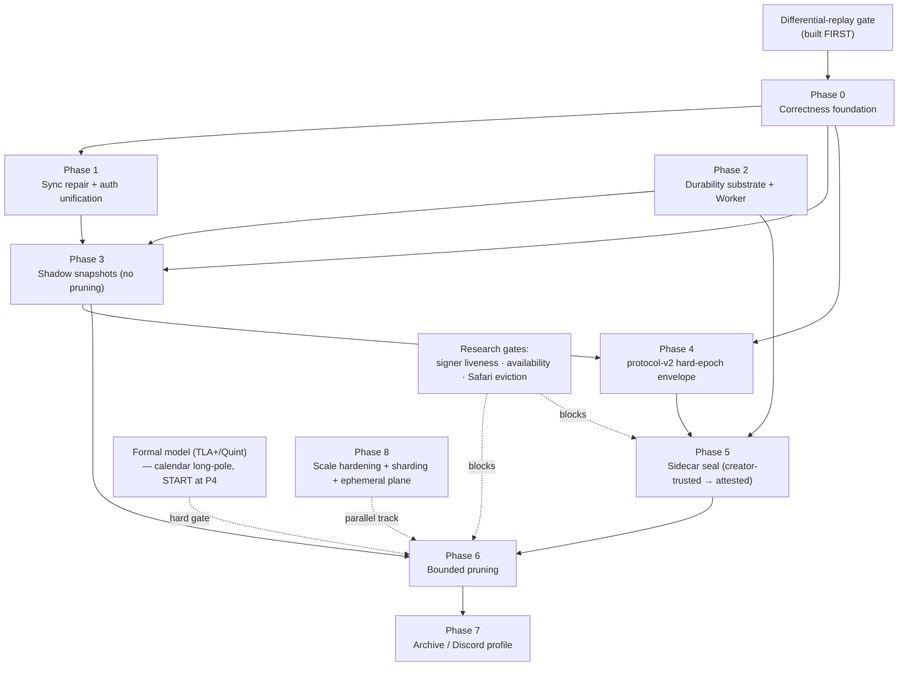

# ts-drp-1 Production Hardening — Phased TDD Implementation Plan

**Status:** synthesis / build plan
**Goal:** take `ts-drp-1` from research-grade signed operation-DAG to a production library capable of running an **MMORPG or a Discord-like chat at scale** (browser-first, serverless, hostile participants, churny NAT'd swarms).
**Baseline:** `bf7d3516` (`main`) — verified as exactly the AHE v4 review baseline (0 commits of drift), so every `file:line` citation below is current.

This document synthesizes six source documents (`deep-analysis-migration.md`, `compaction-hardening-plan.md`, `attested-hard-epochs-v4.md`, `ts-drp-repo-integration-plan.md`, `compaction-attested-epoch-cuts.md`, `ARCHITECTURE.md`) and a seven-agent adversarial review (3× Fable xhigh, 2× Codex-max, Grok red-team, Kimi phasing critic). Where the reviewers disagreed with the source docs, the code was re-checked directly; those corrections are folded in.

---

## 0. Executive summary

### 0.1 What ts-drp is today (verified)

A signed, programmable operation-DAG replicated state machine. Its expressive core — replicate *signed application commands* in a causal hashgraph and replay them through deterministic blueprint logic — is genuinely more powerful than Yjs/Automerge for auditable, ACL-gated, application-defined concurrency. But it is **not** a durable database and not production-ready as the sole backend for a long-running multiplayer app. The binding limitations, all confirmed against source:

| # | Limitation | Evidence |
|---|---|---|
| 1 | **O(history) sync.** Anti-entropy ships the full vertex-hash inventory; the responder does an `O(V_local·V_remote)` `find()` over a getter that re-materializes the whole vertex array on every hash. | `packages/node/src/operations.ts:44`; `packages/node/src/handlers.ts:336-345`; `packages/object/src/index.ts:161-163` |
| 2 | **Unbounded per-object memory.** Checkpoints prune only *state snapshots*; `vertices`, `forwardEdges`, `vertexDistances`, and one `FinalityState` per vertex grow forever. Store is a bare in-memory `Map`. | `drp-applier.ts:488-516`; `finality/index.ts`; `packages/node/src/store/object.ts:8` |
| 3 | **No certified snapshot adoption.** Joiners replay full signed history; `FETCH_STATE` snapshots cross the wire **unauthenticated**. | `packages/node/src/handlers.ts:144-176` |
| 4 | **Silent divergence risk.** Vertex hash omits `objectId`/protocol/epoch and does not commit to blueprint/runtime; `JSON.stringify` hashing is engine-order dependent; legacy DFS order is origin-sensitive. | `packages/utils/src/hash/index.ts:13-16`; `hashgraph/index.ts:274-332` |
| 5 | **Finality gates nothing.** Per-vertex BLS at a 0.51 threshold (not a BFT quorum), applied *after* state; `isFinalized` has no production callers. | `finality/index.ts:17,197`; `drp-applier.ts:124-140` |

### 0.2 Live vulnerabilities (exploitable at HEAD, independent of compaction)

These are not future risks; they are present-day defects and several must ship early regardless of the compaction schedule:

- **Cross-room ACL/history replay** — vertex hash omits `objectId` and node auth ignores the object, so a creator-signed ACL chain from room A replays verbatim into room B by the same creator, reconstructing an attacker-chosen signer set. (`utils/hash/index.ts:13-16` + `handlers.ts:614-651`)
- **`context` leak into snapshots is a convergence bug *today*** — `stateFromDRP` deep-clones every own key including replica-local `context` (whose `caller` is the last applying peer); a test already demonstrates `context.caller` propagating across replicas via merge. (`state.ts:184-193`; `drpobject.test.ts:482-521`)
- **Remote dynamic-dispatch DoS** — `drp[opType](...args)` with a wire-controlled method name, no ABI allowlist; any non-validation throw aborts the whole merge batch and is retried on every redelivery, wedging progress. (`drp-applier.ts:652-658, 213-215`)
- **`applyVertices` bypasses signature auth** — auth lives only in node network handlers; the public object merge path performs no signature check. (`object/src/index.ts:205-212`; `validation/src/vertex.ts`)
- **Wall-clock permanent invalidity** — `InvalidTimestampError` poisons a vertex hash into a bounded `knownInvalidVertexHashes` FIFO; the same vertex is invalid at `t`, valid at `t+Δ`, so replicas build *different* permanent invalid sets → different graphs. (`drp-applier.ts:229-231`; `validation/vertex.ts:37-43`)

### 0.3 Verdict on Attested Hard Epochs v4

**Adopt AHE v4 as the normative target specification for the compaction/checkpointing/snapshotting phase — but do NOT adopt it directly.** All seven reviewers converged on this independently.

AHE v4's core move is correct and strictly better than the earlier AEC v3.1 design it replaces: putting `objectId`/`protocolMajor`/`epoch`/`anchor` into every signed envelope makes staleness **objective from the envelope**, which converts an unbounded historical-membership problem into a bounded current-epoch problem — eliminating AEC's lifetime `O(history)` covered-hash set and its dependence on an unproven origin lemma. Its snapshot induction, sidecar seal, authority-handoff/data-cut separation, and archive segmentation are the right shapes.

It cannot be dropped in because:

1. **It is not code.** The reference implementation is standalone untyped JS under `docs/`, outside the pnpm workspace, never run in this repo's CI; its browser gates are self-reported **blocked**. Every §21/§22/§23 evidence claim must be **re-established in-repo** — treating them as inherited validation is the exact theater-test failure mode this project has hit before.
2. **It is not a complete protocol.** The seal **pacemaker/round-change is requirements-only** (the reference even rejects the `round-change` phase its own vote schema defines); it has no TLA+/Quint model; `round` is baked into the signed cut descriptor, so a locked value cannot be re-proposed across rounds without changing its digest (a retroactive-commit / permanent-stall hazard).
3. **Spec ↔ reference divergence.** Endianness (spec little-endian vs reference big-endian), hash framing (`U32` vs `U64` + magic prefix), and omitted preimage fields (`archiveIndexRoot`, `blueprintDigest`, `availabilityPolicyDigest`, `highestPrepareQC`) mean the "canonical" encoding is **undecided**. Cross-implementation digest reproducibility is currently unsubstantiated.
4. **It presupposes infrastructure the repo lacks.** Zero persistence, zero Worker infrastructure, synchronous `noble` hashing vs the reference's async WebCrypto, and no crash-injection harness.
5. **Stale rationale.** Its "avoid a BLS/WASM dependency" argument is wrong — `@chainsafe/bls` is already a production dependency of `@ts-drp/object` and `@ts-drp/keychain`. (Individual secp256k1 QC signatures are still the right *first* profile, for simplicity, not dependency avoidance.)

**Required amendments before adoption** (consolidated across reviewers):

- **A1.** Port to TypeScript inside the monorepo; keep the JS reference as a long-lived **differential conformance oracle** with shared golden vectors.
- **A2.** Freeze **one** canonical codec and a **normative field registry** reconciling every spec/reference preimage divergence, before any epoch code.
- **A3.** Separate a round-free **CutValue** from the consensus-round **SealProposal** so QCs certify `valueDigest` and locked values survive round changes; fully specify and **formally model** the pacemaker.
- **A4.** Ship **creator-trusted mode first** (most rooms are 2–10 members; attested `n≥4, q=⌈2n/3⌉` is unusable at genesis where one creator holds Admin+Finality). Trust profile must be UI-labeled.
- **A5.** Make the **admission-time antichain check mandatory** (the reference's optional `isAncestor` fails open → one poison vertex becomes a close-DoS).
- **A6.** Explicitly **deprecate** the per-vertex BLS `FinalityStore` for v2 rooms (seal QCs subsume it) — do not upgrade it into the cut protocol.
- **A7.** Specify a **creator-offline delegation/authority-handoff** policy — a proven repo scenario where, without early delegation, the dominant room type can *never* compact or migrate.
- **A8.** Add the repo integration layer the 93-line plan omits: proto schemas, sync correlation IDs, relay-limited-transport chunk fetch, and the FinalityStore disposition.

### 0.4 Scope beyond AHE v4

**Redefine the scale goal first.** The single most important framing correction from the red-team: **compaction bounds history *age*, it does not create a global multiplayer fabric.** A DRP object is one room/shard; "tens of thousands of concurrent peers in one `objectId`" is a category error that no amount of epoch machinery fixes. The acceptance criteria must be rewritten as *per-object ceilings* — `DRP object = room/shard with ≤ N writers, ≤ W ops/s, ≤ maxSnapshotBytes` — with the player-scale and real-time simulation explicitly out of scope for the durable plane. Shipping AHE and calling the stack "MMORPG-ready" without the ephemeral + sharding planes below is marketing, not capability.

Two structural requirements sit *outside* what AHE v4 addresses (AHE compacts a single object) and are load-bearing for the stated goal:

- **Ephemeral simulation plane.** A 30–60 Hz MMORPG must produce **zero durable DRP vertices** for transforms/inputs/aim. Durable DRP carries only low-frequency signed commands (place-block, claim-reward, commit-trade, grant-permission). This is a hard architectural rule, not an optimization.
- **Sharding plane.** Hard epochs bound the history of *one* object. Discord channels/guilds and MMORPG zones/entities need per-shard objects, authority domains, and explicit cross-object transfer protocols (sagas / reservation tokens). A single global DRP object is a non-goal.

And three **research-gated** unknowns block the destructive/attested phases (Grok red-team; see §12):

- **Signer liveness & the attester role.** AHE's own fallback ("the active epoch simply grows until a hard limit") *reintroduces the unbounded-history problem* whenever quorum churns — compaction liveness is coupled to exactly the resource (long-lived honest signers) a browser swarm cannot assume. Worse, browser tabs as the BFT signer set have a **negative incentive** (burn battery for closes that benefit latecomers) and get suspended by the OS. The signer role **must be separated from the player client** (e.g. designated always-on relay/mirror signers, untrusted-for-bytes but trusted-for-liveness), not assumed to be random tabs.
- **Mirror/archive availability & incentives** — signatures don't create availability; who stores 256 MiB snapshots and old segments, and why?
- **Safari/iOS IndexedDB eviction** — ITP evicts IndexedDB after ~7 days; an evicted durable-vote slot lets a returning signer **double-sign**, turning the anti-double-sign *safety* boundary into a *safety hole*.

---

## 1. Principles that govern the whole plan

1. **Compaction is a divergence amplifier.** The instant any peer adopts a snapshot instead of replaying, *any* nondeterminism in ordering, state adoption, or hashing becomes a **permanent silent fork**. Therefore the entire correctness foundation (§Phase 0) is a hard prerequisite for any snapshot-trusting feature. No exceptions.

2. **Classify every change: consensus-affecting vs replica-local-safe.**
   - *Replica-local-safe* (ship now, legacy namespace, narrow slices): sync `O(1)` lookup, local-write serialization, remote-op ABI allowlist, storage substrate, signature-auth unification.
   - *Consensus-affecting* (**v2 namespace only, never patch in place**): vertex preimage/`objectId`, Kahn linearization as the semantic order, ACL resolver group fix, MapDRP tie-break, timestamp/terminal-invalidity rules. Mixing old and new resolvers in one room version = silent permanent divergence.
   - *Coordinated-upgrade* (nominally local but changes observable post-merge state or wire format): `Object.assign` → replacement adoption, `context` exclusion. Test cross-version explicitly.

3. **The differential-replay gate is built FIRST.** Before rewriting any engine internals, stand up a gate that replays recorded histories through old vs new engine and asserts byte-identical state/ACL digests, with the documented contraction counterexample as a golden regression. *If this gate isn't built first, stop.* It is the only thing that makes rewriting the heart of the library provably safe.

4. **Every gate names its executable evidence artifact.** A model output, a crash-injection log, a browser-matrix run, a golden-vector file. Coverage claims must include the storage layer. No gate is "green" by assertion. Re-establish all AHE reference evidence in-repo — inherited numbers are not gates.

5. **Atomic vs sliceable is explicit per change.** *Atomic* (cannot split without breaking an invariant): vertex preimage/hash change; canonical-order switch; staged state-adoption semantics; seal-vote durability (a half-durable vote slot is *worse* than none — it enables double-signing); adoption pointer swap. *Thin vertical slices*: codec package, mutation queue, all of sync repair, storage components, shadow snapshots, pruning rollout, all of archive.

6. **Shadow before destructive.** Snapshots/cuts are produced, verified, and digest-compared across independent replicas + archival replay for a soak period (weeks, standing CI) **before anything is pruned**. Fleet-wide fold-digest agreement is a release metric.

7. **Extend the existing test muscle, don't start fresh.** Reuse `packages/test-utils/src/property-harness.ts` (seeded mulberry32 PRNG, manual shrinking, fake-timer virtual clock), the `linearize-reference.test.ts` independent-oracle pattern, the proptest convergence/partition suites, and the `failure-campaign` browser harness. Consider adopting `fast-check` for shrinking on the new gates. A gate that doesn't run in `pnpm test` will rot.

---

## 2. Target package topology

New/changed packages, respecting the verified dependency direction (`object` depends only on `logger`/`tracer`/`types`/`utils`/`validation`; `node` is the composition root; `object` never depends on `network`):

```text
packages/protocol-v2/       canonical codec, domain-separated hashing, v2 vertex/anchor/descriptor/vote/QC envelopes, field registry
packages/compaction/        close-set collection, Kahn order, fold, snapshots, history/archive Merkle roots  (below node, no network dep)
packages/storage-browser/   IndexedDB substrate: content-addressed chunks, staging journal, vote CAS, adoption pointer protocol
packages/seal/              sidecar consensus: votes, locks, pacemaker, QCs, authority handoff  (separate from FinalityStore)
packages/sync-v2/           object-head exchange, resumable content-addressed chunk fetch, bounded active-tail reconciliation
packages/worker-host/       Worker execution harness (encode/hash/Merkle/fold), bounded batches + cancellation
```

The legacy plane (`object` applier/pipeline, legacy hash/topic) keeps running unchanged; v2 rooms live on a separate topic/namespace. This converts a risky migration into an **additive parallel build** with a small signed-migration step at the end.

---

## 3. The phase graph



Phases 0–2 are largely parallel-safe and independently valuable. Phase 3 (shadow snapshots) is the first place AHE v4 lands. Phases 5/6 are gated by the formal model and the three research unknowns. The ephemeral plane (§Phase 8) and comparative benchmarks should stand up early enough to serve as regression gates for everything above them.

---

## GATE 0 — The differential-replay oracle (build first)

**Why:** makes every subsequent engine rewrite provably non-diverging.

**Slices & TDD:**
- **G-a.** History recorder: capture real vertex DAGs from the existing proptest/e2e suites into replayable fixtures (`objectId`, vertices, delivery permutations).
- **G-b.** Dual-engine harness: replay a fixture through the legacy engine and a candidate engine; assert byte-identical DRP-state digest, ACL-state digest, and linearization order.
- **G-c.** Golden counterexample: encode the documented contraction case (`deps: 0←root, 1←0, 2←1, 3←1, 4←{0,2}`) — note it is a *non-antichain* dep, so under the v2 antichain rule vertex 4 is rejected at admission; the gate must assert legacy-DFS-vs-Kahn divergence on the *tail* set exactly where expected, not a spurious mismatch.

**Exit gate (G0):** the oracle runs in `pnpm test`, reproduces the known divergence set exactly, and is wired as a required check for any PR touching `hashgraph`/`linearize`/`state`/`drp-applier`.

---

## Phase 0 — Correctness foundation

**Goal:** make replay deterministic, admission fail-closed, and state adoption replacement-correct — on the legacy plane where possible (several fix live bugs), in a new codec package where a preimage change is required. **Hard prerequisite for all snapshot work.**

> Ordering inside the phase: `0a codec/hash` → `0d Kahn order` (orders by vertex hash) and `0c classifier` (canonical-decode failure is a terminal class); `0b state adoption` → everything downstream.

### Slices

| Slice | Change | Consensus class | RED test → GREEN |
|---|---|---|---|
| **0a** | Frozen deterministic canonical codec (CBOR-profile) + domain-separated versioned hash, as a new initially-unused package. Reject (never normalize) non-canonical input. | new package | Golden vectors shared with the JS reference oracle; byte-mutation fuzz where every non-canonical encoding (−0, NaN, surrogates, dup keys, non-minimal ints, indefinite lengths) is **rejected**; byte-equality across map/set insertion orders. |
| **0b** | Replace all four `Object.assign` live-adoption sites with **delete-then-restore replacement**; exclude replica-local `context` (and future non-consensus fields) from `stateFromDRP` via an explicit field contract. *(Fixes a live convergence bug; touches the `FETCH_STATE` wire format → coordinated-upgrade.)* | coordinated | Op deletes a Map key / object prop on replica A, merged into B → must **not** resurrect on B's live instance; snapshot-bytes test asserts `context` never appears in serialized `DRPState` incl. `FetchStateResponse`; fault-injection: a failed fold leaves live state untouched. |
| **0c** | Single **fail-closed admission classifier** (`accept`/`pending`/`terminal`/`quarantine`) routing all three raw-dep triage sites; **remove wall-clock from the validity path** (Lamport time; non-semantic quarantine); eviction never creates a tombstone. | consensus (v2) / partial legacy fix | Fake-timers time-shift invariance (same vertex classifies identically at `t` and `t+Δ`); evict-then-retransmit classifies fresh; table-driven classification corpus. |
| **0d** | Deterministic **min-hash Kahn** canonical order with antichain enforcement (reject duplicate/missing/cyclic/causally-related direct deps); fail-closed on cycles/multiple roots/short output. | consensus (v2), atomic | Exhaustive all-DAGs ≤7 vertices (port the 5,231-DAG corpus into vitest) × delivery permutations → single order invariant to insertion/delivery/origin; divergences vs legacy match the counterexample set **exactly** (Gate 0). Target **origin-sensitivity**, not insertion-sensitivity (the latter is already mitigated by `forwardEdges.sort()` — a doc correction). |
| **0e** | Per-object **local mutation queue** + authenticated author sequence; defined same-author-fork policy. | slice | Two un-awaited concurrent async DRP calls (fake-timer pinned) yield a **chained** pair (second deps on first), never siblings or an identical-hash silent overwrite; randomized-interleaving property scenario. |
| **0f** | Blueprint/resolver exceptions classify **terminal**, never transient-rethrow; isolate per-vertex application so one poison vertex cannot discard unrelated vertices in a batch. | legacy fix | A validly-signed op whose method always throws is dropped after bounded handling and cannot wedge other vertices in the same `applyVertices` call or across redeliveries; malformed-arg fuzz → terminal not retry. |
| **0g** | Remote-op **ABI allowlist**: `callDRP` dispatches only own-prototype, non-`_`, non-`query_`, non-`resolveConflicts` blueprint-declared methods; unknown/forbidden `opType` is a typed terminal error. | legacy fix | Adversarial `opType ∈ {constructor, hasOwnProperty, __proto__, query_isAdmin, resolveConflicts, nonexistent}` → terminal without aborting the batch. |

### Exit gate (Phase 0)
Non-compacted rooms pass randomized-delivery-order **and** replay-from-snapshot equivalence tests; Gate 0 oracle green across the extended corpus; `context` provably absent from wire bytes; live-vuln regressions (cross-room replay surface via 0a, phantom delete via 0b, clock-skew via 0c, poison-batch via 0f/0g) all pass.

---

## Phase 1 — Sync repair & auth unification (parallel-safe)

**Goal:** kill the `O(V²)` sync cost and close the unauthenticated-merge surface, without a protocol change.

| Slice | Change | RED test → GREEN |
|---|---|---|
| **1a** | Responder builds a `Set`/`Map` of local hashes once (mirroring `updateHandler`'s existing Set) instead of getter-re-materialized linear `find()`. **Wire format unchanged.** Biggest perf-per-line in the repo. | Perf-contract (extend the RED `perf-contracts` pattern): sync compare over 50k–1M-vertex object completes within a fixed budget; instrumented probe/byte counters **flat** across 10k/100k/1M vertices. |
| **1b** | Heads-exchange sync with recursive missing-dep retrieval, per-peer shared-head tracking, chunking, backpressure, max-response caps. **Feature-flagged, per-connection negotiable.** (Full PRIBLT deferred to §Phase 8.) | Convergence under adversarial partition/rejoin with old-branch injection; byte cost proportional to the delta, not history size. |
| **1c** | Unify signature authentication into the `object`/`validation` layer so **all** ingest paths (incl. direct `object.merge()`) are authenticated, before chunk/snapshot/archive paths multiply the bypass surface. | Forged-vertex injection through every handler **and** direct merge → all rejected. |

### Exit gate (Phase 1)
`O(1)` lookup proven flat; heads-sync convergence green under partition schedules; zero unauthenticated ingest paths.

---

## Phase 2 — Durability substrate + Worker (blocks seal & pruning)

**Goal:** the IndexedDB and Worker infrastructure AHE §16 assumes but the repo has **zero** of. Seal safety is *defined* by durable one-vote CAS slots and staged-adoption pointer swaps — build the substrate before the protocol that depends on it.

> Build the crash-injection harness as its own slice with a **trivial payload** before the real snapshot pipeline exists. The harness is the hard part and gates Phases 3/5/6. Do not let the storage slice silently expand into the snapshot slice.

| Slice | Change | RED test → GREEN |
|---|---|---|
| **2a** | `packages/storage-browser`: content-addressed chunk store, staging journal, strict-durability metadata, staged-adoption pointer protocol (`ChunksStaged → ManifestStaged → Complete → PointerSwap → Cleanup`). Cleanup never part of commit. | **Kill-point matrix**: terminate the tab/Worker before *and after* every IndexedDB request in stage/adopt/cleanup; recovery is old-complete **XOR** new-complete, never mixed. Chrome + Firefox + WebKit via the public-infra config pattern. |
| **2b** | Durable **one-vote CAS** slots keyed `(objectId, epoch, round, phase, signerId)`; Web Locks advisory only, IDB uniqueness/CAS is the correctness boundary. | Two-tab concurrent conflicting-vote races with Web Locks on **and** off; CAS holds, returned bytes are the original; double-sign detection is loud. |
| **2c** | `packages/worker-host`: off-main-thread encode/hash/Merkle/fold with bounded batches + cancellation. (Pure-JS Merkle ≈740 ms/8192 leaves needs off-main-thread; WASM hash backend deferrable but the boundary must exist now.) | Frame-budget tests; mid-write Worker-kill recovery. |

### Exit gate (Phase 2)
Kill-point/multi-tab/quota/corrupt-chunk suites prove old-or-new atomicity on the real browser matrix; the browser matrix that AHE recorded as **blocked** is now executable and green for the substrate.

---

## Phase 3 — Shadow snapshots (AHE v4 lands here, no pruning)

**Goal:** the ultimate thin slice — full canonical snapshot pipeline, **zero trust, zero pruning**, full history retained, continuous digest comparison. This is where determinism bugs surface while rollback is still free.

| Slice | Change | RED test → GREEN |
|---|---|---|
| **3a** | Canonical snapshot export/import (app + ACL), schema-versioned, `blueprintDigest`-committed. Requires a **new versioned blueprint export API** (today export is a generic deep-clone with no `schemaVersion`). Import is **replacement** into isolated instances. | Snapshot induction `S_(e+1) = Fold(S_e, KahnOrder(C_e))` byte-identical vs archival replay. |
| **3b** | Content-addressed 128 KiB chunking, bounded manifest, resumable any-order fetch from untrusted mirrors; incremental/streaming verify (no full-payload concatenation of 256 MiB in memory). | Corrupt/withheld/substituted/reordered/oversized chunk injection → bad bytes **never** reach the active pointer; resume from arbitrary missing sets. |
| **3c** | **Shadow mode**: two independent replicas + archival replay continuously digest-compared as a standing CI gate. | ≥10⁴ randomized epochs (hostile delivery, partitions, tied timestamps) + exhaustive small-DAG corpus → **zero** digest mismatches; runs for weeks, not once. |

### Exit gate (Phase 3)
No digest mismatch across long randomized runs, engine vectors, and restart tests; snapshot/ACL digest equals independent archival replay on real browsers. **This soak is the primary gate before any destructive step.**

---

## Phase 4 — protocol-v2 hard-epoch envelope (atomic, new namespace)

**Goal:** the vertex identity change. Irreducibly **atomic** (dual preimages under one `objectId` are forbidden), but the **rollout** is sliced (new rooms only, legacy untouched, signed migration record). Start the **formal model (§Phase 5) now** — it is the calendar long-pole.

**Precondition freeze (before writing epoch code):** A2 codec + normative field registry reconciling every spec/reference divergence (`archiveIndexRoot`, `blueprintDigest`, `availabilityPolicyDigest`, `highestPrepareQC`, `round-change` phase, endianness, hash framing).

| Slice | Change | RED test → GREEN |
|---|---|---|
| **4a** | v2 vertex/anchor envelope: `{objectId, protocolMajor, epoch, anchor, author, logicalTime, sorted-unique-antichain deps, operation}` over the frozen codec, domain-separated. New object namespace + pubsub topic. | Cross-room, cross-epoch, cross-anchor, cross-protocol replay all **terminal**; legacy-interop test proves v2 traffic invisible to legacy rooms and vice-versa; golden vectors round-trip in TS + JS reference (G4.3 conformance). |
| **4b** | **Latched epoch ACL** (anchor ACL authorizes the whole epoch; ACL ops staged to next anchor; early-close trigger on moderation). **Must** land the ACL fixes here: admin **revocable**, resolver keys on `(peer, group)` not just peer — under latched authority a permanent un-revocable admin is an epoch-poisoning primitive. | Authorization-vs-arrival-order property tests; concurrent `grant(P,Writer)` vs `revoke(P,Finality)` both apply; compromised-admin removable via handoff. |
| **4c** | **Rebase outbox** (its own slice): original-author-only re-signing, idempotence by stable `clientOperationId`, per-operation policy (idempotent-rebase / transform / expire / manual-review). A replica MUST NOT re-sign another author's op. | Non-author replacement fails verification; duplicate rebase delivery applies once; per-blueprint metamorphic test: uninterrupted execution ≡ every cut/rebase placement. |
| **4d** | Exact **latched-ACL semantics** as pure functions: separately define envelope-admission authority, application-writer authority, ACL-operation authority + method preconditions, staged ACL mutation order, and `SignerSet_(e+1)` derivation. | Exhaustive grant/revoke/admin/key-rotation epoch-straddle tests; independent replay produces identical ACL bytes and signer sets. |
| **4e** | **Frontier aggregation / tip-set** at the SDK. Today each vertex's deps default to the *full frontier*; AHE caps `maxDependencies = 16`, so under concurrent load a naive "one vertex per keystroke with full frontier" would hit the cap and be **terminal-rejected** → silent write-failure storms. Reconcile with a tip-set / virtual-parent aggregation before enabling the cap. | W=64 concurrent writers: dependency fan-out always ≤ `maxDependencies`, no user-visible drop storms; op-batching coalesces multiple mutations into one signed change. |

### Exit gate (Phase 4)
Exhaustive small-graph model + adversarial schedule suite green **in repository code**; envelope-only staleness objectivity (≥10⁴ stale-envelope classifications under adversarial schedules); cross-implementation conformance vs the JS reference.

---

## Phase 5 — Sidecar seal (observation mode; creator-trusted first)

**Goal:** the consensus layer, as a **sidecar** (control-plane records, not DAG vertices — avoids the evidence-inside-the-cut recursion). Runs in **observation mode** (compute & compare cuts, do not act) until the formal model is green. **Ship creator-trusted before attested.**

> Cross-cutting decision, recorded before this phase: **deprecate** the per-vertex BLS `FinalityStore`/`ATTESTATION_UPDATE` gossip for v2 rooms (seal QCs subsume it). Do not run two attestation systems concurrently.

| Slice | Change | RED test → GREEN |
|---|---|---|
| **5a** | Separate a round-free **CutValue** (`valueDigest`) from the round-bearing **SealProposal** so locked values survive round changes (fixes the AHE round-in-descriptor stall/retroactive-commit hazard). | Retroactive-commit fork regression (the n=4 late-prepare-QC schedule) is **reproduced and rejected**; conflicting-commit-QC detection. |
| **5b** | Seal safety core over the Phase-2 CAS: value-bound prepare/commit votes, monotone `enteredRound`, lock + change-justification, QC validation against the anchor signer set, durable-**before**-gossip, verbatim re-broadcast after restart. | Crash-at-every-boundary double-vote tests over the real IDB vote CAS; quorum-intersection matrix n=4..10; forged/mixed QCs, duplicate signers, round rollback, lock amnesia all rejected. |
| **5c** | **Creator-trusted profile** (single/threshold authority signs the cut) — ships first, honest **UI trust labeling** (non-BFT). Exercises the whole snapshot/anchor/admission/storage stack with one signer. | Profile E2E incl. UI copy test; small-room cut end-to-end. |
| **5d** | **Attested profile** `q=⌈2n/3⌉, n≥4`, individual secp256k1 QCs (no BLS aggregation). Swaps the certificate producer without touching state semantics. | Quorum-pair intersection suite; adversarial n=4..10 schedules. |
| **5e** | **Pacemaker** fully specified: round-change message format + vote codec (currently rejected by the reference), timeout schedule, catch-up rules, leader rotation, round-change evidence. | (Gated by formal model below.) |
| **5f** | **Authority & weak-subjectivity**: handoff certificate (old-authority QC + new-signer PoP/acceptance), data-cut vs authority-cut separation (joiner cost ∝ governance changes, not messages), invite pinning (genesis + recent cut), conflicting-branch warning UX. | Conflicting-handoff equivocation detection; long-range/eclipsed join rejects stale-valid chains or visibly requires authorization; handoff-chain verification proportional to governance changes. |

### Hard gate before Phase 6 — Formal model (start at Phase 4)
**TLA+/Quint/Apalache** model of the complete pacemaker + locking + round-change + authority-handoff + crash-recovery, for n=4..7 with Byzantine equivocation, reorder/dup/loss, crash/restart. Prove **agreement, integrity, validity, no-retroactive-vote, and eventual commit after GST** under a fair honest leader. Export every counterexample trace as an executable vitest regression. This is a hard gate on enabling pruning — *not* an end-of-program checkbox. It is the calendar long-pole; if it starts late, Phase 6 slips (and must not ship on finite tests alone, which the spec itself says is insufficient).

---

## Phase 6 — Bounded pruning (gated)

**Goal:** finally bound memory. Capability-wise a thin slice; carries the heaviest gate. Enable **only after N consecutive shadow epochs with zero digest mismatches** and the formal model is green and the §12 research gates are resolved.

| Slice | Change | RED test → GREEN |
|---|---|---|
| **6a** | Enumerated-structure cleanup: prune closed-epoch `vertices`, `forwardEdges`, `frontier`, `vertexDistances`, causality caches, snapshots, checkpoints, finality state, pending indexes, sync inventories, rollback artifacts — **only after** verified commit QC + durable adoption + ≥2 rollback generations + availability policy satisfied + outbox fully categorized. | Archival-vs-compacted differential over ≥100 epochs; prune-consistency audit vs the reference model; raw-dependency audit instrumentation. |
| **6b** | Memory-slope gate. | Long multi-node property test: post-prune hot state bounded (< ~100 MB after 1M lifetime vertices); heap/disk slope flat after warmup across ≥32 epochs (extend `drpobject.memory.bench.ts` / `node.memory.bench.ts`). |
| **6c** | Verified monotonic adoption CAS: verify all bytes, QC, authority chain, descriptor continuity, snapshot, close set, history extension, blueprint, active graph **before** a one-step pointer CAS; reject rollback and non-identical same-epoch values. | Crash injection + competing old/same/future cut transactions always recover to exactly one complete monotonic anchor. |

### Exit gate (Phase 6)
Browser kill-before/after-every-IDB-request tests on Chrome, Firefox, Safari, iOS, Android; cold-join-from-untrusted-mirrors convergence; rollback integrity after forced mid-adoption failures; emergency-disable switch + rollback telemetry deployed.

---

## Phase 7 — Archive / Discord profile

**Goal:** for chat, the messages *are* the state — a snapshot alone can't remove them. Two-tier hot/cold. Very sliceable. (Profiles diverge here: MMORPGs mostly need Phases 0–6 since world state collapses small; Discord-likes need this phase.)

| Slice | Change | RED test → GREEN |
|---|---|---|
| **7a** | Append-only **RFC 9162** history commitment over committed vertex hashes in canonical order; inclusion + consistency proofs (a compact peer keeps root + O(log N) peaks). | Exhaustive small-N consistency/inclusion checks; `(oldSize,oldRoot)→(newSize,newRoot)` verifies via logarithmic proof and rejects a non-extending root. |
| **7b** | Immutable content-addressed **archive segments** under a Merkle archive index in the anchor; hot snapshot = recent window + edit/tombstone overlay + archive root; demand paging with inclusion proofs; attachment manifests. | Corrupt/missing/withheld/tampered segment → verification fails; cold-join of a 1M-message room downloads O(hot + recent window) (< ~10 MB + configured window), verified via network-byte accounting in the chat e2e. |
| **7c** | Availability policy (r-of-m replication, receipts, challenge/repair) + privacy/retention (per-segment encryption, key-erasure, deletion-UX honesty about cached ciphertext / prior recipients). | Randomized deletion/churn simulation retains ≥1 valid copy at target probability; certified key-erasure renders retained ciphertext unreadable to conforming clients; documented residual-risk statement. |

**Rule:** enable chat-history **deletion only after** availability + archive verification are green — a valid QC proves agreement on digests, not retrievability.

---

## Phase 8 — Scale hardening, sharding, ephemeral plane (parallel track)

Stand these up **early** as regression gates, even though full delivery trails the correctness phases.

| Slice | Change | Gate |
|---|---|---|
| **8a** | **Ephemeral simulation plane**: direct WebRTC/WebTransport/datagram channel for inputs/transforms/aim/presence/voice. **Zero durable DRP vertices** for per-frame data. | A 30–60 Hz simulation produces zero durable vertices for transforms/input frames; durable inventory/ownership commands remain auditable and conserved. |
| **8b** | **Sharding**: per-channel/guild (Discord) and per-zone/entity (MMORPG) objects; authority domains; cross-object transfer (sagas/reservation tokens/deterministic transfer). | Property/model tests conserve unique assets across retry, partition, shard migration, authority handoff; a join loads only relevant shard snapshots/tails. |
| **8c** | **Resource governance**: per-peer/per-object caps on vertex rate, dependency fan-out, argument size, pending bytes, sync-response size, decode work; pre-decode frame limits (repo currently accumulates unbounded length-prefixed frames); **per-peer invalid-vertex budget + disconnect** (the `knownInvalidVertexHashes` FIFO is bypassable by rotating >10k invalid hashes); account NOP/Dropped vertices toward epoch capacity so dropped spam still costs its author. Default hostile rooms to **permissioned** ACLs (the default `createPermissionlessACL` lets any Sybil key write). | Branch-spam (antichain width 128), oversized args, dependency-bomb, invalid-hash rotation, slow-peer stay within fixed CPU/RAM/queue budgets without quadratic blowup and don't starve an honest room; 100 Sybils cannot force an honest peer past X MB/min growth. |
| **8g** | **Connection & mesh topology budgets.** The libp2p host sets no `maxConnections`/`maxParallelDials` (`network/src/node.ts:516-518`); browsers choke at ~50–200 concurrent WebRTC peers, so a popular room can surface peers via discovery that the data plane cannot mesh. Introduce explicit sparse-mesh + designated-relay/mirror topology, connection budgets, and gossip-degree limits. | 1k online members, each browser ≤ C connections, join + write still works; discovery never surfaces more mesh peers than the budget. |
| **8h** | **Batched crypto verification pipeline.** Per-vertex secp256k1 recover + SHA-256 recompute + ACL check on the main thread stalls at Discord write rates. Coalesce application ops; verify in a Worker with a bounded crypto queue; reject oversize UPDATE batches before decode. (Reinforces the FinalityStore deprecation — per-vertex attestation gossip is O(writers×signers×degree) for finality that gates nothing.) | 60 fps main-thread budget on mid-tier Android while absorbing ≥200 signed vertices/s; no main-thread task > 50 ms. |
| **8d** | **Scale benchmark suite** with published numeric targets + environment disclosure; comparative Yjs/Automerge runs on the same semantic workload. | e.g. 32 writers, 100 durable ops/s, 1h session cold-join < 30 s and < 50 MB, p99 apply < 50 ms, browser heap < 512 MB; wired into `benchmark.yml`/`benchmark-memory.yml`. |
| **8e** | **Real-browser release matrix** (Chrome/Firefox/Safari/iOS/Android, private mode, multi-tab, quota exhaustion, Worker termination, tab suspension). Currently red/blocked. | All green before any default-on. |
| **8f** | **Blueprint determinism contract**: sync reducers, no ambient APIs (time/random/I-O/DOM/Promise), `blueprintDigest` mismatch fail-fast (converts silent forks into loud incompatibility). Interim for the deferred WASM VM. | Differential replay across Node/Chromium/Firefox/WebKit yields byte-identical state; time/random/network/Promise use fails closed; mismatched-blueprint peer rejected at admission. |

---

## 12. Research gates (block Phases 5d/6/7 — resolve via spikes, not slices)

These are design unknowns the source docs defer to "product decision." They are **not** implementation slices; sequence a spike to resolve each before committing to the phase it blocks.

1. **Signer liveness in a churny browser swarm.** AHE's degradation story is circular: losing the `q(n)` quorum stalls compaction and the active epoch grows unbounded — *the exact problem compaction exists to fix*. **Gate:** a swarm simulation with realistic tab-churn/session-length distributions showing bounded active-epoch size and joiner-sync cost under quorum loss; a property that the active graph never exceeds `maxEpochVertices` before a close or an explicit safe-degraded mode (e.g. designated always-on relay/mirror signers, or delegated signing).

2. **Mirror/archive availability & incentives.** Who stores snapshots/segments, and why? **Gate:** an r-of-m availability model where randomized deletion/churn retains ≥1 valid copy of every certified snapshot/segment at target probability; a documented operational owner. Free-rider risk is the crux of the rooms-as-archives use case.

3. **Safari/iOS IndexedDB eviction → double-sign.** ITP evicts IDB after ~7 days / under pressure; an evicted vote slot turns the anti-double-sign *safety* boundary into a *safety hole*. **Gate:** eviction-injection test (delete vote store, replay conflicting proposal) proving a signer cannot emit a second value for the same `(objectId,epoch,round,phase)`; persistent-storage acquisition verified across the browser matrix.

4. **Throughput ceiling on mobile.** Fold (~107 ms/4096) + digest (~138 ms) + Merkle (~740 ms/8192 leaves) per close, Node-x64 — multiples worse on a phone; "run it in a Worker" fixes responsiveness, not the ceiling. **Gate:** real-browser (Chrome/Android + Safari/iOS low-memory) Worker benchmark meeting a stated per-close wall-clock + main-thread-yield budget at target write rates, MMORPG and Discord separately.

5. **Creator-offline migration.** Migration needs a creator/current-authority signature, but creator-offline is a *supported, proven* scenario, and "current authority" is exploitable via cross-room replay until Phase 4 lands. **Gate:** migration must be creator-only or a pinned/threshold authority; an E2E migrating a permanently-creator-offline room into v2 via delegated/threshold authority.

6. **Live-fleet operations.** No decentralized kill-switch, telemetry, or version-skew story for a serverless swarm. **Gate:** a tested kill-switch propagation path + version-skew coexistence test between v(next) and legacy clients on the live topic + observable rollback telemetry in a multi-node harness.

---

## 13. What we cut or defer (explicitly off the critical path)

- **BLS aggregation for seal QCs** — individual secp256k1 QCs suffice for browser-sized signer sets; **deprecate** the existing per-vertex BLS finality layer rather than upgrading it.
- **Deterministic WASM/plugin blueprint VM** — deferred past the compaction program. Interim: the §8f determinism contract + lint + `blueprintDigest` fail-fast captures ~80% of the practical win (loud incompatibility instead of silent fork). Revisit only if arbitrary third-party blueprints become a first-class goal.
- **RIBLT/PRIBLT set reconciliation** — heads-exchange + bounded chunked diff suffices at ≤8192-vertex epochs; PRIBLT is a §Phase 8 optimization with a mandatory hash-list fallback, not a correctness prerequisite.
- **Full causality-structure replacement** (sparse ancestor indexes, interval labels) — hard epochs cap the dense `n²/8` bitset at ~8.4 MB per linearization at 8192 vertices; tolerable, deferrable.
- **Operation batching** — additive; Phase 8.
- **Sybil-resistant permissionless admission / economics**, **search indexes in consensus state**, **native mobile** (mobile browsers stay in the matrix), **cross-object sagas beyond the sharding primitives** — out of scope for the initial production target.
- **Retrofitting legacy objects** — signed migration record + new namespace only; never dual-accept old and new preimages under one `objectId`.

---

## 14. Doc-hygiene corrections to fold back into the source docs

Small but they matter under external review (reviewers judge rigor by exactly these):

- **"Insertion-order-sensitive DFS"** (in `deep-analysis`, `compaction-hardening-plan`, AHE §6.4/§7.1) is **partially stale** — `dfsTopologicalSortIterative` `.sort()`s forward-edge neighbors (`hashgraph/index.ts:318`). Origin-sensitivity, the contraction counterexample, and the shared-descendant double-scheduling quirk remain real; a RED test must target **origin-sensitivity**, not insertion, or it won't reproduce.
- **The AEC "contraction counterexample"** uses **non-antichain** deps (`{0,2}` with `0≺2`) — a config AEC v3.1's admission rule already rejects. It shows the origin lemma is *unproven*, not that AEC is *unsound*; `compaction-hardening-plan` presents it as a refutation. Low/rhetorical, but a credibility risk.
- **"Avoid a BLS/WASM dependency"** (AHE §2.2) is stale — `@chainsafe/bls ^8.1.0` is already a production dep of `object` and `keychain`. Keep the simplicity argument, drop the dependency-avoidance one.
- **`91.71%` coverage** (AHE §22) **excludes** `indexeddb-store.js` and `runtime.js` entirely — the crash-critical storage module has **zero** executed coverage.
- **AHE §19 benchmark numbers** disagree with the bundle's own `node-benchmark.json`; both are linux/x64 Node, not browser, yet get quoted as browser-relevant. Real-browser execution is recorded **blocked** — treat the whole browser matrix as currently red.
- **Chat E2E claim** overstated — `chat.pw.ts` proves a two-peer room over *local* fixtures, not public Nostr; no creator-offline chat test exists. Don't inherit "already proven."
- **Reference-implementation path** in AHE header (`implementation/src/`) ≠ actual (`ts-drp-ahe-review-bundle/reference-implementation/src/`); the reference materially diverges from the normative spec (endianness, hash framing, omitted fields, no round-change) — **regenerate it from the frozen schema**, don't treat it as a parallel source of truth.
- **Naming** is inconsistent across docs (AHE v4 / `protocolMajor=2` / `ts-drp/*/v2` / `packages/protocol-v2` / "v2/v4 rooms") — pick one protocol-major identifier everywhere.
- **Integration-plan migration authorization** ("legacy creator OR current authority") is unsafe while current authority is replay-influenceable — default to **creator-only or an externally pinned quorum**.

---

## 15. Sequencing at a glance

1. **Gate 0** (differential-replay oracle) — first, always.
2. **Phase 0** (0a→0d/0c, then 0b/0e/0f/0g) — correctness foundation; ships live-bug fixes.
3. **Phase 1** (1a immediately; 1b/1c) — sync repair + auth, parallel-safe.
4. **Phase 2** (2a crash harness first with trivial payload; 2b/2c) — durability + Worker.
5. **Phase 3** (3a→3b→3c) — shadow snapshots; **AHE v4 lands here**; soak for weeks.
6. **Phase 4** (4a atomic; 4b/4c/4d) — protocol-v2 envelope; **start the formal model now**.
7. **Phase 5** (5a→5b→5c creator-trusted; 5d attested; 5e/5f) — sidecar seal, observation mode.
8. **Formal model** green — hard gate.
9. **Research gates §12** resolved — hard gate.
10. **Phase 6** — bounded pruning; heaviest browser-matrix gate.
11. **Phase 7** — archive/Discord profile.
12. **Phase 8** — ephemeral plane + sharding + scale/benchmarks/browser-matrix (stand up early as regression gates).

Each of Gate 0 and Phases 0–2 is independently valuable even if AHE v4 is later revised. Nothing prunes until the origin-lemma/Kahn suite, the transition crash-injection, the formal seal model, and the three research gates are all green.
